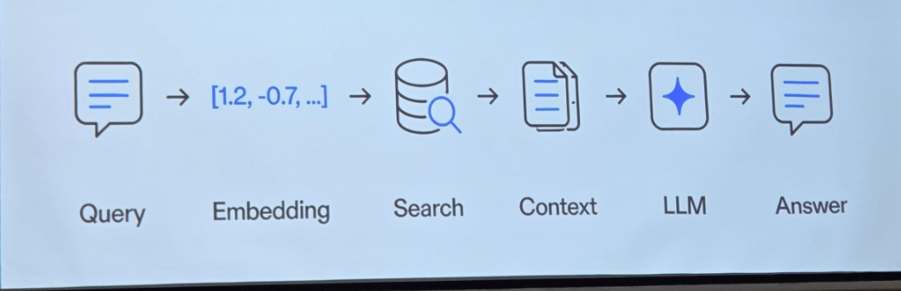
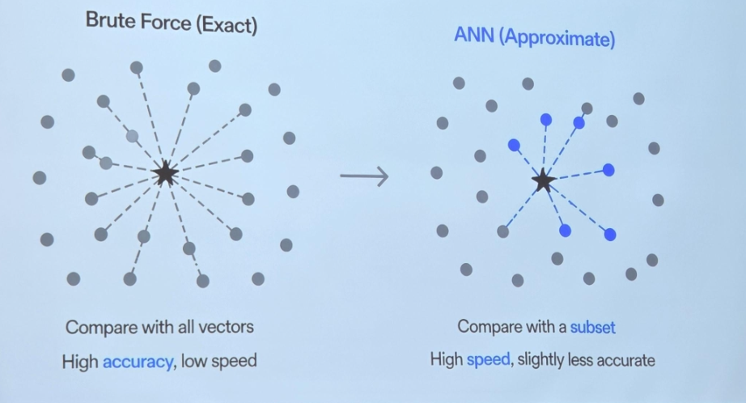
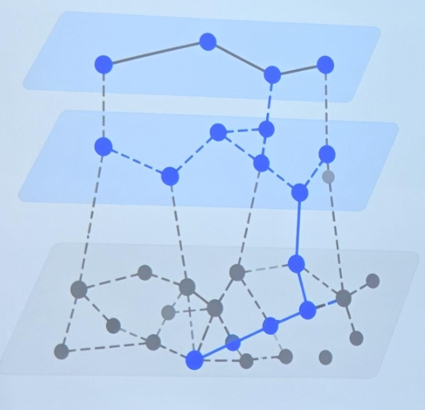
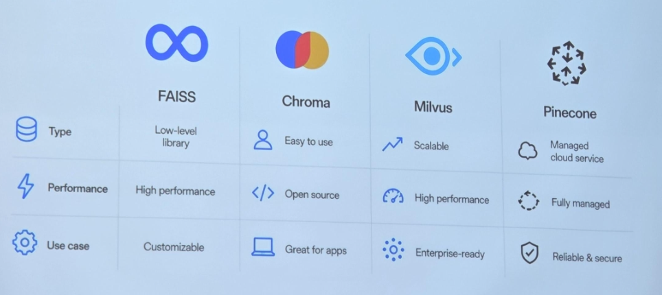
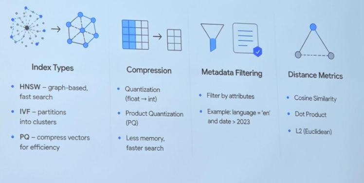
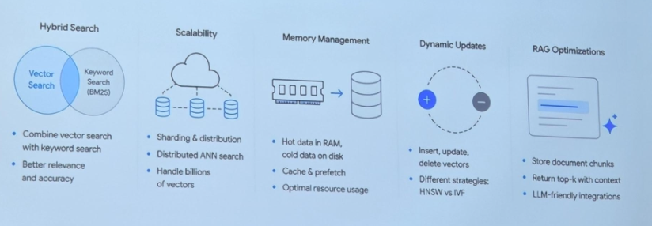

# Лекция 10

Vector Databases and RAG (how we search meaning, not just words)

We search wrong (traditional search = string matching)

cats != felines

We need meaning

Text -> Vector (we convert text into numbers)

Meaning -> Geometry (similar meaning = close vectors)

Find nearest neighbors

Can SQL do this?

No index (B-tree doesn't work)

ANN (Approximate Nearest Neighbor)

RAG: how it works

ANN vs Brute Force

HNSW: Graph Search

1. Start at the top layer
2. Move to the nearest neighbors
3. Go down a layer
4. Repeat until bottow layer
5. Return best neighbors

Vector DB Systems

Vector DB Features (more than just nearest neighbor search)

Advanced Capabilities (powerful features for real-world applications)

We search meaning (from keywords to understanding)