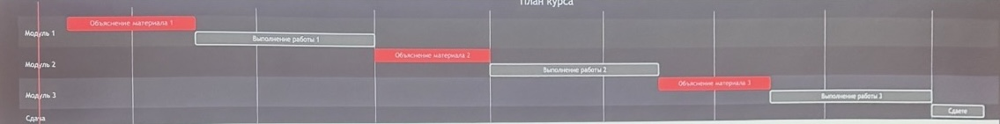
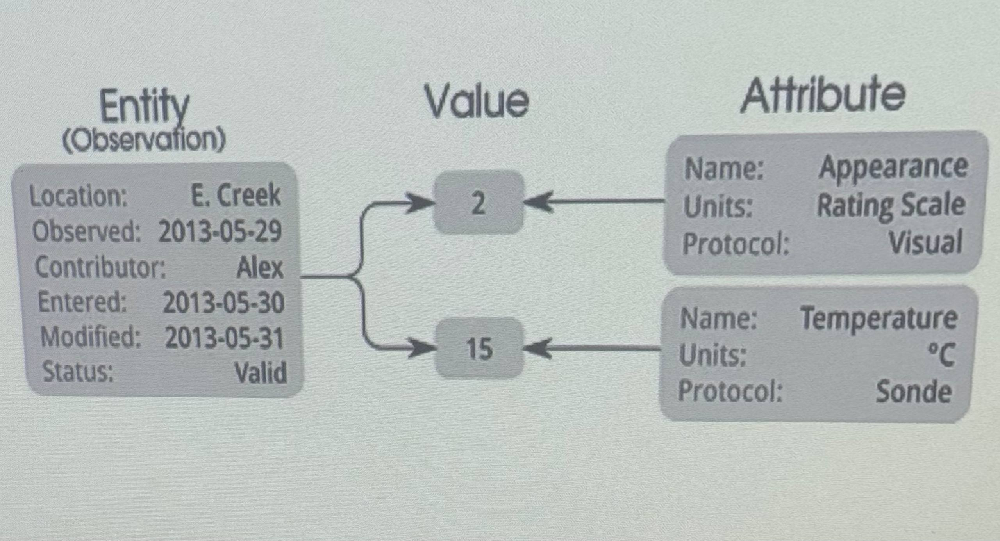
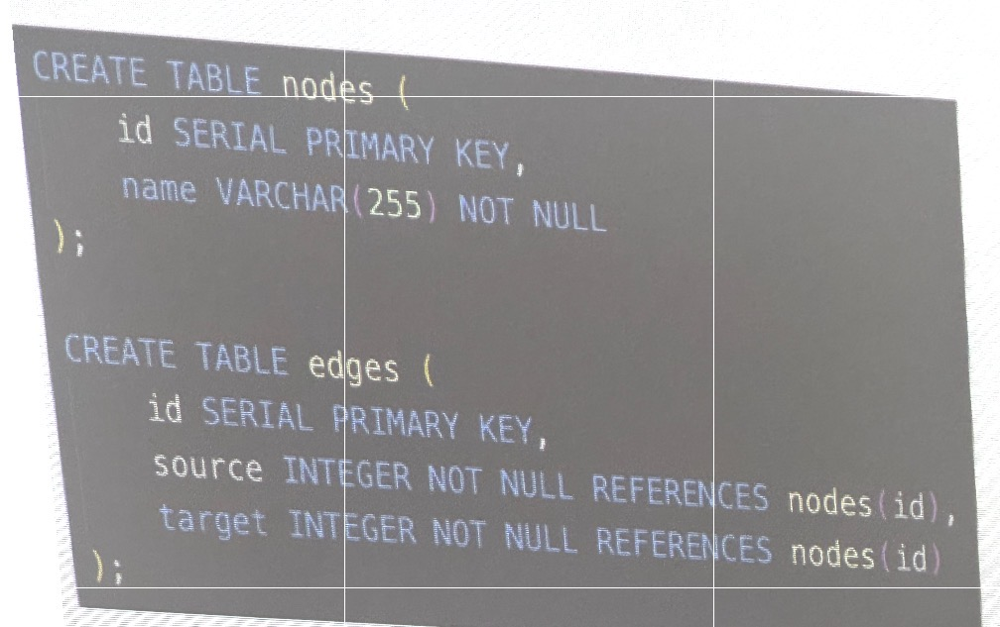
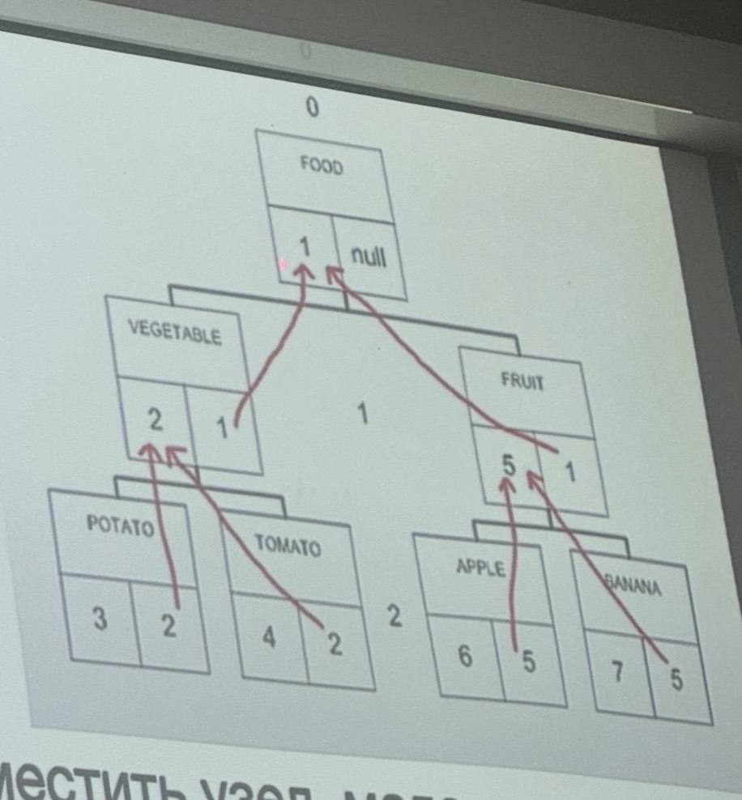
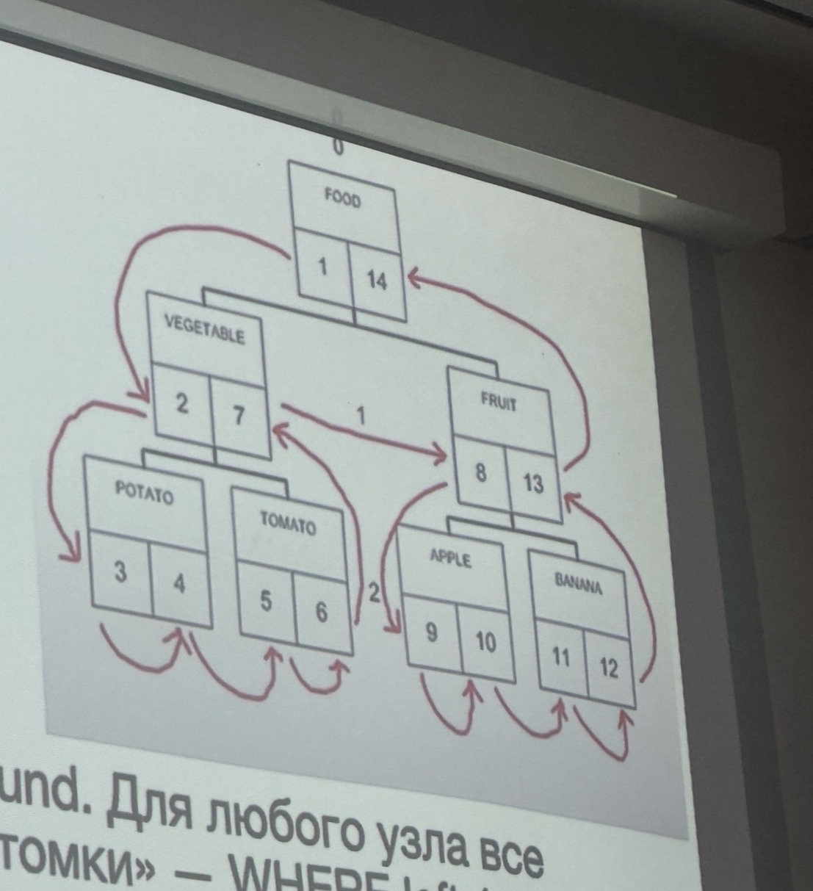
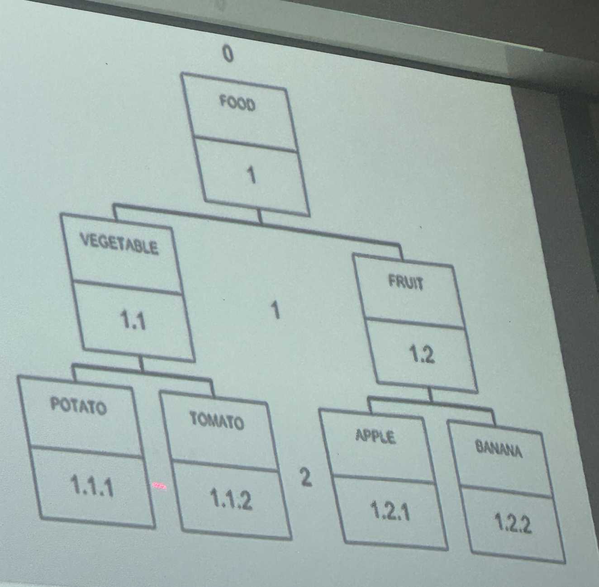

# Лекция 1

## Введение

#### План на курс
- В основе всего курса лежит реляционная СУБД postgreSQL
- Так же разберем другие СУБД, реализующие другие модели данных и их применимость
- Контейнеризация - учимся разворачивать и сопровождать СУБД

#### Ценности
- Курс строится на практической применимости знаний
- Лекция связаны с практиками
- Мы даем лабораторную только после того, как дадим теоретический материал
- Исповедуем Agile-методологию. Курс видоизменяется из года в год. Процессы меняются, дедлайны двигаются. Информация поступает в течении курса.
  
#### Диаграмма Ганта

## Правила игры
#### Практики
- Защита всего проекта целиком
- Проект состоит по предварительным данным из 6 основных этапов
- Этапы взаимосвязаны друг с другом, делаются последовательно
- Баллов нет (Есть три состояния: не сдал, есть правки, сдал)
- Просрок дедлайна — не можете получить оценку выше тройки

#### Проект 
- Этап 1. Подготовка и проектирование
- Этап 2. Развертывание
- Этап 3. Эскплуатация и мониторинг

#### Оценивание
- Выполнение проекта в течении семестра дает оценку 3
- Для 4 и 5 требуется посещение экзамена (заранее дается задание и к экзамену нужно его сделать + могут спросить всё, что было в третьем семестре)

## Подготовка к проектированию

#### Init 
- Бизнес-документация (Бизнес-требования, Vision Document)
- Техническая документация (Спецификация требований)
- Диаграммы и модели
- Схема БД

## Подготовка к проектированию

#### Функциональные требования

- Мост между заказчиком и разработчиком
- Позволяет четко и понятно описать цели и задачу
- Описывают поведение системы
- Должны быть проверяемы (можно однозначно понять, выполнено требование или нет)
- То, что влияет на схему БД (сущности, связи, атрибуты), важно фиксировать в ФТ

#### Пример
- Система должна позволять пользователю зарегистрироваться, указав адрес электронной почты (или номер телефона), имя пользователя и пароль.
- При регистрации должна осуществляться валидация введённых данных и отправка подтверждения (например, email с подтверждением).
- Пользователь должен иметь возможность просматривать и редактировать свой профиль: ... (не функциональное требование, так как не влияет на схему БД)
- Пользователь может подписываться на других пользователей и видеть список своих подписок и подписчиков.
  
## Проектирование

#### Концептуальный уровень

- Выделение сущностей
- Какие у них свойства
- Определение связей
- Чаще всего отображается в нотации Чена

(Обычно делают на бумажке или в PlantUML)

#### Логическое проектирование
- Преобразование ER-модели в реляционную схему
- Нормализация
- Выбор первичных ключей, определение внешних ключей и ограничений целостности
- Уточнение типов данных, допустимых значений, уникальности

## Диаграмма

#### Физический уровень

## Нейминг

- Стиль: snake_case везде.
- Таблицы - во множественном числе: books, readers, loans.
- Столбцы - в единственном числе: title, name, created at.
- РК: название_таблицы_id: book_ id, reader_id.
- FK: то же имя, что у РК целевой таблицы: book_id, reader _id в других таблицах.

## Паттерны

#### Много-ко-многим

- Вводится связующая таблица (junction / association table)
- Содержит два внешних ключа: на A и на B
- При необходимости — дополнительные атрибуты связи (даты, роль, количество и т. п.)
  
1. Нет дублирования кода
2. Удобно хранить атрибуты связи
3. Проще запросы и ограничения
4. Масштабируемость

#### Вертикальное разделение

- Производительность
- Безопасность
- Разделение по частоте изменения

#### Фиксированный набор значений
Понятно как ограничить и хранить в БД:

- Включен/Выключен
- Удален/Не удален
- Мужской/Женский
- Вылет/Прилет
  
Непонятно как ограничить и хранить в БД:

- Дни недели 
- Месяцы года
- Статусы объекта
- Школьные оценки
  
## Фиксированный набор значений

#### Решения

- Ограничение на уровне кода
- Условные обозначения
- Перечисления
- Ограничения
- Триггер
- Справочник

#### Ограничение на уровне кода

- Изменение списка значений — правки в коде и деплой, без миграции в БД
- Дублирование правил, если приложений несколько (разные языки/сервисы)
- При расхождении кода и БД возможны некорректные данные

#### Условные обозначения 
- Договорённости в документации «статус: 0 — черновик, 1 — опубликован», коды, буквенные обозначения
- Очень просто внедрить, не трогая схему и код
- БД не проверяет значения – легко внести ошибочный код
- Нет единого источника правды

#### Перечисления
Отдельный тип в СУБД с фиксированным списком значений (в PostgreSQL - CREATE TYPE status_enum AS ENUM ('draft, published)).
- Один столбец, понятный тип в схеме.
- Запросы и индексы работают как с обычным столбцом.
- Добавление/удаление значения - миграция (ALTER TYPE)
- Порядок и список значений зашиты в схему, сложнее менять со временем.
- Не во всех СУБД есть полноценный ENUM (например, в SQLite нет).

#### Ограничения
- Ограничение на таблицу: CHECK (status IN (draft", published")) или CHECK(amount > 0)
- Проверка в БД, защита от любых клиентов.
- Можно задать сложные условия (диапазоны, выражения, несколько столбцов).
- Изменить список - миграция с ALTER TABLE
- Длинный список в СНЕСК неудобен: IN ('a','b', 'c', ...)
- Нельзя хранить описание, порядок, атрибуты.
- Условие дублируется, если один и тот же набор нужен в нескольких таблицах.

#### Триггер
- Процедура в БД, выполняемая до или после INSERT/UPDATE, где проверяются поля (например, что значение из допустимого списка).
- Любая сложная логика: кросс-табличные проверки, каскады, расчёты.
- Одна точка проверки для всех операций с таблицей.
- Можно подставлять значения, логировать.
- Сложнее писать и отлаживать; логика «спрятана» в БД.
- Выполняется при каждой изменённой строке.
- Не все разработчики смотрят триггеры при изменении таблицы.
- Перенос на другую СУБД сложнее.

#### Справочник
- Таблица допустимых значений, в рабочих таблицах - внешний ключ на эту таблицу
- Нормализованная модель; один источник правды для набора значений. 
- Удобно добавлять атрибуты: название, описание, порядок, флаги.
- Добавление нового значения - INSERT, без смены типа или CHECK.
- Целостность через FK: нельзя сослаться на несуществующее значение.
- Каждый запрос требует JOIN.
- Справочники можно менять разными способами, поэтому нужно продумать, кто и как меняет справочник (миграции, админка, seed).

## Паттерны

#### EAV (Entity-Attribute-Value)
- Предназначен для моделирования объектов, обладающих большим количеством потенциальных атрибутов, из которых лишь небольшая часть применяется к каждому объекту

- Entity (Сущность): уникальный идентификатор объекта (ID продукта).
- Attribute (Атрибут): имя или тип свойства объекта («цвет», «вес», «рост»).
- Value (Значение): конкретное значение данного атрибута для объекта (например, «красный», «5 кг», «180 см»).
  
#### EAV (Entity-Attribute-Value)
- ЕАV позволяет хранить данные динамически изменяемой структурой, когда новые атрибуты могут добавляться без необходимости изменения структуры таблицы.
- Если у большинства объектов имеется лишь небольшое подмножество возможных атрибутов, использование EAV помогает избежать множества пустых столбцов в таблице.
- В системах, где свойства объектов часто изменяются (например, медицинские системы, каталоги продуктов с различными характеристиками), EAV позволяет легко адаптироваться к новым требованиям.
  
#### EAV (Entity-Attribute-Value)
- Для получения полного набора атрибутов одного объекта часто требуется сведение множества строк в одну запись, что усложняет SQL-запросы.
- Проблемы с производительностью
- Все значения хранятся в одном столбце, что может затруднять валидацию и обработку данных на уровне базы.
- Реализовать ограничения и проверки целостности данных сложнее, чем в традиционных реляционных моделях с фиксированными столбцами.

#### Граф

## Apache AGE (Graph Extension for PostgreSQL)

- Вершины (nodes) и ребра (edges) в графах внутри той же БД
- Запросы на Cypher внутри SQL: SELECT * FROM cypher('graph_name', $$…$$)
- Обход графа, пути, фильтрация по свойствам.
- Данные графа хранятся в обычных таблицах PostgreSQL, можно совмещать с обычным SQL и JOIN.

## Паттерны

#### Полиморфные связи

#### Полиморфные связи

- Одна ассоциация - несколько типов сущностей
- В БД: parent_type + parent_id;
- Нет FK, сложные запросы, риск «сирот» и мусора в данных.
- отдельная таблица связи на каждый тип или общая таблица «родителей».
- JOIN по разным таблицам в зависимости от parent type (CASE + несколько LEFT JOIN).
- Индексы и разбор планов сложнее

## Полиморфные связи

#### Усилить контроль
- В приложении: строгая валидация при создании/обновлении; удаление родителя только через код, который заодно чистит комментарии
- триггеры или периодические скрипты на поиск «сирот».
- составной индекс (commentable_type, commentable_id) для выборки «все комментарии к этому посту».

#### Отдельная таблица связи на каждый тип родителя

- Настоящие FK - целостность, каскады, нельзя оставить «сироту».
- Простые запросы. JOIN по одной таблице.
- Удобные индексы.
- Классическая реляционная модель.
- Больше таблиц.
- ыОбщие запросы («все комментарии пользователя ко всему») - UNION по нескольким таблицам.

## Паттерны

#### Список смежных вершин

Нужно знать кол-во уровней
• Легко вносить изменения
• Плюсы: простая схема, легко добавить/переместить узел, мало изменений при обновлении.
• Рекурсивный запрос. На больших глубинах может быть тяжело.

#### Nested set

	◦	Удобно читать любого объема
	◦	тяжело подвергать изменениям
	◦	Схема: у каждого узла два числа — left_ bound и right _bound. Для любого узла все потомки имеют bounds внутри его диапазона; обход «потомки» - WHERE left _bound
> N AND right_bound < M.
	◦	без рекурсии - сравнение границ.
	◦	вставка/удаление/перемещение узла требует пересчёта границ у многих строк - сложно и тяжело при частых изменениях.
	◦	Использовать когда дерево почти не меняется, зато часто нужны запросы по поддеревьям.

#### Materialized path

Сложно добавлять в середину дерева
POTATO
• WHERE path LIKE '/1/3/%'; один запрос без рекурсии.
1.1.2
• При переносе поддерева нужно обновлять path у всех потомков; длина пути ограничена; выбор разделителя и формата.
• Использовать когда часто нужны выборки «все предки/потомки», дерево больше читают, чем меняют.

#### JSON

Атрибуты с переменным набором: товарные опции, теги, метаданные.
Конфиг, настройки: одна запись - один JSON-объект.
События, логи: каждое событие - документ со своей структурой.
Кэш ответа АРІ сохранёный отет вешнего сервиса.
Временные/редко запрашиваемые данные: черновики, доп. поля без жёсткой схемы.

#### Звезда

• Схема «звезда» - модель данных для аналитики и хранилищ (DWH): в центре таблица фактов, вокруг неё таблицы измерений
• Таблица фактов: события или измеримые показатели (продажи, клики, заказы). Содержит меры (числа для агрегации: сумма, количество) и внешние ключи на измерения (дата, товар, магазин, клиент и т.д.).
• Таблицы измерений: Атрибуты описательные (название, категория, иерархия).