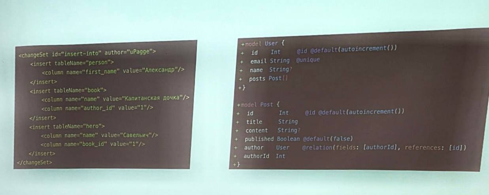

# Лекция 2

## Миграции

### Определение 

- Миграции описывают последовательность изменений, которые необходимо применить к базе данных. Эти изменения могут включать создание новых таблиц, изменение существующих, добавление или удаление столбцов, создание индексов, изменение ограничений и т. д.

### Проблема 

- Как синхронизировать структуру базы данных (схему) на всех окружениях (у разработчика, на тестовом сервере, на продакшене)?

### Принципы

- Контроль версий   
- Неизменяемость
- Идемпотентность

### Идемпотентность

- Это подход к обновлению схемы базы данных, при котором каждый миграционный скрипт можно безопасно выполнить несколько раз, и повторное применение не приводит к ошибкам или нежелательным изменениям
- CREATE IF NOT EXISTS
- ALTER TABLE users ADD COLUMN IF NOT EXISTS email VARCHAR(100);

### Инкрементальные изменения

- 00001.sql 00002.sql 00003.sql
- Можно еще использовать семантическое версионирование
- 1.1.1.sql 1.1.2.sql

### Timestamp

- Один из распространённых подходов — использовать формат YYYYMDDHHMMSS_desription.sql

### Rollback

- Помимо применения изменений, система миграций должна предоставлять возможность отката — возвращения базы данных в прежнее состояние, если новое изменение привело к ошибкам или нежелательному поведению

#### Пример

- 0001.up.sql
- Описывает изменения, которые нужно применить для обновления схемы базы данных
- 0001.down.sql
- Содержит команды для отката изменений, внесённых up-скриптом, то есть возвращает базу данных в предыдущее состояние

### Является стандартом

- Является стандартом, используется в golang-migrate, Flyaway, Laravel Migrations или Entity Framework Core
- Зачем это нужно: это дает разработчикам чувство контроля и безопасности. Считается, что если новая миграция "сломает" базу данных, всегда можно будет выполнить down-скрипт и вернуть все "как было".

### Проблемы Down

- Откат изменений часто означает потерю данных
- Скрипты часто пишутся не корректными
- Конфликт с парадигмой GitOps

### Backward-Compatible

- Обратно-совместимые изменения схемы базы данных — это такие изменения, которые позволяют старой версии приложения продолжать корректно работать с новой схемой, а новой версии — со старой.
- Zero-downtime deployments
- Простота отката
- Упрощение миграционного процесса

### Добавление новой таблицы или столбца

- Старый код просто не использует новые объекты
- СУБД должна допускать NULL или иметь значение по умолчанию

### С данными

- В Postgres версий 10 и более ранних добавление новой колонки со значением по умолчанию приводило к полной перезаписи таблицы
- Это было чрезвычайно затратной операцией. На время перезаписи таблица блокировалась эксклюзивной блокировкой.
- Для большой таблицы это часы простоя сервиса.
- В 11 версии в системный каталог pg_attribute были добавлены два новых поля: atthasmissing и attmissingval.

### Добавление ограничения NOT NULL

- Если в таблице уже есть строки с NULL, это сломает базу
- Заполнить отсутствующие значения в старый строках (фоновая миграция или разовое обновление)
- Убедиться, что новое приложение всегда пишет значение
- Только после этого наложить ограничение NOT NULL

### Переименовывание столбца / Изменение типа столбца

- Добавить новый столбец
- Настроить приложение так, чтобы оно писало одновременно в старый и новый столбец, а читало пока из старого
- Заполнить новый столбец для старых строк на основе старого столбца (одноразовая миграция)
- Переключить чтение на новый столбец в новой версии приложения
- Удалить код, работающий со старым столбцом
- Удалить старый столбец

### Удаление столбца

- Сначала перестать использовать столбец в коде, только потом удалить его из схемы

### Разделение / Объединение таблиц

- Создаём новые таблицы с нужной структурой.
- Создаём представление, которое полностью повторяет структуру старой таблицы, но получает данные путем JOIN новых таблиц.
- Запускаем процесс, который копирует все существующие строки в новые таблицы.
- Обновляем код приложения до версии, которая пишет данные одновременно в обе структуры.
- Переключение чтения.
- Отказ от двойной записи и очистка.

### Декларативные подходы 

- Вы описываете какой должна быть схема, а инструмент сам вычисляет разницу (diff) между текущим состоянием базы и желаемым, после чего генерирует и выполняет необходимые DDL-команды.

#### Особенности

- Простота и скорость
- Меньше ошибок
- Сложность с миграцией данных 
- Учить DSL (Domain-Specific Language)

### Служебные таблицы миграций

- Они записывают каждое изменение, гарантируют, что одна и та же миграция не выполнится дважды, и позволяют инструменту понимать текущее состояние базы данных.
- DATABASECHANGELOG (идентификаторы, контрольная сумма, время, порядок, метаданные, результат), DATABASECHANGELOGLOCK.
- flyaway_schema_history (номер версии миграции, имя скрипта, контрольная сумма и время выполнения)

### Небезопасные операции

- Это изменения схемы или данных, которые могут привести к downtime, потере данных, повреждению данных или нарушению работы приложения во время или после применения миграции.
- В контексте реляционных баз данных такие операции обычно связаны с блокировками таблиц, перезаписью больших объёмов данных или несовместимостью с работающим кодом.

### Изменения типа колонки (ALTER COLUMN TYPE)

- Операция, требующая полной перезаписи таблицы. На время её выполнения таблица блокируется для чтения и записи.
- Безопасно делать как мы разбирали раньше.
- Некоторые изменения типы безопасны и не требуют перезаписи. Например, увеличение лимита у VARCHAR или изменение TIMESTAMP на TIMESTAMPTZ в PostgreSQL 12+

### Удаление колонки (DROP COLUMN)

- Большинство ORM (Object-Relational Mapping) кеширует структуру таблиц. Если ваше приложение все еще пытается использовать удаленную колонку (потому что старый код еще работает или кеш не обновился), оно упадёт с ошибкой.

### Добавление индекса

- Обычное создание индекса блокирует таблицу на запись на всё время своего выполнения.
- Используйте CREATE INDEX CONCURRENTLY. Это создаёт индекс в фоновом режиме, не блокируя операции записи. Он дольше работает и потребляет больше ресурсов. Его нельзя выполнить внутри транзакции. В случае неудачи он оставляет после себя невалидный индекс, который нужно удалить.
- В PostgreSQL 14.0-14.3 был баг и CONCURRENTLY могло привести в тихому повреждению данных. Нужно обновлять до 14.4+

### Добавление ограничения внешнего ключа

- При добавлении внешнего ключа PostgreSQL должен проверить, что все существующие данные удовлетворяют этому правилу. Эта проверка блокирует таблицу на запись.
- Для этого стоит разбить операцию на два этапа. Добавить ограничение, но не проверять существующие данные: ALTER TABLE ... ADD CONSTRAINT ... FOREIGN KEY ... NOT VALID; Затем, в отдельной транзакции, запустить проверку существующих данных: ALTER TABLE ... VALIDATE CONSTRAINT ...; Эта проверка не блокирует запись.
- С добавлением ограничения проверки (CHECK CONSTRAINT) аналогично.

### Backfilling

- Есл и делать это в той же миграции, что и изменение схемы, вы продлите блокировку таблицы на всё время обновления.
- Одиночная команда UPDATE для миллионов строк создаст огромную нагрузку.
- Всегда выполняйте обновление в отдельной миграции, обязательно вне транзакции и батчами.

### Миграция данных

- Процесс преобразования и переноса существующих данных из одной структуры в другую в рамках изменения схемы базы данных.
- Она выполняется для того, чтобы привести хранящуюся информацию в соответствие с новой моделью данных без потери целостности и доступности сервиса.
  - В одной транзакции
  - Пакетная обработка 
  - Фоновая миграция
  - Expand — добавить новые структуры, не трогая старые 
  - Migrate — постепенно перенести данные (в фоне).
  - Contract — переключить приложение на новые структуры и удалить старые

### ETL-инструменты 

- Это процесс, который автоматизирует сбор данных их множества разрозненных источников, их очистку и приведение к единому формату, а затем загрузку в целевую систему, чаще всего в хранилище данных (DWH) или Data Lake.

#### Этапы

- Extract (Извлечение): забираем из разных источников: базы данных (SQL, NoSQL), CRM-системы (например, 1С), файлы (Excel, CSV), API и т. д. 
- Transform (Преобразование): на этом этапе данные очищаются от дубликатов, приводятся к единому формату, обогащаются и структурируются для анализа.
- Load (Загрузка): загружаем в единое хранилище (например, DWH), откуда её могут использовать аналитики и BI-системы для построения отчетов и поиска инсайтов. 

#### Инструменты

- Apache NiFi
- Pentaho Data Integration (Kettle)
- Apache Airflow