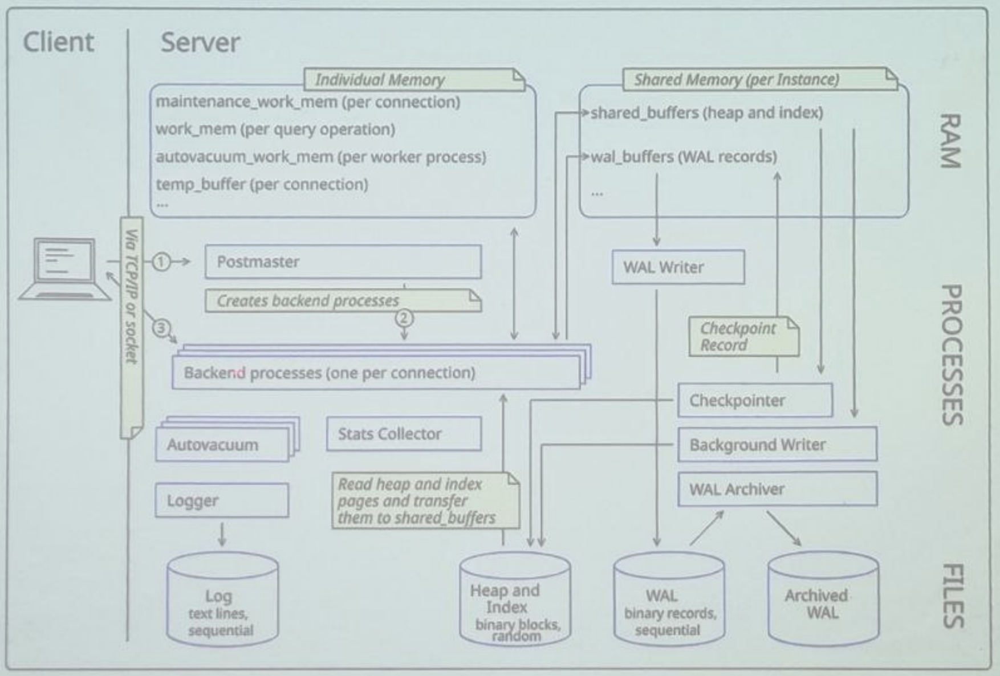
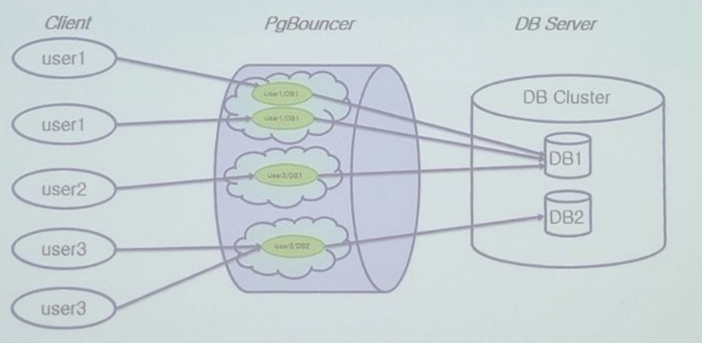
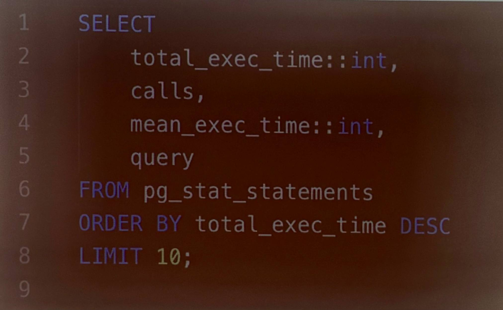
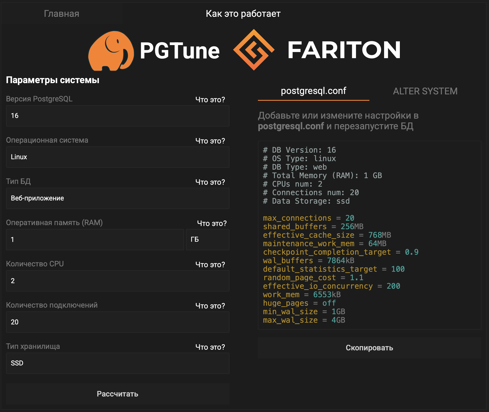

# Лекция 5

## Архитектура PostgreSQL

### Frontend

- Frontend включает в себя собственно клиентское приложение и библиотеку LIBPQ, реализующую интерфейс связи с сервером,
- Библиотека LIBPQ отвечает за установление соединения с сервером и передачу SQL-запросов.

### Драйверы языка

- psycopg2, ruby-pg.
- asyncpg, pgx, Npgsql, rust-postgres.

### Фаза инициализации

- StartupPacket: указывает версию протокола, имя пользователя и базу данных к которой хочет подключиться.
- Authentication Request: сервер смотрит в pg_hba.conf и отвечает запросом на аутентификацию.
- PasswordMessage: клиент отправляет хеш-пароля.
- AuthenticationOk: если всё хорошо, сервер подтверждает успех.
- BackendKeyData: сервер присылает уникальные PID процесса и секретный ключ (нужно для отмены запроса).
- ReadyForQuery: финальное сообщение о готовности.

### Фаза работы

- Simple Query: клиент отправляет сообщение с типом 'Q', в теле которого просто лежит текст SQL-запроса.
- Extended Query: разбивает выполнение на несколько шагов:
  - Parse: клиент отправляет строку запроса с плейсхолдерами ($1). Сервер парсит его и создаёт prepared statement.
  - Bind: клиент привязывает конкретные значения к параметрам (например, $1 = 5) и создаёт portal (объект, готовый к выполнению).
  - Describe: запрос информации о полях результата.
  - Execute: команда на выполнение портала.
  - Sync: сигнал о том, что текущая последовательность команд закончена и сервер может вернуться в состояние ожидания.

### Postmaster

- Главный процесс, который принимает входящие подключения от клиентов, управляет созданием и завершением дочерних процессов.
- Демон postmaster постоянно запущен в фоновом режиме на сервере. Он авторизует и принимает запросы от клиентов и осуществляет обмен данными между клиентом и сервером.
- При получении запроса соединения от клиента Postmaster создаёт соответственный фоновый серверный процесс postgres, при этом используется связь один-к-одному

### Backend-процессы 

- Для каждого нового подключения Postmaster порождает отдельный процесс, который обрабатывает SQL-запросы, выполняет планирование и возвращает результаты клиенту. Такой подход позволяет изолировать сессии и повышать стабильность системы.
- Каждый backend-процесс имеет свою локальную память, которая настраивается параметрами вроде work_mem (для сортировок и хеш-таблиц) и maintenance_work_mem (для задач обслуживания)
- Background workers, Background process

### Обеспечивает connection pooling

### Фоновые процессы - Autovacuum

- Автоматически очищает и реорганизует таблицы, удаляя устаревшие данные и освобождая место.
- Появился в 8.1. Запускается VACUUM и ANALYZE.
- Табличное "раздувание"
- Переполнение счётчика транзакций
- Не блокирует таблицы

### Конфигурация 

- autovacuum — включает или выключает систему autovacuum.
- autovacuum_max_workers — максимально количество одновременно работающих worker-процессов.
- autovacuum_naptime — интервал, с которым launcher просыпается и проверяет базы данных (60 s).
- autovacuum_vacuum_threshold, autovacuum_analyze, threshold.
- autovacuum_vacuum_scale_factor — множитель от размера таблицы для запуска VACUUM (0.2).
- autovacuum_analyze_scale_factor — множитель от размера таблицы для запуска ANALYZE (0.1).

### Фоновые процессы - Checkpointer

#### Описание

- Периодические сбрасывает измененные данные из общей памяти (shared buffers) на диск, что способствует снижению времени восстановления после сбоя.

#### Шаги выполнения checkpoint

- Контрольная точка запускается.
- В журнал записывается специальная запись о начале контрольной точки (CHECKPOINT REDO), содержащая указатель на текущую позицию в WAL. Эта позиция станет точкой старта для восстановления после сбоя.
- Checkpointer проходится по всем буферам в shared_buffers, находит все "грязные" страницы и инициирует их запись на диск.
- После того как все страницы гарантированно оказались на диске, в управляющем файле кластера (pg_control) обновляется информация о завершённой контрольной точке.
- В WAL пишется запись о завершении контрольной точки.
- Срабатывает по истечении checkpoint_timeout (по умолчанию 5 минут).

#### Когда checkpoint запускается

- Когда общий объём сгенерированных WAL-сегментов достигает max_wal_size (по умолчанию 1 ГБ).
- Вызов CHECKPOINT; в SQL.
- Если вы видите LOG: checkpoints are occurring too frequently, значит max_wal_size слишком мал относительно скорости генерации WAL.

### Фоновые процессы - WAL Writer

- Обеспечивает запись журналов предзаписи для обеспечения надежности и целостности данных
- Он сбрасывает буфер каждые wal_writer_delay миллисекунд (по умолчанию 200 мс)

### Фоновые процессы - Background Writer

- Пишет измененные страницы буферного кэша на диск в фоновом режиме
- Он постоянно, в фоновом режиме, понемногу записывает грязные страницы, поддерживая достаточный запас чистых буферов. Backend-процессы в большинстве случаев находят чистый буфер мгновенно и не участвуют в записи.

### Фоновые процессы - Stats Collector

#### Общая информация

- Собирает статистику выполнения запросов и использования ресурсов.
- Бекенды передают статистику
- Данные хранятся в pg_stat_* и pg_statio_*
- С 14 версии теперь этим занимаются сами бекенды 

#### Какая статистика есть

- Количество последовательный сканирований (seq scans), сканирований по индексам (index scans), прочитанных и измененных строк.
- Информация о VACUUM и ANALYZE.
- Вызовы пользовательских функций: количество вызовов и общее время выполнения.
- Сколько блоков данных прочитано с диска, а сколько взято из буферного кэша.
- Какие запросы выполняются прямо сейчас, какие соединения установлены

### Поиск самых медленных запросов

### pg_stat_statements

- calls: количество выполнений данного запроса
- total_exec_time, min_exec_time, max_exec_time, mean_exec_time, stddev_exec_time: статистика по времени выполнения (в миллисекундах). Это ключевые метрики для поиска медленных запросов.
- total_plan_time, min_plan_time, ... (если track_planning включен): статистика по времени планирования.
- rows: общее количество затронутых или возвращенных строк.

### Память и буферизация — Shared Memory

- PostgreSQL выделяет область общей памяти, используемую для хранения буферов данных (shared buffers), системных блокировок, информации о состоянии транзакций и WAL-буферов:
  - Shared Buffers
  - WAL Buffer
  - CLOG
  - Locks
  - temp_buffers

### Память и буферизация — локальная память процесса

- Каждый backend-процесс имеет свою локальную память для обработки запросов. Параметры типа work_mem определяют сколько памяти выделяется для сортировки, хеш-операций и других операций в рамках одного запроса.
- maintenance_work_mem — для операций обслуживания (VACUUM, CREATE INDEX).
- temp_buffers — для временных таблиц.

### PGDATA

- base/ — каталог с данными каждой базы данных
- global/ — глобальные объекты (роли, табличные пространства)
- pg_wal/ — журнал предзаписи (WAL)
- pg_stat_tmp/ — временные файл статистики
- postgresql.cong — конфигурационный файл
- pg_hba.conf — настройки аутентификации клиентов

### Storage Manager

- Этот компонент отвечает за чтение и запись данных с диска. Он обеспечивает взаимодействие между shared buffers и файловой системой, реализуя оптимальные алгоритмы доступа к данным.

### Logical Replication Launcher

- Отвечает за управление работой логической репликации.
- Когда вы создаёте подписку, Launcher замечает это и порождает необходимые рабочие процессы.
- Если какой-то рабочий процесс неожиданно завершился, Launcher обнаружит это и перезапустит его.
- Следит за тем, чтобы количество запущенных процессов не превышало установленные лимиты.
- Table Synchronization Worker, Apply Worker

### WAL Archiver

- Фоновый процесс, который отвечает за копирование заполненных сегментов журнала предзаписи (WAL) в долговременное хранилище.
- Обеспечивает сохранность всех изменений базы данных для возможности восстановления на любой момент времени (oint-In-Time Recovery, PITR).
- archive_move = on

### Postgres.conf

- https://pgtune.fariton.ru/

