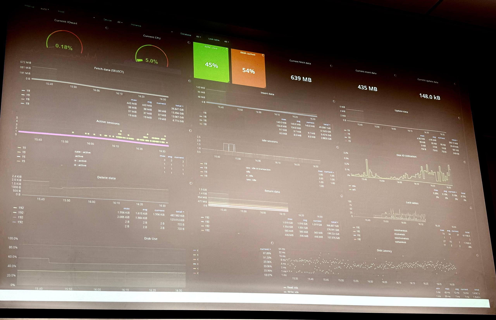

# Лекция 6

## Мониторинг

### Для чего он нужен 

- Мониторинг позволяет обнаружить сбой до того, как о нем сообщат клиенты.
- Расследование инцидентов.
- Планирование будущего.
- SLA / SLO / SLI (Соглашение об уровне услуг / Целевой показатель качества / Индикатор качества).

### Подробнее про метрики

- SLA: Мы обещали клиентам, что их личный кабинет будет работать быстро.
- SLO: 99.9% запросов к базе данных пользователей должны выполняться быстрее 100 мс.
- SLI: Система круглосуточно замеряет latency (задержку) запросов. Если скорость падает, инженер получает предупреждение до того, как это заметит клиент.

### The Four Golder Signals

- Задержка: время ответа сервиса (разница между быстрыми и медленными запросами)
- Трафик: нагрузка на систему (RPS, количество подключений).
- Ошибки: частота и типы ошибок (явные HTTP 500 и неявные, например. 200 ответ с пустым телом).
- Насыщенность: степень заполненности ресурсов (насколько система загружена).

### Уровни и виды

- Инфраструктурный мониторинг.
- Мониторинг приложений.
- Мониторинг БД

### Методологии

- Мониторинг метрик. 
- Мониторинг логов.
- Трассировка.

### Тип проверки

- Black-box мониторинг.
- White-box мониторинг.

### Источник данных

- Агентный.
- Безагентный.

### Что можно мониторить в Postrgres

### Запросы и производитель 

- pg_stat_statement — это расширение. Хранит статистику по каждому выполненному запросу: сколько раз вызывался, общее время, врем чтения/записи, количество возвращаемых строк. Именно отсюда берутся данные для поиска медленных запросов.
- pg_stat_activity — показывает все текущие подключения и запросы
- pg_locks — показывает все блокировки в системе

### Работа с памятью и кэшированием

- pg_buffercache - позволяет заглянуть в shared buffers. Можно увидеть, какие таблицы и индексы сейчас в кэше, насколько эффективно используется память.
- pg_stat_database — здесь есть поле blks_hit (попадания в кэш) и blks_read (чтения с диска). Считаем hitrate: blks _hit / (blks_hit + blks_read). Низкий hit ratio (<90-95%) - сигнал, что памяти мало или запросы не используют индексы.

### Pg_stat_all_tables n pg_stat_all_indexes

- seq_scan vs idx_scan - если по таблице много последовательных сканирований, а индексных мало - значит, либо нет подходящего индекса, либо запросы написаны плохо.
- n_tup_dead - количество мертвых строк. Если оно постоянно растет и достигает больших значений, значит автовакуум не успевает чистить мусор.
- idx_tup_read / idx_tup_fetch - эффективность использования индексов.

### Фоновые процессы

- pg_stat_progress_vacuum - показывает прогресс выполнения VACUUM в реальном времени.
- pg_stat_progress_create_index - мониторинг создания индекса (важно на больших таблицах).
- pg_stat_bgwriter - статистика фонового писателя и чекпоинтов. 
  Если checkpoints_timed (запланированные чекпоинты) значительно меньше, чем checkpoints_rea (запросные, из-за переполнения WAL), значит, чекпоинты слишком частые и нагружают дисковую систему.
- pg_stat_replication — состояние WAL-отправки на реплики. Видно, какие реплики подключены, и главное — лаг репликации (поле write lag,
flush_lag, replay_lag).
- pg_replication_slots — слоты репликации. Если слот не используется, WAL-файлы не удаляются, и диск может переполниться
- pg_stat_archiver — успешность архивации WAL. Если архивация не успевает или падает с ошибками, это критично для PITR-восстановления.

### Доступность базы

- Время отклика (pg_stat_statements): sum(total_time) / sum(calls)
- Кол-во ошибок (pg_stat_database): sum(xact_rollback)
- TPS (pg_stat_statements, pg_stat_database): sum(commits + rollbacks)
- QPS (pg_stat_statements, pg_stat_database): sum(calls)
- Uptime: now - pg_postmaster_start_time()
- Количество вакуумов: count(*) filter (where query ~* '^autovacuum')
- Самая длинная транзакция/запрос/вакуум: date_trunc('seconds', max(now() - xact_start), '00:00:00')

### Монитор нездорового человека

(как вы понимаете, понять здесь что-то будет крайне затруднительно)

### Выбор решения

- SaaS или self-hosted
- Метрики, плагины, графики, алерты
- Есть множество различных решений
- Мониторинг базы из коробки нет

### Специализированные решения для PostgreSQL

(вряд ли вы их когда-то встретите или будете использовать)

- pgwatch2
- PoWA (PostgreSQL Workload Analyzer)
- pgCluu

### SaaS

- Datalog

### Популярные решения

- Zabbix - "всё в одном решении", которое имеет множество своих модулей и готовых графиков (решение для скуфов)
- Prometheus + Grafana - diy подход в котором вы собираете систему мониторинга из независимых компонентов (решение для крутышей)

### DIY стек

- Prometheus - выступает в роли сервера мониторинга. Он каждые 20-30 секунд pull-ит метрики из различных источников и хранит их в себе.
- Grafana - это мощный и красивый инструмент для визуализации. Она подключается к Prometheus как к источнику данных и позволяет строить дашборды.
- postgres_exporter - Собирает метрики с PostgreSQL, подключаясь к нему под специальным пользователем с правами pg_monitor.
- node_exporter - Собирает метрики с самой операционной системы: загрузка CPU, использование памяти, дисковый I/O, сеть.

### + Alertmanager

- Группировка
- Маршрутизация
- Доставка

### + Thanos

(тоже особо не нужная штука)

- Prometheus хранит данные локально, и срок хранения обычно ограничен 15-30 днями
- Если у вас несколько Prometheus-серверов, у вас не будет единой точки входа для запросов ко всем данным сразу
- Долгосрочное хранение
- Глобальный взгляд
- Дедупликация и сжатие

### Prometheus -> Victoria Metrics

(вот это уже то, что надо)

- Полностью совместима с Prometheus
- Поддержка pull и push
- Горизонтальное масштабирование
- Эффективность
- Проще чем связка Prometheus + Thanos
- Так же можно заменить на Mimir (от одного вендора — Grafana Labs)

### + Loki

- Логирование

### Типы логов

- Логи приложений (доступ, ошибки, бизнес-события).
- Логи инфраструктуры (syslog, журналы ядра, systemd).
- Логи баз данных (медленные запросы, ошибки, аудит).
- Логи безопасности (аутентификация, авторизация).

### Проблемы

- Логи на дисках серверов (ротация, потеря контекста).
- Отсутствие централизованного поиска.
- Шум (info-логи) vs сигнал (ошибки).

### Процесс создания лога

- Сбор
- Буферизация
- Обработка
- Хранения
- Индексация
- Анализ

### Логирование в PostgreSQL

- Параметры: log_destination, log_directory, log_filename.
- Что логировать: log_statement, log_min_duration_statement,
log_connections, log_disconnections.
- Медленные запросы (slow query log) - настройка и анализ.

### Тут не было заголовка

- Correlation ID (trace ID) для связывания логов одного запроса.
- Интеграция с OpenTelemetry.

### Тут тоже

- Уровни логирования (debug, info, warn, error)
- drop-фильтры, агрегация повторяющихся сообщений.
- Добавление labels: окружение, версия приложения, хост.
- Разбор многострочных стектрейсов.
- Жизненный цикл логов

### ELK stack

- Elasticsearch - поисковый и аналитический движок.
- Logstash - серверный конвейер обработки данных. Занимается сбором, парсингом, обогащением и передачей логов в Elasticsearch.
- Kibana - веб-интерфейс для визуализации, поиска и построения дашбордов.
- Beats - лёгкие агенты, которые ставятся на сервера.

### И тут

- В высоконагруженных системах logstash является узким горлышком.
- На пиковых нагрузках он может падать с OutOfMemoryError.
- Сложность горизонтального масштабирования
- Вместо logstash можно использовать Kafka
- C Kafka используют Fluent Bit вместо Beats

### + Kafka

- Надёжность и сохранность данных
- Разделение ответственности
- Сглаживание пиковых нагрузок
- Возможность повторной обработки
- Мультиплексирование

### DIY stack + loki

- Для сборки логов у него есть Promtail
- Но можно заменить Promtail и node_explorer на Fluent Bit
- Также можно вынести хранение логов в s3 хранилище

### Трассировка

#### Описание

- Метод отслеживания пути одного запроса через все компоненты системы
- Позволяет понять где происходит аномалия в сложных распределенных системах

#### Процесс

- На входе в систему генерируется Trace ID и первый span. Контекст (Trace ID + текущий Span ID) передаётся в заголовках при каждом последующем вызове.
- Каждый сервис создаёт span'ы для операций, которые важно измерить: обработка запроса, вызов внешнего API, выполнение SQL, работа с кэшем.
- Сгенерированные span'ы для отправляются в коллектор. Он может агрегировать, фильтровать и сохранять данные в специализированное хранилище (Cassandra, Elastisearch, S3 и др. ).
- Пользователь через UI (Jaeger, Grafana) ищет трейсы по Trace ID, временному интервалу, меткам (например, https.status.code=500). Интерфейс показывает дерево span'ов, позволяя быстро найти узкое место и детализировать ошибки.

#### Итоги

- Trace ID включается в логи, чтобы можно было перейти от трейса к логам, связанным с этим запросом.
- Из span'ов извлекаются метрики, которые попадают в Prometheus, позволяя строить графики и алерты.
- Grafana позволяет переключаться между метриками, логами и трейсами, сохраняя контекст расследования.

### Open Telemetry (OTel)

- Открытый, вендор-нейтральный стандарт для сбора телеметрии (метрики, логи, трейсы) из приложений и инфраструктуры.
- Состоит из API, SDK, OpenTelemetry Collector
  
### Инструменты для трассировки

- Jaeger — open-source распределённая трассировка от Uber. Интеграция с Prometheus, Kafka. Часто используется с Grafana через плагин.
- Zipkin — система трассировки от Twitter. Простая, легковесная.
- Tempo — трассировочная система от Grafana Labs. Специально заточена под интеграцию с Grafana, Prometheus и Loki. Хранит данные в объектном хранилище (S3, MinIO) по аналогии с Loki.

### ClickStack

- OpenTelemetry Collector — выступает единым шлюзом для приёма телеметрии
- ClickHouse — все сигналы (логи, метрики, трейсы) хранятся в одной колоночной базе данных. Благодаря колоночному хранению и алгоритмам сжатия достигает 10-20-кратной компрессии данных.
- HyperDX UI — специализированный интерфейс, заточенный под работу с ClickHouse. Нативные алерты.