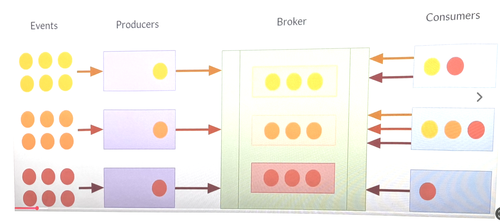
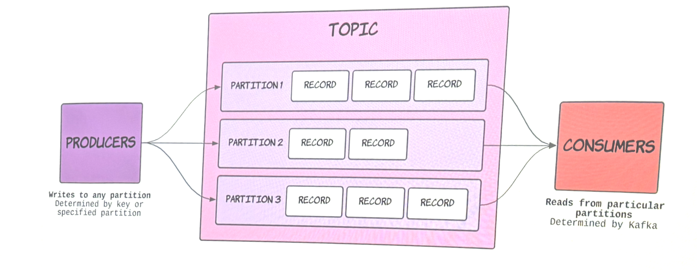
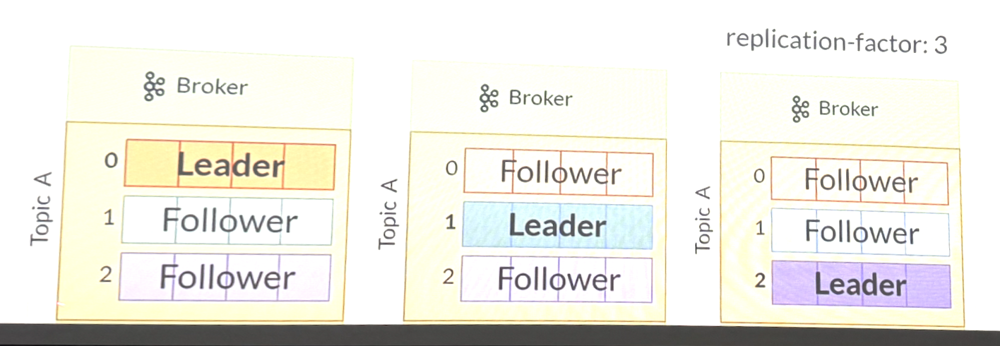

# Лекция 7

## Микросервисная архитектура

### Межсервисное общение

- HTTP-запросы
- gRPC
- Через общую базу данных

### Проблемы

- Жесткая связанность
- Сложность масштабирования
- Сложность обработки слоев
- Невозможность воспроизведения событий
- Проблема распределенных транзакций

## Message Broker

### Определение 

- Это промежуточный программный компонент, обеспечивающий надежную асинхронную передачу сообщений между распределенными системами
  
### Фукнции

- Маршрутизация
- Трансформация
- Буферизация
- Гарантии доставки
- Развязка

### Реализации

- RabbitMQ, ActiveMQ
- Apache Kafka
- NATS

## Apache Kafka

### Терминология

- Events — сообщения
- Producer — отправляет данные в Kafka
- Consumer — читает данные из Kafka

### Events

- Кеу — ключ сообщения (опциональный). Используется для определения партиции и упорядочивания по ключу.
- Value — основное содержимое сообщения. Может быть в любом формате: JSON, Avro, строка, байты и т.д.
- Торіс — логическое имя "канала", в который записывается сообщение.
- Timestamp — временная метка (может быть от продюсера или выставлена брокером).
- Headers — дополнительные метаданные в формате "ключ-значение" (опционально).

### Схема

### Kafka Node

- Принимает сообщения 
- Хранит сообщения
- Отправляет сообщения
- Использует несколько для отказоустойчивости

### KRaft (Kafka Raft)

- Хранение метаданных
- Выбор лидера контроллера Kafka
- Управления жизненным циклов топиков, брокеров и партиций
- Раньше использовался ZooKeeper, теперь KRaft

### Топик

- логическое имя "канала", в котором записываются сообщения

### Партиции 

- раздел внутри топика, позволяющий масштабировать и обрабатывать данные параллельно

### Размещение патриции по кластерам
- Топик разделён на партиции — физические единицы хранения. Партиции распределяются по нодам.
- Каждая партиция имеет лидера — брокер, который принимает запросы на запись и чтение для этой партиции.
- Остальные брокеры хранят реплики фоловеров партиции для обеспечения отказоустойчивости.
- Реплики синхронизируются с лидером.

### Физическое хранение

- Каждый топик разделён на партиции, каждая партиция - это физическая папка на диске брокера.
- Партиция не хранится в одном огромном файле, а разбита на сегменты. Это минимальная единица, которую Kafka удаляет при очистке.
  
### Файлы сегмента

- log — сообщения в формате
- index — маппинг offset → физическая позиция в .log
- timeindex — маппинг timestamp → offset
- .snapshot — Снимки состояний для транзакций (Появился в KRaft)

### Формат данных (.log)

- offset (8 байт)
- size (4 байта)
- Data

### Индексы
- Offset index — это разрежённый индекс, который отображает offset → позицию в .log.
- Time index - timestamp → offset, используется для поиска по времени

### Реплицирование

- replication factor - количество копий каждой партиции.
- ISR (In-Sync Replicas) - количество реплик, которые обновляются синхронно
- Только реплики из ISR могут стать лидером при сбое.

### Распределение партиций по брокерам

- Равномерное распределение по всем доступным брокерам.
- Реплики одной партиции не должны лежать на одном брокере.
- Лидеры партиций равномерно распределены между брокерами для балансировки нагрузки.

### Гарантии доставки (Acks)

- acks=0 — Максимальная скорость. Высокий риск потери данных
- acks=1 — Лидер партиции подтвердил запись. Если лидер упал до репликации — данные потеряны.
- acks=all (или -1) — подтверждение от лидера и всех синхронизированных реплик (ISR). Максимальная надежность

### Гарантии доставки (Consumer)

- at-most-once — коммит offset до обработки сообщения (потеря данных)
- at-least-once — коммит offset после обработки (дубликаты)
- exactly-once — транзакционная запись (идемпотентность)

### Consumer Group

- Группа потребителей, работающих над одним топиком.
- В одной группе каждая партиция принадлежит только одному consumery.
- Если consumers больше, чем партиций - некоторые простаивают.
- Разные группы могут читать одни и те же данные независимо.