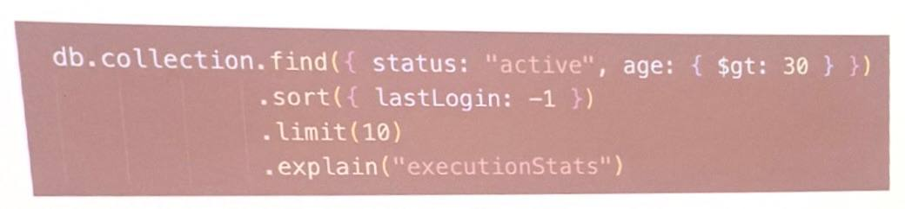
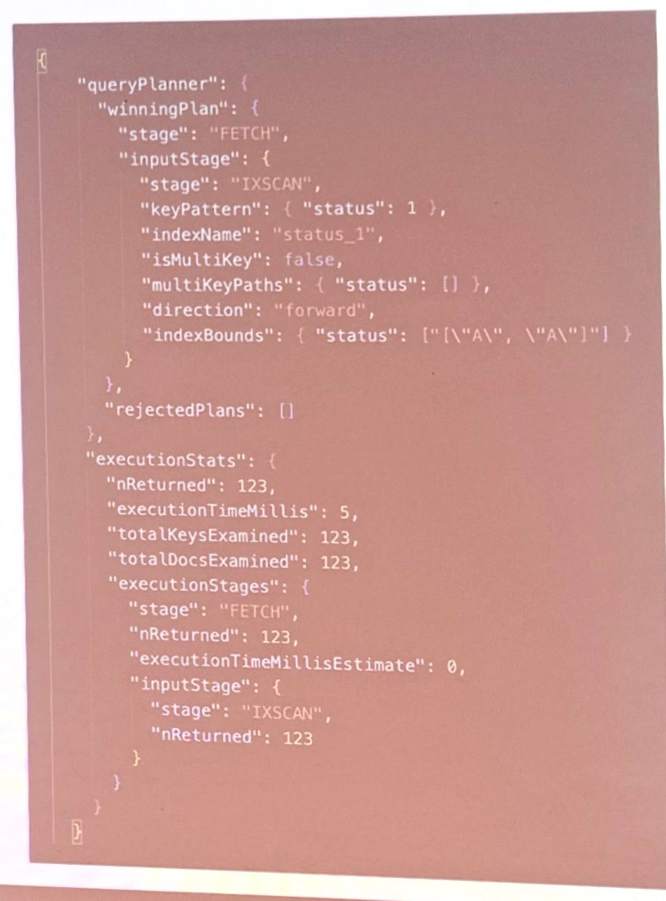
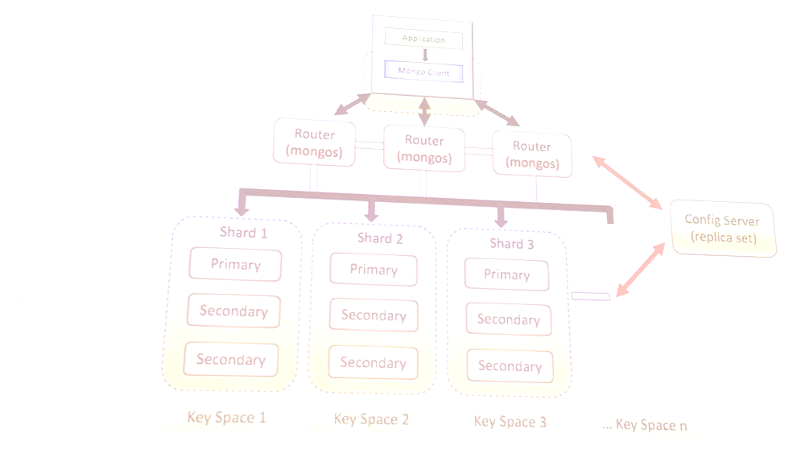

# Лекция 8

## MongoDB

### Введение

- Документоориентированная NoSQL-СУБД общего назначения
- Хранит данные в виде гибких JSON-подобных документов (BSON)
- schema-less
- Встроенная репликация и шардирование

### Чем отличается BSON и JSON

- Двоичный (Binary)
- int32, int64, double, decimal128, string, boolean, date, objectld, binary,timestamp, regex, вложенные объекты и массивы.
- Может быстро перескакивать по документу, пропуская ненужные поля, потому что каждый элемент содержит заголовок с размером и типом.
- Сохраняет точный порядок полей, важен при сравнении бинарных представлений.

### Крутая цитата

- Нормализируй пока не станет больно и денормализируй пока не заработает

### Агрегаты

### Нормализация неэффективна в распределенной среде

- Дорогие JOIN
- Сетевые задержки
- Распределённые транзакции (ACID-транзакции через несколько шардов возможны с версии 4.2, но они медленные и блокирующие)

###

- Встраивать поддокументы и массивы прямо в родительский документ
- Хранить копии часто используемых данных (например, имя пользователя — в каждом комментарии)

### Refs vs Embedded

- Embedded — встраиваете один документ внутрь другого
- Reference — храните в документе ссылку (ObjectId) на другой документ

### Embedded 

- Вы всегда берет обе сущности одной операцией.
- Ограниченный небольшой массив
- Редко меняете только поддокумент

### Refs

- Дочерний документ большой или редко нужен
- Может расти «до бесконечности» (много записей)
- Часто меняете дочерние записи независимо
- Нужна независимая шардируемая коллекция

### Рубрика викторина

#### Один-к-одному

- Profile - Config

#### Один-ко-многим

- Пользователь - Адреса
- Статья - Комментарии

#### Много-ко-многим

- Студент - Курс

### Oplog

- Журнал операций
- Операции идемпотенты
- Старые записи удаляются автоматически, когда коллекция достигает лимита
- Если secondary отстаёт от primary дольше, чем размер ород, он не сможет догнать репликацию и будет вынужден запустить полную синхронизацию.

### Initial Sync

- Целевой узел выбирает источник для копирования
- Получает от источника начальную временную метку (t1) из его oplog на момент старта синхронизации.
- Копирует все данные (документы и индексы) из всех пользовательских БД
- Параллельно с клонированием, продолжает синкать у себя новые операции из oplog.
- Когда клонирование завершено, начинает последовательно применять oplog.
- После успешного применения всех изменений узел переходит из состояния STARTUP2 в SECONDARY

### Статусы нод

- PRIMARY
- SECONDARY
- STARTUP
- STARTUP2
- RECOVERING
- ROLLBACK
- ARBITER
- DOWN
- UNKNOWN
- REMOVED
- FATAL
  
### File Copy Based Initial Sync(5.2+)
- Копирует файлы данных напрямую на уровне файловой системы.
- скорость определяется только сетью и диском, индексы не перестраиваются

### Mongosh

- интерактивная оболочка для работы с MongoDB
- Использует V8, так что полностью поддерживает современный ES6 синтаксис
- С версии 5.0

### Движки

- MMAPv1
- WiredTiger (с версии 3.2)
- InMemory (Enterprise only)
- EphemeralForTest (Удалён в версии 7.0)

### WiredTiger

- Оптимистическая блокировка на уровне документа. Параллельные записи в разные документы одной коллекции работают одновременно
- Использует собственный кэш
- Документы хранились (раньше так было) в бинарном виде в файлах с запасом. При обновлении, если новый размер превышал выделенный, документ перемещался в конец файла. Старое место становилось дырой.
- Появилось сжатие(Snappy)
- Постановление от чекпоинты

### Атомарность и конкурентность

- Атомарность на уровне одного документа
- Атомарность многодокументных операций (с 4.0)
- Атомарность на шардированном кластере (с 4.2)
- Использует MVCC (WiredTiger)
- Чтения не блокируют записи, а записи не блокируют чтения других документов.
- Пишущие операции блокируют только тот документ, который модифицируется.

### Snapshot Isolation

- Неповторяемое чтение: невозможно
- Фантомное чтение: невозможно
- Грязное чтение: невозможно
- Потерянное обновление: невозможно

### Сборщики мусора

 - Журнал истории (History Store)
 - Контрольные точки (Checkpoints)
 - Вытеснение (Eviction)
 - Уплотнение (Compaction)

### Read Concern and Write Concert

- управляет уровнем изоляции чтения:
  - local
  - majority
  - snapshot

### Уровни изоляции 

 - { w: 1 } — только первичная
 - { w: "majority } — большинство
 - { w: 0} — без подтверждения

### Деревья и графы

 - Можем работать с деревьями и графами 
 - graphLookUp

### Индексы 

 - db.collection.createlndex({ age: 1 })
 - db.collection.createlndex({ lastName: 1, firstName: 1})
 - Создаёт по одному значению индекса для каждого элемента массива в документе.
 - db.articles. createndex content: "text", title: "text" 3)
 - db.users.createlndex({ userld: "hashed" 3)
 - db.places.createlndex(f loc: "2dsphere" 3)

### Уникальный индекс
 - db.users.createndex{ email: 1), { unique: true 3)
 - Гарантирует уникальность значений в индексированном поле для каждого документа

### Разряженный индекс
- db.products.createndex sku: 1), { sparse: true 3)
- Индексирует только те документы, в которых присутствует индексируемое поле.

### Частичный индекс
 - db.orders.createlndex status: 1, createdAt: -1).{ partialFilterExpression:{ status: { $eq: "active" } } })
 - Индексирует только те документы, которые соответствуют определенному условию-фильтру.

### TTL индексы
 - db.sessions.createndex lastAccess: 1),{expireAfterSeconds: 3600})
 - Автоматически удаляет документы по истечении заданого времени.

### Wildcard-индекс
 - db.coll.createlndex([ createlndex "$**": 1})
 - db.coll createlndex "metrics.$**": 1 })
 - wildcardProjection: ("temp.$**": 0}} - Исключает из индекса все поля, начинающиеся с temp
 - Индексирует все поля документа

### Clustered Index
 - Определяет физически подрани а а диске.
 - Используется чаще всего для коллекций, кластеризованных по полю даты

### Hidden Index
 - Позволяет скрыть индекс от планировщика запросов

### Ограничения у БД
 - Максимальное число индексов на коллекцию: 64
 - Максимальный размер документа: 16 МВ (GridFS для обхода)
 - Slookup только с версии 4.4 начал поддерживать шард-ту-шард

### Профилирование запроса

 - COLLSCAN
 - IXSCAN
 - IDHACK

### Реплицирование
 - Primary, Secondary, Arbiter
 - Secondary опрашивает oplog primary и «догоняет» его, записывая те же изменения в локальную БД.
 - Запуск ноды с атрибутом -replset
 - Зайдя в mongosh одной из нод, создать кластер

### Шардирование
 - Выбираем Шард-ключ(Range-based, Hashed, Zone-based)
 - MongoDB автоматически разбивает данные на чанки.
 - Размер чанка по умолчанию: 128 МБ. Если больше, то
 - ngoDB сплитит его на два.
 - Если количество чанков на шардах сильно различается, балансировщик перемещает чанки с перегруженного шарда на менее загруженный.

### Архитектура

### mongos
 - Точка входа для всех запросов в шардированном кластере.
 - Смотрит метаданные в config servers, чтобы решить, на какой шард отправить запрос.

### Config Server
 - Список шардов.
 - Диапазоны чанков и их расположение.
 - Настройки балансировки.

### Движок хранения (WiredTiger)
 - У всех узлов (mongod) внутри шарда.
 - Кэш
 - Диск
 - Журнал WAL