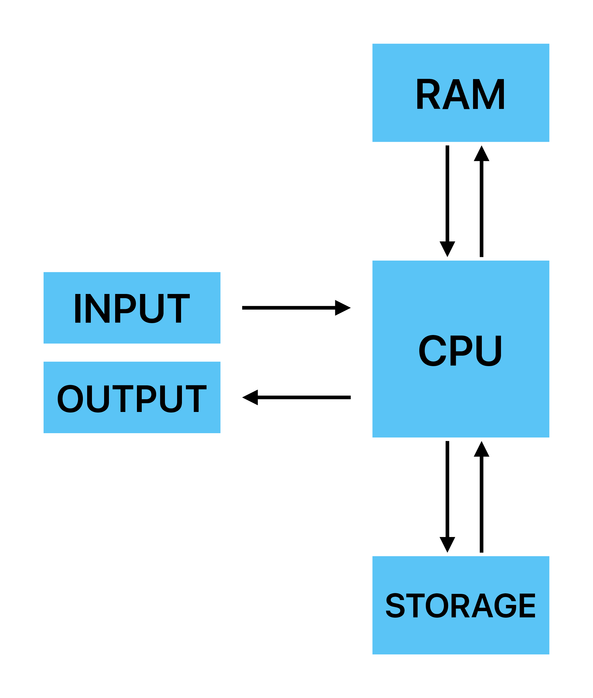
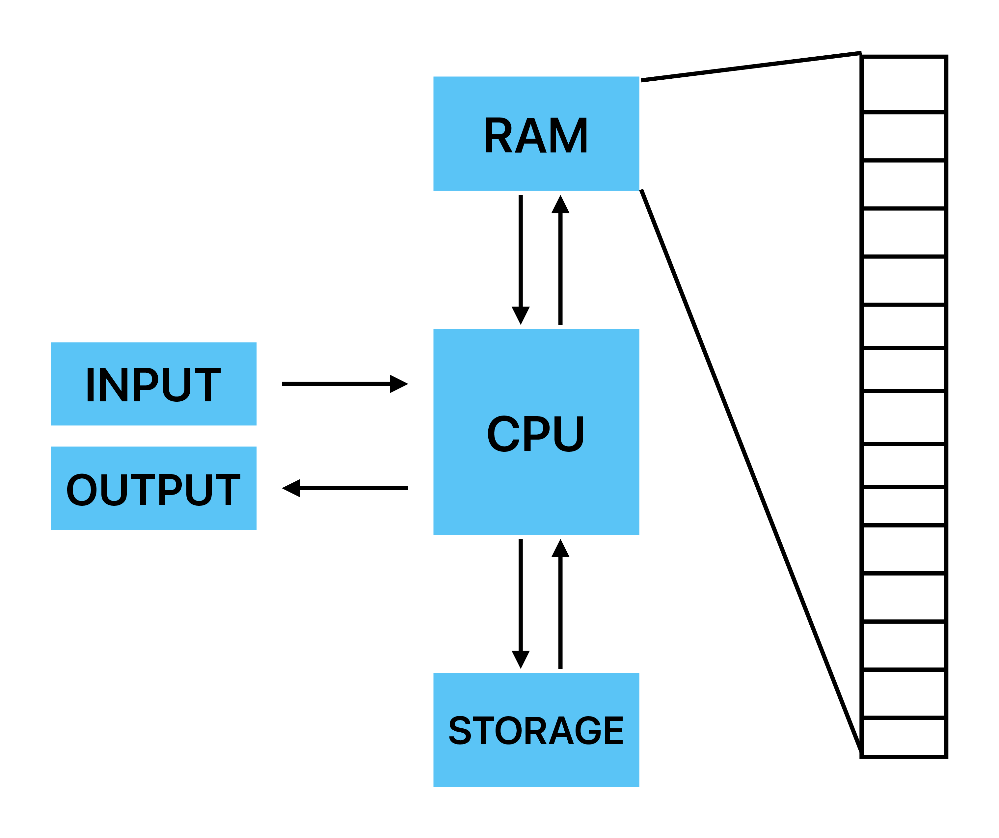
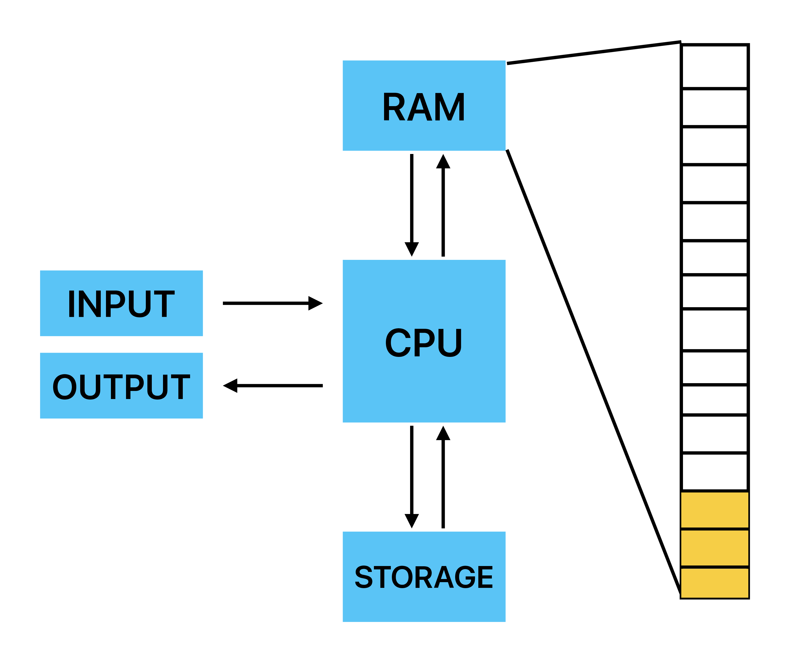
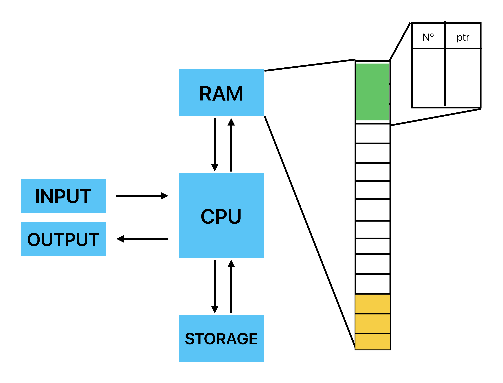
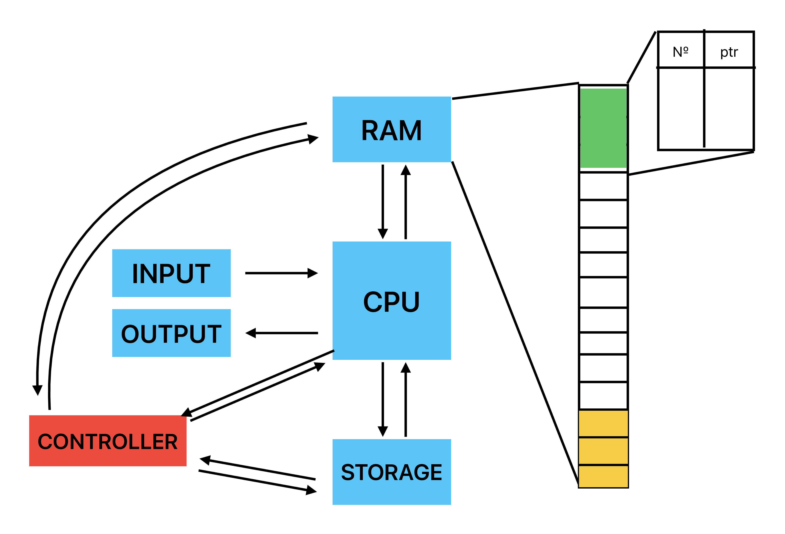
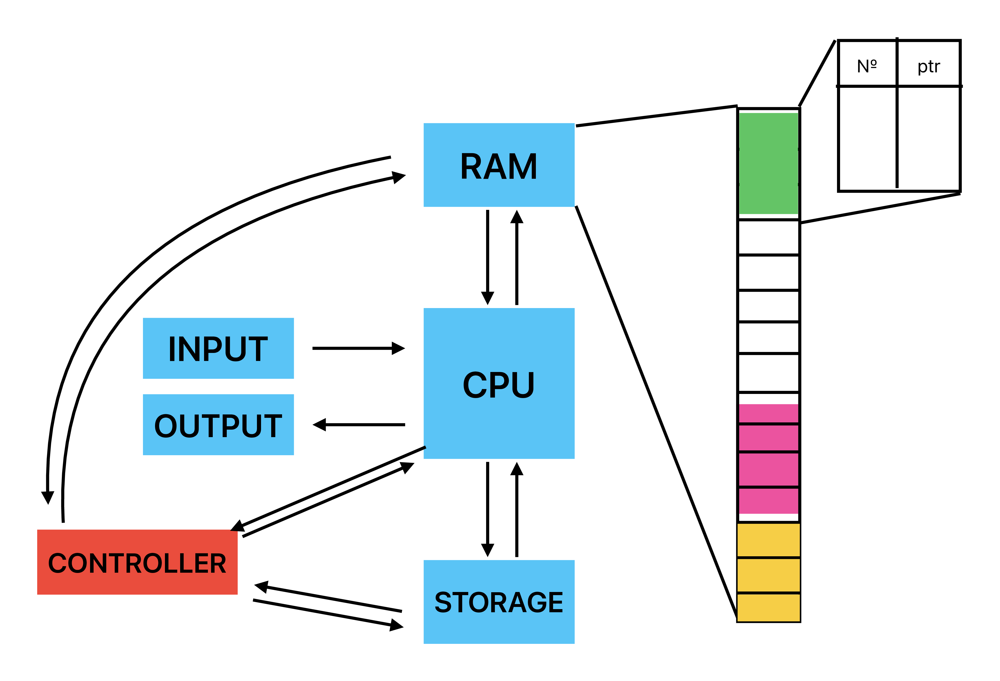

# Лекция 1

*Операционные системы* — базовое системное программное обеспечение, управляющее работой вычислительного узла и реализующее универсальный интерфейс между аппаратным обеспечением, программным обеспечением и пользователем

Прежде чем идти дальше вспомним ключевые принципы архитектуры фон Неймана, которым нас учил дядюшка Скаков:

1. **Двоичное кодирование**
   
   Вся информация (данные и команды) представляется в виде двоичных чисел. 

2. **Адресуемость памяти** 
   
   Память организована как линейная последовательность ячеек (слов), каждая имеет уникальный адрес — целое число от 0 до N−1. Процессор может в любой момент обратиться к любой ячейке по её адресу (random access), что позволяет использовать переменные, массивы, указатели и т. п.

3. **Программное управление**

    Работа машины полностью определяется программой, заранее записанной в память, состоящей из набора команд, которые выполняются процессором друг за другом в определённой последовательности: устройство управления последовательно выбирает команду по счётчику команд, декодирует и выполняет её. За счёт условных и безусловных переходов можно менять последовательность выполнения — так реализуются циклы, ветвления, подпрограммы.

4. **Однородность памяти**

    Программы и данные хранятся в единой памяти, в одинаковой форме. Машина не различает, что в ячейке — число, текст или команда, это просто битовый набор, интерпретация зависит от контекста выполнения. Причём они передаются по одним и тем же шинам, что порождает «узкое место фон Неймана» из‑за конкуренции за доступ к памяти.

В простейшем случае, когда у нас есть только одна программа, то операционная система особо и не нужна: программа  будет просто использовать доступные ресурсы компьютера и как-то работать. Другое дело, когда у нас появляется ещё несколько программ. Теперь программы начинают конкурировать за ресурсы, а поэтому необходимо как-то организовать их взаимодействие. Это, например, конкуренция за процессор, за память, за работу с устройствами ввода и вывода и т. д.

Без централизованного управления каждая программа должна была бы самостоятельно решать эти задачи, что крайне неудобно и неэффективно. Операционная система берёт эти функции на себя; она является "прослойкой" (либо же контроллером) между software (программное обеспечение), hardware (аппаратное обеспечение) и user (пользователь). 

Кто-то может спросить: но ведь мы итак взаимодействуем напрямую с программным обеспечением, когда, например, нажимаем на кнопки в приложении (например что-то гуглим). Но на самом деле нет. Это нам так кажется. Например, когда какое-то особенно багованное приложение зависает и мы пытаемся нажать на крестик, но оно всё равно не закрывается. Наш запрос в любом случае сначала поступает в операционную систему, и лишь потом к приложению. Если бы это было не так, то мы бы могли напрямую закрывать такие приложения, а мы так не можем.

Рассмотрим эволюцию развития операционных систем:

Первые вычислительные системы не имели полноценных операционных систем. В 1950-1960-х годах появились так называемые программы-диспетчеры. Они стали предтечами современных операционных систем и отвечали преимущественно за следующие вещи:

1. Упрощение повторного использования кода
2. Автоматизация загрузки и линковки 

Так выглядит упрощённая схема архитектуры фон Неймана:

Рассмотрим "абстрактную" память где хранятся инструкции процессора:

Как мы знаем команды выполняются последовательно. В те времена программировали ещё на перфокартах, а поэтому это было максимально долго и неудобно. Представьте себе ситуацию, когда нужно писать одну и ту же функцию (например вычисление синуса) на перфокарте. Чтобы избежать такой монотонной работы было предложено заранее зарезервировать в памяти места под часто встречающиеся функции, а в остальных программах лишь ссылаться на эти функции:

Теперь мы можем просто сослаться на, например, второй желтый прямоугольник, куда записана команда вычисления синуса. То есть можно рассматривать желтый блок как наши библиотеки, которые мы используем.

Однако появилась следующая проблема: что делать, если мы нашли ошибку в наших заранее написанных функциях? Или придумали более эффективный алгоритм? В таком случае, после того, как мы переписали нашу функцию она уже может занимать больше места, либо иметь другой адрес (раньше все программы ссылались на ячейку 43, где хранился синус, а косинус был в ячейке 54, однако теперь синус стал занимать больше места и косинус лежит в ячейке 57). Получается, что теперь все программы, использующие косинус должны быть переписаны, чтобы изменить куда мы ссылаемся.

Для решения этой проблемы стали использовать таблицы переходов (диспетчер)

Диспетчер представляет собой таблицу указатель, на нужные нам функции. Теперь все программы ссылаются на диспетчер, а он уже сам автоматически ссылается на нужную нам функцию. Если расположение функции поменяется, то для программ ничего не изменится, потому что они теперь работают через диспетчер.

В дальнейшем идея таблицы переходов эволюционировала в структурированные механизмы управления ресурсами — диспетчеры задач, памяти, устройств, которые стали частями ОС. 

Со временем возникла необходимость эффективно работать с устройствами ввода/вывода: лентами, дисками, клавиатурой, экраном, сетями и прочим. Операции ввода-вывода выполняются значительно медленнее, чем вычисления. Изначально процессор сам управлял этими операциями, ожидая их завершения, в результате чего простаивал и использовался неэффективно.

Таким образом, нужно неким образом подгружать необходимые данные в оперативную память (из хранилища или с потокового ввода) и выгружать обработанные данные (в хранилище или в потоковый вывод). На тот момент это можно было делать только используя центральный процессор, т.к. в противном случае может возникнуть рассинхронизация: например, операция записи в оперативную память завершится позже, чем требуется, и попытка работать с этими не до конца загруженными данными приведет либо к сбою, либо к некорректной обработке этих данных. 

Однако понятно, что это не самый оптимальный способ. Оптимальнее было бы сделать например так: процессор работает с одним блоком памяти, в то время как другой, независимый блок оперативной памяти подгружается из хранилища (или освобождается). Чтобы применить эту идею, введем дополнительно контроллер, который свяжем и с хранилищем, и с оперативной памятью. Разрешим этому контроллеру независимо от ЦП заниматься откачкой и подкачкой данных между хранилищем и оперативной памятью.

То есть теперь мы можем немного разгрузить нашу систему за счет того, что будем контролировать работу хранилища и вычислительных мощностей, чтобы более оптимально использовать наши ресурсы.

Но тогда возникает другая проблема: мы не можем прогнозировать время выполнения этих операций, т.к. большинство хранилищ используют технологии, которые это не позволяют. Чтобы решить эту проблему нужно связать (синхронизировать) работу контроллера и работу центрального процессора. 

Поскольку операции ввода-вывода выполняются за непредсказуемое время, процессор не может постоянно их ожидать. Для синхронизации работы используются прерывания.

Принцип работы:

1. Процессор запускает операцию ввода-вывода.
2. Контроллер выполняет её самостоятельно.
3. После завершения контроллер посылает сигнал процессору.
4. Процессор временно прерывает текущую программу.
5. Выполняется обработчик прерывания.
6. Управление возвращается основной программе.

В ходе обработки прерывания можно (например) изменить некоторый флаг, с помощью которого основная программа поймет о том, что данные готовы к обработке.

То есть добавляется ещё один блок под обработчик прерываний:

*Прерывание* — сигнал, поступающий от внешнего устройства к центральному процессору, сообщающий о наступлении некоторого события, приостанавливающий поток исполняющихся команд и передающий исполнение (управление) обработчику прерываний