# Основы ООП (Object-Oriented Programming)

> **Примечание**: Данный конспект посвящён основам объектно-ориентированного программирования. Базовый синтаксис C# не рассматривается подробно — предполагается, что после изучения C++ переход на C# не составит труда. Фокус курса направлен именно на принципы и практики ООП, а не на особенности языка.

## Содержание

1. [Введение: эволюция парадигм программирования](#введение-эволюция-парадигм-программирования)
2. [Основные концепции ООП](#основные-концепции-ооп)
3. [Классы и структуры в C#](#классы-и-структуры-в-c)
4. [Иммутабельность](#иммутабельность)
5. [Конвенции Find/Get](#конвенции-findget)
6. [Обработка исключений и Result Pattern](#обработка-исключений-и-result-pattern)
7. [Value Objects](#value-objects)
   - [Перегрузка операторов: когда и почему нельзя](#перегрузка-операторов-когда-и-почему-нельзя)
   - [Сложные операции: когда операторы неуместны](#сложные-операции-когда-операторы-неуместны)
   - [Паттерны Create и TryCreate](#паттерны-create-и-trycreate)
   - [Конвенция TryGet и TryXxx в .NET](#конвенция-tryget-и-tryxxx-в-net)
8. [Файловая структура проекта](#файловая-структура-проекта)

---

## Введение: эволюция парадигм программирования

### От машинного кода к структурному программированию

На заре программирования код писался в виде последовательности низкоуровневых инструкций. Вот пример на языке ассемблера:

```asm
0 VAR i              ; Объявление переменной i
1 SET i 1            ; Присвоение: i = 1
2 PRINT i            ; Вывод значения i
3 INC i              ; Инкремент: i++
4 JIFLS i 10 2       ; Переход к строке 2, если i < 10 (jump if less)
```

Этот код выводит числа от 1 до 9. На современном языке C# тот же алгоритм записывается значительно проще:

```csharp
// Цикл for объединяет инициализацию, условие и инкремент в одной строке
for (var i = 1; i < 10; i++)
{
    Console.WriteLine(i); // Вывод текущего значения i
}
```

Такой подход называется **структурным программированием (Structured Programming)**. Программа представляет собой набор структурированных блоков: последовательностей, ветвлений и циклов.

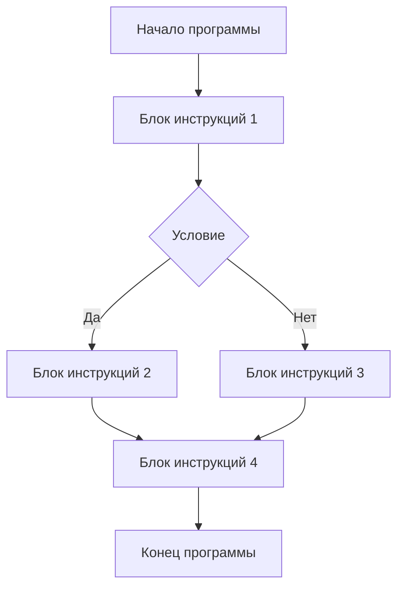

### От структурного к процедурному программированию

При написании сложных программ структурный подход быстро приводит к так называемому **спагетти-коду (Spaghetti Code)** — запутанному коду, где всё перемешано:

```csharp
// Пример плохо структурированного кода
var probability1 = Random.Shared.NextDouble();
var coefficient1 = probability1 > 0.5 ? 10d : 0;  // Вычисления
var probability2 = Random.Shared.NextDouble();
var coefficient2 = probability2 > 0.5 ? 10d : 0;

var input = Console.ReadLine();                    // Ввод данных
var value = input is null ? 0 : int.Parse(input);

var result = value * coefficient1 / coefficient2;  // Вычисления
var message = $"result: {result}";                 // Подготовка вывода
Console.WriteLine(message);                        // Вывод
```

В этом коде перемешаны три разные задачи: ввод данных, вычисления и вывод результата. Это затрудняет понимание, тестирование и изменение кода.

**Процедурное программирование (Procedural Programming)** решает эту проблему, выделяя повторяющуюся логику в отдельные процедуры (функции):

```csharp
// Главная функция стала значительно понятнее
var coefficient1 = CalculateCoefficient();
var coefficient2 = CalculateCoefficient();
var value = ReadValue();
var result = value * coefficient1 / coefficient2;
OutputResult(result);

// Вычисление коэффициента вынесено в отдельную функцию
static double CalculateCoefficient()
{
    var probability = Random.Shared.NextDouble();
    return probability > 0.5 ? 10d : 0;
}

// Чтение значения от пользователя вынесено в отдельную функцию
static int ReadValue()
{
    var input = Console.ReadLine();
    return input is null ? 0 : int.Parse(input);
}

// Вывод результата вынесен в отдельную функцию
static void OutputResult(double result)
{
    var message = $"result: {result}";
    Console.WriteLine(message);
}
```

Теперь код стал **модульным (Modular)**: каждая функция отвечает за свою задачу, а основной код читается почти как естественный язык.

> **Историческая заметка**: Почему "процедурное", а не "функциональное"? Название происходит от языков Pascal и Fortran, где различались **процедуры (Procedures)** — подпрограммы, не возвращающие значение (аналог `void` в C#), и **функции (Functions)** — подпрограммы, возвращающие значение. Процедуры выполняют действия, функции вычисляют результат. **Функциональное программирование (Functional Programming)** — это совершенно другая парадигма, основанная на математических функциях и неизменяемых данных.

### Переход к объектно-ориентированному программированию

После процедурного подхода, где главная единица — **функция**, мы переходим к **объектно-ориентированному программированию (ООП, Object-Oriented Programming, OOP)**, где главная единица — **объект**.

**Объект (Object)** объединяет данные и поведение (методы), работающие с этими данными. Это позволяет:

- Моделировать реальные сущности предметной области
- Инкапсулировать данные и защищать их от некорректного использования
- Повторно использовать код через наследование и композицию
- Создавать гибкие и расширяемые системы

> **Важно**: «Классы — это ещё не ООП». Наличие классов в языке не делает его объектно-ориентированным. ООП — это парадигма мышления, набор принципов проектирования, а классы — лишь инструмент для реализации этих принципов.

В этом курсе мы изучим:
- Объектно-ориентированное проектирование
- Язык C# и его возможности для ООП
- Принципы написания качественного объектно-ориентированного кода

---

## Основные концепции ООП

Прежде чем погрузиться в концепции, необходимо определить ключевые термины:

### Базовые определения

**Тип (Type)** — шаблон, описывающий, какие данные и методы имеет объект.

**Объект (Object)** — экземпляр типа, существующий во время выполнения программы и занимающий память.

**Инвариант данных (Data Invariant)** — набор правил, определяющих корректное состояние данных. Например, для переменной, хранящей возраст человека, инвариант: «значение должно быть неотрицательным».

**Инвариант типа (Type Invariant)** — набор данных, их инвариантов и поведений (методов), позволяющих изменять эти данные с соблюдением инварианта.

**Объект (с точки зрения теории ООП)** — совокупность атрибутов (данных) и поведений (методов), реализация и данные которого скрыты от конечного пользователя.

**Модуль (Module)** — автономная единица функциональности с собственным контрактом и инвариантами, имеющая публичный интерфейс и скрытую реализацию.

**Модуль в ООП** — один объект или набор объектов, реализующих связную функциональность.

**Контракт (Contract)** — набор правил, определяющих поведение типа или модуля. Он включает предусловия (что должно быть истинно перед вызовом метода), постусловия (что гарантируется после выполнения метода) и инварианты.

**Контракт в ООП** — ближайший аналог интерфейса (`interface`): набор методов, которые должен реализовать тип.

**Объектная модель (Object Model)** — способ представления реального мира в коде с помощью классов, объектов, их свойств и методов.

**Протёкшая абстракция (Leaky Abstraction)** — абстракция, для корректной работы с которой необходимо знание деталей её реализации. Это нарушает принцип инкапсуляции.

---

### 1. Абстракция (Abstraction)

**Абстракция (Abstraction)** — это упрощённая модель некоего объекта или явления реального мира, откидывающая детали, несущественные в заданном контексте.

При написании программы вы моделируете части реальности через объекты. Но объекты в программе не повторяют в точности их реальные аналоги — это редко когда нужно и практически невозможно. Вместо этого программные объекты моделируют только те свойства и поведение реальных объектов, которые важны в конкретном контексте, игнорируя остальное.

#### Примеры абстракций

**1. Материальная точка в физике**

При решении задачи о движении автомобиля по дороге не нужно учитывать его размеры, форму, цвет — достаточно знать положение и скорость. Автомобиль моделируется как материальная точка.

**2. Стены в компьютерных играх**

В игровом движке стены представлены полигонами — набором треугольников. Моделирование каждого атома или молекулы было бы невероятно ресурсоёмким и бессмысленным. Игроки видят внешнюю поверхность, а то, что стены внутри полые, не имеет значения — они ведут себя как настоящие.

**3. Самолёт в разных контекстах**

Класс `Airplane` будет совершенно разным в симуляторе полётов и в системе бронирования билетов:

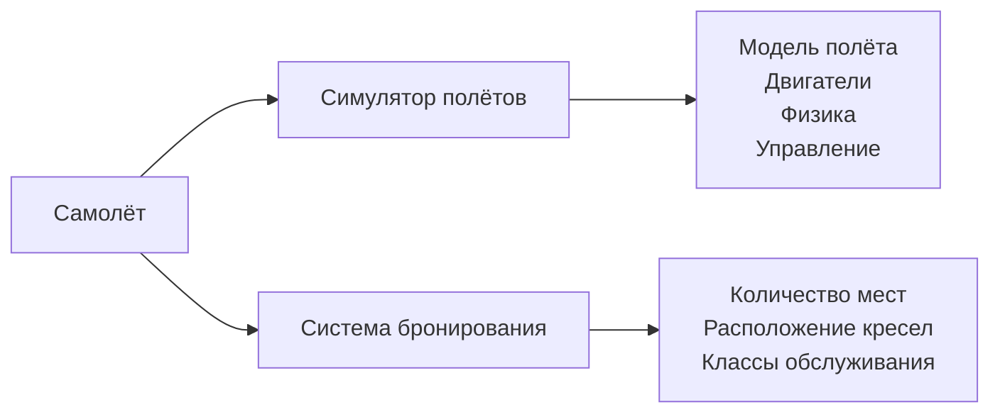

Во всех этих случаях модель становится проще, но для пользователя ничего не меняется — она выполняет ожидаемые функции.

**Абстракция позволяет**:
- Представлять сложные системы как «чёрный ящик» с точки зрения реализации
- Писать более простой код на более высоких уровнях абстракции
- Скрывать детали реализации от пользователей

---

### 2. Инкапсуляция (Encapsulation)

**Инкапсуляция (Encapsulation)** — принцип объединения атрибутов (данных) и поведений (методов) в рамках одного типа.

Другими словами, инкапсуляция — это способность объектов скрывать часть своего состояния и поведения от других объектов, предоставляя внешнему миру только определённый интерфейс взаимодействия с собой.

#### Отличие от абстракции

- **Абстракция**: избавляемся от несущественных деталей
- **Инкапсуляция**: объединяем данные и методы, скрываем реализацию и защищаем данные от некорректного использования

#### Пример: автомобиль

Рассмотрим класс автомобиля. Внутри могут быть: коленчатый вал, провода, двигатель, поршни, система впрыска топлива — всё это описано в классе. Однако водителю для управления автомобилем знать об этом не нужно.

Достаточно завести машину ключом и использовать педали газа/тормоза, руль. Не нужно вручную соединять провода под капотом, вращать коленчатый вал или управлять работой поршней. Все эти детали **инкапсулированы** под капотом. И, согласитесь, без должного опыта попытка завести двигатель вручную может закончиться плачевно.

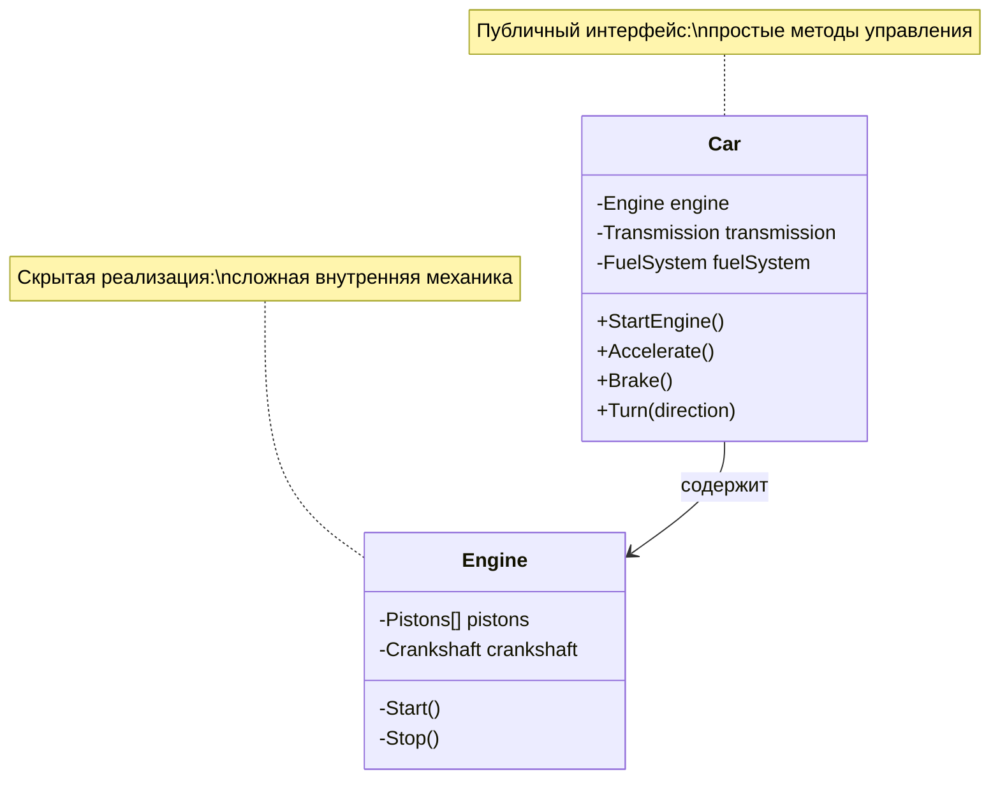

Мы описали модель автомобиля и то, что от него ожидаем (**абстракция**), но публичный интерфейс (то, что доступно снаружи) ограничили базовым функционалом (**инкапсуляция**). Всё остальное скрыто «под капотом».

#### Пример: банковский счёт

Представьте банковское приложение. Если бы мы напрямую изменяли баланс:

```csharp
// Плохой пример: прямой доступ к данным
wallet.Value -= 1000; // Что если Value < 1000? Баланс станет отрицательным!
```

Это создаёт проблему: можно снять больше денег, чем есть на счёте, нарушив инвариант «баланс не может быть отрицательным».

Инкапсуляция решает эту проблему:

```csharp
public class BankAccount
{
    // Поле скрыто от внешнего доступа
    private decimal _balance;

    // Конструктор инициализирует баланс
    public BankAccount(decimal initialBalance)
    {
        if (initialBalance < 0)
            throw new ArgumentException("Начальный баланс не может быть отрицательным");
        
        _balance = initialBalance;
    }

    // Публичное свойство только для чтения
    public decimal Balance => _balance;

    // Метод для снятия денег с проверкой
    public bool TryWithdraw(decimal amount)
    {
        // Проверка: достаточно ли средств
        if (amount > _balance)
            return false; // Недостаточно средств
        
        if (amount < 0)
            return false; // Нельзя снять отрицательную сумму

        _balance -= amount;
        return true; // Операция выполнена успешно
    }

    // Метод для пополнения счёта
    public bool TryDeposit(decimal amount)
    {
        if (amount <= 0)
            return false; // Нельзя внести неположительную сумму

        _balance += amount;
        return true;
    }
}
```

Теперь невозможно случайно нарушить инвариант баланса — все операции контролируются методами класса.

**Преимущества инкапсуляции**:
- Улучшает структурированность кода
- Локализует логику относительно данных, которые она обрабатывает
- Упрощает процесс изменения кода
- Уменьшает возможность внести изменения, ломающие инвариант типа

На идеях **абстракции** и **инкапсуляции** построены механизмы интерфейсов и абстрактных классов в большинстве объектно-ориентированных языков программирования.

---

### Интерфейсы (Interfaces)

> **Примечание**: Многих путает, что словом «интерфейс» называют и публичную часть объекта (set of public methods), и конструкцию `interface` из языков программирования.

В объектно-ориентированных языках с помощью **интерфейсов** (ключевое слово `interface`) можно явно описывать **контракты** взаимодействия объектов.

Интерфейс похож на концепты (concepts) в C++: мы накладываем ограничения на класс — требуем, чтобы у него были определённые методы. Если класс не реализует требуемые методы, он не удовлетворяет интерфейсу и не может использоваться в контекстах, где этот интерфейс требуется.

#### Пример: аэропорт и летающий транспорт

Создадим интерфейс `IFlyable` (летающий):

```csharp
// Интерфейс определяет контракт: что значит "уметь летать"
public interface IFlyable
{
    // Свойство: текущее местоположение
    Point Location { get; }
    
    // Метод: полететь из одной точки в другую с пассажирами
    void Fly(Point from, Point to, int passengers);
}
```

Теперь создадим класс `Airport`, который принимает только летающий транспорт:

```csharp
public class Airport
{
    private readonly string _name;

    public Airport(string name)
    {
        _name = name;
    }

    // Метод принимает любой объект, реализующий IFlyable
    public void AcceptFlyingTransport(IFlyable transport)
    {
        Console.WriteLine($"Аэропорт {_name} принимает летающий транспорт на посадку");
        Console.WriteLine($"Текущая позиция транспорта: {transport.Location}");
        // Дальнейшая логика посадки...
    }
}
```

Теперь любой класс, реализующий `IFlyable`, может работать с аэропортом:

```csharp
// Самолёт реализует интерфейс IFlyable
public class Airplane : IFlyable
{
    public Point Location { get; private set; }
    private readonly string _model;

    public Airplane(string model, Point initialLocation)
    {
        _model = model;
        Location = initialLocation;
    }

    public void Fly(Point from, Point to, int passengers)
    {
        Console.WriteLine($"Самолёт {_model} летит из {from} в {to} с {passengers} пассажирами");
        Location = to;
    }
}

// Вертолёт тоже реализует IFlyable
public class Helicopter : IFlyable
{
    public Point Location { get; private set; }
    
    public void Fly(Point from, Point to, int passengers)
    {
        Console.WriteLine($"Вертолёт летит из {from} в {to}");
        Location = to;
    }
}

// Дрессированный грифон тоже может летать!
public class TrainedGriffin : IFlyable
{
    public Point Location { get; private set; }
    
    public void Fly(Point from, Point to, int passengers)
    {
        Console.WriteLine($"Грифон летит из {from} в {to}, неся {passengers} всадников");
        Location = to;
    }
}
```

Диаграмма связей:

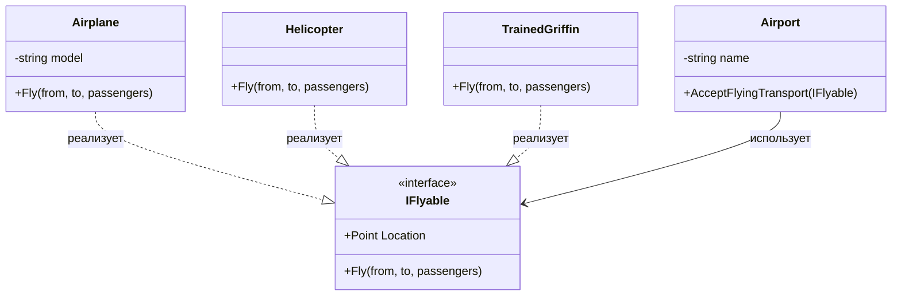

Теперь можно как угодно менять реализацию классов `Airplane`, `Helicopter`, `TrainedGriffin`, пока они следуют контракту `IFlyable`, не беспокоясь о нарушении связи с `Airport`.

---

### Свойства (Properties) в C#

В C# есть **свойства (Properties)** — специальный синтаксис для инкапсуляции полей без необходимости писать отдельные методы-геттеры и сеттеры.

#### Без свойств (традиционный подход):

```csharp
public class BankAccount
{
    private decimal _balance; // Приватное поле

    // Геттер — метод для получения значения
    public decimal GetBalance()
    {
        return _balance;
    }

    // Сеттер — метод для установки значения
    public void SetBalance(decimal value)
    {
        if (value < 0)
            throw new ArgumentException("Баланс не может быть отрицательным");
        
        _balance = value;
    }
}

// Использование
var account = new BankAccount();
account.SetBalance(100);
Console.WriteLine(account.GetBalance());
```

#### Со свойствами:

```csharp
public class BankAccount
{
    private decimal _balance;

    // Свойство с явным backing field
    public decimal Balance
    {
        get { return _balance; }              // Геттер
        private set                            // Приватный сеттер
        {
            if (value < 0)
                throw new ArgumentException("Баланс не может быть отрицательным");
            _balance = value;
        }
    }

    public BankAccount(decimal initialBalance)
    {
        Balance = initialBalance; // Используется сеттер с проверкой
    }
}

// Использование
var account = new BankAccount(100);
Console.WriteLine(account.Balance); // Читаем как поле
// account.Balance = 200; // Ошибка компиляции: сеттер приватный
```

#### Автосвойства (Auto-properties):

Если логика геттера/сеттера проста, можно использовать автосвойства:

```csharp
public class Person
{
    // Автосвойство: компилятор сам создаст backing field
    public string Name { get; set; }
    
    // Автосвойство с приватным сеттером
    public int Age { get; private set; }
    
    // Автосвойство только для чтения (read-only)
    public DateTime BirthDate { get; }

    public Person(string name, DateTime birthDate)
    {
        Name = name;
        BirthDate = birthDate; // Можно установить только в конструкторе
        Age = DateTime.Now.Year - birthDate.Year;
    }
}
```

#### Вычисляемые свойства (Computed properties):

Свойства могут вычислять значение на лету:

```csharp
public class ShoppingCart
{
    private readonly List<Product> _items = new();

    // Свойство вычисляет общую стоимость при каждом обращении
    public decimal TotalCost => _items.Sum(item => item.Price);

    public void AddItem(Product product)
    {
        _items.Add(product);
    }
}

public record Product(string Name, decimal Price);

// Использование
var cart = new ShoppingCart();
cart.AddItem(new Product("Яблоко", 50));
cart.AddItem(new Product("Банан", 30));
Console.WriteLine($"Итого: {cart.TotalCost}"); // Итого: 80
```

**Преимущества свойств**:
- Не нужны отдельные методы `Get...` и `Set...`
- Сохраняют «семантику поля» — можно использовать как обычные поля
- Локализация изменений данных позволяет упрощать поддержание инварианта
- Можно добавить логику проверки позже, не меняя публичный интерфейс

---

### 3. Сокрытие (Information Hiding)

**Сокрытие (Information Hiding)** — разграничение доступа различных частей программы ко внутренним компонентам друг друга.

Эту концепцию не всегда выделяют отдельно, иногда отождествляя с инкапсуляцией:
- В C++ термины тесно пересекаются
- В ML эти понятия абсолютно независимы
- В Python сокрытие отсутствует (всё доступно), хотя инкапсуляция развита

Можно думать так:
- **Сокрытие** — это принцип или механизм языка
- **Инкапсуляция** — это техника проектирования

#### Модификаторы доступа в C#

C# реализует сокрытие через модификаторы доступа:

| Модификатор | Описание |
|-------------|----------|
| `public` | Доступ есть отовсюду |
| `private` | Доступ только внутри типа |
| `protected` | Доступ внутри типа и в дочерних типах |
| `internal` | Доступ только в рамках текущей сборки (assembly) |
| `protected internal` | Доступ в сборке ИЛИ в дочерних типах |
| `private protected` | Доступ в дочерних типах, но только в пределах сборки |

#### Пример сокрытия в C#:

```csharp
public class BankAccount
{
    // Приватное поле — доступно только внутри класса
    private decimal _balance;

    public BankAccount(decimal initialBalance)
    {
        _balance = initialBalance;
    }

    // Публичный метод с контролируемым доступом к приватному полю
    public bool TryWithdraw(decimal amount)
    {
        if (amount > _balance)
            return false; // Недостаточно средств

        _balance -= amount;
        return true;
    }
}

// Использование
var account = new BankAccount(100);
// account._balance = 1000; // Ошибка компиляции: '_balance' недоступен из-за уровня защиты
account.TryWithdraw(50); // Единственный способ изменить баланс
```

#### Отсутствие настоящего сокрытия в Python:

```python
class BankAccount:
    def __init__(self, balance):
        self._balance = balance  # Соглашение: "_" означает "приватное"

    def deposit(self, amount):
        if amount > 0:
            self._balance += amount

    def get_balance(self):
        return self._balance

# Использование
acc = BankAccount(100)
acc.deposit(50)
print(acc.get_balance())  # 150

# Но можно обратиться напрямую!
print(acc._balance)       # 150 — нет настоящего сокрытия
acc._balance = -1000      # Можно нарушить инвариант
```

В Python есть **инкапсуляция** (данные и методы объединены в классе), но нет **сокрытия** — все атрибуты доступны извне. Подчёркивание `_` — лишь соглашение, а не механизм защиты.

**Сокрытие принуждает пользователей использовать поведения, соответствующие бизнес-правилам**.

#### Инкапсуляция + Сокрытие = Абстракция

Объединяя **инкапсуляцию** (данные + методы вместе) и **сокрытие** (ограничение доступа), мы получаем **абстракцию** — «чёрный ящик», который работает предсказуемо и безопасно, не раскрывая деталей реализации.

---

### 4. Наследование (Inheritance)

**Наследование (Inheritance)** — возможность создания новых классов на основе существующих.

Дочерний класс (subclass, derived class) получает все поля и методы родительского класса (superclass, base class) и может добавлять свои или переопределять унаследованные.

#### Основной принцип наследования: отношение "is-a"

Наследование моделирует отношение «является» (is-a relationship):
- `Cat` **is an** `Animal` — Кошка является животным
- `SportsCar` **is a** `Car` — Спортивная машина является машиной
- `Student` **is a** `Person` — Студент является человеком

#### Виртуальные методы (Virtual Methods)

Виртуальные методы позволяют переопределять поведение в дочерних классах:

```csharp
// Базовый класс
public class Car
{
    public Point Location { get; protected set; }

    // Виртуальный метод — может быть переопределён
    public virtual void MoveTo(Point destination)
    {
        Console.WriteLine("Wroom-wroom!"); // Звук обычной машины
        Location = destination;
    }
}

// Дочерний класс переопределяет метод
public class SportsCar : Car
{
    // Переопределяем виртуальный метод родителя
    public override void MoveTo(Point destination)
    {
        Console.WriteLine("Wroom-wroom (fast)!"); // Звук спортивной машины
        Location = destination;
    }
}

// Использование
Car regularCar = new Car();
regularCar.MoveTo(new Point(10, 20)); // Wroom-wroom!

Car sportsCar = new SportsCar();
sportsCar.MoveTo(new Point(10, 20));  // Wroom-wroom (fast)!
```

Обратите внимание: хотя переменная `sportsCar` имеет тип `Car`, вызывается метод `SportsCar.MoveTo` — это **полиморфизм**.

#### Абстрактные методы (Abstract Methods)

Абстрактные методы обязательно должны быть переопределены в дочерних классах:

```csharp
// Абстрактный базовый класс — нельзя создать экземпляр
public abstract class CarBase
{
    public Point Location { get; protected set; }

    // Абстрактный метод — нет реализации, только сигнатура
    public abstract void MoveTo(Point destination);
}

// Дочерний класс обязан реализовать абстрактный метод
public class ElectricCar : CarBase
{
    public override void MoveTo(Point destination)
    {
        Console.WriteLine("Zzzzz..."); // Звук электромобиля
        Location = destination;
    }
}

// Использование
// var car = new CarBase(); // Ошибка: нельзя создать экземпляр абстрактного класса
var electricCar = new ElectricCar();
electricCar.MoveTo(new Point(5, 5)); // Zzzzz...
```

**Разница**:
- **Виртуальный метод** — есть реализация по умолчанию, переопределение необязательно
- **Абстрактный метод** — нет реализации, переопределение обязательно

#### Когда НЕ использовать наследование: антипаттерн наследования для переиспользования кода

Рассмотрим **неправильный** пример использования наследования:

```csharp
// Типы карт
public enum Suit { Hearts, Diamonds, Clubs, Spades }
public enum CardValue { Six, Seven, Eight, Nine, Ten, Jack, Queen, King, Ace }

// Карта
public class Card
{
    public Card(Suit suit, CardValue value)
    {
        Suit = suit;
        Value = value;
    }

    public Suit Suit { get; }
    public CardValue Value { get; }
}

// Колода карт
public class Deck
{
    private readonly List<Card> _cards;

    public Deck(IEnumerable<Card> cards)
    {
        _cards = cards.ToList();
    }

    public IReadOnlyCollection<Card> Cards => _cards.AsReadOnly();

    // Метод перемешивания карт
    public void Shuffle()
    {
        // Логика перемешивания...
    }
}

// ПЛОХО: Dealer наследуется от Deck
public class Dealer : Deck
{
    public Dealer(IEnumerable<Card> cards) : base(cards) { }

    public void StartGame()
    {
        Console.WriteLine("Начинаем игру!");
        Shuffle(); // Используем унаследованный метод
        // Раздача карт...
    }
}
```

**Почему это плохо?**

1. **Нарушение принципа "is-a"**: `Dealer` **is a** `Deck`? Нет! Раздающий — это не колода, раздающий **имеет** колоду.

2. **Наследование ради переиспользования кода**: Здесь наследование используется только для получения метода `Shuffle()`. Но наследование создаёт жёсткую связь — любые изменения в `Deck` могут сломать `Dealer`.

3. **Плохая расширяемость**: Если нужно, чтобы `Dealer` работал с несколькими колодами или использовал другую реализацию колоды, придётся ломать архитектуру.

#### Правильное решение: композиция вместо наследования

```csharp
// Dealer использует Deck, а не наследуется от него
public class Dealer
{
    private readonly Deck _deck; // Dealer имеет колоду (has-a)

    public Dealer(Deck deck)
    {
        _deck = deck;
    }

    public void StartGame()
    {
        Console.WriteLine("Начинаем игру!");
        _deck.Shuffle(); // Используем метод колоды
        // Раздача карт...
    }
}

// Использование
var deck = new Deck(CreateStandardDeck());
var dealer = new Dealer(deck);
dealer.StartGame();
```

**Преимущества**:
1. **Правильное отношение "has-a"**: `Dealer` **has a** `Deck`
2. **Композиция вместо наследования**: `Dealer` использует `Deck` как зависимость
3. **Гибкость**: Легко заменить реализацию (`Deck`, `TestDeck`, `CustomDeck`)
4. **Чёткое разделение ответственности**: `Deck` управляет картами, `Dealer` управляет игрой

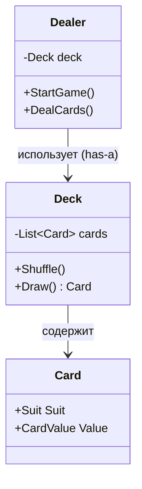

#### Правила использования наследования

✅ **Используйте наследование для**:
- Реализации полиморфизма (работа с объектами разных типов через общий интерфейс)
- Моделирования отношения «является» (is-a)

❌ **НЕ используйте наследование для**:
- Переиспользования бизнес-логики (используйте композицию)
- Создания тесных связей между несвязанными концепциями

**Проблемы наследования**:
- Приводит к сильной связанности между типами
- Со временем становится сложнее разорвать эту связь
- Код становится сложнее рефакторить

> **Принцип**: «Предпочитайте композицию наследованию» (Favor composition over inheritance)

---

### 5. Полиморфизм (Polymorphism)

**Полиморфизм (Polymorphism)** — способность программы выбирать различные реализации при вызове операций с одним и тем же названием.

Другими словами, полиморфизм — это способность объектов разных классов проявлять разное поведение при вызове одного и того же метода.

#### Метафора: мешок с животными

Представьте: мы поместили собак и кошек в мешок. Затем с закрытыми глазами вытаскиваем их по одной. Вытянув животное, мы не знаем его конкретный класс. Но если его погладить, оно издаст звук, специфичный для своего класса.

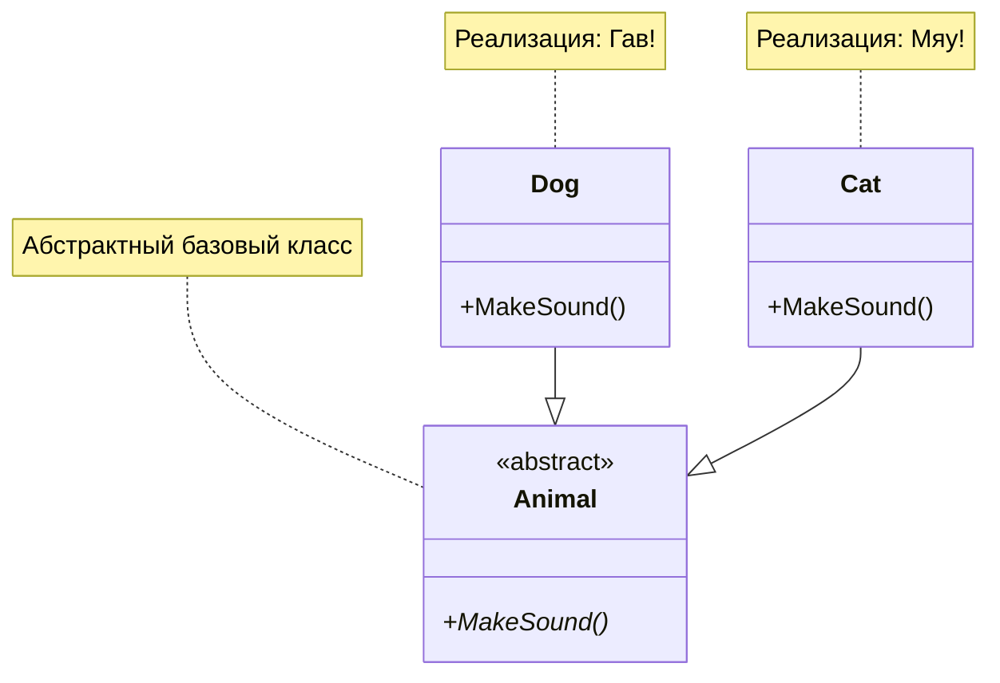

#### Пример кода

```csharp
// Абстрактный базовый класс
public abstract class Animal
{
    public string Name { get; }

    protected Animal(string name)
    {
        Name = name;
    }

    // Абстрактный метод — каждый наследник реализует по-своему
    public abstract void MakeSound();
}

// Собака
public class Dog : Animal
{
    public Dog(string name) : base(name) { }

    public override void MakeSound()
    {
        Console.WriteLine($"{Name} говорит: Гав-гав!");
    }
}

// Кошка
public class Cat : Animal
{
    public Cat(string name) : base(name) { }

    public override void MakeSound()
    {
        Console.WriteLine($"{Name} говорит: Мяу!");
    }
}

// Использование полиморфизма
var animals = new Animal[]
{
    new Cat("Мурка"),
    new Dog("Бобик"),
    new Cat("Васька"),
    new Dog("Шарик")
};

foreach (var animal in animals)
{
    // Во время выполнения вызывается метод соответствующего класса
    animal.MakeSound();
}

// Вывод:
// Мурка говорит: Мяу!
// Бобик говорит: Гав-гав!
// Васька говорит: Мяу!
// Шарик говорит: Гав-гав!
```

Программе неизвестен конкретный класс объекта в переменной `animal`, но благодаря **полиморфизму** вызывается правильный метод.

#### Полиморфизм подтипов (Subtype Polymorphism)

В контексте ООП говорят о **полиморфизме подтипов** — отделение абстракции от реализации, позволяющее прозрачно использовать различные реализации посредством единого контракта.

**Два способа реализации**:

1. **Реализация интерфейсов (наследование поведений)**:
   - Используются интерфейсы (`interface`)
   - В C# реализовывать интерфейсы могут как классы, так и структуры
   - Говорят: «тип **реализует** интерфейс» (`Car` реализует `IMovable`)

2. **Наследование классов (наследование реализации)**:
   - Используются базовые классы
   - В C# структуры не могут наследоваться друг от друга или от классов
   - Говорят: «класс **является наследником** другого класса» (`SportsCar` является наследником `Car`)

#### Пример с интерфейсами

```csharp
// Интерфейс определяет контракт
public interface IMovable
{
    Point Location { get; }
    void MoveTo(Point destination);
}

// Машина реализует интерфейс
public class Car : IMovable
{
    public Point Location { get; private set; }

    public void MoveTo(Point destination)
    {
        Console.WriteLine("Wroom-wroom!");
        Location = destination;
    }
}

// Камень тоже может быть перемещаемым (например, его толкают)
public class Stone : IMovable
{
    public Point Location { get; private set; }

    public void MoveTo(Point destination)
    {
        Console.WriteLine("Flop-flop..."); // Звук перекатывающегося камня
        Location = destination;
    }
}

// Функция принимает любой IMovable объект
public void MoveObject(IMovable obj, Point destination)
{
    Console.WriteLine($"Перемещаем объект из {obj.Location} в {destination}");
    obj.MoveTo(destination);
}

// Использование
var car = new Car();
var stone = new Stone();

MoveObject(car, new Point(10, 10));   // Wroom-wroom!
MoveObject(stone, new Point(5, 5));    // Flop-flop...
```

**Преимущества полиморфизма**:
- Логика, написанная один раз, может выполняться по-разному в зависимости от типа объекта
- Больше отделяем абстракцию от реализации
- Позволяет избежать излишней условной логики (`if-else`, `switch`)
- Позволяет моделировать вариативность логики через типы, реализующие соответствующие поведения

---

### 6. Композиция (Composition)

**Композиция (Composition)** — способ создания одних типов на основе других путём хранения объектов одних типов в объектах других типов.

Другими словами, композиция — это объединение различного поведения и данных в один объект.

#### Базовый пример

```csharp
public class SampleClass
{
    // Класс содержит поля — это композиция
    public int FirstField { get; set; }
    public int SecondField { get; set; }
}
```

#### Композиция моделирует отношение "has-a" (имеет)

В отличие от наследования (is-a), композиция моделирует отношение **«имеет» (has-a)**:
- `Car` **has an** `Engine` — Машина имеет двигатель
- `Dealer` **has a** `Deck` — Раздающий имеет колоду
- `University` **has** `Students` — Университет имеет студентов

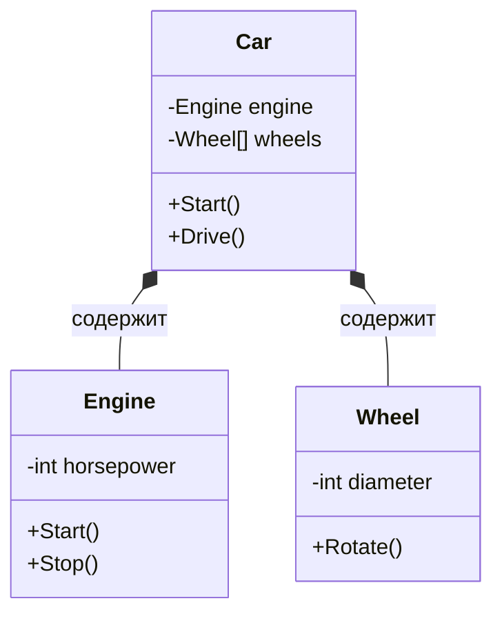

#### Виды композиции

Существуют два основных вида композиции:

1. **Ассоциация (Association)** — объект сам создаёт и управляет жизненным циклом своих компонентов
2. **Агрегация (Aggregation)** — объект получает компоненты извне

> **Примечание о терминологии**: В интернете встречаются разные определения этих терминов. В UML-моделировании «ассоциация» часто используется как общий термин. Однако в практике разработки используется терминология, приведённая ниже, так как она лучше отражает реальные паттерны кода.

---

### 7. Ассоциация (Association)

**Ассоциация (Association)** — вид композиции, при котором хранимые значения создаются самим объектом.

Объект **сам управляет жизненным циклом** своих компонентов: создаёт их, владеет ими и разрушается вместе с ними.

#### Пример: машина и её компоненты

```csharp
public class Engine
{
    public string Type { get; }

    public Engine(string type)
    {
        Type = type;
    }

    public void Start()
    {
        Console.WriteLine($"Двигатель {Type} запущен");
    }
}

public class Wheel
{
    public int Index { get; }

    public Wheel(int index)
    {
        Index = index;
    }
}

public class Car
{
    // Поля создаются и управляются самим объектом Car
    private readonly Engine _engine;
    private readonly Wheel[] _wheels;

    public Car()
    {
        // Car сам создаёт свои компоненты
        _engine = new Engine("V8");
        
        _wheels = Enumerable
            .Range(0, 4)
            .Select(index => new Wheel(index))
            .ToArray();
    }

    public void Start()
    {
        _engine.Start();
        Console.WriteLine("Машина готова к поездке");
    }
}

// Использование
var car = new Car(); // Двигатель и колёса создаются автоматически
car.Start();
/*
Вывод:
Двигатель V8 запущен
Машина готова к поездке
*/
```

В UML ассоциация обозначается простой стрелкой:

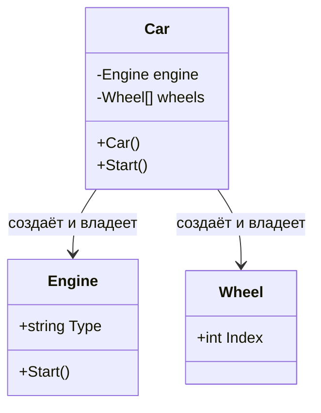

**Характеристики ассоциации**:
- Более высокая связанность между вложенными и содержащими типами
- Мы сами определяем, как создаются вложенные объекты
- Жизненный цикл компонентов жёстко связан с жизненным циклом контейнера

---

### 8. Агрегация (Aggregation)

**Агрегация (Aggregation)** — вид композиции, при котором хранимые значения получаются извне.

Объект **получает уже созданные компоненты** и не управляет их полным жизненным циклом.

#### Пример: точка на плоскости

```csharp
public struct Point2D
{
    // Конструктор принимает готовые значения извне
    public Point2D(double x, double y)
    {
        X = x;
        Y = y;
    }

    public double X { get; }
    public double Y { get; }
}

// Использование
var point = new Point2D(1, 2); // Передаём готовые значения
Console.WriteLine($"X: {point.X}, Y: {point.Y}"); // X: 1, Y: 2
```

#### Пример: университет и студенты

```csharp
public class Student
{
    public int Id { get; }
    public string Name { get; }

    public Student(int id, string name)
    {
        Id = id;
        Name = name;
    }
}

public class University
{
    private readonly List<Student> _students;

    // Университет получает готовый список студентов
    public University(IEnumerable<Student> students)
    {
        _students = students.ToList();
    }

    public IReadOnlyCollection<Student> Students => _students;

    public void Enroll(Student student)
    {
        _students.Add(student);
    }
}

// Использование
var student1 = new Student(1, "Иван");
var student2 = new Student(2, "Мария");

// Студенты созданы вне университета
var university = new University(new[] { student1, student2 });

// Студенты могут существовать независимо от университета
var student3 = new Student(3, "Пётр");
university.Enroll(student3);
```

В UML агрегация изображается с пустым ромбом:

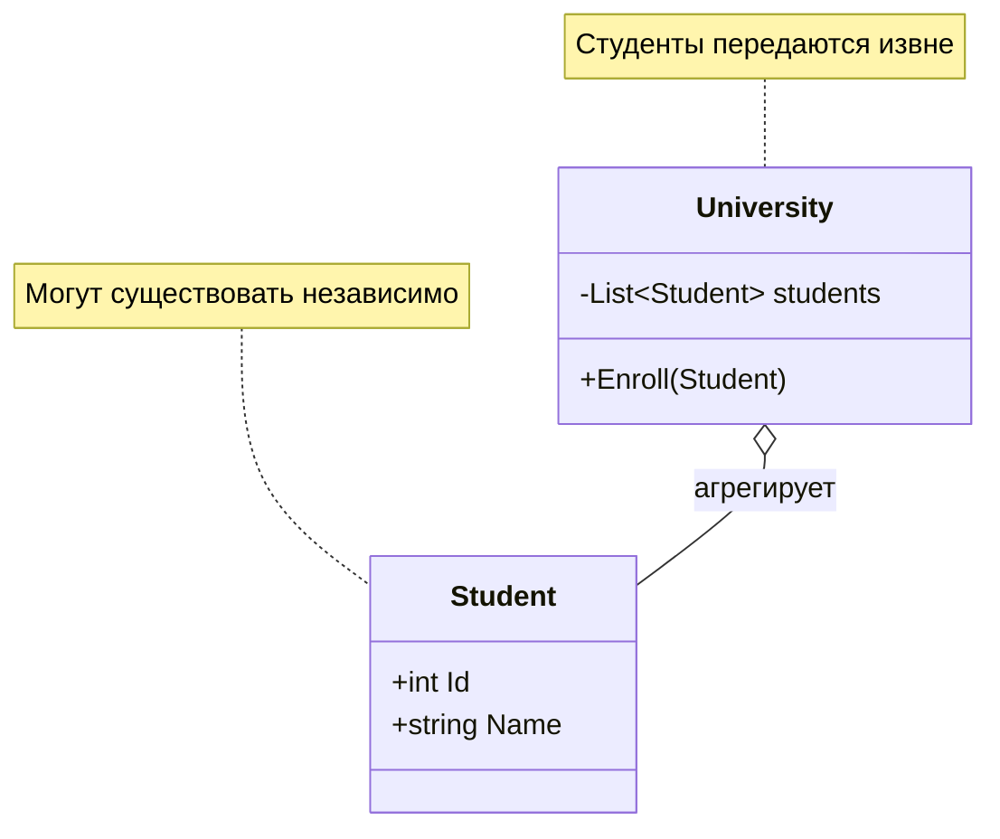

**Характеристики агрегации**:
- Более низкая связанность между вложенными и содержащими типами
- Мы не определяем, как создаются вложенные объекты
- Компоненты могут существовать независимо от контейнера
- Гибкость: легко заменить компоненты, передав другие

#### Сравнение: Ассоциация vs Агрегация

| Критерий | Ассоциация | Агрегация |
|----------|-----------|-----------|
| **Создание компонентов** | Внутри контейнера | Вне контейнера |
| **Жизненный цикл** | Зависит от контейнера | Независим от контейнера |
| **Связанность** | Высокая | Низкая |
| **Гибкость** | Меньше | Больше |
| **UML** | Сплошная линия или стрелка | Линия с пустым ромбом |

```csharp
// АССОЦИАЦИЯ: Car сам создаёт Engine
public class Car
{
    private readonly Engine _engine = new Engine("V8");
}

// АГРЕГАЦИЯ: Car получает Engine извне
public class Car
{
    private readonly Engine _engine;

    public Car(Engine engine)
    {
        _engine = engine;
    }
}
```

**Когда использовать что**:
- **Ассоциация**: когда компоненты — неотъемлемая часть объекта (двигатель и машина)
- **Агрегация**: когда компоненты могут существовать независимо и использоваться повторно (студенты и университет, игроки и команда)

---

## Классы и структуры в C#

В C# есть два основных способа создания пользовательских типов: **классы (classes)** и **структуры (structs)**. Они отличаются способом хранения в памяти и семантикой использования.

### Классы (Reference Types)

```csharp
public class SampleClass
{
    public int FirstField;
    public int SecondField;
}
```

**Характеристики классов**:
- **Ссылочные типы (Reference Types)**
- Данные объекта хранятся в **куче (heap)**
- На **стеке (stack)** хранится только ссылка на объект
- При присваивании копируется ссылка, а не сам объект
- Могут быть `null`
- Поддерживают наследование

```csharp
var obj1 = new SampleClass { FirstField = 10, SecondField = 20 };
var obj2 = obj1; // Копируется ссылка, а не объект

obj2.FirstField = 100;

Console.WriteLine(obj1.FirstField); // 100 — оба объекта указывают на одни данные
Console.WriteLine(obj2.FirstField); // 100
```

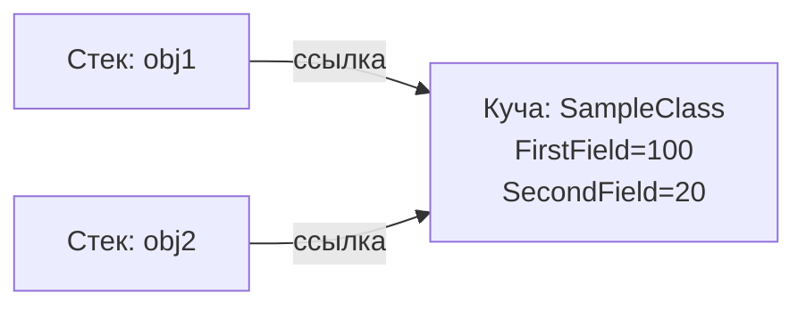

### Структуры (Value Types)

```csharp
public struct SampleStruct
{
    public int FirstField;
    public int SecondField;
}
```

**Характеристики структур**:
- **Значимые типы (Value Types)**
- Данные хранятся там, где находится переменная (обычно на стеке)
- При присваивании копируется весь объект
- Не могут быть `null` (кроме `Nullable<T>` или `T?`)
- Не поддерживают наследование (только реализацию интерфейсов)

```csharp
var struct1 = new SampleStruct { FirstField = 10, SecondField = 20 };
var struct2 = struct1; // Копируется весь объект

struct2.FirstField = 100;

Console.WriteLine(struct1.FirstField); // 10 — struct1 не изменился
Console.WriteLine(struct2.FirstField); // 100 — struct2 независим
```

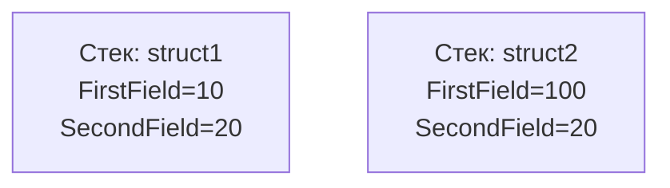

### Когда использовать классы, а когда структуры?

**Используйте структуры**, если:
- Тип представляет одно значение (например, `Point`, `Color`, `Money`)
- Размер типа небольшой (обычно до 16 байт)
- Тип иммутабелен (неизменяемый)
- Не требуется наследование
- Объекты создаются и уничтожаются часто (структуры дешевле в этом плане)

**Используйте классы**, если:
- Тип представляет сложную сущность
- Требуется наследование или полиморфизм
- Тип изменяемый и передаётся по ссылке
- Размер типа большой

**Примеры из .NET**:
- **Структуры**: `int`, `double`, `DateTime`, `Point`, `Guid`
- **Классы**: `string`, `List<T>`, `Object`, большинство пользовательских типов

---

## Иммутабельность

**Иммутабельность (Immutability, неизменяемость)** — свойство объекта, при котором его состояние не изменяется после создания.

В ООП реализуется с помощью инкапсуляции и объявления всех полей неизменяемыми (`readonly` для полей, только `get` для свойств). Используется для обеспечения надёжности, предсказуемости и потокобезопасности данных.

> **Термины**:
> - **Mutable (изменяемый)** — объект можно изменить после создания
> - **Immutable (неизменяемый)** — объект нельзя изменить после создания

### Проблема излишней мутабельности

Рассмотрим типичный пример плохо спроектированного класса:

```csharp
// ПЛОХО: Излишняя мутабельность
public class StudentGroup
{
    // Все свойства публично изменяемы
    public long Id { get; set; }
    public string Name { get; set; }
    public List<long> StudentIds { get; set; }

    public void AddStudent(long studentId)
    {
        // Пытаемся контролировать добавление через метод
        if (StudentIds.Contains(studentId) is false)
            StudentIds.Add(studentId);
    }
}

// Использование
var group = new StudentGroup
{
    Id = 1,
    Name = "P3255",
    StudentIds = new List<long> { 101, 102, 103 }
};

// Проблемы:
group.Id = -1;                    // ❌ Можем установить некорректный ID
group.StudentIds.Clear();         // ❌ Можем обойти метод AddStudent и напрямую очистить список
group.StudentIds = null;          // ❌ Можем установить null
```

**Проблемы этого кода**:
1. Любой внешний код может изменить любое свойство
2. Невозможно гарантировать инварианты (например, «ID всегда положительный»)
3. Метод `AddStudent` обходится прямым доступом к `StudentIds`

### Минимизация мутабельности

Правильный подход — **контролировать изменения** через методы класса:

```csharp
// ХОРОШО: Контролируемая мутабельность
public class StudentGroup
{
    // Приватное изменяемое поле для хранения студентов
    private readonly HashSet<long> _studentIds;

    public StudentGroup(long id, string name)
    {
        // Валидация при создании
        if (id <= 0)
            throw new ArgumentException("ID должен быть положительным", nameof(id));
        
        if (string.IsNullOrWhiteSpace(name))
            throw new ArgumentException("Имя группы не может быть пустым", nameof(name));

        Id = id;
        Name = name;
        _studentIds = new HashSet<long>(); // Создаём пустую коллекцию
    }

    // Иммутабельное свойство (только get)
    public long Id { get; }
    
    // Изменяемое свойство с валидацией
    private string _name;
    public string Name
    {
        get => _name;
        set
        {
            if (string.IsNullOrWhiteSpace(value))
                throw new ArgumentException("Имя группы не может быть пустым");
            _name = value;
        }
    }

    // Только для чтения (read-only collection)
    public IReadOnlyCollection<long> StudentIds => _studentIds;

    // Единственный способ добавить студента
    public bool AddStudent(long studentId)
    {
        if (studentId <= 0)
            return false; // Некорректный ID

        return _studentIds.Add(studentId); // HashSet сам проверит уникальность
    }

    // Единственный способ удалить студента
    public bool RemoveStudent(long studentId)
    {
        return _studentIds.Remove(studentId);
    }
}

// Использование
var group = new StudentGroup(1, "P3255");

// ✅ Можем только читать ID
Console.WriteLine(group.Id);

// ❌ Нельзя изменить ID
// group.Id = 2; // Ошибка компиляции: свойство только для чтения

// ✅ Можем изменить имя (но с валидацией)
group.Name = "P3256"; // OK

// ❌ Нельзя установить некорректное имя
// group.Name = ""; // ArgumentException

// ✅ Можем только читать коллекцию студентов
foreach (var studentId in group.StudentIds)
{
    Console.WriteLine(studentId);
}

// ❌ Нельзя модифицировать коллекцию напрямую
// group.StudentIds.Clear(); // Ошибка компиляции: StudentIds — IReadOnlyCollection

// ✅ Единственный способ изменить — через метод
group.AddStudent(101);
group.AddStudent(102);
group.RemoveStudent(101);
```

**Преимущества этого подхода**:
- `Id` — иммутабелен, задаётся только в конструкторе
- `Name` — изменяем, но с валидацией
- `_studentIds` — приватное и `readonly` (нельзя заменить коллекцию целиком)
- `StudentIds` — публичное read-only представление (нельзя модифицировать извне)
- Изменения только через методы `AddStudent` / `RemoveStudent`, которые контролируют логику

### Полная иммутабельность

Иногда объект вообще не должен изменяться после создания. Это типично для **Value Objects** (объектов-значений):

```csharp
// Полностью иммутабельный класс
public class Point
{
    public Point(double x, double y)
    {
        X = x;
        Y = y;
    }

    // Свойства только для чтения
    public double X { get; }
    public double Y { get; }

    // "Изменение" возвращает новый объект
    public Point MoveTo(double newX, double newY)
    {
        return new Point(newX, newY); // Создаём новый объект
    }

    // Перегрузка операторов для удобства
    public static Point operator +(Point a, Point b)
    {
        return new Point(a.X + b.X, a.Y + b.Y);
    }
}

// Использование
var point1 = new Point(10, 20);
var point2 = point1.MoveTo(15, 25); // Создаётся новый объект

Console.WriteLine($"Point1: ({point1.X}, {point1.Y})"); // (10, 20) — не изменился
Console.WriteLine($"Point2: ({point2.X}, {point2.Y})"); // (15, 25)
```

**Преимущества полной иммутабельности**:
- Потокобезопасность: можно безопасно использовать в многопоточной среде
- Предсказуемость: объект всегда в корректном состоянии
- Упрощение: не нужно отслеживать изменения

### Record-типы в современном C#

**Record-типы (Record Types)** — специальный вид типов в C#, предназначенный для создания иммутабельных объектов с семантикой значений. Появились в C# 9 и были усовершенствованы в последующих версиях.

```csharp
// Record — иммутабельный по умолчанию
public record Point(double X, double Y);

// Использование
var point1 = new Point(10, 20);

// "Изменение" с помощью with-выражения (создаёт новый объект)
var point2 = point1 with { X = 15 };

Console.WriteLine(point1); // Point { X = 10, Y = 20 }
Console.WriteLine(point2); // Point { X = 15, Y = 20 }

// Record автоматически реализует равенство по значению
var point3 = new Point(10, 20);
Console.WriteLine(point1 == point3); // True
```

**Принцип**: Не запрещаем изменения полностью, но контролируем их через методы класса и минимизируем мутабельность там, где она не нужна.

---

## Конвенции Find/Get

В объектно-ориентированном коде важна **семантика** методов — по названию метода должно быть понятно его поведение.

Существуют общепринятые конвенции для методов доступа к данным, особенно при поиске объектов:

### Конвенция GetXxx

**`GetXxx`** — метод, который **гарантированно возвращает объект**.

- Если объект не найден, метод **выбрасывает исключение**
- Используется, когда отсутствие объекта — это **ошибка**

**Пример**:

```csharp
public class User
{
    private readonly List<Post> _posts;

    public User(IEnumerable<Post> posts)
    {
        _posts = posts.ToList();
    }

    // GetPostById — пост ДОЛЖЕН существовать
    public Post GetPostById(long postId)
    {
        // Single выбросит исключение, если элемент не найден или найдено больше одного
        return _posts.Single(post => post.Id == postId);
    }
}

// Использование
try
{
    var post = user.GetPostById(123); // Ожидаем, что пост с ID=123 существует
    Console.WriteLine(post.Title);
}
catch (InvalidOperationException)
{
    // Это исключительная ситуация — пост должен был быть
    Console.WriteLine("Ошибка: пост не найден");
}
```

### Конвенция FindXxx

**`FindXxx`** — метод, который **может вернуть `null`**, если объект не найден.

- Отсутствие объекта — это **нормальный сценарий**
- Не выбрасывает исключение при отсутствии результата

**Пример**:

```csharp
public class User
{
    private readonly List<Post> _posts;

    public User(IEnumerable<Post> posts)
    {
        _posts = posts.ToList();
    }

    // FindPostByTitle — пост может отсутствовать
    public Post? FindPostByTitle(string title)
    {
        // SingleOrDefault вернёт null, если элемент не найден
        return _posts.SingleOrDefault(post => post.Title == title);
    }
}

// Использование
var post = user.FindPostByTitle("Hello World");

if (post is not null)
{
    Console.WriteLine($"Найден пост: {post.Title}");
}
else
{
    Console.WriteLine("Пост с таким названием не найден");
}
```

### Типичная ошибка: нарушение семантики

```csharp
// ❌ ПЛОХО: FindPostById использует Single(), который выбрасывает исключение
public Post FindPostById(long postId)
{
    return _posts.Single(post => post.Id == postId); // Нарушение семантики Find
}

// ❌ ПЛОХО: GetPostByTitle использует SingleOrDefault(), который возвращает null
public Post? GetPostByTitle(string title)
{
    return _posts.SingleOrDefault(post => post.Title == title); // Нарушение семантики Get
}
```

**Почему это плохо?**
- Разработчики ожидают, что `Find` не выбросит исключение
- Разработчики ожидают, что `Get` либо вернёт объект, либо выбросит исключение
- Нарушение конвенций делает код непредсказуемым и сложным в использовании

### Правильная реализация

```csharp
public record Post(long Id, string Title, string Content);

public class User
{
    private readonly List<Post> _posts;

    public User(IEnumerable<Post> posts)
    {
        _posts = posts.ToList();
    }

    // Get — гарантирует наличие объекта или выбрасывает исключение
    public Post GetPostById(long postId)
    {
        return _posts.Single(post => post.Id == postId);
    }

    // Find — возвращает null, если объект не найден
    public Post? FindPostByTitle(string title)
    {
        return _posts.SingleOrDefault(post => post.Title == title);
    }

    // TryGet — альтернативный подход (паттерн TryXxx из .NET)
    public bool TryGetPostById(long postId, out Post? post)
    {
        post = _posts.SingleOrDefault(post => post.Id == postId);
        return post is not null;
    }
}

// Использование
var user = new User(new[]
{
    new Post(1, "Первый пост", "Содержание 1"),
    new Post(2, "Второй пост", "Содержание 2")
});

// Get — ожидаем, что пост существует
try
{
    var post = user.GetPostById(1);
    Console.WriteLine(post.Title); // Первый пост
}
catch (InvalidOperationException)
{
    Console.WriteLine("Ошибка: пост не найден");
}

// Find — пост может отсутствовать
var foundPost = user.FindPostByTitle("Третий пост");
if (foundPost is not null)
{
    Console.WriteLine(foundPost.Title);
}
else
{
    Console.WriteLine("Пост не найден"); // Нормальная ситуация
}

// TryGet — альтернативный подход
if (user.TryGetPostById(2, out var post2))
{
    Console.WriteLine(post2.Title); // Второй пост
}
```

### Таблица конвенций

| Конвенция | Возвращаемый тип | Поведение при отсутствии | Когда использовать |
|-----------|------------------|--------------------------|-------------------|
| `GetXxx` | `T` | Выбрасывает исключение | Объект должен существовать |
| `FindXxx` | `T?` | Возвращает `null` | Объект может отсутствовать |
| `TryGetXxx` | `bool` + `out T?` | Возвращает `false` | Альтернатива `Find` (стиль .NET) |

---

## Обработка исключений и Result Pattern

При проектировании методов важно правильно обрабатывать ошибки и отказы. Две распространённые ошибки:

1. **Исключения не отражены в сигнатуре метода** (протёкшая абстракция)
2. **Неудачное выполнение операции трактуется как исключительная ситуация**

### Проблема 1: Протёкшая абстракция

Рассмотрим метод:

```csharp
public void AddStudent(long id)
{
    if (_studentIds.Count == MaxStudentCount)
        throw new InvalidOperationException("Достигнут лимит студентов");

    _studentIds.Add(id);
}
```

**Проблема**: По сигнатуре `void AddStudent(long id)` невозможно понять, что метод может выбросить `InvalidOperationException`.

Пользователю класса придётся:
- Читать внутренний код
- Читать документацию
- Или узнать об исключении во время выполнения

Это **протёкшая абстракция** — чтобы корректно использовать класс, нужно знать детали реализации.

### Проблема 2: Предсказуемые сценарии как исключения

Неудача в работе метода не всегда должна быть исключением. Представим добавление студентов в группу:

**Возможные сценарии**:
- Студент уже есть в группе
- Студент попал не в тот поток
- В группе есть полный тёзка
- Студент не найден (возможно, ещё не добавлен в систему)
- Группа переполнена
- Нарушены правила распределения по гендеру
- И так далее...

Всё это — **предсказуемые бизнес-сценарии**, а не ошибки. Бросать исключения в таких случаях неправильно.

**Исключения нужны для**:
- Технических сбоев (падение БД, сбой сети)
- Нарушения контрактов (передали `null` вместо объекта)
- Непредвиденных ситуаций

**Для предсказуемых сценариев** используйте **Result Pattern**.

### Result Pattern

Result Pattern — это паттерн, при котором метод возвращает объект-результат, явно описывающий исход операции.

#### Реализация Result Pattern

```csharp
// Абстрактный базовый класс для результата
public abstract record AddStudentResult
{
    // Приватный конструктор — наследники только внутри класса
    private AddStudentResult() { }

    // Возможные результаты
    public sealed record Success : AddStudentResult;
    public sealed record AlreadyMember : AddStudentResult;
    public sealed record StudentLimitReached(int Limit) : AddStudentResult;
}
```

**Почему так**:
- `AddStudentResult` — абстрактный, нельзя создать напрямую
- Приватный конструктор — нельзя наследоваться извне
- Все возможные результаты определены внутри класса
- `sealed` — нельзя создать дополнительные подклассы

#### Использование в классе

```csharp
public class StudentGroup
{
    private readonly HashSet<long> _studentIds;
    private const int MaxStudentCount = 30;

    public StudentGroup(long id, string name)
    {
        Id = id;
        Name = name;
        _studentIds = new HashSet<long>();
    }

    public long Id { get; }
    public string Name { get; }
    public IReadOnlyCollection<long> StudentIds => _studentIds;

    // Метод возвращает Result вместо выброса исключений
    public AddStudentResult AddStudent(long studentId)
    {
        // Проверка лимита
        if (_studentIds.Count >= MaxStudentCount)
            return new AddStudentResult.StudentLimitReached(MaxStudentCount);

        // Попытка добавления (HashSet.Add возвращает false, если элемент уже есть)
        if (_studentIds.Add(studentId) is false)
            return new AddStudentResult.AlreadyMember();

        // Успех
        return new AddStudentResult.Success();
    }
}
```

#### Обработка результата

**Вариант 1: Pattern matching с switch-выражением**

```csharp
var group = new StudentGroup(1, "P3255");
AddStudentResult result = group.AddStudent(101);

switch (result)
{
    case AddStudentResult.Success:
        Console.WriteLine("✅ Студент успешно добавлен");
        break;
    
    case AddStudentResult.AlreadyMember:
        Console.WriteLine("ℹ️ Студент уже состоит в группе");
        break;
    
    case AddStudentResult.StudentLimitReached(var limit):
        Console.WriteLine($"❌ Достигнут лимит студентов: {limit}");
        break;
}
```

**Вариант 2: Pattern matching с if**

```csharp
if (result is AddStudentResult.Success)
{
    Console.WriteLine("✅ Студент успешно добавлен");
    return;
}

if (result is AddStudentResult.AlreadyMember)
{
    Console.WriteLine("ℹ️ Студент уже в группе");
    return;
}

if (result is AddStudentResult.StudentLimitReached limitReached)
{
    Console.WriteLine($"❌ Лимит {limitReached.Limit} достигнут");
    return;
}

// Этот код недостижим, если обработали все случаи
Console.WriteLine("⚠️ Неожиданный результат");
```

### Преимущества Result Pattern

1. **Явный контракт**: Сигнатура `AddStudentResult AddStudent(long id)` явно показывает, что метод может завершиться по-разному
2. **Нет протёкшей абстракции**: Все возможные результаты описаны в типе `AddStudentResult`
3. **Производительность**: Обработка результата дешевле, чем выброс исключений
4. **Компилятор помогает**: При добавлении нового результата компилятор подскажет, где нужно обновить обработку
5. **Читаемость**: Код явно показывает все возможные исходы

### Когда использовать исключения, а когда Result?

| Ситуация | Использовать |
|----------|--------------|
| Технический сбой (БД, сеть) | **Исключение** |
| Нарушение контракта (null, некорректный аргумент) | **Исключение** |
| Непредвиденная ситуация | **Исключение** |
| Предсказуемый бизнес-сценарий | **Result Pattern** |
| Валидация бизнес-правил | **Result Pattern** |
| Операция «попытка сделать» | **Result Pattern** |

**Правило**: Используй исключения только для реальных ошибок (непредвиденных, технических), а для предсказуемых сценариев неудачи — Result Types.

---

## Value Objects

**Value Object (Объект-значение)** — фундаментальная концепция из **Domain-Driven Design (DDD, проектирование, ориентированное на предметную область)**.

### Основная идея

Не используйте «сырые» примитивные типы (`decimal`, `string`, `int`) для представления значимых для предметной области понятий. Вместо этого создавайте специализированные типы, инкапсулирующие всю связанную логику, проверки и правила.

**Примеры**:
- Вместо `decimal` → `Money`
- Вместо `string` → `Email`
- Вместо `double` → `Distance`

### Три столпа Value Object

#### 1. Инкапсуляция инвариантов

Value Object сам отвечает за свою валидность. **Невозможно создать некорректный Value Object**.

**Пример**:
- `Money` не может быть отрицательным
- `Email` должен содержать `@` и домен
- `Speed` не может быть меньше 0

**Реализация**: Проверка в конструкторе или через статический метод `Create()` / `TryCreate()`.

#### 2. Неизменяемость (Immutability)

После создания Value Object его внутреннее состояние не изменяется. Любая «модификация» возвращает новый экземпляр.

**Почему важно**:
- Гарантирует потокобезопасность
- Позволяет безопасно передавать между объектами
- Инварианты не могут быть нарушены случайно
- Упрощает код и делает его предсказуемым

#### 3. Равенство по значению (Value-Based Equality)

Два Value Object равны, если их значения равны, независимо от того, указывают ли они на одну область памяти.

```csharp
var money1 = new Money(100, "USD");
var money2 = new Money(100, "USD");

Console.WriteLine(money1 == money2); // True — равны по значению
```

### Пример: Money (Деньги)

#### Проблемный код без Value Object

```csharp
// ПЛОХО: использование примитива decimal
public class BankAccount
{
    public decimal Balance { get; private set; }

    public void Withdraw(decimal amount)
    {
        // Проверка на каждом месте использования
        if (amount < 0)
            throw new ArgumentException("Сумма не может быть отрицательной");

        Balance -= amount;
    }

    public void Deposit(decimal amount)
    {
        // Дублирование проверки
        if (amount < 0)
            throw new ArgumentException("Сумма не может быть отрицательной");

        Balance += amount;
    }
}
```

**Проблемы**:
- Проверки дублируются в каждом методе
- Легко забыть добавить проверку
- `decimal` не выражает бизнес-смысл «деньги»

#### Правильный код с Value Object

```csharp
// Value Object для денег
public readonly struct Money
{
    public Money(decimal value)
    {
        // Инкапсуляция инварианта: Money не может быть отрицательным
        if (value < 0)
        {
            throw new ArgumentException(
                "Сумма денег не может быть отрицательной",
                nameof(value));
        }

        Value = value;
    }

    // Неизменяемое свойство
    public decimal Value { get; }

    // Перегрузка оператора: возвращает новый объект
    public static Money operator -(Money left, Money right)
    {
        var result = left.Value - right.Value;
        return new Money(result); // Создаётся новый объект (проверка в конструкторе)
    }

    public static Money operator +(Money left, Money right)
    {
        return new Money(left.Value + right.Value);
    }

    // Сравнение по значению
    public static bool operator <(Money left, Money right)
    {
        return left.Value < right.Value;
    }

    public static bool operator >(Money left, Money right)
    {
        return left.Value > right.Value;
    }

    public override string ToString()
    {
        return $"${Value:F2}";
    }
}

// Использование Money в BankAccount
public class BankAccount
{
    // Тип явно указывает: это деньги, а не просто число
    public Money Balance { get; private set; }

    public BankAccount(Money initialBalance)
    {
        Balance = initialBalance;
    }

    public void Withdraw(Money amount)
    {
        // Вся логика проверки уже в Money
        // Просто выполняем операцию, доверяя типу Money
        Balance -= amount;
    }

    public void Deposit(Money amount)
    {
        Balance += amount;
    }
}

// Использование
var account = new BankAccount(new Money(1000));
account.Deposit(new Money(500));
account.Withdraw(new Money(200));

Console.WriteLine($"Баланс: {account.Balance}"); // Баланс: $1300.00

// Попытка создать отрицательную сумму вызовет исключение
try
{
    var invalidMoney = new Money(-100); // ArgumentException
}
catch (ArgumentException ex)
{
    Console.WriteLine(ex.Message);
}
```

### Комбинация Value Object и Result Pattern

Можно возникнуть вопрос: «А что если добавить Result Pattern в сам Value Object?»

**Ответ**: Это будет ошибкой. Вот почему:

#### В методах Entity (BankAccount) — Result Pattern уместен

```csharp
public class BankAccount
{
    public Money Balance { get; private set; }

    public BankAccount(Money initialBalance)
    {
        Balance = initialBalance;
    }

    // Result Pattern для бизнес-операции
    public WithdrawResult Withdraw(Money amount)
    {
        // Недостаточно средств — это предсказуемый бизнес-сценарий
        if (Balance < amount)
        {
            return new WithdrawResult.InsufficientFunds(Balance);
        }

        Balance -= amount;
        return new WithdrawResult.Success();
    }
}

// Определение результата
public abstract record WithdrawResult
{
    private WithdrawResult() { }

    public sealed record Success : WithdrawResult;
    public sealed record InsufficientFunds(Money CurrentBalance) : WithdrawResult;
}
```

Это правильно, потому что:
- `BankAccount` — это **Entity (Сущность)** с жизненным циклом
- «Недостаточно средств» — штатный бизнес-сценарий, а не ошибка

#### В Value Object (Money) — Result Pattern НЕ нужен

```csharp
// ❌ ПЛОХО: Result в Value Object
public class Money
{
    public static Result<Money> Create(decimal amount)
    {
        if (amount < 0)
        {
            return Result.Failure<Money>("Сумма не может быть отрицательной");
        }
        return Result.Success(new Money(amount));
    }
}

// Использование становится громоздким
var amountResult = Money.Create(-10);
if (amountResult.IsSuccess)
{
    var account = new BankAccount(amountResult.Value);
}
else
{
    // Что делать? Логировать баг? Падать?
}
```

**Почему это плохо**:

1. **Value Object гарантирует инвариант**: Задача Value Object — **никогда не существовать в невалидном состоянии**. Если программист пытается создать `new Money(-10)`, это **баг**, а не предсказуемый сценарий.

2. **Перекладывание ответственности**: Проверка инварианта перекладывается с `Money` на каждого вызывающего. Нужно везде проверять `IsSuccess`.

3. **Забытые проверки**: Легко забыть проверку → невалидный `Money` «просочится» в систему.

4. **Поздняя диагностика**: Если выбросить исключение сразу в конструкторе, баг обнаруживается немедленно. С Result — где-то посередине бизнес-операции.

**Правильно**: Выбрасывать исключение в конструкторе Value Object.

```csharp
// ✅ ХОРОШО: Исключение в конструкторе
public Money(decimal value)
{
    if (value < 0)
        throw new ArgumentException("Сумма не может быть отрицательной");
    
    Value = value;
}
```

### Расширенный пример: Money с валютой

```csharp
public readonly struct Money : IEquatable<Money>
{
    public Money(decimal amount, string currency)
    {
        if (amount < 0)
            throw new ArgumentException("Сумма не может быть отрицательной", nameof(amount));
        
        if (string.IsNullOrWhiteSpace(currency))
            throw new ArgumentException("Валюта обязательна", nameof(currency));

        Amount = amount;
        Currency = currency.ToUpperInvariant();
    }

    public decimal Amount { get; }
    public string Currency { get; }

    // Сложение денег с проверкой валюты
    public static Money operator +(Money left, Money right)
    {
        if (left.Currency != right.Currency)
            throw new InvalidOperationException(
                $"Нельзя складывать деньги в разных валютах: {left.Currency} и {right.Currency}");

        return new Money(left.Amount + right.Amount, left.Currency);
    }

    // Вычитание
    public static Money operator -(Money left, Money right)
    {
        if (left.Currency != right.Currency)
            throw new InvalidOperationException(
                $"Нельзя вычитать деньги в разных валютах: {left.Currency} и {right.Currency}");

        return new Money(left.Amount - right.Amount, left.Currency);
    }

    // Сравнение
    public static bool operator <(Money left, Money right)
    {
        if (left.Currency != right.Currency)
            throw new InvalidOperationException("Нельзя сравнивать деньги в разных валютах");

        return left.Amount < right.Amount;
    }

    public static bool operator >(Money left, Money right)
    {
        if (left.Currency != right.Currency)
            throw new InvalidOperationException("Нельзя сравнивать деньги в разных валютах");

        return left.Amount > right.Amount;
    }

    // Равенство по значению
    public bool Equals(Money other)
    {
        return Amount == other.Amount && Currency == other.Currency;
    }

    public override bool Equals(object? obj)
    {
        return obj is Money other && Equals(other);
    }

    public override int GetHashCode()
    {
        return HashCode.Combine(Amount, Currency);
    }

    public static bool operator ==(Money left, Money right)
    {
        return left.Equals(right);
    }

    public static bool operator !=(Money left, Money right)
    {
        return !left.Equals(right);
    }

    public override string ToString()
    {
        return $"{Amount:F2} {Currency}";
    }
}

// Использование
var usd1 = new Money(100, "USD");
var usd2 = new Money(50, "USD");
var eur = new Money(80, "EUR");

var total = usd1 + usd2; // OK: 150.00 USD
Console.WriteLine(total);

// var invalid = usd1 + eur; // InvalidOperationException: нельзя складывать разные валюты

Console.WriteLine(usd1 == new Money(100, "USD")); // True — равенство по значению
```

### Когда использовать Value Objects

✅ **Используйте Value Objects для**:
- Денег, валют
- Email-адресов, телефонных номеров
- Расстояний, скорости, температуры
- Координат, адресов
- Идентификаторов (если они имеют бизнес-смысл)

❌ **Не используйте Value Objects для**:
- Сущностей с жизненным циклом (`User`, `Order`)
- Примитивов без бизнес-правил (простые `int`, `string` для имён переменных)

**Принцип**: Value Object — это типы, которые поддерживают для нас определённый инвариант и имеют бизнес-смысл в предметной области.

---

### Перегрузка операторов: когда и почему нельзя

Перегрузка операторов (Operator Overloading) — мощный инструмент C#, позволяющий определять собственное поведение стандартных операторов (`+`, `-`, `*`, `/`, `==`, и т.д.) для пользовательских типов. Однако этот инструмент требует осторожности и соблюдения принципов.

#### Правило: Value Object + Value Object, но не Value Object + Primitive

**Ключевое правило**: Операторы должны работать только между **Value Object одного типа**, но **не между Value Object и примитивом**.

**Правильно**:
```csharp
public static Money operator +(Money left, Money right) // ✅ Money + Money
public static Distance operator -(Distance left, Distance right) // ✅ Distance - Distance
```

**Неправильно**:
```csharp
public static Money operator +(Money left, int right) // ❌ Money + int
public static Money operator *(Money left, decimal right) // ❌ Money * decimal
```

#### Антипаттерн: смешивание Value Object с примитивами

Рассмотрим пример **неправильной** реализации `Money`:

```csharp
// ❌ АНТИПАТТЕРН: Перегрузка оператора для комбинации с примитивом
public readonly struct Money
{
    public Money(decimal value)
    {
        if (value < 0)
            throw new ArgumentException("Сумма не может быть отрицательной");
        
        Value = value;
    }

    public decimal Value { get; }

    // ❌ ПЛОХО: Оператор сложения Money + int
    public static Money operator +(Money money, int amount)
    {
        return new Money(money.Value + amount);
    }

    // ❌ ПЛОХО: Оператор умножения Money * decimal
    public static Money operator *(Money money, decimal multiplier)
    {
        return new Money(money.Value * multiplier);
    }
}

// Использование
var money = new Money(100);
var result1 = money + 50;        // Money + int — компилируется, но это плохо
var result2 = money * 1.5m;      // Money * decimal — компилируется, но это плохо
```

**Почему это антипаттерн?**

1. **Нарушение инкапсуляции**: Примитив `int` или `decimal` не знает о бизнес-правилах `Money`. Операция `money + 50` создаёт иллюзию, что `50` — это деньги, хотя это просто число. Что если `50` — это не доллары, а рубли? Или это не деньги, а количество товаров?

2. **Потеря смысла**: `Money` должен работать только с `Money`. Число `50` само по себе не имеет денежного смысла — это просто число. Если нужно добавить деньги, создайте явно `new Money(50)`.

3. **Неявные преобразования опасны**: Разрешая `money + 50`, мы размываем типобезопасность. Код становится похож на работу с примитивами, но с ложным ощущением защищённости.

4. **Нарушение единообразия**: Если есть `Money + int`, программисты начнут ожидать `int + Money`. Придётся определять оба оператора, что приводит к ещё большей путанице.

5. **Сложность расширения**: Что если добавится валюта? `money + 50` — это 50 долларов, рублей, евро? Примитив не несёт этой информации.

#### Правильная реализация: явное создание Value Object

```csharp
// ✅ ПРАВИЛЬНО: Операторы только между Value Object одного типа
public readonly struct Money
{
    public Money(decimal value)
    {
        if (value < 0)
            throw new ArgumentException("Сумма не может быть отрицательной");
        
        Value = value;
    }

    public decimal Value { get; }

    // ✅ ХОРОШО: Money + Money
    public static Money operator +(Money left, Money right)
    {
        return new Money(left.Value + right.Value);
    }

    // ✅ ХОРОШО: Money - Money
    public static Money operator -(Money left, Money right)
    {
        return new Money(left.Value - right.Value);
    }

    // ❌ НЕТ operator +(Money, int)
    // ❌ НЕТ operator *(Money, decimal)
}

// Использование
var money = new Money(100);

// ✅ ПРАВИЛЬНО: явно создаём Money
var result1 = money + new Money(50);

// ✅ ПРАВИЛЬНО: явное создание из примитива
var amount = new Money(50);
var result2 = money + amount;

// ❌ НЕ КОМПИЛИРУЕТСЯ (и это хорошо!)
// var result3 = money + 50; // Ошибка компиляции: нет оператора Money + int
```

#### Прямой доступ к внутреннему значению — ещё один антипаттерн

Другая распространённая ошибка — предоставление публичного сеттера или изменяемого поля:

```csharp
// ❌ АНТИПАТТЕРН: Прямой доступ к внутреннему значению
public class Money
{
    // ❌ ПЛОХО: публичный сеттер позволяет обойти валидацию
    public decimal Value { get; set; }

    public Money(decimal value)
    {
        if (value < 0)
            throw new ArgumentException("Сумма не может быть отрицательной");
        
        Value = value;
    }
}

// Использование
var money = new Money(100); // Валидация в конструкторе прошла

// ❌ ПРОБЛЕМА: Обход валидации через сеттер
money.Value = -500; // Инвариант нарушен! Money теперь отрицательный!
```

**Почему это плохо?**

1. **Обход инварианта**: Value Object должен **всегда** находиться в валидном состоянии. Публичный сеттер позволяет установить некорректное значение в обход конструктора.

2. **Нарушение неизменяемости**: Value Object должен быть иммутабельным. Сеттер делает его изменяемым, что ведёт к проблемам с многопоточностью и предсказуемостью.

3. **Потеря гарантий**: Если `Value` можно изменить, мы не можем доверять `Money` — нужно проверять его валидность перед каждым использованием, что делает Value Object бесполезным.

**Правильная реализация**:

```csharp
// ✅ ПРАВИЛЬНО: Только геттер, сеттер приватный или отсутствует
public readonly struct Money
{
    public Money(decimal value)
    {
        if (value < 0)
            throw new ArgumentException("Сумма не может быть отрицательной");
        
        Value = value;
    }

    // ✅ ХОРОШО: Только getter, изменить нельзя
    public decimal Value { get; }

    // ✅ ХОРОШО: "Изменение" возвращает новый объект
    public Money Add(Money other)
    {
        return new Money(Value + other.Value);
    }
}
```

Использование `readonly struct` в C# дополнительно гарантирует неизменяемость на уровне компилятора.

#### Сравнение: правильный и неправильный подходы

| Аспект | ❌ Антипаттерн | ✅ Правильный подход |
|--------|--------------|-------------------|
| **Операторы** | `Money + int`, `Money * decimal` | `Money + Money`, `Money - Money` |
| **Доступ к значению** | `public decimal Value { get; set; }` | `public decimal Value { get; }` |
| **Создание из примитива** | Неявно через оператор | Явно через конструктор |
| **Изменяемость** | Изменяемый (`class` с сеттером) | Неизменяемый (`readonly struct`) |
| **Гарантии** | Инвариант можно нарушить | Инвариант всегда соблюдён |

#### Принцип «Pit of Success»

Правильный дизайн Value Object следует принципу **«Pit of Success» (яма успеха)** — делает правильный код простым, а неправильный — невозможным или очевидно плохим.

**С антипаттерном** (неявные операции с примитивами):
```csharp
var money = new Money(100);
var bad = money + 50; // Компилируется, но неправильно
```

**С правильным подходом**:
```csharp
var money = new Money(100);
// var bad = money + 50; // Ошибка компиляции — программист вынужден исправиться
var good = money + new Money(50); // Единственный правильный способ
```

Компилятор **помогает** избежать ошибок, не позволяя писать некорректный код.

---

### Сложные операции: когда операторы неуместны

Не все операции между Value Object имеет смысл реализовывать через перегрузку операторов. Операторы должны быть **интуитивно понятными** и **соответствовать математической семантике**.

#### Принцип: операторы только для простых и очевидных операций

Перегружайте операторы только тогда, когда операция:
1. **Интуитивно понятна**: `Distance + Distance` → понятно, что получится большее расстояние
2. **Математически естественна**: Складывать, вычитать расстояния — логично
3. **Не требует дополнительного контекста**: Результат операции однозначен

#### Пример 1: Когда операторы уместны

```csharp
// ✅ ХОРОШО: Простые математические операции
public readonly struct Distance
{
    public Distance(double meters)
    {
        if (meters < 0)
            throw new ArgumentException("Расстояние не может быть отрицательным");
        
        Meters = meters;
    }

    public double Meters { get; }

    // ✅ Интуитивно понятно: расстояние + расстояние = расстояние
    public static Distance operator +(Distance left, Distance right)
    {
        return new Distance(left.Meters + right.Meters);
    }

    // ✅ Интуитивно понятно: расстояние - расстояние = расстояние
    public static Distance operator -(Distance left, Distance right)
    {
        return new Distance(left.Meters - right.Meters);
    }
}

// Использование
var distance1 = new Distance(100);
var distance2 = new Distance(50);
var total = distance1 + distance2; // Понятно: 150 метров
```

#### Пример 2: Когда операторы НЕуместны (антипаттерн)

Рассмотрим физическую задачу: у нас есть `Mass` (масса) и `Acceleration` (ускорение). По второму закону Ньютона: `F = m * a` (сила равна массе, умноженной на ускорение).

**Неправильный подход** — перегрузка операторов:

```csharp
// ❌ АНТИПАТТЕРН: Перегрузка оператора для сложной операции
public readonly struct Mass
{
    public Mass(double kilograms)
    {
        if (kilograms <= 0)
            throw new ArgumentException("Масса должна быть положительной");
        
        Kilograms = kilograms;
    }

    public double Kilograms { get; }

    // ❌ ПЛОХО: Не очевидно, что Mass * Acceleration → Force
    public static Force operator *(Mass mass, Acceleration acceleration)
    {
        return new Force(mass.Kilograms * acceleration.MetersPerSecondSquared);
    }
}

public readonly struct Acceleration
{
    public double MetersPerSecondSquared { get; }
    // ...
}

public readonly struct Force
{
    public double Newtons { get; }
    // ...
}

// Использование
var mass = new Mass(10);           // 10 кг
var acceleration = new Acceleration(5); // 5 м/с²

// ❌ ПРОБЛЕМА: Не интуитивно
var force = mass * acceleration;  // Что это? Откуда Force?
```

**Почему это плохо?**

1. **Не интуитивно**: `Mass * Acceleration` не очевидно даёт `Force` без знания физики. Оператор `*` скрывает сложную бизнес-логику.

2. **Требуется контекст**: Чтобы понять, что `mass * acceleration` даёт силу, нужно знать физическую формулу. Это нарушает принцип «самодокументируемого кода».

3. **Неоднозначность**: Что делать, если нужно реализовать другую операцию с массой? Например, `mass / volume` → `density`. Операторов не хватит на все комбинации.

4. **Обратная операция неочевидна**: Если `mass * acceleration → force`, то что делает `force / mass`? `Acceleration`? А `force / acceleration`? `Mass`? Быстро запутаться.

**Правильный подход** — явные методы `Create` или обычные методы:

```csharp
// ✅ ПРАВИЛЬНО: Явный статический метод
public readonly struct Force
{
    private Force(double newtons)
    {
        if (newtons < 0)
            throw new ArgumentException("Сила не может быть отрицательной");
        
        Newtons = newtons;
    }

    public double Newtons { get; }

    // ✅ ХОРОШО: Явный метод с понятным названием
    public static Force FromMassAndAcceleration(Mass mass, Acceleration acceleration)
    {
        return new Force(mass.Kilograms * acceleration.MetersPerSecondSquared);
    }

    // Альтернатива: метод в классе Mass
    // public Force CalculateForce(Acceleration acceleration) { ... }
}

// Использование
var mass = new Mass(10);
var acceleration = new Acceleration(5);

// ✅ ПОНЯТНО: явно вызываем метод расчёта силы
var force = Force.FromMassAndAcceleration(mass, acceleration);

// Или:
// var force = mass.CalculateForce(acceleration);
```

**Преимущества явного метода**:
- Название метода объясняет, что происходит
- Понятно без знания физики: «сила из массы и ускорения»
- Легко добавить другие методы для других физических величин
- Самодокументируемый код

#### Пример 3: Сравнение с нестандартной семантикой

```csharp
// ❌ АНТИПАТТЕРН: Оператор сравнения с нестандартной семантикой
public readonly struct Temperature
{
    public Temperature(double celsius)
    {
        Celsius = celsius;
    }

    public double Celsius { get; }

    // ❌ ПЛОХО: Оператор < имеет нестандартную семантику
    // Возвращает разность температур, а не bool!
    public static Temperature operator <(Temperature left, Temperature right)
    {
        return new Temperature(right.Celsius - left.Celsius);
    }

    // ❌ ПЛОХО: Оператор > также возвращает Temperature
    public static Temperature operator >(Temperature left, Temperature right)
    {
        return new Temperature(left.Celsius - right.Celsius);
    }
}

// Использование — полная путаница!
var temp1 = new Temperature(20);
var temp2 = new Temperature(30);

var result = temp1 < temp2; // Ожидаем bool, получаем Temperature!
```

Это **катастрофически плохо**: операторы сравнения по соглашению **всегда должны возвращать `bool`**. Нарушение этого соглашения сделает код абсолютно нечитаемым.

**Правильно**:
```csharp
// ✅ ПРАВИЛЬНО: Операторы сравнения возвращают bool
public readonly struct Temperature
{
    public Temperature(double celsius)
    {
        Celsius = celsius;
    }

    public double Celsius { get; }

    // ✅ ХОРОШО: Стандартное сравнение
    public static bool operator <(Temperature left, Temperature right)
    {
        return left.Celsius < right.Celsius;
    }

    public static bool operator >(Temperature left, Temperature right)
    {
        return left.Celsius > right.Celsius;
    }

    // ✅ ХОРОШО: Разность — явный метод
    public Temperature GetDifference(Temperature other)
    {
        return new Temperature(Math.Abs(Celsius - other.Celsius));
    }
}
```

#### Правила перегрузки операторов для Value Objects

✅ **Перегружайте операторы, если**:
- Операция интуитивно понятна (`Money + Money`, `Distance - Distance`)
- Семантика соответствует стандартной (`<` возвращает `bool`)
- Результат операции очевиден и однозначен
- Не требуется дополнительный контекст для понимания

❌ **НЕ перегружайте операторы, если**:
- Операция сложная или требует знания предметной области
- Семантика нестандартна (например, `<` возвращает не `bool`)
- Нужно передать дополнительные параметры или контекст
- Результат операции не очевиден (`Mass / Acceleration` → `Force`?)

**Альтернатива операторам**: Используйте **статические методы-фабрики** (`Create`, `FromXxx`) или **обычные методы** с понятными названиями.

---

### Паттерны Create и TryCreate

При создании Value Object возникает вопрос: как обрабатывать ситуации, когда входные данные могут быть невалидными? Для этого существуют паттерны **Create** и **TryCreate**.

#### Зачем нужны Create/TryCreate?

**Проблема**: Конструктор выбрасывает исключение при невалидных данных. Но что, если источник данных — пользовательский ввод, API, база данных? Исключения для таких сценариев могут быть избыточны.

**Решение**: Паттерны `Create` и `TryCreate` предоставляют альтернативные способы создания Value Object с явной обработкой ошибок.

#### Паттерн Create: исключения для программных ошибок

`Create` — статический метод, который **выбрасывает исключения** при невалидных данных, как и конструктор.

**Когда использовать**:
- Данные приходят из **доверенного источника** (другой код, конфигурация)
- Невалидные данные — это **баг** в программе
- Нужна более информативная обработка ошибки, чем в конструкторе

```csharp
public readonly struct Email
{
    private Email(string value)
    {
        Value = value;
    }

    public string Value { get; }

    // Статический метод Create с валидацией
    public static Email Create(string email)
    {
        if (string.IsNullOrWhiteSpace(email))
        {
            throw new ArgumentException("Email не может быть пустым", nameof(email));
        }

        if (!email.Contains('@'))
        {
            throw new ArgumentException(
                $"Email '{email}' должен содержать символ '@'",
                nameof(email));
        }

        var atIndex = email.IndexOf('@');
        if (atIndex == -1 || email.IndexOf('.', atIndex) == -1)
        {
            throw new ArgumentException(
                $"Email '{email}' должен содержать домен с точкой",
                nameof(email));
        }

        return new Email(email.ToLowerInvariant());
    }

    public override string ToString() => Value;
}

// Использование
try
{
    var email = Email.Create("user@example.com"); // OK
    Console.WriteLine($"Email: {email}");

    var invalid = Email.Create("invalid-email"); // ArgumentException
}
catch (ArgumentException ex)
{
    Console.WriteLine($"Ошибка создания Email: {ex.Message}");
}
```

**Преимущества `Create`**:
- Более детальные сообщения об ошибках
- Можно выполнить дополнительную обработку (логирование, нормализация)
- Явное API: понятно, что это фабричный метод

#### Паттерн TryCreate: Result для пользовательского ввода

`TryCreate` — статический метод, который **возвращает Result** вместо выброса исключения.

**Когда использовать**:
- Данные приходят из **недоверенного источника** (пользователь, внешний API)
- Невалидные данные — это **предсказуемый сценарий**, а не ошибка
- Нужна явная обработка успеха/неудачи без исключений

```csharp
// Result-тип для Email
public abstract record EmailCreationResult
{
    private EmailCreationResult() { }

    public sealed record Success(Email Email) : EmailCreationResult;
    public sealed record EmptyValue : EmailCreationResult;
    public sealed record MissingAtSymbol(string ProvidedValue) : EmailCreationResult;
    public sealed record InvalidDomain(string ProvidedValue) : EmailCreationResult;
}

public readonly struct Email
{
    private Email(string value)
    {
        Value = value;
    }

    public string Value { get; }

    // TryCreate возвращает Result вместо выброса исключения
    public static EmailCreationResult TryCreate(string? email)
    {
        // Проверка: пустое значение
        if (string.IsNullOrWhiteSpace(email))
        {
            return new EmailCreationResult.EmptyValue();
        }

        // Проверка: наличие @
        if (!email.Contains('@'))
        {
            return new EmailCreationResult.MissingAtSymbol(email);
        }

        // Проверка: домен с точкой
        var atIndex = email.IndexOf('@');
        if (email.IndexOf('.', atIndex) == -1)
        {
            return new EmailCreationResult.InvalidDomain(email);
        }

        // Успех: создаём Email
        var normalizedEmail = email.ToLowerInvariant();
        return new EmailCreationResult.Success(new Email(normalizedEmail));
    }

    // Create для внутреннего использования (выбрасывает исключения)
    public static Email Create(string email)
    {
        var result = TryCreate(email);

        return result switch
        {
            EmailCreationResult.Success success => success.Email,
            EmailCreationResult.EmptyValue => 
                throw new ArgumentException("Email не может быть пустым"),
            EmailCreationResult.MissingAtSymbol(var value) => 
                throw new ArgumentException($"Email '{value}' должен содержать '@'"),
            EmailCreationResult.InvalidDomain(var value) => 
                throw new ArgumentException($"Email '{value}' должен содержать домен с точкой"),
            _ => throw new InvalidOperationException("Неожиданный результат")
        };
    }

    public override string ToString() => Value;
}

// Использование TryCreate
Console.Write("Введите email: ");
var input = Console.ReadLine();

var result = Email.TryCreate(input);

switch (result)
{
    case EmailCreationResult.Success success:
        Console.WriteLine($"✅ Email создан: {success.Email}");
        break;

    case EmailCreationResult.EmptyValue:
        Console.WriteLine("❌ Email не может быть пустым");
        break;

    case EmailCreationResult.MissingAtSymbol(var value):
        Console.WriteLine($"❌ Email '{value}' должен содержать '@'");
        break;

    case EmailCreationResult.InvalidDomain(var value):
        Console.WriteLine($"❌ Email '{value}' должен содержать корректный домен");
        break;
}
```

**Преимущества `TryCreate`**:
- Нет исключений — быстрее и понятнее для предсказуемых сценариев
- Явная обработка всех возможных ошибок
- Удобно для валидации пользовательского ввода
- Компилятор помогает не забыть обработать случаи через pattern matching

#### Важно: каждому Value Object — свой Result-тип

**Антипаттерн**: Использовать один универсальный `Result<T>` для всех типов.

```csharp
// ❌ АНТИПАТТЕРН: Универсальный Result для всех
public class Result<T>
{
    public bool IsSuccess { get; }
    public T? Value { get; }
    public string? ErrorMessage { get; }

    // ...
}

// Использование — теряется семантика ошибок
var emailResult = Email.TryCreate("invalid");
if (!emailResult.IsSuccess)
{
    // Что за ошибка? Нужно парсить строку ErrorMessage — плохо!
    Console.WriteLine(emailResult.ErrorMessage);
}
```

**Почему плохо**:
- Теряется **типизированная информация** об ошибке
- Невозможно использовать **pattern matching** для разных типов ошибок
- Строка `ErrorMessage` требует парсинга или проверки вручную
- Компилятор не поможет обработать все случаи

**Правильно**: Каждому Value Object — свой Result-тип с конкретными случаями ошибок.

```csharp
// ✅ ПРАВИЛЬНО: Специализированный Result для Email
public abstract record EmailCreationResult
{
    private EmailCreationResult() { }

    public sealed record Success(Email Email) : EmailCreationResult;
    public sealed record EmptyValue : EmailCreationResult;
    public sealed record MissingAtSymbol(string ProvidedValue) : EmailCreationResult;
    public sealed record InvalidDomain(string ProvidedValue) : EmailCreationResult;
}

// ✅ ПРАВИЛЬНО: Специализированный Result для Money
public abstract record MoneyCreationResult
{
    private MoneyCreationResult() { }

    public sealed record Success(Money Money) : MoneyCreationResult;
    public sealed record NegativeAmount(decimal ProvidedAmount) : MoneyCreationResult;
    public sealed record InvalidCurrency(string ProvidedCurrency) : MoneyCreationResult;
}
```

**Преимущества специализированных Result-типов**:
- **Типобезопасность**: Компилятор знает все возможные результаты
- **Pattern matching**: Явная обработка каждого случая
- **Самодокументирование**: По типу Result понятны все возможные ошибки
- **Расширяемость**: Легко добавить новые типы ошибок

#### Сравнение: Конструктор vs Create vs TryCreate

| Подход | Поведение при ошибке | Когда использовать |
|--------|---------------------|-------------------|
| **Конструктор** | Выбрасывает исключение | Простые случаи, доверенные данные |
| **Create** | Выбрасывает исключение | Сложная валидация, доверенные данные, нужны детальные сообщения |
| **TryCreate** | Возвращает Result | Пользовательский ввод, недоверенные данные, предсказуемые ошибки |

```csharp
// Конструктор — простая валидация
public Money(decimal value)
{
    if (value < 0)
        throw new ArgumentException("Сумма не может быть отрицательной");
    Value = value;
}

// Create — детальная валидация с исключениями
public static Email Create(string email)
{
    // Детальные проверки с информативными исключениями
    // ...
}

// TryCreate — Result для пользовательского ввода
public static EmailCreationResult TryCreate(string? email)
{
    // Проверки, возвращающие типизированные ошибки
    // ...
}
```

#### Пример: Money с Create и TryCreate

```csharp
public readonly struct Money
{
    private Money(decimal amount, string currency)
    {
        Amount = amount;
        Currency = currency;
    }

    public decimal Amount { get; }
    public string Currency { get; }

    // Create для внутреннего использования (с исключениями)
    public static Money Create(decimal amount, string currency)
    {
        if (amount < 0)
        {
            throw new ArgumentException(
                $"Сумма не может быть отрицательной: {amount}",
                nameof(amount));
        }

        if (string.IsNullOrWhiteSpace(currency))
        {
            throw new ArgumentException(
                "Валюта обязательна",
                nameof(currency));
        }

        var normalizedCurrency = currency.ToUpperInvariant();
        var validCurrencies = new[] { "USD", "EUR", "RUB", "GBP" };

        if (!validCurrencies.Contains(normalizedCurrency))
        {
            throw new ArgumentException(
                $"Неподдерживаемая валюта: {currency}. " +
                $"Допустимые валюты: {string.Join(", ", validCurrencies)}",
                nameof(currency));
        }

        return new Money(amount, normalizedCurrency);
    }

    // TryCreate для пользовательского ввода (с Result)
    public static MoneyCreationResult TryCreate(decimal amount, string? currency)
    {
        if (amount < 0)
        {
            return new MoneyCreationResult.NegativeAmount(amount);
        }

        if (string.IsNullOrWhiteSpace(currency))
        {
            return new MoneyCreationResult.EmptyCurrency();
        }

        var normalizedCurrency = currency.ToUpperInvariant();
        var validCurrencies = new[] { "USD", "EUR", "RUB", "GBP" };

        if (!validCurrencies.Contains(normalizedCurrency))
        {
            return new MoneyCreationResult.InvalidCurrency(currency, validCurrencies);
        }

        return new MoneyCreationResult.Success(new Money(amount, normalizedCurrency));
    }

    public override string ToString() => $"{Amount:F2} {Currency}";
}

// Result-тип для Money
public abstract record MoneyCreationResult
{
    private MoneyCreationResult() { }

    public sealed record Success(Money Money) : MoneyCreationResult;
    public sealed record NegativeAmount(decimal ProvidedAmount) : MoneyCreationResult;
    public sealed record EmptyCurrency : MoneyCreationResult;
    public sealed record InvalidCurrency(
        string ProvidedCurrency,
        string[] ValidCurrencies) : MoneyCreationResult;
}

// Использование Create (для доверенных данных)
var money1 = Money.Create(100, "USD"); // OK
// var money2 = Money.Create(-10, "USD"); // ArgumentException

// Использование TryCreate (для пользовательского ввода)
Console.Write("Введите сумму: ");
var amountInput = decimal.Parse(Console.ReadLine()!);

Console.Write("Введите валюту: ");
var currencyInput = Console.ReadLine();

var result = Money.TryCreate(amountInput, currencyInput);

switch (result)
{
    case MoneyCreationResult.Success success:
        Console.WriteLine($"✅ Создано: {success.Money}");
        break;

    case MoneyCreationResult.NegativeAmount negative:
        Console.WriteLine($"❌ Сумма не может быть отрицательной: {negative.ProvidedAmount}");
        break;

    case MoneyCreationResult.EmptyCurrency:
        Console.WriteLine("❌ Валюта обязательна");
        break;

    case MoneyCreationResult.InvalidCurrency invalid:
        Console.WriteLine($"❌ Неподдерживаемая валюта: {invalid.ProvidedCurrency}");
        Console.WriteLine($"   Допустимые валюты: {string.Join(", ", invalid.ValidCurrencies)}");
        break;
}
```

#### Рекомендации по использованию

✅ **Используйте конструктор**:
- Для простой валидации (1-2 проверки)
- Когда данные всегда должны быть валидными
- Для внутреннего использования в библиотеке

✅ **Используйте Create**:
- Для сложной валидации с детальными сообщениями
- Когда нужна нормализация данных (например, `ToUpperInvariant()`)
- Для доверенных данных (конфигурация, другой код)

✅ **Используйте TryCreate**:
- Для пользовательского ввода
- Для данных из внешних источников (API, файлы)
- Когда ошибки предсказуемы и должны обрабатываться без исключений

**Принцип**: `Create` и `TryCreate` — не замена конструктору, а дополнительные инструменты для разных сценариев.

---

### Конвенция TryGet и TryXxx в .NET

В .NET существует устоявшаяся конвенция для методов, которые **пытаются** выполнить операцию, но могут не успешно завершиться. Эта конвенция называется **TryXxx pattern**.

#### Суть конвенции TryXxx

Методы с префиксом `Try` используются, когда операция **может не успешно завершиться**, и это — **нормальный сценарий**, а не исключительная ситуация.

**Ключевые характеристики**:
1. **Возвращаемый тип**: `bool` — успех (`true`) или неудача (`false`)
2. **Параметр `out`**: Результат операции передаётся через `out`-параметр
3. **Без исключений**: Метод не выбрасывает исключения при неудаче

**Сигнатура**:
```csharp
public bool TryXxx(TInput input, out TResult result)
```

#### Примеры из стандартной библиотеки .NET

**1. `int.TryParse` — парсинг строки в число**

```csharp
string input = "123";

// Старый подход — исключение при ошибке
try
{
    int value = int.Parse(input); // Бросает FormatException, если не число
    Console.WriteLine($"Значение: {value}");
}
catch (FormatException)
{
    Console.WriteLine("Не удалось распарсить");
}

// Новый подход — TryParse
if (int.TryParse(input, out int value))
{
    Console.WriteLine($"Значение: {value}");
}
else
{
    Console.WriteLine("Не удалось распарсить");
}
```

**2. `Dictionary.TryGetValue` — получение значения по ключу**

```csharp
var dictionary = new Dictionary<string, int>
{
    ["apple"] = 5,
    ["banana"] = 3
};

// Старый подход — проверка наличия ключа
if (dictionary.ContainsKey("apple"))
{
    int value = dictionary["apple"];
    Console.WriteLine($"Яблок: {value}");
}

// Новый подход — TryGetValue
if (dictionary.TryGetValue("apple", out int value))
{
    Console.WriteLine($"Яблок: {value}");
}
else
{
    Console.WriteLine("Яблок нет");
}
```

**3. `Enum.TryParse` — парсинг строки в enum**

```csharp
enum Color { Red, Green, Blue }

string input = "Green";

if (Enum.TryParse<Color>(input, out Color color))
{
    Console.WriteLine($"Цвет: {color}");
}
else
{
    Console.WriteLine("Неизвестный цвет");
}
```

#### Почему результат должен быть bool?

**1. Единообразие с .NET Framework**

В стандартной библиотеке .NET **все** методы `TryXxx` возвращают `bool`. Соблюдение этого соглашения делает ваш API интуитивно понятным для разработчиков, знакомых с .NET.

**2. Простота использования в условиях**

`bool` идеально подходит для использования в `if`-выражениях:

```csharp
if (int.TryParse(input, out var value))
{
    // Используем value
}
```

Если бы метод возвращал что-то другое, синтаксис усложнился бы.

**3. Явная семантика успеха/неудачи**

`bool` однозначно сообщает: операция успешна (`true`) или неудачна (`false`). Никаких дополнительных проверок не требуется.

#### Почему TryGet, а не TryFind?

**Вопрос**: В некоторых языках и библиотеках встречается `TryFind`. Почему в .NET используется `TryGet`?

**Ответ**: В .NET существует семантическое разделение между `Get` и `Find`:

| Метод | Семантика | Поведение при отсутствии |
|-------|-----------|-------------------------|
| **Get** | Доступ к элементу по ключу/индексу | Выбрасывает исключение |
| **Find** | Поиск элемента по условию | Возвращает `null` или `default` |

**`TryGet`** используется как безопасная версия `Get`:
- `dictionary[key]` → бросает исключение, если ключ отсутствует
- `dictionary.TryGetValue(key, out value)` → возвращает `false`, если ключ отсутствует

**`TryFind`** в .NET не распространён, потому что:
- Методы `Find` в LINQ уже возвращают `null` при отсутствии элемента
- `TryFind` добавил бы избыточность

Однако в некоторых контекстах (например, коллекции) может встретиться `TryFind`, если нужна явная обработка неудачи без `null`.

#### Реализация TryGet для Value Object

Рассмотрим пример: у нас есть репозиторий пользователей, и мы хотим безопасно получить пользователя по ID.

```csharp
public record UserId(long Value);
public record User(UserId Id, string Name, string Email);

public class UserRepository
{
    private readonly Dictionary<UserId, User> _users = new();

    public UserRepository()
    {
        // Инициализация тестовыми данными
        var user1 = new User(new UserId(1), "Иван", "ivan@example.com");
        var user2 = new User(new UserId(2), "Мария", "maria@example.com");
        
        _users[user1.Id] = user1;
        _users[user2.Id] = user2;
    }

    // Get — гарантирует наличие или выбрасывает исключение
    public User GetUser(UserId id)
    {
        if (_users.TryGetValue(id, out var user))
        {
            return user;
        }

        throw new KeyNotFoundException($"Пользователь с ID {id.Value} не найден");
    }

    // Find — возвращает null при отсутствии
    public User? FindUser(UserId id)
    {
        return _users.GetValueOrDefault(id);
    }

    // TryGet — возвращает bool и результат через out
    public bool TryGetUser(UserId id, out User? user)
    {
        return _users.TryGetValue(id, out user);
    }
}

// Использование
var repository = new UserRepository();

// Get — ожидаем наличие пользователя
try
{
    var user = repository.GetUser(new UserId(1));
    Console.WriteLine($"Пользователь: {user.Name}");
}
catch (KeyNotFoundException ex)
{
    Console.WriteLine(ex.Message);
}

// Find — пользователь может отсутствовать
var foundUser = repository.FindUser(new UserId(999));
if (foundUser is not null)
{
    Console.WriteLine($"Найден: {foundUser.Name}");
}
else
{
    Console.WriteLine("Пользователь не найден");
}

// TryGet — безопасный доступ
if (repository.TryGetUser(new UserId(2), out var user2))
{
    Console.WriteLine($"Получен: {user2.Name}");
}
else
{
    Console.WriteLine("Пользователь не найден");
}
```

#### Сравнение подходов

| Подход | Возвращаемый тип | Поведение при отсутствии | Использование |
|--------|-----------------|-------------------------|---------------|
| **Get** | `T` | Исключение | Элемент должен существовать |
| **Find** | `T?` | `null` | Элемент может отсутствовать |
| **TryGet** | `bool` + `out T?` | `false` | Безопасный доступ без исключений |

**Когда использовать каждый**:

✅ **Get**: Когда отсутствие элемента — ошибка программы
```csharp
var user = repository.GetUser(userId); // Должен быть
```

✅ **Find**: Когда отсутствие элемента — нормальный сценарий, удобен pattern matching
```csharp
if (repository.FindUser(userId) is { } user)
{
    Console.WriteLine(user.Name);
}
```

✅ **TryGet**: Когда нужна явная обработка успеха/неудачи, соответствие .NET-конвенциям
```csharp
if (repository.TryGetUser(userId, out var user))
{
    Console.WriteLine(user.Name);
}
```

#### Антипаттерн: TryGet возвращает не bool

```csharp
// ❌ АНТИПАТТЕРН: TryGet возвращает Result вместо bool
public GetUserResult TryGetUser(UserId id)
{
    if (_users.TryGetValue(id, out var user))
    {
        return new GetUserResult.Success(user);
    }

    return new GetUserResult.NotFound(id);
}

// Использование — нарушение конвенции
var result = repository.TryGetUser(userId);
if (result is GetUserResult.Success success)
{
    // Используем success.User
}
```

**Почему это плохо**:
- Нарушает устоявшуюся .NET-конвенцию `TryXxx` → `bool`
- Введёт в заблуждение разработчиков, ожидающих `bool`
- Синтаксис становится более громоздким

**Правильно**: Либо используйте `TryGet` с `bool + out`, либо называйте метод по-другому (например, `GetUser` с Result).

#### Почему в .NET нет TryFind?

**Короткий ответ**: Потому что методы `Find` в LINQ уже возвращают `null` или `default`, что достаточно для большинства случаев.

**Длинный ответ**:

В коллекциях .NET существуют методы:
- `First()` — возвращает первый элемент или выбрасывает исключение
- `FirstOrDefault()` — возвращает первый элемент или `default` (по сути, аналог `TryFind`)

```csharp
var numbers = new List<int> { 1, 2, 3, 4, 5 };

// First — бросает исключение, если нет элемента
var first = numbers.First(x => x > 10); // InvalidOperationException

// FirstOrDefault — возвращает default (0 для int), если нет элемента
var firstOrDefault = numbers.FirstOrDefault(x => x > 10); // 0

// Проверка
if (firstOrDefault != default)
{
    Console.WriteLine($"Найдено: {firstOrDefault}");
}
```

`FirstOrDefault` выполняет роль `TryFind`: пытается найти элемент, возвращает `default` при неудаче. Дополнительный метод `TryFind` был бы избыточен.

**Однако**: Для reference types `FirstOrDefault` возвращает `null`, что идеально. Для value types возвращает `default` (например, `0` для `int`), что может быть неоднозначно (0 — это отсутствие элемента или найденное значение?).

В таких случаях можно использовать **nullable value types** (`int?`):

В таких случаях лучше использовать собственный метод расширения `TryFind`:

```csharp
public static bool TryFind<T>(
    this IEnumerable<T> source,
    Func<T, bool> predicate,
    out T? result)
{
    foreach (var item in source)
    {
        if (predicate(item))
        {
            result = item;
            return true;
        }
    }

    result = default;
    return false;
}

// Использование
if (numbers.TryFind(x => x > 3, out var found))
{
    Console.WriteLine($"Найдено: {found}");
}
else
{
    Console.WriteLine("Не найдено");
}
```

#### Рекомендации по TryXxx

✅ **Следуйте конвенции**:
- Возвращайте `bool`
- Результат передавайте через `out`-параметр
- Используйте префикс `Try`
- Не выбрасывайте исключения при неудаче

✅ **Используйте TryXxx для**:
- Парсинга пользовательского ввода
- Доступа к элементам коллекции
- Операций, которые могут не завершиться

❌ **Не используйте TryXxx**:
- Если операция всегда успешна
- Если неудача — это ошибка программы (используйте исключения)
- Если нужна сложная информация об ошибке (используйте Result Pattern)

**Принцип**: `TryXxx` — для простых операций с бинарным исходом (успех/неудача), где неудача — нормальный сценарий.

---

## Файловая структура проекта

Структура файлов проекта должна быть **семантической**, а не **инфраструктурной**, для упрощённого поиска сущностей и понимания структуры.

### Инфраструктурная структура (НЕ рекомендуется)

```
Project/
 ├─ Entities/
 │    ├─ Student.cs
 │    └─ User.cs
 ├─ Models/
 │    ├─ StudentInfo.cs
 │    └─ UserInfo.cs
 └─ Services/
      ├─ StudentService.cs
      └─ UserService.cs
```

**Плюсы**:
- Легко понять технологический стек (что за слои есть в приложении)

**Минусы**:
- Сложно найти все файлы, относящиеся к одной бизнес-сущности
- Если проект большой, связь между слоями теряется
- Чтобы посмотреть весь функционал «Пользователя», придётся открыть несколько папок

### Семантическая структура (✅ Рекомендуется)

```
Project/
 ├─ Students/
 │    ├─ Entities/
 │    │    └─ Student.cs
 │    ├─ Models/
 │    │    └─ StudentInfo.cs
 │    └─ Services/
 │         └─ StudentService.cs
 └─ Users/
      ├─ Entities/
      │    └─ User.cs
      ├─ Models/
      │    └─ UserInfo.cs
      └─ Services/
           └─ UserService.cs
```

**Плюсы**:
- Всё, что относится к одной сущности, находится в одном месте
- Легко искать и изменять функционал: если нужно изменить логику пользователя, смотришь только папку `Users`
- Поддерживает чистую архитектуру и DDD (Domain-Driven Design)
- Удобнее для новых разработчиков: они сразу видят «всё по Students» или «всё по Users»
- Проще масштабировать: можно выделить модуль в отдельный микросервис

**Минусы**:
- Нет (при правильном проектировании)

### Сравнение на примере

**Задача**: Добавить новую функцию для студентов (например, расчёт стипендии).

| Инфраструктурная | Семантическая |
|------------------|---------------|
| 1. Открыть `Entities/Student.cs` | 1. Открыть папку `Students/` |
| 2. Добавить поле `Scholarship` | 2. Всё в одном месте |
| 3. Открыть `Models/StudentInfo.cs` | 3. Легко найти связанные файлы |
| 4. Добавить соответствующее поле | |
| 5. Открыть `Services/StudentService.cs` | |
| 6. Добавить метод расчёта | |

В семантической структуре всё находится в папке `Students/`, и понятно, где искать.

### Пример из данного репозитория

Данный репозиторий ИТМО использует семантическую структуру:

```
ITMO-Lecture-Notes/
 └─ Oop/
      ├─ 1_oop_basics/
      │    ├─ notes.md          (конспект)
      │    └─ src/              (исходники и ресурсы)
      ├─ 2_what_is_a_pattern/
      │    ├─ notes.md
      │    └─ src/
      └─ 3_basic_design_principles/
           ├─ notes.md
           └─ src/
```

Каждая лекция хранит **все свои материалы** в одной папке: конспект и исходники вместе.

**Альтернатива** (инфраструктурная):
```
ITMO-Lecture-Notes/
 └─ Oop/
      ├─ lectures/
      │    ├─ 1_oop_basics.md
      │    ├─ 2_what_is_a_pattern.md
      │    └─ ...
      └─ src/
           ├─ 1_oop_basics/
           ├─ 2_what_is_a_pattern/
           └─ ...
```

Здесь всё разделено по типу (лекции отдельно, исходники отдельно), что усложняет навигацию.

### Рекомендация

**Используйте семантическую структуру** для проектов с чёткой бизнес-логикой. Инфраструктурную структуру можно использовать только для очень маленьких проектов или утилит, где бизнес-логики практически нет.

---

## Заключение

В этом конспекте мы рассмотрели фундаментальные концепции объектно-ориентированного программирования:

### Основные концепции ООП

1. **Абстракция** — упрощённая модель объекта, откидывающая несущественные детали
2. **Инкапсуляция** — объединение данных и методов, работающих с ними
3. **Сокрытие** — ограничение доступа к внутренним компонентам
4. **Наследование** — создание новых классов на основе существующих (отношение «is-a»)
5. **Полиморфизм** — способность объектов разных типов проявлять разное поведение при вызове одного метода
6. **Композиция** — создание типов путём объединения других типов (отношение «has-a»)
   - **Ассоциация** — объект сам создаёт компоненты
   - **Агрегация** — объект получает компоненты извне

### Практические паттерны и техники

- **Интерфейсы** — явное описание контрактов взаимодействия
- **Свойства** — удобный способ инкапсуляции полей в C#
- **Иммутабельность** — защита от случайных изменений, потокобезопасность
- **Конвенции Find/Get** — явная семантика методов поиска
- **Result Pattern** — обработка предсказуемых бизнес-сценариев без исключений
- **Value Objects** — инкапсуляция бизнес-правил в специализированных типах
- **Семантическая структура проекта** — организация кода по бизнес-сущностям

### Ключевые принципы

✅ **Предпочитайте композицию наследованию**
✅ **Минимизируйте мутабельность**
✅ **Используйте исключения только для реальных ошибок**
✅ **Инкапсулируйте бизнес-правила в Value Objects**
✅ **Следуйте конвенциям именования методов**
✅ **Организуйте код семантически, а не инфраструктурно**

Эти принципы помогут вам создавать **надёжный, понятный и поддерживаемый** объектно-ориентированный код.

---

## Дополнительные ресурсы

Для углублённого изучения рекомендуется:

1. **Книги**:
   - «Чистый код» (Clean Code) — Роберт Мартин
   - «Приёмы объектно-ориентированного проектирования. Паттерны проектирования» — Банда четырёх (GoF)
   - «Domain-Driven Design» — Эрик Эванс

2. **Официальная документация**:
   - [Microsoft C# Documentation](https://docs.microsoft.com/dotnet/csharp/)
   - [.NET API Browser](https://docs.microsoft.com/dotnet/api/)

3. **Практика**:
   - Решайте задачи на проектирование
   - Изучайте код open-source проектов
   - Проводите code review с коллегами

Успехов в изучении ООП! 🚀
