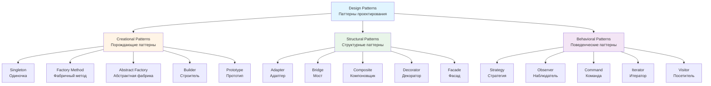

# Что такое паттерн проектирования

## Введение

**Design Pattern** (паттерн проектирования, шаблон проектирования) — это проверенное временем решение типовой проблемы при проектировании архитектуры программного обеспечения.

Паттерн представляет собой повторяемую архитектурную конструкцию, которая описывает решение конкретной проблемы проектирования в определённом контексте. Важно понимать, что паттерн — это не готовый код, который можно скопировать в проект, а концептуальное описание подхода к решению, которое необходимо адаптировать под специфику конкретной задачи.

### Паттерны vs Алгоритмы

Начинающие разработчики часто путают паттерны с алгоритмами, поскольку оба понятия описывают решения типовых проблем. Однако между ними существует принципиальная разница:

**Algorithm** (алгоритм) — это последовательность чётко определённых действий для достижения конкретной цели. Алгоритм описывает *что* и *как* делать шаг за шагом. Например, алгоритм сортировки массива указывает точную последовательность сравнений и перестановок элементов.

**Design Pattern** (паттерн проектирования) — это высокоуровневое описание архитектурного решения. Паттерн описывает структуру взаимодействия компонентов системы, но не определяет конкретные шаги реализации. Одна и та же проблема может быть решена одним паттерном, но реализация будет различаться в зависимости от контекста.

Для наглядности можно использовать следующую аналогию:
- **Алгоритм** подобен кулинарному рецепту: точные ингредиенты, точные пропорции, чёткая последовательность действий
- **Паттерн** подобен архитектурному чертежу здания: показывает структуру и взаимосвязи элементов, но не детализирует процесс строительства. Имея чертёж собора, вы понимаете его структуру, но это не означает, что вы сразу сможете его построить — нужно разработать план реализации

## Структура описания паттерна

Описание паттернов проектирования обычно следует формализованной структуре, которая позволяет систематизировать знания и облегчает понимание. Стандартное описание паттерна включает следующие элементы:

1. **Название и классификация** — однозначное имя паттерна и его категория
2. **Проблема (Problem)** — описание ситуации, в которой возникает необходимость применения паттерна
3. **Мотивация (Motivation)** — объяснение, почему предлагаемое решение является оптимальным
4. **Структура (Structure)** — диаграмма классов и их взаимосвязей, составляющих решение
5. **Участники (Participants)** — описание ролей классов и интерфейсов в паттерне
6. **Пример реализации** — код на одном или нескольких языках программирования
7. **Применимость (Applicability)** — ситуации, в которых паттерн наиболее эффективен
8. **Последствия (Consequences)** — преимущества и недостатки применения паттерна
9. **Связанные паттерны (Related Patterns)** — взаимосвязи с другими паттернами

Такой формальный подход позволяет создавать каталоги паттернов и оценивать новые решения на предмет их универсальности и практической ценности.

## Пример описания паттерна: Visitor

Рассмотрим пример формального описания паттерна **Visitor** (Посетитель). Не стремитесь сейчас полностью понять этот паттерн — он будет детально изучен в последующих лекциях. Цель данного примера — продемонстрировать типичную структуру документации паттерна.

### Описание паттерна Visitor

**Проблема:**
Необходимо выполнять различные операции над объектами сложной структуры, при этом избегая загрязнения кода самих классов логикой, не связанной с их основной ответственностью. Прямое добавление методов в классы нарушает принцип единственной ответственности и усложняет поддержку кода.

**Задача:**
Определить новую операцию над объектами структуры без изменения классов этих объектов.

**Решение:**
Паттерн Visitor инкапсулирует операции в отдельную иерархию классов-посетителей. Каждый класс структуры предоставляет метод `Accept(IVisitor visitor)`, который принимает посетителя и делегирует ему выполнение операции.

**Применимость:**
- Объектная структура содержит множество классов с различными интерфейсами
- Над объектами структуры необходимо выполнять различные операции, зависящие от конкретных классов
- Новые операции добавляются часто, а структура классов изменяется редко

**Преимущества:**
- Упрощение добавления новых операций — достаточно создать новый класс-посетитель
- Объединение связанной логики в одном месте
- Посетитель может накапливать состояние при обходе структуры

**Недостатки:**
- Затруднено добавление новых типов элементов — требует модификации интерфейса `IVisitor`
- Нарушение инкапсуляции — посетителю может потребоваться доступ к внутреннему состоянию элементов

### Реализация на C#

Рассмотрим практический пример: система для работы с геометрическими точками в 2D и 3D пространстве, которая поддерживает вычисление различных метрик.

```csharp
using System;

// Точка входа в программу
public static class Demo
{
    private static void Main()
    {
        // Создаём двумерную точку с координатами (1, 2)
        Point point = new Point2D(1, 2);
        
        // Создаём посетителя, вычисляющего метрику Чебышёва
        IVisitor visitor = new ChebyshevMetricVisitor();
        
        // Применяем посетителя к точке
        point.Accept(visitor);
        
        // Выводим результат вычисления метрики
        Console.WriteLine($"Метрика Чебышёва: {point.Metric}");
        
        // Демонстрация гибкости: меняем метрику без изменения класса Point2D
        IVisitor euclidVisitor = new EuclidMetricVisitor();
        point.Accept(euclidVisitor);
        Console.WriteLine($"Евклидова метрика: {point.Metric}");
    }
}

// Интерфейс посетителя с методами для каждого типа точки
// Каждый метод Visit() принимает конкретный тип элемента
internal interface IVisitor
{
    void Visit(Point2D point);
    void Visit(Point3D point);
}

// Базовый класс для всех точек
internal abstract class Point
{
    // Свойство для хранения вычисленной метрики
    // Значение -1 указывает, что метрика ещё не вычислена
    public double Metric { get; set; } = -1;
    
    // Метод для принятия посетителя (часть паттерна Visitor)
    public abstract void Accept(IVisitor visitor);
}

// Точка в двумерном пространстве
internal class Point2D : Point
{
    public Point2D(double x, double y)
    {
        X = x;
        Y = y;
    }

    // Координаты доступны только для чтения (immutable)
    public double X { get; }
    public double Y { get; }

    // Реализация метода Accept: передаём себя посетителю
    // Компилятор выберет перегрузку Visit(Point2D), а не Visit(Point3D)
    public override void Accept(IVisitor visitor)
    {
        visitor.Visit(this);
    }
}

// Точка в трёхмерном пространстве
internal class Point3D : Point
{
    public Point3D(double x, double y, double z)
    {
        X = x;
        Y = y;
        Z = z;
    }

    public double X { get; }
    public double Y { get; }
    public double Z { get; }

    public override void Accept(IVisitor visitor)
    {
        visitor.Visit(this);
    }
}

// Посетитель для вычисления евклидовой метрики (обычное расстояние)
internal class EuclidMetricVisitor : IVisitor
{
    // Для 2D точки: расстояние = √(x² + y²)
    public void Visit(Point2D point)
    {
        point.Metric = Math.Sqrt(point.X * point.X + point.Y * point.Y);
    }

    // Для 3D точки: расстояние = √(x² + y² + z²)
    public void Visit(Point3D point)
    {
        point.Metric = Math.Sqrt(
            point.X * point.X + 
            point.Y * point.Y + 
            point.Z * point.Z
        );
    }
}

// Посетитель для вычисления метрики Чебышёва (максимум модулей координат)
internal class ChebyshevMetricVisitor : IVisitor
{
    // Для 2D точки: метрика = max(|x|, |y|)
    public void Visit(Point2D point)
    {
        var absX = Math.Abs(point.X);
        var absY = Math.Abs(point.Y);
        point.Metric = Math.Max(absX, absY);
    }

    // Для 3D точки: метрика = max(|x|, |y|, |z|)
    public void Visit(Point3D point)
    {
        var absX = Math.Abs(point.X);
        var absY = Math.Abs(point.Y);
        var absZ = Math.Abs(point.Z);
        point.Metric = Math.Max(Math.Max(absX, absY), absZ);
    }
}
```

**Важные моменты реализации:**

1. **Double Dispatch** — механизм двойной диспетчеризации: сначала вызывается `Accept()` на конкретном типе точки, затем внутри него вызывается `Visit()` с типом `this`, что позволяет компилятору выбрать правильную перегрузку метода.

2. **Расширяемость операций** — добавление новой метрики (например, манхэттенской) требует только создания нового класса-посетителя, без изменения классов `Point2D` и `Point3D`.

3. **Современные альтернативы в C#** — в современном C# некоторые применения паттерна Visitor могут быть заменены на **pattern matching** с выражениями `switch` и `is`:

```csharp
// Альтернативный подход с использованием pattern matching (C# 9.0+)
public static double CalculateEuclidMetric(Point point)
{
    return point switch
    {
        Point2D p2d => Math.Sqrt(p2d.X * p2d.X + p2d.Y * p2d.Y),
        Point3D p3d => Math.Sqrt(p3d.X * p3d.X + p3d.Y * p3d.Y + p3d.Z * p3d.Z),
        _ => throw new ArgumentException("Unknown point type")
    };
}
```

Однако классический паттерн Visitor всё ещё актуален для сложных случаев, когда посетитель накапливает состояние или логика операций значительно сложнее.
## Классификация паттернов

Паттерны проектирования можно классифицировать по двум основным критериям: уровню абстракции и назначению.

### Классификация по уровню абстракции

По степени общности и масштабу применения паттерны делятся на три уровня:

**Idioms** (идиомы) — низкоуровневые паттерны, специфичные для конкретного языка программирования. Например, в C# идиомой является использование оператора `using` для автоматического освобождения ресурсов (паттерн RAII — Resource Acquisition Is Initialization).

**Design Patterns** (паттерны проектирования) — среднеуровневые решения, применимые на уровне классов и их взаимодействия. Это универсальные решения, которые можно реализовать на большинстве объектно-ориентированных языков.

**Architectural Patterns** (архитектурные паттерны) — высокоуровневые решения, определяющие структуру всей системы. Примеры: Model-View-Controller (MVC), Microservices, Layered Architecture.

Для наглядности можно использовать аналогию со строительством: идиома — это способ соединения кирпичей, паттерн проектирования — конструкция стены с окнами, архитектурный паттерн — общая планировка здания.

### Классификация по назначению

Паттерны проектирования традиционно делятся на три основные категории по решаемым задачам:



#### 1. Creational Patterns (Порождающие паттерны)

Паттерны этой категории решают задачи создания объектов, обеспечивая гибкость и переиспользуемость кода. Они отвечают на вопрос: "Как создавать объекты, чтобы система оставалась гибкой и не зависела от конкретных классов?"

**Основные преимущества:**
- Абстрагирование процесса создания объектов
- Снижение связанности (coupling) между клиентским кодом и конкретными классами
- Упрощение добавления новых типов объектов

**Примеры паттернов:**
- **Singleton** — гарантирует существование единственного экземпляра класса
- **Factory Method** — определяет интерфейс для создания объекта, позволяя подклассам решать, какой класс инстанцировать
- **Abstract Factory** — предоставляет интерфейс для создания семейств связанных объектов

#### 2. Structural Patterns (Структурные паттерны)

Паттерны этой категории описывают способы организации классов и объектов в более крупные структуры, сохраняя при этом гибкость и эффективность.

**Основные преимущества:**
- Упрощение структуры системы путём выявления простых способов реализации связей между сущностями
- Обеспечение независимости интерфейса от реализации
- Комбинирование объектов для получения новой функциональности

**Примеры паттернов:**
- **Adapter** — преобразует интерфейс класса к виду, ожидаемому клиентом
- **Decorator** — динамически добавляет объекту новые обязанности
- **Facade** — предоставляет унифицированный интерфейс к группе интерфейсов подсистемы

#### 3. Behavioral Patterns (Поведенческие паттерны)

Паттерны этой категории определяют алгоритмы и распределение обязанностей между объектами. Они описывают не только структуру классов и объектов, но и схемы их взаимодействия.

**Основные преимущества:**
- Упрощение коммуникации между объектами
- Повышение гибкости при задании поведения
- Инкапсуляция изменяющегося поведения

**Примеры паттернов:**
- **Strategy** — определяет семейство алгоритмов и делает их взаимозаменяемыми
- **Observer** — определяет зависимость "один ко многим", при которой изменение состояния одного объекта приводит к автоматическому оповещению всех зависимых объектов
- **Command** — инкапсулирует запрос как объект

## История возникновения паттернов проектирования

### Происхождение концепции

Важно понимать, что паттерны не изобретаются — они открываются и формализуются на основе существующей практики. Паттерн — это не оригинальное новаторское решение, а, напротив, проверенное временем типовое решение повторяющейся проблемы.

Концепция паттернов берёт своё начало в архитектуре, а не в программировании. В 1977 году австро-американский архитектор и теоретик дизайна **Кристофер Александер** (Christopher Alexander) опубликовал книгу **"A Pattern Language: Towns, Buildings, Construction"** ("Язык шаблонов: города, здания, строительство"). В этой работе он описал 253 паттерна для проектирования городов, зданий и сооружений.

Александер определил паттерн как трёхчастное правило, выражающее отношение между контекстом, проблемой и решением. Каждый паттерн описывает проблему, возникающую в определённом контексте, и предлагает архитектурное решение, которое можно применять многократно.

### Адаптация в программирование

Идея применения паттернов в разработке программного обеспечения была подхвачена в конце 1980-х — начале 1990-х годов. Сообщество разработчиков осознало, что многие архитектурные решения в коде повторяются из проекта в проект, и их можно формализовать подобно архитектурным паттернам Александера.

### "Банда четырёх" и каноническая книга

В 1994 году четыре специалиста в области компьютерных наук — **Эрих Гамма** (Erich Gamma), **Ричард Хелм** (Richard Helm), **Ральф Джонсон** (Ralph Johnson) и **Джон Влиссидес** (John Vlissides) — опубликовали книгу **"Design Patterns: Elements of Reusable Object-Oriented Software"** ("Паттерны проектирования: элементы многократно используемого объектно-ориентированного программного обеспечения").

Эта работа стала основополагающей для индустрии разработки ПО. В книге были описаны 23 классических паттерна проектирования, которые и сегодня остаются актуальными. Из-за длины названия книга быстро получила неформальное название **"GoF book"** (сокращение от "Gang of Four book" — "книга банды четырёх").

**Значение книги GoF:**
- Установила стандартную терминологию для обсуждения архитектурных решений
- Предложила формализованный подход к документированию паттернов
- Создала основу для дальнейшего развития теории паттернов проектирования

Когда в профессиональной среде упоминают "банду четырёх" или "GoF", как правило, имеют в виду именно эту книгу и описанные в ней паттерны.

## Практическая ценность знания паттернов

Может возникнуть закономерный вопрос: зачем изучать паттерны проектирования? Многие разработчики успешно пишут код, не зная формальных определений паттернов, и даже применяют их неосознанно. Однако осознанное владение инструментом — ключевое отличие профессионала от энтузиаста-любителя.

Проводя аналогию с инструментами: можно забить гвоздь дрелью, если приложить усилия, но профессионал понимает, что дрель предназначена для совершенно других задач. Знание паттернов помогает выбирать правильный инструмент для конкретной задачи.

### Преимущества знания паттернов

**1. Проверенные решения**

Паттерны — это накопленный опыт тысяч разработчиков. Вместо того чтобы тратить время на изобретение решения с нуля и потенциально допускать ошибки, которые уже были обнаружены и исправлены другими, вы используете готовое, многократно протестированное решение.

*Практический пример:* При разработке системы с множественными форматами экспорта данных (PDF, Excel, CSV) вы можете потратить дни на разработку собственного механизма. Однако, зная паттерн Strategy, вы реализуете решение за несколько часов, получая при этом более гибкую и расширяемую архитектуру.

**2. Стандартизация кода**

Использование паттернов делает архитектуру предсказуемой. Все подводные камни паттерна уже известны и задокументированы. Вы избегаете типичных ошибок проектирования, о которых даже не подозревали.

*Практический пример:* Создавая класс для управления подключением к базе данных, вы можете не задуматься о многопоточности и создать несколько подключений одновременно, что приведёт к утечкам ресурсов. Паттерн Singleton решает эту проблему, и вы заранее знаете о потенциальных сложностях с thread safety.

**3. Единый профессиональный язык**

Паттерны создают общий словарь для команды разработки. Вместо получасового объяснения архитектурного решения со схемами на доске, вы произносите: "Здесь применим паттерн Observer" — и все члены команды сразу понимают структуру решения.

*Практический пример:* На code review вместо комментария "У нас тут слишком много типов создаётся в одном месте, нужно как-то разделить логику создания" вы пишете "Следует применить Abstract Factory". Такой комментарий точен, конкретен и понятен любому разработчику, знакомому с паттернами.

**4. Упрощение обучения и онбординга**

Новый член команды, знакомый с паттернами, гораздо быстрее разберётся в архитектуре проекта. Вместо изучения "уникальной архитектуры", он видит знакомые структуры и может сразу начать продуктивную работу.

**5. Улучшение архитектурного мышления**

Изучение паттернов развивает способность видеть проблемы на более высоком уровне абстракции. Вы начинаете думать категориями "связанность", "зацепление", "инверсия зависимостей", а не просто "как заставить код работать".

## Критика паттернов проектирования

Несмотря на широкое признание и практическую ценность, паттерны проектирования не лишены критики. За более чем 30 лет с момента публикации книги GoF (1994 год) накопилось множество аргументов как "за", так и "против" использования паттернов. Рассмотрим основные критические замечания и проанализируем их обоснованность.

### 1. "Костыли для слабых языков"

**Суть критики:**
Необходимость в определённых паттернах возникает из-за ограничений языка программирования. Если язык имеет недостаточный уровень абстракции, паттерны компенсируют эти недостатки, выступая в роли "костылей".

**Примеры:**
- **Strategy** в языках с first-class functions (функции как объекты первого класса) часто заменяется простой передачей функции
- **Visitor** в языках с pattern matching (Scala, F#, современный C#) может быть реализован гораздо проще
- **Iterator** встроен в большинство современных языков (C# — `IEnumerable<T>`, Python — протокол итератора)

**Контраргументы:**
Да, некоторые паттерны действительно стали менее актуальны с эволюцией языков программирования. Однако это естественный процесс: лучшие практики становятся частью языка. Это не обесценивает концепцию паттернов — наоборот, это подтверждает их ценность.

```csharp
using System.IO.Compression;

// Традиционный паттерн Strategy (GoF-стиль)
public interface ICompressionStrategy
{
    byte[] Compress(byte[] data);
}

public class ZipCompressionStrategy : ICompressionStrategy
{
    public byte[] Compress(byte[] data)
    {
        // Реализация сжатия с использованием GZip
        using var output = new MemoryStream();
        using (var gzip = new GZipStream(output, CompressionMode.Compress))
        {
            gzip.Write(data, 0, data.Length);
        }
        return output.ToArray();
    }
}

public class FileCompressor
{
    private readonly ICompressionStrategy _strategy;
    
    public FileCompressor(ICompressionStrategy strategy)
    {
        _strategy = strategy;
    }
    
    public byte[] Compress(byte[] data) => _strategy.Compress(data);
}

// Современный подход в C# с делегатами (функциональный стиль)
public class ModernFileCompressor
{
    private readonly Func<byte[], byte[]> _compressionFunc;
    
    public ModernFileCompressor(Func<byte[], byte[]> compressionFunc)
    {
        _compressionFunc = compressionFunc;
    }
    
    public byte[] Compress(byte[] data) => _compressionFunc(data);
}

// Использование: передаём функцию сжатия напрямую
var compressor = new ModernFileCompressor(data => 
{
    using var output = new MemoryStream();
    using (var gzip = new GZipStream(output, CompressionMode.Compress))
    {
        gzip.Write(data, 0, data.Length);
    }
    return output.ToArray();
});
```

### 2. "Догматическое применение"

**Суть критики:**
Паттерны пытаются стандартизировать подходы, и некоторые разработчики начинают слепо следовать этим стандартам, реализуя паттерны "как в книжке", без адаптации к специфике проекта. Это приводит к излишней сложности и overengineering.

**Примеры проблем:**
- Использование Singleton там, где достаточно обычного статического класса
- Применение Abstract Factory для создания двух-трёх типов объектов
- Создание иерархии классов с паттерном Template Method для алгоритма, который не будет изменяться

**Важное замечание:**
Эта критика справедлива, но направлена не на сами паттерны, а на неправильное их применение. Паттерны — это инструменты, и как любой инструмент, они должны использоваться уместно. Проблема не в паттернах, а в недостатке опыта или понимания принципа "Keep It Simple, Stupid" (KISS).

### 3. "Синдром золотого молотка"

**Суть критики:**
"Если у тебя в руках молоток, то все предметы вокруг начинают напоминать гвозди." Новички, только что изучившие паттерны, пытаются применить их повсеместно, даже там, где можно обойтись простым кодом.

**Типичные проявления:**
- Junior разработчик после изучения паттернов начинает создавать Factory для каждого класса
- Создание сложной иерархии Decorator для добавления одного-единственного поведения
- Использование Observer для связи двух компонентов, где достаточно прямого вызова метода

**Пример избыточного применения:**

```csharp
// ПЛОХО: Излишнее использование паттернов для простой задачи
public interface IUserFactory
{
    IUser CreateUser(string name);
}

public class SimpleUserFactory : IUserFactory
{
    public IUser CreateUser(string name)
    {
        return new User(name);
    }
}

// ХОРОШО: Простое решение для простой задачи
public class User
{
    public User(string name)
    {
        Name = name;
    }
    
    public string Name { get; }
}

// Использование
var user = new User("Иван");
```

**Контраргументы:**
Это типичная проблема начинающих разработчиков при изучении любой новой технологии или концепции. Решение — не в отказе от паттернов, а в развитии чувства меры и накоплении опыта. Со временем приходит понимание, когда паттерн необходим, а когда он избыточен.

### Рекомендации по применению паттернов

1. **Принцип необходимости** — применяйте паттерн только тогда, когда проблема действительно существует
2. **Принцип простоты** — начинайте с простого решения, усложняйте только при необходимости
3. **Принцип понимания** — используйте паттерн, только если вы полностью понимаете его последствия
4. **Принцип контекста** — адаптируйте паттерн под специфику проекта, не копируйте слепо

Помните: паттерны проектирования — это не догма, а инструмент. Главная цель — создание поддерживаемого, гибкого и понятного кода, а не механическое применение всех известных паттернов.


## Заключение

Паттерны проектирования — это фундаментальный инструмент в арсенале профессионального разработчика. Они представляют собой накопленный за десятилетия опыт решения типовых архитектурных задач в объектно-ориентированном программировании.

### Ключевые выводы

1. **Паттерн — это не код, а концепция** решения определённой проблемы проектирования, которая требует адаптации под конкретный контекст

2. **Знание паттернов даёт преимущества:**
   - Экономит время разработки
   - Создаёт общий язык для команды
   - Помогает избежать типовых ошибок проектирования
   - Развивает архитектурное мышление

3. **Паттерны классифицируются** по назначению на порождающие, структурные и поведенческие

4. **Применение паттернов требует баланса** между использованием проверенных решений и избеганием излишней сложности

### Что дальше?

В последующих лекциях мы детально изучим:
- **Порождающие паттерны** — как гибко создавать объекты
- **Структурные паттерны** — как организовывать взаимосвязи между классами
- **Поведенческие паттерны** — как организовать эффективное взаимодействие объектов

Помните: цель изучения паттернов — не механическое запоминание структур, а понимание принципов проектирования, которые лежат в их основе. Паттерны — это средство достижения цели, а не сама цель.

---

**Рекомендуемая литература:**
- Gamma E., Helm R., Johnson R., Vlissides J. "Design Patterns: Elements of Reusable Object-Oriented Software" (1994)
- Freeman E., Robson E., Sierra K., Bates B. "Head First Design Patterns" (2004)
- Martin R. C. "Clean Architecture: A Craftsman's Guide to Software Structure and Design" (2017)
