# Базовые принципы проектирования (Basic Design Principles)

Помимо паттернов проектирования, существуют также принципы проектирования. Если шаблоны представляют собой типовые решения для часто встречающихся задач, то принципы — это более общие идеи, отражающие подход к построению качественной архитектуры и стилю мышления разработчика. Это те вещи, которые в целом надо держать в голове при разработке ~~у меня был план и я его придерживался~~. То есть пишем код, держа в голове принципы, а уже если видим какую-то типовую проблему, то примяенем паттерны. Паттерны, как правило, следуют принципам, а не наоборот.

Так что прежде, чем переходить к изучению конкретных паттернов, важно понять эти самые фундаментальные принципы, на которых строится надежное и понятное программное обеспечение. В этом конспекте мы рассмотрим самые основные концепции, и научимся применять их на практике, а уже в следующих конспектах эти идеи постепенно разовьются в принципы SOLID, GRASP и сами паттерны проектирования.

## Содержание
1. [Качества хорошей архитектуры](#качества-хорошей-архитектуры)
    1. [Повторное использование кода](#повторное-использование-кода-code-reusability)
    2. [Расширяемость](#расширяемость-extensibility)
2. [Базовые принципы проектирования](#базовые-принципы-проектирования-1)
    1. [Инкапсулируйте то, что часто изменяется](#1-инкапсулируйте-то-что-часто-изменяется-encapsulate-what-varies)
    2. [Программируйте на уровне интерфейсов](#2-программируйте-на-уровне-интерфейсов-program-to-an-interface-not-an-implementation)
    3. [Предпочитайте композицию наследованию](#3-предпочитайте-композицию-наследованию-favor-composition-over-inheritance)

## Качества хорошей архитектуры

### Повторное использование кода (Code Reusability)

Стоимость и время разработки являются ключевыми метриками успешности любого программного продукта. Чем меньше оба этих показателя, тем конкурентнее продукт будет на рынке и тем больше прибыли получит бизнес, а значит и сам разработчик. Повторное использование кода и архитектурных решений — один из наиболее эффективных способов снижения этих показателей. Концепция проста: зачем создавать что-то заново, если можно использовать готовые наработки или првоеренные решения из предыдущих проектов?

Но, к сожалению, не всякий код можно приспособить к работе в новых условиях. Самые часто встречающиеся проблемы:

- **Tight Coupling (тесная связанность)** — когда компоненты слишком зависимы друг от друга. Например, циклическая зависимость: класс `А` зависит от класса `Б`, а класс `Б` зависит от класса `А`. Если мы удалим или изменим один класс, то сразу же пострадает другой.
- **Concrete Dependencies (конкретные зависимости)** — код зависит от конкретных классов, а не от абстракций. Зачем нам передавать в функцию `foo(Dollars value)` или `foo(Rubles value)`, если мы можем сделать `foo(Money value)` и передавать и `Dollars` и `Rubles`?
- **Hard-coded Behavior (жестко закодированное поведение)** — операции вшиты в код без возможности расширения. Например if-else и switch-case, какие-то магические константы или просто "заифать" тест, который не проходит.

На помощь приходят паттерны и принципы проектирования, которые ценой усложнения кода программы повышают гибкость её частей, упрощая дальнейшее повторное использование кода.

#### Три уровня повторного использования

Эрик Гамма, один из авторов знаменитой книги "Design Patterns" (Gang of Four) и родоначальников применения паттернов в разработке, выделяет три уровня повторного использования:

> Существует три уровня повторного использования кода. На самом нижнем уровне находятся классы: полезные библиотеки классов, контейнеры, а также «команды» классов вроде контейнеров/итераторов. 
> Фреймворки стоят на самом верхнем уровне. В них важна только архитектура. Они определяют ключевые абстракции для решения некоторых бизнес-задач, представленных в виде классов и отношений между ними. Возьмите `JUnit`, это маленький фреймворк, даже базовый, я бы сказал. В нём есть всего несколько классов — `Test` , `TestCase` и `TestSuite` , а также связи между ними. Обычно, фреймворк имеет гораздо больший охват, чем один класс. Вы должны вклиниться в фреймворк, расширив какой-то из его классов. Всё работает по так называемому голливудскому принципу "не звоните нам, мы сами вам перезвоним". Фреймворк позволяет вам задать какое-то своё поведение, а затем сам вызывает его, когда приходит черёд что-то делать. То же происходит и в `JUnit`. Он обращается к вашему классу, когда нужно выполнить тест, но всё остальное происходит внутри фреймворка. 
> Есть ещё средний уровень. Это то, где я вижу паттерны. Паттерны проектирования и меньше, и более абстрактные, чем фреймворки. Они, на самом деле, просто описание того, как парочка классов относится и взаимодействует друг с другом. Уровень повторного использования повышается, когда вы двигаетесь в направлении от конкретных классов к паттернам, а затем к фреймворкам.
> Что ещё замечательно в этом среднем уровне так это то, что паттерны — это менее рискованный способ повторного использования, чем фреймворки. Разработка фреймворка — это крайне рисковая и дорогая инвестиция. В то же время, паттерны позволяют вам повторно использовать идеи и концепции в отрыве от конкретного кода

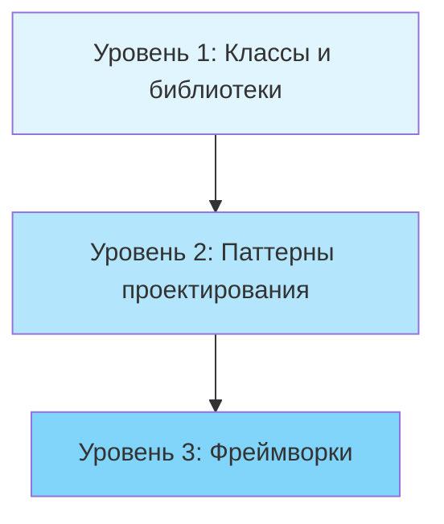

**Уровень 1: Классы (Classes)**
- Базовый уровень повторного использования
- Библиотеки классов, контейнеры, утилиты
- Пример: `List<T>`, `Dictionary<K,V>`, LINQ в .NET

**Уровень 2: Паттерны (Design Patterns)**
- Описывают взаимодействие между несколькими классами
- Переиспользуются идеи и концепции, а не конкретный код
- Менее рискованны, чем создание фреймворков
- Более абстрактны и гибки, чем отдельные классы

**Уровень 3: Фреймворки (Frameworks)**
- Определяют архитектуру всего приложения
- Работают по принципу **Hollywood Principle (голливудский принцип)**: "Don't call us, we'll call you" (Не звоните нам, мы сами вам перезвоним)
- Фреймворк управляет потоком выполнения, вызывая ваш код в нужные моменты
- Примеры: ASP.NET Core, xUnit, Entity Framework
- Требуют значительных инвестиций в разработку и поддержку

### Расширяемость (Extensibility)

Изменения — неизбежная часть разработки программного обеспечения. Рассмотрим типичные ситуации:

- Вы создали идеальную архитектуру интернет-магазина для веб-интерфейса, но через месяц потребовалось добавить поддержку заказов по телефону
- Вы выпустили игру для Windows, но затем понадобилась версия для macOS и Linux
- Вы разработали UI-фреймворк с квадратными кнопками, но клиенты захотели круглые

Изменения часто называют главным врагом программиста. 

**Почему изменения неизбежны?**

1. **Эволюция требований (Requirements Evolution)**
   - Новые функции появляются в процессе эксплуатации
   - При проектировании невозможно предусмотреть все будущие потребности

2. **Улучшение понимания проблемы (Better Problem Understanding)**
   - В процессе решения задачи приходит более глубокое понимание
   - К концу первой версии часто хочется переписать все с нуля
   - Это нормальный итеративный процесс развития продукта

3. **Внешние изменения (External Changes)**
   - Обновления операционных систем
   - Новые версии зависимостей
   - Изменения в законодательстве или бизнес-процессах

Да и в целом, банально нельзя зарнее всё предсказать. Это как вместо того, чтобы начать тренироваться или сесть на диету сначала смотреть видео на ютубе, чтобы "идеально" всё составить и "идеально" начать. По факту всё равно в процессе придётся что-то корректировать/добавлять/менять/улучшать и т. д. 

Либо же с точки зрения опыта: например, шьём костюм. 100% после первого раза будет найдено куча советов и замечаний из разряда: не так подрезали нитку, не ту ткань использовали, в конце нужно было прогладить и т. п. Да и просто рука немного набьётся и уже даже на второй раз костюм, скорее всего, получится куда лучше, с меньшим количеством ошибок/затупов, да и быстрее. 

В разработке тоже самое: наверняка у многих из вас было так, что вы сначала написали что-то одно, затем удаляете весь код и начинаете писать заново. Короче вечная проработка архитектуры, вечные улучшения, новые замечания, мысли, фичи и так далее. Не пытайтесь всё заранее предугадать - у вас всё равно не получится. Вместо этого сделайте так, чтобы вам было легко эти самые изменения добавлять. Для этого всегда надо проектировать архитектуру и писать код с учётом будущих изменений.

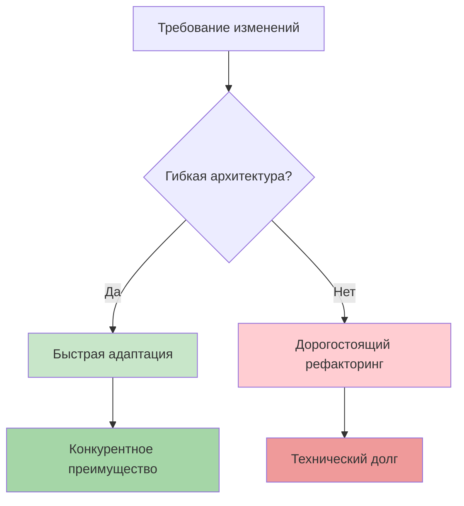

> Если кто-то просит изменить вашу программу — это хороший знак: она все еще нужна. Проектируйте код с учетом будущих изменений, чтобы их внесение было простым и безопасным.

## Базовые принципы проектирования

Хороший дизайн программы определяется таким набором качеств как гибкость, связанность, управляемость, стабильность и понятность, лёгкость в поддержке, расширяемость, простота и так далее. Как достичь баланса между всеми этими характеристиками? 

Более того для каждой программы ответ на вопрос: "Что такое хороший дизайн?" будет отличаться. Однако существуют универсальные принципы, которые помогают принимать правильные архитектурные решения в любых ситуациях и программах:

### 1. Инкапсулируйте то, что часто изменяется (Encapsulate What Varies)

> Определите аспекты программы, которые изменяются чаще всего, и отделите их от стабильных частей.

Цель этого принципа — минимизировать последствия изменений. 

Представьте корабль: его корпус состоит из водонепроницаемых отсеков. Если корабль наткнётся на мину, либо же в одном из отсеков случится пробоина, то этот отсек затопит, однако остальные останутся сухими, и корабль продолжить плыть. Обычно может затопить до 30% всех отсеков, прежде чем судно начнёт тонуть. 

Если же бы корпус корабля состоял из одного единого отсека, то любая протечка неминуема привела бы к затоплению корабля, ведь вода свободно распространилась бы по всему внутреннему объёму.

В разработке тоже самое:

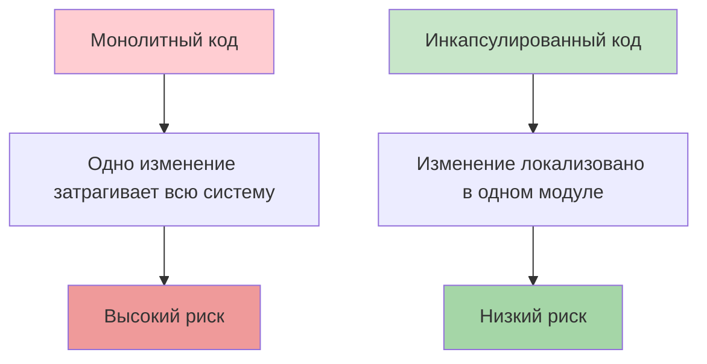

**Преимущества инкапсуляции изменяемых частей:**
- Меньше кода требует модификации
- Проще тестирование изменений
- Снижение стоимости разработки
- Меньше вероятность внесения ошибок

#### Инкапсуляция на уровне метода

Рассмотрим пример: представьте, что вы разрабатываете интернет-магазин. Где-то внутри вашего кода может существовать метод `GetOrderTotal`, который рассчитывает финальную сумм заказа, учитывая размер налога. 

Мы можем предположить, что код вычиления налогов скорей всего будет часто меняться. Во-первых, логика начисления налога зависит от страны и даже города, в котором находится покупатель. К тому же размер налога не постоянен — власти могут менять его, когда вздумается. Из-за этих изменений вам постоянно придётся трогать метод `GetOrderTotal`, который не особо интересуется деталями вычисления налогов.

**Плохой пример** (anti-pattern — НЕ делайте так):

```csharp
public class Order
{
    public List<OrderItem> LineItems { get; set; }
    public string Country { get; set; }

    public decimal GetOrderTotal()
    {
        decimal total = 0;
        
        // Суммируем стоимость товаров
        foreach (var item in LineItems)
        {
            total += item.Price * item.Quantity;
        }

        // Вычисление налога жестко закодировано (hard coded) в методе
        if (Country == "Russia")
        {
            total -= total * 0.20m; // НДС 20%
        }
        else if (Country == "Greece")
        {
            total -= total * 0.24m; // НДС 24%
        }
        // При добавлении новой страны придется изменять этот метод

        return total;
    }
}
```

**Проблемы этого подхода:**
- При изменении налогового законодательства нужно модифицировать метод `GetOrderTotal`
- При добавлении новой страны нужно добавлять новую ветку `if`
- Логика налогов не может быть переиспользована в других местах
- Метод нарушает принцип единственной ответственности

**Правильный пример:**

Вы можете перенести логику вычисления налогов в собственный метод, скрыв детали от оригинального метода.

```csharp
public class Order
{
    public List<OrderItem> LineItems { get; set; }
    public string Country { get; set; }

    // Основной метод теперь делегирует вычисление налога
    public decimal GetOrderTotal()
    {
        decimal total = 0;
        
        // Суммируем стоимость товаров
        foreach (var item in LineItems)
        {
            total += item.Price * item.Quantity;
        }

        // Применяем налог через отдельный метод
        decimal taxRate = GetTaxRate(Country);
        total -= total * taxRate;

        return total;
    }

    // Изменяемая логика изолирована в отдельном методе
    private decimal GetTaxRate(string country)
    {
        return country switch
        {
            "Russia" => 0.20m,   // НДС 20%
            "Greece" => 0.24m,   // НДС 24%
            "Germany" => 0.19m,  // НДС 19%
            "USA" => 0.07m,      // Sales Tax ~7% 
            _ => 0.00m           // Нет налога по умолчанию
        };
    }
}

public class OrderItem
{
    public decimal Price { get; set; }
    public int Quantity { get; set; }
}
```

Теперь изменения налогов будут изолированы в рамках одного метода. Более того, если логика вычисления налогов станет ещё более сложной, вам будет легче извлечь этот метод в собственный класс.

**Преимущества:**
- Изменения налоговых ставок локализованы в одном методе
- Метод `GetOrderTotal` больше не зависит от деталей налогообложения
- Логику налогов легко протестировать отдельно
- Проще добавить новую страну

#### Инкапсуляция на уровне класса

В примере выше мы инкапсулировали (создали) отедльный метод, однако если логика налогообложения становится сложнее (например, разные ставки для разных категорий товаров, региональные особенности), стоит выделить ее в отдельный класс.

**До рефакторинга:**

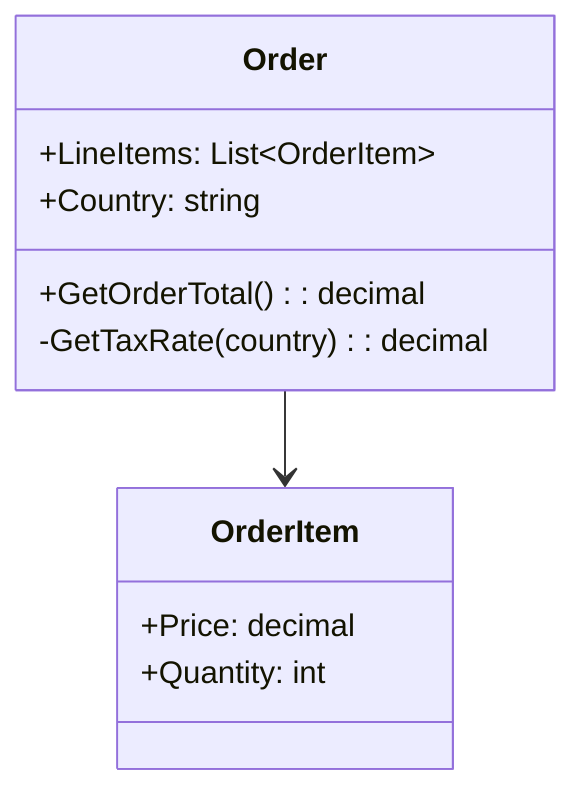

Объект заказа отвечает за расчет налогов, что усложняет его и делает менее гибким.

**После рефакторинга:**

Объекты заказов станут делегировать вычисление налогов отдельному объекту-калькулятору налогов.

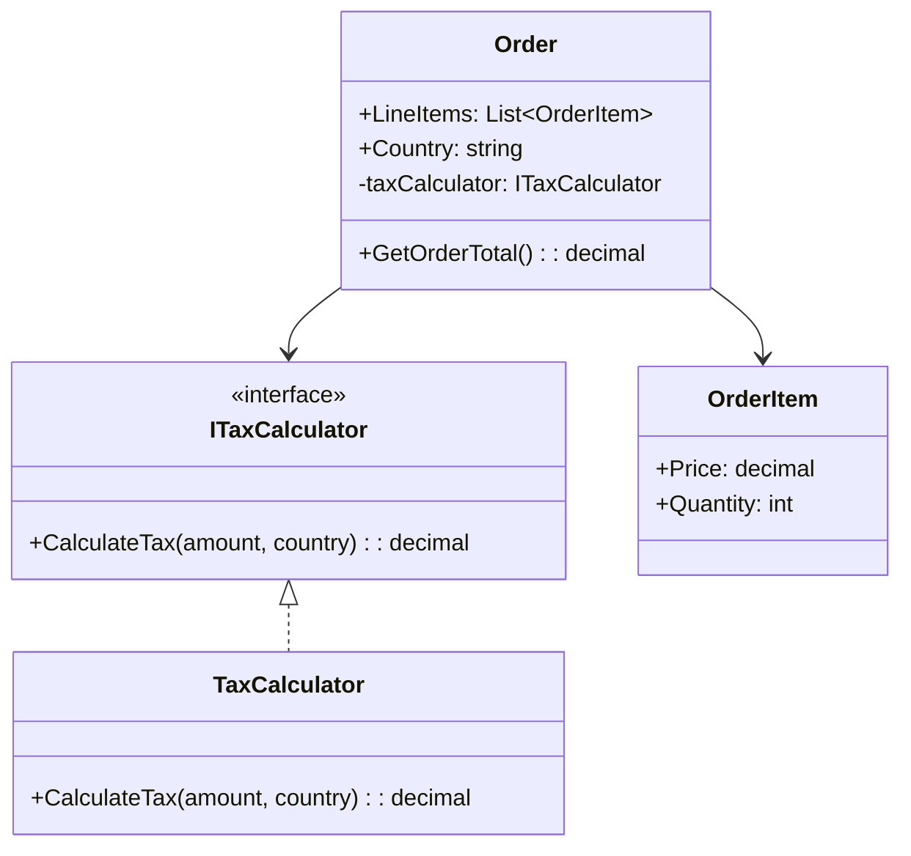

**Реализация:**

```csharp
// Интерфейс для расчета налогов
public interface ITaxCalculator
{
    decimal CalculateTax(decimal amount, string country);
}

// Реализация калькулятора налогов
public class TaxCalculator : ITaxCalculator
{
    // Словарь с налоговыми ставками по странам
    private readonly Dictionary<string, decimal> _taxRates = new()
    {
        { "Russia", 0.20m },
        { "Greece", 0.24m },
        { "Germany", 0.19m },
        { "USA", 0.07m }
    };

    public decimal CalculateTax(decimal amount, string country)
    {
        // Получаем ставку налога для страны
        if (_taxRates.TryGetValue(country, out decimal rate))
        {
            return amount * rate;
        }

        // Налог по умолчанию (если страна не найдена)
        return 0;
    }
}

// Класс заказа теперь делегирует расчет налогов
public class Order
{
    public List<OrderItem> LineItems { get; set; }
    public string Country { get; set; }
    
    // Зависимость от абстракции (интерфейса), а не конкретного класса
    private readonly ITaxCalculator _taxCalculator;

    public Order(ITaxCalculator taxCalculator)
    {
        _taxCalculator = taxCalculator;
        LineItems = new List<OrderItem>();
    }

    // Метод стал проще и сфокусирован только на расчете суммы заказа
    public decimal GetOrderTotal()
    {
        decimal subtotal = 0;
        
        foreach (var item in LineItems)
        {
            subtotal += item.Price * item.Quantity;
        }

        // Делегируем расчет налога отдельному объекту
        decimal tax = _taxCalculator.CalculateTax(subtotal, Country);
        
        return subtotal + tax;
    }
}
```

Пример использования

```csharp
public class Program
{
    public static void Main()
    {
        // Создаем калькулятор налогов
        var taxCalculator = new TaxCalculator();
        
        // Создаем заказ
        var order = new Order(taxCalculator)
        {
            Country = "Russia",
            LineItems = new List<OrderItem>
            {
                new OrderItem { Price = 100, Quantity = 2 },
                new OrderItem { Price = 50, Quantity = 1 }
            }
        };

        // Получаем итоговую сумму с налогом
        decimal total = order.GetOrderTotal();
        Console.WriteLine($"Итого к оплате: {total:C}"); // 300.00
    }
}
```

**Преимущества классового подхода:**
- Полная изоляция логики налогообложения
- Возможность легко заменить реализацию калькулятора
- Простота тестирования (можно использовать mock-объекты)
- Класс `Order` фокусируется только на управлении заказом
- Калькулятор налогов можно переиспользовать в других частях системы

### 2. Программируйте на уровне интерфейсов (Program to an Interface, not an Implementation)

> Код должен зависеть от абстракций (интерфейсов), а не от конкретных классов.

Этот принцип повышает гибкость архитектуры, позволяя легко расширять систему без изменения существующего кода. Зависимость от абстракций делает код более устойчивым к изменениям.

Представьте, что вы разрабатываете игру про животных. Класс `Cat` (кот). Кот1, который ест только мышек и сардельки, менее гибкий, чем Кот2, который может есть любую еду (не *вообще* любую еду; вряд ли Кот2 захочет съесть купастный лист). Второго можно кормить мышами, сардельками, сухим кормом, консервами — всем, что является `IFood`.

#### Как применять принцип

Когда нужно наладить взаимодействие между двумя классами, следуйте этим шагам:

1. Определите требуемые операции — какие методы один объект вызывает у другого
2. Создайте интерфейс — опишите эти методы в отдельном интерфейсе
3. Класс-зависимость должен реализовать этот интерфейс
4. Класс-потребитель зависит от интерфейса, а не конкретного класса

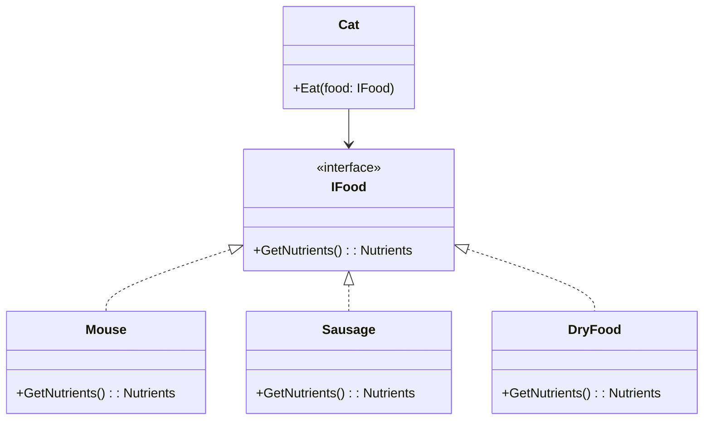

**Пример реализации:**

```csharp
// Интерфейс еды
public interface IFood
{
    string GetName();
    int GetCalories();
}

// Конкретные реализации еды
public class Mouse : IFood
{
    public string GetName() => "Мышка";
    public int GetCalories() => 150;
}

public class Sausage : IFood
{
    public string GetName() => "Сарделька";
    public int GetCalories() => 300;
}

public class DryFood : IFood
{
    public string GetName() => "Сухой корм";
    public int GetCalories() => 250;
}

public class Cat
{
    private readonly string _name;
    private int _energy;

    public Cat(string name)
    {
        _name = name;
        _energy = 0;
    }

    // Кот зависит от интерфейса IFood, а не от конкретных классов
    // Метод принимает любую еду, реализующую IFood
    public void Eat(IFood food)
    {
        _energy += food.GetCalories();
        Console.WriteLine($"{_name} съел {food.GetName()}. Энергия: {_energy}");
    }
}

// Пример использования
public class Program
{
    public static void Main()
    {
        var cat = new Cat("Георгий Круглов");
        
        // Кот может есть любую еду, реализующую IFood
        cat.Eat(new Mouse());        // Георгий Круглов съел Мышка. Энергия: 150
        cat.Eat(new Sausage());      // Георгий Круглов съел Сарделька. Энергия: 450
        cat.Eat(new DryFood());      // Георгий Круглов съел Сухой корм. Энергия: 700
        
        // Легко добавить новый тип еды без изменения класса Cat

        cat.Eat(new Student());      // Георгий Круглов cъел студента. Энергия: 10000
    }
}
```

**Преимущества:**
- Можно добавлять новые типы еды без изменения класса `Cat`
- Легко тестировать с помощью mock-объектов
- Код становится более гибким и расширяемым

#### Симулятор компании

Рассмотрим более сложный пример с симулятором компании (наподобие игры Game Factory Simulator).

**Плохой пример** (anti-pattern):

```csharp
public class Designer
{
    public void Design()
    {
        Console.WriteLine("Дизайнер создает макет");
    }
}

public class Programmer
{
    public void Code()
    {
        Console.WriteLine("Программист пишет код");
    }
}

public class Tester
{
    public void Test()
    {
        Console.WriteLine("Тестировщик тестирует продукт");
    }
}

public class Company
{
    // Компания жестко привязана к конкретным классам работников
    private Designer _designer;
    private Programmer _programmer;
    private Tester _tester;

    public Company()
    {
        // Жесткая привязка к конкретным классам
        _designer = new Designer();
        _programmer = new Programmer();
        _tester = new Tester();
    }

    public void DoWork()
    {
        _designer.Design();
        _programmer.Code();
        _tester.Test();
    }
}
```

**Проблема:** Жесткая привязка к конкретным классам

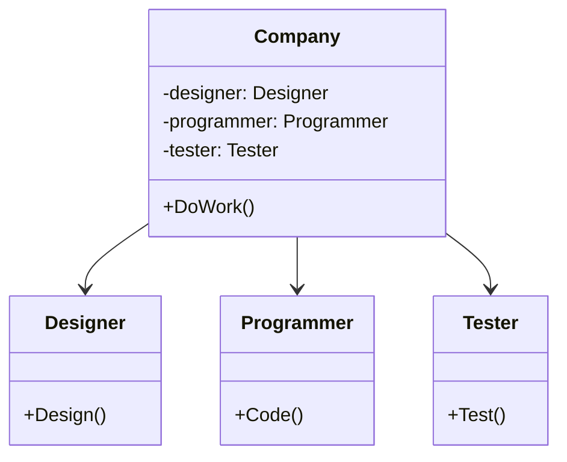
- Невозможно добавить новые типы работников
- Нельзя создать разные типы компаний с разными работниками
- Сложно тестировать

**Шаг 1:** Выделение общего интерфейса

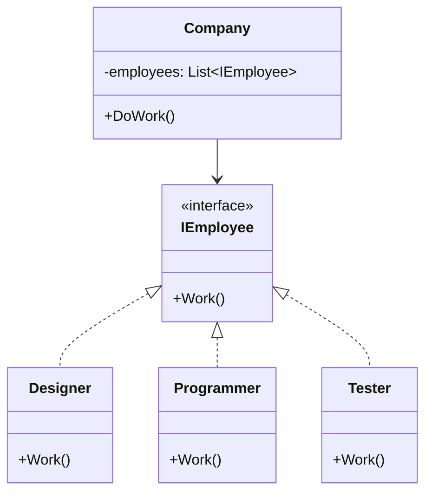

**Улучшенный пример:**

```csharp
// Используем общий интерфейс
public interface IEmployee
{
    void Work();
    string GetPosition();
}

public class Designer : IEmployee
{
    public void Work()
    {
        Console.WriteLine("Дизайнер создает макет");
    }

    public string GetPosition() => "Дизайнер";
}

public class Programmer : IEmployee
{
    public void Work()
    {
        Console.WriteLine("Программист пишет код");
    }

    public string GetPosition() => "Программист";
}

public class Tester : IEmployee
{
    public void Work()
    {
        Console.WriteLine("Тестировщик тестирует продукт");
    }

    public string GetPosition() => "Тестировщик";
}

public class Company
{
    private readonly List<IEmployee> _employees;

    public Company()
    {
        _employees = new List<IEmployee>();
    }

    public void HireEmployee(IEmployee employee)
    {
        _employees.Add(employee);
        Console.WriteLine($"Нанят: {employee.GetPosition()}");
    }

    // Используем полиморфизм - работаем с сотрудниками через интерфейс
    public void DoWork()
    {
        Console.WriteLine("\n=== Рабочий день начался ===");
        foreach (var employee in _employees)
        {
            employee.Work();
        }
        Console.WriteLine("=== Рабочий день закончился ===\n");
    }
}
```

Это уже лучше. Тем не менее, наш симулятор компаний всё ещё не идеален. Наш класс компании остаётся привязанным к конкретным классам работников - компания все еще создает конкретных работников внутри себя. Это не очень хорошо, особенно, если предположить, что нам понадобится реализовать ещё несколько видов компаний (компания по разработке, компания по трейдингу, компания-производитель полимеров и т. д.). Все эти компании будут отличаться тем, какие конкретно работники в них нужны.

Давайте улучшим дальше: мы можем сделать метод получения сотрудников в базовом классе компании абстрактным. Конкретные компании должны будут сами позаботиться о создании объектов сотрудников. А значит — каждый тип компаний сможет иметь собственный набор сотрудников.

**Шаг 2:**

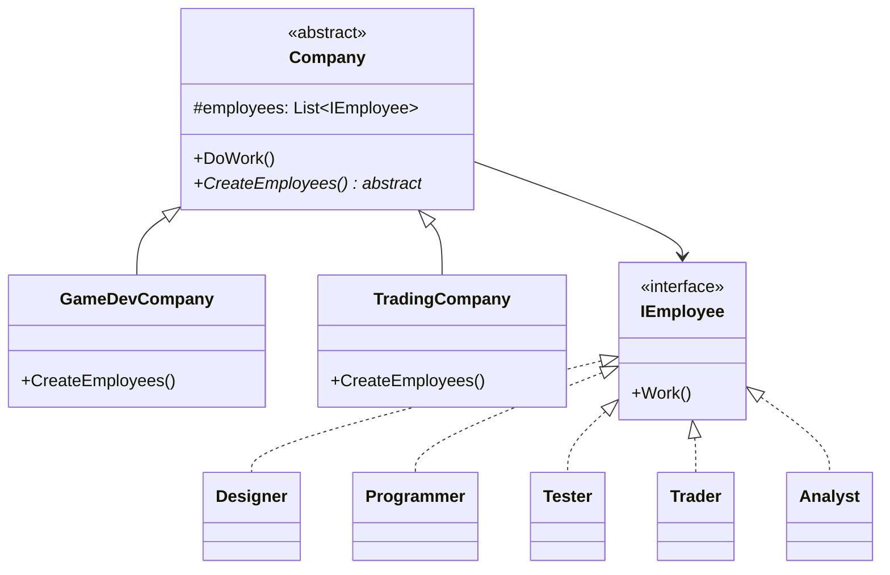

**Идеальный пример:**

```csharp
// Базовый абстрактный класс компании
public abstract class Company
{
    protected List<IEmployee> _employees;

    public Company()
    {
        _employees = new List<IEmployee>();
        // Каждая конкретная компания сама решает, кого нанимать
        CreateEmployees();
    }

    // Абстрактный метод - конкретная реализация в подклассах
    protected abstract void CreateEmployees();

    public void DoWork()
    {
        Console.WriteLine($"\n=== {GetType().Name}: Рабочий день ===");
        foreach (var employee in _employees)
        {
            employee.Work();
        }
        Console.WriteLine("=== Конец рабочего дня ===\n");
    }
}

// Компания разработки игр
public class GameDevCompany : Company
{
    protected override void CreateEmployees()
    {
        // Специфичные для игровой разработки работники
        _employees.Add(new Designer());
        _employees.Add(new Programmer());
        _employees.Add(new Tester());
        Console.WriteLine("Игровая компания: сотрудники наняты");
    }
}

// Трейдинговая компания
public class TradingCompany : Company
{
    protected override void CreateEmployees()
    {
        // Специфичные для трейдинга работники
        _employees.Add(new Trader());
        _employees.Add(new Analyst());
        _employees.Add(new Programmer()); // Для алгоритмической торговли
        Console.WriteLine("Трейдинговая компания: сотрудники наняты");
    }
}

// Новые типы работников для трейдинговой компании
public class Trader : IEmployee
{
    public void Work()
    {
        Console.WriteLine("Трейдер анализирует рынок и совершает сделки");
    }

    public string GetPosition() => "Трейдер";
}

public class Analyst : IEmployee
{
    public void Work()
    {
        Console.WriteLine("Аналитик изучает финансовые показатели");
    }

    public string GetPosition() => "Аналитик";
}

// Пример использования
public class Program
{
    public static void Main()
    {
        // Создаем разные типы компаний
        Company gameDev = new GameDevCompany();
        Company trading = new TradingCompany();

        // Обе компании работают одинаково, но с разными сотрудниками
        gameDev.DoWork();
        trading.DoWork();

        // Легко добавить новый тип компании без изменения базового класса
    }
}
```

После этого изменения, код класса компании стал окончательно независимым от конкретных классов. Теперь мы можем добавлять в программу новые виды работников и компаний, не внося изменений в основной код базового класса компаний. 

- Базовый класс `Company` полностью независим от конкретных работников
- Можно добавлять новые типы компаний без изменения существующего кода
- Можно добавлять новые типы работников без изменения существующего кода
- Каждая компания управляет своим набором сотрудников

Кстати, вы только что увидели пример одного из паттернов, а именно — Фабричного метода. Мы ещё вернёмся к нему в дальнейшем.

> **Примечание:** Можно пойти еще дальше и выделить интерфейс для самих компаний (например, `ICompany` с методом `GetEmployees()`), что сделает систему еще более гибкой.

### 3. Предпочитайте композицию наследованию (Favor Composition Over Inheritance)

Наследование — самый простой способ переиспользования кода между классами. Есть два класса с дублирующимся кодом? Создайте базовый класс, вынесите туда общую функциональность, и готово!

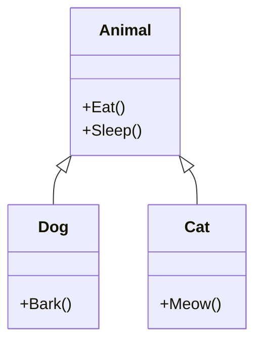

**Простой пример наследования:**

```csharp
// Базовый класс
public class Animal
{
    public void Eat()
    {
        Console.WriteLine("Животное ест");
    }

    public void Sleep()
    {
        Console.WriteLine("Животное спит");
    }
}

// Наследники получают методы базового класса
public class Dog : Animal
{
    public void Bark()
    {
        Console.WriteLine("Собака лает");
    }
}

public class Cat : Animal
{
    public void Meow()
    {
        Console.WriteLine("Кот мяукает");
    }
}

// Использование
public class Program
{
    public static void Main()
    {
        var dog = new Dog();
        dog.Eat();   // Унаследованный метод
        dog.Bark();  // Собственный метод
    }
}
```

Выглядит идеально? Не спешите. У наследования есть серьезные проблемы, которые проявляются по мере роста проекта.

#### Проблемы наследования

**1. Подкласс не может отказаться от интерфейса родителя**

Вы обязаны реализовать все абстрактные методы родительского класса, даже если они не имеют смысла для подкласса.

**Классический пример** — пингвин, который не умеет летать:

```csharp
public abstract class Bird
{
    public abstract void Fly(); // Не все птицы умеют летать
}

public class Sparrow : Bird
{
    public override void Fly()
    {
        Console.WriteLine("Воробей летит");
    }
}

public class Penguin : Bird
{
    // Пингвин не умеет летать, но обязан реализовать метод
    public override void Fly()
    {
        // Что тут писать?
        throw new NotSupportedException("Пингвины не летают!");
        // Или просто оставить пустым? Оба варианта плохие!
    }
}
```

**Проблема:** Интерфейс родительского класса не подходит для всех наследников.

**2. Переопределяя методы, можно сломать базовое поведение**

При переопределении методов родителя легко нарушить контракт суперкласса, что приведет к ошибкам.

```csharp
public class Document
{
    protected string Text;
    protected string Metadata;
    
    public string SavedText { get; private set; }
    public string SavedMetadata { get; private set; }

    public Document(string text, string metadata)
    {
        Text = text;
        Metadata = metadata;
    }

    // Базовая реализация сохранения
    public virtual void Save()
    {
        SavedText = Text;
        SavedMetadata = Metadata;
        Console.WriteLine("Документ сохранен");
    }
}

public class PdfDocument : Document
{
    public PdfDocument(string text, string metadata)
        : base(text, metadata)
    {
    }

    public override void Save()
    {
        // Программист забыл сохранить метаданные!
        // Нарушено базовое поведение
        SavedText = Text;
        Console.WriteLine("PDF документ сохранен");
        // SavedMetadata остается null - это ошибка!
    }
}

// Использование
public class Program
{
    public static void Main()
    {
        Document doc = new PdfDocument("Текст", "Важные метаданные");
        doc.Save();
        
        // Ожидаем, что метаданные сохранены
        Console.WriteLine($"Метаданные: {doc.SavedMetadata}"); // null - ошибка!
    }
}
```

**3. Наследование нарушает инкапсуляцию**

Подклассы имеют доступ к защищенным (protected) членам родителя, что может привести к непредсказуемым изменениям состояния.

```csharp
public class BankAccount
{
    // Защищенное поле доступно всем наследникам
    protected decimal _balance;

    public BankAccount(decimal initialBalance)
    {
        _balance = initialBalance;
    }

    public virtual void Withdraw(decimal amount)
    {
        if (amount <= _balance)
        {
            _balance -= amount;
            Console.WriteLine($"Снято: {amount}, Остаток: {_balance}");
        }
    }
}

public class HackedAccount : BankAccount
{
    public HackedAccount(decimal initialBalance) : base(initialBalance) { }

    public void AddMoney(decimal amount)
    {
        // Подкласс может напрямую изменять состояние
        _balance += amount; // Прямое изменение защищенного поля в обход бизнес-логики
        Console.WriteLine($"Баланс изменен напрямую: {_balance}");
    }
}
```

**4. Подклассы тесно связаны с родителем**

Любое изменение в базовом классе может сломать все наследники.

```csharp
public abstract class Shape
{
    public abstract void Draw();
}

public class Circle : Shape
{
    public override void Draw()
    {
        Console.WriteLine("Рисуем круг");
    }
}

public class Rectangle : Shape
{
    public override void Draw()
    {
        Console.WriteLine("Рисуем прямоугольник");
    }
}

public abstract class Shape
{
    public abstract void Draw();
    // Если добавить новый абстрактный метод в Shape...
    public abstract double CalculateArea(); // Новый метод!
}

// ...все наследники перестанут компилироваться!
// Circle и Rectangle должны реализовать CalculateArea()
```

**5. Комбинаторный взрыв классов**

При множестве независимых характеристик количество классов растет экспоненциально.

**Пример:** Моделирование автомобилей

Характеристики:
- Тип: легковой, грузовик
- Двигатель: бензиновый, электрический
- Управление: ручное, автопилот

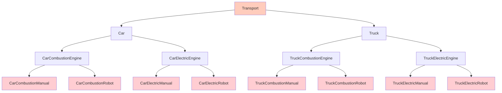

**Результат:** 8 классов для 3 характеристик! Добавьте еще характеристики (цвет, количество дверей, салон) — получите сотни классов.

**Проблемы:**
- Огромное количество классов
- Дублирование кода (многие языки не поддерживают множественное наследование)
- Сложность поддержки

#### Решение: Композиция

**Композиция (Composition)** — объект содержит другие объекты в качестве компонентов и делегирует им работу.

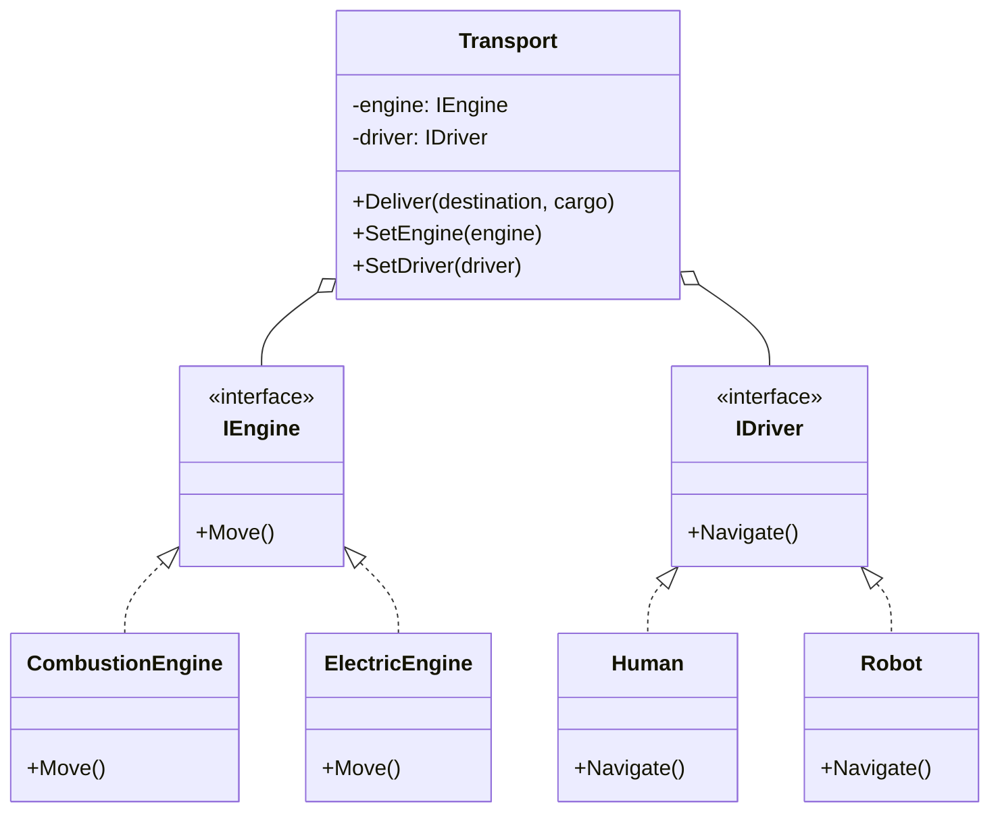

**Реализация с композицией:**

```csharp
// ========== Интерфейсы ==========

// Интерфейс двигателя
public interface IEngine
{
    void Move();
    string GetType();
}

// Интерфейс системы управления
public interface IDriver
{
    void Navigate();
    string GetType();
}

// ========== Реализации двигателей ==========

public class CombustionEngine : IEngine
{
    public void Move()
    {
        Console.WriteLine("Двигатель внутреннего сгорания: работает на бензине");
    }

    public string GetType() => "Бензиновый двигатель";
}

public class ElectricEngine : IEngine
{
    public void Move()
    {
        Console.WriteLine("Электрический двигатель: работает от батареи");
    }

    public string GetType() => "Электрический двигатель";
}

// ========== Реализации систем управления ==========

public class Human : IDriver
{
    public void Navigate()
    {
        Console.WriteLine("Человек управляет транспортом");
    }

    public string GetType() => "Ручное управление";
}

public class Robot : IDriver
{
    public void Navigate()
    {
        Console.WriteLine("Автопилот управляет транспортом");
    }

    public string GetType() => "Автопилот";
}

// ========== Класс транспорта с композицией ==========

public class Transport
{
    // Транспорт содержит компоненты, а не наследует их
    private IEngine _engine;
    private IDriver _driver;
    private readonly string _type;

    public Transport(string type, IEngine engine, IDriver driver)
    {
        _type = type;
        _engine = engine;
        _driver = driver;
        
        Console.WriteLine($"\nСоздан {_type}:");
        Console.WriteLine($"  - {_engine.GetType()}");
        Console.WriteLine($"  - {_driver.GetType()}");
    }

    // Основная функциональность
    public void Deliver(string destination, string cargo)
    {
        Console.WriteLine($"\n=== Доставка {cargo} в {destination} ===");
        _driver.Navigate();
        _engine.Move();
        Console.WriteLine($"Груз доставлен!");
    }

    // Можем менять компоненты во время выполнения
    public void SetEngine(IEngine engine)
    {
        Console.WriteLine($"\nЗамена двигателя: {engine.GetType()}");
        _engine = engine;
    }

    public void SetDriver(IDriver driver)
    {
        Console.WriteLine($"\nЗамена системы управления: {driver.GetType()}");
        _driver = driver;
    }
}

// ========== Пример использования ==========

public class Program
{
    public static void Main()
    {
        // Создаем различные конфигурации транспорта
        
        // 1. Легковой автомобиль с бензиновым двигателем и человеком
        var car = new Transport(
            "Легковой автомобиль",
            new CombustionEngine(),
            new Human()
        );
        car.Deliver("Москва", "Пассажиры");

        // 2. Грузовик с электрическим двигателем и автопилотом
        var truck = new Transport(
            "Грузовик",
            new ElectricEngine(),
            new Robot()
        );
        truck.Deliver("Санкт-Петербург", "Оборудование");

        Console.WriteLine("\n" + new string('=', 60));
        Console.WriteLine("ДЕМОНСТРАЦИЯ ЗАМЕНЫ КОМПОНЕНТОВ");
        Console.WriteLine(new string('=', 60));
        
        // Меняем бензиновый двигатель автомобиля на электрический
        car.SetEngine(new ElectricEngine());
        
        // Подключаем автопилот вместо человека
        car.SetDriver(new Robot());
        
        // Теперь автомобиль работает с новыми компонентами
        car.Deliver("Казань", "Медикаменты");
    }
}
```

**Вывод программы:**

```
Создан Легковой автомобиль:
  - Бензиновый двигатель
  - Ручное управление

=== Доставка Пассажиры в Москва ===
Человек управляет транспортом
Двигатель внутреннего сгорания: работает на бензине
Груз доставлен!

Создан Грузовик:
  - Электрический двигатель
  - Автопилот

=== Доставка Оборудование в Санкт-Петербург ===
Автопилот управляет транспортом
Электрический двигатель: работает от батареи
Груз доставлен!

============================================================
ДЕМОНСТРАЦИЯ ЗАМЕНЫ КОМПОНЕНТОВ
============================================================

Замена двигателя: Электрический двигатель

Замена системы управления: Автопилот

=== Доставка Медикаменты в Казань ===
Автопилот управляет транспортом
Электрический двигатель: работает от батареи
Груз доставлен!
```

#### Когда использовать наследование

Наследование не всегда плохо! Используйте его когда:

1. **Отношение "является" (is-a) логично и стабильно**
   - `Dog` is-a `Animal` (хорошо)
   - `ElectricCar` is-a `Car` (лучше композиция)

2. **Иерархия не будет сильно расти**
   - 2-3 уровня наследования - это нормально
   - 5+ уровней - нет

> Используйте композицию по умолчанию. Применяйте наследование только когда действительно нужна полиморфная иерархия типов.

> Эта структура с композицией является примером паттерна **Strategy (Стратегия)**, который мы рассмотрим позже в курсе.

### Что дальше?

Эти базовые принципы формируют фундамент для изучения:
- **SOLID и GRASP принципов** — более детальная проработка текущих принципов проектирования и их логическое развитие (ещё раз, но более подробно поговорим о том же самом, о чём говорили здесь).
- **Паттернов проектирования** — готовые решения типовых задач

> Хорошая архитектура — это не та, в которой невозможно сделать ошибку, а та, в которой ошибку легко исправить.

**Удачи в изучении ООП!**