# Базовые принципы проектирования (Basic Design Principles)

Прежде чем перейти к изучению конкретных паттернов проектирования, необходимо понять фундаментальные принципы создания качественного программного обеспечения. В этой главе мы разберем ключевые концепции, которые лежат в основе хорошей архитектуры, и научимся применять их на практике.

## Содержание
1. [Качества хорошей архитектуры](#качества-хорошей-архитектуры)
2. [Базовые принципы проектирования](#базовые-принципы-проектирования-1)
3. [Практические примеры](#практические-примеры)

## Качества хорошей архитектуры

### Повторное использование кода (Code Reusability)

Стоимость и время разработки являются ключевыми метриками успешности любого программного продукта. Повторное использование кода и архитектурных решений — один из наиболее эффективных способов снижения этих показателей. Концепция проста: зачем создавать что-то заново, если можно использовать проверенные решения из предыдущих проектов?

Однако на практике не всякий код поддается повторному использованию. Основные препятствия:

- **Tight Coupling (тесная связанность)** — когда компоненты слишком зависимы друг от друга
- **Concrete Dependencies (конкретные зависимости)** — код зависит от конкретных классов, а не от абстракций
- **Hard-coded Behavior (жестко закодированное поведение)** — операции вшиты в код без возможности расширения

Паттерны проектирования помогают решить эти проблемы, повышая гибкость кода за счет некоторого усложнения архитектуры.

#### Три уровня повторного использования

Эрик Гамма, один из авторов знаменитой книги "Design Patterns" (Gang of Four), выделяет три уровня повторного использования:

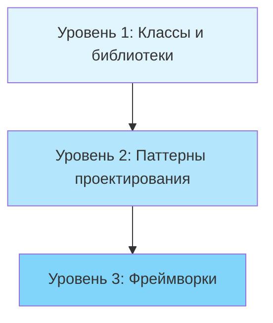

**Уровень 1: Классы (Classes)**
- Базовый уровень повторного использования
- Библиотеки классов, контейнеры, утилиты
- Пример: `List<T>`, `Dictionary<K,V>`, LINQ в .NET

**Уровень 2: Паттерны (Design Patterns)**
- Описывают взаимодействие между несколькими классами
- Переиспользуются идеи и концепции, а не конкретный код
- Менее рискованны, чем создание фреймворков
- Более абстрактны и гибки, чем отдельные классы

**Уровень 3: Фреймворки (Frameworks)**
- Определяют архитектуру всего приложения
- Работают по принципу **Hollywood Principle (голливудский принцип)**: "Don't call us, we'll call you" (Не звоните нам, мы сами вам перезвоним)
- Фреймворк управляет потоком выполнения, вызывая ваш код в нужные моменты
- Примеры: ASP.NET Core, xUnit, Entity Framework
- Требуют значительных инвестиций в разработку и поддержку

> Паттерны проектирования занимают золотую середину: они достаточно абстрактны для переиспользования, но при этом не требуют больших инвестиций, как фреймворки.

### Расширяемость (Extensibility)

Изменения — неизбежная часть разработки программного обеспечения. Рассмотрим типичные ситуации:

- Вы создали идеальную архитектуру интернет-магазина для веб-интерфейса, но через месяц потребовалось добавить поддержку заказов по телефону
- Вы выпустили игру для Windows, но затем понадобилась версия для macOS и Linux
- Вы разработали UI-фреймворк с квадратными кнопками, но клиенты захотели круглые

**Почему изменения неизбежны?**

1. **Эволюция требований (Requirements Evolution)**
   - Новые функции появляются в процессе эксплуатации
   - При проектировании невозможно предусмотреть все будущие потребности

2. **Улучшение понимания проблемы (Better Problem Understanding)**
   - В процессе решения задачи приходит более глубокое понимание
   - К концу первой версии часто хочется переписать все с нуля
   - Это нормальный итеративный процесс развития продукта

3. **Внешние изменения (External Changes)**
   - Обновления операционных систем
   - Новые версии зависимостей
   - Изменения в законодательстве или бизнес-процессах

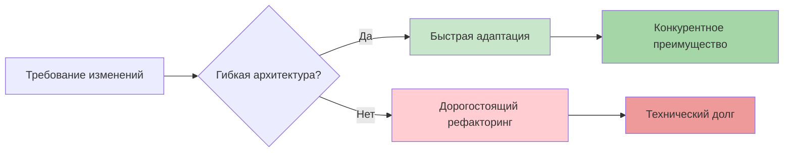

> Если кто-то просит изменить вашу программу — это хороший знак: она все еще нужна. Проектируйте код с учетом будущих изменений, чтобы их внесение было простым и безопасным.

## Базовые принципы проектирования

Хороший дизайн программы определяется набором качеств: гибкость, связанность, управляемость, стабильность и понятность. Как достичь баланса между всеми этими характеристиками? Существуют универсальные принципы, которые помогают принимать правильные архитектурные решения.

### 1. Инкапсулируйте то, что изменяется (Encapsulate What Varies)

> **Принцип:** Определите аспекты программы, которые изменяются чаще всего, и отделите их от стабильных частей.

Цель этого принципа — минимизировать последствия изменений. Представьте корабль с водонепроницаемыми отсеками: если один отсек затоплен, остальные остаются сухими, и корабль продолжает плыть.

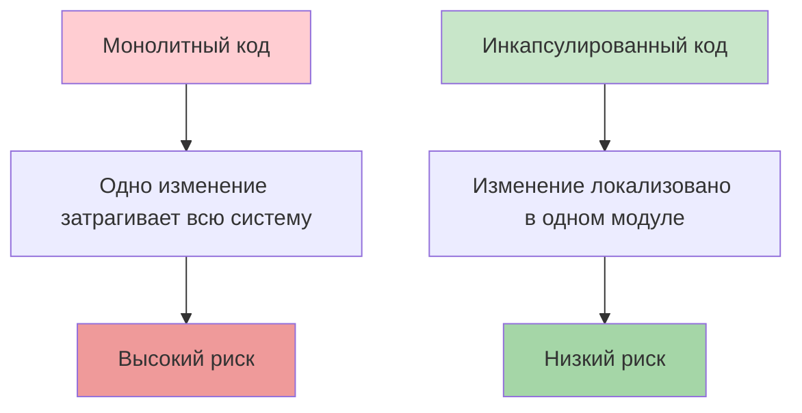

**Преимущества инкапсуляции изменяемых частей:**
- Меньше кода требует модификации
- Проще тестирование изменений
- Снижение стоимости разработки
- Меньше вероятность внесения ошибок

#### Инкапсуляция на уровне метода

Рассмотрим пример с интернет-магазином. Метод расчета общей стоимости заказа включает вычисление налога, который зависит от страны покупателя и может часто меняться.

**Плохой пример** (anti-pattern — НЕ делайте так):

```csharp
public class Order
{
    public List<OrderItem> LineItems { get; set; }
    public string Country { get; set; }

    // ❌ ПЛОХО: Логика налогов смешана с расчетом общей суммы
    public decimal GetOrderTotal()
    {
        decimal total = 0;
        
        // Суммируем стоимость товаров
        foreach (var item in LineItems)
        {
            total += item.Price * item.Quantity;
        }

        // Вычисление налога жестко закодировано в методе
        if (Country == "Russia")
        {
            total -= total * 0.20m; // НДС 20%
        }
        else if (Country == "Greece")
        {
            total -= total * 0.24m; // НДС 24%
        }
        // При добавлении новой страны придется изменять этот метод

        return total;
    }
}
```

**Проблемы этого подхода:**
- При изменении налогового законодательства нужно модифицировать метод `GetOrderTotal`
- При добавлении новой страны нужно добавлять новую ветку `if`
- Логика налогов не может быть переиспользована в других местах
- Метод нарушает принцип единственной ответственности

**Правильный пример:**

```csharp
public class Order
{
    public List<OrderItem> LineItems { get; set; }
    public string Country { get; set; }

    // ✅ ХОРОШО: Основной метод делегирует вычисление налога
    public decimal GetOrderTotal()
    {
        decimal total = 0;
        
        // Суммируем стоимость товаров
        foreach (var item in LineItems)
        {
            total += item.Price * item.Quantity;
        }

        // Применяем налог через отдельный метод
        decimal taxRate = GetTaxRate(Country);
        total -= total * taxRate;

        return total;
    }

    // Изменяемая логика изолирована в отдельном методе
    private decimal GetTaxRate(string country)
    {
        return country switch
        {
            "Russia" => 0.20m,   // НДС 20%
            "Greece" => 0.24m,   // НДС 24%
            "Germany" => 0.19m,  // НДС 19%
            "USA" => 0.07m,      // Sales Tax ~7% (варьируется по штатам)
            _ => 0.00m           // Нет налога по умолчанию
        };
    }
}

public class OrderItem
{
    public decimal Price { get; set; }
    public int Quantity { get; set; }
}
```

**Преимущества:**
- Изменения налоговых ставок локализованы в одном методе
- Метод `GetOrderTotal` больше не зависит от деталей налогообложения
- Логику налогов легко протестировать отдельно
- Проще добавить новую страну

#### Инкапсуляция на уровне класса

Если логика налогообложения становится сложнее (например, разные ставки для разных категорий товаров, региональные особенности), стоит выделить ее в отдельный класс.

**До рефакторинга:**

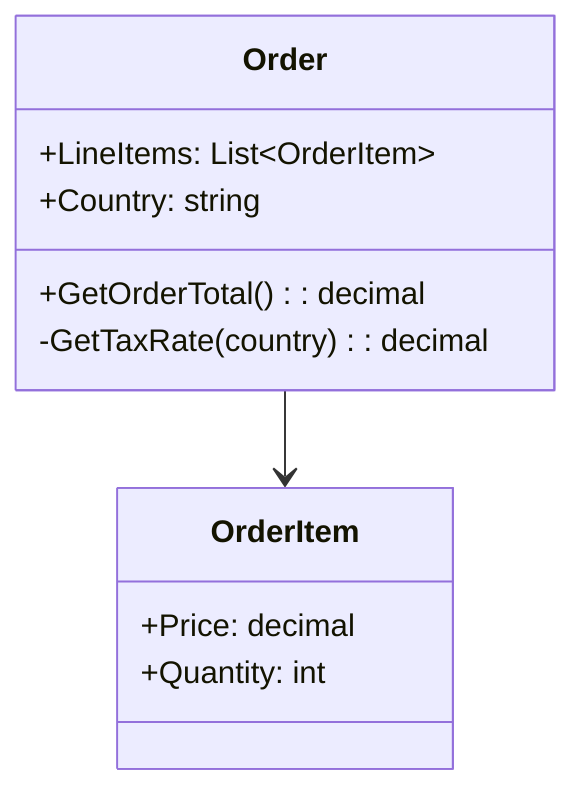

Объект заказа отвечает за расчет налогов, что усложняет его и делает менее гибким.

**После рефакторинга:**

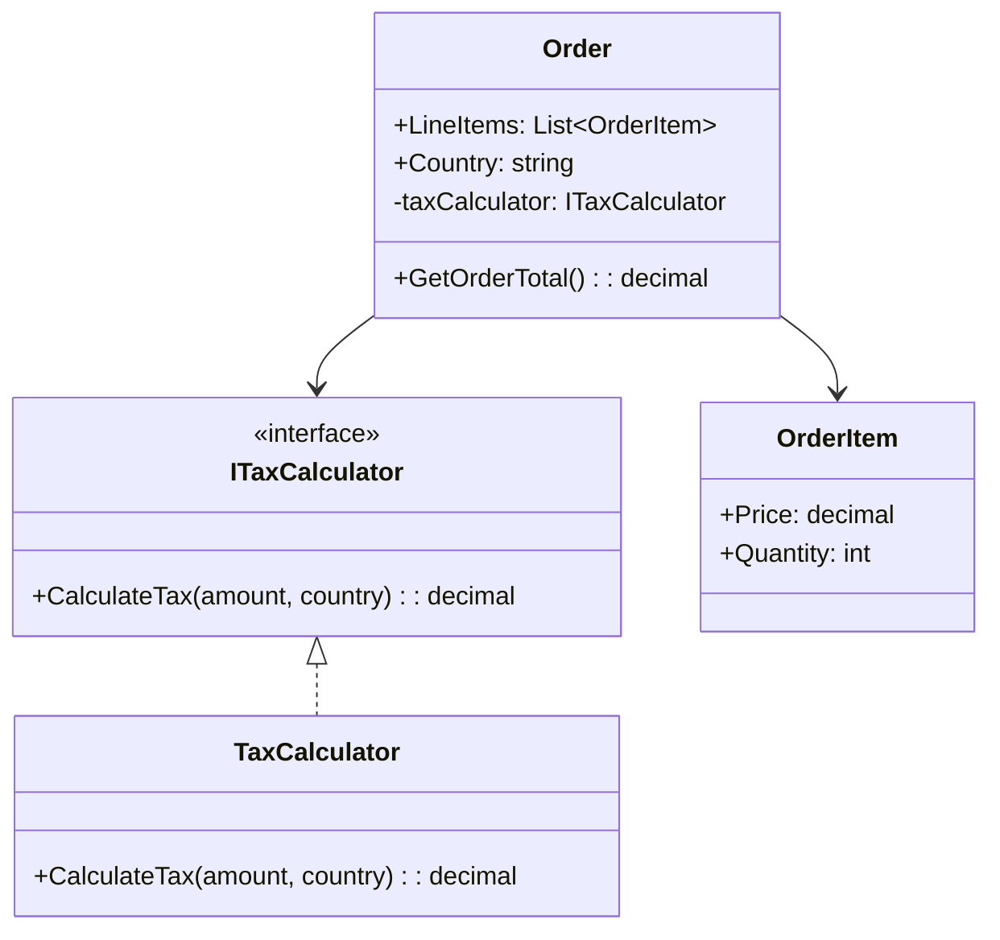

**Реализация:**

```csharp
// Интерфейс для расчета налогов
public interface ITaxCalculator
{
    decimal CalculateTax(decimal amount, string country);
}

// Реализация калькулятора налогов
public class TaxCalculator : ITaxCalculator
{
    // Словарь с налоговыми ставками по странам
    private readonly Dictionary<string, decimal> _taxRates = new()
    {
        { "Russia", 0.20m },
        { "Greece", 0.24m },
        { "Germany", 0.19m },
        { "USA", 0.07m }
    };

    public decimal CalculateTax(decimal amount, string country)
    {
        // Получаем ставку налога для страны
        if (_taxRates.TryGetValue(country, out decimal rate))
        {
            return amount * rate;
        }

        // Налог по умолчанию (если страна не найдена)
        return 0;
    }
}

// Класс заказа теперь делегирует расчет налогов
public class Order
{
    public List<OrderItem> LineItems { get; set; }
    public string Country { get; set; }
    
    // Зависимость от абстракции (интерфейса), а не конкретного класса
    private readonly ITaxCalculator _taxCalculator;

    public Order(ITaxCalculator taxCalculator)
    {
        _taxCalculator = taxCalculator;
        LineItems = new List<OrderItem>();
    }

    // Метод стал проще и сфокусирован только на расчете суммы заказа
    public decimal GetOrderTotal()
    {
        decimal subtotal = 0;
        
        foreach (var item in LineItems)
        {
            subtotal += item.Price * item.Quantity;
        }

        // Делегируем расчет налога отдельному объекту
        decimal tax = _taxCalculator.CalculateTax(subtotal, Country);
        
        return subtotal + tax;
    }
}

// Пример использования
public class Program
{
    public static void Main()
    {
        // Создаем калькулятор налогов
        var taxCalculator = new TaxCalculator();
        
        // Создаем заказ
        var order = new Order(taxCalculator)
        {
            Country = "Russia",
            LineItems = new List<OrderItem>
            {
                new OrderItem { Price = 100, Quantity = 2 },
                new OrderItem { Price = 50, Quantity = 1 }
            }
        };

        // Получаем итоговую сумму с налогом
        decimal total = order.GetOrderTotal();
        Console.WriteLine($"Итого к оплате: {total:C}"); // 300.00
    }
}
```

**Преимущества классового подхода:**
- Полная изоляция логики налогообложения
- Возможность легко заменить реализацию калькулятора
- Простота тестирования (можно использовать mock-объекты)
- Класс `Order` фокусируется только на управлении заказом
- Калькулятор налогов можно переиспользовать в других частях системы

### 2. Программируйте на уровне интерфейсов (Program to an Interface, not an Implementation)

> **Принцип:** Код должен зависеть от абстракций (интерфейсов), а не от конкретных классов.

Этот принцип повышает гибкость архитектуры, позволяя легко расширять систему без изменения существующего кода. Зависимость от абстракций делает код более устойчивым к изменениям.

**Аналогия:** Представьте класс `Cat` (кот). Кот, который ест только мышей и сардельки, менее гибкий, чем кот, который может есть любую еду (в рамках разумного — кошачьей еды). Второго можно кормить мышами, сардельками, сухим кормом, консервами — всем, что является `IFood`.

#### Как применять принцип

Когда нужно наладить взаимодействие между двумя классами, следуйте этим шагам:

1. **Определите требуемые операции** — какие методы один объект вызывает у другого
2. **Создайте интерфейс** — опишите эти методы в отдельном интерфейсе
3. **Реализуйте интерфейс** — класс-зависимость должен реализовать этот интерфейс
4. **Зависите от интерфейса** — класс-потребитель зависит от интерфейса, а не конкретного класса

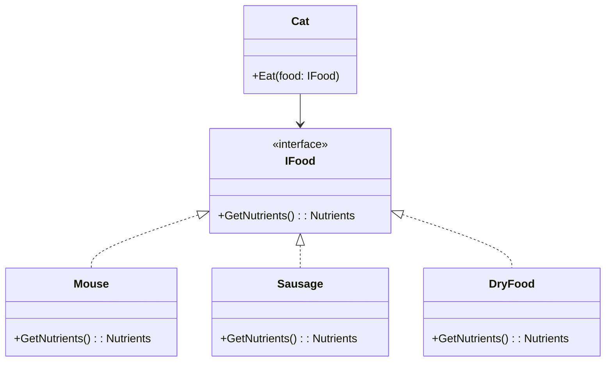

**Пример реализации:**

```csharp
// Интерфейс еды
public interface IFood
{
    string GetName();
    int GetCalories();
}

// Конкретные реализации еды
public class Mouse : IFood
{
    public string GetName() => "Мышь";
    public int GetCalories() => 150;
}

public class Sausage : IFood
{
    public string GetName() => "Сарделька";
    public int GetCalories() => 300;
}

public class DryFood : IFood
{
    public string GetName() => "Сухой корм";
    public int GetCalories() => 250;
}

// Кот зависит от интерфейса IFood, а не от конкретных классов
public class Cat
{
    private readonly string _name;
    private int _energy;

    public Cat(string name)
    {
        _name = name;
        _energy = 0;
    }

    // Метод принимает любую еду, реализующую IFood
    public void Eat(IFood food)
    {
        _energy += food.GetCalories();
        Console.WriteLine($"{_name} съел {food.GetName()}. Энергия: {_energy}");
    }
}

// Пример использования
public class Program
{
    public static void Main()
    {
        var cat = new Cat("Мурзик");
        
        // Кот может есть любую еду, реализующую IFood
        cat.Eat(new Mouse());        // Мурзик съел Мышь. Энергия: 150
        cat.Eat(new Sausage());      // Мурзик съел Сарделька. Энергия: 450
        cat.Eat(new DryFood());      // Мурзик съел Сухой корм. Энергия: 700
        
        // Легко добавить новый тип еды без изменения класса Cat
    }
}
```

**Преимущества:**
- Можно добавлять новые типы еды без изменения класса `Cat`
- Легко тестировать с помощью mock-объектов
- Код становится более гибким и расширяемым

#### Практический пример: Симулятор компании

Рассмотрим более сложный пример с симулятором компании (наподобие игры Game Factory Simulator).

**Проблема:** Жесткая привязка к конкретным классам

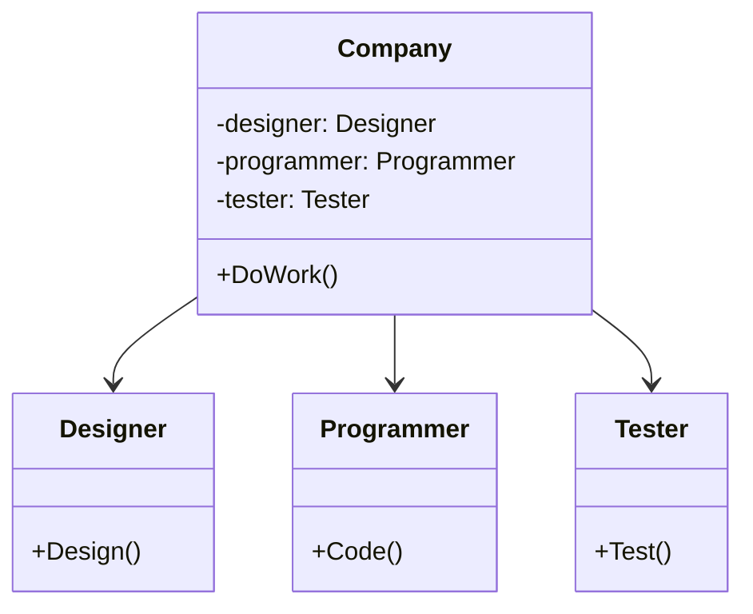

**Плохой пример** (anti-pattern):

```csharp
// ❌ ПЛОХО: Компания жестко привязана к конкретным классам работников
public class Designer
{
    public void Design()
    {
        Console.WriteLine("Дизайнер создает макет");
    }
}

public class Programmer
{
    public void Code()
    {
        Console.WriteLine("Программист пишет код");
    }
}

public class Tester
{
    public void Test()
    {
        Console.WriteLine("Тестировщик тестирует продукт");
    }
}

public class Company
{
    private Designer _designer;
    private Programmer _programmer;
    private Tester _tester;

    public Company()
    {
        // Жесткая привязка к конкретным классам
        _designer = new Designer();
        _programmer = new Programmer();
        _tester = new Tester();
    }

    public void DoWork()
    {
        _designer.Design();
        _programmer.Code();
        _tester.Test();
    }
}
```

**Проблемы:**
- Невозможно добавить новые типы работников
- Нельзя создать разные типы компаний с разными работниками
- Сложно тестировать
- Нарушается принцип открытости/закрытости

**Шаг 1:** Выделение общего интерфейса

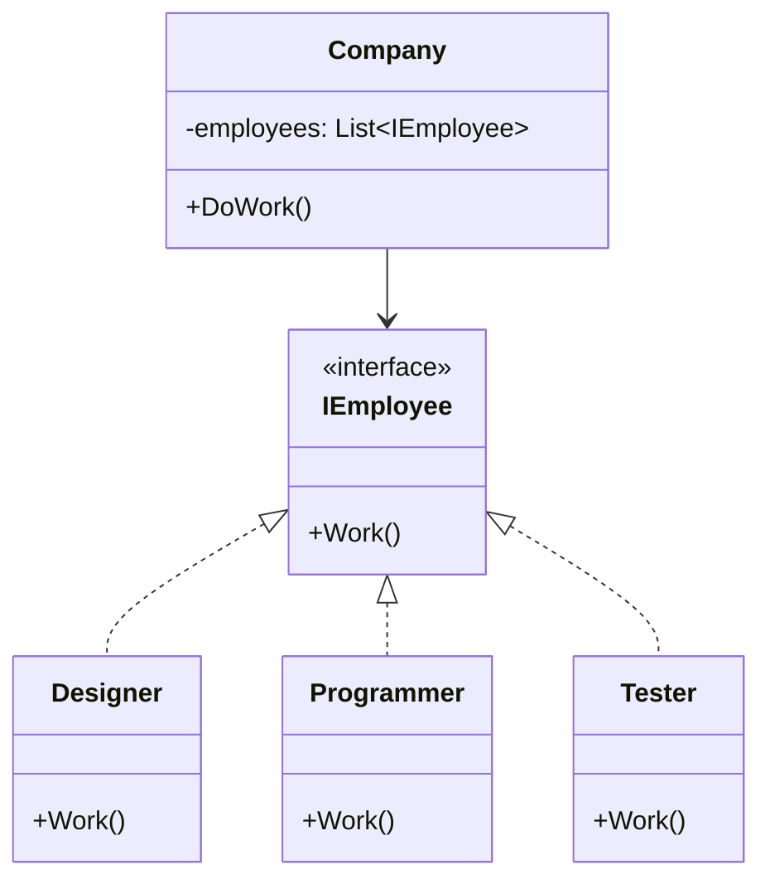

**Улучшенный пример:**

```csharp
// ✅ ЛУЧШЕ: Используем общий интерфейс
public interface IEmployee
{
    void Work();
    string GetPosition();
}

public class Designer : IEmployee
{
    public void Work()
    {
        Console.WriteLine("Дизайнер создает макет");
    }

    public string GetPosition() => "Дизайнер";
}

public class Programmer : IEmployee
{
    public void Work()
    {
        Console.WriteLine("Программист пишет код");
    }

    public string GetPosition() => "Программист";
}

public class Tester : IEmployee
{
    public void Work()
    {
        Console.WriteLine("Тестировщик тестирует продукт");
    }

    public string GetPosition() => "Тестировщик";
}

public class Company
{
    private readonly List<IEmployee> _employees;

    public Company()
    {
        _employees = new List<IEmployee>();
    }

    public void HireEmployee(IEmployee employee)
    {
        _employees.Add(employee);
        Console.WriteLine($"Нанят: {employee.GetPosition()}");
    }

    // Используем полиморфизм - работаем с сотрудниками через интерфейс
    public void DoWork()
    {
        Console.WriteLine("\n=== Рабочий день начался ===");
        foreach (var employee in _employees)
        {
            employee.Work();
        }
        Console.WriteLine("=== Рабочий день закончился ===\n");
    }
}
```

Это уже лучше, но компания все еще создает конкретных работников внутри себя. Давайте улучшим дальше.

**Шаг 2:** Фабричный метод для создания работников

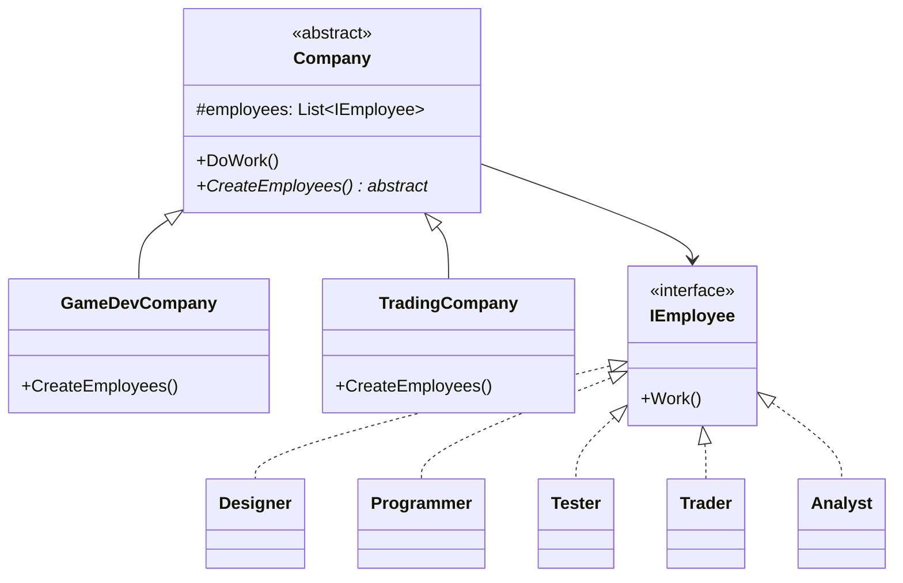

**Идеальный пример:**

```csharp
// Базовый абстрактный класс компании
public abstract class Company
{
    protected List<IEmployee> _employees;

    public Company()
    {
        _employees = new List<IEmployee>();
        // Каждая конкретная компания сама решает, кого нанимать
        CreateEmployees();
    }

    // Абстрактный метод - конкретная реализация в подклассах
    protected abstract void CreateEmployees();

    public void DoWork()
    {
        Console.WriteLine($"\n=== {GetType().Name}: Рабочий день ===");
        foreach (var employee in _employees)
        {
            employee.Work();
        }
        Console.WriteLine("=== Конец рабочего дня ===\n");
    }
}

// Компания разработки игр
public class GameDevCompany : Company
{
    protected override void CreateEmployees()
    {
        // Специфичные для игровой разработки работники
        _employees.Add(new Designer());
        _employees.Add(new Programmer());
        _employees.Add(new Tester());
        Console.WriteLine("Игровая компания: сотрудники наняты");
    }
}

// Трейдинговая компания
public class TradingCompany : Company
{
    protected override void CreateEmployees()
    {
        // Специфичные для трейдинга работники
        _employees.Add(new Trader());
        _employees.Add(new Analyst());
        _employees.Add(new Programmer()); // Для алгоритмической торговли
        Console.WriteLine("Трейдинговая компания: сотрудники наняты");
    }
}

// Новые типы работников для трейдинговой компании
public class Trader : IEmployee
{
    public void Work()
    {
        Console.WriteLine("Трейдер анализирует рынок и совершает сделки");
    }

    public string GetPosition() => "Трейдер";
}

public class Analyst : IEmployee
{
    public void Work()
    {
        Console.WriteLine("Аналитик изучает финансовые показатели");
    }

    public string GetPosition() => "Аналитик";
}

// Пример использования
public class Program
{
    public static void Main()
    {
        // Создаем разные типы компаний
        Company gameDev = new GameDevCompany();
        Company trading = new TradingCompany();

        // Обе компании работают одинаково, но с разными сотрудниками
        gameDev.DoWork();
        trading.DoWork();

        // Легко добавить новый тип компании без изменения базового класса
    }
}
```

**Преимущества финального решения:**
- Базовый класс `Company` полностью независим от конкретных работников
- Можно добавлять новые типы компаний без изменения существующего кода
- Можно добавлять новые типы работников без изменения существующего кода
- Каждая компания управляет своим набором сотрудников
- Это пример паттерна **Factory Method (Фабричный метод)**

> **Примечание:** Можно пойти еще дальше и выделить интерфейс для самих компаний (например, `ICompany` с методом `GetEmployees()`), что сделает систему еще более гибкой.

### 3. Предпочитайте композицию наследованию (Favor Composition Over Inheritance)

Наследование — самый простой способ переиспользования кода между классами. Есть два класса с дублирующимся кодом? Создайте базовый класс, вынесите туда общую функциональность, и готово!

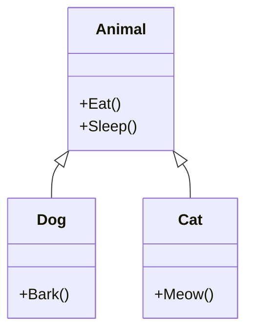

**Простой пример наследования:**

```csharp
// Базовый класс
public class Animal
{
    public void Eat()
    {
        Console.WriteLine("Животное ест");
    }

    public void Sleep()
    {
        Console.WriteLine("Животное спит");
    }
}

// Наследники получают методы базового класса
public class Dog : Animal
{
    public void Bark()
    {
        Console.WriteLine("Собака лает");
    }
}

public class Cat : Animal
{
    public void Meow()
    {
        Console.WriteLine("Кот мяукает");
    }
}

// Использование
public class Program
{
    public static void Main()
    {
        var dog = new Dog();
        dog.Eat();   // Унаследованный метод
        dog.Bark();  // Собственный метод
    }
}
```

Выглядит идеально? Не спешите. У наследования есть серьезные проблемы, которые проявляются по мере роста проекта.

#### Проблемы наследования

**1. Подкласс не может отказаться от интерфейса родителя**

Вы обязаны реализовать все абстрактные методы родительского класса, даже если они не имеют смысла для подкласса.

**Классический пример** — пингвин, который не умеет летать:

```csharp
// ❌ ПЛОХО: Не все птицы умеют летать
public abstract class Bird
{
    public abstract void Fly();
}

public class Sparrow : Bird
{
    public override void Fly()
    {
        Console.WriteLine("Воробей летит");
    }
}

public class Penguin : Bird
{
    // Пингвин не умеет летать, но обязан реализовать метод
    public override void Fly()
    {
        // Что тут писать?
        throw new NotSupportedException("Пингвины не летают!");
        // Или просто оставить пустым? Оба варианта плохие!
    }
}
```

**Проблема:** Интерфейс родительского класса не подходит для всех наследников. Это нарушает **Liskov Substitution Principle (принцип подстановки Барбары Лисков)**.

**2. Переопределяя методы, можно сломать базовое поведение**

При переопределении методов родителя легко нарушить контракт суперкласса, что приведет к ошибкам.

```csharp
public class Document
{
    protected string Text;
    protected string Metadata;
    
    public string SavedText { get; private set; }
    public string SavedMetadata { get; private set; }

    public Document(string text, string metadata)
    {
        Text = text;
        Metadata = metadata;
    }

    // Базовая реализация сохранения
    public virtual void Save()
    {
        SavedText = Text;
        SavedMetadata = Metadata;
        Console.WriteLine("Документ сохранен");
    }
}

// ❌ ПЛОХО: Нарушено базовое поведение
public class PdfDocument : Document
{
    public PdfDocument(string text, string metadata)
        : base(text, metadata)
    {
    }

    public override void Save()
    {
        // Программист забыл сохранить метаданные!
        SavedText = Text;
        Console.WriteLine("PDF документ сохранен");
        // SavedMetadata остается null - это ошибка!
    }
}

// Использование
public class Program
{
    public static void Main()
    {
        Document doc = new PdfDocument("Текст", "Важные метаданные");
        doc.Save();
        
        // Ожидаем, что метаданные сохранены
        Console.WriteLine($"Метаданные: {doc.SavedMetadata}"); // null - ошибка!
    }
}
```

**3. Наследование нарушает инкапсуляцию**

Подклассы имеют доступ к защищенным (protected) членам родителя, что может привести к непредсказуемым изменениям состояния.

```csharp
public class BankAccount
{
    // Защищенное поле доступно всем наследникам
    protected decimal _balance;

    public BankAccount(decimal initialBalance)
    {
        _balance = initialBalance;
    }

    public virtual void Withdraw(decimal amount)
    {
        if (amount <= _balance)
        {
            _balance -= amount;
            Console.WriteLine($"Снято: {amount}, Остаток: {_balance}");
        }
    }
}

// ❌ ПЛОХО: Подкласс может напрямую изменять состояние
public class HackedAccount : BankAccount
{
    public HackedAccount(decimal initialBalance) : base(initialBalance) { }

    public void AddMoney(decimal amount)
    {
        // Прямое изменение защищенного поля в обход бизнес-логики
        _balance += amount;
        Console.WriteLine($"Баланс изменен напрямую: {_balance}");
    }
}
```

**4. Подклассы тесно связаны с родителем**

Любое изменение в базовом классе может сломать все наследники.

```csharp
public abstract class Shape
{
    public abstract void Draw();
}

public class Circle : Shape
{
    public override void Draw()
    {
        Console.WriteLine("Рисуем круг");
    }
}

public class Rectangle : Shape
{
    public override void Draw()
    {
        Console.WriteLine("Рисуем прямоугольник");
    }
}

// Если добавить новый абстрактный метод в Shape...
public abstract class Shape
{
    public abstract void Draw();
    public abstract double CalculateArea(); // Новый метод!
}

// ...все наследники перестанут компилироваться!
// Circle и Rectangle должны реализовать CalculateArea()
```

**5. Комбинаторный взрыв классов**

При множестве независимых характеристик количество классов растет экспоненциально.

**Пример:** Моделирование автомобилей

Характеристики:
- Тип: легковой, грузовик
- Двигатель: бензиновый, электрический
- Управление: ручное, автопилот

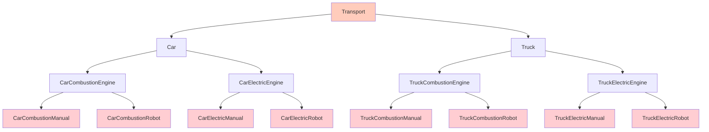

**Результат:** 8 классов для 3 характеристик! Добавьте еще характеристики (цвет, количество дверей) — получите сотни классов.

**Проблемы:**
- Огромное количество классов
- Дублирование кода (многие языки не поддерживают множественное наследование)
- Сложность поддержки

#### Решение: Композиция

**Композиция (Composition)** — объект содержит другие объекты в качестве компонентов и делегирует им работу.

**Различия подходов:**
- **Наследование:** "является" (Car **is-a** Transport)
- **Композиция:** "содержит" (Car **has-a** Engine)

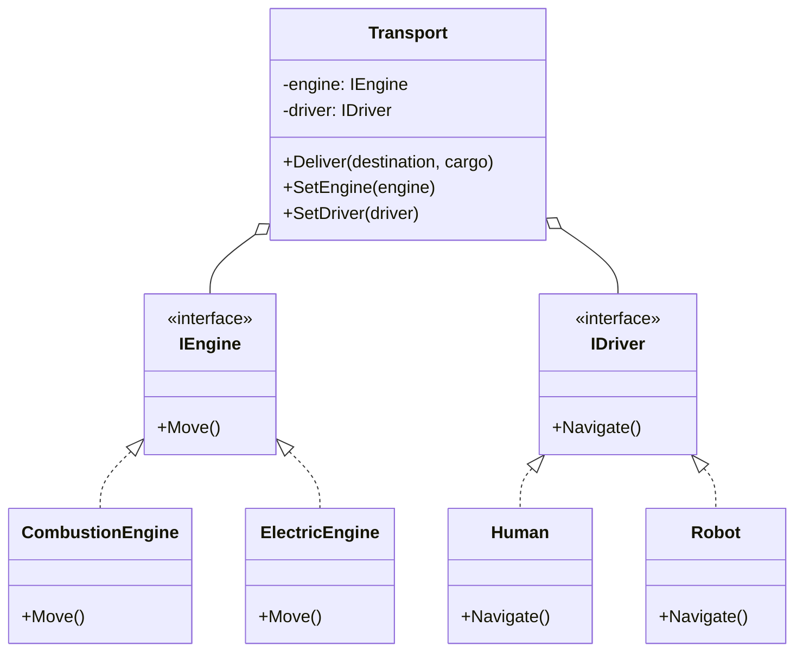

**Полная реализация с композицией:**

```csharp
// ========== Интерфейсы ==========

// Интерфейс двигателя
public interface IEngine
{
    void Move();
    string GetType();
}

// Интерфейс системы управления
public interface IDriver
{
    void Navigate();
    string GetType();
}

// ========== Реализации двигателей ==========

public class CombustionEngine : IEngine
{
    public void Move()
    {
        Console.WriteLine("Двигатель внутреннего сгорания: работает на бензине");
    }

    public string GetType() => "Бензиновый двигатель";
}

public class ElectricEngine : IEngine
{
    public void Move()
    {
        Console.WriteLine("Электрический двигатель: работает от батареи");
    }

    public string GetType() => "Электрический двигатель";
}

// ========== Реализации систем управления ==========

public class Human : IDriver
{
    public void Navigate()
    {
        Console.WriteLine("Человек управляет транспортом");
    }

    public string GetType() => "Ручное управление";
}

public class Robot : IDriver
{
    public void Navigate()
    {
        Console.WriteLine("Автопилот управляет транспортом");
    }

    public string GetType() => "Автопилот";
}

// ========== Класс транспорта с композицией ==========

public class Transport
{
    // Транспорт содержит компоненты, а не наследует их
    private IEngine _engine;
    private IDriver _driver;
    private readonly string _type;

    public Transport(string type, IEngine engine, IDriver driver)
    {
        _type = type;
        _engine = engine;
        _driver = driver;
        
        Console.WriteLine($"\nСоздан {_type}:");
        Console.WriteLine($"  - {_engine.GetType()}");
        Console.WriteLine($"  - {_driver.GetType()}");
    }

    // Основная функциональность
    public void Deliver(string destination, string cargo)
    {
        Console.WriteLine($"\n=== Доставка {cargo} в {destination} ===");
        _driver.Navigate();
        _engine.Move();
        Console.WriteLine($"Груз доставлен!");
    }

    // ✅ ПРЕИМУЩЕСТВО: Можем менять компоненты во время выполнения!
    public void SetEngine(IEngine engine)
    {
        Console.WriteLine($"\nЗамена двигателя: {engine.GetType()}");
        _engine = engine;
    }

    public void SetDriver(IDriver driver)
    {
        Console.WriteLine($"\nЗамена системы управления: {driver.GetType()}");
        _driver = driver;
    }
}

// ========== Пример использования ==========

public class Program
{
    public static void Main()
    {
        // Создаем различные конфигурации транспорта
        
        // 1. Легковой автомобиль с бензиновым двигателем и человеком
        var car = new Transport(
            "Легковой автомобиль",
            new CombustionEngine(),
            new Human()
        );
        car.Deliver("Москва", "Пассажиры");

        // 2. Грузовик с электрическим двигателем и автопилотом
        var truck = new Transport(
            "Грузовик",
            new ElectricEngine(),
            new Robot()
        );
        truck.Deliver("Санкт-Петербург", "Оборудование");

        // 3. Демонстрация замены компонентов на лету
        Console.WriteLine("\n" + new string('=', 60));
        Console.WriteLine("ДЕМОНСТРАЦИЯ ЗАМЕНЫ КОМПОНЕНТОВ");
        Console.WriteLine(new string('=', 60));
        
        // Меняем бензиновый двигатель автомобиля на электрический
        car.SetEngine(new ElectricEngine());
        
        // Подключаем автопилот вместо человека
        car.SetDriver(new Robot());
        
        // Теперь автомобиль работает с новыми компонентами
        car.Deliver("Казань", "Медикаменты");

        Console.WriteLine("\n" + new string('=', 60));
        Console.WriteLine("ПРЕИМУЩЕСТВА КОМПОЗИЦИИ:");
        Console.WriteLine("- Легко добавлять новые типы двигателей и водителей");
        Console.WriteLine("- Можно менять поведение во время выполнения");
        Console.WriteLine("- Один класс Transport вместо множества наследников");
        Console.WriteLine("- Высокая гибкость и переиспользование кода");
        Console.WriteLine(new string('=', 60));
    }
}
```

**Вывод программы:**

```
Создан Легковой автомобиль:
  - Бензиновый двигатель
  - Ручное управление

=== Доставка Пассажиры в Москва ===
Человек управляет транспортом
Двигатель внутреннего сгорания: работает на бензине
Груз доставлен!

Создан Грузовик:
  - Электрический двигатель
  - Автопилот

=== Доставка Оборудование в Санкт-Петербург ===
Автопилот управляет транспортом
Электрический двигатель: работает от батареи
Груз доставлен!

============================================================
ДЕМОНСТРАЦИЯ ЗАМЕНЫ КОМПОНЕНТОВ
============================================================

Замена двигателя: Электрический двигатель

Замена системы управления: Автопилот

=== Доставка Медикаменты в Казань ===
Автопилот управляет транспортом
Электрический двигатель: работает от батареи
Груз доставлен!
```

#### Композиция vs Агрегация

**Агрегация** — более слабая форма композиции, где объекты равноправны и могут существовать независимо.

**Различия:**
- **Композиция:** Автомобиль **владеет** двигателем (двигатель уничтожается вместе с автомобилем)
- **Агрегация:** Автомобиль **использует** водителя (водитель может выйти и пойти пешком)

```csharp
// Пример агрегации
public class Car
{
    // Указатель на водителя, но не владеем им
    private Driver _driver;

    // Водитель передается извне, может существовать независимо
    public void SetDriver(Driver driver)
    {
        _driver = driver;
    }

    public void Drive()
    {
        if (_driver != null)
        {
            _driver.Drive();
            Console.WriteLine("Автомобиль движется");
        }
    }
}

public class Driver
{
    private readonly string _name;

    public Driver(string name)
    {
        _name = name;
    }

    public void Drive()
    {
        Console.WriteLine($"{_name} управляет автомобилем");
    }

    // Водитель может существовать без автомобиля
    public void Walk()
    {
        Console.WriteLine($"{_name} идет пешком");
    }
}

// Использование
public class Program
{
    public static void Main()
    {
        var driver = new Driver("Иван");
        var car = new Car();
        
        // Водитель садится в машину
        car.SetDriver(driver);
        car.Drive();
        
        // Водитель выходит и идет пешком
        car.SetDriver(null);
        driver.Walk();
    }
}
```

#### Когда использовать наследование

Наследование не всегда плохо! Используйте его когда:

1. **Отношение "является" (is-a) логично и стабильно**
   - `Dog` is-a `Animal` ✅
   - `ElectricCar` is-a `Car` ❌ (лучше композиция)

2. **Иерархия не будет сильно расти**
   - 2-3 уровня наследования: ✅
   - 5+ уровней: ❌

3. **Вы контролируете всю иерархию**
   - Ваш код: ✅
   - Библиотечный класс: ❌ (может измениться)

4. **Подкласс действительно расширяет, а не изменяет поведение**

> **Правило:** Используйте композицию по умолчанию. Применяйте наследование только когда действительно нужна полиморфная иерархия типов.

> **Примечание:** Эта структура с композицией является примером паттерна **Strategy (Стратегия)**, который мы рассмотрим позже в курсе.

---

## Заключение

В этой лекции мы рассмотрели три фундаментальных принципа проектирования, которые являются основой для создания качественного программного обеспечения:

### Ключевые выводы

**1. Инкапсулируйте изменяемые части**
- Выделяйте изменяющийся код в отдельные модули, классы или методы
- Минимизируйте область влияния изменений
- Упрощайте тестирование и поддержку

**2. Программируйте на уровне интерфейсов**
- Зависьте от абстракций, а не конкретных реализаций
- Повышайте гибкость и расширяемость системы
- Облегчайте тестирование и замену компонентов

**3. Предпочитайте композицию наследованию**
- Используйте делегирование вместо наследования там, где это возможно
- Избегайте комбинаторного взрыва классов
- Сохраняйте возможность изменять поведение во время выполнения

### Что дальше?

Эти базовые принципы формируют фундамент для изучения:
- **SOLID принципов** — более детальная проработка принципов проектирования
- **GRASP паттернов** — паттерны назначения ответственности объектам
- **Паттернов проектирования GoF** — готовые решения типовых задач

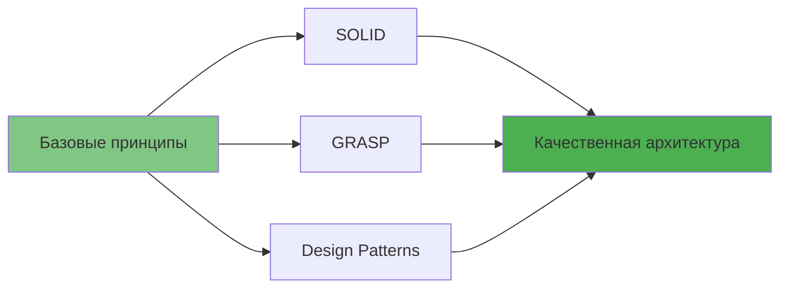

### Практические рекомендации

1. **Начинайте с простого** — не усложняйте дизайн преждевременно
2. **Рефакторьте постепенно** — улучшайте архитектуру по мере роста понимания задачи
3. **Применяйте принципы осознанно** — понимайте, почему вы делаете тот или иной выбор
4. **Помните о балансе** — иногда простое решение лучше идеально спроектированного
5. **Учитесь на практике** — применяйте принципы в реальных проектах

> Хорошая архитектура — это не та, в которой невозможно сделать ошибку, а та, в которой ошибку легко исправить.

**Удачи в изучении проектирования!**


**Простой пример наследования:**

```csharp
// Базовый класс
public class Animal
{
    public void Eat()
    {
        Console.WriteLine("Животное ест");
    }

    public void Sleep()
    {
        Console.WriteLine("Животное спит");
    }
}

// Наследники получают методы базового класса
public class Dog : Animal
{
    public void Bark()
    {
        Console.WriteLine("Собака лает");
    }
}

public class Cat : Animal
{
    public void Meow()
    {
        Console.WriteLine("Кот мяукает");
    }
}

// Использование
public class Program
{
    public static void Main()
    {
        var dog = new Dog();
        dog.Eat();   // Унаследованный метод
        dog.Bark();  // Собственный метод
    }
}
```

Выглядит идеально? Не спешите. У наследования есть серьезные проблемы, которые проявляются по мере роста проекта.

#### Проблемы наследования

**1. Подкласс не может отказаться от интерфейса родителя**

Вы обязаны реализовать все абстрактные методы родительского класса, даже если они не имеют смысла для подкласса.

**Классический пример** — пингвин, который не умеет летать:

```csharp
// ❌ ПЛОХО: Не все птицы умеют летать
public abstract class Bird
{
    public abstract void Fly();
}

public class Sparrow : Bird
{
    public override void Fly()
    {
        Console.WriteLine("Воробей летит");
    }
}

public class Penguin : Bird
{
    // Пингвин не умеет летать, но обязан реализовать метод
    public override void Fly()
    {
        // Что тут писать?
        throw new NotSupportedException("Пингвины не летают!");
        // Или просто оставить пустым? Оба варианта плохие!
    }
}
```

**Проблема:** Интерфейс родительского класса не подходит для всех наследников. Это нарушает **Liskov Substitution Principle (принцип подстановки Барбары Лисков)**.

**2. Переопределяя методы, можно сломать базовое поведение**

При переопределении методов родителя легко нарушить контракт суперкласса, что приведет к ошибкам.

```csharp
public class Document
{
    protected string Text;
    protected string Metadata;
    
    public string SavedText { get; private set; }
    public string SavedMetadata { get; private set; }

    public Document(string text, string metadata)
    {
        Text = text;
        Metadata = metadata;
    }

    // Базовая реализация сохранения
    public virtual void Save()
    {
        SavedText = Text;
        SavedMetadata = Metadata;
        Console.WriteLine("Документ сохранен");
    }
}

// ❌ ПЛОХО: Нарушено базовое поведение
public class PdfDocument : Document
{
    public PdfDocument(string text, string metadata)
        : base(text, metadata)
    {
    }

    public override void Save()
    {
        // Программист забыл сохранить метаданные!
        SavedText = Text;
        Console.WriteLine("PDF документ сохранен");
        // SavedMetadata остается null - это ошибка!
    }
}

// Использование
public class Program
{
    public static void Main()
    {
        Document doc = new PdfDocument("Текст", "Важные метаданные");
        doc.Save();
        
        // Ожидаем, что метаданные сохранены
        Console.WriteLine($"Метаданные: {doc.SavedMetadata}"); // null - ошибка!
    }
}
```

**3. Наследование нарушает инкапсуляцию**

Подклассы имеют доступ к защищенным (protected) членам родителя, что может привести к непредсказуемым изменениям состояния.

```csharp
public class BankAccount
{
    // Защищенное поле доступно всем наследникам
    protected decimal _balance;

    public BankAccount(decimal initialBalance)
    {
        _balance = initialBalance;
    }

    public virtual void Withdraw(decimal amount)
    {
        if (amount <= _balance)
        {
            _balance -= amount;
            Console.WriteLine($"Снято: {amount}, Остаток: {_balance}");
        }
    }
}

// ❌ ПЛОХО: Подкласс может напрямую изменять состояние
public class HackedAccount : BankAccount
{
    public HackedAccount(decimal initialBalance) : base(initialBalance) { }

    public void AddMoney(decimal amount)
    {
        // Прямое изменение защищенного поля в обход бизнес-логики
        _balance += amount;
        Console.WriteLine($"Баланс изменен напрямую: {_balance}");
    }
}
```

**4. Подклассы тесно связаны с родителем**

Любое изменение в базовом классе может сломать все наследники.

```csharp
public abstract class Shape
{
    public abstract void Draw();
}

public class Circle : Shape
{
    public override void Draw()
    {
        Console.WriteLine("Рисуем круг");
    }
}

public class Rectangle : Shape
{
    public override void Draw()
    {
        Console.WriteLine("Рисуем прямоугольник");
    }
}

// Если добавить новый абстрактный метод в Shape...
public abstract class Shape
{
    public abstract void Draw();
    public abstract double CalculateArea(); // Новый метод!
}

// ...все наследники перестанут компилироваться!
// Circle и Rectangle должны реализовать CalculateArea()
```

**5. Комбинаторный взрыв классов**

При множестве независимых характеристик количество классов растет экспоненциально.

**Пример:** Моделирование автомобилей

Характеристики:
- Тип: легковой, грузовик
- Двигатель: бензиновый, электрический
- Управление: ручное, автопилот


**Результат:** 8 классов для 3 характеристик! Добавьте еще характеристики (цвет, количество дверей) — получите сотни классов.

**Проблемы:**
- Огромное количество классов
- Дублирование кода (многие языки не поддерживают множественное наследование)
- Сложность поддержки

#### Решение: Композиция

**Композиция (Composition)** — объект содержит другие объекты в качестве компонентов и делегирует им работу.

**Различия подходов:**
- **Наследование:** "является" (Car **is-a** Transport)
- **Композиция:** "содержит" (Car **has-a** Engine)


**Полная реализация с композицией:**

```csharp
// ========== Интерфейсы ==========

// Интерфейс двигателя
public interface IEngine
{
    void Move();
    string GetType();
}

// Интерфейс системы управления
public interface IDriver
{
    void Navigate();
    string GetType();
}

// ========== Реализации двигателей ==========

public class CombustionEngine : IEngine
{
    public void Move()
    {
        Console.WriteLine("Двигатель внутреннего сгорания: работает на бензине");
    }

    public string GetType() => "Бензиновый двигатель";
}

public class ElectricEngine : IEngine
{
    public void Move()
    {
        Console.WriteLine("Электрический двигатель: работает от батареи");
    }

    public string GetType() => "Электрический двигатель";
}

// ========== Реализации систем управления ==========

public class Human : IDriver
{
    public void Navigate()
    {
        Console.WriteLine("Человек управляет транспортом");
    }

    public string GetType() => "Ручное управление";
}

public class Robot : IDriver
{
    public void Navigate()
    {
        Console.WriteLine("Автопилот управляет транспортом");
    }

    public string GetType() => "Автопилот";
}

// ========== Класс транспорта с композицией ==========

public class Transport
{
    // Транспорт содержит компоненты, а не наследует их
    private IEngine _engine;
    private IDriver _driver;
    private readonly string _type;

    public Transport(string type, IEngine engine, IDriver driver)
    {
        _type = type;
        _engine = engine;
        _driver = driver;
        
        Console.WriteLine($"\nСоздан {_type}:");
        Console.WriteLine($"  - {_engine.GetType()}");
        Console.WriteLine($"  - {_driver.GetType()}");
    }

    // Основная функциональность
    public void Deliver(string destination, string cargo)
    {
        Console.WriteLine($"\n=== Доставка {cargo} в {destination} ===");
        _driver.Navigate();
        _engine.Move();
        Console.WriteLine($"Груз доставлен!");
    }

    // ✅ ПРЕИМУЩЕСТВО: Можем менять компоненты во время выполнения!
    public void SetEngine(IEngine engine)
    {
        Console.WriteLine($"\nЗамена двигателя: {engine.GetType()}");
        _engine = engine;
    }

    public void SetDriver(IDriver driver)
    {
        Console.WriteLine($"\nЗамена системы управления: {driver.GetType()}");
        _driver = driver;
    }
}

// ========== Пример использования ==========

public class Program
{
    public static void Main()
    {
        // Создаем различные конфигурации транспорта
        
        // 1. Легковой автомобиль с бензиновым двигателем и человеком
        var car = new Transport(
            "Легковой автомобиль",
            new CombustionEngine(),
            new Human()
        );
        car.Deliver("Москва", "Пассажиры");

        // 2. Грузовик с электрическим двигателем и автопилотом
        var truck = new Transport(
            "Грузовик",
            new ElectricEngine(),
            new Robot()
        );
        truck.Deliver("Санкт-Петербург", "Оборудование");

        // 3. Демонстрация замены компонентов на лету
        Console.WriteLine("\n" + new string('=', 60));
        Console.WriteLine("ДЕМОНСТРАЦИЯ ЗАМЕНЫ КОМПОНЕНТОВ");
        Console.WriteLine(new string('=', 60));
        
        // Меняем бензиновый двигатель автомобиля на электрический
        car.SetEngine(new ElectricEngine());
        
        // Подключаем автопилот вместо человека
        car.SetDriver(new Robot());
        
        // Теперь автомобиль работает с новыми компонентами
        car.Deliver("Казань", "Медикаменты");

        Console.WriteLine("\n" + new string('=', 60));
        Console.WriteLine("ПРЕИМУЩЕСТВА КОМПОЗИЦИИ:");
        Console.WriteLine("- Легко добавлять новые типы двигателей и водителей");
        Console.WriteLine("- Можно менять поведение во время выполнения");
        Console.WriteLine("- Один класс Transport вместо множества наследников");
        Console.WriteLine("- Высокая гибкость и переиспользование кода");
        Console.WriteLine(new string('=', 60));
    }
}
```

**Вывод программы:**

```
Создан Легковой автомобиль:
  - Бензиновый двигатель
  - Ручное управление

=== Доставка Пассажиры в Москва ===
Человек управляет транспортом
Двигатель внутреннего сгорания: работает на бензине
Груз доставлен!

Создан Грузовик:
  - Электрический двигатель
  - Автопилот

=== Доставка Оборудование в Санкт-Петербург ===
Автопилот управляет транспортом
Электрический двигатель: работает от батареи
Груз доставлен!

============================================================
ДЕМОНСТРАЦИЯ ЗАМЕНЫ КОМПОНЕНТОВ
============================================================

Замена двигателя: Электрический двигатель

Замена системы управления: Автопилот

=== Доставка Медикаменты в Казань ===
Автопилот управляет транспортом
Электрический двигатель: работает от батареи
Груз доставлен!
```

#### Композиция vs Агрегация

**Агрегация** — более слабая форма композиции, где объекты равноправны и могут существовать независимо.

**Различия:**
- **Композиция:** Автомобиль **владеет** двигателем (двигатель уничтожается вместе с автомобилем)
- **Агрегация:** Автомобиль **использует** водителя (водитель может выйти и пойти пешком)

```csharp
// Пример агрегации
public class Car
{
    // Указатель на водителя, но не владеем им
    private Driver _driver;

    // Водитель передается извне, может существовать независимо
    public void SetDriver(Driver driver)
    {
        _driver = driver;
    }

    public void Drive()
    {
        if (_driver != null)
        {
            _driver.Drive();
            Console.WriteLine("Автомобиль движется");
        }
    }
}

public class Driver
{
    private readonly string _name;

    public Driver(string name)
    {
        _name = name;
    }

    public void Drive()
    {
        Console.WriteLine($"{_name} управляет автомобилем");
    }

    // Водитель может существовать без автомобиля
    public void Walk()
    {
        Console.WriteLine($"{_name} идет пешком");
    }
}

// Использование
public class Program
{
    public static void Main()
    {
        var driver = new Driver("Иван");
        var car = new Car();
        
        // Водитель садится в машину
        car.SetDriver(driver);
        car.Drive();
        
        // Водитель выходит и идет пешком
        car.SetDriver(null);
        driver.Walk();
    }
}
```

#### Когда использовать наследование

Наследование не всегда плохо! Используйте его когда:

1. **Отношение "является" (is-a) логично и стабильно**
   - `Dog` is-a `Animal` ✅
   - `ElectricCar` is-a `Car` ❌ (лучше композиция)

2. **Иерархия не будет сильно расти**
   - 2-3 уровня наследования: ✅
   - 5+ уровней: ❌

3. **Вы контролируете всю иерархию**
   - Ваш код: ✅
   - Библиотечный класс: ❌ (может измениться)

4. **Подкласс действительно расширяет, а не изменяет поведение**

> **Правило:** Используйте композицию по умолчанию. Применяйте наследование только когда действительно нужна полиморфная иерархия типов.

> **Примечание:** Эта структура с композицией является примером паттерна **Strategy (Стратегия)**, который мы рассмотрим позже в курсе.

---

## Заключение

В этой лекции мы рассмотрели три фундаментальных принципа проектирования, которые являются основой для создания качественного программного обеспечения:

### Ключевые выводы

**1. Инкапсулируйте изменяемые части**
- Выделяйте изменяющийся код в отдельные модули, классы или методы
- Минимизируйте область влияния изменений
- Упрощайте тестирование и поддержку

**2. Программируйте на уровне интерфейсов**
- Зависьте от абстракций, а не конкретных реализаций
- Повышайте гибкость и расширяемость системы
- Облегчайте тестирование и замену компонентов

**3. Предпочитайте композицию наследованию**
- Используйте делегирование вместо наследования там, где это возможно
- Избегайте комбинаторного взрыва классов
- Сохраняйте возможность изменять поведение во время выполнения

### Что дальше?

Эти базовые принципы формируют фундамент для изучения:
- **SOLID принципов** — более детальная проработка принципов проектирования
- **GRASP паттернов** — паттерны назначения ответственности объектам
- **Паттернов проектирования GoF** — готовые решения типовых задач


### Практические рекомендации

1. **Начинайте с простого** — не усложняйте дизайн преждевременно
2. **Рефакторьте постепенно** — улучшайте архитектуру по мере роста понимания задачи
3. **Применяйте принципы осознанно** — понимайте, почему вы делаете тот или иной выбор
4. **Помните о балансе** — иногда простое решение лучше идеально спроектированного
5. **Учитесь на практике** — применяйте принципы в реальных проектах

> Хорошая архитектура — это не та, в которой невозможно сделать ошибку, а та, в которой ошибку легко исправить.

**Удачи в изучении проектирования!**
