# Принципы SOLID

## Содержание

1. [Введение в SOLID](#введение-в-solid)
2. [S — Single Responsibility Principle](#s--single-responsibility-principle-принцип-единственной-ответственности)
3. [O — Open/Closed Principle](#o--openclosed-principle-принцип-открытостизакрытости)
4. [L — Liskov Substitution Principle](#l--liskov-substitution-principle-принцип-подстановки-барбары-лисков)
5. [I — Interface Segregation Principle](#i--interface-segregation-principle-принцип-разделения-интерфейсов)
6. [D — Dependency Inversion Principle](#d--dependency-inversion-principle-принцип-инверсии-зависимостей)
7. [Заключение](#заключение)

---

## Введение в SOLID

**SOLID** — это акроним, объединяющий пять фундаментальных принципов объектно-ориентированного проектирования, сформулированных Робертом Мартином (Robert C. Martin, также известным как "Uncle Bob") в начале 2000-х годов. Название образовано первыми буквами английских названий принципов:

- **S** — Single Responsibility Principle (Принцип единственной ответственности)
- **O** — Open/Closed Principle (Принцип открытости/закрытости)
- **L** — Liskov Substitution Principle (Принцип подстановки Барбары Лисков)
- **I** — Interface Segregation Principle (Принцип разделения интерфейсов)
- **D** — Dependency Inversion Principle (Принцип инверсии зависимостей)

### Для чего нужны принципы SOLID?

Главная цель этих принципов — создание программных систем, которые:

- **Легко поддерживаются** — изменения в одной части системы не вызывают каскадных изменений в других частях
- **Гибкие и расширяемые** — новый функционал добавляется без изменения существующего кода
- **Понятные** — структура кода отражает бизнес-логику и легко читается
- **Тестируемые** — компоненты можно тестировать изолированно друг от друга
- **Пригодны для повторного использования** — модули можно применять в разных контекстах

### Принципы vs Паттерны

Важно понимать различие между принципами и паттернами проектирования:

- **Принципы (Principles)** — это общие руководящие идеи, фундаментальные правила мышления разработчика. Они отвечают на вопрос *как следует проектировать?*
  
- **Паттерны (Patterns)** — это конкретные архитектурные решения типовых проблем. Они отвечают на вопрос *как решить конкретную задачу?*

Принципы SOLID определяют *способ мышления* при проектировании, а паттерны предоставляют *готовые решения*, которые обычно следуют этим принципам.

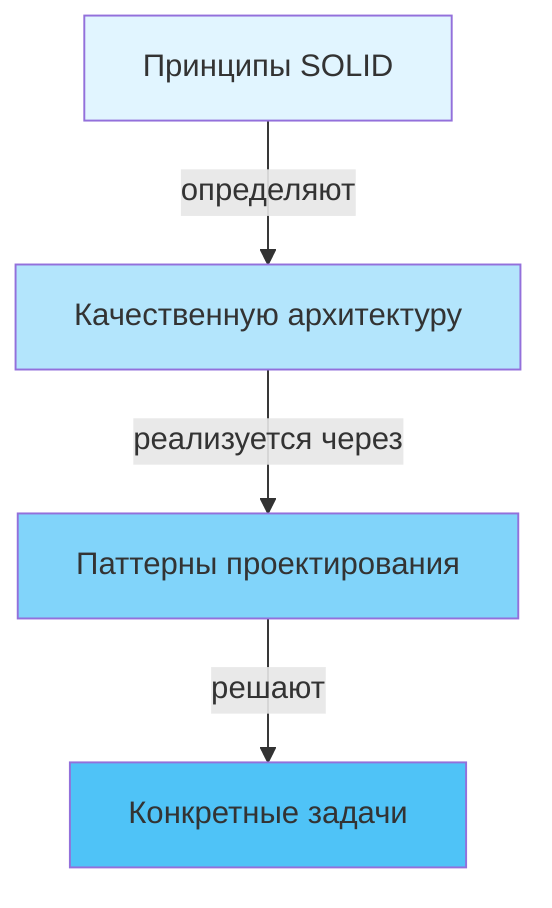

### Контекст применения

Принципы SOLID становятся особенно важными по мере роста системы. В маленьких программах на 100-200 строк кода можно обойтись без сложной архитектуры. Однако когда система начинает расти и превращается в приложение с десятками тысяч строк кода, без правильной архитектуры код становится неуправляемым:

- Классы разрастаются и перестают помещаться в голове
- Изменение одной части системы ломает другие части
- Добавление нового функционала требует изменений во множестве мест
- Тестирование становится затруднительным из-за тесной связанности компонентов

Принципы SOLID помогают избежать этих проблем, устанавливая правила для создания чистой, понятной и гибкой архитектуры.

> **Важно:** Не стоит слепо следовать принципам везде и всегда. Иногда их соблюдение приводит к излишнему усложнению кода. Применяйте принципы осознанно, соизмеряя преимущества гибкости с увеличением сложности системы.


---

## S — Single Responsibility Principle (Принцип единственной ответственности)

### Определение

**Single Responsibility Principle (SRP)** — принцип единственной ответственности — гласит, что ***каждый класс, модуль или функция должны иметь только одну причину для изменения***.

Другими словами: **одна единица кода — одна ответственность — одна причина для изменения**.

### Суть принципа

Принцип единственной ответственности предназначен для борьбы со сложностью. Когда класс выполняет слишком много различных задач одновременно, возникают следующие проблемы:

1. **Когнитивная перегрузка (Cognitive Overload)** — класс перестаёт помещаться в голове разработчика
2. **Затруднённая навигация** — в коде класса сложно найти нужную функциональность
3. **Высокий риск ошибок** — изменяя одну функциональность, легко сломать другую
4. **Сложность тестирования (Testing Complexity)** — невозможно протестировать части класса независимо

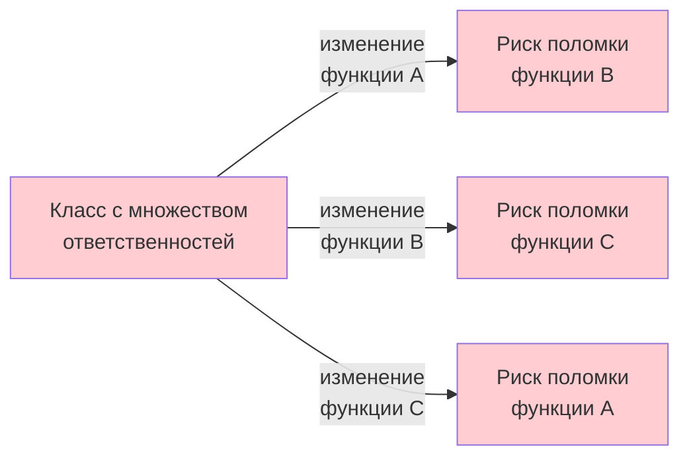

### Два взгляда на принцип

На принцип SRP можно смотреть с двух точек зрения:

#### 1. Функциональный подход: «Одна задача»

Каждый метод, класс или модуль должен выполнять только одну конкретную задачу. Если компонент отвечает за несколько операций сразу, их следует разделить на отдельные компоненты.

**Визуализация проблемы:**

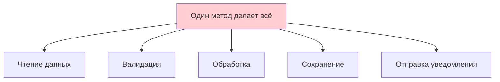

**Визуализация решения:**

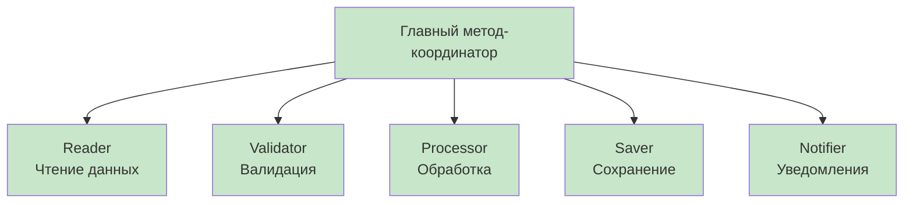

#### 2. Архитектурный подход: «Одна причина для изменения»

Более глубокое понимание SRP: компонент должен изменяться только по одной причине. Если есть несколько потенциальных причин изменить код компонента, значит, он нарушает SRP.

### Пример 1: Отчёты с навигацией и печатью

Рассмотрим класс отчёта, который объединяет навигацию по страницам и печать.

**❌ Неправильно: Нарушение SRP**

```csharp
// АНТИПАТТЕРН: Класс отвечает и за навигацию, и за печать
// Проблема: две разные ответственности в одном классе
public class Report
{
    public string Text { get; set; } = "";
    
    // Группа методов навигации по отчёту
    public void GoToFirstPage()
    {
        Console.WriteLine("Переход к первой странице");
    }
    
    public void GoToLastPage()
    {
        Console.WriteLine("Переход к последней странице");
    }
    
    public void GoToPage(int pageNumber)
    {
        Console.WriteLine($"Переход к странице {pageNumber}");
    }
    
    // Метод печати — это ОТДЕЛЬНАЯ ответственность!
    // Если изменится способ печати, придётся менять этот класс
    public void Print()
    {
        Console.WriteLine("Печать отчёта");
        Console.WriteLine(Text);
    }
}
```

**Проблемы этого кода:**

1. Класс имеет **две причины для изменения**:
   - Изменение логики навигации (добавление закладок, истории переходов)
   - Изменение логики печати (печать в PDF, на принтер, в HTML)

2. Методы навигации и печати **не связаны** между собой логически
3. Невозможно **переиспользовать** логику печати для других типов документов
4. **Тестирование усложнено** — приходится тестировать навигацию вместе с печатью


**✅ Правильно: Разделение ответственностей**

```csharp
// Класс отвечает ТОЛЬКО за навигацию по отчёту
// Одна ответственность — управление позицией в документе
public class Report
{
    public string Text { get; set; } = "";
    
    // Все методы относятся к одной ответственности — навигации
    public void GoToFirstPage()
    {
        Console.WriteLine("Переход к первой странице");
    }
    
    public void GoToLastPage()
    {
        Console.WriteLine("Переход к последней странице");
    }
    
    public void GoToPage(int pageNumber)
    {
        Console.WriteLine($"Переход к странице {pageNumber}");
    }
}

// Отдельный класс для печати — ОДНА ответственность: вывод отчёта
public class ReportPrinter
{
    // Принимает отчёт и печатает его содержимое
    // Если изменится способ печати — меняем только этот класс
    public void Print(Report report)
    {
        Console.WriteLine("Печать отчёта");
        Console.WriteLine(report.Text);
    }
}

// Теперь легко добавить другие способы печати без изменения существующего кода
public class PdfReportPrinter
{
    public void Print(Report report)
    {
        Console.WriteLine("Печать отчёта в PDF");
        // Логика создания PDF-файла
        // Генерация PDF-структуры
        // Сохранение в файл
    }
}

public class HtmlReportPrinter
{
    public void Print(Report report)
    {
        Console.WriteLine("Экспорт отчёта в HTML");
        // Генерация HTML-разметки
        // Применение CSS-стилей
        // Сохранение HTML-файла
    }
}
```

**Применение:**

```csharp
// Создаём отчёт
Report report = new Report { Text = "Содержимое отчёта за 2025 год" };

// Навигация — используем методы самого Report
report.GoToFirstPage();
report.GoToPage(5);

// Печать — используем ОТДЕЛЬНЫЙ класс
ReportPrinter consolePrinter = new ReportPrinter();
consolePrinter.Print(report);

// Легко меняем способ печати без изменения кода Report
PdfReportPrinter pdfPrinter = new PdfReportPrinter();
pdfPrinter.Print(report);

// Можем добавить новый способ печати, не трогая существующий код
HtmlReportPrinter htmlPrinter = new HtmlReportPrinter();
htmlPrinter.Print(report);
```

**Преимущества разделения:**

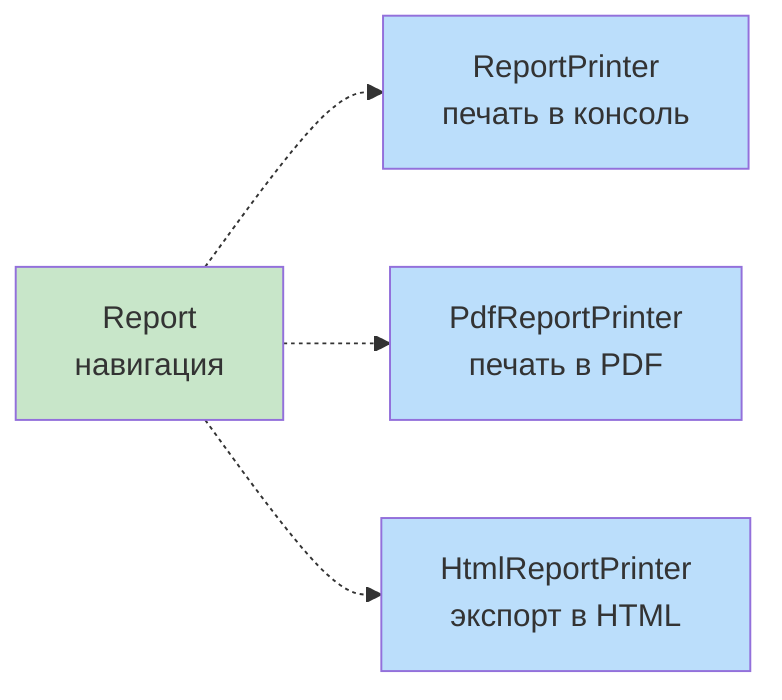

- ✅ Изменение логики печати не затронет класс `Report`
- ✅ Изменение логики навигации не затронет принтеры
- ✅ Можно легко добавлять новые способы печати
- ✅ Каждый класс проще тестировать изолированно
- ✅ Код более понятен — каждый класс делает что-то одно

### Пример 2: Обработка данных телефона

Рассмотрим более сложный пример, где один метод выполняет множество разных задач.

**❌ Неправильно: Множество ответственностей в одном методе**

```csharp
// Простая модель телефона
public class Phone
{
    public string Model { get; }
    public int Price { get; }
    
    public Phone(string model, int price)
    {
        Model = model;
        Price = price;
    }
}

// АНТИПАТТЕРН: Этот класс знает СЛИШКОМ МНОГО
// Он отвечает за ввод, валидацию, создание объектов И сохранение
public class MobileStore
{
    private List<Phone> phones = new();
    
    // Этот метод делает ВСЁ сразу — нарушение SRP!
    public void Process()
    {
        // Ответственность 1: Ввод данных
        Console.WriteLine("Введите модель:");
        string? model = Console.ReadLine();
        Console.WriteLine("Введите цену:");
        
        // Ответственность 2: Валидация данных
        bool result = int.TryParse(Console.ReadLine(), out var price);
        
        if (result == false || price <= 0 || string.IsNullOrEmpty(model))
        {
            throw new Exception("Некорректно введены данные");
        }
        else
        {
            // Ответственность 3: Создание объекта
            phones.Add(new Phone(model, price));
            
            // Ответственность 4: Сохранение в файл
            using (StreamWriter writer = new StreamWriter("store.txt", true))
            {
                writer.WriteLine(model);
                writer.WriteLine(price);
            }
            
            Console.WriteLine("Данные успешно обработаны");
        }
    }
}
```

**Проблемы этого кода:**

1. **Четыре причины для изменения:**
   - Изменение способа ввода (консоль → GUI → веб-форма)
   - Изменение правил валидации (новые ограничения)
   - Изменение структуры `Phone` (добавление полей)
   - Изменение способа сохранения (файл → база данных → API)

2. **Невозможность переиспользования:** Нельзя использовать логику валидации или сохранения отдельно

3. **Сложность тестирования:** Приходится мокировать консольный ввод и файловую систему одновременно

4. **Нарушение принципа единственной ответственности на уровне метода**


**✅ Правильно: Разделение всех ответственностей**

```csharp
// Модель остаётся простой
public class Phone
{
    public string Model { get; }
    public int Price { get; }
    
    public Phone(string model, int price)
    {
        Model = model;
        Price = price;
    }
}

// Интерфейс для чтения данных — абстрагируем источник ввода
public interface IPhoneReader
{
    string?[] GetInputData();
}

// Конкретная реализация — чтение из консоли
// Ответственность: ТОЛЬКО ввод данных
public class ConsolePhoneReader : IPhoneReader
{
    public string?[] GetInputData()
    {
        Console.WriteLine("Введите модель:");
        string? model = Console.ReadLine();
        Console.WriteLine("Введите цену:");
        string? price = Console.ReadLine();
        return new string?[] { model, price };
    }
}

// Интерфейс для создания объекта Phone из сырых данных
public interface IPhoneBinder
{
    Phone CreatePhone(string?[] data);
}

// Конкретная реализация привязки данных
// Ответственность: ТОЛЬКО преобразование строк в объект Phone
public class GeneralPhoneBinder : IPhoneBinder
{
    public Phone CreatePhone(string?[] data)
    {
        // Проверяем корректность входных данных
        if (data is { Length: 2 } && 
            data[0] is string model && model.Length > 0 &&
            int.TryParse(data[1], out var price))
        {
            return new Phone(model, price);
        }
        
        throw new Exception("Ошибка привязки модели Phone. Некорректные данные");
    }
}

// Интерфейс для валидации Phone
public interface IPhoneValidator
{
    bool IsValid(Phone phone);
}

// Конкретная реализация валидации
// Ответственность: ТОЛЬКО проверка бизнес-правил
public class GeneralPhoneValidator : IPhoneValidator
{
    public bool IsValid(Phone phone)
    {
        // Проверяем бизнес-правила
        return !string.IsNullOrEmpty(phone.Model) && phone.Price > 0;
    }
}

// Интерфейс для сохранения Phone
public interface IPhoneSaver
{
    void Save(Phone phone, string fileName);
}

// Конкретная реализация — сохранение в текстовый файл
// Ответственность: ТОЛЬКО запись данных в файл
public class TextPhoneSaver : IPhoneSaver
{
    public void Save(Phone phone, string fileName)
    {
        using StreamWriter writer = new StreamWriter(fileName, true);
        writer.WriteLine(phone.Model);
        writer.WriteLine(phone.Price);
    }
}

// Теперь MobileStore — это координатор, который ДЕЛЕГИРУЕТ работу
// Он не знает КАК читать, валидировать, создавать или сохранять
// Он знает только КОГДА это делать
public class MobileStore
{
    private List<Phone> phones = new();
    
    // Зависимости внедряются через конструктор (Dependency Injection)
    public IPhoneReader Reader { get; set; }
    public IPhoneBinder Binder { get; set; }
    public IPhoneValidator Validator { get; set; }
    public IPhoneSaver Saver { get; set; }
    
    public MobileStore(
        IPhoneReader reader,
        IPhoneBinder binder,
        IPhoneValidator validator,
        IPhoneSaver saver)
    {
        Reader = reader;
        Binder = binder;
        Validator = validator;
        Saver = saver;
    }
    
    // Метод Process теперь просто КООРДИНИРУЕТ работу
    // Он не содержит деталей реализации каждого шага
    public void Process()
    {
        // Делегируем чтение
        string?[] data = Reader.GetInputData();
        
        // Делегируем создание объекта
        Phone phone = Binder.CreatePhone(data);
        
        // Делегируем валидацию
        if (Validator.IsValid(phone))
        {
            phones.Add(phone);
            
            // Делегируем сохранение
            Saver.Save(phone, "store.txt");
            
            Console.WriteLine("Данные успешно обработаны");
        }
        else
        {
            Console.WriteLine("Некорректные данные");
        }
    }
}
```

**Применение:**

```csharp
// Создаём магазин, внедряя все зависимости
MobileStore store = new MobileStore(
    new ConsolePhoneReader(),      // Как читать данные
    new GeneralPhoneBinder(),      // Как создавать Phone
    new GeneralPhoneValidator(),   // Как валидировать
    new TextPhoneSaver()           // Как сохранять
);

// Обрабатываем телефон
store.Process();
```

**Визуализация архитектуры:**

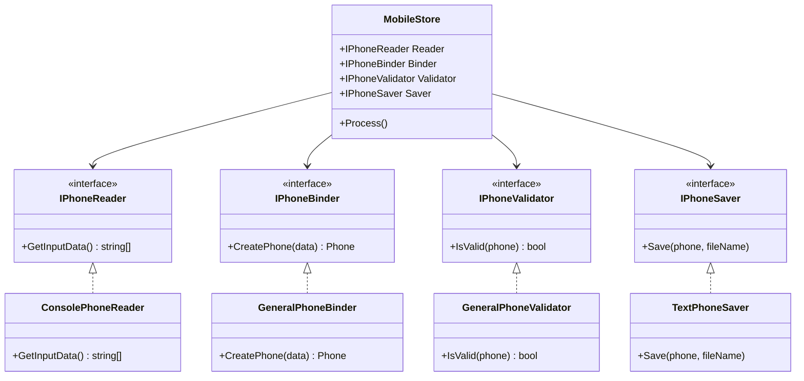

**Преимущества решения:**

1. **Гибкость замены реализаций:**
   ```csharp
   // Легко заменить консольный ввод на GUI
   MobileStore guiStore = new MobileStore(
       new GuiPhoneReader(),          // Читаем из формы
       new GeneralPhoneBinder(),      // Та же логика создания
       new StrictPhoneValidator(),    // Более строгая валидация
       new DatabasePhoneSaver()       // Сохраняем в БД
   );
   ```

2. **Простота тестирования:**
   ```csharp
   // Можем протестировать валидацию изолированно
   var validator = new GeneralPhoneValidator();
   var validPhone = new Phone("iPhone", 1000);
   Assert.True(validator.IsValid(validPhone));
   
   var invalidPhone = new Phone("", -100);
   Assert.False(validator.IsValid(invalidPhone));
   ```

3. **Переиспользование компонентов:**
   ```csharp
   // Можем использовать TextPhoneSaver для других целей
   var saver = new TextPhoneSaver();
   saver.Save(somePhone, "backup.txt");
   saver.Save(anotherPhone, "archive.txt");
   ```

4. **Каждый класс имеет одну причину для изменения:**
   - `ConsolePhoneReader` меняется только если меняется способ консольного ввода
   - `GeneralPhoneBinder` меняется только если меняется логика создания `Phone`
   - `GeneralPhoneValidator` меняется только если меняются правила валидации
   - `TextPhoneSaver` меняется только если меняется формат файла


### Пример 3: Генератор отчётов — «Одна причина для изменения»

Теперь рассмотрим SRP с точки зрения "одной причины для изменения".

**❌ Неправильно: Две причины для изменения**

```csharp
// Простая модель результата операции
public record OperationResult(string Data, DateTime Timestamp);

// АНТИПАТТЕРН: Этот класс имеет ДВЕ причины для изменения
public class ReportGenerator
{
    // Причина изменения 1: Добавление нового типа отчёта
    // (например, GenerateEpubReport, GenerateFb2Report)
    
    // Причина изменения 2: Изменение логики существующего типа отчёта
    // (например, изменить формат Excel или PDF)
    
    public void GenerateExcelReport(OperationResult result)
    {
        Console.WriteLine("Генерация Excel отчёта...");
        // Логика генерации Excel
    }
    
    public void GeneratePdfReport(OperationResult result)
    {
        Console.WriteLine("Генерация PDF отчёта...");
        // Логика генерации PDF
    }
}
```

**Проблема:** Если мы захотим добавить новый тип отчёта (например, HTML), нам придётся изменять класс `ReportGenerator`. Если мы захотим изменить логику генерации Excel, нам опять придётся изменять этот же класс. **Две разные причины для изменения одного класса.**

**✅ Правильно: Одна причина для изменения у каждого класса**

```csharp
// Модель результата операции
public record OperationResult(string Data, DateTime Timestamp);

// Абстракция для всех генераторов отчётов
public interface IReportGenerator
{
    void GenerateReport(OperationResult result);
}

// Генератор Excel отчётов
// Причина изменения: ТОЛЬКО изменение логики Excel-генерации
public class ExcelReportGenerator : IReportGenerator
{
    public void GenerateReport(OperationResult result)
    {
        Console.WriteLine($"[Excel] Генерация отчёта за {result.Timestamp}");
        // Создание Excel workbook
        // Заполнение ячеек данными
        // Применение форматирования
        // Сохранение файла .xlsx
    }
}

// Генератор PDF отчётов
// Причина изменения: ТОЛЬКО изменение логики PDF-генерации
public class PdfReportGenerator : IReportGenerator
{
    public void GenerateReport(OperationResult result)
    {
        Console.WriteLine($"[PDF] Генерация отчёта за {result.Timestamp}");
        // Создание PDF документа
        // Добавление текста и изображений
        // Применение стилей
        // Сохранение файла .pdf
    }
}

// Генератор HTML отчётов
// Причина изменения: ТОЛЬКО изменение логики HTML-генерации
public class HtmlReportGenerator : IReportGenerator
{
    public void GenerateReport(OperationResult result)
    {
        Console.WriteLine($"[HTML] Генерация отчёта за {result.Timestamp}");
        // Создание HTML-структуры
        // Применение CSS-стилей
        // Сохранение файла .html
    }
}
```

**Применение:**

```csharp
// Создаём результат
var result = new OperationResult("Данные отчёта", DateTime.Now);

// Используем разные генераторы
IReportGenerator excelGen = new ExcelReportGenerator();
excelGen.GenerateReport(result);

IReportGenerator pdfGen = new PdfReportGenerator();
pdfGen.GenerateReport(result);

// Добавили новый тип — не изменяли существующие классы
IReportGenerator htmlGen = new HtmlReportGenerator();
htmlGen.GenerateReport(result);
```

**Визуализация:**

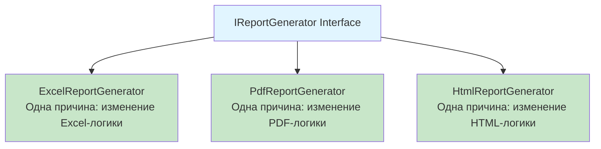

**Преимущества:**

- Каждый класс `XxxReportGenerator` имеет **одну причину для изменения**
- Добавление нового типа отчёта = создание нового класса (не изменение существующих)
- Изменение логики Excel не влияет на PDF или HTML
- Легко тестировать каждый генератор независимо

### Когда НЕ стоит следовать SRP

Важно понимать, что SRP — это не абсолютное правило. Иногда излишнее следование принципу приводит к избыточной сложности:

**Когда можно НЕ применять SRP:**

1. **Очень маленькие приложения** (< 500 строк кода) — избыточная абстракция усложнит понимание
2. **Прототипы и MVP** — важнее скорость разработки, рефакторинг можно сделать позже
3. **Тесно связанная логика** — если две операции всегда изменяются вместе, их можно держать вместе
4. **Простые CRUD операции** — иногда простой контроллер с 3-4 операциями проще, чем 4 отдельных класса

**Пример разумного компромисса:**

```csharp
// Для простого CRUD можно объединить связанные операции
public class UserService
{
    // Эти операции логически связаны и часто меняются вместе
    public User GetUser(int id) { /* ... */ }
    public void UpdateUser(User user) { /* ... */ }
    public void DeleteUser(int id) { /* ... */ }
}
```

Это не строгое следование SRP, но для простых случаев — приемлемый компромисс между чистотой архитектуры и простотой кода.

### Типичные нарушения SRP

**1. Смешивание уровней абстракции**

```csharp
// АНТИПАТТЕРН: Бизнес-логика + UI в одном классе
public class OrderProcessor
{
    public void ProcessOrder(Order order)
    {
        // Бизнес-логика
        var total = CalculateTotal(order);
        
        // UI-логика — не должно быть здесь!
        Console.WriteLine($"Итого: {total}");
        MessageBox.Show("Заказ обработан!");
    }
}
```

**2. Несвязанная функциональность**

```csharp
// АНТИПАТТЕРН: Класс делает совершенно разные вещи
public class UtilityClass
{
    public void SendEmail(string to, string message) { /* ... */ }
    public double CalculateTax(double amount) { /* ... */ }
    public string FormatDate(DateTime date) { /* ... */ }
    public void WriteToLog(string message) { /* ... */ }
}
```

### Резюме: Single Responsibility Principle

**Ключевая идея:** Один класс — одна ответственность — одна причина для изменения.

**Преимущества соблюдения:**
- ✅ Проще понимать код — каждый класс делает что-то одно
- ✅ Проще тестировать — можно тестировать каждую ответственность отдельно
- ✅ Проще изменять — изменение одной функциональности не затрагивает другие
- ✅ Легче переиспользовать — компоненты с одной ответственностью проще применять в других контекстах

**Недостатки чрезмерного применения:**
- ❌ Увеличение количества классов и файлов
- ❌ Усложнение навигации в проекте
- ❌ Избыточные абстракции для простых задач

**Правило применения:** Применяйте SRP осознанно, когда видите, что класс имеет несколько причин для изменения или делает несколько несвязанных вещей. Не стремитесь к абсолютной декомпозиции в ущерб простоте.


---

## O — Open/Closed Principle (Принцип открытости/закрытости)

### Определение

**Open/Closed Principle (OCP)** — принцип открытости/закрытости — гласит, что ***программные сущности (классы, модули, функции) должны быть открыты для расширения, но закрыты для изменения***.

Другими словами: **расширяйте поведение системы, не изменяя существующий код**.

### Суть принципа

Принцип открытости/закрытости направлен на создание системы, которая может эволюционировать без изменения уже работающего кода. Когда вы изменяете существующий код:

- Появляется риск внесения ошибок в работающую функциональность
- Требуется повторное тестирование изменённых частей
- Изменения могут затронуть код, который зависит от изменяемого класса


**Ключевая идея OCP:** Класс должен быть спроектирован так, чтобы новую функциональность можно было добавить через наследование или композицию, не редактируя исходный код класса.

### Когда применять OCP

OCP не означает, что нужно предусматривать все возможные расширения заранее. Применяйте принцип, когда:

1. Класс стабилен и протестирован
2. Класс используется во многих местах
3. Класс является частью публичного API или библиотеки
4. Предвидится необходимость расширения функциональности

> **Важно:** Если нужно исправить ошибку в существующем классе — просто исправьте её. OCP не означает, что нельзя трогать код вообще. Принцип касается добавления НОВОЙ функциональности, а не исправления багов.

### Пример 1: Повар и приготовление блюд

Классический пример, демонстрирующий суть OCP.

**❌ Неправильно: Класс закрыт для расширения**

```csharp
// Простой класс повара
// Проблема: чтобы добавить новое блюдо, нужно ИЗМЕНЯТЬ этот класс
public class Cook
{
    public string Name { get; set; }
    
    public Cook(string name)
    {
        Name = name;
    }
    
    // Повар умеет готовить только картофельное пюре
    // Чтобы добавить новое блюдо, придётся ИЗМЕНЯТЬ этот метод
    public void MakeDinner()
    {
        Console.WriteLine("Чистим картошку");
        Console.WriteLine("Ставим почищенную картошку на огонь");
        Console.WriteLine("Сливаем остатки воды, разминаем варёный картофель в пюре");
        Console.WriteLine("Посыпаем пюре специями и зеленью");
        Console.WriteLine("Картофельное пюре готово");
    }
}
```

**Применение:**

```csharp
Cook bob = new Cook("Bob");
bob.MakeDinner(); // Готовит только пюре

// Проблема: как научить Bob готовить салат?
// Придётся изменять класс Cook или метод MakeDinner
```

**Проблемы:**
- Класс `Cook` закрыт для расширения
- Невозможно добавить новые блюда без изменения исходного кода
- Нарушается принцип закрытости для изменений


**✅ Правильно: Класс открыт для расширения (через интерфейсы)**

```csharp
// Класс повара теперь ОТКРЫТ для расширения
// Можем добавлять новые блюда без изменения класса Cook
public class Cook
{
    public string Name { get; set; }
    
    public Cook(string name)
    {
        Name = name;
    }
    
    // Повар принимает ЛЮБОЕ блюдо, реализующее IMeal
    // Добавление нового блюда не требует изменения этого метода
    public void MakeDinner(IMeal meal)
    {
        Console.WriteLine($"{Name} готовит блюдо:");
        meal.Make();
    }
}

// Интерфейс блюда — абстракция для всех блюд
public interface IMeal
{
    void Make();
}

// Картофельное пюре — одна реализация
public class PotatoMeal : IMeal
{
    public void Make()
    {
        Console.WriteLine("→ Чистим и моем картошку");
        Console.WriteLine("→ Ставим почищенную картошку на огонь");
        Console.WriteLine("→ Варим 25-30 минут");
        Console.WriteLine("→ Сливаем воду, разминаем картофель в пюре");
        Console.WriteLine("→ Добавляем масло, молоко");
        Console.WriteLine("→ Посыпаем специями и зеленью");
        Console.WriteLine("✓ Картофельное пюре готово!");
    }
}

// Салат — ещё одна реализация
// Добавили НОВОЕ блюдо без изменения Cook или IMeal
public class SaladMeal : IMeal
{
    public void Make()
    {
        Console.WriteLine("→ Моем помидоры и огурцы");
        Console.WriteLine("→ Нарезаем овощи кубиками");
        Console.WriteLine("→ Добавляем зелень");
        Console.WriteLine("→ Посыпаем солью и специями");
        Console.WriteLine("→ Поливаем подсолнечным маслом");
        Console.WriteLine("→ Перемешиваем");
        Console.WriteLine("✓ Салат готов!");
    }
}

// Паста — ещё одна реализация
// Опять добавили без изменения существующего кода
public class PastaMeal : IMeal
{
    public void Make()
    {
        Console.WriteLine("→ Кипятим воду с солью");
        Console.WriteLine("→ Добавляем пасту");
        Console.WriteLine("→ Варим 8-10 минут");
        Console.WriteLine("→ Сливаем воду");
        Console.WriteLine("→ Добавляем соус");
        Console.WriteLine("✓ Паста готова!");
    }
}
```

**Применение:**

```csharp
// Создаём повара
Cook bob = new Cook("Bob");

// Bob может готовить любое блюдо
bob.MakeDinner(new PotatoMeal());
Console.WriteLine();

bob.MakeDinner(new SaladMeal());
Console.WriteLine();

bob.MakeDinner(new PastaMeal());
Console.WriteLine();

// Добавляем новое блюдо — код Cook не меняется!
bob.MakeDinner(new SoupMeal()); // Просто создаём новый класс
```

**Визуализация:**

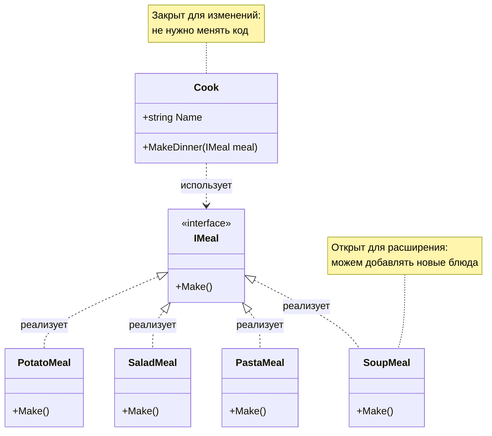

**Преимущества:**
- ✅ Класс `Cook` **закрыт для изменений** — не нужно его менять
- ✅ Система **открыта для расширений** — легко добавить новое блюдо
- ✅ Новый функционал добавляется безопасно — без риска сломать существующий код

### Пример 2: Бинарные операции

Ещё один пример, показывающий нарушение OCP и его исправление.

**❌ Неправильно: Switch-case требует изменений**

```csharp
// Перечисление возможных операций
public enum BinaryOperation
{
    Summation,
    Subtraction
    // Чтобы добавить умножение, нужно изменить enum
    // А это потребует изменений во всех switch по этому enum
}

// АНТИПАТТЕРН: Каждая новая операция требует изменения класса
public class BinaryOperand
{
    private readonly int _left;
    private readonly int _right;
    
    public BinaryOperand(int left, int right)
    {
        _left = left;
        _right = right;
    }
    
    // Проблема: чтобы добавить новую операцию (например, умножение),
    // нужно изменять этот метод — добавлять новый case
    public int Evaluate(BinaryOperation operation)
    {
        return operation switch
        {
            BinaryOperation.Summation => _left + _right,
            BinaryOperation.Subtraction => _left - _right,
            // Multiplication => _left * _right,  // Нужно изменять код!
            _ => throw new ArgumentException("Неизвестная операция")
        };
    }
}
```

**Применение:**

```csharp
var operand = new BinaryOperand(10, 5);

int sum = operand.Evaluate(BinaryOperation.Summation);        // 15
int diff = operand.Evaluate(BinaryOperation.Subtraction);     // 5

// Чтобы добавить умножение, нужно:
// 1. Изменить enum BinaryOperation
// 2. Изменить switch в Evaluate
// 3. Возможно, изменить другие switch-и в коде
// Класс ЗАКРЫТ для расширения!
```

**✅ Правильно: Полиморфизм вместо switch**

```csharp
// Интерфейс бинарной операции
public interface IBinaryOperation
{
    int Evaluate(int left, int right);
}

// Операция сложения
public class Summation : IBinaryOperation
{
    public int Evaluate(int left, int right)
    {
        return left + right;
    }
}

// Операция вычитания
public class Subtraction : IBinaryOperation
{
    public int Evaluate(int left, int right)
    {
        return left - right;
    }
}

// Операция умножения — НОВАЯ, без изменения существующего кода!
public class Multiplication : IBinaryOperation
{
    public int Evaluate(int left, int right)
    {
        return left * right;
    }
}

// Операция деления — ещё одна НОВАЯ
public class Division : IBinaryOperation
{
    public int Evaluate(int left, int right)
    {
        if (right == 0)
            throw new DivideByZeroException("Деление на ноль");
            
        return left / right;
    }
}

// Класс операнда теперь ЗАКРЫТ для изменений
// и ОТКРЫТ для расширений
public sealed class BinaryOperand
{
    private readonly int _left;
    private readonly int _right;
    
    public BinaryOperand(int left, int right)
    {
        _left = left;
        _right = right;
    }
    
    // Этот метод не нужно менять при добавлении новых операций!
    public int Evaluate(IBinaryOperation operation)
    {
        return operation.Evaluate(_left, _right);
    }
}
```

**Применение:**

```csharp
var operand = new BinaryOperand(10, 5);

// Используем разные операции
int sum = operand.Evaluate(new Summation());        // 15
int diff = operand.Evaluate(new Subtraction());     // 5
int product = operand.Evaluate(new Multiplication());  // 50
int quotient = operand.Evaluate(new Division());    // 2

// Добавляем новую операцию (например, возведение в степень)
// без изменения BinaryOperand!
int power = operand.Evaluate(new Power());  // Просто создаём новый класс Power
```

**Визуализация архитектуры:**

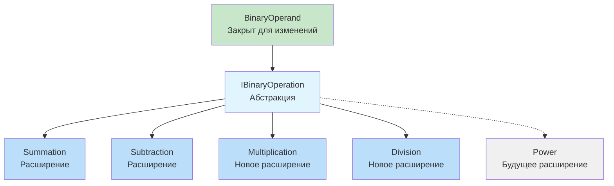


### Пример 3: Template Method для расширяемости

Другой способ применения OCP — использование Template Method Pattern (шаблонного метода).

**✅ Расширение через наследование с шаблонным методом**

```csharp
// Абстрактный базовый класс определяет ШАБЛОН приготовления
// Конкретные шаги реализуются в подклассах
public abstract class MealBase
{
    // Шаблонный метод — определяет последовательность действий
    // Этот метод ЗАКРЫТ для изменений
    public void Make()
    {
        Prepare();   // Шаг 1
        Cook();      // Шаг 2
        FinalSteps(); // Шаг 3
    }
    
    // Абстрактные методы — ОТКРЫТЫ для расширения в подклассах
    protected abstract void Prepare();
    protected abstract void Cook();
    protected abstract void FinalSteps();
}

// Картофельное пюре — конкретная реализация
public class PotatoMeal : MealBase
{
    protected override void Prepare()
    {
        Console.WriteLine("→ Чистим и моем картошку");
    }
    
    protected override void Cook()
    {
        Console.WriteLine("→ Ставим на огонь");
        Console.WriteLine("→ Варим 25-30 минут");
        Console.WriteLine("→ Сливаем воду, разминаем в пюре");
    }
    
    protected override void FinalSteps()
    {
        Console.WriteLine("→ Добавляем масло и молоко");
        Console.WriteLine("→ Посыпаем специями и зеленью");
        Console.WriteLine("✓ Картофельное пюре готово!");
    }
}

// Салат — другая реализация
public class SaladMeal : MealBase
{
    protected override void Prepare()
    {
        Console.WriteLine("→ Моем помидоры и огурцы");
    }
    
    protected override void Cook()
    {
        Console.WriteLine("→ Нарезаем овощи кубиками");
        Console.WriteLine("→ Посыпаем зеленью, солью и специями");
    }
    
    protected override void FinalSteps()
    {
        Console.WriteLine("→ Поливаем подсолнечным маслом");
        Console.WriteLine("→ Перемешиваем");
        Console.WriteLine("✓ Салат готов!");
    }
}

// Класс повара принимает меню
public class Cook
{
    public string Name { get; set; }
    
    public Cook(string name)
    {
        Name = name;
    }
    
    // Метод закрыт для изменений
    // Открыт для расширения через новые подклассы MealBase
    public void MakeDinner(MealBase[] menu)
    {
        Console.WriteLine($"{Name} начинает готовить...\n");
        
        foreach (MealBase meal in menu)
        {
            meal.Make();
            Console.WriteLine();
        }
        
        Console.WriteLine("Все блюда готовы!");
    }
}
```

**Применение:**

```csharp
// Составляем меню
MealBase[] menu = new MealBase[]
{
    new PotatoMeal(),
    new SaladMeal()
};

// Повар готовит всё меню
Cook bob = new Cook("Bob");
bob.MakeDinner(menu);

// Добавление нового блюда не требует изменений Cook или MealBase
```

### Проверка соблюдения OCP

**Простой тест:** Представьте, что ваш код — это библиотека, которую используют другие разработчики.

1. **Могут ли пользователи библиотеки расширить функциональность** без изменения исходного кода библиотеки?
   - **Да** → OCP соблюдается ✅
   - **Нет** → OCP нарушается ❌

2. **Требуется ли изменять существующий код** при добавлении новой функциональности?
   - **Нет** → OCP соблюдается ✅
   - **Да** → OCP нарушается ❌

### Когда НЕ стоит чрезмерно применять OCP

OCP может привести к избыточной абстракции. Не стоит применять принцип, если:

1. **Функциональность стабильна** и изменения маловероятны
2. **Код очень простой** — излишняя абстракция усложнит понимание
3. **Прототип/MVP** — сначала проверьте идею, рефакторинг сделаете потом
4. **Стоимость абстракции превышает выгоду** от гибкости

**Пример разумного компромисса:**

```csharp
// Для простого калькулятора с 4 операциями
// можно использовать switch — это проще и понятнее
public class SimpleCalculator
{
    public double Calculate(double a, double b, string operation)
    {
        return operation switch
        {
            "+" => a + b,
            "-" => a - b,
            "*" => a * b,
            "/" => a / b,
            _ => throw new ArgumentException("Неизвестная операция")
        };
    }
}

// Если операций будет 20+ или они часто меняются — тогда применяйте OCP
```

### Резюме: Open/Closed Principle

**Ключевая идея:** Расширяйте поведение через наследование или композицию, не изменяя существующий код.

**Способы реализации OCP:**
1. **Интерфейсы** — определяют контракт, реализации добавляются через новые классы
2. **Абстрактные классы** — определяют шаблон, детали в подклассах
3. **Композиция** — внедрение зависимостей через интерфейсы

**Преимущества:**
- ✅ Безопасное добавление функционала — нет риска сломать существующий код
- ✅ Код библиотеки не нужно менять при расширении
- ✅ Проще тестировать — новые расширения изолированы

**Недостатки чрезмерного применения:**
- ❌ Избыточная абстракция для простых случаев
- ❌ Сложность предсказания всех возможных расширений
- ❌ Увеличение количества классов и интерфейсов

**Правило применения:** Применяйте OCP для стабильного кода, который используется во многих местах и требует расширения. Не создавайте абстракции «на всякий случай» — делайте это когда появляется реальная необходимость.


---

## L — Liskov Substitution Principle (Принцип подстановки Барбары Лисков)

### Определение

**Liskov Substitution Principle (LSP)** — принцип подстановки Барбары Лисков — гласит, что ***объекты подклассов должны быть взаимозаменяемы с объектами базового класса без нарушения корректности программы***.

Другими словами: **подкласс должен дополнять, а не замещать поведение базового класса**.

Принцип сформулирован Барбарой Лисков (Barbara Liskov) в 1987 году:

> Если `S` является подтипом `T`, тогда объекты типа `T` в программе могут быть заменены объектами типа `S` без изменения каких-либо желаемых свойств этой программы (корректность, выполняемая задача и т.д.).

### Суть принципа

LSP обеспечивает **постоянство поведения**: класс-родитель и класс-потомок должны быть взаимозаменяемы. Если подкласс нарушает ожидания, установленные базовым классом, возникают ошибки.

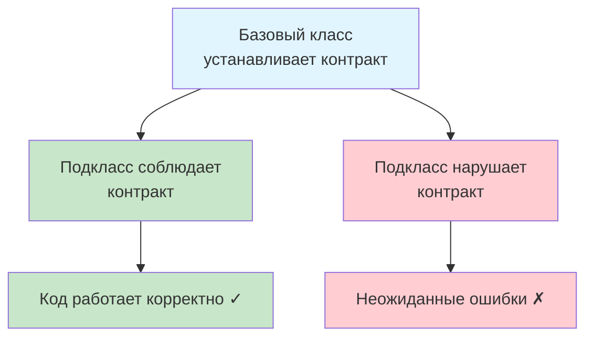

### Классический пример: Прямоугольник и Квадрат

Это каноническая демонстрация нарушения LSP.

**❌ Неправильно: Квадрат нарушает контракт Прямоугольника**

```csharp
// Базовый класс — Прямоугольник
public class Rectangle
{
    // У прямоугольника ширина и высота независимы
    public virtual int Width { get; set; }
    public virtual int Height { get; set; }
    
    // Площадь вычисляется просто
    public int GetArea()
    {
        return Width * Height;
    }
}

// АНТИПАТТЕРН: Квадрат изменяет поведение родителя
// Математически квадрат — это прямоугольник
// Но с точки зрения LSP — это неправильное наследование!
public class Square : Rectangle
{
    // Проблема: устанавливая ширину, меняем и высоту
    // Это нарушает ожидания от Rectangle
    public override int Width
    {
        get => base.Width;
        set
        {
            base.Width = value;
            base.Height = value;  // Побочный эффект!
        }
    }
    
    // То же самое с высотой
    public override int Height
    {
        get => base.Height;
        set
        {
            base.Height = value;
            base.Width = value;  // Побочный эффект!
        }
    }
}
```

**Применение — демонстрация проблемы:**

```csharp
// Функция, которая работает с прямоугольниками
public static void TestRectangleArea(Rectangle rect)
{
    // Логика для прямоугольника: устанавливаем разные стороны
    rect.Height = 5;
    rect.Width = 10;
    
    // Ожидаем площадь 50 (5 * 10)
    if (rect.GetArea() != 50)
    {
        throw new Exception($"Ошибка! Ожидали 50, получили {rect.GetArea()}");
    }
    
    Console.WriteLine($"Площадь: {rect.GetArea()} — корректно");
}

// Тестируем с обычным прямоугольником
Rectangle rectangle = new Rectangle();
TestRectangleArea(rectangle); // ✓ Работает: площадь = 50

// Тестируем с квадратом (подстановка LSP)
Rectangle square = new Square();
TestRectangleArea(square); // ✗ ОШИБКА! площадь = 100, а не 50

// Проблема: Square не может заменить Rectangle
// При установке Width = 10, высота тоже стала 10
// Площадь = 10 * 10 = 100, а не 5 * 10 = 50
```

**Почему это нарушение LSP:**

1. `Square` не может быть безопасно подставлен вместо `Rectangle`
2. Поведение `Square` нарушает ожидания кода, работающего с `Rectangle`
3. Приходится проверять конкретный тип (type checking) — признак нарушения LSP

**Типичный "хак" (антипаттерн):**

```csharp
// ПЛОХОЕ РЕШЕНИЕ: Проверка типа
public static void TestRectangleArea(Rectangle rect)
{
    // Антипаттерн: если нужны проверки типа — архитектура неверна
    if (rect is Square)
    {
        rect.Height = 5;
        if (rect.GetArea() != 25)  // Для квадрата другое ожидание
            throw new Exception("Ошибка площади квадрата!");
    }
    else if (rect is Rectangle)
    {
        rect.Height = 5;
        rect.Width = 10;
        if (rect.GetArea() != 50)  // Для прямоугольника
            throw new Exception("Ошибка площади прямоугольника!");
    }
}

// Такие проверки — признак нарушения LSP!
// Клиентский код не должен знать о конкретных типах
```


**✅ Правильно: Правильная иерархия без нарушения LSP**

```csharp
// Общий интерфейс для всех фигур
public interface IShape
{
    int GetArea();
}

// Прямоугольник с независимыми сторонами
public class Rectangle : IShape
{
    public int Width { get; set; }
    public int Height { get; set; }
    
    public int GetArea()
    {
        return Width * Height;
    }
}

// Квадрат — ОТДЕЛЬНЫЙ класс, не наследуется от Rectangle
// Это решает проблему — квадрат больше не подменяет прямоугольник
public class Square : IShape
{
    // У квадрата только одна сторона
    private int _side;
    
    public int Side
    {
        get => _side;
        set => _side = value;
    }
    
    public int GetArea()
    {
        return _side * _side;
    }
}
```

**Применение:**

```csharp
// Функция работает с абстракцией IShape
public static void PrintArea(IShape shape)
{
    Console.WriteLine($"Площадь фигуры: {shape.GetArea()}");
}

// Теперь нет проблемы подстановки
Rectangle rect = new Rectangle { Width = 10, Height = 5 };
PrintArea(rect); // Площадь: 50

Square square = new Square { Side = 10 };
PrintArea(square); // Площадь: 100

// Функции работают с IShape, не знают о конкретных типах
// Каждый тип соблюдает свой контракт
```

**Визуализация правильной иерархии:**

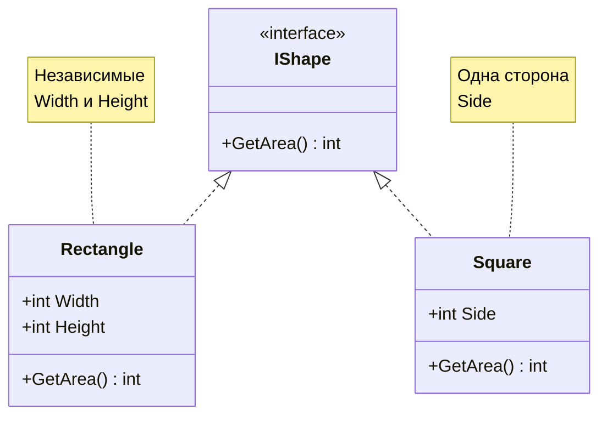

### Пример 2: Птицы и полёт

Ещё один классический пример нарушения LSP.

**❌ Неправильно: Пингвин нарушает контракт Птицы**

```csharp
// Координата для полёта
public record Coordinate(int X, int Y);

// Базовый класс существа
public class Creature
{
    public void Die()
    {
        Console.WriteLine("Я умер");
    }
}

// Класс птицы — предполагается, что все птицы летают
public class Bird : Creature
{
    // Все птицы должны уметь летать
    public virtual void FlyTo(Coordinate coordinate)
    {
        Console.WriteLine($"Лечу к точке ({coordinate.X}, {coordinate.Y})");
    }
}

// АНТИПАТТЕРН: Пингвин — птица, но не летает!
// Вместо полёта он "умирает" — это нарушает ожидания
public class Penguin : Bird
{
    // Нарушение контракта: вместо полёта — смерть
    public override void FlyTo(Coordinate coordinate)
    {
        // Пингвины не летают, но метод должен существовать
        // "Решение" — сделать вид, что пингвин умер
        Console.WriteLine("Я пингвин, я не могу лететь!");
        Die();  // Совершенно неожиданное поведение!
    }
}

// Другой способ (тоже антипаттерн)
public class Penguin2 : Bird
{
    public override void FlyTo(Coordinate coordinate)
    {
        // Просто выбрасываем исключение
        throw new NotImplementedException("Пингвины не летают!");
    }
}
```

**Демонстрация проблемы:**

```csharp
// Функция миграции птиц — ожидает, что все птицы летают
public static void StartMigration(IEnumerable<Bird> birds, Coordinate destination)
{
    foreach (var bird in birds)
    {
        // Ожидаем, что все птицы полетят
        bird.FlyTo(destination);
    }
}

// Создаём стаю
Bird[] flock = new Bird[]
{
    new Bird(),
    new Penguin(),  // Проблема! Пингвин не может летать
    new Bird()
};

// При вызове миграции пингвин сломает логику
StartMigration(flock, new Coordinate(100, 200));
// Bird: Лечу к точке (100, 200) ✓
// Penguin: Я пингвин, я не могу лететь! Я умер ✗
// Bird: Лечу к точке (100, 200) ✓
```

**Попытка обойти через проверку типов (антипаттерн):**

```csharp
// ПЛОХОЕ РЕШЕНИЕ: Проверка типа в коде
public static void StartMigration(IEnumerable<Creature> creatures, Coordinate destination)
{
    foreach (var creature in creatures)
    {
        // Антипаттерн: проверяем конкретные типы
        if (creature is Bird bird && creature is not Penguin)
        {
            bird.FlyTo(destination);
        }
        else if (creature is Penguin)
        {
            // Пингвины остаются на месте
            Console.WriteLine("Пингвин остался на земле");
        }
    }
}

// Это нарушает принцип открытости/закрытости (OCP)
// При добавлении страуса, курицы или киви придётся менять код
```


**✅ Правильно: Правильная иерархия с интерфейсами**

```csharp
// Координата
public record Coordinate(int X, int Y);

// Базовый интерфейс для всех существ
public interface ICreature
{
    void Die();
}

// Базовый класс существа
public class CreatureBase : ICreature
{
    public void Die()
    {
        Console.WriteLine("Я умер");
    }
}

// Интерфейс для ЛЕТАЮЩИХ существ
// Только те, кто реально умеет летать, реализуют этот интерфейс
public interface IFlyingCreature : ICreature
{
    void FlyTo(Coordinate coordinate);
}

// Обычная птица
public class Bird : CreatureBase { }

// Пингвин — птица, но НЕ реализует IFlyingCreature
// Теперь нет обмана — пингвин просто не может летать
public class Penguin : Bird { }

// Колибри — птица, которая МОЖЕТ летать
public class Colibri : Bird, IFlyingCreature
{
    public void FlyTo(Coordinate coordinate)
    {
        Console.WriteLine($"Колибри летит к ({coordinate.X}, {coordinate.Y})");
    }
}

// Летучая мышь — не птица, но может летать
public class Bat : CreatureBase, IFlyingCreature
{
    public void FlyTo(Coordinate coordinate)
    {
        Console.WriteLine($"Летучая мышь летит к ({coordinate.X}, {coordinate.Y})");
    }
}
```

**Применение:**

```csharp
// Функция миграции работает только с ЛЕТАЮЩИМИ существами
// Принцип подстановки соблюдается — все переданные объекты умеют летать
public static void StartMigration(IEnumerable<IFlyingCreature> creatures, Coordinate destination)
{
    foreach (var creature in creatures)
    {
        // Моделируем случайность: 80% летят, 20% умирают в пути
        if (Random.Shared.NextDouble() < 0.8)
        {
            creature.FlyTo(destination);
        }
        else
        {
            Console.WriteLine("Существо погибло в пути:");
            creature.Die();
        }
    }
}

// Создаём стаю летающих существ
IFlyingCreature[] migrants = new IFlyingCreature[]
{
    new Colibri(),
    new Bat(),
    new Colibri()
    // Пингвина сюда добавить НЕЛЬЗЯ — он не IFlyingCreature
    // Компилятор защищает от ошибки!
};

// Миграция работает корректно
StartMigration(migrants, new Coordinate(420, 69));

// Пингвины остаются дома
Penguin penguin = new Penguin();
// penguin.FlyTo(...) — метода нет, и это правильно!
```

**Визуализация правильной иерархии:**

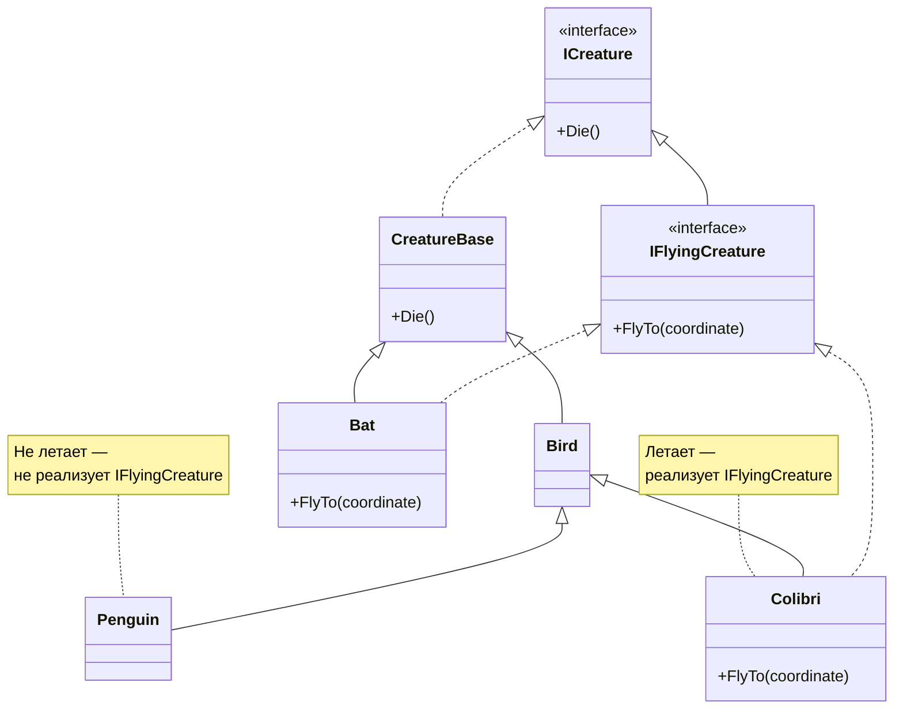

### Формальные правила LSP

Принцип подстановки Лисков имеет формальные требования к подклассам и переопределённым методам:

#### 1. Типы параметров метода не могут быть более конкретными

**Правило:** Типы параметров подкласса должны совпадать или быть более абстрактными, чем в базовом классе.

**❌ Неправильно:**

```csharp
class AnimalFeeder
{
    // Базовый метод кормит любое животное
    public virtual void Feed(Animal animal)
    {
        Console.WriteLine("Кормлю животное");
    }
}

class CatFeeder : AnimalFeeder
{
    // ОШИБКА: Более конкретный тип (Cat вместо Animal)
    // Клиентский код, передающий Dog, сломается
    public override void Feed(Cat cat)  // ✗ Не компилируется в C#
    {
        Console.WriteLine("Кормлю кота");
    }
}
```

**✅ Правильно:**

```csharp
class AnimalFeeder
{
    public virtual void Feed(Cat cat)
    {
        Console.WriteLine("Кормлю кота");
    }
}

class UniversalFeeder : AnimalFeeder
{
    // ✓ Более общий тип — можем принять любое животное
    public override void Feed(Animal animal)  // Расширяет возможности
    {
        Console.WriteLine($"Кормлю {animal.GetType().Name}");
    }
}
```

#### 2. Тип возвращаемого значения не может быть более абстрактным

**Правило:** Возвращаемый тип подкласса должен совпадать или быть более конкретным, чем в базовом методе.

**❌ Неправильно:**

```csharp
class PetShop
{
    // Возвращает домашнего кота
    public virtual Cat BuyCat()
    {
        return new Cat();
    }
}

class BadPetShop : PetShop
{
    // ОШИБКА: Возвращаем более общий тип
    // Клиент ожидает Cat, может получить Dog!
    public override Animal BuyCat()  // ✗ Нарушение LSP
    {
        return new Dog();  // Это не кот!
    }
}
```

**✅ Правильно:**

```csharp
class PetShop
{
    // Возвращает любого кота
    public virtual Cat BuyCat()
    {
        return new Cat();
    }
}

class BengalPetShop : PetShop
{
    // ✓ Более конкретный тип — бенгальский кот это тоже кот
    public override BengalCat BuyCat()  // Сужает тип (covariance)
    {
        return new BengalCat();
    }
}
```

#### 3. Метод не должен выбрасывать новые типы исключений

**Правило:** Подкласс может выбрасывать только те же исключения или их подтипы.

**❌ Неправильно:**

```csharp
class FileReader
{
    // Базовый метод выбрасывает FileNotFoundException
    public virtual string ReadFile(string path)
    {
        if (!File.Exists(path))
            throw new FileNotFoundException();
            
        return File.ReadAllText(path);
    }
}

class NetworkFileReader : FileReader
{
    // ОШИБКА: Выбрасывает новый тип исключения
    // Клиентский код не ожидает NetworkException
    public override string ReadFile(string path)
    {
        if (!IsNetworkAvailable())
            throw new NetworkException();  // ✗ Новое исключение!
            
        return DownloadFile(path);
    }
}
```

**✅ Правильно:**

```csharp
class FileReader
{
    public virtual string ReadFile(string path)
    {
        if (!File.Exists(path))
            throw new IOException("Файл не найден");
            
        return File.ReadAllText(path);
    }
}

class NetworkFileReader : FileReader
{
    // ✓ Выбрасываем тот же тип или подтип
    public override string ReadFile(string path)
    {
        if (!IsNetworkAvailable())
            throw new IOException("Сеть недоступна");  // ✓ Тот же базовый тип
            
        return DownloadFile(path);
    }
}
```

#### 4. Предусловия не могут быть усилены

**Правило:** Подкласс не должен требовать больше условий для выполнения метода, чем базовый класс.

**❌ Неправильно:**

```csharp
class Account
{
    public int Capital { get; protected set; }
    
    // Предусловие: money >= 0
    public virtual void SetCapital(int money)
    {
        if (money < 0)
            throw new ArgumentException("Сумма не может быть отрицательной");
            
        Capital = money;
    }
}

class MicroAccount : Account
{
    // ОШИБКА: Усиливаем предусловие (добавляем money <= 100)
    // Клиентский код, передающий 200, сломается
    public override void SetCapital(int money)
    {
        if (money < 0)
            throw new ArgumentException("Сумма не может быть отрицательной");
            
        if (money > 100)  // ✗ Новое предусловие!
            throw new ArgumentException("Сумма не может превышать 100");
            
        Capital = money;
    }
}

// Проблема в использовании:
void InitializeAccount(Account account)
{
    account.SetCapital(200);  // ✓ Работает с Account
                               // ✗ Сломается с MicroAccount
}
```

**✅ Правильно:**

```csharp
class Account
{
    public int Capital { get; protected set; }
    public int MaxCapital { get; protected set; } = int.MaxValue;
    
    public virtual void SetCapital(int money)
    {
        if (money < 0)
            throw new ArgumentException("Сумма не может быть отрицательной");
            
        if (money > MaxCapital)
            throw new ArgumentException($"Сумма не может превышать {MaxCapital}");
            
        Capital = money;
    }
}

class MicroAccount : Account
{
    // ✓ Устанавливаем ограничение через свойство родителя
    public MicroAccount()
    {
        MaxCapital = 100;
    }
    
    // Не переопределяем метод — используем логику родителя
}
```

#### 5. Постусловия не могут быть ослаблены

**Правило:** Подкласс должен гарантировать те же постусловия, что и базовый класс.

**❌ Неправильно:**

```csharp
class Account
{
    public virtual decimal GetInterest(decimal sum, int month, int rate)
    {
        if (sum < 0 || month > 12 || month < 1 || rate < 0)
            throw new ArgumentException("Некорректные данные");
            
        decimal result = sum;
        for (int i = 0; i < month; i++)
            result += result * rate / 100;
            
        // Постусловие: при sum >= 1000 добавляем бонус 100
        if (sum >= 1000)
            result += 100;
            
        return result;
    }
}

class MicroAccount : Account
{
    // ОШИБКА: Не выполняем постусловие (не добавляем бонус)
    public override decimal GetInterest(decimal sum, int month, int rate)
    {
        if (sum < 0 || month > 12 || month < 1 || rate < 0)
            throw new ArgumentException("Некорректные данные");
            
        decimal result = sum;
        for (int i = 0; i < month; i++)
            result += result * rate / 100;
            
        // ✗ Пропустили бонус — нарушили постусловие!
        return result;
    }
}

// Проблема:
void CalculateInterest(Account account)
{
    decimal sum = account.GetInterest(1000, 1, 10);
    // Ожидаем: 1000 + 100 (проценты) + 100 (бонус) = 1200
    // С MicroAccount получаем: 1100 (без бонуса) ✗
}
```

#### 6. Инварианты класса должны сохраняться

**Правило:** Инварианты (неизменные свойства) базового класса должны оставаться истинными в подклассе.

**❌ Неправильно:**

```csharp
class Account
{
    protected int capital;
    
    public Account(int sum)
    {
        // Инвариант: capital всегда >= 100
        if (sum < 100)
            throw new ArgumentException("Минимальная сумма — 100");
            
        capital = sum;
    }
    
    public virtual int Capital
    {
        get => capital;
        set
        {
            // Инвариант проверяется в сеттере
            if (value < 100)
                throw new ArgumentException("Минимальная сумма — 100");
                
            capital = value;
        }
    }
}

class MicroAccount : Account
{
    public MicroAccount(int sum) : base(sum) { }
    
    // ОШИБКА: Нарушаем инвариант родителя
    // Позволяем capital < 100
    public override int Capital
    {
        get => capital;
        set => capital = value;  // ✗ Пропустили проверку!
    }
}

// Проблема:
Account account = new MicroAccount(100);
account.Capital = 50;  // ✗ Нарушили инвариант: capital < 100
```

### Резюме: Liskov Substitution Principle

**Ключевая идея:** Подкласс должен быть полноценной заменой базового класса без нарушения корректности программы.

**Признаки нарушения LSP:**
- ❌ Проверки типа (`if (obj is SpecificType)`)
- ❌ Выброс `NotImplementedException` в переопределённых методах
- ❌ Пустые реализации обязательных методов
- ❌ Изменение ожидаемого поведения (пингвин "умирает" вместо полёта)

**Способы соблюдения LSP:**
- ✅ Правильное проектирование иерархий классов
- ✅ Использование интерфейсов для разделения способностей
- ✅ Соблюдение контрактов базового класса
- ✅ Избегание наследования там, где нет IS-A отношения

**Преимущества:**
- ✅ Безопасная подстановка типов
- ✅ Полиморфизм работает корректно
- ✅ Код не зависит от конкретных типов

**Правило применения:** Если подкласс не может полностью заменить базовый класс — это неправильное наследование. Используйте композицию или выделите общий интерфейс.


---

## I — Interface Segregation Principle (Принцип разделения интерфейсов)

### Определение

**Interface Segregation Principle (ISP)** — принцип разделения интерфейсов — гласит, что ***клиенты не должны зависеть от методов интерфейса, которые они не используют***.

Другими словами: **лучше много узких специализированных интерфейсов, чем один универсальный "бог-интерфейс"**.

### Суть принципа

ISP направлен на создание небольших, целенаправленных интерфейсов вместо больших, всеобъемлющих. Когда интерфейс слишком широкий:

- Классы вынуждены реализовывать методы, которые им не нужны
- Изменения в интерфейсе затрагивают классы, которым эти изменения не нужны
- Нарушается принцип единственной ответственности (SRP) для интерфейсов

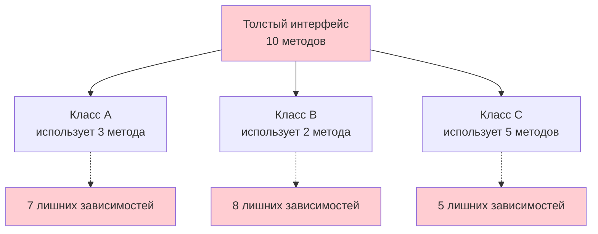

### Пример 1: Универсальное устройство

**❌ Неправильно: Один "бог-интерфейс"**

```csharp
// АНТИПАТТЕРН: Интерфейс для устройства "всё в одном"
// Объединяет несвязанные функции
public interface ICanAllDevice
{
    void Print();         // Печать документов
    void PlayMusic();     // Воспроизведение музыки
    void BakeBread();     // Выпечка хлеба (?)
}

// Принтеру не нужны музыка и хлеб
public class Printer : ICanAllDevice
{
    public void Print()
    {
        Console.WriteLine("Печатаю документ");
    }
    
    // Вынуждены реализовать ненужные методы
    public void PlayMusic()
    {
        // Принтер не умеет играть музыку!
        throw new NotImplementedException();
    }
    
    public void BakeBread()
    {
        // И печь хлеб тоже не умеет!
        throw new NotImplementedException();
    }
}

// Музыкальный плеер тоже страдает
public class MusicPlayer : ICanAllDevice
{
    public void PlayMusic()
    {
        Console.WriteLine("Играю музыку");
    }
    
    // Ненужные методы
    public void Print()
    {
        throw new NotImplementedException();
    }
    
    public void BakeBread()
    {
        throw new NotImplementedException();
    }
}
```

**Проблемы:**
- Классы зависят от методов, которые не используют
- `NotImplementedException` — признак нарушения ISP
- Изменение одного метода затрагивает все классы

**✅ Правильно: Разделённые интерфейсы**

```csharp
// Узкий интерфейс только для печати
public interface IPrinter
{
    void Print();
}

// Узкий интерфейс только для музыки
public interface IMusicPlayer
{
    void Play();
}

// Узкий интерфейс только для выпечки
public interface IBakery
{
    void BakeBread();
}

// Принтер реализует только то, что ему нужно
public class Printer : IPrinter
{
    public void Print()
    {
        Console.WriteLine("Печатаю документ");
    }
    // Никаких лишних методов!
}

// Музыкальный плеер тоже реализует только своё
public class MusicPlayer : IMusicPlayer
{
    public void Play()
    {
        Console.WriteLine("Играю музыку");
    }
}

// Хлебопечка — отдельное устройство
public class BreadMaker : IBakery
{
    public void BakeBread()
    {
        Console.WriteLine("Пеку хлеб");
    }
}

// Если нужно МФУ — комбинируем интерфейсы
public class MultiFunctionDevice : IPrinter, IMusicPlayer
{
    public void Print()
    {
        Console.WriteLine("МФУ: печатаю");
    }
    
    public void Play()
    {
        Console.WriteLine("МФУ: играю музыку");
    }
    // Реализуем только то, что нужно!
}
```

**Визуализация:**

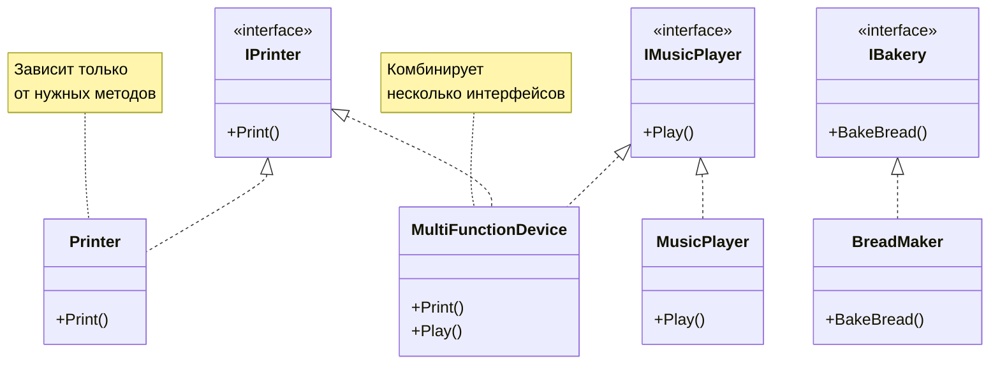

### Пример 2: Сообщения разных типов

**❌ Неправильно: Раздутый интерфейс сообщения**

```csharp
// АНТИПАТТЕРН: Один интерфейс для всех типов сообщений
public interface IMessage
{
    void Send();
    string Text { get; set; }
    string Subject { get; set; }      // Не нужно для SMS
    string ToAddress { get; set; }
    string FromAddress { get; set; }
    byte[] Voice { get; set; }        // Не нужно для Email и SMS
}

// Email использует почти всё
public class EmailMessage : IMessage
{
    public string Subject { get; set; } = "";
    public string Text { get; set; } = "";
    public string FromAddress { get; set; } = "";
    public string ToAddress { get; set; } = "";
    
    // Но голосовое сообщение не нужно
    public byte[] Voice
    {
        get => throw new NotImplementedException();
        set => throw new NotImplementedException();
    }
    
    public void Send()
    {
        Console.WriteLine($"Email: {Subject} - {Text}");
    }
}

// SMS страдает ещё больше
public class SmsMessage : IMessage
{
    public string Text { get; set; } = "";
    public string FromAddress { get; set; } = "";
    public string ToAddress { get; set; } = "";
    
    // У SMS нет темы
    public string Subject
    {
        get => throw new NotImplementedException();
        set => throw new NotImplementedException();
    }
    
    // И голосового сообщения тоже
    public byte[] Voice
    {
        get => throw new NotImplementedException();
        set => throw new NotImplementedException();
    }
    
    public void Send()
    {
        Console.WriteLine($"SMS: {Text}");
    }
}
```

**✅ Правильно: Иерархия узких интерфейсов**

```csharp
// Базовый интерфейс — только общие свойства
public interface IMessage
{
    void Send();
    string ToAddress { get; set; }
    string FromAddress { get; set; }
}

// Интерфейс для текстовых сообщений
public interface ITextMessage : IMessage
{
    string Text { get; set; }
}

// Интерфейс для сообщений с темой
public interface IEmailMessage : ITextMessage
{
    string Subject { get; set; }
}

// Интерфейс для голосовых сообщений
public interface IVoiceMessage : IMessage
{
    byte[] Voice { get; set; }
}

// Email реализует только нужные интерфейсы
public class EmailMessage : IEmailMessage
{
    public string Text { get; set; } = "";
    public string Subject { get; set; } = "";
    public string FromAddress { get; set; } = "";
    public string ToAddress { get; set; } = "";
    
    public void Send()
    {
        Console.WriteLine($"Отправка Email: [{Subject}] {Text}");
    }
}

// SMS — только текстовое сообщение без темы
public class SmsMessage : ITextMessage
{
    public string Text { get; set; } = "";
    public string FromAddress { get; set; } = "";
    public string ToAddress { get; set; } = "";
    
    public void Send()
    {
        Console.WriteLine($"Отправка SMS: {Text}");
    }
}

// Голосовая почта — отдельный интерфейс
public class VoiceMessage : IVoiceMessage
{
    public string ToAddress { get; set; } = "";
    public string FromAddress { get; set; } = "";
    public byte[] Voice { get; set; } = Array.Empty<byte>();
    
    public void Send()
    {
        Console.WriteLine($"Передача голосовой почты ({Voice.Length} байт)");
    }
}
```

**Визуализация иерархии:**

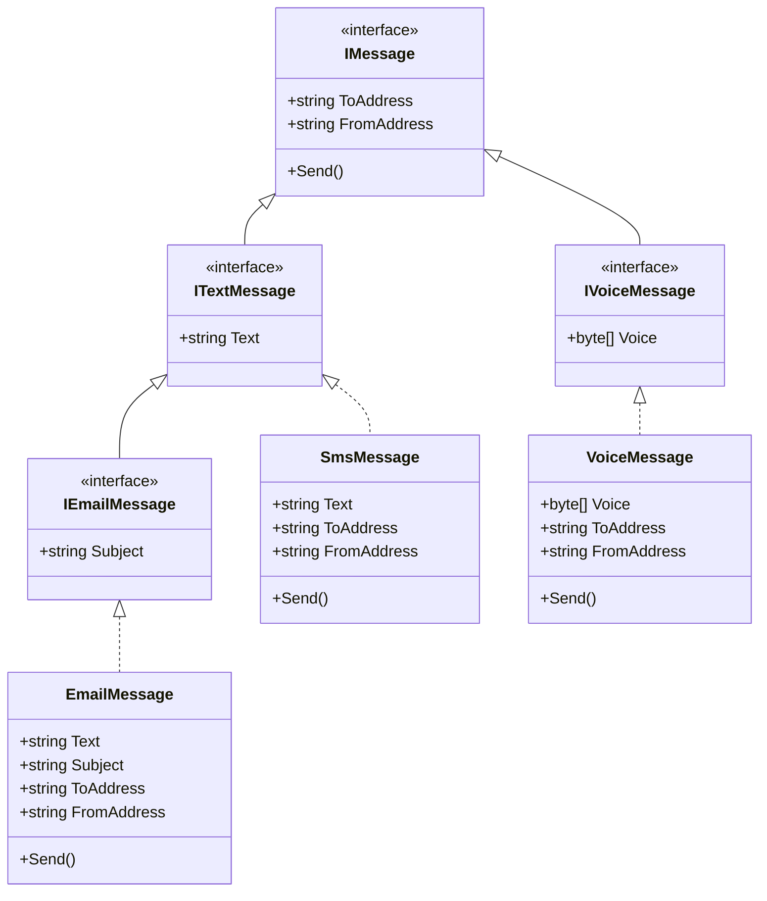

### Пример 3: Облачные провайдеры

**❌ Неправильно: Интерфейс по максимуму**

```csharp
// АНТИПАТТЕРН: Интерфейс спроектирован под Amazon (полный набор сервисов)
// Другие провайдеры не поддерживают все функции
public interface ICloudProvider
{
    void StoreFile(string name, byte[] data);
    byte[] RetrieveFile(string name);
    void ProcessData(byte[] data);
    void RunAnalytics(string query);
    void StartVirtualMachine(string config);
    void ManageDatabase(string command);
    // ... ещё 10 методов
}

// Amazon реализует всё
public class AmazonCloudProvider : ICloudProvider
{
    public void StoreFile(string name, byte[] data) { /* ... */ }
    public byte[] RetrieveFile(string name) { return Array.Empty<byte>(); }
    public void ProcessData(byte[] data) { /* ... */ }
    public void RunAnalytics(string query) { /* ... */ }
    public void StartVirtualMachine(string config) { /* ... */ }
    public void ManageDatabase(string command) { /* ... */ }
}

// Dropbox умеет только хранить файлы
public class DropboxCloudProvider : ICloudProvider
{
    public void StoreFile(string name, byte[] data)
    {
        Console.WriteLine($"Dropbox: сохраняю {name}");
    }
    
    public byte[] RetrieveFile(string name)
    {
        Console.WriteLine($"Dropbox: загружаю {name}");
        return Array.Empty<byte>();
    }
    
    // Всё остальное — не поддерживается
    public void ProcessData(byte[] data) => throw new NotImplementedException();
    public void RunAnalytics(string query) => throw new NotImplementedException();
    public void StartVirtualMachine(string config) => throw new NotImplementedException();
    public void ManageDatabase(string command) => throw new NotImplementedException();
}
```

**✅ Правильно: Разделённые интерфейсы по функциональности**

```csharp
// Базовый интерфейс для хранения файлов
public interface ICloudStorage
{
    void StoreFile(string name, byte[] data);
    byte[] RetrieveFile(string name);
}

// Интерфейс для обработки данных
public interface IDataProcessing
{
    void ProcessData(byte[] data);
}

// Интерфейс для аналитики
public interface IAnalytics
{
    void RunAnalytics(string query);
}

// Интерфейс для виртуальных машин
public interface IVirtualMachines
{
    void StartVirtualMachine(string config);
}

// Интерфейс для управления БД
public interface IDatabaseManagement
{
    void ManageDatabase(string command);
}

// Amazon поддерживает всё — реализует все интерфейсы
public class AmazonCloudProvider : 
    ICloudStorage, IDataProcessing, IAnalytics, IVirtualMachines, IDatabaseManagement
{
    public void StoreFile(string name, byte[] data) { /* ... */ }
    public byte[] RetrieveFile(string name) { return Array.Empty<byte>(); }
    public void ProcessData(byte[] data) { /* ... */ }
    public void RunAnalytics(string query) { /* ... */ }
    public void StartVirtualMachine(string config) { /* ... */ }
    public void ManageDatabase(string command) { /* ... */ }
}

// Dropbox — только хранение файлов
public class DropboxCloudProvider : ICloudStorage
{
    public void StoreFile(string name, byte[] data)
    {
        Console.WriteLine($"Dropbox: сохраняю {name}");
    }
    
    public byte[] RetrieveFile(string name)
    {
        Console.WriteLine($"Dropbox: загружаю {name}");
        return Array.Empty<byte>();
    }
    // Никаких лишних методов!
}

// Google Cloud — хранение + аналитика
public class GoogleCloudProvider : ICloudStorage, IAnalytics
{
    public void StoreFile(string name, byte[] data) { /* ... */ }
    public byte[] RetrieveFile(string name) { return Array.Empty<byte>(); }
    public void RunAnalytics(string query) { /* ... */ }
}
```

**Применение:**

```csharp
// Клиентский код работает только с нужными интерфейсами
void BackupFiles(ICloudStorage storage, string[] files)
{
    foreach (var file in files)
    {
        var data = File.ReadAllBytes(file);
        storage.StoreFile(file, data);
    }
}

// Можем передать любой провайдер с поддержкой хранения
BackupFiles(new DropboxCloudProvider(), new[] { "file1.txt", "file2.txt" });
BackupFiles(new AmazonCloudProvider(), new[] { "file3.txt" });
```

### Резюме: Interface Segregation Principle

**Ключевая идея:** Много узких специализированных интерфейсов лучше, чем один универсальный.

**Признаки нарушения ISP:**
- ❌ Реализация методов через `NotImplementedException`
- ❌ Пустые реализации обязательных методов
- ❌ Классы зависят от методов, которые не используют
- ❌ Изменение одного метода затрагивает много несвязанных классов

**Преимущества соблюдения:**
- ✅ Классы зависят только от нужных им методов
- ✅ Изменения изолированы — не затрагивают лишние классы
- ✅ Проще тестировать — меньше зависимостей
- ✅ Код более гибкий — легко комбинировать интерфейсы

**Связь с другими принципами:**
- ISP — это SRP для интерфейсов (один интерфейс — одна ответственность)
- ISP помогает соблюдать DIP (зависимости от узких абстракций)

**Правило применения:** Если класс реализует интерфейс, но не использует часть методов — разделите интерфейс. Клиенты должны зависеть только от того, что используют.


---

## D — Dependency Inversion Principle (Принцип инверсии зависимостей)

### Определение

**Dependency Inversion Principle (DIP)** — принцип инверсии зависимостей — гласит, что:

1. ***Модули верхнего уровня не должны зависеть от модулей нижнего уровня. Оба должны зависеть от абстракций.***
2. ***Абстракции не должны зависеть от деталей. Детали должны зависеть от абстракций.***

Другими словами: **зависьте от интерфейсов, а не от конкретных реализаций**.

### Суть принципа

Обычно при проектировании выделяют два уровня модулей:

- **Модули нижнего уровня (Low-level modules)** — реализуют базовые операции: работа с файлами, сетью, базой данных
- **Модули верхнего уровня (High-level modules)** — содержат бизнес-логику, используют модули нижнего уровня

Традиционный подход: сначала создаются модули нижнего уровня, потом модули верхнего уровня зависят от них напрямую. Проблема: изменение низкоуровневого модуля ломает высокоуровневый.

**DIP переворачивает зависимости:**

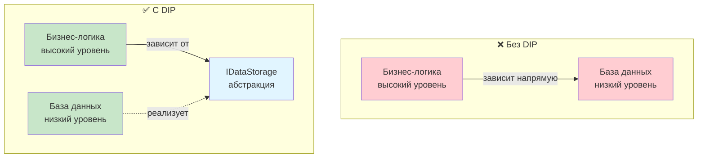

### Пример 1: Печать книги

**❌ Неправильно: Прямая зависимость от конкретной реализации**

```csharp
// Низкоуровневый класс — конкретная реализация печати
public class ConsolePrinter
{
    public void Print(string text)
    {
        Console.WriteLine($"Консольный вывод: {text}");
    }
}

// АНТИПАТТЕРН: Высокоуровневый класс зависит от ConsolePrinter напрямую
// Если захотим печатать в файл или на принтер — придётся менять Book
public class Book
{
    public string Text { get; set; } = "";
    public ConsolePrinter Printer { get; set; }  // ✗ Жёсткая зависимость!
    
    public Book()
    {
        // Создаём зависимость прямо здесь — плохо!
        Printer = new ConsolePrinter();
    }
    
    public void Print()
    {
        Printer.Print(Text);
    }
}
```

**Проблемы:**
- `Book` жёстко привязан к `ConsolePrinter`
- Невозможно заменить способ печати без изменения `Book`
- Сложно тестировать — нельзя подставить мок
- Нарушается OCP — класс закрыт для расширения

**✅ Правильно: Зависимость от абстракции**

```csharp
// Абстракция для печати — интерфейс
public interface IPrinter
{
    void Print(string text);
}

// Конкретная реализация 1 — консоль
public class ConsolePrinter : IPrinter
{
    public void Print(string text)
    {
        Console.WriteLine($"[Консоль] {text}");
    }
}

// Конкретная реализация 2 — файл
public class FilePrinter : IPrinter
{
    private readonly string _filePath;
    
    public FilePrinter(string filePath)
    {
        _filePath = filePath;
    }
    
    public void Print(string text)
    {
        File.AppendAllText(_filePath, text + Environment.NewLine);
        Console.WriteLine($"[Файл] Записано в {_filePath}");
    }
}

// Конкретная реализация 3 — HTML
public class HtmlPrinter : IPrinter
{
    public void Print(string text)
    {
        string html = $"<html><body><p>{text}</p></body></html>";
        File.WriteAllText("output.html", html);
        Console.WriteLine($"[HTML] Сохранено в output.html");
    }
}

// Высокоуровневый класс зависит от АБСТРАКЦИИ, а не от реализации
public class Book
{
    public string Text { get; set; } = "";
    public IPrinter Printer { get; set; }  // ✓ Зависимость от интерфейса!
    
    // Dependency Injection через конструктор
    public Book(IPrinter printer)
    {
        Printer = printer;
    }
    
    public void Print()
    {
        Printer.Print(Text);
    }
}
```

**Применение:**

```csharp
string content = "Это текст книги о принципах SOLID";

// Печать в консоль
Book book1 = new Book(new ConsolePrinter());
book1.Text = content;
book1.Print();

// Печать в файл
Book book2 = new Book(new FilePrinter("book.txt"));
book2.Text = content;
book2.Print();

// Печать в HTML
Book book3 = new Book(new HtmlPrinter());
book3.Text = content;
book3.Print();

// Можем менять принтер динамически
book1.Printer = new FilePrinter("another.txt");
book1.Print();
```

**Преимущества:**
- ✅ `Book` не зависит от конкретных реализаций
- ✅ Легко добавить новый способ печати (PDF, LaTeX, Markdown)
- ✅ Легко тестировать — можем использовать мок `IPrinter`
- ✅ Соблюдается OCP — расширяем без изменения `Book`

### Пример 2: Отчёты и источники данных

**❌ Неправильно: Бизнес-логика зависит от базы данных**

```csharp
// Низкоуровневый класс — прямая работа с БД
public class MySqlDatabase
{
    public string GetReportData(int reportId)
    {
        Console.WriteLine($"Запрос к MySQL: SELECT * FROM reports WHERE id = {reportId}");
        return $"Данные отчёта {reportId} из MySQL";
    }
    
    public void SaveReportData(int reportId, string data)
    {
        Console.WriteLine($"Сохранение в MySQL: {data}");
    }
}

// АНТИПАТТЕРН: Бизнес-логика жёстко привязана к MySQL
public class BudgetReport
{
    private MySqlDatabase _database;  // ✗ Прямая зависимость!
    
    public BudgetReport()
    {
        _database = new MySqlDatabase();
    }
    
    public void GenerateReport(int year)
    {
        // Получаем данные
        string data = _database.GetReportData(year);
        
        // Бизнес-логика обработки
        string report = $"Бюджетный отчёт за {year}: {data}";
        Console.WriteLine(report);
        
        // Сохраняем результат
        _database.SaveReportData(year, report);
    }
}

// Проблема: чтобы перейти на PostgreSQL или файлы — нужно менять BudgetReport
```

**✅ Правильно: Зависимость от абстракции**

```csharp
// Высокоуровневый интерфейс для хранилища данных
// Определяется бизнес-логикой, а не деталями реализации
public interface IReportStorage
{
    string LoadReportData(int reportId);
    void SaveReportData(int reportId, string data);
}

// Низкоуровневая реализация для MySQL
public class MySqlReportStorage : IReportStorage
{
    public string LoadReportData(int reportId)
    {
        Console.WriteLine($"[MySQL] Загрузка отчёта {reportId}");
        // Реальный SQL-запрос
        return $"Данные из MySQL для отчёта {reportId}";
    }
    
    public void SaveReportData(int reportId, string data)
    {
        Console.WriteLine($"[MySQL] Сохранение отчёта {reportId}");
        // Реальная запись в БД
    }
}

// Низкоуровневая реализация для файлов
public class FileReportStorage : IReportStorage
{
    private readonly string _directory;
    
    public FileReportStorage(string directory)
    {
        _directory = directory;
    }
    
    public string LoadReportData(int reportId)
    {
        string filePath = Path.Combine(_directory, $"report_{reportId}.txt");
        Console.WriteLine($"[Файл] Загрузка из {filePath}");
        
        if (File.Exists(filePath))
            return File.ReadAllText(filePath);
            
        return $"Новый отчёт {reportId}";
    }
    
    public void SaveReportData(int reportId, string data)
    {
        string filePath = Path.Combine(_directory, $"report_{reportId}.txt");
        Console.WriteLine($"[Файл] Сохранение в {filePath}");
        File.WriteAllText(filePath, data);
    }
}

// Бизнес-логика зависит от АБСТРАКЦИИ
public class BudgetReport
{
    private readonly IReportStorage _storage;  // ✓ Зависимость от интерфейса!
    
    // Dependency Injection через конструктор
    public BudgetReport(IReportStorage storage)
    {
        _storage = storage;
    }
    
    public void GenerateReport(int year)
    {
        Console.WriteLine($"\n=== Генерация бюджетного отчёта за {year} ===");
        
        // Получаем данные через абстракцию
        string data = _storage.LoadReportData(year);
        
        // Бизнес-логика обработки (не зависит от источника данных!)
        string report = $"БЮДЖЕТНЫЙ ОТЧЁТ ЗА {year}\n" +
                       $"Исходные данные: {data}\n" +
                       $"Обработка: анализ, расчёты, форматирование...\n" +
                       $"Дата формирования: {DateTime.Now}";
        
        Console.WriteLine(report);
        
        // Сохраняем результат через абстракцию
        _storage.SaveReportData(year, report);
    }
}
```

**Применение:**

```csharp
// Используем MySQL
var mysqlStorage = new MySqlReportStorage();
var report1 = new BudgetReport(mysqlStorage);
report1.GenerateReport(2025);

// Переходим на файловое хранилище — меняем только конфигурацию!
var fileStorage = new FileReportStorage("./reports");
var report2 = new BudgetReport(fileStorage);
report2.GenerateReport(2025);

// Бизнес-логика (BudgetReport) не изменилась!
```

**Визуализация инверсии зависимостей:**

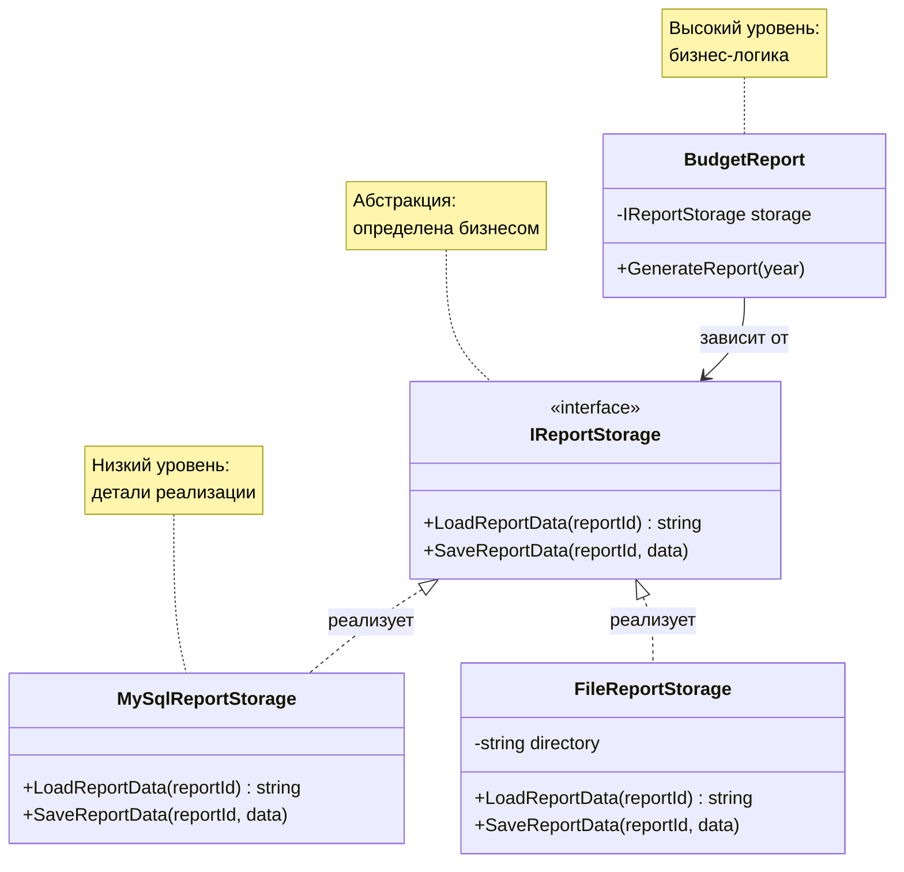

### Преимущества DIP

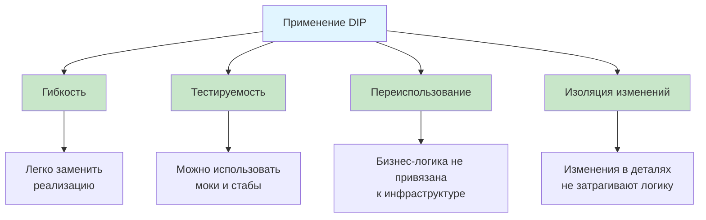

### Dependency Injection (Внедрение зависимостей)

DIP часто реализуется через паттерн **Dependency Injection (DI)** — внедрение зависимостей:

```csharp
// Три основных способа внедрения зависимостей:

// 1. Constructor Injection (через конструктор) — РЕКОМЕНДУЕТСЯ
public class Service
{
    private readonly IDependency _dependency;
    
    public Service(IDependency dependency)  // Внедряем через конструктор
    {
        _dependency = dependency ?? throw new ArgumentNullException(nameof(dependency));
    }
}

// 2. Property Injection (через свойство) — для опциональных зависимостей
public class Service
{
    public IDependency Dependency { get; set; }  // Можно установить после создания
    
    public void DoWork()
    {
        if (Dependency == null)
            throw new InvalidOperationException("Dependency не установлена");
            
        Dependency.Execute();
    }
}

// 3. Method Injection (через метод) — когда зависимость нужна только для одного метода
public class Service
{
    public void DoWork(IDependency dependency)  // Внедряем при вызове
    {
        dependency.Execute();
    }
}
```

**Рекомендация:** Используйте Constructor Injection для обязательных зависимостей — это делает требования класса явными и гарантирует, что объект всегда в корректном состоянии.

### Когда НЕ применять DIP

DIP может быть избыточным для:

1. **Простых утилитных классов** — `Math.Abs()`, `string.Format()` и т.д.
2. **Стабильных фреймворковых классов** — `DateTime`, `List<T>`, `StringBuilder`
3. **Внутренних деталей реализации** — приватные вспомогательные классы

**Пример разумного исключения:**

```csharp
public class ReportGenerator
{
    // Не нужна абстракция для StringBuilder — это стабильный класс
    public string Generate(IEnumerable<string> data)
    {
        var builder = new StringBuilder();  // Прямая зависимость — это OK
        
        foreach (var item in data)
        {
            builder.AppendLine(item);
        }
        
        return builder.ToString();
    }
}
```

### Резюме: Dependency Inversion Principle

**Ключевая идея:** Зависьте от абстракций (интерфейсов), а не от конкретных реализаций.

**Две части принципа:**
1. Высокоуровневые модули не зависят от низкоуровневых — оба зависят от абстракций
2. Абстракции не зависят от деталей — детали зависят от абстракций

**Способы реализации:**
- ✅ Интерфейсы вместо конкретных классов
- ✅ Dependency Injection (внедрение зависимостей)
- ✅ Абстрактные классы для определения контракта

**Преимущества:**
- ✅ Гибкость — легко заменить реализацию
- ✅ Тестируемость — можно использовать моки
- ✅ Переиспользование — бизнес-логика не привязана к инфраструктуре
- ✅ Изоляция изменений — детали меняются независимо от логики

**Связь с другими принципами:**
- DIP работает вместе с OCP (расширение через новые реализации интерфейсов)
- DIP работает вместе с LSP (реализации должны быть взаимозаменяемы)
- DIP использует ISP (зависимость от узких интерфейсов)

**Правило применения:** Если ваш класс создаёт экземпляры других классов через `new` — подумайте, не нужна ли абстракция. Зависьте от интерфейсов для всех внешних зависимостей, которые могут измениться.

---

## Заключение

### Краткая сводка принципов SOLID

Давайте ещё раз кратко вспомним все пять принципов:

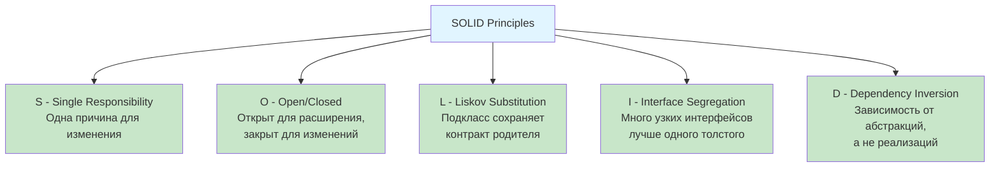

**S — Single Responsibility Principle**
- **Суть:** Один класс — одна ответственность — одна причина для изменения
- **Цель:** Борьба со сложностью, улучшение понятности кода
- **Применение:** Разделяйте классы, которые делают несколько несвязанных вещей

**O — Open/Closed Principle**
- **Суть:** Открыт для расширения, закрыт для изменений
- **Цель:** Безопасное добавление функционала без изменения существующего кода
- **Применение:** Используйте интерфейсы и абстрактные классы для расширяемости

**L — Liskov Substitution Principle**
- **Суть:** Подкласс должен быть полноценной заменой базового класса
- **Цель:** Корректность полиморфизма, предсказуемость поведения
- **Применение:** Проектируйте иерархии так, чтобы подклассы не нарушали контракты

**I — Interface Segregation Principle**
- **Суть:** Много узких интерфейсов лучше одного универсального
- **Цель:** Избавление от ненужных зависимостей
- **Применение:** Разделяйте интерфейсы по функциональным группам

**D — Dependency Inversion Principle**
- **Суть:** Зависьте от абстракций, а не от конкретных реализаций
- **Цель:** Гибкость, тестируемость, изоляция изменений
- **Применение:** Используйте интерфейсы и внедрение зависимостей

### Взаимосвязь принципов

Принципы SOLID не существуют изолированно — они дополняют друг друга:

```mermaid
graph LR
    SRP[SRP<br/>Разделяй<br/>ответственности]
    OCP[OCP<br/>Расширяй<br/>без изменений]
    LSP[LSP<br/>Соблюдай<br/>контракты]
    ISP[ISP<br/>Узкие<br/>интерфейсы]
    DIP[DIP<br/>Зависимость<br/>от абстракций]
    
    SRP -->|помогает| OCP
    OCP -->|требует| LSP
    LSP -->|работает с| DIP
    ISP -->|это SRP для| Interfaces[интерфейсов]
    DIP -->|использует| ISP
    
    style SRP fill:#e3f2fd
    style OCP fill:#e8f5e9
    style LSP fill:#fff3e0
    style ISP fill:#fce4ec
    style DIP fill:#f3e5f5
```

### Баланс между принципами и практичностью

**Важно помнить:**

- ✅ SOLID — это **руководящие принципы**, а не жёсткие правила
- ✅ Не стремитесь к идеальному соблюдению всех принципов сразу
- ✅ Начинайте с простого кода, применяйте принципы по мере роста системы
- ✅ Иногда простота важнее идеальной архитектуры
- ✅ Учитывайте контекст и размер проекта

**Когда применять SOLID:**
- Код будет поддерживаться и развиваться долгое время
- Команда разработки больше 2-3 человек
- Проект превышает 1000 строк кода
- Требуется высокая тестируемость

**Когда можно упростить:**
- Прототипы и MVP
- Скрипты и утилиты
- Код, который вряд ли будет изменяться
- Очень простая логика (< 100 строк)

### Путь к качественной архитектуре

```mermaid
graph TD
    A[Начало разработки]
    B{Код растёт}
    C[Применяем<br/>рефакторинг]
    D[Выделяем<br/>абстракции]
    E[Применяем<br/>SOLID]
    F[Качественная<br/>архитектура]
    
    A --> B
    B -->|да| C
    C --> D
    D --> E
    E --> F
    F -.->|продолжаем<br/>улучшать| B
    
    style A fill:#e3f2fd
    style F fill:#c8e6c9
```

### Финальные рекомендации

1. **Изучайте постепенно**
   - Начните с понимания каждого принципа
   - Ищите примеры нарушений в своём коде
   - Практикуйте рефакторинг

2. **Применяйте осознанно**
   - Не усложняйте без необходимости
   - Помните о контексте и целях проекта
   - Балансируйте между гибкостью и простотой

3. **Используйте вместе с паттернами**
   - SOLID — это фундамент
   - Паттерны проектирования — это инструменты
   - Вместе они создают качественную архитектуру

4. **Продолжайте развиваться**
   - Изучайте GRASP принципы
   - Осваивайте паттерны проектирования
   - Анализируйте реальные проекты

> **Помните:** Хорошая архитектура — это не цель, а средство. Цель — создать понятный, поддерживаемый код, который решает бизнес-задачи. SOLID помогает достичь этой цели, но не заменяет здравый смысл и опыт.

**Удачи в применении принципов SOLID! 🚀**

