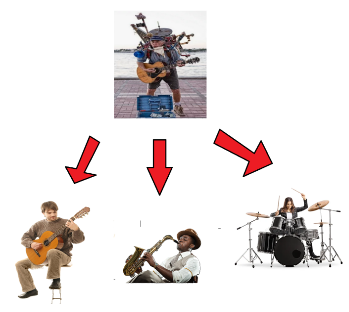
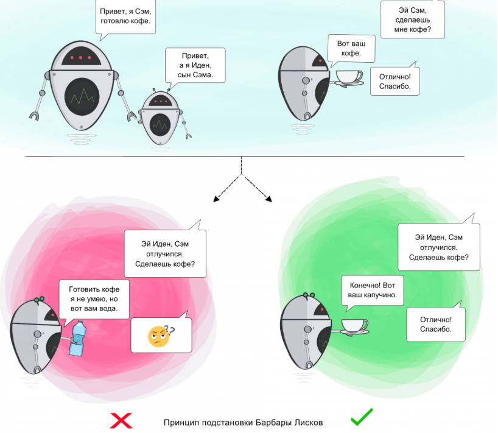
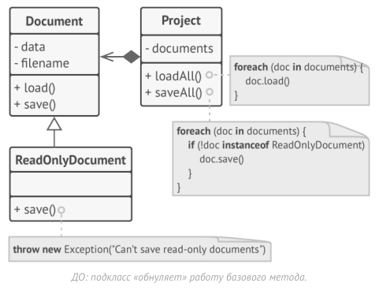
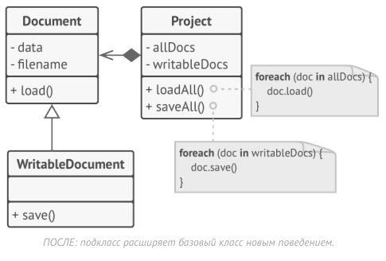
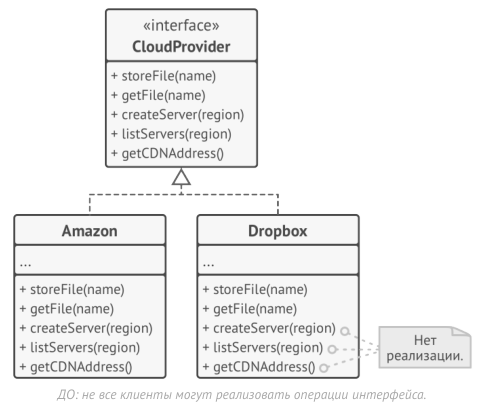
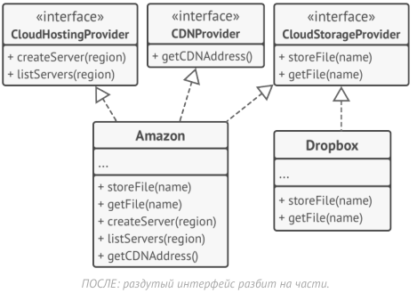
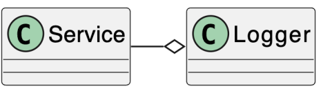
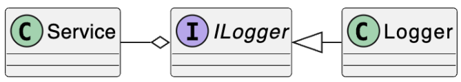
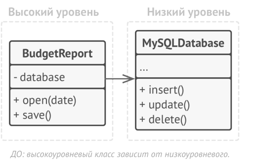
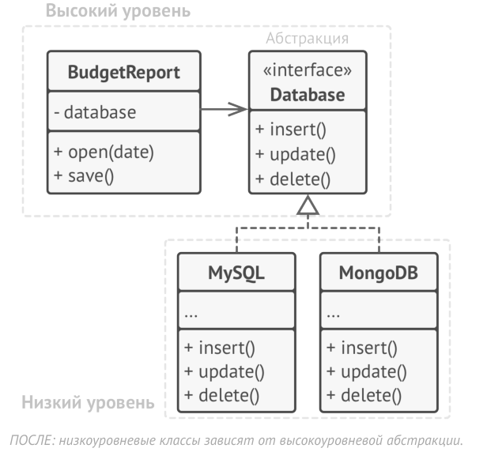

# Принципы SOLID

Рассмотрим ещё пять принципов проектирования, которые известны как SOLID. SOLID - это акроним от первых букв пяти основных принципов ООП, изложенных Робертом Мартином в начале 2000-х: сокр. от англ. single responsibility, open–closed, Liskov substitution, interface segregation и dependency inversion. 

SOLID:
- Single Responsibility Principle (Принцип единственной обязанности)
- Open/Closed Principle (Принцип открытости/закрытости)
- Liskov Substitution Principle (Принцип подстановки Лисков)
- Interface Segregation Principle (Принцип разделения интерфейсов)
- Dependency Inversion Principle (Принцип инверсии зависимостей)

Главная цель этих принципов - повысить гибкость архитектуры вашей программы, уменьшить связность между её компонентами и облегчить повторное использование кода

Обратите внимание на то, что принципы SOLID - это не паттерны - это именно, что принципы. Паттерны это скорее про какие-то шаблонные (типовые) решения задач, а приницпы про что-то более общее. 

### S - Single Responsibility Problem

Single Responsibility Problem, он же SRP, он же принцип единственной ответсвенности, гласит, что ***проектировать типы нужно таким образом, чтобы они имеют единственную причину для изменения.*** 

Или же, если вкратце, то SRC - *единственная причина изменения*.

Принцип единственной ответственности предназначен для борьбы со сложностью. Когда в вашем приложении всего 200 строк, то дизайн как таковой вообще не нужен. Достаточно аккуратно написать 5-7 методов и всё будет хорошо. Проблемы возникают, когда система растёт и увеличивается в масштабах. Когда класс разрастается, он просто перестаёт помещаться в голове. Навигация затрудняется, на глаза попадаются ненужные детали, связанные с другим аспектом, в результате, количество понятий начинают превышать мозговой стек, и вы начинаете терять контроль над кодом. Если класс делает слишком много вещей сразу, вам приходится изменять его каждый раз, когда одна из этих вещей изменяется. При этом есть риск сломать остальные части класса, которые вы даже не планировали трогать.

На этот принцип можно смотрет с нескольких сторон. Сначала посмотрим на то, что обычно люди под этим подразумевают, а затем уже с *более правильной* стороны. 

Мы хотим, чтобы каждый наш метод/объект/тип выполнял только какую-то свою задачу. Если объект отвечает за несколько операций сразу, вероятность возникновения багов возрастает – внося изменения, касающиеся одной из операций вы, сами того не подозревая, можете затронуть и другие. Наглядно это выглядит так:


Здесь наша фукнция выполняет слишком много задач одновременно. Вместо это стоит разбить её на несколько других так, чтобы она состояла из нескольких других частей, каждая из которых занимается одним чем-то своим:


То есть идея в том, что мы разбиваем что-то, что делает много всего и сразу, на несколько составных частей, каждая из которых отвечают за что-то одно.

Давайте посмотрим на примере кода: допустим, нам надо определить класс отчета, по которому мы можем перемещаться по страницам и который можно выводить на печать. На первый взгляд мы могли бы определить следующий класс:
```csharp
class Report
{
    public string Text { get; set; } = "";
    public void GoToFirstPage() =>
        Console.WriteLine("Переход к первой странице");
 
    public void GoToLastPage() =>
        Console.WriteLine("Переход к последней странице");
 
    public void GoToPage(int pageNumber) =>
        Console.WriteLine($"Переход к странице {pageNumber}");
 
 
    public void Print()
    {
        Console.WriteLine("Печать отчета");
        Console.WriteLine(Text);
    }
}
```

Первые три метода класса относятся к навигации по отчету и представляют одно единое функциональное целое. От них отличается метод `Print`, который производит печать. Что если нам понадобится печатать отчет на консоль или передать его на принтер для физической печати на бумаге? Или вывести в файл? Сохранить в формате `html`, `txt`, `rtf` и т.д.? Очевидно, что мы можем для этого поменять нужным образом метод `Print()`. Однако это вряд ли затронет остальные методы, которые относятся к навигации страницы.

Также верно и обратное - изменение методов постраничной навигации вряд ли повлияет на возможность вывода текста отчета на принтер или на консоль. Таким образом, у нас класс `Report` обладает сразу двумя обязанностями, и от одной из них этот класс надо освободить. Решением было бы вынести каждую обязанность в отдельный компонент (в данном случае в отдельный класс):

```csharp
class Report
{
    public string Text { get; set; } = "";
    public void GoToFirstPage() =>
        Console.WriteLine("Переход к первой странице");
 
    public void GoToLastPage() =>
        Console.WriteLine("Переход к последней странице");
 
    public void GoToPage(int pageNumber) =>
        Console.WriteLine($"Переход к странице {pageNumber}");    
}

class Printer
{
    public void PrintReport(Report report)
    {
        Console.WriteLine("Печать отчета");
        Console.WriteLine(report.Text);
    }
}
```
Теперь печать вынесена в отдельный класс `Printer`, который через метод `Print` получает объект отчета и выводит его текст на консоль.

Однако стоит понимать, что обязанности в классах не всегда группируются по методам. Речь идет именно об обязанности компонента, в качестве которого может выступать не только тип (например, класс), но и метод или свойство. И вполне возможно, что в одном каком-то методе сгруппировано несколько обязанностей. Например:

```csharp
class Phone
{
    public string Model { get;}
    public int Price { get;}
    public Phone(string model, int price)
    {
        Model = model;
        Price = price;
    }
}
 
class MobileStore
{
    List<Phone> phones = new();
    public void Process()
    {
        // ввод данных
        Console.WriteLine("Введите модель:");
        string? model = Console.ReadLine();
        Console.WriteLine("Введите цену:");
 
        // валидация
        bool result = int.TryParse(Console.ReadLine(), out var price);
 
        if (result == false || price <= 0 || string.IsNullOrEmpty(model))
        {
            throw new Exception("Некорректно введены данные");
        }
        else
        {
            phones.Add(new Phone(model, price));
            // сохраняем данные в файл
            using (StreamWriter writer = new StreamWriter("store.txt", true))
            {
                writer.WriteLine(model);
                writer.WriteLine(price);
            }
            Console.WriteLine("Данные успешно обработаны");
        }
    }
}
```
Класс имеет один единственный метод Process, однако этот небольшой метод, содержит в себе как минимум четыре обязанности: ввод данных, их валидация, создание объекта Phone и сохранение. В итоге класс знает абсолютно все: как получать данные, как валидировать, как сохранять. При необходимости в него можно было бы засунуть еще пару обязанностей.

Теперь изменим код класса, инкапсулировав все обязанности в отдельных классах:

```csharp
class Phone
{
    public string Model { get;}
    public int Price { get;}
    public Phone(string model, int price)
    {
        Model = model;
        Price = price;
    }
}
 
class MobileStore
{
    List<Phone> phones = new List<Phone>();
 
    public IPhoneReader Reader { get; set; }
    public IPhoneBinder Binder { get; set; }
    public IPhoneValidator Validator { get; set; }
    public IPhoneSaver Saver { get; set; }
 
    public MobileStore(IPhoneReader reader, IPhoneBinder binder, IPhoneValidator validator, IPhoneSaver saver)
    {
        this.Reader = reader;
        this.Binder = binder;
        this.Validator = validator;
        this.Saver = saver;
    }
 
    public void Process()
    {
        string?[] data = Reader.GetInputData();
        Phone phone = Binder.CreatePhone(data);
        if (Validator.IsValid(phone))
        {
            phones.Add(phone);
            Saver.Save(phone, "store.txt");
            Console.WriteLine("Данные успешно обработаны");
        }
        else
        {
            Console.WriteLine("Некорректные данные");
        }
    }
}
 
interface IPhoneReader
{
    string?[] GetInputData();
}
class ConsolePhoneReader : IPhoneReader
{
    public string?[] GetInputData()
    {
        Console.WriteLine("Введите модель:");
        string? model = Console.ReadLine();
        Console.WriteLine("Введите цену:");
        string? price = Console.ReadLine();
        return new string?[] { model, price };
    }
}
 
interface IPhoneBinder
{
    Phone CreatePhone(string?[] data);
}
 
class GeneralPhoneBinder : IPhoneBinder
{
    public Phone CreatePhone(string?[] data)
    {
        if (data is {Length:2 } && data[0] is string model &&
            model.Length > 0 && int.TryParse(data[1], out var price))
        { 
                return new Phone(model, price);
             
        }
        throw new Exception("Ошибка привязчика модели Phone. Некорректные данные");
    }
}
 
interface IPhoneValidator
{
    bool IsValid(Phone phone);
}
 
class GeneralPhoneValidator : IPhoneValidator
{
    public bool IsValid(Phone phone) =>
        !string.IsNullOrEmpty(phone.Model) && phone.Price > 0;
}
 
interface IPhoneSaver
{
    void Save(Phone phone, string fileName);
}
 
class TextPhoneSaver : IPhoneSaver
{
    public void Save(Phone phone, string fileName)
    {
        using StreamWriter writer = new StreamWriter(fileName, true);
        writer.WriteLine(phone.Model);
        writer.WriteLine(phone.Price);
    }
}
```

Возможное применение класса:

```csharp
MobileStore store = new MobileStore(
    new ConsolePhoneReader(), new GeneralPhoneBinder(), 
    new GeneralPhoneValidator(), new TextPhoneSaver());
store.Process();
```

Теперь для каждой обязанности определен свой интерфейс. Конкретные реализации обязанностей устнавливаются в виде интрефейсов в целевом классе.

В то же время кода стало больше, в связи с чем программа усложнилась. И, возможно, подобное усложнение может показаться неоправданным при наличии одного небольшого метода, который необязательно будет изменяться. Однако при модификации стало гораздо проще вводить новый функционал без изменения существующего кода. А все части метода Process, будучи инкапсулированными во внешних классах, теперь не зависят друг от друга и могут изменяться самостоятельно.

А тепепь уже перейдём к более *взрослому* определению, которое мы ввели в начале. Выше мы лишь говорили о приницпе единственной ответсвенности как именно о том, что каждый объект должен выполнять что-то одно, но ведь определение описывает именно *единственность причины изменений*.

Что это значит? Это значит, что то, что мы пишем должно иметь только одну причину для изменения. Рассмотрим пример:
```csharp
public record OperationResult(...);

public class ReportGenerator
{
    public void GenerateExcelReport(OperationResult result)    
    {
        ...    
    }
    public void GeneratePdfReport(OperationResult result)    
    {
        ...
    }
}
```
Здесь наш класс имеет две причины для изменения: во-первых, мы можем добавить новый report, например `GenerateEpubReport` или же `GenerateFb2Report`, а во-вторых, мы можем захотеть изменить уже существующий report, например изменить GeneratePdfReport. 

То есть данный класс, если в будуещем мы когда-то захотим его изменить имеет целые две вещи, которые мы можем захотеть в нём изменить. А про принципу SRP причина для изменений должна быть единственной:
```csharp
public record OperationResult(...);

public interface IReportGenerator
{
    void GenerateReport(OperationResult result);
}
public class ExcelReportGenerator : IReportGenerator
{
    public void GenerateReport(OperationResult result)    
    {
        ...
    }
}
public class PdfReportGenerator : IReportGenerator
{
    public void GenerateReport(OperationResult result)    
    {
        ...
    }
}
```

Теперь каждый класс XxxReportGenearot имеет только одну причину для изменения: изменить сам метод, либо же мы можем просто отнаследоваться и добавить новый отчёт. 

Такое опредление почти тождественно тому, что мы разбирали выше про одну-единственную задачу у каждой функции, однако всё-таки немного отличается. Думайте об этом так: после того как мы что-то спроектировали надо подумать о том, что мы можем захотим изменить. Если мы можем захотеть изменить сразу несколько вещей, то скорее всего надо переписать код. 

**Преимущества НЕсоблюдения SRP:** 
- простота: нет необходимости в абстракциях, низкий порог вхождения
- переиспользование логики: часто логика в типах не соблюдающих SRP имеет общие части, вызвать приватный метод типа в нескольких местах проще, чем реализовывать грамотную декомпозицию

**Последствия несоблюдения SRP:**
- сильная связанность реализации различных бизнес требований; от простого: загрязнённый контекст для анализатора; до тяжёлого: усложнение тестирования
- усложнённая кастомизация отдельных реализаций - изменения в общем коде могут поломать другие решения
последствия несоблюдения


**Распространенные случаи отхода от принципа SRP:**

Нередко принцип единственной обязанности нарушает при смешивании в одном классе функциональности разных уровней. Например, класс производит вычисления и выводит их пользователю, то есть соединяет в себя бизнес-логику и работу с пользовательским интерфейсом. Либо класс управляет сохранением/получением данных и выполнением над ними вычислений, что также нежелательно. Класс следует применять только для одной задачи - либо бизнес-логика, либо вычисления, либо работа с данными.

Другой распространенный случай - наличие в классе или его методах абсолютно несвязанного между собой функционала.

### O - Open/Closed Principle

Open/Closed Principle, он же OCP, он же принцип открытости/закрытости гласит о том, что ***проектировать типы необходимо, таким образом чтобы их логику можно было расширять, не изменяя их исходный код***. *Тип должен быть открытым для расширения, но закрытым для изменений*. Или же: *расширяйте классы, но не изменяйте их первоначальный код.*

Суть этого принципа состоит в том, что система должна быть построена таким образом, что все ее последующие изменения должны быть реализованы с помощью добавления нового кода, а не изменения уже существующего. То есть сделать поведение класса более разнообразным, не вмешиваясь в текущие операции, которые он выполняет. Благодаря этому вы избегаете ошибок в тех фрагментах кода, где задействован этот класс.

Когда вы меняете текущее поведение класса, эти изменения сказываются на всех системах, работающих с данным классом. Если хотите, чтобы класс выполнял больше операций, то идеальный вариант – не заменять старые на новые, а добавлять новые к уже существующим. Благодаря этому вы избегаете ошибок в тех фрагментах кода, где задействован этот класс. То есть, главная идея этого принципа в том, чтобы не ломать существующий код при внесении изменений в программу.

Если класс уже был написан, одобрен, протестирован, возможно, внесён в библиотеку и включён в проект, после этого пытаться модифицировать его содержимое не желательно. Вместо этого, вы можете создать подкласс и расширить в нём базовое поведение, не изменяя код родительского класса напрямую.

Но не стоит следовать этому принципу буквально для каждого изменения. Если вам нужно исправить ошибку в исходном классе, просто возьмите и сделайте это. Нет надо решать проблему родителя в дочернем классе

Рассмотрим простейший пример - класс повара:
```csharp
class Cook
{
    public string Name { get; set; }
    public Cook(string name)
    {
        this.Name = name;
    }
 
    public void MakeDinner()
    {
        Console.WriteLine("Чистим картошку");
        Console.WriteLine("Ставим почищенную картошку на огонь");
        Console.WriteLine("Сливаем остатки воды, разминаем варенный картофель в пюре");
        Console.WriteLine("Посыпаем пюре специями и зеленью");
        Console.WriteLine("Картофельное пюре готово");
    }
}
```
И с помощью метода MakeDinner любой объект данного класса сможет сделать картофельного пюре:
```csharp
Cook bob = new Cook("Bob");
bob.MakeDinner();
```

Однако одного умения готовить картофельное пюре для повара вряд ли достаточно. Хотелось бы, чтобы повар мог приготовить еще что-то. И в этом случае мы подходим к необходимости изменения функционала класса, а именно метода MakeDinner. Но в соответствии с рассматриваемым нами принципом классы должны быть открыты для расширения, но закрыты для изменения. То есть, нам надо сделать класс Cook отрытым для расширения, но при этом не изменять.

В первую очередь нам надо вынести из класса и инкапсулировать всю ту часть, которая представляет изменяющееся поведение. В нашем случае это метод MakeDinner. Однако это не всегда бывает просто сделать. Возможно, в классе много методов, но на начальном этапе сложно определить, какие из них будут изменять свое поведение и как изменять. В этом случае, конечно, надо анализировать возможные способы изменения и уже на основании анализа делать выводы. То есть, все, что подается изменению, выносится из класса и инкапсулируется во вне - во внешних сущностях.

Итак, изменим класс Cook следующим образом:
```csharp
class Cook
{
    public string Name { get; set; }
 
    public Cook(string name)
    {
        this.Name = name;
    }
 
    public void MakeDinner(IMeal meal)
    {
        meal.Make();
    }
}
 
interface IMeal
{
    void Make();
}
class PotatoMeal : IMeal
{
    public void Make()
    {
        Console.WriteLine("Чистим картошку");
        Console.WriteLine("Ставим почищенную картошку на огонь");
        Console.WriteLine("Сливаем остатки воды, разминаем варенный картофель в пюре");
        Console.WriteLine("Посыпаем пюре специями и зеленью");
        Console.WriteLine("Картофельное пюре готово");
    }
}
class SaladMeal : IMeal
{
    public void Make()
    {
        Console.WriteLine("Нарезаем помидоры и огурцы");
        Console.WriteLine("Посыпаем зеленью, солью и специями");
        Console.WriteLine("Поливаем подсолнечным маслом");
        Console.WriteLine("Салат готов");
    }
}
```

Теперь приготовление еды абстрагировано в интерфейсе IMeal, а конкретные способы приготовления определены в реализациях этого интерфейса. А класс Cook делегирует приготовление еды методу Make объекта IMeal.

Использование класса:
```csharp
Cook bob = new Cook("Bob");
bob.MakeDinner(new PotatoMeal());
Console.WriteLine();
bob.MakeDinner(new SaladMeal());
```

Теперь класс Cook закрыт от изменений, зато мы можем легко расширить его функциональность, определив дополнительные реализации интерфейса IMeal.

Мы также могли бы решить задачу и другим способом:
```csharp
abstract class MealBase
{
    public void Make()
    {
        Prepare();
        Cook();
        FinalSteps();
    }
    protected abstract void Prepare();
    protected abstract void Cook();
    protected abstract void FinalSteps();
}
 
class PotatoMeal : MealBase
{
    protected override void Cook()
    {
        Console.WriteLine("Ставим почищенную картошку на огонь");
        Console.WriteLine("Варим около 30 минут");
        Console.WriteLine("Сливаем остатки воды, разминаем варенный картофель в пюре");
    }
 
    protected override void FinalSteps()
    {
        Console.WriteLine("Посыпаем пюре специями и зеленью");
        Console.WriteLine("Картофельное пюре готово");
    }
 
    protected override void Prepare()
    {
        Console.WriteLine("Чистим и моем картошку");
    }
}
 
class SaladMeal : MealBase
{
    protected override void Cook()
    {
        Console.WriteLine("Нарезаем помидоры и огурцы");
        Console.WriteLine("Посыпаем зеленью, солью и специями");
    }
 
    protected override void FinalSteps()
    {
        Console.WriteLine("Поливаем подсолнечным маслом");
        Console.WriteLine("Салат готов");
    }
 
    protected override void Prepare()
    {
        Console.WriteLine("Моем помидоры и огурцы");
    }
}
```

Теперь абстрактный класс MealBase определяет шаблонный метод Make, отдельные части которого реализуются классами наследниками.

Пусть класс Cook теперь принимает набор MealBase в виде меню:

```csharp
class Cook
{
    public string Name { get; set; }
 
    public Cook(string name, )
    {
        this.Name = name;
    }
 
    public void MakeDinner(MealBase[] menu)
    {
        foreach (MealBase meal in menu)
            meal.Make();
    }
}   
```
В данном случае расширение класса опять же производится за счет наследования классов, которые определяют требуемый функционал.

И применение классов:
```csharp
MealBase[] menu = new MealBase[] { new PotatoMeal(), new SaladMeal() };
             
Cook bob = new Cook("Bob");
bob.MakeDinner(menu);
```

Давайте рассмотрим ещё один пример несоблюдения:
```csharp
public enum BinaryOperation
{
    Summation,
    Subtraction,
}

public class BinaryOperand
{
    private readonly int _left;
    private readonly int _right;

    // ...

    public int Evaluate(BinaryOperation operation)
    {
        return operation switch
        {
            BinaryOperation.Summation > _left + _right,
            BinaryOperation.Subtraction > _left - _right,
        };
    }
}
```

Здесь, чтобы добавить новую операцию нам бы пришлось изменять switch, что нарушает OCP, ведь класс должен быть закрытм для изменений.

Перепишем, чтобы принцип соблюдался:
```csharp
public interface IBinaryOperation
{
    int Evaluate(int left, int right);
}

public class Summation : IBinaryOperation
{
    public int Evaluate(int left, int right) => left + right;
}

public class Subtraction : IBinaryOperation
{
    public int Evaluate(int left, int right) => left - right;
}

public sealed class BinaryOperand
{
    private readonly int _left;
    private readonly int _right;

    // ...

    public int Evaluate(IBinaryOperation operation) 
        => operation.Evaluate(_left, _right);
}
```

Теперь нам достаточно просто отнаследоваться от IBinaryOperation добавив новую операцию и всё.

*Проверка соблюдения:*
1. представьте что разрабатываете библиотеку
2. если потребители могут её расширить без изменения исходников – OCP соблюдается
3. если нет – не соблюдается

### L - Liskov substitution principle

Liskov substitition principle, он же LSP, он же принцип подстановки Барбары Лисков гласит что ***проектировать иерархию типов необходимо таким образом, чтобы логика дочерних типов не нарушала инвариант и интерфейс родительских типов***

То есть, LSP - дочерний тип сохраняет контракты и инварианты родителя. Или же, более простым языком: должна быть возможность вместо базового типа подставить любой его подтип.

(можно ещё сказать так: подклассы должны дополнять, а не замещать поведение базового класса, но это не официальное определение)

Принцип служит для того, чтобы обеспечить постоянство: класс-родитель и класс-потомок могут использоваться одинаковым образом без нарушения работы программы.

В случаях, когда класс-потомок не способен выполнять те же действия, что и класс-родитель, возникает риск появления ошибок.

Если у вас имеется класс и вы создаете на его базе другой класс, исходный класс становится родителем, а новый – его потомком. Класс-потомок должен производить такие же операции, как и класс-родитель. Это называется наследственностью.

Необходимо, чтобы класс-потомок был способен обрабатывать те же запросы, что и родитель, и выдавать тот же результат.

Если класс-потомок не удовлетворяет этим требованиям, значит, он слишком сильно отличается от родителя и нарушает принцип.



Фактически принцип подстановки Лисков помогает четче сформулировать иерархию классов, определить функционал для базовых и производных классов и избежать возможных проблем при применении полиморфизма.

Проблему, с который связан принцип Лисков, наглядно можно продемонстрировать на примере двух классов Прямоугольника и Квадрата. Пусть они будут выглядеть следующим образом:    
```csharp
class Rectangle
{
    public virtual int Width { get; set; }
    public virtual int Height { get; set; }
     
    public int GetArea()
    {
        return Width * Height;
    }
}
 
class Square : Rectangle
{
    public override int Width
    {
        get
        {
            return base.Width;
        }
 
        set
        {
            base.Width = value;
            base.Height = value;
        }
    }
 
    public override int Height
    {
        get
        {
            return base.Height;
        }
 
        set
        {
            base.Height = value;
            base.Width = value;
        }
    }
}
```
Как правило, квадрат представляют как частный случай прямоугольника - те же прямые углы, четыре стороны, только ширина обязательно равна высоте. Поэтому в классе Квадрат у одного свойства устанавливаются сразу и ширина, и высота.

На первый взгляд вроде все правильно, классы предельно простые, всего два свойства, и, казалось бы, сложно где-то ошибиться. Однако представим ситуацию, что в главной программе у нас следующий код:

```csharp
class Program
{
    static void Main(string[] args)
    {
        Rectangle rect = new Square();
        TestRectangleArea(rect);
 
        Console.Read();
    }
 
    public static void TestRectangleArea(Rectangle rect)
    {
        rect.Height = 5;
        rect.Width = 10;
        if (rect.GetArea() != 50)
            throw new Exception("Некорректная площадь!");
    }
}
```
С точки зрения прямоугольника метод TestRectangleArea выглядит нормально, но не с точки зрения квадрата. Мы ожидаем, что переданный в метод TestRectangleArea объект будет вести себя как стандартный прямоугольник. Однако квадрат, будучи в иерархии наследования прямоугольником, все же ведет себя не как прямоугольник. В итоге программа вывалится в ошибку.

Иногда для выхода из подобных ситуаций прибегают к специальному хаку, который заключается в проверке объекта на соответствие типам:
```csharp
public static void TestRectangleArea(Rectangle rect)
{
    if(rect is Square)
    {
        rect.Height = 5;
        if (rect.GetArea() != 25)
            throw new Exception("Неправильная площадь!");
    }
    else if(rect is Rectangle)
    {
        rect.Height = 5;
        rect.Width = 10;
        if (rect.GetArea() != 50)
            throw new Exception("Неправильная площадь!");
    }
}
```
Но такая проверка не отменяет того факта, что с архитектурой классов что-то не так. Более того такие решения только больше подчеркивают проблему несовершенства архитектуры. И проблема заключается в том, что производный класс Square не ведет себя как базовый класс Rectangle, и поэтому его не следует наследовать от данного базового класса. В этом и есть практический смысл принципа Лисков. Производный класс, который может делать меньше, чем базовый, обычно нельзя подставить вместо базового, и поэтому он нарушает принцип подстановки Лисков.

Рассмотрим ещё один пример:

```csharp
public record Coordinate(int X, int Y);

public class Creature
{
    public void Die()
    {
        Console.WriteLine("I am dead now");
    }
}

public class Bird : Creature
{
    public virtual void FlyTo(Coordinate coordinate)
    {
        Console.WriteLine("I am flying");
    }
}

public class Penguin : Bird
{
    public override void FlyTo(Coordinate coordinate)
    {
        Die();
    }
}
```
У нас есть `Bird`, у которого есть метод `FlyTo()`. Но `Penguin` (подкласс `Bird`) меняет контракт: вместо того, чтобы летать, он умирает. Это нарушение ожиданий к типу `Bird`: если функция работает с птицами, она предполагает, что все птицы умеют летать.

Пример нарушения в действии:
```csharp
void StartMigration(IEnumerable<Bird> birds, Coordinate coordinate)
{
    foreach (var bird in birds)
    {
        bird.FlyTo(coordinate);
    }
}

var birds = new[] { new Penguin() };
StartMigration(birds, new Coordinate(420, 69));
```

Здесь функция `StartMigration` предполагает, что все переданные птицы могут летать. Но если там окажется `Penguin`, он вместо полёта «умрёт» — поведение противоречит ожиданиям. Нарушение LSP: `Penguin` не может безопасно заменить `Bird`.

Вторая версия — попытка обойти проблему, но всё ещё плохо:
```csharp
public class Bat : Creature
{
    public void FlyTo(Coordinate coordinate)
    {
        Console.WriteLine("I bat and am flying");
    }
}

void StartMigration(IEnumerable<Creature> creatures, Coordinate coordinate)
{
    foreach (var creature in creatures)
    {
        if (creature is Bird bird)
        {
            bird.FlyTo(coordinate);
        }
        if (creature is Bat bat)
        {
            bat.FlyTo(coordinate);
        }
    }
}
```
Проверяем типы через is и вызываем разные методы.

Это антипаттерн — «type checking вместо полиморфизма». Метод `StartMigration` должен просто «мигрировать всех летающих существ», но теперь он вынужден знать о конкретных типах, что нарушает принцип подстановки и принцип открытости/закрытости (`OCP`) - при добавлении нового летающего существа нужно лезть внутрь `StartMigration` и править код.

Третья версия — соблюдение LSP:

```csharp
public record Coordinate(int X, int Y);

public interface ICreature
{
    void Die();
}

public interface IFlyingCreature : ICreature
{
    void FlyTo(Coordinate coordinate);
}

public class CreatureBase : ICreature
{
    public void Die()
    {
        Console.WriteLine("I am dead now");
    }
}

public class Bird : CreatureBase { }

public class Penguin : Bird { }

public class Colibri : Bird, IFlyingCreature
{
    public void FlyTo(Coordinate coordinate)
    {
        Console.WriteLine("I am colibri and I'm flying");
    }
}

public class Bat : CreatureBase, IFlyingCreature
{
    public void FlyTo(Coordinate coordinate)
    {
        Console.WriteLine("I am bat and I'm flying");
    }
}
```

Вместо того, чтобы заставлять всех наследников `Bird` реализовывать `FlyTo()`, теперь только те, кто реально умеет летать, реализуют интерфейс `IFlyingCreature`.

`Penguin` не реализует `IFlyingCreature` — значит, он не участвует в миграции и не нарушает поведение.

```csharp
void StartMigration(IEnumerable<IFlyingCreature> creatures, Coordinate coordinate)
{
    foreach (var creature in creatures)
    {
        if (Random.Shared.NextDouble() < 0.8)
        {
            creature.FlyTo(coordinate);
        }
        else
        {
            creature.Die();
        }
    }
}

var creatures = new IFlyingCreature[] { new Colibri(), new Bat() };
StartMigration(creatures, new Coordinate(420, 69));
```

Теперь все летающие существа с какой-то вероятностью мигрируют, а с какой-то умирают, но мы точно знаем, что они все гарантировано умеют летать.

В отличие от других принципов, которые определены очень свободно и имеют массу трактовок, принцип подстановки имеет ряд формальных требований к подклассам, а точнее к переопределённым в них методах:

*1. Типы параметров метода подкласса должны совпадать или быть боле абстрактными, чем типы параметров базового метода.* 

Довольно запутанно? Рассмотрим, как это работает на примере.
- Базовый класс содержит метод `feed(Cat c)`, который умеет кормить домашних котов. Клиентский код это знает и всегда передаёт в метод кота.
- **Хорошо**: Вы создали подкласс, и переопределили метод кормёжки так, чтобы накормить любое животное: `feed(Animal c)`. Если подставить этот подкласс в клиентский код, то ничего страшного не произойдёт. Клиентский код подаст в метод кота, но метод умеет кормить всех животных, поэтому накормит и кота.
- **Плохо**: Вы создали другой подкласс, в котором метод умеет кормить только бенгальскую породу котов (подкласс котов): `feed(BengalCat t)`. Что будет с клиентским кодом? Он всё так же подаст в метод обычного кота. Но метод умеет кормить только бенгалов, поэтому не сможет отработать, сломав клиентский код.

*2. Тип возвращаемого значения метода подкласса должен совпадать или быть подтипом возвращаемого значения базового метода.* 

Здесь всё то же, что и в предыдущем пункте, но наоборот.
- Базовый метод: `buyCat()`: `Cat` . Клиентский код ожидает на выходе любого домашнего кота.
- **Хорошо**: Метод подкласса: `buyCat()`: `BengalCat` . Клиентский код получит бенгальского кота, который является домашним котом, поэтому всё будет хорошо.
- **Плохо**: Метод подкласса: `buyCat()`: `Animal` . Клиентский код сломается, так как это непонятное животное (возможно, крокодил) не поместится в ящике-переноске для кота. 
Ещё один анти-пример, из мира языков с динамической типизацией: базовый метод возвращает строку, а переопределённый метод — число.

*3. Метод не должен выбрасывать исключения, которые не свойственны базовому методу.* 

Типы исключений в переопределённом методе должны совпадать или быть подтипами исключений, которые выбрасывает базовый метод. Блоки `try-catch` в клиентском коде нацелены на конкретные типы исключений, выбрасываемые базовым методом. Поэтому неожиданное исключение, выброшенное подклассом, может проскочить сквозь обработчики клиентского кода и обрушить программу.

*4. Предусловия (Preconditions) не могут быть усилены в подклассе.*

Другими словами подклассы не должны создавать больше предусловий, чем это определено в базовом классе, для выполнения некоторого поведения. Например, базовый метод работает с параметром типа `int`. Предусловия представляют набор условий, необходимых для безошибочного выполнения метода. Например:
```csharp
public virtual void SetCapital(int money)
{
    if (money < 0)
        throw new Exception("Нельзя положить на счет меньше 0");
    this.Capital = money;
}
```
Здесь условное выражение служит предусловием - без его выполнения не будут выполняться остальные действия, а метод завершится с ошибкой.
Причем объектом предусловий могут быть только общедоступные свойства или поля класса или параметры метода, как в данном случае. Приватное поле не может быть объектом для предусловия, так как оно не может быть установлено из вызывающего кода. Например, в следующем случае условное выражение не является предусловием:
```csharp
private bool isValid = false
public virtual void SetCapital(int money)
{
    if (isValid == false)
        throw new Exception("Валидация не пройдена");
    this.Capital = money;
}
```
Теперь, допустим, есть два класса: Account (общий счет) и MicroAccount (мини-счет с ограничениями). И второй класс переопределяет метод SetCapital:
```csharp
class Account
{
    public int Capital { get; protected set; }
         
    public virtual void SetCapital(int money)
    {
        if (money < 0)
            throw new Exception("Нельзя положить на счет меньше 0");
        this.Capital = money;
    }
}
 
class MicroAccount : Account
{
    public override void SetCapital(int money)
    {
        if (money < 0)
            throw new Exception("Нельзя положить на счет меньше 0");
 
        if (money > 100)
            throw new Exception("Нельзя положить на счет больше 100");
 
        this.Capital = money;
    }
}
```
В этом случае подкласс MicroAccount добавляет дополнительное предусловие, то есть усиливает его, что недопустимо. Поэтому в реальной задаче мы можем столкнуться с проблемой:
```csharp
class Program
{
    static void Main(string[] args)
    {
        Account acc = new MicroAccount();
        InitializeAccount(acc);
 
        Console.Read();
    }
 
    public static void InitializeAccount(Account account)
    {
        account.SetCapital(200);
        Console.WriteLine(account.Capital);
    }
}
```
С точки зрения класса Account метод InitializeAccount() вполне является работоспособным. Однако при передаче в него объекта MicroAccount мы столкнемся с ошибкой. В итоге пинцип Лисков будет нарушен.
Или другой пример: базовый метод работает с параметром типа int. Если подкласс требует, чтобы значение этого параметра к тому же было больше нуля, то это ужесточает предусловия.Клиентский код, который до этого отлично работал, подавая в метод негативные числа, теперь сломается при работе с объектом подкласса.

*5. Метод не должен ослаблять постуловий.* 

Например, базовый метод требует, чтобы по завершению метода все подключения к базе данных были бы закрыты, а подкласс оставляет эти подключения открытыми, чтобы потом повторно использовать. Но клиентский код базового класса ничего об этом не знает. Он может завершить программу сразу после вызова метода, оставив запущенные процессы-призраки в системе. То есть подклассы должны выполнять все постусловия, которые определены в базовом классе.

Постусловия проверяют состояние возвращаемого объекта на выходе из функции. Например:
```csharp
public static float GetMedium(float[] numbers)
{
    if (numbers.Length == 0)
        throw new Exception("длина массива равна нулю");
 
    float result = numbers.Sum() / numbers.Length;
     
    if(result <0)
        throw new Exception("Результат меньше нуля");
    return result;
}
```
Второе условное выражение здесь является постусловием.

Рассмотрим пример нарушения принципа Лисков при ослаблении постусловия:
```csharp
class Account
{
    public virtual decimal GetInterest(decimal sum,  int month, int rate)
    {
        // предусловие
        if (sum < 0 || month >12 || month <1 || rate <0)
            throw new Exception("Некорректные данные");
 
        decimal result = sum;
        for (int i = 0; i < month; i++)
            result += result * rate  / 100;
 
        // постусловие
        if (sum >= 1000)
            result += 100; // добавляем бонус
 
        return result;
    }
}
 
class MicroAccount : Account
{
    public override decimal GetInterest(decimal sum, int month, int rate)
    {
        if (sum < 0 || month > 12 || month < 1 || rate < 0)
            throw new Exception("Некорректные данные");
 
        decimal result = sum;
        for (int i = 0; i < month; i++)
            result += result * rate /100;
 
        return result;
    }
}
```
В качестве постусловия в классе Account используется начисление бонусов в 100 единиц к финальной сумме, если начальная сумма от 1000 и более. В классе MicroAccount это условие не используется.

Теперь посмотрим, с какой проблемой мы можем столкнуться с данными классами:
```csharp
class Program
{
    public static void CalculateInterest(Account account)
    {
        decimal sum = account.GetInterest(1000, 1, 10); // 1000 + 1000 * 10 / 100 + 100 (бонус)
        if(sum!=1200) // ожидаем 1200
        {
            throw new Exception("Неожиданная сумма при вычислениях");
        }
    }
    static void Main(string[] args)
    {
        Account acc = new MicroAccount();
        CalculateInterest(acc); // получаем 1100 без бонуса 100
 
        Console.Read();
    }
}   
```
Исходя из логики класса Account, в методе CalculateInterest мы ожидаем получить в качестве результата числа 1200. Однако логика класса MicroAccount показывает другой результат. В итоге мы приходим к нарушению принципа Лисков, хотя формально мы просто применили стандартные принципы ООП - полиморфизм и наследование.
*6. Инварианты класса должны остаться без изменений*

Например, инвариант кота — это наличие четырёх лап, хвоста, способность мурчать и прочее. Инвариант может быть описан не только явным контрактом или проверками в методах класса, но и косвенно, например, юнит-тестами или клиентским кодом. 
Этот пункт проще всего нарушить при наследовании, так как вы можете попросту не подозревать о каком-то из условий инварианта сложного класса. Идеальным в этом отношении был бы подкласс, который только вводит новые методы и поля, не прикасаясь к полям базового класса.

Например:
```csharp
class User
{
    protected int age;
    public User(int age)
    {
        if(age<0)
            throw new Exception("возраст меньше нуля");
 
        this.age = age;
    }
 
    public int Age
    {
        get { return age; }
        set
        {
            if (value < 0)
                throw new Exception("возраст меньше нуля");
            this.age = value;
        }
    }
}
```
Поле age выступает инвариантом. И поскольку его установка возможна только через конструктор или свойство, то в любом случае выполнение предусловия и в конструкторе, и в свойстве гарантирует, что возраст не будет меньше 0. И данное объектоятельство сохранит свою истинность на протяжении всей жизни объекта User.

Теперь рассмотрим, как здесь может быть нарушен принцип Лисков. Пусть у нас будут следующие два класса:
```csharp
class Account
{
    protected int capital;
    public Account(int sum)
    {
        if(sum<100)
            throw new Exception("Некорректная сумма");
        this.capital = sum;
    }
 
    public virtual int Capital
    {
        get { return capital; }
        set
        {
            if (value < 100)
                throw new Exception("Некорректная сумма");
            capital = value;
        }
    }
}
 
class MicroAccount : Account
{
    public MicroAccount(int sum) : base(sum)
    {
    }
 
    public override int Capital
    {
        get { return capital; }
        set
        {
            capital = value;
        }
    }
}
```
С точки зрения класса Account поле не может быть меньше 100, и в обоих случаях, где идет присвоение - в конструкторе и свойстве это гарантируется. А вот производный класс MicroAccount, переопределяя свойство Capital, этого уже не гарантирует. Поэтому инвариант класса Account нарушается.

В последних трех вышеперечисленных случаях проблема решается в общем случае с помощью абстрагирования и выделения общего функционала, который уже наследуют классы Account и MicroAccount. То есть не один из них наследуется от другого, а оба они наследуются от одного общего класса.

*7. Подкласс не должен изменять значения приватных полей базового класса.*

Этот пункт может звучать странно, но в некоторых языках доступ к приватным полям можно получить через механизм рефлексии. В некоторых других языках (Python, JavaScript) и вовсе нет жёсткой защиты приватных полей.

*Пример:*

Чтобы закрыть тему принципа подстановки, давайте
рассмотрим пример неудачной иерархии классов
документов:

Метод сохранения в подклассе `ReadOnlyDocuments` выбросит исключение, если кто-то попытается вызвать его метод сохранения. Базовый метод не имеет такого ограничения. Из-за этого, клиентский код вынужден проверять тип документа при сохранении всех документов. При этом нарушается ещё и принцип открытости/закрытости, так как клиентский код начинает зависеть от конкретного класса, который нельзя заменить на другой, не внося изменений в клиентский код.

Проблему можно решить, если перепроектировав иерархию классов. Базовый класс сможет только открывать документы, но не сохранять их. Подкласс, который теперь будет называться `WritableDocument` , расширит поведение родителя, позволив сохранять документ

Таким образом, принцип подстановки Лисков заставляет задуматься над правильностью построения иерархий классов и применения полиморфизма, позволяя уйти от ложных иерархий наследования и делая всю систему классом более стройной и непротиворечивой.

### I - Interface Segregation Principle

Interface segregation principle, он же ISP, он же принцип разделения интерфейсов, гласит, что ***проектировать нужно маленькие абстракции, которые ответственны за свой конкретный функционал, а не одну всеобъемлющею, содержащую много различного***

Или же, другими словами, лучше несколько узких интерфейсов, чем один «бог-интерфейс», или же клиенты не должны зависеть от методов, которые они не используют. 

Вместо одной универсальной абстракции, которая описывает слишком много разных обязанностей, создаются независимые интерфейсы, которые можно свободно комбинировать. Так код становится более модульным, повторно используемым и устойчивым к изменениям.

Стремитесь к тому, чтобы интерфейсы были достаточно узкими, чтобы классам не приходилось реализовывать избыточное поведение. 

Принцип разделения интерфейсов говорит о том, что слишком «толстые» интерфейсы необходимо разделять на более маленькие и специфические, чтобы клиенты маленьких интерфейсов знали только о методах, которые необходимы им в работе.

В итоге, при изменении метода интерфейса не должны меняться клиенты, которые этот метод не используют. 

Наследование позволяет классу иметь только один суперкласс, но не ограничивает количество интерфейсов, которые он может реализовать. Большинство объектных языков программирования позволяют классам реализовывать сразу несколько интерфейсов, поэтому нет нужды заталкивать в ваш интерфейс больше поведений, чем он того требует. Вы всегда можете присвоить классу сразу несколько интерфейсов поменьше.

Проще говоря, интерфейсы должны быть маленькими, специализированными и отражать одну конкретную ответственность.

Этот принцип по сути является частным случаем принципа единственной ответственности (SRP), но применительно к интерфейсам.

Пример несоблюдения:
```csharp
public interface ICanAllDevice
{
    void Print();
    void PlayMusic();
    void BakeBread();
}
```
Здесь создан один большой интерфейс, который объединяет функции печати, проигрывания музыки и выпечки хлеба.

Проблема в том, что реализация этого интерфейса вынуждена поддерживать методы, которые ей не нужны.
Например, принтеру незачем уметь печь хлеб, а музыкальному плееру — печатать документы.

Это нарушает `ISP`, так как заставляет клиентов зависеть от ненужных им методов.

**Почему это плохо**
- абстракции обрастают лишними, не нужными для всех её пользователей, поведениями
- это приводит к большему пространству для ошибок
- ISP – по факту SRP для интерфейсов, его нарушение, приводит к нарушению SRP у реализаций
- Изменения в одной части интерфейса могут затронуть клиентов, которым это поведение вовсе не нужно.

Пример соблюдения:
```csharp
public interface IPrinter
{
    void Print();
}

public interface IMusicPlayer
{
    void Play();
}

public interface IBakery
{
    void BakeBread();
}
```
Теперь вместо одной всеобъемлющей абстракции у нас три отдельных интерфейса.
Каждый отражает конкретный вид поведения: печать, воспроизведение музыки, выпечку хлеба.
Класс-принтер реализует только `IPrinter`, музыкальный плеер — только `IMusicPlayer`, а хлебопечка — только `IBakery`.
Ни один из них не зависит от методов, которые ему не нужны. Это делает систему гибче, чище и проще для расширения.

Ещё один пример:
Представьте библиотеку для работы с облачными
провайдерами. В первой версии она поддерживала только с Amazon, имеющий полный набор облачных услуг. Исходя из них и проектировался интерфейс будущих классов. Но позже стало ясно, что получившийся интерфейс облачного провайдера слишком широк, так как есть другие провайдеры, реализующие только часть из всех возможных сервисов.



Чтобы не плодить классы с пустой реализацией, раздутый интерфейс можно разбить на части. Классы, которые были способны реализовать все операции старого интерфейса могут реализовать сразу несколько новых частичных интерфейсов.




Рассмотрим ещё один большой пример:
Допустим у нас есть интерфейс отправки сообщения:
```csharp
interface IMessage
{
    void Send();
    string Text { get; set;}
    string Subject { get; set;}
    string ToAddress { get; set; }
    string FromAddress { get; set; }
}
```
Интерфейс определяет все основное, что нужно для отправки сообщения: само сообщение, его тему, адрес отправителя и получателя и, конечно, сам метод отправки. И пусть есть класс EmailMessage, который реализует этот интерфейс:
```csharp
class EmailMessage : IMessage
{
    public string Subject { get; set; } = "";
    public string Text { get; set; } = "";
    public string FromAddress { get; set; } = "";
    public string ToAddress { get; set; } = "";
 
    public void Send() => Console.WriteLine($"Отправляем Email-сообщение: {Text}");
}
```
Надо отметить, что класс EmailMessage выглядит целостно, вполне удовлетворяя принципу единственной ответственности. То есть с точки зрения связности (cohesion) здесь проблем нет.

Теперь определим класс, который бы отправлял данные по смс:
```csharp
class SmsMessage : IMessage
{
    public string Text { get; set; } = "";
    public string FromAddress { get; set; } = "";
    public string ToAddress { get; set; } = "";
 
    public string Subject
    {
        get
        {
            throw new NotImplementedException();
        }
 
        set
        {
            throw new NotImplementedException();
        }
    }
 
    public void Send() => Console.WriteLine($"Отправляем Sms-сообщение: {Text}");
}
```
десь мы уже сталкиваемся с небольшой проблемой: свойство Subject, которое определяет тему сообщения, при отправке смс не указывается, поэтому оно в данном классе не нужно. Таким образом, в классе SmsMessage появляется избыточная функциональность, от которой класс SmsMessage начинает зависеть.

Это не очень хорошо, но посмотрим дальше. Допустим, нам надо создать класс для отправки голосовых сообщений.

Класс голосовой почты также имеет отправителя и получателя, только само сообщение передается в виде звука, что на уровне C# можно выразить в виде массива байтов. И в этом случае было бы неплохо, если бы интерфейс IMessage включал бы в себя дополнительные свойства и методы для этого, например:
```csharp
interface IMessage
{
    void Send();
    string Text { get; set;}
    string ToAddress { get; set; }
    string Subject { get; set; }
    string FromAddress { get; set; }
 
    byte[] Voice { get; set; }
}
```
Тогда класс голосовой почты VoiceMessage мог бы выглядеть следующим образом:
```csharp
class VoiceMessage : IMessage
{
    public string ToAddress { get; set; } = "";
    public string FromAddress { get; set; } = "";
    public byte[] Voice { get; set; } = new byte[] {};
 
    public string Text
    {
        get
        {
            throw new NotImplementedException();
        }
 
        set
        {
            throw new NotImplementedException();
        }
    }
 
    public string Subject
    {
        get
        {
            throw new NotImplementedException();
        }
 
        set
        {
            throw new NotImplementedException();
        }
    }
 
    public void Send() => Console.WriteLine("Передача голосовой почты");
}
```
И здесь опять же мы сталкиваемся с ненужными свойствами. Плюс нам надо добавить новое свойство в предыдущие классы SmsMessage и EmailMessage, причем этим классам свойство Voice в принципе то не нужно. В итоге здесь мы сталкиваемся с явным нарушением принципа разделения интерфейсов.

Для решения возникшей проблемы нам надо выделить из классов группы связанных методов и свойств и определить для каждой группы свой интерфейс:
```csharp
interface IMessage
{
    void Send();
    string ToAddress { get; set; }
    string FromAddress { get; set; }
}
interface IVoiceMessage : IMessage
{
    byte[] Voice { get; set; }
}
interface ITextMessage : IMessage
{
    string Text { get; set; }
}
 
interface IEmailMessage : ITextMessage
{
    string Subject { get; set; }
}
 
class VoiceMessage : IVoiceMessage
{
    public string ToAddress { get; set; } = "";
    public string FromAddress { get; set; } = "";
 
    public byte[] Voice { get; set; } = Array.Empty<byte>(); 
    public void Send() => Console.WriteLine("Передача голосовой почты");
}
class EmailMessage : IEmailMessage
{
    public string Text { get; set; } = "";
    public string Subject { get; set; } = "";
    public string FromAddress { get; set; } = "";
    public string ToAddress { get; set; } = "";
 
    public void Send() => Console.WriteLine("Отправляем по Email сообщение: {Text}");
}
 
class SmsMessage : ITextMessage
{
    public string Text { get; set; } = "";
    public string FromAddress { get; set; } = "";
    public string ToAddress { get; set; } = "";
    public void Send() => Console.WriteLine("Отправляем по Sms сообщение: {Text}");
}
```
Теперь классы больше не содержат неиспользуемые методы. Чтобы избежать дублирование кода, применяется наследование интерфейсов. В итоге структра классов получается проще, чище и яснее.

Ещё одним типичных нарушений данного принципа являются нереализованные методы. Подобные методы обычно говорят о том, что в проектировании системы есть недостатки и упущения. Кроме того, нереализованные методы нередко также нарушают принцип Лисков.

Рассмотрим пример:

```csharp
interface IPhone
{
    void Call();
    void TakePhoto();
    void MakeVideo();
    void BrowseInternet();
}
class Phone : IPhone
{
    public void Call() => Console.WriteLine("Звоним");
     
    public void TakePhoto() => Console.WriteLine("Фотографируем");
     
    public void MakeVideo() => Console.WriteLine("Снимаем видео");
     
    public void BrowseInternet() => Console.WriteLine("Серфим в интернете");
}
```
В наше время телефоны могут если не все, то очень многое, и представленный выше класс определяет ряд задач, которые выполняются стандартным телефоном: звонки, фото, видео, интернет.

Но пусть у нас есть также класс клиента, который использует объект Phone для фотографирования:
```csharp
class Photograph
{
    public void TakePhoto(Phone phone)
    {
        phone.TakePhoto();
    }
}
```
Применим данный класс:
```csharp
Photograph photograph = new Photograph();
Phone myPhone = new Phone();
photograph.TakePhoto(myPhone);
```

Объект Photograph, который представляет фотографа, теперь может фотографировать, используя объект Phone. Однако более для фотосъемки можно использовать также и обычную фотокамеру, которая не обладает множеством возможностей телефона. И мы хотели бы, чтобы фотограф мог бы также использовать и фотокамеру для фотосъемки. В этом случае мы могли взять общий интерфейс IPhone и реализовать его метод TakePhoto в классе фотокамеры:
```csharp
class Camera : IPhone
{
    public void Call() { }
    public void TakePhoto()
    {
        Console.WriteLine("Фотографируем");
    }
    public void MakeVideo() { }
    public void BrowseInternet() { }
}
```
Однако здесь мы опять сталкиваемся с тем, что клиент - класс Camera зависит от методов, которые он не использует - то есть методов Call, MakeVideo, BrowseInternet.

Для решения возникшей задачи мы можем воспользоваться принципом разделения интерфейсов:
```csharp
interface ICall
{
    void Call();
}
interface IPhoto
{
    void TakePhoto();
}
interface IVideo
{
    void MakeVideo();
}
interface IWeb
{
    void BrowseInternet();
}
 
class Camera : IPhoto
{
    public void TakePhoto()
    {
        Console.WriteLine("Фотографируем с помощью фотокамеры");
    }
}
 
class Phone : ICall, IPhoto, IVideo, IWeb
{
    public void Call()
    {
        Console.WriteLine("Звоним");
    }
    public void TakePhoto()
    {
        Console.WriteLine("Фотографируем с помощью смартфона");
    }
    public void MakeVideo()
    {
        Console.WriteLine("Снимаем видео");
    }
    public void BrowseInternet()
    {
        Console.WriteLine("Серфим в интернете");
    }
}
```
Для применения принципа разделения интерфейсов опять же интерфейс класса Phone разделяется на группы связанных методов (в данном случае получается 4 группы, в каждой по одному методу). Затем каждая группа обертывается в отдельный интерфейс и используется самостоятельно.

При необходимости мы можем применить все интерфейсы сразу, как в классе Phone, либо только отдельные интерфейсы, как в классе Camera.

Теперь изменим код клиента - класса фотографа:
```csharp
class Photograph
{
    public void TakePhoto(IPhoto photoMaker)
    {
        photoMaker.TakePhoto();
    }
}
```
Теперь фотографу не важно, что передается в метод TakePhoto - фотокамера или телефон, главное, что этот объект обладается только всем необходимым для фотографирования функционалом и больше ничем.

### D - Dependency Inversion Principle

Dependency Inversion Principle, он же DIP, он же принцип инверсии зависимостей гласит, что ***проектировать типы необходимо таким образом что одни реализации не зависят от других напрямую***

Или же, что модули зависят от абстракций, а не реализаций, или же, что классы верхних уровней не должны зависеть от классов нижних уровней, оба должны зависеть от абстракций, абстракции не должны зависеть от деталей, детали должны зависеть от абстракций.

На английском правила этого принципа звучат так:
1. High-level modules should not import anything from low-level modules. Both should depend on abstractions (e.g., interfaces).
2. Abstractions should not depend on details. Details (concrete implementations) should depend on abstractions.

Обычно, при проектировании программ можно выделить
два уровня классов:
- Классы нижнего уровня реализуют базовые операции
вроде работы с диском, передачи данных по сети,
подключению к базе данных и прочее.
- Классы высокого уровня содержат сложную бизнес-логику программы, которая опирается на классы низкого уровня для осуществления более простых операций. 

Зачастую, вы сперва проектируете классы нижнего уровня, а только потом берётесь за верхний уровень. При таком подходе классы бизнес-логики становятся зависимыми от более примитивных низкоуровневых классов. Каждое изменения в низкоуровневом классе может затронуть классы бизнес-логики, которые его используют.


Принцип инверсии зависимостей предлагает изменить направление, в котором происходит проектирование.

1. Для начала вам нужно описать интерфейс низкоуровневых операций, которые нужны классу бизнес-логики.
2. Это позволит вам убрать зависимость класса бизнес-логики от конкретного низкоуровневого класса, заменив её «мягкой» зависимостью от интерфейса.
3. Низкоуровневый класс, в свою очередь, станет зависимый от интерфейса, определённого бизнес-логикой.

Принцип инверсии зависимостей часто идёт в ногу с принципом открытости/закрытости: вы сможете расширять низкоуровневые классы и использовать их вместе с классами бизнес-логики, не изменяя код последних

**Пример несоблюдения:**

**Пример соблюдения:**


Рассмотрим несколько примеров:

```csharp
class Book
{
    public string Text { get; set; }
    public ConsolePrinter Printer { get; set; }
 
    public void Print()
    {
        Printer.Print(Text);
    }
}
 
class ConsolePrinter
{
    public void Print(string text)
    {
        Console.WriteLine(text);
    }
}
```

Здесь нам класс `Book` зависит от метода `Print` класса `ConsolePrint`. Например, если бы захотели изменить его на что-то вроде `Print(string text, string author)`, то нам бы пришлось также менять вызов этого метода и внутри Book, а также вызов конструктора внутри `Book`.

Теперь попробуем привести наши классы в соответствие с принципом инверсии зависимостей, отделив абстракции от низкоуровневой реализации:

```csharp
interface IPrinter
{
    void Print(string text);
}
 
class Book
{
    public string Text { get; set; }
    public IPrinter Printer { get; set; }
 
    public Book(IPrinter printer)
    {
        this.Printer = printer;
    }
 
    public void Print()
    {
        Printer.Print(Text);
    }
}
 
class ConsolePrinter : IPrinter
{
    public void Print(string text)
    {
        Console.WriteLine("Печать на консоли");
    }
}
 
class HtmlPrinter : IPrinter
{
    public void Print(string text)
    {
        Console.WriteLine("Печать в html");
    }
}
```

Теперь абстракция печати книги отделена от конкретных реализаций. В итоге и класс Book и класс ConsolePrinter зависят от абстракции IPrinter. Кроме того, теперь мы также можем создать дополнительные низкоуровневые реализации абстракции IPrinter и динамически применять их в программе:

```csharp
Book book = new Book(new ConsolePrinter());
book.Print();
book.Printer = new HtmlPrinter();
book.Print();
```

*Ещё один пример:*

В этом примере высокоуровневый класс формирования бюджетных отчётов напрямую использует класс базы данных для загрузки и сохранения своей информации.


Вы можете исправить проблему, создав высокоуровневый интерфейс для загрузки/сохранения данных и привязать к нему класс отчётов. Низкоуровневые классы должны реализовать этот интерфейс, чтобы их объекты можно было использовать внутри объекта отчётов.



Таким образом, меняется направление зависимости. Если раньше высокий уровень зависел от низкого, то сейчас всё наоборот — низкоуровневые классы зависят от высокоуровневого интерфейса.

**Последствия несоблюдения:**
- сильная связанность между типами замена реализации требует изменения кода зависимого типа
- ограничивает возможности расширения типов
- сложности при тестировании явная зависимость не позволит провести по-настоящему изолированный тест

Подводя итог, все принципы можно вкратце описать так:

SRP - единственная причина изменения
OCP - открыт для расширения, закрыт для изменения
LSP - дочерний тип сохраняет контракты и инварианты родителя
ISP - лучше несколько узких интерфейсов, чем один «бог-интерфейс»
DIP - модули зависят от абстракций, а не реализаций

А вообще я считаю не надо загонять себя в рамки того, чтобы из первых букв новых принципов можно было составить красивый акроним.