# Принципы SOLID (SOLID Principles)

> **Связь с предыдущими лекциями**: В [лекции 3](../3_basic_design_principles/notes.md) мы изучили базовые принципы проектирования — инкапсуляцию изменяемого поведения, программирование на уровне интерфейсов и предпочтение композиции наследованию. Принципы SOLID развивают эти идеи, предлагая конкретные рекомендации для построения качественной объектно-ориентированной архитектуры.

## Содержание

1. [Введение: от базовых принципов к SOLID](#введение-от-базовых-принципов-к-solid)
2. [S — Single Responsibility Principle](#s--single-responsibility-principle-принцип-единственной-ответственности)
3. [O — Open/Closed Principle](#o--openclosed-principle-принцип-открытостизакрытости)
4. [L — Liskov Substitution Principle](#l--liskov-substitution-principle-принцип-подстановки-барбары-лисков)
5. [I — Interface Segregation Principle](#i--interface-segregation-principle-принцип-разделения-интерфейсов)
6. [D — Dependency Inversion Principle](#d--dependency-inversion-principle-принцип-инверсии-зависимостей)
7. [Заключение: применение SOLID на практике](#заключение-применение-solid-на-практике)

---

## Введение: от базовых принципов к SOLID

**SOLID** — это акроним пяти фундаментальных принципов объектно-ориентированного проектирования, сформулированных Робертом Мартином (Robert C. Martin, известным как "Uncle Bob") в начале 2000-х годов.

SOLID образован из первых букв:

- **S** — **Single Responsibility Principle** (Принцип единственной ответственности)
- **O** — **Open/Closed Principle** (Принцип открытости/закрытости)
- **L** — **Liskov Substitution Principle** (Принцип подстановки Барбары Лисков)
- **I** — **Interface Segregation Principle** (Принцип разделения интерфейсов)
- **D** — **Dependency Inversion Principle** (Принцип инверсии зависимостей)

### Зачем нужны SOLID принципы?

Как мы обсуждали в [предыдущей лекции](../3_basic_design_principles/notes.md), основные цели хорошей архитектуры — повторное использование кода и расширяемость. SOLID принципы обеспечивают:

- **Гибкость архитектуры** — система легче адаптируется к изменениям
- **Снижение связанности** — изменения в одной части меньше влияют на другие
- **Улучшение переиспользования** — компоненты более независимы
- **Упрощение тестирования** — легче писать модульные тесты
- **Повышение читаемости** — код становится более понятным

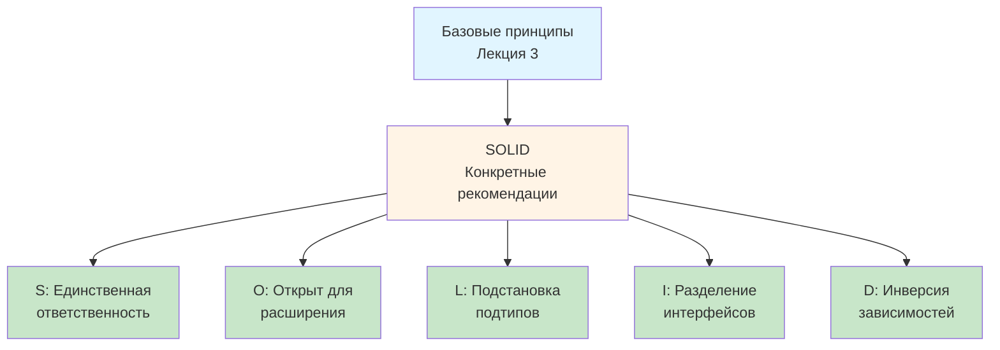

### Важное замечание

Принципы SOLID — это **рекомендации, а не догмы**. Как и [базовые принципы](../3_basic_design_principles/notes.md), они требуют вдумчивого применения. Слепое следование может привести к излишнему усложнению.

> **Цель** — создание поддерживаемого, гибкого кода, а не механическое следование правилам.

---

## S — Single Responsibility Principle (Принцип единственной ответственности)

### Определение

**Single Responsibility Principle (SRP, Принцип единственной ответственности)** гласит:

> Каждый класс должен иметь **единственную причину для изменения**.

Другими словами: один компонент = одна ответственность = одна причина изменения.

### Связь с предыдущим материалом

Из [лекции 1](../1_oop_basics/notes.md#2-инкапсуляция-encapsulation) мы помним, что **инкапсуляция** объединяет данные и поведение. SRP уточняет: объединять нужно **связанные** данные и методы, относящиеся к одной ответственности.

Из [лекции 3](../3_basic_design_principles/notes.md#1-инкапсулируйте-то-что-часто-изменяется) мы знаем об инкапсуляции изменяемого поведения. SRP конкретизирует: если у класса несколько причин для изменения, в нём смешано несколько ответственностей.

### Почему это важно?

Когда класс отвечает за много задач:
- Изменения в одной функции могут сломать другие
- Код труднее понимать и поддерживать
- Тестирование становится сложнее
- Переиспользование затруднено

**Проблема**: Класс с множественными ответственностями имеет много причин для изменения.

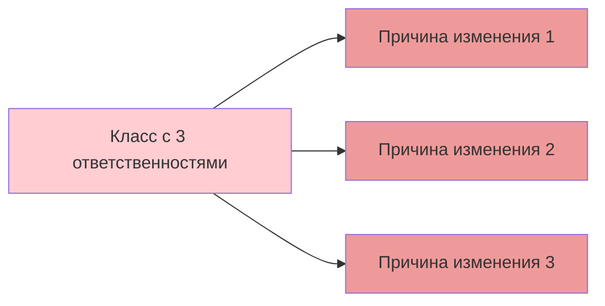

**Решение**: Разделить на независимые классы.

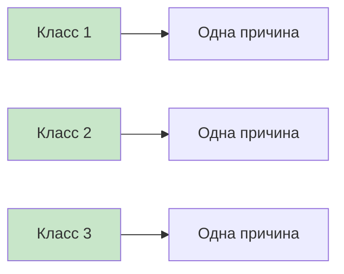

### Пример: Отчёт с навигацией и печатью

#### ❌ Неправильно: нарушение SRP

```csharp
// АНТИПАТТЕРН: Класс имеет две ответственности
public class Report
{
    public string Text { get; set; } = "";
    
    // Ответственность №1: Навигация по отчёту
    public void GoToFirstPage()
    {
        Console.WriteLine("Переход к первой странице");
    }
    
    public void GoToLastPage()
    {
        Console.WriteLine("Переход к последней странице");
    }
    
    public void GoToPage(int pageNumber)
    {
        Console.WriteLine($"Переход к странице {pageNumber}");
    }
    
    // Ответственность №2: Печать отчёта
    // Изменения в печати НЕ связаны с изменениями в навигации
    public void Print()
    {
        Console.WriteLine("Печать отчёта");
        Console.WriteLine(Text);
    }
}
```

**Проблема**: Изменение логики печати (например, добавление поддержки PDF) не связано с навигацией, но находится в одном классе.

#### ✅ Правильно: соблюдение SRP

```csharp
// Класс отвечает ТОЛЬКО за навигацию
public class Report
{
    public string Text { get; set; } = "";
    
    // Все методы относятся к одной ответственности
    public void GoToFirstPage()
    {
        Console.WriteLine("Переход к первой странице");
    }
    
    public void GoToLastPage()
    {
        Console.WriteLine("Переход к последней странице");
    }
    
    public void GoToPage(int pageNumber)
    {
        Console.WriteLine($"Переход к странице {pageNumber}");
    }
}

// Отдельный класс отвечает ТОЛЬКО за печать
public class ReportPrinter
{
    // Принимает отчёт и печатает его
    public void PrintReport(Report report)
    {
        Console.WriteLine("Печать отчёта");
        Console.WriteLine(report.Text);
    }
}

// Использование
var report = new Report { Text = "Отчёт о продажах Q4 2024..." };
report.GoToFirstPage();

var printer = new ReportPrinter();
printer.PrintReport(report);
```

**Преимущества**:
- Независимое изменение навигации и печати
- `ReportPrinter` можно переиспользовать для любых отчётов
- Легко добавить `PdfPrinter`, `ExcelPrinter` и т.д.

### Как определить нарушение SRP?

Задайте вопросы:

1. **Может ли класс измениться по нескольким независимым причинам?** → SRP нарушен
2. **Можно ли описать класс одним предложением без "и"?** → Если нет, SRP нарушен
3. **Сколько разных групп пользователей могут потребовать изменений?** → Если >1, SRP нарушен

### Заключение по SRP

SRP улучшает:
- **Структурированность** кода
- **Понимание** — легче разобраться
- **Поддержку** — изменения локализованы
- **Тестирование** — компоненты независимы

---

## O — Open/Closed Principle (Принцип открытости/закрытости)

### Определение

**Open/Closed Principle (OCP, Принцип открытости/закрытости)** гласит:

> Программные сущности должны быть **открыты для расширения**, но **закрыты для модификации**.

- **Открыты для расширения** — можно добавлять новую функциональность
- **Закрыты для модификации** — не изменяем существующий код

### Связь с предыдущими концепциями

Из [лекции 3](../3_basic_design_principles/notes.md#1-инкапсулируйте-то-что-часто-изменяется) мы знаем: изменяемое поведение нужно инкапсулировать. OCP показывает **как**: через абстракции, позволяющие расширять систему без изменения кода.

Из [лекции 3](../3_basic_design_principles/notes.md#2-программируйте-на-уровне-интерфейсов) мы знаем о программировании через интерфейсы. OCP объясняет **зачем**: чтобы новые реализации добавлялись без изменения существующего кода.

### Зачем нужен OCP?

Защита существующего кода от поломок при добавлении функциональности. Каждое изменение кода несёт риск:
- Внесения ошибок
- Поломки зависимого кода
- Нарушения контрактов

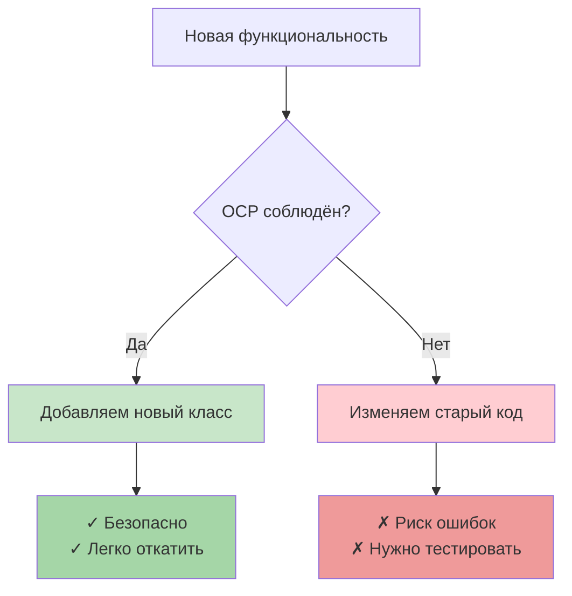

### Пример: Повар готовит блюда

#### ❌ Неправильно: нарушение OCP

```csharp
// АНТИПАТТЕРН: Для добавления блюда нужно изменять класс
public class Cook
{
    public string Name { get; set; }
    
    public Cook(string name)
    {
        Name = name;
    }
    
    // При добавлении нового блюда нужно изменять этот метод!
    public void MakeDinner(string mealType)
    {
        if (mealType == "potato")
        {
            Console.WriteLine("Готовим картофельное пюре...");
        }
        else if (mealType == "salad")
        {
            Console.WriteLine("Готовим салат...");
        }
        // Добавление супа требует изменения этого метода
        // Это нарушает OCP!
    }
}
```

**Проблема**: Закрыт для расширения — каждое новое блюдо требует изменения метода.

#### ✅ Правильно: соблюдение OCP

```csharp
// Интерфейс для любого блюда
public interface IMeal
{
    void Make();
}

// Каждое блюдо — отдельный класс
public class PotatoMeal : IMeal
{
    public void Make()
    {
        Console.WriteLine("Готовим картофельное пюре...");
    }
}

public class SaladMeal : IMeal
{
    public void Make()
    {
        Console.WriteLine("Готовим салат...");
    }
}

// Новое блюдо добавляется БЕЗ изменения существующего кода
public class SoupMeal : IMeal
{
    public void Make()
    {
        Console.WriteLine("Готовим суп...");
    }
}

// Класс Cook ЗАКРЫТ для модификации
public class Cook
{
    public string Name { get; set; }
    
    public Cook(string name)
    {
        Name = name;
    }
    
    // Работает с любым IMeal, не знает о конкретных блюдах
    public void MakeDinner(IMeal meal)
    {
        Console.WriteLine($"{Name} начинает готовить");
        meal.Make();
    }
}

// Использование
var cook = new Cook("Иван");
cook.MakeDinner(new PotatoMeal());
cook.MakeDinner(new SaladMeal());
cook.MakeDinner(new SoupMeal()); // Новое блюдо работает сразу!
```

**Преимущества**:
- Открыто для расширения: новые блюда — новые классы
- Закрыто для модификации: `Cook` не меняется
- Безопасно: добавление супа не может сломать салат

### Механизмы реализации OCP

1. **Наследование** — через виртуальные/абстрактные методы
2. **Интерфейсы** — предпочтительно в большинстве случаев
3. **Делегаты/события** — для C#

### Заключение по OCP

OCP учит:
- Проектировать системы, которые **растут добавлением** кода
- Использовать **абстракции** для точек расширения
- Защищать **стабильный код** от изменений

---

## L — Liskov Substitution Principle (Принцип подстановки Барбары Лисков)

### Определение

**Liskov Substitution Principle (LSP, Принцип подстановки Барбары Лисков)** гласит:

> Объекты подклассов должны корректно заменять объекты базового класса без нарушения работы программы.

Другими словами: если `B` наследует `A`, то объект типа `B` должен работать везде, где ожидается `A`.

### Связь с предыдущими концепциями

Из [лекции 1](../1_oop_basics/notes.md#4-наследование-inheritance) мы знаем о наследовании и отношении "is-a". LSP конкретизирует: недостаточно, чтобы "кот это животное" синтаксически — важно, чтобы кот **вёл себя** как животное.

Из [лекции 1](../1_oop_basics/notes.md#5-полиморфизм-polymorphism) мы знаем о полиморфизме. LSP обеспечивает **корректность** полиморфизма: подстановка подтипа не должна ломать программу.

### Почему это важно?

Нарушение LSP приводит к:
- Неожиданному поведению при использовании полиморфизма
- Необходимости проверок типа (`if (obj is SpecificType)`)
- Хрупкому коду, который ломается при добавлении новых подклассов

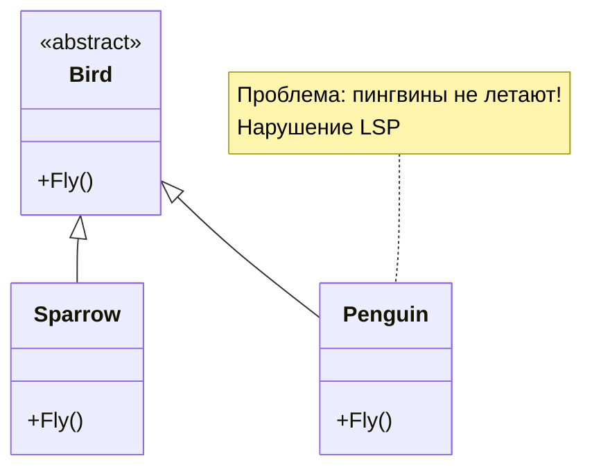

### Пример: Птицы и полёт

#### ❌ Неправильно: нарушение LSP

```csharp
// АНТИПАТТЕРН: Не все птицы могут летать
public abstract class Bird
{
    public abstract void Fly();
}

public class Sparrow : Bird
{
    public override void Fly()
    {
        Console.WriteLine("Воробей летит");
    }
}

// Проблема: Пингвин — птица, но не может летать!
public class Penguin : Bird
{
    public override void Fly()
    {
        // Что здесь написать? Пингвины не летают!
        throw new NotSupportedException("Пингвины не летают!");
    }
}

// Код, использующий птиц
public void StartMigration(IEnumerable<Bird> birds)
{
    foreach (var bird in birds)
    {
        bird.Fly(); // Упадёт на пингвине!
    }
}
```

**Проблема**: `Penguin` не может заменить `Bird` — метод `Fly()` выбрасывает исключение, что не ожидается от птицы.

#### ✅ Правильно: соблюдение LSP

```csharp
// Базовый интерфейс для всех существ
public interface ICreature
{
    void Die();
}

// Отдельный интерфейс для УМЕЮЩИХ летать
public interface IFlyingCreature : ICreature
{
    void FlyTo(string destination);
}

// Базовый класс птиц
public abstract class Bird : ICreature
{
    public void Die()
    {
        Console.WriteLine("Птица погибла");
    }
}

// Воробей УМЕЕТ летать
public class Sparrow : Bird, IFlyingCreature
{
    public void FlyTo(string destination)
    {
        Console.WriteLine($"Воробей летит в {destination}");
    }
}

// Пингвин НЕ УМЕЕТ летать — не реализует IFlyingCreature
public class Penguin : Bird
{
    // Пингвин просто птица, не летающая
}

// Функция работает только с летающими существами
public void StartMigration(IEnumerable<IFlyingCreature> creatures)
{
    foreach (var creature in creatures)
    {
        creature.FlyTo("Юг"); // Все гарантированно умеют летать
    }
}

// Использование
var flyingCreatures = new IFlyingCreature[]
{
    new Sparrow(),
    // new Penguin() // Ошибка компиляции — правильно!
};
StartMigration(flyingCreatures);
```

**Преимущества**:
- Компилятор не позволит передать нелетающую птицу
- Нет неожиданных исключений
- Интерфейсы точно описывают возможности

### Формальные требования LSP

1. **Типы параметров** — в подклассе не должны быть более специфичными
2. **Возвращаемые типы** — могут быть более специфичными
3. **Исключения** — подкласс не должен выбрасывать новые типы исключений
4. **Предусловия** — не могут усиливаться в подклассе
5. **Постусловия** — не могут ослабляться в подклассе
6. **Инварианты** — должны сохраняться

### Пример: Прямоугольник и квадрат

Классическая проблема нарушения LSP:

#### ❌ Неправильно

```csharp
// Математически квадрат — частный случай прямоугольника
public class Rectangle
{
    public virtual int Width { get; set; }
    public virtual int Height { get; set; }
    
    public int GetArea() => Width * Height;
}

public class Square : Rectangle
{
    // При установке ширины меняем и высоту
    public override int Width
    {
        get => base.Width;
        set
        {
            base.Width = value;
            base.Height = value; // Нарушение ожиданий!
        }
    }
    
    public override int Height
    {
        get => base.Height;
        set
        {
            base.Height = value;
            base.Width = value; // Нарушение ожиданий!
        }
    }
}

// Код, который работает с прямоугольниками
public void TestRectangle(Rectangle rect)
{
    rect.Width = 5;
    rect.Height = 10;
    // Ожидаем площадь 50
    if (rect.GetArea() != 50)
        throw new Exception("Ошибка! Площадь должна быть 50");
}

// Проблема
var square = new Square();
TestRectangle(square); // Выбросит исключение!
```

**Проблема**: `Square` нарушает ожидания от `Rectangle` — установка ширины меняет высоту.

#### ✅ Правильно

```csharp
// Общий интерфейс для фигур
public interface IShape
{
    int GetArea();
}

// Прямоугольник — независимая фигура
public class Rectangle : IShape
{
    public int Width { get; set; }
    public int Height { get; set; }
    
    public int GetArea() => Width * Height;
}

// Квадрат — независимая фигура
public class Square : IShape
{
    public int Side { get; set; }
    
    public int GetArea() => Side * Side;
}
```

**Решение**: Не наследовать квадрат от прямоугольника, использовать общий интерфейс.

### Заключение по LSP

LSP обеспечивает:
- **Корректность** полиморфизма
- **Предсказуемость** поведения подклассов
- **Надёжность** при замене объектов
- **Правильность** иерархий наследования

---

## I — Interface Segregation Principle (Принцип разделения интерфейсов)

### Определение

**Interface Segregation Principle (ISP, Принцип разделения интерфейсов)** гласит:

> Клиенты не должны зависеть от методов, которые они не используют.

Другими словами: лучше много **узких специализированных** интерфейсов, чем один **широкий универсальный**.

### Связь с предыдущими концепциями

ISP — это, по сути, **SRP для интерфейсов**. Если SRP говорит "один класс — одна ответственность", то ISP говорит "один интерфейс — одна роль".

### Почему это важно?

Проблемы широких интерфейсов:
- Классы вынуждены реализовывать ненужные методы
- Изменения в интерфейсе затрагивают всех клиентов
- Нарушается SRP

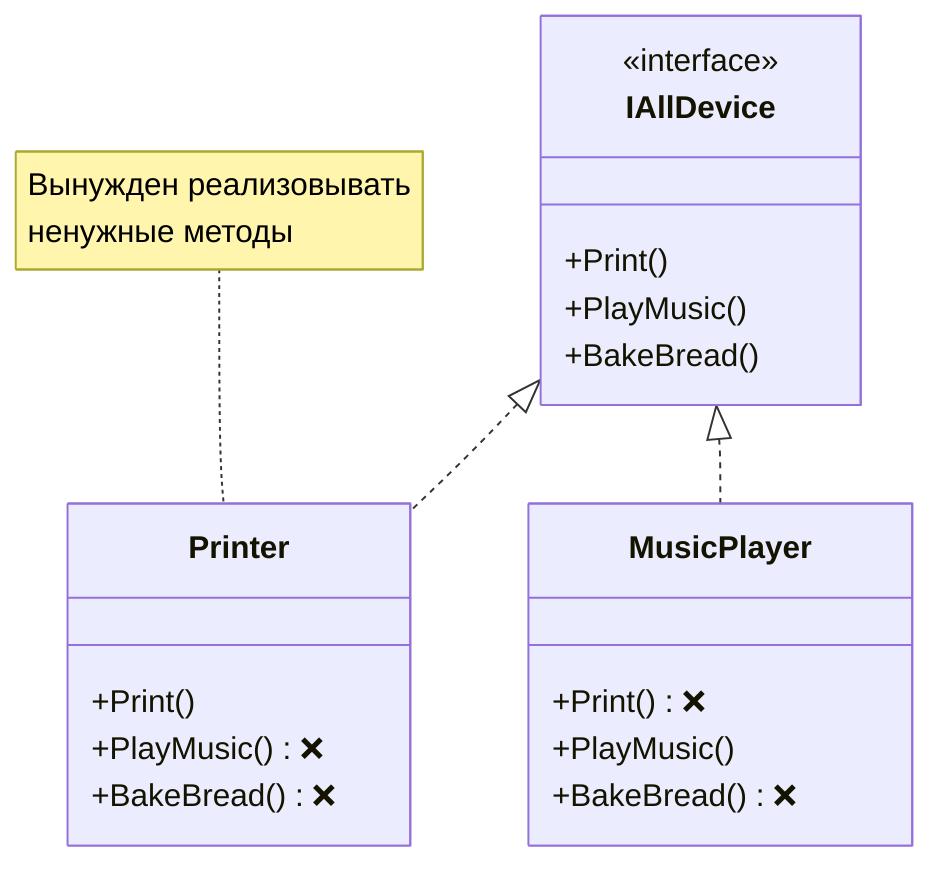

### Пример: Универсальное устройство

#### ❌ Неправильно: нарушение ISP

```csharp
// АНТИПАТТЕРН: Один интерфейс для всех устройств
public interface IAllDevice
{
    void Print();
    void PlayMusic();
    void BakeBread();
}

// Принтер вынужден реализовывать ненужные методы
public class Printer : IAllDevice
{
    public void Print()
    {
        Console.WriteLine("Печать документа");
    }
    
    // Методы не нужны, но обязаны быть реализованы!
    public void PlayMusic()
    {
        throw new NotSupportedException();
    }
    
    public void BakeBread()
    {
        throw new NotSupportedException();
    }
}
```

**Проблема**: Принтер зависит от методов, которые ему не нужны.

#### ✅ Правильно: соблюдение ISP

```csharp
// Разделяем на узкие интерфейсы
public interface IPrinter
{
    void Print();
}

public interface IMusicPlayer
{
    void PlayMusic();
}

public interface IBakery
{
    void BakeBread();
}

// Каждый класс реализует только нужные интерфейсы
public class Printer : IPrinter
{
    public void Print()
    {
        Console.WriteLine("Печать документа");
    }
}

public class MusicPlayer : IMusicPlayer
{
    public void PlayMusic()
    {
        Console.WriteLine("Воспроизведение музыки");
    }
}

// Многофункциональное устройство реализует несколько интерфейсов
public class MultiFunctionDevice : IPrinter, IMusicPlayer
{
    public void Print()
    {
        Console.WriteLine("Печать");
    }
    
    public void PlayMusic()
    {
        Console.WriteLine("Музыка");
    }
}
```

**Преимущества**:
- Классы реализуют только нужные методы
- Изменения в одном интерфейсе не затрагивают другие
- Гибкость — легко комбинировать интерфейсы

### Пример: Система сообщений

#### ❌ Неправильно

```csharp
// АНТИПАТТЕРН: Широкий интерфейс сообщения
public interface IMessage
{
    void Send();
    string Text { get; set; }
    string Subject { get; set; } // Не нужно для SMS!
    string ToAddress { get; set; }
    string FromAddress { get; set; }
    byte[] Voice { get; set; } // Не нужно для Email!
}

// SMS вынужден реализовывать Subject и Voice
public class SmsMessage : IMessage
{
    public string Text { get; set; }
    public string ToAddress { get; set; }
    public string FromAddress { get; set; }
    
    // Ненужные свойства!
    public string Subject
    {
        get => throw new NotImplementedException();
        set => throw new NotImplementedException();
    }
    
    public byte[] Voice
    {
        get => throw new NotImplementedException();
        set => throw new NotImplementedException();
    }
    
    public void Send()
    {
        Console.WriteLine($"SMS: {Text}");
    }
}
```

#### ✅ Правильно

```csharp
// Базовый интерфейс сообщения
public interface IMessage
{
    void Send();
    string ToAddress { get; set; }
    string FromAddress { get; set; }
}

// Расширение для текстовых сообщений
public interface ITextMessage : IMessage
{
    string Text { get; set; }
}

// Расширение для email с темой
public interface IEmailMessage : ITextMessage
{
    string Subject { get; set; }
}

// Расширение для голосовых сообщений
public interface IVoiceMessage : IMessage
{
    byte[] Voice { get; set; }
}

// Каждый класс реализует только нужные интерфейсы
public class SmsMessage : ITextMessage
{
    public string Text { get; set; }
    public string ToAddress { get; set; }
    public string FromAddress { get; set; }
    
    public void Send()
    {
        Console.WriteLine($"SMS: {Text}");
    }
}

public class EmailMessage : IEmailMessage
{
    public string Text { get; set; }
    public string Subject { get; set; }
    public string ToAddress { get; set; }
    public string FromAddress { get; set; }
    
    public void Send()
    {
        Console.WriteLine($"Email: {Subject} - {Text}");
    }
}

public class VoiceMessage : IVoiceMessage
{
    public byte[] Voice { get; set; }
    public string ToAddress { get; set; }
    public string FromAddress { get; set; }
    
    public void Send()
    {
        Console.WriteLine($"Voice message: {Voice.Length} bytes");
    }
}
```

### Заключение по ISP

ISP обеспечивает:
- **Гибкость** — классы зависят только от нужных методов
- **Простоту** — интерфейсы понятны и специализированы
- **Расширяемость** — легко добавлять новые интерфейсы

---

## D — Dependency Inversion Principle (Принцип инверсии зависимостей)

### Определение

**Dependency Inversion Principle (DIP, Принцип инверсии зависимостей)** гласит:

> 1. Модули верхнего уровня не должны зависеть от модулей нижнего уровня. Оба должны зависеть от абстракций.
> 2. Абстракции не должны зависеть от деталей. Детали должны зависеть от абстракций.

Другими словами: зависимости должны быть направлены на **интерфейсы**, а не на **конкретные реализации**.

### Связь с предыдущими концепциями

Из [лекции 3](../3_basic_design_principles/notes.md#2-программируйте-на-уровне-интерфейсов) мы знаем: "программируйте на уровне интерфейсов". DIP — это формализация этого принципа с акцентом на **направление зависимостей**.

### Уровни в архитектуре

Обычно выделяют:
- **Высокий уровень** — бизнес-логика, сложные операции
- **Низкий уровень** — базовые операции (БД, файлы, сеть)

**Проблема традиционного подхода**: высокий уровень зависит от низкого.

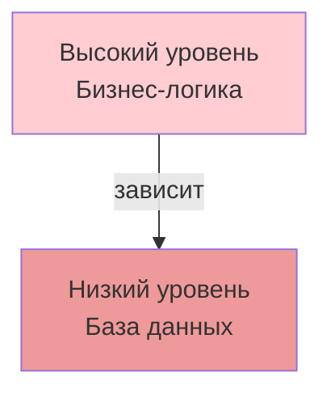

**Решение DIP**: оба зависят от абстракций.

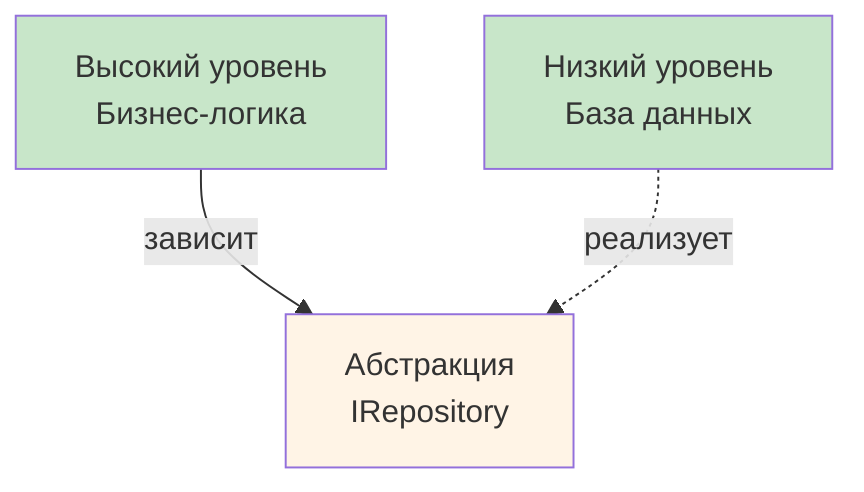

### Пример: Книга и печать

#### ❌ Неправильно: нарушение DIP

```csharp
// АНТИПАТТЕРН: Высокий уровень зависит от низкого
public class Book
{
    public string Text { get; set; }
    
    // Прямая зависимость от конкретного класса!
    public ConsolePrinter Printer { get; set; }
    
    public void Print()
    {
        Printer.Print(Text);
    }
}

// Низкоуровневый класс
public class ConsolePrinter
{
    public void Print(string text)
    {
        Console.WriteLine(text);
    }
}
```

**Проблема**: 
- `Book` зависит от конкретной реализации `ConsolePrinter`
- Нельзя заменить на другой принтер без изменения `Book`

#### ✅ Правильно: соблюдение DIP

```csharp
// Абстракция (высокий уровень определяет, что ему нужно)
public interface IPrinter
{
    void Print(string text);
}

// Высокоуровневый класс зависит от абстракции
public class Book
{
    public string Text { get; set; }
    public IPrinter Printer { get; set; }
    
    public Book(IPrinter printer)
    {
        Printer = printer;
    }
    
    public void Print()
    {
        Printer.Print(Text);
    }
}

// Низкоуровневые классы реализуют абстракцию
public class ConsolePrinter : IPrinter
{
    public void Print(string text)
    {
        Console.WriteLine("Печать на консоли:");
        Console.WriteLine(text);
    }
}

public class HtmlPrinter : IPrinter
{
    public void Print(string text)
    {
        Console.WriteLine("Печать в HTML:");
        Console.WriteLine($"<html><body>{text}</body></html>");
    }
}

// Использование
var book = new Book(new ConsolePrinter())
{
    Text = "Война и мир"
};
book.Print();

// Легко заменить принтер
book.Printer = new HtmlPrinter();
book.Print();
```

**Преимущества**:
- `Book` не зависит от конкретных принтеров
- Легко добавлять новые принтеры
- Высокий и низкий уровни развиваются независимо

### Пример: Отчёты и база данных

#### ❌ Неправильно

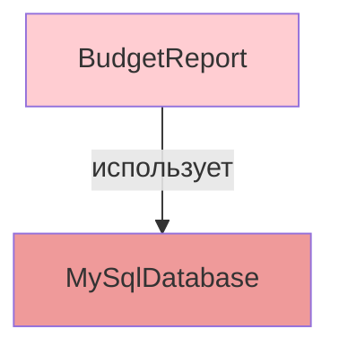

```csharp
// АНТИПАТТЕРН
public class BudgetReport
{
    private MySqlDatabase _database;
    
    public BudgetReport()
    {
        _database = new MySqlDatabase();
    }
    
    public void Generate()
    {
        var data = _database.GetData();
        // Генерация отчёта...
    }
}
```

#### ✅ Правильно

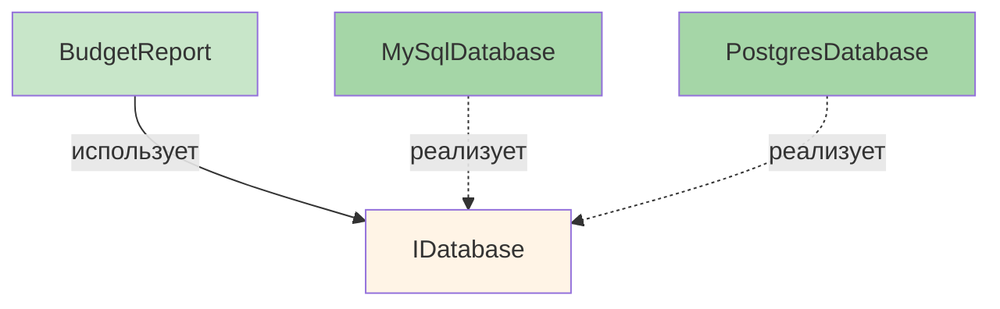

```csharp
// Абстракция определена высоким уровнем
public interface IDatabase
{
    string GetData();
}

// Высокоуровневый класс
public class BudgetReport
{
    private readonly IDatabase _database;
    
    // Зависимость внедряется через конструктор
    public BudgetReport(IDatabase database)
    {
        _database = database;
    }
    
    public void Generate()
    {
        var data = _database.GetData();
        // Генерация отчёта...
    }
}

// Низкоуровневые реализации
public class MySqlDatabase : IDatabase
{
    public string GetData()
    {
        return "Данные из MySQL";
    }
}

public class PostgresDatabase : IDatabase
{
    public string GetData()
    {
        return "Данные из PostgreSQL";
    }
}

// Использование
var report1 = new BudgetReport(new MySqlDatabase());
var report2 = new BudgetReport(new PostgresDatabase());
```

### Заключение по DIP

DIP обеспечивает:
- **Независимость** модулей
- **Гибкость** — легко заменять реализации
- **Тестируемость** — легко использовать моки
- **Правильное направление** зависимостей

---

## Заключение: применение SOLID на практике

### Взаимосвязь принципов

SOLID принципы **дополняют** друг друга:

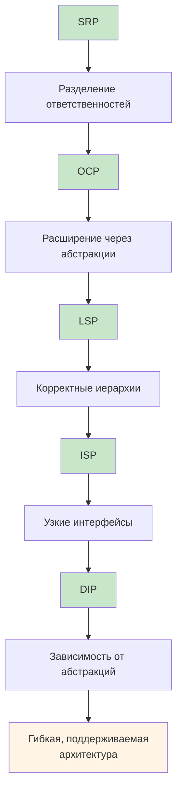

### Когда применять SOLID?

**Применяйте**, когда:
- Код становится сложным
- Появляются множественные причины изменений
- Добавление функций требует изменения существующего кода
- Сложно тестировать

**НЕ применяйте** слепо:
- Не усложняйте простой код
- Не создавайте избыточные абстракции "на будущее"
- Баланс между гибкостью и простотой важен

### Практические советы

1. **Начинайте с SRP** — самый фундаментальный принцип
2. **Используйте OCP** для точек расширения
3. **Проверяйте LSP** при проектировании иерархий
4. **Применяйте ISP** вместо широких интерфейсов
5. **Следуйте DIP** для важных зависимостей

### Итоговая визуализация процесса рефакторинга

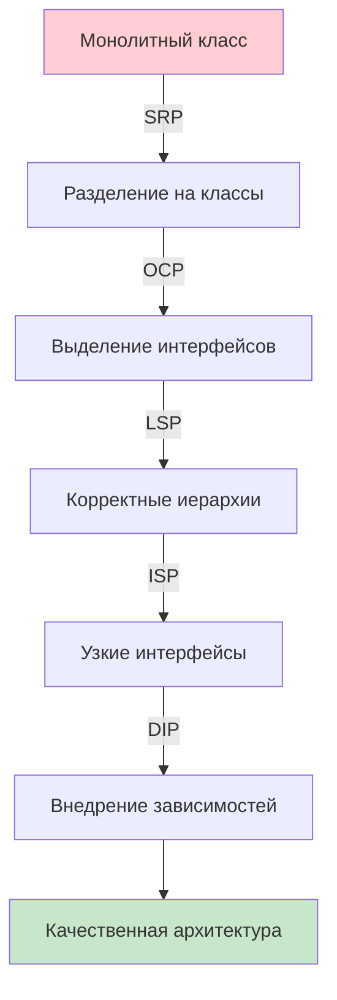

### Ключевые выводы

SOLID принципы помогают создавать:
- **Гибкие** системы, легко адаптирующиеся к изменениям
- **Понятный** код с чёткими ответственностями
- **Тестируемые** компоненты
- **Расширяемые** архитектуры
- **Поддерживаемый** код на долгосрочную перспективу

> **Помните**: SOLID — это инструменты, а не цель. Цель — качественное программное обеспечение, которое легко понимать, изменять и расширять.

### Связь с будущим материалом

В следующих лекциях мы изучим:
- **GRASP** — дополнительные принципы проектирования
- **Паттерны проектирования** — готовые решения, построенные на SOLID принципах

SOLID создаёт фундамент для понимания паттернов и построения качественной архитектуры.
