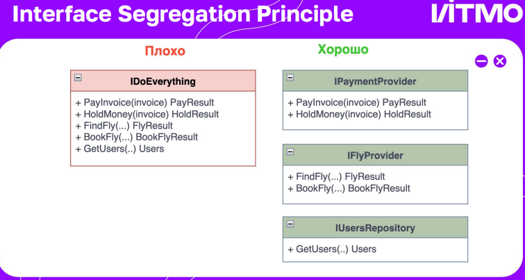

# Принципы SOLID

## Содержание

- [S — Single Responsibility Principle](#s--single-responsibility-principle)
- [O — Open/Closed Principle](#o--openclosed-principle)
- [L — Liskov Substitution Principle](#l--liskov-substitution-principle)
- [I — Interface Segregation Principle](#i--interface-segregation-principle)
- [D — Dependency Inversion Principle](#d--dependency-inversion-principle)

## Введение

Рассмотрим пять фундаментальных принципов проектирования объектно-ориентированных систем, объединённых акронимом **SOLID**. Эти принципы были сформулированы Робертом Мартином (Robert Martin, также известным как Uncle Bob) в начале 2000-х годов и с тех пор стали краеугольным камнем качественной архитектуры программного обеспечения.

**SOLID** — это акроним, составленный из первых букв пяти принципов:

- **S** — Single Responsibility Principle (Принцип единственной ответственности)
- **O** — Open/Closed Principle (Принцип открытости/закрытости)
- **L** — Liskov Substitution Principle (Принцип подстановки Барбары Лисков)
- **I** — Interface Segregation Principle (Принцип разделения интерфейса)
- **D** — Dependency Inversion Principle (Принцип инверсии зависимостей)

### Зачем нужны принципы SOLID?

Главная цель этих принципов — создание гибкой, поддерживаемой и масштабируемой архитектуры программного обеспечения. Применение SOLID позволяет:

- **Повысить гибкость архитектуры** — код становится легче адаптировать под изменяющиеся требования
- **Уменьшить связность между компонентами** (coupling) — модули становятся более независимыми друг от друга
- **Облегчить повторное использование кода** — компоненты можно использовать в разных контекстах
- **Упростить тестирование** — изолированные компоненты проще покрывать тестами
- **Снизить стоимость внесения изменений** — модификация одной части системы не требует переписывания других

### Принципы vs Паттерны

Важно понимать различие между принципами и паттернами проектирования:

- **Принципы SOLID** — это фундаментальные правила и концепции, которые определяют, как должен быть устроен качественный код на уровне классов и интерфейсов. Они отвечают на вопрос "как проектировать код правильно?".

- **Паттерны проектирования** (Design Patterns) — это конкретные, проверенные временем решения типовых задач. Они отвечают на вопрос "как решить конкретную проблему?".

Принципы SOLID более абстрактны и универсальны, в то время как паттерны представляют собой готовые шаблоны решений. Хорошие паттерны проектирования, как правило, соответствуют принципам SOLID. 

## S — Single Responsibility Principle

**Single Responsibility Principle** (SRP, Принцип единственной ответственности) — первый и один из важнейших принципов SOLID. Он гласит:

> **Проектировать типы нужно таким образом, чтобы у них была единственная причина для изменения.**

Сформулируем это более кратко: **каждый класс должен иметь только одну ответственность и одну причину для изменения**.

### Зачем нужен этот принцип?

### Зачем нужен этот принцип?

Принцип единственной ответственности предназначен для борьбы со сложностью программных систем.

Когда ваше приложение содержит всего 200 строк кода, архитектура как таковая не имеет большого значения — достаточно аккуратно организовать несколько методов. Проблемы начинаются, когда система растёт и увеличивается в масштабах.

По мере роста класса возникают следующие проблемы:

- **Когнитивная перегрузка** — класс перестаёт помещаться в голове, количество концепций превышает возможности рабочей памяти
- **Затруднённая навигация** — сложно найти нужный код среди множества не связанных друг с другом методов
- **Повышенный риск ошибок** — изменяя одну функциональность, легко случайно затронуть другую
- **Сложное тестирование** — трудно изолировать отдельные части для unit-тестирования
- **Потеря контроля** — становится сложно понять, что делает класс и как он работает

Если класс делает слишком много вещей одновременно, вам приходится изменять его каждый раз, когда одна из этих вещей меняется. При этом существует риск сломать остальные части класса, которые вы даже не планировали трогать.

### Визуальная иллюстрация проблемы

Рассмотрим проблему на наглядном примере:


Здесь одна функция или класс выполняет слишком много разнородных задач одновременно. Правильный подход — разбить функциональность на несколько компонентов, каждый из которых отвечает за свою конкретную задачу:


Идея в том, что мы разбиваем сложную сущность, которая делает много разного, на несколько составных частей, каждая из которых решает одну конкретную задачу.

### Первый взгляд: одна задача на класс

### Первый взгляд: одна задача на класс

Начнём с простого понимания принципа: каждый метод, класс или модуль должен выполнять только одну конкретную задачу. Если объект отвечает за несколько разных операций, вероятность ошибок возрастает — внося изменения в одну операцию, вы можете непреднамеренно затронуть другие.

#### Пример: класс отчёта

Допустим, нам нужен класс отчёта, по которому можно перемещаться по страницам и который можно выводить на печать. Наивная реализация могла бы выглядеть так:

```csharp
// ❌ ПЛОХО: Класс имеет две разные ответственности
class Report
{
    public string Text { get; set; } = "";
    
    // Ответственность 1: Навигация по отчёту
    public void GoToFirstPage() =>
        Console.WriteLine("Переход к первой странице");
 
    public void GoToLastPage() =>
        Console.WriteLine("Переход к последней странице");
 
    public void GoToPage(int pageNumber) =>
        Console.WriteLine($"Переход к странице {pageNumber}");
 
    // Ответственность 2: Вывод отчёта
    public void Print()
    {
        Console.WriteLine("Печать отчета");
        Console.WriteLine(Text);
    }
}
```

**Проблема:** Первые три метода относятся к навигации по отчёту — это одна функциональная область. Метод `Print()` относится к выводу — это совершенно другая область ответственности.

**Последствия нарушения SRP:**
- Если мы захотим добавить печать в HTML, PDF или отправку на принтер, нам придётся изменять класс `Report`
- Изменения в логике печати могут случайно затронуть навигацию
- Класс становится сложнее тестировать — приходится mock'ировать вывод при тестировании навигации
- Нарушается принцип открытости/закрытости — класс приходится модифицировать вместо расширения

**Решение:** Вынести каждую ответственность в отдельный компонент.

```csharp
// ✅ ХОРОШО: Каждый класс имеет одну ответственность
class Report
{
    public string Text { get; set; } = "";
    
    // Только навигация — единственная ответственность
    public void GoToFirstPage() =>
        Console.WriteLine("Переход к первой странице");
 
    public void GoToLastPage() =>
        Console.WriteLine("Переход к последней странице");
 
    public void GoToPage(int pageNumber) =>
        Console.WriteLine($"Переход к странице {pageNumber}");    
}

// Отдельный класс для печати — его единственная ответственность
class Printer
{
    public void PrintReport(Report report)
    {
        Console.WriteLine("Печать отчета");
        Console.WriteLine(report.Text);
    }
}
```

Теперь печать вынесена в отдельный класс `Printer`. Каждый класс имеет чёткую, единственную ответственность:
- `Report` — управление содержимым и навигацией по отчёту
- `Printer` — вывод отчёта на различные носители

### Ответственность может быть скрыта внутри метода

Важно понимать, что ответственности в классах не всегда чётко группируются по методам. Часто один метод может содержать несколько разных ответственностей, смешанных вместе. Рассмотрим пример:

```csharp
// ❌ ПЛОХО: Метод Process содержит множество ответственностей
class Phone
{
    public string Model { get; }
    public int Price { get; }
    
    public Phone(string model, int price)
    {
        Model = model;
        Price = price;
    }
}
 
class MobileStore
{
    List<Phone> phones = new();
    
    public void Process()
    {
        // Ответственность 1: Ввод данных от пользователя
        Console.WriteLine("Введите модель:");
        string? model = Console.ReadLine();
        Console.WriteLine("Введите цену:");
 
        // Ответственность 2: Валидация введённых данных
        bool result = int.TryParse(Console.ReadLine(), out var price);
 
        if (result == false || price <= 0 || string.IsNullOrEmpty(model))
        {
            throw new Exception("Некорректно введены данные");
        }
        else
        {
            // Ответственность 3: Создание объекта Phone
            phones.Add(new Phone(model, price));
            
            // Ответственность 4: Сохранение данных в файл
            using (StreamWriter writer = new StreamWriter("store.txt", true))
            {
                writer.WriteLine(model);
                writer.WriteLine(price);
            }
            Console.WriteLine("Данные успешно обработаны");
        }
    }
}
```

**Проблема:** Класс `MobileStore` с единственным методом `Process` содержит **как минимум четыре разные ответственности**:

1. **Ввод данных** — взаимодействие с пользователем через консоль
2. **Валидация** — проверка корректности введённых данных
3. **Создание объектов** — конструирование экземпляра `Phone`
4. **Сохранение** — запись данных в файловую систему

Класс знает абсолютно всё: как получать данные, как их валидировать, как создавать объекты и как их сохранять. Это делает код хрупким и сложным для изменения.

**Решение:** Инкапсулировать каждую ответственность в отдельном классе с чётким интерфейсом.

```csharp
// ✅ ХОРОШО: Каждая ответственность вынесена в отдельный класс

class Phone
{
    public string Model { get; }
    public int Price { get; }
    
    public Phone(string model, int price)
    {
        Model = model;
        Price = price;
    }
}

// Класс MobileStore теперь только координирует работу других компонентов
class MobileStore
{
    List<Phone> phones = new List<Phone>();
 
    public IPhoneReader Reader { get; set; }
    public IPhoneBinder Binder { get; set; }
    public IPhoneValidator Validator { get; set; }
    public IPhoneSaver Saver { get; set; }
 
    public MobileStore(IPhoneReader reader, IPhoneBinder binder, 
                       IPhoneValidator validator, IPhoneSaver saver)
    {
        Reader = reader;
        Binder = binder;
        Validator = validator;
        Saver = saver;
    }
 
    public void Process()
    {
        // Координация работы компонентов — единственная ответственность
        string?[] data = Reader.GetInputData();
        Phone phone = Binder.CreatePhone(data);
        
        if (Validator.IsValid(phone))
        {
            phones.Add(phone);
            Saver.Save(phone, "store.txt");
            Console.WriteLine("Данные успешно обработаны");
        }
        else
        {
            Console.WriteLine("Некорректные данные");
        }
    }
}

// Интерфейс для чтения данных
interface IPhoneReader
{
    string?[] GetInputData();
}

// Конкретная реализация — чтение из консоли
class ConsolePhoneReader : IPhoneReader
{
    public string?[] GetInputData()
    {
        Console.WriteLine("Введите модель:");
        string? model = Console.ReadLine();
        Console.WriteLine("Введите цену:");
        string? price = Console.ReadLine();
        return new string?[] { model, price };
    }
}

// Интерфейс для создания объекта Phone из сырых данных
interface IPhoneBinder
{
    Phone CreatePhone(string?[] data);
}

// Конкретная реализация — создание Phone с базовой валидацией парсинга
class GeneralPhoneBinder : IPhoneBinder
{
    public Phone CreatePhone(string?[] data)
    {
        // Проверяем, что данные в правильном формате
        if (data is { Length: 2 } && 
            data[0] is string model && model.Length > 0 && 
            int.TryParse(data[1], out var price))
        { 
            return new Phone(model, price);
        }
        throw new Exception("Ошибка создания Phone. Некорректные данные");
    }
}

// Интерфейс для бизнес-валидации объекта Phone
interface IPhoneValidator
{
    bool IsValid(Phone phone);
}

// Конкретная реализация — проверка бизнес-правил
class GeneralPhoneValidator : IPhoneValidator
{
    public bool IsValid(Phone phone) =>
        !string.IsNullOrEmpty(phone.Model) && phone.Price > 0;
}

// Интерфейс для сохранения данных
interface IPhoneSaver
{
    void Save(Phone phone, string fileName);
}

// Конкретная реализация — сохранение в текстовый файл
class TextPhoneSaver : IPhoneSaver
{
    public void Save(Phone phone, string fileName)
    {
        using StreamWriter writer = new StreamWriter(fileName, true);
        writer.WriteLine(phone.Model);
        writer.WriteLine(phone.Price);
    }
}
```

**Использование:**

```csharp
MobileStore store = new MobileStore(
    new ConsolePhoneReader(),      // Читаем из консоли
    new GeneralPhoneBinder(),      // Создаём объект
    new GeneralPhoneValidator(),   // Валидируем
    new TextPhoneSaver());         // Сохраняем в файл

store.Process();
```

**Преимущества рефакторинга:**

1. **Гибкость** — легко заменить консольный ввод на GUI, API или тесты
2. **Тестируемость** — каждый компонент можно тестировать изолированно
3. **Переиспользование** — `TextPhoneSaver` можно использовать в других частях приложения
4. **Расширяемость** — добавление новых валидаторов или форматов сохранения не требует изменения существующего кода
5. **Ясность** — каждый класс имеет чёткое назначение

**Цена:**
- Код стал объёмнее (больше файлов и классов)
- Требуется больше времени на начальное проектирование

Однако при росте системы эти затраты окупаются многократно за счёт упрощения поддержки и развития.

### Более глубокое понимание: единственная причина для изменения

Теперь вернёмся к формальному определению SRP: **у класса должна быть единственная причина для изменения**. Это более точная и глубокая формулировка, чем просто "одна задача на класс".

Что означает "причина для изменения"? Это означает, что класс должен изменяться только по одной конкретной причине, связанной с одним аспектом бизнес-логики или требований.

#### Пример: генератор отчётов

Рассмотрим пример класса, который нарушает этот принцип:

```csharp
// ❌ ПЛОХО: Две причины для изменения класса
public record OperationResult(string Title, string Data, DateTime Timestamp);

public class ReportGenerator
{
    // Метод 1: Генерация Excel-отчёта
    public void GenerateExcelReport(OperationResult result)    
    {
        // Логика создания Excel-файла
        Console.WriteLine($"Создание Excel: {result.Title}");
        // ... реализация ...
    }
    
    // Метод 2: Генерация PDF-отчёта
    public void GeneratePdfReport(OperationResult result)    
    {
        // Логика создания PDF-файла
        Console.WriteLine($"Создание PDF: {result.Title}");
        // ... реализация ...
    }
}
```

**Анализ причин для изменения:**

Этот класс имеет **две разные причины для изменения**:

1. **Добавление нового формата отчёта** — если нам нужен EPUB, FB2 или HTML отчёт, мы будем модифицировать класс `ReportGenerator`
2. **Изменение логики генерации существующего формата** — если изменятся требования к PDF или Excel, мы опять будем модифицировать `ReportGenerator`

Каждая причина связана с разным аспектом системы, что нарушает SRP.

**Правильное решение:**

```csharp
// ✅ ХОРОШО: Каждый класс имеет единственную причину для изменения
public record OperationResult(string Title, string Data, DateTime Timestamp);

// Абстракция для любого генератора отчётов
public interface IReportGenerator
{
    void GenerateReport(OperationResult result);
}

// Генератор Excel-отчётов — изменяется только при изменении логики Excel
public class ExcelReportGenerator : IReportGenerator
{
    public void GenerateReport(OperationResult result)    
    {
        Console.WriteLine($"Создание Excel: {result.Title}");
        // Логика, специфичная для Excel
        CreateWorkbook(result);
        FormatCells(result);
        SaveExcelFile(result.Title);
    }
    
    private void CreateWorkbook(OperationResult result) { /* ... */ }
    private void FormatCells(OperationResult result) { /* ... */ }
    private void SaveExcelFile(string title) { /* ... */ }
}

// Генератор PDF-отчётов — изменяется только при изменении логики PDF
public class PdfReportGenerator : IReportGenerator
{
    public void GenerateReport(OperationResult result)    
    {
        Console.WriteLine($"Создание PDF: {result.Title}");
        // Логика, специфичная для PDF
        CreatePdfDocument(result);
        AddContent(result);
        SavePdfFile(result.Title);
    }
    
    private void CreatePdfDocument(OperationResult result) { /* ... */ }
    private void AddContent(OperationResult result) { /* ... */ }
    private void SavePdfFile(string title) { /* ... */ }
}

// Если нужен новый формат — просто добавляем новый класс,
// не изменяя существующие
public class HtmlReportGenerator : IReportGenerator
{
    public void GenerateReport(OperationResult result)    
    {
        Console.WriteLine($"Создание HTML: {result.Title}");
        // Логика, специфичная для HTML
    }
}
```

**Использование:**

```csharp
var result = new OperationResult("Квартальный отчёт", "Данные...", DateTime.Now);

// Гибкий выбор генератора в runtime
IReportGenerator generator = GetReportGenerator(userPreference);
generator.GenerateReport(result);

IReportGenerator GetReportGenerator(string format) => format switch
{
    "excel" => new ExcelReportGenerator(),
    "pdf" => new PdfReportGenerator(),
    "html" => new HtmlReportGenerator(),
    _ => throw new ArgumentException($"Неизвестный формат: {format}")
};
```

**Теперь каждый класс имеет только одну причину для изменения:**
- `ExcelReportGenerator` изменяется только при изменении требований к Excel-отчётам
- `PdfReportGenerator` изменяется только при изменении требований к PDF-отчётам
- Добавление нового формата не требует изменения существующих классов

Такое определение тесно связано с концепцией "одна задача на класс", но даёт более чёткий критерий: **подумайте, что вы можете захотеть изменить в будущем. Если причин для изменения больше одной — код нужно рефакторить**. 

### Преимущества и недостатки соблюдения SRP

#### Преимущества соблюдения SRP:

1. **Упрощение понимания кода** — каждый класс решает одну задачу, его проще держать в голове
2. **Упрощение тестирования** — изолированные компоненты легко покрыть unit-тестами
3. **Снижение связности** (coupling) — компоненты меньше зависят друг от друга
4. **Упрощение внесения изменений** — изменения в одной области не затрагивают другие
5. **Повышение переиспользуемости** — узкоспециализированные классы проще использовать в разных контекстах
6. **Облегчение параллельной разработки** — разные команды могут работать над разными компонентами

#### Недостатки/цена соблюдения SRP:

1. **Увеличение количества классов** — больше файлов в проекте
2. **Повышение начальной сложности** — требуется больше времени на проектирование
3. **Риск over-engineering** — избыточное разделение ответственностей там, где это не нужно
4. **Сложнее навигация** — нужно прыгать между файлами, чтобы увидеть полную картину

**Когда можно не следовать SRP:**
- В простых скриптах и прототипах
- В маленьких проектах (< 1000 строк)
- Когда ответственности настолько тесно связаны, что их разделение создаст искусственную сложность

**Золотое правило:** Применяйте SRP, когда видите реальную проблему или предвидите её в ближайшем будущем. Не делайте преждевременное усложнение "на всякий случай".
### Типичные нарушения SRP

Нарушения принципа единственной ответственности часто встречаются в определённых паттернах. Рассмотрим наиболее распространённые случаи.

#### 1. Смешивание уровней абстракции

Один из самых частых случаев — когда класс смешивает в себе функциональность разных уровней:

**Бизнес-логика + пользовательский интерфейс:**

```csharp
// ❌ ПЛОХО: Класс смешивает вычисления и вывод
class Calculator
{
    public void CalculateAndShow(int a, int b)
    {
        int result = a + b;  // Бизнес-логика
        Console.WriteLine($"Результат: {result}");  // UI
    }
}
```

**Бизнес-логика + работа с данными:**

```csharp
// ❌ ПЛОХО: Класс смешивает бизнес-логику и хранение данных
class Order
{
    public decimal TotalPrice { get; set; }
    
    public decimal CalculateDiscount()
    {
        // Бизнес-логика расчёта скидки
        return TotalPrice * 0.1m;
    }
    
    public void SaveToDatabase()
    {
        // Сохранение в БД — другой уровень ответственности!
        using var connection = new SqlConnection("...");
        // ... SQL запросы ...
    }
}
```

**Правильный подход — разделение по слоям:**
- **Presentation Layer** (UI) — отображение и взаимодействие с пользователем
- **Business Logic Layer** — бизнес-правила и вычисления
- **Data Access Layer** — работа с хранилищем данных

#### 2. Несвязанная функциональность в одном классе

Класс содержит методы, которые никак не связаны между собой:

```csharp
// ❌ ПЛОХО: Класс-помойка (God Object)
class Utilities
{
    public void SendEmail(string to, string subject) { /* ... */ }
    public decimal CalculateTax(decimal amount) { /* ... */ }
    public string FormatDate(DateTime date) { /* ... */ }
    public void LogError(string message) { /* ... */ }
}
```

Такие классы часто называют "God Object" или "Utility Hell". Они становятся свалкой для всего, что "не влезло" в другие классы.

**Правильный подход:**

```csharp
// ✅ ХОРОШО: Каждый класс имеет чёткую область ответственности
class EmailService
{
    public void Send(string to, string subject, string body) { /* ... */ }
}

class TaxCalculator
{
    public decimal Calculate(decimal amount) { /* ... */ }
}

class DateFormatter
{
    public string Format(DateTime date, string format) { /* ... */ }
}

class Logger
{
    public void Error(string message) { /* ... */ }
}
```

#### 3. Избыточные знания о деталях реализации

Класс знает слишком много о том, как работают другие классы:

```csharp
// ❌ ПЛОХО: Класс знает детали реализации Email и SMS
class NotificationManager
{
    public void NotifyUser(User user, string message)
    {
        if (user.PreferredChannel == "email")
        {
            var smtp = new SmtpClient("smtp.gmail.com");
            smtp.Send(user.Email, "Notification", message);
        }
        else if (user.PreferredChannel == "sms")
        {
            var gateway = new SmsGateway("api.sms.com");
            gateway.SendSms(user.Phone, message);
        }
    }
}
```

Класс `NotificationManager` не только решает, куда отправить уведомление, но и знает, **как** это сделать технически.

**Правильный подход — делегирование:**

```csharp
// ✅ ХОРОШО: Менеджер делегирует отправку специализированным сервисам
interface INotificationChannel
{
    void Send(string recipient, string message);
}

class EmailChannel : INotificationChannel
{
    public void Send(string recipient, string message)
    {
        var smtp = new SmtpClient("smtp.gmail.com");
        smtp.Send(recipient, "Notification", message);
    }
}

class SmsChannel : INotificationChannel
{
    public void Send(string recipient, string message)
    {
        var gateway = new SmsGateway("api.sms.com");
        gateway.SendSms(recipient, message);
    }
}

class NotificationManager
{
    private readonly Dictionary<string, INotificationChannel> _channels;
    
    public NotificationManager()
    {
        _channels = new Dictionary<string, INotificationChannel>
        {
            ["email"] = new EmailChannel(),
            ["sms"] = new SmsChannel()
        };
    }
    
    public void NotifyUser(User user, string message)
    {
        // Менеджер только координирует, не зная деталей
        var channel = _channels[user.PreferredChannel];
        var recipient = user.PreferredChannel == "email" ? user.Email : user.Phone;
        channel.Send(recipient, message);
    }
}
```

### Резюме по SRP

**Single Responsibility Principle** — это фундамент качественной архитектуры:

- ✅ Каждый класс должен иметь **единственную причину для изменения**
- ✅ Один класс = одна область ответственности
- ✅ Разделяйте разные уровни абстракции (UI, логика, данные)
- ✅ Избегайте классов-помоек с несвязанным функционалом
- ✅ Делегируйте ответственность специализированным классам

Применяйте SRP разумно: слишком раннее разделение может создать избыточную сложность, но несоблюдение принципа в растущем проекте приведёт к неуправляемому коду.

## O — Open/Closed Principle

**Open/Closed Principle** (OCP, Принцип открытости/закрытости) — второй принцип SOLID. Он гласит:

> **Программные сущности (классы, модули, функции) должны быть открыты для расширения, но закрыты для изменения.**

Сформулируем более развёрнуто: **проектируйте систему таким образом, чтобы новую функциональность можно было добавлять, не изменяя существующий, уже работающий код**.

### Суть принципа

Представьте, что вы разработали, протестировали и развернули в production класс, который отлично работает. Проходит время, и появляются новые требования. Как добавить новую функциональность?

**Плохой подход (нарушение OCP):** Открыть существующий класс и изменить его код. Это опасно:
- Можно случайно сломать работающую функциональность
- Придётся заново тестировать весь класс
- Изменения затрагивают все места, где используется этот класс
- Нарушается стабильность системы

**Хороший подход (соблюдение OCP):** Спроектировать систему так, чтобы новая функциональность добавлялась через **наследование** или **композицию**, без изменения исходного кода.

### Важное уточнение

Принцип OCP не означает, что код никогда нельзя изменять. Если вы нашли **баг** в существующем классе — исправьте его напрямую. OCP касается **добавления новой функциональности**, а не исправления ошибок.

Также не стоит применять принцип буквально к каждому классу. Используйте здравый смысл: если изменение простое и безопасное, нет смысла создавать сложную архитектуру расширения.

### Пример 1: Повар и приготовление еды

#### Нарушение OCP

Представим простой класс повара, который умеет готовить картофельное пюре:

```csharp
// ❌ ПЛОХО: Класс закрыт для расширения
class Cook
{
    public string Name { get; set; }
    
    public Cook(string name)
    {
        Name = name;
    }
 
    public void MakeDinner()
    {
        Console.WriteLine("Чистим картошку");
        Console.WriteLine("Ставим почищенную картошку на огонь");
        Console.WriteLine("Сливаем остатки воды, разминаем варёный картофель в пюре");
        Console.WriteLine("Посыпаем пюре специями и зеленью");
        Console.WriteLine("Картофельное пюре готово");
    }
}
```

**Использование:**

```csharp
Cook bob = new Cook("Bob");
bob.MakeDinner();  // Готовит только картофельное пюре
```

**Проблема:** Повар умеет готовить только одно блюдо. Чтобы добавить новые блюда, придётся **изменять** метод `MakeDinner()`, что нарушает OCP.

#### Решение 1: Использование интерфейса и делегирования

Вынесем изменяющееся поведение (приготовление блюда) во внешнюю абстракцию:

```csharp
// ✅ ХОРОШО: Класс открыт для расширения через интерфейс
class Cook
{
    public string Name { get; set; }
 
    public Cook(string name)
    {
        Name = name;
    }
 
    // Метод делегирует приготовление конкретному блюду
    public void MakeDinner(IMeal meal)
    {
        meal.Make();
    }
}

// Абстракция для любого блюда
interface IMeal
{
    void Make();
}

// Конкретное блюдо 1: Картофельное пюре
class PotatoMeal : IMeal
{
    public void Make()
    {
        Console.WriteLine("Чистим картошку");
        Console.WriteLine("Ставим почищенную картошку на огонь");
        Console.WriteLine("Сливаем остатки воды, разминаем варёный картофель в пюре");
        Console.WriteLine("Посыпаем пюре специями и зеленью");
        Console.WriteLine("Картофельное пюре готово");
    }
}

// Конкретное блюдо 2: Салат
class SaladMeal : IMeal
{
    public void Make()
    {
        Console.WriteLine("Нарезаем помидоры и огурцы");
        Console.WriteLine("Посыпаем зеленью, солью и специями");
        Console.WriteLine("Поливаем подсолнечным маслом");
        Console.WriteLine("Салат готов");
    }
}

// Добавляем новое блюдо без изменения существующего кода
class PastaMeal : IMeal
{
    public void Make()
    {
        Console.WriteLine("Кипятим воду");
        Console.WriteLine("Варим пасту 8-10 минут");
        Console.WriteLine("Сливаем воду, добавляем соус");
        Console.WriteLine("Паста готова");
    }
}
```

**Использование:**

```csharp
Cook bob = new Cook("Bob");

// Готовим разные блюда, не изменяя класс Cook
bob.MakeDinner(new PotatoMeal());
Console.WriteLine();
bob.MakeDinner(new SaladMeal());
Console.WriteLine();
bob.MakeDinner(new PastaMeal());
```

**Преимущества:**
- Класс `Cook` **закрыт для изменений** — его код не меняется
- Система **открыта для расширения** — добавляем новые блюда через новые классы
- Каждое блюдо инкапсулировано в отдельном классе
- Легко добавлять, тестировать и поддерживать новые блюда

#### Решение 2: Использование шаблонного метода (Template Method)

Альтернативный способ решения — использовать абстрактный базовый класс с шаблонным методом:

```csharp
// ✅ ХОРОШО: Использование Template Method Pattern
abstract class MealBase
{
    // Шаблонный метод определяет последовательность шагов
    public void Make()
    {
        Prepare();    // Подготовка ингредиентов
        Cook();       // Приготовление
        FinalSteps(); // Финальное оформление
    }
    
    // Абстрактные методы реализуются в подклассах
    protected abstract void Prepare();
    protected abstract void Cook();
    protected abstract void FinalSteps();
}

// Конкретное блюдо: Картофельное пюре
class PotatoMeal : MealBase
{
    protected override void Prepare()
    {
        Console.WriteLine("Чистим и моем картошку");
    }
    
    protected override void Cook()
    {
        Console.WriteLine("Ставим почищенную картошку на огонь");
        Console.WriteLine("Варим около 30 минут");
        Console.WriteLine("Сливаем остатки воды, разминаем варёный картофель в пюре");
    }
 
    protected override void FinalSteps()
    {
        Console.WriteLine("Посыпаем пюре специями и зеленью");
        Console.WriteLine("Картофельное пюре готово");
    }
}

// Конкретное блюдо: Салат
class SaladMeal : MealBase
{
    protected override void Prepare()
    {
        Console.WriteLine("Моем помидоры и огурцы");
    }
    
    protected override void Cook()
    {
        Console.WriteLine("Нарезаем помидоры и огурцы");
        Console.WriteLine("Посыпаем зеленью, солью и специями");
    }
 
    protected override void FinalSteps()
    {
        Console.WriteLine("Поливаем подсолнечным маслом");
        Console.WriteLine("Салат готов");
    }
}

// Класс Cook принимает меню из нескольких блюд
class Cook
{
    public string Name { get; set; }
 
    public Cook(string name)
    {
        Name = name;
    }
 
    public void MakeDinner(MealBase[] menu)
    {
        Console.WriteLine($"Повар {Name} начинает готовить:");
        foreach (MealBase meal in menu)
        {
            meal.Make();
            Console.WriteLine();
        }
    }
}
```

**Использование:**

```csharp
MealBase[] menu = new MealBase[] 
{ 
    new PotatoMeal(), 
    new SaladMeal() 
};
             
Cook bob = new Cook("Bob");
bob.MakeDinner(menu);
```

**Преимущества Template Method:**
- Чёткая структура процесса приготовления (Prepare → Cook → FinalSteps)
- Переиспользование общего алгоритма в базовом классе
- Подклассы реализуют только специфичные для них шаги
- Расширение через наследование без изменения базового класса

### Пример 2: Бинарные операции

Этот пример демонстрирует типичное нарушение OCP через использование `switch`/`if-else` конструкций.

#### Нарушение OCP

```csharp
// ❌ ПЛОХО: Добавление новой операции требует изменения класса
public enum BinaryOperation
{
    Summation,
    Subtraction,
}

public class BinaryOperand
{
    private readonly int _left;
    private readonly int _right;

    public BinaryOperand(int left, int right)
    {
        _left = left;
        _right = right;
    }

    // Для добавления новой операции придётся изменять этот метод
    public int Evaluate(BinaryOperation operation)
    {
        return operation switch
        {
            BinaryOperation.Summation => _left + _right,
            BinaryOperation.Subtraction => _left - _right,
            _ => throw new ArgumentException($"Неизвестная операция: {operation}")
        };
    }
}
```

**Проблема:** Чтобы добавить умножение или деление, нужно:
1. Изменить enum `BinaryOperation`
2. Изменить метод `Evaluate` (добавить новые case в switch)

Это нарушает OCP — класс `BinaryOperand` приходится **изменять** для **расширения** функциональности.

#### Соблюдение OCP

```csharp
// ✅ ХОРОШО: Новые операции добавляются через новые классы
public interface IBinaryOperation
{
    int Evaluate(int left, int right);
}

// Конкретная операция: Сложение
public class Summation : IBinaryOperation
{
    public int Evaluate(int left, int right) => left + right;
}

// Конкретная операция: Вычитание
public class Subtraction : IBinaryOperation
{
    public int Evaluate(int left, int right) => left - right;
}

// Добавляем новые операции без изменения существующего кода
public class Multiplication : IBinaryOperation
{
    public int Evaluate(int left, int right) => left * right;
}

public class Division : IBinaryOperation
{
    public int Evaluate(int left, int right)
    {
        if (right == 0)
            throw new DivideByZeroException("Деление на ноль");
        return left / right;
    }
}

// Класс закрыт для изменений, открыт для расширения
public sealed class BinaryOperand
{
    private readonly int _left;
    private readonly int _right;

    public BinaryOperand(int left, int right)
    {
        _left = left;
        _right = right;
    }

    // Метод не меняется при добавлении новых операций
    public int Evaluate(IBinaryOperation operation) 
        => operation.Evaluate(_left, _right);
}
```

**Использование:**

```csharp
var operand = new BinaryOperand(10, 5);

Console.WriteLine(operand.Evaluate(new Summation()));      // 15
Console.WriteLine(operand.Evaluate(new Subtraction()));    // 5
Console.WriteLine(operand.Evaluate(new Multiplication())); // 50
Console.WriteLine(operand.Evaluate(new Division()));       // 2
```

**Преимущества:**
- Добавление новой операции не требует изменения `BinaryOperand`
- Каждая операция инкапсулирована в отдельном классе
- Легко тестировать операции изолированно
- Можно динамически выбирать операцию в runtime

### Как проверить соблюдение OCP

Представьте, что вы разрабатываете **библиотеку**, которую будут использовать другие разработчики:

1. **Могут ли пользователи библиотеки расширить её функциональность без изменения исходного кода?**
   - ✅ Если **да** — OCP соблюдается
   - ❌ Если **нет** — OCP нарушен

2. **Нужно ли пользователям изменять код библиотеки для добавления нового поведения?**
   - ✅ Если **не нужно** — OCP соблюдается
   - ❌ Если **нужно** — OCP нарушен

**Пример:**
- Библиотека предоставляет интерфейс `IPaymentProcessor` → пользователи могут добавить `CryptoPaymentProcessor` без изменения библиотеки → ✅ OCP соблюдён
- Для добавления нового типа payment нужно изменить enum в библиотеке → ❌ OCP нарушен

### Связь с другими принципами

OCP тесно связан с другими принципами SOLID:

- **OCP + SRP:** Классы с единственной ответственностью легче расширять
- **OCP + DIP:** Зависимость от абстракций (интерфейсов) делает систему открытой для расширения
- **OCP + LSP:** Подклассы должны корректно заменять родительский класс при расширении

### Резюме по OCP

**Open/Closed Principle** — ключевой принцип проектирования гибких систем:

- ✅ **Открыт для расширения** — новую функциональность можно добавлять
- ✅ **Закрыт для изменения** — существующий код не модифицируется
- ✅ Используйте абстракции (интерфейсы и абстрактные классы)
- ✅ Избегайте `switch`/`if-else` цепочек по типам
- ✅ Применяйте паттерны Strategy, Template Method, Factory
- ⚠️ Не применяйте OCP буквально везде — используйте здравый смысл
- ⚠️ Исправление багов не подпадает под OCP — исправляйте напрямую

Правильное применение OCP делает код более гибким и устойчивым к изменениям, позволяя расширять систему без риска поломки существующей функциональности.

### L - Liskov substitution principle

Liskov substitition principle, он же LSP, он же принцип подстановки Барбары Лисков гласит что ***проектировать иерархию типов необходимо таким образом, чтобы логика дочерних типов не нарушала инвариант и интерфейс родительских типов***

То есть, LSP - дочерний тип сохраняет контракты и инварианты родителя. Или же, более простым языком: должна быть возможность вместо базового типа подставить любой его подтип.

(можно ещё сказать так: подклассы должны дополнять, а не замещать поведение базового класса, но это не официальное определение)

Принцип служит для того, чтобы обеспечить постоянство: класс-родитель и класс-потомок могут использоваться одинаковым образом без нарушения работы программы.

В случаях, когда класс-потомок не способен выполнять те же действия, что и класс-родитель, возникает риск появления ошибок.

Если у вас имеется класс и вы создаете на его базе другой класс, исходный класс становится родителем, а новый – его потомком. Класс-потомок должен производить такие же операции, как и класс-родитель. Это называется наследственностью.

Необходимо, чтобы класс-потомок был способен обрабатывать те же запросы, что и родитель, и выдавать тот же результат.

Если класс-потомок не удовлетворяет этим требованиям, значит, он слишком сильно отличается от родителя и нарушает принцип.


Фактически принцип подстановки Лисков помогает четче сформулировать иерархию классов, определить функционал для базовых и производных классов и избежать возможных проблем при применении полиморфизма.

Проблему, с который связан принцип Лисков, наглядно можно продемонстрировать на примере двух классов Прямоугольника и Квадрата. Пусть они будут выглядеть следующим образом:    
```csharp
class Rectangle
{
    public virtual int Width { get; set; }
    public virtual int Height { get; set; }
     
    public int GetArea()
    {
        return Width * Height;
    }
}
 
class Square : Rectangle
{
    public override int Width
    {
        get
        {
            return base.Width;
        }
 
        set
        {
            base.Width = value;
            base.Height = value;
        }
    }
 
    public override int Height
    {
        get
        {
            return base.Height;
        }
 
        set
        {
            base.Height = value;
            base.Width = value;
        }
    }
}
```
Как правило, квадрат представляют как частный случай прямоугольника - те же прямые углы, четыре стороны, только ширина обязательно равна высоте. Поэтому в классе Квадрат у одного свойства устанавливаются сразу и ширина, и высота.

На первый взгляд вроде все правильно, классы предельно простые, всего два свойства, и, казалось бы, сложно где-то ошибиться. Однако представим ситуацию, что в главной программе у нас следующий код:

```csharp
class Program
{
    static void Main(string[] args)
    {
        Rectangle rect = new Square();
        TestRectangleArea(rect);
 
        Console.Read();
    }
 
    public static void TestRectangleArea(Rectangle rect)
    {
        rect.Height = 5;
        rect.Width = 10;
        if (rect.GetArea() != 50)
            throw new Exception("Некорректная площадь!");
    }
}
```
С точки зрения прямоугольника метод TestRectangleArea выглядит нормально, но не с точки зрения квадрата. Мы ожидаем, что переданный в метод TestRectangleArea объект будет вести себя как стандартный прямоугольник. Однако квадрат, будучи в иерархии наследования прямоугольником, все же ведет себя не как прямоугольник. В итоге программа вывалится в ошибку.

Иногда для выхода из подобных ситуаций прибегают к специальному хаку, который заключается в проверке объекта на соответствие типам:
```csharp
public static void TestRectangleArea(Rectangle rect)
{
    if(rect is Square)
    {
        rect.Height = 5;
        if (rect.GetArea() != 25)
            throw new Exception("Неправильная площадь!");
    }
    else if(rect is Rectangle)
    {
        rect.Height = 5;
        rect.Width = 10;
        if (rect.GetArea() != 50)
            throw new Exception("Неправильная площадь!");
    }
}
```
Но такая проверка не отменяет того факта, что с архитектурой классов что-то не так. Более того такие решения только больше подчеркивают проблему несовершенства архитектуры. И проблема заключается в том, что производный класс Square не ведет себя как базовый класс Rectangle, и поэтому его не следует наследовать от данного базового класса. В этом и есть практический смысл принципа Лисков. Производный класс, который может делать меньше, чем базовый, обычно нельзя подставить вместо базового, и поэтому он нарушает принцип подстановки Лисков.

Рассмотрим ещё один пример:

```csharp
public record Coordinate(int X, int Y);

public class Creature
{
    public void Die()
    {
        Console.WriteLine("I am dead now");
    }
}

public class Bird : Creature
{
    public virtual void FlyTo(Coordinate coordinate)
    {
        Console.WriteLine("I am flying");
    }
}

public class Penguin : Bird
{
    public override void FlyTo(Coordinate coordinate)
    {
        Die();
    }
}
```
У нас есть `Bird`, у которого есть метод `FlyTo()`. Но `Penguin` (подкласс `Bird`) меняет контракт: вместо того, чтобы летать, он умирает. Это нарушение ожиданий к типу `Bird`: если функция работает с птицами, она предполагает, что все птицы умеют летать.

Пример нарушения в действии:
```csharp
void StartMigration(IEnumerable<Bird> birds, Coordinate coordinate)
{
    foreach (var bird in birds)
    {
        bird.FlyTo(coordinate);
    }
}

var birds = new[] { new Penguin() };
StartMigration(birds, new Coordinate(420, 69));
```

Здесь функция `StartMigration` предполагает, что все переданные птицы могут летать. Но если там окажется `Penguin`, он вместо полёта «умрёт» — поведение противоречит ожиданиям. Нарушение LSP: `Penguin` не может безопасно заменить `Bird`.

Вторая версия — попытка обойти проблему, но всё ещё плохо:
```csharp
public class Bat : Creature
{
    public void FlyTo(Coordinate coordinate)
    {
        Console.WriteLine("I bat and am flying");
    }
}

void StartMigration(IEnumerable<Creature> creatures, Coordinate coordinate)
{
    foreach (var creature in creatures)
    {
        if (creature is Bird bird)
        {
            bird.FlyTo(coordinate);
        }
        if (creature is Bat bat)
        {
            bat.FlyTo(coordinate);
        }
    }
}
```
Проверяем типы через is и вызываем разные методы.

Это антипаттерн — «type checking вместо полиморфизма». Метод `StartMigration` должен просто «мигрировать всех летающих существ», но теперь он вынужден знать о конкретных типах, что нарушает принцип подстановки и принцип открытости/закрытости (`OCP`) - при добавлении нового летающего существа нужно лезть внутрь `StartMigration` и править код.

Третья версия — соблюдение LSP:

```csharp
public record Coordinate(int X, int Y);

public interface ICreature
{
    void Die();
}

public interface IFlyingCreature : ICreature
{
    void FlyTo(Coordinate coordinate);
}

public class CreatureBase : ICreature
{
    public void Die()
    {
        Console.WriteLine("I am dead now");
    }
}

public class Bird : CreatureBase { }

public class Penguin : Bird { }

public class Colibri : Bird, IFlyingCreature
{
    public void FlyTo(Coordinate coordinate)
    {
        Console.WriteLine("I am colibri and I'm flying");
    }
}

public class Bat : CreatureBase, IFlyingCreature
{
    public void FlyTo(Coordinate coordinate)
    {
        Console.WriteLine("I am bat and I'm flying");
    }
}
```

Вместо того, чтобы заставлять всех наследников `Bird` реализовывать `FlyTo()`, теперь только те, кто реально умеет летать, реализуют интерфейс `IFlyingCreature`.

`Penguin` не реализует `IFlyingCreature` — значит, он не участвует в миграции и не нарушает поведение.

```csharp
void StartMigration(IEnumerable<IFlyingCreature> creatures, Coordinate coordinate)
{
    foreach (var creature in creatures)
    {
        if (Random.Shared.NextDouble() < 0.8)
        {
            creature.FlyTo(coordinate);
        }
        else
        {
            creature.Die();
        }
    }
}

var creatures = new IFlyingCreature[] { new Colibri(), new Bat() };
StartMigration(creatures, new Coordinate(420, 69));
```

Теперь все летающие существа с какой-то вероятностью мигрируют, а с какой-то умирают, но мы точно знаем, что они все гарантировано умеют летать.

В отличие от других принципов, которые определены очень свободно и имеют массу трактовок, принцип подстановки имеет ряд формальных требований к подклассам, а точнее к переопределённым в них методах:

*1. Типы параметров метода подкласса должны совпадать или быть боле абстрактными, чем типы параметров базового метода.* 

Довольно запутанно? Рассмотрим, как это работает на примере.
- Базовый класс содержит метод `feed(Cat c)`, который умеет кормить домашних котов. Клиентский код это знает и всегда передаёт в метод кота.
- **Хорошо**: Вы создали подкласс, и переопределили метод кормёжки так, чтобы накормить любое животное: `feed(Animal c)`. Если подставить этот подкласс в клиентский код, то ничего страшного не произойдёт. Клиентский код подаст в метод кота, но метод умеет кормить всех животных, поэтому накормит и кота.
- **Плохо**: Вы создали другой подкласс, в котором метод умеет кормить только бенгальскую породу котов (подкласс котов): `feed(BengalCat t)`. Что будет с клиентским кодом? Он всё так же подаст в метод обычного кота. Но метод умеет кормить только бенгалов, поэтому не сможет отработать, сломав клиентский код.

*2. Тип возвращаемого значения метода подкласса должен совпадать или быть подтипом возвращаемого значения базового метода.* 

Здесь всё то же, что и в предыдущем пункте, но наоборот.
- Базовый метод: `buyCat()`: `Cat` . Клиентский код ожидает на выходе любого домашнего кота.
- **Хорошо**: Метод подкласса: `buyCat()`: `BengalCat` . Клиентский код получит бенгальского кота, который является домашним котом, поэтому всё будет хорошо.
- **Плохо**: Метод подкласса: `buyCat()`: `Animal` . Клиентский код сломается, так как это непонятное животное (возможно, крокодил) не поместится в ящике-переноске для кота. 
Ещё один анти-пример, из мира языков с динамической типизацией: базовый метод возвращает строку, а переопределённый метод — число.

*3. Метод не должен выбрасывать исключения, которые не свойственны базовому методу.* 

Типы исключений в переопределённом методе должны совпадать или быть подтипами исключений, которые выбрасывает базовый метод. Блоки `try-catch` в клиентском коде нацелены на конкретные типы исключений, выбрасываемые базовым методом. Поэтому неожиданное исключение, выброшенное подклассом, может проскочить сквозь обработчики клиентского кода и обрушить программу.

*4. Предусловия (Preconditions) не могут быть усилены в подклассе.*

Другими словами подклассы не должны создавать больше предусловий, чем это определено в базовом классе, для выполнения некоторого поведения. Например, базовый метод работает с параметром типа `int`. Предусловия представляют набор условий, необходимых для безошибочного выполнения метода. Например:
```csharp
public virtual void SetCapital(int money)
{
    if (money < 0)
        throw new Exception("Нельзя положить на счет меньше 0");
    this.Capital = money;
}
```
Здесь условное выражение служит предусловием - без его выполнения не будут выполняться остальные действия, а метод завершится с ошибкой.
Причем объектом предусловий могут быть только общедоступные свойства или поля класса или параметры метода, как в данном случае. Приватное поле не может быть объектом для предусловия, так как оно не может быть установлено из вызывающего кода. Например, в следующем случае условное выражение не является предусловием:
```csharp
private bool isValid = false
public virtual void SetCapital(int money)
{
    if (isValid == false)
        throw new Exception("Валидация не пройдена");
    this.Capital = money;
}
```
Теперь, допустим, есть два класса: Account (общий счет) и MicroAccount (мини-счет с ограничениями). И второй класс переопределяет метод SetCapital:
```csharp
class Account
{
    public int Capital { get; protected set; }
         
    public virtual void SetCapital(int money)
    {
        if (money < 0)
            throw new Exception("Нельзя положить на счет меньше 0");
        this.Capital = money;
    }
}
 
class MicroAccount : Account
{
    public override void SetCapital(int money)
    {
        if (money < 0)
            throw new Exception("Нельзя положить на счет меньше 0");
 
        if (money > 100)
            throw new Exception("Нельзя положить на счет больше 100");
 
        this.Capital = money;
    }
}
```
В этом случае подкласс MicroAccount добавляет дополнительное предусловие, то есть усиливает его, что недопустимо. Поэтому в реальной задаче мы можем столкнуться с проблемой:
```csharp
class Program
{
    static void Main(string[] args)
    {
        Account acc = new MicroAccount();
        InitializeAccount(acc);
 
        Console.Read();
    }
 
    public static void InitializeAccount(Account account)
    {
        account.SetCapital(200);
        Console.WriteLine(account.Capital);
    }
}
```
С точки зрения класса Account метод InitializeAccount() вполне является работоспособным. Однако при передаче в него объекта MicroAccount мы столкнемся с ошибкой. В итоге пинцип Лисков будет нарушен.
Или другой пример: базовый метод работает с параметром типа int. Если подкласс требует, чтобы значение этого параметра к тому же было больше нуля, то это ужесточает предусловия.Клиентский код, который до этого отлично работал, подавая в метод негативные числа, теперь сломается при работе с объектом подкласса.

*5. Метод не должен ослаблять постуловий.* 

Например, базовый метод требует, чтобы по завершению метода все подключения к базе данных были бы закрыты, а подкласс оставляет эти подключения открытыми, чтобы потом повторно использовать. Но клиентский код базового класса ничего об этом не знает. Он может завершить программу сразу после вызова метода, оставив запущенные процессы-призраки в системе. То есть подклассы должны выполнять все постусловия, которые определены в базовом классе.

Постусловия проверяют состояние возвращаемого объекта на выходе из функции. Например:
```csharp
public static float GetMedium(float[] numbers)
{
    if (numbers.Length == 0)
        throw new Exception("длина массива равна нулю");
 
    float result = numbers.Sum() / numbers.Length;
     
    if(result <0)
        throw new Exception("Результат меньше нуля");
    return result;
}
```
Второе условное выражение здесь является постусловием.

Рассмотрим пример нарушения принципа Лисков при ослаблении постусловия:
```csharp
class Account
{
    public virtual decimal GetInterest(decimal sum,  int month, int rate)
    {
        // предусловие
        if (sum < 0 || month >12 || month <1 || rate <0)
            throw new Exception("Некорректные данные");
 
        decimal result = sum;
        for (int i = 0; i < month; i++)
            result += result * rate  / 100;
 
        // постусловие
        if (sum >= 1000)
            result += 100; // добавляем бонус
 
        return result;
    }
}
 
class MicroAccount : Account
{
    public override decimal GetInterest(decimal sum, int month, int rate)
    {
        if (sum < 0 || month > 12 || month < 1 || rate < 0)
            throw new Exception("Некорректные данные");
 
        decimal result = sum;
        for (int i = 0; i < month; i++)
            result += result * rate /100;
 
        return result;
    }
}
```
В качестве постусловия в классе Account используется начисление бонусов в 100 единиц к финальной сумме, если начальная сумма от 1000 и более. В классе MicroAccount это условие не используется.

Теперь посмотрим, с какой проблемой мы можем столкнуться с данными классами:
```csharp
class Program
{
    public static void CalculateInterest(Account account)
    {
        decimal sum = account.GetInterest(1000, 1, 10); // 1000 + 1000 * 10 / 100 + 100 (бонус)
        if(sum!=1200) // ожидаем 1200
        {
            throw new Exception("Неожиданная сумма при вычислениях");
        }
    }
    static void Main(string[] args)
    {
        Account acc = new MicroAccount();
        CalculateInterest(acc); // получаем 1100 без бонуса 100
 
        Console.Read();
    }
}   
```
Исходя из логики класса Account, в методе CalculateInterest мы ожидаем получить в качестве результата числа 1200. Однако логика класса MicroAccount показывает другой результат. В итоге мы приходим к нарушению принципа Лисков, хотя формально мы просто применили стандартные принципы ООП - полиморфизм и наследование.
*6. Инварианты класса должны остаться без изменений*

Например, инвариант кота — это наличие четырёх лап, хвоста, способность мурчать и прочее. Инвариант может быть описан не только явным контрактом или проверками в методах класса, но и косвенно, например, юнит-тестами или клиентским кодом. 
Этот пункт проще всего нарушить при наследовании, так как вы можете попросту не подозревать о каком-то из условий инварианта сложного класса. Идеальным в этом отношении был бы подкласс, который только вводит новые методы и поля, не прикасаясь к полям базового класса.

Например:
```csharp
class User
{
    protected int age;
    public User(int age)
    {
        if(age<0)
            throw new Exception("возраст меньше нуля");
 
        this.age = age;
    }
 
    public int Age
    {
        get { return age; }
        set
        {
            if (value < 0)
                throw new Exception("возраст меньше нуля");
            this.age = value;
        }
    }
}
```
Поле age выступает инвариантом. И поскольку его установка возможна только через конструктор или свойство, то в любом случае выполнение предусловия и в конструкторе, и в свойстве гарантирует, что возраст не будет меньше 0. И данное объектоятельство сохранит свою истинность на протяжении всей жизни объекта User.

Теперь рассмотрим, как здесь может быть нарушен принцип Лисков. Пусть у нас будут следующие два класса:
```csharp
class Account
{
    protected int capital;
    public Account(int sum)
    {
        if(sum<100)
            throw new Exception("Некорректная сумма");
        this.capital = sum;
    }
 
    public virtual int Capital
    {
        get { return capital; }
        set
        {
            if (value < 100)
                throw new Exception("Некорректная сумма");
            capital = value;
        }
    }
}
 
class MicroAccount : Account
{
    public MicroAccount(int sum) : base(sum)
    {
    }
 
    public override int Capital
    {
        get { return capital; }
        set
        {
            capital = value;
        }
    }
}
```
С точки зрения класса Account поле не может быть меньше 100, и в обоих случаях, где идет присвоение - в конструкторе и свойстве это гарантируется. А вот производный класс MicroAccount, переопределяя свойство Capital, этого уже не гарантирует. Поэтому инвариант класса Account нарушается.

В последних трех вышеперечисленных случаях проблема решается в общем случае с помощью абстрагирования и выделения общего функционала, который уже наследуют классы Account и MicroAccount. То есть не один из них наследуется от другого, а оба они наследуются от одного общего класса.

*7. Подкласс не должен изменять значения приватных полей базового класса.*

Этот пункт может звучать странно, но в некоторых языках доступ к приватным полям можно получить через механизм рефлексии. В некоторых других языках (Python, JavaScript) и вовсе нет жёсткой защиты приватных полей.

*Пример:*

Чтобы закрыть тему принципа подстановки, давайте
рассмотрим пример неудачной иерархии классов
документов:

Метод сохранения в подклассе `ReadOnlyDocuments` выбросит исключение, если кто-то попытается вызвать его метод сохранения. Базовый метод не имеет такого ограничения. Из-за этого, клиентский код вынужден проверять тип документа при сохранении всех документов. При этом нарушается ещё и принцип открытости/закрытости, так как клиентский код начинает зависеть от конкретного класса, который нельзя заменить на другой, не внося изменений в клиентский код.

Проблему можно решить, если перепроектировав иерархию классов. Базовый класс сможет только открывать документы, но не сохранять их. Подкласс, который теперь будет называться `WritableDocument` , расширит поведение родителя, позволив сохранять документ

Таким образом, принцип подстановки Лисков заставляет задуматься над правильностью построения иерархий классов и применения полиморфизма, позволяя уйти от ложных иерархий наследования и делая всю систему классом более стройной и непротиворечивой.

### I - Interface Segregation Principle

Interface segregation principle, он же ISP, он же принцип разделения интерфейсов, гласит, что ***проектировать нужно маленькие абстракции, которые ответственны за свой конкретный функционал, а не одну всеобъемлющею, содержащую много различного***

Или же, другими словами, лучше несколько узких интерфейсов, чем один «бог-интерфейс», или же клиенты не должны зависеть от методов, которые они не используют. 

Вместо одной универсальной абстракции, которая описывает слишком много разных обязанностей, создаются независимые интерфейсы, которые можно свободно комбинировать. Так код становится более модульным, повторно используемым и устойчивым к изменениям.

Стремитесь к тому, чтобы интерфейсы были достаточно узкими, чтобы классам не приходилось реализовывать избыточное поведение. 

Принцип разделения интерфейсов говорит о том, что слишком «толстые» интерфейсы необходимо разделять на более маленькие и специфические, чтобы клиенты маленьких интерфейсов знали только о методах, которые необходимы им в работе.

В итоге, при изменении метода интерфейса не должны меняться клиенты, которые этот метод не используют. 

Наследование позволяет классу иметь только один суперкласс, но не ограничивает количество интерфейсов, которые он может реализовать. Большинство объектных языков программирования позволяют классам реализовывать сразу несколько интерфейсов, поэтому нет нужды заталкивать в ваш интерфейс больше поведений, чем он того требует. Вы всегда можете присвоить классу сразу несколько интерфейсов поменьше.

Проще говоря, интерфейсы должны быть маленькими, специализированными и отражать одну конкретную ответственность.

Этот принцип по сути является частным случаем принципа единственной ответственности (SRP), но применительно к интерфейсам.

Пример несоблюдения:
```csharp
public interface ICanAllDevice
{
    void Print();
    void PlayMusic();
    void BakeBread();
}
```
Здесь создан один большой интерфейс, который объединяет функции печати, проигрывания музыки и выпечки хлеба.

Проблема в том, что реализация этого интерфейса вынуждена поддерживать методы, которые ей не нужны.
Например, принтеру незачем уметь печь хлеб, а музыкальному плееру — печатать документы.

Это нарушает `ISP`, так как заставляет клиентов зависеть от ненужных им методов.

**Почему это плохо**
- абстракции обрастают лишними, не нужными для всех её пользователей, поведениями
- это приводит к большему пространству для ошибок
- ISP – по факту SRP для интерфейсов, его нарушение, приводит к нарушению SRP у реализаций
- Изменения в одной части интерфейса могут затронуть клиентов, которым это поведение вовсе не нужно.

Пример соблюдения:
```csharp
public interface IPrinter
{
    void Print();
}

public interface IMusicPlayer
{
    void Play();
}

public interface IBakery
{
    void BakeBread();
}
```
Теперь вместо одной всеобъемлющей абстракции у нас три отдельных интерфейса.
Каждый отражает конкретный вид поведения: печать, воспроизведение музыки, выпечку хлеба.
Класс-принтер реализует только `IPrinter`, музыкальный плеер — только `IMusicPlayer`, а хлебопечка — только `IBakery`.
Ни один из них не зависит от методов, которые ему не нужны. Это делает систему гибче, чище и проще для расширения.

Ещё один пример:
Представьте библиотеку для работы с облачными
провайдерами. В первой версии она поддерживала только с Amazon, имеющий полный набор облачных услуг. Исходя из них и проектировался интерфейс будущих классов. Но позже стало ясно, что получившийся интерфейс облачного провайдера слишком широк, так как есть другие провайдеры, реализующие только часть из всех возможных сервисов.


Чтобы не плодить классы с пустой реализацией, раздутый интерфейс можно разбить на части. Классы, которые были способны реализовать все операции старого интерфейса могут реализовать сразу несколько новых частичных интерфейсов.


Рассмотрим ещё один большой пример:
Допустим у нас есть интерфейс отправки сообщения:
```csharp
interface IMessage
{
    void Send();
    string Text { get; set;}
    string Subject { get; set;}
    string ToAddress { get; set; }
    string FromAddress { get; set; }
}
```
Интерфейс определяет все основное, что нужно для отправки сообщения: само сообщение, его тему, адрес отправителя и получателя и, конечно, сам метод отправки. И пусть есть класс EmailMessage, который реализует этот интерфейс:
```csharp
class EmailMessage : IMessage
{
    public string Subject { get; set; } = "";
    public string Text { get; set; } = "";
    public string FromAddress { get; set; } = "";
    public string ToAddress { get; set; } = "";
 
    public void Send() => Console.WriteLine($"Отправляем Email-сообщение: {Text}");
}
```
Надо отметить, что класс EmailMessage выглядит целостно, вполне удовлетворяя принципу единственной ответственности. То есть с точки зрения связности (cohesion) здесь проблем нет.

Теперь определим класс, который бы отправлял данные по смс:
```csharp
class SmsMessage : IMessage
{
    public string Text { get; set; } = "";
    public string FromAddress { get; set; } = "";
    public string ToAddress { get; set; } = "";
 
    public string Subject
    {
        get
        {
            throw new NotImplementedException();
        }
 
        set
        {
            throw new NotImplementedException();
        }
    }
 
    public void Send() => Console.WriteLine($"Отправляем Sms-сообщение: {Text}");
}
```
десь мы уже сталкиваемся с небольшой проблемой: свойство Subject, которое определяет тему сообщения, при отправке смс не указывается, поэтому оно в данном классе не нужно. Таким образом, в классе SmsMessage появляется избыточная функциональность, от которой класс SmsMessage начинает зависеть.

Это не очень хорошо, но посмотрим дальше. Допустим, нам надо создать класс для отправки голосовых сообщений.

Класс голосовой почты также имеет отправителя и получателя, только само сообщение передается в виде звука, что на уровне C# можно выразить в виде массива байтов. И в этом случае было бы неплохо, если бы интерфейс IMessage включал бы в себя дополнительные свойства и методы для этого, например:
```csharp
interface IMessage
{
    void Send();
    string Text { get; set;}
    string ToAddress { get; set; }
    string Subject { get; set; }
    string FromAddress { get; set; }
 
    byte[] Voice { get; set; }
}
```
Тогда класс голосовой почты VoiceMessage мог бы выглядеть следующим образом:
```csharp
class VoiceMessage : IMessage
{
    public string ToAddress { get; set; } = "";
    public string FromAddress { get; set; } = "";
    public byte[] Voice { get; set; } = new byte[] {};
 
    public string Text
    {
        get
        {
            throw new NotImplementedException();
        }
 
        set
        {
            throw new NotImplementedException();
        }
    }
 
    public string Subject
    {
        get
        {
            throw new NotImplementedException();
        }
 
        set
        {
            throw new NotImplementedException();
        }
    }
 
    public void Send() => Console.WriteLine("Передача голосовой почты");
}
```
И здесь опять же мы сталкиваемся с ненужными свойствами. Плюс нам надо добавить новое свойство в предыдущие классы SmsMessage и EmailMessage, причем этим классам свойство Voice в принципе то не нужно. В итоге здесь мы сталкиваемся с явным нарушением принципа разделения интерфейсов.

Для решения возникшей проблемы нам надо выделить из классов группы связанных методов и свойств и определить для каждой группы свой интерфейс:
```csharp
interface IMessage
{
    void Send();
    string ToAddress { get; set; }
    string FromAddress { get; set; }
}
interface IVoiceMessage : IMessage
{
    byte[] Voice { get; set; }
}
interface ITextMessage : IMessage
{
    string Text { get; set; }
}
 
interface IEmailMessage : ITextMessage
{
    string Subject { get; set; }
}
 
class VoiceMessage : IVoiceMessage
{
    public string ToAddress { get; set; } = "";
    public string FromAddress { get; set; } = "";
 
    public byte[] Voice { get; set; } = Array.Empty<byte>(); 
    public void Send() => Console.WriteLine("Передача голосовой почты");
}
class EmailMessage : IEmailMessage
{
    public string Text { get; set; } = "";
    public string Subject { get; set; } = "";
    public string FromAddress { get; set; } = "";
    public string ToAddress { get; set; } = "";
 
    public void Send() => Console.WriteLine("Отправляем по Email сообщение: {Text}");
}
 
class SmsMessage : ITextMessage
{
    public string Text { get; set; } = "";
    public string FromAddress { get; set; } = "";
    public string ToAddress { get; set; } = "";
    public void Send() => Console.WriteLine("Отправляем по Sms сообщение: {Text}");
}
```
Теперь классы больше не содержат неиспользуемые методы. Чтобы избежать дублирование кода, применяется наследование интерфейсов. В итоге структра классов получается проще, чище и яснее.

Ещё одним типичных нарушений данного принципа являются нереализованные методы. Подобные методы обычно говорят о том, что в проектировании системы есть недостатки и упущения. Кроме того, нереализованные методы нередко также нарушают принцип Лисков.

Рассмотрим пример:

```csharp
interface IPhone
{
    void Call();
    void TakePhoto();
    void MakeVideo();
    void BrowseInternet();
}
class Phone : IPhone
{
    public void Call() => Console.WriteLine("Звоним");
     
    public void TakePhoto() => Console.WriteLine("Фотографируем");
     
    public void MakeVideo() => Console.WriteLine("Снимаем видео");
     
    public void BrowseInternet() => Console.WriteLine("Серфим в интернете");
}
```
В наше время телефоны могут если не все, то очень многое, и представленный выше класс определяет ряд задач, которые выполняются стандартным телефоном: звонки, фото, видео, интернет.

Но пусть у нас есть также класс клиента, который использует объект Phone для фотографирования:
```csharp
class Photograph
{
    public void TakePhoto(Phone phone)
    {
        phone.TakePhoto();
    }
}
```
Применим данный класс:
```csharp
Photograph photograph = new Photograph();
Phone myPhone = new Phone();
photograph.TakePhoto(myPhone);
```

Объект Photograph, который представляет фотографа, теперь может фотографировать, используя объект Phone. Однако более для фотосъемки можно использовать также и обычную фотокамеру, которая не обладает множеством возможностей телефона. И мы хотели бы, чтобы фотограф мог бы также использовать и фотокамеру для фотосъемки. В этом случае мы могли взять общий интерфейс IPhone и реализовать его метод TakePhoto в классе фотокамеры:
```csharp
class Camera : IPhone
{
    public void Call() { }
    public void TakePhoto()
    {
        Console.WriteLine("Фотографируем");
    }
    public void MakeVideo() { }
    public void BrowseInternet() { }
}
```
Однако здесь мы опять сталкиваемся с тем, что клиент - класс Camera зависит от методов, которые он не использует - то есть методов Call, MakeVideo, BrowseInternet.

Для решения возникшей задачи мы можем воспользоваться принципом разделения интерфейсов:
```csharp
interface ICall
{
    void Call();
}
interface IPhoto
{
    void TakePhoto();
}
interface IVideo
{
    void MakeVideo();
}
interface IWeb
{
    void BrowseInternet();
}
 
class Camera : IPhoto
{
    public void TakePhoto()
    {
        Console.WriteLine("Фотографируем с помощью фотокамеры");
    }
}
 
class Phone : ICall, IPhoto, IVideo, IWeb
{
    public void Call()
    {
        Console.WriteLine("Звоним");
    }
    public void TakePhoto()
    {
        Console.WriteLine("Фотографируем с помощью смартфона");
    }
    public void MakeVideo()
    {
        Console.WriteLine("Снимаем видео");
    }
    public void BrowseInternet()
    {
        Console.WriteLine("Серфим в интернете");
    }
}
```
Для применения принципа разделения интерфейсов опять же интерфейс класса Phone разделяется на группы связанных методов (в данном случае получается 4 группы, в каждой по одному методу). Затем каждая группа обертывается в отдельный интерфейс и используется самостоятельно.

При необходимости мы можем применить все интерфейсы сразу, как в классе Phone, либо только отдельные интерфейсы, как в классе Camera.

Теперь изменим код клиента - класса фотографа:
```csharp
class Photograph
{
    public void TakePhoto(IPhoto photoMaker)
    {
        photoMaker.TakePhoto();
    }
}
```
Теперь фотографу не важно, что передается в метод TakePhoto - фотокамера или телефон, главное, что этот объект обладается только всем необходимым для фотографирования функционалом и больше ничем.

### D - Dependency Inversion Principle

Dependency Inversion Principle, он же DIP, он же принцип инверсии зависимостей гласит, что ***проектировать типы необходимо таким образом что одни реализации не зависят от других напрямую***

Или же, что модули зависят от абстракций, а не реализаций, или же, что классы верхних уровней не должны зависеть от классов нижних уровней, оба должны зависеть от абстракций, абстракции не должны зависеть от деталей, детали должны зависеть от абстракций.

На английском правила этого принципа звучат так:
1. High-level modules should not import anything from low-level modules. Both should depend on abstractions (e.g., interfaces).
2. Abstractions should not depend on details. Details (concrete implementations) should depend on abstractions.

Обычно, при проектировании программ можно выделить
два уровня классов:
- Классы нижнего уровня реализуют базовые операции
вроде работы с диском, передачи данных по сети,
подключению к базе данных и прочее.
- Классы высокого уровня содержат сложную бизнес-логику программы, которая опирается на классы низкого уровня для осуществления более простых операций. 

Зачастую, вы сперва проектируете классы нижнего уровня, а только потом берётесь за верхний уровень. При таком подходе классы бизнес-логики становятся зависимыми от более примитивных низкоуровневых классов. Каждое изменения в низкоуровневом классе может затронуть классы бизнес-логики, которые его используют.


Принцип инверсии зависимостей предлагает изменить направление, в котором происходит проектирование.

1. Для начала вам нужно описать интерфейс низкоуровневых операций, которые нужны классу бизнес-логики.
2. Это позволит вам убрать зависимость класса бизнес-логики от конкретного низкоуровневого класса, заменив её «мягкой» зависимостью от интерфейса.
3. Низкоуровневый класс, в свою очередь, станет зависимый от интерфейса, определённого бизнес-логикой.

Принцип инверсии зависимостей часто идёт в ногу с принципом открытости/закрытости: вы сможете расширять низкоуровневые классы и использовать их вместе с классами бизнес-логики, не изменяя код последних

**Пример несоблюдения:**

**Пример соблюдения:**


Рассмотрим несколько примеров:

```csharp
class Book
{
    public string Text { get; set; }
    public ConsolePrinter Printer { get; set; }
 
    public void Print()
    {
        Printer.Print(Text);
    }
}
 
class ConsolePrinter
{
    public void Print(string text)
    {
        Console.WriteLine(text);
    }
}
```

Здесь нам класс `Book` зависит от метода `Print` класса `ConsolePrint`. Например, если бы захотели изменить его на что-то вроде `Print(string text, string author)`, то нам бы пришлось также менять вызов этого метода и внутри Book, а также вызов конструктора внутри `Book`.

Теперь попробуем привести наши классы в соответствие с принципом инверсии зависимостей, отделив абстракции от низкоуровневой реализации:

```csharp
interface IPrinter
{
    void Print(string text);
}
 
class Book
{
    public string Text { get; set; }
    public IPrinter Printer { get; set; }
 
    public Book(IPrinter printer)
    {
        this.Printer = printer;
    }
 
    public void Print()
    {
        Printer.Print(Text);
    }
}
 
class ConsolePrinter : IPrinter
{
    public void Print(string text)
    {
        Console.WriteLine("Печать на консоли");
    }
}
 
class HtmlPrinter : IPrinter
{
    public void Print(string text)
    {
        Console.WriteLine("Печать в html");
    }
}
```

Теперь абстракция печати книги отделена от конкретных реализаций. В итоге и класс Book и класс ConsolePrinter зависят от абстракции IPrinter. Кроме того, теперь мы также можем создать дополнительные низкоуровневые реализации абстракции IPrinter и динамически применять их в программе:

```csharp
Book book = new Book(new ConsolePrinter());
book.Print();
book.Printer = new HtmlPrinter();
book.Print();
```

*Ещё один пример:*

В этом примере высокоуровневый класс формирования бюджетных отчётов напрямую использует класс базы данных для загрузки и сохранения своей информации.


Вы можете исправить проблему, создав высокоуровневый интерфейс для загрузки/сохранения данных и привязать к нему класс отчётов. Низкоуровневые классы должны реализовать этот интерфейс, чтобы их объекты можно было использовать внутри объекта отчётов.


Таким образом, меняется направление зависимости. Если раньше высокий уровень зависел от низкого, то сейчас всё наоборот — низкоуровневые классы зависят от высокоуровневого интерфейса.

**Последствия несоблюдения:**
- сильная связанность между типами замена реализации требует изменения кода зависимого типа
- ограничивает возможности расширения типов
- сложности при тестировании явная зависимость не позволит провести по-настоящему изолированный тест

Подводя итог, все принципы можно вкратце описать так:

SRP - единственная причина изменения
OCP - открыт для расширения, закрыт для изменения
LSP - дочерний тип сохраняет контракты и инварианты родителя
ISP - лучше несколько узких интерфейсов, чем один «бог-интерфейс»
DIP - модули зависят от абстракций, а не реализаций

А вообще я считаю не надо загонять себя в рамки того, чтобы из первых букв новых принципов можно было составить красивый акроним.

Вот так может выглядеть применение SOLID для рефакторинга или проектирования программы:




**Результат:**
