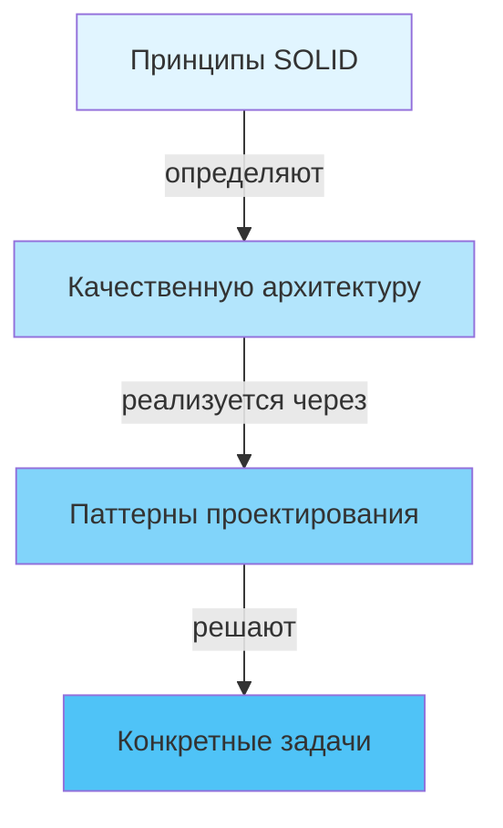

# Принципы SOLID

## Содержание

1. [Введение в SOLID](#введение-в-solid)
2. [S — Single Responsibility Principle](#s--single-responsibility-principle-принцип-единственной-ответственности)
3. [O — Open/Closed Principle](#o--openclosed-principle-принцип-открытостизакрытости)
4. [L — Liskov Substitution Principle](#l--liskov-substitution-principle-принцип-подстановки-барбары-лисков)
5. [I — Interface Segregation Principle](#i--interface-segregation-principle-принцип-разделения-интерфейсов)
6. [D — Dependency Inversion Principle](#d--dependency-inversion-principle-принцип-инверсии-зависимостей)
7. [Заключение](#заключение)

---

## Введение в SOLID

**SOLID** — это акроним, объединяющий пять фундаментальных принципов объектно-ориентированного проектирования, сформулированных Робертом Мартином (Robert C. Martin, также известным как "Uncle Bob") в начале 2000-х годов. Название образовано первыми буквами английских названий принципов:

- **S** — Single Responsibility Principle (Принцип единственной ответственности)
- **O** — Open/Closed Principle (Принцип открытости/закрытости)
- **L** — Liskov Substitution Principle (Принцип подстановки Барбары Лисков)
- **I** — Interface Segregation Principle (Принцип разделения интерфейсов)
- **D** — Dependency Inversion Principle (Принцип инверсии зависимостей)

### Для чего нужны принципы SOLID?

Главная цель этих принципов — создание программных систем, которые:

- **Легко поддерживаются** — изменения в одной части системы не вызывают каскадных изменений в других частях
- **Гибкие и расширяемые** — новый функционал добавляется без изменения существующего кода
- **Понятные** — структура кода отражает бизнес-логику и легко читается
- **Тестируемые** — компоненты можно тестировать изолированно друг от друга
- **Пригодны для повторного использования** — модули можно применять в разных контекстах

### Принципы vs Паттерны

Важно понимать различие между принципами и паттернами проектирования:

- **Принципы (Principles)** — это общие руководящие идеи, фундаментальные правила мышления разработчика. Они отвечают на вопрос *как следует проектировать?*
  
- **Паттерны (Patterns)** — это конкретные архитектурные решения типовых проблем. Они отвечают на вопрос *как решить конкретную задачу?*

Принципы SOLID определяют *способ мышления* при проектировании, а паттерны предоставляют *готовые решения*, которые обычно следуют этим принципам.

### Контекст применения

Принципы SOLID становятся особенно важными по мере роста системы. В маленьких программах на 100-200 строк кода можно обойтись без сложной архитектуры. Однако когда система начинает расти и превращается в приложение с десятками тысяч строк кода, без правильной архитектуры код становится неуправляемым:

- Классы разрастаются и перестают помещаться в голове
- Изменение одной части системы ломает другие части
- Добавление нового функционала требует изменений во множестве мест
- Тестирование становится затруднительным из-за тесной связанности компонентов

Принципы SOLID помогают избежать этих проблем, устанавливая правила для создания чистой, понятной и гибкой архитектуры.

> **Важно:** Не стоит слепо следовать принципам везде и всегда. Иногда их соблюдение приводит к излишнему усложнению кода. Применяйте принципы осознанно, соизмеряя преимущества гибкости с увеличением сложности системы.

