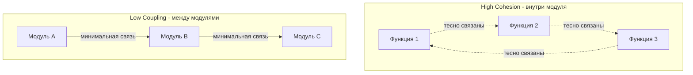

# GRASP — Принципы Распределения Ответственностей

## Содержание

1. [Введение](#введение)
2. [Information Expert](#1-information-expert-информационный-эксперт)
3. [Creator](#2-creator-создатель)
4. [Controller](#3-controller-контроллер)
5. [Low Coupling & High Cohesion](#4-low-coupling--high-cohesion-низкое-зацепление-и-высокая-связность)
6. [Indirection](#5-indirection-посредничество)
7. [Polymorphism](#6-polymorphism-полиморфизм)
8. [Protected Variations](#7-protected-variations-защита-от-изменений)
9. [Pure Fabrication](#8-pure-fabrication-чистая-выдумка)

## Введение

**GRASP** (General Responsibility Assignment Software Principles — общие принципы распределения ответственностей в программном обеспечении) представляет собой набор из девяти фундаментальных принципов объектно-ориентированного проектирования. Эти принципы помогают разработчикам принимать обоснованные решения о том, какому классу следует назначить ту или иную ответственность.

Принципы GRASP не являются жёсткими правилами — это скорее рекомендации, основанные на опыте проектирования систем. Они помогают создавать код с низким зацеплением (low coupling), высокой связностью (high cohesion) и понятной структурой.

В этом конспекте мы рассмотрим все девять принципов GRASP на практических примерах с использованием современного C# (.NET 8+).

## 1. Information Expert (Информационный эксперт)

### Определение

> «Информация должна обрабатываться там, где она содержится»

**Проблема:** Какому классу следует назначить ту или иную ответственность?

**Решение:** Назначайте ответственность тому классу, который обладает информацией, необходимой для её выполнения.

### Суть принципа

Принцип **Information Expert** (информационный эксперт) — это фундаментальное правило распределения ответственностей в объектно-ориентированном проектировании. Согласно этому принципу, если класс владеет данными, он должен владеть и операциями над этими данными.

Применение этого принципа позволяет:
- Минимизировать передачу данных между объектами
- Держать логику как можно ближе к данным
- Снижать зацепление (coupling) между классами
- Повышать связность (cohesion) внутри классов
- Избегать дублирования кода

Другими словами: если объект знает данные, он должен знать, что с ними делать. Не следует выносить вычисления за пределы класса-владельца данных, если их можно корректно реализовать внутри.

### Антипример: нарушение Information Expert

Рассмотрим типичный пример нарушения принципа информационного эксперта:

```csharp
// Модель элемента заказа
public record OrderItem(
    int Id,           // Идентификатор товара
    decimal Price,    // Цена за единицу
    int Quantity);    // Количество единиц

// Модель заказа
public class Order
{
    private readonly List<OrderItem> _items;

    public Order()
    {
        _items = new List<OrderItem>();
    }

    // Предоставляем доступ к элементам только для чтения
    public IReadOnlyCollection<OrderItem> Items => _items;
}

// Модель чека
public record Receipt(
    decimal TotalCost,     // Общая стоимость
    DateTime Timestamp);   // Время создания чека

// АНТИПАТТЕРН: сервис вычисляет стоимость, не владея данными
public class ReceiptService
{
    public Receipt CalculateReceipt(Order order)
    {
        // Сервис "лезет" внутрь заказа и сам суммирует стоимость
        var totalCost = order.Items
            .Sum(item => item.Price * item.Quantity);
        
        var timestamp = DateTime.Now;
        return new Receipt(totalCost, timestamp);
    }
}
```

### Проблемы этого подхода

1. **Нарушение инкапсуляции**: Класс `ReceiptService` напрямую обращается к внутренней структуре `Order`, извлекая `Price` и `Quantity` из каждого элемента. Он знает слишком много о том, как устроен заказ.

2. **Высокое зацепление (high coupling)**: `ReceiptService` жёстко связан с деталями реализации `Order`. Если структура заказа изменится (например, добавятся скидки, налоги или изменится формула расчёта), придётся менять код сервиса.

3. **Нарушение SRP**: `ReceiptService` теперь отвечает не только за создание чека, но и за вычисление стоимости заказа — это две разные ответственности.

4. **Проблемы с повторным использованием**: Если нужно получить стоимость заказа в другом месте программы, придётся либо дублировать логику расчёта, либо создавать неестественную зависимость от `ReceiptService`.

5. **Усложнённое тестирование**: Чтобы протестировать расчёт стоимости, необходимо создавать полноценный объект `Order` со всеми его элементами, хотя логично было бы тестировать расчёт отдельно.

### Правильное решение: следуем Information Expert

Исправим код согласно принципу информационного эксперта:

```csharp
// Модель элемента заказа — теперь знает, как вычислить свою стоимость
public record OrderItem(
    int Id,           // Идентификатор товара
    decimal Price,    // Цена за единицу
    int Quantity)     // Количество единиц
{
    // Элемент заказа сам вычисляет свою стоимость
    // Это его данные, и он — эксперт по ним
    public decimal Cost => Price * Quantity;
}

// Модель заказа — знает, как вычислить общую стоимость
public class Order
{
    private readonly List<OrderItem> _items;

    public Order()
    {
        _items = new List<OrderItem>();
    }

    // Предоставляем доступ к элементам только для чтения
    public IReadOnlyCollection<OrderItem> Items => _items;
    
    // Заказ сам вычисляет свою общую стоимость
    // Он — эксперт по своей коллекции товаров
    public decimal TotalCost => _items.Sum(item => item.Cost);
}

// Модель чека
public record Receipt(
    decimal TotalCost,
    DateTime Timestamp);

// Сервис теперь только создаёт чек, не зная деталей расчёта
public class ReceiptService
{
    public Receipt CalculateReceipt(Order order)
    {
        // Просто берём готовую стоимость из заказа
        // Не знаем и не должны знать, как она вычисляется
        var totalCost = order.TotalCost;
        var timestamp = DateTime.Now;
        
        return new Receipt(totalCost, timestamp);
    }
}
```

### Преимущества правильного решения

1. **`OrderItem` — эксперт по своей стоимости**: Каждый элемент заказа сам знает, как вычислить `Cost` (цена × количество).

2. **`Order` — эксперт по общей стоимости**: Заказ отвечает за суммирование стоимостей всех своих элементов.

3. **`ReceiptService` освобождён от лишних знаний**: Сервис просто вызывает `order.TotalCost`, не зная деталей того, как эта сумма вычисляется.

4. **Низкое зацепление**: Изменения в формуле расчёта стоимости (например, добавление скидок) затронут только классы `Order` и `OrderItem`, но не `ReceiptService`.

5. **Переиспользование**: Теперь любой код может получить стоимость заказа, обратившись к `order.TotalCost`, без дублирования логики.

### Ключевые выводы

Принцип **Information Expert** учит распределять поведение так, чтобы каждый класс работал с собственной информацией. В результате:
- Система становится модульной и гибкой
- Логика естественно распределена по структуре данных
- Изменения затрагивают минимальное количество кода
- Код становится понятным и предсказуемым

---

## 2. Creator (Создатель)

### Определение

> «Ответственность за создание объектов должна лежать на типах, которые их используют»

**Проблема:** Кто должен создавать экземпляр класса `A`?

**Решение:** Класс `B` должен отвечать за создание объектов `A`, если выполняется одно или несколько из следующих условий:
- `B` содержит (contains) или агрегирует (aggregates) объекты `A`
- `B` записывает (records) объекты `A`
- `B` активно использует объекты `A`
- `B` обладает данными инициализации для создания `A`

### Суть принципа

Создание объектов — одна из наиболее частых операций в объектно-ориентированной системе. Принцип **Creator** (создатель) помогает определить, какой класс должен отвечать за инстанцирование других классов.

Если один объект:
- владеет другим,
- хранит его внутри себя,
- активно с ним взаимодействует,
- или располагает всей необходимой информацией для его создания,

то именно он и должен быть «создателем» (creator).

Это правило естественно продолжает идею **Information Expert**: тот, кто знает достаточно, чтобы создать объект, и естественным образом с ним взаимодействует, должен отвечать за его создание.

### Цель принципа

Главная цель — уменьшить зацепление (coupling) между классами. Если делегировать создание объекта «ближайшему эксперту», не приходится «тащить» зависимости в сторонние сервисы и связывать их с внутренними деталями других классов.

### Антипример: нарушение Creator

```csharp
// Модель элемента заказа
public record OrderItem(int Id, decimal Price, int Quantity);

// Модель заказа
public class Order
{
    private readonly List<OrderItem> _items;

    public Order()
    {
        _items = new List<OrderItem>();
    }

    // Метод добавления уже созданного элемента
    public Order AddItem(OrderItem item)
    {
        _items.Add(item);
        return this;
    }
}

// АНТИПАТТЕРН: сервис создаёт OrderItem, хотя Order владеет ими
public class OrderService
{
    public Order CreateDefaultOrder()
    {
        // OrderService знает, как создавать OrderItem
        // Это создаёт лишнее зацепление
        var order = new Order()
            .AddItem(new OrderItem(1, 100, 1))     // Создание здесь
            .AddItem(new OrderItem(2, 1000, 3));   // И здесь
        
        return order;
    }
}
```

### Проблемы этого подхода

1. **Нарушение Creator**: `OrderService` создаёт `OrderItem`, хотя не владеет этими объектами и не управляет ими. Он лишь передаёт их в `Order`, действуя как посредник, который знает лишние детали.

2. **Высокое зацепление**: `OrderService` становится зависимым от структуры `OrderItem`. Если изменится конструктор `OrderItem` (добавятся поля, изменятся типы), придётся менять `OrderService`.

3. **Нарушение инкапсуляции**: Внешний сервис знает детали создания `OrderItem`, хотя этому не должен быть обучен. Это повышает связанность и делает код более хрупким.

4. **Проблемы с поддержкой**: Если `OrderItem` должен создаваться с валидацией или особыми правилами, придётся менять `OrderService`, хотя логичнее было бы изменить только `Order`.

### Правильное решение: следуем Creator

```csharp
// Модель элемента заказа
public record OrderItem(int Id, decimal Price, int Quantity);

// Модель заказа — теперь сама создаёт свои элементы
public class Order
{
    private readonly List<OrderItem> _items;

    public Order()
    {
        _items = new List<OrderItem>();
    }

    // Метод принимает данные, а создание делегирует внутрь
    // Order — это владелец OrderItem, поэтому он их и создаёт
    public Order AddItem(int id, decimal price, int quantity)
    {
        // Создание OrderItem происходит здесь, внутри Order
        _items.Add(new OrderItem(id, price, quantity));
        return this;
    }
}

// Сервис теперь не знает про OrderItem
public class OrderService
{
    public Order CreateDefaultOrder()
    {
        // OrderService работает только с Order
        // Он не знает и не должен знать про OrderItem
        var order = new Order()
            .AddItem(1, 100, 1)      // Передаём только данные
            .AddItem(2, 1000, 3);    // Создание делегируется Order
        
        return order;
    }
}
```

### Преимущества

1. **Order создаёт OrderItem**: Заказ сам создаёт свои элементы. Метод `AddItem` принимает только данные инициализации.

2. **OrderService не знает про OrderItem**: Сервис просто говорит «добавь позицию с такими данными». Вся конкретика скрыта в `Order`.

3. **Низкое зацепление**: Изменения в конструкторе `OrderItem` затронут только `Order`, но не `OrderService`.

4. **Переиспользование**: Логика создания элементов заказа централизована в одном месте.

### Ограничения принципа Creator

Принцип Creator не абсолютен — им нужно пользоваться с осторожностью. Рассмотрим пример, где его слишком строгое применение может создать проблемы:

```csharp
public class OrderService
{
    // Метод принимает готовую коллекцию элементов
    public Order CreateDefaultOrder(IEnumerable<OrderItem> items)
    {
        var order = new Order()
            .AddItem(1, 100, 1)
            .AddItem(2, 1000, 3);

        // Добавляем элементы из внешнего источника
        foreach (var item in items)
        {
            // Order создаёт OrderItem, но данные берёт из существующих объектов
            order.AddItem(item.Id, item.Price, item.Quantity);
        }

        return order;
    }
}
```

### Потенциальные риски

1. **Неявная связанность между конструктором и методом**: Если структура `OrderItem` меняется, нужно обновлять и `AddItem`, чтобы правильно передавать параметры. Появляется скрытая зависимость между методом `AddItem` и конструктором `OrderItem`.

2. **Риск нарушения SRP**: Если класс `Order` должен знать все подробности инициализации элементов, он берёт на себя слишком много ответственности. В крупных системах это может привести к «раздуванию» класса.

3. **Проблемы с производительностью**: Если при добавлении элементов происходят дополнительные проверки или пересчёты, создание множества объектов через `AddItem` может стать неэффективным. Иногда выгоднее создавать объекты «пакетно» снаружи.

### Ключевые выводы

Принцип **Creator** — это рекомендация о логичном распределении ответственности за создание объектов.

Создавать что-то должен тот, кто:
- Владеет или агрегирует эти объекты
- Использует их активно в своей работе
- Располагает всей необходимой информацией для их корректного построения

При этом важно не перегружать класс лишними обязанностями. Creator тесно связан с **SRP** и **Low Coupling**. Хороший проект — это баланс: объекты создаются там, где им логично принадлежать, но при этом каждый класс остаётся ответственным только за своё, не превращаясь в «бога системы».

---

## 3. Controller (Контроллер)

### Определение

> «Контроллер принимает входящие запросы и координирует их выполнение, делегируя работу другим объектам»

**Проблема:** Какой объект должен обрабатывать системные события и запросы, поступающие извне?

**Решение:** Назначить объект-координатор, который принимает запросы и делегирует их выполнение, но сам не реализует бизнес-логику.

### Суть принципа

Когда пользователь вызывает действие (нажимает кнопку, отправляет HTTP-запрос, вызывает API-метод), этот запрос не должен попадать напрямую в бизнес-логику. Между пользовательским интерфейсом и предметной областью должна находиться прослойка — **контроллер** (controller).

Контроллер отвечает на вопрос: кто первым получает внешние события и координирует поведение системы?

Контроллер — это переходник между моделями представления (UI, API) и моделями бизнес-логики (доменными объектами).

### Типы контроллеров

В зависимости от масштаба ответственности, выделяют три основных типа контроллеров:

#### 1. Use-Case Controller (Контроллер сценария)

Контроллер, отвечающий за один конкретный сценарий использования (use case), например «Добавить пользователя».

```csharp
// Контроллер для одного действия
public class AddUserController
{
    private readonly IUserService _userService;

    public AddUserController(IUserService userService)
    {
        _userService = userService;
    }

    // Один метод — одна ответственность
    public void AddUser(User user)
    {
        // Валидация входных данных (если необходима)
        if (user == null)
            throw new ArgumentNullException(nameof(user));

        // Делегирование бизнес-логики сервису
        _userService.AddUser(user);
    }
}
```

**Преимущества:**
- Простота: каждый контроллер делает что-то одно и делает это предсказуемо
- Лёгкость тестирования: поведение чётко определено одним методом
- Высокая связность (high cohesion): контроллер полностью сфокусирован на одной задаче

**Недостатки:**
- Появляется множество мелких контроллеров — по одному на каждый сценарий
- В больших системах это приводит к раздробленности кода
- Если сценарии тесно связаны, разделение может быть неестественным (например, `AddUserController`, `DeleteUserController`, `UpdateUserController` будут дублировать инфраструктурный код)

**Когда использовать:** В системах с чётко разграниченными командами, микросервисной архитектуре, CQRS, где каждая операция является самостоятельной точкой входа.

#### 2. Use-Case Group Controller (Контроллер группы сценариев)

Контроллер, группирующий несколько связанных сценариев использования одной предметной области.

```csharp
// Контроллер для группы связанных операций
public class UserController
{
    private readonly IUserService _userService;

    public UserController(IUserService userService)
    {
        _userService = userService;
    }

    // Добавление пользователя
    public void AddUser(User user)
    {
        if (user == null)
            throw new ArgumentNullException(nameof(user));
        
        _userService.AddUser(user);
    }

    // Удаление пользователя
    public void DeleteUser(UserId id)
    {
        if (id == null)
            throw new ArgumentNullException(nameof(id));
        
        _userService.DeleteUser(id);
    }

    // Обновление пользователя
    public void UpdateUser(User user)
    {
        if (user == null)
            throw new ArgumentNullException(nameof(user));
        
        _userService.UpdateUser(user);
    }
}
```

**Преимущества:**
- Уменьшается количество классов — логически связанные действия собраны в одном месте
- Удобно, когда действия используют общие зависимости (например, `IUserService`)
- Соответствует типичной структуре REST API или MVC-приложений

**Недостатки:**
- При чрезмерном росте числа сценариев контроллер может превратиться в «свалку методов»
- Нарушается принцип единственной ответственности (SRP), если контроллер начинает управлять слишком многими сценариями
- Контроллер может начать принимать слишком много решений и содержать элементы бизнес-логики

**Когда использовать:** Для средних по размеру приложений (REST API, MVC), где удобно иметь контроллеры по областям: `UserController`, `OrderController`, `ProductController`.

#### 3. Facade Controller (Контроллер-фасад)

Контроллер, объединяющий несколько разных подсистем или сервисов под единым интерфейсом управления.

```csharp
// Контроллер-фасад координирует работу нескольких сервисов
public class FacadeController
{
    private readonly IUserService _userService;
    private readonly IMailingService _mailingService;
    private readonly ILoggingService _loggingService;

    public FacadeController(
        IUserService userService,
        IMailingService mailingService,
        ILoggingService loggingService)
    {
        _userService = userService;
        _mailingService = mailingService;
        _loggingService = loggingService;
    }

    // Комплексный сценарий регистрации пользователя
    public void RegisterUser(User user)
    {
        // Контроллер координирует последовательность операций
        // но не выполняет бизнес-логику сам
        
        // 1. Создаём пользователя в системе
        _userService.CreateUser(user);
        
        // 2. Отправляем приветственное письмо
        _mailingService.SendWelcomeEmail(user.Email, user.Name);
        
        // 3. Записываем событие в журнал
        _loggingService.LogInfo($"User {user.Id} registered successfully");
    }
}
```

**Преимущества:**
- Позволяет скрыть сложную последовательность операций за одним вызовом
- Упрощает интеграцию между подсистемами
- Клиент работает с единой точкой входа вместо множества сервисов

**Недостатки:**
- Может стать центром избыточной логики — если фасад начинает «думать» и принимать решения, он превращается в «бога» приложения
- При большом числе зависимостей контроллер становится громоздким и трудно поддерживаемым
- Риск нарушения SRP при слишком большом количестве координируемых операций

**Когда использовать:** Когда один запрос требует участия нескольких сервисов. Главное — не допускать, чтобы контроллер сам выполнял бизнес-логику; он должен оставаться только организатором последовательности действий.

### Ключевые выводы

Принцип **Controller** помогает организовать точку входа для системных событий:
- Контроллер координирует работу, но не выполняет бизнес-логику
- Он снижает зацепление между UI и бизнес-логикой
- Выбор типа контроллера зависит от размера и архитектуры приложения
- Важно не перегружать контроллер ответственностями и не превращать его в «божественный объект»

---

## 4. Low Coupling & High Cohesion (Низкое зацепление и высокая связность)

### Определения

**Coupling** (зацепление) — мера зависимости между модулями системы. Показывает, насколько сильно классы «знают» друг о друге.

**Cohesion** (связность) — мера логической соотнесённости элементов внутри одного модуля. Показывает, насколько функции класса связаны между собой.

### Суть принципов

Эти два принципа тесно связаны и рассматриваются вместе:

**Low Coupling (низкое зацепление):** Объекты должны быть слабо связаны и минимально зависеть друг от друга. Это упрощает модификацию, тестирование и повторное использование компонентов.

**High Cohesion (высокая связность):** Каждый объект или класс должен отвечать за чётко ограниченный набор функций. Это делает код более читаемым, поддерживаемым и предсказуемым.

### Визуализация



Модули должны максимально выполнять возложенную на них ответственность внутри себя и иметь минимум точек взаимодействия с другими модулями.

Аналогия с базой данных: у нас есть внешний ключ, через который мы взаимодействуем с другими таблицами, но остальные данные изолированы.

### Антипример 1: High Coupling (высокое зацепление)

Рассмотрим пример сильного зацепления между классами:

```csharp
// Перечисление типов метрик
public enum MetricType
{
    Temperature,
    UsedMemory
}

// Провайдер данных о температуре
public class TemperatureDataProvider
{
    public (double Value, DateTime Timestamp) GetTemperatureData()
    {
        // Получение данных с сенсора температуры
        return (25.5, DateTime.Now);
    }
}

// Провайдер данных о памяти
public class UsedMemoryDataProvider
{
    public (double Value, DateTime Timestamp) GetUsedMemoryData()
    {
        // Получение данных об использовании памяти
        return (GC.GetTotalMemory(false), DateTime.Now);
    }
}

// АНТИПАТТЕРН: Монитор жёстко привязан к конкретным провайдерам
public class DataMonitor
{
    private readonly TemperatureDataProvider _temperatureProvider;
    private readonly UsedMemoryDataProvider _usedMemoryProvider;

    public DataMonitor()
    {
        // Создаём провайдеры прямо в конструкторе
        _temperatureProvider = new TemperatureDataProvider();
        _usedMemoryProvider = new UsedMemoryDataProvider();
    }

    public void Monitor(MetricType type, CancellationToken cancellationToken)
    {
        while (!cancellationToken.IsCancellationRequested)
        {
            // Switch для выбора провайдера — жёсткая зависимость
            var (value, timestamp) = type switch
            {
                MetricType.Temperature => _temperatureProvider.GetTemperatureData(),
                MetricType.UsedMemory => _usedMemoryProvider.GetUsedMemoryData(),
                _ => throw new ArgumentException("Unknown metric type")
            };
            
            Console.WriteLine($"{type} = {value}, at {timestamp}");
            Thread.Sleep(1000);
        }
    }
}
```

### Проблемы этого подхода

1. **Высокое зацепление**: `DataMonitor` привязан к конкретным реализациям (`TemperatureDataProvider`, `UsedMemoryDataProvider`).

2. **Нарушение OCP**: Если появится новый источник данных (например, `NetworkUsageDataProvider`), придётся менять код `DataMonitor` (добавлять новое поле, новую ветку в switch).

3. **Невозможность тестирования**: Нельзя подменить провайдеры на mock-объекты для тестирования — они создаются внутри класса.

4. **Отсутствие гибкости**: Невозможно использовать `DataMonitor` с другими типами провайдеров без модификации кода.

### Антипример 2: Циклическая зависимость

Ещё один классический пример нарушения принципа Low Coupling:

```csharp
// АНТИПАТТЕРН: Класс A зависит от B
public class A
{
    private int _value;
    private B _b;
   
    public A(int value)
    {
        _value = value;
        _b = new B(this);  // Передаём себя в B
    }
    
    public int GetValue() => _value;
}

// АНТИПАТТЕРН: Класс B зависит от A
public class B
{
    private A _a;
    
    public B(A a)
    {
        _a = a;  // Сохраняем ссылку на A
    }
    
    public void DoSomething()
    {
        // B использует A
        Console.WriteLine(_a.GetValue());
    }
}
```

### Проблемы циклической зависимости

1. **Невозможность повторного использования**: Нельзя использовать класс `A` без класса `B`, и наоборот. Они существуют только вместе.

2. **Усложнённое тестирование**: Чтобы протестировать `A`, нужен `B`. Чтобы протестировать `B`, нужен `A`. Невозможно изолированное тестирование.

3. **Проблемы с пониманием кода**: Неочевидно, какой класс главный, а какой вспомогательный.

4. **Нарушение принципа**: Чем меньше связей между классами — тем лучше. Циклические зависимости — это максимальная связанность.

### Правильное решение: Low Coupling (низкое зацепление)

Исправим первый пример, применив принцип низкого зацепления:

```csharp
// Общий интерфейс для всех провайдеров данных
public interface IChronologicalDataProvider
{
    string Kind { get; }  // Тип данных (температура, память и т.д.)
    (double Value, DateTime Timestamp) GetData();  // Метод получения данных
}

// Конкретная реализация: провайдер температуры
public class TemperatureDataProvider : IChronologicalDataProvider
{
    public string Kind => "Temperature";
    
    public (double Value, DateTime Timestamp) GetData()
    {
        // Получение данных с сенсора
        return (25.5, DateTime.Now);
    }
}

// Конкретная реализация: провайдер памяти
public class UsedMemoryDataProvider : IChronologicalDataProvider
{
    public string Kind => "UsedMemory";
    
    public (double Value, DateTime Timestamp) GetData()
    {
        // Получение данных об использовании памяти
        return (GC.GetTotalMemory(false), DateTime.Now);
    }
}

// Монитор теперь зависит только от интерфейса
public class DataMonitor
{
    private readonly IChronologicalDataProvider _provider;

    // Внедрение зависимости через конструктор
    public DataMonitor(IChronologicalDataProvider provider)
    {
        _provider = provider;
    }

    public void Monitor(CancellationToken cancellationToken)
    {
        while (!cancellationToken.IsCancellationRequested)
        {
            // Работаем через интерфейс — не знаем конкретную реализацию
            var (value, timestamp) = _provider.GetData();
            Console.WriteLine($"{_provider.Kind} = {value}, at {timestamp}");
            Thread.Sleep(1000);
        }
    }
}

// Использование
public class Program
{
    public static void Main()
    {
        var cts = new CancellationTokenSource();
        
        // Легко подменяем реализацию без изменения DataMonitor
        IChronologicalDataProvider provider = new TemperatureDataProvider();
        // или: IChronologicalDataProvider provider = new UsedMemoryDataProvider();
        
        var monitor = new DataMonitor(provider);
        monitor.Monitor(cts.Token);
    }
}
```

### Преимущества

1. **Низкое зацепление**: `DataMonitor` зависит только от интерфейса `IChronologicalDataProvider`, а не от конкретных реализаций.

2. **Соблюдение OCP**: Добавление нового типа провайдера (например, `CpuUsageDataProvider`) не требует изменения `DataMonitor` — достаточно создать новую реализацию интерфейса.

3. **Тестируемость**: Можно легко создать mock-реализацию `IChronologicalDataProvider` для тестирования.

4. **Гибкость**: Изменение одной части системы не влияет на другие.

### Антипример: Low Cohesion (низкая связность)

Если возвести принцип Low Coupling в абсолют, можно прийти к идее разместить всю функциональность в одном классе — тогда зависимостей не будет вообще. Но это создаёт другую проблему: **низкую связность** (low cohesion).

Принцип **High Cohesion** (высокая связность) говорит: классы должны содержать логически связанную бизнес-логику.

```csharp
// АНТИПАТТЕРН: Один класс занимается несвязанными вещами
public class DataProvider
{
    private readonly HttpClient _httpClient;
    
    public DataProvider(HttpClient httpClient)
    {
        _httpClient = httpClient;
    }

    // Получение данных через HTTP (внешний источник)
    public (double Value, DateTime Timestamp) GetTemperatureData()
    {
        var response = _httpClient.GetAsync("https://sensor-api.com/temperature").Result;
        var value = response.Content.ReadFromJsonAsync<double>().Result;
        return (value, DateTime.Now);
    }

    // Получение данных из внутренней системы (память процесса)
    public (double Value, DateTime Timestamp) GetUsedMemoryData()
    {
        return (GC.GetTotalMemory(false), DateTime.Now);
    }
}
```

### Проблемы

1. **Низкая связность**: Класс `DataProvider` занимается двумя совершенно разными вещами:
   - Получением данных из внешнего сервиса через HTTP
   - Измерением внутреннего состояния системы (память)

2. **Нарушение SRP**: Если изменится способ получения температуры (например, сменится API) или способ измерения памяти, придётся редактировать один и тот же класс.

3. **Высокая связанность между несвязанными функциями**: Методы класса логически не связаны друг с другом, но находятся в одном месте.

4. **Усложнение тестирования**: Для тестирования `GetTemperatureData` нужен `HttpClient`, но для `GetUsedMemoryData` он не нужен — это создаёт путаницу.

### Ещё один антипример: смешение контекстов

```csharp
// АНТИПАТТЕРН: Класс содержит логику для двух разных контекстов
public class Data
{
    private int _temperature;
    private int _time;
    
    public Data(int temperature, int time)
    {
        _temperature = temperature;
        _time = time;
    }
    
    // Метод для работы со временем
    public int CalculateTimeDifference(int time)
    {
        return _time - time;
    }

    // Метод для работы с температурой
    public int CalculateTemperatureDifference(int temperature)
    {
        return _temperature - temperature;
    }
}
```

### Проблемы

Класс `Data` содержит бизнес-логику по работе как с температурой, так и со временем. Они не имеют ничего общего, кроме того, что собираются с одного датчика.

**Признак проблемы:** Наличие префиксов в названиях методов (`CalculateTime...`, `CalculateTemperature...`) часто говорит о нарушении High Cohesion. Программист сам понимал, что работает с двумя разными контекстами, и добавил префиксы, чтобы не запутаться.

Если нужно переиспользовать только логику работы с температурой, сделать это сложно — придётся тащить и время. Это нарушение **SRP**: через класс проходят две оси изменения.

### Правильное решение: High Cohesion (высокая связность)

Разделим ответственности на отдельные, сфокусированные классы:

```csharp
// Провайдер данных о температуре — знает только о температуре
public class TemperatureDataProvider : IChronologicalDataProvider
{
    private readonly HttpClient _httpClient;
    
    public TemperatureDataProvider(HttpClient httpClient)
    {
        _httpClient = httpClient;
    }

    public string Kind => "Temperature";

    // Этот класс отвечает только за получение температуры
    public (double Value, DateTime Timestamp) GetData()
    {
        var response = _httpClient.GetAsync("https://sensor-api.com/temperature").Result;
        var value = response.Content.ReadFromJsonAsync<double>().Result;
        return (value, DateTime.Now);
    }
}

// Провайдер данных о памяти — знает только о памяти
public class UsedMemoryDataProvider : IChronologicalDataProvider
{
    public string Kind => "UsedMemory";
    
    // Этот класс отвечает только за измерение памяти
    public (double Value, DateTime Timestamp) GetData()
    {
        return (GC.GetTotalMemory(false), DateTime.Now);
    }
}
```

### Преимущества

1. **Высокая связность**: Каждый класс выполняет одну логическую задачу:
   - `TemperatureDataProvider` — получение данных от внешнего сенсора
   - `UsedMemoryDataProvider` — измерение памяти

2. **Простота сопровождения**: Изменение источника данных температуры не влияет на сбор данных о памяти.

3. **Лёгкость тестирования**: Каждый класс можно тестировать изолированно.

4. **Переиспользование**: Можно использовать `TemperatureDataProvider` в других местах программы без лишних зависимостей.

### Улучшение второго примера

Разделим класс `Data` на отдельные, сфокусированные классы:

```csharp
// Класс для работы с температурой
public class TemperatureData
{
    private int _temperature;
    
    public TemperatureData(int temperature)
    {
        _temperature = temperature;
    }

    // Логика работы только с температурой
    public int CalculateDifference(int temperature)
    {
        return _temperature - temperature;
    }
}

// Класс для работы со временем
public class TimeData
{
    private int _time;
    
    public TimeData(int time)
    {
        _time = time;
    }

    // Логика работы только со временем
    public int CalculateDifference(int time)
    {
        return _time - time;
    }
}

// Класс-агрегатор, если нужна совместная работа
public class SensorData
{
    private TemperatureData _temperatureData;
    private TimeData _timeData;
   
    public SensorData(int temperature, int time)
    {
        _temperatureData = new TemperatureData(temperature);
        _timeData = new TimeData(time);
    }

    public TemperatureData Temperature => _temperatureData;
    public TimeData Time => _timeData;
}
```

### Ключевые выводы

**Low Coupling** и **High Cohesion** — два связанных принципа, которые следует рассматривать вместе:

- **Система должна состоять из слабо связанных между собой классов**, которые содержат логически схожую бизнес-логику
- **Сильное зацепление** — серьёзный недостаток, затрудняющий понимание, модификацию, тестирование и переиспользование
- **Слабое зацепление** — признак хорошо структурированной и спроектированной системы
- **Сильная связность** — класс сфокусирован и его элементы тесно связаны одной целью
- **Слабая связность** — класс не сфокусирован, его элементы предназначены для разных несвязанных задач

### Баланс между принципами

Однако слишком мелкое разбиение классов тоже может быть вредным: если создавать десятки крошечных классов с минимальной логикой, это усложнит структуру проекта.

**Важно находить баланс:** связность должна быть высокой, но не чрезмерной, а зацепление — низким, но не за счёт избыточного абстрагирования.

**Терминология:** Чтобы не путать coupling и cohesion, будем называть:
- **Coupling** — зацепление
- **Cohesion** — связность

--- 

## 5. Indirection (Посредничество)

### Определение

**Object Indirection** (объектное посредничество) — любое взаимодействие с данными, поведением или модулями, реализованное не напрямую, а через промежуточный объект-посредник.

Сравните с:

**Interface Segregation** (разделение интерфейсов) — взаимодействие реализуется не напрямую, а через интерфейс.

### Суть принципа

**Проблема:** Как снизить зацепление между двумя модулями, которые не должны зависеть друг от друга напрямую?

**Решение:** Ввести промежуточный объект-посредник, который возьмёт на себя ответственность за организацию взаимодействия.

Цель посредничества — снизить зацепление между компонентами системы. Вместо прямого вызова методов одного модуля другим, мы вводим промежуточный слой.

Можно рассматривать принцип **Indirection** как конкретное средство достижения **Low Coupling**.

### Историческая аналогия

Представьте телефонную связь начала XX века. В квартире поэта А. А. Блока стоял телефон без диска и кнопок. Чтобы позвонить, абонент вращал ручку индуктора, который давал напряжение 60 вольт. На коммутаторе открывался вызывной клапан, и телефонистка спрашивала: «Куда соединить?». Абонент отвечал: «Барышня, Солянка, два-семнадцать». Девушка вставляла штекер в нужное гнездо и соединяла абонентов.

Это классический пример посредничества: абоненты не знали друг о друге напрямую, взаимодействие шло через оператора.

### Антипример: прямая зависимость

Код без применения посредничества:

```csharp
// Модель заказа
public class Order
{
    public string CustomerEmail { get; set; }
    public decimal Total { get; set; }
}

// АНТИПАТТЕРН: OrderService жёстко привязан к конкретному способу уведомления
public class OrderService
{
    private readonly EmailNotificationService _emailService;

    public OrderService()
    {
        // Создаём конкретную реализацию прямо здесь
        _emailService = new EmailNotificationService();
    }

    public void PlaceOrder(Order order)
    {
        // Логика оформления заказа
        Console.WriteLine("Order placed.");

        // Уведомляем клиента напрямую через email-сервис
        _emailService.SendEmail(order.CustomerEmail, "Your order has been placed.");
    }
}

// Конкретная реализация уведомлений
public class EmailNotificationService
{
    public void SendEmail(string to, string message)
    {
        Console.WriteLine($"Sending email to {to}: {message}");
    }
}
```

### Проблемы

1. **Высокое зацепление**: `OrderService` жёстко привязан к `EmailNotificationService`.
2. **Невозможность замены**: Нельзя переключиться на SMS или push-уведомления без изменения `OrderService`.
3. **Нарушение OCP**: Добавление нового способа уведомления требует модификации существующего кода.
4. **Сложность тестирования**: Невозможно заменить реальный email-сервис на mock-объект.
### Правильное решение: использование посредника

Применим принцип Indirection через введение интерфейса-посредника:

```csharp
// Модель заказа
public class Order
{
    public string CustomerEmail { get; set; }
    public decimal Total { get; set; }
}

// Интерфейс-посредник для уведомлений
public interface INotificationService
{
    void Notify(string recipient, string message);
}

// Конкретная реализация: Email-уведомления
public class EmailNotificationService : INotificationService
{
    public void Notify(string recipient, string message)
    {
        Console.WriteLine($"Sending email to {recipient}: {message}");
        // Реальная логика отправки email
    }
}

// Конкретная реализация: SMS-уведомления
public class SmsNotificationService : INotificationService
{
    public void Notify(string recipient, string message)
    {
        Console.WriteLine($"Sending SMS to {recipient}: {message}");
        // Реальная логика отправки SMS
    }
}

// OrderService теперь зависит только от интерфейса
public class OrderService
{
    private readonly INotificationService _notificationService;

    // Внедрение зависимости через конструктор
    public OrderService(INotificationService notificationService)
    {
        _notificationService = notificationService;
    }

    public void PlaceOrder(Order order)
    {
        // Логика оформления заказа
        Console.WriteLine("Order placed.");
        
        // Уведомляем через посредника — не знаем конкретную реализацию
        _notificationService.Notify(order.CustomerEmail, "Your order has been placed.");
    }
}

// Использование
public class Program
{
    public static void Main()
    {
        var order = new Order 
        { 
            CustomerEmail = "customer@example.com", 
            Total = 150.00m 
        };
        
        // Легко переключаемся между реализациями
        INotificationService notificationService = new EmailNotificationService();
        // или: INotificationService notificationService = new SmsNotificationService();
        
        var orderService = new OrderService(notificationService);
        orderService.PlaceOrder(order);
    }
}
```

### Преимущества

1. **Низкое зацепление**: `OrderService` зависит только от интерфейса `INotificationService`, а не от конкретных реализаций.

2. **Гибкость**: Легко добавлять новые способы уведомления (Push, Telegram и т.д.) без изменения `OrderService`.

3. **Тестируемость**: Можно создать mock-реализацию `INotificationService` для тестов.

4. **Соблюдение OCP**: Система открыта для расширения (новые реализации), но закрыта для модификации (не меняем `OrderService`).

### Ключевые выводы

Принцип **Indirection** (посредничество):
- Вводит промежуточный слой между взаимодействующими компонентами
- Снижает зацепление через абстракции (интерфейсы, базовые классы)
- Является конкретным механизмом достижения Low Coupling
- Делает систему более гибкой и расширяемой

---

## 6. Polymorphism (Полиморфизм)

### Определение

> «Используйте полиморфизм вместо условных конструкций»

**Проблема:** Как обрабатывать альтернативы, зависящие от типа? Как создать расширяемые компоненты?

**Решение:** Когда поведение различается в зависимости от типа, назначьте ответственность за это поведение самим типам, используя полиморфные операции.

### Суть принципа

Вместо условных конструкций (`if`/`switch`) для выбора поведения на основе типа, используем разные реализации общего интерфейса или базового класса. Это делает систему расширяемой без изменения существующего кода.

Согласно принципу **Polymorphism** (полиморфизм), ответственность за определение вариаций поведения на основе типа назначается самому типу. Это достигается использованием полиморфных операций. Пользователь типа должен использовать полиморфные операции вместо явного ветвления на основе типа.

**Полиморфизм** в этом контексте означает «давать одно и то же имя операциям в разных объектах».

### Антипример: без полиморфизма

Код с использованием условных конструкций:

```csharp
// Перечисление типов документов
public enum DocumentType
{
    Pdf,
    Word,
    Excel
}

// АНТИПАТТЕРН: Класс с жёстким switch для выбора поведения
public class DocumentPrinter
{
    public void Print(DocumentType type, string content)
    {
        // Switch определяет поведение на основе типа
        switch (type)
        {
            case DocumentType.Pdf:
                Console.WriteLine("Printing PDF document: " + content);
                // Специфичная логика для PDF
                break;
                
            case DocumentType.Word:
                Console.WriteLine("Printing Word document: " + content);
                // Специфичная логика для Word
                break;
                
            case DocumentType.Excel:
                Console.WriteLine("Printing Excel document: " + content);
                // Специфичная логика для Excel
                break;
                
            default:
                throw new ArgumentException("Unknown document type");
        }
    }
}

// Использование
public class Program
{
    public static void Main()
    {
        var printer = new DocumentPrinter();
        printer.Print(DocumentType.Pdf, "Contract Agreement");
        printer.Print(DocumentType.Word, "Report 2025");
    }
}
```

### Проблемы

1. **Нарушение OCP**: Добавление нового типа документа требует модификации метода `Print` (добавление новой ветки в switch).

2. **Дублирование логики**: Если нужно добавить ещё одну операцию (например, `Save`), придётся дублировать switch-конструкцию.

3. **Сложность сопровождения**: При большом количестве типов switch становится громоздким и трудным для понимания.

4. **Рассеивание логики**: Поведение для каждого типа документа разбросано по разным веткам switch, а не инкапсулировано в отдельные классы.

### Правильное решение: с полиморфизмом

Используем полиморфизм для инкапсуляции поведения в типах:

```csharp
// Базовый класс для всех документов
public abstract class Document
{
    public string Content { get; set; }
    
    // Абстрактный метод — каждый тип реализует по-своему
    public abstract void Print();
    
    // Можно добавить другие операции, которые также будут полиморфными
    public abstract void Save();
}

// Конкретная реализация: PDF-документ
public class PdfDocument : Document
{
    public override void Print()
    {
        Console.WriteLine("Printing PDF document: " + Content);
        // Специфичная логика для PDF (например, рендеринг через PDF-движок)
    }
    
    public override void Save()
    {
        Console.WriteLine("Saving PDF to file system");
    }
}

// Конкретная реализация: Word-документ
public class WordDocument : Document
{
    public override void Print()
    {
        Console.WriteLine("Printing Word document: " + Content);
        // Специфичная логика для Word (например, через Office Interop)
    }
    
    public override void Save()
    {
        Console.WriteLine("Saving Word document to .docx");
    }
}

// Конкретная реализация: Excel-документ
public class ExcelDocument : Document
{
    public override void Print()
    {
        Console.WriteLine("Printing Excel document: " + Content);
        // Специфичная логика для Excel (например, печать таблиц)
    }
    
    public override void Save()
    {
        Console.WriteLine("Saving Excel document to .xlsx");
    }
}

// Принтер теперь работает с абстракцией
public class DocumentPrinter
{
    // Метод принимает базовый тип — работает с любым документом
    public void Print(Document doc)
    {
        // Полиморфный вызов — конкретное поведение определяется типом объекта
        doc.Print();
    }
}

// Использование
public class Program
{
    public static void Main()
    {
        var printer = new DocumentPrinter();
        
        // Создаём разные типы документов
        Document pdf = new PdfDocument { Content = "Contract Agreement" };
        Document word = new WordDocument { Content = "Report 2025" };
        Document excel = new ExcelDocument { Content = "Budget Table" };
        
        // Один и тот же код работает с разными типами
        printer.Print(pdf);    // Вызовется PdfDocument.Print()
        printer.Print(word);   // Вызовется WordDocument.Print()
        printer.Print(excel);  // Вызовется ExcelDocument.Print()
    }
}
```

### Преимущества

1. **Соблюдение OCP**: Добавление нового типа документа (например, `MarkdownDocument`) не требует изменения `DocumentPrinter` — достаточно создать новый класс-наследник.

2. **Инкапсуляция поведения**: Логика печати каждого типа документа находится внутри соответствующего класса, а не разбросана по switch-конструкциям.

3. **Переиспользование**: Методы `Print` и `Save` можно вызывать из разных мест без дублирования логики выбора.

4. **Упрощение кода**: Исчезает необходимость в enum и switch — поведение определяется типом объекта.

### Важное замечание

Однако злоупотребление полиморфизмом приводит к переусложнению кода. Если в системе всего 2-3 типа и они не будут расширяться, простой switch может быть более читаемым решением, чем создание иерархии классов.

**Правило:** Используйте полиморфизм, когда:
- Типов больше 3-4
- Ожидается расширение системы новыми типами
- Поведение для каждого типа достаточно сложное

### Ключевые выводы

Принцип **Polymorphism**:
- Заменяет условные конструкции на полиморфные вызовы
- Делает систему открытой для расширения (OCP)
- Инкапсулирует специфичное поведение в соответствующих типах
- Упрощает добавление новых типов без изменения существующего кода
- Но требует разумного применения — не создавайте иерархии там, где достаточно простого if

---


### Protected variations
Устойчивость к изменениями.

- коррелирует с OCP из SOLID делает больший акцент на определение точек нестабильности

- подразумевает выделение стабильного интерфейса над нестабильной реализацией

Другими словами скрываем нестабильные или изменяющиеся детали за стабильным интерфейсом или абстракцией. Это защищает систему от лавинообразных изменений при модификации одной части.

*Проблема*: Как спроектировать объекты, подсистемы и системы таким образом, чтобы изменения или нестабильность в одних элементах не оказывали нежелательного влияния на другие элементы?
*Решение*: Определите точки прогнозируемого изменения или нестабильности и распределите обязанности так, чтобы создать стабильный интерфейс вокруг них

Ключевые понятия:

Variation point (точка вариации) — вариации в существующей системе или требованиях, которые должны поддерживаться сейчас (например, различные интерфейсы внешних систем).​

Evolution point (точка эволюции) — спекулятивные точки изменений, которые могут возникнуть в будущем, но отсутствуют в текущих требованиях.

Protected Variations по сути эквивалентен двум другим известным принципам:​
- Information Hiding (Сокрытие информации) — скрывайте информацию о проектных решениях, которые могут измениться​
- Open-Closed Principle (Принцип открытости-закрытости) — модули должны быть открыты для расширения, но закрыты для модификации​

То есть по факту это не какой-то конкретный паттерн или механизм, а конечная цель, которой мы хоти достичь

Рассмотрим пример:

Проблема: Внешние калькуляторы налогов имеют разные API и интерфейсы. Система должна работать как с существующими калькуляторами, так и с будущими сторонними решениями, которых еще не существует.

Решение:
```csharp
// Стабильный интерфейс - точка защиты от изменений
public interface ITaxCalculatorAdapter {
    Money calculateTax(Sale sale);
}

// Адаптер для первой внешней системы
public class TaxMasterAdapter implements ITaxCalculatorAdapter {
    private TaxMasterAPI taxMaster; // Внешняя библиотека
    
    public TaxMasterAdapter() {
        this.taxMaster = new TaxMasterAPI();
    }
    
    @Override
    public Money calculateTax(Sale sale) {
        // Преобразуем вызов к API TaxMaster
        double amount = sale.getTotal().getAmount();
        String zipCode = sale.getStore().getZipCode();
        double taxRate = taxMaster.getTaxRate(zipCode);
        return new Money(amount * taxRate);
    }
}

// Адаптер для второй внешней системы с другим API
public class GoodAsTaxAdapter implements ITaxCalculatorAdapter {
    private GoodAsTaxProAPI taxCalculator; // Другая внешняя библиотека
    
    public GoodAsTaxAdapter() {
        this.taxCalculator = new GoodAsTaxProAPI();
    }
    
    @Override
    public Money calculateTax(Sale sale) {
        // Совершенно другой способ вызова
        TaxRequest request = new TaxRequest();
        request.setSaleAmount(sale.getTotal());
        request.setLocation(sale.getStore().getAddress());
        TaxResult result = taxCalculator.compute(request);
        return result.getTaxAmount();
    }
}

// Класс Sale использует стабильный интерфейс
public class Sale {
    private ITaxCalculatorAdapter taxCalculator;
    private List<SaleLineItem> items;
    
    public Sale(ITaxCalculatorAdapter taxCalculator) {
        this.taxCalculator = taxCalculator;
        this.items = new ArrayList<>();
    }
    
    public Money getTotal() {
        Money subtotal = calculateSubtotal();
        Money tax = taxCalculator.calculateTax(this);
        return subtotal.add(tax);
    }
    
    private Money calculateSubtotal() {
        return items.stream()
            .map(SaleLineItem::getTotal)
            .reduce(Money.ZERO, Money::add);
    }
}
```
Пример: защита от изменений в источниках данных:
```csharp
// Стабильный интерфейс для доступа к данным
public interface IDataProvider {
    String getData();
}

// Реализация для работы с API
public class ApiDataProvider implements IDataProvider {
    private ApiClient apiClient;
    
    public ApiDataProvider(String apiUrl) {
        this.apiClient = new ApiClient(apiUrl);
    }
    
    @Override
    public String getData() {
        return apiClient.fetchData();
    }
}

// Реализация для работы с базой данных
public class DatabaseDataProvider implements IDataProvider {
    private DatabaseConnection db;
    
    public DatabaseDataProvider(String connectionString) {
        this.db = new DatabaseConnection(connectionString);
    }
    
    @Override
    public String getData() {
        return db.query("SELECT data FROM table");
    }
}

// Реализация для тестирования (mock)
public class MockDataProvider implements IDataProvider {
    @Override
    public String getData() {
        return "Mock data for testing";
    }
}

// Клиентский код защищен от изменений источника данных
public class DataConsumer {
    private IDataProvider dataProvider;
    
    // Dependency Injection - зависимость от абстракции, а не от реализации
    public DataConsumer(IDataProvider dataProvider) {
        this.dataProvider = dataProvider;
    }
    
    public void displayData() {
        String data = dataProvider.getData();
        System.out.println("Data: " + data);
    }
}

// Использование
public class Application {
    public static void main(String[] args) {
        // Легко меняем реализацию без изменения DataConsumer
        IDataProvider provider = new ApiDataProvider("https://api.example.com");
        // или: IDataProvider provider = new DatabaseDataProvider("jdbc:...");
        // или: IDataProvider provider = new MockDataProvider();
        
        DataConsumer consumer = new DataConsumer(provider);
        consumer.displayData();
    }
}
```
Пример: стратегия шифрования:
```csharp
// Стабильный интерфейс для алгоритмов шифрования
public interface IEncryptionAlgorithm {
    String encrypt(String data);
    String decrypt(String encryptedData);
}

// Конкретная реализация: AES
public class AESEncryption implements IEncryptionAlgorithm {
    private final String secretKey;
    
    public AESEncryption(String secretKey) {
        this.secretKey = secretKey;
    }
    
    @Override
    public String encrypt(String data) {
        // Логика AES шифрования
        return "AES_ENCRYPTED[" + data + "]";
    }
    
    @Override
    public String decrypt(String encryptedData) {
        // Логика AES дешифрования
        return encryptedData.replace("AES_ENCRYPTED[", "").replace("]", "");
    }
}

// Конкретная реализация: RSA
public class RSAEncryption implements IEncryptionAlgorithm {
    private final String publicKey;
    private final String privateKey;
    
    public RSAEncryption(String publicKey, String privateKey) {
        this.publicKey = publicKey;
        this.privateKey = privateKey;
    }
    
    @Override
    public String encrypt(String data) {
        // Логика RSA шифрования
        return "RSA_ENCRYPTED[" + data + "]";
    }
    
    @Override
    public String decrypt(String encryptedData) {
        // Логика RSA дешифрования
        return encryptedData.replace("RSA_ENCRYPTED[", "").replace("]", "");
    }
}

// Сервис, защищенный от изменений алгоритма шифрования
public class SecureDataService {
    private IEncryptionAlgorithm encryptionAlgorithm;
    
    public SecureDataService(IEncryptionAlgorithm algorithm) {
        this.encryptionAlgorithm = algorithm;
    }
    
    // Можно динамически менять алгоритм
    public void setEncryptionAlgorithm(IEncryptionAlgorithm algorithm) {
        this.encryptionAlgorithm = algorithm;
    }
    
    public String saveSecureData(String data) {
        String encrypted = encryptionAlgorithm.encrypt(data);
        // Сохранение в базу или файл
        System.out.println("Saving: " + encrypted);
        return encrypted;
    }
    
    public String loadSecureData(String encryptedData) {
        return encryptionAlgorithm.decrypt(encryptedData);
    }
}

// Использование
public class Main {
    public static void main(String[] args) {
        // Выбираем алгоритм на основе конфигурации или требований
        IEncryptionAlgorithm algorithm = new AESEncryption("my-secret-key");
        
        SecureDataService service = new SecureDataService(algorithm);
        String encrypted = service.saveSecureData("Sensitive Information");
        String decrypted = service.loadSecureData(encrypted);
        
        System.out.println("Decrypted: " + decrypted);
        
        // Легко переключаемся на другой алгоритм
        service.setEncryptionAlgorithm(new RSAEncryption("pub-key", "priv-key"));
        encrypted = service.saveSecureData("More Sensitive Data");
    }
}
```

### Pure fabrication

- подразумевает наличие в системе искусственной, выдуманной
сущности, не отражающей конкретный объект моделируемых бизнес
процессов
- обычно это инфраструктуры модули, сервисы
- не рекомендуется вносить такие типы в доменную модель

То есть, иногда полезно ввести искусственный класс, который не отражает предметную область, чтобы снизить зацепление или повысить повторное использование. Примеры — сервисы, репозитории, адаптеры.

*Проблема*: Какому объекту следует назначить ответственность, когда вы не хотите нарушать принципы High Cohesion (Высокая связность) и Low Coupling (Низкая связанность), но решения, предлагаемые принципом Information Expert, неуместны?​

*Решение*: Назначьте высокосвязный набор обязанностей искусственному или вспомогательному классу, который не представляет концепцию предметной области — что-то выдуманное для поддержки высокой связности, низкой связанности и повторного использования.

Такой класс является плодом воображения (fabrication of the imagination). В идеале обязанности, назначенные этой выдумке, поддерживают высокую связность и низкую связанность, поэтому дизайн получается очень чистым — отсюда название "чистая выдумка" (pure fabrication).

Объектно-ориентированные проектирования иногда характеризуются реализацией в виде программных классов представлений концепций реальной предметной области для уменьшения разрыва между реальностью и кодом (например, классы Sale и Customer). Однако существует множество ситуаций, когда назначение обязанностей только доменным классам приводит к проблемам с низкой связностью, высокой связанностью или низким потенциалом повторного использования.​

Классический пример: сохранение в базу данных
Предположим, что необходимо сохранить экземпляры класса Sale в реляционной базе данных.​

Подход по Information Expert:
Согласно принципу Information Expert, есть основания назначить эту ответственность самому классу Sale, поскольку он имеет данные, которые нужно сохранить.​

Проблемы такого подхода:​

Низкая связность: Задача требует большого количества операций, ориентированных на работу с базой данных, которые не связаны с концепцией "продажи". Класс Sale становится несвязным

Высокая связанность: Класс Sale должен быть связан с интерфейсом реляционной базы данных (например, JDBC в Java), что повышает его связанность с конкретным видом интерфейса БД

Низкое повторное использование: Сохранение объектов в реляционной БД — очень общая задача, для которой многим классам нужна поддержка. Размещение этих обязанностей в классе Sale приводит к дублированию кода в других классах

Решение через Pure Fabrication:
Создать новый класс, который исключительно отвечает за сохранение объектов в хранилище — назовём его PersistentStorage. Этот класс является Pure Fabrication — плодом воображения.

Пример 1: Репозиторий для работы с базой данных

```csharp
// Доменная модель - представляет концепцию предметной области
public class Sale
{
    public int Id { get; set; }
    public DateTime Date { get; set; }
    public decimal Total { get; set; }
    public List<SaleLineItem> Items { get; set; }
    
    public Sale()
    {
        Items = new List<SaleLineItem>();
        Date = DateTime.Now;
    }
    
    public decimal CalculateTotal()
    {
        return Items.Sum(item => item.Subtotal);
    }
}

public class SaleLineItem
{
    public int Quantity { get; set; }
    public decimal Price { get; set; }
    public decimal Subtotal => Quantity * Price;
}

// Pure Fabrication - искусственный класс для работы с БД
// "PersistentStorage" - это не доменная концепция!
public interface ISaleRepository
{
    void Save(Sale sale);
    Sale GetById(int id);
    IEnumerable<Sale> GetAll();
    void Update(Sale sale);
    void Delete(int id);
}

public class SaleRepository : ISaleRepository
{
    private readonly string _connectionString;
    
    public SaleRepository(string connectionString)
    {
        _connectionString = connectionString;
    }
    
    public void Save(Sale sale)
    {
        using (var connection = new SqlConnection(_connectionString))
        {
            connection.Open();
            var command = new SqlCommand(
                "INSERT INTO Sales (Date, Total) VALUES (@Date, @Total)", 
                connection);
            
            command.Parameters.AddWithValue("@Date", sale.Date);
            command.Parameters.AddWithValue("@Total", sale.Total);
            
            command.ExecuteNonQuery();
        }
    }
    
    public Sale GetById(int id)
    {
        using (var connection = new SqlConnection(_connectionString))
        {
            connection.Open();
            var command = new SqlCommand(
                "SELECT * FROM Sales WHERE Id = @Id", 
                connection);
            
            command.Parameters.AddWithValue("@Id", id);
            
            using (var reader = command.ExecuteReader())
            {
                if (reader.Read())
                {
                    return new Sale
                    {
                        Id = reader.GetInt32(0),
                        Date = reader.GetDateTime(1),
                        Total = reader.GetDecimal(2)
                    };
                }
            }
        }
        return null;
    }
    
    public IEnumerable<Sale> GetAll()
    {
        var sales = new List<Sale>();
        using (var connection = new SqlConnection(_connectionString))
        {
            connection.Open();
            var command = new SqlCommand("SELECT * FROM Sales", connection);
            
            using (var reader = command.ExecuteReader())
            {
                while (reader.Read())
                {
                    sales.Add(new Sale
                    {
                        Id = reader.GetInt32(0),
                        Date = reader.GetDateTime(1),
                        Total = reader.GetDecimal(2)
                    });
                }
            }
        }
        return sales;
    }
    
    public void Update(Sale sale)
    {
        using (var connection = new SqlConnection(_connectionString))
        {
            connection.Open();
            var command = new SqlCommand(
                "UPDATE Sales SET Date = @Date, Total = @Total WHERE Id = @Id",
                connection);
            
            command.Parameters.AddWithValue("@Id", sale.Id);
            command.Parameters.AddWithValue("@Date", sale.Date);
            command.Parameters.AddWithValue("@Total", sale.Total);
            
            command.ExecuteNonQuery();
        }
    }
    
    public void Delete(int id)
    {
        using (var connection = new SqlConnection(_connectionString))
        {
            connection.Open();
            var command = new SqlCommand(
                "DELETE FROM Sales WHERE Id = @Id", 
                connection);
            
            command.Parameters.AddWithValue("@Id", id);
            command.ExecuteNonQuery();
        }
    }
}

// Использование
public class SalesService
{
    private readonly ISaleRepository _repository;
    
    public SalesService(ISaleRepository repository)
    {
        _repository = repository;
    }
    
    public void ProcessSale(Sale sale)
    {
        // Бизнес-логика остаётся в доменной модели
        sale.Total = sale.CalculateTotal();
        
        // А технические операции выполняет Pure Fabrication
        _repository.Save(sale);
    }
}
```
Что мы получили:​
- Класс Sale остаётся хорошо спроектированным с высокой связностью и низкой связанностью
- Класс SaleRepository сам по себе относительно связный, имея единственную цель — работа с хранилищем данных
- Класс SaleRepository — очень общий и переиспользуемый объект

Другой пример с логгером:
```csharp
// Доменные классы
public class Order
{
    public int Id { get; set; }
    public string CustomerName { get; set; }
    public decimal Amount { get; set; }
    
    public void Process()
    {
        // Бизнес-логика обработки заказа
        // Класс Order не должен знать о логировании!
    }
}

// Pure Fabrication - логгер не является доменной концепцией
public interface ILogger
{
    void Info(string message);
    void Warning(string message);
    void Error(string message, Exception exception = null);
}

public class FileLogger : ILogger
{
    private readonly string _logFilePath;
    private readonly object _lockObject = new object();
    
    public FileLogger(string logFilePath)
    {
        _logFilePath = logFilePath;
    }
    
    public void Info(string message)
    {
        WriteLog("INFO", message);
    }
    
    public void Warning(string message)
    {
        WriteLog("WARNING", message);
    }
    
    public void Error(string message, Exception exception = null)
    {
        var errorMessage = exception != null 
            ? $"{message}\nException: {exception}" 
            : message;
        WriteLog("ERROR", errorMessage);
    }
    
    private void WriteLog(string level, string message)
    {
        lock (_lockObject)
        {
            var logEntry = $"[{DateTime.Now:yyyy-MM-dd HH:mm:ss}] [{level}] {message}";
            File.AppendAllText(_logFilePath, logEntry + Environment.NewLine);
        }
    }
}

public class ConsoleLogger : ILogger
{
    public void Info(string message)
    {
        Console.ForegroundColor = ConsoleColor.White;
        Console.WriteLine($"[INFO] {message}");
        Console.ResetColor();
    }
    
    public void Warning(string message)
    {
        Console.ForegroundColor = ConsoleColor.Yellow;
        Console.WriteLine($"[WARNING] {message}");
        Console.ResetColor();
    }
    
    public void Error(string message, Exception exception = null)
    {
        Console.ForegroundColor = ConsoleColor.Red;
        Console.WriteLine($"[ERROR] {message}");
        if (exception != null)
        {
            Console.WriteLine($"Exception: {exception}");
        }
        Console.ResetColor();
    }
}

// Использование
public class OrderProcessor
{
    private readonly ILogger _logger;
    
    public OrderProcessor(ILogger logger)
    {
        _logger = logger;
    }
    
    public void ProcessOrder(Order order)
    {
        _logger.Info($"Начало обработки заказа #{order.Id}");
        
        try
        {
            order.Process();
            _logger.Info($"Заказ #{order.Id} успешно обработан");
        }
        catch (Exception ex)
        {
            _logger.Error($"Ошибка при обработке заказа #{order.Id}", ex);
            throw;
        }
    }
}

// Пример использования
class Program
{
    static void Main()
    {
        // Можем легко переключать реализацию
        ILogger logger = new FileLogger("application.log");
        // или: ILogger logger = new ConsoleLogger();
        
        var processor = new OrderProcessor(logger);
        
        var order = new Order 
        { 
            Id = 123, 
            CustomerName = "Иван", 
            Amount = 1500.00m 
        };
        
        processor.ProcessOrder(order);
    }
}
```
Пример 3: Сервис валидации
```csharp
// Доменная модель
public class Customer
{
    public string Name { get; set; }
    public string Email { get; set; }
    public string Phone { get; set; }
    public int Age { get; set; }
}

// Pure Fabrication - валидация не является частью предметной области
public class ValidationResult
{
    public bool IsValid { get; set; }
    public List<string> Errors { get; set; }
    
    public ValidationResult()
    {
        Errors = new List<string>();
        IsValid = true;
    }
}

public interface IValidator<T>
{
    ValidationResult Validate(T entity);
}

public class CustomerValidator : IValidator<Customer>
{
    public ValidationResult Validate(Customer customer)
    {
        var result = new ValidationResult();
        
        if (string.IsNullOrWhiteSpace(customer.Name))
        {
            result.Errors.Add("Имя клиента обязательно для заполнения");
            result.IsValid = false;
        }
        
        if (customer.Name?.Length > 100)
        {
            result.Errors.Add("Имя клиента не должно превышать 100 символов");
            result.IsValid = false;
        }
        
        if (string.IsNullOrWhiteSpace(customer.Email))
        {
            result.Errors.Add("Email обязателен для заполнения");
            result.IsValid = false;
        }
        else if (!IsValidEmail(customer.Email))
        {
            result.Errors.Add("Email имеет неверный формат");
            result.IsValid = false;
        }
        
        if (!string.IsNullOrWhiteSpace(customer.Phone) && !IsValidPhone(customer.Phone))
        {
            result.Errors.Add("Номер телефона имеет неверный формат");
            result.IsValid = false;
        }
        
        if (customer.Age < 18)
        {
            result.Errors.Add("Клиент должен быть старше 18 лет");
            result.IsValid = false;
        }
        
        return result;
    }
    
    private bool IsValidEmail(string email)
    {
        try
        {
            var addr = new System.Net.Mail.MailAddress(email);
            return addr.Address == email;
        }
        catch
        {
            return false;
        }
    }
    
    private bool IsValidPhone(string phone)
    {
        // Простая проверка для примера
        return System.Text.RegularExpressions.Regex.IsMatch(
            phone, 
            @"^\+?[0-9]{10,15}$");
    }
}

// Использование
public class CustomerService
{
    private readonly IValidator<Customer> _validator;
    private readonly ICustomerRepository _repository;
    private readonly ILogger _logger;
    
    public CustomerService(
        IValidator<Customer> validator, 
        ICustomerRepository repository,
        ILogger logger)
    {
        _validator = validator;
        _repository = repository;
        _logger = logger;
    }
    
    public bool RegisterCustomer(Customer customer)
    {
        var validationResult = _validator.Validate(customer);
        
        if (!validationResult.IsValid)
        {
            foreach (var error in validationResult.Errors)
            {
                _logger.Warning($"Ошибка валидации: {error}");
            }
            return false;
        }
        
        _repository.Save(customer);
        _logger.Info($"Клиент {customer.Name} успешно зарегистрирован");
        return true;
    }
}
```
Пример 4: Генератор отчётов (TableOfContentsGenerator)
```csharp
// Доменная модель документа
public class Document
{
    public string Title { get; set; }
    public List<Chapter> Chapters { get; set; }
    
    public Document()
    {
        Chapters = new List<Chapter>();
    }
}

public class Chapter
{
    public int Number { get; set; }
    public string Title { get; set; }
    public int PageNumber { get; set; }
    public List<Section> Sections { get; set; }
    
    public Chapter()
    {
        Sections = new List<Section>();
    }
}

public class Section
{
    public string Title { get; set; }
    public int PageNumber { get; set; }
}

// Pure Fabrication - алгоритмический класс для генерации
// TableOfContentsGenerator не является доменной концепцией!
public class TableOfContentsGenerator
{
    public string Generate(Document document)
    {
        var sb = new StringBuilder();
        sb.AppendLine("СОДЕРЖАНИЕ");
        sb.AppendLine(new string('=', 50));
        sb.AppendLine();
        
        foreach (var chapter in document.Chapters)
        {
            sb.AppendLine($"{chapter.Number}. {chapter.Title} ........... стр. {chapter.PageNumber}");
            
            foreach (var section in chapter.Sections)
            {
                sb.AppendLine($"   {section.Title} ........... стр. {section.PageNumber}");
            }
            
            sb.AppendLine();
        }
        
        return sb.ToString();
    }
    
    public string GenerateHtml(Document document)
    {
        var sb = new StringBuilder();
        sb.AppendLine("<div class='table-of-contents'>");
        sb.AppendLine("<h2>Содержание</h2>");
        sb.AppendLine("<ul>");
        
        foreach (var chapter in document.Chapters)
        {
            sb.AppendLine($"<li><a href='#chapter{chapter.Number}'>");
            sb.AppendLine($"{chapter.Number}. {chapter.Title} (стр. {chapter.PageNumber})");
            sb.AppendLine("</a>");
            
            if (chapter.Sections.Any())
            {
                sb.AppendLine("<ul>");
                foreach (var section in chapter.Sections)
                {
                    sb.AppendLine($"<li>{section.Title} (стр. {section.PageNumber})</li>");
                }
                sb.AppendLine("</ul>");
            }
            
            sb.AppendLine("</li>");
        }
        
        sb.AppendLine("</ul>");
        sb.AppendLine("</div>");
        
        return sb.ToString();
    }
}

// Использование
class Program
{
    static void Main()
    {
        var document = new Document
        {
            Title = "Руководство пользователя",
            Chapters = new List<Chapter>
            {
                new Chapter
                {
                    Number = 1,
                    Title = "Введение",
                    PageNumber = 1,
                    Sections = new List<Section>
                    {
                        new Section { Title = "О программе", PageNumber = 2 },
                        new Section { Title = "Системные требования", PageNumber = 3 }
                    }
                },
                new Chapter
                {
                    Number = 2,
                    Title = "Установка",
                    PageNumber = 5
                }
            }
        };
        
        var tocGenerator = new TableOfContentsGenerator();
        string toc = tocGenerator.Generate(document);
        Console.WriteLine(toc);
        
        // Или HTML версия
        string htmlToc = tocGenerator.GenerateHtml(document);
    }
}
```