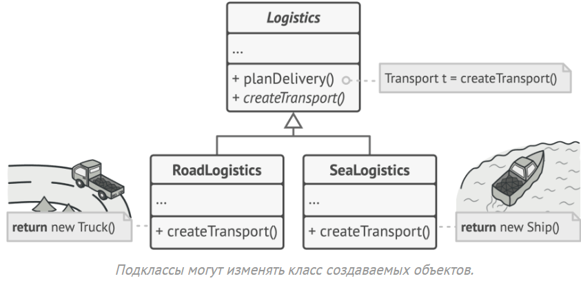
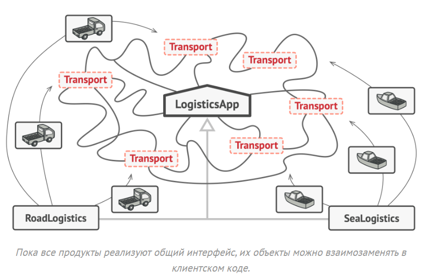

# Фабричный метод (Factory Method)

## Введение в порождающие паттерны

В процессе разработки программного обеспечения часто возникает необходимость создавать объекты, инстанцирование которых требует сложной логики или зависит от контекста выполнения. Прямое использование оператора `new` в таких случаях приводит к жёсткой связанности кода с конкретными классами, что затрудняет расширение и поддержку системы.

Порождающие паттерны (Creational Patterns) — это набор проектных решений, которые абстрагируют процесс создания объектов. Они позволяют системе оставаться независимой от способа создания, композиции и представления объектов, делая код более гибким и расширяемым.

## Определение паттерна

> Вариативность создания объектов при помощи наследования и полиморфизма

**Фабричный метод** (Factory Method) — это порождающий паттерн проектирования, который определяет общий интерфейс для создания объектов в базовом классе, делегируя подклассам решение о том, какой конкретный класс инстанцировать.

Ключевая идея паттерна: использование наследования и полиморфизма для вариативного создания объектов без привязки клиентского кода к конкретным классам продуктов.

## Проблема, которую решает паттерн

### Пример: система управления логистикой

Представим, что мы разрабатываем приложение для управления грузовыми перевозками. На начальном этапе бизнес работает только с автомобильными перевозками, поэтому вся система спроектирована вокруг класса `Truck` (грузовик).

```csharp
public class Truck
{
    public void Deliver()
    {
        Console.WriteLine("Доставка груза по дороге на грузовике");
    }
}

public class LogisticsManager
{
    public void PlanDelivery()
    {
        // Вся логика жёстко привязана к классу Truck
        Truck truck = new Truck();
        truck.Deliver();
    }
}
```

По мере роста бизнеса появляется запрос на поддержку морских перевозок. Теперь необходимо добавить класс `Ship` (судно). Однако существующий код тесно связан с `Truck`, и добавление нового типа транспорта потребует изменений во многих местах программы.


### Проблемы прямого инстанцирования

При использовании оператора `new` напрямую возникают следующие проблемы:

1. **Жёсткая связанность** — код зависит от конкретных классов, а не от абстракций
2. **Нарушение принципа открытости/закрытости** — добавление новых типов требует модификации существующего кода
3. **Разрастание условной логики** — появляются множественные `if-else` или `switch` для выбора типа создаваемого объекта
4. **Дублирование кода** — логика создания повторяется в разных частях системы

**Пример:**
```csharp
// У нас есть абстракция документа
public interface IDocument
{
    void Open();
    void Close();
}

// И конкретные реализации
public class PdfDocument : IDocument
{
    public void Open() { Console.WriteLine("Открываем PDF документ..."); }
    public void Close() { Console.WriteLine("Закрываем PDF документ."); }
}

public class WordDocument : IDocument
{
    public void Open() { Console.WriteLine("Открываем Word документ..."); }
    public void Close() { Console.WriteLine("Закрываем Word документ."); }
}

// Тип документа для выбора
public enum DocumentType
{
    Pdf,
    Word
}

// Клиентский код (например, главное окно приложения)
public class DocumentEditor
{
    private IDocument _currentDoc;

    // Этот метод жестко связан с PdfDocument и WordDocument.
    // Он содержит условную логику (if/else).
    // Если мы захотим добавить ExcelDocument, нам придется изменить этот метод.
    public void CreateAndOpenDocument(DocumentType type)
    {
        // 1. Жёсткая связанность (с new PdfDocument())
        // 2. Разрастание условной логики (if/else)
        // 3. Нарушение OCP (добавление нового типа сломает класс)
        if (type == DocumentType.Pdf)
        {
            _currentDoc = new PdfDocument(); // Прямое создание
        }
        else if (type == DocumentType.Word)
        {
            _currentDoc = new WordDocument(); //  Прямое создание
        }
        else
        {
            throw new NotSupportedException("Этот тип документа не поддерживается");
        }

        // Общая логика работы с документом
        _currentDoc.Open();
        Console.WriteLine("Документ открыт и готов к работе.");
    }
}
```

## Решение через Фабричный метод

### Основная идея

Паттерн предлагает не создавать объекты напрямую с помощью оператора `new`, а делегировать эту ответственность специальному методу — фабричному методу. На первый взгляд может показаться, что мы просто перенесли создание объекта из одного места в другое. Однако суть в том, что теперь мы можем переопределить этот метод в подклассах, изменяя тип создаваемых объектов.

### Шаг 1: Введение общего интерфейса

Для работы паттерна все создаваемые объекты должны следовать общему интерфейсу. Это позволяет клиентскому коду работать с продуктами через абстракцию, не зная их конкретных типов.

```csharp
// Общий интерфейс для всех типов транспорта
public interface ITransport
{
    void Deliver();
}

// Конкретная реализация: грузовик
public class Truck : ITransport
{
    public void Deliver()
    {
        Console.WriteLine("Доставка груза по дороге на грузовике");
    }
}

// Конкретная реализация: судно
public class Ship : ITransport
{
    public void Deliver()
    {
        Console.WriteLine("Доставка груза по морю на судне");
    }
}
```


### Шаг 2: Создание абстрактного создателя с фабричным методом

Базовый класс создателя объявляет фабричный метод, который возвращает объект типа `ITransport`. Этот метод должен быть абстрактным, заставляя подклассы предоставить свою реализацию.

```csharp
// Абстрактный класс создателя (Creator)
public abstract class LogisticsManager
{
    // Фабричный метод - абстрактный, подклассы обязаны его реализовать
    protected abstract ITransport CreateTransport();

    // Основная бизнес-логика, которая использует продукты через абстракцию
    public void PlanDelivery()
    {
        // Вызываем фабричный метод для получения транспорта
        ITransport transport = CreateTransport();
        
        // Работаем с транспортом через интерфейс, не зная конкретного типа
        Console.WriteLine("Планирование маршрута доставки...");
        transport.Deliver();
        Console.WriteLine("Доставка завершена.");
    }
}
```



### Шаг 3: Конкретные создатели

Подклассы переопределяют фабричный метод, возвращая конкретные типы продуктов.

```csharp
// Конкретный создатель для автомобильной логистики
public class RoadLogistics : LogisticsManager
{
    protected override ITransport CreateTransport()
    {
        // Создаём и возвращаем грузовик
        return new Truck();
    }
}

// Конкретный создатель для морской логистики
public class SeaLogistics : LogisticsManager
{
    protected override ITransport CreateTransport()
    {
        // Создаём и возвращаем судно
        return new Ship();
    }
}
```



А так можно решить проблему с документами из примера выше:
```csharp
// Абстракция для создаваемых объектов
public interface IDocument
{
    void Open();
    void Close();
}

// Конкретные продукты (Concrete Products)
public class PdfDocument : IDocument
{
    public void Open() { Console.WriteLine("Открываем PDF документ..."); }
    public void Close() { Console.WriteLine("Закрываем PDF документ."); }
}

public class WordDocument : IDocument
{
    public void Open() { Console.WriteLine("Открываем Word документ..."); }
    public void Close() { Console.WriteLine("Закрываем Word документ."); }
}

// Создатель (Creator) - абстрактный класс,
// который определяет фабричный Метод
public abstract class DocumentCreator
{
    // Фабричный метод CreateDocument
    // Он абстрактный, поэтому подклассы обязаны его реализовать
    // и решить, какой конкретный продукт создавать.
    public abstract IDocument CreateDocument();

    // Также "Создатель" может иметь общую бизнес-логику,
    // которая использует продукт.
    // Обратите внимание: эта логика работает с IDocument,
    // не зная, PDF это или Word.
    public void NewDocument()
    {
        // Получаем продукт через фабричный метод (не new!)
        IDocument doc = CreateDocument(); 
        
        // Работаем с абстракцией
        doc.Open();
        Console.WriteLine("Документ открыт и готов к работе.");
        // ... какая-то логика работы ...
    }
}

// Конкретные создатели (Concrete Creators) 
// Каждый создатель "знает", какой конкретный продукт он должен создавать.
public class PdfCreator : DocumentCreator
{
    // Этот класс реализует фабричный метод...
    public override IDocument CreateDocument()
    {
        // ...и "прячет" вызов 'new' внутри себя.
        // Здесь может быть сложная логика инициализации PDF.
        Console.WriteLine("Фабрика PDF: создаю PdfDocument.");
        return new PdfDocument();
    }
}

public class WordCreator : DocumentCreator
{
    // Эта реализация возвращает другой продукт.
    public override IDocument CreateDocument()
    {
        Console.WriteLine("Фабрика Word: создаю WordDocument.");
        return new WordDocument();
    }
}
```

### Использование паттерна

Клиентский код работает с создателями через базовый тип, не зная о конкретных классах продуктов.

```csharp
// Клиентский код
public class Program
{
    static void Main()
    {
        // Выбор типа логистики может зависеть от конфигурации
        LogisticsManager logistics;
        
        string transportType = GetTransportTypeFromConfig(); // Например, из файла настроек
        
        if (transportType == "road")
        {
            logistics = new RoadLogistics();
        }
        else if (transportType == "sea")
        {
            logistics = new SeaLogistics();
        }
        else
        {
            throw new ArgumentException("Неизвестный тип транспорта");
        }
        
        // Независимо от типа логистики, используем единый интерфейс
        logistics.PlanDelivery();
    }
    
    static string GetTransportTypeFromConfig()
    {
        // Имитация чтения конфигурации
        return "road";
    }
}
```

Важно отметить: для клиента метода `PlanDelivery` не имеет значения, какой конкретно транспорт используется. Он оперирует абстракцией `ITransport` и вызывает метод `Deliver()`. Конкретная реализация определяется в подклассах создателей.

## Структура паттерна


Паттерн Фабричный метод состоит из следующих элементов:

### 1. Product (Продукт)

Определяет общий интерфейс для объектов, которые может создавать создатель и его подклассы. Это абстракция, через которую клиентский код взаимодействует с конкретными продуктами.

```csharp
public interface IProduct
{
    void Operation();
}
```

### 2. Concrete Products (Конкретные продукты)

Различные реализации интерфейса `Product`. Каждый конкретный продукт предоставляет свою специфическую реализацию, но все они следуют общему контракту.

```csharp
public class ConcreteProductA : IProduct
{
    public void Operation()
    {
        Console.WriteLine("Операция конкретного продукта A");
    }
}

public class ConcreteProductB : IProduct
{
    public void Operation()
    {
        Console.WriteLine("Операция конкретного продукта B");
    }
}
```

### 3. Creator (Создатель)

Объявляет фабричный метод, возвращающий объект типа `Product`. Создатель может быть абстрактным классом или интерфейсом. Ключевые моменты:

- Фабричный метод часто объявляется абстрактным, заставляя подклассы предоставить реализацию
- Может иметь реализацию по умолчанию, возвращающую базовый продукт
- Содержит бизнес-логику, которая работает с продуктами через их интерфейс
- Не обязательно создаёт новые объекты каждый раз — может возвращать кэшированные экземпляры

```csharp
public abstract class Creator
{
    // Фабричный метод
    protected abstract IProduct FactoryMethod();
    
    // Бизнес-логика, использующая продукты
    public void SomeOperation()
    {
        IProduct product = FactoryMethod();
        product.Operation();
    }
}
```

### 4. Concrete Creators (Конкретные создатели)

Переопределяют фабричный метод для создания конкретных типов продуктов. Каждый конкретный создатель отвечает за инстанцирование определённого продукта.

```csharp
public class ConcreteCreatorA : Creator
{
    protected override IProduct FactoryMethod()
    {
        return new ConcreteProductA();
    }
}

public class ConcreteCreatorB : Creator
{
    protected override IProduct FactoryMethod()
    {
        return new ConcreteProductB();
    }
}
```

### Диаграмма классов


### Важное замечание

Создание продуктов — не единственная функция создателя. Как правило, создатель содержит основную бизнес-логику, которая работает с продуктами. Фабричный метод отделяет эту логику от деталей инстанцирования конкретных классов.

Аналогия: крупная IT-компания может иметь департамент по подбору персонала, но основная цель компании — разработка программного обеспечения, а не найм сотрудников. Подбор персонала — это вспомогательная функция, обеспечивающая основную деятельность.

## Практический пример: кросс-платформенные UI элементы

Рассмотрим более детальный пример применения паттерна для создания кросс-платформенных элементов пользовательского интерфейса.


### Задача

Необходимо создать систему диалоговых окон, которая работает на разных платформах (Windows, Web). Каждая платформа имеет свои специфические элементы UI (кнопки), но логика работы диалогов должна оставаться общей.

### Решение

Фабричный метод позволяет базовому классу `Dialog` содержать общую логику работы с диалогами, делегируя создание конкретных кнопок подклассам. Базовый класс работает с кнопками через интерфейс `IButton`, не зная об их конкретных типах.

Этот подход можно масштабировать для создания других UI элементов (текстовые поля, чекбоксы и т.д.). Однако при необходимости создания семейств связанных элементов следует рассмотреть паттерн Абстрактная фабрика (Abstract Factory).

### Реализация

```csharp
// ====================
// Product: Интерфейс для всех типов кнопок
// ====================
public interface IButton
{
    // Отрисовка кнопки на экране
    void Render();
    
    // Привязка обработчика события нажатия
    void OnClick(Action handler);
}

// ====================
// Concrete Product: Кнопка для Windows-приложений
// ====================
public class WindowsButton : IButton
{
    public void Render()
    {
        // В реальном приложении здесь была бы отрисовка нативного Windows-контрола
        Console.WriteLine("Отрисована кнопка в стиле Windows (нативный контрол)");
    }

    public void OnClick(Action handler)
    {
        // Регистрация обработчика через Windows API
        Console.WriteLine("Зарегистрирован обработчик нажатия для Windows-кнопки");
        handler?.Invoke();
    }
}

// ====================
// Concrete Product: HTML-кнопка для веб-приложений
// ====================
public class HtmlButton : IButton
{
    public void Render()
    {
        // В реальном приложении генерировался бы HTML-код: <button>OK</button>
        Console.WriteLine("Сгенерирован HTML-код: <button class='btn'>OK</button>");
    }

    public void OnClick(Action handler)
    {
        // Привязка обработчика через JavaScript
        Console.WriteLine("Привязан JavaScript-обработчик события 'click'");
        handler?.Invoke();
    }
}

// ====================
// Creator: Базовый класс для всех типов диалогов
// ====================
public abstract class Dialog
{
    // Основной метод, содержащий бизнес-логику работы с диалогом
    public void Render()
    {
        // Используем фабричный метод для получения кнопки
        // Мы не знаем, какой конкретно тип кнопки будет создан - это решают подклассы
        IButton okButton = CreateButton();
        
        // Привязываем обработчик закрытия
        okButton.OnClick(CloseDialog);
        
        // Отрисовываем диалог и кнопку
        Console.WriteLine("Отрисовка диалогового окна...");
        okButton.Render();
    }

    // Фабричный метод - делегируем создание кнопки подклассам
    // Метод защищён (protected), так как это внутренняя деталь реализации
    protected abstract IButton CreateButton();

    // Общая логика закрытия диалога
    protected void CloseDialog()
    {
        Console.WriteLine("Диалоговое окно закрыто");
    }
}

// ====================
// Concrete Creator: Диалог для Windows
// ====================
public class WindowsDialog : Dialog
{
    // Переопределяем фабричный метод для создания Windows-кнопки
    protected override IButton CreateButton()
    {
        return new WindowsButton();
    }
}

// ====================
// Concrete Creator: Диалог для веб-приложений
// ====================
public class WebDialog : Dialog
{
    // Переопределяем фабричный метод для создания HTML-кнопки
    protected override IButton CreateButton()
    {
        return new HtmlButton();
    }
}

// ====================
// Конфигурация приложения
// ====================
public class AppConfig
{
    public string Platform { get; set; } = "Windows";
}

// ====================
// Клиентский код
// ====================
public class Application
{
    private Dialog? _dialog;
    private readonly AppConfig _config;

    public Application(AppConfig config)
    {
        _config = config;
    }

    public void Initialize()
    {
        // Определяем тип диалога на основе конфигурации или окружения
        // В реальном приложении это могло бы быть:
        // - Чтение из appsettings.json
        // - Определение платформы через RuntimeInformation
        // - Выбор пользователя
        
        _dialog = _config.Platform switch
        {
            "Windows" => new WindowsDialog(),
            "Web" => new WebDialog(),
            _ => throw new ArgumentException($"Неподдерживаемая платформа: {_config.Platform}")
        };
    }

    public void Run()
    {
        Initialize();
        
        // Работаем с диалогом через базовый тип
        // Нам не важно, какой конкретный тип диалога используется
        _dialog?.Render();
    }
}

// ====================
// Точка входа программы
// ====================
public static class Program
{
    public static void Main()
    {
        // Создаём конфигурацию (может быть загружена из файла)
        var config = new AppConfig { Platform = "Windows" };
        
        // Создаём и запускаем приложение
        var app = new Application(config);
        app.Run();
        
        Console.WriteLine("\n--- Переключение на веб-платформу ---\n");
        
        // Демонстрация работы с другой платформой
        var webConfig = new AppConfig { Platform = "Web" };
        var webApp = new Application(webConfig);
        webApp.Run();
    }
}
```

### Вывод программы

```
Отрисовка диалогового окна...
Отрисована кнопка в стиле Windows (нативный контрол)
Зарегистрирован обработчик нажатия для Windows-кнопки
Диалоговое окно закрыто

--- Переключение на веб-платформу ---

Отрисовка диалогового окна...
Сгенерирован HTML-код: <button class='btn'>OK</button>
Привязан JavaScript-обработчик события 'click'
Диалоговое окно закрыто
```

## Когда применять Фабричный метод

### 1. Когда типы создаваемых объектов заранее неизвестны

Фабричный метод отделяет код создания продуктов от кода, который их использует. Это позволяет расширять систему новыми типами продуктов без изменения существующего кода.

**Пример:** Система отчётности, которая должна поддерживать различные форматы экспорта (PDF, Excel, CSV). В будущем могут появиться новые форматы (JSON, XML), но основная логика генерации отчёта остаётся неизменной.

```csharp
// Для добавления нового формата достаточно создать новый класс
public class JsonReportExporter : ReportExporter
{
    protected override IExporter CreateExporter()
    {
        return new JsonExporter(); // Новый продукт
    }
}
// Существующий код не требует изменений!
```

### 2. Когда необходимо предоставить точки расширения для библиотеки или фреймворка

Пользователи вашей библиотеки могут расширять функциональность через наследование. Фабричный метод позволяет им внедрять свои реализации компонентов без модификации кода библиотеки.

**Пример:** UI-фреймворк с стандартными прямоугольными кнопками.

```csharp
// Код фреймворка
public abstract class UIFramework
{
    protected virtual IButton CreateButton()
    {
        return new RectangularButton(); // Кнопка по умолчанию
    }
    
    public void BuildInterface()
    {
        IButton button = CreateButton();
        button.Render();
    }
}

// Пользовательское расширение
public class CustomUIFramework : UIFramework
{
    protected override IButton CreateButton()
    {
        return new RoundButton(); // Круглая кнопка пользователя
    }
}
```

Пользователь создаёт подкласс `CustomUIFramework`, переопределяет `CreateButton()`, и фреймворк начинает использовать пользовательские кнопки без изменения своего кода.

### 3. Когда нужно управлять жизненным циклом объектов

Фабричный метод не обязан создавать новые объекты при каждом вызове. Он может реализовывать паттерн Object Pool, возвращая существующие объекты из кэша или пула.

**Пример:** Управление подключениями к базе данных.

```csharp
public abstract class DatabaseManager
{
    // Пул соединений
    private static readonly Queue<IConnection> _connectionPool = new();
    private static readonly object _lock = new();

    protected virtual IConnection CreateConnection()
    {
        lock (_lock)
        {
            // Если есть свободное соединение - используем его
            if (_connectionPool.Count > 0)
            {
                Console.WriteLine("Переиспользование существующего соединения из пула");
                return _connectionPool.Dequeue();
            }
            
            // Иначе создаём новое
            Console.WriteLine("Создание нового соединения");
            return CreateNewConnection();
        }
    }
    
    // Подклассы определяют, как создавать новое соединение
    protected abstract IConnection CreateNewConnection();
    
    // Возврат соединения в пул
    public void ReleaseConnection(IConnection connection)
    {
        lock (_lock)
        {
            _connectionPool.Enqueue(connection);
        }
    }
    
    public void ExecuteQuery(string query)
    {
        IConnection connection = CreateConnection();
        try
        {
            connection.Execute(query);
        }
        finally
        {
            ReleaseConnection(connection);
        }
    }
}
```

Этот подход экономит ресурсы, так как создание новых подключений к БД — дорогостоящая операция.

### 4. Когда создание объекта требует сложной логики

Если инстанцирование объекта включает нетривиальные шаги (валидацию, конфигурацию, загрузку ресурсов), фабричный метод инкапсулирует эту сложность.

**Пример:** Создание логгеров с различными конфигурациями.

```csharp
public abstract class LoggerFactory
{
    protected abstract ILogger CreateLogger();
    
    public ILogger GetConfiguredLogger()
    {
        ILogger logger = CreateLogger();
        
        // Общая логика конфигурации
        logger.SetTimestampFormat("yyyy-MM-dd HH:mm:ss");
        logger.SetMinimumLevel(LogLevel.Info);
        
        return logger;
    }
}

public class FileLoggerFactory : LoggerFactory
{
    private readonly string _filePath;
    
    public FileLoggerFactory(string filePath)
    {
        _filePath = filePath;
    }
    
    protected override ILogger CreateLogger()
    {
        // Сложная логика: проверка существования папки, прав доступа, и т.д.
        string directory = Path.GetDirectoryName(_filePath);
        if (!Directory.Exists(directory))
        {
            Directory.CreateDirectory(directory);
        }
        
        return new FileLogger(_filePath);
    }
}
```

> Но если честно, то фабричный метод практически никогда не используется, в отличии от абстрактной фабрики... Несмотря на то, как GoF его рекламировала в своей книге... 

## Шаги реализации паттерна

### Шаг 1: Определить общий интерфейс продуктов

Все создаваемые объекты должны реализовывать общий интерфейс или наследоваться от общего базового класса.

```csharp
public interface IProduct
{
    void DoSomething();
}
```

### Шаг 2: Создать базовый класс создателя с фабричным методом

Добавьте в класс, который должен создавать продукты, абстрактный или виртуальный фабричный метод, возвращающий тип общего интерфейса.

```csharp
public abstract class Creator
{
    protected abstract IProduct FactoryMethod();
    
    public void BusinessLogic()
    {
        IProduct product = FactoryMethod();
        product.DoSomething();
    }
}
```

### Шаг 3: Заменить прямое создание объектов вызовами фабричного метода

Найдите все места в коде создателя, где используется оператор `new` для создания продуктов, и замените их вызовами фабричного метода.

**Было:**
```csharp
public class Creator
{
    public void BusinessLogic()
    {
        ConcreteProduct product = new ConcreteProduct(); // Жёсткая связь
        product.DoSomething();
    }
}
```

**Стало:**
```csharp
public abstract class Creator
{
    protected abstract IProduct FactoryMethod();
    
    public void BusinessLogic()
    {
        IProduct product = FactoryMethod(); // Делегирование
        product.DoSomething();
    }
}
```

На этом этапе фабричный метод может содержать большой условный оператор для выбора создаваемого продукта. Это нормально — мы исправим это на следующем шаге.

### Шаг 4: Создать конкретные подклассы создателей

Для каждого типа продукта создайте подкласс создателя и переопределите фабричный метод, возвращая нужный тип продукта.

```csharp
public class ConcreteCreatorA : Creator
{
    protected override IProduct FactoryMethod()
    {
        return new ConcreteProductA();
    }
}

public class ConcreteCreatorB : Creator
{
    protected override IProduct FactoryMethod()
    {
        return new ConcreteProductB();
    }
}
```

### Шаг 5: Рассмотреть параметризацию (опционально)

Если количество продуктов велико и создание нового подкласса для каждого нецелесообразно, можно добавить параметры в фабричный метод.

**Пример:** Система почтовой доставки.

```csharp
public abstract class MailService
{
    // Параметризованный фабричный метод
    protected abstract IVehicle CreateVehicle(VehicleType type);
    
    public void DeliverMail(VehicleType preferredType)
    {
        IVehicle vehicle = CreateVehicle(preferredType);
        vehicle.Deliver();
    }
}

public class GroundMailService : MailService
{
    protected override IVehicle CreateVehicle(VehicleType type)
    {
        return type switch
        {
            VehicleType.Bus => new Bus(),
            VehicleType.Train => new Train(),
            VehicleType.Truck => new Truck(),
            _ => throw new ArgumentException($"Тип {type} не поддерживается наземной почтой")
        };
    }
}

public enum VehicleType
{
    Bus,
    Train,
    Truck,
    Plane,
    Ship
}
```

Однако следует помнить: чрезмерная параметризация может привести к усложнению кода. Если параметров становится много, рассмотрите использование паттернов Строитель (Builder) или Абстрактная фабрика (Abstract Factory).

### Шаг 6: Определить реализацию по умолчанию (опционально)

Если существует стандартный продукт, который создаётся в большинстве случаев, можно сделать фабричный метод виртуальным (не абстрактным) и предоставить реализацию по умолчанию.

```csharp
public class Creator
{
    // Виртуальный метод с реализацией по умолчанию
    protected virtual IProduct FactoryMethod()
    {
        return new DefaultProduct();
    }
    
    public void BusinessLogic()
    {
        IProduct product = FactoryMethod();
        product.DoSomething();
    }
}

// Подклассы могут переопределить метод при необходимости
public class SpecialCreator : Creator
{
    protected override IProduct FactoryMethod()
    {
        return new SpecialProduct();
    }
}
```

## Детальный пример: система обработки платежей

Рассмотрим реалистичный пример, который покажет, как Фабричный метод решает проблему разделения бизнес-логики и логики создания объектов.


### Проблема: жёсткая связь с конкретным типом

Предположим, мы разрабатываем систему обработки заказов для интернет-магазина.

```csharp
// Модель позиции заказа
public record OrderItem(string Name, decimal Price, int Quantity)
{
    // Вычисляемое свойство: стоимость = цена × количество
    public decimal Cost => Price * Quantity;
}

// Модель заказа
public record Order(IEnumerable<OrderItem> Items, string PromoCode)
{
    // Общая стоимость всех позиций в заказе
    public decimal TotalCost => Items.Sum(x => x.Cost);
}

// Конкретный тип платежа - оплата наличными
public record CashPayment(decimal Amount);

// Калькулятор платежей - проблемная реализация
public class PaymentCalculator
{
    public CashPayment Calculate(Order order)
    {
        decimal totalCost = order.TotalCost;

        // Применяем скидки и промокоды (сложная бизнес-логика)
        if (order.PromoCode == "SUMMER2025")
        {
            totalCost *= 0.9m; // 10% скидка
        }
        
        if (totalCost > 1000)
        {
            totalCost -= 50; // Скидка 50 за крупную покупку
        }

        // проблема: жёстко привязаны к типу CashPayment
        return new CashPayment(totalCost);
    }
}
```

### Анализ проблемы

**Проблема 1: Жёсткая связь**  
`PaymentCalculator` жёстко привязан к типу `CashPayment`. Метод `Calculate` всегда возвращает оплату наличными, даже если клиент хочет оплатить картой или криптовалютой.

**Проблема 2: Нарушение принципа открытости/закрытости**  
Чтобы добавить поддержку банковского перевода, нам придётся:
- Либо модифицировать метод `Calculate`, добавляя условную логику
- Либо дублировать весь код в новый класс `BankPaymentCalculator`, меняя только одну строку

**Проблема 3: Смешивание ответственностей**  
Логика расчёта (применение скидок) и логика создания объекта платежа находятся в одном месте.

### Решение через Фабричный метод

Разделим ответственности: создание платежа делегируем подклассам через фабричный метод.

#### Шаг 1: Определяем общий интерфейс для платежей (Product)

```csharp
// Product: общий интерфейс для всех типов платежей
public interface IPayment
{
    decimal Amount { get; }
    string GetPaymentDetails();
}
```

#### Шаг 2: Создаём конкретные типы платежей (Concrete Products)

```csharp
// Concrete Product: оплата наличными
public record CashPayment(decimal Amount) : IPayment
{
    public string GetPaymentDetails()
    {
        return $"Оплата наличными: {Amount:C}";
    }
}

// Concrete Product: банковский перевод
public record BankPayment(
    decimal Amount, 
    string AccountNumber, 
    string BankName) : IPayment
{
    public string GetPaymentDetails()
    {
        return $"Банковский перевод: {Amount:C}\n" +
               $"Счёт: {AccountNumber}\n" +
               $"Банк: {BankName}";
    }
}

// Concrete Product: оплата криптовалютой
public record CryptoPayment(
    decimal Amount, 
    string WalletAddress, 
    string Currency) : IPayment
{
    public string GetPaymentDetails()
    {
        return $"Криптовалютный платёж: {Amount:C}\n" +
               $"Кошелёк: {WalletAddress}\n" +
               $"Валюта: {Currency}";
    }
}
```

#### Шаг 3: Создаём абстрактный калькулятор с фабричным методом (Creator)

```csharp
// Creator: абстрактный калькулятор платежей
public abstract class PaymentCalculator
{
    // Основная бизнес-логика расчёта платежа
    // Этот метод содержит общую логику для всех типов платежей
    public IPayment Calculate(Order order)
    {
        decimal totalCost = order.TotalCost;

        // Применяем промокоды
        totalCost = ApplyPromoCode(totalCost, order.PromoCode);
        
        // Применяем скидки за объём покупки
        totalCost = ApplyVolumeDiscount(totalCost);
        
        // Применяем сезонные скидки
        totalCost = ApplySeasonalDiscount(totalCost);

        // ФАБРИЧНЫЙ МЕТОД: делегируем создание платежа подклассам
        // Мы не знаем, какой конкретный тип платежа будет создан
        return CreatePayment(totalCost);
    }

    // Фабричный метод - подклассы обязаны его реализовать
    // Он protected, так как это внутренняя деталь реализации
    protected abstract IPayment CreatePayment(decimal amount);

    // Вспомогательные методы бизнес-логики
    private decimal ApplyPromoCode(decimal amount, string promoCode)
    {
        return promoCode switch
        {
            "SUMMER2025" => amount * 0.9m,   // 10% скидка
            "VIP2025" => amount * 0.85m,     // 15% скидка
            "NEWCLIENT" => amount * 0.95m,   // 5% скидка
            _ => amount
        };
    }

    private decimal ApplyVolumeDiscount(decimal amount)
    {
        // Прогрессивная скидка за объём покупки
        if (amount > 5000) return amount - 200;
        if (amount > 1000) return amount - 50;
        return amount;
    }

    private decimal ApplySeasonalDiscount(decimal amount)
    {
        // Пример: скидка в определённые месяцы
        int currentMonth = DateTime.Now.Month;
        if (currentMonth is 1 or 2) // Зимняя распродажа
        {
            return amount * 0.95m; // Дополнительная скидка 5%
        }
        return amount;
    }
}
```

#### Шаг 4: Создаём конкретные калькуляторы (Concrete Creators)

```csharp
// Concrete Creator: калькулятор для наличных платежей
public class CashPaymentCalculator : PaymentCalculator
{
    // Переопределяем фабричный метод для создания платежа наличными
    protected override IPayment CreatePayment(decimal amount)
    {
        return new CashPayment(amount);
    }
}

// Concrete Creator: калькулятор для банковских переводов
public class BankPaymentCalculator : PaymentCalculator
{
    // У этого создателя есть своё состояние - реквизиты получателя
    private readonly string _accountNumber;
    private readonly string _bankName;

    public BankPaymentCalculator(string accountNumber, string bankName)
    {
        _accountNumber = accountNumber;
        _bankName = bankName;
    }

    // Переопределяем фабричный метод для создания банковского платежа
    protected override IPayment CreatePayment(decimal amount)
    {
        // Используем состояние объекта для создания платежа
        return new BankPayment(amount, _accountNumber, _bankName);
    }
}

// Concrete Creator: калькулятор для криптовалютных платежей
public class CryptoPaymentCalculator : PaymentCalculator
{
    private readonly string _walletAddress;
    private readonly string _currency;

    public CryptoPaymentCalculator(string walletAddress, string currency = "BTC")
    {
        _walletAddress = walletAddress;
        _currency = currency;
    }

    protected override IPayment CreatePayment(decimal amount)
    {
        return new CryptoPayment(amount, _walletAddress, _currency);
    }
}
```

#### Шаг 5: Использование в клиентском коде

```csharp
public class OrderProcessor
{
    public void ProcessOrder(Order order, string paymentMethod)
    {
        // Выбираем калькулятор в зависимости от способа оплаты
        // Это может определяться конфигурацией, выбором пользователя и т.д.
        PaymentCalculator calculator = paymentMethod switch
        {
            "cash" => new CashPaymentCalculator(),
            "bank" => new BankPaymentCalculator("40817810099910004312", "Сбербанк"),
            "crypto" => new CryptoPaymentCalculator("1A1zP1eP5QGefi2DMPTfTL5SLmv7DivfNa", "BTC"),
            _ => throw new ArgumentException($"Неизвестный способ оплаты: {paymentMethod}")
        };

        // Выполняем расчёт - вся бизнес-логика находится в базовом классе
        // Нам не важно, какой конкретный тип платежа будет создан
        IPayment payment = calculator.Calculate(order);

        // Выводим информацию о платеже
        Console.WriteLine("=== Детали платежа ===");
        Console.WriteLine(payment.GetPaymentDetails());
        Console.WriteLine("======================\n");
    }
}

// Демонстрация работы системы
public class Program
{
    public static void Main()
    {
        // Создаём тестовый заказ
        var order = new Order(
            new[]
            {
                new OrderItem("Ноутбук", 50000, 1),
                new OrderItem("Мышь", 1000, 2),
                new OrderItem("Клавиатура", 3000, 1)
            },
            "SUMMER2025"
        );

        var processor = new OrderProcessor();

        // Обрабатываем заказ разными способами оплаты
        Console.WriteLine("1. Оплата наличными:");
        processor.ProcessOrder(order, "cash");

        Console.WriteLine("2. Оплата банковским переводом:");
        processor.ProcessOrder(order, "bank");

        Console.WriteLine("3. Оплата криптовалютой:");
        processor.ProcessOrder(order, "crypto");
    }
}
```

### Результат выполнения

```
1. Оплата наличными:
=== Детали платежа ===
Оплата наличными: 47 455,00 ₽
======================

2. Оплата банковским переводом:
=== Детали платежа ===
Банковский перевод: 47 455,00 ₽
Счёт: 40817810099910004312
Банк: Сбербанк
======================

3. Оплата криптовалютой:
=== Детали платежа ===
Криптовалютный платёж: 47 455,00 ₽
Кошелёк: 1A1zP1eP5QGefi2DMPTfTL5SLmv7DivfNa
Валюта: BTC
======================
```

### Что мы получили


**1. Разделение ответственностей**  
Бизнес-логика расчёта (применение скидок, купонов) находится в базовом классе `PaymentCalculator`. Логика создания конкретных платежей инкапсулирована в подклассах.

**2. Соблюдение принципа открытости/закрытости**  
Чтобы добавить новый способ оплаты (например, Apple Pay или QR-код), достаточно:
- Создать новый класс продукта (`ApplePayPayment`)
- Создать новый класс создателя (`ApplePayPaymentCalculator`)
- Существующий код не требует изменений

**3. Гибкость через состояние создателей**  
Каждый конкретный создатель может иметь своё состояние. Например, `BankPaymentCalculator` хранит банковские реквизиты, а `CryptoPaymentCalculator` — адрес кошелька. Это позволяет гибко конфигурировать создателей.

**4. Единая точка изменения бизнес-логики**  
Если изменится логика расчёта скидок (добавится новый промокод, изменятся условия), мы меняем только базовый класс `PaymentCalculator`. Все подклассы автоматически получат обновлённую логику.

## Преимущества и недостатки паттерна

### Преимущества

**1. Избавление от жёсткой связи**  
Код не привязан к конкретным классам продуктов. Создатели работают с продуктами через абстракции.

**2. Принцип единственной ответственности**  
Код создания продуктов выделен в отдельные классы создателей, что упрощает его понимание и поддержку.

**3. Принцип открытости/закрытости**  
Новые типы продуктов можно добавлять без изменения существующего кода создателей.

**4. Упрощение тестирования**  
Можно легко создать mock-реализации продуктов для тестирования бизнес-логики создателей.

### Недостатки

**1. Разрастание иерархий классов**  
Для каждого нового типа продукта необходимо создавать соответствующий подкласс создателя. В системе с десятками типов продуктов это может привести к большому количеству классов.

**Пример:** Если у нас 10 типов продуктов, нам понадобится минимум 10 классов создателей. При наличии нескольких иерархий создателей (например, `PaymentCalculator`, `FastPaymentCalculator`, `SecurePaymentCalculator`) количество классов растёт квадратично.

**2. Сильная связанность через наследование**  
Конкретные создатели жёстко связаны с базовым типом через наследование. Переиспользовать логику создания из одного создателя в другом невозможно.

**Пример:**

Пусть у нас есть два "семейства" фабрик:
 - одно для стандартных платежей,
 - другое для экспресс платежей.
```csharp
public abstract class StandardPaymentCalculator { ... }
public abstract class ExpressPaymentCalculator { ... }
```

Теперь нам нужно создать наличный платёж (CashPayment). Но из-за того, что у нас две разные базовые иерархии, нам приходится создавать два отдельных класса:
```csharp
// Для CashPayment нужны два отдельных создателя
public class CashStandardCalculator : StandardPaymentCalculator { ... }
public class CashExpressCalculator : ExpressPaymentCalculator { ... }
```
В обоих классах (CashStandardCalculator и CashExpressCalculator) придётся повторять одну и ту же логику по созданию CashPayment:

```csharp
public class CashStandardCalculator : StandardPaymentCalculator {
    public override Payment CreatePayment() => new CashPayment(...);
}

public class CashExpressCalculator : ExpressPaymentCalculator {
    public override Payment CreatePayment() => new CashPayment(...); // Дублирование
}
```
Другими словами:
```csharp
// Есть две иерархии создателей
public abstract class StandardPaymentCalculator { ... }
public abstract class ExpressPaymentCalculator { ... }

// Для CashPayment нужны два отдельных создателя
public class CashStandardCalculator : StandardPaymentCalculator { ... }
public class CashExpressCalculator : ExpressPaymentCalculator { ... }

// Логика создания CashPayment дублируется в обоих классах
// Мы не можем переиспользовать CashStandardCalculator в CashExpressCalculator
```

**Решение:** В таких случаях можно рассмотреть использование композиции вместо наследования или применение паттерна Стратегия (Strategy) для логики создания.

**3. Неявное нарушение принципа единственной ответственности**  
Конкретный создатель становится ответственным как за реализацию бизнес-логики (наследуемой от базового класса), так и за создание продуктов.

**Пример:** `BankPaymentCalculator` одновременно:
- Выполняет расчёт платежа (метод `Calculate` из базового класса)
- Создаёт объект `BankPayment` (метод `CreatePayment`)

Это две разные причины для изменения:
- Изменилась логика расчёта → изменяется базовый класс, затрагивая все подклассы
- Изменился формат данных `BankPayment` → изменяется конкретный создатель

```csharp
// --- 1. Продукт (Payment Product) ---
public interface IPayment
{
    // Информация, которую нужно вывести или сохранить
    void ProcessDetails();
}

public class SalaryPayment : IPayment
{
    public decimal Amount { get; set; }
    // ...
    public void ProcessDetails() => Console.WriteLine($"[Зарплата]: Обрабатывается сумма {Amount:C}.");
}

// Создатель (Creator) с Бизнес-логикой
public abstract class PaymentCalculator
{
    // Бизнес-логика:
    // Этот метод содержит основную логику расчета, которая не зависит от типа платежа.
    // При изменении налогового кодекса или формулы расчета, этот метод должен измениться.
    public decimal Calculate(decimal baseAmount)
    {
        // Первая причина для изменений - бизнес-логика
        decimal tax = baseAmount * 0.13m; // Расчет налогов, ставка может поменяться
        decimal finalAmount = baseAmount - tax;
        Console.WriteLine($"Базовый расчет: {baseAmount:C}, Налог: {tax:C}, Итого: {finalAmount:C}");
        return finalAmount;
    }

    // Фабричный метод:
    // Этот метод делегирует создание конкретного продукта подклассам.
    // При изменении структуры IPayment, этот метод не меняется, но его реализации - да.
    protected abstract IPayment CreatePayment(decimal finalAmount);

    // Основной процесс (использует оба метода)
    public IPayment ExecuteCalculation(decimal baseAmount)
    {
        decimal finalAmount = Calculate(baseAmount);
        IPayment payment = CreatePayment(finalAmount);
        return payment;
    }
}

// Конкретный создатель (Concrete Creator) 
public class SalaryPaymentCreator : PaymentCalculator
{
    // Этот класс ответственен за создание конкретного объекта.
    protected override IPayment CreatePayment(decimal finalAmount)
    {
        // Вторая причина для изменения (логика создания/структура продукта)
        // Если класс SalaryPayment изменит свои конструкторы или свойства,
        // этот метод должен измениться.
        return new SalaryPayment { Amount = finalAmount }; 
    }
    
    // Этот класс также наследует и использует Calculate().
    // Он несет двойную ответственность.
}

// --- Использование ---
// PaymentCalculator creator = new SalaryPaymentCreator();
// IPayment salary = creator.ExecuteCalculation(10000);
// salary.ProcessDetails();
```

**Когда это становится проблемой:** Если и бизнес-логика, и логика создания становятся сложными, класс становится трудным для понимания и поддержки.

**Решение:** Можно делегировать создание продуктов отдельным классам-фабрикам (паттерн Абстрактная фабрика) или использовать композицию.

## Когда не следует применять Фабричный метод

**1. Когда создание объекта тривиально**  
Если создание продукта — это просто `new ConcreteProduct()` без дополнительной логики, паттерн может быть излишним.

**2. Когда иерархия продуктов стабильна**  
Если типы продуктов редко меняются и их немного, прямое инстанцирование может быть проще и понятнее.

**3. Когда нужна фабрика семейств объектов**  
Если необходимо создавать целые семейства связанных объектов, лучше подходит паттерн Абстрактная фабрика (Abstract Factory).

**4. Когда создание объекта требует сложной пошаговой конфигурации**  
В этом случае более подходящим будет паттерн Строитель (Builder).

## Связь с другими паттернами

**Абстрактная фабрика (Abstract Factory)**  
Часто реализуется с помощью набора фабричных методов. Абстрактная фабрика создаёт семейства связанных объектов, в то время как Фабричный метод создаёт один тип объектов.

**Прототип (Prototype)**  
Альтернатива Фабричному методу. Вместо создания объектов через наследование, объекты создаются клонированием прототипов.

**Шаблонный метод (Template Method)**  
Фабричный метод — частный случай Шаблонного метода. Фабричный метод специализируется на создании объектов, в то время как Шаблонный метод определяет скелет алгоритма.

**Одиночка (Singleton)**  
Фабричный метод может использоваться для управления созданием единственного экземпляра класса.

## Заключение

Фабричный метод (Factory Method) — мощный паттерн проектирования, который решает проблему жёсткой связи между кодом и конкретными классами. Он использует наследование и полиморфизм для делегирования создания объектов подклассам.

### Ключевые моменты

- **Делегирование создания**: Базовый класс определяет, когда создавать объекты, подклассы — что создавать
- **Работа через абстракции**: Код оперирует интерфейсами продуктов, а не конкретными классами
- **Расширяемость**: Новые типы продуктов добавляются без модификации существующего кода
- **Разделение ответственностей**: Бизнес-логика отделена от логики создания объектов

### Когда применять

Используйте Фабричный метод, когда:
- Заранее неизвестны точные типы создаваемых объектов
- Необходимо предоставить точки расширения для библиотеки или фреймворка
- Требуется управление жизненным циклом объектов (пулы, кэширование)
- Создание объекта требует нетривиальной логики