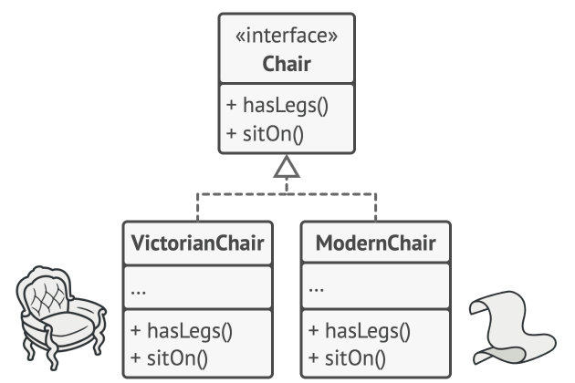
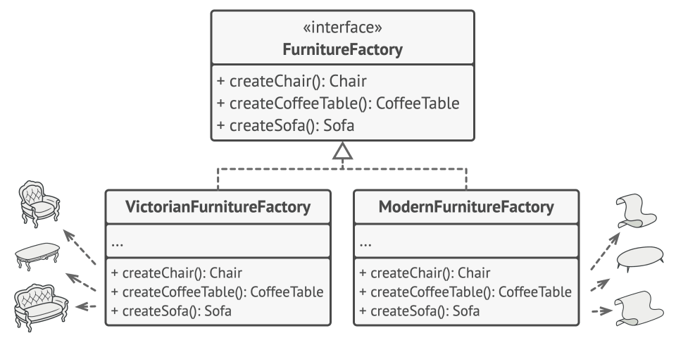

# Abstract Factory (Абстрактная фабрика)

## Определение паттерна

> Вариативность создания объектов при помощи композиции и полиморфизма

**Abstract Factory** (Абстрактная фабрика) — это порождающий паттерн проектирования, который позволяет создавать семейства связанных объектов, не привязываясь к конкретным классам создаваемых объектов.

Паттерн решает проблему создания целых наборов взаимосвязанных продуктов через композицию и полиморфизм. В отличие от Factory Method (Фабричного метода), который подходит для создания одного типа объектов, Abstract Factory используется, когда необходимо обеспечить согласованность между несколькими типами создаваемых объектов.

## Проблема, решаемая паттерном

### Ограничения фабричного метода

Фабричный метод хорошо работает, когда нужно создать один тип объекта. Рассмотрим пример с диалоговым окном: 
```csharp
// Пример использования фабричного метода
public abstract class Dialog
{
    public void Render()
    {
        // Используем фабричный метод для создания одного элемента - кнопки
        IButton okButton = CreateButton();
        okButton.Render();
    }

    // Фабричный метод - абстрактный метод для создания кнопки
    protected abstract IButton CreateButton();
}
```

Этот подход работает хорошо для создания одного типа элементов. Но что произойдёт, если нам понадобится добавить второй элемент, например, текстовое поле `ITextBox`?

```csharp
// При добавлении второго элемента появляется проблема
public abstract class Dialog
{
    public void Render()
    {
        // Нам нужно создать 2 элемента, и они должны быть из одного семейства
        // (оба должны быть в стиле Windows или оба в стиле HTML)
        IButton okButton = CreateButton();
        ITextBox nameBox = CreateTextBox(); // Добавили второй фабричный метод
        
        okButton.Render();
        nameBox.Render();
    }

    // Класс начинает "распухать" от абстрактных методов
    protected abstract IButton CreateButton();
    protected abstract ITextBox CreateTextBox(); // Второй фабричный метод
}
```

При добавлении третьего элемента проблема усугубляется:

```csharp
// С каждым новым элементом добавляется ещё один абстрактный фабричный метод
public abstract class Dialog
{
    public void Render()
    {
        IButton okButton = CreateButton();
        ITextBox nameBox = CreateTextBox(); 
        IScrollBar vScroll = CreateScrollBar(); // Третий элемент
        
        okButton.Render();
        nameBox.Render();
        vScroll.Render();
    }

    // Уже три фабричных метода
    protected abstract IButton CreateButton();
    protected abstract ITextBox CreateTextBox(); 
    protected abstract IScrollBar CreateScrollBar(); // Третий фабричный метод
}
```

### Почему это проблема

При таком подходе:

1. **Нарушение Open/Closed Principle**: каждый раз при добавлении нового типа элемента интерфейса нужно модифицировать абстрактный класс `Dialog` и все его наследники.

2. **Высокая связанность**: каждый конкретный класс-наследник `Dialog` должен реализовать все фабричные методы, даже если некоторые элементы ему не нужны.

3. **Сложность поддержки**: при наличии множества наследников изменение становится трудоёмким, так как требуется внести изменения в каждый класс.

Фабричный метод не подходит, когда нужно создавать не один объект, а **семейство взаимосвязанных объектов**, которые должны работать согласованно.

## Решение: использование композиции

Проблему можно решить через **композицию** — вместо множества фабричных методов внутри класса, мы создаём отдельный объект-фабрику, который инкапсулирует логику создания всего семейства продуктов.

```csharp
// 1. Абстрактная фабрика - интерфейс, описывающий создание семейства продуктов
public interface IUIFactory
{
    IButton CreateButton();
    ITextBox CreateTextBox();
    IScrollBar CreateScrollBar();
}

// 2. Конкретная фабрика для Windows-стиля
// Создаёт все элементы интерфейса в едином стиле Windows
public class WindowsFactory : IUIFactory
{
    public IButton CreateButton() => new WindowsButton();
    public ITextBox CreateTextBox() => new WindowsTextBox();
    public IScrollBar CreateScrollBar() => new WindowsScrollBar();
}

// 3. Конкретная фабрика для Web-стиля (HTML)
// Создаёт все элементы интерфейса в едином стиле HTML
public class WebFactory : IUIFactory
{
    public IButton CreateButton() => new HtmlButton();
    public ITextBox CreateTextBox() => new HtmlTextBox();
    public IScrollBar CreateScrollBar() => new HtmlScrollBar();
}

// 4. Клиентский код больше не является абстрактным
// Он принимает фабрику через конструктор (Dependency Injection)
public class Dialog
{
    // Используем композицию - храним ссылку на фабрику
    private readonly IUIFactory _factory;

    // Внедрение зависимости через конструктор
    public Dialog(IUIFactory factory)
    {
        _factory = factory;
    }

    // Метод Render() работает с любой фабрикой
    public void Render()
    {
        // Делегируем создание элементов фабрике
        // Фабрика гарантирует, что все элементы будут из одного семейства
        IButton okButton = _factory.CreateButton();
        ITextBox nameBox = _factory.CreateTextBox();
        IScrollBar scrollBar = _factory.CreateScrollBar();
        
        // Используем созданные элементы
        okButton.Render();
        nameBox.Render();
        scrollBar.Render();
    }
}
```

### Преимущества нового подхода

1. **Расширяемость**: для добавления нового семейства элементов (например, MacOS-стиля) достаточно создать новую реализацию `IUIFactory`, не изменяя класс `Dialog`.

2. **Согласованность**: фабрика гарантирует, что все создаваемые элементы принадлежат одному семейству (все Windows или все HTML).

3. **Соблюдение принципов SOLID**: класс `Dialog` зависит только от абстракции `IUIFactory`, а не от конкретных классов элементов.

## Пример из реальной практики: система платежей

Рассмотрим практический пример использования паттерна на задаче обработки различных типов платежей в коммерческом приложении.

### Определение продуктов

Начнём с определения абстрактного типа платежа и его конкретных реализаций:

```csharp
// Абстрактный продукт - общий интерфейс для всех типов платежей
public interface IPayment
{
    decimal Amount { get; }
}

// Конкретный продукт 1: банковский платёж
// Требует дополнительную информацию - ID счёта получателя
public record BankPayment(
    decimal Amount,
    string ReceiverAccountId) : IPayment;

// Конкретный продукт 2: наличный платёж
// Требует только сумму
public record CashPayment(
    decimal Amount) : IPayment;
```

### Определение абстрактной фабрики

Создаём интерфейс фабрики, который определяет контракт для создания платежей:

```csharp
// Абстрактная фабрика
// Определяет метод создания платежа
public interface IPaymentFactory
{
    IPayment Create(decimal amount);
}
```

### Реализация конкретных фабрик

Каждая конкретная фабрика специализируется на создании определённого типа платежа:
```csharp
// Конкретная фабрика 1: создаёт банковские платежи
public class BankPaymentFactory : IPaymentFactory
{
    private readonly string _currentReceiverAccountId;

    // Важно: фабрика может иметь собственное состояние
    // В данном случае - ID счёта получателя, который используется при создании всех платежей
    public BankPaymentFactory(string currentReceiverAccountId)
    {
        _currentReceiverAccountId = currentReceiverAccountId;
    }

    public IPayment Create(decimal amount)
    {
        // Эта фабрика инкапсулирует логику создания банковского платежа
        // Клиентский код не знает о существовании поля ReceiverAccountId
        return new BankPayment(amount, _currentReceiverAccountId);
    }
}

// Конкретная фабрика 2: создаёт наличные платежи
public class CashPaymentFactory : IPaymentFactory
{
    public IPayment Create(decimal amount)
    {
        // Эта фабрика создаёт наличный платёж
        // Логика проще, так как не требуется дополнительная информация
        return new CashPayment(amount);
    }
}
```

### Использование фабрик в клиентском коде

Теперь рассмотрим, как фабрики используются в бизнес-логике приложения:

```csharp
// Интерфейс калькулятора платежей
public interface IPaymentCalculator
{
    IPayment Calculate(Order order);
}

// Конкретный калькулятор 1: вычисляет платёж на основе общей стоимости заказа
public class PaymentCalculator : IPaymentCalculator
{
    private readonly IPaymentFactory _paymentFactory;

    // Внедрение фабрики через конструктор
    public PaymentCalculator(IPaymentFactory paymentFactory)
    {
        _paymentFactory = paymentFactory;
    }

    public IPayment Calculate(Order order)
    {
        // Получаем базовую стоимость из заказа
        var totalCost = order.TotalCost;
        
        // Применяем скидки, купоны и другую бизнес-логику
        // totalCost = ApplyDiscounts(totalCost, order.Coupons);
        // totalCost = ApplyPromotion(totalCost);

        // Делегируем создание платежа фабрике
        // Калькулятор не знает, какой конкретно тип платежа будет создан
        return _paymentFactory.Create(totalCost);
    }
}

// Конкретный калькулятор 2: вычисляет платёж с фиксированной ценой за единицу
public class FixedPaymentCalculator : IPaymentCalculator
{
    private readonly decimal _fixedPrice;
    private readonly IPaymentFactory _paymentFactory;

    // Принимает и фиксированную цену, и фабрику
    public FixedPaymentCalculator(decimal fixedPrice, IPaymentFactory paymentFactory)
    {
        _fixedPrice = fixedPrice;
        _paymentFactory = paymentFactory;
    }
    
    public IPayment Calculate(Order order)
    {
        // Вычисляем стоимость как фиксированная цена × количество товаров
        var totalCost = order.Items.Sum(item => _fixedPrice * item.Amount);

        // Применяем дополнительную бизнес-логику
        // totalCost = ApplyDiscounts(totalCost, order.Coupons);

        // Создаём платёж через фабрику
        return _paymentFactory.Create(totalCost);
    }
}
```

### Гибкость паттерна: добавление новых типов платежей
Одно из ключевых преимуществ паттерна — возможность легко добавлять новые типы продуктов без изменения существующего кода:

```csharp
// Новый тип платежа: криптовалютный платёж
public record CryptoPayment(
    decimal Amount, 
    string Wallet) : IPayment;

// Новая фабрика для создания криптовалютных платежей
public class CryptoPaymentFactory : IPaymentFactory
{
    private readonly string _companyWallet;
    
    public CryptoPaymentFactory(string companyWallet) 
    { 
        _companyWallet = companyWallet; 
    }

    public IPayment Create(decimal amount)
    {
        // Создаём криптовалютный платёж с адресом кошелька компании
        return new CryptoPayment(amount, _companyWallet);
    }
}
```

Важно отметить, что для добавления нового типа платежа мы:
- Создали новый класс продукта `CryptoPayment`
- Создали новую фабрику `CryptoPaymentFactory`
- **Не изменяли** существующие классы `PaymentCalculator` и `FixedPaymentCalculator`

Это демонстрирует соблюдение **Open/Closed Principle** — система открыта для расширения, но закрыта для модификации.

### Практическое применение: настройка системы

Рассмотрим, как паттерн используется в реальном приложении для конфигурирования поведения:

```csharp
public static class Program
{
    public static void Main(string[] args)
    {
        // ===== Сценарий 1: Банковский платёж =====
        Console.WriteLine("--- Сценарий 1: Банковский платёж ---");

        // Шаг 1: Создаём конкретную фабрику для банковских платежей
        IPaymentFactory bankFactory = new BankPaymentFactory("UA1234567890");

        // Шаг 2: Внедряем фабрику в калькулятор через конструктор
        IPaymentCalculator bankCalculator = new PaymentCalculator(bankFactory);

        // Шаг 3: Используем калькулятор для обработки заказа
        Order order1 = new Order { TotalCost = 250.50m };
        IPayment payment1 = bankCalculator.Calculate(order1);
        
        // Шаг 4: Проверяем результат
        // Фабрика создала именно банковский платёж
        Console.WriteLine($"Создан платеж типа: {payment1.GetType().Name}"); 
        // Вывод: BankPayment
        Console.WriteLine($"Сумма: {payment1.Amount}");
        // Вывод: 250.50

        
        // ===== Сценарий 2: Наличный платёж =====
        Console.WriteLine("\n--- Сценарий 2: Наличный платёж ---");

        // Шаг 1: Создаём ДРУГУЮ фабрику - для наличных платежей
        IPaymentFactory cashFactory = new CashPaymentFactory();

        // Шаг 2: Внедряем новую фабрику в тот же тип калькулятора
        // Калькулятор работает одинаково, но результат будет другим
        IPaymentCalculator cashCalculator = new PaymentCalculator(cashFactory);

        // Шаг 3: Используем калькулятор
        Order order2 = new Order { TotalCost = 99.00m };
        IPayment payment2 = cashCalculator.Calculate(order2);

        // Шаг 4: Проверяем результат
        // Тот же код калькулятора, но теперь создан наличный платёж
        Console.WriteLine($"Создан платеж типа: {payment2.GetType().Name}"); 
        // Вывод: CashPayment
        Console.WriteLine($"Сумма: {payment2.Amount}");
        // Вывод: 99.00
    }
}
```

### Ключевые наблюдения

1. **Единообразие кода**: класс `PaymentCalculator` используется в обоих сценариях без изменений.

2. **Гибкость конфигурации**: поведение системы определяется выбором конкретной фабрики при инициализации.

3. **Изоляция изменений**: для поддержки нового типа платежа достаточно создать новую фабрику, не трогая калькуляторы.

## Классический пример: мебельный магазин

Теперь рассмотрим более сложный пример, который демонстрирует создание семейств взаимосвязанных объектов. Этот пример часто используется для иллюстрации паттерна Abstract Factory.

### Постановка задачи

Представьте приложение для интернет-магазина мебели. В системе есть:

1. **Семейство продуктов**: кресло (Armchair), диван (Sofa), кофейный столик (Coffee Table).

2. **Вариации стилей**: каждый продукт представлен в трёх стилях — *Ар-деко* (Art Deco), *Ар-нуво* (Modern), *Викторианский* (Victorian).


### Требования к решению

1. **Согласованность семейства**: все предметы мебели в одном заказе должны быть одного стиля. Клиенты будут недовольны, если получат кресло в стиле ар-нуво вместе с викторианским диваном.

2. **Расширяемость**: поставщики регулярно добавляют новые коллекции мебели. Система должна позволять добавление новых стилей без изменения существующего кода.

### Структура решения

Паттерн Abstract Factory решает эту задачу через следующую структуру:


#### Компоненты паттерна

1. **Абстрактные продукты** (`IArmchair`, `ISofa`, `ICoffeeTable`) — интерфейсы, описывающие семейство связанных продуктов. Каждый интерфейс определяет поведение одного типа продукта.



2. **Конкретные продукты** (`ModernArmchair`, `VictorianArmchair` и т.д.) — различные реализации абстрактных продуктов, сгруппированные по вариациям (стилям). Каждая вариация реализует все абстрактные продукты.

3. **Абстрактная фабрика** (`IFurnitureFactory`) — интерфейс, объявляющий методы создания всех абстрактных продуктов семейства.

4. **Конкретные фабрики** (`ModernFactory`, `VictorianFactory`) — реализации абстрактной фабрики. Каждая фабрика соответствует одной вариации продуктов и создаёт продукты только этой вариации.



5. **Важный принцип**: методы конкретных фабрик возвращают абстрактные типы (`IArmchair`), а не конкретные (`ModernArmchair`). Это обеспечивает слабую связанность клиентского кода.

### Реализация на C#

```csharp
// ========================================
// Шаг 1: Определяем абстрактные продукты
// ========================================

// Интерфейс для всех типов кресел
public interface IArmchair
{
    void SitOn();
}

// Интерфейс для всех типов диванов
public interface ISofa
{
    void LieOn();
}

// Интерфейс для всех типов кофейных столиков
public interface ICoffeeTable
{
    void PutCoffee();
}

// ========================================
// Шаг 2: Реализуем конкретные продукты
// ========================================

// --- Семейство Ар-деко ---

public class ArtDecoArmchair : IArmchair
{
    public void SitOn() 
    {
        Console.WriteLine("Вы сидите на кресле в стиле Ар-деко с геометрическими узорами.");
    }
}

public class ArtDecoSofa : ISofa
{
    public void LieOn() 
    {
        Console.WriteLine("Вы лежите на роскошном диване Ар-деко с хромированными деталями.");
    }
}

public class ArtDecoCoffeeTable : ICoffeeTable
{
    public void PutCoffee() 
    {
        Console.WriteLine("Вы ставите чашку на стеклянный столик Ар-деко с зеркальной поверхностью.");
    }
}

// --- Семейство Ар-нуво ---

public class ModernArmchair : IArmchair
{
    public void SitOn() 
    {
        Console.WriteLine("Вы сидите на минималистичном кресле в стиле ар-нуво.");
    }
}

public class ModernSofa : ISofa
{
    public void LieOn() 
    {
        Console.WriteLine("Вы лежите на лаконичном диване ар-нуво с чистыми линиями.");
    }
}

public class ModernCoffeeTable : ICoffeeTable
{
    public void PutCoffee() 
    {
        Console.WriteLine("Вы ставите чашку на функциональный столик ар-нуво из натурального дерева.");
    }
}

// --- Семейство Викторианский ---

public class VictorianArmchair : IArmchair
{
    public void SitOn() 
    {
        Console.WriteLine("Вы сидите на викторианском кресле с резной спинкой и бархатной обивкой.");
    }
}

public class VictorianSofa : ISofa
{
    public void LieOn() 
    {
        Console.WriteLine("Вы лежите на викторианском диване с изящными деревянными подлокотниками.");
    }
}

public class VictorianCoffeeTable : ICoffeeTable
{
    public void PutCoffee() 
    {
        Console.WriteLine("Вы ставите чашку на викторианский столик из тёмного дуба с инкрустацией.");
    }
}

// ========================================
// Шаг 3: Определяем абстрактную фабрику
// ========================================

public interface IFurnitureFactory
{
    // Методы создания возвращают абстрактные типы
    // Это ключевой момент паттерна
    IArmchair CreateArmchair();
    ISofa CreateSofa();
    ICoffeeTable CreateCoffeeTable();
}

// ========================================
// Шаг 4: Реализуем конкретные фабрики
// ========================================

// Фабрика для создания мебели в стиле Ар-деко
public class ArtDecoFurnitureFactory : IFurnitureFactory
{
    public IArmchair CreateArmchair() => new ArtDecoArmchair();
    public ISofa CreateSofa() => new ArtDecoSofa();
    public ICoffeeTable CreateCoffeeTable() => new ArtDecoCoffeeTable();
}

// Фабрика для создания мебели в стиле ар-нуво
public class ModernFurnitureFactory : IFurnitureFactory
{
    public IArmchair CreateArmchair() => new ModernArmchair();
    public ISofa CreateSofa() => new ModernSofa();
    public ICoffeeTable CreateCoffeeTable() => new ModernCoffeeTable();
}

// Фабрика для создания мебели в викторианском стиле
public class VictorianFurnitureFactory : IFurnitureFactory
{
    public IArmchair CreateArmchair() => new VictorianArmchair();
    public ISofa CreateSofa() => new VictorianSofa();
    public ICoffeeTable CreateCoffeeTable() => new VictorianCoffeeTable();
}

// ========================================
// Шаг 5: Клиентский код
// ========================================

// Класс, который использует фабрику для создания мебельного гарнитура
public class FurnitureShowroom
{
    private readonly IFurnitureFactory _factory;

    // Созданные предметы мебели
    private IArmchair? _armchair;
    private ISofa? _sofa;
    private ICoffeeTable? _table;

    // Конструктор принимает любую фабрику
    public FurnitureShowroom(IFurnitureFactory factory)
    {
        _factory = factory;
    }

    // Создаём полный гарнитур мебели
    public void CreateFurnitureSet()
    {
        // Все предметы создаются одной фабрикой
        // Это гарантирует их стилевую согласованность
        _armchair = _factory.CreateArmchair();
        _sofa = _factory.CreateSofa();
        _table = _factory.CreateCoffeeTable();
        
        Console.WriteLine("Мебельный гарнитур создан.");
    }

    // Демонстрируем использование мебели
    public void Demo()
    {
        if (_armchair == null || _sofa == null || _table == null)
        {
            Console.WriteLine("Сначала создайте мебельный гарнитур.");
            return;
        }

        _armchair.SitOn();
        _sofa.LieOn();
        _table.PutCoffee();
    }
}

// ========================================
// Шаг 6: Конфигурация приложения
// ========================================

public static class Program
{
    public static void Main()
    {
        // Стиль мебели можно получить из конфигурационного файла,
        // базы данных или пользовательских настроек
        string style = ReadStyleFromConfig(); // Например, "ArtDeco"

        // Создаём соответствующую фабрику на основе конфигурации
        IFurnitureFactory factory = style switch
        {
            "ArtDeco" => new ArtDecoFurnitureFactory(),
            "Modern" => new ModernFurnitureFactory(),
            "Victorian" => new VictorianFurnitureFactory(),
            _ => throw new ArgumentException($"Неизвестный стиль мебели: {style}")
        };

        // Создаём демо-зал и передаём ему фабрику
        var showroom = new FurnitureShowroom(factory);

        // Создаём гарнитур и демонстрируем его
        showroom.CreateFurnitureSet();
        Console.WriteLine();
        showroom.Demo();
    }

    private static string ReadStyleFromConfig()
    {
        // В реальном приложении здесь был бы код чтения из конфигурации
        return "ArtDeco";
    }
}
```

### Что происходит в примере

1. **Абстракция продуктов**: все типы мебели (кресла, диваны, столики) описаны через интерфейсы.

2. **Конкретные реализации**: для каждого стиля реализованы все типы мебели.

3. **Фабрики по стилям**: каждая фабрика знает, как создать полный гарнитур в определённом стиле.

4. **Клиентский код не зависит от конкретики**: класс `FurnitureShowroom` работает с абстракциями и не знает, мебель какого стиля он использует.

5. **Конфигурация определяет поведение**: выбор конкретной фабрики происходит в одном месте при инициализации приложения.
## Когда применять паттерн

### Сценарии использования

1. **Работа с семействами связанных продуктов**

   Паттерн применяется, когда бизнес-логика должна работать с различными вариациями связанных продуктов, но не должна зависеть от конкретных классов этих продуктов.

   *Пример*: система генерации отчётов, которая может создавать отчёты в разных форматах (PDF, HTML, Excel). Каждый формат требует создания согласованного набора компонентов: заголовок, таблица, диаграмма, подвал.

2. **Рефакторинг множественных фабричных методов**

   Когда класс уже использует паттерн Factory Method, но накопил слишком много фабричных методов, что затрудняет понимание его основной ответственности.

   *Пример*: класс `DocumentEditor` имеет 10+ фабричных методов для создания различных UI-элементов. Лучше вынести логику создания в отдельную иерархию фабрик.

3. **Необходимость гарантировать согласованность продуктов**

   Когда критически важно, чтобы создаваемые объекты были совместимы друг с другом.

   *Пример*: драйверы базы данных, где `Connection`, `Command`, и `Transaction` должны быть из одной реализации (SQL Server, PostgreSQL, MySQL).

4. **Конфигурируемые системы**

   Когда выбор конкретной реализации должен определяться конфигурацией, а не быть захардкожен в коде.

   *Пример*: игровой движок, который поддерживает разные графические API (DirectX, OpenGL, Vulkan), и выбор делается на основе настроек пользователя.

## Алгоритм реализации

### Пошаговое руководство

1. **Построение матрицы продуктов**

   Создайте таблицу, где строки — типы продуктов, столбцы — вариации семейств:

   | Тип продукта | Windows | MacOS | Linux |
   |--------------|---------|-------|-------|
   | Button       | ✓       | ✓     | ✓     |
   | TextField    | ✓       | ✓     | ✓     |
   | ScrollBar    | ✓       | ✓     | ✓     |

2. **Выделение абстрактных продуктов**

   Для каждого типа продукта создайте интерфейс:
   ```csharp
   public interface IButton { void Render(); }
   public interface ITextField { void Input(); }
   ```

3. **Определение абстрактной фабрики**

   Создайте интерфейс с методами создания для каждого типа продукта:
   ```csharp
   public interface IGUIFactory
   {
       IButton CreateButton();
       ITextField CreateTextField();
   }
   ```

4. **Реализация конкретных продуктов**

   Для каждой ячейки матрицы создайте класс:
   ```csharp
   public class WindowsButton : IButton { /* ... */ }
   public class MacOSButton : IButton { /* ... */ }
   ```

5. **Реализация конкретных фабрик**

   Для каждого столбца (семейства) создайте фабрику:
   ```csharp
   public class WindowsFactory : IGUIFactory
   {
       public IButton CreateButton() => new WindowsButton();
       public ITextField CreateTextField() => new WindowsTextField();
   }
   ```

6. **Настройка точки входа**

   В месте инициализации приложения определите, какую фабрику использовать:
   ```csharp
   IGUIFactory factory = DetectOS() switch
   {
       OS.Windows => new WindowsFactory(),
       OS.MacOS => new MacOSFactory(),
       _ => new LinuxFactory()
   };
   ```

7. **Рефакторинг клиентского кода**

   Замените прямое создание объектов вызовами методов фабрики:
   ```csharp
   // Было:
   var button = new WindowsButton();
   
   // Стало:
   var button = factory.CreateButton();
   ```

## Преимущества и недостатки

### Преимущества

1. **Гарантия совместимости продуктов**

   Фабрика обеспечивает создание продуктов из одного семейства, исключая несовместимые комбинации.

2. **Соблюдение Single Responsibility Principle**

   Логика создания объектов выделена в отдельные классы-фабрики, а не размазана по всей кодовой базе.

3. **Соблюдение Open/Closed Principle**

   Можно добавлять новые варианты семейств продуктов без изменения существующего клиентского кода.

4. **Слабая связанность (Loose Coupling)**

   Клиентский код зависит только от абстракций (`IProduct`, `IFactory`), а не от конкретных классов.

5. **Упрощение тестирования**

   Легко подменить фабрику на тестовую версию, создающую mock-объекты.

### Недостатки

1. **Увеличение количества классов**

   Паттерн требует создания множества интерфейсов и классов, что увеличивает сложность проекта.

   *Количество классов* = (Типы продуктов × Варианты) + Количество фабрик + Интерфейсы

2. **Жёсткость структуры семейств**

   При добавлении нового типа продукта необходимо изменить:
   - Интерфейс абстрактной фабрики
   - Все конкретные фабрики
   - Возможно, клиентский код

3. **Избыточность для простых случаев**

   Если нужно создавать только один тип объектов, паттерн будет излишне сложным. В таких случаях достаточно Factory Method или простой фабрики.

4. **Требование полноты семейств**

   Каждая фабрика должна уметь создавать все типы продуктов, даже если некоторые из них не нужны в конкретном контексте.

## Практические рекомендации

### Когда НЕ использовать паттерн

1. **Один тип продукта**: используйте Factory Method или простую фабрику.
2. **Нет вариаций**: если все объекты создаются одинаково, фабрика не нужна.
3. **Частые изменения структуры семейств**: если часто добавляются новые типы продуктов, поддержка станет сложной.

### Современные альтернативы в C#

В современном C# часто используются более простые подходы:

```csharp
// Делегаты для создания объектов
public class PaymentProcessor
{
    private readonly Func<decimal, IPayment> _paymentFactory;
    
    public PaymentProcessor(Func<decimal, IPayment> paymentFactory)
    {
        _paymentFactory = paymentFactory;
    }
    
    public IPayment CreatePayment(decimal amount) => _paymentFactory(amount);
}

// Использование
var processor = new PaymentProcessor(amount => new BankPayment(amount, "UA123"));
```

Этот подход проще для случаев, когда не требуется создание семейств продуктов.

## Резюме

**Abstract Factory** — мощный паттерн для создания семейств связанных объектов. Он обеспечивает:
- Согласованность продуктов внутри семейства
- Слабую связанность между компонентами системы
- Гибкость при добавлении новых вариаций

Паттерн особенно полезен в крупных системах с множественными конфигурациями, но может быть избыточен для простых задач. Выбор между Abstract Factory, Factory Method и другими паттернами должен основываться на конкретных требованиях проекта.
