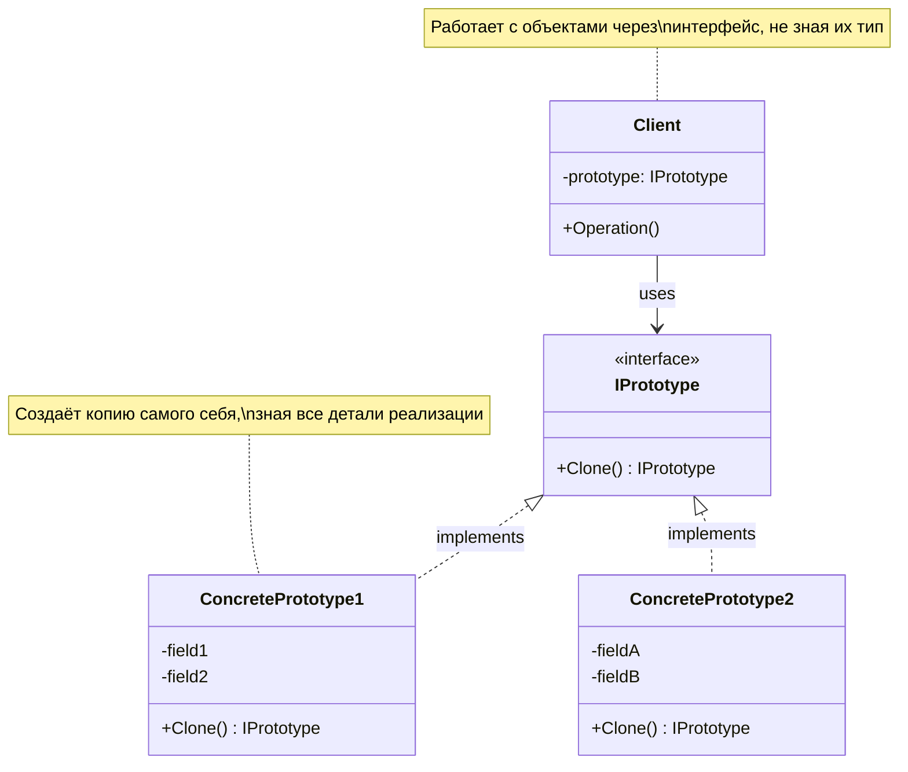

# Prototype (Прототип)

## Введение

**Prototype** (Прототип) — это порождающий паттерн проектирования (creational design pattern), который позволяет копировать объекты без привязки к их конкретным классам и без необходимости знать детали их внутренней реализации.

Паттерн делегирует процесс клонирования самим копируемым объектам, предоставляя общий интерфейс для создания копий.

## Мотивация: зачем нужен паттерн

### Проблема копирования объектов

Представьте, что у вас есть сложный объект, например `User`, со множеством полей различных типов:

```csharp
// Пример класса пользователя с множеством полей
public class User
{
    public string Name { get; set; }
    public int Age { get; set; }
    public Email Email { get; set; }                          // Ссылочный тип
    public List<Permission> Permissions { get; set; }         // Коллекция
    public Dictionary<string, object> Settings { get; set; }  // Словарь
}
```

Вам необходимо создать копию этого пользователя. Самый очевидный подход — скопировать все поля вручную:

```csharp
// Наивный подход: ручное копирование полей
var userCopy = new User 
{ 
    Name = originalUser.Name,
    Age = originalUser.Age,
    Email = originalUser.Email,
    Permissions = originalUser.Permissions,
    Settings = originalUser.Settings
};
```

### Проблемы наивного подхода

Однако такой способ копирования имеет ряд серьёзных недостатков.

#### Проблема 1: Дублирование кода

Если у класса 20 полей, вам придётся в нескольких местах программы писать код, который извлекает все 20 полей и передаёт их в конструктор нового объекта. Это:

- Нарушает принцип **DRY** (Don't Repeat Yourself — не повторяйся)
- Усложняет поддержку: при добавлении нового поля нужно обновить все места копирования
- Увеличивает риск ошибок и несоответствий

#### Проблема 2: Нарушение инкапсуляции

Что если у объекта есть `private` поля, недоступные через публичные свойства? Как клиентский код, вы просто не можете получить доступ к скрытому состоянию.

Более того, конструктор может модифицировать входные данные (валидация, преобразование формата), а нам нужна точная копия существующего состояния объекта без дополнительных преобразований.

```csharp
public class User
{
    private readonly string _hashedPassword;  // Приватное поле — недоступно извне!
    
    public User(string password)
    {
        // Конструктор преобразует пароль в хеш
        _hashedPassword = ComputeHash(password);
    }
    
    // Как скопировать _hashedPassword снаружи? Никак!
}
```

#### Проблема 3: Полиморфизм и неизвестный тип

Предположим, у вас есть массив `Shape[]`, в котором хранятся объекты разных типов: `Circle`, `Square`, `Triangle`. Вы хотите пройти по массиву и создать копию каждого элемента:

```csharp
// Коллекция фигур разных типов
Shape[] shapes = new Shape[]
{
    new Circle(5.0),
    new Square(10.0),
    new Triangle(3.0, 4.0, 5.0)
};

// Проблема: как создать копию каждой фигуры?
foreach (Shape shape in shapes)
{
    // Какой конструктор вызвать?
    // new Circle()? new Square()? new Triangle()?
    // Мы не знаем конкретный тип на этапе компиляции!
    Shape copy = ??? // Не можем определить, что писать
}
```

Вы не можете написать `new Circle()` или `new Square()`, потому что на этапе компиляции переменная `shape` имеет тип `Shape`, и конкретный класс неизвестен.

Аналогичная проблема с иерархией пользователей:

```csharp
// Иерархия пользователей
public abstract class User { }
public class AdminUser : User { }
public class GuestUser : User { }

public void DuplicateUser(User original)
{
    // Какой конструктор вызвать?
    // Мы не знаем, это AdminUser или GuestUser!
    User copy = ??? // Конкретный тип неизвестен
}
```

### Метафора: чертёж самолёта

Все подобные попытки скопировать объект извне похожи на попытку воссоздать самолёт, опираясь только на внешний вид. Вы видите крылья, фюзеляж, двигатели, но не знаете:

- Как они устроены внутри
- Как соединяются между собой
- Какие материалы использованы
- Какая электроника спрятана внутри

Нам нужен **чертёж** — документ, содержащий всю информацию для создания точной копии. В программировании этим чертежом становится сам объект, который знает, как себя скопировать.


## Решение: паттерн Prototype

**Идея паттерна:** объект сам знает, как создать свою копию. Ответственность за копирование переносится с клиентского кода на сам объект-прототип.

### Базовая реализация

Добавляем общий интерфейс с методом `Clone()`:

```csharp
// Интерфейс прототипа
public interface IPrototype
{
    // Метод для создания копии объекта
    IPrototype Clone();
}

// Реализация в классе пользователя
public class User : IPrototype
{
    public string Name { get; set; }
    public int Age { get; set; }
    
    // Каждый объект знает, как создать свою копию
    public IPrototype Clone()
    {
        // Создаём новый объект и копируем значения полей
        return new User 
        { 
            Name = this.Name,  // Копируем имя
            Age = this.Age     // Копируем возраст
        };
    }
}
```

Теперь создание копии становится простым:

```csharp
// Создаём оригинальный объект
var original = new User { Name = "Alice", Age = 30 };

// Клонируем его — не нужно знать внутреннюю структуру!
var copy = original.Clone();

// copy — это новый объект с теми же значениями полей
Console.WriteLine(copy.Name);  // Вывод: Alice
Console.WriteLine(copy.Age);   // Вывод: 30
```

**Ключевое преимущество:** клиентский код не знает и не обязан знать, как внутри устроено копирование. Объект сам берёт на себя эту ответственность.

### Структура паттерна



**Участники паттерна:**

- **IPrototype** — интерфейс, объявляющий метод клонирования
- **ConcretePrototype** — конкретный класс, реализующий клонирование самого себя
- **Client** — код, который использует прототипы для создания копий объектов

## Типы копирования

Паттерн Prototype может быть реализован по-разному в зависимости от того, насколько глубоко нужно копировать объект.

### Shallow Copy (Поверхностное копирование)

**Shallow Copy** (поверхностное копирование) — это копирование, при котором создаётся новый объект, но ссылочные поля просто копируются как ссылки, а не клонируются.

```csharp
// Класс с ссылочным полем
public class ShallowPrototype
{
    private readonly string _name;
    private readonly List<int> _relatedIds;  // Ссылочный тип

    public ShallowPrototype(string name, List<int> relatedIds)
    {
        _name = name;
        _relatedIds = relatedIds;
    }

    public ShallowPrototype Clone()
    {
        // Создаём новый объект
        // Но копируем только ссылку на список — сам список НЕ клонируется!
        return new ShallowPrototype(_name, _relatedIds);
    }
    
    public void AddId(int id)
    {
        _relatedIds.Add(id);
    }
    
    public void Print()
    {
        Console.WriteLine($"Name: {_name}, IDs: [{string.Join(", ", _relatedIds)}]");
    }
}
```

#### Демонстрация проблемы

```csharp
// Создаём оригинальный объект
var ids = new List<int> { 1, 2, 3 };
var original = new ShallowPrototype("Original", ids);

// Делаем поверхностную копию
var copy = original.Clone();

// Изменяем список через оригинал
original.AddId(4);

// ПРОБЛЕМА: изменение видно и в копии!
original.Print();  // Вывод: Name: Original, IDs: [1, 2, 3, 4]
copy.Print();      // Вывод: Name: Original, IDs: [1, 2, 3, 4] — одинаково!
```

#### Визуализация в памяти


Оба объекта ссылаются на **одну и ту же коллекцию** в памяти. Изменение через любую ссылку влияет на оба объекта.

#### Когда безопасно использовать Shallow Copy

Поверхностное копирование **безопасно**, если:
- Ссылочные поля указывают на **неизменяемые** (immutable) объекты
- Используются типы вроде `string`, `IReadOnlyCollection<T>`, record struct
- Вы точно знаете, что разделяемые объекты не будут модифицированы

Поверхностное копирование **опасно**, если:
- Ссылочные поля указывают на изменяемые объекты
- Коллекции могут быть модифицированы (например, `List<T>`, `Dictionary<K,V>`)
- Изменение через одну ссылку повлияет на другие объекты

**Преимущества:** быстрое выполнение, экономия памяти  
**Недостатки:** риск непредвиденных побочных эффектов

### Deep Copy (Глубокое копирование)

**Deep Copy** (глубокое копирование) — это копирование, при котором создаётся не только новый объект, но и новые копии всех вложенных объектов.

```csharp
// Изменяемый класс-обёртка
public class WrappedValue
{
    public int Value { get; set; }

    // Метод клонирования для вложенного объекта
    public WrappedValue Clone()
    {
        return new WrappedValue { Value = this.Value };
    }
}

// Прототип с глубоким копированием
public class DeepCopyPrototype
{
    private readonly string _name;
    private readonly List<WrappedValue> _values;

    public DeepCopyPrototype(string name, List<WrappedValue> values)
    {
        _name = name;
        _values = values;
    }

    public DeepCopyPrototype Clone()
    {
        // КЛЮЧЕВОЙ МОМЕНТ: клонируем каждый элемент списка
        List<WrappedValue> clonedValues = _values
            .Select(v => v.Clone())  // Каждый элемент копируется отдельно!
            .ToList();               // Создаём новый список
        
        // Теперь у нас полностью независимая копия
        return new DeepCopyPrototype(_name, clonedValues);
    }
    
    public void ModifyValue(int index, int newValue)
    {
        _values[index].Value = newValue;
    }
    
    public void Print()
    {
        var values = string.Join(", ", _values.Select(v => v.Value));
        Console.WriteLine($"Name: {_name}, Values: [{values}]");
    }
}
```

#### Демонстрация решения

```csharp
// Создаём оригинальный объект
var original = new DeepCopyPrototype("Original", new List<WrappedValue>
{
    new WrappedValue { Value = 10 },
    new WrappedValue { Value = 20 }
});

// Делаем глубокую копию
var copy = original.Clone();

// Изменяем значение в копии
copy.ModifyValue(0, 999);

// Оригинал НЕ изменился — это разные объекты!
original.Print();  // Вывод: Name: Original, Values: [10, 20]
copy.Print();      // Вывод: Name: Original, Values: [999, 20]
```

#### Визуализация в памяти


Каждый объект имеет свою собственную коллекцию и свои собственные элементы. Изменения полностью независимы.

#### Когда необходимо Deep Copy

Глубокое копирование **необходимо**, если:
- Объект содержит изменяемые коллекции (списки, словари, массивы)
- Коллекции содержат изменяемые объекты
- Требуется полная независимость оригинала и копии
- Нужна полная изоляция для безопасного параллельного изменения

**Преимущества:** полная независимость объектов, безопасность  
**Недостатки:** медленнее выполнение, больший расход памяти

### Сравнение подходов

| Критерий | Shallow Copy | Deep Copy |
|----------|--------------|-----------|
| Скорость | ✅ Быстро | ⚠️ Медленнее |
| Память | ✅ Экономно | ⚠️ Больше расход |
| Безопасность | ⚠️ Риск побочных эффектов | ✅ Полная изоляция |
| Сложность реализации | ✅ Просто | ⚠️ Сложнее |
| Когда использовать | Immutable объекты | Mutable объекты |

## Prototype в иерархиях наследования

Вернёмся к одной из ключевых проблем — работа с иерархиями типов, когда конкретный класс объекта неизвестен на этапе компиляции.

### Решение через полиморфизм

Каждый класс в иерархии реализует метод `Clone()`, создавая копию своего конкретного типа:

```csharp
// Общий интерфейс для всех прототипов
public interface IHierarchyPrototype
{
    IHierarchyPrototype Clone();
}

// Первый конкретный класс
public class Document : IHierarchyPrototype
{
    private readonly string _title;
    private readonly string _content;

    public Document(string title, string content)
    {
        _title = title;
        _content = content;
    }

    // Реализация клонирования — создаём копию Document
    public IHierarchyPrototype Clone()
    {
        return new Document(_title, _content);
    }
    
    public void Print()
    {
        Console.WriteLine($"Document: {_title}");
    }
}

// Второй конкретный класс с другой структурой
public class Spreadsheet : IHierarchyPrototype
{
    private readonly int _rows;
    private readonly int _columns;

    public Spreadsheet(int rows, int columns)
    {
        _rows = rows;
        _columns = columns;
    }

    // Реализация клонирования — создаём копию Spreadsheet
    public IHierarchyPrototype Clone()
    {
        return new Spreadsheet(_rows, _columns);
    }
    
    public void Print()
    {
        Console.WriteLine($"Spreadsheet: {_rows}x{_columns}");
    }
}
```

Теперь можно работать с объектами полиморфно:

```csharp
// Метод принимает любой объект, реализующий интерфейс
public void ProcessPrototype(IHierarchyPrototype proto)
{
    Console.WriteLine("Обрабатываем прототип...");

    // Мы НЕ знаем конкретный тип (Document или Spreadsheet)
    // Но можем создать копию — объект сам знает, как себя копировать!
    var clone = proto.Clone();
    
    // clone будет иметь правильный конкретный тип автоматически,
    // благодаря виртуальному вызову метода Clone()
    
    Console.WriteLine($"Создана копия типа: {clone.GetType().Name}");
}

// Использование с разными типами
var document = new Document("Report", "Content here");
var spreadsheet = new Spreadsheet(100, 20);

ProcessPrototype(document);      // Вывод: Создана копия типа: Document
ProcessPrototype(spreadsheet);   // Вывод: Создана копия типа: Spreadsheet
```

**Ключевое преимущество:** не нужно использовать `typeof`, `is`, `as` или `switch` для определения типа. Каждый класс сам знает, как себя копировать, благодаря полиморфизму.

## Выбор способа реализации

### Вариант 1: Абстрактный класс

```csharp
// Базовый абстрактный класс
public abstract class Prototype
{
    // Абстрактный метод клонирования
    public abstract Prototype Clone();
    
    // Общая логика для всех прототипов
    public void CommonMethod()
    {
        Console.WriteLine("Общая логика");
    }
}

// Конкретная реализация
public class ClassPrototype : Prototype
{
    private int _value;

    public ClassPrototype(int value)
    {
        _value = value;
    }

    // Ковариантный возвращаемый тип (covariant return type)
    // Можем вернуть более конкретный тип ClassPrototype
    public override ClassPrototype Clone()
    {
        return new ClassPrototype(_value);
    }
}
```

### Вариант 2: Интерфейс

```csharp
// Интерфейс прототипа
public interface IPrototype
{
    IPrototype Clone();
}

// Конкретная реализация с двойной реализацией метода Clone()
public class InterfacePrototype : IPrototype
{
    private int _value;

    public InterfacePrototype(int value)
    {
        _value = value;
    }

    // Явная реализация интерфейса — вызывается при работе через IPrototype
    IPrototype IPrototype.Clone()
    {
        return Clone();  // Делегируем публичному методу
    }

    // Публичный метод — возвращает конкретный тип
    public InterfacePrototype Clone()
    {
        return new InterfacePrototype(_value);
    }
}
```

#### Зачем нужна двойная реализация?

Двойная реализация позволяет сохранить конкретный тип при работе с объектом напрямую:

```csharp
// Работа через интерфейс — получаем базовый тип
IPrototype proto1 = new InterfacePrototype(42);
var clone1 = proto1.Clone();  // Тип: IPrototype

// Работа с конкретным классом — сохраняем конкретный тип
InterfacePrototype proto2 = new InterfacePrototype(42);
var clone2 = proto2.Clone();  // Тип: InterfacePrototype (без приведения!)
```

### Сравнение подходов

| Критерий | Абстрактный класс | Интерфейс |
|----------|-------------------|-----------|
| Множественное наследование | ❌ Нет | ✅ Да |
| Общая логика | ✅ Легко добавить | ⚠️ Через default методы (C# 8.0+) |
| Гибкость | Средняя | Высокая |
| Подходит для разнородных типов | Средне | ✅ Отлично |
| Рекомендация | Если нужна общая логика | **Предпочтительно** |

**Рекомендация:** В современном C# **предпочитают интерфейсы**, так как они обеспечивают большую гибкость и позволяют классу реализовывать несколько контрактов одновременно.


## Проблема потери типа

И абстрактный класс, и интерфейс имеют общую проблему: **потерю конкретного типа** при возврате из методов, работающих с базовым типом.

### Пример проблемы

Представьте систему для работы с геометрическими фигурами:

```csharp
// Базовый класс для всех фигур
public abstract class Shape
{
    public string Color { get; set; }
    public double X { get; set; }
    public double Y { get; set; }

    protected Shape(string color, double x, double y)
    {
        Color = color;
        X = x;
        Y = y;
    }

    // Общие методы для всех фигур
    public void Draw()
    {
        Console.WriteLine($"Drawing {GetType().Name} at ({X}, {Y})");
    }

    public void MoveTo(double newX, double newY)
    {
        X = newX;
        Y = newY;
    }

    // Метод клонирования
    public abstract Shape Clone();
}

// Конкретная фигура — круг
public class Circle : Shape
{
    public double Radius { get; set; }

    public Circle(string color, double x, double y, double radius)
        : base(color, x, y)
    {
        Radius = radius;
    }

    public override Circle Clone()
    {
        return new Circle(Color, X, Y, Radius);
    }

    // Специфичный метод только для круга
    public void Scale(double factor)
    {
        Radius *= factor;
        Console.WriteLine($"Circle scaled to radius {Radius}");
    }
}

// Конкретная фигура — прямоугольник
public class Rectangle : Shape
{
    public double Width { get; set; }
    public double Height { get; set; }

    public Rectangle(string color, double x, double y, double width, double height)
        : base(color, x, y)
    {
        Width = width;
        Height = height;
    }

    public override Rectangle Clone()
    {
        return new Rectangle(Color, X, Y, Width, Height);
    }

    // Специфичный метод только для прямоугольника
    public void Resize(double newWidth, double newHeight)
    {
        Width = newWidth;
        Height = newHeight;
        Console.WriteLine($"Rectangle resized to {Width}x{Height}");
    }
}
```

Теперь напишем метод, который клонирует фигуру и перемещает её:

```csharp
public class ShapeProcessor
{
    // Метод принимает базовый тип Shape
    public static Shape CloneAndMove(Shape shape, double newX, double newY)
    {
        var clone = shape.Clone();  // Клонируем фигуру
        clone.MoveTo(newX, newY);    // Перемещаем копию
        return clone;                // Возвращаем... Shape!
    }
}
```

**Проблема в использовании:**

```csharp
var circle = new Circle("Red", 10, 10, 5);

// Вызываем метод обработки
Shape clonedShape = ShapeProcessor.CloneAndMove(circle, 50, 50);

// ПРОБЛЕМА: clonedShape имеет тип Shape, а не Circle!
// Мы потеряли информацию о конкретном типе

// clonedShape.Scale(2.0);  // ❌ Ошибка компиляции! Scale() нет в Shape

// Приходится делать приведение типа (type cast):
if (clonedShape is Circle clonedCircle)
{
    clonedCircle.Scale(2.0);  // Теперь работает, но некрасиво
}
```

### Визуализация проблемы


### Почему это плохо?

- **Нарушается type safety** — компилятор не может проверить корректность типов
- **Нужны runtime проверки** — `is`, `as`, `switch`
- **Возможны ошибки** — неправильное приведение типа приведёт к `InvalidCastException` или `null`
- **Код становится хрупким** — легко ошибиться при рефакторинге

## Решение: Рекурсивные дженерики (CRTP)

**CRTP** (Curiously Recurring Template Pattern — любопытно рекуррентный шаблон) — это паттерн, при котором класс использует сам себя в качестве аргумента типа для своего базового класса или интерфейса.

### Что такое рекурсивный параметр-тип?

**Рекурсивный параметр-тип** — это параметр-тип, который ссылается на самого себя в ограничениях (constraints).

```csharp
// T должен реализовывать IPrototype<T>
public interface IPrototype<T> where T : IPrototype<T>
{
    T Clone();
}
```

Что это означает:
- Параметр типа `T` ограничен условием `where T : IPrototype<T>`
- Это значит, что `T` должен быть классом, который реализует `IPrototype<T>`
- Это гарантирует, что `Clone()` вернёт правильный конкретный тип

### Базовая реализация с дженериками

```csharp
// Обобщённый интерфейс с рекурсивным ограничением
public interface IPrototype<T> where T : IPrototype<T>
{
    T Clone();           // Возвращает конкретный тип T
    void DoSomeStuff();  // Общая логика
}

// Конкретная реализация
public class Prototype : IPrototype<Prototype>
{
    private int _value;

    public Prototype(int value)
    {
        _value = value;
    }

    // Возвращает именно Prototype, а не IPrototype
    public Prototype Clone()
    {
        return new Prototype(_value);
    }

    public void DoSomeStuff()
    {
        Console.WriteLine("Общая логика");
    }

    // Специфичный метод для Prototype
    public void DoOtherStuff()
    {
        Console.WriteLine("Специфичная логика");
    }
}
```

### Типобезопасное использование

Теперь можно написать обобщённый метод, который **сохраняет тип**:

```csharp
public class Scenario
{
    // Обобщённый метод с ограничением на тип
    public static T CloneAndDoSomeStuff<T>(T prototype)
        where T : IPrototype<T>
    {
        var clone = prototype.Clone();  // Тип clone: T (правильный тип!)
        clone.DoSomeStuff();
        return clone;  // Возвращаем T, а не базовый тип
    }

    public static void Main()
    {
        var prototype = new Prototype(42);
        
        // Тип сохраняется!
        Prototype clone = CloneAndDoSomeStuff(prototype);
        
        // Можем вызвать специфичные методы без приведения типа!
        clone.DoOtherStuff();  // ✅ Работает без cast!
    }
}
```

### Как это работает?

Когда вы вызываете `CloneAndDoSomeStuff(prototype)`, компилятор:

1. Видит, что `prototype` имеет тип `Prototype`
2. Проверяет, что `Prototype : IPrototype<Prototype>` — ✅ выполняется
3. Подставляет `T = Prototype` везде в методе

В результате компилятор видит метод как:

```csharp
// Компилятор подставляет конкретный тип
public static Prototype CloneAndDoSomeStuff(Prototype prototype)
    where Prototype : IPrototype<Prototype>
{
    var clone = prototype.Clone();  // Тип: Prototype
    clone.DoSomeStuff();
    return clone;  // Тип: Prototype
}
```

**Вывод:** тип сохраняется на уровне компиляции, никаких приведений типов не требуется!

### Пример с иерархией фигур

Применим рекурсивные дженерики к нашему примеру с фигурами:

```csharp
// Обобщённый интерфейс
public interface IPrototype<T> where T : IPrototype<T>
{
    T Clone();
    void Draw();
}

// Базовый абстрактный класс с дженериками
public abstract class Shape<T> : IPrototype<T> where T : Shape<T>
{
    public string Color { get; set; }
    public double X { get; set; }
    public double Y { get; set; }

    protected Shape(string color, double x, double y)
    {
        Color = color;
        X = x;
        Y = y;
    }

    // Абстрактный метод клонирования
    public abstract T Clone();

    public void Draw()
    {
        Console.WriteLine($"Drawing {GetType().Name} at ({X}, {Y})");
    }

    public void MoveTo(double newX, double newY)
    {
        X = newX;
        Y = newY;
    }
}

// Конкретная фигура — круг
public class Circle : Shape<Circle>
{
    public double Radius { get; set; }

    public Circle(string color, double x, double y, double radius)
        : base(color, x, y)
    {
        Radius = radius;
    }

    // Возвращает именно Circle
    public override Circle Clone()
    {
        return new Circle(Color, X, Y, Radius);
    }

    // Специфичный метод для круга
    public void Scale(double factor)
    {
        Radius *= factor;
        Console.WriteLine($"Circle scaled to radius {Radius}");
    }
}

// Конкретная фигура — прямоугольник
public class Rectangle : Shape<Rectangle>
{
    public double Width { get; set; }
    public double Height { get; set; }

    public Rectangle(string color, double x, double y, double width, double height)
        : base(color, x, y)
    {
        Width = width;
        Height = height;
    }

    // Возвращает именно Rectangle
    public override Rectangle Clone()
    {
        return new Rectangle(Color, X, Y, Width, Height);
    }

    // Специфичный метод для прямоугольника
    public void Resize(double newWidth, double newHeight)
    {
        Width = newWidth;
        Height = newHeight;
        Console.WriteLine($"Rectangle resized to {Width}x{Height}");
    }
}
```

### Типобезопасное использование с фигурами

```csharp
public class ShapeProcessor
{
    // Обобщённый метод с сохранением типа!
    public static T CloneAndMove<T>(T shape, double x, double y) 
        where T : Shape<T>
    {
        var clone = shape.Clone();  // Тип: T (конкретный тип!)
        clone.MoveTo(x, y);
        return clone;  // Возвращаем T, а не Shape
    }
}

// Использование:
public static void Main()
{
    var circle = new Circle("Red", 10, 10, 5);
    var rect = new Rectangle("Blue", 20, 20, 10, 15);

    // Типы сохраняются!
    Circle clonedCircle = ShapeProcessor.CloneAndMove(circle, 50, 50);
    Rectangle clonedRect = ShapeProcessor.CloneAndMove(rect, 100, 100);

    // Можем вызывать специфичные методы без приведения типов!
    clonedCircle.Scale(2.0);      // ✅ Работает!
    clonedRect.Resize(20, 30);    // ✅ Работает!
}
```

## Работа с разнородными коллекциями

Рекурсивные дженерики прекрасно работают, когда тип известен на этапе компиляции. Но что делать, если нужно хранить разные типы в одной коллекции?

### Проблема с коллекциями

```csharp
// Как создать коллекцию разных фигур?
var shapes = new List<???>();  // Что тут писать?

// List<IPrototype<???>> не работает!
// Circle реализует IPrototype<Circle>
// Rectangle реализует IPrototype<Rectangle>
// Это разные типы!
```

### Решение 1: Необобщённый базовый интерфейс

Добавляем необобщённый (non-generic) интерфейс как базу:

```csharp
// Необобщённый интерфейс (для коллекций)
public interface IPrototype
{
    IPrototype Clone();  // Возвращает необобщённый тип
    void Draw();
}

// Обобщённый интерфейс (для типобезопасности)
public interface IPrototype<T> : IPrototype where T : IPrototype<T>
{
    new T Clone();  // Переопределяем с обобщённым типом
}

// Конкретная реализация
public class Circle : IPrototype<Circle>
{
    public double Radius { get; set; }

    public Circle(double radius)
    {
        Radius = radius;
    }

    // Явная реализация необобщённого интерфейса
    IPrototype IPrototype.Clone()
    {
        return Clone();  // Делегируем обобщённому методу
    }

    // Обобщённая версия — возвращает конкретный тип
    public Circle Clone()
    {
        return new Circle(Radius);
    }

    public void Draw()
    {
        Console.WriteLine($"Circle with radius {Radius}");
    }

    // Специфичный метод
    public void Scale(double factor)
    {
        Radius *= factor;
    }
}

public class Rectangle : IPrototype<Rectangle>
{
    public double Width { get; set; }
    public double Height { get; set; }

    public Rectangle(double width, double height)
    {
        Width = width;
        Height = height;
    }

    // Явная реализация необобщённого интерфейса
    IPrototype IPrototype.Clone()
    {
        return Clone();
    }

    // Обобщённая версия
    public Rectangle Clone()
    {
        return new Rectangle(Width, Height);
    }

    public void Draw()
    {
        Console.WriteLine($"Rectangle {Width}x{Height}");
    }

    // Специфичный метод
    public void Resize(double w, double h)
    {
        Width = w;
        Height = h;
    }
}
```

### Использование с коллекциями

Теперь можно хранить разные типы в одной коллекции:

```csharp
public class ShapeManager
{
    // Храним разнородные объекты через необобщённый интерфейс
    private readonly List<IPrototype> _shapes = new();

    public void AddShape(IPrototype shape)
    {
        _shapes.Add(shape);
    }

    // Клонируем все фигуры, не зная их конкретных типов
    public void CloneAll()
    {
        var clones = _shapes.Select(s => s.Clone()).ToList();
        
        foreach (var clone in clones)
        {
            clone.Draw();
        }
    }

    // Если нужен конкретный тип, делаем приведение
    public Circle? GetCircle(int index)
    {
        return _shapes[index] as Circle;
    }
}

// Использование:
public static void Main()
{
    var manager = new ShapeManager();
    
    // Добавляем фигуры разных типов
    manager.AddShape(new Circle(5.0));
    manager.AddShape(new Rectangle(10, 20));
    manager.AddShape(new Circle(7.5));

    Console.WriteLine("=== Клонирование всех фигур ===");
    manager.CloneAll();

    Console.WriteLine("\n=== Получение конкретного типа ===");
    var circle = manager.GetCircle(0);
    if (circle != null)
    {
        circle.Scale(2.0);
        circle.Draw();
    }
}
```

### Решение 2: Visitor Pattern

Для избежания приведения типов можно использовать паттерн **Visitor**:

```csharp
// Интерфейс посетителя
public interface IShapeVisitor
{
    void Visit(Circle circle);
    void Visit(Rectangle rectangle);
}

// Добавляем метод Accept в интерфейс
public interface IPrototype
{
    IPrototype Clone();
    void Accept(IShapeVisitor visitor);
}

// Реализация в Circle
public class Circle : IPrototype<Circle>
{
    // ... поля и конструктор ...

    public void Accept(IShapeVisitor visitor)
    {
        visitor.Visit(this);  // Передаём конкретный тип!
    }
    
    // ... остальные методы ...
}

// Конкретный посетитель для масштабирования
public class ScaleVisitor : IShapeVisitor
{
    private readonly double _factor;

    public ScaleVisitor(double factor)
    {
        _factor = factor;
    }

    public void Visit(Circle circle)
    {
        circle.Radius *= _factor;
        Console.WriteLine($"Scaled circle to radius {circle.Radius}");
    }

    public void Visit(Rectangle rectangle)
    {
        rectangle.Width *= _factor;
        rectangle.Height *= _factor;
        Console.WriteLine($"Scaled rectangle to {rectangle.Width}x{rectangle.Height}");
    }
}

// Использование без приведения типов:
public static void Main()
{
    List<IPrototype> shapes = new()
    {
        new Circle(5.0),
        new Rectangle(10, 20),
        new Circle(7.5)
    };

    var scaleVisitor = new ScaleVisitor(2.0);

    // Обрабатываем все фигуры типобезопасно
    foreach (var shape in shapes)
    {
        shape.Accept(scaleVisitor);
    }
}
```


## Комплексный пример: Система управления документами

Рассмотрим полноценный пример, объединяющий все изученные концепции.

```csharp
using System;
using System.Collections.Generic;
using System.Linq;

// === Интерфейсы ===

// Необобщённый интерфейс (для работы с коллекциями разнородных типов)
public interface IDocument
{
    IDocument Clone();
    void Print();
    string GetTitle();
}

// Обобщённый интерфейс (для типобезопасных операций)
public interface IDocument<T> : IDocument where T : IDocument<T>
{
    new T Clone();  // Переопределяем с конкретным типом
}

// === Базовый класс документа ===

public abstract class Document<T> : IDocument<T> where T : Document<T>
{
    protected string _title;
    protected DateTimeOffset _createdAt;
    protected int _version;

    protected Document(string title, DateTimeOffset createdAt, int version)
    {
        _title = title;
        _createdAt = createdAt;
        _version = version;
    }

    // Явная реализация необобщённого интерфейса
    IDocument IDocument.Clone() => Clone();

    // Абстрактный обобщённый метод — переопределяют наследники
    public abstract T Clone();

    public virtual void Print()
    {
        Console.WriteLine($"[{GetType().Name}] {_title}");
        Console.WriteLine($"Created: {_createdAt:dd.MM.yyyy HH:mm:ss}");
        Console.WriteLine($"Version: {_version}");
    }

    public string GetTitle() => _title;

    public void IncrementVersion()
    {
        _version++;
        Console.WriteLine($"Version incremented to {_version}");
    }
}

// === Конкретные типы документов ===

// Текстовый документ
public class TextDocument : Document<TextDocument>
{
    private string _content;
    private List<string> _tags;

    public TextDocument(string title, DateTimeOffset createdAt, int version, 
                       string content, List<string> tags)
        : base(title, createdAt, version)
    {
        _content = content;
        _tags = tags;
    }

    // Глубокое копирование — создаём новый список тегов
    public override TextDocument Clone()
    {
        var clonedTags = _tags.Select(t => t).ToList();
        return new TextDocument(_title, _createdAt, _version, _content, clonedTags);
    }

    public override void Print()
    {
        base.Print();
        Console.WriteLine($"Content: {_content}");
        Console.WriteLine($"Tags: {string.Join(", ", _tags)}");
    }

    // Специфичные методы для текстового документа
    public void EditContent(string newContent)
    {
        _content = newContent;
        IncrementVersion();
        Console.WriteLine($"Content updated to: {_content}");
    }

    public void AddTag(string tag)
    {
        _tags.Add(tag);
        Console.WriteLine($"Tag '{tag}' added");
    }
}

// Таблица
public class SpreadsheetDocument : Document<SpreadsheetDocument>
{
    private int _rows;
    private int _columns;
    private Dictionary<string, double> _cells;

    public SpreadsheetDocument(string title, DateTimeOffset createdAt, int version,
                              int rows, int columns)
        : base(title, createdAt, version)
    {
        _rows = rows;
        _columns = columns;
        _cells = new Dictionary<string, double>();
    }

    // Глубокое копирование — создаём новый словарь
    public override SpreadsheetDocument Clone()
    {
        var clone = new SpreadsheetDocument(_title, _createdAt, _version, _rows, _columns);
        
        // Копируем все ячейки
        foreach (var kvp in _cells)
        {
            clone._cells[kvp.Key] = kvp.Value;
        }

        return clone;
    }

    public override void Print()
    {
        base.Print();
        Console.WriteLine($"Dimensions: {_rows}x{_columns}");
        Console.WriteLine($"Filled cells: {_cells.Count}");
    }

    // Специфичные методы для таблицы
    public void SetCell(string address, double value)
    {
        _cells[address] = value;
        IncrementVersion();
        Console.WriteLine($"Cell {address} = {value}");
    }

    public double GetCell(string address)
    {
        return _cells.TryGetValue(address, out var value) ? value : 0;
    }
}

// Презентация
public class PresentationDocument : Document<PresentationDocument>
{
    private int _slideCount;
    private List<string> _presenters;

    public PresentationDocument(string title, DateTimeOffset createdAt, int version, 
                               int slideCount, List<string> presenters)
        : base(title, createdAt, version)
    {
        _slideCount = slideCount;
        _presenters = presenters;
    }

    // Глубокое копирование — создаём новый список докладчиков
    public override PresentationDocument Clone()
    {
        var clonedPresenters = _presenters.Select(p => p).ToList();
        return new PresentationDocument(_title, _createdAt, _version, 
                                       _slideCount, clonedPresenters);
    }

    public override void Print()
    {
        base.Print();
        Console.WriteLine($"Slides: {_slideCount}");
        Console.WriteLine($"Presenters: {string.Join(", ", _presenters)}");
    }

    // Специфичный метод для презентации
    public void AddPresenter(string name)
    {
        _presenters.Add(name);
        Console.WriteLine($"Added presenter: {name}");
    }
}

// === Менеджер документов (работает с необобщённым интерфейсом) ===

public class DocumentManager
{
    // Храним разнородные документы через базовый интерфейс
    private readonly List<IDocument> _documents = new();

    public void AddDocument(IDocument doc)
    {
        _documents.Add(doc);
        Console.WriteLine($"Added document: {doc.GetTitle()}");
    }

    // Клонируем все документы полиморфно
    public void CloneAll()
    {
        Console.WriteLine("\n=== Cloning all documents ===");
        var clones = _documents.Select(d => d.Clone()).ToList();
        
        foreach (var clone in clones)
        {
            Console.WriteLine($"Cloned: {clone.GetTitle()}");
        }
    }

    public void PrintAll()
    {
        Console.WriteLine("\n=== All documents ===");
        foreach (var doc in _documents)
        {
            doc.Print();
            Console.WriteLine();
        }
    }

    public IDocument? GetDocument(string title)
    {
        return _documents.FirstOrDefault(d => d.GetTitle() == title);
    }
}

// === Типобезопасные операции (работают с обобщённым интерфейсом) ===

public class DocumentProcessor
{
    // Типобезопасное клонирование с модификацией
    // Тип T сохраняется на всём протяжении выполнения метода
    public static T CloneAndModify<T>(T document, Action<T> modifier) 
        where T : IDocument<T>
    {
        var clone = document.Clone();  // Тип: T (конкретный!)
        modifier(clone);
        return clone;
    }

    // Создание новой версии документа
    public static T CreateVersion<T>(T document) 
        where T : IDocument<T>
    {
        var version = document.Clone();
        Console.WriteLine($"Created new version of: {version.GetTitle()}");
        return version;
    }
}

// === Главная программа ===

public class Program
{
    public static void Main()
    {
        Console.WriteLine("╔════════════════════════════════════════════╗");
        Console.WriteLine("║  Демонстрация паттерна Prototype          ║");
        Console.WriteLine("╚════════════════════════════════════════════╝\n");

        // === Пример 1: Типобезопасное клонирование ===
        Console.WriteLine("▶ Пример 1: Типобезопасное клонирование\n");

        var textDoc = new TextDocument(
            "Report",
            DateTimeOffset.Now,
            1,
            "Initial content",
            new List<string> { "urgent", "finance" }
        );

        // Типобезопасно клонируем и модифицируем
        // Тип TextDocument сохраняется!
        TextDocument clonedText = DocumentProcessor.CloneAndModify(
            textDoc,
            doc => doc.EditContent("Modified content")
        );

        Console.WriteLine("\nOriginal:");
        textDoc.Print();

        Console.WriteLine("\nClone:");
        clonedText.Print();

        // === Пример 2: Работа с коллекцией разнородных документов ===
        Console.WriteLine("\n▶ Пример 2: Коллекция разнородных документов\n");

        var manager = new DocumentManager();
        
        manager.AddDocument(textDoc);
        manager.AddDocument(new SpreadsheetDocument("Budget", DateTimeOffset.Now, 1, 10, 10));
        manager.AddDocument(new PresentationDocument("Q4 Review", DateTimeOffset.Now, 1, 20, 
                                                     new List<string> { "Alice", "Bob" }));

        manager.PrintAll();
        manager.CloneAll();

        // === Пример 3: Получение конкретного типа из коллекции ===
        Console.WriteLine("\n▶ Пример 3: Работа с конкретным типом\n");

        var doc = manager.GetDocument("Budget");
        if (doc is SpreadsheetDocument spreadsheet)
        {
            spreadsheet.SetCell("A1", 1000);
            spreadsheet.SetCell("B1", 2000);
            spreadsheet.SetCell("C1", 3000);
            spreadsheet.Print();
        }

        // === Пример 4: Версионирование документов ===
        Console.WriteLine("\n▶ Пример 4: Версионирование документов\n");

        var version1 = textDoc;
        
        // Создаём версию 2
        var version2 = DocumentProcessor.CreateVersion(version1);
        version2.EditContent("Version 2 content");

        // Создаём версию 3
        var version3 = DocumentProcessor.CreateVersion(version2);
        version3.AddTag("reviewed");
        version3.EditContent("Version 3 content");

        Console.WriteLine("\nВерсия 1:");
        version1.Print();

        Console.WriteLine("\nВерсия 2:");
        version2.Print();

        Console.WriteLine("\nВерсия 3:");
        version3.Print();

        // === Пример 5: Независимость копий ===
        Console.WriteLine("\n▶ Пример 5: Независимость копий\n");

        var original = new PresentationDocument(
            "Presentation",
            DateTimeOffset.Now,
            1,
            10,
            new List<string> { "Alice" }
        );

        var copy = original.Clone();
        copy.AddPresenter("Bob");
        copy.AddPresenter("Charlie");

        Console.WriteLine("Original:");
        original.Print();

        Console.WriteLine("\nCopy (с добавленными докладчиками):");
        copy.Print();

        Console.WriteLine("\n╔════════════════════════════════════════════╗");
        Console.WriteLine("║         Демонстрация завершена             ║");
        Console.WriteLine("╚════════════════════════════════════════════╝");
    }
}
```

### Вывод программы

```
╔════════════════════════════════════════════╗
║  Демонстрация паттерна Prototype          ║
╚════════════════════════════════════════════╝

▶ Пример 1: Типобезопасное клонирование

Created new version of: Report
Content updated to: Modified content
Version incremented to 2

Original:
[TextDocument] Report
Created: 12.11.2025 15:15:38
Version: 1
Content: Initial content
Tags: urgent, finance

Clone:
[TextDocument] Report
Created: 12.11.2025 15:15:38
Version: 2
Content: Modified content
Tags: urgent, finance

▶ Пример 2: Коллекция разнородных документов

Added document: Report
Added document: Budget
Added document: Q4 Review

=== All documents ===
[TextDocument] Report
Created: 12.11.2025 15:15:38
Version: 1
Content: Initial content
Tags: urgent, finance

[SpreadsheetDocument] Budget
Created: 12.11.2025 15:15:38
Version: 1
Dimensions: 10x10
Filled cells: 0

[PresentationDocument] Q4 Review
Created: 12.11.2025 15:15:38
Version: 1
Slides: 20
Presenters: Alice, Bob

=== Cloning all documents ===
Cloned: Report
Cloned: Budget
Cloned: Q4 Review

▶ Пример 3: Работа с конкретным типом

Cell A1 = 1000
Version incremented to 2
Cell B1 = 2000
Version incremented to 3
Cell C1 = 3000
Version incremented to 4
[SpreadsheetDocument] Budget
Created: 12.11.2025 15:15:38
Version: 4
Dimensions: 10x10
Filled cells: 3

▶ Пример 4: Версионирование документов

Created new version of: Report
Content updated to: Version 2 content
Version incremented to 2
Created new version of: Report
Tag 'reviewed' added
Content updated to: Version 3 content
Version incremented to 3

Версия 1:
[TextDocument] Report
Created: 12.11.2025 15:15:38
Version: 1
Content: Initial content
Tags: urgent, finance

Версия 2:
[TextDocument] Report
Created: 12.11.2025 15:15:38
Version: 2
Content: Version 2 content
Tags: urgent, finance

Версия 3:
[TextDocument] Report
Created: 12.11.2025 15:15:38
Version: 3
Content: Version 3 content
Tags: urgent, finance, reviewed

▶ Пример 5: Независимость копий

Added presenter: Bob
Added presenter: Charlie

Original:
[PresentationDocument] Presentation
Created: 12.11.2025 15:15:38
Version: 1
Slides: 10
Presenters: Alice

Copy (с добавленными докладчиками):
[PresentationDocument] Presentation
Created: 12.11.2025 15:15:38
Version: 1
Slides: 10
Presenters: Alice, Bob, Charlie

╔════════════════════════════════════════════╗
║         Демонстрация завершена             ║
╚════════════════════════════════════════════╝
```

## Когда использовать паттерн Prototype

### Подходящие сценарии

Паттерн Prototype следует применять, когда:

1. **Создание объекта дорогостоящее**
   - Сложная инициализация с обращениями к базе данных
   - Загрузка больших объёмов данных
   - Вычислительно сложные операции при создании

2. **Нужно избежать параллельной иерархии фабрик**
   - Вместо создания фабрики для каждого класса, объекты клонируют сами себя
   - Упрощение архитектуры

3. **Классы создаются динамически во время выполнения**
   - Тип объекта определяется в runtime
   - Работа с плагинами или расширениями

4. **Нужно сохранять состояние объектов**
   - Создание снимков (snapshots)
   - Реализация отмены операций (undo/redo)
   - Версионирование данных

5. **Объекты отличаются только состоянием, а не поведением**
   - Много похожих объектов с разными значениями полей
   - Конфигурации, настройки, пресеты

### Неподходящие сценарии

Не следует использовать Prototype, когда:

1. **Простые объекты с быстрым созданием**
   - Накладные расходы на клонирование превысят выгоду
   - Проще использовать обычный конструктор

2. **Невозможно реализовать глубокое копирование**
   - Объекты содержат внешние ресурсы (файлы, соединения с БД)
   - Циклические ссылки между объектами

3. **Иммутабельные объекты**
   - Если объекты неизменяемы, клонирование не нужно
   - Можно переиспользовать одни и те же экземпляры

## Преимущества и недостатки

### Преимущества

**1. Скрывает сложность создания**
- Клиентский код не знает о конструкторах и инициализации
- Инкапсуляция логики копирования внутри объекта

**2. Уменьшает количество подклассов**
- Не нужно создавать фабрики для каждого типа объектов
- Объекты сами знают, как себя копировать

**3. Добавляет и удаляет объекты на лету**
- Новые типы прототипов можно добавлять динамически
- Гибкость во время выполнения

**4. Повышает производительность**
- Клонирование может быть быстрее создания с нуля
- Особенно для сложных объектов с дорогой инициализацией

**5. Альтернатива наследованию**
- Композиция вместо наследования
- Создание вариантов через клонирование и модификацию

### Недостатки

**1. Сложность глубокого копирования**
- Требуется аккуратно копировать все вложенные объекты
- Проблемы с циклическими ссылками
- Сложно копировать объекты с внешними ресурсами

**2. Необходимость реализации Clone() в каждом классе**
- Дополнительный код в каждом классе иерархии
- Нужно помнить о добавлении новых полей в метод Clone()

**3. Сложность для начинающих**
- Рекурсивные дженерики могут быть непонятны
- Явная реализация интерфейсов требует понимания

## Связь с другими паттернами

### Abstract Factory и Factory Method

- **Abstract Factory** и **Factory Method** создают объекты через наследование
- **Prototype** создаёт объекты через делегирование — объект клонирует сам себя
- Prototype может использоваться внутри фабрик для создания объектов

### Memento

- Оба паттерна работают с сохранением состояния
- **Memento** сохраняет снимок состояния для последующего восстановления
- **Prototype** создаёт полную копию объекта
- Memento часто реализуется через Prototype

### Composite

- **Composite** часто комбинируется с **Prototype**
- Можно клонировать целые деревья объектов
- Каждый узел дерева реализует Clone()

### Singleton

- **Singleton** и **Prototype** противоположны по философии
- Singleton гарантирует один экземпляр класса
- Prototype создаёт множество копий
- В редких случаях Singleton может содержать методы клонирования для создания временных копий

## Заключение

Паттерн **Prototype** — мощный инструмент для копирования объектов, который:

- Делегирует ответственность за клонирование самим объектам
- Позволяет создавать копии без привязки к конкретным классам
- Обеспечивает полиморфное копирование в иерархиях
- Сохраняет типобезопасность через рекурсивные дженерики
- Работает с разнородными коллекциями через комбинацию обобщённых и необобщённых интерфейсов

### Основные выводы

1. **Shallow vs Deep Copy** — выбирайте в зависимости от мутабельности вложенных объектов
2. **Интерфейс vs Абстрактный класс** — в современном C# предпочтительны интерфейсы
3. **Рекурсивные дженерики** — обеспечивают типобезопасность, но усложняют код
4. **Комбинация интерфейсов** — используйте обобщённый + необобщённый для максимальной гибкости

Паттерн особенно полезен в системах с:
- Сложной иерархией типов
- Дорогостоящим созданием объектов
- Необходимостью версионирования и снимков состояния
- Динамическим созданием объектов в runtime

**Правило:** используйте Prototype, когда создание объекта через `new` сложнее, чем копирование существующего экземпляра.
