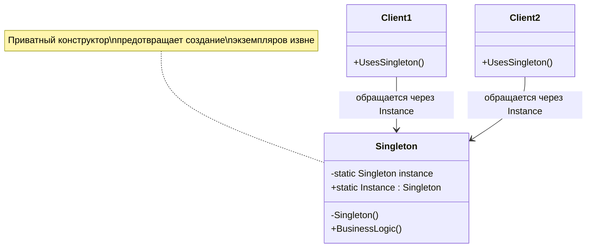
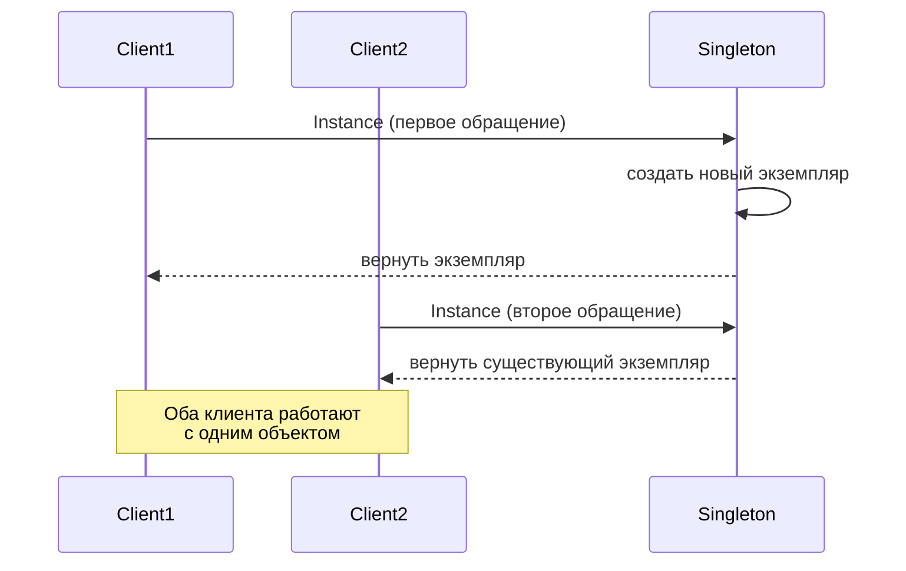

# Singleton (Одиночка)

## Оглавление
1. [Введение в проблему](#введение-в-проблему)
2. [Определение паттерна](#определение-паттерна)
3. [Структура паттерна](#структура-паттерна)
4. [Реализации Singleton](#реализации-singleton)
   - [Double-Checked Locking](#реализация-1-double-checked-locking)
   - [Lazy&lt;T&gt;](#реализация-2-lazyt)
   - [Режимы потокобезопасности](#режимы-потокобезопасности-lazyt)
5. [Недостатки и проблемы](#недостатки-singleton)
6. [Когда использовать](#когда-использовать-singleton)
7. [Полный пример](#полный-пример-использования)
8. [Применимость](#применимость)

---

## Введение в проблему

Представьте, что вы разрабатываете приложение, которое работает с базой данных. В вашем приложении есть класс `DatabaseConnection`, отвечающий за соединение с базой данных. Если каждый раз при обращении к базе создавать новое соединение, это приведёт к серьёзным проблемам:

- Избыточное потребление ресурсов: каждое соединение занимает память и требует времени на установку
- Несогласованность данных: разные соединения могут видеть разное состояние базы
- Проблемы с транзакциями: сложно координировать операции между множеством соединений

Аналогичные проблемы возникают с логированием, конфигурацией приложения, кэшем и другими сервисами, которые по своей природе должны существовать в единственном экземпляре.

Посмотрим, что происходит при наивном подходе:

```csharp
// Класс с обычным публичным конструктором
public class DatabaseConfig
{
    public string ConnectionString { get; set; }
    
    public DatabaseConfig()
    {
        ConnectionString = "Server=localhost;Database=MyApp";
    }
}

// Разные части приложения могут случайно создать свои экземпляры
var config1 = new DatabaseConfig();
var config2 = new DatabaseConfig();

// Теперь у нас две независимые конфигурации
// Если одна часть приложения изменит config1, config2 об этом не узнает
config1.ConnectionString = "Server=prod-server;Database=MyApp";

// Какую конфигурацию использовать? Неопределённость и баги неизбежны
Console.WriteLine(config1.ConnectionString); // prod-server
Console.WriteLine(config2.ConnectionString); // localhost - другое значение!
```

---

## Определение паттерна

**Singleton** (Одиночка) — это порождающий паттерн проектирования, который гарантирует, что у класса есть только один экземпляр, и предоставляет глобальную точку доступа к этому экземпляру.

Ключевые характеристики паттерна:

- **Единственный экземпляр**: класс контролирует создание объектов так, что может существовать не более одного экземпляра
- **Глобальная точка доступа**: экземпляр доступен из любой точки программы через статическое свойство или метод
- **Ленивая инициализация** (опционально): объект создаётся только при первом обращении, а не при старте приложения
- **Потокобезопасность**: гарантируется корректная работа в многопоточной среде

---

## Структура паттерна

Паттерн Singleton устроен следующим образом:



Взаимодействие клиентов с синглтоном:



Основные элементы структуры:

- **Приватный конструктор**: запрещает создание экземпляров через оператор `new` извне класса
- **Статическое поле**: хранит единственный экземпляр класса
- **Статическое свойство/метод**: предоставляет доступ к экземпляру, создавая его при необходимости
- **Механизм синхронизации**: обеспечивает потокобезопасность при создании экземпляра

---

## Реализации Singleton

### Реализация 1: Double-Checked Locking

Double-Checked Locking (двойная проверка с блокировкой) — это классическая реализация потокобезопасного синглтона, которая оптимизирует производительность за счёт минимизации использования блокировок.

```csharp
public class Singleton 
{ 
    // Объект для синхронизации доступа между потоками
    private static readonly object _lock = new(); 
    
    // Статическое поле для хранения единственного экземпляра
    // Nullable, так как изначально экземпляр ещё не создан
    private static Singleton? _instance; 
    
    // Приватный конструктор предотвращает создание экземпляров извне класса
    private Singleton() 
    { 
        // Здесь может быть инициализация ресурсов
        Console.WriteLine("Singleton instance created");
    }
    
    // Публичное свойство для доступа к единственному экземпляру
    public static Singleton Instance 
    { 
        get 
        { 
            // Первая проверка: быстрая проверка без блокировки
            // Если экземпляр уже создан, сразу возвращаем его
            // Это оптимизация: большинство обращений не требуют блокировки
            if (_instance is not null) 
                return _instance; 
            
            // Блокируем доступ для других потоков
            // Только один поток может войти в этот блок одновременно
            lock (_lock) 
            { 
                // Вторая проверка: внутри блокировки
                // Необходима, так как пока текущий поток ждал блокировку,
                // другой поток мог уже создать экземпляр
                if (_instance is not null) 
                    return _instance; 
                
                // Создаём объект ровно один раз
                // Оператор присваивания возвращает присвоенное значение
                return _instance = new Singleton(); 
            } 
        } 
    }
    
    // Пример бизнес-логики
    public void DoSomething()
    {
        Console.WriteLine("Singleton is working");
    }
}
```

#### Как работает Double-Checked Locking

Представьте, что несколько потоков одновременно обращаются к `Singleton.Instance`:

1. **Первая проверка (без блокировки)**: если экземпляр уже создан, метод сразу его возвращает. Это быстро и не требует синхронизации. В большинстве случаев (после первого создания) код работает именно так.

2. **Блокировка**: если экземпляр ещё не создан, потоки пытаются войти в критическую секцию `lock(_lock)`. Только один поток может войти, остальные ждут.

3. **Вторая проверка (внутри блокировки)**: поток, который вошёл в критическую секцию, снова проверяет, не создал ли экземпляр другой поток, пока текущий ждал. Это предотвращает повторное создание.

4. **Создание экземпляра**: если после второй проверки экземпляр всё ещё `null`, он создаётся ровно один раз.

#### Пример использования

```csharp
class Program
{
    static void Main()
    {
        // Первое обращение — экземпляр будет создан
        var singleton1 = Singleton.Instance;
        singleton1.DoSomething();
        
        // Второе обращение — вернётся тот же экземпляр
        var singleton2 = Singleton.Instance;
        singleton2.DoSomething();
        
        // Проверяем, что это действительно один объект
        Console.WriteLine(ReferenceEquals(singleton1, singleton2)); // true
        
        // Многопоточный сценарий
        var tasks = new Task[10];
        for (int i = 0; i < 10; i++)
        {
            tasks[i] = Task.Run(() =>
            {
                var instance = Singleton.Instance;
                Console.WriteLine($"Thread {Task.CurrentId}: Got instance {instance.GetHashCode()}");
            });
        }
        
        Task.WaitAll(tasks);
        // Все потоки получат один и тот же экземпляр (одинаковый hash code)
    }
}
```

#### Преимущества и недостатки

**Преимущества:**
- Высокая производительность после первого создания (нет блокировок)
- Гарантия потокобезопасности
- Полный контроль над процессом создания

**Недостатки:**
- Сложность реализации (легко допустить ошибку)
- Многословность кода
- Требует понимания многопоточности

---

### Реализация 2: Lazy&lt;T&gt;

В современном C# (начиная с .NET Framework 4.0 и выше) существует встроенный класс `Lazy<T>`, который автоматически решает все проблемы ленивой инициализации и потокобезопасности. Это рекомендуемый способ реализации Singleton в 2025 году.

```csharp
public class Singleton 
{ 
    // Статическое поле типа Lazy<Singleton>
    // readonly гарантирует, что ссылка не изменится после инициализации
    private static readonly Lazy<Singleton> _instance;
    
    // Статический конструктор вызывается один раз при первом обращении к классу
    // Это происходит автоматически до любого обращения к статическим членам
    static Singleton() 
    { 
        // Создаём обёртку Lazy с фабричным методом
        _instance = new Lazy<Singleton>(
            // Лямбда-выражение: "как создать объект"
            valueFactory: () => new Singleton(), 
            // Режим потокобезопасности (подробнее ниже)
            mode: LazyThreadSafetyMode.ExecutionAndPublication
        ); 
    } 
    
    // Приватный конструктор
    private Singleton() 
    { 
        Console.WriteLine("Singleton instance created via Lazy<T>");
    }
    
    // Публичное свойство для доступа к экземпляру
    // Value создаст объект при первом обращении, затем будет возвращать тот же экземпляр
    public static Singleton Instance => _instance.Value;
    
    public void DoSomething()
    {
        Console.WriteLine("Singleton with Lazy<T> is working");
    }
}
```

#### Как работает Lazy&lt;T&gt;

`Lazy<T>` — это generic-класс из пространства имён `System`, который откладывает создание объекта до первого обращения к свойству `Value`:

1. **Статический конструктор**: вызывается автоматически CLR (Common Language Runtime) при первом обращении к любому статическому члену класса. Здесь создаётся объект `Lazy<Singleton>`, но сам `Singleton` ещё не создан.

2. **Лямбда-выражение** `() => new Singleton()`: это фабричный метод, который указывает, как создать объект. Он будет вызван только один раз при первом обращении к `_instance.Value`.

3. **LazyThreadSafetyMode**: определяет, как `Lazy<T>` обеспечивает потокобезопасность. Режим `ExecutionAndPublication` гарантирует, что лямбда выполнится ровно один раз, даже в многопоточной среде.

4. **Value**: при первом обращении выполняется лямбда, создаётся объект и сохраняется. При последующих обращениях возвращается уже созданный объект.

#### Пример использования

```csharp
class Program
{
    static void Main()
    {
        Console.WriteLine("Program started");
        
        // На этом этапе Singleton ещё не создан
        Console.WriteLine("Before first access");
        
        // Первое обращение — объект создаётся
        var singleton1 = Singleton.Instance;
        singleton1.DoSomething();
        
        // Второе обращение — возвращается существующий объект
        var singleton2 = Singleton.Instance;
        singleton2.DoSomething();
        
        // Проверяем идентичность
        Console.WriteLine(ReferenceEquals(singleton1, singleton2)); // true
        
        // Многопоточный сценарий
        Parallel.For(0, 10, i =>
        {
            var instance = Singleton.Instance;
            Console.WriteLine($"Thread {Environment.CurrentManagedThreadId}: Instance hash {instance.GetHashCode()}");
        });
    }
}

/* Вывод:
Program started
Before first access
Singleton instance created via Lazy<T>
Singleton with Lazy<T> is working
Singleton with Lazy<T> is working
True
Thread 4: Instance hash 58225482
Thread 5: Instance hash 58225482
Thread 6: Instance hash 58225482
... (все потоки получают один экземпляр)
*/
```

#### Преимущества Lazy&lt;T&gt;

1. **Меньше кода**: не нужно писать логику синхронизации вручную
2. **Надёжность**: реализация от Microsoft, протестирована в миллионах приложений
3. **Читаемость**: намерение сразу понятно — это ленивая инициализация
4. **Гибкость**: можно выбрать режим потокобезопасности под конкретные нужды
5. **Производительность**: оптимизирована на уровне runtime

#### Недостатки

- Небольшой overhead за счёт обёртки `Lazy<T>` (в большинстве случаев незначительный)
- Требует понимания работы `Lazy<T>` и режимов потокобезопасности

---

### Режимы потокобезопасности Lazy&lt;T&gt;

Класс `Lazy<T>` предоставляет три режима работы через перечисление `LazyThreadSafetyMode`. Выбор режима влияет на поведение в многопоточной среде.
#### LazyThreadSafetyMode.None

**Определение**: не гарантируется потокобезопасность. При одновременной инициализации несколькими потоками объект может быть создан несколько раз, сохранённое значение не определено.

```csharp
// ПРИМЕР: Небезопасная реализация (только для однопоточных приложений)
public class UnsafeSingleton
{
    private static readonly Lazy<UnsafeSingleton> _instance = 
        new Lazy<UnsafeSingleton>(
            () => new UnsafeSingleton(), 
            LazyThreadSafetyMode.None // Без синхронизации!
        );
    
    private UnsafeSingleton()
    {
        Console.WriteLine($"UnsafeSingleton created by thread {Environment.CurrentManagedThreadId}");
    }
    
    public static UnsafeSingleton Instance => _instance.Value;
}
```

**Что происходит**: если два или более потока одновременно обращаются к `Value`, лямбда может выполниться несколько раз. Каждый поток может создать свой объект.

**Результат**: нарушается гарантия Singleton — будет создано несколько экземпляров.

**Когда использовать**: только в строго однопоточных приложениях, где вы уверены, что синхронизация не требуется. Даёт небольшой прирост производительности за счёт отсутствия блокировок.

**Пример проблемы**:
```csharp
// Многопоточное обращение к небезопасному синглтону
Parallel.For(0, 5, i =>
{
    var instance = UnsafeSingleton.Instance;
    Console.WriteLine($"Thread {Environment.CurrentManagedThreadId} got instance {instance.GetHashCode()}");
});

/* Возможный вывод (проблема!):
UnsafeSingleton created by thread 4
UnsafeSingleton created by thread 5
UnsafeSingleton created by thread 6
Thread 4 got instance 58225482
Thread 5 got instance 46104728  // Разные hash-коды — разные объекты!
Thread 6 got instance 12289376
*/
```

---

#### LazyThreadSafetyMode.PublicationOnly

**Определение**: при одновременной инициализации несколькими потоками объект может быть создан несколько раз, но сохранённое значение будет одним для всех потоков. "Лишние" объекты будут отброшены сборщиком мусора.

```csharp
public class PublicationOnlySingleton
{
    private static readonly Lazy<PublicationOnlySingleton> _instance = 
        new Lazy<PublicationOnlySingleton>(
            () => 
            {
                Console.WriteLine($"PublicationOnlySingleton created by thread {Environment.CurrentManagedThreadId}");
                return new PublicationOnlySingleton();
            }, 
            LazyThreadSafetyMode.PublicationOnly // Может создаться несколько раз
        );
    
    private PublicationOnlySingleton() { }
    
    public static PublicationOnlySingleton Instance => _instance.Value;
}
```

**Что происходит**: лямбда может выполниться несколько раз (несколько потоков создадут объекты), но только один из созданных объектов будет опубликован как результат. Остальные будут отброшены.

**Результат**: в итоге все потоки получат ссылку на один и тот же объект, но в процессе инициализации могут быть созданы временные "лишние" экземпляры.

**Когда использовать**:
- Создание объекта очень дешёвое (например, простая структура данных)
- Создание не имеет побочных эффектов (не открывает файлы, не устанавливает соединения и т.д.)
- Нужна максимальная производительность (нет блокировок потоков)

**Пример**:
```csharp
Parallel.For(0, 3, i =>
{
    var instance = PublicationOnlySingleton.Instance;
    Console.WriteLine($"Thread {Environment.CurrentManagedThreadId} got instance {instance.GetHashCode()}");
});

/* Возможный вывод:
PublicationOnlySingleton created by thread 4
PublicationOnlySingleton created by thread 5
PublicationOnlySingleton created by thread 6  // Создано три раза!
Thread 4 got instance 58225482
Thread 5 got instance 58225482  // Но все получили один hash-код
Thread 6 got instance 58225482
*/
```

---

#### LazyThreadSafetyMode.ExecutionAndPublication

**Определение**: полная потокобезопасность. При одновременной инициализации несколькими потоками объект будет создан строго один раз.

```csharp
public class SafeSingleton
{
    private static readonly Lazy<SafeSingleton> _instance = 
        new Lazy<SafeSingleton>(
            () => 
            {
                Console.WriteLine($"SafeSingleton created by thread {Environment.CurrentManagedThreadId}");
                return new SafeSingleton();
            }, 
            LazyThreadSafetyMode.ExecutionAndPublication // Полная безопасность
        );
    
    private SafeSingleton() { }
    
    public static SafeSingleton Instance => _instance.Value;
    
    public void DoWork()
    {
        Console.WriteLine($"SafeSingleton working on thread {Environment.CurrentManagedThreadId}");
    }
}
```

**Что происходит**: лямбда выполняется строго один раз, даже если несколько потоков одновременно обращаются к `Value`. Используется внутренняя синхронизация (аналогично Double-Checked Locking).

**Результат**: идеальное поведение Singleton — один объект, одно создание, полная потокобезопасность.

**Когда использовать**: всегда, когда вам нужен настоящий Singleton! Это значение по умолчанию в .NET, если режим не указан явно.

**Пример**:
```csharp
class Program
{
    static void Main()
    {
        // Запускаем 10 потоков одновременно
        var tasks = Enumerable.Range(0, 10).Select(i => 
            Task.Run(() => 
            {
                var instance = SafeSingleton.Instance;
                instance.DoWork();
                return instance.GetHashCode();
            })
        ).ToArray();
        
        Task.WaitAll(tasks);
        
        // Проверяем, что все hash-коды одинаковые
        var hashCodes = tasks.Select(t => t.Result).Distinct().ToList();
        Console.WriteLine($"Unique hash codes count: {hashCodes.Count}"); // 1
        Console.WriteLine($"All threads got same instance: {hashCodes.Count == 1}"); // True
    }
}

/* Вывод:
SafeSingleton created by thread 4  // Создан только один раз!
SafeSingleton working on thread 4
SafeSingleton working on thread 5
SafeSingleton working on thread 6
... (остальные потоки)
Unique hash codes count: 1
All threads got same instance: True
*/
```

#### Сравнительная таблица режимов

| Режим | Потокобезопасность | Количество созданий | Производительность | Когда использовать |
|-------|-------------------|---------------------|-------------------|-------------------|
| `None` | ❌ Нет | Может быть много | ⚡ Высокая | Только однопоточные приложения |
| `PublicationOnly` | ⚠️ Частичная | Может быть несколько | ⚡ Высокая | Дешёвое создание без побочных эффектов |
| `ExecutionAndPublication` | ✅ Полная | Строго один раз | 🔒 Средняя | **Рекомендуется для Singleton** |

---

## Недостатки Singleton

Несмотря на кажущуюся простоту и удобство, паттерн Singleton имеет ряд существенных недостатков, которые ограничивают его применение в современной разработке. Рассмотрим каждый из них подробно.

---

### 1. Проблемы с тестированием

**Суть проблемы**: приватный конструктор не позволяет создавать контролируемые экземпляры в тестах, что делает невозможным изолированное тестирование компонентов.

#### Пример проблемы

```csharp
// Singleton логера, который пишет в базу данных
public class DatabaseLogger 
{ 
    private static readonly Lazy<DatabaseLogger> _instance = 
        new(() => new DatabaseLogger());
    
    private DatabaseLogger() 
    { 
        // Устанавливаем реальное подключение к БД
        // Это происходит автоматически и не может быть изменено
    }
    
    public static DatabaseLogger Instance => _instance.Value;
    
    public void Log(string message) 
    { 
        // Пишем в реальную базу данных
        Console.WriteLine($"[DB] {message}");
    }
}

// Сервис, который использует Singleton
public class UserService 
{ 
    public void CreateUser(string name) 
    { 
        // Жёсткая зависимость от конкретной реализации!
        DatabaseLogger.Instance.Log($"Creating user: {name}"); 
        
        // Логика создания пользователя
        Console.WriteLine($"User {name} created");
    } 
}

// Попытка написать тест
[TestFixture]
public class UserServiceTests
{
    [Test]
    public void CreateUser_ShouldLogEvent()
    {
        // Проблема 1: Не можем создать mock DatabaseLogger
        // Проблема 2: Не можем проверить, что лог действительно был записан
        // Проблема 3: Тест будет пытаться писать в реальную БД
        
        var service = new UserService();
        service.CreateUser("John");
        
        // Как проверить, что DatabaseLogger.Log был вызван?
        // Нет способа! Singleton не позволяет подменить реализацию
    }
}
```

**Почему это проблема**:
- Невозможно изолировать тест от внешних зависимостей (база данных, файловая система, сеть)
- Нельзя проверить взаимодействие с Singleton (был ли метод вызван, с какими параметрами)
- Тесты становятся медленными и хрупкими, так как зависят от реальных ресурсов
- Один тест может влиять на другой через общий статический стейт

#### Решение: Dependency Injection

```csharp
// Абстракция для логера
public interface ILogger
{
    void Log(string message);
}

// Реальная реализация
public class DatabaseLogger : ILogger
{
    public void Log(string message)
    {
        Console.WriteLine($"[DB] {message}");
    }
}

// Сервис принимает зависимость через конструктор
public class UserService 
{ 
    private readonly ILogger _logger;
    
    // Зависимость внедряется извне
    public UserService(ILogger logger)
    {
        _logger = logger;
    }
    
    public void CreateUser(string name) 
    { 
        _logger.Log($"Creating user: {name}");
        Console.WriteLine($"User {name} created");
    } 
}

// Теперь тест легко пишется
[TestFixture]
public class UserServiceTests
{
    [Test]
    public void CreateUser_ShouldLogEvent()
    {
        // Создаём mock объект
        var mockLogger = new Mock<ILogger>();
        var service = new UserService(mockLogger.Object);
        
        // Выполняем действие
        service.CreateUser("John");
        
        // Проверяем, что лог был вызван с правильными параметрами
        mockLogger.Verify(l => l.Log("Creating user: John"), Times.Once);
        // Тест изолирован, быстр и надёжен!
    }
}
```

---

### 2. Проблемы с внедрением зависимостей

**Суть проблемы**: приватный конструктор не позволяет передавать параметры при создании объекта, что делает невозможной конфигурацию из внешних источников.

#### Пример проблемы

```csharp
// АНТИПАТТЕРН: Конфигурация жёстко закодирована
public class AppConfig 
{ 
    private static readonly Lazy<AppConfig> _instance = 
        new(() => new AppConfig());
    
    private string _connectionString;
    private string _apiKey;
    
    private AppConfig() 
    { 
        // Значения захардкожены в коде!
        _connectionString = "Server=localhost;Database=MyApp";
        _apiKey = "hardcoded_secret_123";
        
        // Проблемы:
        // 1. Разные окружения (dev, staging, prod) используют одни настройки
        // 2. Нельзя изменить настройки без перекомпиляции
        // 3. Секретные ключи хранятся в исходном коде
    }
    
    public static AppConfig Instance => _instance.Value;
    
    public string GetConnectionString() => _connectionString;
    public string GetApiKey() => _apiKey;
}

// Использование
class Program
{
    static void Main()
    {
        // На production будут использоваться те же настройки, что и на dev!
        var config = AppConfig.Instance;
        Console.WriteLine(config.GetConnectionString()); // Всегда localhost
    }
}
```

**Почему это проблема**:
- Невозможно настроить приложение для разных окружений (development, staging, production)
- Секретные данные (пароли, API ключи) попадают в исходный код и репозиторий
- Нельзя использовать внешние источники конфигурации (файлы, переменные окружения, хранилища секретов)
- Усложняется развёртывание и настройка приложения

#### Решение: Внедрение конфигурации

```csharp
// Правильный подход: конфигурация внедряется извне
public class AppConfig 
{ 
    private readonly string _connectionString;
    private readonly string _apiKey;
    
    // Параметры передаются через конструктор
    public AppConfig(string connectionString, string apiKey) 
    { 
        _connectionString = connectionString ?? throw new ArgumentNullException(nameof(connectionString));
        _apiKey = apiKey ?? throw new ArgumentNullException(nameof(apiKey));
    }
    
    public string GetConnectionString() => _connectionString;
    public string GetApiKey() => _apiKey;
}

// Настройка в Program.cs (ASP.NET Core подход)
class Program
{
    static void Main()
    {
        // Читаем конфигурацию из внешних источников
        var configuration = new ConfigurationBuilder()
            .AddJsonFile("appsettings.json")
            .AddEnvironmentVariables()
            .Build();
        
        // Создаём конфигурацию с параметрами из окружения
        var config = new AppConfig(
            connectionString: configuration["ConnectionStrings:Default"],
            apiKey: configuration["ApiKeys:Service"]
        );
        
        // Регистрируем в DI контейнере как singleton
        services.AddSingleton(config);
        
        // Теперь на каждом окружении будут свои настройки!
    }
}
```

---

### 3. Проблемы с временем жизни объекта

**Суть проблемы**: Singleton существует в течение всего времени работы приложения. Невозможно контролировать, когда объект создаётся, когда освобождается, и нельзя пересоздать его при необходимости.

#### Пример проблемы

```csharp
// АНТИПАТТЕРН: Невозможно управлять жизненным циклом
public class ResourceManager 
{ 
    private static readonly Lazy<ResourceManager> _instance = 
        new(() => new ResourceManager());
    
    private List<DatabaseConnection> _connections = new();
    private List<FileStream> _openFiles = new();
    
    private ResourceManager() 
    { 
        // Инициализация ресурсов при первом обращении
        Console.WriteLine("ResourceManager initialized");
        
        // Открываем подключения
        _connections.Add(new DatabaseConnection());
        _openFiles.Add(File.OpenRead("data.txt"));
    }
    
    public static ResourceManager Instance => _instance.Value;
    
    public void DoWork()
    {
        Console.WriteLine("Working with resources");
    }
    
    public void Cleanup() 
    { 
        // Освобождаем ресурсы
        foreach (var connection in _connections) 
        { 
            connection.Dispose(); 
        }
        
        foreach (var file in _openFiles)
        {
            file.Dispose();
        }
        
        _connections.Clear();
        _openFiles.Clear();
        
        Console.WriteLine("Resources cleaned up");
    }
}

class Program
{
    static void Main()
    {
        // Проблема 1: Не контролируем, когда создастся объект
        var manager = ResourceManager.Instance; // Создаётся здесь!
        manager.DoWork();
        
        // Проблема 2: Когда вызвать Cleanup()?
        // manager.Cleanup(); // Если вызвать здесь, повторное использование будет с освобождёнными ресурсами!
        
        // Проблема 3: При завершении приложения Cleanup() может не вызваться
        // Ресурсы могут не освободиться корректно
        // Файлы останутся заблокированными, соединения не закроются
    }
}
```

**Почему это проблема**:
- Невозможно пересоздать объект с новыми ресурсами (он живёт всё время работы приложения)
- Сложно управлять освобождением ресурсов (нет гарантии вызова `Cleanup`)
- В тестах нельзя "сбросить" состояние между тестами
- Нет поддержки `IDisposable` pattern для автоматической очистки

#### Решение: Использование Scoped/Transient lifetime в DI

```csharp
// Правильный подход: класс без Singleton, управляется DI контейнером
public class ResourceManager : IDisposable
{ 
    private List<DatabaseConnection> _connections = new();
    private List<FileStream> _openFiles = new();
    
    // Обычный публичный конструктор
    public ResourceManager() 
    { 
        Console.WriteLine("ResourceManager initialized");
        _connections.Add(new DatabaseConnection());
        _openFiles.Add(File.OpenRead("data.txt"));
    }
    
    public void DoWork()
    {
        Console.WriteLine("Working with resources");
    }
    
    // Автоматическое освобождение через IDisposable
    public void Dispose() 
    { 
        foreach (var connection in _connections) 
            connection.Dispose();
        
        foreach (var file in _openFiles)
            file.Dispose();
        
        _connections.Clear();
        _openFiles.Clear();
        
        Console.WriteLine("Resources disposed");
    }
}

// Настройка в Program.cs
class Program
{
    static void Main()
    {
        var services = new ServiceCollection();
        
        // Выбираем нужный lifetime:
        
        // Singleton: один экземпляр на всё приложение
        services.AddSingleton<ResourceManager>();
        
        // Scoped: один экземпляр на запрос (в веб-приложениях)
        services.AddScoped<ResourceManager>();
        
        // Transient: новый экземпляр при каждом запросе
        services.AddTransient<ResourceManager>();
        
        var provider = services.BuildServiceProvider();
        
        // Используем с автоматической очисткой
        using (var scope = provider.CreateScope())
        {
            var manager = scope.ServiceProvider.GetRequiredService<ResourceManager>();
            manager.DoWork();
            
            // Dispose вызовется автоматически при выходе из using
        }
    }
}
```

---

### 4. Глобальное состояние и скрытые зависимости

**Суть проблемы**: Singleton доступен из любой точки программы, что создаёт скрытые зависимости и глобальное состояние, усложняющее понимание и поддержку кода.
#### Пример проблемы

```csharp
// АНТИПАТТЕРН: Скрытые зависимости через Singleton
public class OrderService
{
    public void ProcessOrder(int orderId)
    {
        // Скрытая зависимость 1: логер
        Logger.Instance.Log($"Processing order {orderId}");
        
        // Скрытая зависимость 2: база данных
        var order = DatabaseConnection.Instance.GetOrder(orderId);
        
        // Скрытая зависимость 3: кэш
        CacheManager.Instance.Set($"order_{orderId}", order);
        
        // Скрытая зависимость 4: конфигурация
        var timeout = AppConfig.Instance.GetTimeout();
        
        // Проблемы:
        // 1. Неясно, какие зависимости нужны OrderService
        // 2. Невозможно протестировать изолированно
        // 3. Сложно отследить поток данных
        // 4. Могут возникнуть неожиданные побочные эффекты
    }
}

// Использование
var service = new OrderService();
// Какие зависимости нужны? Неясно из сигнатуры!
// Нужно читать весь код, чтобы понять
service.ProcessOrder(123);
```

**Почему это проблема**:
- **Скрытые зависимости**: по сигнатуре класса/метода не понять, какие зависимости используются
- **Сложность понимания**: нужно читать весь код, чтобы выявить все зависимости
- **Непредсказуемые побочные эффекты**: изменение глобального состояния влияет на все части приложения
- **Трудность отладки**: сложно отследить, какой компонент изменил общее состояние
- **Проблемы параллелизма**: глобальное изменяемое состояние создаёт race conditions

#### Решение: Явные зависимости через конструктор

```csharp
// Правильный подход: явные зависимости
public class OrderService
{
    // Все зависимости явно объявлены
    private readonly ILogger _logger;
    private readonly IDatabase _database;
    private readonly ICache _cache;
    private readonly IConfiguration _configuration;
    
    // Зависимости внедряются через конструктор
    // Сразу видно, что нужно для работы сервиса
    public OrderService(
        ILogger logger,
        IDatabase database,
        ICache cache,
        IConfiguration configuration)
    {
        _logger = logger ?? throw new ArgumentNullException(nameof(logger));
        _database = database ?? throw new ArgumentNullException(nameof(database));
        _cache = cache ?? throw new ArgumentNullException(nameof(cache));
        _configuration = configuration ?? throw new ArgumentNullException(nameof(configuration));
    }
    
    public void ProcessOrder(int orderId)
    {
        // Используем внедрённые зависимости
        _logger.Log($"Processing order {orderId}");
        var order = _database.GetOrder(orderId);
        _cache.Set($"order_{orderId}", order);
        var timeout = _configuration.GetTimeout();
        
        // Преимущества:
        // 1. Зависимости явные и понятные
        // 2. Легко тестировать с mock объектами
        // 3. Чёткий контроль над зависимостями
        // 4. Нет неожиданных побочных эффектов
    }
}

// Использование с DI контейнером
var services = new ServiceCollection();
services.AddSingleton<ILogger, ConsoleLogger>();
services.AddSingleton<IDatabase, SqlDatabase>();
services.AddSingleton<ICache, MemoryCache>();
services.AddSingleton<IConfiguration, AppConfiguration>();
services.AddTransient<OrderService>();

var provider = services.BuildServiceProvider();
var orderService = provider.GetService<OrderService>();
// Все зависимости автоматически разрешены контейнером!
orderService.ProcessOrder(123);
```

---

## Когда использовать Singleton

Несмотря на серьёзные недостатки, существуют сценарии, где применение Singleton оправдано. Главное правило: **Singleton должен быть простым объектом, который предоставляет доступ к ресурсу, но не содержит сложную бизнес-логику**.

### Подходящие случаи для Singleton

#### 1. Логирование (Logger)

Логирование — классический пример оправданного использования Singleton:
- Нужна единая точка для записи логов
- Логирование не содержит бизнес-логику
- Используется повсеместно в приложении

```csharp
public class Logger
{
    private static readonly Lazy<Logger> _instance = 
        new(() => new Logger(), LazyThreadSafetyMode.ExecutionAndPublication);
    
    private Logger() { }
    
    public static Logger Instance => _instance.Value;
    
    public void Log(string message)
    {
        Console.WriteLine($"[{DateTime.Now:yyyy-MM-dd HH:mm:ss}] {message}");
    }
}
```

**Примечание**: в современных приложениях лучше использовать DI с регистрацией логера как Singleton через контейнер.

#### 2. Пул соединений (Connection Pool)

Управление пулом соединений к базе данных или внешним сервисам:
- Должен быть единственным для всего приложения
- Координирует распределение ограниченных ресурсов
- Критичен для производительности

#### 3. Кэш (Cache)

Общий кэш данных для всех компонентов:
- Разделяется между всеми потребителями
- Повышает производительность через переиспользование данных

#### 4. Фабрики и реестры

Глобальные реестры объектов или фабрики для создания экземпляров:
- Централизованное управление созданием объектов

### Когда НЕ использовать Singleton

❌ **Объекты с состоянием, связанным с бизнес-логикой**: они должны иметь контролируемый жизненный цикл

❌ **Объекты, требующие параметризации**: используйте DI для передачи конфигурации

❌ **Объекты, которые нужно тестировать с разными реализациями**: используйте интерфейсы и DI

❌ **Объекты со сложными зависимостями**: явно объявляйте зависимости через конструктор

### Современная альтернатива: DI контейнеры

В 2025 году рекомендуется использовать Dependency Injection контейнеры вместо прямого применения Singleton:

```csharp
// Вместо Singleton вручную
services.AddSingleton<ILogger, ConsoleLogger>();
services.AddSingleton<ICache, MemoryCache>();

// Контейнер управляет временем жизни и создаёт объекты автоматически
```

**Преимущества DI подхода**:
- Контролируемое время жизни (Singleton, Scoped, Transient)
- Легкое тестирование через подмену реализаций
- Явные зависимости
- Автоматическое разрешение зависимостей

---

## Полный пример использования

Рассмотрим комплексный пример, демонстрирующий работу Singleton в многопоточной среде.

```csharp
using System;
using System.Collections.Generic;
using System.Threading;
using System.Threading.Tasks;

// Singleton для логирования
public class Logger 
{ 
    // Используем Lazy<T> для потокобезопасной ленивой инициализации
    private static readonly Lazy<Logger> _instance = 
        new Lazy<Logger>(
            () => new Logger(), 
            LazyThreadSafetyMode.ExecutionAndPublication
        );
    
    // Счётчик для демонстрации, что объект создаётся один раз
    private static int _creationCounter = 0;
    
    private Logger() 
    { 
        // Инкрементируем счётчик при создании
        Interlocked.Increment(ref _creationCounter);
        Console.WriteLine($"Logger initialized (creation #{_creationCounter})"); 
    }
    
    // Публичная точка доступа
    public static Logger Instance => _instance.Value;
    
    // Метод для логирования с временной меткой
    public void Log(string message) 
    { 
        Console.WriteLine($"[{DateTime.Now:HH:mm:ss.fff}] [Thread {Environment.CurrentManagedThreadId}] {message}"); 
    }
    
    // Свойство для проверки количества созданий
    public static int CreationCount => _creationCounter;
}

// Singleton для настроек приложения
public class AppSettings 
{ 
    private static readonly Lazy<AppSettings> _instance = 
        new Lazy<AppSettings>(
            () => new AppSettings(), 
            LazyThreadSafetyMode.ExecutionAndPublication
        );
    
    // Словарь настроек
    private readonly Dictionary<string, string> _settings;
    
    private AppSettings() 
    { 
        // Инициализируем настройки
        _settings = new Dictionary<string, string>
        { 
            { "DatabaseUrl", "Server=localhost;Database=MyApp;User=admin" },
            { "ApiKey", "sk_test_abc123def456" },
            { "MaxConnections", "100" },
            { "Timeout", "30" }
        };
        
        Logger.Instance.Log("AppSettings initialized");
    }
    
    public static AppSettings Instance => _instance.Value;
    
    // Безопасное получение настройки
    public string GetSetting(string key)
    {
        if (_settings.TryGetValue(key, out var value))
        {
            return value;
        }
        throw new KeyNotFoundException($"Setting '{key}' not found");
    }
    
    // Получение настройки с значением по умолчанию
    public string GetSettingOrDefault(string key, string defaultValue)
    {
        return _settings.TryGetValue(key, out var value) ? value : defaultValue;
    }
}

// Пример использования в приложении
class Program
{
    static void Main()
    {
        Console.WriteLine("=== Singleton Pattern Demo ===\n");
        
        // 1. Демонстрация ленивой инициализации
        Console.WriteLine("1. Before first access - no instances created yet");
        Console.WriteLine($"   Logger creation count: {Logger.CreationCount}\n");
        
        // 2. Первое обращение — объект создаётся
        Console.WriteLine("2. First access to Logger:");
        Logger.Instance.Log("Application started");
        Console.WriteLine($"   Logger creation count: {Logger.CreationCount}\n");
        
        // 3. Последующие обращения — возвращается тот же объект
        Console.WriteLine("3. Subsequent accesses:");
        Logger.Instance.Log("Doing some work");
        Logger.Instance.Log("More work done");
        Console.WriteLine($"   Logger creation count: {Logger.CreationCount}\n");
        
        // 4. Проверка идентичности экземпляров
        Console.WriteLine("4. Identity check:");
        var logger1 = Logger.Instance;
        var logger2 = Logger.Instance;
        Console.WriteLine($"   Same instance? {ReferenceEquals(logger1, logger2)}");
        Console.WriteLine($"   logger1 hash: {logger1.GetHashCode()}");
        Console.WriteLine($"   logger2 hash: {logger2.GetHashCode()}\n");
        
        // 5. Многопоточный сценарий
        Console.WriteLine("5. Multithreading test - 10 parallel threads:");
        var tasks = new List<Task>();
        
        for (int i = 0; i < 10; i++)
        {
            int taskId = i;
            tasks.Add(Task.Run(() =>
            {
                // Каждый поток обращается к синглтонам
                Logger.Instance.Log($"Task {taskId}: Accessing Logger");
                
                // Небольшая задержка для демонстрации
                Thread.Sleep(10);
                
                // Обращаемся к настройкам
                var dbUrl = AppSettings.Instance.GetSetting("DatabaseUrl");
                Logger.Instance.Log($"Task {taskId}: Got DB URL");
            }));
        }
        
        // Ждём завершения всех потоков
        Task.WaitAll(tasks.ToArray());
        Console.WriteLine($"   Logger creation count after multithreading: {Logger.CreationCount}\n");
        
        // 6. Работа с настройками
        Console.WriteLine("6. Working with AppSettings:");
        var settings1 = AppSettings.Instance;
        var settings2 = AppSettings.Instance;
        Console.WriteLine($"   Same settings instance? {ReferenceEquals(settings1, settings2)}");
        Console.WriteLine($"   DatabaseUrl: {settings1.GetSetting("DatabaseUrl")}");
        Console.WriteLine($"   ApiKey: {settings1.GetSetting("ApiKey")}");
        Console.WriteLine($"   CacheSize (with default): {settings1.GetSettingOrDefault("CacheSize", "50MB")}\n");
        
        // 7. Финальная проверка
        Console.WriteLine("7. Final verification:");
        Console.WriteLine($"   Total Logger instances created: {Logger.CreationCount}");
        Console.WriteLine($"   Expected: 1, Actual: {Logger.CreationCount}, Test: {(Logger.CreationCount == 1 ? "PASSED" : "FAILED")}");
        
        Logger.Instance.Log("Application finished");
    }
}

/* Пример вывода:
=== Singleton Pattern Demo ===

1. Before first access - no instances created yet
   Logger creation count: 0

2. First access to Logger:
Logger initialized (creation #1)
[15:30:45.123] [Thread 1] Application started
   Logger creation count: 1

3. Subsequent accesses:
[15:30:45.125] [Thread 1] Doing some work
[15:30:45.126] [Thread 1] More work done
   Logger creation count: 1

4. Identity check:
   Same instance? True
   logger1 hash: 58225482
   logger2 hash: 58225482

5. Multithreading test - 10 parallel threads:
[15:30:45.130] [Thread 4] Task 0: Accessing Logger
[15:30:45.131] [Thread 5] Task 1: Accessing Logger
[15:30:45.132] [Thread 6] Task 2: Accessing Logger
... (остальные потоки)
AppSettings initialized
[15:30:45.145] [Thread 4] Task 0: Got DB URL
[15:30:45.146] [Thread 5] Task 1: Got DB URL
... (остальные потоки)
   Logger creation count after multithreading: 1

6. Working with AppSettings:
   Same settings instance? True
   DatabaseUrl: Server=localhost;Database=MyApp;User=admin
   ApiKey: sk_test_abc123def456
   CacheSize (with default): 50MB

7. Final verification:
   Total Logger instances created: 1
   Expected: 1, Actual: 1, Test: PASSED
[15:30:45.160] [Thread 1] Application finished
*/
```

### Что демонстрирует этот пример

1. **Ленивая инициализация**: объект создаётся только при первом обращении, не при старте программы
2. **Идентичность экземпляров**: все обращения возвращают один и тот же объект (одинаковый hash code)
3. **Потокобезопасность**: даже при одновременном обращении из 10 потоков создаётся ровно один экземпляр
4. **Глобальная точка доступа**: к синглтону можно обратиться из любой точки программы
5. **Координация между синглтонами**: `AppSettings` использует `Logger`, демонстрируя взаимодействие

---

## Применимость

Паттерн Singleton следует применять с осторожностью, взвешивая его преимущества и недостатки для конкретной ситуации.

### Когда применять Singleton

#### 1. Единственный экземпляр для всего приложения

**Ситуация**: в программе должен быть единственный экземпляр какого-то класса, доступный всем компонентам.

**Примеры**:
- **Логер**: единая точка для записи логов
- **Менеджер конфигурации**: общая конфигурация приложения
- **Пул подключений**: координированное управление ограниченными ресурсами
- **Кэш**: разделяемое хранилище данных

**Механизм**: Singleton скрывает от клиентов все способы создания нового объекта, кроме специального метода. Этот метод либо создаёт объект при первом обращении, либо возвращает уже существующий экземпляр.

```csharp
// Вместо прямого создания
var connection = new DatabaseConnection(); // Может создать много экземпляров

// Singleton гарантирует единственность
var connection = DatabaseConnection.Instance; // Всегда один экземпляр
```

#### 2. Контролируемая альтернатива глобальным переменным

**Ситуация**: нужен глобальный доступ к объекту, но с контролем создания и защитой от замены.

**Преимущества перед глобальными переменными**:
- Гарантия единственности экземпляра
- Ленивая инициализация (создание по требованию)
- Инкапсуляция логики создания
- Потокобезопасность

**Гибкость**: можно легко изменить поведение, модифицировав код в одном месте (метод `Instance` или `GetInstance`):

```csharp
// Singleton: легко изменить на пул экземпляров
public class ObjectPool
{
    private static readonly List<ObjectPool> _instances = new();
    private static int _currentIndex = 0;
    
    public static ObjectPool Instance
    {
        get
        {
            // Можем вернуть один экземпляр (Singleton)
            // или по очереди (Object Pool)
            // Изменение в одном месте!
            return _instances[_currentIndex++ % _instances.Count];
        }
    }
}
```

### Когда НЕ применять Singleton

❌ **Объект содержит бизнес-логику**: используйте обычные классы с DI

❌ **Нужна гибкая конфигурация**: используйте параметризованные объекты через DI

❌ **Важно тестирование**: используйте интерфейсы и внедрение зависимостей

❌ **Требуется контроль времени жизни**: используйте Scoped или Transient lifetime в DI контейнере

---

## Заключение

Паттерн Singleton — это мощный инструмент для обеспечения единственности экземпляра класса, но он требует осторожного применения. В современной разработке на C# в 2025 году рекомендуется:

### Ключевые выводы

1. **Используйте `Lazy<T>` для реализации**: это стандартный, надёжный и читаемый способ
2. **Выбирайте `ExecutionAndPublication` для потокобезопасности**: гарантирует единственное создание
3. **Предпочитайте DI контейнеры**: они решают проблемы Singleton без его недостатков
4. **Применяйте только для инфраструктурных компонентов**: логирование, конфигурация, кэш
5. **Избегайте в бизнес-логике**: это усложняет тестирование и поддержку

### Современная альтернатива

```csharp
// Вместо ручного Singleton
public class Logger { /* Singleton implementation */ }

// Используйте DI контейнер
services.AddSingleton<ILogger, Logger>();

// Получайте через внедрение зависимостей
public class MyService
{
    private readonly ILogger _logger;
    
    public MyService(ILogger logger)
    {
        _logger = logger;
    }
}
```

Этот подход сочетает преимущества Singleton (единственность экземпляра) с преимуществами DI (тестируемость, гибкость, явные зависимости).

---

## Дополнительные материалы

**Связанные паттерны**:
- **Abstract Factory**, **Builder**, **Prototype**: могут быть реализованы как Singleton
- **Facade**: часто реализуется как Singleton
- **State**: объекты состояний часто реализуются как Singleton

**Рекомендации по изучению**:
- Изучите работу DI контейнеров (Microsoft.Extensions.DependencyInjection)
- Разберитесь с lifetime объектов: Singleton, Scoped, Transient
- Практикуйтесь в написании тестируемого кода с явными зависимостями