# Порождающие паттерны

[Фабричный метод](#фабричный-метод)
[(Абстрактная) фабрика](#абстрактная-фабрика)
[Строитель (билдер)](#строитель-билдер)
[Прототип](#prototype-прототип)

В ходе разработки возникают классы, объекты которых создаются уж слишком тяжело и громоздко. Для этих случаев разрабатывают другие методы/объекты, за которыми лежит ответственность за их созданием

Порождающие паттерны отвечают за удобное и безопасное создание новых объектов или даже целых семейств объектов.

### Фабричный метод

> вариативность создания объектов при помощи наследования и полиморфизма

Фабричный метод — это порождающий паттерн проектирования, который определяет общий интерфейс для создания объектов в суперклассе, позволяя подклассам изменять тип создаваемых объектов.

Представьте, что вы создаёте программу управления грузовыми перевозками. Сперва вы рассчитываете перевозить товары только на автомобилях. Поэтому весь ваш код работает с объектами класса `Грузовик`.

В какой-то момент ваша программа становится настолько известной, что морские перевозчики выстраиваются в очередь и просят добавить поддержку морской логистики в программу. Отличные новости, правда? Но как насчёт кода? Большая часть существующего кода жёстко привязана к классам `Грузовиков`


Чтобы добавить в программу классы морских `Судов`, понадобится перелопатить всю программу. Более того, если вы потом решите добавить в программу ещё один вид транспорта, то всю эту работу придётся повторить.

В итоге вы получите ужасающий код, наполненный условными операторами, которые выполняют то или иное действие, в зависимости от класса транспорта.

Решить эту проблему можно при помощи фабричного метода:

Паттерн Фабричный метод предлагает создавать объекты не напрямую, используя оператор new, а косвенно через вызов особого фабричного метода.

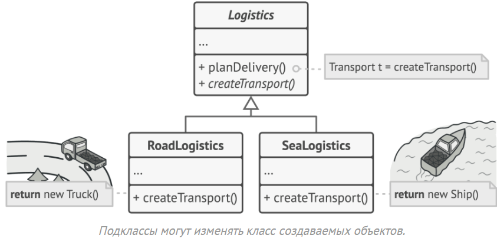

На первый взгляд, это может показаться бессмысленным: мы просто переместили вызов конструктора из одного конца программы в другой.

Чтобы эта система заработала, все возвращаемые объекты должны иметь общий интерфейс. Подклассы смогут производить объекты различных классов, следующих одному и тому же интерфейсу.

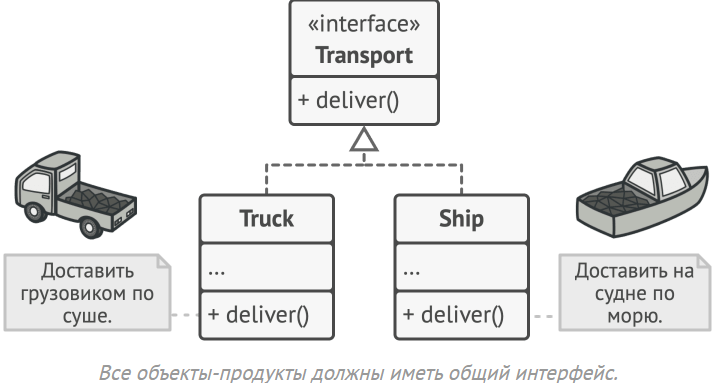

Теперь вы сможете переопределить фабричный метод в подклассе, чтобы изменить тип создаваемого продукта.

Например, классы `Truck` и `Ship` реализуют интерфейс `Transport` с методом доставить. Каждый из этих классов реализует метод по-своему: грузовики везут грузы по земле, а суда — по морю. Фабричный метод в классе `RoadLogistics` вернёт объект-грузовик, а класс `SeaLogistics` — объект-судно

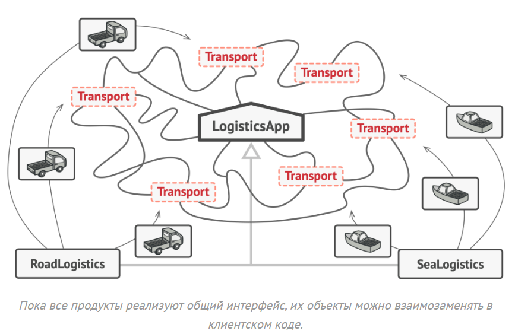

Для клиента фабричного метода нет разницы между этими объектами, так как он будет трактовать их как некий абстрактный `Transport`. Для него будет важно, чтобы объект имел метод `Deliver`, а как конкретно он работает — не важно.

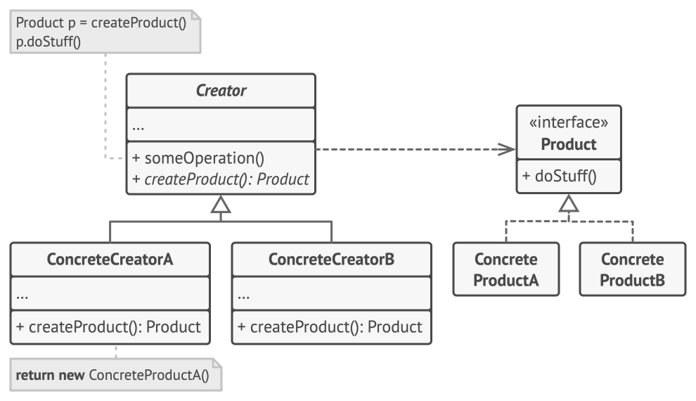

1. Product определяет общий интерфейс объектов, которые может произвести создатель и его подклассы.
2. `Concrete Products` содержат код различных продуктов. Продукты будут отличаться реализацией, но интерфейс у них будет общий.
3. `Creator` объявляет фабричный метод, который должен возвращать новые объекты продуктов. Важно, чтобы тип результата совпадал с общим интерфейсом `Product`.
Зачастую фабричный метод объявляют абстрактным, чтобы заставить все подклассы реализовать его по-своему. Но он может возвращать и некий стандартный продукт.
Несмотря на название, важно понимать, что создание продуктов не является единственной функцией создателя. Обычно он содержит и другой полезный код работы с продуктом. Аналогия: большая софтверная компания может иметь центр подготовки программистов, но основная задача компании — создавать программные продукты, а не готовить программистов.
4. `Concrete Creators` по-своему реализуют фабричный метод, производя те или иные конкретные продукты.
Фабричный метод не обязан всё время создавать новые объекты. Его можно переписать так, чтобы возвращать существующие объекты из какого-то хранилища или кэша.

Напишем всевдокод для какой-нибудь абстрактного примера:

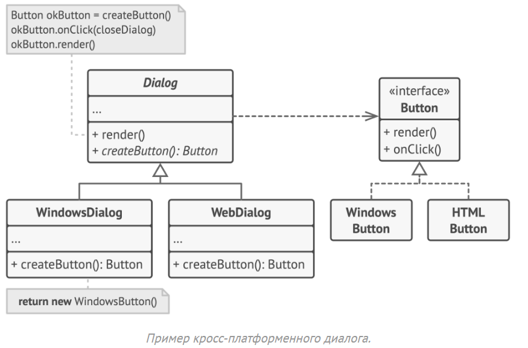

В этом примере Фабричный метод помогает создавать кросс-платформенные элементы интерфейса, не привязывая основной код программы к конкретным классам элементов.

Фабричный метод объявлен в классе диалогов. Его подклассы относятся к различным операционным системам. Благодаря фабричному методу, вам не нужно переписывать логику диалогов под каждую систему. Подклассы могут наследовать почти весь код из базового диалога, изменяя типы кнопок и других элементов, из которых базовый код строит окна графического пользовательского интерфейса.

Базовый класс диалогов работает с кнопками через их общий программный интерфейс. Поэтому, какую вариацию кнопок ни вернул бы фабричный метод, диалог останется рабочим. Базовый класс не зависит от конкретных классов кнопок, оставляя подклассам решение о том, какой тип кнопок создавать.

Такой подход можно применить и для создания других элементов интерфейса (но чем больше таких элементов, тем ближе это будет уже к другому паттерну под названием "абстрактной фабрика")

```csharp
// Интерфейс продукта
public interface IButton
{
    void Render();
    void OnClick(Action handler);
}

// Конкретный продукт: кнопка Windows
public class WindowsButton : IButton
{
    public void Render()
    {
        Console.WriteLine("Отрисовать кнопку в стиле Windows.");
    }

    public void OnClick(Action handler)
    {
        Console.WriteLine("Навешан обработчик событий Windows.");
        handler?.Invoke();
    }
}

// Конкретный продукт: кнопка HTML
public class HtmlButton : IButton
{
    public void Render()
    {
        Console.WriteLine("Вернуть HTML-код кнопки.");
    }

    public void OnClick(Action handler)
    {
        Console.WriteLine("Навешан обработчик событий браузера.");
        handler?.Invoke();
    }
}

// Абстрактная фабрика
public abstract class Dialog
{
    public void Render()
    {
        // Используем фабричный метод для создания кнопки
        IButton okButton = CreateButton();
        okButton.OnClick(CloseDialog);
        okButton.Render();
    }

    // Фабричный метод
    protected abstract IButton CreateButton();

    protected void CloseDialog()
    {
        Console.WriteLine("Закрытие диалога...");
    }
}

// Конкретная фабрика для Windows
public class WindowsDialog : Dialog
{
    protected override IButton CreateButton()
    {
        return new WindowsButton();
    }
}

// Конкретная фабрика для Web
public class WebDialog : Dialog
{
    protected override IButton CreateButton()
    {
        return new HtmlButton();
    }
}

// Пример конфигурации
public class AppConfig
{
    public string OS { get; set; }
}

// Приложение
public class Application
{
    private Dialog _dialog;

    public void Initialize()
    {
        // Здесь можно читать настройки из файла или окружения
        var config = new AppConfig { OS = "Windows" }; // пример

        if (config.OS == "Windows")
            _dialog = new WindowsDialog();
        else if (config.OS == "Web")
            _dialog = new WebDialog();
        else
            throw new Exception("Error! Unknown operating system.");
    }

    public void Main()
    {
        Initialize();
        _dialog.Render();
    }
}

// Точка входа
public static class Program
{
    public static void Main()
    {
        var app = new Application();
        app.Main();
    }
}
```

Применимость: 

- **Когда заранее неизвестны типы и зависимости объектов, с которыми должен работать ваш код**
Фабричный метод отделяет код производства продуктов от остального кода, который эти продукты использует.
Благодаря этому, код производства можно расширять, не трогая основной. Так, чтобы добавить поддержку нового продукта, вам нужно создать новый подкласс и определить в нём фабричный метод, возвращая оттуда экземпляр нового продукта.
- **Когда вы хотите дать возможность пользователям расширять части вашего фреймворка или библиотеки**.
Пользователи могут расширять классы вашего фреймворка через наследование. Но как сделать так, чтобы фреймворк создавал объекты из этих новых классов, а не из стандартных?
Решением будет дать пользователям возможность расширять не только желаемые компоненты, но и классы, которые создают эти компоненты. А для этого создающие классы должны иметь конкретные создающие методы, которые можно определить.
Например, вы используете готовый UI-фреймворк для своего приложения. Но вот беда — требуется иметь круглые кнопки, вместо стандартных прямоугольных. Вы создаёте класс `RoundButton`. Но как сказать главному классу фреймворка `UIFramework`, чтобы он теперь создавал круглые кнопки, вместо стандартных?
Для этого вы создаёте подкласс `UIWithRoundButtons` из базового класса фреймворка, переопределяете в нём метод создания кнопки (а-ля createButton) и вписываете туда создание своего класса кнопок. Затем используете `UIWithRoundButtons` вместо стандартного `UIFramework`.
- **Когда вы хотите экономить системные ресурсы, повторно используя уже созданные объекты, вместо порождения новых**.
Такая проблема обычно возникает при работе с тяжёлыми ресурсоёмкими объектами, такими, как подключение к базе данных, файловой системе и т. д.
Представьте, сколько действий вам нужно совершить, чтобы повторно использовать существующие объекты:
Сначала вам следует создать общее хранилище, чтобы хранить в нём все создаваемые объекты. При запросе нового объекта нужно будет заглянуть в хранилище и проверить, есть ли там неиспользуемый объект, а затем вернуть его клиентскому коду, но если свободных объектов нет — создать новый, не забыв добавить его в хранилище.
Весь этот код нужно куда-то поместить, чтобы не засорять клиентский код.
Самым удобным местом был бы конструктор объекта, ведь все эти проверки нужны только при создании объектов. Но, увы, конструктор всегда создаёт новые объекты, он не может вернуть существующий экземпляр.
Значит, нужен другой метод, который бы отдавал как существующие, так и новые объекты. Им и станет фабричный метод.

Шаги реализации:
1. Приведите все создаваемые продукты к общему интерфейсу.
2. В классе, который производит продукты, создайте пустой фабричный метод. В качестве возвращаемого типа укажите общий интерфейс продукта.
3. Затем пройдитесь по коду класса и найдите все участки, создающие продукты. Поочерёдно замените эти участки вызовами фабричного метода, перенося в него код создания различных продуктов.
В фабричный метод, возможно, придётся добавить несколько параметров, контролирующих, какой из продуктов нужно создать.
На этом этапе фабричный метод, скорее всего, будет выглядеть удручающе. В нём будет жить большой условный оператор, выбирающий класс создаваемого продукта. Но не волнуйтесь, мы вот-вот исправим это.
4. Для каждого типа продуктов заведите подкласс и переопределите в нём фабричный метод. Переместите туда код создания соответствующего продукта из суперкласса.
5. Если создаваемых продуктов слишком много для существующих подклассов создателя, вы можете подумать о введении параметров в фабричный метод, которые позволят возвращать различные продукты в пределах одного подкласса.
Например, у вас есть класс `Mail` с подклассами `AviaMail` и `GroundMail`, а также классы продуктов `Plane`, `Bus` и `Train`. `AviaMail` соответствует `Plane`, но для `GroundMail` есть сразу два продукта. Вы могли бы создать новый подкласс почты для поездов, но проблему можно решить и по-другому. Клиентский код может передавать в фабричный метод `GroundMail` аргумент, контролирующий тип создаваемого продукта.
6. Если после всех перемещений фабричный метод стал пустым, можете сделать его абстрактным. Если в нём что-то осталось — не беда, это будет его реализацией по умолчанию.

Структура паттена:
- creator -тип, в котором содержится логика, в рамках которой создаются объекты наследники реализуют логику создания объектов
- product тип, создаваемых объектов наследники создаются в конкретных creator’ах
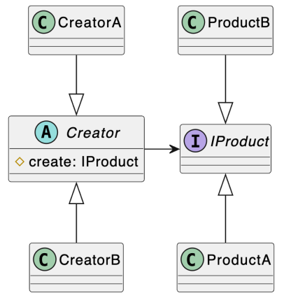

Давайте рассмотрим ещё один пример: представьте, что мы пишем систему обработки заказов
```csharp
public record OrderItem(decimal Price, int Amount)
{
    public decimal Cost => Price * Amount;
}

public record Order(IEnumerable<OrderItem> Items)
{
    public decimal TotalCost => Items.Sum(x => x.Cost);
}

public record CashPayment(decimal Amount);

public class PaymentCalculator
{
    public CashPayment Calculate(Order order)
    {
        var totalCost = order.TotalCost;

        // Apply discounts and coupons
        ...

        return new CashPayment(totalCost);
    }
}
```
Здесь у нас есть класс `PaymentCalculator`. Его задача — получить заказ `Order`, посчитать итоговую стоимость `totalCost`, применить какие-то скидки (бизнес-логика) и вернуть платёж: `return new CashPayment(totalCost);.`

В чём здесь проблема? Наш `PaymentCalculator` привязан к конкретному типу оплаты — `CashPayment`. По факту мы применяем какие-то абстрактные купоны и скидки, а потом всё равно возвращаем оплату наличными `CashPayment` 

А что, если завтра бизнес скажет: "Мы хотим добавить оплату банковским переводом"? Или криптовалютой? Нам придётся:
- Либо лезть внутрь PaymentCalculator и дописывать if/switch (что нарушает принцип Открытости/Закрытости).
- Либо копировать всю логику Calculate в новый класс, скажем, BankPaymentCalculator, и менять там только одну строку — return new BankPayment(...). Это приведёт к дублированию кода.

Проблема в том, что логика расчёта (что мы делаем) и логика создания (какой объект мы в итоге получаем) смешаны в одном месте. Фабричный метод нужен, чтобы эту связь разорвать.

Паттерн вводит два ключевых понятия: product и creator
- `Product` — это абстрактный тип объектов, которые мы хотим создавать. В нашем примере это будет не `CashPayment`, а некий общий `IPayment`. Наследники этого типа (`CashPayment`, `BankPayment`, `CryptoPayment`) — это продукты под каждую нужную нам ситуацию (где-то будет информация об аккаунте плательщика, где-то будет номер крипто-кошелька и тд. А в наличке нам вообще ничего знать не нужно - да и невозможно).
- `Creator` — это абстрактный тип, в котором содержится основная логика, в рамках которой требуется создание `Product`. Например, `PaymentCalculator`. Он будет содержать метод `Calculate`.

Ключевая идея в том, что `Creator` не знает, какой экземпляр `Product` он создаёт. Он просто говорит: "Мне нужен продукт".
А вот наследники creator'а (конкретные создатели) — они-то и будут реализовывать логику создания конкретных продуктов.
То есть `Creator` делегирует создание product'а своим наследникам. Метод, который он делегирует, и называется Фабричный метод

Давайте посмотрим, как наш код преображается с применением этого паттерна:

```csharp
public interface IPayment
{
    decimal Amount { get; }
}

public record CashPayment(
    decimal Amount) : IPayment;

public record BankPayment(
    decimal Amount,
    string ReceiverAccountId) : IPayment;
```

Мы ввели интерфейс `IPayment`. Это наш абстрактный product. Теперь `CashPayment` и новый `BankPayment` реализуют этот интерфейс. Это даёт нам полиморфизм: мы можем работать с любым типом оплаты через общий интерфейс `IPayment`.

Теперь введём создателя:
```csharp
public abstract class PaymentCalculator
{
    public IPayment Calculate(Order order)
    {
        var totalCost = order.TotalCost;

        // Apply discounts and coupons
        ...

        return CreatePayment(totalCost);
    }

    protected abstract IPayment CreatePayment(decimal amount);
}
```
Теперь у нас осталась вся логика вычисления скидок и применения купонов (бизнес-логика), однако Calculate теперь возвращает общий интерфейс `IPayment`.
Самая главное, что у нас появился абстрактный метод `CreatePayment`, который классы-наследники вынуждены переопределить.
Сам `PaymentCalculator` не знает, как его реализовать. Он заставляет своих наследников предоставить эту реализацию. Он protected — потому что это "внутренняя кухня" класса. `Calculate` использует его, но снаружи никому не нужно знать о том, как создаётся платёж.

Теперь посмотрим на то, как реализовать наших создателей под конкретные типы:
```csharp
public class CashPaymentCalculator : PaymentCalculator
{
    protected override IPayment CreatePayment(decimal amount) 
        => new CashPayment(amount);
}

public class BankPaymentCalculator : PaymentCalculator
{
    private readonly string _currentReceiverAccountId;

    public BankPaymentCalculator(string currentReceiverAccountId)
    {
        _currentReceiverAccountId = currentReceiverAccountId;
    }

    protected override IPayment CreatePayment(decimal amount)
    {
        return new BankPayment(amount, _currentReceiverAccountId);
    }
}
```

Обратите внимание на `BankPaymentCalculator`. Ему для создания `BankPayment` нужен `_currentReceiverAccountId`. И это не проблема! Конкретный создатель может иметь собственное состояние и конструкторы, которые нужны именно ему для создания его конкретного продукта. Абстрактный `PaymentCalculator` об этом даже не знает.

Итак, как это применять? Соберём всё вместе:

1. Клиентский код теперь сам решает, какой тип калькулятора ему нужен.
```csharp
PaymentCalculator calculator = new CashPaymentCalculator();

// Или: PaymentCalculator calculator = new BankPaymentCalculator("123456");
```
2. Клиент вызывает один и тот же метод: IPayment payment = calculator.Calculate(myOrder);.
3. Выполняется общая логика из PaymentCalculator.Calculate.
4. Когда Calculate доходит до строки return CreatePayment(totalCost);, благодаря полиморфизму вызывается override-версия метода того класса, который мы создали в пункте 1.
5. Если calculator — это CashPaymentCalculator, вызовется его CreatePayment и вернётся CashPayment. Если calculator — это BankPaymentCalculator, вызовется его CreatePayment и вернётся BankPayment.
6. Creator (PaymentCalculator) отвечает за "когда" создавать объект (в конце расчёта). Конкретные creator'ы (CashPaymentCalculator, BankPaymentCalculator) отвечают за "что" создавать. Логика создания инкапсулирована внутри конкретных создателей.

Схема использования:
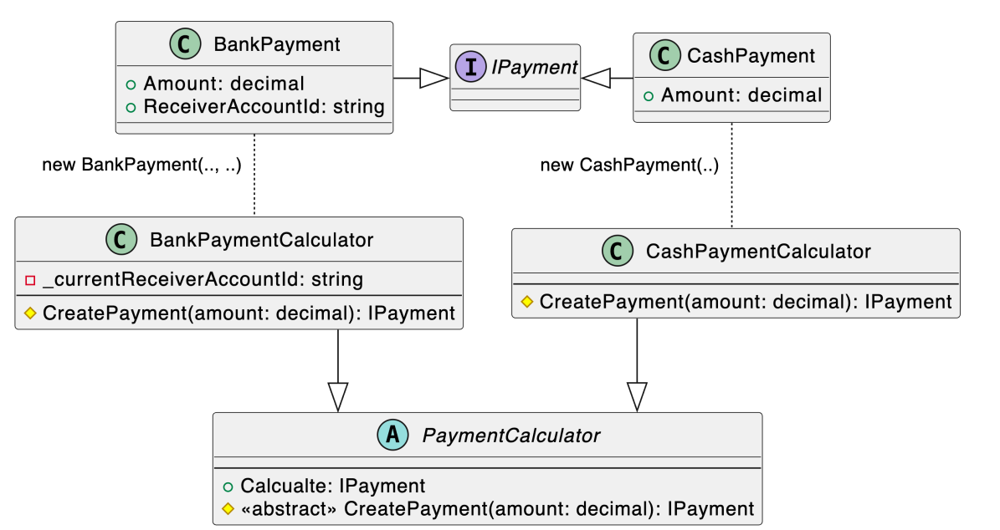

Самое главное, что мы получили — гибкость и расширяемость.

Завтра нам понадобится CryptoPayment. Что мы делаем?

1. Создаём record CryptoPayment(...) : IPayment (новый product).
2. Создаём class CryptoPaymentCalculator : PaymentCalculator.
3. Реализуем в нём protected override IPayment CreatePayment(...) => new CryptoPayment(...).

Мы не тронули ни одной строки существующего кода (PaymentCalculator, CashPaymentCalculator и т.д.). Мы только добавили новый. Система расширяется, оставаясь "закрытой" для модификаций. Это принцип Открытости/Закрытости (Open/Closed Principle) в чистом виде.

Однако у этого паттерна есть и недостатки:

**1.) Фабричный метод может привести к созданию больших параллельных иерархий классов, так как для каждого класса продукта надо создать свой подкласс создателя.**

**2.) сильная связанность конкретных создателей с базовым типом: переиспользуется логика базового типа, но не логика конкретных создателей**

Пример: CashPaymentCalculator связан с PaymentCalculator через наследование. Он обязан быть его наследником.

Представьте, что у нас появляется другая иерархия калькуляторов, например, FixedPricePaymentCalculator, у которого другая логика Calculate (например, он всегда возвращает 100). То есть он не применяет скидки и купоны и не делает никакой другой бизнес-логики, в отличии от обычного PaymentCalculator.
Если мы захотим, чтобы он тоже создавал CashPayment, нам придётся создать FixedCashPaymentCalculator : FixedPricePaymentCalculator и заново написать в нём override CreatePayment ... => new CashPayment().

Мы не можем переиспользовать логику создания из CashPaymentCalculator, потому что она используется в другой иерархии. Логика базового типа (Calculate) переиспользуется наследниками, а вот логика конкретных создателей (CreatePayment) — нет.

**3.) неявное нарушение SRP: объект конкретного создателя ответственен как за реализацию логики,
так и за создание продуктов**

creator (например, BankPaymentCalculator) становится ответственен и за реализацию логики (он наследует Calculate), и за создание продуктов (он реализует CreatePayment).

Это две разные "причины для изменения".
1. Если изменится общая логика расчёта (в базовом PaymentCalculator), это коснётся всех наследников.
2. Если изменится способ создания BankPayment (например, ему понадобится новый параметр), нам придётся менять BankPaymentCalculator.

Класс BankPaymentCalculator и "калькулятор", и "фабрика" одновременно. Это может усложнить поддержку, если и логика, и создание становятся слишком сложными.


Вывод:
Фабричный метод — это классический паттерн, который решает проблему связи с оператором new путём делегирования создания наследникам через абстрактный метод. Он идеально подходит, когда у вас есть общая логика, но в конце этой логики нужно создавать разные объекты, тип которых определяется подклассом.

### (Абстрактная) фабрика

> вариативность создания объектов при помощи композиции и полиморфизма

Вообще фабричный метод применяется достаточно редко. Куда чаще применеятся абстрактная фабрика, или же просто - фабрика. Давайте разбираться что это.

Какая проблема есть у фабричного метода?
Вспомним код: 
```csharp
public abstract class Dialog
{
    public void Render()
    {
        // Используем фабричный метод для создания кнопки
        IButton okButton = CreateButton();

        okButton.Render();
    }

    // Фабричный метод
    protected abstract IButton CreateButton();
}
```
А что если помимо кнопки мы захоти добавить ещё, например, текстовое поле ITextBox?

```csharp
public abstract class Dialog
{
    public void Render()
    {
        // Нам нужно ДВА продукта, и они должны быть из ОДНОЙ СЕМЬИ
        // (оба должны быть 'Windows' или оба 'Html')
        IButton okButton = CreateButton();
        ITextBox nameBox = CreateTextBox(); // <-- Вторая точка создания
        
        okButton.Render();
        nameBox.Render();
    }

    // Наш Creator "распухает" от фабричных методов
    protected abstract IButton CreateButton();
    protected abstract ITextBox CreateTextBox(); // <-- Добавили второй метод
}
```
А если захотим добавить третий?
```csharp
public abstract class Dialog
{
    public void Render()
    {
        IButton okButton = CreateButton();
        ITextBox nameBox = CreateTextBox(); 
        IScrollBar vScroll = CreateScrollBar(); // третий...
        
        okButton.Render();
        nameBox.Render();
    }

    // Уже целых три абстрактных метода
    protected abstract IButton CreateButton();
    protected abstract ITextBox CreateTextBox(); 
    protected abstract IScrollBar CreateScrollBar(); 
}
```
И так далее.

После таких изменений в каждом Creator'е нам нужно будет добавить реализацию этих методов. То есть пробежаться во всем таким классам и вручную из изменить. Очевидно, что если таких классов будет достаточно много, то сделать это будет крайне тяжело.

То есть фабричный метод не работает, когда нам нужно создать не один объект, а семейство каких-то связанных между собой объектов.

Решить эту проблему можно через композицию. Создадим фабрику, которая будет выполнять все эти методы.

```csharp
// Это "Абстрактная Фабрика"
// Она описывает СЕМЕЙСТВО продуктов
public interface IUIFactory
{
    IButton CreateButton();
    ITextBox CreateTextBox();
    IScrollBar CreateScrollBar();
}

// Фабрика 1
public class WindowsFactory : IUIFactory
{
    public IButton CreateButton() => new WindowsButton();
    public ITextBox CreateTextBox() => new WindowsTextBox();
    public IScrollBar CreateScrollBar() => new WindowsScrollBar();
}

// Фабрика 2
public class WebFactory : IUIFactory
{
    public IButton CreateButton() => new HtmlButton();
    public ITextBox CreateTextBox() => new HtmlTextBox();
    public IScrollBar CreateScrollBar() => new HtmlScrollBar();
}

// Теперь уже не абстрактный
public class Dialog
{
    // 1. (Композиция)
    private readonly IUIFactory _factory;

    public Dialog(IUIFactory factory)
    {
        _factory = factory;
    }

    // 3. Логика Render() не изменилась
    public void Render()
    {
        // но теперь она ДЕЛЕГИРУЕТ создание фабрике
        IButton okButton = _factory.CreateButton();
        ITextBox nameBox = _factory.CreateTextBox();
        IScrollBar scrollBar = _factory.CreateScrollBar();
        
        okButton.Render();
        nameBox.Render();
        scrollBar.Render();
    }
}
```

Рассмотрим ещё несколько примеров:
Создаём продукты:
```csharp
// Это общий интерфейс продуктов
public interface IPayment
{
    decimal Amount { get; }
}

// Это продукт 1
public record BankPayment(
    decimal Amount,
    string ReceiverAccountId) : IPayment;

// Это продукт 2
public record CashPayment(
    decimal Amount) : IPayment;
```
Теперь мы определяем контракт для создателя:
```csharp
public interface IPaymentFactory
{
    IPayment Create(decimal amount);
}
```
Теперь мы пишем классы, которые реализуют этот интерфейс. Каждая фабрика будет "заточена" под создание своего конкретного продукта.
```csharp
// "Конкретная фабрика 1"
public class BankPaymentFactory : IPaymentFactory
{
    private readonly string _currentReceiverAccountId;

    // Фабрика может иметь свое состояние!
    public BankPaymentFactory(string currentReceiverAccountId)
    {
        _currentReceiverAccountId = currentReceiverAccountId;
    }

    public IPayment Create(decimal amount)
    {
        // Эта фабрика знает, как создать BankPayment.
        // Она инкапсулирует эту логику.
        return new BankPayment(amount, _currentReceiverAccountId);
    }
}

// "Конкретная фабрика 2"
public class CashPaymentFactory : IPaymentFactory
{
    public IPayment Create(decimal amount)
    {
        // Эта фабрика знает, как создать CashPayment.
        return new CashPayment(amount);
    }
}
```

Теперь посмотрим на то, как это можно применить:
```csharp
// интерфейс для калькулятора
public interface IPaymentCalculator
{
    IPayment Calculate(Order order);
}

public class PaymentCalculator : IPaymentCalculator
{
    private readonly IPaymentFactory _paymentFactory;

    public PaymentCalculator(IPaymentFactory paymentFactory)
    {
        _paymentFactory = paymentFactory;
    }

    public IPayment Calculate(Order order)
    {
        var totalCost = order.TotalCost;
        
        // Apply discounts and coupons 

        // ...

        return _paymentFactory.Create(totalCost);
    }
}

// Другой калькулятор
public class FixedPaymentCalculator : IPaymentCalculator
{
    private readonly decimal _fixedPrice;
    private readonly IPaymentFactory _paymentFactory;

    public FixedPaymentCalculator(decimal fixedPrice, IPaymentFactory paymentFactory)
    {
        _fixedPrice = fixedPrice;
        _paymentFactory = paymentFactory;
    }
    public IPayment Calculate(Order order)
    {
        var totalCost = order.Items.Sum(item =>_fixedPrice * item.Amount);

        // Apply discounts and coupons

        // ...

        return _paymentFactory.Create(totalCost);
    }
}
```
Мы можем легко добавить новую фабрику:
```csharp
public record CryptoPayment(decimal Amount, string Wallet) : IPayment;

public class CryptoPaymentFactory : IPaymentFactory
{
    private readonly string _companyWallet;
    public CryptoPaymentFactory(string companyWallet) { _companyWallet = companyWallet; }

    public IPayment Create(decimal amount)
    {
        return new CryptoPayment(amount, _companyWallet);
    }
}
```

Пример использования в коде:
```csharp
public static class Program
{
    public static void Main(string[] args)
    {
        Console.WriteLine("--- Сценарий 1: Банк ---");

        // 1. Создаем конкретную фабрику
        IPaymentFactory bankFactory = new BankPaymentFactory("UA1234567890");

        // 2. Внедряем фабрику в калькулятор
        IPaymentCalculator bankCalculator = new PaymentCalculator(bankFactory);

        // 3. Используем калькулятор
        Order order1 = new Order { TotalCost = 250.50m };
        IPayment payment1 = bankCalculator.Calculate(order1);
        
        // 4. Проверяем результат
        Console.WriteLine($"Создан платеж типа: {payment1.GetType().Name}"); // Выведет: BankPayment
        Console.WriteLine($"Сумма: {payment1.Amount}");

        
        // === СЦЕНАРИЙ 2: Конфигурация для наличных ===
        Console.WriteLine("\n--- Сценарий 2: Наличные ---");

        // 1. Создаем ДРУГУЮ фабрику
        IPaymentFactory cashFactory = new CashPaymentFactory();

        // 2. Внедряем эту фабрику в тот же тип калькулятора
        IPaymentCalculator cashCalculator = new PaymentCalculator(cashFactory);

        // 3. Используем
        Order order2 = new Order { TotalCost = 99.00m };
        IPayment payment2 = cashCalculator.Calculate(order2);

        // 4. Проверяем
        // На этот раз код калькулятора создал CashPayment!
        Console.WriteLine($"Создан платеж типа: {payment2.GetType().Name}"); // Выведет: CashPayment
        Console.WriteLine($"Сумма: {payment2.Amount}");
    }
}
```

В общем основная идея, что фабрика применяется в тех случаях, когда мы желаем создавать целые семейства объектов, а не что-то одно. Есть редкие исключения, когда вполне уместно применить фабричный метод, но в основном применяют именно фабрику.

Рассмотрим ещё один пример:

Представьте, что вы пишете симулятор мебельного магазина. Ваш код содержит:

- Семейство зависимых продуктов, cкажем, Armchair + Sofa + Coffee table.
- Несколько вариаций этого семейства. Например, продукты Armchair, Sofa, Coffee table представлены в трёх разных стилях: [Ар-деко, Ар-нуво (модерн)](https://artdoart.com/news/ar-nuvo-i-ar-deko-v-cem-raznica) и Викторианском.

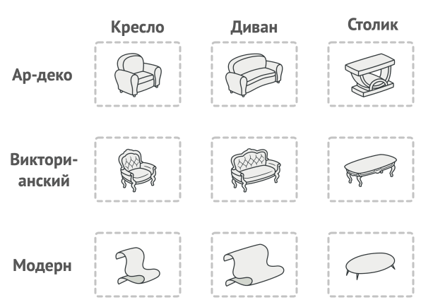

Вам нужен такой способ создавать объекты продуктов, чтобы они сочетались с другими продуктами того же семейства. Это важно, так как клиенты расстраиваются, если получают несочетающуюся мебель.


Кроме того, вы не хотите вносить изменения в существующий код при добавлении новых продуктов или семейcтв в программу. Поставщики часто обновляют свои каталоги, и вы бы не хотели менять уже написанный код каждый раз при получении новых моделей мебели

Паттерн Абстрактная фабрика предлагает выделить общие интерфейсы для отдельных продуктов, составляющих семейства. Так, все вариации кресел получат общий интерфейс Armchair, все диваны реализуют интерфейс Sofa и так далее. В примерах выше это были Button, ScrollBar и так далее
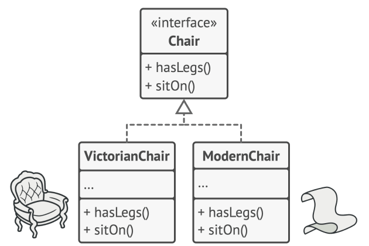

Далее вы создаёте абстрактную фабрику — общий интерфейс, который содержит методы создания всех продуктов семейства (например, createArmchair, createSofa и createCoffeeTable). Эти операции должны возвращать абстрактные типы продуктов, представленные интерфейсами, которые мы выделили ранее — Armchair, Sofa и Coffee table.

Для каждой вариации семейства продуктов мы должны создать свою собственную фабрику, реализовав абстрактный интерфейс. Фабрики создают продукты одной вариации. Например, ModernFactory будет возвращать только ModernArmchair ,ModernSofa и ModernCoffeeTable.

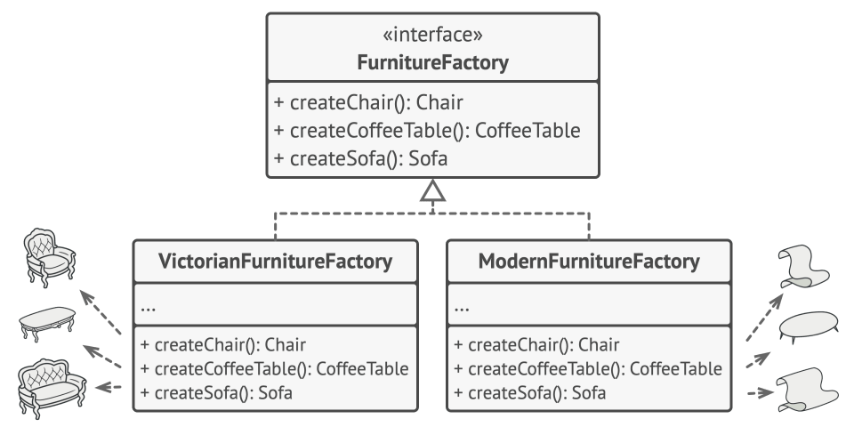

(В примерах выше это была фабрика всяких UI элементов, вроде кнопок)

Клиентский код должен работать как с фабриками, так и с продуктами только через их общие интерфейсы. Это позволит подавать в ваши классы любой тип фабрики и производить любые продукты, ничего не ломая.


Например, клиентский код просит фабрику сделать стул. Он не знает, какого типа была эта фабрика. Он не знает, получит викторианский или модерновый стул. Для него важно, чтобы на стуле можно было сидеть и чтобы этот стул отлично смотрелся с диваном той же фабрики.

То есть схема следующая:
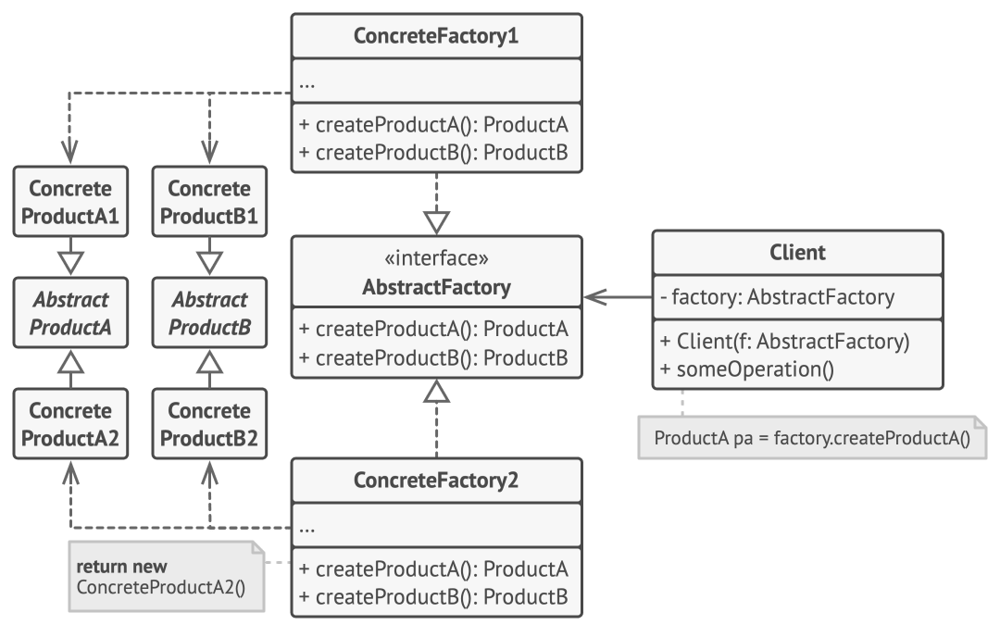

1. Абстрактные продукты объявляют интерфейсы продуктов, которые связаны друг с другом по смыслу, но выполняют разные функции.

2. Конкретные продукты — большой набор классов, которые относятся к различным абстрактным продуктам (кресло/столик), но имеют одни и те же вариации (Викторианский/Модерн).

3. Абстрактная фабрика объявляет методы создания различных абстрактных продуктов (кресло/столик).

4. Конкретные фабрики относятся каждая к своей вариации продуктов (Викторианский/Модерн) и реализуют методы абстрактной фабрики, позволяя создавать все продукты определённой вариации.

5. Несмотря на то, что конкретные фабрики порождают конкретные продукты, сигнатуры их методов должны возвращать соответствующие абстрактные продукты. Это позволит клиентскому коду, использующему фабрику, не привязываться к конкретным классам продуктов. Клиент сможет работать с любыми вариациями продуктов через абстрактные интерфейсы.

Приведём пример кода:

```csharp
// -----------------------------
// 1. Абстрактные продукты
// -----------------------------

public interface IArmchair
{
    void SitOn();
}

public interface ISofa
{
    void LieOn();
}

public interface ICoffeeTable
{
    void PutCoffee();
}

// -----------------------------
// 2. Конкретные продукты
// Ар-деко
// -----------------------------

public class ArtDecoArmchair : IArmchair
{
    public void SitOn() => Console.WriteLine("Вы сидите на кресле Ар-деко.");
}

public class ArtDecoSofa : ISofa
{
    public void LieOn() => Console.WriteLine("Вы лежите на диване Ар-деко.");
}

public class ArtDecoCoffeeTable : ICoffeeTable
{
    public void PutCoffee() => Console.WriteLine("Вы ставите кофе на столик Ар-деко.");
}

// -----------------------------
// 2. Конкретные продукты
// Ар-нуво (модерн)
// -----------------------------

public class ModernArmchair : IArmchair
{
    public void SitOn() => Console.WriteLine("Вы сидите на кресле в стиле модерн.");
}

public class ModernSofa : ISofa
{
    public void LieOn() => Console.WriteLine("Вы лежите на диване в стиле модерн.");
}

public class ModernCoffeeTable : ICoffeeTable
{
    public void PutCoffee() => Console.WriteLine("Вы ставите кофе на столик в стиле модерн.");
}

// -----------------------------
// 2. Конкретные продукты
// Викторианский
// -----------------------------

public class VictorianArmchair : IArmchair
{
    public void SitOn() => Console.WriteLine("Вы сидите на викторианском кресле.");
}

public class VictorianSofa : ISofa
{
    public void LieOn() => Console.WriteLine("Вы лежите на викторианском диване.");
}

public class VictorianCoffeeTable : ICoffeeTable
{
    public void PutCoffee() => Console.WriteLine("Вы ставите кофе на викторианский столик.");
}

// -----------------------------
// 3. Абстрактная фабрика
// -----------------------------

public interface IFurnitureFactory
{
    IArmchair CreateArmchair();
    ISofa CreateSofa();
    ICoffeeTable CreateCoffeeTable();
}

// -----------------------------
// 4. Конкретные фабрики
// -----------------------------

public class ArtDecoFurnitureFactory : IFurnitureFactory
{
    public IArmchair CreateArmchair() => new ArtDecoArmchair();
    public ISofa CreateSofa() => new ArtDecoSofa();
    public ICoffeeTable CreateCoffeeTable() => new ArtDecoCoffeeTable();
}

public class ModernFurnitureFactory : IFurnitureFactory
{
    public IArmchair CreateArmchair() => new ModernArmchair();
    public ISofa CreateSofa() => new ModernSofa();
    public ICoffeeTable CreateCoffeeTable() => new ModernCoffeeTable();
}

public class VictorianFurnitureFactory : IFurnitureFactory
{
    public IArmchair CreateArmchair() => new VictorianArmchair();
    public ISofa CreateSofa() => new VictorianSofa();
    public ICoffeeTable CreateCoffeeTable() => new VictorianCoffeeTable();
}

// -----------------------------
// 5. Клиентский код
// -----------------------------

public class FurnitureShowroom
{
    private readonly IFurnitureFactory _factory;

    private IArmchair _armchair;
    private ISofa _sofa;
    private ICoffeeTable _table;

    public FurnitureShowroom(IFurnitureFactory factory)
    {
        _factory = factory;
    }

    public void CreateFurnitureSet()
    {
        _armchair = _factory.CreateArmchair();
        _sofa = _factory.CreateSofa();
        _table = _factory.CreateCoffeeTable();
    }

    public void Demo()
    {
        _armchair.SitOn();
        _sofa.LieOn();
        _table.PutCoffee();
    }
}

// -----------------------------
// 6. Конфигуратор приложения
// -----------------------------

public static class AppConfig
{
    public static void Main()
    {
        string style = "ArtDeco"; // читаем из конфига

        IFurnitureFactory factory = style switch
        {
            "ArtDeco" => new ArtDecoFurnitureFactory(),
            "Modern" => new ModernFurnitureFactory(),
            "Victorian" => new VictorianFurnitureFactory(),
            _ => throw new Exception("Неизвестный стиль мебели!")
        };

        var showroom = new FurnitureShowroom(factory);

        showroom.CreateFurnitureSet();
        showroom.Demo();
    }
}
```
**Применимость**
1. **Когда бизнес-логика программы должна работать с разными видами связанных друг с другом продуктов, не завися от конкретных классов продуктов.**
Абстрактная фабрика скрывает от клиентского кода подробности того, как и какие конкретно объекты будут созданы. Но при этом клиентский код может работать со всеми типами создаваемых продуктов, поскольку их общий интерфейс был заранее определён.
2. **Когда в программе уже используется Фабричный метод, но очередные изменения предполагают введение новых типов продуктов.**
В хорошей программе каждый класс отвечает только за одну вещь. Если класс имеет слишком много фабричных методов, они способны затуманить его основную функцию. Поэтому имеет смысл вынести всю логику создания продуктов в отдельную иерархию классов, применив абстрактную фабрику.

**Шаги реализации**
1. Создайте таблицу соотношений типов продуктов к вариациям семейств продуктов.
2. Сведите все вариации продуктов к общим интерфейсам.
3. Определите интерфейс абстрактной фабрики. Он должен иметь фабричные методы для создания каждого из типов продуктов.
4. Создайте классы конкретных фабрик, реализовав интерфейс абстрактной фабрики. Этих классов должно быть столько же, сколько и вариаций семейств продуктов.
5. Измените код инициализации программы так, чтобы она создавала определённую фабрику и передавала её в клиентский код.
6. Замените в клиентском коде участки создания продуктов через конструктор вызовами соответствующих методов фабрики.


Преимущества:
- настоящее соблюдение SRP, ведь в такой реализации нет прямой связанности между реализациями
- соблюдение OCP: мы можем добавить в систему новые виды платежей и реализовать фабрики для них, тем самым, расширить логику не меняя реализацию калькуляторов

Недостатки:
- Усложняет код программы из-за введения множества дополнительных классов.
- Требует наличия всех типов продуктов в каждой вариации.

### Строитель (билдер)

> выделение отдельного типа, инкапсулирующего логику сбора данных и создания объекта

Параметр - набор тип+имя находящийся в сигнатуре метода 
Ex.: `public void A(int a, char b); // int a и char b — это параметры`

Аргумент - конкретное значение передающееся в метод
Ex.: `obj.A(1, '2'); // 1 и '2' - аргументы метода A()`

```csharp
void M(int x, string s)   // int x и string s — параметры
{
}
M(10, "hi");               // 10 и "hi" — аргументы
```

Строитель — это порождающий паттерн проектирования, который позволяет создавать сложные объекты пошагово. Строитель даёт возможность использовать один и тот же код строительства для получения разных представлений объектов.

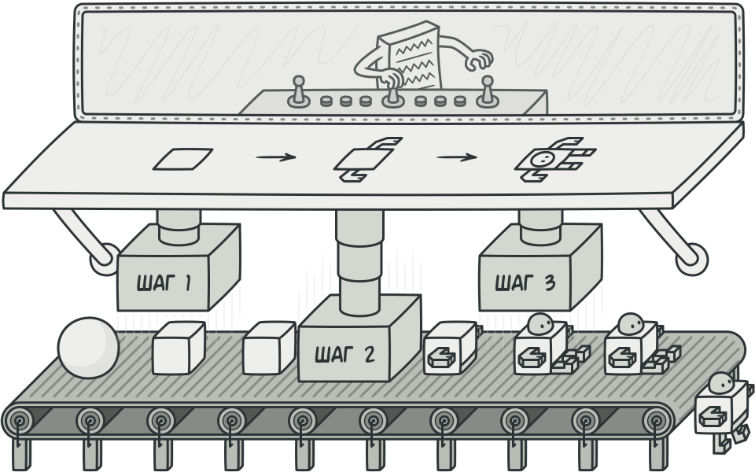

Представьте объект (например, дом) у которого может быть очень много разных конфигураций. Два варианта: либо передавать каким-то образом всё через огромный конструктор:
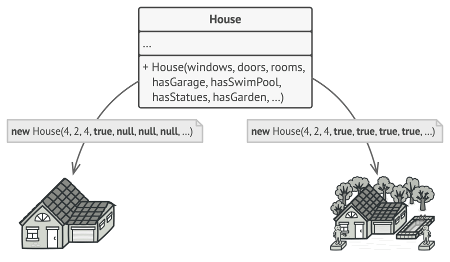
Далеко не все аргументы всегда используются и приходится делать их null. Либо создаётся проблема "телескопических конструкторов", то есть матрёшки из конструкторов:
```csharp
public class House
{
    public string Address { get; }
    public int Floors { get; }
    public bool HasGarage { get; }
    public bool HasGarden { get; }
    public bool HasPool { get; }
    public bool HasFancyStatues { get; }

    // Базовый конструктор, куда сводятся все остальные
    public House(string address, int floors, bool hasGarage, bool hasGarden, bool hasPool, bool hasFancyStatues)
    {
        Address = address;
        Floors = floors;
        HasGarage = hasGarage;
        HasGarden = hasGarden;
        HasPool = hasPool;
        HasFancyStatues = hasFancyStatues;
    }

    // Только адрес → минимальный дом
    public House(string address)
        : this(address, 1, false, false, false, false) { }

    // Адрес + этажность
    public House(string address, int floors)
        : this(address, floors, false, false, false, false) { }

    // Дом с гаражом
    public static House WithGarage(string address, int floors = 1)
        => new House(address, floors, hasGarage: true, hasGarden: false, hasPool: false, hasFancyStatues: false);

    // Дом с садом
    public static House WithGarden(string address, int floors = 1)
        => new House(address, floors, false, hasGarden: true, false, false);

    // Дом с бассейном
    public static House WithPool(string address, int floors = 1)
        => new House(address, floors, false, false, hasPool: true, false);

    // Дом со статуями
    public static House WithFancyStatues(string address, int floors = 1)
        => new House(address, floors, false, false, false, hasFancyStatues: true);
 
    // И так далее...
} 
```
Либо же, что возможно ещё хуже, придется наследовать кучу разных подклассов для всех возможных комбинаций параметров


Паттерн Строитель предлагает разбить весь этот процесс на отдельные шаги. Пришём, чтобы создать объект, вам нужно лишь поочерёдно вызывать методы строителя. И теперь не нужно запускать все шаги, а только те, что нужны для производства объекта определённой конфигурации.

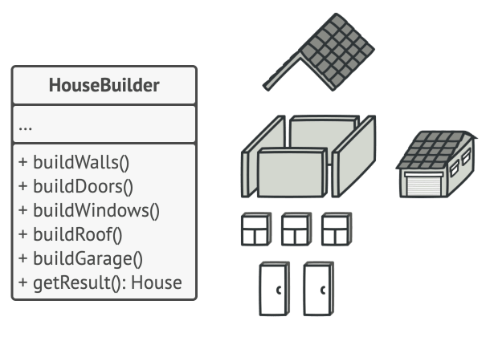

И в нашем коде получится что-то вроде:
```csharp

// Раньше: создавали дом в явном виде
var house = House(
    adress: "ulitsa- pushkina-dom-kalatush",
    floors: 2,
    HasGarage = false,
    HasGarden = true,
    HasPool = true,
    HasFancyStatues = true
    )

// Либо: создавали конкретный дом
var house = houseWithPoolAndGardenAndFancyStatues(
    adress: "ulitsa- pushkina-dom-kalatush",
    floors: 2
    )
// И если бы мы хотели добавить что-то новое,
// то пришлось бы либо 
// менять конструктор, либо вызывать новый дом

// Теперь можем собрать дом "по кусочкам":
var house = HouseBuilder()
    .WithAddress("ulitsa-pushkina-dom-kalatush")
    .WithFloors(2)
    .WithPool()
    .WithGarden()
    .WithStatues()
    .Build()

// Если бы мы захотели добавить что-то ещё
// , то достаточно было бы просто прописать ещё 
// один метод, например WithFountain() и WithPlayground()
```

То есть мы вынесли логику создания из чего-то цельного в "как бы лего конструктор", куда мы при желании можешь в любой момент присоединить что-то новое.

Рассмотрим пример того, как применить этот паттерн в реальности:

У вас есть класс Order, который описывает заказ в интернет-магазине. Изначально это было бы просто:
```csharp
public record Order(IEnumerable<OrderItem> Items);
```

То есть просто список каких-то заказов:
```csharp
var order = new Order(
    [
        new OrderItem(Name: "banana", Price: 42, Amount: 20),
        new OrderItem(Name: "phone", Price: 30000, Amount: 1),
        new OrderItem(Name: "marker", Price: 201, Amount: 3),
        new OrderItem(Name: "steak", Price: 1337, Amount: 1)
    ]
);
```

Но со временем требования растут. Помимо просто списка заказов становятся нужными комментарий для магазина, комментарий для доставки, номер телефона получателя, время создания и ещё десяток полей:
```csharp
public record Order(
    string CommentForShop,
    string CommentForDelivery,
    IEnumerable<OrderItem> Items,
    DateTimeOffset CreatedAt,
    string? ReceiverPhoneNumber,
    // и ещё много...
);
```
Теперь, когда мы захотим создать объект, конструктор потребует множество параметров:
```csharp
var order = new Order(
    CommentForShop: "Срочно!",
    CommentForDelivery: "Оставить у двери",
    Items: [
        new OrderItem(Name: "banana", Price: 42, Amount: 20),
        new OrderItem(Name: "phone", Price: 30000, Amount: 1),
        new OrderItem(Name: "marker", Price: 201, Amount: 3),
        new OrderItem(Name: "steak", Price: 1337, Amount: 1)
    ],
    CreatedAt: DateTimeOffset.UtcNow,
    ReceiverPhoneNumber: "+7-900-123-45-67"
);
```

Это становится неудобно. Кроме того, создание заказа часто требует логики: иногда товары надо добавлять в строго определённом порядке, например, сначала продукты, а только потом бытовую технику. Где проверять, что в заказе, например, не больше 20 товаров? Некоторые клиеты (например с вип-статусом) могут иметь больше привелегий. Как всё это организовать?     

Вот здесь появляется паттерн Builder. Как мы уже знаем его основная идея выделить отдельный тип, который инкапсулирует логику сбора данных и создания объекта. 

Builder — это вспомогательный класс, который:
- Накапливает состояние — хранит промежуточные значения параметров
- Предоставляет удобный API — методы вида WithXxx(), которые возвращают сам builder для цепочки вызовов (fluent interface)
- Выполняет финальное создание — метод Build() создаёт финальный объект

```csharp
// Строитель
public class OrderBuilder
{
    // 1. Он хранит *внутреннее, изменяемое состояние*
    private readonly List<OrderItem> _items = [];

    // 2. Он предоставляет "текучий" (fluent) интерфейс
    public OrderBuilder WithItem(OrderItem item)
    {
        _items.Add(item);
        return this; // <- Ключевой момент для "цепочки" вызовов
    }

    // 3. Он имеет финальный метод "Build"
    public Order Build()
    {
        // В этот момент он создает иммутабельный продукт
        return new Order(_items.ToArray());
    }
}
```

Теперь можем удобно использовать это билдер:
```csharp
var orderBuilder = new OrderBuilder() // Заказ
    .WithItem(Name: "banana", Price: 42, Amount: 20) // с бананами
    .WithItem(Name: "phone", Price: 30000, Amount: 1) // и телефоном
    .WithItem(Name: "marker", Price: 201, Amount: 3) // и тремя маркерами
    .WithItem(Name: "steak", Price: 1337, Amount: 1); // и одним стейком

// Мы можем *передавать строителя* в другие методы,
// чтобы они его "до-настроили".
AddDefaultItems(orderBuilder);
AddRequestedItems(orderBuilder); 
AddForecastedItems(orderBuilder);

Order order = orderBuilder.Build(); // соберём заказ
```
Видите красоту? Логика добавления товаров разнесена по разным методам, но всё аккуратно собирается в одном builder'е.

Давайте рассмотрим два вида билдеров:

#### 1. Convenience builder (Удобный Строитель)

> упрощенное создание объектов с большим конструктором

Это тип можно охарактеризовать так:
- модель никак не связана с билдером
- несёт в себе вспомогательный функционал
- используется для упрощения создания объектов

Вспоним ситуацию с огромным конструктором:
```csharp
// в заказе много полей
public record Order(
    string CommentForShop,
    string CommentForDelivery,
    IEnumerable<OrderItem> Items,
    DateTimeOffset CreatedAt,
    string? ReceiverPhoneNumber
);

// пропуск кода

// Это то, чего мы хотим избежать!
var order = new Order(
    CommentForShop: string.Empty, // по умолчанию
    CommentForDelivery: string.Empty, // по умолчанию
    Items: [new OrderItem(Price: 1337, Amount: 2)], // < - единственное нужное поле
    CreatedAt: DateTimeOffset.UtcNow, // по умолчанию
    ReceiverPhoneNumber: null // по умолчанию
);
```
Convinience builder решает эту проблему. Он сам, внутри себя, хранит эти значения по умолчанию.

```csharp
// Builder должен хранить значения всех полей со значениями по умолчанию
public class OrderBuilder
{
    private readonly List<OrderItem> _items = [];
    private string _commentForShop = string.Empty;
    private string _commentForDelivery = string.Empty;
    private DateTimeOffset _createdAt = DateTimeOffset.UtcNow;
    private string? _receiverPhoneNumber = null;

    public OrderBuilder WithItem(OrderItem item)
    {
        _items.Add(item);
        return this;
    }

    public OrderBuilder WithCommentForShop(string value)
    {
        _commentForShop = value;
        return this;
    }

    public OrderBuilder WithCommentForDelivery(string value)
    {
        _commentForDelivery = value;
        return this;
    }

    public OrderBuilder WithReceiverPhoneNumber(string? value)
    {
        _receiverPhoneNumber = value;
        return this;
    }

    public Order Build()
    {
        return new Order(
            CommentForShop: _commentForShop,
            CommentForDelivery: _commentForDelivery,
            Items: _items,
            CreatedAt: _createdAt,
            ReceiverPhoneNumber: _receiverPhoneNumber
        );
    }
}
```
Использование:

Теперь код клиента становится чистым. Клиент указывает только то, что отклоняется от нормы.

```csharp
var order = new OrderBuilder()
    .WithItem(new OrderItem(Price: 1337, Amount: 2))
    .Build();

// Или с большей кастомизацией:
var customOrder = new OrderBuilder()
    .WithItem(new OrderItem(Price: 100, Amount: 5))
    .WithCommentForShop("Упаковать аккуратно!")
    .WithReceiverPhoneNumber("+7-900-000-00-00")
    .Build();
```

То есть с помощью Convenience Builder мы упрощаем создание объектов с гигантским конструктором, предполагая, что некоторые аргумент можем сделать по умолчанию. 

Следующий уровень: Stateful Constructor 

#### 2. Stateful Constructor (Строитель с состоянием и валидацией)

> используется как конструктор, имеющий состояние (валидации)

- в билдер выносятся валидации входных данных
- позволяет выполнять валидации во время сбора данных
    - fail-fast
    - упрощение логики валидации
    - упрощение определения момента добавления некорректных данных

Двигаемся дальше. Вот появляется новое требование: в заказе не может быть больше 20 товаров. Где это проверять?

Если добавить проверку в конструктор Order, это нарушит принцип единственной ответственности — модель станет отвечать за валидацию правил бизнеса. Кроме того, если 21-й товар добавлен, мы поймём об этом только при Build().

Stateful Constructor решает это так: валидация происходит во время сбора данных (fail-fast).

```csharp
public class Order
{
    private Order(IEnumerable<OrderItem> items)
    {
        Items = items;
    }

    public IEnumerable<OrderItem> Items { get; }

    // Builder — вложенный класс
    public class OrderBuilder
    {
        private const int MaxOrderItemCount = 20;
        private readonly List<OrderItem> _items = [];

        public OrderBuilder WithItem(OrderItem item)
        {
            if (_items.Count >= MaxOrderItemCount)
                throw new ArgumentException(
                    $"Cannot add more than {MaxOrderItemCount} items");
            
            _items.Add(item);
            return this;
        }

        public Order Build()
        {
            return new Order(_items.ToArray());
        }
    }
}
```
использование:
```csharp
var orderBuilder = new Order.OrderBuilder();
for (int i = 0; i < 20; i++)
{
    orderBuilder.WithItem(new OrderItem(Price: i, Amount: 1));
}

// Это выбросит исключение сразу же!
orderBuilder.WithItem(new OrderItem(Price: 1000, Amount: 1));
```
Ключевые преимущества:
- Fail-fast: ошибка обнаруживается немедленно, а не при Build()
- Упрощение валидации: логика валидации находится в одном месте (в builder'е)
- Ясная причина ошибки: вы точно знаете, какой именно WithItem() вызов вызвал проблему
Почему конструктор приватный? Потому что мы хотим, чтобы все создавали заказ только через builder, в котором есть валидация. Это обеспечивает инвариант: любой Order в системе гарантированно содержит не более 20 товаров.

#### Архитектурное решение: Полиморфизм через интерфейсы

Иногда в системе есть разные типы заказов. Например, заказы для обычных пользователей (с лимитом 20 товаров) и премиум-заказы (без лимита).

Неправильный подход: создать UnlimitedOrderBuilder и LimitedOrderBuilder и использовать их отдельно.

Правильный подход: использовать интерфейс:
```csharp
public interface IOrderBuilder
{
    IOrderBuilder WithItem(OrderItem item);
    Order Build();
}

public class LimitedOrderBuilder : IOrderBuilder
{
    private const int MaxOrderItemCount = 20;
    private readonly List<OrderItem> _items = [];

    public IOrderBuilder WithItem(OrderItem item)
    {
        if (_items.Count >= MaxOrderItemCount)
            throw new ArgumentException("Limit exceeded");
        _items.Add(item);
        return this;
    }

    public Order Build()
    {
        return new Order(_items.ToArray());
    }
}

public class UnlimitedOrderBuilder : IOrderBuilder
{
    private readonly List<OrderItem> _items = [];

    public IOrderBuilder WithItem(OrderItem item)
    {
        _items.Add(item);
        return this;
    }

    public Order Build()
    {
        return new Order(_items.ToArray());
    }
}
```
Использование:
```csharp
public class OrderService
{
    public Order CreateOrder(User user, IOrderBuilder builder)
    {
        // Код не знает, ограниченный это builder или нет
        return builder
            .WithItem(new OrderItem(Price: 100, Amount: 1))
            .WithItem(new OrderItem(Price: 200, Amount: 2))
            .Build();
    }
}

// Для обычного пользователя
var regularBuilder = new LimitedOrderBuilder();
var regularOrder = orderService.CreateOrder(user, regularBuilder);

// Для премиум-пользователя
var premiumBuilder = new UnlimitedOrderBuilder();
var premiumOrder = orderService.CreateOrder(user, premiumBuilder);
```
Архитектурный смысл:
- Code не зависит от конкретных типов builder'ов
- Выбор типа builder'а происходит на границе системы (где-то выше)
- Это инвертирует зависимость: высокоуровневый код зависит от интерфейса, а не от реализации

#### Директор

Теперь рассмотрим ситуацию, когда процесс построения объекта имеет определённый порядок и логику.

Например, мы собираем пиццу:

```csharp
public record Pizza(
    PizzaSize Size,
    DoughType DoughType,
    Sauce Sauce,
    IReadOnlyCollection<Topping> Toppings
);

public class PizzaBuilder
{
    private readonly List<Topping> _toppings = [];
    private PizzaSize _size = PizzaSize.Medium;
    private DoughType _doughType = DoughType.Standard;
    private Sauce _sauce = Sauce.Tomato;

    public PizzaBuilder WithTopping(Topping topping) { /* ... */ }
    public PizzaBuilder WithSize(PizzaSize size) { /* ... */ }
    public PizzaBuilder WithDoughType(DoughType type) { /* ... */ }
    public PizzaBuilder WithSause(Sauce sauce) { /* ... */ }

    public Pizza Build() { /* ... */ }
}
```

Проблема: часто нужно создать пиццу по рецепту. Например, пепперони пицца — это всегда определённая комбинация:

1. Стандартное тесто
2. Томатный соус
3. Средний размер
4. Сыр и пепперони

Решение: Директор — класс, который знает алгоритм построения и направляет builder:

```csharp
public interface IPizzaDirector
{
    PizzaBuilder Direct(PizzaBuilder builder);
}

public class PepperoniPizzaDirector : IPizzaDirector
{
    public PizzaBuilder Direct(PizzaBuilder builder)
    {
        return builder
            .WithDoughType(DoughType.Standard)
            .WithSause(Sauce.Tomato)
            .WithSize(PizzaSize.Medium)
            .WithTopping(Topping.Cheese)
            .WithTopping(Topping.Pepperoni);
    }
}
```
использование:
```csharp
var pizzaBuilder = new PizzaBuilder();
var pepperoniDirector = new PepperoniPizzaDirector();

var myPizza = pepperoniDirector
    .Direct(pizzaBuilder)
    .WithTopping(Topping.Jalapeno)      // Кастомизируем после директора
    .WithSize(PizzaSize.Large)
    .Build();
```
Альтернатива через Extension Methods:

В C# часто используют extension methods вместо отдельного класса директора:

```csharp
public static class PizzaBuilderExtensions
{
    public static PizzaBuilder DirectPepperoni(this PizzaBuilder builder)
    {
        return builder
            .WithDoughType(DoughType.Standard)
            .WithSause(Sauce.Tomato)
            .WithSize(PizzaSize.Medium)
            .WithTopping(Topping.Cheese)
            .WithTopping(Topping.Pepperoni);
    }
}
```
Использование:
```csharp
var myPizza = new PizzaBuilder()
    .DirectPepperoni()
    .WithTopping(Topping.Jalapeno)
    .WithSize(PizzaSize.Large)
    .Build();
```
Это более простой и изящный способ в C#. Директор как класс нужен, когда нужен полиморфизм (разные реализации директора).

Пример директора с ограничениями (нельзя менять тесто и не больше 5 топпингов):
```csharp
using System;
using System.Collections.Generic;

// === Доменные модели ===
public enum PizzaSize { Small, Medium, Large }
public enum DoughType { Standard, Thin, Thick }
public enum Sauce { Tomato, BBQ, White }
public enum Topping { Cheese, Pepperoni, Mushrooms, Olives, Jalapeno, Bacon, Pineapple }

public record Pizza(
    PizzaSize Size,
    DoughType DoughType,
    Sauce Sauce,
    IReadOnlyCollection<Topping> Toppings
);

// === Builder с ограничениями ===
public class PizzaBuilder
{
    private const int MaxAdditionalToppings = 5;
    
    private readonly List<Topping> _toppings = [];
    private PizzaSize _size = PizzaSize.Medium;
    private DoughType _doughType = DoughType.Standard;
    private Sauce _sauce = Sauce.Tomato;
    
    // Флаг, который блокирует изменение теста после работы директора
    private bool _doughTypeLocked = false;
    
    // Счётчик базовых топпингов (которые добавил директор)
    // Их не учитываем в лимите дополнительных топпингов
    private int _baseToppingsCount = 0;

    // === Публичные методы для клиента ===
    
    public PizzaBuilder WithTopping(Topping topping)
    {
        // Вычисляем сколько дополнительных топпингов уже добавлено
        int additionalToppingsCount = _toppings.Count - _baseToppingsCount;
        
        if (additionalToppingsCount >= MaxAdditionalToppings)
        {
            throw new InvalidOperationException(
                $"Cannot add more than {MaxAdditionalToppings} additional toppings");
        }
        
        _toppings.Add(topping);
        return this;
    }

    public PizzaBuilder WithSize(PizzaSize size)
    {
        _size = size;
        return this;
    }

    public PizzaBuilder WithDoughType(DoughType type)
    {
        // Проверяем, не заблокирован ли тип теста директором
        if (_doughTypeLocked)
        {
            throw new InvalidOperationException(
                "Cannot change dough type - it was locked by the recipe");
        }
        
        _doughType = type;
        return this;
    }

    public PizzaBuilder WithSauce(Sauce sauce)
    {
        _sauce = sauce;
        return this;
    }

    public Pizza Build()
    {
        if (_toppings.Count == 0)
        {
            throw new InvalidOperationException("Pizza must have at least one topping");
        }

        return new Pizza(
            Size: _size,
            DoughType: _doughType,
            Sauce: _sauce,
            Toppings: _toppings.AsReadOnly()
        );
    }

    // === Внутренние методы для директора ===
    // Эти методы используются только директором и игнорируют ограничения
    
    internal PizzaBuilder SetBaseDoughType(DoughType type)
    {
        _doughType = type;
        _doughTypeLocked = true;  // Блокируем изменение теста
        return this;
    }

    internal PizzaBuilder AddBaseTopping(Topping topping)
    {
        _toppings.Add(topping);
        _baseToppingsCount++;  // Увеличиваем счётчик базовых топпингов
        return this;
    }

    internal PizzaBuilder SetBaseSauce(Sauce sauce)
    {
        _sauce = sauce;
        return this;
    }

    internal PizzaBuilder SetBaseSize(PizzaSize size)
    {
        _size = size;
        return this;
    }
}

// === Директор ===
public interface IPizzaDirector
{
    PizzaBuilder Direct(PizzaBuilder builder);
}

public class PepperoniPizzaDirector : IPizzaDirector
{
    public PizzaBuilder Direct(PizzaBuilder builder)
    {
        // Используем внутренние методы для установки базовой конфигурации
        // Эти методы не подчиняются ограничениям
        return builder
            .SetBaseDoughType(DoughType.Standard)  // Тесто блокируется!
            .SetBaseSauce(Sauce.Tomato)
            .SetBaseSize(PizzaSize.Medium)
            .AddBaseTopping(Topping.Cheese)        // Базовый топпинг
            .AddBaseTopping(Topping.Pepperoni);    // Базовый топпинг
    }
}

public class VegetarianPizzaDirector : IPizzaDirector
{
    public PizzaBuilder Direct(PizzaBuilder builder)
    {
        return builder
            .SetBaseDoughType(DoughType.Thin)
            .SetBaseSauce(Sauce.White)
            .SetBaseSize(PizzaSize.Medium)
            .AddBaseTopping(Topping.Cheese)
            .AddBaseTopping(Topping.Mushrooms)
            .AddBaseTopping(Topping.Olives);
    }
}

// === Примеры использования ===
public class Program
{
    public static void Main()
    {
        Console.WriteLine("=== Пример 1: Успешная кастомизация пепперони ===");
        var pizzaBuilder1 = new PizzaBuilder();
        var pepperoniDirector = new PepperoniPizzaDirector();

        var customPepperoni = pepperoniDirector
            .Direct(pizzaBuilder1)
            .WithTopping(Topping.Jalapeno)      // +1 доп топпинг (1/5)
            .WithTopping(Topping.Mushrooms)     // +2 доп топпинг (2/5)
            .WithSize(PizzaSize.Large)          // Размер можно менять
            .Build();

        PrintPizza(customPepperoni);

        Console.WriteLine("\n=== Пример 2: Попытка изменить тесто (ОШИБКА) ===");
        try
        {
            var pizzaBuilder2 = new PizzaBuilder();
            var failedPizza = pepperoniDirector
                .Direct(pizzaBuilder2)
                .WithDoughType(DoughType.Thick)  // Это вызовет исключение!
                .Build();
        }
        catch (InvalidOperationException ex)
        {
            Console.WriteLine($"❌ Ошибка: {ex.Message}");
        }

        Console.WriteLine("\n=== Пример 3: Превышение лимита топпингов (ОШИБКА) ===");
        try
        {
            var pizzaBuilder3 = new PizzaBuilder();
            var overloadedPizza = pepperoniDirector
                .Direct(pizzaBuilder3)
                .WithTopping(Topping.Bacon)         // +1 (1/5)
                .WithTopping(Topping.Mushrooms)     // +2 (2/5)
                .WithTopping(Topping.Olives)        // +3 (3/5)
                .WithTopping(Topping.Jalapeno)      // +4 (4/5)
                .WithTopping(Topping.Pineapple)     // +5 (5/5)
                .WithTopping(Topping.Bacon)         // +6 - ОШИБКА!
                .Build();
        }
        catch (InvalidOperationException ex)
        {
            Console.WriteLine($"❌ Ошибка: {ex.Message}");
        }

        Console.WriteLine("\n=== Пример 4: Максимум дополнительных топпингов ===");
        var pizzaBuilder4 = new PizzaBuilder();
        var maxPizza = pepperoniDirector
            .Direct(pizzaBuilder4)
            .WithTopping(Topping.Bacon)         // +1
            .WithTopping(Topping.Mushrooms)     // +2
            .WithTopping(Topping.Olives)        // +3
            .WithTopping(Topping.Jalapeno)      // +4
            .WithTopping(Topping.Pineapple)     // +5 - максимум!
            .WithSize(PizzaSize.Large)
            .Build();

        PrintPizza(maxPizza);

        Console.WriteLine("\n=== Пример 5: Вегетарианская пицца с базовыми 3 топпингами ===");
        var pizzaBuilder5 = new PizzaBuilder();
        var vegetarianDirector = new VegetarianPizzaDirector();
        
        var veggiePizza = vegetarianDirector
            .Direct(pizzaBuilder5)
            .WithTopping(Topping.Jalapeno)      // +1 доп топпинг
            .WithTopping(Topping.Pineapple)     // +2 доп топпинг
            .Build();

        PrintPizza(veggiePizza);
    }

    private static void PrintPizza(Pizza pizza)
    {
        Console.WriteLine($"🍕 Пицца:");
        Console.WriteLine($"   Размер: {pizza.Size}");
        Console.WriteLine($"   Тесто: {pizza.DoughType}");
        Console.WriteLine($"   Соус: {pizza.Sauce}");
        Console.WriteLine($"   Топпинги ({pizza.Toppings.Count}): {string.Join(", ", pizza.Toppings)}");
    }
}
```

#### Interface-Driven builder 

Вернёмся к простому примеру с Email. У нас есть модель:

```csharp
public record Email(
    string Address,
    string Subject,
    string Body
);
```
Требование: Address обязателен, а Subject и Body опциональны. Если написать:
```csharp
var email = new EmailBuilder()
    .WithBody("Hello!")
    .Build();  // Ошибка! Address не установлен
```

То ошибка произойдёт при Build(). Но хотелось бы поймать это на этапе компиляции.

Решение: Interface-Driven Builder.

Идея: каждый интерфейс представляет состояние builder'а, и методы возвращают следующее состояние:

```csharp
// Первый шаг: нужно установить адрес
public interface IEmailAddressBuilder
{
    IEmailBuilder WithAddress(string address);
}

// Второй шаг: можно установить Subject, Body или Build
public interface IEmailBuilder
{
    IEmailBuilder WithSubject(string subject);
    IEmailBuilder WithBody(string body);
    Email Build();
}

public static class Email
{
    public static IEmailAddressBuilder Builder => new EmailBuilder();

    private class EmailBuilder : IEmailAddressBuilder, IEmailBuilder
    {
        private string? _address;
        private string _subject = string.Empty;
        private string _body = string.Empty;

        // Первый метод: только один способ начать — установить адрес
        public IEmailBuilder WithAddress(string address)
        {
            _address = address;
            return this;  // Возвращаем IEmailBuilder, а не IEmailAddressBuilder
        }

        public IEmailBuilder WithSubject(string subject)
        {
            _subject = subject;
            return this;
        }

        public IEmailBuilder WithBody(string body)
        {
            _body = body;
            return this;
        }

        public Email Build()
        {
            if (_address is null)
                throw new ArgumentNullException(nameof(_address));

            return new Email(
                Address: _address,
                Subject: _subject,
                Body: _body
            );
        }
    }
}
```
Использование:
```csharp
// Это не скомпилируется! WithBody() возвращает IEmailBuilder, но нет метода Build() без WithAddress()
// var email = Email.Builder
//     .WithBody("Hello!")
//     .Build();  // Ошибка компилятора!

// Только так работает:
var email = Email.Builder
    .WithAddress("user@example.com")
    .WithBody("Hello!")
    .Build();  // OK!

// И порядок методов не важен, важен только первый вызов:
var email2 = Email.Builder
    .WithAddress("user@example.com")
    .WithSubject("Greeting")
    .WithBody("Hi there!")
    .Build();
```
Архитектурный смысл:
- Типобезопасность: компилятор гарантирует, что обязательные поля установлены
- Self-documenting code: из сигнатуры интерфейса видно, какие методы доступны на каждом шаге
- Fail-fast на уровне компиляции, а не времени выполнения

Когда использовать: когда у вас есть строгие требования к порядку или обязательности установки полей. В простых случаях это overkill.

Важное замечание: Когда НЕ смешивать типы Builder'ов
- смешивать типы builder’ов можно
- НО! необходимость смешения скорее всего свидетельствует о необходимости декомпозиции модели
- стоит помнить что реализация builder’а должна зависеть от модели, а не наоборот

Например:
```csharp
// Плохо: один заказ собирается двумя builder'ами
var builder1 = new OrderBuilder();
var builder2 = new LimitedOrderBuilder();

builder1.WithItem(...);
builder2.WithItem(...);

// Как теперь собрать заказ? Который из них использовать?
```
Если вам нужны оба типа builder'ов, это часто означает, что модель слишком сложная и её нужно разложить:
```csharp
// Лучше: разные заказы — разные модели
public record RegularOrder(IEnumerable<OrderItem> Items);
public record PremiumOrder(IEnumerable<OrderItem> Items, string VipStatus);

// У каждого свой builder
public class RegularOrderBuilder { }
public class PremiumOrderBuilder { }
```
**Золотое правило: реализация builder'а зависит от модели, а не наоборот.**
Практический смысл и применение
Где Builder используется в реальном коде?

1. HTTP запросы
```csharp
var request = new HttpRequestBuilder()
    .WithUrl("https://api.example.com/orders")
    .WithMethod(HttpMethod.Post)
    .WithHeader("Authorization", "Bearer token")
    .WithBody(jsonPayload)
    .Build();
```
2. SQL queries
```csharp
var query = new SqlQueryBuilder()
    .Select("id", "name", "email")
    .From("users")
    .Where("age > 18")
    .OrderBy("name")
    .Build();
```
3. UI/Configuration
```csharp
var form = new FormBuilder()
    .AddField(new TextField("name", required: true))
    .AddField(new EmailField("email"))
    .AddButton("Submit")
    .Build();
```

Философия паттерна и уроки проектирования
Что нас учит Builder?
1. Разделение ответственности
Builder отделяет логику создания от самого объекта. Model остаётся чистой, а вся сложность находится в builder'е.

2. Гибкость без сложности
Вместо множества перегруженных конструкторов (конструктор hell) мы получаем чистый, читаемый код.

3. Валидация в нужном месте
Не в конструкторе модели, не в какой-то службе валидации, а в builder'е, где собираются данные.

4. Fluent Interface
Код читается как предложение: .WithItem(...).WithComment(...).Build() — это естественно.

5. Инверсия зависимостей
Высокоуровневый код зависит от интерфейса builder'а, а не от конкретной реализации.

6. Типобезопасность
Interface-driven подход позволяет компилятору гарантировать корректность.

Давайте соберём всё вместе в реалистичный пример:
```csharp
using System;
using System.Collections.Generic;
using System.Linq;

// === Доменные модели ===
public record OrderItem(decimal Price, int Amount);

public record Order(
    string CommentForShop,
    string CommentForDelivery,
    IReadOnlyCollection<OrderItem> Items,
    DateTimeOffset CreatedAt,
    string? ReceiverPhoneNumber
)
{
    public decimal TotalPrice => Items.Sum(i => i.Price * i.Amount);
}

// === Builder с валидацией ===
public class OrderBuilder
{
    private const int MaxOrderItemCount = 20;
    private readonly List<OrderItem> _items = [];
    private string _commentForShop = string.Empty;
    private string _commentForDelivery = string.Empty;
    private DateTimeOffset _createdAt = DateTimeOffset.UtcNow;
    private string? _receiverPhoneNumber = null;

    public OrderBuilder WithItem(OrderItem item)
    {
        if (_items.Count >= MaxOrderItemCount)
            throw new ArgumentException(
                $"Cannot add more than {MaxOrderItemCount} items to an order");
        
        _items.Add(item);
        return this;
    }

    public OrderBuilder WithCommentForShop(string comment)
    {
        _commentForShop = comment ?? string.Empty;
        return this;
    }

    public OrderBuilder WithCommentForDelivery(string comment)
    {
        _commentForDelivery = comment ?? string.Empty;
        return this;
    }

    public OrderBuilder WithReceiverPhoneNumber(string? phoneNumber)
    {
        _receiverPhoneNumber = phoneNumber;
        return this;
    }

    public Order Build()
    {
        if (_items.Count == 0)
            throw new InvalidOperationException("Order must contain at least one item");

        return new Order(
            CommentForShop: _commentForShop,
            CommentForDelivery: _commentForDelivery,
            Items: _items.AsReadOnly(),
            CreatedAt: _createdAt,
            ReceiverPhoneNumber: _receiverPhoneNumber
        );
    }
}

// === Пример использования в main ===
public class Program
{
    public static void Main()
    {
        Console.WriteLine("=== Пример 1: Простой заказ ===");
        var simpleOrder = new OrderBuilder()
            .WithItem(new OrderItem(Price: 100, Amount: 2))
            .WithItem(new OrderItem(Price: 50, Amount: 1))
            .Build();

        PrintOrder(simpleOrder);

        Console.WriteLine("\n=== Пример 2: Заказ с комментариями ===");
        var complexOrder = new OrderBuilder()
            .WithItem(new OrderItem(Price: 1337, Amount: 2))
            .WithCommentForShop("Упаковать аккуратно!")
            .WithCommentForDelivery("Оставить у двери")
            .WithReceiverPhoneNumber("+7-900-123-45-67")
            .Build();

        PrintOrder(complexOrder);

        Console.WriteLine("\n=== Пример 3: Пошаговое построение ===");
        var builder = new OrderBuilder();
        
        // Добавляем базовые товары
        AddDefaultItems(builder);
        
        // Добавляем товары по запросу
        AddRequestedItems(builder);
        
        // Добавляем прогнозируемые товары
        AddForecastedItems(builder);
        
        var finalOrder = builder.Build();
        PrintOrder(finalOrder);

        Console.WriteLine("\n=== Пример 4: Обработка ошибок ===");
        try
        {
            var badOrder = new OrderBuilder()
                .Build();  // Ошибка: нет товаров
        }
        catch (InvalidOperationException ex)
        {
            Console.WriteLine($"Ошибка: {ex.Message}");
        }

        Console.WriteLine("\n=== Пример 5: Превышение лимита ===");
        try
        {
            var tooManyItems = new OrderBuilder();
            for (int i = 0; i < 21; i++)
            {
                tooManyItems.WithItem(new OrderItem(Price: 10, Amount: 1));
            }
        }
        catch (ArgumentException ex)
        {
            Console.WriteLine($"Ошибка: {ex.Message}");
        }
    }

    private static void AddDefaultItems(OrderBuilder builder)
    {
        builder.WithItem(new OrderItem(Price: 100, Amount: 1));
    }

    private static void AddRequestedItems(OrderBuilder builder)
    {
        builder
            .WithItem(new OrderItem(Price: 200, Amount: 2))
            .WithItem(new OrderItem(Price: 150, Amount: 1));
    }

    private static void AddForecastedItems(OrderBuilder builder)
    {
        builder.WithItem(new OrderItem(Price: 75, Amount: 3));
    }

    private static void PrintOrder(Order order)
    {
        Console.WriteLine($"Заказ создан: {order.CreatedAt:dd.MM.yyyy HH:mm:ss}");
        Console.WriteLine($"Товаров в заказе: {order.Items.Count}");
        Console.WriteLine($"Сумма заказа: {order.TotalPrice}₽");
        Console.WriteLine($"Комментарий магазину: {order.CommentForShop}");
        Console.WriteLine($"Комментарий доставке: {order.CommentForDelivery}");
        Console.WriteLine($"Телефон получателя: {order.ReceiverPhoneNumber ?? "не указан"}");
    }
}
/* Вывод
=== Пример 1: Простой заказ ===
Заказ создан: 31.10.2025 15:33:45
Товаров в заказе: 2
Сумма заказа: 250₽
Комментарий магазину: 
Комментарий доставке: 
Телефон получателя: не указан

=== Пример 2: Заказ с комментариями ===
Заказ создан: 31.10.2025 15:33:45
Товаров в заказе: 1
Сумма заказа: 2674₽
Комментарий магазину: Упаковать аккуратно!
Комментарий доставке: Оставить у двери
Телефон получателя: +7-900-123-45-67

=== Пример 3: Пошаговое построение ===
Заказ создан: 31.10.2025 15:33:45
Товаров в заказе: 6
Сумма заказа: 875₽
Комментарий магазину: 
Комментарий доставке: 
Телефон получателя: не указан

=== Пример 4: Обработка ошибок ===
Ошибка: Order must contain at least one item

=== Пример 5: Превышение лимита ===
Ошибка: Cannot add more than 20 items to an order
*/
```

Применимость:
1. **Когда вы хотите избавиться от «телескопического конструктора».**

 Допустим, у вас есть один конструктор с десятью опциональными параметрами. Его неудобно вызывать, поэтому вы создали ещё десять конструкторов с меньшим количеством параметров. Всё, что они делают — это переадресуют вызов к базовому конструктору, подавая какие-то значения по умолчанию в параметры, которые пропущены в них самих.

```csharp
class Pizza {
    Pizza(int size) { ... }
    Pizza(int size, boolean cheese) { ... }
    Pizza(int size, boolean cheese, boolean pepperoni) { ... }
    // ...
```

Такого монстра можно создать только в языках, имеющих механизм перегрузки методов, например, C# или Java.

Паттерн Строитель позволяет собирать объекты пошагово, вызывая только те шаги, которые вам нужны. А значит, больше не нужно пытаться «запихнуть» в конструктор все возможные опции продукта.

2. **Когда ваш код должен создавать разные представления какого-то объекта. Например, деревянные и железобетонные дома.**

Строитель можно применить, если создание нескольких представлений объекта состоит из одинаковых этапов, которые отличаются в деталях.

Интерфейс строителей определит все возможные этапы конструирования. Каждому представлению будет соответствовать собственный класс-строитель. А порядок этапов строительства будет задавать класс-директор.

3. **Когда вам нужно собирать сложные составные объекты, например, деревья Компоновщика.**

Строитель конструирует объекты пошагово, а не за один проход. Более того, шаги строительства можно выполнять рекурсивно. А без этого не построить древовидную структуру, вроде Компоновщика.

Заметьте, что Строитель не позволяет посторонним объектам иметь доступ к конструируемому объекту, пока тот не будет полностью готов. Это предохраняет клиентский код от получения незаконченных «битых» объектов.

### Prototype (Прототип)