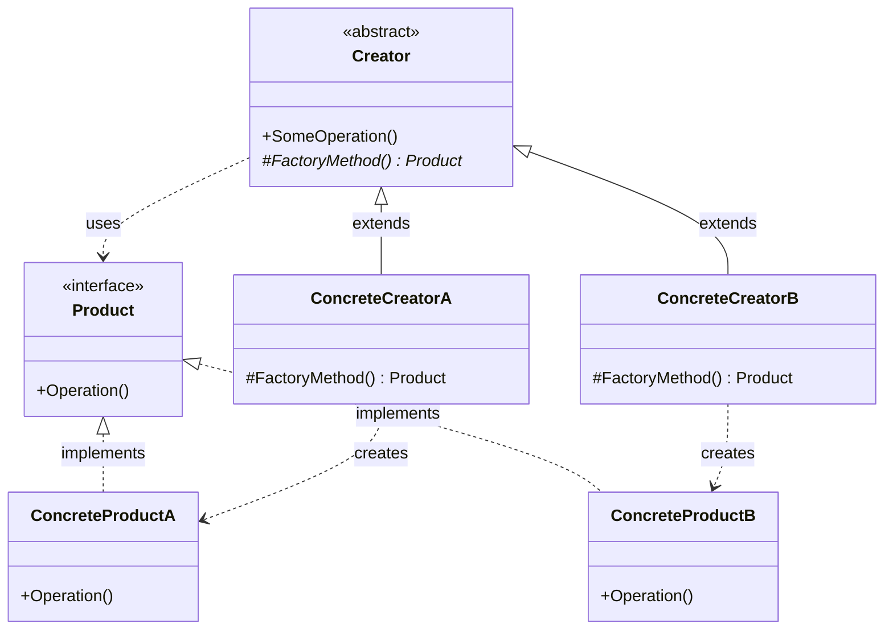
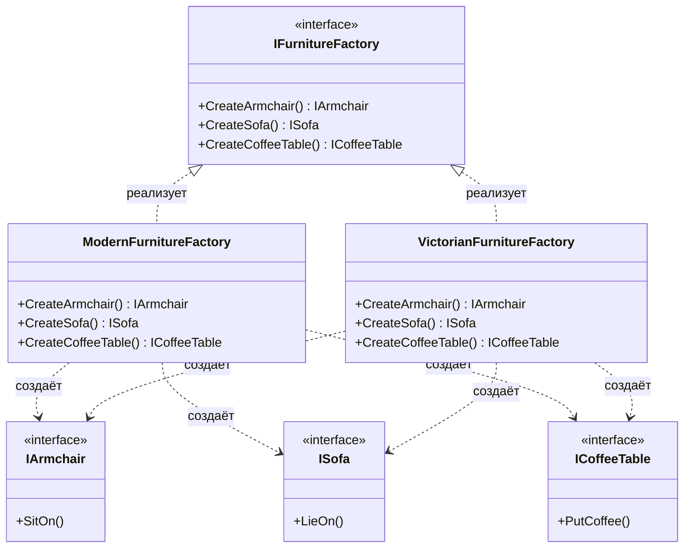
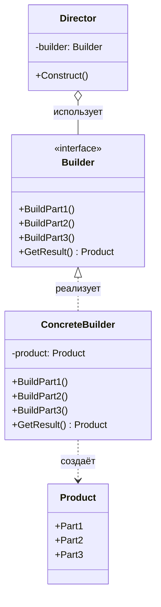
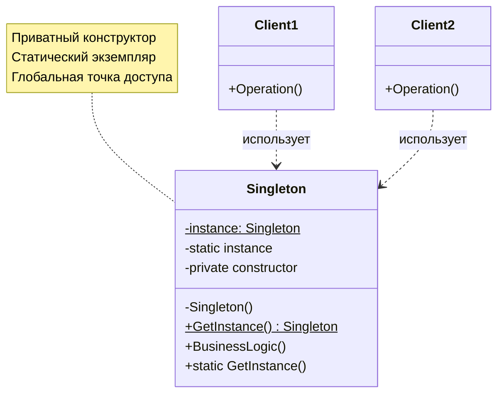

# Порождающие паттерны (Creational Patterns)


---

## Содержание

1. [Введение](#введение)
2. [Фабричный метод (Factory Method)](#фабричный-метод-factory-method)
3. [Абстрактная фабрика (Abstract Factory)](#абстрактная-фабрика-abstract-factory)
4. [Строитель (Builder)](#строитель-builder)
5. [Прототип (Prototype)](#прототип-prototype)
6. [Одиночка (Singleton)](#одиночка-singleton)

---


---

## Введение

В процессе разработки программного обеспечения создание объектов часто становится непростой задачей. Некоторые объекты требуют сложной инициализации, множества параметров или выбора между различными вариантами реализации. Прямое использование конструкторов в таких случаях может привести к жёсткой связанности кода, затруднить тестирование и усложнить расширение системы.

**Порождающие паттерны** (Creational Patterns) — это группа паттернов проектирования, которые решают проблемы создания объектов. Они отвечают за удобное и безопасное создание новых объектов или целых семейств объектов, при этом скрывая логику создания от клиентского кода и обеспечивая гибкость архитектуры.

### Зачем нужны порождающие паттерны?

Порождающие паттерны решают следующие проблемы:

- **Снижение связанности** — код не зависит от конкретных классов, а работает с абстракциями
- **Упрощение создания сложных объектов** — инкапсуляция логики конструирования
- **Обеспечение гибкости** — возможность легко заменять и расширять типы создаваемых объектов
- **Соблюдение принципов SOLID** — особенно принципов открытости/закрытости и единственной ответственности

В этой лекции мы рассмотрим пять классических порождающих паттернов и научимся применять их в современной разработке на C#.

---


---

## Фабричный метод (Factory Method)

### Определение и суть паттерна

**Фабричный метод** (Factory Method) — это порождающий паттерн проектирования, который определяет общий интерфейс для создания объектов в базовом классе, позволяя подклассам изменять тип создаваемых объектов через наследование и полиморфизм.

**Ключевая идея**: вместо прямого создания объектов через оператор `new`, мы делегируем это действие специальному методу (фабричному), который может быть переопределён в подклассах.

Представьте, что вы создаёте программу управления грузовыми перевозками. Сперва вы рассчитываете перевозить товары только на автомобилях. Поэтому весь ваш код работает с объектами класса `Грузовик`.

В какой-то момент ваша программа становится настолько известной, что морские перевозчики выстраиваются в очередь и просят добавить поддержку морской логистики в программу. Отличные новости, правда? Но как насчёт кода? Большая часть существующего кода жёстко привязана к классам `Грузовиков`


Чтобы добавить в программу классы морских `Судов`, понадобится перелопатить всю программу. Более того, если вы потом решите добавить в программу ещё один вид транспорта, то всю эту работу придётся повторить.

В итоге вы получите ужасающий код, наполненный условными операторами, которые выполняют то или иное действие, в зависимости от класса транспорта.

Решить эту проблему можно при помощи фабричного метода:

Паттерн Фабричный метод предлагает создавать объекты не напрямую, используя оператор new, а косвенно через вызов особого фабричного метода.


На первый взгляд, это может показаться бессмысленным: мы просто переместили вызов конструктора из одного конца программы в другой.

Чтобы эта система заработала, все возвращаемые объекты должны иметь общий интерфейс. Подклассы смогут производить объекты различных классов, следующих одному и тому же интерфейсу.


Теперь вы сможете переопределить фабричный метод в подклассе, чтобы изменить тип создаваемого продукта.

Например, классы `Truck` и `Ship` реализуют интерфейс `Transport` с методом доставить. Каждый из этих классов реализует метод по-своему: грузовики везут грузы по земле, а суда — по морю. Фабричный метод в классе `RoadLogistics` вернёт объект-грузовик, а класс `SeaLogistics` — объект-судно


Для клиента фабричного метода нет разницы между этими объектами, так как он будет трактовать их как некий абстрактный `Transport`. Для него будет важно, чтобы объект имел метод `Deliver`, а как конкретно он работает — не важно.


1. Product определяет общий интерфейс объектов, которые может произвести создатель и его подклассы.
2. `Concrete Products` содержат код различных продуктов. Продукты будут отличаться реализацией, но интерфейс у них будет общий.
3. `Creator` объявляет фабричный метод, который должен возвращать новые объекты продуктов. Важно, чтобы тип результата совпадал с общим интерфейсом `Product`.
Зачастую фабричный метод объявляют абстрактным, чтобы заставить все подклассы реализовать его по-своему. Но он может возвращать и некий стандартный продукт.
Несмотря на название, важно понимать, что создание продуктов не является единственной функцией создателя. Обычно он содержит и другой полезный код работы с продуктом. Аналогия: большая софтверная компания может иметь центр подготовки программистов, но основная задача компании — создавать программные продукты, а не готовить программистов.
4. `Concrete Creators` по-своему реализуют фабричный метод, производя те или иные конкретные продукты.
Фабричный метод не обязан всё время создавать новые объекты. Его можно переписать так, чтобы возвращать существующие объекты из какого-то хранилища или кэша.

Напишем всевдокод для какой-нибудь абстрактного примера:


В этом примере Фабричный метод помогает создавать кросс-платформенные элементы интерфейса, не привязывая основной код программы к конкретным классам элементов.

Фабричный метод объявлен в классе диалогов. Его подклассы относятся к различным операционным системам. Благодаря фабричному методу, вам не нужно переписывать логику диалогов под каждую систему. Подклассы могут наследовать почти весь код из базового диалога, изменяя типы кнопок и других элементов, из которых базовый код строит окна графического пользовательского интерфейса.

Базовый класс диалогов работает с кнопками через их общий программный интерфейс. Поэтому, какую вариацию кнопок ни вернул бы фабричный метод, диалог останется рабочим. Базовый класс не зависит от конкретных классов кнопок, оставляя подклассам решение о том, какой тип кнопок создавать.

Такой подход можно применить и для создания других элементов интерфейса (но чем больше таких элементов, тем ближе это будет уже к другому паттерну под названием "абстрактной фабрика")


**Пример 1: Кросс-платформенные UI элементы**

Рассмотрим создание диалоговых окон для разных платформ (Windows и Web). 
Каждая платформа имеет свои типы кнопок, но логика работы с диалогом одинакова.

```csharp
// === PRODUCTS (Продукты) ===
// Определяем общий интерфейс для всех типов кнопок
// Это позволит работать с любыми кнопками единообразно

// Интерфейс продукта
public interface IButton
{
    void Render();
    void OnClick(Action handler);
}

// Конкретный продукт: кнопка Windows
public class WindowsButton : IButton
{
    public void Render()
    {
        Console.WriteLine("Отрисовать кнопку в стиле Windows.");
    }

    public void OnClick(Action handler)
    {
        Console.WriteLine("Навешан обработчик событий Windows.");
        handler?.Invoke();
    }
}

// Конкретный продукт: кнопка HTML
public class HtmlButton : IButton
{
    public void Render()
    {
        Console.WriteLine("Вернуть HTML-код кнопки.");
    }

    public void OnClick(Action handler)
    {
        Console.WriteLine("Навешан обработчик событий браузера.");
        handler?.Invoke();
    }
}

// Абстрактная фабрика
public abstract class Dialog
{
    public void Render()
    {
        // Вызываем фабричный метод - он вернёт нужный тип кнопки для создания кнопки
        IButton okButton = CreateButton();
        okButton.OnClick(CloseDialog);
        okButton.Render();
    }

    // Фабричный метод - делегирует создание подклассам
    protected abstract IButton CreateButton();

    protected void CloseDialog()
    {
        Console.WriteLine("Закрытие диалога...");
    }
}

// Конкретная фабрика - создаёт продукты одного семейства для Windows
public class WindowsDialog : Dialog
{
    protected override IButton CreateButton()
    {
        return new WindowsButton();
    }
}

// Конкретная фабрика - создаёт продукты одного семейства для Web
public class WebDialog : Dialog
{
    protected override IButton CreateButton()
    {
        return new HtmlButton();
    }
}

// Пример конфигурации
public class AppConfig
{
    public string OS { get; set; }
}

// Приложение
public class Application
{
    private Dialog _dialog;

    public void Initialize()
    {
        // Здесь можно читать настройки из файла или окружения
        var config = new AppConfig { OS = "Windows" }; // пример

        if (config.OS == "Windows")
            _dialog = new WindowsDialog();
        else if (config.OS == "Web")
            _dialog = new WebDialog();
        else
            throw new Exception("Error! Unknown operating system.");
    }

    public void Main()
    {
        Initialize();
        _dialog.Render();
    }
}

// Точка входа
public static class Program
{
    public static void Main()
    {
        var app = new Application();
        app.Main();
    }
}

```

### Когда применять фабричный метод

**Применимость:** 

- **Когда заранее неизвестны типы и зависимости объектов, с которыми должен работать ваш код**
Фабричный метод отделяет код производства продуктов от остального кода, который эти продукты использует.
Благодаря этому, код производства можно расширять, не трогая основной. Так, чтобы добавить поддержку нового продукта, вам нужно создать новый подкласс и определить в нём фабричный метод, возвращая оттуда экземпляр нового продукта.
- **Когда вы хотите дать возможность пользователям расширять части вашего фреймворка или библиотеки**.
Пользователи могут расширять классы вашего фреймворка через наследование. Но как сделать так, чтобы фреймворк создавал объекты из этих новых классов, а не из стандартных?
Решением будет дать пользователям возможность расширять не только желаемые компоненты, но и классы, которые создают эти компоненты. А для этого создающие классы должны иметь конкретные создающие методы, которые можно определить.
Например, вы используете готовый UI-фреймворк для своего приложения. Но вот беда — требуется иметь круглые кнопки, вместо стандартных прямоугольных. Вы создаёте класс `RoundButton`. Но как сказать главному классу фреймворка `UIFramework`, чтобы он теперь создавал круглые кнопки, вместо стандартных?
Для этого вы создаёте подкласс `UIWithRoundButtons` из базового класса фреймворка, переопределяете в нём метод создания кнопки (а-ля createButton) и вписываете туда создание своего класса кнопок. Затем используете `UIWithRoundButtons` вместо стандартного `UIFramework`.
- **Когда вы хотите экономить системные ресурсы, повторно используя уже созданные объекты, вместо порождения новых**.
Такая проблема обычно возникает при работе с тяжёлыми ресурсоёмкими объектами, такими, как подключение к базе данных, файловой системе и т. д.
Представьте, сколько действий вам нужно совершить, чтобы повторно использовать существующие объекты:
Сначала вам следует создать общее хранилище, чтобы хранить в нём все создаваемые объекты. При запросе нового объекта нужно будет заглянуть в хранилище и проверить, есть ли там неиспользуемый объект, а затем вернуть его клиентскому коду, но если свободных объектов нет — создать новый, не забыв добавить его в хранилище.
Весь этот код нужно куда-то поместить, чтобы не засорять клиентский код.
Самым удобным местом был бы конструктор объекта, ведь все эти проверки нужны только при создании объектов. Но, увы, конструктор всегда создаёт новые объекты, он не может вернуть существующий экземпляр.
Значит, нужен другой метод, который бы отдавал как существующие, так и новые объекты. Им и станет фабричный метод.

### Шаги реализации

**Пошаговый алгоритм:**
1. Приведите все создаваемые продукты к общему интерфейсу.
2. В классе, который производит продукты, создайте пустой фабричный метод. В качестве возвращаемого типа укажите общий интерфейс продукта.
3. Затем пройдитесь по коду класса и найдите все участки, создающие продукты. Поочерёдно замените эти участки вызовами фабричного метода, перенося в него код создания различных продуктов.
В фабричный метод, возможно, придётся добавить несколько параметров, контролирующих, какой из продуктов нужно создать.
На этом этапе фабричный метод, скорее всего, будет выглядеть удручающе. В нём будет жить большой условный оператор, выбирающий класс создаваемого продукта. Но не волнуйтесь, мы вот-вот исправим это.
4. Для каждого типа продуктов заведите подкласс и переопределите в нём фабричный метод. Переместите туда код создания соответствующего продукта из суперкласса.
5. Если создаваемых продуктов слишком много для существующих подклассов создателя, вы можете подумать о введении параметров в фабричный метод, которые позволят возвращать различные продукты в пределах одного подкласса.
Например, у вас есть класс `Mail` с подклассами `AviaMail` и `GroundMail`, а также классы продуктов `Plane`, `Bus` и `Train`. `AviaMail` соответствует `Plane`, но для `GroundMail` есть сразу два продукта. Вы могли бы создать новый подкласс почты для поездов, но проблему можно решить и по-другому. Клиентский код может передавать в фабричный метод `GroundMail` аргумент, контролирующий тип создаваемого продукта.
6. Если после всех перемещений фабричный метод стал пустым, можете сделать его абстрактным. Если в нём что-то осталось — не беда, это будет его реализацией по умолчанию.

### Структура паттерна

Паттерн Фабричный метод состоит из следующих компонентов:

- **Product** (Продукт) — общий интерфейс для всех создаваемых объектов
- **Concrete Product** (Конкретный продукт) — конкретные реализации интерфейса продукта  
- **Creator** (Создатель) — базовый класс, содержащий бизнес-логику и объявляющий фабричный метод
- **Concrete Creator** (Конкретный создатель) — подклассы, реализующие фабричный метод для создания конкретных продуктов



Давайте рассмотрим ещё один пример: представьте, что мы пишем систему обработки заказов

```csharp
// Определяем неизменяемую запись (record)
public record OrderItem(decimal Price, int Amount)
{
    public decimal Cost => Price * Amount;
}

public record Order(IEnumerable<OrderItem> Items)
{
    public decimal TotalCost => Items.Sum(x => x.Cost);
}

public record CashPayment(decimal Amount);

public class PaymentCalculator
{
    public CashPayment Calculate(Order order)
    {
        var totalCost = order.TotalCost;

        // Apply discounts and coupons
        ...

        return new CashPayment(totalCost);
    }
}

```

Здесь у нас есть класс `PaymentCalculator`. Его задача — получить заказ `Order`, посчитать итоговую стоимость `totalCost`, применить какие-то скидки (бизнес-логика) и вернуть платёж: `return new CashPayment(totalCost);.`

В чём здесь проблема? Наш `PaymentCalculator` привязан к конкретному типу оплаты — `CashPayment`. По факту мы применяем какие-то абстрактные купоны и скидки, а потом всё равно возвращаем оплату наличными `CashPayment` 

А что, если завтра бизнес скажет: "Мы хотим добавить оплату банковским переводом"? Или криптовалютой? Нам придётся:
- Либо лезть внутрь PaymentCalculator и дописывать if/switch (что нарушает принцип Открытости/Закрытости).
- Либо копировать всю логику Calculate в новый класс, скажем, BankPaymentCalculator, и менять там только одну строку — return new BankPayment(...). Это приведёт к дублированию кода.

Проблема в том, что логика расчёта (что мы делаем) и логика создания (какой объект мы в итоге получаем) смешаны в одном месте. Фабричный метод нужен, чтобы эту связь разорвать.

Паттерн вводит два ключевых понятия: product и creator
- `Product` — это абстрактный тип объектов, которые мы хотим создавать. В нашем примере это будет не `CashPayment`, а некий общий `IPayment`. Наследники этого типа (`CashPayment`, `BankPayment`, `CryptoPayment`) — это продукты под каждую нужную нам ситуацию (где-то будет информация об аккаунте плательщика, где-то будет номер крипто-кошелька и тд. А в наличке нам вообще ничего знать не нужно - да и невозможно).
- `Creator` — это абстрактный тип, в котором содержится основная логика, в рамках которой требуется создание `Product`. Например, `PaymentCalculator`. Он будет содержать метод `Calculate`.

Ключевая идея в том, что `Creator` не знает, какой экземпляр `Product` он создаёт. Он просто говорит: "Мне нужен продукт".
А вот наследники creator'а (конкретные создатели) — они-то и будут реализовывать логику создания конкретных продуктов.
То есть `Creator` делегирует создание product'а своим наследникам. Метод, который он делегирует, и называется Фабричный метод

Давайте посмотрим, как наш код преображается с применением этого паттерна:

```csharp
// Определяем интерфейс
public interface IPayment
{
    decimal Amount { get; }
}

public record CashPayment(
    decimal Amount) : IPayment;

public record BankPayment(
    decimal Amount,
    string ReceiverAccountId) : IPayment;

```

Мы ввели интерфейс `IPayment`. Это наш абстрактный product. Теперь `CashPayment` и новый `BankPayment` реализуют этот интерфейс. Это даёт нам полиморфизм: мы можем работать с любым типом оплаты через общий интерфейс `IPayment`.

Теперь введём создателя:

```csharp
// Абстрактный базовый класс
public abstract class PaymentCalculator
{
    public IPayment Calculate(Order order)
    {
        var totalCost = order.TotalCost;

        // Apply discounts and coupons
        ...

        return CreatePayment(totalCost);
    }

    protected abstract IPayment CreatePayment(decimal amount);
}

```

Теперь у нас осталась вся логика вычисления скидок и применения купонов (бизнес-логика), однако Calculate теперь возвращает общий интерфейс `IPayment`.
Самая главное, что у нас появился абстрактный метод `CreatePayment`, который классы-наследники вынуждены переопределить.
Сам `PaymentCalculator` не знает, как его реализовать. Он заставляет своих наследников предоставить эту реализацию. Он protected — потому что это "внутренняя кухня" класса. `Calculate` использует его, но снаружи никому не нужно знать о том, как создаётся платёж.

Теперь посмотрим на то, как реализовать наших создателей под конкретные типы:

```csharp
// Конкретная реализация
public class CashPaymentCalculator : PaymentCalculator
{
    protected override IPayment CreatePayment(decimal amount) 
        => new CashPayment(amount);
}

public class BankPaymentCalculator : PaymentCalculator
{
    private readonly string _currentReceiverAccountId;

    public BankPaymentCalculator(string currentReceiverAccountId)
    {
        _currentReceiverAccountId = currentReceiverAccountId;
    }

    protected override IPayment CreatePayment(decimal amount)
    {
        return new BankPayment(amount, _currentReceiverAccountId);
    }
}

```

Обратите внимание на `BankPaymentCalculator`. Ему для создания `BankPayment` нужен `_currentReceiverAccountId`. И это не проблема! Конкретный создатель может иметь собственное состояние и конструкторы, которые нужны именно ему для создания его конкретного продукта. Абстрактный `PaymentCalculator` об этом даже не знает.

Итак, как это применять? Соберём всё вместе:

1. Клиентский код теперь сам решает, какой тип калькулятора ему нужен.

```csharp
PaymentCalculator calculator = new CashPaymentCalculator();

// Или: PaymentCalculator calculator = new BankPaymentCalculator("123456");

```

2. Клиент вызывает один и тот же метод: IPayment payment = calculator.Calculate(myOrder);.
3. Выполняется общая логика из PaymentCalculator.Calculate.
4. Когда Calculate доходит до строки return CreatePayment(totalCost);, благодаря полиморфизму вызывается override-версия метода того класса, который мы создали в пункте 1.
5. Если calculator — это CashPaymentCalculator, вызовется его CreatePayment и вернётся CashPayment. Если calculator — это BankPaymentCalculator, вызовется его CreatePayment и вернётся BankPayment.
6. Creator (PaymentCalculator) отвечает за "когда" создавать объект (в конце расчёта). Конкретные creator'ы (CashPaymentCalculator, BankPaymentCalculator) отвечают за "что" создавать. Логика создания инкапсулирована внутри конкретных создателей.

Схема использования:


Самое главное, что мы получили — гибкость и расширяемость.

Завтра нам понадобится CryptoPayment. Что мы делаем?

1. Создаём record CryptoPayment(...) : IPayment (новый product).
2. Создаём class CryptoPaymentCalculator : PaymentCalculator.
3. Реализуем в нём protected override IPayment CreatePayment(...) => new CryptoPayment(...).

Мы не тронули ни одной строки существующего кода (PaymentCalculator, CashPaymentCalculator и т.д.). Мы только добавили новый. Система расширяется, оставаясь "закрытой" для модификаций. Это принцип Открытости/Закрытости (Open/Closed Principle) в чистом виде.

Однако у этого паттерна есть и недостатки:

**1.) Фабричный метод может привести к созданию больших параллельных иерархий классов, так как для каждого класса продукта надо создать свой подкласс создателя.**

**2.) сильная связанность конкретных создателей с базовым типом: переиспользуется логика базового типа, но не логика конкретных создателей**

Пример: CashPaymentCalculator связан с PaymentCalculator через наследование. Он обязан быть его наследником.

Представьте, что у нас появляется другая иерархия калькуляторов, например, FixedPricePaymentCalculator, у которого другая логика Calculate (например, он всегда возвращает 100). То есть он не применяет скидки и купоны и не делает никакой другой бизнес-логики, в отличии от обычного PaymentCalculator.
Если мы захотим, чтобы он тоже создавал CashPayment, нам придётся создать FixedCashPaymentCalculator : FixedPricePaymentCalculator и заново написать в нём override CreatePayment ... => new CashPayment().

Мы не можем переиспользовать логику создания из CashPaymentCalculator, потому что она используется в другой иерархии. Логика базового типа (Calculate) переиспользуется наследниками, а вот логика конкретных создателей (CreatePayment) — нет.

**3.) неявное нарушение SRP: объект конкретного создателя ответственен как за реализацию логики,
так и за создание продуктов**

creator (например, BankPaymentCalculator) становится ответственен и за реализацию логики (он наследует Calculate), и за создание продуктов (он реализует CreatePayment).

Это две разные "причины для изменения".
1. Если изменится общая логика расчёта (в базовом PaymentCalculator), это коснётся всех наследников.
2. Если изменится способ создания BankPayment (например, ему понадобится новый параметр), нам придётся менять BankPaymentCalculator.

Класс BankPaymentCalculator и "калькулятор", и "фабрика" одновременно. Это может усложнить поддержку, если и логика, и создание становятся слишком сложными.


Вывод:
Фабричный метод — это классический паттерн, который решает проблему связи с оператором new путём делегирования создания наследникам через абстрактный метод. Он идеально подходит, когда у вас есть общая логика, но в конце этой логики нужно создавать разные объекты, тип которых определяется подклассом.

### (Абстрактная) фабрика

> вариативность создания объектов при помощи композиции и полиморфизма

Вообще фабричный метод применяется достаточно редко. Куда чаще применеятся абстрактная фабрика, или же просто - фабрика. Давайте разбираться что это.

Какая проблема есть у фабричного метода?
Вспомним код: 

```csharp
// Абстрактный базовый класс
public abstract class Dialog
{
    public void Render()
    {
        // Вызываем фабричный метод - он вернёт нужный тип кнопки для создания кнопки
        IButton okButton = CreateButton();

        okButton.Render();
    }

    // Фабричный метод - делегирует создание подклассам
    protected abstract IButton CreateButton();
}

```

А что если помимо кнопки мы захоти добавить ещё, например, текстовое поле ITextBox?

```csharp
// Абстрактный базовый класс
public abstract class Dialog
{
    public void Render()
    {
        // Нам нужно ДВА продукта, и они должны быть из ОДНОЙ СЕМЬИ
        // (оба должны быть 'Windows' или оба 'Html')
        IButton okButton = CreateButton();
        ITextBox nameBox = CreateTextBox(); // <-- Вторая точка создания
        
        okButton.Render();
        nameBox.Render();
    }

    // Наш Creator "распухает" от фабричных методов
    protected abstract IButton CreateButton();
    protected abstract ITextBox CreateTextBox(); // <-- Добавили второй метод
}

```

А если захотим добавить третий?

```csharp
// Абстрактный базовый класс
public abstract class Dialog
{
    public void Render()
    {
        IButton okButton = CreateButton();
        ITextBox nameBox = CreateTextBox(); 
        IScrollBar vScroll = CreateScrollBar(); // третий...
        
        okButton.Render();
        nameBox.Render();
    }

    // Уже целых три абстрактных метода
    protected abstract IButton CreateButton();
    protected abstract ITextBox CreateTextBox(); 
    protected abstract IScrollBar CreateScrollBar(); 
}

```

И так далее.

После таких изменений в каждом Creator'е нам нужно будет добавить реализацию этих методов. То есть пробежаться во всем таким классам и вручную из изменить. Очевидно, что если таких классов будет достаточно много, то сделать это будет крайне тяжело.

То есть фабричный метод не работает, когда нам нужно создать не один объект, а семейство каких-то связанных между собой объектов.

Решить эту проблему можно через композицию. Создадим фабрику, которая будет выполнять все эти методы.

```csharp
// Абстрактная фабрика - интерфейс для создания семейства продуктов
// Она описывает СЕМЕЙСТВО продуктов
public interface IUIFactory
{
    IButton CreateButton();
    ITextBox CreateTextBox();
    IScrollBar CreateScrollBar();
}

// Фабрика 1
public class WindowsFactory : IUIFactory
{
    public IButton CreateButton() => new WindowsButton();
    public ITextBox CreateTextBox() => new WindowsTextBox();
    public IScrollBar CreateScrollBar() => new WindowsScrollBar();
}

// Фабрика 2
public class WebFactory : IUIFactory
{
    public IButton CreateButton() => new HtmlButton();
    public ITextBox CreateTextBox() => new HtmlTextBox();
    public IScrollBar CreateScrollBar() => new HtmlScrollBar();
}

// Теперь уже не абстрактный
public class Dialog
{
    // 1. (Композиция)
    private readonly IUIFactory _factory;

    public Dialog(IUIFactory factory)
    {
        _factory = factory;
    }

    // 3. Логика Render() не изменилась
    public void Render()
    {
        // но теперь она ДЕЛЕГИРУЕТ создание фабрике
        IButton okButton = _factory.CreateButton();
        ITextBox nameBox = _factory.CreateTextBox();
        IScrollBar scrollBar = _factory.CreateScrollBar();
        
        okButton.Render();
        nameBox.Render();
        scrollBar.Render();
    }
}

```

Рассмотрим ещё несколько примеров:
Создаём продукты:

```csharp
// Это общий интерфейс продуктов
public interface IPayment
{
    decimal Amount { get; }
}

// Это продукт 1
public record BankPayment(
    decimal Amount,
    string ReceiverAccountId) : IPayment;

// Это продукт 2
public record CashPayment(
    decimal Amount) : IPayment;

```

Теперь мы определяем контракт для создателя:

```csharp
// Определяем интерфейс
public interface IPaymentFactory
{
    IPayment Create(decimal amount);
}

```

Теперь мы пишем классы, которые реализуют этот интерфейс. Каждая фабрика будет "заточена" под создание своего конкретного продукта.

```csharp
// "Конкретная фабрика 1"
public class BankPaymentFactory : IPaymentFactory
{
    private readonly string _currentReceiverAccountId;

    // Фабрика может иметь свое состояние!
    public BankPaymentFactory(string currentReceiverAccountId)
    {
        _currentReceiverAccountId = currentReceiverAccountId;
    }

    public IPayment Create(decimal amount)
    {
        // Эта фабрика знает, как создать BankPayment.
        // Она инкапсулирует эту логику.
        return new BankPayment(amount, _currentReceiverAccountId);
    }
}

// "Конкретная фабрика 2"
public class CashPaymentFactory : IPaymentFactory
{
    public IPayment Create(decimal amount)
    {
        // Эта фабрика знает, как создать CashPayment.
        return new CashPayment(amount);
    }
}

```

Теперь посмотрим на то, как это можно применить:

```csharp
// интерфейс для калькулятора
public interface IPaymentCalculator
{
    IPayment Calculate(Order order);
}

public class PaymentCalculator : IPaymentCalculator
{
    private readonly IPaymentFactory _paymentFactory;

    public PaymentCalculator(IPaymentFactory paymentFactory)
    {
        _paymentFactory = paymentFactory;
    }

    public IPayment Calculate(Order order)
    {
        var totalCost = order.TotalCost;
        
        // Apply discounts and coupons 

        // ...

        return _paymentFactory.Create(totalCost);
    }
}

// Другой калькулятор
public class FixedPaymentCalculator : IPaymentCalculator
{
    private readonly decimal _fixedPrice;
    private readonly IPaymentFactory _paymentFactory;

    public FixedPaymentCalculator(decimal fixedPrice, IPaymentFactory paymentFactory)
    {
        _fixedPrice = fixedPrice;
        _paymentFactory = paymentFactory;
    }
    public IPayment Calculate(Order order)
    {
        var totalCost = order.Items.Sum(item =>_fixedPrice * item.Amount);

        // Apply discounts and coupons

        // ...

        return _paymentFactory.Create(totalCost);
    }
}

```

Мы можем легко добавить новую фабрику:

```csharp
// Определяем неизменяемую запись (record)
public record CryptoPayment(decimal Amount, string Wallet) : IPayment;

public class CryptoPaymentFactory : IPaymentFactory
{
    private readonly string _companyWallet;
    public CryptoPaymentFactory(string companyWallet) { _companyWallet = companyWallet; }

    public IPayment Create(decimal amount)
    {
        return new CryptoPayment(amount, _companyWallet);
    }
}

```

Пример использования в коде:

```csharp
public static class Program
{
    public static void Main(string[] args)
    {
        Console.WriteLine("--- Сценарий 1: Банк ---");

        // 1. Создаем конкретную фабрику
        IPaymentFactory bankFactory = new BankPaymentFactory("UA1234567890");

        // 2. Внедряем фабрику в калькулятор
        IPaymentCalculator bankCalculator = new PaymentCalculator(bankFactory);

        // 3. Используем калькулятор
        Order order1 = new Order { TotalCost = 250.50m };
        IPayment payment1 = bankCalculator.Calculate(order1);
        
        // 4. Проверяем результат
        Console.WriteLine($"Создан платеж типа: {payment1.GetType().Name}"); // Выведет: BankPayment
        Console.WriteLine($"Сумма: {payment1.Amount}");

        
        // === СЦЕНАРИЙ 2: Конфигурация для наличных ===
        Console.WriteLine("\n--- Сценарий 2: Наличные ---");

        // 1. Создаем ДРУГУЮ фабрику
        IPaymentFactory cashFactory = new CashPaymentFactory();

        // 2. Внедряем эту фабрику в тот же тип калькулятора
        IPaymentCalculator cashCalculator = new PaymentCalculator(cashFactory);

        // 3. Используем
        Order order2 = new Order { TotalCost = 99.00m };
        IPayment payment2 = cashCalculator.Calculate(order2);

        // 4. Проверяем
        // На этот раз код калькулятора создал CashPayment!
        Console.WriteLine($"Создан платеж типа: {payment2.GetType().Name}"); // Выведет: CashPayment
        Console.WriteLine($"Сумма: {payment2.Amount}");
    }
}

```

В общем основная идея, что фабрика применяется в тех случаях, когда мы желаем создавать целые семейства объектов, а не что-то одно. Есть редкие исключения, когда вполне уместно применить фабричный метод, но в основном применяют именно фабрику.

Рассмотрим ещё один пример:

Представьте, что вы пишете симулятор мебельного магазина. Ваш код содержит:

- Семейство зависимых продуктов, cкажем, Armchair + Sofa + Coffee table.
- Несколько вариаций этого семейства. Например, продукты Armchair, Sofa, Coffee table представлены в трёх разных стилях: [Ар-деко, Ар-нуво (модерн)](https://artdoart.com/news/ar-nuvo-i-ar-deko-v-cem-raznica) и Викторианском.


Вам нужен такой способ создавать объекты продуктов, чтобы они сочетались с другими продуктами того же семейства. Это важно, так как клиенты расстраиваются, если получают несочетающуюся мебель.


Кроме того, вы не хотите вносить изменения в существующий код при добавлении новых продуктов или семейcтв в программу. Поставщики часто обновляют свои каталоги, и вы бы не хотели менять уже написанный код каждый раз при получении новых моделей мебели

Паттерн Абстрактная фабрика предлагает выделить общие интерфейсы для отдельных продуктов, составляющих семейства. Так, все вариации кресел получат общий интерфейс Armchair, все диваны реализуют интерфейс Sofa и так далее. В примерах выше это были Button, ScrollBar и так далее


Далее вы создаёте абстрактную фабрику — общий интерфейс, который содержит методы создания всех продуктов семейства (например, createArmchair, createSofa и createCoffeeTable). Эти операции должны возвращать абстрактные типы продуктов, представленные интерфейсами, которые мы выделили ранее — Armchair, Sofa и Coffee table.

Для каждой вариации семейства продуктов мы должны создать свою собственную фабрику, реализовав абстрактный интерфейс. Фабрики создают продукты одной вариации. Например, ModernFactory будет возвращать только ModernArmchair ,ModernSofa и ModernCoffeeTable.


(В примерах выше это была фабрика всяких UI элементов, вроде кнопок)

Клиентский код должен работать как с фабриками, так и с продуктами только через их общие интерфейсы. Это позволит подавать в ваши классы любой тип фабрики и производить любые продукты, ничего не ломая.


Например, клиентский код просит фабрику сделать стул. Он не знает, какого типа была эта фабрика. Он не знает, получит викторианский или модерновый стул. Для него важно, чтобы на стуле можно было сидеть и чтобы этот стул отлично смотрелся с диваном той же фабрики.




**Схема взаимодействия:**

1. Абстрактные продукты объявляют интерфейсы продуктов, которые связаны друг с другом по смыслу, но выполняют разные функции.

2. Конкретные продукты — большой набор классов, которые относятся к различным абстрактным продуктам (кресло/столик), но имеют одни и те же вариации (Викторианский/Модерн).

3. Абстрактная фабрика объявляет методы создания различных абстрактных продуктов (кресло/столик).

4. Конкретные фабрики относятся каждая к своей вариации продуктов (Викторианский/Модерн) и реализуют методы абстрактной фабрики, позволяя создавать все продукты определённой вариации.

5. Несмотря на то, что конкретные фабрики порождают конкретные продукты, сигнатуры их методов должны возвращать соответствующие абстрактные продукты. Это позволит клиентскому коду, использующему фабрику, не привязываться к конкретным классам продуктов. Клиент сможет работать с любыми вариациями продуктов через абстрактные интерфейсы.

Приведём пример кода:

```csharp
// -----------------------------
// 1. Абстрактные продукты
// -----------------------------

public interface IArmchair
{
    void SitOn();
}

public interface ISofa
{
    void LieOn();
}

public interface ICoffeeTable
{
    void PutCoffee();
}

// -----------------------------
// 2. Конкретные продукты
// Ар-деко
// -----------------------------

public class ArtDecoArmchair : IArmchair
{
    public void SitOn() => Console.WriteLine("Вы сидите на кресле Ар-деко.");
}

public class ArtDecoSofa : ISofa
{
    public void LieOn() => Console.WriteLine("Вы лежите на диване Ар-деко.");
}

public class ArtDecoCoffeeTable : ICoffeeTable
{
    public void PutCoffee() => Console.WriteLine("Вы ставите кофе на столик Ар-деко.");
}

// -----------------------------
// 2. Конкретные продукты
// Ар-нуво (модерн)
// -----------------------------

public class ModernArmchair : IArmchair
{
    public void SitOn() => Console.WriteLine("Вы сидите на кресле в стиле модерн.");
}

public class ModernSofa : ISofa
{
    public void LieOn() => Console.WriteLine("Вы лежите на диване в стиле модерн.");
}

public class ModernCoffeeTable : ICoffeeTable
{
    public void PutCoffee() => Console.WriteLine("Вы ставите кофе на столик в стиле модерн.");
}

// -----------------------------
// 2. Конкретные продукты
// Викторианский
// -----------------------------

public class VictorianArmchair : IArmchair
{
    public void SitOn() => Console.WriteLine("Вы сидите на викторианском кресле.");
}

public class VictorianSofa : ISofa
{
    public void LieOn() => Console.WriteLine("Вы лежите на викторианском диване.");
}

public class VictorianCoffeeTable : ICoffeeTable
{
    public void PutCoffee() => Console.WriteLine("Вы ставите кофе на викторианский столик.");
}

// -----------------------------
// 3. Абстрактная фабрика
// -----------------------------

public interface IFurnitureFactory
{
    IArmchair CreateArmchair();
    ISofa CreateSofa();
    ICoffeeTable CreateCoffeeTable();
}

// -----------------------------
// 4. Конкретные фабрики
// -----------------------------

public class ArtDecoFurnitureFactory : IFurnitureFactory
{
    public IArmchair CreateArmchair() => new ArtDecoArmchair();
    public ISofa CreateSofa() => new ArtDecoSofa();
    public ICoffeeTable CreateCoffeeTable() => new ArtDecoCoffeeTable();
}

public class ModernFurnitureFactory : IFurnitureFactory
{
    public IArmchair CreateArmchair() => new ModernArmchair();
    public ISofa CreateSofa() => new ModernSofa();
    public ICoffeeTable CreateCoffeeTable() => new ModernCoffeeTable();
}

public class VictorianFurnitureFactory : IFurnitureFactory
{
    public IArmchair CreateArmchair() => new VictorianArmchair();
    public ISofa CreateSofa() => new VictorianSofa();
    public ICoffeeTable CreateCoffeeTable() => new VictorianCoffeeTable();
}

// -----------------------------
// 5. Клиентский код
// -----------------------------

public class FurnitureShowroom
{
    private readonly IFurnitureFactory _factory;

    private IArmchair _armchair;
    private ISofa _sofa;
    private ICoffeeTable _table;

    public FurnitureShowroom(IFurnitureFactory factory)
    {
        _factory = factory;
    }

    public void CreateFurnitureSet()
    {
        _armchair = _factory.CreateArmchair();
        _sofa = _factory.CreateSofa();
        _table = _factory.CreateCoffeeTable();
    }

    public void Demo()
    {
        _armchair.SitOn();
        _sofa.LieOn();
        _table.PutCoffee();
    }
}

// -----------------------------
// 6. Конфигуратор приложения
// -----------------------------

public static class AppConfig
{
    public static void Main()
    {
        string style = "ArtDeco"; // читаем из конфига

        IFurnitureFactory factory = style switch
        {
            "ArtDeco" => new ArtDecoFurnitureFactory(),
            "Modern" => new ModernFurnitureFactory(),
            "Victorian" => new VictorianFurnitureFactory(),
            _ => throw new Exception("Неизвестный стиль мебели!")
        };

        var showroom = new FurnitureShowroom(factory);

        showroom.CreateFurnitureSet();
        showroom.Demo();
    }
}

```

### Когда применять абстрактную фабрику

**Применимость:**

1. **Когда бизнес-логика программы должна работать с разными видами связанных друг с другом продуктов, не завися от конкретных классов продуктов.**
Абстрактная фабрика скрывает от клиентского кода подробности того, как и какие конкретно объекты будут созданы. Но при этом клиентский код может работать со всеми типами создаваемых продуктов, поскольку их общий интерфейс был заранее определён.
2. **Когда в программе уже используется Фабричный метод, но очередные изменения предполагают введение новых типов продуктов.**
В хорошей программе каждый класс отвечает только за одну вещь. Если класс имеет слишком много фабричных методов, они способны затуманить его основную функцию. Поэтому имеет смысл вынести всю логику создания продуктов в отдельную иерархию классов, применив абстрактную фабрику.

### Шаги реализации

**Пошаговый алгоритм:**

1. Создайте таблицу соотношений типов продуктов к вариациям семейств продуктов.
2. Сведите все вариации продуктов к общим интерфейсам.
3. Определите интерфейс абстрактной фабрики. Он должен иметь фабричные методы для создания каждого из типов продуктов.
4. Создайте классы конкретных фабрик, реализовав интерфейс абстрактной фабрики. Этих классов должно быть столько же, сколько и вариаций семейств продуктов.
5. Измените код инициализации программы так, чтобы она создавала определённую фабрику и передавала её в клиентский код.
6. Замените в клиентском коде участки создания продуктов через конструктор вызовами соответствующих методов фабрики.


Преимущества:
- настоящее соблюдение SRP, ведь в такой реализации нет прямой связанности между реализациями
- соблюдение OCP: мы можем добавить в систему новые виды платежей и реализовать фабрики для них, тем самым, расширить логику не меняя реализацию калькуляторов

Недостатки:
- Усложняет код программы из-за введения множества дополнительных классов.
- Требует наличия всех типов продуктов в каждой вариации.

### Строитель (Builder)

> выделение отдельного типа, инкапсулирующего логику сбора данных и создания объекта

Параметр - набор тип+имя находящийся в сигнатуре метода 
Ex.: `public void A(int a, char b); // int a и char b — это параметры`

Аргумент - конкретное значение передающееся в метод
Ex.: `obj.A(1, '2'); // 1 и '2' - аргументы метода A()`

```csharp
void M(int x, string s)   // int x и string s — параметры
{
}
M(10, "hi");               // 10 и "hi" — аргументы

```

### Определение

**Строитель** (Builder) — это порождающий паттерн проектирования, который позволяет создавать сложные объекты пошагово. Строитель даёт возможность использовать один и тот же код строительства для получения разных представлений объектов.


Представьте объект (например, дом) у которого может быть очень много разных конфигураций. Два варианта: либо передавать каким-то образом всё через огромный конструктор:

Далеко не все аргументы всегда используются и приходится делать их null. Либо создаётся проблема "телескопических конструкторов", то есть матрёшки из конструкторов:

```csharp
// Конкретная реализация
public class House
{
    public string Address { get; }
    public int Floors { get; }
    public bool HasGarage { get; }
    public bool HasGarden { get; }
    public bool HasPool { get; }
    public bool HasFancyStatues { get; }

    // Базовый конструктор, куда сводятся все остальные
    public House(string address, int floors, bool hasGarage, bool hasGarden, bool hasPool, bool hasFancyStatues)
    {
        Address = address;
        Floors = floors;
        HasGarage = hasGarage;
        HasGarden = hasGarden;
        HasPool = hasPool;
        HasFancyStatues = hasFancyStatues;
    }

    // Только адрес → минимальный дом
    public House(string address)
        : this(address, 1, false, false, false, false) { }

    // Адрес + этажность
    public House(string address, int floors)
        : this(address, floors, false, false, false, false) { }

    // Дом с гаражом
    public static House WithGarage(string address, int floors = 1)
        => new House(address, floors, hasGarage: true, hasGarden: false, hasPool: false, hasFancyStatues: false);

    // Дом с садом
    public static House WithGarden(string address, int floors = 1)
        => new House(address, floors, false, hasGarden: true, false, false);

    // Дом с бассейном
    public static House WithPool(string address, int floors = 1)
        => new House(address, floors, false, false, hasPool: true, false);

    // Дом со статуями
    public static House WithFancyStatues(string address, int floors = 1)
        => new House(address, floors, false, false, false, hasFancyStatues: true);
 
    // И так далее...
} 

```

Либо же, что возможно ещё хуже, придется наследовать кучу разных подклассов для всех возможных комбинаций параметров


Паттерн Строитель предлагает разбить весь этот процесс на отдельные шаги.



**Пояснение к диаграмме:**
- `Product` — сложный объект, который мы строим
- `Builder` — интерфейс для пошагового создания продукта
- `ConcreteBuilder` — конкретная реализация строителя
- `Director` — управляет процессом построения (опционально) Пришём, чтобы создать объект, вам нужно лишь поочерёдно вызывать методы строителя. И теперь не нужно запускать все шаги, а только те, что нужны для производства объекта определённой конфигурации.


И в нашем коде получится что-то вроде:

```csharp

// Раньше: создавали дом в явном виде
var house = House(
    adress: "ulitsa- pushkina-dom-kalatush",
    floors: 2,
    HasGarage = false,
    HasGarden = true,
    HasPool = true,
    HasFancyStatues = true
    )

// Либо: создавали конкретный дом
var house = houseWithPoolAndGardenAndFancyStatues(
    adress: "ulitsa- pushkina-dom-kalatush",
    floors: 2
    )
// И если бы мы хотели добавить что-то новое,
// то пришлось бы либо 
// менять конструктор, либо вызывать новый дом

// Теперь можем собрать дом "по кусочкам":
var house = HouseBuilder()
    .WithAddress("ulitsa-pushkina-dom-kalatush")
    .WithFloors(2)
    .WithPool()
    .WithGarden()
    .WithStatues()
    .Build()

// Если бы мы захотели добавить что-то ещё
// , то достаточно было бы просто прописать ещё 
// один метод, например WithFountain() и WithPlayground()

```

То есть мы вынесли логику создания из чего-то цельного в "как бы лего конструктор", куда мы при желании можешь в любой момент присоединить что-то новое.

Рассмотрим пример того, как применить этот паттерн в реальности:

У вас есть класс Order, который описывает заказ в интернет-магазине. Изначально это было бы просто:

```csharp
// Определяем неизменяемую запись (record)
public record Order(IEnumerable<OrderItem> Items);

```

То есть просто список каких-то заказов:

```csharp
var order = new Order(
    [
        new OrderItem(Name: "banana", Price: 42, Amount: 20),
        new OrderItem(Name: "phone", Price: 30000, Amount: 1),
        new OrderItem(Name: "marker", Price: 201, Amount: 3),
        new OrderItem(Name: "steak", Price: 1337, Amount: 1)
    ]
);

```

Но со временем требования растут. Помимо просто списка заказов становятся нужными комментарий для магазина, комментарий для доставки, номер телефона получателя, время создания и ещё десяток полей:

```csharp
// Определяем неизменяемую запись (record)
public record Order(
    string CommentForShop,
    string CommentForDelivery,
    IEnumerable<OrderItem> Items,
    DateTimeOffset CreatedAt,
    string? ReceiverPhoneNumber,
    // и ещё много...
);

```

Теперь, когда мы захотим создать объект, конструктор потребует множество параметров:

```csharp
var order = new Order(
    CommentForShop: "Срочно!",
    CommentForDelivery: "Оставить у двери",
    Items: [
        new OrderItem(Name: "banana", Price: 42, Amount: 20),
        new OrderItem(Name: "phone", Price: 30000, Amount: 1),
        new OrderItem(Name: "marker", Price: 201, Amount: 3),
        new OrderItem(Name: "steak", Price: 1337, Amount: 1)
    ],
    CreatedAt: DateTimeOffset.UtcNow,
    ReceiverPhoneNumber: "+7-900-123-45-67"
);

```

Это становится неудобно. Кроме того, создание заказа часто требует логики: иногда товары надо добавлять в строго определённом порядке, например, сначала продукты, а только потом бытовую технику. Где проверять, что в заказе, например, не больше 20 товаров? Некоторые клиеты (например с вип-статусом) могут иметь больше привелегий. Как всё это организовать?     

Вот здесь появляется паттерн Builder. Как мы уже знаем его основная идея выделить отдельный тип, который инкапсулирует логику сбора данных и создания объекта. 

Builder — это вспомогательный класс, который:
- Накапливает состояние — хранит промежуточные значения параметров
- Предоставляет удобный API — методы вида WithXxx(), которые возвращают сам builder для цепочки вызовов (fluent interface)
- Выполняет финальное создание — метод Build() создаёт финальный объект

```csharp
// === BUILDER (Строитель) ===
// Класс, который инкапсулирует логику сбора данных
// и создания сложного объекта Order
// Использует Fluent Interface для удобства

// Строитель
public class OrderBuilder
{
    // 1. Он хранит *внутреннее, изменяемое состояние*
    private readonly List<OrderItem> _items = [];

    // 2. Он предоставляет "текучий" (fluent) интерфейс
    public OrderBuilder WithItem(OrderItem item)
    {
        _items.Add(item);
        return this; // <- Ключевой момент для "цепочки" вызовов
    }

    // 3. Он имеет финальный метод "Build"
    public Order Build()
    {
        // В этот момент он создает иммутабельный продукт
        return new Order(_items.ToArray());
    }
}

```

Теперь можем удобно использовать это билдер:

```csharp
var orderBuilder = new OrderBuilder() // Заказ
    .WithItem(Name: "banana", Price: 42, Amount: 20) // с бананами
    .WithItem(Name: "phone", Price: 30000, Amount: 1) // и телефоном
    .WithItem(Name: "marker", Price: 201, Amount: 3) // и тремя маркерами
    .WithItem(Name: "steak", Price: 1337, Amount: 1); // и одним стейком

// Мы можем *передавать строителя* в другие методы,
// чтобы они его "до-настроили".
AddDefaultItems(orderBuilder);
AddRequestedItems(orderBuilder); 
AddForecastedItems(orderBuilder);

Order order = orderBuilder.Build(); // соберём заказ

```

Видите красоту? Логика добавления товаров разнесена по разным методам, но всё аккуратно собирается в одном builder'е.

Давайте рассмотрим два вида билдеров:

#### 1. Convenience builder (Удобный Строитель)

> упрощенное создание объектов с большим конструктором

Это тип можно охарактеризовать так:
- модель никак не связана с билдером
- несёт в себе вспомогательный функционал
- используется для упрощения создания объектов

Вспоним ситуацию с огромным конструктором:

```csharp
// в заказе много полей
public record Order(
    string CommentForShop,
    string CommentForDelivery,
    IEnumerable<OrderItem> Items,
    DateTimeOffset CreatedAt,
    string? ReceiverPhoneNumber
);

// пропуск кода

// Это то, чего мы хотим избежать!
var order = new Order(
    CommentForShop: string.Empty, // по умолчанию
    CommentForDelivery: string.Empty, // по умолчанию
    Items: [new OrderItem(Price: 1337, Amount: 2)], // < - единственное нужное поле
    CreatedAt: DateTimeOffset.UtcNow, // по умолчанию
    ReceiverPhoneNumber: null // по умолчанию
);

```

Convinience builder решает эту проблему. Он сам, внутри себя, хранит эти значения по умолчанию.

```csharp
// Builder должен хранить значения всех полей со значениями по умолчанию
public class OrderBuilder
{
    private readonly List<OrderItem> _items = [];
    private string _commentForShop = string.Empty;
    private string _commentForDelivery = string.Empty;
    private DateTimeOffset _createdAt = DateTimeOffset.UtcNow;
    private string? _receiverPhoneNumber = null;

    public OrderBuilder WithItem(OrderItem item)
    {
        _items.Add(item);
        return this;
    }

    public OrderBuilder WithCommentForShop(string value)
    {
        _commentForShop = value;
        return this;
    }

    public OrderBuilder WithCommentForDelivery(string value)
    {
        _commentForDelivery = value;
        return this;
    }

    public OrderBuilder WithReceiverPhoneNumber(string? value)
    {
        _receiverPhoneNumber = value;
        return this;
    }

    public Order Build()
    {
        return new Order(
            CommentForShop: _commentForShop,
            CommentForDelivery: _commentForDelivery,
            Items: _items,
            CreatedAt: _createdAt,
            ReceiverPhoneNumber: _receiverPhoneNumber
        );
    }
}

```

Использование:

Теперь код клиента становится чистым. Клиент указывает только то, что отклоняется от нормы.

```csharp
var order = new OrderBuilder()
    .WithItem(new OrderItem(Price: 1337, Amount: 2))
    .Build();

// Или с большей кастомизацией:
var customOrder = new OrderBuilder()
    .WithItem(new OrderItem(Price: 100, Amount: 5))
    .WithCommentForShop("Упаковать аккуратно!")
    .WithReceiverPhoneNumber("+7-900-000-00-00")
    .Build();

```

То есть с помощью Convenience Builder мы упрощаем создание объектов с гигантским конструктором, предполагая, что некоторые аргумент можем сделать по умолчанию. 

Следующий уровень: Stateful Constructor 

#### 2. Stateful Constructor (Строитель с состоянием и валидацией)

> используется как конструктор, имеющий состояние (валидации)

- в билдер выносятся валидации входных данных
- позволяет выполнять валидации во время сбора данных
    - fail-fast
    - упрощение логики валидации
    - упрощение определения момента добавления некорректных данных

Двигаемся дальше. Вот появляется новое требование: в заказе не может быть больше 20 товаров. Где это проверять?

Если добавить проверку в конструктор Order, это нарушит принцип единственной ответственности — модель станет отвечать за валидацию правил бизнеса. Кроме того, если 21-й товар добавлен, мы поймём об этом только при Build().

Stateful Constructor решает это так: валидация происходит во время сбора данных (fail-fast).

```csharp
// Конкретная реализация
public class Order
{
    private Order(IEnumerable<OrderItem> items)
    {
        Items = items;
    }

    public IEnumerable<OrderItem> Items { get; }

    // Builder — вложенный класс
    public class OrderBuilder
    {
        private const int MaxOrderItemCount = 20;
        private readonly List<OrderItem> _items = [];

        public OrderBuilder WithItem(OrderItem item)
        {
            if (_items.Count >= MaxOrderItemCount)
                throw new ArgumentException(
                    $"Cannot add more than {MaxOrderItemCount} items");
            
            _items.Add(item);
            return this;
        }

        public Order Build()
        {
            return new Order(_items.ToArray());
        }
    }
}

```

использование:

```csharp
var orderBuilder = new Order.OrderBuilder();
for (int i = 0; i < 20; i++)
{
    orderBuilder.WithItem(new OrderItem(Price: i, Amount: 1));
}

// Это выбросит исключение сразу же!
orderBuilder.WithItem(new OrderItem(Price: 1000, Amount: 1));

```

Ключевые преимущества:
- Fail-fast: ошибка обнаруживается немедленно, а не при Build()
- Упрощение валидации: логика валидации находится в одном месте (в builder'е)
- Ясная причина ошибки: вы точно знаете, какой именно WithItem() вызов вызвал проблему
Почему конструктор приватный? Потому что мы хотим, чтобы все создавали заказ только через builder, в котором есть валидация. Это обеспечивает инвариант: любой Order в системе гарантированно содержит не более 20 товаров.

#### Архитектурное решение: Полиморфизм через интерфейсы

Иногда в системе есть разные типы заказов. Например, заказы для обычных пользователей (с лимитом 20 товаров) и премиум-заказы (без лимита).

Неправильный подход: создать UnlimitedOrderBuilder и LimitedOrderBuilder и использовать их отдельно.

Правильный подход: использовать интерфейс:

```csharp
// Определяем интерфейс
public interface IOrderBuilder
{
    IOrderBuilder WithItem(OrderItem item);
    Order Build();
}

public class LimitedOrderBuilder : IOrderBuilder
{
    private const int MaxOrderItemCount = 20;
    private readonly List<OrderItem> _items = [];

    public IOrderBuilder WithItem(OrderItem item)
    {
        if (_items.Count >= MaxOrderItemCount)
            throw new ArgumentException("Limit exceeded");
        _items.Add(item);
        return this;
    }

    public Order Build()
    {
        return new Order(_items.ToArray());
    }
}

public class UnlimitedOrderBuilder : IOrderBuilder
{
    private readonly List<OrderItem> _items = [];

    public IOrderBuilder WithItem(OrderItem item)
    {
        _items.Add(item);
        return this;
    }

    public Order Build()
    {
        return new Order(_items.ToArray());
    }
}

```

Использование:

```csharp
// Конкретная реализация
public class OrderService
{
    public Order CreateOrder(User user, IOrderBuilder builder)
    {
        // Код не знает, ограниченный это builder или нет
        return builder
            .WithItem(new OrderItem(Price: 100, Amount: 1))
            .WithItem(new OrderItem(Price: 200, Amount: 2))
            .Build();
    }
}

// Для обычного пользователя
var regularBuilder = new LimitedOrderBuilder();
var regularOrder = orderService.CreateOrder(user, regularBuilder);

// Для премиум-пользователя
var premiumBuilder = new UnlimitedOrderBuilder();
var premiumOrder = orderService.CreateOrder(user, premiumBuilder);

```

Архитектурный смысл:
- Code не зависит от конкретных типов builder'ов
- Выбор типа builder'а происходит на границе системы (где-то выше)
- Это инвертирует зависимость: высокоуровневый код зависит от интерфейса, а не от реализации

#### Директор

Теперь рассмотрим ситуацию, когда процесс построения объекта имеет определённый порядок и логику.

Например, мы собираем пиццу:

```csharp
// Определяем неизменяемую запись (record)
public record Pizza(
    PizzaSize Size,
    DoughType DoughType,
    Sauce Sauce,
    IReadOnlyCollection<Topping> Toppings
);

public class PizzaBuilder
{
    private readonly List<Topping> _toppings = [];
    private PizzaSize _size = PizzaSize.Medium;
    private DoughType _doughType = DoughType.Standard;
    private Sauce _sauce = Sauce.Tomato;

    public PizzaBuilder WithTopping(Topping topping) { /* ... */ }
    public PizzaBuilder WithSize(PizzaSize size) { /* ... */ }
    public PizzaBuilder WithDoughType(DoughType type) { /* ... */ }
    public PizzaBuilder WithSause(Sauce sauce) { /* ... */ }

    public Pizza Build() { /* ... */ }
}

```

Проблема: часто нужно создать пиццу по рецепту. Например, пепперони пицца — это всегда определённая комбинация:

1. Стандартное тесто
2. Томатный соус
3. Средний размер
4. Сыр и пепперони

Решение: Директор — класс, который знает алгоритм построения и направляет builder:

```csharp
// Определяем интерфейс
public interface IPizzaDirector
{
    PizzaBuilder Direct(PizzaBuilder builder);
}

public class PepperoniPizzaDirector : IPizzaDirector
{
    public PizzaBuilder Direct(PizzaBuilder builder)
    {
        return builder
            .WithDoughType(DoughType.Standard)
            .WithSause(Sauce.Tomato)
            .WithSize(PizzaSize.Medium)
            .WithTopping(Topping.Cheese)
            .WithTopping(Topping.Pepperoni);
    }
}

```

использование:

```csharp
var pizzaBuilder = new PizzaBuilder();
var pepperoniDirector = new PepperoniPizzaDirector();

var myPizza = pepperoniDirector
    .Direct(pizzaBuilder)
    .WithTopping(Topping.Jalapeno)      // Кастомизируем после директора
    .WithSize(PizzaSize.Large)
    .Build();

```

Альтернатива через Extension Methods:

В C# часто используют extension methods вместо отдельного класса директора:

```csharp
public static class PizzaBuilderExtensions
{
    public static PizzaBuilder DirectPepperoni(this PizzaBuilder builder)
    {
        return builder
            .WithDoughType(DoughType.Standard)
            .WithSause(Sauce.Tomato)
            .WithSize(PizzaSize.Medium)
            .WithTopping(Topping.Cheese)
            .WithTopping(Topping.Pepperoni);
    }
}

```

Использование:

```csharp
var myPizza = new PizzaBuilder()
    .DirectPepperoni()
    .WithTopping(Topping.Jalapeno)
    .WithSize(PizzaSize.Large)
    .Build();

```

Это более простой и изящный способ в C#. Директор как класс нужен, когда нужен полиморфизм (разные реализации директора).

Пример директора с ограничениями (нельзя менять тесто и не больше 5 топпингов):

```csharp
using System;
using System.Collections.Generic;

// === Доменные модели ===
public enum PizzaSize { Small, Medium, Large }
public enum DoughType { Standard, Thin, Thick }
public enum Sauce { Tomato, BBQ, White }
public enum Topping { Cheese, Pepperoni, Mushrooms, Olives, Jalapeno, Bacon, Pineapple }

public record Pizza(
    PizzaSize Size,
    DoughType DoughType,
    Sauce Sauce,
    IReadOnlyCollection<Topping> Toppings
);

// === Builder с ограничениями ===
public class PizzaBuilder
{
    private const int MaxAdditionalToppings = 5;
    
    private readonly List<Topping> _toppings = [];
    private PizzaSize _size = PizzaSize.Medium;
    private DoughType _doughType = DoughType.Standard;
    private Sauce _sauce = Sauce.Tomato;
    
    // Флаг, который блокирует изменение теста после работы директора
    private bool _doughTypeLocked = false;
    
    // Счётчик базовых топпингов (которые добавил директор)
    // Их не учитываем в лимите дополнительных топпингов
    private int _baseToppingsCount = 0;

    // === Публичные методы для клиента ===
    
    public PizzaBuilder WithTopping(Topping topping)
    {
        // Вычисляем сколько дополнительных топпингов уже добавлено
        int additionalToppingsCount = _toppings.Count - _baseToppingsCount;
        
        if (additionalToppingsCount >= MaxAdditionalToppings)
        {
            throw new InvalidOperationException(
                $"Cannot add more than {MaxAdditionalToppings} additional toppings");
        }
        
        _toppings.Add(topping);
        return this;
    }

    public PizzaBuilder WithSize(PizzaSize size)
    {
        _size = size;
        return this;
    }

    public PizzaBuilder WithDoughType(DoughType type)
    {
        // Проверяем, не заблокирован ли тип теста директором
        if (_doughTypeLocked)
        {
            throw new InvalidOperationException(
                "Cannot change dough type - it was locked by the recipe");
        }
        
        _doughType = type;
        return this;
    }

    public PizzaBuilder WithSauce(Sauce sauce)
    {
        _sauce = sauce;
        return this;
    }

    public Pizza Build()
    {
        if (_toppings.Count == 0)
        {
            throw new InvalidOperationException("Pizza must have at least one topping");
        }

        return new Pizza(
            Size: _size,
            DoughType: _doughType,
            Sauce: _sauce,
            Toppings: _toppings.AsReadOnly()
        );
    }

    // === Внутренние методы для директора ===
    // Эти методы используются только директором и игнорируют ограничения
    
    internal PizzaBuilder SetBaseDoughType(DoughType type)
    {
        _doughType = type;
        _doughTypeLocked = true;  // Блокируем изменение теста
        return this;
    }

    internal PizzaBuilder AddBaseTopping(Topping topping)
    {
        _toppings.Add(topping);
        _baseToppingsCount++;  // Увеличиваем счётчик базовых топпингов
        return this;
    }

    internal PizzaBuilder SetBaseSauce(Sauce sauce)
    {
        _sauce = sauce;
        return this;
    }

    internal PizzaBuilder SetBaseSize(PizzaSize size)
    {
        _size = size;
        return this;
    }
}

// === Директор ===
public interface IPizzaDirector
{
    PizzaBuilder Direct(PizzaBuilder builder);
}

public class PepperoniPizzaDirector : IPizzaDirector
{
    public PizzaBuilder Direct(PizzaBuilder builder)
    {
        // Используем внутренние методы для установки базовой конфигурации
        // Эти методы не подчиняются ограничениям
        return builder
            .SetBaseDoughType(DoughType.Standard)  // Тесто блокируется!
            .SetBaseSauce(Sauce.Tomato)
            .SetBaseSize(PizzaSize.Medium)
            .AddBaseTopping(Topping.Cheese)        // Базовый топпинг
            .AddBaseTopping(Topping.Pepperoni);    // Базовый топпинг
    }
}

public class VegetarianPizzaDirector : IPizzaDirector
{
    public PizzaBuilder Direct(PizzaBuilder builder)
    {
        return builder
            .SetBaseDoughType(DoughType.Thin)
            .SetBaseSauce(Sauce.White)
            .SetBaseSize(PizzaSize.Medium)
            .AddBaseTopping(Topping.Cheese)
            .AddBaseTopping(Topping.Mushrooms)
            .AddBaseTopping(Topping.Olives);
    }
}

// === Примеры использования ===
public class Program
{
    public static void Main()
    {
        Console.WriteLine("=== Пример 1: Успешная кастомизация пепперони ===");
        var pizzaBuilder1 = new PizzaBuilder();
        var pepperoniDirector = new PepperoniPizzaDirector();

        var customPepperoni = pepperoniDirector
            .Direct(pizzaBuilder1)
            .WithTopping(Topping.Jalapeno)      // +1 доп топпинг (1/5)
            .WithTopping(Topping.Mushrooms)     // +2 доп топпинг (2/5)
            .WithSize(PizzaSize.Large)          // Размер можно менять
            .Build();

        PrintPizza(customPepperoni);

        Console.WriteLine("\n=== Пример 2: Попытка изменить тесто (ОШИБКА) ===");
        try
        {
            var pizzaBuilder2 = new PizzaBuilder();
            var failedPizza = pepperoniDirector
                .Direct(pizzaBuilder2)
                .WithDoughType(DoughType.Thick)  // Это вызовет исключение!
                .Build();
        }
        catch (InvalidOperationException ex)
        {
            Console.WriteLine($"❌ Ошибка: {ex.Message}");
        }

        Console.WriteLine("\n=== Пример 3: Превышение лимита топпингов (ОШИБКА) ===");
        try
        {
            var pizzaBuilder3 = new PizzaBuilder();
            var overloadedPizza = pepperoniDirector
                .Direct(pizzaBuilder3)
                .WithTopping(Topping.Bacon)         // +1 (1/5)
                .WithTopping(Topping.Mushrooms)     // +2 (2/5)
                .WithTopping(Topping.Olives)        // +3 (3/5)
                .WithTopping(Topping.Jalapeno)      // +4 (4/5)
                .WithTopping(Topping.Pineapple)     // +5 (5/5)
                .WithTopping(Topping.Bacon)         // +6 - ОШИБКА!
                .Build();
        }
        catch (InvalidOperationException ex)
        {
            Console.WriteLine($"❌ Ошибка: {ex.Message}");
        }

        Console.WriteLine("\n=== Пример 4: Максимум дополнительных топпингов ===");
        var pizzaBuilder4 = new PizzaBuilder();
        var maxPizza = pepperoniDirector
            .Direct(pizzaBuilder4)
            .WithTopping(Topping.Bacon)         // +1
            .WithTopping(Topping.Mushrooms)     // +2
            .WithTopping(Topping.Olives)        // +3
            .WithTopping(Topping.Jalapeno)      // +4
            .WithTopping(Topping.Pineapple)     // +5 - максимум!
            .WithSize(PizzaSize.Large)
            .Build();

        PrintPizza(maxPizza);

        Console.WriteLine("\n=== Пример 5: Вегетарианская пицца с базовыми 3 топпингами ===");
        var pizzaBuilder5 = new PizzaBuilder();
        var vegetarianDirector = new VegetarianPizzaDirector();
        
        var veggiePizza = vegetarianDirector
            .Direct(pizzaBuilder5)
            .WithTopping(Topping.Jalapeno)      // +1 доп топпинг
            .WithTopping(Topping.Pineapple)     // +2 доп топпинг
            .Build();

        PrintPizza(veggiePizza);
    }

    private static void PrintPizza(Pizza pizza)
    {
        Console.WriteLine($"🍕 Пицца:");
        Console.WriteLine($"   Размер: {pizza.Size}");
        Console.WriteLine($"   Тесто: {pizza.DoughType}");
        Console.WriteLine($"   Соус: {pizza.Sauce}");
        Console.WriteLine($"   Топпинги ({pizza.Toppings.Count}): {string.Join(", ", pizza.Toppings)}");
    }
}

```

#### Interface-Driven builder 

Вернёмся к простому примеру с Email. У нас есть модель:

```csharp
// Определяем неизменяемую запись (record)
public record Email(
    string Address,
    string Subject,
    string Body
);

```

Требование: Address обязателен, а Subject и Body опциональны. Если написать:

```csharp
var email = new EmailBuilder()
    .WithBody("Hello!")
    .Build();  // Ошибка! Address не установлен

```

То ошибка произойдёт при Build(). Но хотелось бы поймать это на этапе компиляции.

Решение: Interface-Driven Builder.

Идея: каждый интерфейс представляет состояние builder'а, и методы возвращают следующее состояние:

```csharp
// Первый шаг: нужно установить адрес
public interface IEmailAddressBuilder
{
    IEmailBuilder WithAddress(string address);
}

// Второй шаг: можно установить Subject, Body или Build
public interface IEmailBuilder
{
    IEmailBuilder WithSubject(string subject);
    IEmailBuilder WithBody(string body);
    Email Build();
}

public static class Email
{
    public static IEmailAddressBuilder Builder => new EmailBuilder();

    private class EmailBuilder : IEmailAddressBuilder, IEmailBuilder
    {
        private string? _address;
        private string _subject = string.Empty;
        private string _body = string.Empty;

        // Первый метод: только один способ начать — установить адрес
        public IEmailBuilder WithAddress(string address)
        {
            _address = address;
            return this;  // Возвращаем IEmailBuilder, а не IEmailAddressBuilder
        }

        public IEmailBuilder WithSubject(string subject)
        {
            _subject = subject;
            return this;
        }

        public IEmailBuilder WithBody(string body)
        {
            _body = body;
            return this;
        }

        public Email Build()
        {
            if (_address is null)
                throw new ArgumentNullException(nameof(_address));

            return new Email(
                Address: _address,
                Subject: _subject,
                Body: _body
            );
        }
    }
}

```

Использование:

```csharp
// Это не скомпилируется! WithBody() возвращает IEmailBuilder, но нет метода Build() без WithAddress()
// var email = Email.Builder
//     .WithBody("Hello!")
//     .Build();  // Ошибка компилятора!

// Только так работает:
var email = Email.Builder
    .WithAddress("user@example.com")
    .WithBody("Hello!")
    .Build();  // OK!

// И порядок методов не важен, важен только первый вызов:
var email2 = Email.Builder
    .WithAddress("user@example.com")
    .WithSubject("Greeting")
    .WithBody("Hi there!")
    .Build();

```

Архитектурный смысл:
- Типобезопасность: компилятор гарантирует, что обязательные поля установлены
- Self-documenting code: из сигнатуры интерфейса видно, какие методы доступны на каждом шаге
- Fail-fast на уровне компиляции, а не времени выполнения

Когда использовать: когда у вас есть строгие требования к порядку или обязательности установки полей. В простых случаях это overkill.

Важное замечание: Когда НЕ смешивать типы Builder'ов
- смешивать типы builder’ов можно
- НО! необходимость смешения скорее всего свидетельствует о необходимости декомпозиции модели
- стоит помнить что реализация builder’а должна зависеть от модели, а не наоборот

Например:

```csharp
// Плохо: один заказ собирается двумя builder'ами
var builder1 = new OrderBuilder();
var builder2 = new LimitedOrderBuilder();

builder1.WithItem(...);
builder2.WithItem(...);

// Как теперь собрать заказ? Который из них использовать?

```

Если вам нужны оба типа builder'ов, это часто означает, что модель слишком сложная и её нужно разложить:

```csharp
// Лучше: разные заказы — разные модели
public record RegularOrder(IEnumerable<OrderItem> Items);
public record PremiumOrder(IEnumerable<OrderItem> Items, string VipStatus);

// У каждого свой builder
public class RegularOrderBuilder { }
public class PremiumOrderBuilder { }

```

**Золотое правило: реализация builder'а зависит от модели, а не наоборот.**
Практический смысл и применение
Где Builder используется в реальном коде?

1. HTTP запросы

```csharp
var request = new HttpRequestBuilder()
    .WithUrl("https://api.example.com/orders")
    .WithMethod(HttpMethod.Post)
    .WithHeader("Authorization", "Bearer token")
    .WithBody(jsonPayload)
    .Build();

```

2. SQL queries

```csharp
var query = new SqlQueryBuilder()
    .Select("id", "name", "email")
    .From("users")
    .Where("age > 18")
    .OrderBy("name")
    .Build();

```

3. UI/Configuration

```csharp
var form = new FormBuilder()
    .AddField(new TextField("name", required: true))
    .AddField(new EmailField("email"))
    .AddButton("Submit")
    .Build();

```

Философия паттерна и уроки проектирования
Что нас учит Builder?
1. Разделение ответственности
Builder отделяет логику создания от самого объекта. Model остаётся чистой, а вся сложность находится в builder'е.

2. Гибкость без сложности
Вместо множества перегруженных конструкторов (конструктор hell) мы получаем чистый, читаемый код.

3. Валидация в нужном месте
Не в конструкторе модели, не в какой-то службе валидации, а в builder'е, где собираются данные.

4. Fluent Interface
Код читается как предложение: .WithItem(...).WithComment(...).Build() — это естественно.

5. Инверсия зависимостей
Высокоуровневый код зависит от интерфейса builder'а, а не от конкретной реализации.

6. Типобезопасность
Interface-driven подход позволяет компилятору гарантировать корректность.

Давайте соберём всё вместе в реалистичный пример:

```csharp
using System;
using System.Collections.Generic;
using System.Linq;

// === Доменные модели ===
public record OrderItem(decimal Price, int Amount);

public record Order(
    string CommentForShop,
    string CommentForDelivery,
    IReadOnlyCollection<OrderItem> Items,
    DateTimeOffset CreatedAt,
    string? ReceiverPhoneNumber
)
{
    public decimal TotalPrice => Items.Sum(i => i.Price * i.Amount);
}

// === Builder с валидацией ===
public class OrderBuilder
{
    private const int MaxOrderItemCount = 20;
    private readonly List<OrderItem> _items = [];
    private string _commentForShop = string.Empty;
    private string _commentForDelivery = string.Empty;
    private DateTimeOffset _createdAt = DateTimeOffset.UtcNow;
    private string? _receiverPhoneNumber = null;

    public OrderBuilder WithItem(OrderItem item)
    {
        if (_items.Count >= MaxOrderItemCount)
            throw new ArgumentException(
                $"Cannot add more than {MaxOrderItemCount} items to an order");
        
        _items.Add(item);
        return this;
    }

    public OrderBuilder WithCommentForShop(string comment)
    {
        _commentForShop = comment ?? string.Empty;
        return this;
    }

    public OrderBuilder WithCommentForDelivery(string comment)
    {
        _commentForDelivery = comment ?? string.Empty;
        return this;
    }

    public OrderBuilder WithReceiverPhoneNumber(string? phoneNumber)
    {
        _receiverPhoneNumber = phoneNumber;
        return this;
    }

    public Order Build()
    {
        if (_items.Count == 0)
            throw new InvalidOperationException("Order must contain at least one item");

        return new Order(
            CommentForShop: _commentForShop,
            CommentForDelivery: _commentForDelivery,
            Items: _items.AsReadOnly(),
            CreatedAt: _createdAt,
            ReceiverPhoneNumber: _receiverPhoneNumber
        );
    }
}

// === Пример использования в main ===
public class Program
{
    public static void Main()
    {
        Console.WriteLine("=== Пример 1: Простой заказ ===");
        var simpleOrder = new OrderBuilder()
            .WithItem(new OrderItem(Price: 100, Amount: 2))
            .WithItem(new OrderItem(Price: 50, Amount: 1))
            .Build();

        PrintOrder(simpleOrder);

        Console.WriteLine("\n=== Пример 2: Заказ с комментариями ===");
        var complexOrder = new OrderBuilder()
            .WithItem(new OrderItem(Price: 1337, Amount: 2))
            .WithCommentForShop("Упаковать аккуратно!")
            .WithCommentForDelivery("Оставить у двери")
            .WithReceiverPhoneNumber("+7-900-123-45-67")
            .Build();

        PrintOrder(complexOrder);

        Console.WriteLine("\n=== Пример 3: Пошаговое построение ===");
        var builder = new OrderBuilder();
        
        // Добавляем базовые товары
        AddDefaultItems(builder);
        
        // Добавляем товары по запросу
        AddRequestedItems(builder);
        
        // Добавляем прогнозируемые товары
        AddForecastedItems(builder);
        
        var finalOrder = builder.Build();
        PrintOrder(finalOrder);

        Console.WriteLine("\n=== Пример 4: Обработка ошибок ===");
        try
        {
            var badOrder = new OrderBuilder()
                .Build();  // Ошибка: нет товаров
        }
        catch (InvalidOperationException ex)
        {
            Console.WriteLine($"Ошибка: {ex.Message}");
        }

        Console.WriteLine("\n=== Пример 5: Превышение лимита ===");
        try
        {
            var tooManyItems = new OrderBuilder();
            for (int i = 0; i < 21; i++)
            {
                tooManyItems.WithItem(new OrderItem(Price: 10, Amount: 1));
            }
        }
        catch (ArgumentException ex)
        {
            Console.WriteLine($"Ошибка: {ex.Message}");
        }
    }

    private static void AddDefaultItems(OrderBuilder builder)
    {
        builder.WithItem(new OrderItem(Price: 100, Amount: 1));
    }

    private static void AddRequestedItems(OrderBuilder builder)
    {
        builder
            .WithItem(new OrderItem(Price: 200, Amount: 2))
            .WithItem(new OrderItem(Price: 150, Amount: 1));
    }

    private static void AddForecastedItems(OrderBuilder builder)
    {
        builder.WithItem(new OrderItem(Price: 75, Amount: 3));
    }

    private static void PrintOrder(Order order)
    {
        Console.WriteLine($"Заказ создан: {order.CreatedAt:dd.MM.yyyy HH:mm:ss}");
        Console.WriteLine($"Товаров в заказе: {order.Items.Count}");
        Console.WriteLine($"Сумма заказа: {order.TotalPrice}₽");
        Console.WriteLine($"Комментарий магазину: {order.CommentForShop}");
        Console.WriteLine($"Комментарий доставке: {order.CommentForDelivery}");
        Console.WriteLine($"Телефон получателя: {order.ReceiverPhoneNumber ?? "не указан"}");
    }
}
/* Вывод
=== Пример 1: Простой заказ ===
Заказ создан: 31.10.2025 15:33:45
Товаров в заказе: 2
Сумма заказа: 250₽
Комментарий магазину: 
Комментарий доставке: 
Телефон получателя: не указан

=== Пример 2: Заказ с комментариями ===
Заказ создан: 31.10.2025 15:33:45
Товаров в заказе: 1
Сумма заказа: 2674₽
Комментарий магазину: Упаковать аккуратно!
Комментарий доставке: Оставить у двери
Телефон получателя: +7-900-123-45-67

=== Пример 3: Пошаговое построение ===
Заказ создан: 31.10.2025 15:33:45
Товаров в заказе: 6
Сумма заказа: 875₽
Комментарий магазину: 
Комментарий доставке: 
Телефон получателя: не указан

=== Пример 4: Обработка ошибок ===
Ошибка: Order must contain at least one item

=== Пример 5: Превышение лимита ===
Ошибка: Cannot add more than 20 items to an order
*/

```

Применимость:
1. **Когда вы хотите избавиться от «телескопического конструктора».**

 Допустим, у вас есть один конструктор с десятью опциональными параметрами. Его неудобно вызывать, поэтому вы создали ещё десять конструкторов с меньшим количеством параметров. Всё, что они делают — это переадресуют вызов к базовому конструктору, подавая какие-то значения по умолчанию в параметры, которые пропущены в них самих.

```csharp
class Pizza {
    Pizza(int size) { ... }
    Pizza(int size, boolean cheese) { ... }
    Pizza(int size, boolean cheese, boolean pepperoni) { ... }
    // ...

```

Такого монстра можно создать только в языках, имеющих механизм перегрузки методов, например, C# или Java.

Паттерн Строитель позволяет собирать объекты пошагово, вызывая только те шаги, которые вам нужны. А значит, больше не нужно пытаться «запихнуть» в конструктор все возможные опции продукта.

2. **Когда ваш код должен создавать разные представления какого-то объекта. Например, деревянные и железобетонные дома.**

Строитель можно применить, если создание нескольких представлений объекта состоит из одинаковых этапов, которые отличаются в деталях.

Интерфейс строителей определит все возможные этапы конструирования. Каждому представлению будет соответствовать собственный класс-строитель. А порядок этапов строительства будет задавать класс-директор.

3. **Когда вам нужно собирать сложные составные объекты, например, деревья Компоновщика.**

Строитель конструирует объекты пошагово, а не за один проход. Более того, шаги строительства можно выполнять рекурсивно. А без этого не построить древовидную структуру, вроде Компоновщика.

Заметьте, что Строитель не позволяет посторонним объектам иметь доступ к конструируемому объекту, пока тот не будет полностью готов. Это предохраняет клиентский код от получения незаконченных «битых» объектов.

### Prototype (Прототип)

Прототип — это порождающий паттерн проектирования, который позволяет копировать объекты, не вдаваясь в подробности их реализации.

Представьте себе задачу. У вас есть сложный объект, например `User`, со множеством полей:

```csharp
// Конкретная реализация
public class User
{
    public string Name { get; set; }
    public int Age { get; set; }
    public Email Email { get; set; }
    public List<Permission> Permissions { get; set; }
    public Dictionary<string, object> Settings { get; set; }
}

```

И вам нужно создать копию этого пользователя. Самое простое что можно сделать - это просто скопировать все поля через геттеры:

```csharp
var userCopy = new User 
{ 
    Name = originalUser.Name,
    Age = originalUser.Age,
    Email = originalUser.Email,
    Permissions = originalUser.Permissions,
    Settings = originalUser.Settings
};

```

Однако здесь есть сразу несколько проблем:
1. **логика копирования может быть необходима в нескольких места**
Представьте, что у вас есть сложный объект с 20 полями. Чтобы создать его точную копию, вам придется в нескольких местах программы писать код, который извлекает все 20 полей и передает их в конструктор нового объекта. Это дублирование кода и нарушение принципа DRY (Don't Repeat Yourself).
2. **данные могут быть сокрыты или модифицированны в конструкторе**
Что, если у объекта есть private поля, которые определяют его состояние, но у вас нет public "геттеров" для них? Вы, как клиентский код, просто не можете прочитать это состояние, чтобы передать его в конструктор. Более того, конструктор может модифицировать входные данные (например преобразовать их в другой формат), а мы хотим точную копию существующего состояния.
3. **объект находится в иерархии, при копировании конкретный тип не извествен**
Представьте, у вас есть массив Shape[], в котором лежат объекты Circle и Square. Вы хотите пройти по массиву и создать копию каждого элемента.

```csharp
foreach (Shape shape in shapes)
{
    // Что здесь писать?
    Shape copy = ???
}

```

Вы не можете написать new Circle() или new Square(), потому что вы оперируете только базовым типом Shape. Вам нужен механизм, позволяющий сказать самому объекту: "Пожалуйста, создай еще одного такого же, как ты".
Или другой пример, у нас есть админы и есть обычные пользователи

```csharp
// Конкретная реализация
public class User { }
public class AdminUser : User { }
public class GuestUser : User { }

public void DuplicateUser(User original)
{
    // Какой конструктор вызвать? Мы не знаем, это Admin или Guest!
    User copy = ??? // Тоже непонятно какой именно это у нас пользователь
}

```

Все такие попытки скопировать объект будут похожи на попытки воссоздать самолёт со всей его функциональностью, опираясь только на внешний вид:

Нам нужен какой-то *чертёж*. Это и есть суть паттерна Прототип. ### Определение

**Прототип** (Prototype) — это паттерн, когда объект сам знает, как себя копировать. Он переносит ответственность за создание копии с клиентского кода на сам объект-прототип.

Мы добавляем некий общий интерфейс, например метод Clone():

```csharp
// Определяем интерфейс
public interface IPrototype
{
    IPrototype Clone();
}

public class User : IPrototype
{
    public string Name { get; set; }
    public int Age { get; set; }
    
    public IPrototype Clone()
    {
        return new User 
        { 
            Name = this.Name,
            Age = this.Age 
        };
    }
}

```

Теперь, где бы вам ни нужна была копия, мы просто вызываем:

```csharp
var copy = original.Clone();

```

Главное преимущество: вы не знаете и не обязаны знать, как внутри устроена копия. Объект сам берёт на себя эту ответственность.

Тем не менее идею с прототипами можно развить куда сильнее. Давайте рассмотрим несколько разных подходов:

#### Shallow copy (поверхностное копирование)

Представим, что у нас есть объект с примитивными полями и ссылками на другие объекты:

```csharp
// Конкретная реализация
public class Prototype
{
    private readonly IReadOnlyCollection<int> _relatedEntityIds;

    public Prototype(IReadOnlyCollection<int> relatedEntityIds)
    {
        _relatedEntityIds = relatedEntityIds;
    }

    public Prototype Clone()
    {
        // Просто копируем ссылку на коллекцию
        return new Prototype(_relatedEntityIds);
    }
}

```

Что здесь происходит:

- Мы создаём новый объект `Prototype`
- Но `_relatedEntityIds` — это одна и та же ссылка в оригинале и копии

То есть есть проблема: мы получили два разных объекта Prototype, но они оба ссылаются на одну и ту же коллекцию в памяти. Если мы изменим эту коллекцию в оригинале (предположим, она не IReadOnlyCollection), изменения увидит и копия.

Это поверхностное (shallow) копирование. Оно быстрое, но может привести к неожиданным побочным эффектам.

```

Original:    Clone:
┌─────────┐  ┌─────────┐
│Name: "A"│  │Name: "A"│
└─────────┘  └─────────┘
      │            │
      └────┬───────┘
           ↓
      [1, 2, 3, 4] (общая коллекция)

```

Это нормально, если:
- Коллекция неизменяемая (IReadOnlyCollection)
- Вы не планируете её модифицировать

Однако если коллекция может изменяться, это уже проблема.

#### Deep copy (глубокое копирование)

Если в объекте есть изменяемые вложенные структуры. Нам нужно скопировать не только сам объект, но и все вложенные объекты:

```csharp
// Обёрнутое значение (изменяемое)
public class WrappedValue
{
    public int Value { get; set; }

    public WrappedValue Clone()
    {
        return new WrappedValue { Value = this.Value };
    }
}

// Прототив, содержащий список обёрнутых значений
public class DeepCopyPrototype
{
    private readonly List<WrappedValue> _values;

    public DeepCopyPrototype(List<WrappedValue> values)
    {
        _values = values;
    }

    public DeepCopyPrototype Clone()
    {
        // Ключ: мы клонируем и сам список, и каждый элемент в нём
        List<WrappedValue> clonedValues = _values
            .Select(x => x.Clone())  // Каждое значение копируется!
            .ToList();
        /*
        1. Создаем новый список (.ToList()).

        2. Проходим по каждому элементу x в старом списке.

        3. Вызываем x.Clone() для каждого элемента, создавая новые объекты WrappedValue.
        */

        return new DeepCopyPrototype(clonedValues);
    }
}

```

Использовать это можно как-то так:

```csharp
var original = new DeepCopyPrototype(new List<WrappedValue>
{
    new WrappedValue { Value = 10 },
    new WrappedValue { Value = 20 }
});

var copy = original.Clone();

// Если изменить значение в копии, оригинал не пострадает
// Потому что это разные объекты WrappedValue

```

Когда нужен deep copy:
- Объект содержит списки, словари, другие коллекции
- Эти коллекции содержат изменяемые объекты
- Вы планируете модифицировать копию независимо от оригинала

#### Иерархии типов 

Теперь вернёмся к главной проблеме - иерархиям. 

Решить её можно так:

```csharp
// Определяем интерфейс
public interface IHierarchyPrototype
{
    IHierarchyPrototype Clone();
}

// Тип A
public class FirstDerivedPrototype : IHierarchyPrototype
{
    private readonly string _name;
    private readonly int _age;

    public FirstDerivedPrototype(string name, int age)
    {
        _name = name;
        _age = age;
    }

    public IHierarchyPrototype Clone()
    {
        return new FirstDerivedPrototype(_name, _age);
    }
}

// Тип B
public class SecondDerivedPrototype : IHierarchyPrototype
{
    private readonly long _iterationCount;

    public SecondDerivedPrototype(long iterationCount)
    {
        _iterationCount = iterationCount;
    }

    public IHierarchyPrototype Clone()
    {
        return new SecondDerivedPrototype(_iterationCount);
    }
}

```

Теперь можно использовать так:

```csharp
public void ProcessPrototype(IHierarchyPrototype proto)
{
    // ...

    // Мы НЕ знаем, FirstDerivedPrototype это или SecondDerivedPrototype
    // Но мы можем создать копию!
    var clone = proto.Clone();
    
    // clone будет правильного типа автоматически
    // потому что каждый класс знает, как себя копировать

    // ...
}

// Использование:
var first = new FirstDerivedPrototype("Alice", 30);
var second = new SecondDerivedPrototype(1000);

ProcessPrototype(first);   // Создаст копию FirstDerivedPrototype
ProcessPrototype(second);  // Создаст копию SecondDerivedPrototype

```

Это решает проблему: теперь нам не нужно использовать typeof, is, as или switch для копирования. Каждый класс сам знает, как себя копировать.

Есть два способа организовать Prototype. Первый — через абстрактный класс:

```csharp
// Абстрактный базовый класс
public abstract class Prototype
{
    public abstract Prototype Clone();
}

public class ClassPrototype : Prototype
{
    public override ClassPrototype Clone()
    {
        return new ClassPrototype();
    }
}

```

Второй — через интерфейсы:

```csharp
// Определяем интерфейс
public interface IPrototype
{
    IPrototype Clone();
}

public class InterfacePrototype : IPrototype
{
    // Явная реализация через интерфейс
    IPrototype IPrototype.Clone()
    {
        return Clone();
    }

    // А сам метод возвращает конкретный тип
    public InterfacePrototype Clone()
    {
        return new InterfacePrototype();
    }
}

```

Обратите внимание, что во втором примере (реализации через интферйсы) два метода Clone(). Зачем нужна эта двойная реализация? Когда работаете с интерфейсом, Clone() возвращает IPrototype. Но часто нужно конкретный тип:

```csharp
IPrototype proto = new InterfacePrototype();
var clone = proto.Clone();  // Тип: IPrototype, теряем информацию!

// С двойной реализацией:
InterfacePrototype proto2 = new InterfacePrototype();
var clone2 = proto2.Clone();  // Тип: InterfacePrototype, сохранили!

```

Какой выбрать?
- Интерфейс — более гибкий, позволяет множественное наследование, лучше для разнородных типов
- Абстрактный класс — лучше, если есть общая логика для всех прототипов

В современном C# предпочитают интерфейсы.

#### Проблема переиспользования (наследование vs интерфейсы)

Тем не менее у обоих этих подходов (что через абстрактные классы, что через интерфейсы) есть общая проблема

Допустим, у нас есть логика, которую нужно выполнить для всех прототипов:

```csharp 
public abstract class Prototype
{
    public void DoSomeStuff()
    {
        // Общая логика для всех прототипов
        Console.WriteLine("Doing common work...");
    }

    public abstract Prototype Clone();
}

public class ClassPrototype : Prototype
{
    public void DoOtherStuff()
    {
        Console.WriteLine("Doing specific work...");
    }

    public override Prototype Clone()
    {
        return new ClassPrototype();
    }
}

```

Теперь рассмотрим сценарий, где нужно клонировать и выполнить общую логику:

```csharp
// Конкретная реализация
public class Scenario
{
    public static Prototype CloneAndDoSomeStuff(Prototype prototype)
    {
        var clone = prototype.Clone();
        clone.DoSomeStuff();  // Это работает, потому что это есть в базовом классе
        return clone;
    }

    public static void TopLevelScenario()
    {
        var prototype = new ClassPrototype();
        Prototype clone = CloneAndDoSomeStuff(prototype);
        
        // ПРОБЛЕМА: теперь clone — это Prototype, а не ClassPrototype
        // Мы потеряли информацию о конкретном типе!
        
        clone.DoOtherStuff();  // ОШИБКА компилятора! DoOtherStuff нет в Prototype
    }
}

```

Столкнёмся ли мы с той же проблемой если будем использовать интерфейсы?

```csharp
// Определяем интерфейс
public interface IPrototype
{
    IPrototype Clone();
    void DoSomeStuff();
}

public class InterfacePrototype : IPrototype
{
    public IPrototype Clone()
    {
        return new InterfacePrototype();
    }

    public void DoSomeStuff()
    {
        Console.WriteLine("Doing common work...");
    }

    public void DoOtherStuff()
    {
        Console.WriteLine("Doing specific work...");
    }
}

public class Scenario
{
    public static IPrototype CloneAndDoSomeStuff(IPrototype prototype)
    {
        var clone = prototype.Clone();
        clone.DoSomeStuff();
        return clone;
    }

    public static void TopLevelScenario()
    {
        var prototype = new InterfacePrototype();
        IPrototype clone = CloneAndDoSomeStuff(prototype);
        
        // Мы можем привести к конкретному типу, но прихрдится делать cast
        InterfacePrototype specificClone = (InterfacePrototype)clone;
        specificClone.DoOtherStuff();  // OK!
    }
}

```

Тут уже лучше, но всё равно делать явные кастые кажется не очень красивым решением. 

Давайте рассмотрим ещё несколько примеров этой проблемы:
Представьте ситуацию: у нас есть система работы с геометрическими фигурами. Все фигуры можно копировать и рисовать:

```csharp
// Абстрактный базовый класс
public abstract class Shape
{
    public string Color { get; set; }
    public double X { get; set; }
    public double Y { get; set; }

    protected Shape(string color, double x, double y)
    {
        Color = color;
        X = x;
        Y = y;
    }

    // Общая логика для всех фигур
    public void Draw()
    {
        Console.WriteLine($"Drawing {GetType().Name} at ({X}, {Y}) with color {Color}");
    }

    public void MoveTo(double newX, double newY)
    {
        X = newX;
        Y = newY;
    }

    // Метод клонирования
    public abstract Shape Clone();
}

```

Теперь добавляем конкретные фигуры:

```csharp
// Конкретная реализация
public class Circle : Shape
{
    public double Radius { get; set; }

    public Circle(string color, double x, double y, double radius)
        : base(color, x, y)
    {
        Radius = radius;
    }

    public override Circle Clone()
    {
        return new Circle(Color, X, Y, Radius);
    }

    // Специфичный метод только для круга
    public void Scale(double factor)
    {
        Radius *= factor;
        Console.WriteLine($"Circle scaled to radius {Radius}");
    }
}

public class Rectangle : Shape
{
    public double Width { get; set; }
    public double Height { get; set; }

    public Rectangle(string color, double x, double y, double width, double height)
        : base(color, x, y)
    {
        Width = width;
        Height = height;
    }

    public override Rectangle Clone()
    {
        return new Rectangle(Color, X, Y, Width, Height);
    }

    // Специфичный метод только для прямоугольника
    public void Resize(double newWidth, double newHeight)
    {
        Width = newWidth;
        Height = newHeight;
        Console.WriteLine($"Rectangle resized to {Width}x{Height}");
    }
}

```

Теперь проблема: хотим написать метод, который клонирует фигуру, перемещает её и возвращает:

```csharp
// Конкретная реализация
public class ShapeProcessor
{
    // Этот метод принимает любую фигуру
    public static Shape CloneAndMove(Shape shape, double newX, double newY)
    {
        var clone = shape.Clone();  // Клонируем
        clone.MoveTo(newX, newY);    // Перемещаем
        return clone;                // Возвращаем
    }
}

```

Использование:

```csharp
public static void Main()
{
    var circle = new Circle("Red", 10, 10, 5);
    
    // Вызываем наш метод
    Shape clonedShape = ShapeProcessor.CloneAndMove(circle, 50, 50);
    
    // clonedShape имеет тип Shape, а не Circle!
    // Мы не можем вызвать специфичный метод Scale()
    
    // clonedShape.Scale(2.0);  // Ошибка компиляции!
    
    // Приходится делать cast:
    if (clonedShape is Circle clonedCircle)
    {
        clonedCircle.Scale(2.0);  // Теперь работает
    }
}

```

То есть у нас всё равно неправильная сигнатура

```csharp
public static Shape CloneAndMove(Shape shape, ...)
                   ↑
            возвращаем Shape, а не конкретный тип!

```

Даже несмотря на то, что метод `Clone()` в `Circle` возвращает `Circle`, компилятор видит возвращаемый тип базового класса (`Shape`), потому что мы работаем через базовый класс.

```text
Что мы хотим:
Circle → CloneAndMove → Circle (сохранили тип!)
                         ↓
                    можем вызвать Scale()

Что мы получаем:
Circle → CloneAndMove → Shape (потеряли тип!)
                         ↓
                    не можем вызвать Scale() без cast

```

Та же самая проблема будет с интерфейсами:

```csharp
// Определяем интерфейс
public interface IPrototype
{
    IPrototype Clone();
    void Draw();
}

public class Circle : IPrototype
{
    public double Radius { get; set; }

    public Circle(double radius)
    {
        Radius = radius;
    }

    // Явная реализация интерфейса
    IPrototype IPrototype.Clone()
    {
        return Clone();
    }

    // Конкретная реализация возвращает Circle
    public Circle Clone()
    {
        return new Circle(Radius);
    }

    public void Draw()
    {
        Console.WriteLine($"Drawing circle with radius {Radius}");
    }

    public void Scale(double factor)
    {
        Radius *= factor;
    }
}

public class Rectangle : IPrototype
{
    public double Width { get; set; }
    public double Height { get; set; }

    public Rectangle(double width, double height)
    {
        Width = width;
        Height = height;
    }

    IPrototype IPrototype.Clone()
    {
        return Clone();
    }

    public Rectangle Clone()
    {
        return new Rectangle(Width, Height);
    }

    public void Draw()
    {
        Console.WriteLine($"Drawing rectangle {Width}x{Height}");
    }

    public void Resize(double w, double h)
    {
        Width = w;
        Height = h;
    }
}

```

Использование:

```csharp
// Конкретная реализация
public class Scenario
{
    public static IPrototype CloneAndDraw(IPrototype prototype)
    {
        var clone = prototype.Clone();
        clone.Draw();
        return clone;
    }

    public static void Main()
    {
        var circle = new Circle(5.0);
        
        // Вызываем метод
        IPrototype clonedProto = CloneAndDraw(circle);
        
        // тип IPrototype, а не Circle!
        // clonedProto.Scale(2.0);  // Ошибка!
        
        // Снова нужен cast:
        if (clonedProto is Circle clonedCircle)
        {
            clonedCircle.Scale(2.0);  // Работает, но некрасиво
        }
    }
}

```

Та же проблема! Тип возвращаемого значения — IPrototype, а не конкретный класс.

Почему это плохо?
- Нарушается type safety — компилятор не может вам помочь
- Нужны runtime проверки — is, as, switch
- Возможны ошибки — если вы сделаете неправильный cast, получите null или InvalidCastException
- Код становится хрупким — легко ошибиться

Решение: использовать рекурсивные дженерики

#### Рекурсивные дженерики 

Рекурсивные параметр-тип - параметр-тип, ссылающийся на себя в ограничениях наложенных на допустимые агрументы-типы

Встречайте решение через CRTP (Curiously Recurring Template Pattern) — рекурсивный параметр-тип:

```csharp
// Определяем интерфейс
public interface IPrototype<T> where T : IPrototype<T>
{
    T Clone();
    void DoSomeStuff();
}

public class Prototype : IPrototype<Prototype>
{
    public Prototype Clone()
    {
        return new Prototype();
    }

    public void DoSomeStuff()
    {
        Console.WriteLine("Doing common work...");
    }

    public void DoOtherStuff()
    {
        Console.WriteLine("Doing specific work...");
    }
}

```

Что здесь происходит?

- Параметр типа T в IPrototype<T> ограничен самим собой: where T : IPrototype<T>. Это означает:
- Если вы реализуете IPrototype<T>, то T должен быть классом, который реализует IPrototype<T>
- Это гарантирует, что Clone() вернёт правильный тип

```csharp
// Определяем интерфейс
public interface IPrototype<T> where T : IPrototype<T>
                     ↑                         ↑
                     └─────────────────────────┘
                     Тип T должен реализовывать IPrototype<T>

```

Очень хорошо, что вы все помните CRTP ещё из плюсов и не нужно лишний раз объяснять что это и как это работает

То есть теперь можно использовать так:

```csharp
// Конкретная реализация
public class Scenario
{
    public static T CloneAndDoSomeStuff<T>(T prototype)
        where T : IPrototype<T>
    {
        var clone = prototype.Clone();  // Тип: T (правильный!)
        clone.DoSomeStuff();
        return clone;
    }

    public static void TopLevelScenario()
    {
        var prototype = new Prototype();
        Prototype clone = CloneAndDoSomeStuff(prototype);  // Тип сохранён!
        
        clone.DoOtherStuff();  // Никаких cast'ов!
    }
}

```

А что, если у вас есть иерархия? Например, SecondPrototype наследует Prototype:

```csharp
// Конкретная реализация
public class SecondPrototype : Prototype, IPrototype<SecondPrototype>
{
    public override SecondPrototype Clone()
    {
        return new SecondPrototype();
    }
}

```

Как это работает?
- SecondPrototype наследует от Prototype, который реализует IPrototype<Prototype>
- Но SecondPrototype явно говорит, что реализует IPrototype<SecondPrototype>
- Это означает, что Clone() в SecondPrototype возвращает именно SecondPrototype

```csharp
public static void Hierarchy()
{
    var second = new SecondPrototype();
    SecondPrototype clonedSecond = CloneAndDoSomeStuff(second);
    
    // Правильный тип!
}

```

Но тут появляется проблема со смешиванием обобщённых и необобщённых интерфейсов:

```csharp
// Это необобщённый интерфейс (без типизации)
public interface IPrototype
{
    void DoSomeStuff() { }
}

// Это обобщённый интерфейс (с типизацией)
public interface IPrototype<T> : IPrototype where T : IPrototype<T>
{
    T Clone();
}

public record Container(IPrototype Prototype);

static void NonGeneric()
{
    // Проблема: Container хранит IPrototype
    // Но IPrototype не имеет метода Clone()!
    var container = new Container(new Prototype());
    
    // Как теперь клонировать?
    // container.Prototype.Clone();  // Ошибка! Нет Clone() в IPrototype
}

```

Когда работаете через необобщённый интерфейс IPrototype, вы теряете информацию о типе и не можете вызвать обобщённый Clone().

Решение: если вам нужно работать с коллекциями разнородных типов, добавьте Clone() в необобщённый интерфейс:

```csharp
// Определяем интерфейс
public interface IPrototype
{
    IPrototype Clone();  // Необобщённая версия
    void DoSomeStuff() { }
}

public interface IPrototype<T> : IPrototype where T : IPrototype<T>
{
    new T Clone();  // Переопределяем с обобщённой версией
}

// Теперь оба работают:
var proto = new Prototype();
IPrototype clone1 = proto.Clone();        // Из необобщённого интерфейса
Prototype clone2 = proto.Clone();         // Из обобщённого интерфейса

```

Давайте рассмотрим какой-нибудь пример, который объединяет это всё вместе:

```csharp
using System;
using System.Collections.Generic;
using System.Linq;

// === Интерфейсы ===
public interface IDocument
{
    IDocument Clone();
    void Print();
}

public interface IDocument<T> : IDocument where T : IDocument<T>
{
    new T Clone();
}

// === Базовый класс документа ===
public abstract class Document : IDocument<Document>
{
    protected string _title;
    protected DateTimeOffset _createdAt;

    protected Document(string title, DateTimeOffset createdAt)
    {
        _title = title;
        _createdAt = createdAt;
    }

    // Необобщённая версия для коллекций
    public IDocument Clone() => Clone();

    // Обобщённая версия, которую переопределяют дети
    public abstract Document Clone();

    public virtual void Print()
    {
        Console.WriteLine($"[{GetType().Name}] Title: {_title}");
        Console.WriteLine($"Created: {_createdAt:dd.MM.yyyy HH:mm:ss}");
    }
}

// === Конкретные типы документов ===
public class TextDocument : Document, IDocument<TextDocument>
{
    private readonly string _content;
    private readonly List<string> _tags;

    public TextDocument(string title, DateTimeOffset createdAt, string content, List<string> tags)
        : base(title, createdAt)
    {
        _content = content;
        _tags = tags;
    }

    public override TextDocument Clone()
    {
        // Deep copy списка тегов
        var clonedTags = _tags.Select(t => t).ToList();
        return new TextDocument(_title, _createdAt, _content, clonedTags);
    }

    public override void Print()
    {
        base.Print();
        Console.WriteLine($"Content: {_content}");
        Console.WriteLine($"Tags: {string.Join(", ", _tags)}");
    }

    public void EditContent(string newContent)
    {
        // Имитируем редактирование
        Console.WriteLine($"Edited: {_content} -> {newContent}");
    }
}

public class PresentationDocument : Document, IDocument<PresentationDocument>
{
    private readonly int _slideCount;
    private readonly List<string> _presenters;

    public PresentationDocument(string title, DateTimeOffset createdAt, int slideCount, List<string> presenters)
        : base(title, createdAt)
    {
        _slideCount = slideCount;
        _presenters = presenters;
    }

    public override PresentationDocument Clone()
    {
        // Deep copy списка ораторов
        var clonedPresenters = _presenters.Select(p => p).ToList();
        return new PresentationDocument(_title, _createdAt, _slideCount, clonedPresenters);
    }

    public override void Print()
    {
        base.Print();
        Console.WriteLine($"Slides: {_slideCount}");
        Console.WriteLine($"Presenters: {string.Join(", ", _presenters)}");
    }

    public void AddPresenter(string name)
    {
        Console.WriteLine($"Added presenter: {name}");
    }
}

public class SpreadsheetDocument : Document, IDocument<SpreadsheetDocument>
{
    private readonly int _rows;
    private readonly int _columns;
    private readonly Dictionary<string, object> _data;

    public SpreadsheetDocument(string title, DateTimeOffset createdAt, int rows, int columns)
        : base(title, createdAt)
    {
        _rows = rows;
        _columns = columns;
        _data = new Dictionary<string, object>();
    }

    public override SpreadsheetDocument Clone()
    {
        var clone = new SpreadsheetDocument(_title, _createdAt, _rows, _columns);
        
        // Deep copy данных
        foreach (var kvp in _data)
        {
            clone._data[kvp.Key] = kvp.Value;
        }

        return clone;
    }

    public override void Print()
    {
        base.Print();
        Console.WriteLine($"Dimensions: {_rows}x{_columns}");
        Console.WriteLine($"Data entries: {_data.Count}");
    }

    public void SetCellValue(string key, object value)
    {
        _data[key] = value;
        Console.WriteLine($"Set {key} = {value}");
    }
}

// === Хранилище документов ===
public class DocumentRepository
{
    private readonly List<IDocument> _documents = [];

    // Работаем с необобщённым интерфейсом — можем хранить любые документы
    public void AddDocument(IDocument doc)
    {
        _documents.Add(doc);
    }

    // Клонируем документ, не зная его конкретного типа
    public IDocument CloneDocument(int index)
    {
        if (index < 0 || index >= _documents.Count)
            throw new IndexOutOfRangeException();

        return _documents[index].Clone();
    }

    public void PrintAll()
    {
        foreach (var doc in _documents)
        {
            doc.Print();
            Console.WriteLine();
        }
    }
}

// === Сценарий использования ===
public class Program
{
    public static void Main()
    {
        Console.WriteLine("=== Пример 1: Клонирование разнородных документов ===\n");

        var textDoc = new TextDocument(
            title: "Report",
            createdAt: DateTimeOffset.Now,
            content: "This is a report",
            tags: new List<string> { "urgent", "finance" }
        );

        var presentation = new PresentationDocument(
            title: "Q4 Review",
            createdAt: DateTimeOffset.Now,
            slideCount: 20,
            presenters: new List<string> { "Alice", "Bob" }
        );

        var spreadsheet = new SpreadsheetDocument(
            title: "Budget",
            createdAt: DateTimeOffset.Now,
            rows: 100,
            columns: 10
        );

        // Добавляем данные в таблицу
        spreadsheet.SetCellValue("A1", 1000);
        spreadsheet.SetCellValue("B1", 2000);

        // Складываем в хранилище
        var repo = new DocumentRepository();
        repo.AddDocument(textDoc);
        repo.AddDocument(presentation);
        repo.AddDocument(spreadsheet);

        Console.WriteLine("--- Оригинальные документы ---");
        repo.PrintAll();

        Console.WriteLine("\n=== Пример 2: Клонирование через необобщённый интерфейс ===\n");

        var clonedText = repo.CloneDocument(0) as TextDocument;
        var clonedPresentation = repo.CloneDocument(1) as PresentationDocument;
        var clonedSpreadsheet = repo.CloneDocument(2) as SpreadsheetDocument;

        Console.WriteLine("--- Клонированные документы ---");
        clonedText?.Print();
        Console.WriteLine();
        clonedPresentation?.Print();
        Console.WriteLine();
        clonedSpreadsheet?.Print();

        Console.WriteLine("\n=== Пример 3: Типобезопасное клонирование ===\n");

        // Используем обобщённый интерфейс для типобезопасности
        ProcessTextDocument(textDoc);
        ProcessPresentation(presentation);

        Console.WriteLine("\n=== Пример 4: Независимое редактирование копий ===\n");

        Console.WriteLine("Редактируем копию текстового документа:");
        clonedText?.EditContent("Updated content");

        Console.WriteLine("\nДобавляем оратора к копии презентации:");
        clonedPresentation?.AddPresenter("Charlie");

        Console.WriteLine("\nДобавляем значение в копию таблицы:");
        clonedSpreadsheet?.SetCellValue("C1", 3000);

        Console.WriteLine("\n--- Оригинальные документы остались без изменений ---");
        repo.PrintAll();
    }

    // Типобезопасный метод работает с обобщённым интерфейсом
    private static T CloneAndModify<T>(T document) where T : IDocument<T>
    {
        var clone = document.Clone();
        Console.WriteLine($"Cloned {typeof(T).Name}");
        return clone;
    }

    private static void ProcessTextDocument(TextDocument doc)
    {
        var clone = CloneAndModify(doc);
        Console.WriteLine($"Cloned text doc: {typeof(TextDocument).Name}");
    }

    private static void ProcessPresentation(PresentationDocument doc)
    {
        var clone = CloneAndModify(doc);
        Console.WriteLine($"Cloned presentation: {typeof(PresentationDocument).Name}");
    }
}
/* Вывод
=== Пример 1: Клонирование разнородных документов ===

--- Оригинальные документы ---
[TextDocument] Title: Report
Created: 02.11.2025 22:36:45
Content: This is a report
Tags: urgent, finance

[PresentationDocument] Title: Q4 Review
Created: 02.11.2025 22:36:45
Slides: 20
Presenters: Alice, Bob

[SpreadsheetDocument] Title: Budget
Created: 02.11.2025 22:36:45
Dimensions: 100x10
Data entries: 2

=== Пример 2: Клонирование через необобщённый интерфейс ===

--- Клонированные документы ---
[TextDocument] Title: Report
Created: 02.11.2025 22:36:45
Content: This is a report
Tags: urgent, finance

[PresentationDocument] Title: Q4 Review
Created: 02.11.2025 22:36:45
Slides: 20
Presenters: Alice, Bob

[SpreadsheetDocument] Title: Budget
Created: 02.11.2025 22:36:45
Dimensions: 100x10
Data entries: 2

=== Пример 3: Типобезопасное клонирование ===

Cloned TextDocument
Cloned PresentationDocument

=== Пример 4: Независимое редактирование копий ===

Редактируем копию текстового документа:
Edited: This is a report -> Updated content

Добавляем оратора к копии презентации:
Added presenter: Charlie

Добавляем значение в копию таблицы:
Set C1 = 3000

--- Оригинальные документы остались без изменений ---
[TextDocument] Title: Report
Created: 02.11.2025 22:36:45
Content: This is a report
Tags: urgent, finance

[PresentationDocument] Title: Q4 Review
Created: 02.11.2025 22:36:45
Slides: 20
Presenters: Alice, Bob

[SpreadsheetDocument] Title: Budget
Created: 02.11.2025 22:36:45
Dimensions: 100x10
Data entries: 2
*/

```

Давайте рассмотрим ещё несколько примеров с рекурсивными дженериками и их проблемами. Для этого вернёмся к примеру с фигурами:

```csharp
// Определяем интерфейс
public interface IPrototype<T> where T : IPrototype<T>
{
    T Clone();
    void Draw();
}

public class Circle : IPrototype<Circle>
{
    public double Radius { get; set; }

    public Circle(double radius)
    {
        Radius = radius;
    }

    // Метод Clone() возвращает именно Circle!
    public Circle Clone()
    {
        return new Circle(Radius);
    }

    public void Draw()
    {
        Console.WriteLine($"Drawing circle with radius {Radius}");
    }

    public void Scale(double factor)
    {
        Radius *= factor;
    }
}

public class Rectangle : IPrototype<Rectangle>
{
    public double Width { get; set; }
    public double Height { get; set; }

    public Rectangle(double width, double height)
    {
        Width = width;
        Height = height;
    }

    public Rectangle Clone()
    {
        return new Rectangle(Width, Height);
    }

    public void Draw()
    {
        Console.WriteLine($"Drawing rectangle {Width}x{Height}");
    }

    public void Resize(double w, double h)
    {
        Width = w;
        Height = h;
    }
}

```

Использование:

```csharp 
public class Scenario
{
    // Этот метод обобщённый и сохраняет тип!
    public static T CloneAndDraw<T>(T prototype) where T : IPrototype<T>
    {
        var clone = prototype.Clone();  // Тип: T (правильный!)
        clone.Draw();
        return clone;  // Возвращаем T, а не IPrototype
    }

    public static void Main()
    {
        var circle = new Circle(5.0);
        
        // Вызываем метод — тип сохранён!
        Circle clonedCircle = CloneAndDraw(circle);
        
        // Можем вызвать Scale() без cast
        clonedCircle.Scale(2.0);
        
        // Аналогично для прямоугольника:
        var rect = new Rectangle(10, 20);
        Rectangle clonedRect = CloneAndDraw(rect);
        
        // Можем вызвать Resize() без cast
        clonedRect.Resize(30, 40);
    }
}

```

Когда вы вызываете CloneAndDraw(circle), компилятор:

1. Видит, что circle имеет тип Circle

2. Проверяет, что Circle : IPrototype<Circle> — ✅ true

3. Подставляет T = Circle везде в методе

Получается:

```csharp 
// Так компилятор видит ваш вызов:
public static Circle CloneAndDraw(Circle prototype)
    where Circle : IPrototype<Circle>
{
    var clone = prototype.Clone();  // Тип: Circle
    clone.Draw();
    return clone;  // Тип: Circle
}

```

Вывод: тип сохраняется на уровне компиляции

Теперь усложним. Что если у нас есть иерархия?

```csharp
// Базовый класс для всех фигур
public abstract class Shape<T> : IPrototype<T> where T : Shape<T>
{
    public string Color { get; set; }
    public double X { get; set; }
    public double Y { get; set; }

    protected Shape(string color, double x, double y)
    {
        Color = color;
        X = x;
        Y = y;
    }

    public abstract T Clone();

    public void Draw()
    {
        Console.WriteLine($"Drawing {GetType().Name} at ({X}, {Y}) with color {Color}");
    }

    public void MoveTo(double newX, double newY)
    {
        X = newX;
        Y = newY;
    }
}

// Конкретные фигуры
public class Circle : Shape<Circle>
{
    public double Radius { get; set; }

    public Circle(string color, double x, double y, double radius)
        : base(color, x, y)
    {
        Radius = radius;
    }

    public override Circle Clone()
    {
        return new Circle(Color, X, Y, Radius);
    }

    public void Scale(double factor)
    {
        Radius *= factor;
    }
}

public class Rectangle : Shape<Rectangle>
{
    public double Width { get; set; }
    public double Height { get; set; }

    public Rectangle(string color, double x, double y, double width, double height)
        : base(color, x, y)
    {
        Width = width;
        Height = height;
    }

    public override Rectangle Clone()
    {
        return new Rectangle(Color, X, Y, Width, Height);
    }

    public void Resize(double w, double h)
    {
        Width = w;
        Height = h;
    }
}

```

Использование:

```csharp
public static void Main()
{
    var circle = new Circle("Red", 10, 10, 5);
    var rect = new Rectangle("Blue", 20, 20, 10, 15);

    // Типобезопасное клонирование
    Circle clonedCircle = CloneAndMove(circle, 50, 50);
    Rectangle clonedRect = CloneAndMove(rect, 100, 100);

    // Можем вызывать специфичные методы без cast!
    clonedCircle.Scale(2.0);
    clonedRect.Resize(20, 30);
}

public static T CloneAndMove<T>(T shape, double x, double y) 
    where T : Shape<T>
{
    var clone = shape.Clone();
    clone.MoveTo(x, y);
    return clone;
}

```

Более сложный случай: многоуровневая иерархия
Что если есть наследование между конкретными классами?

```csharp
// Базовая фигура
public class Circle : Shape<Circle>
{
    public double Radius { get; set; }

    public Circle(string color, double x, double y, double radius)
        : base(color, x, y)
    {
        Radius = radius;
    }

    public override Circle Clone()
    {
        return new Circle(Color, X, Y, Radius);
    }

    public virtual void Scale(double factor)
    {
        Radius *= factor;
    }
}

// Наследуемся от Circle
public class FilledCircle : Circle, IPrototype<FilledCircle>
{
    public string FillPattern { get; set; }

    public FilledCircle(string color, double x, double y, double radius, string fillPattern)
        : base(color, x, y, radius)
    {
        FillPattern = fillPattern;
    }

    // Переопределяем Clone() для возврата FilledCircle
    public new FilledCircle Clone()
    {
        return new FilledCircle(Color, X, Y, Radius, FillPattern);
    }

    public override void Scale(double factor)
    {
        base.Scale(factor);
        Console.WriteLine($"Filled with pattern: {FillPattern}");
    }
}

```

Использование:

```csharp
public static void Main()
{
    var filledCircle = new FilledCircle("Red", 10, 10, 5, "Stripes");
    
    // Типобезопасное клонирование
    FilledCircle cloned = CloneAndMove(filledCircle, 50, 50);
    
    cloned.Scale(2.0);
    Console.WriteLine($"Pattern: {cloned.FillPattern}");
}

```

Теперь самое сложное. Что если вам нужно хранить разные типы в одной коллекции?

```csharp
// Определяем интерфейс
public interface IPrototype<T> where T : IPrototype<T>
{
    T Clone();
}

public class Circle : IPrototype<Circle> { ... }
public class Rectangle : IPrototype<Rectangle> { ... }

// Как создать коллекцию?
var shapes = new List<???>();  // Что тут написать?

// List<IPrototype<???>> не работает, потому что у каждого свой тип!

```

Circle реализует IPrototype<Circle>, а Rectangle реализует IPrototype<Rectangle>. Это разные типы, и нет общего предка!

Решение 1: Необобщённый базовый интерфейс
Добавляем общий необобщённый интерфейс:

```csharp
// Необобщённый интерфейс (для коллекций)
public interface IPrototype
{
    IPrototype Clone();  // Возвращает необобщённый тип
    void Draw();
}

// Обобщённый интерфейс (для типобезопасности)
public interface IPrototype<T> : IPrototype where T : IPrototype<T>
{
    new T Clone();  // Переопределяем с обобщённым типом
}

public class Circle : IPrototype<Circle>
{
    public double Radius { get; set; }

    public Circle(double radius)
    {
        Radius = radius;
    }

    // Явная реализация необобщённого интерфейса
    IPrototype IPrototype.Clone()
    {
        return Clone();
    }

    // Обобщённая версия
    public Circle Clone()
    {
        return new Circle(Radius);
    }

    public void Draw()
    {
        Console.WriteLine($"Circle with radius {Radius}");
    }

    public void Scale(double factor)
    {
        Radius *= factor;
    }
}

public class Rectangle : IPrototype<Rectangle>
{
    public double Width { get; set; }
    public double Height { get; set; }

    public Rectangle(double width, double height)
    {
        Width = width;
        Height = height;
    }

    IPrototype IPrototype.Clone()
    {
        return Clone();
    }

    public Rectangle Clone()
    {
        return new Rectangle(Width, Height);
    }

    public void Draw()
    {
        Console.WriteLine($"Rectangle {Width}x{Height}");
    }

    public void Resize(double w, double h)
    {
        Width = w;
        Height = h;
    }
}

```

Теперь можно создать коллекцию:

```csharp
// Конкретная реализация
public class ShapeManager
{
    private readonly List<IPrototype> _shapes = [];

    public void AddShape(IPrototype shape)
    {
        _shapes.Add(shape);
    }

    public void CloneAll()
    {
        var clones = _shapes.Select(s => s.Clone()).ToList();
        
        foreach (var clone in clones)
        {
            clone.Draw();
        }
    }

    // Но если нужен конкретный тип, приходится делать cast:
    public Circle? GetCircle(int index)
    {
        return _shapes[index] as Circle;
    }
}

```

Использование:

```csharp
public static void Main()
{
    var manager = new ShapeManager();
    
    manager.AddShape(new Circle(5.0));
    manager.AddShape(new Rectangle(10, 20));
    manager.AddShape(new Circle(7.5));

    Console.WriteLine("=== Клонирование всех фигур ===");
    manager.CloneAll();

    Console.WriteLine("\n=== Получение конкретного типа ===");
    var circle = manager.GetCircle(0);
    if (circle != null)
    {
        circle.Scale(2.0);
        circle.Draw();
    }
}

```

Решение 2: Visitor Pattern
Если нужно избежать cast'ов, можно использовать Visitor:

```csharp
// Определяем интерфейс
public interface IShapeVisitor
{
    void Visit(Circle circle);
    void Visit(Rectangle rectangle);
}

public interface IPrototype
{
    IPrototype Clone();
    void Accept(IShapeVisitor visitor);
}

public class Circle : IPrototype<Circle>
{
    public double Radius { get; set; }

    public Circle(double radius)
    {
        Radius = radius;
    }

    IPrototype IPrototype.Clone() => Clone();
    
    public Circle Clone() => new Circle(Radius);

    public void Accept(IShapeVisitor visitor)
    {
        visitor.Visit(this);  // Передаём конкретный тип!
    }
}

public class ScaleVisitor : IShapeVisitor
{
    private readonly double _factor;

    public ScaleVisitor(double factor)
    {
        _factor = factor;
    }

    public void Visit(Circle circle)
    {
        circle.Radius *= _factor;
        Console.WriteLine($"Scaled circle to radius {circle.Radius}");
    }

    public void Visit(Rectangle rectangle)
    {
        rectangle.Width *= _factor;
        rectangle.Height *= _factor;
        Console.WriteLine($"Scaled rectangle to {rectangle.Width}x{rectangle.Height}");
    }
}

```

Использование:

```csharp
public static void Main()
{
    List<IPrototype> shapes = new()
    {
        new Circle(5.0),
        new Rectangle(10, 20),
        new Circle(7.5)
    };

    var scaleVisitor = new ScaleVisitor(2.0);

    foreach (var shape in shapes)
    {
        shape.Accept(scaleVisitor);
    }
}

```

То есть ещё раз проблема с необобщённым интерфейсом:

```csharp
// Необобщённый интерфейс
public interface IPrototype
{
    void DoSomeStuff();
    // Нет метода Clone()!
}

// Обобщённый интерфейс
public interface IPrototype<T> : IPrototype where T : IPrototype<T>
{
    T Clone();
}

public class Prototype : IPrototype<Prototype>
{
    public Prototype Clone()
    {
        return new Prototype();
    }

    public void DoSomeStuff()
    {
        Console.WriteLine("Doing stuff");
    }
}

// Контейнер хранит необобщённый тип
public record Container(IPrototype Prototype);

static void NonGeneric()
{
    var container = new Container(new Prototype());
    
    // ПРОБЛЕМА: как клонировать?
    // container.Prototype.Clone();  // ОШИБКА! Нет Clone() в IPrototype
    
    // Приходится делать cast:
    if (container.Prototype is IPrototype<Prototype> proto)
    {
        var clone = proto.Clone();  // Работает
    }
}

```

Когда вы храните объект как IPrototype (необобщённый), вы теряете доступ к обобщённым методам. Метод Clone() есть только в IPrototype<T>, а не в IPrototype.

Решение: Добавить Clone() в необобщённый интерфейс

```csharp
// Необобщённый интерфейс с Clone()
public interface IPrototype
{
    IPrototype Clone();  // Возвращает необобщённый тип
    void DoSomeStuff();
}

// Обобщённый интерфейс
public interface IPrototype<T> : IPrototype where T : IPrototype<T>
{
    new T Clone();  // Переопределяем с обобщённым типом
}

public class Prototype : IPrototype<Prototype>
{
    // Явная реализация необобщённого
    IPrototype IPrototype.Clone()
    {
        return Clone();
    }

    // Обобщённая реализация
    public Prototype Clone()
    {
        return new Prototype();
    }

    public void DoSomeStuff()
    {
        Console.WriteLine("Doing stuff");
    }
}

public record Container(IPrototype Prototype);

static void NonGeneric()
{
    var container = new Container(new Prototype());
    
    // Теперь работает
    IPrototype clone = container.Prototype.Clone();
    clone.DoSomeStuff();
    
    // Если нужен конкретный тип:
    if (clone is Prototype protoClone)
    {
        // Работаем с конкретным типом
    }
}

```

Соберём всё вместе в реалистичный пример:

```csharp
using System;
using System.Collections.Generic;
using System.Linq;

// === Интерфейсы ===

// Необобщённый (для коллекций)
public interface IDocument
{
    IDocument Clone();
    void Print();
    string GetTitle();
}

// Обобщённый (для типобезопасности)
public interface IDocument<T> : IDocument where T : IDocument<T>
{
    new T Clone();
}

// === Базовый класс ===

public abstract class Document<T> : IDocument<T> where T : Document<T>
{
    protected string _title;
    protected DateTimeOffset _createdAt;
    protected int _version;

    protected Document(string title, DateTimeOffset createdAt, int version)
    {
        _title = title;
        _createdAt = createdAt;
        _version = version;
    }

    // Необобщённый Clone()
    IDocument IDocument.Clone() => Clone();

    // Обобщённый Clone()
    public abstract T Clone();

    public virtual void Print()
    {
        Console.WriteLine($"[{GetType().Name}] {_title}");
        Console.WriteLine($"Created: {_createdAt:dd.MM.yyyy HH:mm:ss}");
        Console.WriteLine($"Version: {_version}");
    }

    public string GetTitle() => _title;

    public void IncrementVersion()
    {
        _version++;
        Console.WriteLine($"Version incremented to {_version}");
    }
}

// === Конкретные типы ===

public class TextDocument : Document<TextDocument>
{
    private string _content;
    private List<string> _tags;

    public TextDocument(string title, DateTimeOffset createdAt, int version, 
                       string content, List<string> tags)
        : base(title, createdAt, version)
    {
        _content = content;
        _tags = tags;
    }

    public override TextDocument Clone()
    {
        // Deep copy
        var clonedTags = _tags.Select(t => t).ToList();
        return new TextDocument(_title, _createdAt, _version, _content, clonedTags);
    }

    public override void Print()
    {
        base.Print();
        Console.WriteLine($"Content: {_content}");
        Console.WriteLine($"Tags: {string.Join(", ", _tags)}");
    }

    public void EditContent(string newContent)
    {
        _content = newContent;
        IncrementVersion();
        Console.WriteLine($"Content updated to: {_content}");
    }

    public void AddTag(string tag)
    {
        _tags.Add(tag);
        Console.WriteLine($"Tag '{tag}' added");
    }
}

public class SpreadsheetDocument : Document<SpreadsheetDocument>
{
    private int _rows;
    private int _columns;
    private Dictionary<string, double> _cells;

    public SpreadsheetDocument(string title, DateTimeOffset createdAt, int version,
                              int rows, int columns)
        : base(title, createdAt, version)
    {
        _rows = rows;
        _columns = columns;
        _cells = new Dictionary<string, double>();
    }

    public override SpreadsheetDocument Clone()
    {
        var clone = new SpreadsheetDocument(_title, _createdAt, _version, _rows, _columns);
        
        // Deep copy cells
        foreach (var kvp in _cells)
        {
            clone._cells[kvp.Key] = kvp.Value;
        }

        return clone;
    }

    public override void Print()
    {
        base.Print();
        Console.WriteLine($"Dimensions: {_rows}x{_columns}");
        Console.WriteLine($"Filled cells: {_cells.Count}");
    }

    public void SetCell(string address, double value)
    {
        _cells[address] = value;
        IncrementVersion();
        Console.WriteLine($"Cell {address} = {value}");
    }

    public double GetCell(string address)
    {
        return _cells.TryGetValue(address, out var value) ? value : 0;
    }
}

// === Менеджер документов (работает с необобщённым интерфейсом) ===

public class DocumentManager
{
    private readonly List<IDocument> _documents = [];

    public void AddDocument(IDocument doc)
    {
        _documents.Add(doc);
        Console.WriteLine($"Added document: {doc.GetTitle()}");
    }

    public void CloneAll()
    {
        Console.WriteLine("\n=== Cloning all documents ===");
        var clones = _documents.Select(d => d.Clone()).ToList();
        
        foreach (var clone in clones)
        {
            Console.WriteLine($"Cloned: {clone.GetTitle()}");
        }
    }

    public void PrintAll()
    {
        Console.WriteLine("\n=== All documents ===");
        foreach (var doc in _documents)
        {
            doc.Print();
            Console.WriteLine();
        }
    }

    public IDocument? GetDocument(string title)
    {
        return _documents.FirstOrDefault(d => d.GetTitle() == title);
    }
}

// === Типобезопасные операции (работают с обобщённым интерфейсом) ===

public class DocumentProcessor
{
    // Типобезопасное клонирование с модификацией
    public static T CloneAndModify<T>(T document, Action<T> modifier) 
        where T : IDocument<T>
    {
        var clone = document.Clone();
        modifier(clone);
        return clone;
    }

    // Создание версии документа
    public static T CreateVersion<T>(T document) 
        where T : IDocument<T>
    {
        var version = document.Clone();
        Console.WriteLine($"Created new version of: {version.GetTitle()}");
        return version;
    }
}

// === Visitor для типобезопасной работы с коллекциями ===

public interface IDocumentVisitor
{
    void Visit(TextDocument doc);
    void Visit(SpreadsheetDocument doc);
}

public class DocumentStatisticsVisitor : IDocumentVisitor
{
    public int TextDocumentCount { get; private set; }
    public int SpreadsheetCount { get; private set; }

    public void Visit(TextDocument doc)
    {
        TextDocumentCount++;
        Console.WriteLine($"Visited text document: {doc.GetTitle()}");
    }

    public void Visit(SpreadsheetDocument doc)
    {
        SpreadsheetCount++;
        Console.WriteLine($"Visited spreadsheet: {doc.GetTitle()}");
    }
}

// Добавляем Accept в интерфейс
public interface IDocumentVisitable
{
    void Accept(IDocumentVisitor visitor);
}

// Обновляем классы документов
public partial class TextDocument : IDocumentVisitable
{
    public void Accept(IDocumentVisitor visitor)
    {
        visitor.Visit(this);
    }
}

public partial class SpreadsheetDocument : IDocumentVisitable
{
    public void Accept(IDocumentVisitor visitor)
    {
        visitor.Visit(this);
    }
}

// === Главная программа ===

public class Program
{
    public static void Main()
    {
        Console.WriteLine("╔═══════════════════════════════════════════════════════╗");
        Console.WriteLine("║  Демонстрация Prototype с рекурсивными дженериками  ║");
        Console.WriteLine("╚═══════════════════════════════════════════════════════╝\n");

        // === Пример 1: Типобезопасное клонирование ===
        Console.WriteLine("▶ Пример 1: Типобезопасное клонирование\n");

        var textDoc = new TextDocument(
            "Report",
            DateTimeOffset.Now,
            1,
            "Initial content",
            new List<string> { "urgent", "finance" }
        );

        // Типобезопасное клонирование — тип сохраняется!
        TextDocument clonedText = DocumentProcessor.CloneAndModify(
            textDoc,
            doc => doc.EditContent("Modified content")
        );

        Console.WriteLine("\nOriginal:");
        textDoc.Print();

        Console.WriteLine("\nClone:");
        clonedText.Print();

        // === Пример 2: Работа через необобщённый интерфейс ===
        Console.WriteLine("\n▶ Пример 2: Коллекция разнородных документов\n");

        var manager = new DocumentManager();
        
        manager.AddDocument(textDoc);
        manager.AddDocument(new SpreadsheetDocument("Budget", DateTimeOffset.Now, 1, 10, 10));
        manager.AddDocument(new TextDocument("Notes", DateTimeOffset.Now, 1, "Some notes", new List<string>()));

        manager.PrintAll();
        manager.CloneAll();

        // === Пример 3: Получение конкретного типа из коллекции ===
        Console.WriteLine("\n▶ Пример 3: Работа с конкретным типом из коллекции\n");

        var doc = manager.GetDocument("Budget");
        if (doc is SpreadsheetDocument spreadsheet)
        {
            spreadsheet.SetCell("A1", 1000);
            spreadsheet.SetCell("B1", 2000);
            spreadsheet.Print();
        }

        // === Пример 4: Visitor для избежания cast'ов ===
        Console.WriteLine("\n▶ Пример 4: Visitor Pattern для типобезопасности\n");

        var statsVisitor = new DocumentStatisticsVisitor();
        
        foreach (var document in new IDocument[] { textDoc, clonedText })
        {
            if (document is IDocumentVisitable visitable)
            {
                visitable.Accept(statsVisitor);
            }
        }

        Console.WriteLine($"\nСтатистика:");
        Console.WriteLine($"  Текстовых документов: {statsVisitor.TextDocumentCount}");
        Console.WriteLine($"  Таблиц: {statsVisitor.SpreadsheetCount}");

        // === Пример 5: Создание версий ===
        Console.WriteLine("\n▶ Пример 5: Версионирование документов\n");

        var version1 = textDoc;
        var version2 = DocumentProcessor.CreateVersion(version1);
        version2.EditContent("Version 2 content");

        var version3 = DocumentProcessor.CreateVersion(version2);
        version3.AddTag("reviewed");
        version3.EditContent("Version 3 content");

        Console.WriteLine("\nВерсия 1:");
        version1.Print();

        Console.WriteLine("\nВерсия 2:");
        version2.Print();

        Console.WriteLine("\nВерсия 3:");
        version3.Print();

        Console.WriteLine("\n╔═══════════════════════════════════════════════════════╗");
        Console.WriteLine("║                 Демонстрация завершена                ║");
        Console.WriteLine("╚═══════════════════════════════════════════════════════╝");
    }
}

```

Выводы
Когда использовать какой подход:
1. Простое наследование (abstract class Prototype):

✅ Простая иерархия без сложной типизации

✅ Все методы общие для всех классов

❌ Теряете конкретный тип при возврате из методов

2. Интерфейсы (IPrototype):

✅ Множественное наследование

✅ Гибкая композиция

❌ Всё ещё теряете тип без дженериков

3. Рекурсивные дженерики (IPrototype<T> where T : IPrototype<T>):

✅ Типобезопасность на уровне компиляции

✅ Не нужны cast'ы при работе через обобщённые методы

✅ Компилятор помогает избежать ошибок

❌ Сложнее понять и реализовать

❌ Проблемы с разнородными коллекциями

4. Комбинация обобщённых и необобщённых интерфейсов:

✅ Типобезопасность когда нужно

✅ Возможность работать с коллекциями

✅ Best of both worlds

❌ Больше кода

❌ Требует понимания явной реализации интерфейсов

Золотое правило:
Используйте рекурсивные дженерики, когда:

- Работаете с типобезопасными операциями

- Нужно сохранять конкретный тип через цепочку вызовов

- Хотите, чтобы компилятор помогал избегать ошибок

Добавляйте необобщённый базовый интерфейс, когда:

- Нужно хранить разные типы в одной коллекции

- Работаете с плагинами/расширениями

- Используете Visitor или другие паттерны для типобезопасности

### Одиночка (Singleton)

### Определение

**Одиночка** (Singleton) — объект, для которого мы гарантируем, что одновременно будет существовать не больше одного экземпляра.

Давайте представим реальную ситуацию. Вы разрабатываете приложение, которое должно работать с единственным подключением к базе данных, конфигурацией приложения или логером. Такие объекты по своей природе должны существовать в одном экземпляре — создание нескольких копий приведёт к несогласованности данных, дублированию подключений и ошибкам.

Проблема в том, что если просто создавать такой объект через обычный конструктор, ничто не мешает разработчику создать его несколько раз:

Давайте представим реальную ситуацию. Вы разрабатываете приложение, которое должно работать с единственным подключением к базе данных, конфигурацией приложения или логером. Такие объекты по своей природе должны существовать в одном экземпляре — создание нескольких копий приведёт к несогласованности данных, дублированию подключений и ошибкам.

Проблема в том, что если просто создавать такой объект через обычный конструктор, ничто не мешает разработчику создать его несколько раз:

```csharp
var config1 = new DatabaseConfig();
var config2 = new DatabaseConfig();
// Теперь у нас есть две разные конфигурации!
// Какую использовать? Неопределённость и баги гарантированы.

```


###### Клиенты могут не подозревать, что работают с одним и тем же объектом.

Вот здесь на помощь приходит Singleton — паттерн проектирования, который гарантирует, что класс будет иметь ровно один экземпляр и предоставит глобальную точку доступа к этому экземпляру.

Идея проста:

- Запретить прямое создание объекта — сделать конструктор приватным, чтобы никто снаружи не мог вызвать new Singleton().
- Контролировать создание через статический метод — предоставить специальное свойство или метод, которое сначала проверит, создан ли объект, и если нет, создаст его ровно один раз.
- Гарантировать потокобезопасность — если приложение многопоточное (а в 2025 году это стандарт), нужно убедиться, что даже если несколько потоков одновременно попросят Singleton, они получат один и тот же объект. 
Это решает нашу проблему: разработчик не может случайно создать несколько экземпляров, потому что конструктор для него недоступен.

#### Первая реализация: Singleton с Double-Checked Locking:

```csharp
// Конкретная реализация
// === SINGLETON (Одиночка) ===
// Гарантирует, что класс имеет только один экземпляр
// и предоставляет глобальную точку доступа к нему

public class Singleton 
{ 
    // Объект для синхронизации потоков
    private static readonly object _lock = new(); 
    private static Singleton? _instance; 
    
    private Singleton() { }  // Конструктор приватный!
    
    public static Singleton Instance 
    { 
        get 
        { 
            // Первая проверка (без блокировки)
            if (_instance is not null) 
                return _instance; 
            
            // Блокируем доступ для других потоков
            lock (_lock) 
            { 
                // Вторая проверка (внутри блокировки)
                if (_instance is not null) 
                    return _instance; 
                
                // Создаём объект ровно один раз
                return _instance = new Singleton(); 
            } 
        } 
    } 
}

```

- private Singleton() — приватный конструктор блокирует создание экземпляров извне. Только код внутри самого класса может вызвать new Singleton().

- private static readonly object _lock — это объект, используемый для синхронизации потоков. Представьте его как "замок двери": когда один поток входит в lock(_lock), остальные ждут снаружи.

- private static Singleton? _instance — статическая переменная, которая хранит единственный экземпляр. Слово static означает, что эта переменная существует один раз для всего класса, а не отдельно для каждого объекта.

Почему две проверки (if)?
Это называется Double-Checked Locking. Представьте очередь в магазин:

Первая проверка (без блокировки): "Стой, стоит ли уже охранник у двери? Если да, значит магазин открыт, я могу войти." Это быстро и не требует ждать.

Если охранника нет, ждём возможности войти через lock.

Вторая проверка (внутри блокировки): "Ещё раз проверим, может быть, пока я ждал, другой поток уже создал экземпляр?" Это гарантирует, что объект будет создан только один раз, даже если несколько потоков одновременно ждали входа.

Практическое применение:

```csharp
// Где-то в main:
var singleton1 = Singleton.Instance;
var singleton2 = Singleton.Instance;

Console.WriteLine(ReferenceEquals(singleton1, singleton2)); // true — один и тот же объект!

```

#### Вторая реализация: Singleton с Lazy<T>
В современной C# (начиная с .NET Framework 4.0) есть встроенный класс Lazy<T>, который автоматически решает все проблемы потокобезопасности:

```csharp
// Конкретная реализация
public class Singleton 
{ 
    private static readonly Lazy<Singleton> _instance;
    
    static Singleton() 
    { 
        _instance = new Lazy<Singleton>(
            () => new Singleton(), 
            LazyThreadSafetyMode.ExecutionAndPublication
        ); 
    } 
    
    private Singleton() { } 
    
    public static Singleton Instance => _instance.Value;
}
```

### Структура паттерна Одиночка



**Важные элементы:**
- Приватный конструктор блокирует создание извне
- Статическое поле хранит единственный экземпляр
- Статический метод предоставляет глобальный доступ

```csharp
// Продолжение кода 
}

```

- static Singleton() — это статический конструктор класса. Он вызывается ровно один раз при первом обращении к классу, ещё до того, как кто-то попросит Instance. Здесь мы создаём объект Lazy<Singleton>.

- new Lazy<Singleton>(...) — мы передаём лямбда-выражение () => new Singleton(), которое говорит: "Когда потребуется экземпляр, выполни это выражение". Но выполнится оно только один раз!

- LazyThreadSafetyMode.ExecutionAndPublication — это флаг потокобезопасности. Об этом подробнее дальше.

- public static Singleton Instance => _instance.Value; — просто свойство, которое возвращает значение из Lazy<T>. При первом обращении _instance.Value запустит лямбду и создаст объект, при последующих — вернёт уже созданный.

Почему это лучше?
1. Меньше кода — не нужно писать свою синхронизацию.
2. Правильнее — Lazy<T> разработана Microsoft специально для этого.
3. Понятнее — намерение очевидно: "Это ленивый синглтон, инициализируется по требованию".

Рассмотрим типы потокобезопасности:
 
#### LazyThreadSafetyMode.None

***None*** - не гарантируется потокобезопасность, при инициализации несколькими потоками, объект будет создан несколько раз, сохранённое значение не определено

```csharp
new Lazy<Singleton>(() => new Singleton(), LazyThreadSafetyMode.None)

```

Что происходит: Если два потока одновременно обращаются к .Value, лямбда может выполниться несколько раз. Каждый поток создаст свой объект.

Результат: Нарушается гарантия Singleton! Будет несколько экземпляров.

Когда использовать: Практически никогда, если вам нужен Singleton. Только в однопоточных приложениях.

#### LazyThreadSafetyMode.PublicationOnly
***PublicationOnly*** - при инициализации несколькими потоками, объект будет создан несколько раз, сохранённое значение – созданное последним потоком начавшим инициализацию

```csharp
new Lazy<Singleton>(() => new Singleton(), LazyThreadSafetyMode.PublicationOnly)

```

Что происходит: Лямбда может выполниться несколько раз (несколько потоков создадут объекты), но .Value вернёт объект, созданный последним потоком, начавшим инициализацию.

Результат: Остальные созданные объекты будут отброшены. В памяти останется один экземпляр, но процесс создания был избыточным.

Когда использовать: Когда создание объекта очень дешёво (например, простая структура данных) и не имеет побочных эффектов. Плюс: нет блокировок, быстрее. Минус: впустую создаём объекты.

#### LazyThreadSafetyMode.ExecutionAndPublication

***ExecutionAndPublication*** - полная потокобезопасность, при инициализации несколькими потоками, объект будет создан лишь один раз

```csharp
new Lazy<Singleton>(() => new Singleton(), LazyThreadSafetyMode.ExecutionAndPublication)

```

Что происходит: Лямбда выполняется ровно один раз, даже если несколько потоков одновременно обращаются к .Value. Используется внутренняя синхронизация (примерно как Double-Checked Locking).

Результат: Идеальное поведение Singleton.

Когда использовать: Всегда, для настоящего Singleton! Это значение по умолчанию в новых версиях .NET.

Пример:

```csharp
// Потоки 1, 2, 3 одновременно обращаются:
var task1 = Task.Run(() => Singleton.Instance);
var task2 = Task.Run(() => Singleton.Instance);
var task3 = Task.Run(() => Singleton.Instance);

Task.WaitAll(task1, task2, task3);

var s1 = task1.Result;
var s2 = task2.Result;
var s3 = task3.Result;

// Все три переменные указывают на ОДИН и ТОТ ЖЕ объект
Console.WriteLine(ReferenceEquals(s1, s2) && ReferenceEquals(s2, s3)); // true

```

#### Недостатки Singleton
1. ***тестирование***- приватный конструктор не даёт возможности контролировать объект в тестах
2. ***внедрение зависимостей*** -приватный конструктор не даёт возможности передавать значения извне
3. ***время жизни объекта*** - т.к. объект инициализируется статически, его время жизни нельзя явно контролировать
4. ***статический стейт*** - объект можно получить из любого места приложения, без какого-либо контроля

Examples:

Проблема (Тестирование):

```csharp
// Конкретная реализация
public class DatabaseLogger 
{ 
    public static DatabaseLogger Instance { /* ... */ }
    private DatabaseLogger() { }
}

// Вы хотите протестировать класс, использующий логер:
public class UserService 
{ 
    public void CreateUser(string name) 
    { 
        // UserService закодирована на конкретный Singleton!
        DatabaseLogger.Instance.Log($"Creating user: {name}"); 
    } 
}

// Тест:
[Test]
public void CreateUser_ShouldLogEvent()
{
    var service = new UserService();
    service.CreateUser("John");
    
    // Как проверить, что логировалось? 
    // Нельзя "подменить" DatabaseLogger на фейковый логер!
    // Приватный конструктор не позволит нам создать mock объект.
}

```

Почему: Singleton имеет приватный конструктор, поэтому в тесте вы не можете создать контролируемый экземпляр или передать фейковый (mock) объект.

Решение: Использовать инъекцию зависимостей (Dependency Injection) вместо Singleton, или, если Singleton необходим, делать его конструктор protected и создавать тестовые подклассы.

Проблема (Внедрение зависимостей):

```csharp
// Конкретная реализация
public class AppConfig 
{ 
    private string _connectionString;
    
    private AppConfig() 
    { 
        _connectionString = "hardcoded_string"; // Жёстко кодируем значение
    }
    
    public static AppConfig Instance { /* ... */ }
}

```

Если конфигурация зависит от вашего Singleton, вы не можете передать её извне. Это значит, что:

- В разных окружениях (development, staging, production) приложение будет вести себя одинаково.
- Нельзя легко переконфигурировать приложение при запуске.
- Сложно работать с контейнерами зависимостей (IoC containers).

Решение: Передавать зависимости через конструктор (DI pattern):

```csharp
// Конкретная реализация
public class AppConfig 
{ 
    private readonly string _connectionString;
    
    // Зависимость передаётся снаружи
    public AppConfig(string connectionString) 
    { 
        _connectionString = connectionString;
    }
}

```

Проблема (Время жизни объекта):

```csharp
// Конкретная реализация
public class ResourceManager 
{ 
    private List<NativeResource> _resources = new();
    
    private ResourceManager() 
    { 
        // Инициализация...
    }
    
    public static ResourceManager Instance { /* ... */ }
    
    public void Cleanup() 
    { 
        // Освобождаем ресурсы
        foreach (var res in _resources) 
        { 
            res.Dispose(); 
        }
    }
}

// Когда вызвать Cleanup()? 
// Объект создан статически, существует всю жизнь приложения.
// Когда приложение завершается, Cleanup() может не вызваться вообще!

```

Singleton живёт столько же, сколько приложение. Вы не можете контролировать его время жизни: создание, очистку ресурсов, пересоздание.

Решение: Использовать pattern "Scoped" или "Transient" в DI контейнере:

```csharp
// Каждый раз создаётся новый экземпляр (Transient)
services.AddTransient<ResourceManager>();

// Каждый раз в рамках одного запроса один экземпляр (Scoped)
services.AddScoped<ResourceManager>();

```

Проблема (Статический стейт и отсутствие контроля):

```csharp
var logger = Singleton.Instance;
// Но кто создал этот объект? Когда? С какими параметрами?
// Неизвестно! Singleton скрывает логику инициализации.

// Ещё хуже:
DatabaseConnection.Instance.Connect();
CacheManager.Instance.Clear();
SessionManager.Instance.Reset();

// Теперь ваша логика разбросана везде в коде.
// Сложнее отследить, кто за что отвечает.
// Это называется "глобальным состоянием" и часто ведёт к ошибкам.

```

Когда Singleton используется везде в приложении, возникает глобальное состояние — все компоненты зависят друг от друга опосредованно, через общие объекты. Это делает код хаотичным и трудным для отладки.

Несмотря на недостатки, есть случаи, когда Singleton оправдан:
- Logger — логирование действительно должно быть в одном месте.
- Database Connection Pool — пул подключений должен быть единственным.
- Configuration Manager — конфигурация приложения одна.
- Cache — кэш должен быть общий для всех компонентов.

Главное правило: Singleton должен быть простым объектом, который предоставляет доступ к ресурсу, но не содержит сложную бизнес-логику.

Давайте соберём всё вместе и покажем, как это работает:

```csharp
// Singleton для логирования
public class Logger 
{ 
    private static readonly Lazy<Logger> _instance = 
        new(() => new Logger(), LazyThreadSafetyMode.ExecutionAndPublication);
    
    private Logger() 
    { 
        Console.WriteLine("Logger initialized"); 
    }
    
    public static Logger Instance => _instance.Value;
    
    public void Log(string message) 
    { 
        Console.WriteLine($"[{DateTime.Now:HH:mm:ss}] {message}"); 
    }
}

// Singleton для конфигурации
public class AppSettings 
{ 
    private static readonly Lazy<AppSettings> _instance = 
        new(() => new AppSettings(), LazyThreadSafetyMode.ExecutionAndPublication);
    
    private readonly Dictionary<string, string> _settings;
    
    private AppSettings() 
    { 
        _settings = new Dictionary<string, string>
        { 
            { "DatabaseUrl", "Server=localhost;Database=MyApp" },
            { "ApiKey", "secret123" }
        };
    }
    
    public static AppSettings Instance => _instance.Value;
    
    public string GetSetting(string key) => _settings[key];
}

// Использование в main:
static void Main()
{
    // Первый поток
    var task1 = Task.Run(() =>
    {
        Logger.Instance.Log("Task 1: Starting");
        var dbUrl = AppSettings.Instance.GetSetting("DatabaseUrl");
        Logger.Instance.Log($"Task 1: Got DB URL = {dbUrl}");
    });

    // Второй поток
    var task2 = Task.Run(() =>
    {
        Logger.Instance.Log("Task 2: Starting");
        var apiKey = AppSettings.Instance.GetSetting("ApiKey");
        Logger.Instance.Log($"Task 2: Got API Key = {apiKey}");
    });

    Task.WaitAll(task1, task2);

    // Проверяем, что это один и тот же объект
    Logger.Instance.Log("Main: Verification");
    var logger1 = Logger.Instance;
    var logger2 = Logger.Instance;
    Logger.Instance.Log($"Same logger? {ReferenceEquals(logger1, logger2)}"); // true

    var settings1 = AppSettings.Instance;
    var settings2 = AppSettings.Instance;
    Logger.Instance.Log($"Same settings? {ReferenceEquals(settings1, settings2)}"); // true
}

/* Вывод
Logger initialized
[HH:mm:ss] Task 1: Starting
[HH:mm:ss] Task 1: Got DB URL = Server=localhost;Database=MyApp
[HH:mm:ss] Task 2: Starting
[HH:mm:ss] Task 2: Got API Key = secret123
[HH:mm:ss] Main: Verification
[HH:mm:ss] Same logger? True
[HH:mm:ss] Same settings? True
*/

```

Применимость:
1.  **Когда в программе должен быть единственный экземпляр какого-то класса, доступный всем клиентам (например, общий доступ к базе данных из разных частей программы).**
Одиночка скрывает от клиентов все способы создания нового объекта, кроме специального метода. Этот метод либо создаёт объект, либо отдаёт существующий объект, если он уже был созда
2. Когда вам хочется иметь больше контроля над глобальными пер**еменными.**
В отличие от глобальных переменных, Одиночка гарантирует, что никакой другой код не заменит созданный экземпляр класса, поэтому вы всегда уверены в наличии лишь одного объекта-одиночки.
Тем не менее, в любой момент вы можете расширить это ограничение и позволить любое количество объектов-одиночек, поменяв код в одном месте (метод getInstance).

---

## Сравнение порождающих паттернов

| Паттерн | Назначение | Когда использовать | Преимущества | Недостатки |
|---------|------------|-------------------|--------------|------------|
| **Factory Method** | Делегирует создание объектов подклассам | Когда заранее неизвестен тип создаваемого объекта | Расширяемость, следование OCP | Множество подклассов |
| **Abstract Factory** | Создаёт семейства связанных объектов | Когда нужно создавать группы связанных продуктов | Гарантия совместимости продуктов | Сложность добавления новых типов |
| **Builder** | Пошаговое создание сложных объектов | Когда объект имеет много параметров конфигурации | Гибкость, читаемость кода | Увеличение количества классов |
| **Prototype** | Клонирование существующих объектов | Когда создание объекта затратно | Производительность | Сложность глубокого копирования |
| **Singleton** | Гарантирует единственность экземпляра | Когда нужен единственный глобальный объект | Контролируемый доступ | Затрудняет тестирование |

### Рекомендации по выбору паттерна

1. **Если нужно создать один объект с выбором типа** → Factory Method
2. **Если нужно создать семейство связанных объектов** → Abstract Factory  
3. **Если объект имеет сложную конфигурацию** → Builder
4. **Если создание объекта затратно и можно копировать** → Prototype
5. **Если нужен единственный глобальный экземпляр** → Singleton

---

## Заключение

Порождающие паттерны — это мощный инструмент для организации процесса создания объектов в объектно-ориентированных системах. Правильное применение этих паттернов позволяет:

- Снизить связанность кода
- Упростить расширение и поддержку
- Улучшить тестируемость
- Сделать архитектуру более гибкой

Важно помнить, что паттерны — это не догма, а проверенные решения типовых проблем. Используйте их осознанно, когда они действительно решают конкретную проблему в вашем коде, а не просто ради применения паттерна.

### Дополнительные материалы

Для углублённого изучения порождающих паттернов рекомендуется:

1. **Книги:**
   - "Design Patterns: Elements of Reusable Object-Oriented Software" (Gang of Four)
   - "Head First Design Patterns" (Freeman & Robson)
   - "Паттерны проектирования" (Э. Гамма, Р. Хелм, Р. Джонсон, Дж. Влиссидес)

2. **Онлайн-ресурсы:**
   - [Refactoring.Guru](https://refactoring.guru/ru/design-patterns/creational-patterns)
   - [Microsoft Docs: Design Patterns](https://docs.microsoft.com/en-us/dotnet/standard/design-guidelines/)
   - [SourceMaking](https://sourcemaking.com/design_patterns)

3. **Практика:**
   - Реализуйте каждый паттерн в собственном проекте
   - Анализируйте использование паттернов в популярных библиотеках (.NET, Entity Framework и др.)
   - Участвуйте в code review и обсуждайте архитектурные решения

**Помните:** мастерство приходит с практикой. Чем больше вы будете применять эти паттерны в реальных проектах, тем лучше будете понимать, когда и как их использовать.

