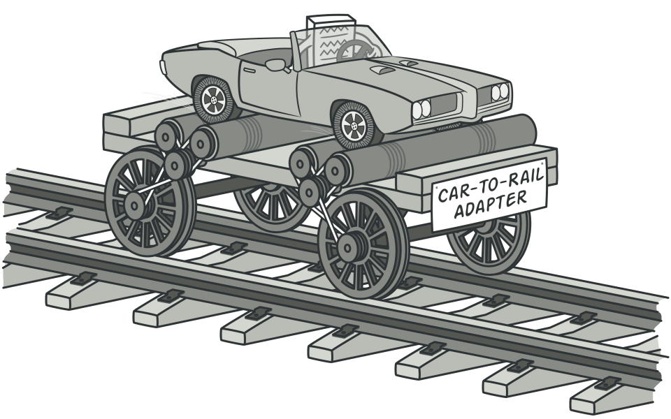
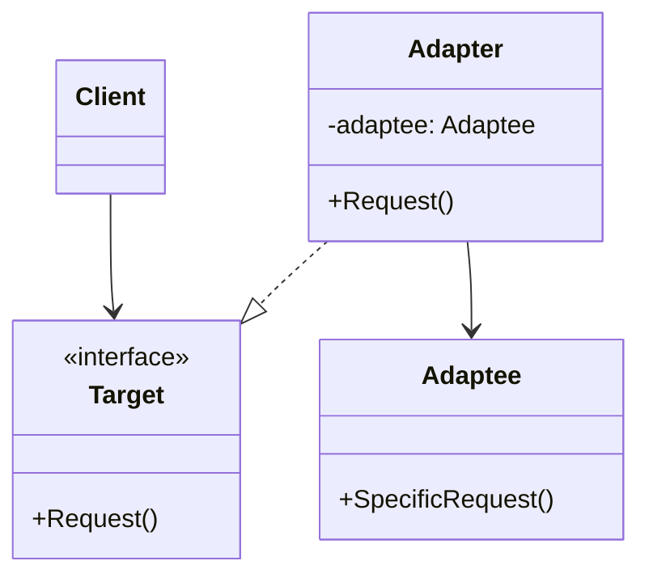
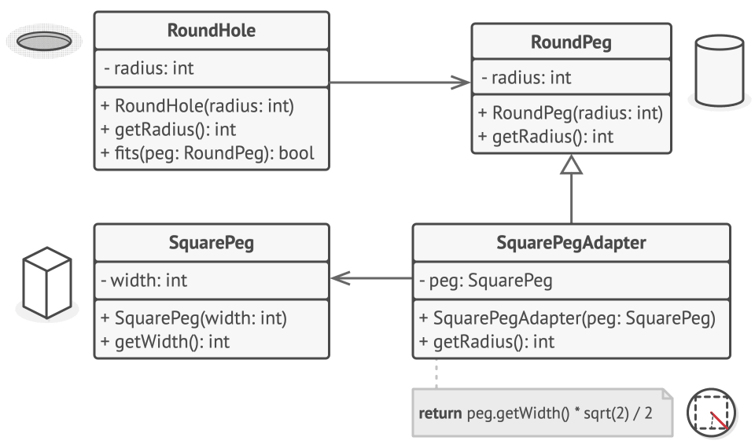

# Структурные паттерны

Структурные паттерны проектирования отвечают за построение удобных в поддержке иерархий классов и организацию отношений между объектами.

## Adapter (Адаптер)

### Определение

**Adapter** (Адаптер) — это структурный паттерн проектирования, который позволяет объектам с несовместимыми интерфейсами работать вместе. Адаптер выступает в роли промежуточного слоя, преобразуя интерфейс одного класса в интерфейс, ожидаемый клиентом.

Представьте адаптер как переходник между вилкой и розеткой разных стандартов: европейская вилка не подойдёт к американской розетке напрямую, но переходник решает эту проблему, не изменяя ни вилку, ни розетку.



### Мотивация и проблематика

В реальной разработке часто возникают ситуации, когда необходимо объединить компоненты с различными интерфейсами. Например, вы разрабатываете приложение для анализа данных с биржи и храните логи в формате Markdown. Позднее вы находите библиотеку для визуализации логов, но она работает только с JSON. Переписывать всё приложение или саму библиотеку нецелесообразно — здесь на помощь приходит адаптер.

Схема работы:
```
Логи (Markdown) → Адаптер (конвертирует MD → JSON) → Библиотека анализа (JSON)
```

Другая аналогия: переводчик на конференции. Все выступающие говорят на английском (целевой интерфейс), но один участник владеет только русским (адаптируемый класс). Переводчик становится адаптером: слушает английский, переводит на русский для участника, затем переводит ответ обратно на английский.

### Терминология

**Target** (Целевой интерфейс) — интерфейс, который ожидает использовать клиентский код. Это стандарт, к которому мы хотим привести все реализации.

**Adaptee** (Адаптируемый класс) — существующий класс с несовместимым интерфейсом, который необходимо адаптировать. Обычно это сторонняя библиотека или унаследованный код, который мы не можем или не хотим изменять.

**Adapter** (Адаптер) — класс-обёртка, который реализует целевой интерфейс и содержит ссылку на объект адаптируемого класса. Адаптер преобразует вызовы методов целевого интерфейса в вызовы методов адаптируемого класса.

### Структура паттерна



Клиент работает только с интерфейсом `Target`. Адаптер реализует этот интерфейс и содержит ссылку на объект `Adaptee`. Когда клиент вызывает метод `Request()`, адаптер преобразует этот вызов в `SpecificRequest()` адаптируемого объекта.

### Базовый пример: круглые и квадратные колышки

Рассмотрим классическую иллюстрацию паттерна Adapter. В этом примере адаптер преобразует квадратные колышки так, чтобы они могли проходить через круглые отверстия. Адаптер вычисляет минимальный радиус окружности, в которую можно вписать квадратный колышек, и представляет его как круглый колышек с соответствующим радиусом.



#### Реализация на C#
```csharp
using System;

// ===== Существующая система: круглые отверстия и круглые колышки =====
// Эти классы уже существуют и работают вместе

/// <summary>
/// Круглое отверстие - принимает только круглые колышки
/// </summary>
class RoundHole
{
    private readonly double radius;

    public RoundHole(double radius)
    {
        this.radius = radius;
    }

    /// <summary>
    /// Возвращает радиус отверстия
    /// </summary>
    public double GetRadius()
    {
        return radius;
    }

    /// <summary>
    /// Проверяет, помещается ли круглый колышек в отверстие
    /// Колышек помещается, если его радиус не превышает радиус отверстия
    /// </summary>
    public bool Fits(RoundPeg peg)
    {
        // Простое сравнение радиусов
        return this.GetRadius() >= peg.GetRadius();
    }
}

/// <summary>
/// Круглый колышек - совместим с круглым отверстием
/// </summary>
class RoundPeg
{
    private readonly double radius;

    public RoundPeg(double radius)
    {
        this.radius = radius;
    }

    /// <summary>
    /// Возвращает радиус колышка
    /// </summary>
    public virtual double GetRadius()
    {
        return radius;
    }
}

// ===== Несовместимый класс: квадратный колышек =====
// Этот класс из другой библиотеки или устаревшей системы
// Он имеет другой интерфейс (GetWidth вместо GetRadius)

/// <summary>
/// Квадратный колышек - имеет несовместимый интерфейс с круглым отверстием
/// Это может быть класс из сторонней библиотеки или унаследованный код
/// </summary>
class SquarePeg
{
    private readonly double width;

    public SquarePeg(double width)
    {
        this.width = width;
    }

    /// <summary>
    /// Возвращает ширину стороны квадратного колышка
    /// Обратите внимание: метод называется GetWidth, а не GetRadius
    /// </summary>
    public double GetWidth()
    {
        return width;
    }
}

// ===== ADAPTER: делает квадратные колышки совместимыми с круглыми отверстиями =====

/// <summary>
/// Адаптер, позволяющий использовать квадратные колышки с круглыми отверстиями
/// Наследуется от RoundPeg, чтобы быть совместимым с методом Fits класса RoundHole
/// </summary>
class SquarePegAdapter : RoundPeg
{
    // Ссылка на адаптируемый объект (квадратный колышек)
    private readonly SquarePeg peg;

    /// <summary>
    /// Конструктор принимает квадратный колышек и сохраняет его
    /// base(0) вызывается для инициализации базового класса (значение не используется)
    /// </summary>
    public SquarePegAdapter(SquarePeg peg) : base(0)
    {
        this.peg = peg;
    }

    /// <summary>
    /// Переопределяем метод GetRadius для адаптации квадратного колышка
    /// Вычисляем радиус наименьшей окружности, описанной вокруг квадрата
    /// Формула: радиус = (сторона * √2) / 2 = диагональ / 2
    /// 
    /// Почему именно так:
    /// - Диагональ квадрата со стороной a равна a * √2 (по теореме Пифагора)
    /// - Радиус описанной окружности равен половине диагонали
    /// </summary>
    public override double GetRadius()
    {
        // Преобразуем ширину квадрата в эквивалентный радиус круга
        return peg.GetWidth() * Math.Sqrt(2) / 2;
    }
}

// ===== Клиентский код =====

class Program
{
    static void Main()
    {
        // Создаём круглое отверстие с радиусом 5
        var hole = new RoundHole(5);
        
        // Создаём круглый колышек с радиусом 5
        var rpeg = new RoundPeg(5);
        
        // Круглый колышек идеально подходит к круглому отверстию
        Console.WriteLine($"Круглый колышек (r=5) помещается в отверстие (r=5): {hole.Fits(rpeg)}"); 
        // Вывод: True

        // Создаём квадратные колышки
        var smallSqPeg = new SquarePeg(5);   // Сторона квадрата = 5
        var largeSqPeg = new SquarePeg(10);  // Сторона квадрата = 10

        // Попытка напрямую использовать квадратный колышек не скомпилируется:
        // hole.Fits(smallSqPeg); 
        // Ошибка: метод Fits ожидает RoundPeg, а не SquarePeg

        // Используем адаптер для работы с квадратными колышками
        var smallSqPegAdapter = new SquarePegAdapter(smallSqPeg);
        var largeSqPegAdapter = new SquarePegAdapter(largeSqPeg);

        // Маленький квадрат помещается в отверстие
        // Эквивалентный радиус для квадрата со стороной 5: 5 * √2 / 2 ≈ 3.54
        Console.WriteLine($"Квадратный колышек (w=5) помещается в отверстие (r=5): {hole.Fits(smallSqPegAdapter)}"); 
        // Вывод: True (3.54 < 5)

        // Большой квадрат не помещается в отверстие  
        // Эквивалентный радиус для квадрата со стороной 10: 10 * √2 / 2 ≈ 7.07
        Console.WriteLine($"Квадратный колышек (w=10) помещается в отверстие (r=5): {hole.Fits(largeSqPegAdapter)}"); 
        // Вывод: False (7.07 > 5)
    }
}
```

**Ключевые моменты этого примера:**

1. **Неизменность существующего кода** — классы `RoundHole` и `RoundPeg` остались без изменений. Мы не трогали работающую систему.

2. **Композиция вместо изменения** — адаптер содержит ссылку на `SquarePeg`, а не изменяет сам класс `SquarePeg`.

3. **Прозрачность для клиента** — клиентский код (`RoundHole.Fits`) не знает, что работает с адаптером. Для него это просто ещё один `RoundPeg`.

4. **Преобразование интерфейса** — адаптер переводит вызов `GetRadius()` в логику, основанную на `GetWidth()`.

### Принципы работы с адаптером

Главное преимущество паттерна Adapter заключается в том, что он решает проблему несовместимости интерфейсов без изменения существующего кода:

- **Не изменяется клиентский код** — код, использующий целевой интерфейс, продолжает работать без изменений
- **Не изменяется адаптируемый класс** — сторонние библиотеки или унаследованный код остаются нетронутыми
- **Изолированность изменений** — вся логика адаптации сосредоточена в одном месте

Адаптер создаётся поверх существующего кода, образуя дополнительный слой абстракции.

## Практический пример: система логирования

Рассмотрим более реалистичный сценарий использования паттерна Adapter в контексте системы логирования.

### Постановка задачи

Представьте, что вы разрабатываете систему логирования для корпоративного приложения. Изначально для хранения логов использовалась PostgreSQL, и под неё был написан специализированный класс. Система работает стабильно и используется в production.

Со временем бизнес предъявляет новые требования: необходимо добавить полнотекстовый поиск по логам для быстрого анализа инцидентов. Для этого принимается решение использовать Elasticsearch — распределённую поисковую и аналитическую систему, оптимизированную для работы с большими объёмами данных в реальном времени.

Проблема: библиотека для работы с Elasticsearch имеет свой специфический интерфейс, несовместимый с существующим кодом. Нужно интегрировать обе системы хранения, сохранив работоспособность текущего кода.

### Существующие классы (Adaptee)

```csharp
/// <summary>
/// Существующий класс для работы с PostgreSQL
/// Это унаследованный код (legacy), который уже используется в production
/// Изменять его опасно - может сломаться существующий функционал
/// </summary>
public class PostgresLogStorage
{
    /// <summary>
    /// Сохраняет лог в PostgreSQL
    /// Принимает отдельные параметры: сообщение, время и уровень важности
    /// </summary>
    public void Save(string message, DateTime timeStamp, int severity)
    {
        // Реальная логика работы с базой данных PostgreSQL
        Console.WriteLine($"[PostgreSQL] Сохранение лога: {timeStamp:yyyy-MM-dd HH:mm:ss} | Severity: {severity} | {message}");
    }
}

/// <summary>
/// Класс из внешней библиотеки для работы с Elasticsearch
/// Это сторонний код, который мы не можем и не должны изменять
/// </summary>
public class ElasticSearchLogStorage
{
    /// <summary>
    /// Сохраняет лог в Elasticsearch
    /// Принимает специальный объект ElasticLogMessage со своей структурой
    /// Обратите внимание: интерфейс отличается от PostgresLogStorage
    /// </summary>
    public void Save(ElasticLogMessage message)
    {
        // Реальная логика работы с Elasticsearch
        Console.WriteLine($"[Elasticsearch] Индексирование: {message.Timestamp:yyyy-MM-dd HH:mm:ss} | Level: {message.Level} | {message.Content}");
    }
}

/// <summary>
/// Формат сообщения, требуемый Elasticsearch
/// Это часть внешней библиотеки
/// </summary>
public class ElasticLogMessage
{
    public string Content { get; set; }      // Содержимое лога
    public DateTime Timestamp { get; set; }  // Временная метка
    public string Level { get; set; }        // Уровень важности (строка)
}
```

**Ключевые моменты:**

1. **Классы-Adaptee** — это существующие реализации, которые мы не можем или не хотим изменять:
   - `PostgresLogStorage` — унаследованный код из старой системы
   - `ElasticSearchLogStorage` — класс из внешней библиотеки

2. **Разные интерфейсы** — каждый класс использует свой формат для сохранения логов:
   - PostgreSQL принимает три отдельных параметра
   - Elasticsearch принимает специальный объект `ElasticLogMessage`

3. **Необходимость унификации** — нам нужен единый способ работы с обеими системами.

### Целевой интерфейс (Target Interface)
```csharp
/// <summary>
/// Целевой интерфейс (Target) - единый стандарт для всех хранилищ логов
/// Это контракт, который ожидает видеть клиентский код
/// Все адаптеры будут реализовывать этот интерфейс
/// </summary>
public interface ILogStorage
{
    /// <summary>
    /// Унифицированный метод сохранения лога
    /// Принимает стандартизированный объект LogMessage
    /// </summary>
    void Save(LogMessage message);
}

/// <summary>
/// Стандартная модель лог-сообщения в нашей системе
/// Это унифицированный формат, с которым работает всё приложение
/// </summary>
public class LogMessage
{
    public string Message { get; set; }      // Текст сообщения
    public DateTime DateTime { get; set; }   // Временная метка
    public Severity Severity { get; set; }   // Уровень важности (enum)
}

/// <summary>
/// Перечисление уровней важности логов
/// </summary>
public enum Severity
{
    Info = 0,      // Информационное сообщение
    Warning = 1,   // Предупреждение
    Error = 2,     // Ошибка
    Critical = 3   // Критическая ошибка
}
```

**Зачем нужен целевой интерфейс:**

- Определяет единый стандарт взаимодействия для всего приложения
- Позволяет клиентскому коду работать с любым хранилищем логов одинаково
- Обеспечивает подменяемость реализаций (принцип подстановки Лисков)
- Упрощает добавление новых хранилищ в будущем

### Реализация адаптеров 
```csharp
/// <summary>
/// Адаптер для PostgreSQL хранилища
/// Преобразует вызовы интерфейса ILogStorage в формат PostgresLogStorage
/// </summary>
public class PostgresLogStorageAdapter : ILogStorage
{
    // Поле для хранения адаптируемого объекта
    // Используется композиция (has-a), а не наследование (is-a)
    private readonly PostgresLogStorage _storage;
    
    /// <summary>
    /// Конструктор принимает объект, который нужно адаптировать
    /// Это паттерн Dependency Injection - зависимость передаётся извне
    /// </summary>
    public PostgresLogStorageAdapter(PostgresLogStorage storage)
    {
        _storage = storage;
    }
    
    /// <summary>
    /// Реализация метода интерфейса ILogStorage
    /// Адаптирует вызов к формату PostgresLogStorage
    /// </summary>
    public void Save(LogMessage message)
    {
        // Этап 1: Получаем стандартизированный LogMessage
        // Этап 2: Преобразуем его в формат, ожидаемый PostgreSQL (три отдельных параметра)
        // Этап 3: Вызываем метод адаптируемого объекта
        
        _storage.Save(
            message.Message,                   // Передаём текст сообщения
            message.DateTime,                  // Передаём временную метку
            (int)message.Severity              // Преобразуем enum в int
        );
    }
}

/// <summary>
/// Адаптер для Elasticsearch хранилища
/// Преобразует вызовы интерфейса ILogStorage в формат ElasticSearchLogStorage
/// </summary>
public class ElasticLogStorageAdapter : ILogStorage
{
    // Аналогично PostgresLogStorageAdapter - используем композицию
    private readonly ElasticSearchLogStorage _storage;
    
    /// <summary>
    /// Конструктор для внедрения зависимости
    /// </summary>
    public ElasticLogStorageAdapter(ElasticSearchLogStorage storage)
    {
        _storage = storage;
    }
    
    /// <summary>
    /// Реализация метода интерфейса ILogStorage
    /// Адаптирует вызов к формату ElasticSearchLogStorage
    /// </summary>
    public void Save(LogMessage message)
    {
        // Этап 1: Получаем стандартизированный LogMessage
        // Этап 2: Преобразуем в ElasticLogMessage (специальный формат Elasticsearch)
        // Этап 3: Вызываем метод адаптируемого объекта
        
        var elasticMessage = new ElasticLogMessage
        {
            Content = message.Message,                    // Копируем текст
            Timestamp = message.DateTime,                 // Копируем временную метку
            Level = message.Severity.ToString()           // Преобразуем enum в строку
        };
        
        _storage.Save(elasticMessage);
    }
}
```

**Анализ структуры адаптеров:**

1. **Композиция вместо наследования** — адаптер содержит ссылку на адаптируемый объект (`_storage`), а не наследуется от него. Это даёт гибкость и соответствует принципу "Composition over Inheritance".

2. **Единая ответственность** — каждый адаптер отвечает только за преобразование интерфейса одного конкретного класса.

3. **Прозрачность для клиента** — оба адаптера реализуют `ILogStorage`, поэтому клиентский код может работать с ними одинаково, не зная о различиях в реализации.

4. **Трансформация данных** — адаптеры выполняют преобразование:
   - `PostgresLogStorageAdapter`: `LogMessage` → три отдельных параметра
   - `ElasticLogStorageAdapter`: `LogMessage` → `ElasticLogMessage`

5. **Изоляция изменений** — если формат PostgreSQL или Elasticsearch изменится, нужно будет изменить только соответствующий адаптер, а не весь код приложения.

## Расширенное применение: адаптер для миграции на асинхронность

Один из мощных паттернов использования адаптеров — постепенная миграция кодовой базы. Рассмотрим ситуацию перехода с синхронного API на асинхронный.

### Проблема

Ваше приложение (например, Telegram-бот) изначально использовало синхронные операции через интерфейс `ILogStorage`. Весь код написан под синхронную модель. Теперь требуется перейти на асинхронность для повышения производительности и масштабируемости.

**Сложности:**
- Сотни мест в коде используют `ILogStorage`
- Полная переработка всего кода одновременно рискованна и трудозатратна
- Необходимо обеспечить работоспособность во время миграции

**Решение:** использовать адаптер для постепенного перехода.

### Асинхронный интерфейс 
```csharp
/// <summary>
/// Асинхронный интерфейс для хранилища логов
/// Это новый стандарт, к которому мы хотим перейти
/// </summary>
public interface IAsyncLogStorage
{
    /// <summary>
    /// Асинхронное сохранение лога
    /// Возвращает Task для поддержки async/await паттерна
    /// </summary>
    Task SaveAsync(LogMessage message);
}
```

### Адаптер синхронного хранилища к асинхронному интерфейсу

```csharp
/// <summary>
/// Адаптер, позволяющий использовать синхронное хранилище через асинхронный интерфейс
/// Это временное решение для постепенной миграции
/// </summary>
public class AsyncLogStorageAdapter : IAsyncLogStorage
{
    // Ссылка на синхронное хранилище
    private readonly ILogStorage _storage;
    
    /// <summary>
    /// Конструктор принимает любую реализацию ILogStorage
    /// Это может быть PostgresLogStorageAdapter или ElasticLogStorageAdapter
    /// </summary>
    public AsyncLogStorageAdapter(ILogStorage storage)
    {
        _storage = storage;
    }
    
    /// <summary>
    /// Реализует асинхронный метод, оборачивая синхронный вызов
    /// </summary>
    public Task SaveAsync(LogMessage message)
    {
        // Вызываем синхронный метод
        _storage.Save(message);
        
        // Возвращаем уже завершённую задачу
        // В реальном коде здесь может быть Task.Run() для выполнения в отдельном потоке
        return Task.CompletedTask;
    }
}
```

**Важное замечание о реализации:**

В представленном выше коде используется `Task.CompletedTask`, что означает, что операция выполняется синхронно, но возвращает `Task` для совместимости с асинхронным интерфейсом. В production-коде для настоящей асинхронности следует использовать:

```csharp
public Task SaveAsync(LogMessage message)
{
    // Выполняем синхронную операцию в отдельном потоке
    return Task.Run(() => _storage.Save(message));
}
```

### Стратегии миграции

**Вариант 1 (плохой):** Переписать весь код сразу
- Высокий риск внесения ошибок
- Длительный период разработки без релизов
- Сложность тестирования всех изменений одновременно

**Вариант 2 (хороший):** Использовать адаптер для постепенной миграции
- Безопасная поэтапная миграция
- Старый код продолжает работать
- Новый код использует асинхронность
- Возможность откатить изменения на любом этапе

### Комбинирование адаптеров
```csharp
// Создаём базовое PostgreSQL хранилище
var postgresStorage = new PostgresLogStorage();

// Старый код продолжает работать с синхронным интерфейсом
var syncAdapter = new PostgresLogStorageAdapter(postgresStorage);
var logService = new LoggingService(syncAdapter);

// Новый код использует асинхронный интерфейс через цепочку адаптеров
var asyncAdapter = new AsyncLogStorageAdapter(syncAdapter);
var asyncLogService = new AsyncLoggingService(asyncAdapter);
```

**Ключевая идея — адаптеры можно комбинировать как матрёшки:**

```
PostgresLogStorage                    (оригинальная реализация)
    ↓
PostgresLogStorageAdapter             (адаптирует к ILogStorage)
    ↓
AsyncLogStorageAdapter                (адаптирует к IAsyncLogStorage)
```

Каждый адаптер решает одну конкретную задачу, и их можно комбинировать для достижения нужного результата. Это демонстрирует принцип единственной ответственности (Single Responsibility Principle).

## Адаптивный рефакторинг

**Adaptive Refactoring** (Адаптивный рефакторинг) — это техника постепенного изменения кодовой базы с минимальным риском.

### Принципы адаптивного рефакторинга

1. **Двухэтапный процесс:**
   - Этап 1: Изменение точек использования (call sites)
   - Этап 2: Изменение реализации

2. **Локализация изменений:**
   - Изменения сосредоточены в одном месте (адаптере)
   - Остальной код остаётся стабильным

### Практический сценарий

Представим: многие годы в проекте использовался синхронный логгер. Теперь система переходит на асинхронную архитектуру. Задача: мигрировать на асинхронный логгер без остановки разработки и без риска для production.

### Исходное состояние: синхронная система
```csharp
/// <summary>
/// Сервис обработки заказов - использует синхронное логирование
/// Таких классов в системе могут быть десятки или сотни
/// </summary>
class OrderService
{
    private readonly ILogStorage _storage;
    
    public OrderService(ILogStorage storage)
    {
        _storage = storage;
    }
    
    public void ProcessOrder(Order order)
    {
        // Синхронная обработка заказа
        _storage.Save(new LogMessage 
        { 
            Message = $"Order {order.Id} processed",
            DateTime = DateTime.Now,
            Severity = Severity.Info
        });
    }
}

/// <summary>
/// Сервис обработки платежей - также использует синхронное логирование
/// </summary>
class PaymentService
{
    private readonly ILogStorage _storage;
    
    public PaymentService(ILogStorage storage)
    {
        _storage = storage;
    }
    
    public void ProcessPayment(Payment payment)
    {
        // Синхронная обработка платежа
        _storage.Save(new LogMessage 
        { 
            Message = $"Payment {payment.Id} processed",
            DateTime = DateTime.Now,
            Severity = Severity.Info
        });
    }
}

// В реальной системе может быть 50-100 таких классов
// NotificationService, EmailService, ReportService и т.д.
```

**Проблема:** все эти классы используют синхронный `ILogStorage`. Переписать их все сразу на асинхронность — масштабная и рискованная задача.

### Процесс постепенной миграции

#### Шаг 1: Создание адаптера (локализованное изменение)
Мы уже создали `AsyncLogStorageAdapter` выше. Теперь можем использовать его для миграции.

#### Шаг 2: Постепенная миграция классов (один за раз)
```csharp
/// <summary>
/// НОВАЯ асинхронная версия OrderService
/// Переписан для использования async/await
/// </summary>
class OrderService
{
    private readonly IAsyncLogStorage _storage;
    
    public OrderService(IAsyncLogStorage storage)
    {
        _storage = storage;
    }
    
    // Теперь метод асинхронный
    public async Task ProcessOrderAsync(Order order)
    {
        // Можем использовать await для других асинхронных операций
        await _storage.SaveAsync(new LogMessage 
        { 
            Message = $"Order {order.Id} processed asynchronously",
            DateTime = DateTime.Now,
            Severity = Severity.Info
        });
    }
}

/// <summary>
/// СТАРАЯ синхронная версия PaymentService
/// Пока не переписан, продолжает использовать ILogStorage
/// Система работает с обеими версиями одновременно
/// </summary>
class PaymentService
{
    private readonly ILogStorage _storage;
    
    public PaymentService(ILogStorage storage)
    {
        _storage = storage;
    }
    
    public void ProcessPayment(Payment payment)
    {
        _storage.Save(new LogMessage 
        { 
            Message = $"Payment {payment.Id} processed synchronously",
            DateTime = DateTime.Now,
            Severity = Severity.Info
        });
    }
}
```

**Ключевой момент:** в один момент времени система содержит и старые (синхронные), и новые (асинхронные) классы. Они работают параллельно без конфликтов.

#### Шаг 3: Конфигурация и внедрение зависимостей
```csharp
// Настройка системы логирования
var postgresDb = new PostgresLogStorage();
var syncStorage = new PostgresLogStorageAdapter(postgresDb);
var asyncStorage = new AsyncLogStorageAdapter(syncStorage);

// Новый код использует асинхронное хранилище
var orderService = new OrderService(asyncStorage);

// Старый код продолжает использовать синхронное хранилище
var paymentService = new PaymentService(syncStorage);

// Оба сервиса работают корректно
await orderService.ProcessOrderAsync(new Order { Id = 123 });
paymentService.ProcessPayment(new Payment { Id = 456 });
```

### Преимущества адаптивного рефакторинга

1. **Безопасность** — изменения локализованы в адаптере, основной код не трогается
2. **Постепенность** — можно мигрировать по одному классу за раз
3. **Обратимость** — легко откатить изменения на любом этапе
4. **Параллельная работа** — старый и новый код работают одновременно
5. **Тестируемость** — можно тестировать новую версию, не удаляя старую

**Локализация изменений** — ключевое преимущество. Вся логика адаптации находится в одном месте (класс `AsyncLogStorageAdapter`), а не размазана по сотням файлов.

## Полный рабочий пример
Ниже представлен полный рабочий код, демонстрирующий все концепции паттерна Adapter:

```csharp
using System;
using System.Threading.Tasks;

// ===== ГЛАВНАЯ ПРОГРАММА =====

class Program
{
    static async Task Main(string[] args)
    {
        Console.WriteLine("=== Демонстрация паттерна Adapter ===\n");
        
        // --- Этап 1: Создание адаптируемых объектов (Adaptees) ---
        // Это существующие классы с несовместимыми интерфейсами
        var postgresDb = new PostgresLogStorage();
        var elasticDb = new ElasticSearchLogStorage();
        
        // --- Этап 2: Адаптация к единому интерфейсу ---
        // Оборачиваем каждый Adaptee в соответствующий Adapter
        ILogStorage postgresAdapter = new PostgresLogStorageAdapter(postgresDb);
        ILogStorage elasticAdapter = new ElasticLogStorageAdapter(elasticDb);
        
        // --- Этап 3: Использование через единый интерфейс ---
        // Клиентский код не знает о различиях в реализации
        var loggingService1 = new LoggingService(postgresAdapter);
        var loggingService2 = new LoggingService(elasticAdapter);
        
        // Логируем в PostgreSQL
        Console.WriteLine("--- Синхронное логирование в PostgreSQL ---");
        loggingService1.LogError("Database connection failed", Severity.Error);
        
        // Логируем в Elasticsearch
        Console.WriteLine("\n--- Синхронное логирование в Elasticsearch ---");
        loggingService2.LogError("API timeout occurred", Severity.Critical);
        
        // --- Этап 4: Комбинирование адаптеров ---
        // Оборачиваем синхронный адаптер в асинхронный адаптер
        Console.WriteLine("\n--- Асинхронное логирование через цепочку адаптеров ---");
        IAsyncLogStorage asyncPostgresAdapter = new AsyncLogStorageAdapter(postgresAdapter);
        var asyncLoggingService = new AsyncLoggingService(asyncPostgresAdapter);
        
        // Асинхронное логирование
        await asyncLoggingService.LogErrorAsync("Async operation failed", Severity.Warning);
        
        Console.WriteLine("\n=== Демонстрация завершена ===");
    }
}

// ===== ВСПОМОГАТЕЛЬНЫЕ КЛАССЫ ДЛЯ РАБОТЫ С ЛОГАМИ =====

/// <summary>
/// Сервис логирования, работающий с синхронным интерфейсом
/// </summary>
public class LoggingService
{
    private readonly ILogStorage _storage;
    
    public LoggingService(ILogStorage storage)
    {
        _storage = storage;
    }
    
    /// <summary>
    /// Логирует ошибку с указанным уровнем важности
    /// </summary>
    public void LogError(string message, Severity severity)
    {
        var logMessage = new LogMessage
        {
            Message = message,
            DateTime = DateTime.Now,
            Severity = severity
        };
        
        _storage.Save(logMessage);
    }
}

/// <summary>
/// Сервис логирования, работающий с асинхронным интерфейсом
/// </summary>
public class AsyncLoggingService
{
    private readonly IAsyncLogStorage _storage;
    
    public AsyncLoggingService(IAsyncLogStorage storage)
    {
        _storage = storage;
    }
    
    /// <summary>
    /// Асинхронно логирует ошибку с указанным уровнем важности
    /// </summary>
    public async Task LogErrorAsync(string message, Severity severity)
    {
        var logMessage = new LogMessage
        {
            Message = message,
            DateTime = DateTime.Now,
            Severity = severity
        };
        
        await _storage.SaveAsync(logMessage);
    }
}

// ===== ВСПОМОГАТЕЛЬНЫЕ КЛАССЫ ДЛЯ ПРИМЕРА =====

/// <summary>
/// Модель заказа для демонстрации
/// </summary>
public class Order
{
    public int Id { get; set; }
}

/// <summary>
/// Модель платежа для демонстрации
/// </summary>
public class Payment
{
    public int Id { get; set; }
}
```

### Анализ примера

**1. Создание адаптируемых объектов:**
```csharp
var postgresDb = new PostgresLogStorage();
var elasticDb = new ElasticSearchLogStorage();
```
Создаём экземпляры классов с несовместимыми интерфейсами.

**2. Адаптация к единому интерфейсу:**
```csharp
ILogStorage postgresAdapter = new PostgresLogStorageAdapter(postgresDb);
ILogStorage elasticAdapter = new ElasticLogStorageAdapter(elasticDb);
```
Оборачиваем каждый объект в соответствующий адаптер, который реализует `ILogStorage`.

**3. Использование через единый интерфейс:**
```csharp
var loggingService1 = new LoggingService(postgresAdapter);
var loggingService2 = new LoggingService(elasticAdapter);
```
Клиентский код (`LoggingService`) работает с обоими хранилищами одинаково, не зная об их различиях.

**4. Комбинирование адаптеров (матрёшка):**
```csharp
IAsyncLogStorage asyncPostgresAdapter = new AsyncLogStorageAdapter(postgresAdapter);
```
Создаём адаптер адаптера: `AsyncLogStorageAdapter` оборачивает `PostgresLogStorageAdapter`, который в свою очередь оборачивает `PostgresLogStorage`. Это демонстрирует композиционную природу паттерна.

## Когда применять паттерн Adapter

### 1. Интеграция сторонних библиотек

**Ситуация:** вы хотите использовать сторонний класс или библиотеку, но её интерфейс не соответствует архитектуре вашего приложения.

**Решение:** адаптер создаёт промежуточный слой, преобразующий вызовы вашего приложения в формат, понятный сторонней библиотеке.

**Пример:**
```csharp
// Сторонняя библиотека с неудобным интерфейсом
var thirdPartyLogger = new ThirdPartyLoggingLibrary();

// Адаптируем к нашему стандартному интерфейсу
ILogStorage adapter = new ThirdPartyLoggerAdapter(thirdPartyLogger);

// Используем как обычно
var service = new LoggingService(adapter);
```

### 2. Работа с унаследованным кодом (Legacy Code)

**Ситуация:** в системе есть старый код, который невозможно или нежелательно изменять, но нужно интегрировать его с новой архитектурой.

**Решение:** адаптер изолирует legacy-код, предоставляя современный интерфейс для взаимодействия с ним.

### 3. Унификация множества реализаций

**Ситуация:** вам нужно использовать несколько существующих классов с различными интерфейсами, но нет возможности изменить базовый класс или создать общий интерфейс на их уровне.

**Решение:** создайте адаптеры для каждой реализации, приводя их к единому интерфейсу.

**Альтернатива без адаптера (плохая практика):**
```csharp
// Дублирование кода в подклассах - нарушение DRY принципа
class PostgresLoggerV2 : PostgresLogStorage
{
    public void CommonMethod() { /* дублированный код */ }
}

class ElasticLoggerV2 : ElasticSearchLogStorage
{
    public void CommonMethod() { /* дублированный код */ }
}
```

**С использованием адаптера (хорошая практика):**
```csharp
// Общая функциональность в одном месте
class EnhancedLogStorageAdapter : ILogStorage
{
    private readonly ILogStorage _baseStorage;
    
    public EnhancedLogStorageAdapter(ILogStorage baseStorage)
    {
        _baseStorage = baseStorage;
    }
    
    public void Save(LogMessage message)
    {
        // Общая логика для всех хранилищ
        ValidateMessage(message);
        EnrichMessage(message);
        
        // Делегирование базовой реализации
        _baseStorage.Save(message);
    }
    
    private void ValidateMessage(LogMessage message) { /* ... */ }
    private void EnrichMessage(LogMessage message) { /* ... */ }
}
```

**Примечание:** такое решение близко к паттерну **Decorator** (Декоратор), но фокус здесь на адаптации интерфейса, а не на добавлении функциональности.

### 4. Тестирование и моки

**Ситуация:** необходимо протестировать код, зависящий от внешних систем (база данных, API, файловая система).

**Решение:** создать адаптер-заглушку (mock) для тестирования.

```csharp
// Адаптер-мок для тестирования
public class InMemoryLogStorageAdapter : ILogStorage
{
    private readonly List<LogMessage> _logs = new List<LogMessage>();
    
    public void Save(LogMessage message)
    {
        _logs.Add(message);
    }
    
    public IReadOnlyList<LogMessage> GetAllLogs() => _logs.AsReadOnly();
}

// Использование в тестах
[Test]
public void TestLoggingService()
{
    var mockStorage = new InMemoryLogStorageAdapter();
    var service = new LoggingService(mockStorage);
    
    service.LogError("Test error", Severity.Error);
    
    Assert.AreEqual(1, mockStorage.GetAllLogs().Count);
}
```

## Преимущества и недостатки

### Преимущества

1. **Принцип открытости/закрытости (Open/Closed Principle)** — можно добавлять новые типы адаптеров без изменения существующего кода

2. **Принцип единственной ответственности (Single Responsibility Principle)** — логика преобразования интерфейса отделена от бизнес-логики

3. **Изоляция сложности** — детали работы с несовместимыми интерфейсами скрыты в адаптере

4. **Гибкость** — один интерфейс может иметь множество адаптеров для разных реализаций

5. **Безопасность рефакторинга** — изменения локализованы, риск поломки минимален

### Недостатки

1. **Увеличение количества классов** — каждый адаптируемый класс требует своего адаптера

2. **Дополнительный уровень абстракции** — может усложнить понимание кода для новичков

3. **Накладные расходы** — незначительное снижение производительности из-за дополнительных вызовов методов

4. **Риск чрезмерного использования** — иногда проще изменить сам класс, чем создавать адаптер

## Связь с другими паттернами

### Adapter vs Facade

- **Adapter** адаптирует существующий интерфейс к ожидаемому
- **Facade** (Фасад) упрощает сложный интерфейс, предоставляя более простой

### Adapter vs Decorator

- **Adapter** изменяет интерфейс объекта
- **Decorator** (Декоратор) добавляет новую функциональность, сохраняя интерфейс

### Adapter vs Bridge

- **Adapter** применяется после проектирования для совместимости
- **Bridge** (Мост) проектируется заранее для разделения абстракции и реализации

### Adapter vs Proxy

- **Adapter** предоставляет другой интерфейс
- **Proxy** (Заместитель) предоставляет тот же интерфейс, контролируя доступ

## Резюме

Паттерн **Adapter** — это структурный паттерн проектирования, решающий проблему несовместимости интерфейсов. Он позволяет объектам с разными интерфейсами работать вместе, создавая промежуточный слой преобразования.

**Ключевые идеи:**
- Не изменяет существующий код
- Локализует логику преобразования
- Поддерживает принцип открытости/закрытости
- Позволяет постепенную миграцию кода

**Основные сценарии применения:**
- Интеграция сторонних библиотек
- Работа с унаследованным кодом
- Унификация разнородных реализаций
- Постепенный рефакторинг системы

Паттерн Adapter является фундаментальным инструментом в арсенале разработчика, обеспечивающим гибкость и поддерживаемость программных систем.
