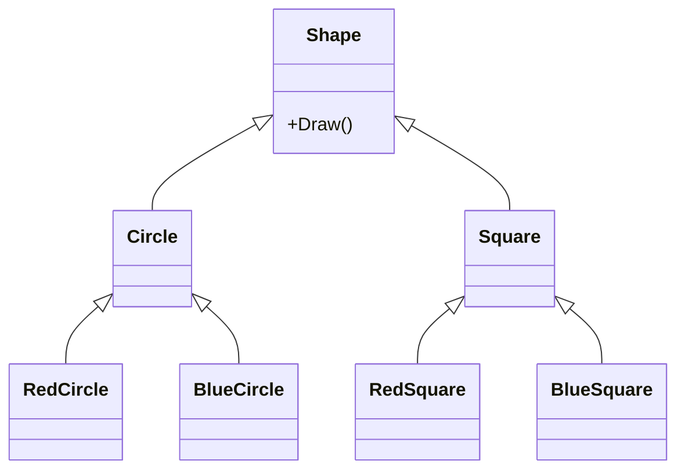
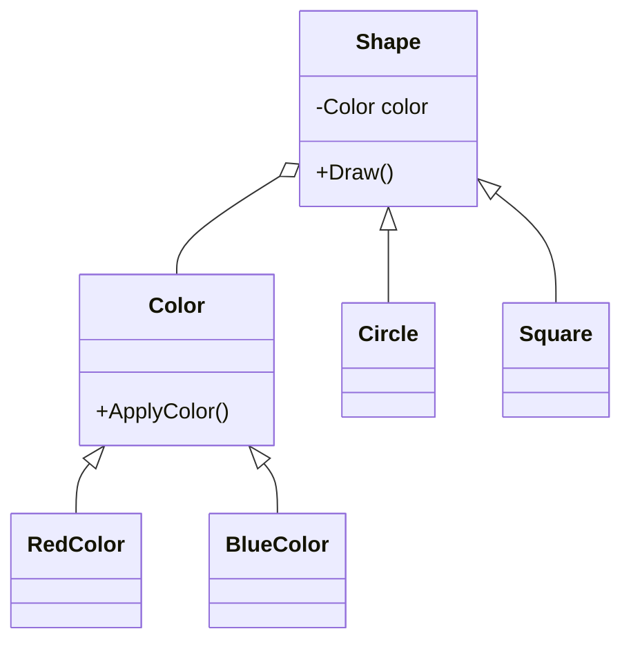
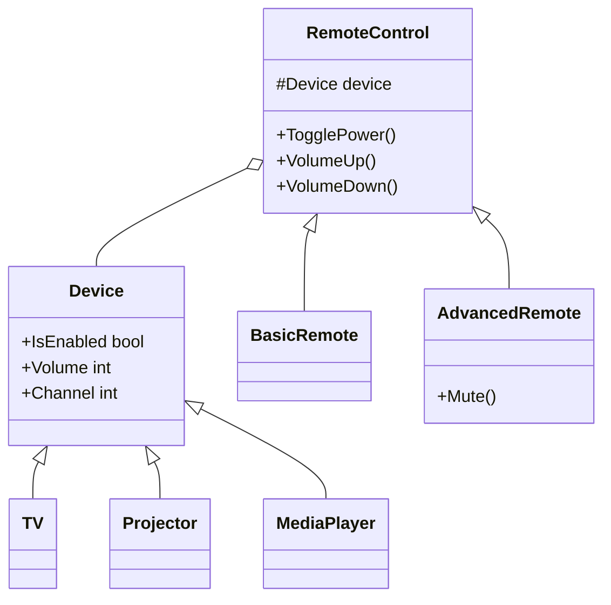

# Bridge (Мост)

## Определение паттерна

**Bridge** (Мост) — структурный паттерн проектирования, который разделяет один или несколько классов на две отдельные иерархии: *абстракцию* (abstraction) и *реализацию* (implementation), позволяя изменять их независимо друг от друга.

Другими словами, Bridge разделяет объектную модель на абстракции разных уровней, где реализации абстракций более высокого уровня используют абстракции более низкого уровня через композицию, образуя «мост» между ними.

## Проблема: комбинаторный взрыв классов

### Мотивирующий пример с геометрическими фигурами

Представьте, что вы разрабатываете систему для работы с геометрическими фигурами. У вас есть базовый класс `Shape` (фигура) с подклассами `Circle` (круг) и `Square` (квадрат). Теперь вы хотите добавить возможность задавать цвет фигур: красные и синие.

При использовании наследования вам придётся создать четыре комбинации классов:
- `RedCircle` (красный круг)
- `BlueCircle` (синий круг)
- `RedSquare` (красный квадрат)
- `BlueSquare` (синий квадрат)



### Геометрический рост сложности

При добавлении новых видов фигур и цветов количество классов растёт экспоненциально. Например:
- Добавление треугольника (`Triangle`) потребует создания `RedTriangle` и `BlueTriangle` — ещё 2 класса
- Добавление зелёного цвета потребует создания `GreenCircle`, `GreenSquare`, `GreenTriangle` — ещё 3 класса
- При N фигурах и M цветах получится N × M классов

Это нарушает **принцип открытости/закрытости** (Open/Closed Principle): система становится закрытой для расширения без модификации множества классов.

### Корень проблемы

Проблема заключается в том, что мы пытаемся расширять классы фигур одновременно в двух независимых направлениях:
1. **По форме** — круг, квадрат, треугольник
2. **По цвету** — красный, синий, зелёный

Эти два измерения изменчивости должны варьироваться независимо друг от друга.

## Решение: разделение иерархий

Паттерн Bridge предлагает заменить наследование **композицией** или **агрегацией**. Для этого необходимо:

1. Выделить одно из измерений изменчивости в отдельную иерархию классов
2. Хранить ссылку на объект этой иерархии вместо хранения его состояния и поведения внутри одного класса
3. Делегировать работу связанному объекту вместо прямого наследования

В примере с фигурами мы можем выделить цвет в отдельную иерархию:



Теперь для добавления нового цвета нужен только один новый класс цвета, а для новой фигуры — только один класс фигуры. При N фигурах и M цветах получится N + M классов вместо N × M.

## Практический пример: система управления устройствами

Рассмотрим более детальный пример, который часто встречается в реальной разработке.

### Постановка задачи

Вы разрабатываете систему управления мультимедийными устройствами. Требования:

1. **Устройства**: телевизор, проектор, медиа-плеер (и в будущем могут появиться другие)
2. **Способы управления**: обычный пульт, голосовой помощник, мобильное приложение

Наивный подход через наследование приведёт к созданию классов:
- `TvRemote`, `ProjectorRemote`, `MediaPlayerRemote`
- `TvVoiceControl`, `ProjectorVoiceControl`, `MediaPlayerVoiceControl`
- `TvMobileApp`, `ProjectorMobileApp`, `MediaPlayerMobileApp`

Это 9 классов только для трёх устройств и трёх способов управления. При добавлении нового устройства потребуется создать ещё 3 класса управления.

### Анализ измерений изменчивости

В этой задаче присутствуют два независимых измерения:

1. **Абстракция высокого уровня** — как мы управляем (интерфейс управления)
2. **Абстракция низкого уровня** — чем мы управляем (само устройство)

Паттерн Bridge позволяет разделить эти две иерархии и связать их через композицию.



## Структура паттерна Bridge

Паттерн Bridge состоит из следующих компонентов:

1. **Abstraction** (Абстракция) — определяет интерфейс высокого уровня и содержит ссылку на объект типа Implementation
2. **RefinedAbstraction** (Уточнённая абстракция) — расширяет интерфейс абстракции
3. **Implementation** (Реализация) — определяет интерфейс для всех конкретных реализаций
4. **ConcreteImplementation** (Конкретная реализация) — содержит платформо-зависимый код

## Реализация на C#

### Шаг 1: Определение низкоуровневой абстракции (устройство)

Начнём с определения интерфейса для устройств, которыми мы будем управлять:

```csharp
/// <summary>
/// Интерфейс Implementation (Реализация).
/// Определяет базовые операции для всех поддерживаемых устройств.
/// Это низкоуровневая абстракция, которая будет расширяться независимо
/// от высокоуровневой абстракции управления.
/// </summary>
public interface IDevice
{
    /// <summary>
    /// Состояние устройства: включено или выключено
    /// </summary>
    bool IsEnabled { get; set; }
    
    /// <summary>
    /// Текущий канал или входной источник
    /// </summary>
    int Channel { get; set; }
    
    /// <summary>
    /// Уровень громкости устройства
    /// </summary>
    int Volume { get; set; }
}
```

### Шаг 2: Создание конкретных реализаций устройств

Теперь создадим конкретные типы устройств:

```csharp
/// <summary>
/// ConcreteImplementation (Конкретная реализация) - Телевизор.
/// Реализует специфичное для телевизора поведение.
/// </summary>
public class Tv : IDevice
{
    public bool IsEnabled { get; set; }
    public int Channel { get; set; } = 1;
    public int Volume { get; set; } = 50;
    
    public override string ToString() => 
        $"TV: {(IsEnabled ? "ON" : "OFF")}, Ch={Channel}, Vol={Volume}";
}

/// <summary>
/// ConcreteImplementation (Конкретная реализация) - Проектор.
/// Реализует специфичное для проектора поведение.
/// </summary>
public class Projector : IDevice
{
    public bool IsEnabled { get; set; }
    public int Channel { get; set; } = 1;
    public int Volume { get; set; } = 30;
    
    public override string ToString() => 
        $"Projector: {(IsEnabled ? "ON" : "OFF")}, Ch={Channel}, Vol={Volume}";
}

/// <summary>
/// ConcreteImplementation (Конкретная реализация) - Медиа-плеер.
/// Реализует специфичное для медиа-плеера поведение.
/// </summary>
public class MediaPlayer : IDevice
{
    public bool IsEnabled { get; set; }
    public int Channel { get; set; } = 1;
    public int Volume { get; set; } = 40;
    
    public override string ToString() => 
        $"MediaPlayer: {(IsEnabled ? "ON" : "OFF")}, Ch={Channel}, Vol={Volume}";
}
```

### Шаг 3: Определение высокоуровневой абстракции (управление)

Создадим интерфейс для различных способов управления устройствами:

```csharp
/// <summary>
/// Интерфейс Abstraction (Абстракция).
/// Определяет высокоуровневые операции управления, которые доступны пользователю.
/// Это интерфейс, через который клиентский код взаимодействует с системой.
/// </summary>
public interface IControl
{
    /// <summary>
    /// Переключить состояние питания устройства
    /// </summary>
    void ToggleEnabled();
    
    /// <summary>
    /// Переключить на следующий канал
    /// </summary>
    void ChannelForward();
    
    /// <summary>
    /// Переключить на предыдущий канал
    /// </summary>
    void ChannelBackward();
    
    /// <summary>
    /// Увеличить громкость
    /// </summary>
    void VolumeUp();
    
    /// <summary>
    /// Уменьшить громкость
    /// </summary>
    void VolumeDown();
}
```

### Шаг 4: Базовая реализация управления

Создадим базовый класс управления, который реализует мост между высокоуровневой и низкоуровневой абстракциями:

```csharp
/// <summary>
/// Abstraction (Абстракция) - базовое управление устройством.
/// Содержит ссылку на объект Implementation (IDevice) и делегирует ему работу.
/// Это и есть "мост" - связь между абстракцией управления и реализацией устройства.
/// </summary>
public class Control : IControl
{
    // Ссылка на низкоуровневую абстракцию (Implementation)
    // Это ключевой элемент паттерна Bridge
    protected readonly IDevice _device;

    /// <summary>
    /// Конструктор принимает любое устройство, реализующее IDevice.
    /// Это позволяет одному типу управления работать с разными устройствами.
    /// </summary>
    public Control(IDevice device)
    {
        _device = device;
    }

    public void ToggleEnabled()
    {
        // Делегируем работу устройству
        _device.IsEnabled = !_device.IsEnabled;
    }

    public void ChannelForward()
    {
        _device.Channel += 1;
    }

    public void ChannelBackward()
    {
        _device.Channel -= 1;
    }

    public void VolumeUp()
    {
        // Увеличиваем громкость на 10 единиц
        _device.Volume += 10;
    }

    public void VolumeDown()
    {
        // Уменьшаем громкость на 10 единиц
        _device.Volume -= 10;
    }
    
    public override string ToString() => _device.ToString();
}
```

### Шаг 5: Расширенные варианты управления

Теперь можем легко добавлять новые типы управления, не изменяя существующий код:

```csharp
/// <summary>
/// RefinedAbstraction (Уточнённая абстракция) - управление с логированием.
/// Расширяет базовое управление, добавляя логирование всех операций.
/// </summary>
public class LoggingControl : Control
{
    public LoggingControl(IDevice device) : base(device) { }

    public new void ToggleEnabled()
    {
        // Логируем изменение перед выполнением
        var oldState = _device.IsEnabled;
        base.ToggleEnabled();
        Console.WriteLine($"[LOG] Toggle: {oldState} -> {_device.IsEnabled} on {_device.GetType().Name}");
    }

    public new void VolumeUp()
    {
        var oldVolume = _device.Volume;
        base.VolumeUp();
        Console.WriteLine($"[LOG] Volume: {oldVolume} -> {_device.Volume} on {_device.GetType().Name}");
    }

    public new void VolumeDown()
    {
        var oldVolume = _device.Volume;
        base.VolumeDown();
        Console.WriteLine($"[LOG] Volume: {oldVolume} -> {_device.Volume} on {_device.GetType().Name}");
    }

    public new void ChannelForward()
    {
        var oldChannel = _device.Channel;
        base.ChannelForward();
        Console.WriteLine($"[LOG] Channel: {oldChannel} -> {_device.Channel} on {_device.GetType().Name}");
    }

    public new void ChannelBackward()
    {
        var oldChannel = _device.Channel;
        base.ChannelBackward();
        Console.WriteLine($"[LOG] Channel: {oldChannel} -> {_device.Channel} on {_device.GetType().Name}");
    }
}

/// <summary>
/// RefinedAbstraction (Уточнённая абстракция) - управление с задержкой.
/// Добавляет задержку перед выполнением каждой команды.
/// Полезно для устройств с медленным откликом.
/// </summary>
public class DelayedControl : Control
{
    private readonly int _delayMs;

    public DelayedControl(IDevice device, int delayMs) : base(device)
    {
        _delayMs = delayMs;
    }

    public new void ToggleEnabled()
    {
        Thread.Sleep(_delayMs);
        base.ToggleEnabled();
    }

    public new void VolumeUp()
    {
        Thread.Sleep(_delayMs);
        base.VolumeUp();
    }

    public new void VolumeDown()
    {
        Thread.Sleep(_delayMs);
        base.VolumeDown();
    }

    public new void ChannelForward()
    {
        Thread.Sleep(_delayMs);
        base.ChannelForward();
    }

    public new void ChannelBackward()
    {
        Thread.Sleep(_delayMs);
        base.ChannelBackward();
    }
}
```

### Пример использования

Полный пример, демонстрирующий гибкость паттерна Bridge:

```csharp
public class Program
{
    public static void Main()
    {
        Console.WriteLine("=== ПАТТЕРН BRIDGE: СИСТЕМА УПРАВЛЕНИЯ УСТРОЙСТВАМИ ===\n");

        // Создаём различные устройства (низкоуровневые реализации)
        IDevice tv = new Tv();
        IDevice projector = new Projector();
        IDevice mediaPlayer = new MediaPlayer();

        Console.WriteLine("ИСХОДНОЕ СОСТОЯНИЕ УСТРОЙСТВ:");
        Console.WriteLine($"  {tv}");
        Console.WriteLine($"  {projector}");
        Console.WriteLine($"  {mediaPlayer}\n");

        // СЦЕНАРИЙ 1: Обычное управление телевизором
        Console.WriteLine("--- СЦЕНАРИЙ 1: Базовое управление телевизором ---");
        IControl tvControl = new Control(tv);
        
        tvControl.ToggleEnabled();
        Console.WriteLine($"После включения: {tvControl}");
        
        tvControl.VolumeUp();
        tvControl.VolumeUp();
        Console.WriteLine($"После увеличения звука: {tvControl}");
        
        tvControl.ChannelForward();
        tvControl.ChannelForward();
        Console.WriteLine($"После переключения каналов: {tvControl}\n");

        // СЦЕНАРИЙ 2: Управление проектором с логированием
        Console.WriteLine("--- СЦЕНАРИЙ 2: Управление проектором с логированием ---");
        IControl projectorControl = new LoggingControl(projector);
        
        projectorControl.ToggleEnabled();
        projectorControl.VolumeUp();
        projectorControl.ChannelBackward();
        Console.WriteLine($"Итоговое состояние: {projectorControl}\n");

        // СЦЕНАРИЙ 3: Управление медиа-плеером с задержками
        Console.WriteLine("--- СЦЕНАРИЙ 3: Управление медиа-плеером с задержками ---");
        IControl delayedControl = new DelayedControl(mediaPlayer, delayMs: 500);
        
        Console.WriteLine("Включаем медиа-плеер (задержка 500 мс)...");
        delayedControl.ToggleEnabled();
        Console.WriteLine($"Готово: {delayedControl}\n");

        // СЦЕНАРИЙ 4: Демонстрация гибкости - одно управление для разных устройств
        Console.WriteLine("--- СЦЕНАРИЙ 4: Одно управление для всех устройств ---");
        
        var devices = new IDevice[] { tv, projector, mediaPlayer };
        
        // Применяем одинаковые операции ко всем устройствам
        foreach (var device in devices)
        {
            var control = new Control(device);
            control.ToggleEnabled();
            control.VolumeUp();
        }

        Console.WriteLine("Состояние после массовой операции:");
        foreach (var device in devices)
        {
            Console.WriteLine($"  {device}");
        }
        Console.WriteLine();

        // СЦЕНАРИЙ 5: Добавление нового устройства без изменения существующего кода
        Console.WriteLine("--- СЦЕНАРИЙ 5: Добавление нового устройства ---");
        Console.WriteLine("Добавляем умную лампу БЕЗ изменения существующего кода:\n");

        // Новое устройство реализует тот же интерфейс IDevice
        IDevice lamp = new SmartLamp();
        
        // Все существующие типы управления сразу работают с новым устройством!
        IControl lampControl = new Control(lamp);
        lampControl.ToggleEnabled();
        Console.WriteLine($"Базовое управление лампой: {lampControl}");

        IControl lampControlWithLogging = new LoggingControl(lamp);
        lampControlWithLogging.VolumeUp(); // В контексте лампы это может быть яркость
        Console.WriteLine($"Управление лампой с логированием: {lampControlWithLogging}");
    }
}

/// <summary>
/// Новое устройство, добавленное после создания всей системы.
/// Демонстрирует принцип открытости/закрытости (Open/Closed Principle).
/// </summary>
public class SmartLamp : IDevice
{
    public bool IsEnabled { get; set; }
    public int Channel { get; set; } = 1;  // В контексте лампы - режим освещения
    public int Volume { get; set; } = 75;  // В контексте лампы - яркость
    
    public override string ToString() => 
        $"SmartLamp: {(IsEnabled ? "ON" : "OFF")}, Mode={Channel}, Brightness={Volume}%";
}
```

Вывод программы:
```
=== ПАТТЕРН BRIDGE: СИСТЕМА УПРАВЛЕНИЯ УСТРОЙСТВАМИ ===

ИСХОДНОЕ СОСТОЯНИЕ УСТРОЙСТВ:
  TV: OFF, Ch=1, Vol=50
  Projector: OFF, Ch=1, Vol=30
  MediaPlayer: OFF, Ch=1, Vol=40

--- СЦЕНАРИЙ 1: Базовое управление телевизором ---
После включения: TV: ON, Ch=1, Vol=50
После увеличения звука: TV: ON, Ch=1, Vol=70
После переключения каналов: TV: ON, Ch=3, Vol=70

--- СЦЕНАРИЙ 2: Управление проектором с логированием ---
[LOG] Toggle: False -> True on Projector
[LOG] Volume: 30 -> 40 on Projector
[LOG] Channel: 1 -> 0 on Projector
Итоговое состояние: Projector: ON, Ch=0, Vol=40

--- СЦЕНАРИЙ 3: Управление медиа-плеером с задержками ---
Включаем медиа-плеер (задержка 500 мс)...
Готово: MediaPlayer: ON, Ch=1, Vol=40

--- СЦЕНАРИЙ 4: Одно управление для всех устройств ---
Состояние после массовой операции:
  TV: ON, Ch=3, Vol=80
  Projector: ON, Ch=0, Vol=50
  MediaPlayer: ON, Ch=1, Vol=50

--- СЦЕНАРИЙ 5: Добавление нового устройства ---
Добавляем умную лампу БЕЗ изменения существующего кода:

Базовое управление лампой: SmartLamp: ON, Mode=1, Brightness=75%
[LOG] Volume: 75 -> 85 on SmartLamp
Управление лампой с логированием: SmartLamp: ON, Mode=1, Brightness=85%
```

## Преимущества паттерна Bridge

### 1. Независимое развитие иерархий

Абстракция и реализация могут изменяться независимо:
- Можно добавить новый тип устройства без изменения кода управления
- Можно добавить новый способ управления без изменения кода устройств

```csharp
// Добавление нового устройства - только один класс
public class SmartSpeaker : IDevice
{
    public bool IsEnabled { get; set; }
    public int Channel { get; set; } = 1;
    public int Volume { get; set; } = 60;
}

// Добавление нового управления - только один класс
public class VoiceControl : Control
{
    public VoiceControl(IDevice device) : base(device) { }
    
    // Дополнительные голосовые команды
    public void VoiceCommand(string command)
    {
        Console.WriteLine($"Обработка голосовой команды: {command}");
        // Логика распознавания и выполнения команды
    }
}

// Все комбинации работают автоматически!
var speaker = new SmartSpeaker();
var voiceControl = new VoiceControl(speaker); // Работает!
```

### 2. Соответствие принципу открытости/закрытости

Система открыта для расширения, но закрыта для модификации. Добавление нового функционала не требует изменения существующего кода.

### 3. Соответствие принципу единственной ответственности

Каждый класс отвечает только за одну вещь:
- Классы устройств отвечают только за состояние и поведение устройства
- Классы управления отвечают только за логику управления

### 4. Уменьшение связанности

Высокоуровневая логика не зависит от деталей реализации низкоуровневых компонентов.

## Связь с другими паттернами и принципами

### Bridge как реализация Open/Closed Principle

Bridge - это способ реализации принципа открытости/закрытости:

```csharp
// Можем добавить новый тип управления без изменения старых классов
public class GestureControl : Control
{
    public GestureControl(IDevice device) : base(device) { }
    
    public void SwipeUp() => VolumeUp();
    public void SwipeDown() => VolumeDown();
}

// И всё ещё можем использовать с любым устройством
var device = new Tv();
var gestureControl = new GestureControl(device);
```

### Bridge как реализация Protected Variations (Защита от изменений)

Bridge защищает высокоуровневую логику от изменений в устройствах. Если завтра появится новый тип устройства, весь код управления остаётся неизменным.

```csharp
// Добавляем новое устройство
public class SmartRefrigerator : IDevice
{
    public bool IsEnabled { get; set; }
    public int Channel { get; set; } = 1;
    public int Volume { get; set; } = 50;
}

// Всё существующее управление СРАЗУ работает с холодильником!
var fridge = new SmartRefrigerator();
var control = new Control(fridge);               // Работает!
var loggingControl = new LoggingControl(fridge); // Работает!
var delayedControl = new DelayedControl(fridge, 1000); // Работает!
```

### Bridge и Adapter: в чём разница

Оба паттерна используют композицию, но имеют разные цели:

**Adapter** (Адаптер):
- Применяется **постфактум** к существующим несовместимым интерфейсам
- Цель: заставить несовместимые интерфейсы работать вместе
- Обычно работает с одним интерфейсом

**Bridge** (Мост):
- Проектируется **заранее** для независимого развития иерархий
- Цель: разделить абстракцию и реализацию для независимого изменения
- Работает с двумя иерархиями интерфейсов

```csharp
// АНТИПАТТЕРН: Попытка использовать наследование вместо моста
// Этот код демонстрирует проблему, которую решает Bridge

public class TvRemoteControl
{
    // Состояние устройства встроено в управление - плохо!
    private bool tvEnabled;
    private int tvChannel = 1;
    private int tvVolume = 50;
    
    public void TogglePower() => tvEnabled = !tvEnabled;
    public void VolumeUp() => tvVolume += 10;
    // ... и так далее
}

// Теперь для каждого устройства нужен отдельный класс управления
public class ProjectorRemoteControl { /* дублирование кода */ }
public class MediaPlayerRemoteControl { /* ещё больше дублирования */ }

// А для каждого типа управления - ещё больше классов
public class TvVoiceControl { /* копипаста */ }
public class ProjectorVoiceControl { /* копипаста */ }
// ... комбинаторный взрыв!

// ПРАВИЛЬНЫЙ ПОДХОД: использование Bridge
// Одно управление работает со всеми устройствами через интерфейс
```

### Bridge и Builder + Director

Паттерн Builder с Director также представляет собой мост между клиентом (Director) и конструируемым объектом (Builder):

```csharp
// Builder - низкоуровневая абстракция (как строить)
public interface IReportBuilder
{
    void SetTitle(string title);
    void AddSection(string content);
    void AddChart(string data);
    string GetResult();
}

// ConcreteImplementation - PDF Builder
public class PdfReportBuilder : IReportBuilder
{
    private StringBuilder _pdfContent = new();
    
    public void SetTitle(string title)
    {
        _pdfContent.AppendLine($"PDF Title: {title}");
    }
    
    public void AddSection(string content)
    {
        _pdfContent.AppendLine($"PDF Section: {content}");
    }
    
    public void AddChart(string data)
    {
        _pdfContent.AppendLine($"PDF Chart: {data}");
    }
    
    public string GetResult() => _pdfContent.ToString();
}

// ConcreteImplementation - HTML Builder
public class HtmlReportBuilder : IReportBuilder
{
    private StringBuilder _htmlContent = new();
    
    public void SetTitle(string title)
    {
        _htmlContent.AppendLine($"<h1>{title}</h1>");
    }
    
    public void AddSection(string content)
    {
        _htmlContent.AppendLine($"<section>{content}</section>");
    }
    
    public void AddChart(string data)
    {
        _htmlContent.AppendLine($"<canvas data='{data}'></canvas>");
    }
    
    public string GetResult() => _htmlContent.ToString();
}

// Director - высокоуровневая абстракция (что строить)
// Это мост между пользователем и конструктором
public class ReportDirector
{
    private readonly IReportBuilder _builder;

    public ReportDirector(IReportBuilder builder)
    {
        _builder = builder; // Мост через композицию
    }

    // Директор определяет последовательность шагов
    public void ConstructFinancialReport()
    {
        _builder.SetTitle("Финансовый отчёт Q4 2024");
        _builder.AddSection("Доходы: +25%");
        _builder.AddChart("revenue-data");
        _builder.AddSection("Расходы: +10%");
        _builder.AddChart("expense-data");
    }

    public void ConstructSalesReport()
    {
        _builder.SetTitle("Отчёт о продажах");
        _builder.AddSection("Общий объём продаж");
        _builder.AddChart("sales-data");
    }

    public string GetReport() => _builder.GetResult();
}

// Пример использования
public static void DemoBuilderBridge()
{
    Console.WriteLine("=== Builder + Director как Bridge ===\n");
    
    // Создаём PDF отчёт
    var pdfBuilder = new PdfReportBuilder();
    var pdfDirector = new ReportDirector(pdfBuilder);
    pdfDirector.ConstructFinancialReport();
    Console.WriteLine("PDF Report:");
    Console.WriteLine(pdfDirector.GetReport());
    
    // Создаём HTML отчёт с той же структурой
    var htmlBuilder = new HtmlReportBuilder();
    var htmlDirector = new ReportDirector(htmlBuilder);
    htmlDirector.ConstructFinancialReport();
    Console.WriteLine("HTML Report:");
    Console.WriteLine(htmlDirector.GetReport());
}
```

Вывод:
```
=== Builder + Director как Bridge ===

PDF Report:
PDF Title: Финансовый отчёт Q4 2024
PDF Section: Доходы: +25%
PDF Chart: revenue-data
PDF Section: Расходы: +10%
PDF Chart: expense-data

HTML Report:
<h1>Финансовый отчёт Q4 2024</h1>
<section>Доходы: +25%</section>
<canvas data='revenue-data'></canvas>
<section>Расходы: +10%</section>
<canvas data='expense-data'></canvas>
```

В этом примере Director и Builder связаны мостом - Director не знает деталей построения PDF или HTML, он просто использует абстрактный интерфейс `IReportBuilder`.

## Когда применять Bridge

### Подходящие сценарии

1. **Множественные измерения изменчивости**: Когда класс имеет несколько независимых причин для изменения (например, GUI для разных платформ с разными темами оформления)

2. **Избежание комбинаторного взрыва**: Когда количество комбинаций подклассов растёт экспоненциально

3. **Разделение платформо-зависимого кода**: Когда нужно разделить платформо-зависимую и платформо-независимую логику

4. **Распределение ответственности**: Когда монолитный класс нужно разделить на несколько классов с более чёткими обязанностями

### Примеры из реальной практики

1. **GUI библиотеки**: Абстракция окна/виджета + реализация для Windows/Linux/macOS
2. **Драйверы баз данных**: Абстракция подключения + конкретные реализации для MySQL/PostgreSQL/MongoDB
3. **Платёжные системы**: Абстракция платежа + реализации для Visa/MasterCard/PayPal
4. **Медиа-кодеки**: Абстракция плеера + реализации кодеков для MP3/WAV/FLAC

## Алгоритм реализации

### Пошаговая инструкция

1. **Определите измерения изменчивости**
   - Найдите в ваших классах два (или более) непересекающихся измерения
   - Примеры: функциональность/платформа, предметная-область/инфраструктура, интерфейс/реализация

2. **Определите операции для клиентов**
   - Продумайте, какие операции нужны пользователям вашей системы
   - Опишите их в базовом классе или интерфейсе абстракции (Abstraction)

3. **Создайте интерфейс реализации**
   - Определите поведения, доступные на всех платформах
   - Выделите ту часть, которая нужна абстракции
   - Создайте общий интерфейс Implementation

4. **Реализуйте конкретные реализации**
   - Для каждой платформы создайте свой класс ConcreteImplementation
   - Все они должны следовать интерфейсу Implementation

5. **Добавьте ссылку в абстракцию**
   - В класс Abstraction добавьте поле с ссылкой на объект Implementation
   - Реализуйте методы абстракции, делегируя работу объекту реализации

6. **Создайте уточнённые абстракции**
   - Если есть несколько вариаций абстракции, создайте подклассы RefinedAbstraction
   - Каждый подкласс может добавлять специфичную функциональность

7. **Связывание через конструктор**
   - Клиентский код должен передать объект реализации в конструктор абстракции
   - После этого клиент работает только с абстракцией

### Пример пошагового применения

```csharp
// Шаг 1: Определили измерения - "устройства" и "управление"

// Шаг 2: Определили операции для клиентов
public interface IControl
{
    void ToggleEnabled();
    void VolumeUp();
    // ...
}

// Шаг 3: Создали интерфейс реализации
public interface IDevice
{
    bool IsEnabled { get; set; }
    int Volume { get; set; }
    // ...
}

// Шаг 4: Реализовали конкретные реализации
public class Tv : IDevice { /* ... */ }
public class Projector : IDevice { /* ... */ }

// Шаг 5: Добавили ссылку и делегирование
public class Control : IControl
{
    protected readonly IDevice _device; // Ссылка на реализацию
    
    public Control(IDevice device)
    {
        _device = device; // Получаем через конструктор
    }
    
    public void VolumeUp()
    {
        _device.Volume += 10; // Делегируем работу
    }
}

// Шаг 6: Создали уточнённые абстракции
public class LoggingControl : Control
{
    public LoggingControl(IDevice device) : base(device) { }
    // Добавляем логирование
}

// Шаг 7: Клиентский код
var tv = new Tv();                      // Конкретная реализация
var control = new LoggingControl(tv);   // Связываем через конструктор
control.VolumeUp();                     // Работаем через абстракцию
```

## Недостатки и ограничения

### 1. Усложнение архитектуры

Bridge добавляет дополнительные уровни абстракции, что может усложнить понимание кода для новых разработчиков.

```csharp
// Простое решение без Bridge (подходит для простых случаев)
public class TvControl
{
    public void TurnOn() { /* ... */ }
    public void ChangeVolume(int delta) { /* ... */ }
}

// То же самое с Bridge (излишне для простого случая)
public interface IDevice { }
public interface IControl { }
public class Tv : IDevice { }
public class Control : IControl
{
    private IDevice _device;
    // ... много дополнительного кода
}
```

**Рекомендация**: Используйте Bridge только когда действительно есть несколько независимых измерений изменчивости.

### 2. Производительность

Дополнительный уровень косвенности может немного снизить производительность из-за лишних вызовов методов.

### 3. Первоначальная сложность проектирования

Требуется заранее определить правильные границы между абстракцией и реализацией.

## Резюме

### Ключевые моменты

1. **Bridge разделяет абстракцию и реализацию**, позволяя им изменяться независимо
2. **Решает проблему комбинаторного взрыва** при множественном наследовании
3. **Использует композицию вместо наследования** для связи компонентов
4. **Соответствует принципам SOLID**, особенно OCP и SRP
5. **Проектируется заранее**, в отличие от Adapter, который добавляется постфактум

### Проверочный список для применения Bridge

**Используйте Bridge, если:**
- У вас есть два или более независимых измерения изменчивости
- Количество комбинаций классов растёт экспоненциально
- Вы хотите избежать постоянной модификации существующих классов при добавлении новой функциональности
- Нужно разделить платформо-зависимый и платформо-независимый код
- Вы можете чётко определить границы между абстракцией и реализацией

**Не используйте Bridge, если:**
- У вас только одно измерение изменчивости
- Количество классов небольшое и стабильное
- Дополнительная абстракция излишне усложняет простую задачу

### Связь с другими паттернами

- **Adapter**: Bridge проектируется заранее, Adapter применяется постфактум
- **Abstract Factory**: Может создавать и настраивать мосты
- **Builder**: Director и Builder образуют мост между клиентом и конструируемым объектом
- **Strategy**: Bridge можно рассматривать как двумерный Strategy

### Практические рекомендации

1. **Начинайте с простого**: Не применяйте Bridge преждевременно
2. **Рефакторинг**: Если видите комбинаторный взрыв классов - время применить Bridge
3. **Чёткие границы**: Убедитесь, что измерения действительно независимы
4. **Документирование**: Хорошо документируйте, какая иерархия представляет абстракцию, а какая - реализацию
