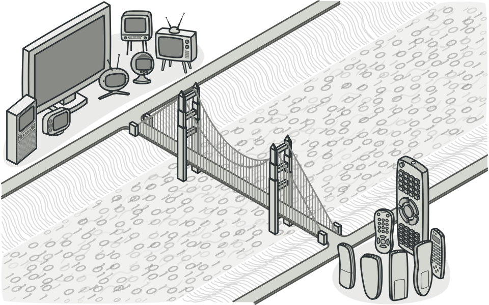
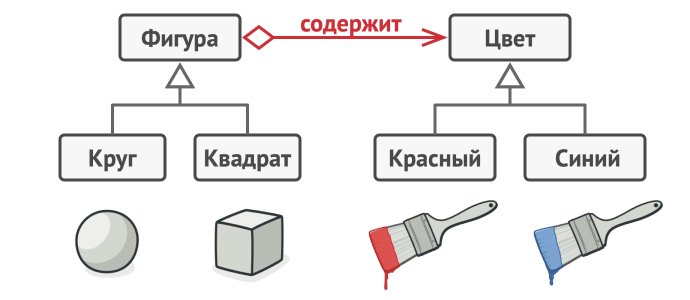
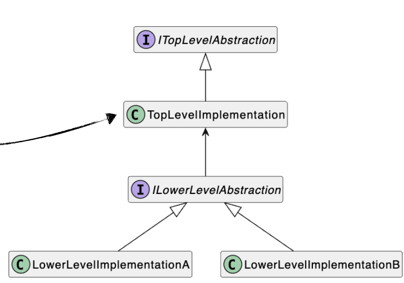

### Bridge (Мост)

Bridge (Мост) - разделение объектной модели на абстракции разных уровней; реализации абстракций более высокого уровня, использующие абстракции более низкого уровня и являются “мостом”

То есть это паттерн проектирования, который разделяет один или несколько классов на две отдельные иерархии — абстракцию и реализацию, позволяя изменять их независимо друг от друга.



Пример:
У вас есть класс геометрических Фигур, который имеет подклассы Круг и Квадрат. Вы хотите расширить иерархию фигур по цвету, то есть иметь Красные и Синие фигуры. Но чтобы всё это объединить, вам придётся создать 4 комбинации подклассов, вроде СиниеКруги и КрасныеКвадраты.


При добавлении новых видов фигур и цветов количество комбинаций будет расти в геометрической прогрессии. Например, чтобы ввести в программу фигуры треугольников, придётся создать сразу два новых подкласса треугольников под каждый цвет. После этого новый цвет потребует создания уже трёх классов для всех видов фигур. Чем дальше, тем хуже.

Корень проблемы заключается в том, что мы пытаемся расширить классы фигур сразу в двух независимых плоскостях — по виду и по цвету. Именно это приводит к разрастанию дерева классов.

Паттерн Мост предлагает заменить наследование агрегацией или композицией. Для этого нужно выделить одну из таких «плоскостей» в отдельную иерархию и ссылаться на объект этой иерархии, вместо хранения его состояния и поведения внутри одного класса.



Рассмотрим другой пример:

Представьте себе, что вы разрабатываете систему управления телевизором. На первый взгляд, всё просто: есть пульт управления и есть сам телевизор. Но вот наступает момент, когда нужно поддержать несколько типов устройств — телевизоры разных марок, проекторы, медиа-плееры. И одновременно нужны разные типы управления: обычный пульт, голосовой помощник, мобильное приложение.

Если вы попытаетесь решить это наивным способом, создав класс TvControl, потом ProjectorControl, потом VoiceControl, потом TvVoiceControl, потом ProjectorVoiceControl — вы получите комбинаторный взрыв классов. Это нарушает Open/Closed Principle: система становится закрытой для расширения без модификации.

Основная проблема в том, что мы смешиваем две независимые оси изменчивости:

1. Абстракция высокого уровня — как мы управляем (пульт, голос, приложение)

2. Абстракция низкого уровня — чем мы управляем (телевизор, проектор, медиа-плеер)

Эти две оси должны изменяться независимо. Мост решает именно эту задачу — он разделяет эти две иерархии.

Простыми словами: мы не делаем одну большую иерархию классов, а создаём две независимые иерархии и соединяем их мостом (через композицию, а не наследование).



Давайте расмотрим как мы это делааем:

Шаг 1: Определяем низкоуровневую абстракцию (устройство)
```csharp
public interface IDevice
{
    public bool IsEnabled { get; set; }
    public int Channel { get; set; }
    public int Volume { get; set; }
}
```

Это абстракция низкого уровня. Она определяет, какие свойства есть у любого устройства, которым можно управлять

То есть это наши устройства: телевизоры, проекторы, плееры и тд. Если бы мы проектировали онлайн-кинотеатры для разных платформ, то это могли бы быть например Ios, Android, Linux, Windows, MacOs и так далее. 

Шаг 2: Определяем высокоуровневую абстракцию (управление)

```csharp
public interface IControl
{
    void ToggleEnabled();
    void ChannelForward();
    void ChannelBackward();
    void VolumeUp();
    void VolumeDown();
}
```

Это абстракция высокого уровня. Она определяет, какие действия может выполнить пользователь


Шаг 3: Реализуем конкретное управление (первый мост)

```csharp
public class Control : IControl
{
    private readonly IDevice _device;

    public Control(IDevice device)
    {
        _device = device;
    }

    public void ToggleEnabled()
    {
        _device.IsEnabled = !_device.IsEnabled;
    }

    public void ChannelForward()
    {
        _device.Channel += 1;
    }

    public void ChannelBackward()
    {
        _device.Channel -= 1;
    }

    public void VolumeUp()
    {
        _device.Volume += 10;
    }

    public void VolumeDown()
    {
        _device.Volume -= 10;
    }
}
```

Попробуем добавить новый тип управления, который специально будет содержать ошибки:
```csharp
public class FaultyControl : IControl
{
    private readonly IDevice _device;

    public FaultyControl(IDevice device)
    {
        _device = device;
    }

    public void ToggleEnabled()
    {
        TryFault();
        _device.IsEnabled = !_device.IsEnabled;
    }

    public void ChannelForward()
    {
        TryFault();
        _device.Channel += 1;
    }

    public void ChannelBackward()
    {
        TryFault();
        _device.Channel -= 1;
    }

    public void VolumeUp()
    {
        TryFault();
        _device.Volume += 10;
    }

    public void VolumeDown()
    {
        TryFault();
        _device.Volume -= 10;
    }

    private void TryFault()
    {
        if (Random.Shared.NextDouble() < 0.5)
        {
            _device.IsEnabled = !_device.IsEnabled;
        }
    }
}
```

мы добавили новый тип управления, не трогая ни одну строчку кода в других классах.

То есть мост можно разбить на другие принципы:

1. способ реализации OCP
```csharp
// Можем добавить новый тип управления без изменения старых
public class VoiceControl : IControl
{
    private readonly IDevice _device;
    
    public void ToggleEnabled() => _device.IsEnabled = !_device.IsEnabled;
    // ... остальные методы
}

// И всё ещё можем использовать с любым устройством
var device = new Tv();
var voiceControl = new VoiceControl(device);
```
2. способ реализации protected variations
Мост защищает высокоуровневую логику от изменений в устройствах. Если завтра мы добавим новый тип устройства, весь код управления остаётся неизменным.

```csharp
// Завтра добавим новый тип устройства
public class SmartFridge : IDevice
{
    public bool IsEnabled { get; set; }
    public int Channel { get; set; }
    public int Volume { get; set; }
}

// Всё управление СРАЗУ работает с холодильником!
var fridge = new SmartFridge();
var control = new Control(fridge);  // Работает!
var faultyControl = new FaultyControl(fridge);  // Тоже работает!
```

3. подвид адаптера отличается тем, что абстракции моста проектируются изначально, а адаптер добавляется в процессе поддержки кода

4. полиморфный билдер + директор = мост

Builder + Director, это тоже создание моста между пользователем (директор) и объектом (строитель).

```csharp
// Директор (высокоуровневая абстракция)
public class SmartHomeDirector
{
    private readonly IDeviceBuilder _builder;

    public SmartHomeDirector(IDeviceBuilder builder)
    {
        _builder = builder;
    }

    public void SetupCinemaMode()
    {
        _builder.SetPower(true);
        _builder.SetVolume(30);
        _builder.SetBrightness(10);
    }
}

// Строитель (низкоуровневая абстракция)
public interface IDeviceBuilder
{
    void SetPower(bool enabled);
    void SetVolume(int level);
    void SetBrightness(int level);
}
```
Или ещё один пример:
```csharp
// Абстракция билдера
public interface IFoodBuilder
{
    void SetDishType(string type);
    void AddIngredient(string name);
    string GetResult();
}

// Билдер для JSON заказа
public class JsonFoodBuilder : IFoodBuilder
{
    private dynamic dish = new System.Dynamic.ExpandoObject();
    public void SetDishType(string type) { dish.Type = type; }
    public void AddIngredient(string name)
    {
        if (dish.Ingredients == null) dish.Ingredients = new List<string>();
        dish.Ingredients.Add(name);
    }
    public string GetResult() => JsonConvert.SerializeObject(dish);
}

// Адаптер для XML на основе JSON билдера
public class XmlFoodBuilderAdapter : IFoodBuilder
{
    private JsonFoodBuilder jsonBuilder = new JsonFoodBuilder();
    public void SetDishType(string type) => jsonBuilder.SetDishType(type);
    public void AddIngredient(string name) => jsonBuilder.AddIngredient(name);
    public string GetResult()
    {
        var json = jsonBuilder.GetResult();
        // Просто пример преобразования JSON → XML, псевдокод
        return JsonToXmlConverter.Convert(json);
    }
}

// Директор — связывает заказ (high-level) и билдер (low-level)
public class FoodDirector
{
    private IFoodBuilder builder;
    public FoodDirector(IFoodBuilder builder) { this.builder = builder; }
    public void MakePizza()
    {
        builder.SetDishType("Pizza");
        builder.AddIngredient("Cheese");
        builder.AddIngredient("Tomato");
    }
    public string GetOrder() => builder.GetResult();
}

// Пример применения — разные комбинации билдера и адаптера
public static void Main()
{
    var jsonDirector = new FoodDirector(new JsonFoodBuilder());
    jsonDirector.MakePizza();
    Console.WriteLine(jsonDirector.GetOrder()); // JSON-строка

    var xmlDirector = new FoodDirector(new XmlFoodBuilderAdapter());
    xmlDirector.MakePizza();
    Console.WriteLine(xmlDirector.GetOrder()); // XML-строка
}
```
Соберём всё в один большой работающий код:
```csharp
public static void Main()
{
    Console.WriteLine("=== ПАТТЕРН МОСТ: СИСТЕМА УПРАВЛЕНИЯ УСТРОЙСТВАМИ ===\n");

    // Создаём устройства
    IDevice tv = new Tv();
    IDevice projector = new Projector();
    IDevice mediaPlayer = new MediaPlayer();

    Console.WriteLine("ИСХОДНОЕ СОСТОЯНИЕ:");
    Console.WriteLine($"  {tv}");
    Console.WriteLine($"  {projector}");
    Console.WriteLine($"  {mediaPlayer}\n");

    // СЦЕНАРИЙ 1: Обычное управление телевизором
    Console.WriteLine("--- СЦЕНАРИЙ 1: Обычное управление телевизором ---");
    IControl tvControl = new Control(tv);
    
    tvControl.ToggleEnabled();
    Console.WriteLine($"После включения: {tvControl}");
    
    tvControl.VolumeUp();
    tvControl.VolumeUp();
    Console.WriteLine($"После увеличения звука: {tvControl}");
    
    tvControl.ChannelForward();
    tvControl.ChannelForward();
    Console.WriteLine($"После переключения канала: {tvControl}\n");

    // СЦЕНАРИЙ 2: Управление проектором с логированием
    Console.WriteLine("--- СЦЕНАРИЙ 2: Управление проектором с логированием ---");
    IControl projectorControl = new LoggingControl(projector);
    
    projectorControl.ToggleEnabled();
    projectorControl.VolumeUp();
    projectorControl.ChannelBackward();
    Console.WriteLine($"Итоговое состояние: {projectorControl}\n");

    // СЦЕНАРИЙ 3: Управление медиа-плеером с задержками
    Console.WriteLine("--- СЦЕНАРИЙ 3: Управление медиа-плеером с задержками (2 секунды) ---");
    IControl delayedControl = new DelayedControl(mediaPlayer, delayMs: 2000);
    
    Console.WriteLine("Включаем медиа-плеер (будет задержка 2 сек)...");
    delayedControl.ToggleEnabled();
    Console.WriteLine($"Готово: {delayedControl}\n");

    // СЦЕНАРИЙ 4: Демонстрация гибкости — один тип управления, разные устройства
    Console.WriteLine("--- СЦЕНАРИЙ 4: Один тип управления (Control) для разных устройств ---");
    
    var devices = new IDevice[] { tv, projector, mediaPlayer };
    var controls = new IControl[] 
    { 
        new Control(tv), 
        new Control(projector), 
        new Control(mediaPlayer) 
    };

    foreach (var control in controls)
    {
        control.ToggleEnabled();
        control.VolumeUp();
    }

    foreach (var device in devices)
    {
        Console.WriteLine($"  {device}");
    }
    Console.WriteLine();

    // СЦЕНАРИЙ 5: Демонстрация КЛЮЧЕВОГО ПРЕИМУЩЕСТВА мостов
    Console.WriteLine("--- СЦЕНАРИЙ 5: Чудо паттерна Мост! ---");
    Console.WriteLine("Создаём новое устройство и новый тип управления");
    Console.WriteLine("БЕЗ изменения кода выше:\n");

    // Новое устройство добавляем после факта
    public class SmartLamp : IDevice
    {
        public bool IsEnabled { get; set; }
        public int Channel { get; set; } = 1;
        public int Volume { get; set; } = 75;
        
        public override string ToString() => 
            $"SmartLamp: {(IsEnabled ? "ON" : "OFF")}, Brightness={Channel * 10}%, Color={Volume}";
    }

    IDevice lamp = new SmartLamp();
    IControl lampControl = new Control(lamp);
    lampControl.ToggleEnabled();
    Console.WriteLine($"Лампа работает: {lampControl}");

    // Новый тип управления добавляем после факта
    IControl lampControlWithLogging = new LoggingControl(lamp);
    lampControlWithLogging.VolumeUp();
    Console.WriteLine($"Лампа с логированием: {lampControlWithLogging}");
}
/*
=== ПАТТЕРН МОСТ: СИСТЕМА УПРАВЛЕНИЯ УСТРОЙСТВАМИ ===

ИСХОДНОЕ СОСТОЯНИЕ:
  TV: OFF, Ch=1, Vol=50
  Projector: OFF, Ch=1, Vol=30
  MediaPlayer: OFF, Ch=1, Vol=40

--- СЦЕНАРИЙ 1: Обычное управление телевизором ---
После включения: TV: ON, Ch=1, Vol=50
После увеличения звука: TV: ON, Ch=1, Vol=70
После переключения канала: TV: ON, Ch=3, Vol=70

--- СЦЕНАРИЙ 2: Управление проектором с логированием ---
[LOG] Toggle: False -> True on Projector
[LOG] Volume: 30 -> 40 on Projector
[LOG] Channel: 1 -> 0 on Projector
Итоговое состояние: Projector: ON, Ch=0, Vol=40

--- СЦЕНАРИЙ 3: Управление медиа-плеером с задержками (2 секунды) ---
Включаем медиа-плеер (будет задержка 2 сек)...
Готово: MediaPlayer: ON, Ch=1, Vol=40

--- СЦЕНАРИЙ 4: Один тип управления (Control) для разных устройств ---
  TV: ON, Ch=1, Vol=70
  Projector: ON, Ch=0, Vol=40
  MediaPlayer: ON, Ch=2, Vol=50

--- СЦЕНАРИЙ 5: Чудо паттерна Мост! ---
Создаём новое устройство и новый тип управления
БЕЗ изменения кода выше:
Лампа работает: SmartLamp: ON, Brightness=10%, Color=75
Лампа с логированием: [LOG] Volume: 75 -> 85 on SmartLamp
SmartLamp: ON, Brightness=10%, Color=85
*/
```

Шаги реализации:
1. Определите, существует ли в ваших классах два непересекающихся измерения. Это может быть функциональность/платформа, предметная-область/инфраструктура, фронт-энд/бэк-энд или интерфейс/реализация.

2. Продумайте, какие операции будут нужны клиентам, и опишите их в базовом классе абстракции.

3. Определите поведения, доступные на всех платформах, и выделите из них ту часть, которая нужна абстракции. На основании этого опишите общий интерфейс реализации.

4. Для каждой платформы создайте свой класс конкретной реализации. Все они должны следовать общему интерфейсу, который мы выделили перед этим.

5. Добавьте в класс абстракции ссылку на объект реализации. Реализуйте методы абстракции, делегируя основную работу связанному объекту реализации.

6. Если у вас есть несколько вариаций абстракции, создайте для каждой из них свой подкласс.

7. Клиент должен подать объект реализации в конструктор абстракции, чтобы связать их воедино. После этого он может свободно использовать объект абстракции, забыв о реализации.

Важно: Мост проектируют загодя, чтобы развивать большие части приложения отдельно друг от друга. Адаптер применяется постфактум, чтобы заставить несовместимые классы работать вместе.

Абстрактная фабрика может работать совместно с Мостом. Это особенно полезно, если у вас есть абстракции, которые могут работать только с некоторыми из реализаций. В этом случае фабрика будет определять типы создаваемых абстракций и реализаций

Паттерн Строитель может быть построен в виде Моста: директор будет играть роль абстракции, а строители — реализации.
