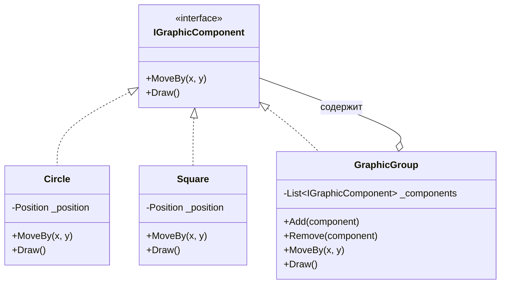
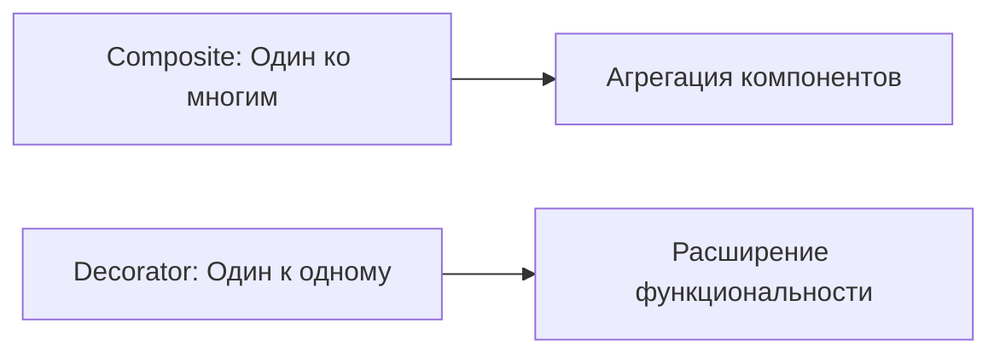

# Composite (Компоновщик)

*Также известен как: Object Tree (Древовидная структура объектов)*

## Содержание

1. [Введение](#введение)
2. [Проблема](#проблема)
3. [Решение](#решение)
4. [Структура паттерна](#структура-паттерна)
5. [Реализация на C#](#реализация-на-c)
6. [Практические примеры](#практические-примеры)
7. [Применимость](#применимость)
8. [Преимущества и недостатки](#преимущества-и-недостатки)
9. [Связь с другими паттернами](#связь-с-другими-паттернами)

## Введение

**Composite** (Компоновщик) — структурный паттерн проектирования, который позволяет создавать древовидные структуры объектов и работать с ними так же, как с единичными объектами.

### Основные термины

- **Leaf** (Лист) — терминальный узел дерева, который не содержит вложенных элементов
- **Composite** (Композит) — составной узел, который содержит коллекцию дочерних элементов
- **Component** (Компонент) — базовый интерфейс или абстрактный класс, определяющий общие операции для листьев и композитов

## Проблема

Представьте, что вы разрабатываете графический редактор, подобный Figma или Adobe Illustrator. В таком редакторе пользователь может:

- Рисовать отдельные фигуры: круги, квадраты, линии
- Группировать эти фигуры вместе
- Группировать уже сгруппированные фигуры, создавая вложенные группы
- Применять операции ко всей группе сразу (например, переместить всю группу на 10 пикселей вправо)

### Сложности без паттерна

Допустим, у вас есть метод `MoveBy()`, который работает для одной фигуры. Что происходит, когда вы хотите применить его к группе из 10 объектов?

```csharp
// ❌ Плохой подход - клиентский код должен знать о структуре
void MoveShapes(List<object> shapes, int x, int y)
{
    foreach (var shape in shapes)
    {
        // Проверка типа - нарушение Open/Closed Principle
        if (shape is Circle circle)
        {
            circle.MoveBy(x, y);
        }
        else if (shape is Square square)
        {
            square.MoveBy(x, y);
        }
        else if (shape is List<object> group)
        {
            // Рекурсия - сложность растёт
            MoveShapes(group, x, y);
        }
    }
}
```

Проблемы этого подхода:

1. **Клиентский код перегружен логикой**: проверки типов, циклы, рекурсия
2. **Нарушение Open/Closed Principle**: при добавлении новых типов фигур нужно изменять клиентский код
3. **Дублирование кода**: похожая логика повторяется в разных местах
4. **Сложность поддержки**: трудно добавлять новые операции

## Решение

Паттерн Компоновщик предлагает обрабатывать отдельные объекты и группы объектов единообразно через общий интерфейс.

### Ключевая идея

*Группа объектов и отдельный объект должны реализовывать один интерфейс. Тогда операции над ними можно применять единообразно, независимо от того, работаем ли мы с одной фигурой или со 100 фигурами в 10 вложенных группах.*

Это создаёт древовидную структуру, где:

- **Листья** (Leaf) — простые объекты: `Circle`, `Square`
- **Композиты** (Composite) — группы объектов: `GraphicGroup`
- **Компонент** (Component) — общий интерфейс: `IGraphicComponent`

Все они выглядят одинаково для клиента, так как реализуют один интерфейс.

## Структура паттерна



Диаграмма показывает:

1. Общий интерфейс `IGraphicComponent` определяет операции для всех элементов
2. Листья (`Circle`, `Square`) реализуют интерфейс напрямую
3. Композит (`GraphicGroup`) также реализует интерфейс, но делегирует операции вложенным компонентам
4. Композит может содержать как листья, так и другие композиты

## Реализация на C#

Рассмотрим пошаговую реализацию паттерна Компоновщик для графического редактора.

### Шаг 1: Вспомогательные типы

```csharp
// Структура для типобезопасного представления позиции объекта
// Использование record struct обеспечивает неизменяемость и value-семантику
public readonly record struct Position(int X, int Y);
```

**Примечание:** Использование `record struct` (C# 10+) даёт нам:
- Неизменяемость (immutability) по умолчанию
- Автоматическую реализацию `Equals` и `GetHashCode`
- Value-семантику (передача по значению)

### Шаг 2: Определение общего интерфейса

```csharp
/// <summary>
/// Базовый интерфейс для всех графических компонентов.
/// Определяет операции, которые можно применять как к отдельным фигурам,
/// так и к группам фигур.
/// </summary>
public interface IGraphicComponent
{
    /// <summary>
    /// Перемещает компонент на заданное смещение.
    /// Для листьев - изменяет позицию объекта.
    /// Для композитов - рекурсивно применяется ко всем вложенным элементам.
    /// </summary>
    void MoveBy(int x, int y);
    
    /// <summary>
    /// Отрисовывает компонент.
    /// Для листьев - рисует сам объект.
    /// Для композитов - рекурсивно отрисовывает все вложенные элементы.
    /// </summary>
    void Draw();
}
```

### Шаг 3: Реализация листьев (Leaf)

Листья — это конечные элементы дерева, которые не содержат вложенных компонентов.

```csharp
/// <summary>
/// Конкретный компонент - Круг.
/// Представляет собой лист дерева (не содержит вложенных элементов).
/// </summary>
public class Circle : IGraphicComponent
{
    private Position _position;
    
    public Circle(int x = 0, int y = 0)
    {
        _position = new Position(x, y);
    }
    
    /// <summary>
    /// Изменяет позицию круга на заданное смещение.
    /// </summary>
    public void MoveBy(int x, int y)
    {
        // Создаём новую позицию с применённым смещением
        _position = new Position(_position.X + x, _position.Y + y);
    }
    
    /// <summary>
    /// Выводит информацию о круге в консоль.
    /// </summary>
    public void Draw()
    {
        Console.WriteLine($"Круг в позиции ({_position.X}, {_position.Y})");
    }
}

/// <summary>
/// Конкретный компонент - Квадрат.
/// Представляет собой лист дерева (не содержит вложенных элементов).
/// </summary>
public class Square : IGraphicComponent
{
    private Position _position;
    
    public Square(int x = 0, int y = 0)
    {
        _position = new Position(x, y);
    }
    
    /// <summary>
    /// Изменяет позицию квадрата на заданное смещение.
    /// </summary>
    public void MoveBy(int x, int y)
    {
        _position = new Position(_position.X + x, _position.Y + y);
    }
    
    /// <summary>
    /// Выводит информацию о квадрате в консоль.
    /// </summary>
    public void Draw()
    {
        Console.WriteLine($"Квадрат в позиции ({_position.X}, {_position.Y})");
    }
}
```

**Важно:** Оба класса реализуют одинаковый интерфейс, что позволяет работать с ними единообразно.

### Шаг 4: Реализация композита (Composite)

Композит — это контейнер, который может содержать как листья, так и другие композиты.

```csharp
/// <summary>
/// Композитный компонент - Группа графических элементов.
/// Может содержать как простые компоненты (листья), так и другие группы (композиты).
/// Делегирует операции всем своим вложенным элементам.
/// </summary>
public class GraphicGroup : IGraphicComponent
{
    // Коллекция вложенных компонентов
    // Использование List<T> позволяет динамически добавлять и удалять элементы
    private readonly List<IGraphicComponent> _components = new();
    
    /// <summary>
    /// Добавляет компонент в группу.
    /// Компонент может быть как листом (Circle, Square), так и другой группой.
    /// </summary>
    public void Add(IGraphicComponent component)
    {
        // Проверка на null предотвращает добавление невалидных ссылок
        ArgumentNullException.ThrowIfNull(component);
        _components.Add(component);
    }
    
    /// <summary>
    /// Удаляет компонент из группы.
    /// </summary>
    public void Remove(IGraphicComponent component)
    {
        _components.Remove(component);
    }
    
    /// <summary>
    /// Перемещает всю группу, делегируя операцию каждому вложенному компоненту.
    /// Если вложенный компонент - это группа, операция применяется рекурсивно.
    /// </summary>
    public void MoveBy(int x, int y)
    {
        // Делегирование операции всем дочерним элементам
        foreach (var component in _components)
        {
            component.MoveBy(x, y);
        }
    }
    
    /// <summary>
    /// Отрисовывает все компоненты группы.
    /// Вызывает Draw() для каждого вложенного элемента.
    /// </summary>
    public void Draw()
    {
        Console.WriteLine("--- Начало группы ---");
        foreach (var component in _components)
        {
            component.Draw();
        }
        Console.WriteLine("--- Конец группы ---");
    }
}
```

**Ключевые моменты:**

1. `GraphicGroup` реализует тот же интерфейс `IGraphicComponent`, что и листья
2. Методы `MoveBy()` и `Draw()` делегируют вызовы всем вложенным компонентам
3. Благодаря полиморфизму, группа не знает, с чем работает — с листом или другой группой
4. Рекурсия происходит автоматически: если вложенный элемент — это группа, она вызовет методы у своих элементов

## Практические примеры

### Пример 1: Работа с простой группой

```csharp
// Создаём отдельные фигуры с начальными позициями
var circle = new Circle(1, 2);
var square = new Square(10, 0);

// Создаём группу и добавляем фигуры
var group = new GraphicGroup();
group.Add(circle);
group.Add(square);

// Отрисовываем всё содержимое группы
group.Draw();
/* Вывод:
--- Начало группы ---
Круг в позиции (1, 2)
Квадрат в позиции (10, 0)
--- Конец группы ---
*/

Console.WriteLine("\n--- После перемещения ---\n");

// Перемещаем ВСЮ группу на (1, 1)
// Это автоматически переместит все вложенные элементы
group.MoveBy(1, 1);

// Отрисовываем снова
group.Draw();
/* Вывод:
--- Начало группы ---
Круг в позиции (2, 3)      // было (1, 2) → добавили (1, 1)
Квадрат в позиции (11, 1)  // было (10, 0) → добавили (1, 1)
--- Конец группы ---
*/
```

**Обратите внимание:** Клиентский код вызывает `MoveBy()` только один раз на группе, а операция автоматически применяется ко всем элементам.

### Пример 2: Вложенные группы (композиция композитов)

```csharp
// Создаём первую группу с двумя фигурами
var circle1 = new Circle(0, 0);
var square1 = new Square(5, 5);

var group1 = new GraphicGroup();
group1.Add(circle1);
group1.Add(square1);

// Создаём вторую группу с одной фигурой
var circle2 = new Circle(20, 20);

var group2 = new GraphicGroup();
group2.Add(circle2);

// Создаём СУПЕРГРУППУ, которая содержит две группы
// Это демонстрирует рекурсивную природу паттерна
var superGroup = new GraphicGroup();
superGroup.Add(group1);  // Добавляем первую группу
superGroup.Add(group2);  // Добавляем вторую группу

// Перемещаем всю иерархию одной командой
superGroup.MoveBy(10, 10);

// Отрисовываем всю структуру
superGroup.Draw();
/* Вывод:
--- Начало группы ---
--- Начало группы ---
Круг в позиции (10, 10)    // было (0, 0) → добавили (10, 10)
Квадрат в позиции (15, 15) // было (5, 5) → добавили (10, 10)
--- Конец группы ---
--- Начало группы ---
Круг в позиции (30, 30)    // было (20, 20) → добавили (10, 10)
--- Конец группы ---
--- Конец группы ---
*/
```

**Важный момент:** Супергруппа не знает, что она содержит другие группы. Для неё все элементы — это просто объекты `IGraphicComponent`. Рекурсия работает автоматически благодаря полиморфизму.

### Пример 3: Единообразная обработка

Продемонстрируем главное преимущество паттерна — единообразную обработку объектов.

```csharp
/// <summary>
/// Метод, который работает с любым графическим компонентом.
/// Он не знает и не должен знать, что именно получает - лист или композит.
/// </summary>
void ProcessComponent(IGraphicComponent component)
{
    // Одна и та же операция работает для всех типов
    component.MoveBy(5, 5);
    component.Draw();
}

// Создаём различные компоненты
var singleCircle = new Circle(0, 0);
var singleSquare = new Square(10, 10);

var simpleGroup = new GraphicGroup();
simpleGroup.Add(new Circle(20, 20));
simpleGroup.Add(new Square(25, 25));

var complexGroup = new GraphicGroup();
complexGroup.Add(simpleGroup);
complexGroup.Add(new Circle(30, 30));

// ✅ Все вызовы идентичны - клиентский код не различает типы
ProcessComponent(singleCircle);   // Обработка одного круга
ProcessComponent(singleSquare);   // Обработка одного квадрата
ProcessComponent(simpleGroup);    // Обработка группы фигур
ProcessComponent(complexGroup);   // Обработка вложенной группы
```

**Ключевое преимущество:** Клиентский код не содержит проверок типов, условных операторов или явной рекурсии. Вся сложность скрыта внутри паттерна.

### Пример 4: Динамическое построение дерева

```csharp
/// <summary>
/// Пример построения сложной иерархии во время выполнения.
/// Имитирует создание сцены в графическом редакторе.
/// </summary>
void BuildComplexScene()
{
    // Создаём "слой фона"
    var backgroundLayer = new GraphicGroup();
    backgroundLayer.Add(new Square(0, 0));
    backgroundLayer.Add(new Square(100, 0));
    backgroundLayer.Add(new Square(0, 100));
    
    // Создаём "слой персонажа"
    var characterLayer = new GraphicGroup();
    
    // Тело персонажа
    var body = new GraphicGroup();
    body.Add(new Circle(50, 50));    // Голова
    body.Add(new Square(50, 70));    // Туловище
    
    characterLayer.Add(body);
    
    // Создаём полную сцену
    var scene = new GraphicGroup();
    scene.Add(backgroundLayer);
    scene.Add(characterLayer);
    
    // Перемещаем всю сцену целиком
    scene.MoveBy(10, 10);
    
    // Отрисовываем результат
    Console.WriteLine("=== Полная сцена ===");
    scene.Draw();
}

BuildComplexScene();
```

### Антипаттерн: Нарушение принципа единого интерфейса

Рассмотрим типичную ошибку при реализации Composite:

```csharp
// ❌ АНТИПАТТЕРН: Разные интерфейсы для листьев и композитов
public interface ILeaf
{
    void Draw();
}

public interface IComposite
{
    void Add(ILeaf leaf);
    void DrawAll();  // Другой метод!
}

// Проблема: клиент должен знать, с чем работает
void BadClientCode(object component)
{
    if (component is ILeaf leaf)
    {
        leaf.Draw();
    }
    else if (component is IComposite composite)
    {
        composite.DrawAll();  // Разные методы для разных типов
    }
}
```

**Почему это плохо:**
1. Клиентский код привязан к конкретным типам
2. Нарушается Open/Closed Principle
3. Теряется основное преимущество паттерна — единообразие

**Правильный подход:**

```csharp
// ✅ ПРАВИЛЬНО: Единый интерфейс для всех
public interface IComponent
{
    void Draw();  // Один и тот же метод для всех
}

// Клиент работает единообразно
void GoodClientCode(IComponent component)
{
    component.Draw();  // Работает для любого типа
}
```

## Применимость

Паттерн Composite следует использовать в следующих ситуациях:

### 1. Древовидная структура объектов

Используйте Composite, когда вам нужно представить иерархию объектов типа "часть-целое".

Паттерн позволяет хранить в составных объектах ссылки на другие простые или составные объекты. Те, в свою очередь, тоже могут хранить свои вложенные объекты. В итоге вы можете строить сложную древовидную структуру, используя всего два типа объектов: листья и композиты.

### 2. Единообразная обработка объектов

Применяйте паттерн, когда клиентский код должен одинаково работать с простыми и составными объектами.

Благодаря общему интерфейсу, клиенту не нужно знать, с каким именно объектом он работает. Это упрощает код и делает его более гибким.

### 3. Рекурсивные операции

Используйте Composite, когда операции должны применяться рекурсивно ко всей структуре.

Вместо написания циклов и условий в клиентском коде, вы делегируете рекурсию самим объектам.

## Реальные примеры применения

### 1. Графические редакторы и UI-фреймворки

В Windows Forms, WPF, WinUI или других UI-фреймворках контейнеры могут содержать другие контейнеры и элементы управления.

```csharp
// Пример из WPF
var panel = new StackPanel();           // Композит
panel.Children.Add(new Button());       // Лист
panel.Children.Add(new TextBox());      // Лист

var anotherPanel = new WrapPanel();     // Композит
anotherPanel.Children.Add(panel);       // Композит содержит композит

// Операции применяются ко всему дереву
panel.IsEnabled = false;  // Отключает все вложенные элементы
```

### 2. Файловые системы

Классический пример: директория может содержать файлы и другие директории.

```csharp
public interface IFileSystemItem
{
    string Name { get; }
    long GetSize();
    void Delete();
}

public class File : IFileSystemItem
{
    public string Name { get; init; }
    private readonly long _size;
    
    public File(string name, long size)
    {
        Name = name;
        _size = size;
    }
    
    // Размер файла - это его собственный размер
    public long GetSize() => _size;
    
    public void Delete()
    {
        Console.WriteLine($"Удаление файла {Name}");
        // Логика удаления файла
    }
}

public class Directory : IFileSystemItem
{
    public string Name { get; init; }
    private readonly List<IFileSystemItem> _items = new();
    
    public Directory(string name)
    {
        Name = name;
    }
    
    public void Add(IFileSystemItem item) => _items.Add(item);
    
    // Размер директории - сумма размеров всех вложенных элементов
    public long GetSize()
    {
        return _items.Sum(item => item.GetSize());
    }
    
    // Удаление директории удаляет все вложенные элементы
    public void Delete()
    {
        Console.WriteLine($"Удаление директории {Name}");
        foreach (var item in _items)
        {
            item.Delete();  // Рекурсивное удаление
        }
    }
}

// Использование
var root = new Directory("root");
var docs = new Directory("documents");
docs.Add(new File("report.pdf", 1024));
docs.Add(new File("notes.txt", 256));

root.Add(docs);
root.Add(new File("readme.md", 512));

// Получаем размер всей структуры одним вызовом
long totalSize = root.GetSize();  // 1024 + 256 + 512 = 1792

// Удаляем всю структуру одним вызовом
root.Delete();
```

### 3. DOM-дерево в веб-приложениях

HTML-элементы могут содержать другие элементы, формируя дерево DOM.

```csharp
// Упрощённая модель DOM
public interface IHtmlElement
{
    void Render();
    void SetAttribute(string name, string value);
}

public class TextNode : IHtmlElement
{
    private readonly string _text;
    
    public TextNode(string text) => _text = text;
    
    public void Render() => Console.Write(_text);
    public void SetAttribute(string name, string value) { }  // Текст не имеет атрибутов
}

public class HtmlElement : IHtmlElement
{
    private readonly string _tagName;
    private readonly List<IHtmlElement> _children = new();
    private readonly Dictionary<string, string> _attributes = new();
    
    public HtmlElement(string tagName) => _tagName = tagName;
    
    public void Add(IHtmlElement child) => _children.Add(child);
    
    public void SetAttribute(string name, string value)
    {
        _attributes[name] = value;
        
        // Можно распространить атрибут на дочерние элементы
        foreach (var child in _children)
        {
            child.SetAttribute(name, value);
        }
    }
    
    public void Render()
    {
        Console.Write($"<{_tagName}");
        foreach (var attr in _attributes)
        {
            Console.Write($" {attr.Key}=\"{attr.Value}\"");
        }
        Console.Write(">");
        
        foreach (var child in _children)
        {
            child.Render();
        }
        
        Console.WriteLine($"</{_tagName}>");
    }
}

// Использование
var div = new HtmlElement("div");
div.Add(new HtmlElement("h1") { }.AddText("Заголовок"));
div.Add(new TextNode("Параграф текста"));

div.SetAttribute("class", "container");
div.Render();
```

### 4. Организационные структуры

Компании состоят из отделов, которые содержат подразделения и сотрудников.

```csharp
public interface IOrganizationUnit
{
    string Name { get; }
    decimal GetBudget();
    int GetEmployeeCount();
}

public class Employee : IOrganizationUnit
{
    public string Name { get; init; }
    private readonly decimal _salary;
    
    public Employee(string name, decimal salary)
    {
        Name = name;
        _salary = salary;
    }
    
    public decimal GetBudget() => _salary;
    public int GetEmployeeCount() => 1;
}

public class Department : IOrganizationUnit
{
    public string Name { get; init; }
    private readonly List<IOrganizationUnit> _units = new();
    
    public Department(string name) => Name = name;
    
    public void Add(IOrganizationUnit unit) => _units.Add(unit);
    
    // Бюджет отдела = сумма бюджетов всех подразделений
    public decimal GetBudget()
    {
        return _units.Sum(unit => unit.GetBudget());
    }
    
    // Количество сотрудников = сумма во всех подразделениях
    public int GetEmployeeCount()
    {
        return _units.Sum(unit => unit.GetEmployeeCount());
    }
}

// Использование
var company = new Department("IT Компания");

var development = new Department("Разработка");
development.Add(new Employee("Иван Иванов", 100000));
development.Add(new Employee("Пётр Петров", 120000));

var qa = new Department("Тестирование");
qa.Add(new Employee("Сидор Сидоров", 80000));

company.Add(development);
company.Add(qa);

Console.WriteLine($"Общий бюджет: {company.GetBudget()}");           // 300000
Console.WriteLine($"Всего сотрудников: {company.GetEmployeeCount()}"); // 3
```

### 5. Системы меню

Меню может содержать пункты меню и подменю.

```csharp
public interface IMenuItem
{
    void Execute();
    void Enable(bool enabled);
}

public class MenuCommand : IMenuItem
{
    private readonly string _name;
    private readonly Action _action;
    private bool _enabled = true;
    
    public MenuCommand(string name, Action action)
    {
        _name = name;
        _action = action;
    }
    
    public void Execute()
    {
        if (_enabled)
        {
            Console.WriteLine($"Выполнение: {_name}");
            _action?.Invoke();
        }
    }
    
    public void Enable(bool enabled) => _enabled = enabled;
}

public class SubMenu : IMenuItem
{
    private readonly string _name;
    private readonly List<IMenuItem> _items = new();
    private bool _enabled = true;
    
    public SubMenu(string name) => _name = name;
    
    public void Add(IMenuItem item) => _items.Add(item);
    
    public void Execute()
    {
        if (!_enabled) return;
        
        Console.WriteLine($"Меню: {_name}");
        foreach (var item in _items)
        {
            item.Execute();
        }
    }
    
    // Отключение меню отключает все вложенные элементы
    public void Enable(bool enabled)
    {
        _enabled = enabled;
        foreach (var item in _items)
        {
            item.Enable(enabled);
        }
    }
}

// Использование
var fileMenu = new SubMenu("Файл");
fileMenu.Add(new MenuCommand("Открыть", () => Console.WriteLine("Открытие файла...")));
fileMenu.Add(new MenuCommand("Сохранить", () => Console.WriteLine("Сохранение файла...")));

var editMenu = new SubMenu("Редактирование");
editMenu.Add(new MenuCommand("Копировать", () => Console.WriteLine("Копирование...")));
editMenu.Add(new MenuCommand("Вставить", () => Console.WriteLine("Вставка...")));

var mainMenu = new SubMenu("Главное меню");
mainMenu.Add(fileMenu);
mainMenu.Add(editMenu);

// Отключаем всё меню целиком
mainMenu.Enable(false);
mainMenu.Execute();  // Ничего не произойдёт
```

## Преимущества и недостатки

### Преимущества

1. **Упрощение клиентского кода**
   - Клиент работает со всеми объектами через единый интерфейс
   - Не нужны проверки типов и условные операторы
   - Код становится чище и понятнее

2. **Гибкость структуры**
   - Легко добавлять новые типы компонентов
   - Структура может изменяться динамически во время выполнения
   - Поддержка любого уровня вложенности

3. **Соблюдение принципов SOLID**
   - Open/Closed Principle: новые компоненты добавляются без изменения существующего кода
   - Single Responsibility: каждый класс отвечает только за свою часть
   - Liskov Substitution Principle: листья и композиты взаимозаменяемы

4. **Рекурсивные операции работают естественно**
   - Не нужно писать рекурсию в клиентском коде
   - Операции автоматически распространяются по дереву

### Недостатки

1. **Сложность при ограничениях на композицию**
   - Если нужны ограничения на типы дочерних элементов, паттерн становится сложнее
   - Например, если определённый композит может содержать только определённые типы листьев

2. **Излишняя общность интерфейса**
   - Интерфейс должен быть достаточно общим для листьев и композитов
   - Иногда это приводит к методам, которые не имеют смысла для некоторых типов

3. **Сложность управления состоянием**
   - При изменении состояния композита нужно синхронизировать дочерние элементы
   - Может потребоваться дополнительная логика для обеспечения консистентности

## Связь с другими паттернами

### Decorator

Оба паттерна работают с рекурсивными структурами, но имеют разные цели:

- **Composite** — организует объекты в древовидную структуру для представления иерархии "часть-целое"
- **Decorator** — динамически добавляет объектам новые обязанности



### Iterator

Часто используется вместе с Composite для обхода дерева объектов.

```csharp
public class GraphicGroup : IGraphicComponent, IEnumerable<IGraphicComponent>
{
    private readonly List<IGraphicComponent> _components = new();
    
    // Поддержка итерации
    public IEnumerator<IGraphicComponent> GetEnumerator()
    {
        return _components.GetEnumerator();
    }
    
    IEnumerator IEnumerable.GetEnumerator()
    {
        return GetEnumerator();
    }
}
```

### Chain of Responsibility

Может использоваться совместно с Composite, когда запрос передаётся по дереву объектов до тех пор, пока не будет обработан.

### Visitor

Позволяет выполнять операции над всеми элементами структуры Composite без изменения их классов.

```csharp
public interface IGraphicComponentVisitor
{
    void Visit(Circle circle);
    void Visit(Square square);
    void Visit(GraphicGroup group);
}

public interface IGraphicComponent
{
    void Accept(IGraphicComponentVisitor visitor);
}
```

## Ключевые концепции

Паттерн Composite учит нас важным принципам проектирования:

### 1. Абстрактное мышление

Вместо написания отдельного кода для "одного объекта" и отдельного кода для "группы объектов", мы определяем единую абстракцию, которая работает в обоих случаях.

### 2. Рекурсивное мышление

Операция над группой — это применение операции ко всем элементам группы. Если элемент сам является группой, операция применяется рекурсивно.

### 3. Принцип единообразия

Клиентский код не должен зависеть от того, работает ли он с простым объектом или со сложной структурой. Это достигается через общий интерфейс.

### 4. Делегирование ответственности

Каждый объект отвечает только за себя. Композит не выполняет работу сам — он делегирует её своим компонентам.

## Заключение

Паттерн Composite — мощный инструмент для работы с древовидными структурами. Он позволяет:

- Строить сложные иерархии из простых объектов
- Работать единообразно с отдельными объектами и их группами
- Писать чистый, расширяемый код без проверок типов
- Естественным образом реализовывать рекурсивные операции

Используйте этот паттерн, когда вам нужна гибкая древовидная структура с единообразной обработкой элементов на всех уровнях иерархии.
