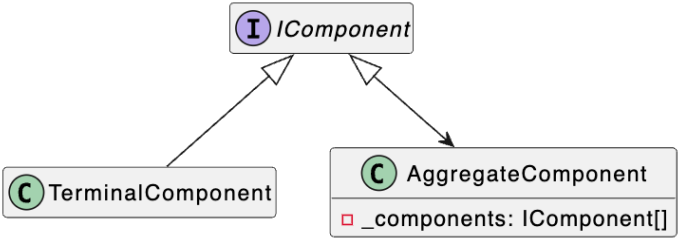

### Composite (компоновщик)

###### Также известен как: Дерево (Object tree)

Компоновщик - представление древовидной структуры
объектов в виде одного композитного объекта

Терминальные узлы – узлы, которые не содержат другие узлы

Агрегатные узлы – узлы, которые содержат другие узлы



Представьте, что вы разрабатываете графический редактор — что-то вроде Figma или Adobe Illustrator. В таком редакторе пользователь может:

- Рисовать отдельные фигуры: круги, квадраты, линии
- Группировать эти фигуры вместе
- Группировать уже сгруппированные фигуры — создавая вложенные группы
- Применять операции ко всей группе сразу (например, сдвинуть всё вместе на 10 пикселей вправо)

Вот в чём проблема: если у вас есть метод MoveBy(), который работает для одного круга, но вы захотели применить его к группе из 10 объектов — что делать? Вы не можете просто вызвать MoveBy() на массиве. Вам нужно обойти все элементы в цикле. А что если внутри этого массива есть ещё группы? Тогда нужна рекурсия. Получается беспорядок.

Ещё хуже: клиентский код становится сложным — где-то циклы, где-то условия, проверка типов, рекурсия. Это нарушает принцип открытости/закрытости (Open/Closed Principle) — при добавлении новых типов объектов клиентский код ломается.

Решение: паттерн Компоновщик предлагает обрабатывать отдельные объекты и группы объектов одинаково — через единый интерфейс.

Ключевая идея очень простая и элегантная:

"Группа объектов и отдельный объект должны подчиняться одному контракту (интерфейсу). Тогда операции над ними можно применять единообразно, независимо от того, работаем ли мы с одной фигурой или со 100 фигур в 10 вложенных группах."

Это создаёт древовидную структуру, где:

Листья дерева (терминальные узлы) — это простые объекты: Circle, Square

Внутренние узлы (агрегатные узлы) — это группы: GraphicComponentGroup

Но все они выглядят одинаково для клиента — все реализуют IGraphicComponent.

Напишем какой-нибудь такой код:

```csharp
public readonly record struct Position(int X, int Y);
```

Это просто вспомогательная структура для хранения координат. Ничего сложного — просто удобно иметь типобезопасное представление позиции вместо двух отдельных int.

Шаг 2: Определяем единый интерфейс

```csharp
public interface IGraphicComponent
{
    void MoveBy(int x, int y);
    void Draw();
}
```

- MoveBy() — применяется как к одной фигуре, так и ко всей группе
- Draw() — рисует объект или всю группу

Шаг 3: Реализуем листья дерева (простые объекты)

```csharp
public class Circle : IGraphicComponent
{
    private Position _position;
    
    public void MoveBy(int x, int y)
    {
        _position = new Position(_position.X + x, _position.Y + y);
    }
    
    public void Draw()
    {
        Console.WriteLine($"Circle: {_position.X}, {_position.Y}");
    }
}

public class Square : IGraphicComponent
{
    private Position _position;
    
    public void MoveBy(int x, int y)
    {
        _position = new Position(_position.X + x, _position.Y + y);
    }
    
    public void Draw()
    {
        Console.WriteLine($"Square: {_position.X}, {_position.Y}");
    }
}
```

Шаг 4: Реализуем внутренние узлы (группы)

```csharp
public class GraphicComponentGroup : IGraphicComponent
{
    private readonly IReadOnlyCollection<IGraphicComponent> _components;
    
    public GraphicComponentGroup(IReadOnlyCollection<IGraphicComponent> components)
    {
        _components = components;
    }
    
    public void MoveBy(int x, int y)
    {
        foreach (var component in _components)
            component.MoveBy(x, y);
    }
    
    public void Draw()
    {
        foreach (var component in _components)
            component.Draw();
    }
}
```

- _components — хранит коллекцию элементов, которые тоже реализуют IGraphicComponent. Это могут быть Circle, Square или другие GraphicComponentGroup!

- MoveBy() — вместо того, чтобы сдвигаться сама, делегирует вызов всем своим компонентам. Каждый компонент отвечает за себя. Если это Circle — он сдвинется сам. Если это GroupicComponentGroup — та рекурсивно передаст команду своим элементам.

- Draw() — аналогично, просто вызывает Draw() у всех компонентов.

- GraphicComponentGroup тоже реализует IGraphicComponent. Это означает, что его можно положить в другую GroupicComponentGroup! Вложенность на любую глубину работает автоматически.

Теперь посмотрим, как это работает на практике:
```csharp
// Создаём отдельные фигуры
var circle = new Circle();
circle.MoveBy(1, 2);  // Circle переместилась в позицию (1, 2)

var square = new Square();
square.MoveBy(10, 0);  // Square переместилась в позицию (10, 0)

// Создаём группу из этих фигур
var composite = new GraphicComponentGroup([circle, square]);

// Рисуем всё
composite.Draw();
// Вывод:
// Circle: 1, 2
// Square: 10, 0

Console.WriteLine("----");

// Смещаем ВСЮ группу на (1, 1)
composite.MoveBy(1, 1);

// Рисуем снова
composite.Draw();
// Вывод:
// Circle: 2, 3      (было 1, 2 → добавили 1, 1)
// Square: 11, 1     (было 10, 0 → добавили 1, 1)
```
Теперь давайте усложним пример
```csharp
// Создаём первую группу
var circle1 = new Circle();
circle1.MoveBy(0, 0);

var square1 = new Square();
square1.MoveBy(5, 5);

var group1 = new GraphicComponentGroup([circle1, square1]);

// Создаём вторую группу
var circle2 = new Circle();
circle2.MoveBy(20, 20);

var group2 = new GraphicComponentGroup([circle2]);

// СОЗДАЁМ СУПЕРГРУППУ — группу групп!
var superGroup = new GraphicComponentGroup([group1, group2]);

// Смещаем ВСЁ на (10, 10)
superGroup.MoveBy(10, 10);

// Рисуем
superGroup.Draw();
// Вывод:
// Circle: 10, 10     (было 0, 0 → добавили 10, 10)
// Square: 15, 15     (было 5, 5 → добавили 10, 10)
// Circle: 30, 30     (было 20, 20 → добавили 10, 10)
```

Где это применяется в реальности?

1. Графические редакторы и UI фреймворки — контролы, которые содержат другие контролы (Panel содержит Button, который содержит другие контролы). Операции стиля, позиционирования применяются ко всему дереву.

2. Файловые системы — директория содержит файлы и другие директории. Операция "удалить всё" или "подсчитать размер" работает рекурсивно.

3. DOM в браузере — элемент может содержать другие элементы. querySelector(), применение стилей работают по дереву DOM.

4. Структуры организации — отдел содержит подразделения и сотрудников. Операции распространяются по иерархии.

5. Системы меню — меню содержит пункты и подменю. Отключение меню отключает всё внутри.

Применимость:

- **Когда вам нужно представить древовидную структуру объектов.**
Паттерн Компоновщик предлагает хранить в составных объектах ссылки на другие простые или составные объекты. Те, в свою очередь, тоже могут хранить свои вложенные объекты и так далее. В итоге вы можете строить сложную древовидную структуру данных, используя всего две основные разновидности объектов.

- **Когда клиенты должны единообразно трактовать простые и составные объекты.**
Благодаря тому, что простые и составные объекты реализуют общий интерфейс, клиенту безразлично, с каким именно объектом ему предстоит работать.

- **Паттерн учит нас мыслить абстрактно и рекурсивно:**
Абстрактно: вместо того, чтобы писать специальный код для "одной фигуры" и специальный код для "группы", мы определяем единую абстракцию
Рекурсивно: операция на группе = применить операцию ко всем элементам группы (и если они тоже группы, то рекурсивно)
