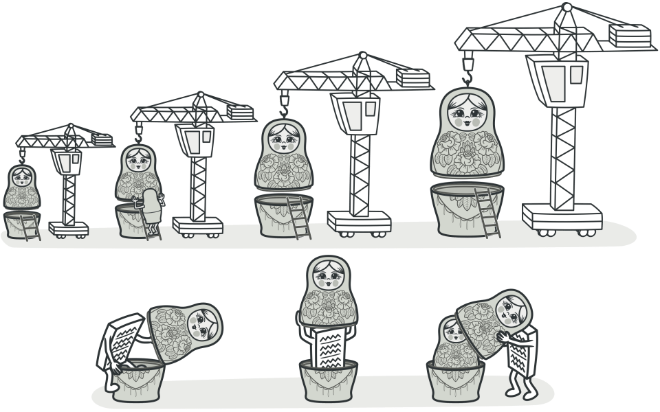

### Decorator (Декоратор)

*Декоратор* - тип-обёртка над объектом абстракции, которую он реализует добавляет к поведениям объекта новую логику

*Абстракция* - какой-либо интерфейс, определяющий поведения

*Декоратор* - тип, реализующий абстракцию, содержащий объект данной абстракции

*Decoratee* - объект, типа, реализующего абстракцию, оборачиваемый в декоратор

Представьте, что у вас есть какой-нибудь класс, который выполняет базовую работу — например, Service, который обрабатывает запросы.
```csharp
public interface IService
{
    void DoStuff(DoStuffArgs args);
}

public class Service : IService
{
    public void DoStuff(DoStuffArgs args)
    {
        // Основная бизнес-логика, которую мы хотим расширить
        Console.WriteLine("Service: выполняю основную работу");
    }
}
```

IService - это просто какая-то абстракция 
Service - это decoratee

Со временем требования растут:

- "Нам нужно логировать все вызовы"
- "Нужно добавить кэширование"
- "Требуется проверка прав доступа перед каждым запросом"
- "Давайте добавим метрики производительности"
- "А может, сжимать данные перед отправкой?"

И так далее. Вот в чём проблема: если вы всё это добавите прямо в класс Service, он станет огромным слишком большим со множеством ответственностей. Это нарушает принцип единственной ответственности (Single Responsibility Principle).

Вы можете создать ServiceWithLogging : Service, затем ServiceWithLoggingAndCaching : ServiceWithLogging, затем ServiceWithLoggingAndCachingAndValidation : ServiceWithLoggingAndCaching... Это приводит к комбинаторному взрыву подклассов. Если у вас есть 5 функций (логирование, кэширование, валидация, метрики, сжатие), вы получите 2^5 = 32 различных комбинации. Это бяка.

паттерн Декоратор предлагает оборачивать объект в специальные обёртки, каждая из которых добавляет одну функцию

Вместо того, чтобы добавлять функциональность через наследование или расширение класса, обёрнуть объект в другой объект, который реализует тот же интерфейс, но добавляет новое поведение.

Декоратор работает как русская матрёшка:

- В центре — оригинальный объект (Service)
- Вокруг него — декоратор логирования (LoggingServiceDecorator)
- Вокруг логирования — декоратор кэширования (CachingServiceDecorator)
- И так далее...



Для клиента это выглядит как просто IService, но на самом деле это цепочка обёрток, каждая из которых добавляет что-то своё.

Реализуем первый декоратор:

```csharp
public class LoggingServiceDecorator : IService
{
    private readonly IService _decoratee;
    private readonly ILogger _logger;

    public LoggingServiceDecorator(IService decoratee, ILogger logger)
    {
        _decoratee = decoratee;
        _logger = logger;
    }

    public void DoStuff(DoStuffArgs args)
    {
        // Шаг 1: делаем "свою" работу — логирование
        _logger.Log(ArgsToLogMessage(args));
        
        // Шаг 2: передаём управление дальше по цепочке
        _decoratee.DoStuff(args);
    }

    private static string ArgsToLogMessage(DoStuffArgs args)
    {
        return $"Called with: {args.ToString()}";
    }
}
```

- _decoratee — это ссылка на объект, который мы обёртываем. Может быть чистый Service или другой декоратор.

- Конструктор принимает IService (это может быть кто угодно) и ILogger (инструмент для логирования).

- DoStuff() — выполняет два действия:

    1. Добавляет своё поведение — вызывает логирование
    2. Передаёт управление дальше — вызывает _decoratee.DoStuff(args)

Вот как можно это применить:
```csharp
IService service = new Service();
IService logged = new LoggingServiceDecorator(service, logger);

logged.DoStuff(new DoStuffArgs { Value = 42 });
```

При этом мы можем создать несколько декораторов и каждый из них будет добавлять свой фукнционал, то есть можем составить "цепочку" декораторов:

```csharp
// Создаём "русскую матрёшку"
IService service = new Service();
IService validated = new ValidationServiceDecorator(service);
IService cached = new CachingServiceDecorator(validated);
IService logged = new LoggingServiceDecorator(cached, logger);

// Работаем с ней
logged.DoStuff(new DoStuffArgs { Value = 42 });
```

LoggingServiceDecorator логирует

Передаёт управление CachingServiceDecorator

CachingServiceDecorator проверяет кэш

Передаёт управление ValidationServiceDecorator

ValidationServiceDecorator валидирует

Передаёт управление Service

Service выполняет работу

Контроль идёт обратно вверх по цепочке

Красота паттерна: порядок можно менять! Если нам нужна кэш-первая стратегия, то нам достаточно поместить её выше:
```charp
IService service = new Service();
IService logged = new LoggingServiceDecorator(service, logger);
IService validated = new ValidationServiceDecorator(logged);
IService cached = new CachingServiceDecorator(validated);

// Теперь кэш выше в иерархии!
```

Соберём всё вместе в один большой пример:
```csharp
using System;
using System.Collections.Generic;

public class DoStuffArgs
{
    public int Value { get; set; }
    public override string ToString() => $"Value={Value}";
}

public interface IService
{
    string DoStuff(DoStuffArgs args);
}

// Оригинальный сервис (ядро матрёшки)
public class Service : IService
{
    public string DoStuff(DoStuffArgs args)
    {
        Console.WriteLine($"[SERVICE] Выполняю работу с {args}");
        return $"Result for {args.Value}";
    }
}

// Декоратор: логирование
public class LoggingServiceDecorator : IService
{
    private readonly IService _decoratee;

    public LoggingServiceDecorator(IService decoratee)
    {
        _decoratee = decoratee;
    }

    public string DoStuff(DoStuffArgs args)
    {
        Console.WriteLine($"[LOG] >>> Входящий вызов: {args}");
        var result = _decoratee.DoStuff(args);
        Console.WriteLine($"[LOG] <<< Исходящий результат: {result}");
        return result;
    }
}

// Декоратор: кэширование
public class CachingServiceDecorator : IService
{
    private readonly IService _decoratee;
    private readonly Dictionary<int, string> _cache = new();

    public CachingServiceDecorator(IService decoratee)
    {
        _decoratee = decoratee;
    }

    public string DoStuff(DoStuffArgs args)
    {
        if (_cache.TryGetValue(args.Value, out var cached))
        {
            Console.WriteLine($"[CACHE] HIT для Value={args.Value}");
            return cached;
        }

        Console.WriteLine($"[CACHE] MISS для Value={args.Value}");
        var result = _decoratee.DoStuff(args);
        _cache[args.Value] = result;
        return result;
    }
}

// Декоратор: валидация
public class ValidationServiceDecorator : IService
{
    private readonly IService _decoratee;

    public ValidationServiceDecorator(IService decoratee)
    {
        _decoratee = decoratee;
    }

    public string DoStuff(DoStuffArgs args)
    {
        if (args.Value <= 0)
            throw new ArgumentException("Value должно быть > 0");

        Console.WriteLine($"[VALIDATE] Проверка пройдена для {args}");
        return _decoratee.DoStuff(args);
    }
}

class Program
{
    static void Main()
    {
        Console.WriteLine("=== Сценарий 1: Просто сервис ===");
        IService plain = new Service();
        plain.DoStuff(new DoStuffArgs { Value = 42 });

        Console.WriteLine("\n=== Сценарий 2: Логирование + Валидация ===");
        IService service = new Service();
        IService validated = new ValidationServiceDecorator(service);
        IService logged = new LoggingServiceDecorator(validated);
        
        logged.DoStuff(new DoStuffArgs { Value = 42 });

        Console.WriteLine("\n=== Сценарий 3: Логирование + Кэш ===");
        service = new Service();
        IService cached = new CachingServiceDecorator(service);
        logged = new LoggingServiceDecorator(cached);
        
        logged.DoStuff(new DoStuffArgs { Value = 10 });
        Console.WriteLine("--- Второй вызов с тем же аргументом ---");
        logged.DoStuff(new DoStuffArgs { Value = 10 });

        Console.WriteLine("\n=== Сценарий 4: Полная цепочка ===");
        service = new Service();
        validated = new ValidationServiceDecorator(service);
        cached = new CachingServiceDecorator(validated);
        logged = new LoggingServiceDecorator(cached);
        
        logged.DoStuff(new DoStuffArgs { Value = 100 });
        Console.WriteLine("--- Второй вызов ---");
        logged.DoStuff(new DoStuffArgs { Value = 100 });
    }
}

/*
=== Сценарий 1: Просто сервис ===
[SERVICE] Выполняю работу с Value=42

=== Сценарий 2: Логирование + Валидация ===
[LOG] >>> Входящий вызов: Value=42
[VALIDATE] Проверка пройдена для Value=42
[SERVICE] Выполняю работу с Value=42
[LOG] <<< Исходящий результат: Result for 42

=== Сценарий 3: Логирование + Кэш ===
[LOG] >>> Входящий вызов: Value=10
[CACHE] MISS для Value=10
[SERVICE] Выполняю работу с Value=10
[LOG] <<< Исходящий результат: Result for 10
--- Второй вызов с тем же аргументом ---
[LOG] >>> Входящий вызов: Value=10
[CACHE] HIT для Value=10
[LOG] <<< Исходящий результат: Result for 10

=== Сценарий 4: Полная цепочка ===
[LOG] >>> Входящий вызов: Value=100
[CACHE] MISS для Value=100
[VALIDATE] Проверка пройдена для Value=100
[SERVICE] Выполняю работу с Value=100
[LOG] <<< Исходящий результат: Result for 100
--- Второй вызов ---
[LOG] >>> Входящий вызов: Value=100
[CACHE] HIT для Value=100
[LOG] <<< Исходящий результат: Result for 100
*/
```
