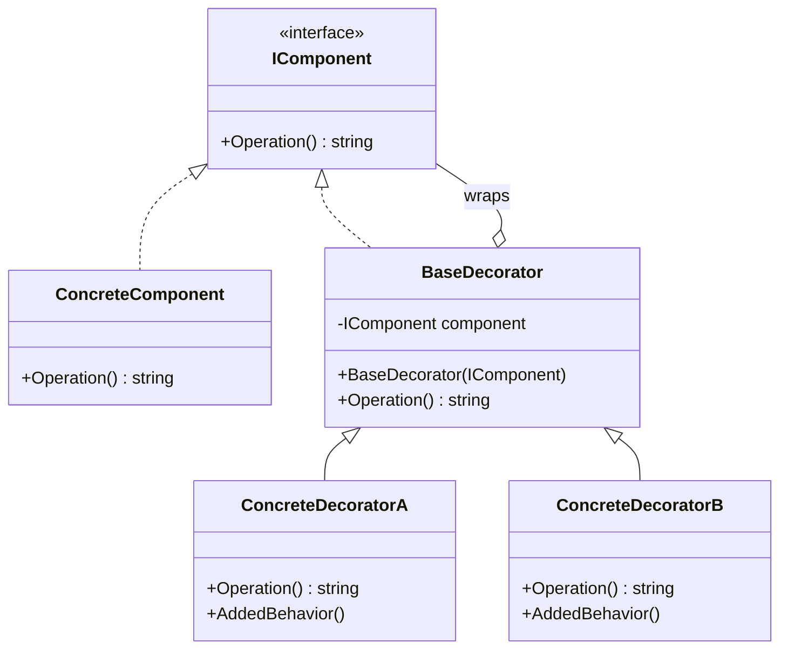
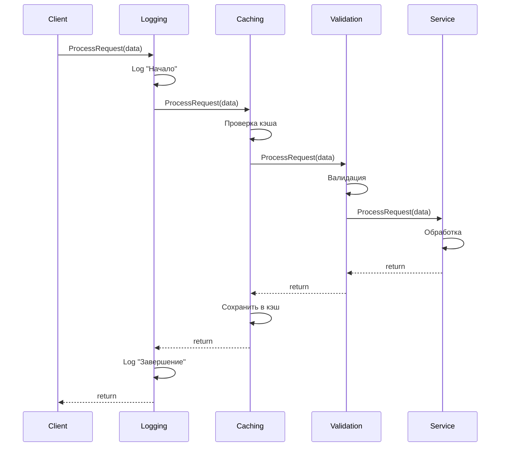

# Паттерн Decorator (Декоратор)

## Введение

Паттерн **Decorator** (декоратор) — это структурный паттерн проектирования, который позволяет динамически добавлять объектам новую функциональность, оборачивая их в полезные обёртки. Декоратор предоставляет гибкую альтернативу наследованию для расширения функциональности.

### Основные термины

**Component** (компонент) — общий интерфейс или абстрактный класс, который определяет базовое поведение объектов, которые могут быть обёрнуты в декораторы.

**Concrete Component** (конкретный компонент) — базовый класс, реализующий интерфейс компонента. Это объект, к которому будет добавляться новая функциональность.

**Decorator** (декоратор) — абстрактный класс или интерфейс, который реализует тот же интерфейс, что и оборачиваемый компонент, и содержит ссылку на объект компонента.

**Concrete Decorator** (конкретный декоратор) — класс, который расширяет декоратор и добавляет дополнительную функциональность до или после вызова методов обёрнутого объекта.

**Decoratee** (декорируемый объект) — объект, который оборачивается в декоратор для расширения его функциональности.

### Структура паттерна



## Проблема, которую решает Decorator

Представим типичную ситуацию в разработке: у вас есть класс, который выполняет базовую работу, например `Service`, обрабатывающий запросы.

```csharp
// Базовый интерфейс сервиса
public interface IService
{
    void ProcessRequest(RequestData data);
}

// Конкретная реализация сервиса
public class Service : IService
{
    public void ProcessRequest(RequestData data)
    {
        // Основная бизнес-логика
        Console.WriteLine($"Обработка запроса: {data.Id}");
    }
}
```

Со временем появляются новые требования:
- Необходимо логировать все вызовы методов
- Требуется кэширование результатов для повышения производительности
- Нужна проверка прав доступа перед каждым запросом
- Требуется сбор метрик производительности
- Необходимо сжатие данных перед отправкой

### Неправильные подходы

#### Подход 1: Добавление всего в один класс

Если добавить всю эту функциональность непосредственно в класс `Service`, он станет огромным монолитом с множеством ответственностей. Это нарушает принцип единственной ответственности (Single Responsibility Principle) из SOLID.

```csharp
// Антипаттерн: "Божественный объект" (God Object)
public class ServiceWithEverything : IService
{
    private readonly ILogger _logger;
    private readonly ICache _cache;
    private readonly IAuthService _auth;
    private readonly IMetrics _metrics;
    
    public void ProcessRequest(RequestData data)
    {
        // Логирование
        _logger.Log("Processing started");
        
        // Проверка прав
        if (!_auth.HasAccess(data.UserId))
            throw new UnauthorizedException();
        
        // Проверка кэша
        if (_cache.TryGet(data.Id, out var cached))
            return;
        
        // Метрики
        var sw = Stopwatch.StartNew();
        
        // Основная логика
        Console.WriteLine($"Обработка запроса: {data.Id}");
        
        // Ещё метрики
        _metrics.Record(sw.Elapsed);
        
        // Ещё логирование
        _logger.Log("Processing completed");
    }
}
```

Проблемы этого подхода:
- Класс нарушает принцип единственной ответственности
- Сложно тестировать отдельные аспекты функциональности
- Невозможно гибко комбинировать различные возможности
- Сложно добавлять новую функциональность

#### Подход 2: Иерархия наследования

Можно попробовать создать иерархию классов через наследование:

```csharp
// Антипаттерн: комбинаторный взрыв классов
public class ServiceWithLogging : Service { }
public class ServiceWithCaching : Service { }
public class ServiceWithLoggingAndCaching : ServiceWithLogging { }
public class ServiceWithLoggingAndCachingAndValidation : ServiceWithLoggingAndCaching { }
// ... и так далее
```

Проблема: если есть 5 различных функций, получается 2^5 = 32 различных комбинации. Это приводит к комбинаторному взрыву количества классов.

### Решение: паттерн Decorator

Паттерн Decorator предлагает оборачивать объект в специальные обёртки, каждая из которых добавляет одну конкретную функцию. Вместо добавления функциональности через наследование, мы оборачиваем объект в другой объект, который реализует тот же интерфейс, но добавляет новое поведение.

Декоратор работает как матрёшка:
- В центре находится оригинальный объект (`Service`)
- Вокруг него обёртка логирования (`LoggingServiceDecorator`)
- Вокруг логирования обёртка кэширования (`CachingServiceDecorator`)
- И так далее


Для клиента всё выглядит как простой `IService`, но на самом деле это цепочка обёрток, каждая из которых добавляет свою функциональность.

## Реализация базового декоратора

Начнём с создания первого декоратора для логирования:

```csharp
public class LoggingServiceDecorator : IService
{
    // Ссылка на обёрнутый объект
    // Это может быть как базовый Service, так и другой декоратор
    private readonly IService _decoratee;
    
    // Конструктор принимает объект, который нужно обернуть
    public LoggingServiceDecorator(IService decoratee)
    {
        _decoratee = decoratee ?? throw new ArgumentNullException(nameof(decoratee));
    }
    
    public void ProcessRequest(RequestData data)
    {
        // Шаг 1: добавляем своё поведение — логирование перед вызовом
        Console.WriteLine($"[LOG] Начало обработки запроса: {data.Id}");
        
        try
        {
            // Шаг 2: делегируем выполнение обёрнутому объекту
            _decoratee.ProcessRequest(data);
            
            // Шаг 3: добавляем логирование после успешного выполнения
            Console.WriteLine($"[LOG] Успешное завершение обработки: {data.Id}");
        }
        catch (Exception ex)
        {
            // Шаг 4: логируем ошибки, если они произошли
            Console.WriteLine($"[LOG] Ошибка при обработке {data.Id}: {ex.Message}");
            throw; // Пробрасываем исключение дальше
        }
    }
}
```

Ключевые моменты реализации:
- Декоратор реализует тот же интерфейс `IService`, что и оборачиваемый объект
- Хранит ссылку на обёрнутый объект в поле `_decoratee`
- Добавляет своё поведение до и/или после вызова метода обёрнутого объекта
- Может обрабатывать или пробрасывать исключения

### Использование декоратора

```csharp
// Создаём базовый сервис
IService service = new Service();

// Оборачиваем его в декоратор логирования
IService serviceWithLogging = new LoggingServiceDecorator(service);

// Используем как обычный IService
serviceWithLogging.ProcessRequest(new RequestData { Id = 42 });
```

Вывод:
```
[LOG] Начало обработки запроса: 42
Обработка запроса: 42
[LOG] Успешное завершение обработки: 42
```

## Построение цепочки декораторов

Главное преимущество паттерна — возможность комбинировать несколько декораторов в цепочку. Создадим ещё несколько декораторов:

### Декоратор кэширования

```csharp
public class CachingServiceDecorator : IService
{
    private readonly IService _decoratee;
    // Простой кэш на основе словаря
    // В реальном приложении используйте IMemoryCache или IDistributedCache
    private readonly Dictionary<int, bool> _processedRequests = new();
    
    public CachingServiceDecorator(IService decoratee)
    {
        _decoratee = decoratee ?? throw new ArgumentNullException(nameof(decoratee));
    }
    
    public void ProcessRequest(RequestData data)
    {
        // Проверяем, обрабатывали ли мы уже этот запрос
        if (_processedRequests.ContainsKey(data.Id))
        {
            Console.WriteLine($"[CACHE] Запрос {data.Id} уже обработан, возвращаем из кэша");
            return;
        }
        
        Console.WriteLine($"[CACHE] Запрос {data.Id} не найден в кэше, обрабатываем");
        
        // Делегируем выполнение обёрнутому объекту
        _decoratee.ProcessRequest(data);
        
        // Сохраняем результат в кэш
        _processedRequests[data.Id] = true;
    }
}
```

### Декоратор валидации

```csharp
public class ValidationServiceDecorator : IService
{
    private readonly IService _decoratee;
    
    public ValidationServiceDecorator(IService decoratee)
    {
        _decoratee = decoratee ?? throw new ArgumentNullException(nameof(decoratee));
    }
    
    public void ProcessRequest(RequestData data)
    {
        // Выполняем валидацию перед обработкой
        if (data == null)
        {
            throw new ArgumentNullException(nameof(data), 
                "[VALIDATION] Данные запроса не могут быть null");
        }
        
        if (data.Id <= 0)
        {
            throw new ArgumentException(
                "[VALIDATION] Идентификатор запроса должен быть положительным числом", 
                nameof(data.Id));
        }
        
        Console.WriteLine($"[VALIDATION] Валидация пройдена для запроса: {data.Id}");
        
        // Если валидация успешна, передаём управление дальше
        _decoratee.ProcessRequest(data);
    }
}
```

### Создание цепочки

Теперь можем комбинировать декораторы в различных порядках:

```csharp
// Создаём базовый сервис
IService service = new Service();

// Оборачиваем в валидацию
IService withValidation = new ValidationServiceDecorator(service);

// Добавляем кэширование
IService withCache = new CachingServiceDecorator(withValidation);

// Добавляем логирование поверх всего
IService fullyDecorated = new LoggingServiceDecorator(withCache);

// Используем полностью декорированный сервис
fullyDecorated.ProcessRequest(new RequestData { Id = 42 });
```

Порядок выполнения при вызове:
1. `LoggingServiceDecorator` — логирует начало
2. `CachingServiceDecorator` — проверяет кэш
3. `ValidationServiceDecorator` — валидирует данные
4. `Service` — выполняет основную работу
5. Контроль возвращается обратно по цепочке



### Гибкость порядка декораторов

Важное свойство паттерна — порядок декораторов можно легко менять в зависимости от требований:

```csharp
// Стратегия 1: Кэш проверяется первым (быстрее)
IService strategy1 = new CachingServiceDecorator(
    new LoggingServiceDecorator(
        new ValidationServiceDecorator(
            new Service())));

// Стратегия 2: Логируем все запросы, даже закэшированные
IService strategy2 = new LoggingServiceDecorator(
    new CachingServiceDecorator(
        new ValidationServiceDecorator(
            new Service())));

// Стратегия 3: Валидация в самом начале
IService strategy3 = new ValidationServiceDecorator(
    new LoggingServiceDecorator(
        new CachingServiceDecorator(
            new Service())));
```

Каждая стратегия имеет свои преимущества и подходит для разных сценариев использования.

## Полный рабочий пример
Приведём полный рабочий пример, который демонстрирует все возможности паттерна:

```csharp
using System;
using System.Collections.Generic;
using System.Diagnostics;

// Модель данных запроса
public class RequestData
{
    public int Id { get; set; }
    public string Payload { get; set; }
    
    public override string ToString() => $"Request(Id={Id}, Payload={Payload})";
}

// Базовый интерфейс компонента
public interface IService
{
    string ProcessRequest(RequestData data);
}

// ========== Конкретный компонент ==========

/// <summary>
/// Базовая реализация сервиса, выполняющая основную бизнес-логику.
/// Это ядро, которое будет оборачиваться в декораторы.
/// </summary>
public class Service : IService
{
    public string ProcessRequest(RequestData data)
    {
        Console.WriteLine($"[SERVICE] Обработка запроса {data.Id}");
        
        // Имитация реальной обработки
        System.Threading.Thread.Sleep(100);
        
        return $"Результат обработки для запроса {data.Id}";
    }
}

// ========== Декораторы ==========

/// <summary>
/// Декоратор для логирования входящих и исходящих вызовов.
/// Записывает информацию о начале и завершении обработки запроса.
/// </summary>
public class LoggingServiceDecorator : IService
{
    private readonly IService _decoratee;

    public LoggingServiceDecorator(IService decoratee)
    {
        _decoratee = decoratee ?? throw new ArgumentNullException(nameof(decoratee));
    }

    public string ProcessRequest(RequestData data)
    {
        // Логируем начало операции
        Console.WriteLine($"[LOG] → Начало обработки: {data}");
        
        try
        {
            // Делегируем выполнение обёрнутому объекту
            var result = _decoratee.ProcessRequest(data);
            
            // Логируем успешное завершение
            Console.WriteLine($"[LOG] ← Успешное завершение: {data.Id}, результат: {result}");
            
            return result;
        }
        catch (Exception ex)
        {
            // Логируем ошибку
            Console.WriteLine($"[LOG] ✗ Ошибка при обработке {data.Id}: {ex.Message}");
            throw;
        }
    }
}

/// <summary>
/// Декоратор для кэширования результатов обработки запросов.
/// Сохраняет результаты в памяти и возвращает их при повторных запросах.
/// </summary>
public class CachingServiceDecorator : IService
{
    private readonly IService _decoratee;
    // Простой кэш для демонстрации
    // В продакшене используйте IMemoryCache, Redis или другое решение
    private readonly Dictionary<int, string> _cache = new();

    public CachingServiceDecorator(IService decoratee)
    {
        _decoratee = decoratee ?? throw new ArgumentNullException(nameof(decoratee));
    }

    public string ProcessRequest(RequestData data)
    {
        // Проверяем наличие результата в кэше
        if (_cache.TryGetValue(data.Id, out var cachedResult))
        {
            Console.WriteLine($"[CACHE] ✓ Cache HIT для запроса {data.Id}");
            return cachedResult;
        }

        // Результата нет в кэше, выполняем обработку
        Console.WriteLine($"[CACHE] ✗ Cache MISS для запроса {data.Id}");
        var result = _decoratee.ProcessRequest(data);
        
        // Сохраняем результат в кэш
        _cache[data.Id] = result;
        Console.WriteLine($"[CACHE] ↑ Результат для {data.Id} добавлен в кэш");
        
        return result;
    }
}

/// <summary>
/// Декоратор для валидации входных данных перед обработкой.
/// Проверяет корректность данных и выбрасывает исключения при ошибках.
/// </summary>
public class ValidationServiceDecorator : IService
{
    private readonly IService _decoratee;

    public ValidationServiceDecorator(IService decoratee)
    {
        _decoratee = decoratee ?? throw new ArgumentNullException(nameof(decoratee));
    }

    public string ProcessRequest(RequestData data)
    {
        // Валидация данных
        if (data == null)
        {
            throw new ArgumentNullException(nameof(data), 
                "[VALIDATION] Данные запроса не могут быть null");
        }

        if (data.Id <= 0)
        {
            throw new ArgumentException(
                "[VALIDATION] Идентификатор запроса должен быть положительным числом", 
                nameof(data.Id));
        }

        if (string.IsNullOrWhiteSpace(data.Payload))
        {
            throw new ArgumentException(
                "[VALIDATION] Содержимое запроса не может быть пустым", 
                nameof(data.Payload));
        }

        Console.WriteLine($"[VALIDATION] ✓ Валидация пройдена для запроса {data.Id}");
        
        // Передаём управление дальше по цепочке
        return _decoratee.ProcessRequest(data);
    }
}

/// <summary>
/// Декоратор для измерения производительности выполнения операций.
/// Использует Stopwatch для точного измерения времени выполнения.
/// </summary>
public class PerformanceServiceDecorator : IService
{
    private readonly IService _decoratee;

    public PerformanceServiceDecorator(IService decoratee)
    {
        _decoratee = decoratee ?? throw new ArgumentNullException(nameof(decoratee));
    }

    public string ProcessRequest(RequestData data)
    {
        // Начинаем измерение времени
        var stopwatch = Stopwatch.StartNew();
        
        try
        {
            // Выполняем операцию
            var result = _decoratee.ProcessRequest(data);
            
            stopwatch.Stop();
            Console.WriteLine($"[PERFORMANCE] Время обработки запроса {data.Id}: {stopwatch.ElapsedMilliseconds} мс");
            
            return result;
        }
        catch
        {
            stopwatch.Stop();
            Console.WriteLine($"[PERFORMANCE] Запрос {data.Id} завершился ошибкой за {stopwatch.ElapsedMilliseconds} мс");
            throw;
        }
    }
}

// ========== Демонстрация использования ==========

class Program
{
    static void Main()
    {
        Console.WriteLine("=== Сценарий 1: Базовый сервис без декораторов ===\n");
        DemoBasicService();

        Console.WriteLine("\n\n=== Сценарий 2: Сервис с одним декоратором (логирование) ===\n");
        DemoSingleDecorator();

        Console.WriteLine("\n\n=== Сценарий 3: Цепочка декораторов ===\n");
        DemoDecoratorChain();

        Console.WriteLine("\n\n=== Сценарий 4: Демонстрация кэширования ===\n");
        DemoCaching();

        Console.WriteLine("\n\n=== Сценарий 5: Обработка ошибок валидации ===\n");
        DemoValidationError();

        Console.WriteLine("\n\n=== Сценарий 6: Полная цепочка декораторов ===\n");
        DemoFullChain();
    }

    /// <summary>
    /// Демонстрация работы базового сервиса без декораторов
    /// </summary>
    static void DemoBasicService()
    {
        IService service = new Service();
        var result = service.ProcessRequest(new RequestData 
        { 
            Id = 1, 
            Payload = "Простой запрос" 
        });
        Console.WriteLine($"Получен результат: {result}");
    }

    /// <summary>
    /// Демонстрация использования одного декоратора
    /// </summary>
    static void DemoSingleDecorator()
    {
        // Создаём базовый сервис и оборачиваем его в декоратор логирования
        IService service = new Service();
        IService decoratedService = new LoggingServiceDecorator(service);
        
        var result = decoratedService.ProcessRequest(new RequestData 
        { 
            Id = 2, 
            Payload = "Запрос с логированием" 
        });
        Console.WriteLine($"Получен результат: {result}");
    }

    /// <summary>
    /// Демонстрация построения цепочки из нескольких декораторов
    /// </summary>
    static void DemoDecoratorChain()
    {
        // Строим цепочку: Логирование → Валидация → Сервис
        IService service = new Service();
        service = new ValidationServiceDecorator(service);
        service = new LoggingServiceDecorator(service);
        
        var result = service.ProcessRequest(new RequestData 
        { 
            Id = 3, 
            Payload = "Цепочка декораторов" 
        });
        Console.WriteLine($"Получен результат: {result}");
    }

    /// <summary>
    /// Демонстрация работы кэширования при повторных вызовах
    /// </summary>
    static void DemoCaching()
    {
        // Строим цепочку: Логирование → Кэш → Сервис
        IService service = new Service();
        service = new CachingServiceDecorator(service);
        service = new LoggingServiceDecorator(service);
        
        var data = new RequestData { Id = 4, Payload = "Запрос для кэширования" };
        
        Console.WriteLine("--- Первый вызов (без кэша) ---");
        service.ProcessRequest(data);
        
        Console.WriteLine("\n--- Второй вызов (из кэша) ---");
        service.ProcessRequest(data);
    }

    /// <summary>
    /// Демонстрация обработки ошибок валидации
    /// </summary>
    static void DemoValidationError()
    {
        IService service = new Service();
        service = new ValidationServiceDecorator(service);
        service = new LoggingServiceDecorator(service);
        
        try
        {
            // Попытка обработать невалидные данные
            service.ProcessRequest(new RequestData 
            { 
                Id = -1,  // Невалидный ID
                Payload = "Невалидный запрос" 
            });
        }
        catch (ArgumentException ex)
        {
            Console.WriteLine($"Поймано ожидаемое исключение: {ex.Message}");
        }
    }

    /// <summary>
    /// Демонстрация полной цепочки всех декораторов
    /// </summary>
    static void DemoFullChain()
    {
        // Строим полную цепочку: Performance → Logging → Caching → Validation → Service
        IService service = new Service();
        service = new ValidationServiceDecorator(service);
        service = new CachingServiceDecorator(service);
        service = new LoggingServiceDecorator(service);
        service = new PerformanceServiceDecorator(service);
        
        var data = new RequestData { Id = 5, Payload = "Полная цепочка декораторов" };
        
        Console.WriteLine("--- Первый вызов ---");
        var result1 = service.ProcessRequest(data);
        Console.WriteLine($"Результат: {result1}\n");
        
        Console.WriteLine("--- Повторный вызов (с использованием кэша) ---");
        var result2 = service.ProcessRequest(data);
        Console.WriteLine($"Результат: {result2}");
    }
}
```

### Вывод программы

```
=== Сценарий 1: Базовый сервис без декораторов ===

[SERVICE] Обработка запроса 1
Получен результат: Результат обработки для запроса 1


=== Сценарий 2: Сервис с одним декоратором (логирование) ===

[LOG] → Начало обработки: Request(Id=2, Payload=Простой запрос)
[SERVICE] Обработка запроса 2
[LOG] ← Успешное завершение: 2, результат: Результат обработки для запроса 2
Получен результат: Результат обработки для запроса 2


=== Сценарий 3: Цепочка декораторов ===

[LOG] → Начало обработки: Request(Id=3, Payload=Цепочка декораторов)
[VALIDATION] ✓ Валидация пройдена для запроса 3
[SERVICE] Обработка запроса 3
[LOG] ← Успешное завершение: 3, результат: Результат обработки для запроса 3
Получен результат: Результат обработки для запроса 3


=== Сценарий 4: Демонстрация кэширования ===

--- Первый вызов (без кэша) ---
[LOG] → Начало обработки: Request(Id=4, Payload=Запрос для кэширования)
[CACHE] ✗ Cache MISS для запроса 4
[SERVICE] Обработка запроса 4
[CACHE] ↑ Результат для 4 добавлен в кэш
[LOG] ← Успешное завершение: 4, результат: Результат обработки для запроса 4

--- Второй вызов (из кэша) ---
[LOG] → Начало обработки: Request(Id=4, Payload=Запрос для кэширования)
[CACHE] ✓ Cache HIT для запроса 4
[LOG] ← Успешное завершение: 4, результат: Результат обработки для запроса 4


=== Сценарий 5: Обработка ошибок валидации ===

[LOG] → Начало обработки: Request(Id=-1, Payload=Невалидный запрос)
[LOG] ✗ Ошибка при обработке -1: [VALIDATION] Идентификатор запроса должен быть положительным числом (Parameter 'Id')
Поймано ожидаемое исключение: [VALIDATION] Идентификатор запроса должен быть положительным числом (Parameter 'Id')


=== Сценарий 6: Полная цепочка декораторов ===

--- Первый вызов ---
[LOG] → Начало обработки: Request(Id=5, Payload=Полная цепочка декораторов)
[CACHE] ✗ Cache MISS для запроса 5
[VALIDATION] ✓ Валидация пройдена для запроса 5
[SERVICE] Обработка запроса 5
[CACHE] ↑ Результат для 5 добавлен в кэш
[LOG] ← Успешное завершение: 5, результат: Результат обработки для запроса 5
[PERFORMANCE] Время обработки запроса 5: 152 мс
Результат: Результат обработки для запроса 5

--- Повторный вызов (с использованием кэша) ---
[LOG] → Начало обработки: Request(Id=5, Payload=Полная цепочка декораторов)
[CACHE] ✓ Cache HIT для запроса 5
[LOG] ← Успешное завершение: 5, результат: Результат обработки для запроса 5
[PERFORMANCE] Время обработки запроса 5: 3 мс
Результат: Результат обработки для запроса 5
```

## Практические примеры использования в реальных проектах

### Пример 1: HTTP клиент с retry логикой

В реальных приложениях часто требуется добавлять функциональность повторных попыток при сетевых запросах:

```csharp
public interface IHttpClient
{
    Task<HttpResponse> SendAsync(HttpRequest request);
}

// Базовая реализация HTTP клиента
public class HttpClient : IHttpClient
{
    public async Task<HttpResponse> SendAsync(HttpRequest request)
    {
        // Реальная отправка HTTP запроса
        return await ExecuteHttpRequestAsync(request);
    }
    
    private async Task<HttpResponse> ExecuteHttpRequestAsync(HttpRequest request)
    {
        // Реализация отправки запроса
        throw new NotImplementedException();
    }
}

// Декоратор для повторных попыток при ошибках
public class RetryHttpClientDecorator : IHttpClient
{
    private readonly IHttpClient _httpClient;
    private readonly int _maxRetries;
    private readonly TimeSpan _retryDelay;

    public RetryHttpClientDecorator(
        IHttpClient httpClient, 
        int maxRetries = 3, 
        TimeSpan? retryDelay = null)
    {
        _httpClient = httpClient ?? throw new ArgumentNullException(nameof(httpClient));
        _maxRetries = maxRetries;
        _retryDelay = retryDelay ?? TimeSpan.FromSeconds(1);
    }

    public async Task<HttpResponse> SendAsync(HttpRequest request)
    {
        int attempt = 0;
        
        while (true)
        {
            try
            {
                attempt++;
                Console.WriteLine($"[RETRY] Попытка {attempt} из {_maxRetries}");
                
                // Пытаемся выполнить запрос
                return await _httpClient.SendAsync(request);
            }
            catch (HttpRequestException ex) when (attempt < _maxRetries)
            {
                // Если не последняя попытка, ждём и пробуем снова
                Console.WriteLine($"[RETRY] Ошибка: {ex.Message}. Повтор через {_retryDelay.TotalSeconds} сек.");
                await Task.Delay(_retryDelay);
            }
            catch
            {
                // Если последняя попытка или другой тип исключения, пробрасываем дальше
                Console.WriteLine($"[RETRY] Все попытки исчерпаны или критическая ошибка");
                throw;
            }
        }
    }
}

// Декоратор для добавления стандартных заголовков
public class HeadersHttpClientDecorator : IHttpClient
{
    private readonly IHttpClient _httpClient;
    private readonly Dictionary<string, string> _defaultHeaders;

    public HeadersHttpClientDecorator(
        IHttpClient httpClient, 
        Dictionary<string, string> defaultHeaders)
    {
        _httpClient = httpClient ?? throw new ArgumentNullException(nameof(httpClient));
        _defaultHeaders = defaultHeaders ?? throw new ArgumentNullException(nameof(defaultHeaders));
    }

    public async Task<HttpResponse> SendAsync(HttpRequest request)
    {
        // Добавляем стандартные заголовки к запросу
        foreach (var header in _defaultHeaders)
        {
            if (!request.Headers.ContainsKey(header.Key))
            {
                request.Headers[header.Key] = header.Value;
                Console.WriteLine($"[HEADERS] Добавлен заголовок: {header.Key} = {header.Value}");
            }
        }
        
        return await _httpClient.SendAsync(request);
    }
}

// Использование:
// IHttpClient client = new HttpClient();
// client = new HeadersHttpClientDecorator(client, new Dictionary<string, string>
// {
//     ["User-Agent"] = "MyApp/1.0",
//     ["Accept"] = "application/json"
// });
// client = new RetryHttpClientDecorator(client, maxRetries: 3, retryDelay: TimeSpan.FromSeconds(2));
```

### Пример 2: Repository с кэшированием и логированием

Паттерн часто используется с Repository для добавления кэширования и аудита:

```csharp
public interface IUserRepository
{
    User GetById(int id);
    void Save(User user);
    void Delete(int id);
}

// Базовая реализация репозитория
public class UserRepository : IUserRepository
{
    private readonly DbContext _dbContext;

    public UserRepository(DbContext dbContext)
    {
        _dbContext = dbContext ?? throw new ArgumentNullException(nameof(dbContext));
    }

    public User GetById(int id)
    {
        // Получение пользователя из базы данных
        return _dbContext.Users.Find(id);
    }

    public void Save(User user)
    {
        // Сохранение пользователя в базу данных
        _dbContext.Users.Add(user);
        _dbContext.SaveChanges();
    }

    public void Delete(int id)
    {
        // Удаление пользователя из базы данных
        var user = _dbContext.Users.Find(id);
        if (user != null)
        {
            _dbContext.Users.Remove(user);
            _dbContext.SaveChanges();
        }
    }
}

// Декоратор для кэширования операций чтения
public class CachedUserRepository : IUserRepository
{
    private readonly IUserRepository _repository;
    private readonly IMemoryCache _cache;
    private readonly TimeSpan _cacheExpiration;

    public CachedUserRepository(
        IUserRepository repository, 
        IMemoryCache cache,
        TimeSpan? cacheExpiration = null)
    {
        _repository = repository ?? throw new ArgumentNullException(nameof(repository));
        _cache = cache ?? throw new ArgumentNullException(nameof(cache));
        _cacheExpiration = cacheExpiration ?? TimeSpan.FromMinutes(5);
    }

    public User GetById(int id)
    {
        // Формируем ключ кэша
        string cacheKey = $"User_{id}";
        
        // Пытаемся получить из кэша
        if (_cache.TryGetValue(cacheKey, out User cachedUser))
        {
            Console.WriteLine($"[CACHE] Пользователь {id} получен из кэша");
            return cachedUser;
        }
        
        // Если в кэше нет, получаем из репозитория
        Console.WriteLine($"[CACHE] Пользователь {id} не найден в кэше, загружаем из БД");
        var user = _repository.GetById(id);
        
        if (user != null)
        {
            // Сохраняем в кэш
            _cache.Set(cacheKey, user, _cacheExpiration);
        }
        
        return user;
    }

    public void Save(User user)
    {
        // При сохранении инвалидируем кэш для этого пользователя
        _cache.Remove($"User_{user.Id}");
        _repository.Save(user);
    }

    public void Delete(int id)
    {
        // При удалении инвалидируем кэш
        _cache.Remove($"User_{id}");
        _repository.Delete(id);
    }
}

// Декоратор для аудита операций
public class AuditedUserRepository : IUserRepository
{
    private readonly IUserRepository _repository;
    private readonly IAuditLogger _auditLogger;

    public AuditedUserRepository(IUserRepository repository, IAuditLogger auditLogger)
    {
        _repository = repository ?? throw new ArgumentNullException(nameof(repository));
        _auditLogger = auditLogger ?? throw new ArgumentNullException(nameof(auditLogger));
    }

    public User GetById(int id)
    {
        _auditLogger.Log($"Чтение пользователя: ID={id}");
        return _repository.GetById(id);
    }

    public void Save(User user)
    {
        _auditLogger.Log($"Сохранение пользователя: {user.Id} ({user.Username})");
        _repository.Save(user);
    }

    public void Delete(int id)
    {
        _auditLogger.Log($"Удаление пользователя: ID={id}");
        _repository.Delete(id);
    }
}

// Использование в Dependency Injection:
// services.AddScoped<IUserRepository>(provider =>
// {
//     var dbContext = provider.GetRequiredService<DbContext>();
//     var cache = provider.GetRequiredService<IMemoryCache>();
//     var auditLogger = provider.GetRequiredService<IAuditLogger>();
//     
//     // Создаём цепочку: Audit → Cache → Repository
//     IUserRepository repository = new UserRepository(dbContext);
//     repository = new CachedUserRepository(repository, cache);
//     repository = new AuditedUserRepository(repository, auditLogger);
//     
//     return repository;
// });
```

## Преимущества и недостатки паттерна

### Преимущества

**Гибкость в добавлении функциональности**
- Можно добавлять новые возможности без изменения существующего кода
- Соблюдается принцип открытости/закрытости (Open/Closed Principle)

**Композиция вместо наследования**
- Избегаем комбинаторного взрыва классов
- Можно комбинировать декораторы в любом порядке во время выполнения

**Разделение ответственности**
- Каждый декоратор отвечает за одну конкретную функцию
- Соблюдается принцип единственной ответственности (Single Responsibility Principle)

**Прозрачность для клиента**
- Клиент работает с декорированным объектом через тот же интерфейс
- Не нужно менять код клиента при добавлении новых декораторов

**Динамическое изменение поведения**
- Можно добавлять или убирать декораторы во время выполнения программы
- Легко создавать различные конфигурации для разных сценариев

### Недостатки

**Усложнение кода**
- Много маленьких классов вместо одного большого
- Может быть сложнее понять полную цепочку вызовов

**Сложность отладки**
- Трудно отследить, через какие декораторы прошёл вызов
- Стек вызовов становится глубже

**Порядок декораторов имеет значение**
- Разный порядок может давать разное поведение
- Необходимо документировать правильный порядок применения

**Идентичность объектов**
- Декорированный объект технически не является экземпляром базового класса
- Могут возникнуть проблемы при сравнении объектов

## Когда использовать Decorator

Паттерн Decorator следует применять, когда:

1. Необходимо динамически добавлять объектам дополнительные обязанности
2. Расширение функциональности путём наследования нецелесообразно или невозможно
3. Требуется комбинировать несколько независимых расширений
4. Нужна возможность отменить добавленную функциональность
5. Есть необходимость в разных комбинациях функциональности для разных объектов

## Связь с другими паттернами

**Adapter**
- Adapter изменяет интерфейс объекта, Decorator расширяет функциональность, сохраняя интерфейс
- Adapter обычно работает с одним объектом, Decorator может создавать цепочки

**Proxy**
- Proxy контролирует доступ к объекту, Decorator добавляет функциональность
- Proxy может создавать объект лениво, Decorator всегда работает с существующим объектом
- Структурно очень похожи, различаются по назначению

**Composite**
- Оба паттерна используют рекурсивную композицию
- Decorator добавляет обязанности одному объекту, Composite работает с деревом объектов

**Strategy**
- Strategy изменяет алгоритм объекта, Decorator добавляет новые обязанности
- Strategy обычно меняется целиком, декораторы можно комбинировать

**Chain of Responsibility**
- Оба создают цепочки объектов
- Chain of Responsibility передаёт запрос по цепи до первого обработчика, Decorator всегда проходит всю цепь

## Резюме

Паттерн Decorator предоставляет элегантное решение для динамического расширения функциональности объектов. Он позволяет избежать создания сложных иерархий наследования и даёт возможность гибко комбинировать различные аспекты поведения во время выполнения программы.

Ключевые моменты:
- Декоратор реализует тот же интерфейс, что и оборачиваемый объект
- Можно создавать цепочки декораторов для комбинирования функциональности
- Порядок декораторов в цепочке влияет на результат
- Паттерн соблюдает принципы SOLID: Single Responsibility и Open/Closed
- Широко применяется в реальных проектах для добавления кэширования, логирования, валидации и других cross-cutting concerns

Decorator — это мощный инструмент, который при правильном применении делает код более гибким, поддерживаемым и расширяемым.
