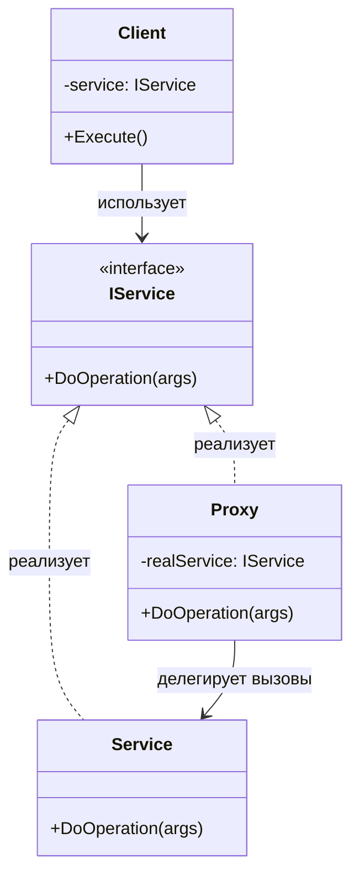
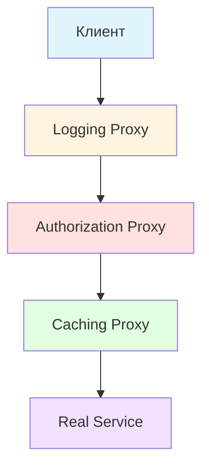
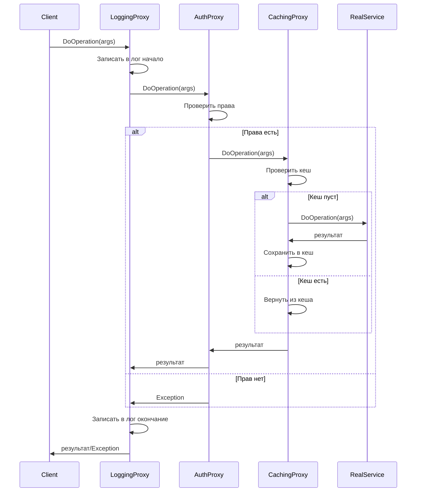
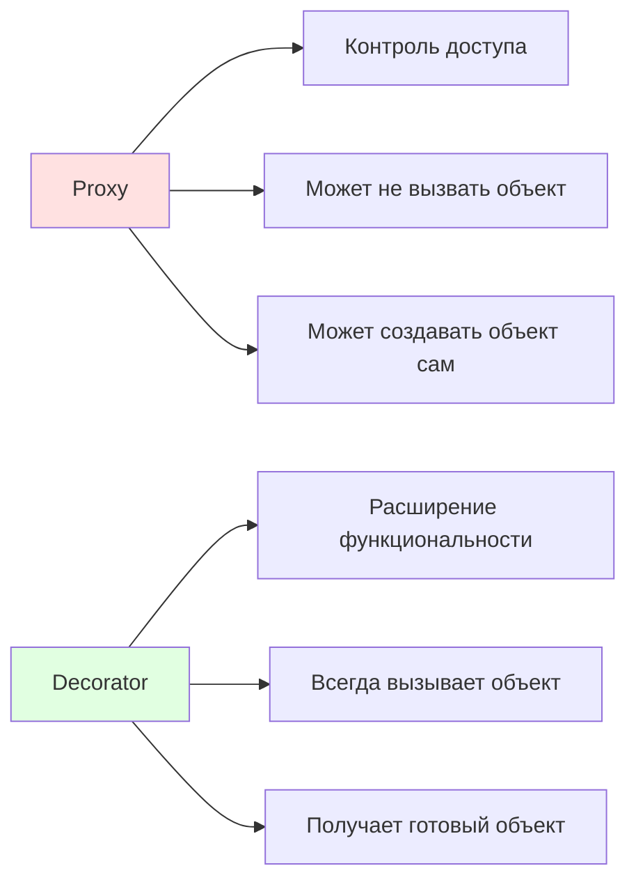
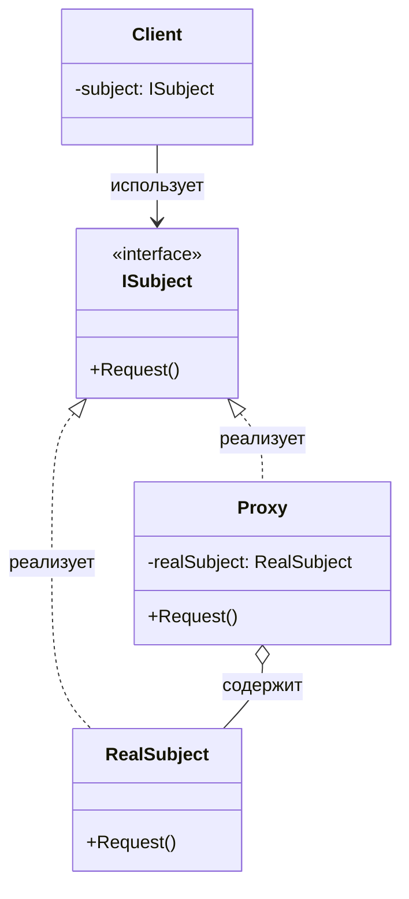

## Proxy (Прокси)

Также известен как **Surrogate** (заместитель).

### Определение

> Тип-обёртка, реализующий логику контроля доступа к объекту, реализующему абстракцию, которую реализует он сам.

**Proxy** (прокси, заместитель) — это структурный паттерн проектирования, который предоставляет объект-заместитель вместо реального служебного объекта. Прокси контролирует доступ к оригинальному объекту, позволяя выполнить дополнительную логику до или после передачи запроса к оригиналу.

Прокси реализует тот же интерфейс, что и оригинальный объект, благодаря чему может быть передан любому клиенту, ожидающему объект реального сервиса. Прокси получает запросы от клиента, выполняет свою промежуточную работу (контроль доступа, кеширование, ленивая инициализация и т.д.), а затем передаёт запрос настоящему объекту.

### Проблема

Представьте, что у вас есть объект, к которому нужно контролировать доступ. Это может быть тяжёлый объект, потребляющий много ресурсов при создании, или объект, требующий проверки прав доступа перед использованием. Рассмотрим типичный сервисный класс

```csharp
// Интерфейс определяет контракт для сервиса
public interface IService
{
    void DoOperation(OperationArgs args);
}

// Реальный сервис, выполняющий бизнес-логику
// Создание или использование этого объекта может быть "дорогим"
public class Service : IService
{
    public Service()
    {
        // Инициализация может быть тяжёлой:
        // - подключение к базе данных
        // - загрузка больших объёмов данных
        // - установка сетевых соединений
        Console.WriteLine("Service создан (тяжёлая инициализация)");
    }

    public void DoOperation(OperationArgs args)
    {
        // Выполнение реальной бизнес-операции
        Console.WriteLine($"Service выполняет операцию: {args.Query}");
    }
}
```

При прямом использовании такого сервиса возникают проблемы:

1. **Производительность**: Объект может быть тяжёлым в создании (инициализация базы данных, загрузка конфигурации). Если создавать его заранее, а он не понадобится — это пустая трата ресурсов.

2. **Безопасность**: Не все пользователи должны иметь прямой доступ к операциям. Нужна проверка прав доступа перед каждым вызовом.

3. **Оптимизация**: Повторяющиеся операции с одинаковыми параметрами выполняются заново, хотя результат не меняется. Это расточительно.

4. **Удалённый доступ**: Объект может физически находиться на другом сервере, и нужна прозрачная работа через сеть.

### Решение

Вместо предоставления клиенту прямого доступа к объекту, мы создаём **прокси** (proxy) — объект-заместитель, реализующий тот же интерфейс. Прокси получает запросы от клиента, выполняет дополнительную логику и делегирует вызов реальному объекту (или не делегирует, если это не требуется).



**Ключевая идея**: Proxy стоит между клиентом и реальным объектом, перехватывая вызовы. Он решает, что делать с запросом: пропустить его к реальному объекту, модифицировать, отложить, кешировать или даже отклонить.

Клиент работает с прокси так же, как работал бы с реальным объектом — он не знает о существовании посредника. Это обеспечивает **прозрачность** (transparency), **контроль** и **гибкость**.

### Типы прокси

Существует несколько распространённых типов прокси, каждый из которых решает свою задачу:

#### Virtual Proxy (Виртуальный прокси)

**Virtual Proxy** (виртуальный прокси) реализует **Lazy Initialization** (ленивую инициализацию) — откладывает создание тяжёлого объекта до момента первого обращения к нему.

**Проблема**: Объект дорог в создании (подключение к БД, загрузка больших данных). Если создать его заранее, а он не понадобится — ресурсы потрачены впустую.

**Решение**: Virtual Proxy откладывает создание реального объекта до момента первого вызова его метода.

```csharp
// Virtual Proxy для отложенного создания сервиса
public class VirtualServiceProxy : IService
{
    // Используем Lazy<T> — встроенный класс .NET для ленивой инициализации
    // Lazy<T> гарантирует:
    // 1. Объект создаётся только один раз, при первом обращении к .Value
    // 2. Потокобезопасность (по умолчанию)
    // 3. Отложенное выполнение фабрики (лямбда-выражение)
    private readonly Lazy<Service> _service;

    public VirtualServiceProxy()
    {
        // Передаём фабричный метод, который создаст Service
        // Этот код НЕ выполнится сейчас, а только при первом обращении к _service.Value
        _service = new Lazy<Service>(() => 
        {
            Console.WriteLine("Создание реального Service через VirtualProxy");
            return new Service();
        });
        
        Console.WriteLine("VirtualProxy создан, но Service ещё НЕ инициализирован");
    }

    public void DoOperation(OperationArgs args)
    {
        // При первом обращении к .Value:
        //   - Lazy<T> выполнит фабричный метод
        //   - Создаст и сохранит экземпляр Service
        //   - Вернёт этот экземпляр
        // При последующих обращениях:
        //   - Lazy<T> сразу вернёт уже созданный экземпляр
        _service.Value.DoOperation(args);
    }
}
```

**Практическое применение**:

```csharp
// Сценарий: работа с тяжёлым объектом
public class Example
{
    public static void Main()
    {
        Console.WriteLine("1. Создаём VirtualProxy");
        IService service = new VirtualServiceProxy();
        // На этом этапе Service ещё НЕ создан — экономия ресурсов!
        
        Console.WriteLine("\n2. Выполняем первую операцию");
        service.DoOperation(new OperationArgs { Query = "SELECT * FROM Users" });
        // Здесь происходит реальное создание Service
        
        Console.WriteLine("\n3. Выполняем вторую операцию");
        service.DoOperation(new OperationArgs { Query = "SELECT * FROM Orders" });
        // Service уже создан, повторной инициализации не происходит
    }
}

// Вывод:
// 1. Создаём VirtualProxy
// VirtualProxy создан, но Service ещё НЕ инициализирован
//
// 2. Выполняем первую операцию
// Создание реального Service через VirtualProxy
// Service создан (тяжёлая инициализация)
// Service выполняет операцию: SELECT * FROM Users
//
// 3. Выполняем вторую операцию
// Service выполняет операцию: SELECT * FROM Orders
```

**Когда использовать**: Когда создание объекта требует значительных ресурсов (время, память, сетевое соединение), а объект может и не понадобиться в некоторых сценариях выполнения программы.

#### Protection Proxy (Защищающий прокси)

**Protection Proxy** (защищающий прокси, также называемый **Defensive Proxy**) реализует контроль доступа и валидацию прав перед выполнением операции.

**Проблема**: Некоторые операции должны быть доступны только определённым пользователям (авторизованным, с нужными правами, прошедшим валидацию). Нельзя требовать от каждого клиента самостоятельно проверять права доступа — это нарушит принцип **DRY** (Don't Repeat Yourself) и создаст риски безопасности.

**Решение**: Protection Proxy проверяет права доступа перед передачей запроса реальному объекту. Если проверка не пройдена, запрос блокируется.

```csharp
// Protection Proxy для контроля доступа
public class ServiceAuthorizationProxy : IService
{
    // Ссылка на реальный сервис (или другой прокси в цепочке)
    private readonly IService _service;
    
    // Сервис для получения информации о текущем пользователе
    private readonly IUserInfoProvider _userInfoProvider;

    // Получаем зависимости через конструктор (Dependency Injection)
    public ServiceAuthorizationProxy(IService service, IUserInfoProvider userInfoProvider)
    {
        _service = service ?? throw new ArgumentNullException(nameof(service));
        _userInfoProvider = userInfoProvider ?? throw new ArgumentNullException(nameof(userInfoProvider));
    }

    public void DoOperation(OperationArgs args)
    {
        // Шаг 1: Получаем информацию о текущем пользователе
        var userInfo = _userInfoProvider.GetUserInfo();
        
        // Шаг 2: Проверяем права доступа
        if (!userInfo.IsAuthenticated)
        {
            // Пользователь не авторизован — блокируем доступ
            // Важно: НЕ вызываем _service.DoOperation()
            Console.WriteLine("Доступ запрещён: пользователь не авторизован");
            throw new UnauthorizedAccessException("Операция доступна только авторизованным пользователям");
        }
        
        // Шаг 3: Дополнительная проверка прав (опционально)
        if (!userInfo.HasPermission("ServiceAccess"))
        {
            Console.WriteLine($"Доступ запрещён: у пользователя {userInfo.Username} нет необходимых прав");
            throw new UnauthorizedAccessException("Недостаточно прав для выполнения операции");
        }
        
        // Шаг 4: Все проверки пройдены — передаём вызов реальному сервису
        Console.WriteLine($"Доступ разрешён для пользователя {userInfo.Username}");
        _service.DoOperation(args);
    }
}

// Интерфейс для получения информации о пользователе
public interface IUserInfoProvider
{
    UserInfo GetUserInfo();
}

// DTO с информацией о пользователе
public class UserInfo
{
    public string Username { get; set; }
    public bool IsAuthenticated { get; set; }
    public HashSet<string> Permissions { get; set; } = new HashSet<string>();
    
    public bool HasPermission(string permission)
    {
        return Permissions.Contains(permission);
    }
}
```

**Практическое применение**:

```csharp
// Пример использования Protection Proxy в реальном приложении
public class Example
{
    public static void Main()
    {
        // Создаём реальный сервис
        IService service = new Service();
        
        // Создаём провайдер пользователя (в реальном приложении это может быть HttpContext)
        IUserInfoProvider userProvider = new MockUserInfoProvider
        {
            Username = "john_doe",
            IsAuthenticated = true,
            Permissions = new HashSet<string> { "ServiceAccess" }
        };
        
        // Оборачиваем сервис в Protection Proxy
        IService protectedService = new ServiceAuthorizationProxy(service, userProvider);
        
        // Сценарий 1: Авторизованный пользователь с правами
        try
        {
            Console.WriteLine("=== Сценарий 1: Авторизованный пользователь ===");
            protectedService.DoOperation(new OperationArgs { Query = "UPDATE Users" });
        }
        catch (UnauthorizedAccessException ex)
        {
            Console.WriteLine($"Ошибка: {ex.Message}");
        }
        
        // Сценарий 2: Неавторизованный пользователь
        userProvider = new MockUserInfoProvider
        {
            IsAuthenticated = false
        };
        protectedService = new ServiceAuthorizationProxy(service, userProvider);
        
        try
        {
            Console.WriteLine("\n=== Сценарий 2: Неавторизованный пользователь ===");
            protectedService.DoOperation(new OperationArgs { Query = "DELETE FROM Users" });
        }
        catch (UnauthorizedAccessException ex)
        {
            Console.WriteLine($"Ошибка: {ex.Message}");
        }
    }
}

// Тестовая реализация провайдера пользователя
public class MockUserInfoProvider : IUserInfoProvider
{
    public string Username { get; set; }
    public bool IsAuthenticated { get; set; }
    public HashSet<string> Permissions { get; set; } = new HashSet<string>();
    
    public UserInfo GetUserInfo()
    {
        return new UserInfo
        {
            Username = Username,
            IsAuthenticated = IsAuthenticated,
            Permissions = Permissions
        };
    }
}
```

**Когда использовать**: Когда нужно централизованно контролировать доступ к объекту на основе прав пользователя, ролей или других условий безопасности.

#### Caching Proxy (Кеширующий прокси)

**Caching Proxy** (кеширующий прокси) реализует **Memoization** (мемоизацию) — сохраняет результаты дорогих операций и возвращает кешированное значение при повторных запросах с теми же параметрами.

**Проблема**: Операция требует значительных ресурсов (запрос к БД, сложные вычисления, HTTP-запрос), а результат для одних и тех же входных данных не меняется. Выполнять такую операцию каждый раз — расточительно.

**Решение**: Caching Proxy сохраняет результаты выполненных операций. При повторном запросе с теми же параметрами возвращает кешированный результат без обращения к реальному сервису.

```csharp
// Интерфейс сервиса, возвращающего результат
public interface ICalculationService
{
    OperationResult Calculate(OperationArgs args);
}

// Caching Proxy с мемоизацией результатов
public class CachingServiceProxy : ICalculationService
{
    // Реальный сервис, выполняющий дорогие операции
    private readonly ICalculationService _service;
    
    // Кеш: ключ — входные параметры, значение — результат операции
    // Важно: OperationArgs должен правильно реализовывать Equals и GetHashCode
    private readonly Dictionary<OperationArgs, OperationResult> _cache;
    
    // Опционально: настройки времени жизни кеша
    private readonly Dictionary<OperationArgs, DateTime> _cacheTimestamps;
    private readonly TimeSpan _cacheLifetime;

    public CachingServiceProxy(
        ICalculationService service, 
        TimeSpan? cacheLifetime = null)
    {
        _service = service ?? throw new ArgumentNullException(nameof(service));
        _cache = new Dictionary<OperationArgs, OperationResult>();
        _cacheTimestamps = new Dictionary<OperationArgs, DateTime>();
        _cacheLifetime = cacheLifetime ?? TimeSpan.FromMinutes(10);
    }

    public OperationResult Calculate(OperationArgs args)
    {
        // Шаг 1: Проверяем наличие результата в кеше
        if (_cache.TryGetValue(args, out var cachedResult))
        {
            // Шаг 2: Проверяем актуальность кеша
            if (IsCacheValid(args))
            {
                Console.WriteLine($"[CACHE HIT] Возврат из кеша для: {args.Query}");
                return cachedResult;
            }
            else
            {
                Console.WriteLine($"[CACHE EXPIRED] Кеш устарел для: {args.Query}");
                // Удаляем устаревший кеш
                _cache.Remove(args);
                _cacheTimestamps.Remove(args);
            }
        }
        
        // Шаг 3: Кеш не найден или устарел — выполняем реальную операцию
        Console.WriteLine($"[CACHE MISS] Вызов реального сервиса для: {args.Query}");
        var startTime = DateTime.Now;
        
        OperationResult result = _service.Calculate(args);
        
        var elapsed = DateTime.Now - startTime;
        Console.WriteLine($"[OPERATION] Выполнено за {elapsed.TotalMilliseconds}ms");
        
        // Шаг 4: Сохраняем результат в кеш
        _cache[args] = result;
        _cacheTimestamps[args] = DateTime.Now;
        
        return result;
    }
    
    // Проверка актуальности кешированного значения
    private bool IsCacheValid(OperationArgs args)
    {
        if (!_cacheTimestamps.TryGetValue(args, out var timestamp))
            return false;
            
        return DateTime.Now - timestamp < _cacheLifetime;
    }
    
    // Метод для очистки кеша (полезен для тестирования и управления памятью)
    public void ClearCache()
    {
        _cache.Clear();
        _cacheTimestamps.Clear();
        Console.WriteLine("[CACHE] Кеш очищен");
    }
}

// DTO для аргументов операции
// ВАЖНО: Должен правильно реализовывать Equals и GetHashCode для работы с Dictionary
public class OperationArgs
{
    public string Query { get; set; }
    
    // Переопределяем Equals для корректного сравнения
    public override bool Equals(object obj)
    {
        return obj is OperationArgs args && Query == args.Query;
    }
    
    // Переопределяем GetHashCode для корректной работы в Dictionary
    public override int GetHashCode()
    {
        return Query?.GetHashCode() ?? 0;
    }
}

// DTO для результата операции
public class OperationResult
{
    public object Data { get; set; }
    public DateTime Timestamp { get; set; }
}
```

**Практическое применение**:

```csharp
// Пример: кеширование дорогих вычислений
public class Example
{
    public static void Main()
    {
        // Создаём реальный сервис с дорогими операциями
        ICalculationService expensiveService = new ExpensiveCalculationService();
        
        // Оборачиваем в Caching Proxy
        var cachedService = new CachingServiceProxy(
            expensiveService, 
            cacheLifetime: TimeSpan.FromSeconds(30)
        );
        
        var args = new OperationArgs { Query = "CALCULATE FIBONACCI(40)" };
        
        Console.WriteLine("=== Первый вызов ===");
        var result1 = cachedService.Calculate(args);
        // Реальное выполнение: долго
        
        Console.WriteLine("\n=== Второй вызов (сразу) ===");
        var result2 = cachedService.Calculate(args);
        // Из кеша: мгновенно!
        
        Console.WriteLine("\n=== Третий вызов (через 35 секунд) ===");
        Thread.Sleep(TimeSpan.FromSeconds(35));
        var result3 = cachedService.Calculate(args);
        // Кеш устарел, выполняется заново
    }
}

// Реализация дорогого сервиса для демонстрации
public class ExpensiveCalculationService : ICalculationService
{
    public OperationResult Calculate(OperationArgs args)
    {
        // Симуляция дорогой операции
        Console.WriteLine($"  [Service] Выполнение тяжёлой операции: {args.Query}");
        Thread.Sleep(2000); // Имитация долгой работы
        
        return new OperationResult
        {
            Data = $"Результат для: {args.Query}",
            Timestamp = DateTime.Now
        };
    }
}

// Вывод:
// === Первый вызов ===
// [CACHE MISS] Вызов реального сервиса для: CALCULATE FIBONACCI(40)
//   [Service] Выполнение тяжёлой операции: CALCULATE FIBONACCI(40)
// [OPERATION] Выполнено за 2001ms
//
// === Второй вызов (сразу) ===
// [CACHE HIT] Возврат из кеша для: CALCULATE FIBONACCI(40)
//
// === Третий вызов (через 35 секунд) ===
// [CACHE EXPIRED] Кеш устарел для: CALCULATE FIBONACCI(40)
// [CACHE MISS] Вызов реального сервиса для: CALCULATE FIBONACCI(40)
//   [Service] Выполнение тяжёлой операции: CALCULATE FIBONACCI(40)
// [OPERATION] Выполнено за 2000ms
```

**Когда использовать**: Когда операция дорогая, результат для одинаковых входных данных предсказуем, и повторные вызовы происходят достаточно часто, чтобы кеширование было эффективным.

#### Remote Proxy (Удалённый прокси)

**Remote Proxy** (удалённый прокси) представляет локальный объект, который фактически находится в другом адресном пространстве — на удалённом сервере, в другом процессе или микросервисе. Прокси инкапсулирует детали сетевого взаимодействия и предоставляет клиенту привычный интерфейс для работы с удалённым объектом.

**Проблема**: Объект находится на другом сервере (REST API, gRPC, WebSocket). Клиент должен делать сетевые запросы, сериализовать/десериализовать данные, обрабатывать ошибки сети. Это усложняет код и смешивает бизнес-логику с деталями коммуникации.

**Решение**: Remote Proxy скрывает все детали сетевого взаимодействия за простым интерфейсом. Клиент работает с прокси как с локальным объектом, не зная о существовании сети.

**Пример 1: HTTP-прокси для REST API**

```csharp
// Интерфейс, описывающий бизнес-операции (одинаковый для локальной и удалённой реализации)
public interface IUserService
{
    Task<User> GetUserByIdAsync(int id);
    Task<IEnumerable<User>> GetAllUsersAsync();
}

// Remote Proxy для работы с REST API
public class RemoteUserServiceProxy : IUserService
{
    private readonly HttpClient _httpClient;
    private readonly string _baseUrl;

    public RemoteUserServiceProxy(HttpClient httpClient, string baseUrl)
    {
        _httpClient = httpClient ?? throw new ArgumentNullException(nameof(httpClient));
        _baseUrl = baseUrl?.TrimEnd('/') ?? throw new ArgumentNullException(nameof(baseUrl));
    }

    public async Task<User> GetUserByIdAsync(int id)
    {
        try
        {
            // Формируем URL для запроса
            var url = $"{_baseUrl}/users/{id}";
            Console.WriteLine($"[Remote Proxy] Отправка HTTP GET: {url}");
            
            // Выполняем HTTP-запрос
            var response = await _httpClient.GetAsync(url);
            
            // Проверяем успешность ответа
            response.EnsureSuccessStatusCode();
            
            // Десериализуем JSON в объект
            var json = await response.Content.ReadAsStringAsync();
            var user = JsonSerializer.Deserialize<User>(json, new JsonSerializerOptions
            {
                PropertyNameCaseInsensitive = true
            });
            
            Console.WriteLine($"[Remote Proxy] Получен пользователь: {user.Name}");
            return user;
        }
        catch (HttpRequestException ex)
        {
            Console.WriteLine($"[Remote Proxy] Ошибка сети: {ex.Message}");
            throw new ServiceException("Не удалось получить данные пользователя", ex);
        }
        catch (JsonException ex)
        {
            Console.WriteLine($"[Remote Proxy] Ошибка десериализации: {ex.Message}");
            throw new ServiceException("Некорректный формат данных от сервера", ex);
        }
    }
    
    public async Task<IEnumerable<User>> GetAllUsersAsync()
    {
        try
        {
            var url = $"{_baseUrl}/users";
            Console.WriteLine($"[Remote Proxy] Отправка HTTP GET: {url}");
            
            var response = await _httpClient.GetAsync(url);
            response.EnsureSuccessStatusCode();
            
            var json = await response.Content.ReadAsStringAsync();
            var users = JsonSerializer.Deserialize<List<User>>(json, new JsonSerializerOptions
            {
                PropertyNameCaseInsensitive = true
            });
            
            Console.WriteLine($"[Remote Proxy] Получено пользователей: {users.Count}");
            return users;
        }
        catch (Exception ex)
        {
            Console.WriteLine($"[Remote Proxy] Ошибка: {ex.Message}");
            throw new ServiceException("Не удалось получить список пользователей", ex);
        }
    }
}

// Модель данных пользователя
public class User
{
    public int Id { get; set; }
    public string Name { get; set; }
    public string Email { get; set; }
}

// Исключение для ошибок сервиса
public class ServiceException : Exception
{
    public ServiceException(string message, Exception innerException) 
        : base(message, innerException) { }
}
```

**Пример 2: Прокси с Retry-логикой и Timeout**

```csharp
// Remote Proxy с дополнительной логикой обработки ошибок
public class ResilientRemoteUserServiceProxy : IUserService
{
    private readonly IUserService _innerProxy;
    private readonly int _maxRetries;
    private readonly TimeSpan _retryDelay;

    public ResilientRemoteUserServiceProxy(
        IUserService innerProxy,
        int maxRetries = 3,
        TimeSpan? retryDelay = null)
    {
        _innerProxy = innerProxy ?? throw new ArgumentNullException(nameof(innerProxy));
        _maxRetries = maxRetries;
        _retryDelay = retryDelay ?? TimeSpan.FromSeconds(1);
    }

    public async Task<User> GetUserByIdAsync(int id)
    {
        Exception lastException = null;
        
        // Попытки с повторами
        for (int attempt = 1; attempt <= _maxRetries; attempt++)
        {
            try
            {
                Console.WriteLine($"[Resilient Proxy] Попытка {attempt}/{_maxRetries}");
                return await _innerProxy.GetUserByIdAsync(id);
            }
            catch (ServiceException ex)
            {
                lastException = ex;
                Console.WriteLine($"[Resilient Proxy] Ошибка на попытке {attempt}: {ex.Message}");
                
                if (attempt < _maxRetries)
                {
                    Console.WriteLine($"[Resilient Proxy] Ожидание {_retryDelay.TotalSeconds}с перед повтором");
                    await Task.Delay(_retryDelay);
                }
            }
        }
        
        // Все попытки исчерпаны
        Console.WriteLine($"[Resilient Proxy] Все {_maxRetries} попытки неудачны");
        throw new ServiceException($"Не удалось получить пользователя после {_maxRetries} попыток", lastException);
    }
    
    public Task<IEnumerable<User>> GetAllUsersAsync()
    {
        // Аналогичная логика для других методов
        return _innerProxy.GetAllUsersAsync();
    }
}
```

**Практическое применение**:

```csharp
public class Example
{
    public static async Task Main()
    {
        Console.WriteLine("=== Демонстрация Remote Proxy ===\n");
        
        // Настройка HTTP-клиента
        var httpClient = new HttpClient
        {
            Timeout = TimeSpan.FromSeconds(10)
        };
        
        // Создаём базовый Remote Proxy
        IUserService remoteService = new RemoteUserServiceProxy(
            httpClient,
            "https://jsonplaceholder.typicode.com"
        );
        
        // Оборачиваем в Resilient Proxy для повышения надёжности
        IUserService resilientService = new ResilientRemoteUserServiceProxy(
            remoteService,
            maxRetries: 3,
            retryDelay: TimeSpan.FromSeconds(2)
        );
        
        try
        {
            // Работаем с удалённым сервисом как с локальным объектом
            Console.WriteLine("--- Получение пользователя по ID ---");
            var user = await resilientService.GetUserByIdAsync(1);
            Console.WriteLine($"Результат: {user.Name} ({user.Email})\n");
            
            // Получение списка пользователей
            Console.WriteLine("--- Получение списка пользователей ---");
            var users = await resilientService.GetAllUsersAsync();
            Console.WriteLine($"Получено пользователей: {users.Count()}");
            
            foreach (var u in users.Take(3))
            {
                Console.WriteLine($"  - {u.Name}");
            }
        }
        catch (ServiceException ex)
        {
            Console.WriteLine($"\nКритическая ошибка: {ex.Message}");
        }
    }
}
```

**Преимущества Remote Proxy**:

1. **Прозрачность**: Клиент не знает о том, что работает с удалённым объектом
2. **Инкапсуляция**: Детали сетевого взаимодействия скрыты за интерфейсом
3. **Тестируемость**: Легко заменить на mock-объект для тестирования
4. **Переиспользуемость**: Одинаковая логика обработки ошибок для всех методов

**Когда использовать**: Когда нужно обращаться к объекту, находящемуся на удалённом сервере, в другом процессе или микросервисе, и необходимо скрыть сложность сетевого взаимодействия от клиента.

### Композиция прокси

Один из самых мощных аспектов паттерна Proxy — возможность комбинировать несколько прокси в цепочку. Каждый прокси добавляет свою функциональность, не зная о существовании других прокси. Это обеспечивает высокую гибкость и следует принципу **Single Responsibility Principle** (принцип единственной ответственности).

```csharp
// Пример композиции нескольких прокси
public class Example
{
    public static void Main()
    {
        // Шаг 1: Создаём реальный сервис (самый внутренний слой)
        IService realService = new Service();
        
        // Шаг 2: Оборачиваем в Caching Proxy (кеширование результатов)
        IService cachedService = new CachingServiceProxy(realService);
        
        // Шаг 3: Оборачиваем в Protection Proxy (контроль доступа)
        var userProvider = new CurrentUserProvider();
        IService protectedService = new ServiceAuthorizationProxy(cachedService, userProvider);
        
        // Шаг 4: Оборачиваем в Logging Proxy (логирование всех вызовов)
        IService loggedService = new LoggingServiceProxy(protectedService);
        
        // Теперь у нас есть полный стек функциональности:
        // Клиент → Logging → Authorization → Caching → Real Service
        
        // Клиент работает только с внешним прокси
        IService service = loggedService;
        service.DoOperation(new OperationArgs { Query = "SELECT * FROM Users" });
    }
}

// Дополнительный прокси для логирования
public class LoggingServiceProxy : IService
{
    private readonly IService _service;
    
    public LoggingServiceProxy(IService service)
    {
        _service = service;
    }
    
    public void DoOperation(OperationArgs args)
    {
        Console.WriteLine($"[LOG] Начало операции: {args.Query}");
        var startTime = DateTime.Now;
        
        try
        {
            _service.DoOperation(args);
            var elapsed = DateTime.Now - startTime;
            Console.WriteLine($"[LOG] Операция завершена успешно за {elapsed.TotalMilliseconds}ms");
        }
        catch (Exception ex)
        {
            Console.WriteLine($"[LOG] Ошибка при выполнении операции: {ex.Message}");
            throw;
        }
    }
}
```

**Диаграмма композиции прокси**:



**Порядок выполнения при вызове метода**:



**Преимущества композиции**:

1. **Разделение ответственности**: Каждый прокси отвечает за одну задачу
2. **Гибкость**: Легко добавлять, удалять или переупорядочивать прокси
3. **Переиспользуемость**: Один и тот же прокси можно использовать в разных комбинациях
4. **Тестируемость**: Каждый прокси можно тестировать независимо

### Proxy vs Decorator

Паттерны Proxy и Decorator очень похожи по структуре — оба оборачивают объект и реализуют тот же интерфейс. Однако их намерения и поведение различаются.

#### Ключевые различия

**1. Намерение (Intent)**

| Аспект | Proxy | Decorator |
|--------|-------|-----------|
| **Цель** | Контроль доступа к объекту | Расширение функциональности объекта |
| **Фокус** | Управление жизненным циклом и доступом | Добавление нового поведения |
| **Прозрачность** | Клиент может не знать о существовании прокси | Клиент явно оборачивает объект декораторами |

**2. Тип диспетчеризации (Dispatch Type)**

**Proxy** — **Controlled Dispatch** (контролирующая диспетчеризация):
- Контролирует, будет ли вызван метод реального объекта
- Может не вызвать объект вообще (например, Protection Proxy при отсутствии прав)
- Может отложить вызов (Virtual Proxy)
- Может кешировать результат и не вызывать объект повторно (Caching Proxy)

**Decorator** — **Extended Dispatch** (расширяющая диспетчеризация):
- Всегда вызывает метод обёрнутого объекта
- Добавляет поведение до и/или после вызова
- Не блокирует вызов и не принимает решений о его необходимости

```csharp
// PROXY: Контролирует вызов — может не вызвать реальный объект
public class ServiceAuthorizationProxy : IService
{
    private readonly IService _service;
    private readonly IAuthenticationService _auth;
    
    public void DoOperation(OperationArgs args)
    {
        // Контроль: проверяем условие
        if (!_auth.IsUserAuthorized())
        {
            // НЕ вызываем _service.DoOperation()!
            Console.WriteLine("Доступ запрещён");
            throw new UnauthorizedAccessException("Нет прав для выполнения операции");
        }
        
        // Вызов происходит только при выполнении условия
        _service.DoOperation(args);
    }
}

// DECORATOR: Расширяет функциональность — всегда вызывает объект
public class LoggingServiceDecorator : IService
{
    private readonly IService _service;
    
    public void DoOperation(OperationArgs args)
    {
        // Добавляем поведение ДО вызова
        Console.WriteLine($"[LOG] Начало операции: {DateTime.Now}");
        
        // ОБЯЗАТЕЛЬНО вызываем обёрнутый объект
        _service.DoOperation(args);
        
        // Добавляем поведение ПОСЛЕ вызова
        Console.WriteLine($"[LOG] Конец операции: {DateTime.Now}");
    }
}
```

**3. Управление жизненным циклом объекта**

| Аспект | Proxy | Decorator |
|--------|-------|-----------|
| **Создание объекта** | Может создавать объект сам (Virtual Proxy) | Получает готовый объект извне |
| **Наличие объекта** | Может работать без реального объекта | Объект должен существовать |
| **Время создания** | Может откладывать создание | Объект создаётся до декорирования |

```csharp
// PROXY: Может не иметь реального объекта при создании
public class VirtualProxy : IService
{
    private Service _service; // null до первого обращения!
    
    public void DoOperation(OperationArgs args)
    {
        // Объект создаётся только здесь, при первом обращении
        if (_service == null)
        {
            _service = new Service();
        }
        
        _service.DoOperation(args);
    }
}

// DECORATOR: Требует готовый объект при создании
public class Decorator : IService
{
    private readonly IService _service;
    
    public Decorator(IService service)
    {
        // Объект ОБЯЗАТЕЛЬНО должен быть передан при создании декоратора
        _service = service ?? throw new ArgumentNullException(nameof(service));
    }
    
    public void DoOperation(OperationArgs args)
    {
        // Объект уже существует и всегда вызывается
        _service.DoOperation(args);
    }
}
```

**4. Тип композиции**

- **Proxy**: Чаще использует **агрегацию** (создаёт объект сам) или **ассоциацию** (получает объект извне)
- **Decorator**: Всегда использует **агрегацию** (получает объект через конструктор)

**5. Практические примеры**

```csharp
// Пример: Proxy блокирует вызов
public class Example1
{
    public static void Main()
    {
        var auth = new MockAuthService(isAuthorized: false);
        IService proxy = new ServiceAuthorizationProxy(new Service(), auth);
        
        // Вызов НЕ дойдёт до реального сервиса
        proxy.DoOperation(new OperationArgs()); // Exception: Доступ запрещён
    }
}

// Пример: Decorator расширяет вызов
public class Example2
{
    public static void Main()
    {
        IService service = new Service();
        IService decorated = new LoggingServiceDecorator(service);
        
        // Вызов ВСЕГДА доходит до реального сервиса, но с дополнительной логикой
        decorated.DoOperation(new OperationArgs()); 
        // Вывод:
        // [LOG] Начало операции: ...
        // Service выполняет операцию
        // [LOG] Конец операции: ...
    }
}
```

#### Когда использовать что

**Используйте Proxy**, когда нужно:
- Контролировать доступ к объекту (проверка прав, валидация)
- Отложить создание тяжёлого объекта (ленивая инициализация)
- Кешировать результаты операций
- Работать с удалённым объектом через сеть
- Логировать обращения к объекту для аудита

**Используйте Decorator**, когда нужно:
- Динамически добавлять новую функциональность объекту
- Комбинировать несколько дополнительных поведений
- Расширять функциональность без изменения исходного класса
- Создавать гибкие комбинации поведений во время выполнения

#### Резюме



### Практические примеры

Рассмотрим реалистичные сценарии использования различных типов прокси.

#### Пример 1: Virtual Proxy для подключения к базе данных

Подключение к базе данных — ресурсоёмкая операция. Virtual Proxy откладывает создание соединения до момента реального использования.

```csharp
// Интерфейс для работы с БД
public interface IDatabaseService
{
    void ExecuteQuery(string query);
    DataTable GetData(string query);
}

// Реальный сервис с тяжёлой инициализацией
public class DatabaseService : IDatabaseService
{
    private readonly string _connectionString;
    private SqlConnection _connection;
    
    public DatabaseService(string connectionString)
    {
        _connectionString = connectionString;
        
        // Тяжёлая операция: установка соединения с БД
        Console.WriteLine($"[DatabaseService] Установка соединения с БД...");
        Thread.Sleep(2000); // Симуляция задержки
        
        _connection = new SqlConnection(_connectionString);
        _connection.Open();
        
        Console.WriteLine($"[DatabaseService] Соединение установлено");
    }
    
    public void ExecuteQuery(string query)
    {
        Console.WriteLine($"[DatabaseService] Выполнение запроса: {query}");
        // Реальное выполнение SQL-запроса
        using (var command = new SqlCommand(query, _connection))
        {
            command.ExecuteNonQuery();
        }
    }
    
    public DataTable GetData(string query)
    {
        Console.WriteLine($"[DatabaseService] Получение данных: {query}");
        var dataTable = new DataTable();
        
        using (var command = new SqlCommand(query, _connection))
        using (var adapter = new SqlDataAdapter(command))
        {
            adapter.Fill(dataTable);
        }
        
        return dataTable;
    }
}

// Virtual Proxy откладывает создание соединения
public class VirtualDatabaseProxy : IDatabaseService
{
    private readonly Lazy<DatabaseService> _database;
    private readonly string _connectionString;
    
    public VirtualDatabaseProxy(string connectionString)
    {
        _connectionString = connectionString;
        
        // Создаём Lazy с фабрикой для DatabaseService
        // Соединение НЕ устанавливается до первого обращения!
        _database = new Lazy<DatabaseService>(() => 
        {
            Console.WriteLine("[VirtualProxy] Первое обращение — создаём DatabaseService");
            return new DatabaseService(_connectionString);
        });
        
        Console.WriteLine("[VirtualProxy] Прокси создан (БД ещё не инициализирована)");
    }
    
    public void ExecuteQuery(string query)
    {
        // При первом вызове .Value создаётся DatabaseService
        _database.Value.ExecuteQuery(query);
    }
    
    public DataTable GetData(string query)
    {
        return _database.Value.GetData(query);
    }
}

// Использование
public class Example
{
    public static void Main()
    {
        Console.WriteLine("=== Создание прокси ===");
        IDatabaseService db = new VirtualDatabaseProxy("Server=localhost;Database=MyDB");
        // На этом этапе соединение НЕ установлено!
        
        Console.WriteLine("\n=== Ожидание 3 секунды ===");
        Thread.Sleep(3000);
        // Приложение работает, но БД не используется — нет накладных расходов
        
        Console.WriteLine("\n=== Первый запрос ===");
        db.ExecuteQuery("UPDATE Users SET Active = 1 WHERE Id = 123");
        // Здесь происходит реальная инициализация
        
        Console.WriteLine("\n=== Второй запрос ===");
        var users = db.GetData("SELECT * FROM Users");
        // БД уже инициализирована, повторного подключения нет
    }
}

// Вывод:
// === Создание прокси ===
// [VirtualProxy] Прокси создан (БД ещё не инициализирована)
//
// === Ожидание 3 секунды ===
//
// === Первый запрос ===
// [VirtualProxy] Первое обращение — создаём DatabaseService
// [DatabaseService] Установка соединения с БД...
// [DatabaseService] Соединение установлено
// [DatabaseService] Выполнение запроса: UPDATE Users SET Active = 1 WHERE Id = 123
//
// === Второй запрос ===
// [DatabaseService] Получение данных: SELECT * FROM Users
```

#### Пример 2: Protection Proxy для платёжной системы

Обработка платежей требует строгого контроля доступа и валидации.

```csharp
// Интерфейс платёжного сервиса
public interface IPaymentService
{
    Task<PaymentResult> ProcessPaymentAsync(PaymentRequest request);
}

// Реальный сервис обработки платежей
public class PaymentService : IPaymentService
{
    public async Task<PaymentResult> ProcessPaymentAsync(PaymentRequest request)
    {
        Console.WriteLine($"[PaymentService] Обработка платежа на {request.Amount:C}");
        
        // Симуляция обращения к платёжному шлюзу
        await Task.Delay(1000);
        
        return new PaymentResult
        {
            Success = true,
            TransactionId = Guid.NewGuid().ToString(),
            Timestamp = DateTime.Now
        };
    }
}

// Protection Proxy с многоуровневым контролем
public class SecurePaymentProxy : IPaymentService
{
    private readonly IPaymentService _paymentService;
    private readonly IAuthenticationService _authService;
    private readonly IAuditLogger _auditLogger;
    private readonly IFraudDetectionService _fraudDetection;
    
    public SecurePaymentProxy(
        IPaymentService paymentService,
        IAuthenticationService authService,
        IAuditLogger auditLogger,
        IFraudDetectionService fraudDetection)
    {
        _paymentService = paymentService;
        _authService = authService;
        _auditLogger = auditLogger;
        _fraudDetection = fraudDetection;
    }
    
    public async Task<PaymentResult> ProcessPaymentAsync(PaymentRequest request)
    {
        // Этап 1: Аутентификация пользователя
        var user = _authService.GetCurrentUser();
        if (user == null || !user.IsAuthenticated)
        {
            await _auditLogger.LogAsync("Попытка платежа без аутентификации", LogLevel.Warning);
            throw new UnauthorizedAccessException("Требуется аутентификация");
        }
        
        // Этап 2: Проверка прав доступа
        if (!user.HasPermission("ProcessPayments"))
        {
            await _auditLogger.LogAsync($"Пользователь {user.Id} не имеет прав на платежи", LogLevel.Warning);
            throw new UnauthorizedAccessException("Недостаточно прав для обработки платежей");
        }
        
        // Этап 3: Валидация суммы
        if (request.Amount <= 0)
        {
            await _auditLogger.LogAsync($"Некорректная сумма платежа: {request.Amount}", LogLevel.Error);
            throw new ArgumentException("Сумма платежа должна быть положительной");
        }
        
        if (request.Amount > user.DailyLimit)
        {
            await _auditLogger.LogAsync(
                $"Превышение дневного лимита: {request.Amount} > {user.DailyLimit}", 
                LogLevel.Warning);
            throw new InvalidOperationException($"Превышен дневной лимит ({user.DailyLimit:C})");
        }
        
        // Этап 4: Проверка на мошенничество
        var fraudCheck = await _fraudDetection.AnalyzeAsync(request, user);
        if (fraudCheck.IsSuspicious)
        {
            await _auditLogger.LogAsync(
                $"Подозрительный платёж заблокирован: {fraudCheck.Reason}", 
                LogLevel.Critical);
            throw new SecurityException($"Платёж заблокирован: {fraudCheck.Reason}");
        }
        
        // Этап 5: Все проверки пройдены — выполняем платёж
        await _auditLogger.LogAsync(
            $"Платёж от пользователя {user.Id} на сумму {request.Amount:C}", 
            LogLevel.Info);
        
        try
        {
            var result = await _paymentService.ProcessPaymentAsync(request);
            
            // Логируем успешный платёж
            await _auditLogger.LogAsync(
                $"Платёж успешно обработан. ID: {result.TransactionId}", 
                LogLevel.Info);
            
            return result;
        }
        catch (Exception ex)
        {
            // Логируем ошибку
            await _auditLogger.LogAsync(
                $"Ошибка при обработке платежа: {ex.Message}", 
                LogLevel.Error);
            throw;
        }
    }
}

// Модели данных
public class PaymentRequest
{
    public decimal Amount { get; set; }
    public string Currency { get; set; }
    public string Description { get; set; }
}

public class PaymentResult
{
    public bool Success { get; set; }
    public string TransactionId { get; set; }
    public DateTime Timestamp { get; set; }
}

public class FraudCheckResult
{
    public bool IsSuspicious { get; set; }
    public string Reason { get; set; }
}
```

#### Пример 3: Caching Proxy для API-запросов

Запросы к внешним API могут быть медленными и дорогими. Caching Proxy сохраняет результаты и повторно использует их.

```csharp
// Интерфейс для работы с API погоды
public interface IWeatherService
{
    Task<WeatherData> GetWeatherAsync(string city);
    Task<IEnumerable<WeatherData>> GetForecastAsync(string city, int days);
}

// Реальный сервис, обращающийся к внешнему API
public class WeatherApiService : IWeatherService
{
    private readonly HttpClient _httpClient;
    private readonly string _apiKey;
    
    public WeatherApiService(HttpClient httpClient, string apiKey)
    {
        _httpClient = httpClient;
        _apiKey = apiKey;
    }
    
    public async Task<WeatherData> GetWeatherAsync(string city)
    {
        Console.WriteLine($"[API] Запрос погоды для города: {city}");
        
        // Реальный HTTP-запрос к внешнему API (например, OpenWeatherMap)
        var url = $"https://api.weatherapi.com/v1/current.json?key={_apiKey}&q={city}";
        var response = await _httpClient.GetAsync(url);
        response.EnsureSuccessStatusCode();
        
        var json = await response.Content.ReadAsStringAsync();
        var weather = JsonSerializer.Deserialize<WeatherData>(json);
        
        Console.WriteLine($"[API] Получены данные для {city}: {weather.Temperature}°C");
        return weather;
    }
    
    public async Task<IEnumerable<WeatherData>> GetForecastAsync(string city, int days)
    {
        Console.WriteLine($"[API] Запрос прогноза для города: {city} на {days} дней");
        
        var url = $"https://api.weatherapi.com/v1/forecast.json?key={_apiKey}&q={city}&days={days}";
        var response = await _httpClient.GetAsync(url);
        response.EnsureSuccessStatusCode();
        
        var json = await response.Content.ReadAsStringAsync();
        var forecast = JsonSerializer.Deserialize<List<WeatherData>>(json);
        
        Console.WriteLine($"[API] Получен прогноз для {city}");
        return forecast;
    }
}

// Caching Proxy для минимизации запросов к API
public class CachedWeatherProxy : IWeatherService
{
    private readonly IWeatherService _weatherService;
    private readonly IMemoryCache _cache;
    private readonly TimeSpan _cacheExpiration;
    
    public CachedWeatherProxy(
        IWeatherService weatherService, 
        IMemoryCache cache,
        TimeSpan? cacheExpiration = null)
    {
        _weatherService = weatherService;
        _cache = cache;
        _cacheExpiration = cacheExpiration ?? TimeSpan.FromMinutes(15);
    }
    
    public async Task<WeatherData> GetWeatherAsync(string city)
    {
        var cacheKey = $"weather:{city.ToLower()}";
        
        // Пытаемся получить из кеша
        if (_cache.TryGetValue(cacheKey, out WeatherData cachedWeather))
        {
            Console.WriteLine($"[CACHE] Погода для {city} получена из кеша");
            return cachedWeather;
        }
        
        // В кеше нет — делаем реальный запрос
        Console.WriteLine($"[CACHE] Промах кеша для {city}");
        var weather = await _weatherService.GetWeatherAsync(city);
        
        // Сохраняем в кеш
        var cacheOptions = new MemoryCacheEntryOptions
        {
            AbsoluteExpirationRelativeToNow = _cacheExpiration
        };
        _cache.Set(cacheKey, weather, cacheOptions);
        
        Console.WriteLine($"[CACHE] Погода для {city} сохранена в кеш на {_cacheExpiration.TotalMinutes} минут");
        return weather;
    }
    
    public async Task<IEnumerable<WeatherData>> GetForecastAsync(string city, int days)
    {
        var cacheKey = $"forecast:{city.ToLower()}:{days}";
        
        if (_cache.TryGetValue(cacheKey, out List<WeatherData> cachedForecast))
        {
            Console.WriteLine($"[CACHE] Прогноз для {city} получен из кеша");
            return cachedForecast;
        }
        
        Console.WriteLine($"[CACHE] Промах кеша для прогноза {city}");
        var forecast = await _weatherService.GetForecastAsync(city, days);
        
        var cacheOptions = new MemoryCacheEntryOptions
        {
            AbsoluteExpirationRelativeToNow = _cacheExpiration
        };
        _cache.Set(cacheKey, forecast, cacheOptions);
        
        return forecast;
    }
}

// Модель данных погоды
public class WeatherData
{
    public string City { get; set; }
    public double Temperature { get; set; }
    public string Condition { get; set; }
    public DateTime Timestamp { get; set; }
}

// Использование
public class Example
{
    public static async Task Main()
    {
        var httpClient = new HttpClient();
        var cache = new MemoryCache(new MemoryCacheOptions());
        
        // Создаём реальный сервис
        IWeatherService realService = new WeatherApiService(httpClient, "your_api_key");
        
        // Оборачиваем в Caching Proxy
        IWeatherService cachedService = new CachedWeatherProxy(
            realService, 
            cache, 
            cacheExpiration: TimeSpan.FromMinutes(10)
        );
        
        Console.WriteLine("=== Первый запрос ===");
        var weather1 = await cachedService.GetWeatherAsync("Moscow");
        // Реальный API-запрос
        
        Console.WriteLine("\n=== Второй запрос (сразу) ===");
        var weather2 = await cachedService.GetWeatherAsync("Moscow");
        // Из кеша — мгновенно, без обращения к API
        
        Console.WriteLine("\n=== Запрос другого города ===");
        var weather3 = await cachedService.GetWeatherAsync("London");
        // Реальный API-запрос (другой город не в кеше)
        
        Console.WriteLine("\n=== Повторный запрос Москвы ===");
        var weather4 = await cachedService.GetWeatherAsync("Moscow");
        // Из кеша
    }
}
```

### Когда применять Proxy

Паттерн Proxy применяется в следующих ситуациях:

#### 1. Ленивая инициализация (Virtual Proxy)

**Когда использовать**: Есть тяжёлый объект, создание которого требует значительных ресурсов (подключение к БД, загрузка файлов, инициализация сложных структур данных), но объект нужен не всегда.

**Решение**: Virtual Proxy откладывает создание объекта до первого обращения к нему. Если объект не понадобится, ресурсы не тратятся.

**Пример**: Редактор документов с картинками — изображения загружаются только когда пользователь прокручивает до них.

#### 2. Контроль доступа (Protection Proxy)

**Когда использовать**: В системе есть разные уровни доступа, и не все пользователи должны иметь возможность вызывать все методы объекта.

**Решение**: Protection Proxy проверяет права доступа перед каждым вызовом и блокирует неавторизованные запросы.

**Пример**: Система управления персоналом — только HR-менеджеры могут изменять зарплаты сотрудников.

#### 3. Кеширование результатов (Caching Proxy)

**Когда использовать**: Операция дорогая (запрос к БД, API, вычисления), а результат для одинаковых входных данных не меняется или меняется редко.

**Решение**: Caching Proxy сохраняет результаты выполненных операций и возвращает кешированное значение при повторных запросах.

**Пример**: Веб-сервис, кеширующий результаты запросов к внешним API для уменьшения задержек и экономии API-квоты.

#### 4. Удалённое выполнение (Remote Proxy)

**Когда использовать**: Объект находится в другом адресном пространстве — на удалённом сервере, в другом процессе или микросервисе.

**Решение**: Remote Proxy скрывает детали сетевого взаимодействия (сериализация, протоколы, обработка ошибок) и предоставляет простой интерфейс.

**Пример**: Клиент для REST API, gRPC-сервиса или микросервисной архитектуры.

#### 5. Логирование и аудит (Logging Proxy)

**Когда использовать**: Необходимо вести историю обращений к объекту для отладки, мониторинга или соответствия требованиям безопасности.

**Решение**: Logging Proxy записывает информацию о каждом вызове (параметры, время выполнения, результат, ошибки) перед передачей запроса реальному объекту.

**Пример**: Банковская система, логирующая все финансовые транзакции для аудита.

#### 6. Управление жизненным циклом (Smart Reference)

**Когда использовать**: Нужно отслеживать количество ссылок на объект и освобождать ресурсы, когда объект больше не используется.

**Решение**: Proxy подсчитывает активные ссылки и освобождает ресурсы (закрывает соединения, освобождает память), когда счётчик достигает нуля.

**Пример**: Пул подключений к БД — соединение автоматически возвращается в пул, когда больше не используется.

### Структура паттерна



### Шаги реализации

#### Шаг 1: Определите общий интерфейс

Создайте интерфейс, который сделает прокси и реальный объект взаимозаменяемыми. Это обеспечит прозрачность использования прокси.

```csharp
// Общий интерфейс для реального объекта и прокси
public interface IService
{
    void Operation();
    ResultData GetData(QueryParams parameters);
}
```

#### Шаг 2: Реализуйте реальный сервис

Создайте класс, содержащий основную бизнес-логику. Этот класс не должен знать о существовании прокси.

```csharp
// Реальный сервис с бизнес-логикой
public class RealService : IService
{
    public void Operation()
    {
        // Реальная бизнес-логика
        Console.WriteLine("Выполнение реальной операции");
    }
    
    public ResultData GetData(QueryParams parameters)
    {
        // Реальное получение данных
        return new ResultData();
    }
}
```

#### Шаг 3: Создайте класс прокси

Прокси должен содержать ссылку на реальный объект и реализовывать тот же интерфейс. Прокси может создавать объект сам (Virtual Proxy) или получать его извне (Protection/Caching Proxy).

```csharp
// Прокси с дополнительной функциональностью
public class ServiceProxy : IService
{
    private readonly RealService _realService;
    // или для Virtual Proxy:
    // private Lazy<RealService> _realService;
    
    public ServiceProxy()
    {
        // Вариант 1: Прокси создаёт объект сам
        _realService = new RealService();
    }
    
    public ServiceProxy(RealService service)
    {
        // Вариант 2: Прокси получает объект извне
        _realService = service ?? throw new ArgumentNullException(nameof(service));
    }
    
    public void Operation()
    {
        // Дополнительная логика ДО вызова
        Console.WriteLine("Прокси: проверка прав, логирование");
        
        // Делегирование реальному объекту
        _realService.Operation();
        
        // Дополнительная логика ПОСЛЕ вызова
        Console.WriteLine("Прокси: постобработка");
    }
    
    public ResultData GetData(QueryParams parameters)
    {
        // Пример кеширования
        var cacheKey = GenerateCacheKey(parameters);
        if (TryGetFromCache(cacheKey, out var cachedResult))
        {
            return cachedResult;
        }
        
        var result = _realService.GetData(parameters);
        SaveToCache(cacheKey, result);
        
        return result;
    }
}
```

#### Шаг 4: Используйте прокси через интерфейс

Клиент работает с объектом через интерфейс, не зная, работает ли он с реальным объектом или прокси.

```csharp
public class Client
{
    private readonly IService _service;
    
    public Client(IService service)
    {
        // Может быть как RealService, так и ServiceProxy
        _service = service;
    }
    
    public void DoWork()
    {
        // Клиент не знает, что используется прокси
        _service.Operation();
        var data = _service.GetData(new QueryParams());
    }
}

// Использование
var service = new ServiceProxy(); // или new RealService()
var client = new Client(service);
client.DoWork();
```

#### Шаг 5: Рассмотрите использование фабрики (опционально)

Фабрика может решать, создавать ли прокси или реальный объект, в зависимости от конфигурации или условий.

```csharp
public class ServiceFactory
{
    private readonly IConfiguration _config;
    
    public IService CreateService()
    {
        var realService = new RealService();
        
        // Если включено кеширование — оборачиваем в Caching Proxy
        if (_config.CachingEnabled)
        {
            realService = new CachingProxy(realService);
        }
        
        // Если включена авторизация — оборачиваем в Protection Proxy
        if (_config.AuthorizationEnabled)
        {
            realService = new ProtectionProxy(realService);
        }
        
        return realService;
    }
}
```

### Преимущества и недостатки

#### Преимущества

1. **Контроль доступа**: Возможность добавить проверки перед обращением к объекту
2. **Оптимизация**: Ленивая инициализация и кеширование повышают производительность
3. **Прозрачность**: Клиент не знает о существовании прокси
4. **Разделение ответственности**: Дополнительная логика вынесена из основного класса
5. **Open/Closed принцип**: Новые прокси добавляются без изменения существующего кода

#### Недостатки

1. **Усложнение кода**: Добавляются дополнительные классы
2. **Задержка отклика**: Дополнительный уровень косвенности может замедлить выполнение (хотя часто незначительно)
3. **Сложность отладки**: Цепочка прокси может усложнить трассировку выполнения

### Комплексный пример: Система управления документами

Рассмотрим реалистичный пример, объединяющий несколько типов прокси в одной системе.

```csharp
using System;
using System.Collections.Generic;
using System.Threading.Tasks;

// ===== ИНТЕРФЕЙСЫ =====

// Основной интерфейс для работы с документами
public interface IDocumentService
{
    Task<Document> GetDocumentAsync(int documentId);
    Task<IEnumerable<Document>> SearchDocumentsAsync(string query);
    Task UpdateDocumentAsync(Document document);
    Task DeleteDocumentAsync(int documentId);
}

// ===== РЕАЛЬНЫЙ СЕРВИС =====

// Реальный сервис, работающий с базой данных
public class DocumentService : IDocumentService
{
    private readonly IDbConnection _connection;
    
    public DocumentService(IDbConnection connection)
    {
        _connection = connection;
        Console.WriteLine("[DocumentService] Инициализация сервиса");
    }
    
    public async Task<Document> GetDocumentAsync(int documentId)
    {
        Console.WriteLine($"[DocumentService] Запрос документа ID={documentId} из БД");
        await Task.Delay(500); // Симуляция задержки БД
        
        // Реальный запрос к БД
        return new Document
        {
            Id = documentId,
            Title = $"Document {documentId}",
            Content = "Content...",
            OwnerId = 1,
            LastModified = DateTime.Now
        };
    }
    
    public async Task<IEnumerable<Document>> SearchDocumentsAsync(string query)
    {
        Console.WriteLine($"[DocumentService] Поиск документов: '{query}'");
        await Task.Delay(1000); // Симуляция сложного поиска
        
        return new List<Document>
        {
            new Document { Id = 1, Title = "Result 1" },
            new Document { Id = 2, Title = "Result 2" }
        };
    }
    
    public async Task UpdateDocumentAsync(Document document)
    {
        Console.WriteLine($"[DocumentService] Обновление документа ID={document.Id}");
        await Task.Delay(300);
    }
    
    public async Task DeleteDocumentAsync(int documentId)
    {
        Console.WriteLine($"[DocumentService] Удаление документа ID={documentId}");
        await Task.Delay(200);
    }
}

// ===== VIRTUAL PROXY =====

// Virtual Proxy для отложенной инициализации сервиса
public class VirtualDocumentServiceProxy : IDocumentService
{
    private readonly Lazy<DocumentService> _service;
    private readonly IDbConnection _connection;
    
    public VirtualDocumentServiceProxy(IDbConnection connection)
    {
        _connection = connection;
        
        // DocumentService создастся только при первом обращении
        _service = new Lazy<DocumentService>(() =>
        {
            Console.WriteLine("[VirtualProxy] Первое обращение — создание DocumentService");
            return new DocumentService(_connection);
        });
        
        Console.WriteLine("[VirtualProxy] Прокси создан (сервис НЕ инициализирован)");
    }
    
    public Task<Document> GetDocumentAsync(int documentId)
        => _service.Value.GetDocumentAsync(documentId);
    
    public Task<IEnumerable<Document>> SearchDocumentsAsync(string query)
        => _service.Value.SearchDocumentsAsync(query);
    
    public Task UpdateDocumentAsync(Document document)
        => _service.Value.UpdateDocumentAsync(document);
    
    public Task DeleteDocumentAsync(int documentId)
        => _service.Value.DeleteDocumentAsync(documentId);
}

// ===== PROTECTION PROXY =====

// Protection Proxy для контроля доступа
public class SecureDocumentServiceProxy : IDocumentService
{
    private readonly IDocumentService _service;
    private readonly IAuthorizationService _authService;
    
    public SecureDocumentServiceProxy(
        IDocumentService service,
        IAuthorizationService authService)
    {
        _service = service;
        _authService = authService;
    }
    
    public async Task<Document> GetDocumentAsync(int documentId)
    {
        // Любой пользователь может читать документы
        var user = _authService.GetCurrentUser();
        if (user == null || !user.IsAuthenticated)
        {
            throw new UnauthorizedAccessException("Требуется аутентификация");
        }
        
        Console.WriteLine($"[SecureProxy] Доступ разрешён пользователю {user.Username}");
        return await _service.GetDocumentAsync(documentId);
    }
    
    public async Task<IEnumerable<Document>> SearchDocumentsAsync(string query)
    {
        var user = _authService.GetCurrentUser();
        if (user == null || !user.IsAuthenticated)
        {
            throw new UnauthorizedAccessException("Требуется аутентификация");
        }
        
        return await _service.SearchDocumentsAsync(query);
    }
    
    public async Task UpdateDocumentAsync(Document document)
    {
        // Только владелец или администратор может обновлять
        var user = _authService.GetCurrentUser();
        if (user == null || !user.IsAuthenticated)
        {
            throw new UnauthorizedAccessException("Требуется аутентификация");
        }
        
        var existingDoc = await _service.GetDocumentAsync(document.Id);
        if (existingDoc.OwnerId != user.Id && !user.IsAdmin)
        {
            Console.WriteLine($"[SecureProxy] Доступ запрещён: пользователь {user.Username} не владелец документа");
            throw new UnauthorizedAccessException("Недостаточно прав для изменения документа");
        }
        
        Console.WriteLine($"[SecureProxy] Обновление разрешено для {user.Username}");
        await _service.UpdateDocumentAsync(document);
    }
    
    public async Task DeleteDocumentAsync(int documentId)
    {
        // Только владелец или администратор может удалять
        var user = _authService.GetCurrentUser();
        if (user == null || !user.IsAuthenticated)
        {
            throw new UnauthorizedAccessException("Требуется аутентификация");
        }
        
        var document = await _service.GetDocumentAsync(documentId);
        if (document.OwnerId != user.Id && !user.IsAdmin)
        {
            Console.WriteLine($"[SecureProxy] Удаление запрещено для {user.Username}");
            throw new UnauthorizedAccessException("Недостаточно прав для удаления документа");
        }
        
        Console.WriteLine($"[SecureProxy] Удаление разрешено для {user.Username}");
        await _service.DeleteDocumentAsync(documentId);
    }
}

// ===== CACHING PROXY =====

// Caching Proxy для кеширования результатов
public class CachedDocumentServiceProxy : IDocumentService
{
    private readonly IDocumentService _service;
    private readonly Dictionary<int, (Document doc, DateTime timestamp)> _cache;
    private readonly TimeSpan _cacheLifetime;
    
    public CachedDocumentServiceProxy(
        IDocumentService service,
        TimeSpan? cacheLifetime = null)
    {
        _service = service;
        _cache = new Dictionary<int, (Document, DateTime)>();
        _cacheLifetime = cacheLifetime ?? TimeSpan.FromMinutes(5);
    }
    
    public async Task<Document> GetDocumentAsync(int documentId)
    {
        // Проверяем кеш
        if (_cache.TryGetValue(documentId, out var cached))
        {
            if (DateTime.Now - cached.timestamp < _cacheLifetime)
            {
                Console.WriteLine($"[CachingProxy] Документ ID={documentId} получен из кеша");
                return cached.doc;
            }
            else
            {
                Console.WriteLine($"[CachingProxy] Кеш для документа ID={documentId} устарел");
                _cache.Remove(documentId);
            }
        }
        
        // Запрос к реальному сервису
        Console.WriteLine($"[CachingProxy] Промах кеша для документа ID={documentId}");
        var document = await _service.GetDocumentAsync(documentId);
        
        // Сохранение в кеш
        _cache[documentId] = (document, DateTime.Now);
        Console.WriteLine($"[CachingProxy] Документ ID={documentId} сохранён в кеш");
        
        return document;
    }
    
    public Task<IEnumerable<Document>> SearchDocumentsAsync(string query)
    {
        // Поиск не кешируем, так как результаты могут часто меняться
        return _service.SearchDocumentsAsync(query);
    }
    
    public async Task UpdateDocumentAsync(Document document)
    {
        // Обновляем документ
        await _service.UpdateDocumentAsync(document);
        
        // Инвалидируем кеш
        if (_cache.ContainsKey(document.Id))
        {
            Console.WriteLine($"[CachingProxy] Инвалидация кеша для документа ID={document.Id}");
            _cache.Remove(document.Id);
        }
    }
    
    public async Task DeleteDocumentAsync(int documentId)
    {
        // Удаляем документ
        await _service.DeleteDocumentAsync(documentId);
        
        // Инвалидируем кеш
        if (_cache.ContainsKey(documentId))
        {
            Console.WriteLine($"[CachingProxy] Удаление из кеша документа ID={documentId}");
            _cache.Remove(documentId);
        }
    }
}

// ===== LOGGING PROXY =====

// Logging Proxy для аудита операций
public class LoggingDocumentServiceProxy : IDocumentService
{
    private readonly IDocumentService _service;
    private readonly IAuditLogger _logger;
    
    public LoggingDocumentServiceProxy(
        IDocumentService service,
        IAuditLogger logger)
    {
        _service = service;
        _logger = logger;
    }
    
    public async Task<Document> GetDocumentAsync(int documentId)
    {
        var startTime = DateTime.Now;
        
        try
        {
            await _logger.LogAsync($"Запрос документа ID={documentId}");
            var result = await _service.GetDocumentAsync(documentId);
            
            var duration = DateTime.Now - startTime;
            await _logger.LogAsync($"Документ ID={documentId} получен за {duration.TotalMilliseconds}ms");
            
            return result;
        }
        catch (Exception ex)
        {
            await _logger.LogAsync($"Ошибка при получении документа ID={documentId}: {ex.Message}", LogLevel.Error);
            throw;
        }
    }
    
    public async Task<IEnumerable<Document>> SearchDocumentsAsync(string query)
    {
        await _logger.LogAsync($"Поиск документов: '{query}'");
        var result = await _service.SearchDocumentsAsync(query);
        await _logger.LogAsync($"Найдено документов: {((List<Document>)result).Count}");
        return result;
    }
    
    public async Task UpdateDocumentAsync(Document document)
    {
        await _logger.LogAsync($"Обновление документа ID={document.Id}");
        await _service.UpdateDocumentAsync(document);
        await _logger.LogAsync($"Документ ID={document.Id} успешно обновлён");
    }
    
    public async Task DeleteDocumentAsync(int documentId)
    {
        await _logger.LogAsync($"Удаление документа ID={documentId}", LogLevel.Warning);
        await _service.DeleteDocumentAsync(documentId);
        await _logger.LogAsync($"Документ ID={documentId} успешно удалён");
    }
}

// ===== МОДЕЛИ И ВСПОМОГАТЕЛЬНЫЕ КЛАССЫ =====

public class Document
{
    public int Id { get; set; }
    public string Title { get; set; }
    public string Content { get; set; }
    public int OwnerId { get; set; }
    public DateTime LastModified { get; set; }
}

public class User
{
    public int Id { get; set; }
    public string Username { get; set; }
    public bool IsAuthenticated { get; set; }
    public bool IsAdmin { get; set; }
}

public interface IAuthorizationService
{
    User GetCurrentUser();
}

public interface IAuditLogger
{
    Task LogAsync(string message, LogLevel level = LogLevel.Info);
}

public enum LogLevel
{
    Info,
    Warning,
    Error,
    Critical
}

public interface IDbConnection { }

// ===== ИСПОЛЬЗОВАНИЕ =====

public class Program
{
    public static async Task Main()
    {
        Console.WriteLine("=== Демонстрация системы управления документами ===\n");
        
        // Настройка зависимостей
        var dbConnection = new MockDbConnection();
        var authService = new MockAuthService
        {
            CurrentUser = new User
            {
                Id = 1,
                Username = "john_doe",
                IsAuthenticated = true,
                IsAdmin = false
            }
        };
        var auditLogger = new ConsoleAuditLogger();
        
        // Создаём цепочку прокси
        // Порядок важен: Logging → Security → Caching → Virtual → Real Service
        IDocumentService service = new VirtualDocumentServiceProxy(dbConnection);
        service = new CachedDocumentServiceProxy(service, TimeSpan.FromMinutes(5));
        service = new SecureDocumentServiceProxy(service, authService);
        service = new LoggingDocumentServiceProxy(service, auditLogger);
        
        Console.WriteLine("--- Сценарий 1: Чтение документа (первый раз) ---");
        var doc = await service.GetDocumentAsync(1);
        Console.WriteLine($"Получен: {doc.Title}\n");
        
        Console.WriteLine("--- Сценарий 2: Повторное чтение (из кеша) ---");
        doc = await service.GetDocumentAsync(1);
        Console.WriteLine($"Получен: {doc.Title}\n");
        
        Console.WriteLine("--- Сценарий 3: Обновление документа ---");
        doc.Title = "Updated Document";
        await service.UpdateDocumentAsync(doc);
        Console.WriteLine();
        
        Console.WriteLine("--- Сценарий 4: Попытка удаления чужого документа ---");
        try
        {
            await service.DeleteDocumentAsync(999); // Документ другого пользователя
        }
        catch (UnauthorizedAccessException ex)
        {
            Console.WriteLine($"Ожидаемая ошибка: {ex.Message}\n");
        }
        
        Console.WriteLine("--- Сценарий 5: Администратор удаляет документ ---");
        authService.CurrentUser.IsAdmin = true;
        await service.DeleteDocumentAsync(1);
    }
}

// Тестовые реализации
public class MockDbConnection : IDbConnection { }

public class MockAuthService : IAuthorizationService
{
    public User CurrentUser { get; set; }
    public User GetCurrentUser() => CurrentUser;
}

public class ConsoleAuditLogger : IAuditLogger
{
    public Task LogAsync(string message, LogLevel level = LogLevel.Info)
    {
        var prefix = level switch
        {
            LogLevel.Warning => "[WARNING]",
            LogLevel.Error => "[ERROR]",
            LogLevel.Critical => "[CRITICAL]",
            _ => "[INFO]"
        };
        
        Console.WriteLine($"{prefix} {DateTime.Now:HH:mm:ss} - {message}");
        return Task.CompletedTask;
    }
}
```

**Вывод программы демонстрирует работу всей цепочки прокси**:

```
=== Демонстрация системы управления документами ===

[VirtualProxy] Прокси создан (сервис НЕ инициализирован)

--- Сценарий 1: Чтение документа (первый раз) ---
[INFO] 15:30:45 - Запрос документа ID=1
[SecureProxy] Доступ разрешён пользователю john_doe
[CachingProxy] Промах кеша для документа ID=1
[VirtualProxy] Первое обращение — создание DocumentService
[DocumentService] Инициализация сервиса
[DocumentService] Запрос документа ID=1 из БД
[CachingProxy] Документ ID=1 сохранён в кеш
[INFO] 15:30:46 - Документ ID=1 получен за 512ms
Получен: Document 1

--- Сценарий 2: Повторное чтение (из кеша) ---
[INFO] 15:30:46 - Запрос документа ID=1
[SecureProxy] Доступ разрешён пользователю john_doe
[CachingProxy] Документ ID=1 получен из кеша
[INFO] 15:30:46 - Документ ID=1 получен за 2ms
Получен: Document 1

--- Сценарий 3: Обновление документа ---
[INFO] 15:30:46 - Обновление документа ID=1
[SecureProxy] Обновление разрешено для john_doe
[CachingProxy] Инвалидация кеша для документа ID=1
[DocumentService] Обновление документа ID=1
[INFO] 15:30:47 - Документ ID=1 успешно обновлён

--- Сценарий 4: Попытка удаления чужого документа ---
[WARNING] 15:30:47 - Удаление документа ID=999
[SecureProxy] Доступ разрешён пользователю john_doe
[DocumentService] Запрос документа ID=999 из БД
[SecureProxy] Удаление запрещено для john_doe
[ERROR] 15:30:47 - Ошибка при удалении документа ID=999: Недостаточно прав для удаления документа
Ожидаемая ошибка: Недостаточно прав для удаления документа

--- Сценарий 5: Администратор удаляет документ ---
[WARNING] 15:30:47 - Удаление документа ID=1
[SecureProxy] Доступ разрешён пользователю john_doe
[CachingProxy] Документ ID=1 получен из кеша
[SecureProxy] Удаление разрешено для john_doe
[CachingProxy] Удаление из кеша документа ID=1
[DocumentService] Удаление документа ID=1
[INFO] 15:30:47 - Документ ID=1 успешно удалён
```

### Резюме

Паттерн **Proxy** — это мощный инструмент для управления доступом к объектам и добавления дополнительной функциональности без изменения исходного кода. Основные выводы:

**Ключевые концепции**:
- Прокси реализует тот же интерфейс, что и реальный объект
- Клиент не знает о существовании прокси (прозрачность)
- Прокси контролирует доступ к реальному объекту

**Типы прокси**:
- **Virtual Proxy** — ленивая инициализация тяжёлых объектов
- **Protection Proxy** — контроль доступа и проверка прав
- **Caching Proxy** — кеширование результатов дорогих операций
- **Remote Proxy** — работа с удалёнными объектами через сеть
- **Logging Proxy** — логирование и аудит операций

**Отличия от Decorator**:
- Proxy **контролирует** доступ (может не вызвать объект)
- Decorator **расширяет** функциональность (всегда вызывает объект)

**Когда использовать**:
- Нужен контроль доступа к объекту
- Объект дорог в создании или использовании
- Требуется кеширование результатов
- Необходимо логирование обращений
- Работа с удалёнными объектами

**Преимущества**:
- Контроль над жизненным циклом объекта
- Оптимизация производительности
- Разделение ответственности
- Гибкость через композицию

Паттерн Proxy особенно полезен в корпоративных приложениях, где требуется строгий контроль доступа, аудит операций и оптимизация производительности. Возможность комбинировать несколько прокси делает этот паттерн чрезвычайно гибким и масштабируемым.
