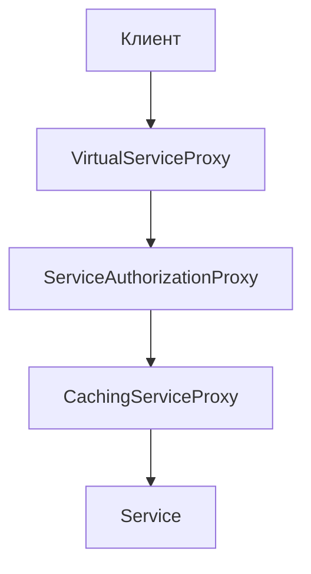

### Proxy (Прокси)

###### Так же известен как заместитель

Прокси - тип-обёртка, реализующий логику контроля доступа к объекту, реализующему абстракцию, которую реализует он сам.

То есть это паттерн проектирования, который позволяет подставлять вместо реальных объектов специальные объекты-прокси. Эти объекты перехватывают вызовы к оригинальному объекту, позволяя сделать что-то до или после передачи вызова оригиналу.

Представьте, что у нас есть некий класс Service. Он — скажем, делает сложный расчет или запрос к базе данных

```csharp 
// Это абстракция, наш контракт
public interface IService
{
    void DoOperation(OperationArgs args); 
}

// Это "тяжелый" объект
public class Service : IService
{
    public void DoOperation(OperationArgs args)
    {
        // Какая-то сложная, долгая или "дорогая" работа
        Console.WriteLine("Выполнение реальной операции...");
    }
}
```

Но вот проблема: прямой доступ к этому объекту может быть опасным или неэффективным. Разработчик сталкивается с несколькими вызовами. Во-первых, объект может быть "тяжелым" — его создание требует много ресурсов (времени, памяти), и если мы инициализируем его заранее, это замедляет приложение. Во-вторых, нужно контролировать доступ: не каждый пользователь должен иметь возможность вызвать метод, иначе возникнут риски безопасности, такие как несанкционированный доступ или неверные данные. В-третьих, операции могут быть повторяющимися, и каждый раз выполнять их заново — это расточительство ресурсов; лучше кэшировать результаты.

Идея: Вместо того чтобы давать клиенту прямой доступ к объекту, мы создаём заменитель (proxy) — объект, который реализует тот же контракт, но добавляет логику контроля.

Основная идея Proxy — это создание "обертки" (wrapper), которая выглядит точно так же, как оригинальный объект (реализует ту же абстракцию, например, интерфейс IService), но добавляет дополнительную логику контроля доступа или поведения. Proxy стоит между клиентом и реальным объектом, перехватывая вызовы и решая, что делать: пропустить ли их, модифицировать, отложить или даже симулировать.

Это решает проблему, абстрагируя "вспомогательную" логику от основного кода. Клиент работает с Proxy как с настоящим сервисом — он не знает о существовании обертки. Таким образом, паттерн обеспечивает прозрачность (transparency), контроль и гибкость.

Существует несколько видов прокси. Рассмотрим их:

#### 1. Virtual proxy (Виртуальный прокси)

- реализует ленивую инициализацию
- позволяет абстрагировать эту логику от потребителя

Проблема: Объект дорогой в создании. Зачем инициализировать, если не понадобится?

Решение: Virtual Proxy создаёт реальный объект только в момент первого обращения.

То есть этот вид прокси ответсвенене за ленивую инициализацию - создаём объект только когда нам это действительно надо. Так сказать откладываем инициализацию максимально
```csharp
public class VirtualServiceProxy : IService
{
    // Обратите внимание: не Service, а Lazy<Service>.
    // Это стандартный .NET класс для ленивой инициализации.
    private readonly Lazy<Service> _service = new Lazy<Service>(() => new Service());

    public void DoOperation(OperationArgs args)
    {
        // При обращении к .Value:
        // 1. Если Service ЕЩЕ НЕ создан -> Lazy<T> создаст его (вызовет new Service()) и вернет.
        // 2. Если Service УЖЕ создан -> Lazy<T> просто вернет существующий экземпляр.
        _service.Value.DoOperation(args);
    }
}
```
Практический смысл:
```csharp
// Использование
var proxy = new VirtualServiceProxy();
// До этого момента Service не создан!
proxy.DoOperation(new OperationArgs()); // Здесь создаётся Service
proxy.DoOperation(new OperationArgs()); // Service уже существует, просто используется
```

#### Defensive proxy (Защищающий прокси)

- реализует логику валидации, проверки допустимости действий

Проблема: Некоторые операции должны быть доступны только авторизованным пользователям. Нельзя же просить клиента проверять права везде?

Решение: Defensive Proxy встаёт перед реальным объектом и проверяет условия доступа.

```csharp
public class ServiceAuthorizationProxy : IService
{
    // А здесь мы храним ссылку на сервис (или на другой прокси).
    private readonly IService _service; 
    private readonly IUserInfoProvider _userInfoProvider; // Вспомогательный сервис для проверки прав

    // Мы получаем реальный сервис в конструкторе
    public ServiceAuthorizationProxy(IService service, IUserInfoProvider userInfoProvider)
    {
        _service = service;
        _userInfoProvider = userInfoProvider;
    }

    public void DoOperation(OperationArgs args)
    {
        // 1. Логика контроля доступа
        if (_userInfoProvider.GetUserInfo().IsAuthenticated)
        {
            // 2. Если проверка пройдена - передаем вызов (dispatch)
            _service.DoOperation(args);
        }
        else
        {
            // 3. Если не пройдена - не передаем. Можем кинуть исключение или просто проигнорировать.
            Console.WriteLine("Access Denied!"); 
            // throw new UnauthorizedAccessException("...");
        }
    }
}
```
Практический смысл:
```csharp
IService service = new Service();
var userProvider = new HttpContextUserInfoProvider(); // Берёт пользователя из контекста запроса

// Оборачиваем в proxy с защитой
IService protectedService = new ServiceAuthorizationProxy(service, userProvider);

// Клиент работает с protectedService
// Если пользователь не авторизован — исключение
// Если авторизован — операция выполняется
protectedService.DoOperation(args);
```

#### Caching proxy (Кеширующий прокси/Мемоизация результатов)
- реализует кеширование/мемоизацию
- абстрагирует кеширование от пользователя

Если операция дорогая, а результат для тех же аргументов не меняется, зачем выполнять ее дважды?

Проблема: Операция дорогая (поиск в БД, расчёты). Одинаковые запросы вычисляются заново каждый раз.

Решение: Caching Proxy запоминает результаты и возвращает их при повторных запросах с теми же параметрами.
```csharp
// Допустим, наш сервис возвращает результат
public interface IService
{
    OperationResult DoOperation(OperationArgs args);
}

public class CachingServiceProxy : IService
{
    private readonly IService _service; // Реальный сервис
    // Наш кеш. Ключ - аргументы, Значение - результат.
    private readonly Dictionary<OperationArgs, OperationResult> _cache; 

    public CachingServiceProxy(IService service)
    {
        _service = service;
        _cache = new Dictionary<OperationArgs, OperationResult>();
    }

    public OperationResult DoOperation(OperationArgs args)
    {
        // 1. Сначала смотрим в кеш
        if (_cache.TryGetValue(args, out var result))
        {
            // Нашли! Возвращаем из кеша, НЕ ДЕРГАЯ реальный сервис.
            Console.WriteLine("Returning from cache...");
            return result;
        }

        // 2. В кеше нет. Выполняем "дорогую" операцию
        Console.WriteLine("Calling real service...");
        OperationResult realResult = _service.DoOperation(args);

        // 3. Сохраняем в кеш для будущего
        _cache[args] = realResult;
        return realResult;
    }
}
```
Практический смысл:
```csharp
var service = new Service();
var cachedService = new CachingServiceProxy(service);

var args = new OperationArgs { Query = "SELECT * FROM Users" };

var result1 = cachedService.DoOperation(args); // Выполняет запрос, кеширует
var result2 = cachedService.DoOperation(args); // Берёт из кеша! Намного быстрее
```

#### Remote proxy (удалённый прокси)

Удалённы в плане далеко, а не в плане мы его удалили

Удалённый прокси (Remote Proxy) применяется, когда требуется работать с объектом, который физически находится вне вашей программы — например, на другом сервере или сервисе (через HTTP, gRPC, WebSocket и др.). Клиент работает с обычным интерфейсом, а прокси скрывает детали общения с удалённой системой. Примеры таких прокси — сервисы, оборачивающие сетевые вызовы.

Пример 1: HTTP-прокси для REST API
```csharp
// Интерфейс - бизнес-функционал
public interface IUserService
{
    UserInfo GetUserById(int id);
}

// Реализация-прокси: вместо локального обращения делает HTTP-запрос
public class RemoteUserServiceProxy : IUserService
{
    private readonly HttpClient _httpClient;

    public RemoteUserServiceProxy(HttpClient httpClient)
    {
        _httpClient = httpClient;
    }

    public UserInfo GetUserById(int id)
    {
        var response = _httpClient.GetAsync($"https://api.example.com/users/{id}").Result;
        response.EnsureSuccessStatusCode();
        return JsonConvert.DeserializeObject<UserInfo>(response.Content.ReadAsStringAsync().Result);
    }
}
```

Здесь прокси инкапсулирует все детали передачи по HTTP. Клиенту не важно, что вызов работает через сеть — интерфейс один!

Пример 2: Прокси для работы с JavaScript через WebSocket

```csharp
public interface IMessageService
{
    void SendMessage(string message);
}

public class RemoteMessageServiceProxy : IMessageService
{
    private readonly IWebSocketClient _socket;

    public RemoteMessageServiceProxy(IWebSocketClient socket)
    {
        _socket = socket;
    }

    public void SendMessage(string message)
    {
        _socket.SendAsync(Encoding.UTF8.GetBytes(message));
    }
}
```
Такое прокси позволяет работать с удалённой системой так же, как с локальной, не заботясь о деталях протокола и транспорта.

Пример использования:
```csharp
public static void Main()
{
    // Создаём HTTP-клиент и прокси
    var httpClient = new HttpClient();
    IUserService userService = new RemoteUserServiceProxy(httpClient);

    // Работаем как обычно — будто пользователь лежит внутри программы
    var user = userService.GetUserById(42);
    Console.WriteLine($"Имя пользователя: {user.Name}");
}
```

Remote Proxy полезен для инкапсуляции сетевого взаимодействия или доступа к внешнему ресурсу через привычный интерфейс. Он позволяет легко переключать источник данных без изменения клиентской логики и скрывает сложности сериализации, передачи и обработки ошибок

Теперь важный момент: Proxy разных видов можно комбинировать.

```csharp
// Сначала создаём реальный сервис
IService baseService = new Service();

// Оборачиваем в кеширующий proxy
IService cachedService = new CachingServiceProxy(baseService);

// Оборачиваем результат в proxy с авторизацией
IService protectedCachedService = 
    new ServiceAuthorizationProxy(cachedService, userProvider);

// Оборачиваем в ленивый proxy
IService lazyProxy = new VirtualServiceProxy(protectedCachedService);
```

То есть мы по очереди накидываем все проверки, не меняя исходный класс




#### Proxy vs Decorator

1. Виды композиции:
    1. Прокси может использовать как агрегацию, так и ассоциацию
    2. Декоратор использует только агрегацию.
2. Controlled dispatch vs Extended dispatch
    1. Прокси — это Controlled Dispatch (Контролирующая диспетчеризация). Он контролирует оборачиваемый объект.Его главная задача — контроль. Он решает, вызывать ли метод реального объекта, когда его вызывать и при каких условиях. Может вызвать, может не вызвать, может модифицировать. То есть он может вообще не вызывать целевой объект (как в DefensiveProxy при неудачной проверке).
    2. Декоратор — это Extended Dispatch (Расширяющая диспетчеризация). Он только расширяет логику оборачиваемого объекта. Его задача — добавить новое поведение до или после вызова метода целевого объекта. Он обязательно вызывает оборачиваемый объект.
3. Наличие оборачиваемого объекта
    1. Прокси – может имитировать наличие объекта. То есть он может имитировать наличие объекта. VirtualProxy — идеальный пример. Объекта еще нет, но прокси уже есть и ведет себя как объект, "прикрывая" его отсутствие до первого вызова.
    2. Декоратор – объект должен существовать. Вы не можете "декорировать" пустоту.

```csharp
// PROXY: Может не вызвать реальный объект
public class ServiceAuthorizationProxy : IService
{
    public void DoOperation(OperationArgs args)
    {
        if (!userIsAuthorized)
        {
            // Не вызываем _service вообще!
            throw new Exception("Access denied");
        }
        
        _service.DoOperation(args);
    }
}

// DECORATOR: Всегда вызывает, но добавляет логику
public class LoggingServiceDecorator : IService
{
    public void DoOperation(OperationArgs args)
    {
        Console.WriteLine("До операции");
        _service.DoOperation(args); // Всегда вызвать!
        Console.WriteLine("После операции");
    }
}
```

Рассмотрим примеры разных прокси:

Пример 1: Virtual Proxy для тяжёлого сервиса
```csharp
// В реальной жизни это может быть подключение к БД
public class DatabaseService : IService
{
    public DatabaseService()
    {
        Console.WriteLine("Подключаюсь к БД... (2 секунды ожидания)");
        Thread.Sleep(2000);
        Console.WriteLine("БД готова!");
    }
    
    public void DoOperation(OperationArgs args)
    {
        Console.WriteLine($"Выполняю запрос: {args.Query}");
    }
}

// Virtual Proxy создаст сервис только когда его вызовут
public class VirtualDatabaseProxy : IService
{
    private readonly Lazy<DatabaseService> _db = 
        new Lazy<DatabaseService>(() => new DatabaseService());
    
    public void DoOperation(OperationArgs args)
    {
        _db.Value.DoOperation(args);
    }
}
```

Пример 2: Defensive Proxy для API
```csharp
public interface IPaymentService
{
    void ProcessPayment(decimal amount);
}

public class PaymentService : IPaymentService
{
    public void ProcessPayment(decimal amount)
    {
        Console.WriteLine($"Обрабатываю платёж на сумму: {amount}");
    }
}

public class PaymentAuthorizationProxy : IPaymentService
{
    private readonly IPaymentService _service;
    private readonly IUserContext _userContext;
    
    public PaymentAuthorizationProxy(IPaymentService service, IUserContext userContext)
    {
        _service = service;
        _userContext = userContext;
    }
    
    public void ProcessPayment(decimal amount)
    {
        var user = _userContext.CurrentUser;
        
        // Контроль 1: Авторизация
        if (user == null)
            throw new UnauthorizedAccessException("Пользователь не авторизован");
        
        // Контроль 2: Проверка лимитов
        if (amount > user.DailyLimit)
            throw new InvalidOperationException("Превышен дневной лимит");
        
        // Контроль 3: Логирование для аудита
        Console.WriteLine($"Платёж от {user.Name} на сумму {amount}");
        
        // Только после всех проверок вызываем реальный сервис
        _service.ProcessPayment(amount);
    }
}
```

Пример 3: Caching Proxy для дорогих расчётов
```csharp
public interface ICalculationService
{
    int Fibonacci(int n);
}

public class CalculationService : ICalculationService
{
    public int Fibonacci(int n)
    {
        // Очень дорогой расчёт
        if (n <= 1) return n;
        return Fibonacci(n - 1) + Fibonacci(n - 2);
    }
}

public class CachingCalculationProxy : ICalculationService
{
    private readonly ICalculationService _service;
    private readonly Dictionary<int, int> _cache;
    
    public CachingCalculationProxy(ICalculationService service)
    {
        _service = service;
        _cache = new Dictionary<int, int>();
    }
    
    public int Fibonacci(int n)
    {
        if (_cache.ContainsKey(n))
        {
            Console.WriteLine($"Fibonacci({n}) из кеша: {_cache[n]}");
            return _cache[n];
        }
        
        Console.WriteLine($"Fibonacci({n}) вычисляю...");
        var result = _service.Fibonacci(n);
        _cache[n] = result;
        
        return result;
    }
}
```

Ещё пример:
```csharp
public class Program
{
    public static void Main()
    {
        Console.WriteLine("=== Демонстрация Proxy паттерна ===\n");
        
        // Сценарий 1: Virtual Proxy
        Console.WriteLine("--- Сценарий 1: Virtual Proxy ---");
        IService lazyService = new VirtualServiceProxy();
        Console.WriteLine("Proxy создан, но сервис ещё не инициализирован");
        lazyService.DoOperation(new OperationArgs { Query = "SELECT *" });
        Console.WriteLine("Теперь сервис инициализирован\n");
        
        // Сценарий 2: Authorization Proxy
        Console.WriteLine("--- Сценарий 2: Authorization Proxy ---");
        IService baseService = new Service();
        var userProvider = new MockUserInfoProvider(isAuthenticated: false);
        IService protectedService = new ServiceAuthorizationProxy(baseService, userProvider);
        
        try
        {
            protectedService.DoOperation(new OperationArgs());
        }
        catch (UnauthorizedAccessException ex)
        {
            Console.WriteLine($"Ошибка: {ex.Message}");
        }
        
        userProvider.SetAuthenticated(true);
        protectedService.DoOperation(new OperationArgs());
        Console.WriteLine();
        
        // Сценарий 3: Caching Proxy
        Console.WriteLine("--- Сценарий 3: Caching Proxy ---");
        ICalculationService calc = new CalculationService();
        ICalculationService cachedCalc = new CachingCalculationProxy(calc);
        
        var n = 5;
        Console.WriteLine($"Первый вызов Fibonacci({n}):");
        var result1 = cachedCalc.Fibonacci(n);
        Console.WriteLine($"Результат: {result1}\n");
        
        Console.WriteLine($"Второй вызов Fibonacci({n}):");
        var result2 = cachedCalc.Fibonacci(n);
        Console.WriteLine($"Результат: {result2}\n");
        
        // Сценарий 4: Комбинирование нескольких Proxy
        Console.WriteLine("--- Сценарий 4: Стёк Proxy ---");
        IService finalService = new Service();
        finalService = new CachingServiceProxy(finalService);
        finalService = new ServiceAuthorizationProxy(finalService, userProvider);
        // finalService = new VirtualServiceProxy(finalService); // Можно добавить
        
        Console.WriteLine("Операция через стёк proxy:");
        finalService.DoOperation(new OperationArgs { Query = "SELECT COUNT(*)" });
    }
}

public class MockUserInfoProvider : IUserInfoProvider
{
    private bool _isAuthenticated;
    
    public MockUserInfoProvider(bool isAuthenticated)
    {
        _isAuthenticated = isAuthenticated;
    }
    
    public void SetAuthenticated(bool value) => _isAuthenticated = value;
    
    public UserInfo GetUserInfo() => new UserInfo 
    { 
        IsAuthenticated = _isAuthenticated 
    };
}

public class UserInfo
{
    public bool IsAuthenticated { get; set; }
}

public class OperationArgs
{
    public string Query { get; set; }
}

public class OperationResult
{
    public object Data { get; set; }
}

/*
=== Демонстрация Proxy паттерна ===

--- Сценарий 1: Virtual Proxy ---
Proxy создан, но сервис ещё не инициализирован
[Service инициализирован]
Операция выполнена

--- Сценарий 2: Authorization Proxy ---
Ошибка: Операция доступна только авторизованным пользователям
Операция выполнена

--- Сценарий 3: Caching Proxy ---
Первый вызов Fibonacci(5):
Fibonacci(5) вычисляю...
Результат: 5

Второй вызов Fibonacci(5):
Fibonacci(5) из кеша: 5
Результат: 5

--- Сценарий 4: Стёк Proxy ---
Операция через стёк proxy:
Операция выполнена
*/
```

Применимость:

- **Ленивая инициализация (виртуальный прокси). Когда у вас есть тяжёлый объект, грузящий данные из файловой системы или базы данных.**
Вместо того, чтобы грузить данные сразу после старта программы, можно сэкономить ресурсы и создать объект тогда, когда он действительно понадобится.

- **Защита доступа (защищающий прокси). Когда в программе есть разные типы пользователей, и вам хочется защищать объект от неавторизованного доступа. Например, если ваши объекты — это важная часть операционной системы, а пользователи — сторонние программы (хорошие или вредоносные).**
Прокси может проверять доступ при каждом вызове и передавать выполнение служебному объекту, если доступ разрешён.

- **Локальный запуск сервиса (удалённый прокси). Когда настоящий сервисный объект находится на удалённом сервере.**
В этом случае заместитель транслирует запросы клиента в вызовы по сети в протоколе, понятном удалённому сервису.

- **Логирование запросов (логирующий прокси). Когда требуется хранить историю обращений к сервисному объекту.**
Заместитель может сохранять историю обращения клиента к сервисному объекту.

-**Кеширование объектов («умная» ссылка). Когда нужно кешировать результаты запросов клиентов и управлять их жизненным циклом.**
Заместитель может подсчитывать количество ссылок на сервисный объект, которые были отданы клиенту и остаются активными. Когда все ссылки освобождаются, можно будет освободить и сам сервисный объект (например, закрыть подключение к базе данных).

Кроме того, Заместитель может отслеживать, не менял ли клиент сервисный объект. Это позволит использовать объекты повторно и здóрово экономить ресурсы, особенно если речь идёт о больших прожорливых сервисах.

Шаги реализации:

1. Определите интерфейс, который бы сделал прокси и оригинальный объект взаимозаменяемыми.

2. Создайте класс прокси. Он должен содержать ссылку на сервисный объект. Чаще всего, сервисный объект создаётся самим прокси. В редких случаях заместитель получает готовый сервисный объект от клиента через конструктор.

3. Реализуйте методы прокси в зависимости от его предназначения. В большинстве случаев, проделав какую-то полезную работу, методы прокси должны передать запрос сервисному объекту.

4. Подумайте о введении фабрики, которая решала бы, какой из объектов создавать — прокси или реальный сервисный объект. Но, с другой стороны, эта логика может быть помещена в создающий метод самого прокси.

5.Подумайте, не реализовать ли вам ленивую инициализацию сервисного объекта при первом обращении клиента к методам прокси.
