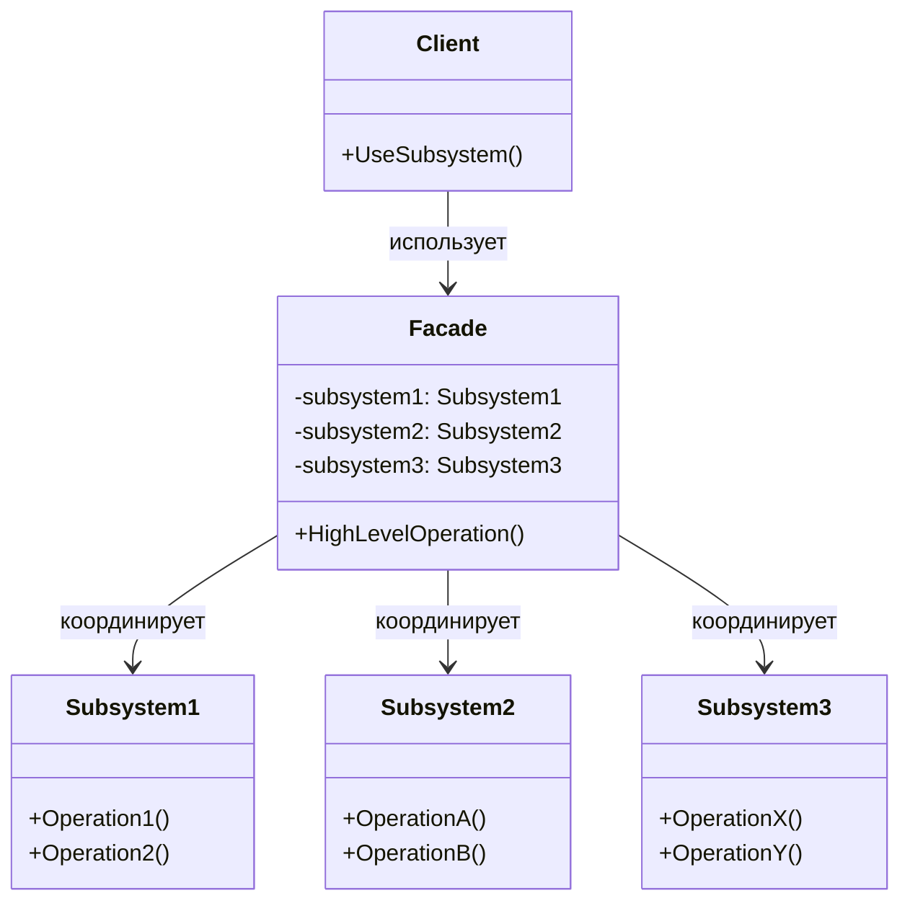
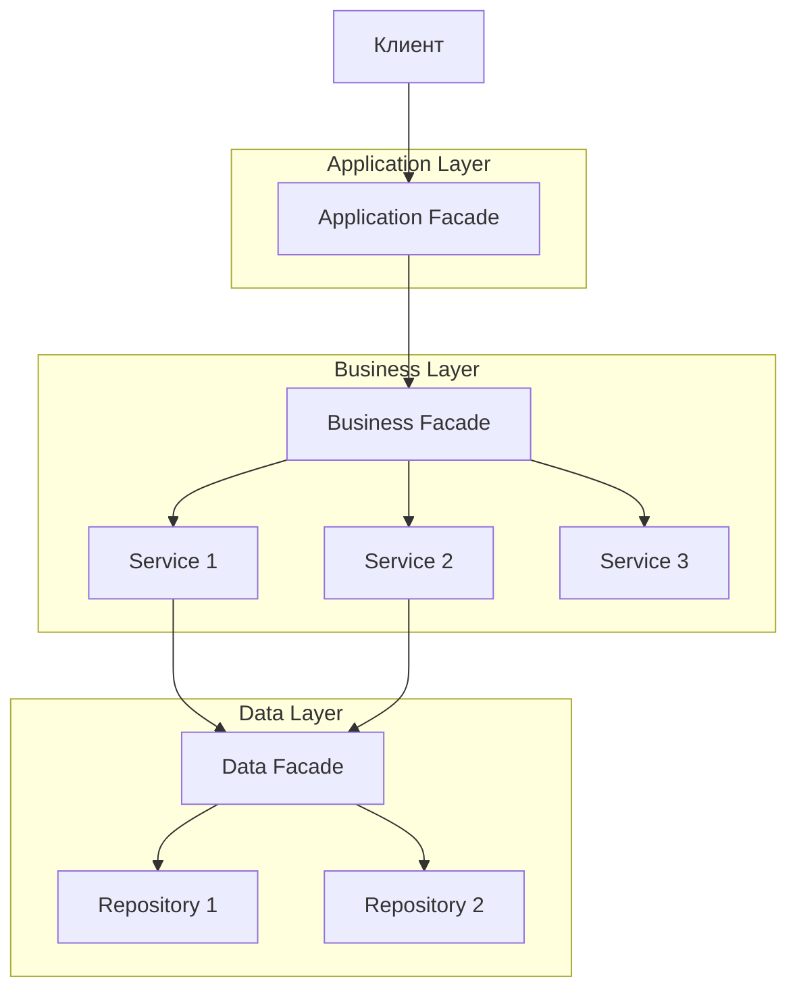

# Паттерн Facade (Фасад)

## Введение

В процессе разработки программного обеспечения мы часто сталкиваемся с ситуацией, когда система разрастается и состоит из множества взаимосвязанных компонентов. Клиентскому коду становится сложно работать напрямую со всеми этими компонентами: нужно понимать их интерфейсы, знать порядок вызовов, учитывать зависимости между ними. Паттерн Facade (Фасад) решает эту проблему, предоставляя единый упрощённый интерфейс к сложной подсистеме.

## Определение паттерна

> Оркестрация одной или набора сложных операций в каком-либо типе. 

**Facade (Фасад)** — структурный паттерн проектирования, который предоставляет унифицированный высокоуровневый интерфейс к набору интерфейсов подсистемы, упрощая её использование.

Фасад не скрывает функциональность подсистемы полностью, а лишь предоставляет удобную точку входа для наиболее частых сценариев использования. При необходимости клиент всё ещё может обращаться к подсистеме напрямую.

## Проблема

Представьте ситуацию: ваше приложение должно работать со сложной библиотекой для обработки видео. Эта библиотека содержит десятки классов для работы с различными форматами, кодеками, потоками данных. Чтобы выполнить простую операцию — например, конвертировать видео из одного формата в другой — вам нужно:

1. Создать объект для чтения исходного файла
2. Инициализировать декодер для исходного формата
3. Настроить кодек для целевого формата
4. Создать буферы для аудио и видео потоков
5. Запустить процесс конвертации
6. Обработать возможные ошибки на каждом этапе
7. Корректно освободить ресурсы

Клиентский код вынужден знать все эти детали реализации, что делает его сложным и хрупким. Любое изменение в библиотеке может потребовать изменений во всех местах, где она используется.

## Решение

Паттерн Facade предлагает создать класс-фасад, который инкапсулирует всю сложность работы с подсистемой и предоставляет простой интерфейс для типичных операций. Клиент работает только с фасадом, вызывая его высокоуровневые методы.

Продолжая пример с видеоконвертацией, фасад может предоставить один метод `ConvertVideo(string inputPath, string outputPath, VideoFormat format)`, который внутри выполнит все необходимые шаги, скрывая сложность от клиента.

## Структура паттерна

Паттерн Facade состоит из следующих элементов:



**Основные участники:**

1. **Facade (Фасад)** — класс, предоставляющий простой интерфейс для работы с подсистемой. Знает, каким классам подсистемы делегировать работу, и координирует их взаимодействие.

2. **Subsystems (Подсистемы)** — множество классов, реализующих функциональность системы. Выполняют реальную работу, но не знают о существовании фасада. Могут использоваться клиентом напрямую, если требуется более гибкое управление.

3. **Client (Клиент)** — использует фасад вместо прямого обращения к объектам подсистемы.

## Детальный пример: система электронной коммерции

Рассмотрим реалистичный пример системы оформления заказов в интернет-магазине. Система должна выполнять несколько операций: обработать платёж, организовать доставку, обновить складские запасы и отправить уведомление клиенту.

### Шаг 1. Подсистемы (классы с реальной функциональностью)

Начнём с определения классов, которые инкапсулируют отдельные аспекты бизнес-логики. Каждый класс отвечает за одну конкретную задачу:

```csharp
// Подсистема обработки платежей
public class PaymentService
{
    // Обрабатывает платёж через платёжный шлюз
    public PaymentResult ProcessPayment(PaymentDetails paymentDetails)
    {
        // Валидация платёжных данных
        if (string.IsNullOrEmpty(paymentDetails.CardNumber))
        {
            return new PaymentResult 
            { 
                Success = false, 
                Message = "Номер карты не указан" 
            };
        }

        // Взаимодействие с платёжным шлюзом (упрощённая логика)
        Console.WriteLine($"Обработка платежа на сумму {paymentDetails.Amount:C}...");
        
        // Имитация обработки
        var transactionId = Guid.NewGuid().ToString();
        
        return new PaymentResult
        {
            Success = true,
            TransactionId = transactionId,
            Message = "Платёж успешно обработан"
        };
    }
}

// Подсистема управления доставкой
public class DeliveryService
{
    // Планирует доставку по указанному адресу
    public DeliveryResult ScheduleDelivery(string address, DateTime requestedDate)
    {
        // Проверка возможности доставки
        if (string.IsNullOrEmpty(address))
        {
            return new DeliveryResult 
            { 
                Success = false, 
                Message = "Адрес доставки не указан" 
            };
        }

        // Расчёт даты доставки (упрощённая логика)
        var deliveryDate = requestedDate.AddDays(3);
        Console.WriteLine($"Доставка запланирована на адрес: {address}");
        Console.WriteLine($"Ожидаемая дата доставки: {deliveryDate:dd.MM.yyyy}");

        return new DeliveryResult
        {
            Success = true,
            DeliveryDate = deliveryDate,
            TrackingNumber = $"TRACK-{Guid.NewGuid().ToString().Substring(0, 8)}",
            Message = "Доставка успешно запланирована"
        };
    }
}

// Подсистема управления складскими запасами
public class InventoryService
{
    // Резервирует товары на складе
    public InventoryResult ReserveItems(List<OrderItem> items)
    {
        if (items == null || items.Count == 0)
        {
            return new InventoryResult 
            { 
                Success = false, 
                Message = "Список товаров пуст" 
            };
        }

        // Проверка наличия товаров на складе (упрощённая логика)
        Console.WriteLine($"Резервирование {items.Count} товара(ов) на складе...");
        
        foreach (var item in items)
        {
            Console.WriteLine($"  - {item.ProductName}: {item.Quantity} шт.");
        }

        return new InventoryResult
        {
            Success = true,
            ReservationId = Guid.NewGuid().ToString(),
            Message = "Товары успешно зарезервированы"
        };
    }
}

// Подсистема уведомлений
public class NotificationService
{
    // Отправляет email уведомление клиенту
    public void SendOrderConfirmation(string email, string orderId, string trackingNumber)
    {
        if (string.IsNullOrEmpty(email))
        {
            Console.WriteLine("Предупреждение: email не указан, уведомление не отправлено");
            return;
        }

        // Имитация отправки email
        Console.WriteLine($"Отправка email на адрес: {email}");
        Console.WriteLine($"  Номер заказа: {orderId}");
        Console.WriteLine($"  Трек-номер доставки: {trackingNumber}");
        Console.WriteLine("Email успешно отправлен");
    }
}
```

### Шаг 2. Вспомогательные классы (модели данных)

Определим классы для передачи данных между компонентами:

```csharp
// Модель информации о заказе
public class OrderInfo
{
    public string OrderId { get; set; }
    public string CustomerEmail { get; set; }
    public string DeliveryAddress { get; set; }
    public DateTime RequestedDeliveryDate { get; set; }
    public PaymentDetails PaymentDetails { get; set; }
    public List<OrderItem> Items { get; set; }
}

// Детали платежа
public class PaymentDetails
{
    public string CardNumber { get; set; }
    public decimal Amount { get; set; }
}

// Элемент заказа
public class OrderItem
{
    public string ProductName { get; set; }
    public int Quantity { get; set; }
}

// Результаты операций различных подсистем
public class PaymentResult
{
    public bool Success { get; set; }
    public string TransactionId { get; set; }
    public string Message { get; set; }
}

public class DeliveryResult
{
    public bool Success { get; set; }
    public DateTime DeliveryDate { get; set; }
    public string TrackingNumber { get; set; }
    public string Message { get; set; }
}

public class InventoryResult
{
    public bool Success { get; set; }
    public string ReservationId { get; set; }
    public string Message { get; set; }
}

// Итоговый результат операции оформления заказа
public class OrderResult
{
    public bool Success { get; set; }
    public string OrderId { get; set; }
    public string Message { get; set; }
    public PaymentResult PaymentInfo { get; set; }
    public DeliveryResult DeliveryInfo { get; set; }
    public InventoryResult InventoryInfo { get; set; }
}
```

### Шаг 3. Фасад (упрощённый интерфейс)

Теперь создадим класс-фасад, который координирует работу всех подсистем:

```csharp
// Фасад для оформления заказов
public class OrderFacade
{
    // Зависимости от подсистем внедряются через конструктор
    private readonly PaymentService _paymentService;
    private readonly DeliveryService _deliveryService;
    private readonly InventoryService _inventoryService;
    private readonly NotificationService _notificationService;

    public OrderFacade(
        PaymentService paymentService,
        DeliveryService deliveryService,
        InventoryService inventoryService,
        NotificationService notificationService)
    {
        _paymentService = paymentService;
        _deliveryService = deliveryService;
        _inventoryService = inventoryService;
        _notificationService = notificationService;
    }

    // Высокоуровневая операция: полное оформление заказа
    // Клиенту достаточно вызвать один метод вместо координации четырёх подсистем
    public OrderResult PlaceOrder(OrderInfo orderInfo)
    {
        Console.WriteLine($"\n=== Начало оформления заказа {orderInfo.OrderId} ===\n");

        var result = new OrderResult { OrderId = orderInfo.OrderId };

        // Шаг 1: Резервирование товаров на складе
        var inventoryResult = _inventoryService.ReserveItems(orderInfo.Items);
        result.InventoryInfo = inventoryResult;

        if (!inventoryResult.Success)
        {
            result.Success = false;
            result.Message = $"Ошибка резервирования товаров: {inventoryResult.Message}";
            return result;
        }

        // Шаг 2: Обработка платежа
        var paymentResult = _paymentService.ProcessPayment(orderInfo.PaymentDetails);
        result.PaymentInfo = paymentResult;

        if (!paymentResult.Success)
        {
            result.Success = false;
            result.Message = $"Ошибка обработки платежа: {paymentResult.Message}";
            // В реальной системе здесь нужно отменить резервирование товаров
            return result;
        }

        // Шаг 3: Планирование доставки
        var deliveryResult = _deliveryService.ScheduleDelivery(
            orderInfo.DeliveryAddress, 
            orderInfo.RequestedDeliveryDate
        );
        result.DeliveryInfo = deliveryResult;

        if (!deliveryResult.Success)
        {
            result.Success = false;
            result.Message = $"Ошибка планирования доставки: {deliveryResult.Message}";
            // В реальной системе здесь нужно отменить платёж и резервирование
            return result;
        }

        // Шаг 4: Отправка уведомления клиенту
        _notificationService.SendOrderConfirmation(
            orderInfo.CustomerEmail,
            orderInfo.OrderId,
            deliveryResult.TrackingNumber
        );

        // Формирование успешного результата
        result.Success = true;
        result.Message = "Заказ успешно оформлен";

        Console.WriteLine($"\n=== Заказ {orderInfo.OrderId} успешно оформлен ===\n");
        
        return result;
    }

    // Дополнительная высокоуровневая операция: отмена заказа
    public OrderResult CancelOrder(string orderId)
    {
        Console.WriteLine($"\n=== Отмена заказа {orderId} ===\n");
        
        // В реальной системе здесь была бы координация отмены во всех подсистемах
        Console.WriteLine("Отмена резервирования товаров...");
        Console.WriteLine("Возврат средств...");
        Console.WriteLine("Отмена доставки...");
        Console.WriteLine("Отправка уведомления об отмене...");

        return new OrderResult
        {
            Success = true,
            OrderId = orderId,
            Message = "Заказ успешно отменён"
        };
    }
}
```

### Шаг 4. Использование фасада клиентским кодом

Теперь посмотрим, как клиент использует фасад. Обратите внимание, насколько код стал проще:

```csharp
public class Program
{
    public static void Main()
    {
        // Инициализация подсистем (в реальном приложении используется DI-контейнер)
        var paymentService = new PaymentService();
        var deliveryService = new DeliveryService();
        var inventoryService = new InventoryService();
        var notificationService = new NotificationService();

        // Создание фасада
        var orderFacade = new OrderFacade(
            paymentService,
            deliveryService,
            inventoryService,
            notificationService
        );

        // Подготовка данных заказа
        var orderInfo = new OrderInfo
        {
            OrderId = "ORD-2025-001",
            CustomerEmail = "ivan.petrov@example.com",
            DeliveryAddress = "Санкт-Петербург, Кронверкский проспект, 49",
            RequestedDeliveryDate = DateTime.Now,
            PaymentDetails = new PaymentDetails
            {
                CardNumber = "1234-5678-9012-3456",
                Amount = 5999.99m
            },
            Items = new List<OrderItem>
            {
                new OrderItem { ProductName = "Ноутбук ASUS", Quantity = 1 },
                new OrderItem { ProductName = "Мышь Logitech", Quantity = 2 }
            }
        };

        // Вызов единственного метода для оформления всего заказа
        // Клиенту не нужно знать о четырёх подсистемах и порядке их вызова
        var result = orderFacade.PlaceOrder(orderInfo);

        // Обработка результата
        if (result.Success)
        {
            Console.WriteLine($"\n✓ Успех: {result.Message}");
            Console.WriteLine($"Трек-номер доставки: {result.DeliveryInfo.TrackingNumber}");
            Console.WriteLine($"ID транзакции: {result.PaymentInfo.TransactionId}");
        }
        else
        {
            Console.WriteLine($"\n✗ Ошибка: {result.Message}");
        }
    }
}
```

### Без фасада vs С фасадом

Для наглядности сравним код клиента без использования фасада:

```csharp
// БЕЗ ФАСАДА: клиент должен знать о всех подсистемах и их взаимодействии
public void PlaceOrderWithoutFacade(OrderInfo orderInfo)
{
    // Клиент должен создать все сервисы
    var inventoryService = new InventoryService();
    var paymentService = new PaymentService();
    var deliveryService = new DeliveryService();
    var notificationService = new NotificationService();

    // Клиент должен знать правильный порядок вызовов
    var inventoryResult = inventoryService.ReserveItems(orderInfo.Items);
    if (!inventoryResult.Success)
    {
        Console.WriteLine("Ошибка резервирования");
        return;
    }

    var paymentResult = paymentService.ProcessPayment(orderInfo.PaymentDetails);
    if (!paymentResult.Success)
    {
        Console.WriteLine("Ошибка платежа");
        // Клиент должен помнить об откате операций
        // InventoryService.CancelReservation(inventoryResult.ReservationId);
        return;
    }

    var deliveryResult = deliveryService.ScheduleDelivery(
        orderInfo.DeliveryAddress,
        orderInfo.RequestedDeliveryDate
    );
    if (!deliveryResult.Success)
    {
        Console.WriteLine("Ошибка доставки");
        // Клиент должен откатить все предыдущие операции
        return;
    }

    notificationService.SendOrderConfirmation(
        orderInfo.CustomerEmail,
        orderInfo.OrderId,
        deliveryResult.TrackingNumber
    );

    Console.WriteLine("Заказ оформлен");
}

// С ФАСАДОМ: простой и понятный код
public void PlaceOrderWithFacade(OrderInfo orderInfo)
{
    var orderFacade = new OrderFacade(
        new PaymentService(),
        new DeliveryService(),
        new InventoryService(),
        new NotificationService()
    );

    var result = orderFacade.PlaceOrder(orderInfo);
    
    Console.WriteLine(result.Success 
        ? $"Заказ оформлен: {result.Message}" 
        : $"Ошибка: {result.Message}");
}
```

## Ключевые принципы работы с фасадом

### 1. Фасад как координатор (Orchestration)

Фасад не реализует бизнес-логику самостоятельно. Его задача — координация (orchestration) вызовов реальных объектов подсистемы:

- **Фасад знает** о существовании всех необходимых подсистем и понимает порядок их вызова
- **Подсистемы не знают** о существовании фасада и работают независимо
- **Каждая подсистема** отвечает только за свою область ответственности (Single Responsibility Principle)

### 2. Request-Response модель

Фасад идеально подходит для реализации паттерна Request-Response:
- Клиент формирует запрос (request) с необходимыми данными
- Фасад обрабатывает запрос, координируя работу подсистем
- Клиент получает структурированный ответ (response) с результатом операции

Этот подход делает систему предсказуемой и упрощает обработку ошибок.

### 3. Инкапсуляция сложности

Фасад скрывает от клиента:
- Детали реализации подсистем
- Порядок вызова методов
- Управление зависимостями между подсистемами
- Обработку промежуточных ошибок и откат транзакций

## Когда применять паттерн Facade

### 1. Упрощение работы со сложной подсистемой

Используйте фасад, когда нужен простой интерфейс к сложной подсистеме. По мере роста системы классов становится больше, они мельчают и становятся более специализированными. Это хорошо для гибкости и переиспользования, но усложняет работу для клиентов, которым нужна базовая функциональность.

**Пример:** библиотека для работы с видео содержит десятки классов для различных форматов и кодеков. Большинству клиентов нужна простая операция конвертации, а не низкоуровневый доступ ко всем возможностям.

### 2. Разделение на слои (Layering)

Используйте фасады для организации слоистой архитектуры. Каждый слой предоставляет фасад как точку входа, и слои взаимодействуют друг с другом только через фасады.

**Пример:** система обработки мультимедиа разделена на слой работы с аудио и слой работы с видео. Каждый слой имеет свой фасад, и они взаимодействуют только через публичные интерфейсы фасадов.



### 3. Интеграция с внешними библиотеками

Когда вы работаете с внешней библиотекой или API, фасад позволяет:
- Адаптировать интерфейс библиотеки под нужды вашего приложения
- Изолировать зависимость от конкретной библиотеки (легче заменить в будущем)
- Упростить тестирование (mock/stub для фасада вместо всей библиотеки)

**Пример:** интеграция с библиотекой для работы с PDF. Вместо работы напрямую с десятками классов библиотеки, создаётся фасад `PdfFacade` с методами `CreatePdf()`, `ConvertToPdf()`, `MergePdfs()`.

### 4. Централизация инициализации

Фасад может использоваться для упрощения инициализации сложной системы:

```csharp
// Без фасада: клиент должен знать порядок инициализации
var config = new Configuration();
config.Load("settings.json");

var logger = new Logger(config.LogPath);
logger.Initialize();

var database = new Database(config.ConnectionString, logger);
database.Connect();

var cache = new Cache(config.CacheSize);
cache.Initialize();

var app = new Application(config, logger, database, cache);
app.Start();

// С фасадом: всё скрыто внутри
var appFacade = new ApplicationFacade();
appFacade.Initialize("settings.json");
appFacade.Start();
```

## Пример из реального мира: работа с внешним API

Рассмотрим пример создания фасада для работы со сложным API погодного сервиса:

```csharp
// Классы внешней библиотеки (сложные и низкоуровневые)
public class WeatherApiClient
{
    public ApiResponse GetRawData(double latitude, double longitude) { /* ... */ }
}

public class WeatherDataParser
{
    public ParsedData Parse(ApiResponse response, DataFormat format) { /* ... */ }
}

public class WeatherUnitsConverter
{
    public ConvertedData Convert(ParsedData data, Units targetUnits) { /* ... */ }
}

public class WeatherCacheManager
{
    public void Store(string key, object data, TimeSpan expiration) { /* ... */ }
    public object Retrieve(string key) { /* ... */ }
}

// Фасад: простой интерфейс для клиента
public class WeatherFacade
{
    private readonly WeatherApiClient _apiClient;
    private readonly WeatherDataParser _parser;
    private readonly WeatherUnitsConverter _converter;
    private readonly WeatherCacheManager _cache;

    public WeatherFacade()
    {
        // Инициализация всех зависимостей
        _apiClient = new WeatherApiClient();
        _parser = new WeatherDataParser();
        _converter = new WeatherUnitsConverter();
        _cache = new WeatherCacheManager();
    }

    // Единственный метод, который нужен большинству клиентов
    public WeatherInfo GetWeather(string city)
    {
        // Проверка кеша
        var cacheKey = $"weather_{city}";
        var cached = _cache.Retrieve(cacheKey);
        if (cached != null)
        {
            return (WeatherInfo)cached;
        }

        // Получение координат города (упрощено)
        var coordinates = GetCityCoordinates(city);

        // Запрос к API
        var response = _apiClient.GetRawData(
            coordinates.Latitude, 
            coordinates.Longitude
        );

        // Парсинг ответа
        var parsed = _parser.Parse(response, DataFormat.Json);

        // Конвертация единиц измерения
        var converted = _converter.Convert(parsed, Units.Metric);

        // Преобразование в удобную модель
        var weatherInfo = new WeatherInfo
        {
            City = city,
            Temperature = converted.Temperature,
            Description = converted.Description,
            Humidity = converted.Humidity
        };

        // Кеширование результата
        _cache.Store(cacheKey, weatherInfo, TimeSpan.FromMinutes(30));

        return weatherInfo;
    }

    private (double Latitude, double Longitude) GetCityCoordinates(string city)
    {
        // Упрощённая логика для примера
        return city.ToLower() switch
        {
            "санкт-петербург" => (59.9311, 30.3609),
            "москва" => (55.7558, 37.6173),
            _ => (0, 0)
        };
    }
}

// Простая модель для клиента
public class WeatherInfo
{
    public string City { get; set; }
    public double Temperature { get; set; }
    public string Description { get; set; }
    public int Humidity { get; set; }

    public override string ToString()
    {
        return $"{City}: {Temperature}°C, {Description}, влажность {Humidity}%";
    }
}

// Использование клиентом
public class Program
{
    public static void Main()
    {
        var weather = new WeatherFacade();
        
        // Один простой вызов вместо работы с пятью классами
        var spbWeather = weather.GetWeather("Санкт-Петербург");
        Console.WriteLine(spbWeather);
        
        var mskWeather = weather.GetWeather("Москва");
        Console.WriteLine(mskWeather);
    }
}
```

## Преимущества паттерна Facade

1. **Изоляция клиентов от сложности подсистемы** — клиентский код становится проще и понятнее
2. **Слабое зацепление (Loose Coupling)** — клиент зависит только от фасада, а не от множества классов подсистемы
3. **Централизованная точка взаимодействия** — проще вносить изменения, так как нужно модифицировать только фасад
4. **Упрощённое тестирование** — можно создать mock фасада вместо множества моков подсистем
5. **Поддержка многоуровневой архитектуры** — фасады естественным образом организуют слои системы

## Недостатки и проблемы

### 1. Риск создания God Object

**Проблема:** фасад может разрастись и начать нарушать принцип единственной ответственности (Single Responsibility Principle), превращаясь в God Object — класс, который знает и делает слишком много.

**Признаки God Object:**
- Фасад содержит десятки публичных методов
- Фасад реализует бизнес-логику сам, вместо делегирования подсистемам
- Фасад зависит от десятков других классов
- Изменения в разных частях системы требуют изменения фасада

**Решение:**
- Разделить фасад на несколько специализированных фасадов
- Каждый фасад должен отвечать за конкретную область функциональности
- Использовать композицию фасадов для сложных сценариев

```csharp
// ПЛОХО: один огромный фасад
public class ApplicationFacade
{
    public void ProcessOrder() { /* ... */ }
    public void CancelOrder() { /* ... */ }
    public void ProcessPayment() { /* ... */ }
    public void RefundPayment() { /* ... */ }
    public void SendEmail() { /* ... */ }
    public void SendSms() { /* ... */ }
    public void GenerateReport() { /* ... */ }
    public void ExportData() { /* ... */ }
    // ... ещё 20 методов
}

// ХОРОШО: специализированные фасады
public class OrderFacade
{
    public void ProcessOrder() { /* ... */ }
    public void CancelOrder() { /* ... */ }
}

public class PaymentFacade
{
    public void ProcessPayment() { /* ... */ }
    public void RefundPayment() { /* ... */ }
}

public class NotificationFacade
{
    public void SendEmail() { /* ... */ }
    public void SendSms() { /* ... */ }
}

public class ReportingFacade
{
    public void GenerateReport() { /* ... */ }
    public void ExportData() { /* ... */ }
}
```

### 2. Дублирование абстракций

**Проблема:** если логика внутри фасада начинает использоваться в других частях системы напрямую, теряется инкапсуляция.

**Решение:** выносить переиспользуемую логику в отдельные сервисы, которые используются как фасадом, так и другими частями системы.

### 3. Сложность изменений

**Проблема:** если фасад имеет много зависимостей и сложную внутреннюю логику, его трудно модифицировать и тестировать.

**Решение:**
- Минимизировать количество зависимостей
- Использовать dependency injection для упрощения тестирования
- Держать методы фасада простыми, избегать сложной внутренней логики

### 4. Скрытие полезной функциональности

**Проблема:** фасад может скрыть функциональность, которая иногда нужна продвинутым клиентам.

**Решение:** фасад не должен запрещать прямой доступ к подсистемам. Клиенты могут использовать фасад для типичных сценариев, но при необходимости обращаться к подсистемам напрямую.

## Шаги реализации паттерна

1. **Анализ подсистемы:** определите, какие классы входят в подсистему и как они взаимодействуют между собой

2. **Определение интерфейса фасада:** выявите типичные сценарии использования и создайте для них высокоуровневые методы

3. **Реализация фасада:** создайте класс, который содержит ссылки на нужные объекты подсистемы и делегирует им работу

4. **Управление зависимостями:** фасад должен создавать объекты подсистемы или получать их через dependency injection

5. **Переключение клиентов:** постепенно переводите клиентский код на использование фасада

6. **Контроль роста:** если фасад разрастается, разделите его на несколько специализированных фасадов

## Связь с другими паттернами

### Facade и Adapter

- **Adapter** изменяет интерфейс существующего объекта, делая его совместимым с другим интерфейсом
- **Facade** создаёт новый упрощённый интерфейс к подсистеме, не меняя существующие интерфейсы

### Facade и Mediator

- **Mediator** централизует коммуникацию между компонентами, которые знают о медиаторе
- **Facade** создаёт упрощённый интерфейс к подсистеме, компоненты которой не знают о фасаде

### Facade и Abstract Factory

- **Abstract Factory** может использоваться внутри фасада для создания объектов подсистемы
- Фасад скрывает от клиента детали создания объектов

### Facade и Singleton

- Фасад часто реализуется как **Singleton**, так как обычно нужен только один объект фасада
- Однако это не обязательное требование паттерна

## Практические рекомендации

1. **Используйте фасад для упрощения, а не для сокрытия:** клиенты должны иметь возможность обращаться к подсистемам напрямую, если это необходимо

2. **Придерживайтесь Request-Response модели:** методы фасада должны принимать структурированные запросы и возвращать структурированные ответы

3. **Не помещайте бизнес-логику в фасад:** фасад должен координировать, а не реализовывать

4. **Используйте dependency injection:** это упростит тестирование и позволит заменять реализации подсистем

5. **Следите за размером фасада:** если фасад становится слишком большим, разделите его на несколько меньших

6. **Документируйте назначение:** явно указывайте, для каких сценариев предназначен фасад

## Резюме

Паттерн **Facade (Фасад)** — мощный инструмент для упрощения работы со сложными подсистемами. Он предоставляет единую точку входа, скрывая детали реализации и координируя взаимодействие множества компонентов.

**Ключевые моменты:**

- Фасад упрощает интерфейс сложной подсистемы
- Фасад координирует (orchestrate), а не реализует логику
- Клиент может работать как через фасад, так и напрямую с подсистемами
- Фасад особенно полезен для интеграции внешних библиотек и построения слоистой архитектуры
- Избегайте превращения фасада в God Object — разделяйте ответственность

Паттерн Facade делает код более понятным для новичков, снижает связанность системы и упрощает её сопровождение. Это один из наиболее часто используемых паттернов в коммерческой разработке.
