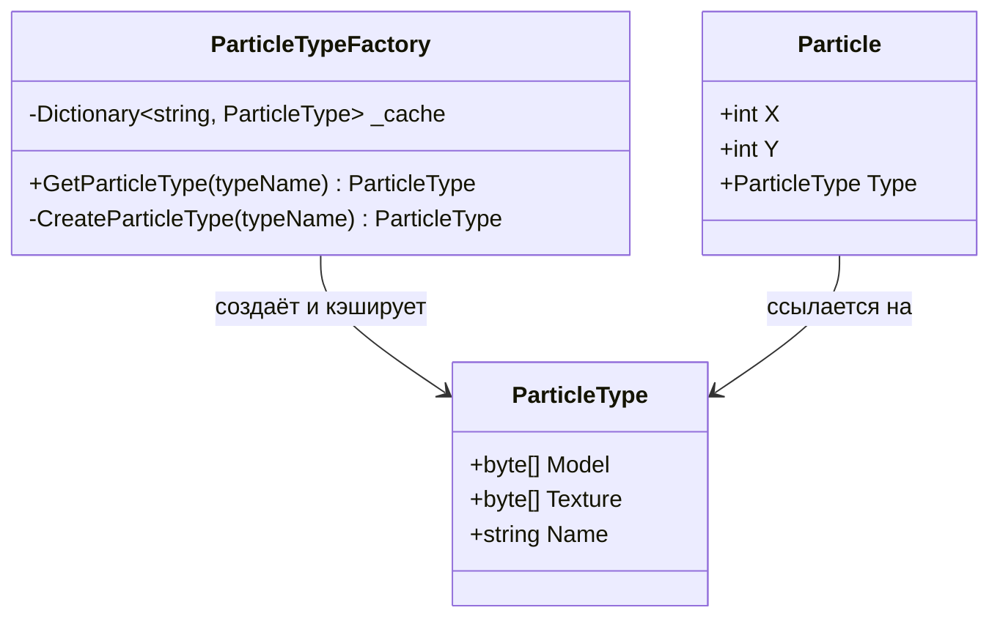
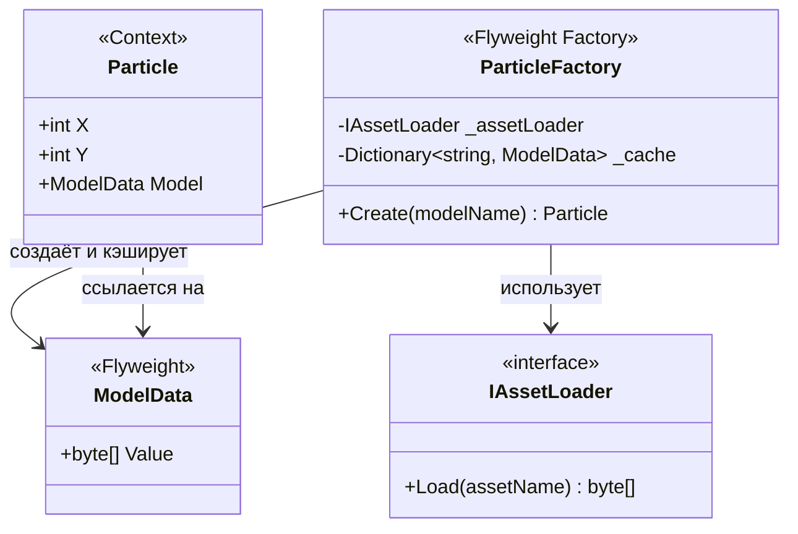
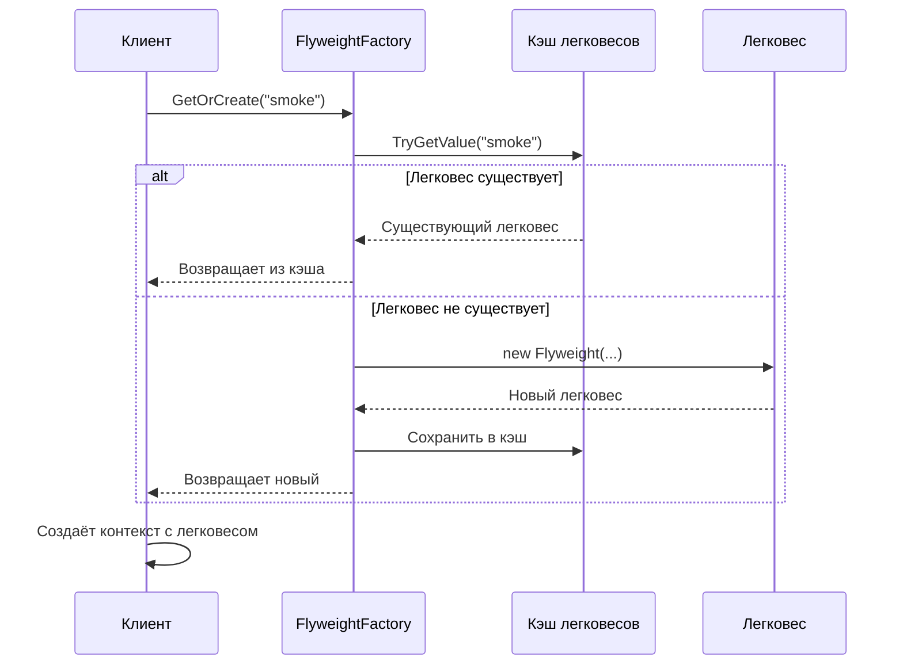
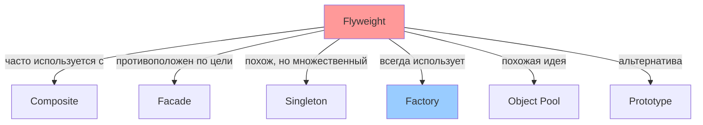

# Flyweight (Легковес)

**Также известен как:** Flyweight, Cache, Приспособленец

## Содержание

1. [Определение и назначение](#определение-и-назначение)
2. [Мотивация и проблема](#мотивация-и-проблема)
3. [Ключевые концепции](#ключевые-концепции)
4. [Структура паттерна](#структура-паттерна)
5. [Примеры реализации](#примеры-реализации)
6. [Применимость](#применимость)
7. [Шаги реализации](#шаги-реализации)
8. [Преимущества и недостатки](#преимущества-и-недостатки)
9. [Связь с другими паттернами](#связь-с-другими-паттернами)

## Определение и назначение

**Flyweight** (Легковес) — структурный паттерн проектирования, который позволяет эффективно поддерживать большое количество мелких объектов за счёт разделения общего состояния между ними.

Паттерн решает проблему чрезмерного потребления памяти путём извлечения общих данных из множества похожих объектов и их переиспользования. Вместо того чтобы каждый объект хранил полную копию всех своих данных, он ссылается на разделяемые данные и хранит только уникальную информацию.

## Мотивация и проблема

### Практический сценарий: система частиц в игре

Представьте, что вы разрабатываете игру с реалистичной системой частиц. В игре одновременно может существовать десятки тысяч объектов: пули, снаряды, осколки от взрывов, дым, искры. Каждый объект — это экземпляр класса с набором данных.

На мощном компьютере всё работает идеально. Но при запуске на менее производительном оборудовании игра начинает тормозить, а затем аварийно завершается с ошибкой нехватки памяти. Причина — каждая частица хранит полную копию всех своих данных, включая тяжёлые ресурсы.

### Математика проблемы

Рассмотрим конкретный пример с частицами дыма. Допустим, в сцене присутствует 10 000 частиц. Каждая частица содержит:

- **Координаты** `X`, `Y` — уникальные для каждой частицы (8 байт)
- **3D-модель** — массив байтов размером 5 МБ
- **Текстура** — массив байтов размером 2 МБ

При наивном подходе каждая частица хранит собственную копию модели и текстуры:

```
Потребление памяти = 10 000 × (5 МБ + 2 МБ) = 70 000 МБ ≈ 68 ГБ
```

Это катастрофическое расходование памяти для данных, которые идентичны у всех частиц одного типа. Все 10 000 частиц дыма используют одну и ту же 3D-модель и текстуру — они отличаются только положением на экране.


### Корень проблемы

Проблема заключается в **дублировании тяжёлых неизменяемых данных**. Вместо того чтобы один раз загрузить модель дыма и ссылаться на неё из всех частиц, мы создаём 10 000 копий одних и тех же данных. Это не только расточительно, но и замедляет работу сборщика мусора и системы выделения памяти.

## Ключевые концепции

### Декомпозиция состояния объекта

Паттерн Flyweight решает проблему путём **декомпозиции состояния объекта** — разделения данных на два фундаментально разных типа:

#### 1. Intrinsic State (Внутреннее состояние)

Данные, которые **не зависят от контекста использования** объекта и могут быть разделены между множеством экземпляров:

- Неизменяемы после создания (immutable)
- Одинаковы для группы объектов
- Обычно занимают много памяти
- Примеры: 3D-модели, текстуры, звуковые файлы, шрифты, конфигурации

#### 2. Extrinsic State (Внешнее состояние или контекст)

Данные, которые **уникальны для каждого экземпляра** и зависят от его использования:

- Могут изменяться
- Уникальны для каждого объекта
- Обычно занимают мало памяти
- Примеры: координаты X, Y, скорость, текущий угол поворота, цвет конкретного экземпляра

### Принцип работы

Вместо хранения всех данных в каждом объекте:

1. **Внутреннее состояние** извлекается в отдельные объекты-легковесы (flyweight objects)
2. Эти объекты создаются один раз и **переиспользуются** всеми экземплярами
3. **Внешнее состояние** остаётся в контекстных объектах или передаётся как параметры методов
4. Легковесы управляются через **фабрику**, которая гарантирует уникальность каждого набора внутреннего состояния

## Структура паттерна

### Визуальная декомпозиция

При анализе класса частиц можно заметить, что модель и текстура занимают основную часть памяти, при этом их значения идентичны для всех частиц одного типа.


Остальные данные — координаты, вектор движения, скорость — уникальны для каждой частицы. Эти поля представляют **контекст использования** частицы.

### Применение паттерна

После применения паттерна структура изменяется следующим образом:


Вместо тысяч объектов с дублирующимися данными создаётся **небольшое количество легковесов**, содержащих только внутреннее состояние. Для нашего примера достаточно всего трёх объектов-легковесов: для пуль, снарядов и осколков.

### Хранение внешнего состояния

Внешнее состояние должно где-то храниться. Существует два подхода:

#### Подход 1: Хранение в контейнере

Главный объект игры может содержать массивы для хранения координат, скоростей и ссылок на легковесы:


```csharp
public class GameWorld
{
    private readonly List<Vector2> _positions;      // Внешнее состояние
    private readonly List<Vector2> _velocities;     // Внешнее состояние
    private readonly List<ParticleType> _types;     // Ссылки на легковесы
}
```

#### Подход 2: Класс-контекст (рекомендуется)

Более элегантное решение — создать класс-контекст, который связывает внешнее состояние с легковесом:

```csharp
public class Particle
{
    public int X { get; set; }              // Внешнее состояние
    public int Y { get; set; }              // Внешнее состояние
    public ParticleType Type { get; }       // Ссылка на легковес (внутреннее состояние)
    
    public Particle(int x, int y, ParticleType type)
    {
        X = x;
        Y = y;
        Type = type;
    }
}
```

Контейнер теперь содержит только один массив:

```csharp
public class GameWorld
{
    private readonly List<Particle> _particles;
}
```

Несмотря на то что количество объектов остаётся прежним, контекстные объекты занимают на порядки меньше памяти, поскольку тяжёлые данные вынесены в разделяемые легковесы.

### Неизменяемость легковесов

Поскольку легковес используется множеством контекстов одновременно, его состояние **не должно изменяться** после создания:

- Все поля должны быть `readonly` или иметь только getter
- Инициализация происходит исключительно через конструктор
- Отсутствуют методы-мутаторы (setters)
- Класс желательно сделать `record` для гарантии неизменяемости

```csharp
// Правильно: неизменяемый легковес
public record ParticleType(byte[] Model, byte[] Texture, string Name);

// Неправильно: изменяемое состояние
public class ParticleType
{
    public byte[] Model { get; set; }  // Опасно! Может изменяться
}
```

### Фабрика легковесов

Для управления созданием и переиспользованием легковесов используется **Flyweight Factory** (фабрика легковесов):

```csharp
public class ParticleTypeFactory
{
    // Пул созданных легковесов
    private readonly Dictionary<string, ParticleType> _cache = new();
    
    public ParticleType GetParticleType(string typeName)
    {
        // Если легковес уже существует - возвращаем его
        if (_cache.TryGetValue(typeName, out var existing))
            return existing;
        
        // Иначе создаём новый и сохраняем в пул
        var newType = CreateParticleType(typeName);
        _cache[typeName] = newType;
        return newType;
    }
    
    private ParticleType CreateParticleType(string typeName)
    {
        // Загрузка тяжёлых ресурсов
        var model = LoadModel(typeName);
        var texture = LoadTexture(typeName);
        return new ParticleType(model, texture, typeName);
    }
}
```

Ключевые функции фабрики:

1. **Кэширование** — хранит уже созданные легковесы
2. **Уникальность** — гарантирует, что для каждого набора внутреннего состояния существует только один объект
3. **Ленивая инициализация** — создаёт легковесы только при первом запросе
4. **Прозрачность** — клиент не знает, получает он новый объект или существующий



## Примеры реализации

### Пример 1: Антипаттерн — код без Flyweight

Рассмотрим наивную реализацию **без применения паттерна Легковес**:
```csharp
// ❌ АНТИПАТТЕРН: каждая частица хранит полную копию модели
public record Particle(int X, int Y, byte[] Model);

public class ParticleFactory 
{
    private readonly IAssetLoader _assetLoader;

    public ParticleFactory(IAssetLoader assetLoader)
    {
        _assetLoader = assetLoader;
    }

    public Particle Create(string modelName) 
    {
        // Загружаем модель каждый раз заново!
        var model = _assetLoader.Load(modelName);
        return new Particle(0, 0, model);
    }
}
```

#### Анализ проблем

**Что происходит в коде:**

- `Particle` — record, который содержит:
  - `X`, `Y` — координаты частицы (внешнее состояние)
  - `Model` — массив байтов с 3D-моделью (внутреннее состояние)
- `ParticleFactory` — фабрика, которая:
  - Использует `IAssetLoader` для загрузки модели из файловой системы
  - При каждом вызове `Create()` **загружает модель заново**
  - Возвращает новую частицу с **новой копией** модели

**Почему это плохо:**

Каждый вызов `Create("smoke")` приводит к:

1. **Загрузке с диска** — медленная операция ввода-вывода (может занимать миллисекунды)
2. **Выделению памяти** — создаётся новый массив `byte[]` размером несколько мегабайт
3. **Дублированию данных** — идентичные данные хранятся в тысячах экземпляров

**Последствия:**

```
10 000 частиц × 5 МБ на модель = 50 000 МБ ≈ 48 ГБ памяти
+ 10 000 операций загрузки с диска
+ Нагрузка на сборщик мусора
= Катастрофическое потребление ресурсов
```

### Пример 2: Правильная реализация с Flyweight

Теперь рассмотрим корректную реализацию с применением паттерна Легковес:
```csharp
// ✅ ПРАВИЛЬНО: внутреннее состояние вынесено в отдельный легковес
public record ModelData(byte[] Value);

public record Particle(int X, int Y, ModelData Model);

public class ParticleFactory 
{
    private readonly IAssetLoader _assetLoader;
    // Кэш легковесов - ключ к экономии памяти
    private readonly Dictionary<string, ModelData> _cache = new();

    public ParticleFactory(IAssetLoader assetLoader)
    {
        _assetLoader = assetLoader;
    }

    public Particle Create(string modelName) 
    {
        // Пытаемся получить модель из кэша
        var model = _cache.TryGetValue(modelName, out var data)
            ? data  // Модель найдена - переиспользуем
            : _cache[modelName] = new ModelData(_assetLoader.Load(modelName)); // Модель не найдена - загружаем и кэшируем
        
        return new Particle(0, 0, model);
    }
}
```

#### Детальный разбор изменений

**1. Появился `ModelData` — Flyweight объект**

```csharp
public record ModelData(byte[] Value);
```

Это обёртка над тяжёлыми данными модели. Мы **выделили внутреннее состояние** в отдельный неизменяемый тип. `ModelData` — это наш легковес, который будет переиспользоваться множеством частиц.

**2. Изменилась структура `Particle`**

```csharp
public record Particle(int X, int Y, ModelData Model);
```

Вместо прямого хранения `byte[]`, частица теперь **хранит ссылку** на `ModelData`. Это ключевое изменение: все частицы с одинаковой моделью ссылаются на **один и тот же объект** `ModelData` в памяти.

**3. Добавлен кэш в фабрике**

```csharp
private readonly Dictionary<string, ModelData> _cache = new();
```

Это **сердце паттерна** — пул (pool) легковесов. Словарь хранит уже созданные модели по ключу (имени модели), обеспечивая быстрый поиск за O(1).

**4. Реализована логика кэширования**

```csharp
var model = _cache.TryGetValue(modelName, out var data)
    ? data
    : _cache[modelName] = new ModelData(_assetLoader.Load(modelName));
```

Алгоритм работы:

1. `_cache.TryGetValue(modelName, out var data)` — проверяем наличие модели в кэше
2. Если найдена (`? data`) — возвращаем существующий объект
3. Если не найдена (`: ...`) — загружаем модель, оборачиваем в `ModelData`, сохраняем в кэш
4. Возвращаем ссылку на общий `ModelData` всем частицам

#### Результат оптимизации

При создании 10 000 частиц дыма:

- **Первый вызов** `Create("smoke")` — загружает модель с диска, создаёт `ModelData`, сохраняет в кэш
- **Следующие 9 999 вызовов** — переиспользуют тот же объект `ModelData` из кэша
- **В памяти:** одна копия модели вместо 10 000

```
Было: 10 000 × 5 МБ = 50 000 МБ
Стало: 10 000 × 16 байт (ссылка + координаты) + 5 МБ ≈ 5,16 МБ
Экономия: ~99%
```

#### Архитектура паттерна



**Ключевые участники:**

1. **`ModelData` (Flyweight)** — неизменяемый объект с внутренним состоянием (тяжёлые данные). Создаётся один раз и переиспользуется.

2. **`Particle` (Context)** — контекст с внешним состоянием (`X`, `Y`) и ссылкой на легковес. Каждый экземпляр уникален, но общие данные разделены.

3. **`ParticleFactory` (Flyweight Factory)** — фабрика, которая:
   - Управляет пулом легковесов
   - Гарантирует уникальность каждого легковеса
   - Предоставляет единую точку доступа к легковесам

4. **`IAssetLoader`** — внешняя зависимость для загрузки ресурсов. Показывает, что создание легковеса может быть дорогой операцией.

#### Важные принципы реализации

**Неизменяемость:**
`ModelData` должен быть `record`, чтобы его можно было безопасно разделять между потоками. Если бы данные могли изменяться, модификация одной частицы влияла бы на все остальные.

**Контроль создания:**
Клиенты не могут напрямую создавать `ModelData`. Фабрика контролирует создание и гарантирует, что существует только один экземпляр для каждого набора внутреннего состояния.

**Выбор структуры данных:**
`Dictionary<string, ModelData>` обеспечивает O(1) поиск. Для многопоточных сценариев можно использовать `ConcurrentDictionary<string, ModelData>`.

### Пример 3: Использование паттерна в игровой сцене
```csharp
// Инициализация системы
var assetLoader = new FileAssetLoader();
var factory = new ParticleFactory(assetLoader);

// Создание игровой сцены
var particles = new List<Particle>();

// Создаём 5000 частиц дыма
for (int i = 0; i < 5000; i++) 
{
    // Создаём частицу с дефолтными координатами (0, 0)
    var particle = factory.Create("smoke");
    
    // Обновляем внешнее состояние (позицию) с помощью with-expression
    var positioned = particle with { 
        X = Random.Shared.Next(0, 1920), 
        Y = Random.Shared.Next(0, 1080) 
    };
    
    particles.Add(positioned);
}

// Создаём 3000 частиц огня
for (int i = 0; i < 3000; i++) 
{
    var particle = factory.Create("fire");
    var positioned = particle with { 
        X = Random.Shared.Next(0, 1920), 
        Y = Random.Shared.Next(0, 1080) 
    };
    particles.Add(positioned);
}

// Результат: 8000 частиц, но только ДВЕ модели в памяти
// Все частицы дыма ссылаются на один объект ModelData("smoke")
// Все частицы огня ссылаются на один объект ModelData("fire")

// Проверка разделения данных
Console.WriteLine($"Частица 0 и 1 разделяют модель: {ReferenceEquals(particles[0].Model, particles[1].Model)}");  // True
Console.WriteLine($"Частица 0 и 5000 разделяют модель: {ReferenceEquals(particles[0].Model, particles[5000].Model)}");  // False (разные типы)
```

#### Пояснения к коду

**Использование `with`-выражения:**
```csharp
var positioned = particle with { X = ..., Y = ... };
```
Синтаксис `with` в C# 9+ создаёт **новый** record с изменёнными свойствами. Это не мутация существующего объекта. Важно: ссылка на `ModelData` остаётся той же.

**Разделение ссылок:**
```csharp
particles[0].Model == particles[1].Model  // True - одна модель "smoke"
particles[0].Model == particles[5000].Model  // False - разные модели
```

### Пример 4: Игровой цикл с обновлением состояния
```csharp
public class Game 
{
    private readonly ParticleFactory _factory;
    private readonly List<Particle> _particles = new();

    public Game(ParticleFactory factory)
    {
        _factory = factory;
    }

    // Обновление игрового мира каждый кадр
    public void Update(float deltaTime) 
    {
        // Обновляем позиции всех частиц (изменяем внешнее состояние)
        for (int i = 0; i < _particles.Count; i++) 
        {
            var p = _particles[i];
            
            // Создаём новый record с обновлёнными координатами
            // Ссылка на Model остаётся той же
            _particles[i] = p with { 
                X = p.X + (int)(100 * deltaTime),  // Движение вправо
                Y = p.Y + (int)(50 * deltaTime)    // Движение вниз
            };
        }
        
        // Удаляем частицы, вышедшие за пределы экрана
        _particles.RemoveAll(p => p.X > 1920 || p.Y > 1080);
    }

    // Создание эффекта взрыва
    public void SpawnExplosion(int x, int y) 
    {
        // Создаём 100 частиц взрыва в одной точке
        for (int i = 0; i < 100; i++) 
        {
            // Все частицы получают одну и ту же модель из кэша
            var particle = _factory.Create("explosion");
            var positioned = particle with { X = x, Y = y };
            _particles.Add(positioned);
        }
        
        // Важно: все 100 частиц разделяют ОДНУ модель "explosion"
        // В памяти: 100 × 16 байт (координаты) + 1 × 5 МБ (модель) ≈ 5 МБ
        // Без Flyweight: 100 × 5 МБ = 500 МБ
    }
}
```

#### Ключевые моменты

**Обновление внешнего состояния:**
Координаты изменяются каждый кадр, но модель остаётся неизменной. Это демонстрирует разделение между изменяемым внешним и неизменным внутренним состоянием.

**Эффективность создания:**
При вызове `SpawnExplosion` создаётся 100 объектов-контекстов, но модель загружается и хранится в памяти только один раз.

### Пример 5: Полная реализация с демонстрацией
```csharp
// ============================================
// Интерфейс загрузчика ресурсов
// ============================================
public interface IAssetLoader 
{
    byte[] Load(string assetName);
}

// ============================================
// Реализация загрузчика
// ============================================
public class FileAssetLoader : IAssetLoader 
{
    public byte[] Load(string assetName) 
    {
        // Имитация медленной загрузки с диска
        Console.WriteLine($"[LOAD] Загружаем модель '{assetName}' с диска...");
        Thread.Sleep(100); // Симуляция задержки I/O
        
        // Создаём массив данных (1 МБ)
        return new byte[1024 * 1024];
    }
}

// ============================================
// Flyweight — неизменяемые данные модели
// ============================================
public record ModelData(byte[] Value);

// ============================================
// Context — объект с внешним состоянием
// ============================================
public record Particle(int X, int Y, ModelData Model);

// ============================================
// Flyweight Factory — управление пулом
// ============================================
public class ParticleFactory 
{
    private readonly IAssetLoader _assetLoader;
    private readonly Dictionary<string, ModelData> _cache = new();

    public ParticleFactory(IAssetLoader assetLoader) 
    {
        _assetLoader = assetLoader;
    }

    public Particle Create(string modelName) 
    {
        // Проверяем кэш перед загрузкой
        var model = _cache.TryGetValue(modelName, out var data)
            ? data
            : _cache[modelName] = new ModelData(_assetLoader.Load(modelName));
        
        return new Particle(0, 0, model);
    }

    public void PrintCacheStats() 
    {
        Console.WriteLine($"\n[СТАТИСТИКА] В кэше {_cache.Count} уникальных моделей");
        Console.WriteLine($"[СТАТИСТИКА] Общий размер в памяти: ~{_cache.Count} МБ");
    }
}

// ============================================
// Использование паттерна
// ============================================
public class Program 
{
    public static void Main() 
    {
        var loader = new FileAssetLoader();
        var factory = new ParticleFactory(loader);
        var particles = new List<Particle>();

        Console.WriteLine("=== Создание частиц ===\n");

        // Создаём 1000 частиц дыма
        Console.WriteLine("Создаём 1000 частиц дыма...");
        for (int i = 0; i < 1000; i++) 
        {
            var particle = factory.Create("smoke");
            particles.Add(particle with { 
                X = Random.Shared.Next(0, 800), 
                Y = Random.Shared.Next(0, 600) 
            });
        }

        // Создаём 500 частиц огня
        Console.WriteLine("Создаём 500 частиц огня...");
        for (int i = 0; i < 500; i++) 
        {
            var particle = factory.Create("fire");
            particles.Add(particle with { 
                X = Random.Shared.Next(0, 800), 
                Y = Random.Shared.Next(0, 600) 
            });
        }

        // Создаём ещё 500 частиц дыма (переиспользуем кэш)
        Console.WriteLine("Создаём ещё 500 частиц дыма...");
        for (int i = 0; i < 500; i++) 
        {
            var particle = factory.Create("smoke");
            particles.Add(particle with { 
                X = Random.Shared.Next(0, 800), 
                Y = Random.Shared.Next(0, 600) 
            });
        }

        Console.WriteLine($"\n[РЕЗУЛЬТАТ] Создано {particles.Count} частиц");
        factory.PrintCacheStats();

        // Проверка разделения данных
        Console.WriteLine("\n=== Проверка разделения данных ===");
        Console.WriteLine($"Частицы 0 и 1 (обе 'smoke'): " +
            $"{ReferenceEquals(particles[0].Model, particles[1].Model)}");
        Console.WriteLine($"Частицы 0 ('smoke') и 1000 ('fire'): " +
            $"{ReferenceEquals(particles[0].Model, particles[1000].Model)}");
        
        // Демонстрация экономии памяти
        Console.WriteLine("\n=== Экономия памяти ===");
        Console.WriteLine($"Без Flyweight: {particles.Count} × 1 МБ = {particles.Count} МБ");
        Console.WriteLine($"С Flyweight: {particles.Count} × 16 байт + 2 МБ ≈ 2,03 МБ");
        Console.WriteLine($"Экономия: ~{100 - (2.03 / particles.Count * 100):F1}%");
    }
}

/* ВЫВОД ПРОГРАММЫ:
=== Создание частиц ===

Создаём 1000 частиц дыма...
[LOAD] Загружаем модель 'smoke' с диска...
Создаём 500 частиц огня...
[LOAD] Загружаем модель 'fire' с диска...
Создаём ещё 500 частиц дыма...

[РЕЗУЛЬТАТ] Создано 2000 частиц

[СТАТИСТИКА] В кэше 2 уникальных моделей
[СТАТИСТИКА] Общий размер в памяти: ~2 МБ

=== Проверка разделения данных ===
Частицы 0 и 1 (обе 'smoke'): True
Частицы 0 ('smoke') и 1000 ('fire'): False

=== Экономия памяти ===
Без Flyweight: 2000 × 1 МБ = 2000 МБ
С Flyweight: 2000 × 16 байт + 2 МБ ≈ 2,03 МБ
Экономия: ~99,9%
*/
```

#### Что демонстрирует этот пример

**1. Ленивая загрузка:**
Модели загружаются только при первом запросе. Вызов `factory.Create("smoke")` второй раз не приводит к загрузке.

**2. Разделение ссылок:**
`ReferenceEquals` подтверждает, что частицы одного типа ссылаются на один объект в памяти.

**3. Драматическая экономия:**
2000 частиц занимают ~2 МБ вместо 2000 МБ — экономия 99,9%.

**4. Прозрачность:**
Клиентский код не знает о кэшировании. Фабрика полностью инкапсулирует логику переиспользования.

## Применимость

### Когда использовать Flyweight

Паттерн Легковес следует применять при **дефиците оперативной памяти** из-за большого количества объектов. Эффективность паттерна зависит от характера данных и паттернов их использования.

**Применяйте Flyweight, когда выполнены ВСЕ условия:**

1. **Большое количество объектов**
   - В приложении одновременно существуют тысячи или миллионы схожих объектов
   - Создание каждого объекта "как есть" приводит к чрезмерному потреблению памяти

2. **Высокие расходы памяти**
   - Из-за количества объектов память заканчивается или приближается к лимиту
   - Наблюдается деградация производительности сборщика мусора

3. **Возможность выделения внутреннего состояния**
   - Большую часть данных объекта можно вынести в разделяемую структуру
   - Эти данные не зависят от контекста использования объекта
   - Внутреннее состояние является неизменяемым

4. **Малое количество уникальных состояний**
   - Большие группы объектов можно заменить небольшим количеством легковесов
   - Уникальность определяется только внутренним состоянием

### Практические сценарии

#### Игровая разработка
- **Системы частиц:** дым, огонь, искры, дождь, снег
- **Управление ресурсами:** текстуры, модели, звуки, шрифты
- **Тайловые карты:** множество клеток с повторяющимися спрайтами

#### Графические редакторы
- **Векторная графика:** множество одинаковых фигур с разными позициями
- **Текстовые редакторы:** символы шрифта (каждая буква — легковес)

#### Веб-приложения
- **Иконки и изображения:** один файл используется многими элементами DOM
- **Кэширование данных:** повторяющиеся объекты конфигурации

#### Базы данных и кэширование
- **Connection pooling:** переиспользование подключений к БД
- **Object pooling:** переиспользование дорогих в создании объектов

### Когда НЕ использовать

**Не применяйте Flyweight, если:**

- Объектов мало (< 1000), и они не создают проблем с памятью
- Состояние объектов в основном уникально, и выделить общую часть невозможно
- Внешнее состояние слишком велико — экономия будет минимальной
- Сложность реализации превышает выгоду от оптимизации
- Требуется изменять внутреннее состояние после создания

## Шаги реализации

### Пошаговое руководство по применению паттерна

#### Шаг 1: Анализ и декомпозиция состояния

Проанализируйте класс, который потребляет слишком много памяти. Разделите его поля на две категории:

**Внутреннее состояние (Intrinsic State):**
- Значения одинаковы для многих объектов
- Не зависят от контекста использования
- Часто занимают много памяти
- Примеры: модели, текстуры, конфигурации

**Внешнее состояние (Extrinsic State):**
- Значения уникальны для каждого объекта
- Зависят от контекста
- Обычно занимают мало памяти
- Примеры: координаты, скорость, временные параметры

```csharp
// ДО: всё в одном классе
public class Particle
{
    public int X { get; set; }           // Внешнее
    public int Y { get; set; }           // Внешнее
    public byte[] Model { get; set; }    // Внутреннее - тяжёлое
    public byte[] Texture { get; set; }  // Внутреннее - тяжёлое
}
```

#### Шаг 2: Создание класса Flyweight

Выделите внутреннее состояние в отдельный класс. Сделайте его **неизменяемым**:

```csharp
// Используйте record для гарантии неизменяемости
public record ParticleType(byte[] Model, byte[] Texture, string Name);
```

**Критически важно:**
- Все поля должны быть `readonly` или `init`
- Инициализация только через конструктор
- Никаких setters или публичных изменяемых полей
- Предпочитайте `record` для автоматической неизменяемости

#### Шаг 3: Рефакторинг контекста

Удалите поля внутреннего состояния из оригинального класса. Вместо них храните **ссылку** на легковес:

```csharp
// ПОСЛЕ: разделение на контекст и легковес
public class Particle
{
    public int X { get; set; }              // Внешнее состояние - можно менять
    public int Y { get; set; }              // Внешнее состояние - можно менять
    public ParticleType Type { get; }       // Ссылка на легковес - не меняется
    
    public Particle(int x, int y, ParticleType type)
    {
        X = x;
        Y = y;
        Type = type;
    }
}
```

Или используйте `record` с `init`:

```csharp
public record Particle(int X, int Y, ParticleType Type);
```

#### Шаг 4: Создание Flyweight Factory

Реализуйте фабрику для управления пулом легковесов:

```csharp
public class ParticleTypeFactory
{
    // Пул созданных легковесов
    private readonly Dictionary<string, ParticleType> _cache = new();
    private readonly IAssetLoader _assetLoader;

    public ParticleTypeFactory(IAssetLoader assetLoader)
    {
        _assetLoader = assetLoader;
    }

    public ParticleType GetOrCreate(string typeName)
    {
        // Проверяем наличие в кэше
        if (_cache.TryGetValue(typeName, out var existing))
        {
            return existing;
        }

        // Создаём новый легковес
        var model = _assetLoader.LoadModel(typeName);
        var texture = _assetLoader.LoadTexture(typeName);
        var newType = new ParticleType(model, texture, typeName);

        // Сохраняем в кэш
        _cache[typeName] = newType;
        return newType;
    }

    // Полезно для отладки
    public int CachedCount => _cache.Count;
}
```

**Ключевые функции фабрики:**
- Хранит все созданные легковесы в `Dictionary`
- Проверяет наличие перед созданием нового
- Гарантирует уникальность для каждого набора внутреннего состояния
- Инкапсулирует логику создания

#### Шаг 5: Использование в клиентском коде

Клиент больше не создаёт легковесы напрямую. Он запрашивает их у фабрики:

```csharp
public class GameWorld
{
    private readonly ParticleTypeFactory _typeFactory;
    private readonly List<Particle> _particles = new();

    public GameWorld(ParticleTypeFactory typeFactory)
    {
        _typeFactory = typeFactory;
    }

    public void SpawnParticle(string typeName, int x, int y)
    {
        // Получаем легковес из фабрики (может быть из кэша)
        var type = _typeFactory.GetOrCreate(typeName);
        
        // Создаём контекстный объект
        var particle = new Particle(x, y, type);
        
        _particles.Add(particle);
    }

    public void Update(float deltaTime)
    {
        // Обновляем только внешнее состояние
        foreach (var particle in _particles)
        {
            particle.X += (int)(particle.Type.VelocityX * deltaTime);
            particle.Y += (int)(particle.Type.VelocityY * deltaTime);
        }
    }
}
```

### Диаграмма взаимодействия



### Контрольный список

После реализации убедитесь, что:

- [ ] Внутреннее состояние вынесено в отдельный класс
- [ ] Класс легковеса неизменяемый (`record` или `readonly` поля)
- [ ] Контекст хранит только внешнее состояние + ссылку на легковес
- [ ] Фабрика управляет созданием и кэшированием легковесов
- [ ] Клиенты не создают легковесы напрямую
- [ ] Память действительно экономится (проверить профайлером)

## Преимущества и недостатки

### Преимущества

#### 1. Экономия оперативной памяти

Основное и главное преимущество — **драматическое сокращение потребления памяти**:

```
Без Flyweight: N объектов × размер полного состояния
С Flyweight:   N объектов × размер контекста + K легковесов × размер внутреннего состояния

где K << N (K значительно меньше N)
```

**Пример:**
- 10 000 частиц без паттерна: 50 ГБ
- 10 000 частиц с паттерном: 5 МБ
- Экономия: 99,99%

#### 2. Улучшение производительности

При правильном применении наблюдаются позитивные эффекты:

- **Меньше выделений памяти** — снижение нагрузки на аллокатор
- **Лучшая работа сборщика мусора** — меньше объектов для отслеживания
- **Кэш-френдли** — компактные данные лучше помещаются в кэш процессора
- **Быстрая инициализация** — тяжёлые ресурсы загружаются один раз

#### 3. Централизация управления ресурсами

Фабрика становится единой точкой управления:

```csharp
public class ResourceManager
{
    private readonly Dictionary<string, Texture> _textures = new();
    
    public Texture GetTexture(string name)
    {
        // Единое место для логирования, метрик, отладки
        if (!_textures.ContainsKey(name))
            Console.WriteLine($"[DEBUG] Загружается новая текстура: {name}");
        
        return _textures.TryGetValue(name, out var texture)
            ? texture
            : _textures[name] = LoadTexture(name);
    }
}
```

#### 4. Прозрачность для клиента

Клиентский код не знает о существовании кэша и переиспользования:

```csharp
var particle1 = factory.Create("smoke");  // Загрузка
var particle2 = factory.Create("smoke");  // Из кэша
// Для клиента оба вызова идентичны
```

### Недостатки

#### 1. Дополнительные затраты процессорного времени

Паттерн обменивает **память на вычисления**:

- **Поиск в кэше:** операция `Dictionary.TryGetValue` при каждом запросе
- **Хеширование ключей:** вычисление хеш-функции для строковых ключей
- **Разыменование ссылок:** дополнительная индирекция при доступе к данным

```csharp
// Прямой доступ (быстро)
particle.Model[0]

// Через легковес (медленнее из-за разыменования)
particle.Type.Model[0]
```

**Обычно это не проблема**, так как экономия памяти перевешивает, но в критичных к производительности участках может быть заметно.

#### 2. Усложнение кода

Код становится менее прямолинейным:

- Появляется дополнительная абстракция (фабрика)
- Разделение состояния на две части требует дисциплины
- Сложнее отлаживать, так как данные разбросаны между объектами

**До (просто):**
```csharp
var particle = new Particle(x, y, model);
```

**После (сложнее):**
```csharp
var type = factory.GetOrCreate("smoke");
var particle = new Particle(x, y, type);
```

#### 3. Требование неизменяемости

Легковесы **должны быть immutable**, что накладывает ограничения:

```csharp
// Нельзя: изменение повлияет на все экземпляры
public class ParticleType
{
    public Color Color { get; set; }  // Опасно!
}

// Нужно: неизменяемый класс
public record ParticleType(Color Color);
```

Если требуется изменить внутреннее состояние, придётся:
- Создать новый легковес
- Обновить все ссылки на него
- Удалить старый из кэша (если больше не используется)

#### 4. Сложность управления жизненным циклом

Легковесы остаются в памяти, пока существует фабрика:

```csharp
// Проблема: "explosion" останется в памяти, даже если больше не нужен
factory.GetOrCreate("explosion");
```

Решения:
- **Слабые ссылки (WeakReference)** — позволяют сборщику мусора удалять неиспользуемые легковесы
- **Явная очистка** — метод `factory.Clear()` для сброса кэша
- **LRU-кэш** — автоматическое удаление давно неиспользуемых объектов

```csharp
public class SmartFlyweightFactory
{
    private readonly Dictionary<string, WeakReference<ModelData>> _cache = new();
    
    public ModelData GetOrCreate(string name)
    {
        if (_cache.TryGetValue(name, out var weakRef) && weakRef.TryGetTarget(out var model))
        {
            return model;  // Легковес ещё жив
        }
        
        // Создаём новый или восстанавливаем после сборки мусора
        var newModel = LoadModel(name);
        _cache[name] = new WeakReference<ModelData>(newModel);
        return newModel;
    }
}
```

#### 5. Проблемы с многопоточностью

Стандартная реализация не потокобезопасна:

```csharp
// Небезопасно в многопоточной среде
public ModelData GetOrCreate(string name)
{
    if (_cache.TryGetValue(name, out var model))
        return model;
    
    // RACE CONDITION: два потока могут одновременно создать объект
    var newModel = LoadModel(name);
    _cache[name] = newModel;
    return newModel;
}
```

Решение — использовать `ConcurrentDictionary`:

```csharp
public class ThreadSafeFlyweightFactory
{
    private readonly ConcurrentDictionary<string, ModelData> _cache = new();
    
    public ModelData GetOrCreate(string name)
    {
        return _cache.GetOrAdd(name, key => LoadModel(key));
    }
}
```

### Когда недостатки перевешивают преимущества

Не используйте Flyweight, если:

- Объектов мало, и они не создают проблем с памятью
- Внутреннее состояние составляет < 50% размера объекта
- Внешнее состояние слишком велико
- Частые изменения внутреннего состояния
- Профилирование показывает, что проблема не в памяти, а в CPU

## Связь с другими паттернами

### Composite (Компоновщик)

**Отличное сочетание** для экономии памяти в древовидных структурах:

```csharp
// Легковес для типа узла дерева
public record NodeType(string Icon, Color Color);

// Узел с внешним состоянием
public class TreeNode
{
    public NodeType Type { get; }        // Разделяемое внутреннее состояние
    public string Name { get; set; }     // Уникальное внешнее состояние
    public List<TreeNode> Children { get; }
    
    public TreeNode(NodeType type, string name)
    {
        Type = type;
        Name = name;
        Children = new List<TreeNode>();
    }
}
```

**Применение:** файловые менеджеры, иерархии UI-элементов, игровые сцены.

### Facade (Фасад)

**Противоположные цели:**

- **Flyweight** — создаёт **много мелких объектов** с разделяемым состоянием
- **Facade** — создаёт **один объект**, который представляет сложную подсистему

```csharp
// Flyweight: много мелких объектов
var particle1 = factory.Create("smoke");
var particle2 = factory.Create("fire");
// ... тысячи объектов

// Facade: один объект для сложной системы
var gameEngine = new GameEngineFacade();
gameEngine.Initialize();
gameEngine.Run();
```

**Возможная комбинация:** Facade может использовать Flyweight внутри для управления ресурсами.

### Singleton (Одиночка)

**Схожесть:** оба паттерна ограничивают количество экземпляров.

**Ключевые различия:**

| Аспект | Flyweight | Singleton |
|--------|-----------|-----------|
| Количество экземпляров | Несколько (по числу уникальных внутренних состояний) | Ровно один |
| Изменяемость | Должен быть неизменяемым | Может изменяться |
| Назначение | Экономия памяти через разделение данных | Глобальная точка доступа |
| Создание | Через фабрику на основе параметров | Через статический метод без параметров |

```csharp
// Flyweight: много неизменяемых объектов
var type1 = factory.GetOrCreate("smoke");  // Первый легковес
var type2 = factory.GetOrCreate("fire");   // Второй легковес
var type3 = factory.GetOrCreate("smoke");  // Переиспользование первого

// Singleton: один изменяемый объект
var config = Configuration.Instance;  // Всегда один и тот же
config.UpdateSetting("volume", 0.8);  // Можно изменять
```

### Factory (Фабрика)

**Тесная интеграция:** Flyweight **всегда** использует Factory для управления пулом:

```csharp
// Flyweight Factory - специализированная фабрика с кэшированием
public class ParticleTypeFactory
{
    private readonly Dictionary<string, ParticleType> _cache = new();
    
    public ParticleType Create(string name)
    {
        // Ключевое отличие: проверка кэша перед созданием
        return _cache.TryGetValue(name, out var existing)
            ? existing
            : _cache[name] = new ParticleType(...);
    }
}

// Обычная фабрика - всегда создаёт новый объект
public class ParticleFactory
{
    public Particle Create(string name)
    {
        // Нет кэширования
        return new Particle(...);
    }
}
```

### Object Pool (Пул объектов)

**Схожая идея:** переиспользование объектов для экономии ресурсов.

**Ключевые различия:**

| Аспект | Flyweight | Object Pool |
|--------|-----------|-------------|
| Что переиспользуется | Разделяемое внутреннее состояние | Полностью объект |
| Изменяемость | Неизменяемый | Изменяемый (сброс перед возвратом) |
| Разделение одновременно | Да (многие контексты используют один легковес) | Нет (объект "арендуется" на время) |
| Цель | Экономия памяти | Экономия времени создания/уничтожения |

```csharp
// Flyweight: разделяемые неизменяемые данные
var type = typeFactory.GetOrCreate("smoke");
var particle1 = new Particle(0, 0, type);  // Используют одновременно
var particle2 = new Particle(10, 10, type);

// Object Pool: временное владение объектом
var connection = connectionPool.Acquire();  // "Арендуем"
connection.ExecuteQuery("SELECT ...");
connectionPool.Release(connection);         // "Возвращаем"
```

### Prototype (Прототип)

**Альтернатива для создания объектов:**

- **Flyweight:** разделяет внутреннее состояние между объектами
- **Prototype:** клонирует объект полностью для создания новых экземпляров

```csharp
// Flyweight: разделение состояния
var type = factory.GetOrCreate("smoke");
var particle = new Particle(x, y, type);  // Лёгкий объект + ссылка

// Prototype: клонирование
var particle = prototypeParticle.Clone();  // Полная копия всех данных
particle.X = x;
particle.Y = y;
```

**Возможная комбинация:** Prototype может клонировать контекстный объект, сохраняя ссылку на общий легковес.

### Диаграмма взаимосвязей



### Резюме связей

- **Используйте вместе:** Composite + Flyweight для иерархий с повторяющимися данными
- **Не путайте:** Flyweight ≠ Singleton (множественность vs единственность)
- **Выбирайте правильно:** Flyweight (память) vs Object Pool (производительность)
- **Основа:** Flyweight всегда опирается на Factory для управления пулом

## Заключение

### Ключевые выводы

Паттерн **Flyweight** — это мощный инструмент оптимизации памяти в ситуациях, когда приложение оперирует большим количеством схожих объектов. Его суть можно свести к простому принципу: **разделяй и переиспользуй**.

**Главная идея:**
Вместо того чтобы каждый объект хранил полную копию своих данных, мы разделяем состояние на **внутреннее** (общее, тяжёлое, неизменяемое) и **внешнее** (уникальное, лёгкое, изменяемое). Внутреннее состояние извлекается в легковесы, которые создаются один раз и переиспользуются тысячами контекстов.

**Критерии применения:**
- Тысячи или миллионы однотипных объектов
- Существенная часть данных повторяется
- Нехватка оперативной памяти
- Возможность чёткого разделения на внутреннее и внешнее состояние

**Реализация в трёх компонентах:**
1. **Flyweight** — неизменяемый объект с внутренним состоянием
2. **Context** — объект с внешним состоянием и ссылкой на легковес
3. **Flyweight Factory** — управляет пулом легковесов, гарантирует уникальность

**Результат:**
Потребление памяти может сократиться на 90-99%, превращая невозможное в реальное — игры с миллионами частиц, редакторы с тысячами символов, карты с миллионами тайлов становятся осуществимыми на обычном оборудовании.

**Цена:**
Незначительные накладные расходы на поиск в кэше и разыменование ссылок, а также необходимость более тщательного проектирования архитектуры.

### Когда применять

**Применяйте безусловно:**
- Игровые движки (частицы, тайлы, спрайты)
- Графические редакторы (символы, фигуры)
- Системы рендеринга (текстуры, модели)

**Применяйте с осторожностью:**
- Бизнес-логика (редко нужно)
- Малое количество объектов (< 1000)
- Уникальное состояние преобладает

**Не применяйте:**
- Если профилирование не показывает проблем с памятью
- Если внутреннее состояние нужно часто менять
- Если усложнение кода не оправдано выигрышем

### Практические советы

1. **Профилируйте сначала:** убедитесь, что проблема действительно в памяти
2. **Измеряйте после:** проверьте, что оптимизация сработала
3. **Используйте `record`:** для гарантии неизменяемости легковесов
4. **Применяйте `ConcurrentDictionary`:** в многопоточных сценариях
5. **Рассмотрите `WeakReference`:** если легковесы могут устаревать
6. **Документируйте разделение:** чётко укажите, что является внутренним, а что внешним состоянием

### Эволюция паттерна в современном C#

Современные возможности C# делают реализацию Flyweight элегантнее:

```csharp
// Records для неизменяемости
public record ModelData(byte[] Value);

// With-expressions для создания модифицированных копий
var moved = particle with { X = newX, Y = newY };

// Pattern matching для работы с легковесами
var description = particle.Type switch
{
    { Name: "smoke" } => "Частица дыма",
    { Name: "fire" } => "Частица огня",
    _ => "Неизвестная частица"
};

// GetOrAdd для атомарного добавления
_cache.GetOrAdd(name, key => new ModelData(Load(key)));
```

Паттерн Flyweight — классический пример того, как правильное проектирование и понимание природы данных позволяют достичь впечатляющих результатов оптимизации. Он демонстрирует, что иногда лучшее решение — не ускорение алгоритмов, а изменение способа хранения данных.