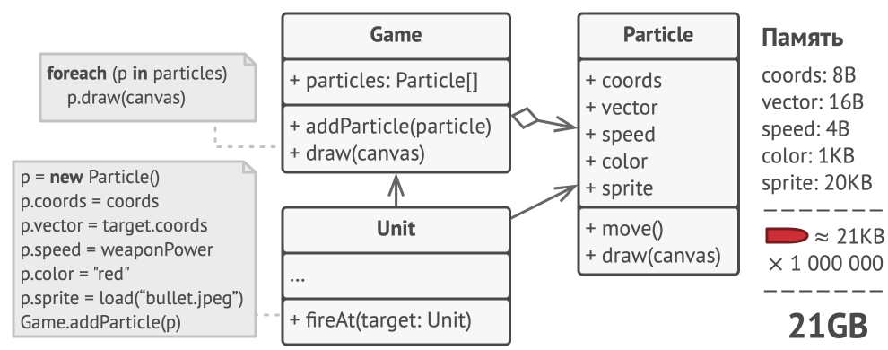
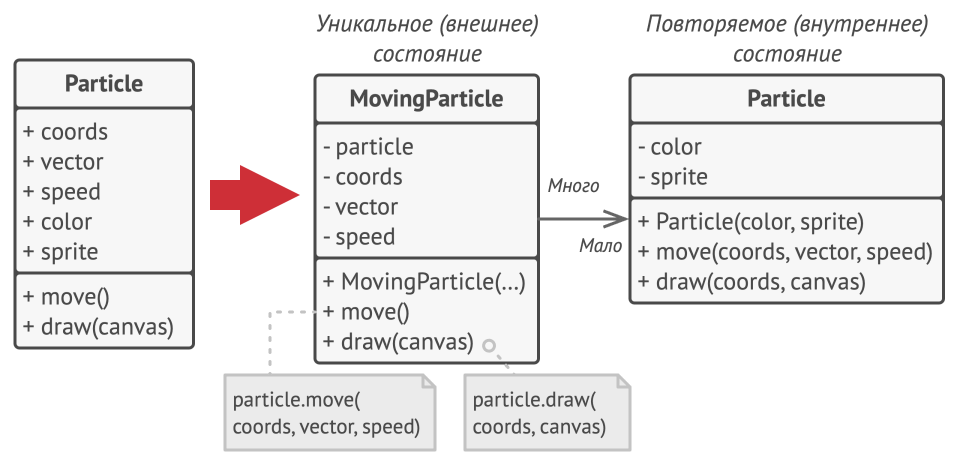
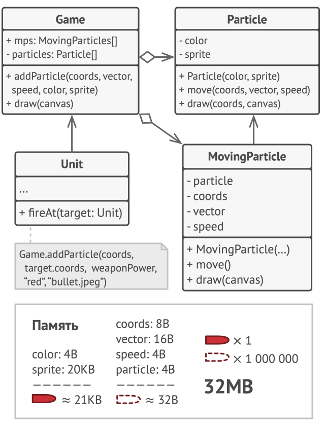
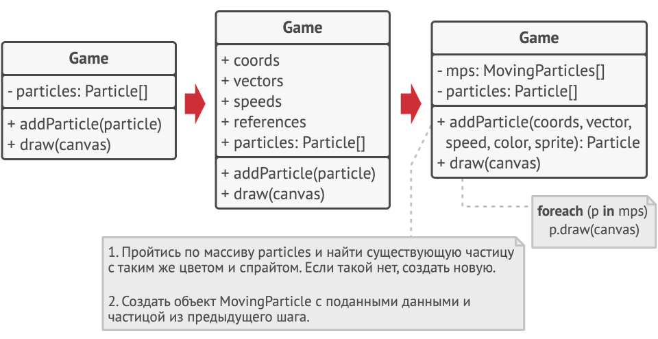

### Flyweight (Легковес)

###### Также известен как Flyweight, Кэш и Приспособленец

Легковес - декомпозиция объектов, выделение тяжёлых и повторяющихся данных в отдельные модели для дальнейшего переиспользования

Другими словами - это паттерн проектирования, который позволяет вместить бóльшее количество объектов в отведённую оперативную память. Легковес экономит память, разделяя общее состояние объектов между собой, вместо хранения одинаковых данных в каждом объекте.

Пример:

Представьте, что вы разрабатываете игровой движок или систему частиц. В вашей игре одновременно существуют тысячи объектов — например, деревья в лесу, пули, капли дождя или частицы дыма. Каждый такой объект — это экземпляр класса со своими данными.

Так вот. На досуге вы решили написать небольшую игру, в которой игроки перемещаются по карте и стреляют друг в друга. Фишкой игры должна была стать реалистичная система частиц. Пули, снаряды, осколки от взрывов — всё это должно красиво летать и радовать взгляд.

Игра отлично работала на вашем мощном компьютере. Однако ваш друг сообщил, что игра начинает тормозить и вылетает через несколько минут после запуска. Покопавшись в логах, вы обнаружили, что игра вылетает из-за недостатка оперативной памяти. У вашего друга компьютер значительно менее «прокачанный», поэтому проблема у него и проявляется так быстро.

И действительно, каждая частица представлена собственным объектом, имеющим множество данных. В определённый момент, когда побоище на экране достигает кульминации, новые объекты частиц уже не вмещаются в оперативную память компьютера, и программа вылетает.



Или ещё один пример:
Проблема возникает, когда мы начинаем считать память. Допустим, у нас 10,000 частиц дыма. Каждая частица имеет:

Координаты X, Y (уникальные для каждой частицы)

3D-модель — массив байтов размером, скажем, 5 МБ

Если каждая частица хранит свою копию модели, мы получаем: 10,000 × 5 МБ = 50 ГБ памяти! При этом все эти 10,000 частиц используют одну и ту же модель — просто рисуются в разных местах экрана.

Это классический пример расточительного дублирования данных. Мы копируем тяжёлые данные, которые должны быть общими.

Паттерн Flyweight (Легковес) решает эту проблему через декомпозицию объектов — разделение данных на два типа:

Внутреннее состояние (Intrinsic State) — данные, которые не меняются и разделяются между многими объектами. Это тяжёлые, повторяющиеся данные (например, 3D-модель, текстуры, звуки).

Внешнее состояние (Extrinsic State) — данные, которые уникальны для каждого объекта (например, позиция X, Y, скорость, цвет конкретной частицы).

Суть паттерна: выделить внутреннее состояние в отдельные объекты и переиспользовать их, вместо того чтобы дублировать в каждом экземпляре.

Как это решить:
Если внимательно посмотреть на класс частиц, то можно заметить, что цвет и спрайт занимают больше всего памяти. Более того, они хранятся в каждом объекте, хотя фактически их значения одинаковы для большинства частиц.


Остальное состояние объектов — координаты, вектор движения и скорость — отличаются для всех частиц. Таким образом, эти поля можно рассматривать как контекст, в котором частица используется. А цвет и спрайт — это данные, не изменяющиеся во времени.

Неизменяемые данные объекта принято называть «внутренним состоянием». Все остальные данные — это «внешнее состояние».

Паттерн Легковес предлагает не хранить в классе внешнее состояние, а передавать его в те или иные методы через параметры. Таким образом, одни и те же объекты можно будет повторно использовать в различных контекстах. Но главное — понадобится гораздо меньше объектов, ведь теперь они будут отличаться только внутренним состоянием, а оно имеет не так много вариаций.



В нашем примере с частицами достаточно будет оставить всего три объекта с отличающимися спрайтами и цветом — для пуль, снарядов и осколков. Несложно догадаться, что такие облегчённые объекты называют легковéсами 

Но куда переедет внешнее состояние? Ведь кто-то должен его хранить. Чаще всего, его перемещают в контейнер, который управлял объектами до применения паттерна.

В нашем случае это был главный объект игры. Вы могли бы добавить в его класс поля-массивы для хранения координат, векторов и скоростей частиц. Кроме этого, понадобится ещё один массив для хранения ссылок на объекты-легковесы, соответствующие той или иной частице.



Но более элегантным решением было бы создать дополнительный класс-контекст, который бы связывал внешнее состояние с тем или иным легковесом. Это позволит обойтись только одним полем-массивом в классе контейнера.

«Но погодите-ка, нам потребуется столько же этих объектов, сколько было в самом начале!», — скажете вы и будете правы! Но дело в том, что объекты-контексты занимают намного меньше места, чем первоначальные. Ведь самые тяжёлые поля остались в легковесах (простите за каламбур), и сейчас мы будем ссылаться на эти объекты из контекстов, вместо того, чтобы повторно хранить дублирующееся состояние.

Неизменяемость Легковесов
Так как объекты легковесов будут использованы в разных контекстах, вы должны быть уверены в том, что их состояние невозможно изменить после создания. Всё внутреннее состояние легковес должен получать через параметры конструктора. Он не должен иметь сеттеров и публичных полей.

Фабрика Легковесов
Для удобства работы с легковесами и контекстами можно создать фабричный метод, принимающий в параметрах всё внутреннее (а иногда и внешнее) состояние желаемого объекта.

Главная польза от этого метода в том, чтобы искать уже созданные легковесы с таким же внутренним состоянием, что и требуемое. Если легковес находится, его можно повторно использовать. Если нет — просто создаём новый. Обычно этот метод добавляют в контейнер легковесов либо создают отдельный класс-фабрику. Его даже можно сделать статическим и поместить в класс легковесов.

Рассмотрим ещё один пример:
код без применения Легковеса:
```csharp
public record Particle(int X, int Y, byte[] Model);

public class ParticleFactory 
{
    private readonly IAssetLoader _assetLoader;

    public Particle Create(string modelName) 
    {
        var model = _assetLoader.Load(modelName);
        return new Particle(0, 0, model);
    }
}
```
Что здесь происходит?
- Particle — это record (неизменяемый класс), который содержит:
    - X, Y — координаты частицы (внешнее состояние)
    - Model — массив байтов с данными 3D-модели (внутреннее состояние)
- ParticleFactory — фабрика, которая создаёт частицы:
    - Использует IAssetLoader для загрузки модели из файловой системы или ресурсов
    - Каждый раз при вызове Create() загружает модель заново
    - Возвращает новую частицу с координатами (0, 0) и новой копией модели

Проблема этого подхода
Каждый вызов Create("smoke") будет:
1. Загружать модель "smoke" с диска (медленная операция)
2. Создавать новый массив byte[] в памяти
3. Создавать новую частицу с этой копией

Если создать 10,000 частиц дыма, у нас будет 10,000 копий одного и того же массива байтов. Катастрофическое расходование памяти и времени.

Теперь рассмотрим на правильную реализацию через легковес:
```csharp
public record ModelData(byte[] Value);

public record Particle(int X, int Y, ModelData Model);

public class ParticleFactory 
{
    private readonly IAssetLoader _assetLoader;
    private readonly Dictionary<string, ModelData> _cache;

    public Particle Create(string modelName) 
    {
        var model = _cache.TryGetValue(modelName, out var data)
            ? data
            : _cache[modelName] = new ModelData(_assetLoader.Load(modelName));
        
        return new Particle(0, 0, model);
    }
}
```

1. Появился ModelData
```csharp
public record ModelData(byte[] Value);
```
Это обёртка над тяжёлыми данными модели. Мы выделили внутреннее состояние в отдельный тип. Теперь ModelData — это наш Flyweight объект, который будет переиспользоваться.

2. Изменился Particle

```csharp
public record Particle(int X, int Y, ModelData Model);
```
Вместо прямого хранения byte[], частица теперь хранит ссылку на ModelData. Это ключевой момент: все частицы с одинаковой моделью будут ссылаться на один и тот же объект ModelData в памяти.

3. Появился кэш в фабрике

```csharp
private readonly Dictionary<string, ModelData> _cache;
```

Это сердце паттерна — пул (pool) Flyweight-объектов. Словарь хранит уже загруженные модели по ключу (имени модели).

4. Логика создания с кэшированием
```csharp
var model = _cache.TryGetValue(modelName, out var data)
    ? data
    : _cache[modelName] = new ModelData(_assetLoader.Load(modelName));
```
- _cache.TryGetValue(modelName, out var data) — проверяем, есть ли уже модель в кэше

-  Если есть (? data) — берём существующий объект ModelData из кэша

-  Если нет (: ...) — загружаем модель через _assetLoader.Load(), оборачиваем в ModelData и сохраняем в кэш

- Возвращаем частицу со ссылкой на этот (общий) ModelData

Теперь при создании 10,000 частиц дыма:

- Первый вызов Create("smoke") загрузит модель и положит в кэш
- Следующие 9,999 вызовов просто переиспользуют этот же объект ModelData
- В памяти будет одна копия модели вместо 10,000
- Память: 10,000 × (координаты + ссылка) + 1 × 5 МБ ≈ 5 МБ вместо 50 ГБ

Разбор архитектуры:
Давайте посмотрим на архитектуру паттерна:

- ModelData (Flyweight) — неизменяемый объект, содержащий внутреннее состояние (тяжёлые данные). Создаётся один раз и переиспользуется многими клиентами.

- Particle (Context) — контекст, который хранит внешнее состояние (X, Y) и ссылку на Flyweight. Каждый экземпляр уникален, но разделяет общие данные.

- ParticleFactory (Flyweight Factory) — фабрика, которая:

- Управляет пулом Flyweight-объектов

- Гарантирует, что для одного ключа существует только один Flyweight

- Предоставляет интерфейс для получения Flyweight-объектов

- IAssetLoader — внешняя зависимость для загрузки ресурсов. Не является частью паттерна, но показывает, что создание Flyweight может быть дорогим.

- Неизменяемость — ModelData должен быть неизменяемым (record), чтобы его можно было безопасно разделять между потоками и объектами. Если бы данные могли меняться, изменение одной частицы влияло бы на все остальные.

- Фабрика как точка доступа — мы не позволяем клиентам напрямую создавать ModelData. Фабрика контролирует создание и гарантирует уникальность.

- Словарь как хранилище — Dictionary обеспечивает быстрый поиск O(1) по ключу. Альтернативы: ConcurrentDictionary для многопоточности

Пример использования в коде:
```csharp
// Инициализация
var assetLoader = new FileAssetLoader();
var factory = new ParticleFactory(assetLoader);

// Создание игровой сцены
var particles = new List<Particle>();

// Создаём 5000 частиц дыма
for (int i = 0; i < 5000; i++) 
{
    var particle = factory.Create("smoke");
    // Обновляем внешнее состояние (позицию)
    var positioned = particle with { 
        X = Random.Shared.Next(0, 1920), 
        Y = Random.Shared.Next(0, 1080) 
    };
    particles.Add(positioned);
}

// Создаём 3000 частиц огня
for (int i = 0; i < 3000; i++) 
{
    var particle = factory.Create("fire");
    var positioned = particle with { 
        X = Random.Shared.Next(0, 1920), 
        Y = Random.Shared.Next(0, 1080) 
    };
    particles.Add(positioned);
}

// Результат: 8000 частиц, но только ДВЕ модели в памяти!
// particles[0].Model == particles[1].Model (та же ссылка)
```
Ещё один пример с игровым циклом:
```csharp
public class Game 
{
    private readonly ParticleFactory _factory;
    private readonly List<Particle> _particles = new();

    public void Update(float deltaTime) 
    {
        // Обновляем позиции частиц (внешнее состояние)
        for (int i = 0; i < _particles.Count; i++) 
        {
            var p = _particles[i];
            _particles[i] = p with { 
                X = p.X + (int)(100 * deltaTime),
                Y = p.Y + (int)(50 * deltaTime)
            };
        }
    }

    public void SpawnExplosion(int x, int y) 
    {
        // Создаём 100 частиц взрыва в одной точке
        for (int i = 0; i < 100; i++) 
        {
            var particle = _factory.Create("explosion");
            var positioned = particle with { X = x, Y = y };
            _particles.Add(positioned);
        }
        // Все 100 частиц разделяют ОДНУ модель "explosion"
    }
}
```

Ещё один пример:
```csharp
// Интерфейс загрузчика ресурсов
public interface IAssetLoader 
{
    byte[] Load(string assetName);
}

// Реализация загрузчика (для примера)
public class FileAssetLoader : IAssetLoader 
{
    public byte[] Load(string assetName) 
    {
        Console.WriteLine($"[LOAD] Загружаем модель '{assetName}' с диска...");
        // Имитация загрузки файла
        return new byte[1024 * 1024]; // 1 МБ данных
    }
}

// Flyweight — неизменяемые данные модели
public record ModelData(byte[] Value);

// Context — объект с внешним состоянием
public record Particle(int X, int Y, ModelData Model);

// Flyweight Factory — управление пулом
public class ParticleFactory 
{
    private readonly IAssetLoader _assetLoader;
    private readonly Dictionary<string, ModelData> _cache = new();

    public ParticleFactory(IAssetLoader assetLoader) 
    {
        _assetLoader = assetLoader;
    }

    public Particle Create(string modelName) 
    {
        var model = _cache.TryGetValue(modelName, out var data)
            ? data
            : _cache[modelName] = new ModelData(_assetLoader.Load(modelName));
        
        return new Particle(0, 0, model);
    }

    public void PrintCacheStats() 
    {
        Console.WriteLine($"В кэше {_cache.Count} уникальных моделей");
    }
}

// Использование
public class Program 
{
    public static void Main() 
    {
        var loader = new FileAssetLoader();
        var factory = new ParticleFactory(loader);
        var particles = new List<Particle>();

        Console.WriteLine("=== Создание частиц ===\n");

        // Создаём 1000 частиц дыма
        for (int i = 0; i < 1000; i++) 
        {
            var particle = factory.Create("smoke");
            particles.Add(particle with { 
                X = Random.Shared.Next(0, 800), 
                Y = Random.Shared.Next(0, 600) 
            });
        }

        // Создаём 500 частиц огня
        for (int i = 0; i < 500; i++) 
        {
            var particle = factory.Create("fire");
            particles.Add(particle with { 
                X = Random.Shared.Next(0, 800), 
                Y = Random.Shared.Next(0, 600) 
            });
        }

        // Создаём ещё 500 частиц дыма
        for (int i = 0; i < 500; i++) 
        {
            var particle = factory.Create("smoke");
            particles.Add(particle with { 
                X = Random.Shared.Next(0, 800), 
                Y = Random.Shared.Next(0, 600) 
            });
        }

        Console.WriteLine($"\nСоздано {particles.Count} частиц");
        factory.PrintCacheStats();

        // Проверка разделения данных
        Console.WriteLine("\n=== Проверка разделения данных ===");
        Console.WriteLine($"particles[0].Model == particles[1].Model: " +
            $"{ReferenceEquals(particles[0].Model, particles[1].Model)}");
        Console.WriteLine($"particles[0].Model == particles[1000].Model: " +
            $"{ReferenceEquals(particles[0].Model, particles[1000].Model)}");
    }
}
/*
=== Создание частиц ===

[LOAD] Загружаем модель 'smoke' с диска...
[LOAD] Загружаем модель 'fire' с диска...

Создано 2000 частиц
В кэше 2 уникальных моделей

=== Проверка разделения данных ===
particles[0].Model == particles[1].Model: True
particles[0].Model == particles[1000].Model: False
*/
```

Применимость:
- **Когда не хватает оперативной памяти для поддержки всех нужных объектов.**

Эффективность паттерна Легковес во многом зависит от того, как и где он используется. Применяйте этот паттерн, когда выполнены все перечисленные условия:

- в приложении используется большое число объектов;
- из-за этого высоки расходы оперативной памяти;
- большую часть состояния объектов можно вынести за пределы их классов;
- большие группы объектов можно заменить относительно небольшим количеством разделяемых объектов, поскольку внешнее состояние вынесено.

Шаги реализации:

1. Разделите поля класса, который станет легковесом, на две части:

    1. внутреннее состояние: значения этих полей одинаковы для большого числа объектов;
    2. внешнее состояние (контекст): значения полей уникальны для каждого объекта.
2. Оставьте поля внутреннего состояния в классе, но убедитесь, что их значения неизменяемы. Эти поля должны инициализироваться только через конструктор.

3. Превратите поля внешнего состояния в параметры методов, где эти поля использовались. Затем удалите поля из класса.

4. Создайте фабрику, которая будет кешировать и повторно отдавать уже созданные объекты. Клиент должен запрашивать из этой фабрики легковеса с определённым внутренним состоянием, а не создавать его напрямую.

5. Клиент должен хранить или вычислять значения внешнего состояния (контекст) и передавать его в методы объекта легковеса.

Преимущество:
Экономит оперативную память.

Недостатки:
Расходует процессорное время на поиск/вычисление контекста.


Отношения с другими паттернами:
- Компоновщик часто совмещают с Легковесом, чтобы реализовать общие ветки дерева и сэкономить при этом память.

- Легковес показывает, как создавать много мелких объектов, а Фасад показывает, как создать один объект, который отображает целую подсистему.

- Паттерн Легковес может напоминать Одиночку, если для конкретной задачи у вас получилось свести количество объектов к одному. Но помните, что между паттернами есть два кардинальных отличия:

    - В отличие от Одиночки, вы можете иметь множество объектов-легковесов.
    - Объекты-легковесы должны быть неизменяемыми, тогда как объект-одиночка допускает изменение своего состояния.