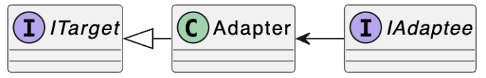
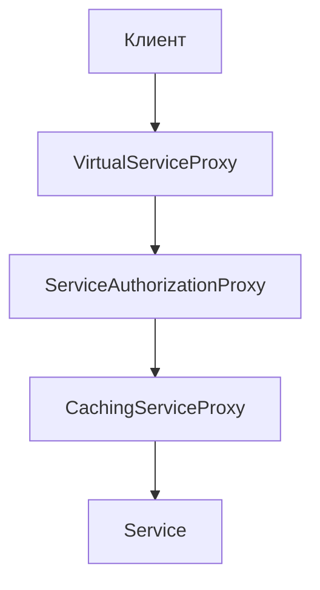

# Структурыне паттерны

Эти паттерны отвечают за построение удобных в
поддержке иерархий классов.

### Adapter (Адаптер)

Адаптер — это промежуточный тип, использующий объект одного типа, для реализации интерфейса
другого типа.
Другими словами это структурный паттерн проектирования, который позволяет объектам с несовместимыми интерфейсами работать вместе.

Вся суть этого паттерна заключается в следующей картинке:


То есть у нас есть два каких-то объекта, которые несовместимы между собой (разные интерфейсы) и мы хотим написать какой-то промежуточный класс, который свяжет эти объекты между собой и будет как бы "перенапраплять" интерфейсы.

Банальный пример: вы пишите приложение для игры на бирже и все результаты записываете в форма .tsv или в формате markdown. 
То есть пока что это просто приложение, которые записывает свои логи в формате .md. Но затем вам хочется эти логи проанализировать и вы находите хорошую библиотеку для анализа логов. Однако загвоздка в том, что эта библиотека работает только с форматом json. Соответсвенно вы не можете напрямую передавать md в json. Тут на помощь и приходит адаптер: вы создаёте промежуточный объект, который конвертирует md в json и передаете так:
Логи (md) -> Промежуточный объект (конвертирует md в json) -> Библиотека (json)

Или же представьте это как переводчика на конференции: конференция ожидает, что все будут общаться на английском (это наш target), но один участник говорит только на русском (это наш adaptee). Переводчик встаёт посередине, слушает английский, переводит на русский, слушает русский, переводит обратно на английский. Переводчик — это наш Adapter.

Терминология:

*Target (Цель)* - целевой интерфейс, через который мы хотим взаимодействовать с объектом, изначально его не реализующий

*Adaptee (Адаптируемый)* - адаптируемый тип

*Adapter (Адаптер)* - тип-обёртка, реализует целевой интерфейс, содержит объект адаптируемого типа и перенаправляющая в него вызовы поведений целевого интерфейса 



Давайте рассмотрим шуточный пример:
В этом шуточном примере Адаптер преобразует один интерфейс в другой, позволяя совместить квадратные колышки и круглые отверстия.
Адаптер вычисляет наименьший радиус окружности, в которую можно вписать квадратный колышек, и представляет его как круглый колышек с этим радиусом.


```csharp
using System;

//
// Классы с совместимыми интерфейсами: RoundHole и RoundPeg.
//
class RoundHole
{
    private double radius;

    public RoundHole(double radius)
    {
        this.radius = radius;
    }

    public double GetRadius()
    {
        // Вернуть радиус отверстия.
        return radius;
    }

    public bool Fits(RoundPeg peg)
    {
        return this.GetRadius() >= peg.GetRadius();
    }
}

class RoundPeg
{
    private double radius;

    public RoundPeg(double radius)
    {
        this.radius = radius;
    }

    public double GetRadius()
    {
        // Вернуть радиус круглого колышка.
        return radius;
    }
}

//
// Устаревший, несовместимый класс: SquarePeg.
//
class SquarePeg
{
    private double width;

    public SquarePeg(double width)
    {
        this.width = width;
    }

    public double GetWidth()
    {
        // Вернуть ширину квадратного колышка.
        return width;
    }
}

//
// Адаптер позволяет использовать квадратные колышки и круглые отверстия вместе.
//
class SquarePegAdapter : RoundPeg
{
    private SquarePeg peg;

    public SquarePegAdapter(SquarePeg peg) : base(0)
    {
        this.peg = peg;
    }

    public override double GetRadius()
    {
        // Вычислить половину диагонали квадратного колышка по теореме Пифагора.
        return peg.GetWidth() * Math.Sqrt(2) / 2;
    }
}

//
// Где-то в клиентском коде.
//
class Program
{
    static void Main()
    {
        var hole = new RoundHole(5);
        var rpeg = new RoundPeg(5);
        Console.WriteLine(hole.Fits(rpeg)); // TRUE

        var smallSqPeg = new SquarePeg(5);
        var largeSqPeg = new SquarePeg(10);

        // hole.Fits(smallSqPeg); // Ошибка компиляции, несовместимые типы

        var smallSqPegAdapter = new SquarePegAdapter(smallSqPeg);
        var largeSqPegAdapter = new SquarePegAdapter(largeSqPeg);

        Console.WriteLine(hole.Fits(smallSqPegAdapter)); // TRUE
        Console.WriteLine(hole.Fits(largeSqPegAdapter)); // FALSE
    }
}
```

Самое главное, что адаптер решает задачу совместимости интерфейсов, **не меняя** клиентский код и **не переписывая** сторонние библиотеки. То есть мы никак не должны менять уже написанное. Адаптер пишется поверх сущетсвующего кода. 

Рассмотрим ещё один пример использования:

Представьте, что вы разрабатываете систему логирования для вашего приложения. Изначально вы использовали PostgreSQL для хранения логов, и написали под него специальный класс.

Всё работает хорошо. Но потом бизнес требует: "Нам нужно масштабировать логирование. Добавим ElasticSearch для полнотекстового поиска!" И вот вам дают уже готовую библиотеку с классом ElasticSearch:

Nota: Elasticsearch — это распределенная поисковая и аналитическая система, основанная на движке Apache Lucene. Она используется для быстрого поиска и анализа больших объемов данных в реальном времени

```csharp
public class PostgresLogStorage
{
    public void Save(string message, DateTime timeStamp, int severity)
    {
        // ...
    }
}

public class ElasticSearchLogStorage
{
    public void Save(ElasticLogMessage message)
    {
        // ...
    }
}
```

Это были adaptee. То есть уже существующие классы, которые мы либо не можем, либо не хотим изменять. Они могут быть из внешних библиотек, легаси-кода или просто они имеют свою логику, которая не должна быть затронута.

Более того, представьте, что у нас в приложении уже есть сервис для логирования с одним единственным контрактом. Target Interface — то, что ожидает клиент. Это контракт, который клиент (в нашем случае LoggingService) ожидает видеть. Это единый стандарт, к которому мы хотим привести все реализации хранилищ логов.
```csharp
public interface ILogStorage
{
    void Save(LogMessage message);
}
```
Мы хотим как-то соединить эти две части между собой. Для этого мы можем написать класс-обертку. 
```csharp
public class PostgresLogStorageAdapter : ILogStorage
{
    private readonly PostgresLogStorage _storage;
    
    public PostgresLogStorageAdapter(PostgresLogStorage storage)
    {
        _storage = storage;
    }
    
    public void Save(LogMessage message)
    {
        // Трансформируем данные из целевого формата в формат adaptee
        _storage.Save(
            message.Message,
            message.DateTime,
            message.Severity.AsInteger()  // преобразуем Severity enum в int
        );
    }
}

public class ElasticLogStorageAdapter : ILogStorage
{
    private readonly ElasticSearchLogStorage _storage;
    
    public ElasticLogStorageAdapter(ElasticSearchLogStorage storage)
    {
        _storage = storage;
    }
    
    public void Save(LogMessage message)
    {
        // Трансформируем данные из целевого формата в формат adaptee
        _storage.Save(message.AsElasticLogMessage());
    }
}
```
Для PostgresLogStorageAdapter:

- Поле _storage — здесь мы храним объект, который нужно адаптировать. Это наша ссылка на "оригинального артиста", за спиной которого мы стоим.
- Конструктор — принимает объект PostgresLogStorage и сохраняет его. Это композиция (не наследование!). Мы не расширяем функциональность Postgres, мы оборачиваем его.
- Метод Save — это главное в адаптере:
    - Получает LogMessage в формате, который ожидает клиент
    - Трансформирует его в формат, который ожидает PostgresLogStorage
    - Вызывает оригинальный метод с преобразованными данными
- Для ElasticLogStorageAdapter логика та же, но трансформация другая. Заметьте, что мы вызываем message.AsElasticLogMessage() — это предполагает, что у LogMessage есть extension method или метод, который преобразует наше сообщение в формат Elastic.

Теперь давайте посмотрим на самую мощную часть этого паттерна — адаптивный рефакторинг.


Представьте, что вы пишите какую-то программу (аля бота в тг) и вам нужно перейти с синхронного API на асинхронный. Но у вас есть много кода, который уже использует ILogStorage. 
```csharp
public interface IAsyncLogStorage
{
    Task SaveAsync(LogMessage message);
}

public class AsyncLogStorageAdapter : IAsyncLogStorage
{
    private readonly ILogStorage _storage;
    
    public AsyncLogStorageAdapter(ILogStorage storage)
    {
        _storage = storage;
    }
    
    public Task SaveAsync(LogMessage message)
    {
        _storage.Save(message);
        return Task.CompletedTask;
    }
}
```

Вы можете:
- Вариант плохой: переписать весь код — опасно, долго, можно сломать.
- Вариант хороший: создать адаптер, который оборачивает синхронную реализацию и предоставляет асинхронный интерфейс.

Преимущество такого подхода:
```csharp
// Старый код продолжает работать как раньше
var logService = new LoggingService(new PostgresLogStorageAdapter(postgresStorage));

// А новый код может использовать асинхронный интерфейс
var asyncLogService = new AsyncLoggingService(
    new AsyncLogStorageAdapter(
        new PostgresLogStorageAdapter(postgresStorage)
    )
);
```
Видите? Мы можем комбинировать адаптеры! Это как слои (layers). Снизу у нас оригинальный PostgresLogStorage, затем мы оборачиваем его в PostgresLogStorageAdapter (чтобы он соответствовал ILogStorage), затем в AsyncLogStorageAdapter (чтобы он соответствовал IAsyncLogStorage).

А также с помощью адаптеров можно проводить адаптивный рефакторинг.

адаптивный рефакторинг
- позволяет проводить рефакторинг в два шага
    1. изменения использований
    2. изменение реализации
- позволяет локализовать изменения

Допустим такую ситуацию: все долгие годы мы юзали в проекте старый логгер, теперь пишем все асинхронно и нам нужен асинхронный логгер. Тогда сделаем все в 2 шага:

Меняем абстракцию - создаем крутой адаптер, интерфейс которого поддерживает и старую, и новую реализации, и используем этот адаптер в нашем коде

Меняем реализацию - засовываем в этот адаптер асинхронный логгер

Вся система использует старый синхронный API:
```csharp
class OrderService
{
    private ILogStorage _storage;
    
    public void ProcessOrder(Order order)
    {
        _storage.Save(new LogMessage { Message = "Order processed" });
    }
}

class PaymentService
{
    private ILogStorage _storage;
    
    public void ProcessPayment(Payment payment)
    {
        _storage.Save(new LogMessage { Message = "Payment processed" });
    }
}

// ... ещё 50 классов с таким же кодом
```
Теперь вам нужно перейти на асинхронный API, но это большой рефакторинг. Адаптер позволяет сделать это постепенно:
Шаг 1: Создаём адаптер (локализованное изменение)
```csharp
public class AsyncLogStorageAdapter : IAsyncLogStorage
{
    private readonly ILogStorage _storage;
    
    public AsyncLogStorageAdapter(ILogStorage storage)
    {
        _storage = storage;
    }
    
    public Task SaveAsync(LogMessage message)
    {
        _storage.Save(message);
        return Task.CompletedTask;
    }
}
```
Шаг 2: Постепенно меняем использования (один класс за раз)
```csharp
// Новая версия OrderService — асинхронная
class OrderService
{
    private IAsyncLogStorage _storage;
    
    public async Task ProcessOrderAsync(Order order)
    {
        await _storage.SaveAsync(new LogMessage { Message = "Order processed" });
    }
}

// PaymentService ещё старый, но может использовать адаптер!
class PaymentService
{
    private ILogStorage _storage;
    
    public void ProcessPayment(Payment payment)
    {
        _storage.Save(new LogMessage { Message = "Payment processed" });
    }
}
```
Шаг 3: При создании объектов используем адаптер для комбинирования
```csharp
var syncStorage = new PostgresLogStorageAdapter(postgresDb);
var asyncStorage = new AsyncLogStorageAdapter(syncStorage);

var orderService = new OrderService(asyncStorage);      // получает асинхронный
var paymentService = new PaymentService(syncStorage);   // получает синхронный
```

- Мы не меняем реализацию PostgresLogStorageAdapter
- Мы не переписываем все сразу
- Мы можем мигрировать постепенно, один класс за раз

Все объекты работают правильно, потому что они получают нужный интерфейс через адаптер

Это называется локализацией изменений — изменения сосредоточены в одном месте (в адаптере), а не разбросаны по всему коду.

Теперь давайте покажем, как всё это использовать в реальной программе:
```csharp
class Program
{
    static async Task Main(string[] args)
    {
        // Шаг 1: Создаём оригинальные объекты (adaptees)
        var postgresDb = new PostgresLogStorage();
        var elasticDb = new ElasticSearchLogStorage();
        
        // Шаг 2: Оборачиваем их в адаптеры (target interface)
        ILogStorage postgresAdapter = new PostgresLogStorageAdapter(postgresDb);
        ILogStorage elasticAdapter = new ElasticLogStorageAdapter(elasticDb);
        
        // Шаг 3: Используем оба хранилища через единый интерфейс
        var loggingService1 = new LoggingService(postgresAdapter);
        var loggingService2 = new LoggingService(elasticAdapter);
        
        // Логирование через Postgres
        loggingService1.LogError("Database connection failed", 2);
        
        // Логирование через Elastic
        loggingService2.LogError("API timeout", 3);
        
        Console.WriteLine("Synchronous logging completed.\n");
        
        // Шаг 4: Если нужен асинхронный API, используем адаптер адаптера!
        IAsyncLogStorage asyncPostgresAdapter = 
            new AsyncLogStorageAdapter(postgresAdapter);
        
        var asyncLoggingService = new AsyncLoggingService(asyncPostgresAdapter);
        
        // Асинхронное логирование
        await asyncLoggingService.LogErrorAsync("Async error occurred", 1);
        
        Console.WriteLine("Asynchronous logging completed.");
    }
}

// Вспомогательные классы для примера
public class LogMessage
{
    public string Message { get; set; }
    public DateTime DateTime { get; set; }
    public Severity Severity { get; set; }
}

public enum Severity
{
    Info = 0,
    Warning = 1,
    Error = 2,
    Critical = 3
}

public class LoggingService
{
    private readonly ILogStorage _storage;
    
    public LoggingService(ILogStorage storage)
    {
        _storage = storage;
    }
    
    public void LogError(string message, int severity)
    {
        var logMessage = new LogMessage
        {
            Message = message,
            DateTime = DateTime.Now,
            Severity = (Severity)severity
        };
        
        _storage.Save(logMessage);
    }
}

public class AsyncLoggingService
{
    private readonly IAsyncLogStorage _storage;
    
    public AsyncLoggingService(IAsyncLogStorage storage)
    {
        _storage = storage;
    }
    
    public async Task LogErrorAsync(string message, int severity)
    {
        var logMessage = new LogMessage
        {
            Message = message,
            DateTime = DateTime.Now,
            Severity = (Severity)severity
        };
        
        await _storage.SaveAsync(logMessage);
    }
}

// Extension method для трансформации в ElasticSearch формат
public static class LogMessageExtensions
{
    public static ElasticLogMessage AsElasticLogMessage(this LogMessage message)
    {
        return new ElasticLogMessage
        {
            Content = $"{message.DateTime:yyyy-MM-dd HH:mm:ss} [{message.Severity}] {message.Message}",
            Timestamp = message.DateTime,
            Level = message.Severity.ToString()
        };
    }
    
    public static int AsInteger(this Severity severity)
    {
        return (int)severity;
    }
}

public class ElasticLogMessage
{
    public string Content { get; set; }
    public DateTime Timestamp { get; set; }
    public string Level { get; set; }
}
```

1. Создание оригинальных объектов — мы инстанцируем PostgresLogStorage и ElasticSearchLogStorage.
2. Оборачивание в адаптеры — каждый из них оборачивается в соответствующий адаптер, который реализует ILogStorage.
3. Использование через интерфейс — клиентский код (LoggingService) вообще не знает, что он работает с адаптерами. Он просто получает ILogStorage и работает с ним.
4. Двойное оборачивание — мы даже можем создать AsyncLogStorageAdapter, который оборачивает postgresAdapter. Это показывает, как адаптеры можно комбинировать как матрёшки.

Применимость:

1. **Когда вы хотите использовать сторонний класс, но его интерфейс не соответствует остальному коду приложения.**

Адаптер позволяет создать объект-прокладку, который будет превращать вызовы приложения в формат, понятный стороннему классу.

2. **Когда вам нужно использовать несколько существующих подклассов, но в них не хватает какой-то общей функциональности, причём расширить суперкласс вы не можете.**

Вы могли бы создать ещё один уровень подклассов и добавить в них недостающую функциональность. Но при этом придётся дублировать один и тот же код в обеих ветках подклассов.

Более элегантным решением было бы поместить недостающую функциональность в адаптер и приспособить его для работы с суперклассом. Такой адаптер сможет работать со всеми подклассами иерархии. Это решение будет сильно напоминать паттерн Декоратор.

### Bridge (Мост)

Bridge (Мост) - разделение объектной модели на абстракции разных уровней; реализации абстракций более высокого уровня, использующие абстракции более низкого уровня и являются “мостом”

То есть это паттерн проектирования, который разделяет один или несколько классов на две отдельные иерархии — абстракцию и реализацию, позволяя изменять их независимо друг от друга.


Пример:
У вас есть класс геометрических Фигур, который имеет подклассы Круг и Квадрат. Вы хотите расширить иерархию фигур по цвету, то есть иметь Красные и Синие фигуры. Но чтобы всё это объединить, вам придётся создать 4 комбинации подклассов, вроде СиниеКруги и КрасныеКвадраты.


При добавлении новых видов фигур и цветов количество комбинаций будет расти в геометрической прогрессии. Например, чтобы ввести в программу фигуры треугольников, придётся создать сразу два новых подкласса треугольников под каждый цвет. После этого новый цвет потребует создания уже трёх классов для всех видов фигур. Чем дальше, тем хуже.

Корень проблемы заключается в том, что мы пытаемся расширить классы фигур сразу в двух независимых плоскостях — по виду и по цвету. Именно это приводит к разрастанию дерева классов.

Паттерн Мост предлагает заменить наследование агрегацией или композицией. Для этого нужно выделить одну из таких «плоскостей» в отдельную иерархию и ссылаться на объект этой иерархии, вместо хранения его состояния и поведения внутри одного класса.


Рассмотрим другой пример:

Представьте себе, что вы разрабатываете систему управления телевизором. На первый взгляд, всё просто: есть пульт управления и есть сам телевизор. Но вот наступает момент, когда нужно поддержать несколько типов устройств — телевизоры разных марок, проекторы, медиа-плееры. И одновременно нужны разные типы управления: обычный пульт, голосовой помощник, мобильное приложение.

Если вы попытаетесь решить это наивным способом, создав класс TvControl, потом ProjectorControl, потом VoiceControl, потом TvVoiceControl, потом ProjectorVoiceControl — вы получите комбинаторный взрыв классов. Это нарушает Open/Closed Principle: система становится закрытой для расширения без модификации.

Основная проблема в том, что мы смешиваем две независимые оси изменчивости:

1. Абстракция высокого уровня — как мы управляем (пульт, голос, приложение)

2. Абстракция низкого уровня — чем мы управляем (телевизор, проектор, медиа-плеер)

Эти две оси должны изменяться независимо. Мост решает именно эту задачу — он разделяет эти две иерархии.

Простыми словами: мы не делаем одну большую иерархию классов, а создаём две независимые иерархии и соединяем их мостом (через композицию, а не наследование).


Давайте расмотрим как мы это делааем:

Шаг 1: Определяем низкоуровневую абстракцию (устройство)
```csharp
public interface IDevice
{
    public bool IsEnabled { get; set; }
    public int Channel { get; set; }
    public int Volume { get; set; }
}
```

Это абстракция низкого уровня. Она определяет, какие свойства есть у любого устройства, которым можно управлять

То есть это наши устройства: телевизоры, проекторы, плееры и тд. Если бы мы проектировали онлайн-кинотеатры для разных платформ, то это могли бы быть например Ios, Android, Linux, Windows, MacOs и так далее. 

Шаг 2: Определяем высокоуровневую абстракцию (управление)

```csharp
public interface IControl
{
    void ToggleEnabled();
    void ChannelForward();
    void ChannelBackward();
    void VolumeUp();
    void VolumeDown();
}
```

Это абстракция высокого уровня. Она определяет, какие действия может выполнить пользователь


Шаг 3: Реализуем конкретное управление (первый мост)

```csharp
public class Control : IControl
{
    private readonly IDevice _device;

    public Control(IDevice device)
    {
        _device = device;
    }

    public void ToggleEnabled()
    {
        _device.IsEnabled = !_device.IsEnabled;
    }

    public void ChannelForward()
    {
        _device.Channel += 1;
    }

    public void ChannelBackward()
    {
        _device.Channel -= 1;
    }

    public void VolumeUp()
    {
        _device.Volume += 10;
    }

    public void VolumeDown()
    {
        _device.Volume -= 10;
    }
}
```

Попробуем добавить новый тип управления, который специально будет содержать ошибки:
```csharp
public class FaultyControl : IControl
{
    private readonly IDevice _device;

    public FaultyControl(IDevice device)
    {
        _device = device;
    }

    public void ToggleEnabled()
    {
        TryFault();
        _device.IsEnabled = !_device.IsEnabled;
    }

    public void ChannelForward()
    {
        TryFault();
        _device.Channel += 1;
    }

    public void ChannelBackward()
    {
        TryFault();
        _device.Channel -= 1;
    }

    public void VolumeUp()
    {
        TryFault();
        _device.Volume += 10;
    }

    public void VolumeDown()
    {
        TryFault();
        _device.Volume -= 10;
    }

    private void TryFault()
    {
        if (Random.Shared.NextDouble() < 0.5)
        {
            _device.IsEnabled = !_device.IsEnabled;
        }
    }
}
```

мы добавили новый тип управления, не трогая ни одну строчку кода в других классах.

То есть мост можно разбить на другие принципы:

1. способ реализации OCP
```csharp
// Можем добавить новый тип управления без изменения старых
public class VoiceControl : IControl
{
    private readonly IDevice _device;
    
    public void ToggleEnabled() => _device.IsEnabled = !_device.IsEnabled;
    // ... остальные методы
}

// И всё ещё можем использовать с любым устройством
var device = new Tv();
var voiceControl = new VoiceControl(device);
```
2. способ реализации protected variations
Мост защищает высокоуровневую логику от изменений в устройствах. Если завтра мы добавим новый тип устройства, весь код управления остаётся неизменным.

```csharp
// Завтра добавим новый тип устройства
public class SmartFridge : IDevice
{
    public bool IsEnabled { get; set; }
    public int Channel { get; set; }
    public int Volume { get; set; }
}

// Всё управление СРАЗУ работает с холодильником!
var fridge = new SmartFridge();
var control = new Control(fridge);  // Работает!
var faultyControl = new FaultyControl(fridge);  // Тоже работает!
```

3. подвид адаптера отличается тем, что абстракции моста проектируются изначально, а адаптер добавляется в процессе поддержки кода

4. полиморфный билдер + директор = мост

Builder + Director, это тоже создание моста между пользователем (директор) и объектом (строитель).

```csharp
// Директор (высокоуровневая абстракция)
public class SmartHomeDirector
{
    private readonly IDeviceBuilder _builder;

    public SmartHomeDirector(IDeviceBuilder builder)
    {
        _builder = builder;
    }

    public void SetupCinemaMode()
    {
        _builder.SetPower(true);
        _builder.SetVolume(30);
        _builder.SetBrightness(10);
    }
}

// Строитель (низкоуровневая абстракция)
public interface IDeviceBuilder
{
    void SetPower(bool enabled);
    void SetVolume(int level);
    void SetBrightness(int level);
}
```
Или ещё один пример:
```csharp
// Абстракция билдера
public interface IFoodBuilder
{
    void SetDishType(string type);
    void AddIngredient(string name);
    string GetResult();
}

// Билдер для JSON заказа
public class JsonFoodBuilder : IFoodBuilder
{
    private dynamic dish = new System.Dynamic.ExpandoObject();
    public void SetDishType(string type) { dish.Type = type; }
    public void AddIngredient(string name)
    {
        if (dish.Ingredients == null) dish.Ingredients = new List<string>();
        dish.Ingredients.Add(name);
    }
    public string GetResult() => JsonConvert.SerializeObject(dish);
}

// Адаптер для XML на основе JSON билдера
public class XmlFoodBuilderAdapter : IFoodBuilder
{
    private JsonFoodBuilder jsonBuilder = new JsonFoodBuilder();
    public void SetDishType(string type) => jsonBuilder.SetDishType(type);
    public void AddIngredient(string name) => jsonBuilder.AddIngredient(name);
    public string GetResult()
    {
        var json = jsonBuilder.GetResult();
        // Просто пример преобразования JSON → XML, псевдокод
        return JsonToXmlConverter.Convert(json);
    }
}

// Директор — связывает заказ (high-level) и билдер (low-level)
public class FoodDirector
{
    private IFoodBuilder builder;
    public FoodDirector(IFoodBuilder builder) { this.builder = builder; }
    public void MakePizza()
    {
        builder.SetDishType("Pizza");
        builder.AddIngredient("Cheese");
        builder.AddIngredient("Tomato");
    }
    public string GetOrder() => builder.GetResult();
}

// Пример применения — разные комбинации билдера и адаптера
public static void Main()
{
    var jsonDirector = new FoodDirector(new JsonFoodBuilder());
    jsonDirector.MakePizza();
    Console.WriteLine(jsonDirector.GetOrder()); // JSON-строка

    var xmlDirector = new FoodDirector(new XmlFoodBuilderAdapter());
    xmlDirector.MakePizza();
    Console.WriteLine(xmlDirector.GetOrder()); // XML-строка
}
```
Соберём всё в один большой работающий код:
```csharp
public static void Main()
{
    Console.WriteLine("=== ПАТТЕРН МОСТ: СИСТЕМА УПРАВЛЕНИЯ УСТРОЙСТВАМИ ===\n");

    // Создаём устройства
    IDevice tv = new Tv();
    IDevice projector = new Projector();
    IDevice mediaPlayer = new MediaPlayer();

    Console.WriteLine("ИСХОДНОЕ СОСТОЯНИЕ:");
    Console.WriteLine($"  {tv}");
    Console.WriteLine($"  {projector}");
    Console.WriteLine($"  {mediaPlayer}\n");

    // СЦЕНАРИЙ 1: Обычное управление телевизором
    Console.WriteLine("--- СЦЕНАРИЙ 1: Обычное управление телевизором ---");
    IControl tvControl = new Control(tv);
    
    tvControl.ToggleEnabled();
    Console.WriteLine($"После включения: {tvControl}");
    
    tvControl.VolumeUp();
    tvControl.VolumeUp();
    Console.WriteLine($"После увеличения звука: {tvControl}");
    
    tvControl.ChannelForward();
    tvControl.ChannelForward();
    Console.WriteLine($"После переключения канала: {tvControl}\n");

    // СЦЕНАРИЙ 2: Управление проектором с логированием
    Console.WriteLine("--- СЦЕНАРИЙ 2: Управление проектором с логированием ---");
    IControl projectorControl = new LoggingControl(projector);
    
    projectorControl.ToggleEnabled();
    projectorControl.VolumeUp();
    projectorControl.ChannelBackward();
    Console.WriteLine($"Итоговое состояние: {projectorControl}\n");

    // СЦЕНАРИЙ 3: Управление медиа-плеером с задержками
    Console.WriteLine("--- СЦЕНАРИЙ 3: Управление медиа-плеером с задержками (2 секунды) ---");
    IControl delayedControl = new DelayedControl(mediaPlayer, delayMs: 2000);
    
    Console.WriteLine("Включаем медиа-плеер (будет задержка 2 сек)...");
    delayedControl.ToggleEnabled();
    Console.WriteLine($"Готово: {delayedControl}\n");

    // СЦЕНАРИЙ 4: Демонстрация гибкости — один тип управления, разные устройства
    Console.WriteLine("--- СЦЕНАРИЙ 4: Один тип управления (Control) для разных устройств ---");
    
    var devices = new IDevice[] { tv, projector, mediaPlayer };
    var controls = new IControl[] 
    { 
        new Control(tv), 
        new Control(projector), 
        new Control(mediaPlayer) 
    };

    foreach (var control in controls)
    {
        control.ToggleEnabled();
        control.VolumeUp();
    }

    foreach (var device in devices)
    {
        Console.WriteLine($"  {device}");
    }
    Console.WriteLine();

    // СЦЕНАРИЙ 5: Демонстрация КЛЮЧЕВОГО ПРЕИМУЩЕСТВА мостов
    Console.WriteLine("--- СЦЕНАРИЙ 5: Чудо паттерна Мост! ---");
    Console.WriteLine("Создаём новое устройство и новый тип управления");
    Console.WriteLine("БЕЗ изменения кода выше:\n");

    // Новое устройство добавляем после факта
    public class SmartLamp : IDevice
    {
        public bool IsEnabled { get; set; }
        public int Channel { get; set; } = 1;
        public int Volume { get; set; } = 75;
        
        public override string ToString() => 
            $"SmartLamp: {(IsEnabled ? "ON" : "OFF")}, Brightness={Channel * 10}%, Color={Volume}";
    }

    IDevice lamp = new SmartLamp();
    IControl lampControl = new Control(lamp);
    lampControl.ToggleEnabled();
    Console.WriteLine($"Лампа работает: {lampControl}");

    // Новый тип управления добавляем после факта
    IControl lampControlWithLogging = new LoggingControl(lamp);
    lampControlWithLogging.VolumeUp();
    Console.WriteLine($"Лампа с логированием: {lampControlWithLogging}");
}
/*
=== ПАТТЕРН МОСТ: СИСТЕМА УПРАВЛЕНИЯ УСТРОЙСТВАМИ ===

ИСХОДНОЕ СОСТОЯНИЕ:
  TV: OFF, Ch=1, Vol=50
  Projector: OFF, Ch=1, Vol=30
  MediaPlayer: OFF, Ch=1, Vol=40

--- СЦЕНАРИЙ 1: Обычное управление телевизором ---
После включения: TV: ON, Ch=1, Vol=50
После увеличения звука: TV: ON, Ch=1, Vol=70
После переключения канала: TV: ON, Ch=3, Vol=70

--- СЦЕНАРИЙ 2: Управление проектором с логированием ---
[LOG] Toggle: False -> True on Projector
[LOG] Volume: 30 -> 40 on Projector
[LOG] Channel: 1 -> 0 on Projector
Итоговое состояние: Projector: ON, Ch=0, Vol=40

--- СЦЕНАРИЙ 3: Управление медиа-плеером с задержками (2 секунды) ---
Включаем медиа-плеер (будет задержка 2 сек)...
Готово: MediaPlayer: ON, Ch=1, Vol=40

--- СЦЕНАРИЙ 4: Один тип управления (Control) для разных устройств ---
  TV: ON, Ch=1, Vol=70
  Projector: ON, Ch=0, Vol=40
  MediaPlayer: ON, Ch=2, Vol=50

--- СЦЕНАРИЙ 5: Чудо паттерна Мост! ---
Создаём новое устройство и новый тип управления
БЕЗ изменения кода выше:
Лампа работает: SmartLamp: ON, Brightness=10%, Color=75
Лампа с логированием: [LOG] Volume: 75 -> 85 on SmartLamp
SmartLamp: ON, Brightness=10%, Color=85
*/
```

Шаги реализации:
1. Определите, существует ли в ваших классах два непересекающихся измерения. Это может быть функциональность/платформа, предметная-область/инфраструктура, фронт-энд/бэк-энд или интерфейс/реализация.

2. Продумайте, какие операции будут нужны клиентам, и опишите их в базовом классе абстракции.

3. Определите поведения, доступные на всех платформах, и выделите из них ту часть, которая нужна абстракции. На основании этого опишите общий интерфейс реализации.

4. Для каждой платформы создайте свой класс конкретной реализации. Все они должны следовать общему интерфейсу, который мы выделили перед этим.

5. Добавьте в класс абстракции ссылку на объект реализации. Реализуйте методы абстракции, делегируя основную работу связанному объекту реализации.

6. Если у вас есть несколько вариаций абстракции, создайте для каждой из них свой подкласс.

7. Клиент должен подать объект реализации в конструктор абстракции, чтобы связать их воедино. После этого он может свободно использовать объект абстракции, забыв о реализации.

Важно: Мост проектируют загодя, чтобы развивать большие части приложения отдельно друг от друга. Адаптер применяется постфактум, чтобы заставить несовместимые классы работать вместе.

Абстрактная фабрика может работать совместно с Мостом. Это особенно полезно, если у вас есть абстракции, которые могут работать только с некоторыми из реализаций. В этом случае фабрика будет определять типы создаваемых абстракций и реализаций

Паттерн Строитель может быть построен в виде Моста: директор будет играть роль абстракции, а строители — реализации.

### Composite (компоновщик)

###### Также известен как: Дерево (Object tree)

Компоновщик - представление древовидной структуры
объектов в виде одного композитного объекта

Терминальные узлы – узлы, которые не содержат другие узлы

Агрегатные узлы – узлы, которые содержат другие узлы


Представьте, что вы разрабатываете графический редактор — что-то вроде Figma или Adobe Illustrator. В таком редакторе пользователь может:

- Рисовать отдельные фигуры: круги, квадраты, линии
- Группировать эти фигуры вместе
- Группировать уже сгруппированные фигуры — создавая вложенные группы
- Применять операции ко всей группе сразу (например, сдвинуть всё вместе на 10 пикселей вправо)

Вот в чём проблема: если у вас есть метод MoveBy(), который работает для одного круга, но вы захотели применить его к группе из 10 объектов — что делать? Вы не можете просто вызвать MoveBy() на массиве. Вам нужно обойти все элементы в цикле. А что если внутри этого массива есть ещё группы? Тогда нужна рекурсия. Получается беспорядок.

Ещё хуже: клиентский код становится сложным — где-то циклы, где-то условия, проверка типов, рекурсия. Это нарушает принцип открытости/закрытости (Open/Closed Principle) — при добавлении новых типов объектов клиентский код ломается.

Решение: паттерн Компоновщик предлагает обрабатывать отдельные объекты и группы объектов одинаково — через единый интерфейс.

Ключевая идея очень простая и элегантная:

"Группа объектов и отдельный объект должны подчиняться одному контракту (интерфейсу). Тогда операции над ними можно применять единообразно, независимо от того, работаем ли мы с одной фигурой или со 100 фигур в 10 вложенных группах."

Это создаёт древовидную структуру, где:

Листья дерева (терминальные узлы) — это простые объекты: Circle, Square

Внутренние узлы (агрегатные узлы) — это группы: GraphicComponentGroup

Но все они выглядят одинаково для клиента — все реализуют IGraphicComponent.

Напишем какой-нибудь такой код:

```csharp
public readonly record struct Position(int X, int Y);
```

Это просто вспомогательная структура для хранения координат. Ничего сложного — просто удобно иметь типобезопасное представление позиции вместо двух отдельных int.

Шаг 2: Определяем единый интерфейс

```csharp
public interface IGraphicComponent
{
    void MoveBy(int x, int y);
    void Draw();
}
```

- MoveBy() — применяется как к одной фигуре, так и ко всей группе
- Draw() — рисует объект или всю группу

Шаг 3: Реализуем листья дерева (простые объекты)

```csharp
public class Circle : IGraphicComponent
{
    private Position _position;
    
    public void MoveBy(int x, int y)
    {
        _position = new Position(_position.X + x, _position.Y + y);
    }
    
    public void Draw()
    {
        Console.WriteLine($"Circle: {_position.X}, {_position.Y}");
    }
}

public class Square : IGraphicComponent
{
    private Position _position;
    
    public void MoveBy(int x, int y)
    {
        _position = new Position(_position.X + x, _position.Y + y);
    }
    
    public void Draw()
    {
        Console.WriteLine($"Square: {_position.X}, {_position.Y}");
    }
}
```

Шаг 4: Реализуем внутренние узлы (группы)

```csharp
public class GraphicComponentGroup : IGraphicComponent
{
    private readonly IReadOnlyCollection<IGraphicComponent> _components;
    
    public GraphicComponentGroup(IReadOnlyCollection<IGraphicComponent> components)
    {
        _components = components;
    }
    
    public void MoveBy(int x, int y)
    {
        foreach (var component in _components)
            component.MoveBy(x, y);
    }
    
    public void Draw()
    {
        foreach (var component in _components)
            component.Draw();
    }
}
```

- _components — хранит коллекцию элементов, которые тоже реализуют IGraphicComponent. Это могут быть Circle, Square или другие GraphicComponentGroup!

- MoveBy() — вместо того, чтобы сдвигаться сама, делегирует вызов всем своим компонентам. Каждый компонент отвечает за себя. Если это Circle — он сдвинется сам. Если это GroupicComponentGroup — та рекурсивно передаст команду своим элементам.

- Draw() — аналогично, просто вызывает Draw() у всех компонентов.

- GraphicComponentGroup тоже реализует IGraphicComponent. Это означает, что его можно положить в другую GroupicComponentGroup! Вложенность на любую глубину работает автоматически.

Теперь посмотрим, как это работает на практике:
```csharp
// Создаём отдельные фигуры
var circle = new Circle();
circle.MoveBy(1, 2);  // Circle переместилась в позицию (1, 2)

var square = new Square();
square.MoveBy(10, 0);  // Square переместилась в позицию (10, 0)

// Создаём группу из этих фигур
var composite = new GraphicComponentGroup([circle, square]);

// Рисуем всё
composite.Draw();
// Вывод:
// Circle: 1, 2
// Square: 10, 0

Console.WriteLine("----");

// Смещаем ВСЮ группу на (1, 1)
composite.MoveBy(1, 1);

// Рисуем снова
composite.Draw();
// Вывод:
// Circle: 2, 3      (было 1, 2 → добавили 1, 1)
// Square: 11, 1     (было 10, 0 → добавили 1, 1)
```
Теперь давайте усложним пример
```csharp
// Создаём первую группу
var circle1 = new Circle();
circle1.MoveBy(0, 0);

var square1 = new Square();
square1.MoveBy(5, 5);

var group1 = new GraphicComponentGroup([circle1, square1]);

// Создаём вторую группу
var circle2 = new Circle();
circle2.MoveBy(20, 20);

var group2 = new GraphicComponentGroup([circle2]);

// СОЗДАЁМ СУПЕРГРУППУ — группу групп!
var superGroup = new GraphicComponentGroup([group1, group2]);

// Смещаем ВСЁ на (10, 10)
superGroup.MoveBy(10, 10);

// Рисуем
superGroup.Draw();
// Вывод:
// Circle: 10, 10     (было 0, 0 → добавили 10, 10)
// Square: 15, 15     (было 5, 5 → добавили 10, 10)
// Circle: 30, 30     (было 20, 20 → добавили 10, 10)
```

Где это применяется в реальности?

1. Графические редакторы и UI фреймворки — контролы, которые содержат другие контролы (Panel содержит Button, который содержит другие контролы). Операции стиля, позиционирования применяются ко всему дереву.

2. Файловые системы — директория содержит файлы и другие директории. Операция "удалить всё" или "подсчитать размер" работает рекурсивно.

3. DOM в браузере — элемент может содержать другие элементы. querySelector(), применение стилей работают по дереву DOM.

4. Структуры организации — отдел содержит подразделения и сотрудников. Операции распространяются по иерархии.

5. Системы меню — меню содержит пункты и подменю. Отключение меню отключает всё внутри.

Применимость:

- **Когда вам нужно представить древовидную структуру объектов.**
Паттерн Компоновщик предлагает хранить в составных объектах ссылки на другие простые или составные объекты. Те, в свою очередь, тоже могут хранить свои вложенные объекты и так далее. В итоге вы можете строить сложную древовидную структуру данных, используя всего две основные разновидности объектов.

- **Когда клиенты должны единообразно трактовать простые и составные объекты.**
Благодаря тому, что простые и составные объекты реализуют общий интерфейс, клиенту безразлично, с каким именно объектом ему предстоит работать.

- **Паттерн учит нас мыслить абстрактно и рекурсивно:**
Абстрактно: вместо того, чтобы писать специальный код для "одной фигуры" и специальный код для "группы", мы определяем единую абстракцию
Рекурсивно: операция на группе = применить операцию ко всем элементам группы (и если они тоже группы, то рекурсивно)

### Decorator (Декоратор)

*Декоратор* - тип-обёртка над объектом абстракции, которую он реализует добавляет к поведениям объекта новую логику

*Абстракция* - какой-либо интерфейс, определяющий поведения

*Декоратор* - тип, реализующий абстракцию, содержащий объект данной абстракции

*Decoratee* - объект, типа, реализующего абстракцию, оборачиваемый в декоратор

Представьте, что у вас есть какой-нибудь класс, который выполняет базовую работу — например, Service, который обрабатывает запросы.
```csharp
public interface IService
{
    void DoStuff(DoStuffArgs args);
}

public class Service : IService
{
    public void DoStuff(DoStuffArgs args)
    {
        // Основная бизнес-логика, которую мы хотим расширить
        Console.WriteLine("Service: выполняю основную работу");
    }
}
```

IService - это просто какая-то абстракция 
Service - это decoratee

Со временем требования растут:

- "Нам нужно логировать все вызовы"
- "Нужно добавить кэширование"
- "Требуется проверка прав доступа перед каждым запросом"
- "Давайте добавим метрики производительности"
- "А может, сжимать данные перед отправкой?"

И так далее. Вот в чём проблема: если вы всё это добавите прямо в класс Service, он станет огромным слишком большим со множеством ответственностей. Это нарушает принцип единственной ответственности (Single Responsibility Principle).

Вы можете создать ServiceWithLogging : Service, затем ServiceWithLoggingAndCaching : ServiceWithLogging, затем ServiceWithLoggingAndCachingAndValidation : ServiceWithLoggingAndCaching... Это приводит к комбинаторному взрыву подклассов. Если у вас есть 5 функций (логирование, кэширование, валидация, метрики, сжатие), вы получите 2^5 = 32 различных комбинации. Это бяка.

паттерн Декоратор предлагает оборачивать объект в специальные обёртки, каждая из которых добавляет одну функцию

Вместо того, чтобы добавлять функциональность через наследование или расширение класса, обёрнуть объект в другой объект, который реализует тот же интерфейс, но добавляет новое поведение.

Декоратор работает как русская матрёшка:

- В центре — оригинальный объект (Service)
- Вокруг него — декоратор логирования (LoggingServiceDecorator)
- Вокруг логирования — декоратор кэширования (CachingServiceDecorator)
- И так далее...


Для клиента это выглядит как просто IService, но на самом деле это цепочка обёрток, каждая из которых добавляет что-то своё.

Реализуем первый декоратор:

```csharp
public class LoggingServiceDecorator : IService
{
    private readonly IService _decoratee;
    private readonly ILogger _logger;

    public LoggingServiceDecorator(IService decoratee, ILogger logger)
    {
        _decoratee = decoratee;
        _logger = logger;
    }

    public void DoStuff(DoStuffArgs args)
    {
        // Шаг 1: делаем "свою" работу — логирование
        _logger.Log(ArgsToLogMessage(args));
        
        // Шаг 2: передаём управление дальше по цепочке
        _decoratee.DoStuff(args);
    }

    private static string ArgsToLogMessage(DoStuffArgs args)
    {
        return $"Called with: {args.ToString()}";
    }
}
```

- _decoratee — это ссылка на объект, который мы обёртываем. Может быть чистый Service или другой декоратор.

- Конструктор принимает IService (это может быть кто угодно) и ILogger (инструмент для логирования).

- DoStuff() — выполняет два действия:

    1. Добавляет своё поведение — вызывает логирование
    2. Передаёт управление дальше — вызывает _decoratee.DoStuff(args)

Вот как можно это применить:
```csharp
IService service = new Service();
IService logged = new LoggingServiceDecorator(service, logger);

logged.DoStuff(new DoStuffArgs { Value = 42 });
```

При этом мы можем создать несколько декораторов и каждый из них будет добавлять свой фукнционал, то есть можем составить "цепочку" декораторов:

```csharp
// Создаём "русскую матрёшку"
IService service = new Service();
IService validated = new ValidationServiceDecorator(service);
IService cached = new CachingServiceDecorator(validated);
IService logged = new LoggingServiceDecorator(cached, logger);

// Работаем с ней
logged.DoStuff(new DoStuffArgs { Value = 42 });
```

LoggingServiceDecorator логирует

Передаёт управление CachingServiceDecorator

CachingServiceDecorator проверяет кэш

Передаёт управление ValidationServiceDecorator

ValidationServiceDecorator валидирует

Передаёт управление Service

Service выполняет работу

Контроль идёт обратно вверх по цепочке

Красота паттерна: порядок можно менять! Если нам нужна кэш-первая стратегия, то нам достаточно поместить её выше:
```charp
IService service = new Service();
IService logged = new LoggingServiceDecorator(service, logger);
IService validated = new ValidationServiceDecorator(logged);
IService cached = new CachingServiceDecorator(validated);

// Теперь кэш выше в иерархии!
```

Соберём всё вместе в один большой пример:
```csharp
using System;
using System.Collections.Generic;

public class DoStuffArgs
{
    public int Value { get; set; }
    public override string ToString() => $"Value={Value}";
}

public interface IService
{
    string DoStuff(DoStuffArgs args);
}

// Оригинальный сервис (ядро матрёшки)
public class Service : IService
{
    public string DoStuff(DoStuffArgs args)
    {
        Console.WriteLine($"[SERVICE] Выполняю работу с {args}");
        return $"Result for {args.Value}";
    }
}

// Декоратор: логирование
public class LoggingServiceDecorator : IService
{
    private readonly IService _decoratee;

    public LoggingServiceDecorator(IService decoratee)
    {
        _decoratee = decoratee;
    }

    public string DoStuff(DoStuffArgs args)
    {
        Console.WriteLine($"[LOG] >>> Входящий вызов: {args}");
        var result = _decoratee.DoStuff(args);
        Console.WriteLine($"[LOG] <<< Исходящий результат: {result}");
        return result;
    }
}

// Декоратор: кэширование
public class CachingServiceDecorator : IService
{
    private readonly IService _decoratee;
    private readonly Dictionary<int, string> _cache = new();

    public CachingServiceDecorator(IService decoratee)
    {
        _decoratee = decoratee;
    }

    public string DoStuff(DoStuffArgs args)
    {
        if (_cache.TryGetValue(args.Value, out var cached))
        {
            Console.WriteLine($"[CACHE] HIT для Value={args.Value}");
            return cached;
        }

        Console.WriteLine($"[CACHE] MISS для Value={args.Value}");
        var result = _decoratee.DoStuff(args);
        _cache[args.Value] = result;
        return result;
    }
}

// Декоратор: валидация
public class ValidationServiceDecorator : IService
{
    private readonly IService _decoratee;

    public ValidationServiceDecorator(IService decoratee)
    {
        _decoratee = decoratee;
    }

    public string DoStuff(DoStuffArgs args)
    {
        if (args.Value <= 0)
            throw new ArgumentException("Value должно быть > 0");

        Console.WriteLine($"[VALIDATE] Проверка пройдена для {args}");
        return _decoratee.DoStuff(args);
    }
}

class Program
{
    static void Main()
    {
        Console.WriteLine("=== Сценарий 1: Просто сервис ===");
        IService plain = new Service();
        plain.DoStuff(new DoStuffArgs { Value = 42 });

        Console.WriteLine("\n=== Сценарий 2: Логирование + Валидация ===");
        IService service = new Service();
        IService validated = new ValidationServiceDecorator(service);
        IService logged = new LoggingServiceDecorator(validated);
        
        logged.DoStuff(new DoStuffArgs { Value = 42 });

        Console.WriteLine("\n=== Сценарий 3: Логирование + Кэш ===");
        service = new Service();
        IService cached = new CachingServiceDecorator(service);
        logged = new LoggingServiceDecorator(cached);
        
        logged.DoStuff(new DoStuffArgs { Value = 10 });
        Console.WriteLine("--- Второй вызов с тем же аргументом ---");
        logged.DoStuff(new DoStuffArgs { Value = 10 });

        Console.WriteLine("\n=== Сценарий 4: Полная цепочка ===");
        service = new Service();
        validated = new ValidationServiceDecorator(service);
        cached = new CachingServiceDecorator(validated);
        logged = new LoggingServiceDecorator(cached);
        
        logged.DoStuff(new DoStuffArgs { Value = 100 });
        Console.WriteLine("--- Второй вызов ---");
        logged.DoStuff(new DoStuffArgs { Value = 100 });
    }
}

/*
=== Сценарий 1: Просто сервис ===
[SERVICE] Выполняю работу с Value=42

=== Сценарий 2: Логирование + Валидация ===
[LOG] >>> Входящий вызов: Value=42
[VALIDATE] Проверка пройдена для Value=42
[SERVICE] Выполняю работу с Value=42
[LOG] <<< Исходящий результат: Result for 42

=== Сценарий 3: Логирование + Кэш ===
[LOG] >>> Входящий вызов: Value=10
[CACHE] MISS для Value=10
[SERVICE] Выполняю работу с Value=10
[LOG] <<< Исходящий результат: Result for 10
--- Второй вызов с тем же аргументом ---
[LOG] >>> Входящий вызов: Value=10
[CACHE] HIT для Value=10
[LOG] <<< Исходящий результат: Result for 10

=== Сценарий 4: Полная цепочка ===
[LOG] >>> Входящий вызов: Value=100
[CACHE] MISS для Value=100
[VALIDATE] Проверка пройдена для Value=100
[SERVICE] Выполняю работу с Value=100
[LOG] <<< Исходящий результат: Result for 100
--- Второй вызов ---
[LOG] >>> Входящий вызов: Value=100
[CACHE] HIT для Value=100
[LOG] <<< Исходящий результат: Result for 100
*/
```

### Proxy (Прокси)

###### Так же известен как заместитель

Прокси - тип-обёртка, реализующий логику контроля доступа к объекту, реализующему абстракцию, которую реализует он сам.

То есть это паттерн проектирования, который позволяет подставлять вместо реальных объектов специальные объекты-прокси. Эти объекты перехватывают вызовы к оригинальному объекту, позволяя сделать что-то до или после передачи вызова оригиналу.

Представьте, что у нас есть некий класс Service. Он — скажем, делает сложный расчет или запрос к базе данных

```csharp 
// Это абстракция, наш контракт
public interface IService
{
    void DoOperation(OperationArgs args); 
}

// Это "тяжелый" объект
public class Service : IService
{
    public void DoOperation(OperationArgs args)
    {
        // Какая-то сложная, долгая или "дорогая" работа
        Console.WriteLine("Выполнение реальной операции...");
    }
}
```

Но вот проблема: прямой доступ к этому объекту может быть опасным или неэффективным. Разработчик сталкивается с несколькими вызовами. Во-первых, объект может быть "тяжелым" — его создание требует много ресурсов (времени, памяти), и если мы инициализируем его заранее, это замедляет приложение. Во-вторых, нужно контролировать доступ: не каждый пользователь должен иметь возможность вызвать метод, иначе возникнут риски безопасности, такие как несанкционированный доступ или неверные данные. В-третьих, операции могут быть повторяющимися, и каждый раз выполнять их заново — это расточительство ресурсов; лучше кэшировать результаты.

Идея: Вместо того чтобы давать клиенту прямой доступ к объекту, мы создаём заменитель (proxy) — объект, который реализует тот же контракт, но добавляет логику контроля.

Основная идея Proxy — это создание "обертки" (wrapper), которая выглядит точно так же, как оригинальный объект (реализует ту же абстракцию, например, интерфейс IService), но добавляет дополнительную логику контроля доступа или поведения. Proxy стоит между клиентом и реальным объектом, перехватывая вызовы и решая, что делать: пропустить ли их, модифицировать, отложить или даже симулировать.

Это решает проблему, абстрагируя "вспомогательную" логику от основного кода. Клиент работает с Proxy как с настоящим сервисом — он не знает о существовании обертки. Таким образом, паттерн обеспечивает прозрачность (transparency), контроль и гибкость.

Существует несколько видов прокси. Рассмотрим их:

#### 1. Virtual proxy (Виртуальный прокси)

- реализует ленивую инициализацию
- позволяет абстрагировать эту логику от потребителя

Проблема: Объект дорогой в создании. Зачем инициализировать, если не понадобится?

Решение: Virtual Proxy создаёт реальный объект только в момент первого обращения.

То есть этот вид прокси ответсвенене за ленивую инициализацию - создаём объект только когда нам это действительно надо. Так сказать откладываем инициализацию максимально
```csharp
public class VirtualServiceProxy : IService
{
    // Обратите внимание: не Service, а Lazy<Service>.
    // Это стандартный .NET класс для ленивой инициализации.
    private readonly Lazy<Service> _service = new Lazy<Service>(() => new Service());

    public void DoOperation(OperationArgs args)
    {
        // При обращении к .Value:
        // 1. Если Service ЕЩЕ НЕ создан -> Lazy<T> создаст его (вызовет new Service()) и вернет.
        // 2. Если Service УЖЕ создан -> Lazy<T> просто вернет существующий экземпляр.
        _service.Value.DoOperation(args);
    }
}
```
Практический смысл:
```csharp
// Использование
var proxy = new VirtualServiceProxy();
// До этого момента Service не создан!
proxy.DoOperation(new OperationArgs()); // Здесь создаётся Service
proxy.DoOperation(new OperationArgs()); // Service уже существует, просто используется
```

#### Defensive proxy (Защищающий прокси)

- реализует логику валидации, проверки допустимости действий

Проблема: Некоторые операции должны быть доступны только авторизованным пользователям. Нельзя же просить клиента проверять права везде?

Решение: Defensive Proxy встаёт перед реальным объектом и проверяет условия доступа.

```csharp
public class ServiceAuthorizationProxy : IService
{
    // А здесь мы храним ссылку на сервис (или на другой прокси).
    private readonly IService _service; 
    private readonly IUserInfoProvider _userInfoProvider; // Вспомогательный сервис для проверки прав

    // Мы получаем реальный сервис в конструкторе
    public ServiceAuthorizationProxy(IService service, IUserInfoProvider userInfoProvider)
    {
        _service = service;
        _userInfoProvider = userInfoProvider;
    }

    public void DoOperation(OperationArgs args)
    {
        // 1. Логика контроля доступа
        if (_userInfoProvider.GetUserInfo().IsAuthenticated)
        {
            // 2. Если проверка пройдена - передаем вызов (dispatch)
            _service.DoOperation(args);
        }
        else
        {
            // 3. Если не пройдена - не передаем. Можем кинуть исключение или просто проигнорировать.
            Console.WriteLine("Access Denied!"); 
            // throw new UnauthorizedAccessException("...");
        }
    }
}
```
Практический смысл:
```csharp
IService service = new Service();
var userProvider = new HttpContextUserInfoProvider(); // Берёт пользователя из контекста запроса

// Оборачиваем в proxy с защитой
IService protectedService = new ServiceAuthorizationProxy(service, userProvider);

// Клиент работает с protectedService
// Если пользователь не авторизован — исключение
// Если авторизован — операция выполняется
protectedService.DoOperation(args);
```

#### Caching proxy (Кеширующий прокси/Мемоизация результатов)
- реализует кеширование/мемоизацию
- абстрагирует кеширование от пользователя

Если операция дорогая, а результат для тех же аргументов не меняется, зачем выполнять ее дважды?

Проблема: Операция дорогая (поиск в БД, расчёты). Одинаковые запросы вычисляются заново каждый раз.

Решение: Caching Proxy запоминает результаты и возвращает их при повторных запросах с теми же параметрами.
```csharp
// Допустим, наш сервис возвращает результат
public interface IService
{
    OperationResult DoOperation(OperationArgs args);
}

public class CachingServiceProxy : IService
{
    private readonly IService _service; // Реальный сервис
    // Наш кеш. Ключ - аргументы, Значение - результат.
    private readonly Dictionary<OperationArgs, OperationResult> _cache; 

    public CachingServiceProxy(IService service)
    {
        _service = service;
        _cache = new Dictionary<OperationArgs, OperationResult>();
    }

    public OperationResult DoOperation(OperationArgs args)
    {
        // 1. Сначала смотрим в кеш
        if (_cache.TryGetValue(args, out var result))
        {
            // Нашли! Возвращаем из кеша, НЕ ДЕРГАЯ реальный сервис.
            Console.WriteLine("Returning from cache...");
            return result;
        }

        // 2. В кеше нет. Выполняем "дорогую" операцию
        Console.WriteLine("Calling real service...");
        OperationResult realResult = _service.DoOperation(args);

        // 3. Сохраняем в кеш для будущего
        _cache[args] = realResult;
        return realResult;
    }
}
```
Практический смысл:
```csharp
var service = new Service();
var cachedService = new CachingServiceProxy(service);

var args = new OperationArgs { Query = "SELECT * FROM Users" };

var result1 = cachedService.DoOperation(args); // Выполняет запрос, кеширует
var result2 = cachedService.DoOperation(args); // Берёт из кеша! Намного быстрее
```

#### Remote proxy (удалённый прокси)

Удалённы в плане далеко, а не в плане мы его удалили

Удалённый прокси (Remote Proxy) применяется, когда требуется работать с объектом, который физически находится вне вашей программы — например, на другом сервере или сервисе (через HTTP, gRPC, WebSocket и др.). Клиент работает с обычным интерфейсом, а прокси скрывает детали общения с удалённой системой. Примеры таких прокси — сервисы, оборачивающие сетевые вызовы.

Пример 1: HTTP-прокси для REST API
```csharp
// Интерфейс - бизнес-функционал
public interface IUserService
{
    UserInfo GetUserById(int id);
}

// Реализация-прокси: вместо локального обращения делает HTTP-запрос
public class RemoteUserServiceProxy : IUserService
{
    private readonly HttpClient _httpClient;

    public RemoteUserServiceProxy(HttpClient httpClient)
    {
        _httpClient = httpClient;
    }

    public UserInfo GetUserById(int id)
    {
        var response = _httpClient.GetAsync($"https://api.example.com/users/{id}").Result;
        response.EnsureSuccessStatusCode();
        return JsonConvert.DeserializeObject<UserInfo>(response.Content.ReadAsStringAsync().Result);
    }
}
```

Здесь прокси инкапсулирует все детали передачи по HTTP. Клиенту не важно, что вызов работает через сеть — интерфейс один!

Пример 2: Прокси для работы с JavaScript через WebSocket

```csharp
public interface IMessageService
{
    void SendMessage(string message);
}

public class RemoteMessageServiceProxy : IMessageService
{
    private readonly IWebSocketClient _socket;

    public RemoteMessageServiceProxy(IWebSocketClient socket)
    {
        _socket = socket;
    }

    public void SendMessage(string message)
    {
        _socket.SendAsync(Encoding.UTF8.GetBytes(message));
    }
}
```
Такое прокси позволяет работать с удалённой системой так же, как с локальной, не заботясь о деталях протокола и транспорта.

Пример использования:
```csharp
public static void Main()
{
    // Создаём HTTP-клиент и прокси
    var httpClient = new HttpClient();
    IUserService userService = new RemoteUserServiceProxy(httpClient);

    // Работаем как обычно — будто пользователь лежит внутри программы
    var user = userService.GetUserById(42);
    Console.WriteLine($"Имя пользователя: {user.Name}");
}
```

Remote Proxy полезен для инкапсуляции сетевого взаимодействия или доступа к внешнему ресурсу через привычный интерфейс. Он позволяет легко переключать источник данных без изменения клиентской логики и скрывает сложности сериализации, передачи и обработки ошибок

Теперь важный момент: Proxy разных видов можно комбинировать.

```csharp
// Сначала создаём реальный сервис
IService baseService = new Service();

// Оборачиваем в кеширующий proxy
IService cachedService = new CachingServiceProxy(baseService);

// Оборачиваем результат в proxy с авторизацией
IService protectedCachedService = 
    new ServiceAuthorizationProxy(cachedService, userProvider);

// Оборачиваем в ленивый proxy
IService lazyProxy = new VirtualServiceProxy(protectedCachedService);
```

То есть мы по очереди накидываем все проверки, не меняя исходный класс




#### Proxy vs Decorator

1. Виды композиции:
    1. Прокси может использовать как агрегацию, так и ассоциацию
    2. Декоратор использует только агрегацию.
2. Controlled dispatch vs Extended dispatch
    1. Прокси — это Controlled Dispatch (Контролирующая диспетчеризация). Он контролирует оборачиваемый объект.Его главная задача — контроль. Он решает, вызывать ли метод реального объекта, когда его вызывать и при каких условиях. Может вызвать, может не вызвать, может модифицировать. То есть он может вообще не вызывать целевой объект (как в DefensiveProxy при неудачной проверке).
    2. Декоратор — это Extended Dispatch (Расширяющая диспетчеризация). Он только расширяет логику оборачиваемого объекта. Его задача — добавить новое поведение до или после вызова метода целевого объекта. Он обязательно вызывает оборачиваемый объект.
3. Наличие оборачиваемого объекта
    1. Прокси – может имитировать наличие объекта. То есть он может имитировать наличие объекта. VirtualProxy — идеальный пример. Объекта еще нет, но прокси уже есть и ведет себя как объект, "прикрывая" его отсутствие до первого вызова.
    2. Декоратор – объект должен существовать. Вы не можете "декорировать" пустоту.

```csharp
// PROXY: Может не вызвать реальный объект
public class ServiceAuthorizationProxy : IService
{
    public void DoOperation(OperationArgs args)
    {
        if (!userIsAuthorized)
        {
            // Не вызываем _service вообще!
            throw new Exception("Access denied");
        }
        
        _service.DoOperation(args);
    }
}

// DECORATOR: Всегда вызывает, но добавляет логику
public class LoggingServiceDecorator : IService
{
    public void DoOperation(OperationArgs args)
    {
        Console.WriteLine("До операции");
        _service.DoOperation(args); // Всегда вызвать!
        Console.WriteLine("После операции");
    }
}
```

Рассмотрим примеры разных прокси:

Пример 1: Virtual Proxy для тяжёлого сервиса
```csharp
// В реальной жизни это может быть подключение к БД
public class DatabaseService : IService
{
    public DatabaseService()
    {
        Console.WriteLine("Подключаюсь к БД... (2 секунды ожидания)");
        Thread.Sleep(2000);
        Console.WriteLine("БД готова!");
    }
    
    public void DoOperation(OperationArgs args)
    {
        Console.WriteLine($"Выполняю запрос: {args.Query}");
    }
}

// Virtual Proxy создаст сервис только когда его вызовут
public class VirtualDatabaseProxy : IService
{
    private readonly Lazy<DatabaseService> _db = 
        new Lazy<DatabaseService>(() => new DatabaseService());
    
    public void DoOperation(OperationArgs args)
    {
        _db.Value.DoOperation(args);
    }
}
```

Пример 2: Defensive Proxy для API
```csharp
public interface IPaymentService
{
    void ProcessPayment(decimal amount);
}

public class PaymentService : IPaymentService
{
    public void ProcessPayment(decimal amount)
    {
        Console.WriteLine($"Обрабатываю платёж на сумму: {amount}");
    }
}

public class PaymentAuthorizationProxy : IPaymentService
{
    private readonly IPaymentService _service;
    private readonly IUserContext _userContext;
    
    public PaymentAuthorizationProxy(IPaymentService service, IUserContext userContext)
    {
        _service = service;
        _userContext = userContext;
    }
    
    public void ProcessPayment(decimal amount)
    {
        var user = _userContext.CurrentUser;
        
        // Контроль 1: Авторизация
        if (user == null)
            throw new UnauthorizedAccessException("Пользователь не авторизован");
        
        // Контроль 2: Проверка лимитов
        if (amount > user.DailyLimit)
            throw new InvalidOperationException("Превышен дневной лимит");
        
        // Контроль 3: Логирование для аудита
        Console.WriteLine($"Платёж от {user.Name} на сумму {amount}");
        
        // Только после всех проверок вызываем реальный сервис
        _service.ProcessPayment(amount);
    }
}
```

Пример 3: Caching Proxy для дорогих расчётов
```csharp
public interface ICalculationService
{
    int Fibonacci(int n);
}

public class CalculationService : ICalculationService
{
    public int Fibonacci(int n)
    {
        // Очень дорогой расчёт
        if (n <= 1) return n;
        return Fibonacci(n - 1) + Fibonacci(n - 2);
    }
}

public class CachingCalculationProxy : ICalculationService
{
    private readonly ICalculationService _service;
    private readonly Dictionary<int, int> _cache;
    
    public CachingCalculationProxy(ICalculationService service)
    {
        _service = service;
        _cache = new Dictionary<int, int>();
    }
    
    public int Fibonacci(int n)
    {
        if (_cache.ContainsKey(n))
        {
            Console.WriteLine($"Fibonacci({n}) из кеша: {_cache[n]}");
            return _cache[n];
        }
        
        Console.WriteLine($"Fibonacci({n}) вычисляю...");
        var result = _service.Fibonacci(n);
        _cache[n] = result;
        
        return result;
    }
}
```

Ещё пример:
```csharp
public class Program
{
    public static void Main()
    {
        Console.WriteLine("=== Демонстрация Proxy паттерна ===\n");
        
        // Сценарий 1: Virtual Proxy
        Console.WriteLine("--- Сценарий 1: Virtual Proxy ---");
        IService lazyService = new VirtualServiceProxy();
        Console.WriteLine("Proxy создан, но сервис ещё не инициализирован");
        lazyService.DoOperation(new OperationArgs { Query = "SELECT *" });
        Console.WriteLine("Теперь сервис инициализирован\n");
        
        // Сценарий 2: Authorization Proxy
        Console.WriteLine("--- Сценарий 2: Authorization Proxy ---");
        IService baseService = new Service();
        var userProvider = new MockUserInfoProvider(isAuthenticated: false);
        IService protectedService = new ServiceAuthorizationProxy(baseService, userProvider);
        
        try
        {
            protectedService.DoOperation(new OperationArgs());
        }
        catch (UnauthorizedAccessException ex)
        {
            Console.WriteLine($"Ошибка: {ex.Message}");
        }
        
        userProvider.SetAuthenticated(true);
        protectedService.DoOperation(new OperationArgs());
        Console.WriteLine();
        
        // Сценарий 3: Caching Proxy
        Console.WriteLine("--- Сценарий 3: Caching Proxy ---");
        ICalculationService calc = new CalculationService();
        ICalculationService cachedCalc = new CachingCalculationProxy(calc);
        
        var n = 5;
        Console.WriteLine($"Первый вызов Fibonacci({n}):");
        var result1 = cachedCalc.Fibonacci(n);
        Console.WriteLine($"Результат: {result1}\n");
        
        Console.WriteLine($"Второй вызов Fibonacci({n}):");
        var result2 = cachedCalc.Fibonacci(n);
        Console.WriteLine($"Результат: {result2}\n");
        
        // Сценарий 4: Комбинирование нескольких Proxy
        Console.WriteLine("--- Сценарий 4: Стёк Proxy ---");
        IService finalService = new Service();
        finalService = new CachingServiceProxy(finalService);
        finalService = new ServiceAuthorizationProxy(finalService, userProvider);
        // finalService = new VirtualServiceProxy(finalService); // Можно добавить
        
        Console.WriteLine("Операция через стёк proxy:");
        finalService.DoOperation(new OperationArgs { Query = "SELECT COUNT(*)" });
    }
}

public class MockUserInfoProvider : IUserInfoProvider
{
    private bool _isAuthenticated;
    
    public MockUserInfoProvider(bool isAuthenticated)
    {
        _isAuthenticated = isAuthenticated;
    }
    
    public void SetAuthenticated(bool value) => _isAuthenticated = value;
    
    public UserInfo GetUserInfo() => new UserInfo 
    { 
        IsAuthenticated = _isAuthenticated 
    };
}

public class UserInfo
{
    public bool IsAuthenticated { get; set; }
}

public class OperationArgs
{
    public string Query { get; set; }
}

public class OperationResult
{
    public object Data { get; set; }
}

/*
=== Демонстрация Proxy паттерна ===

--- Сценарий 1: Virtual Proxy ---
Proxy создан, но сервис ещё не инициализирован
[Service инициализирован]
Операция выполнена

--- Сценарий 2: Authorization Proxy ---
Ошибка: Операция доступна только авторизованным пользователям
Операция выполнена

--- Сценарий 3: Caching Proxy ---
Первый вызов Fibonacci(5):
Fibonacci(5) вычисляю...
Результат: 5

Второй вызов Fibonacci(5):
Fibonacci(5) из кеша: 5
Результат: 5

--- Сценарий 4: Стёк Proxy ---
Операция через стёк proxy:
Операция выполнена
*/
```

Применимость:

- **Ленивая инициализация (виртуальный прокси). Когда у вас есть тяжёлый объект, грузящий данные из файловой системы или базы данных.**
Вместо того, чтобы грузить данные сразу после старта программы, можно сэкономить ресурсы и создать объект тогда, когда он действительно понадобится.

- **Защита доступа (защищающий прокси). Когда в программе есть разные типы пользователей, и вам хочется защищать объект от неавторизованного доступа. Например, если ваши объекты — это важная часть операционной системы, а пользователи — сторонние программы (хорошие или вредоносные).**
Прокси может проверять доступ при каждом вызове и передавать выполнение служебному объекту, если доступ разрешён.

- **Локальный запуск сервиса (удалённый прокси). Когда настоящий сервисный объект находится на удалённом сервере.**
В этом случае заместитель транслирует запросы клиента в вызовы по сети в протоколе, понятном удалённому сервису.

- **Логирование запросов (логирующий прокси). Когда требуется хранить историю обращений к сервисному объекту.**
Заместитель может сохранять историю обращения клиента к сервисному объекту.

-**Кеширование объектов («умная» ссылка). Когда нужно кешировать результаты запросов клиентов и управлять их жизненным циклом.**
Заместитель может подсчитывать количество ссылок на сервисный объект, которые были отданы клиенту и остаются активными. Когда все ссылки освобождаются, можно будет освободить и сам сервисный объект (например, закрыть подключение к базе данных).

Кроме того, Заместитель может отслеживать, не менял ли клиент сервисный объект. Это позволит использовать объекты повторно и здóрово экономить ресурсы, особенно если речь идёт о больших прожорливых сервисах.

Шаги реализации:

1. Определите интерфейс, который бы сделал прокси и оригинальный объект взаимозаменяемыми.

2. Создайте класс прокси. Он должен содержать ссылку на сервисный объект. Чаще всего, сервисный объект создаётся самим прокси. В редких случаях заместитель получает готовый сервисный объект от клиента через конструктор.

3. Реализуйте методы прокси в зависимости от его предназначения. В большинстве случаев, проделав какую-то полезную работу, методы прокси должны передать запрос сервисному объекту.

4. Подумайте о введении фабрики, которая решала бы, какой из объектов создавать — прокси или реальный сервисный объект. Но, с другой стороны, эта логика может быть помещена в создающий метод самого прокси.

5.Подумайте, не реализовать ли вам ленивую инициализацию сервисного объекта при первом обращении клиента к методам прокси.

### Фасад

Фасад - оркестрация одной или набора сложных операций в каком-либо типе. 

Фасад предоставляет простой интерфейс к сложной системе классов, библиотеке или фреймворку

Представьте, что вашему коду необходимо работать с крупной библиотекой или же приложением, например Photoshop. При этом всё что вам нужно - это одна или две фукнции, например функция Color(...), которая меняет цветовую палитру изображения. Вам достаточно ограничить библиотеку этим методом.

То есть фасад — это простой интерфейс для работы со сложной подсистемой, содержащей множество классов. Фасад может иметь урезанный интерфейс, не имеющий 100% функциональности, которой можно достичь, используя сложную подсистему напрямую. Но он предоставляет именно те фичи, которые нужны клиенту, и скрывает все остальные.

Фасад полезен, если вы используете какую-то сложную библиотеку со множеством подвижных частей, но вам нужна только часть её возможностей.

Проблема: Клиенту приходится знать детали работы десятка сервисов, понимать их интерфейсы, связки, нюансы.

Решение: Клиент работает не с кучей объектов, а с одним — фасадом. Он вызывает заранее подготовленные высокоуровневые методы — и получает сложную функциональность без знаний о внутренней организации.

```csharp
// Пример интерфейса фасада
public class OrderFacade
{
    public OperationResult PlaceOrder(OrderInfo info) { ... }
    public OperationResult CancelOrder(OrderInfo info) { ... }
}
```
Клиент:
```csharp
var facade = new OrderFacade();
var result = facade.PlaceOrder(orderInfo);
```

Ещё пример. Допустим, у нас есть три внутренних сервиса:
```csharp
public class PaymentService { ... }
public class DeliveryService { ... }
public class NotificationService { ... }
```
Фасад агрегирует их:
```csharp
public class OrderFacade
{
    private readonly PaymentService _payment;
    private readonly DeliveryService _delivery;
    private readonly NotificationService _notification;

    public OrderFacade(
        PaymentService payment,
        DeliveryService delivery,
        NotificationService notification)
    {
        _payment = payment;
        _delivery = delivery;
        _notification = notification;
    }

    public OperationResult PlaceOrder(OrderInfo orderInfo)
    {
        // 1. Обработка платежа
        var paymentResult = _payment.Process(orderInfo.PaymentDetails);

        // 2. Организация доставки
        var deliveryResult = _delivery.Schedule(orderInfo.Address);

        // 3. Уведомление пользователя
        _notification.Send(orderInfo.CustomerEmail, "Ваш заказ оформлен!");

        // 4. Формирование результата
        return new OperationResult
        {
            PaymentInfo = paymentResult,
            DeliveryInfo = deliveryResult,
            Success = true
        };
    }
}
```

Интерфейсы и абстракции скрыты от клиента. Все внутренние сервисы доступны только фасад

- Фасад — агрегатор: не реализует логику сам, а координирует вызовы реальных объектов (сервисов).
- Внутренние зависимости умеют делать только свою работу (Single Responsibility).
- Фасад отвечает за orchestration (оркестрацию) — связывает, управляет порядком вызовов.

Типовые случаи применения:

- Внешние API библиотек: клиентской код работает только с фасадом.
- Интеграция сложных подсистем (как заказ: оплата + доставка + уведомление).
- "Bootstrap" запуск: инициализация системы через один метод.

Фасад позволяет легко строить request-response модель: клиент формирует запрос, фасад обрабатывает и возвращает результат.`
```csharp
public class MainWindow
{
    private readonly OrderFacade _orderFacade;

    public MainWindow()
    {
        var payment = new PaymentService();
        var delivery = new DeliveryService();
        var notify = new NotificationService();

        _orderFacade = new OrderFacade(payment, delivery, notify);
    }

    public void OnOrderButtonClicked(OrderInfo info)
    {
        var result = _orderFacade.PlaceOrder(info);
        MessageBox.Show(result.Success ? "Заказ успешно оформлен" : "Ошибка заказа");
    }
}
```

#### Недостатки

- **риск сделать god-class**
Если фасад начинает реально реализовывать всю логику сам, а не только координировать сервисы, он превращается в огромный класс с кучами методов — нарушается Single Responsibility.
- **потеря абстракций засчёт переиспользования логики внутри фасада**
Если логика внутри фасада начинает использоваться в других местах напрямую, она теряет "инкапсуляцию" и становится глобальной.
- **тяжесть рефакторинга и декомпозиции**
Сложный фасад трудно менять — большое число зависимостей, методов, связей, высокая связанность.
- **стоит приводить к request-response модели**

То есть, вместо того чтобы упаковывать всё во внутренние приватные методы, старайтесь приводить фасад к request-response модели: пусть фасад координирует выполнение одной большой операции (например, PlaceOrder), а не десятки мелких сервисных действий.

Пример применения:
```csharp
public static void Main()
{
    Console.WriteLine("=== Пример фасада ===");
    
    var payment = new PaymentService();
    var delivery = new DeliveryService();
    var notification = new NotificationService();
    
    var orderFacade = new OrderFacade(payment, delivery, notification);

    var orderInfo = new OrderInfo
    {
        PaymentDetails = new PaymentDetails { /* ... */ },
        Address = "Санкт-Петербург, Невский пр. 1",
        CustomerEmail = "ivan@mail.ru"
    };

    var result = orderFacade.PlaceOrder(orderInfo);

    if (result.Success)
        Console.WriteLine("Заказ оформлен и доставка назначена!");
    else
        Console.WriteLine("Ошибка оформления заказа.");
}
```

Применимость:
- **Когда вам нужно представить простой или урезанный интерфейс к сложной подсистеме.**
Часто подсистемы усложняются по мере развития программы. Применение большинства паттернов приводит к появлению меньших классов, но в бóльшем количестве. Такую подсистему проще повторно использовать, настраивая её каждый раз под конкретные нужды, но вместе с тем, применять подсистему без настройки становится труднее. Фасад предлагает определённый вид системы по умолчанию, устраивающий большинство клиентов.

-**Когда вы хотите разложить подсистему на отдельные слои.**
- Используйте фасады для определения точек входа на каждый уровень подсистемы. Если подсистемы зависят друг от друга, то зависимость можно упростить, разрешив подсистемам обмениваться информацией только через фасады.

Например, возьмём ту же сложную систему видеоконвертации. Вы хотите разбить её на слои работы с аудио и видео. Для каждой из этих частей можно попытаться создать фасад и заставить классы аудио и видео обработки общаться друг с другом через эти фасады, а не напрямую.

Шаги реализации:

1. Определите, можно ли создать более простой интерфейс, чем тот, который предоставляет сложная подсистема. Вы на правильном пути, если этот интерфейс избавит клиента от необходимости знать о подробностях подсистемы.

2. Создайте класс фасада, реализующий этот интерфейс. Он должен переадресовывать вызовы клиента нужным объектам подсистемы. Фасад должен будет позаботиться о том, чтобы правильно инициализировать объекты подсистемы.

3. Вы получите максимум пользы, если клиент будет работать только с фасадом. В этом случае изменения в подсистеме будут затрагивать только код фасада, а клиентский код останется рабочим.

4. Если ответственность фасада начинает размываться, подумайте о введении дополнительных фасадов.

### Flyweight (Легковес)

###### Также известен как Flyweight, Кэш и Приспособленец

Легковес - декомпозиция объектов, выделение тяжёлых и повторяющихся данных в отдельные модели для дальнейшего переиспользования

Другими словами - это паттерн проектирования, который позволяет вместить бóльшее количество объектов в отведённую оперативную память. Легковес экономит память, разделяя общее состояние объектов между собой, вместо хранения одинаковых данных в каждом объекте.

Пример:

Представьте, что вы разрабатываете игровой движок или систему частиц. В вашей игре одновременно существуют тысячи объектов — например, деревья в лесу, пули, капли дождя или частицы дыма. Каждый такой объект — это экземпляр класса со своими данными.

Так вот. На досуге вы решили написать небольшую игру, в которой игроки перемещаются по карте и стреляют друг в друга. Фишкой игры должна была стать реалистичная система частиц. Пули, снаряды, осколки от взрывов — всё это должно красиво летать и радовать взгляд.

Игра отлично работала на вашем мощном компьютере. Однако ваш друг сообщил, что игра начинает тормозить и вылетает через несколько минут после запуска. Покопавшись в логах, вы обнаружили, что игра вылетает из-за недостатка оперативной памяти. У вашего друга компьютер значительно менее «прокачанный», поэтому проблема у него и проявляется так быстро.

И действительно, каждая частица представлена собственным объектом, имеющим множество данных. В определённый момент, когда побоище на экране достигает кульминации, новые объекты частиц уже не вмещаются в оперативную память компьютера, и программа вылетает.


Или ещё один пример:
Проблема возникает, когда мы начинаем считать память. Допустим, у нас 10,000 частиц дыма. Каждая частица имеет:

Координаты X, Y (уникальные для каждой частицы)

3D-модель — массив байтов размером, скажем, 5 МБ

Если каждая частица хранит свою копию модели, мы получаем: 10,000 × 5 МБ = 50 ГБ памяти! При этом все эти 10,000 частиц используют одну и ту же модель — просто рисуются в разных местах экрана.

Это классический пример расточительного дублирования данных. Мы копируем тяжёлые данные, которые должны быть общими.

Паттерн Flyweight (Легковес) решает эту проблему через декомпозицию объектов — разделение данных на два типа:

Внутреннее состояние (Intrinsic State) — данные, которые не меняются и разделяются между многими объектами. Это тяжёлые, повторяющиеся данные (например, 3D-модель, текстуры, звуки).

Внешнее состояние (Extrinsic State) — данные, которые уникальны для каждого объекта (например, позиция X, Y, скорость, цвет конкретной частицы).

Суть паттерна: выделить внутреннее состояние в отдельные объекты и переиспользовать их, вместо того чтобы дублировать в каждом экземпляре.

Как это решить:
Если внимательно посмотреть на класс частиц, то можно заметить, что цвет и спрайт занимают больше всего памяти. Более того, они хранятся в каждом объекте, хотя фактически их значения одинаковы для большинства частиц.


Остальное состояние объектов — координаты, вектор движения и скорость — отличаются для всех частиц. Таким образом, эти поля можно рассматривать как контекст, в котором частица используется. А цвет и спрайт — это данные, не изменяющиеся во времени.

Неизменяемые данные объекта принято называть «внутренним состоянием». Все остальные данные — это «внешнее состояние».

Паттерн Легковес предлагает не хранить в классе внешнее состояние, а передавать его в те или иные методы через параметры. Таким образом, одни и те же объекты можно будет повторно использовать в различных контекстах. Но главное — понадобится гораздо меньше объектов, ведь теперь они будут отличаться только внутренним состоянием, а оно имеет не так много вариаций.


В нашем примере с частицами достаточно будет оставить всего три объекта с отличающимися спрайтами и цветом — для пуль, снарядов и осколков. Несложно догадаться, что такие облегчённые объекты называют легковéсами 

Но куда переедет внешнее состояние? Ведь кто-то должен его хранить. Чаще всего, его перемещают в контейнер, который управлял объектами до применения паттерна.

В нашем случае это был главный объект игры. Вы могли бы добавить в его класс поля-массивы для хранения координат, векторов и скоростей частиц. Кроме этого, понадобится ещё один массив для хранения ссылок на объекты-легковесы, соответствующие той или иной частице.


Но более элегантным решением было бы создать дополнительный класс-контекст, который бы связывал внешнее состояние с тем или иным легковесом. Это позволит обойтись только одним полем-массивом в классе контейнера.

«Но погодите-ка, нам потребуется столько же этих объектов, сколько было в самом начале!», — скажете вы и будете правы! Но дело в том, что объекты-контексты занимают намного меньше места, чем первоначальные. Ведь самые тяжёлые поля остались в легковесах (простите за каламбур), и сейчас мы будем ссылаться на эти объекты из контекстов, вместо того, чтобы повторно хранить дублирующееся состояние.

Неизменяемость Легковесов
Так как объекты легковесов будут использованы в разных контекстах, вы должны быть уверены в том, что их состояние невозможно изменить после создания. Всё внутреннее состояние легковес должен получать через параметры конструктора. Он не должен иметь сеттеров и публичных полей.

Фабрика Легковесов
Для удобства работы с легковесами и контекстами можно создать фабричный метод, принимающий в параметрах всё внутреннее (а иногда и внешнее) состояние желаемого объекта.

Главная польза от этого метода в том, чтобы искать уже созданные легковесы с таким же внутренним состоянием, что и требуемое. Если легковес находится, его можно повторно использовать. Если нет — просто создаём новый. Обычно этот метод добавляют в контейнер легковесов либо создают отдельный класс-фабрику. Его даже можно сделать статическим и поместить в класс легковесов.

Рассмотрим ещё один пример:
код без применения Легковеса:
```csharp
public record Particle(int X, int Y, byte[] Model);

public class ParticleFactory 
{
    private readonly IAssetLoader _assetLoader;

    public Particle Create(string modelName) 
    {
        var model = _assetLoader.Load(modelName);
        return new Particle(0, 0, model);
    }
}
```
Что здесь происходит?
- Particle — это record (неизменяемый класс), который содержит:
    - X, Y — координаты частицы (внешнее состояние)
    - Model — массив байтов с данными 3D-модели (внутреннее состояние)
- ParticleFactory — фабрика, которая создаёт частицы:
    - Использует IAssetLoader для загрузки модели из файловой системы или ресурсов
    - Каждый раз при вызове Create() загружает модель заново
    - Возвращает новую частицу с координатами (0, 0) и новой копией модели

Проблема этого подхода
Каждый вызов Create("smoke") будет:
1. Загружать модель "smoke" с диска (медленная операция)
2. Создавать новый массив byte[] в памяти
3. Создавать новую частицу с этой копией

Если создать 10,000 частиц дыма, у нас будет 10,000 копий одного и того же массива байтов. Катастрофическое расходование памяти и времени.

Теперь рассмотрим на правильную реализацию через легковес:
```csharp
public record ModelData(byte[] Value);

public record Particle(int X, int Y, ModelData Model);

public class ParticleFactory 
{
    private readonly IAssetLoader _assetLoader;
    private readonly Dictionary<string, ModelData> _cache;

    public Particle Create(string modelName) 
    {
        var model = _cache.TryGetValue(modelName, out var data)
            ? data
            : _cache[modelName] = new ModelData(_assetLoader.Load(modelName));
        
        return new Particle(0, 0, model);
    }
}
```

1. Появился ModelData
```csharp
public record ModelData(byte[] Value);
```
Это обёртка над тяжёлыми данными модели. Мы выделили внутреннее состояние в отдельный тип. Теперь ModelData — это наш Flyweight объект, который будет переиспользоваться.

2. Изменился Particle

```csharp
public record Particle(int X, int Y, ModelData Model);
```
Вместо прямого хранения byte[], частица теперь хранит ссылку на ModelData. Это ключевой момент: все частицы с одинаковой моделью будут ссылаться на один и тот же объект ModelData в памяти.

3. Появился кэш в фабрике

```csharp
private readonly Dictionary<string, ModelData> _cache;
```

Это сердце паттерна — пул (pool) Flyweight-объектов. Словарь хранит уже загруженные модели по ключу (имени модели).

4. Логика создания с кэшированием
```csharp
var model = _cache.TryGetValue(modelName, out var data)
    ? data
    : _cache[modelName] = new ModelData(_assetLoader.Load(modelName));
```
- _cache.TryGetValue(modelName, out var data) — проверяем, есть ли уже модель в кэше

-  Если есть (? data) — берём существующий объект ModelData из кэша

-  Если нет (: ...) — загружаем модель через _assetLoader.Load(), оборачиваем в ModelData и сохраняем в кэш

- Возвращаем частицу со ссылкой на этот (общий) ModelData

Теперь при создании 10,000 частиц дыма:

- Первый вызов Create("smoke") загрузит модель и положит в кэш
- Следующие 9,999 вызовов просто переиспользуют этот же объект ModelData
- В памяти будет одна копия модели вместо 10,000
- Память: 10,000 × (координаты + ссылка) + 1 × 5 МБ ≈ 5 МБ вместо 50 ГБ

Разбор архитектуры:
Давайте посмотрим на архитектуру паттерна:

- ModelData (Flyweight) — неизменяемый объект, содержащий внутреннее состояние (тяжёлые данные). Создаётся один раз и переиспользуется многими клиентами.

- Particle (Context) — контекст, который хранит внешнее состояние (X, Y) и ссылку на Flyweight. Каждый экземпляр уникален, но разделяет общие данные.

- ParticleFactory (Flyweight Factory) — фабрика, которая:

- Управляет пулом Flyweight-объектов

- Гарантирует, что для одного ключа существует только один Flyweight

- Предоставляет интерфейс для получения Flyweight-объектов

- IAssetLoader — внешняя зависимость для загрузки ресурсов. Не является частью паттерна, но показывает, что создание Flyweight может быть дорогим.

- Неизменяемость — ModelData должен быть неизменяемым (record), чтобы его можно было безопасно разделять между потоками и объектами. Если бы данные могли меняться, изменение одной частицы влияло бы на все остальные.

- Фабрика как точка доступа — мы не позволяем клиентам напрямую создавать ModelData. Фабрика контролирует создание и гарантирует уникальность.

- Словарь как хранилище — Dictionary обеспечивает быстрый поиск O(1) по ключу. Альтернативы: ConcurrentDictionary для многопоточности

Пример использования в коде:
```csharp
// Инициализация
var assetLoader = new FileAssetLoader();
var factory = new ParticleFactory(assetLoader);

// Создание игровой сцены
var particles = new List<Particle>();

// Создаём 5000 частиц дыма
for (int i = 0; i < 5000; i++) 
{
    var particle = factory.Create("smoke");
    // Обновляем внешнее состояние (позицию)
    var positioned = particle with { 
        X = Random.Shared.Next(0, 1920), 
        Y = Random.Shared.Next(0, 1080) 
    };
    particles.Add(positioned);
}

// Создаём 3000 частиц огня
for (int i = 0; i < 3000; i++) 
{
    var particle = factory.Create("fire");
    var positioned = particle with { 
        X = Random.Shared.Next(0, 1920), 
        Y = Random.Shared.Next(0, 1080) 
    };
    particles.Add(positioned);
}

// Результат: 8000 частиц, но только ДВЕ модели в памяти!
// particles[0].Model == particles[1].Model (та же ссылка)
```
Ещё один пример с игровым циклом:
```csharp
public class Game 
{
    private readonly ParticleFactory _factory;
    private readonly List<Particle> _particles = new();

    public void Update(float deltaTime) 
    {
        // Обновляем позиции частиц (внешнее состояние)
        for (int i = 0; i < _particles.Count; i++) 
        {
            var p = _particles[i];
            _particles[i] = p with { 
                X = p.X + (int)(100 * deltaTime),
                Y = p.Y + (int)(50 * deltaTime)
            };
        }
    }

    public void SpawnExplosion(int x, int y) 
    {
        // Создаём 100 частиц взрыва в одной точке
        for (int i = 0; i < 100; i++) 
        {
            var particle = _factory.Create("explosion");
            var positioned = particle with { X = x, Y = y };
            _particles.Add(positioned);
        }
        // Все 100 частиц разделяют ОДНУ модель "explosion"
    }
}
```

Ещё один пример:
```csharp
// Интерфейс загрузчика ресурсов
public interface IAssetLoader 
{
    byte[] Load(string assetName);
}

// Реализация загрузчика (для примера)
public class FileAssetLoader : IAssetLoader 
{
    public byte[] Load(string assetName) 
    {
        Console.WriteLine($"[LOAD] Загружаем модель '{assetName}' с диска...");
        // Имитация загрузки файла
        return new byte[1024 * 1024]; // 1 МБ данных
    }
}

// Flyweight — неизменяемые данные модели
public record ModelData(byte[] Value);

// Context — объект с внешним состоянием
public record Particle(int X, int Y, ModelData Model);

// Flyweight Factory — управление пулом
public class ParticleFactory 
{
    private readonly IAssetLoader _assetLoader;
    private readonly Dictionary<string, ModelData> _cache = new();

    public ParticleFactory(IAssetLoader assetLoader) 
    {
        _assetLoader = assetLoader;
    }

    public Particle Create(string modelName) 
    {
        var model = _cache.TryGetValue(modelName, out var data)
            ? data
            : _cache[modelName] = new ModelData(_assetLoader.Load(modelName));
        
        return new Particle(0, 0, model);
    }

    public void PrintCacheStats() 
    {
        Console.WriteLine($"В кэше {_cache.Count} уникальных моделей");
    }
}

// Использование
public class Program 
{
    public static void Main() 
    {
        var loader = new FileAssetLoader();
        var factory = new ParticleFactory(loader);
        var particles = new List<Particle>();

        Console.WriteLine("=== Создание частиц ===\n");

        // Создаём 1000 частиц дыма
        for (int i = 0; i < 1000; i++) 
        {
            var particle = factory.Create("smoke");
            particles.Add(particle with { 
                X = Random.Shared.Next(0, 800), 
                Y = Random.Shared.Next(0, 600) 
            });
        }

        // Создаём 500 частиц огня
        for (int i = 0; i < 500; i++) 
        {
            var particle = factory.Create("fire");
            particles.Add(particle with { 
                X = Random.Shared.Next(0, 800), 
                Y = Random.Shared.Next(0, 600) 
            });
        }

        // Создаём ещё 500 частиц дыма
        for (int i = 0; i < 500; i++) 
        {
            var particle = factory.Create("smoke");
            particles.Add(particle with { 
                X = Random.Shared.Next(0, 800), 
                Y = Random.Shared.Next(0, 600) 
            });
        }

        Console.WriteLine($"\nСоздано {particles.Count} частиц");
        factory.PrintCacheStats();

        // Проверка разделения данных
        Console.WriteLine("\n=== Проверка разделения данных ===");
        Console.WriteLine($"particles[0].Model == particles[1].Model: " +
            $"{ReferenceEquals(particles[0].Model, particles[1].Model)}");
        Console.WriteLine($"particles[0].Model == particles[1000].Model: " +
            $"{ReferenceEquals(particles[0].Model, particles[1000].Model)}");
    }
}
/*
=== Создание частиц ===

[LOAD] Загружаем модель 'smoke' с диска...
[LOAD] Загружаем модель 'fire' с диска...

Создано 2000 частиц
В кэше 2 уникальных моделей

=== Проверка разделения данных ===
particles[0].Model == particles[1].Model: True
particles[0].Model == particles[1000].Model: False
*/
```

Применимость:
- **Когда не хватает оперативной памяти для поддержки всех нужных объектов.**

Эффективность паттерна Легковес во многом зависит от того, как и где он используется. Применяйте этот паттерн, когда выполнены все перечисленные условия:

- в приложении используется большое число объектов;
- из-за этого высоки расходы оперативной памяти;
- большую часть состояния объектов можно вынести за пределы их классов;
- большие группы объектов можно заменить относительно небольшим количеством разделяемых объектов, поскольку внешнее состояние вынесено.

Шаги реализации:

1. Разделите поля класса, который станет легковесом, на две части:

    1. внутреннее состояние: значения этих полей одинаковы для большого числа объектов;
    2. внешнее состояние (контекст): значения полей уникальны для каждого объекта.
2. Оставьте поля внутреннего состояния в классе, но убедитесь, что их значения неизменяемы. Эти поля должны инициализироваться только через конструктор.

3. Превратите поля внешнего состояния в параметры методов, где эти поля использовались. Затем удалите поля из класса.

4. Создайте фабрику, которая будет кешировать и повторно отдавать уже созданные объекты. Клиент должен запрашивать из этой фабрики легковеса с определённым внутренним состоянием, а не создавать его напрямую.

5. Клиент должен хранить или вычислять значения внешнего состояния (контекст) и передавать его в методы объекта легковеса.

Преимущество:
Экономит оперативную память.

Недостатки:
Расходует процессорное время на поиск/вычисление контекста.


Отношения с другими паттернами:
- Компоновщик часто совмещают с Легковесом, чтобы реализовать общие ветки дерева и сэкономить при этом память.

- Легковес показывает, как создавать много мелких объектов, а Фасад показывает, как создать один объект, который отображает целую подсистему.

- Паттерн Легковес может напоминать Одиночку, если для конкретной задачи у вас получилось свести количество объектов к одному. Но помните, что между паттернами есть два кардинальных отличия:

    - В отличие от Одиночки, вы можете иметь множество объектов-легковесов.
    - Объекты-легковесы должны быть неизменяемыми, тогда как объект-одиночка допускает изменение своего состояния.