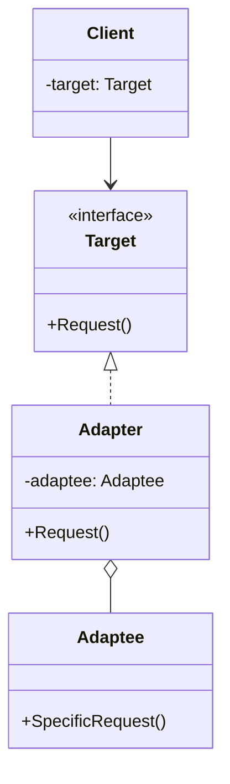
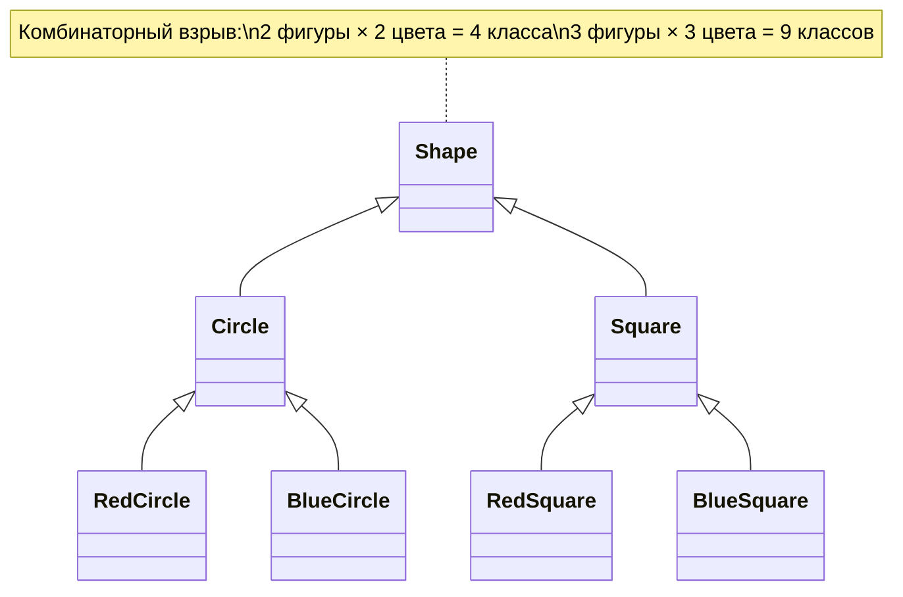
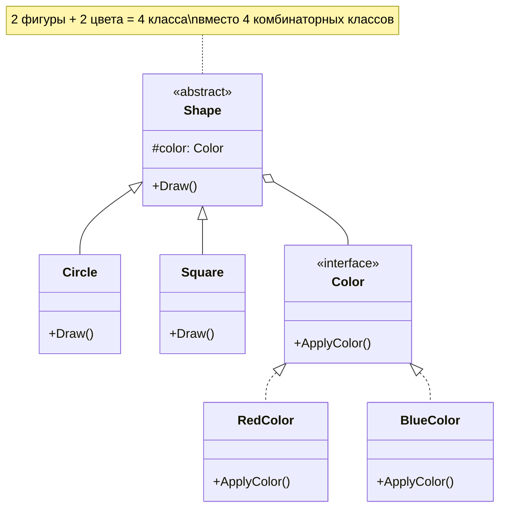
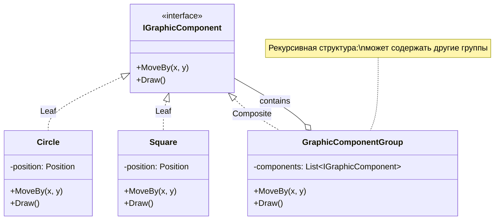
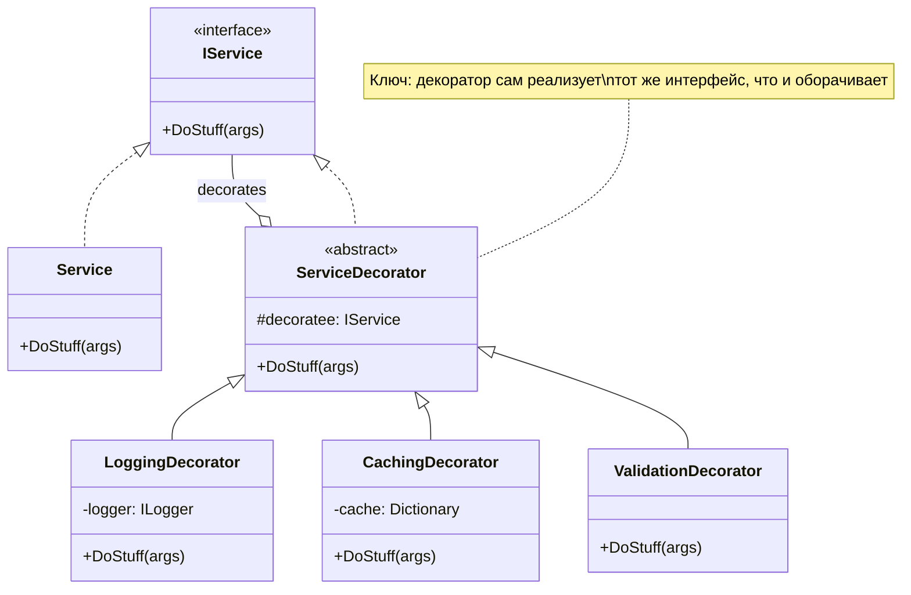
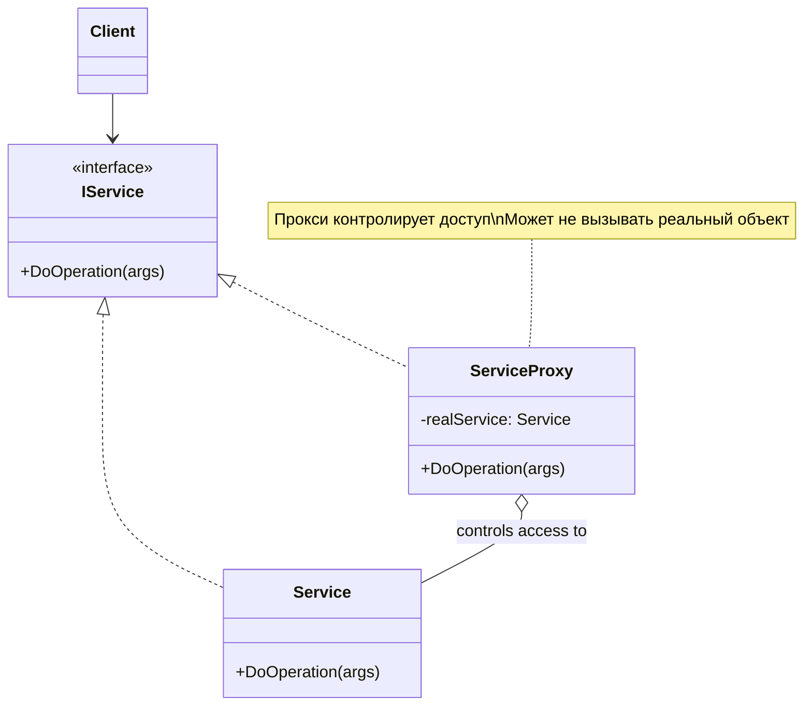
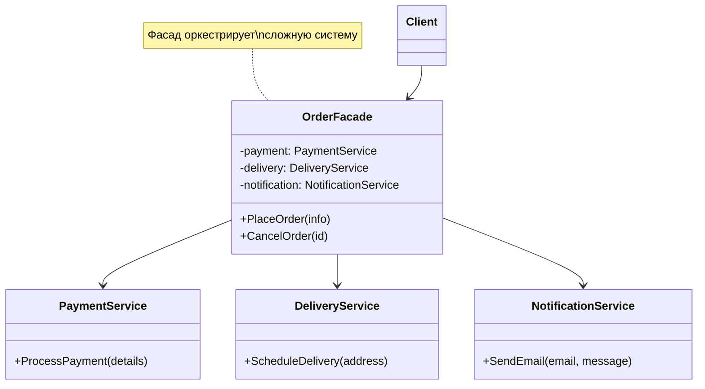
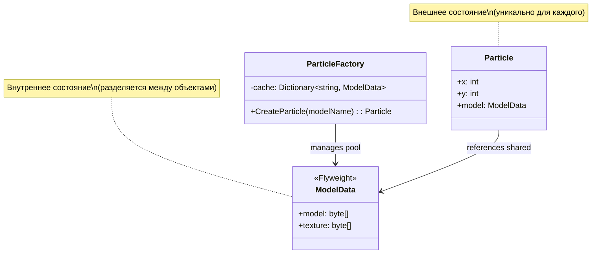

# Structural Patterns (Структурные паттерны)

## Введение

Structural Patterns (структурные паттерны) — это набор проектных решений, которые помогают организовывать классы и объекты в более крупные структуры, сохраняя при этом гибкость и эффективность архитектуры. Эти паттерны отвечают за построение удобных в поддержке иерархий классов и упрощают взаимодействие между компонентами системы.

В этой лекции мы рассмотрим семь ключевых структурных паттернов:

1. **Adapter (Адаптер)** — преобразование интерфейса одного класса в интерфейс, ожидаемый клиентом
2. **Bridge (Мост)** — разделение абстракции и реализации для их независимого изменения
3. **Composite (Компоновщик)** — древовидная структура для работы с объектами и группами объектов единообразно
4. **Decorator (Декоратор)** — динамическое добавление функциональности объектам
5. **Proxy (Прокси/Заместитель)** — контроль доступа к объекту через объект-заместитель
6. **Facade (Фасад)** — упрощённый интерфейс к сложной подсистеме
7. **Flyweight (Легковес/Приспособленец)** — эффективное разделение общих данных между множеством объектов

---

## 1. Adapter Pattern (Паттерн Адаптер)

### Определение

**Adapter (Адаптер)** — это структурный паттерн проектирования, который позволяет объектам с несовместимыми интерфейсами работать вместе. Адаптер выступает промежуточным слоем, преобразуя интерфейс одного класса в интерфейс, ожидаемый клиентом.

### Проблема

Представьте ситуацию: вы разрабатываете приложение для торговли на бирже. Приложение записывает логи операций в формате Markdown (`.md`). Через некоторое время вы находите отличную библиотеку для анализа логов, но она работает только с форматом JSON.

Вы не можете напрямую передать данные в Markdown-формате в библиотеку, ожидающую JSON. Переписывать библиотеку нельзя (она внешняя), переписывать всё приложение — долго и опасно. Здесь на помощь приходит Адаптер.

### Решение

Адаптер создаёт промежуточный объект, который:
- Принимает данные в одном формате (Markdown)
- Преобразует их в другой формат (JSON)
- Передаёт результат целевому объекту (библиотеке)

Это можно представить как переводчика на конференции: если один участник говорит только по-русски, а конференция проходит на английском, переводчик становится адаптером между ними.

### Терминология

- **Target (Целевой интерфейс)** — интерфейс, который ожидает клиент. Это тот контракт, к которому мы хотим адаптировать существующий класс.

- **Adaptee (Адаптируемый класс)** — существующий класс с несовместимым интерфейсом, который нужно адаптировать.

- **Adapter (Адаптер)** — класс-обёртка, который реализует целевой интерфейс и содержит экземпляр адаптируемого класса. Он перенаправляет вызовы от клиента к адаптируемому объекту, преобразуя данные по необходимости.

### Диаграмма классов



### Пример 1: Круглые колышки и квадратные отверстия

Рассмотрим классический учебный пример. Адаптер позволяет вставить квадратный колышек в круглое отверстие, преобразуя один интерфейс в другой.

#### Исходные классы с совместимыми интерфейсами

```csharp
// Круглое отверстие (Round Hole)
public class RoundHole
{
    private readonly double _radius;

    public RoundHole(double radius)
    {
        _radius = radius;
    }

    /// <summary>
    /// Получить радиус отверстия
    /// </summary>
    public double GetRadius()
    {
        return _radius;
    }

    /// <summary>
    /// Проверяет, подходит ли круглый колышек к отверстию
    /// </summary>
    /// <param name="peg">Круглый колышек для проверки</param>
    /// <returns>true, если колышек помещается в отверстие</returns>
    public bool Fits(RoundPeg peg)
    {
        // Колышек помещается, если его радиус не больше радиуса отверстия
        return this.GetRadius() >= peg.GetRadius();
    }
}

// Круглый колышек (Round Peg)
public class RoundPeg
{
    private readonly double _radius;

    public RoundPeg(double radius)
    {
        _radius = radius;
    }

    /// <summary>
    /// Получить радиус круглого колышка
    /// </summary>
    public double GetRadius()
    {
        return _radius;
    }
}
```

#### Несовместимый класс

```csharp
// Квадратный колышек (Square Peg) - несовместимый с круглым отверстием
public class SquarePeg
{
    private readonly double _width;

    public SquarePeg(double width)
    {
        _width = width;
    }

    /// <summary>
    /// Получить ширину стороны квадратного колышка
    /// </summary>
    public double GetWidth()
    {
        return _width;
    }
}
```

#### Адаптер

```csharp
/// <summary>
/// Адаптер позволяет использовать квадратные колышки с круглыми отверстиями.
/// Он наследуется от RoundPeg, чтобы быть совместимым с методом Fits() класса RoundHole.
/// </summary>
public class SquarePegAdapter : RoundPeg
{
    private readonly SquarePeg _peg;

    public SquarePegAdapter(SquarePeg peg) : base(0)
    {
        // Сохраняем ссылку на адаптируемый объект
        _peg = peg;
    }

    /// <summary>
    /// Вычисляет эквивалентный радиус для квадратного колышка.
    /// Используется теорема Пифагора: радиус окружности, описанной вокруг квадрата,
    /// равен половине диагонали квадрата.
    /// Формула: r = (width * √2) / 2
    /// </summary>
    public override double GetRadius()
    {
        // Диагональ квадрата по теореме Пифагора: d = width * √2
        // Радиус описанной окружности: r = d / 2
        return _peg.GetWidth() * Math.Sqrt(2) / 2;
    }
}
```

#### Клиентский код

```csharp
public class Program
{
    public static void Main()
    {
        Console.WriteLine("=== ДЕМОНСТРАЦИЯ ПАТТЕРНА ADAPTER ===\n");

        // Создаём круглое отверстие с радиусом 5
        RoundHole hole = new RoundHole(5);
        
        // Создаём круглый колышек с радиусом 5
        RoundPeg roundPeg = new RoundPeg(5);
        
        // Круглый колышек идеально подходит
        Console.WriteLine($"Круглый колышек (r=5) помещается в отверстие (r=5): {hole.Fits(roundPeg)}");
        // Вывод: True

        // Создаём квадратные колышки
        SquarePeg smallSquarePeg = new SquarePeg(5);
        SquarePeg largeSquarePeg = new SquarePeg(10);

        // hole.Fits(smallSquarePeg); // Ошибка компиляции! Несовместимые типы

        // Используем адаптеры для квадратных колышков
        RoundPeg smallSquareAdapter = new SquarePegAdapter(smallSquarePeg);
        RoundPeg largeSquareAdapter = new SquarePegAdapter(largeSquarePeg);

        // Проверяем, помещаются ли квадратные колышки через адаптеры
        Console.WriteLine($"Квадратный колышек (width=5) через адаптер: {hole.Fits(smallSquareAdapter)}");
        // Вывод: True (эквивалентный радиус ≈ 3.54, меньше 5)
        
        Console.WriteLine($"Квадратный колышек (width=10) через адаптер: {hole.Fits(largeSquareAdapter)}");
        // Вывод: False (эквивалентный радиус ≈ 7.07, больше 5)
    }
}

/*
Вывод программы:
=== ДЕМОНСТРАЦИЯ ПАТТЕРНА ADAPTER ===

Круглый колышек (r=5) помещается в отверстие (r=5): True
Квадратный колышек (width=5) через адаптер: True
Квадратный колышек (width=10) через адаптер: False
*/
```

### Ключевые особенности примера

1. **Адаптер не меняет существующий код**: Классы `RoundHole`, `RoundPeg` и `SquarePeg` остаются нетронутыми.

2. **Использование наследования**: Адаптер наследуется от `RoundPeg`, чтобы быть совместимым с методом `Fits()`.

3. **Преобразование данных**: Метод `GetRadius()` в адаптере преобразует ширину квадрата в эквивалентный радиус.

### Пример 2: Система логирования

Рассмотрим более практичный пример из реальной разработки.

#### Исходная ситуация

У вас есть приложение, которое использует PostgreSQL для хранения логов:

```csharp
/// <summary>
/// Существующий класс для работы с PostgreSQL (Adaptee)
/// Это legacy-код или внешняя библиотека, которую мы не можем изменить
/// </summary>
public class PostgresLogStorage
{
    /// <summary>
    /// Метод сохранения с конкретной сигнатурой PostgreSQL
    /// </summary>
    public void Save(string message, DateTime timestamp, int severity)
    {
        Console.WriteLine($"[PostgreSQL] Сохранение лога: {timestamp:yyyy-MM-dd HH:mm:ss} " +
                         $"[{severity}] {message}");
        // Здесь была бы реальная логика работы с БД
    }
}

/// <summary>
/// Новая библиотека для работы с Elasticsearch (Adaptee)
/// Имеет совершенно другой интерфейс
/// </summary>
public class ElasticSearchLogStorage
{
    /// <summary>
    /// Метод сохранения, который принимает специализированный объект
    /// </summary>
    public void Save(ElasticLogMessage message)
    {
        Console.WriteLine($"[Elasticsearch] Индексирование: {message.Timestamp:yyyy-MM-dd HH:mm:ss} " +
                         $"[{message.Level}] {message.Content}");
        // Здесь была бы реальная логика работы с Elasticsearch
    }
}

/// <summary>
/// Специализированный формат сообщений для Elasticsearch
/// </summary>
public class ElasticLogMessage
{
    public string Content { get; set; }
    public DateTime Timestamp { get; set; }
    public string Level { get; set; }
}
```

#### Целевой интерфейс

Вы хотите, чтобы всё приложение работало через единый интерфейс:

```csharp
/// <summary>
/// Target Interface — единый контракт для всех систем логирования
/// Это то, что ожидает клиентский код
/// </summary>
public interface ILogStorage
{
    /// <summary>
    /// Единый метод для сохранения лога
    /// </summary>
    void Save(LogMessage message);
}

/// <summary>
/// Стандартизированное сообщение лога в нашем приложении
/// </summary>
public class LogMessage
{
    public string Message { get; set; }
    public DateTime DateTime { get; set; }
    public Severity Severity { get; set; }
}

/// <summary>
/// Уровни серьёзности логов
/// </summary>
public enum Severity
{
    Info = 0,
    Warning = 1,
    Error = 2,
    Critical = 3
}
```

#### Адаптеры

```csharp
/// <summary>
/// Адаптер для PostgreSQL
/// Реализует ILogStorage и адаптирует PostgresLogStorage к нашему интерфейсу
/// </summary>
public class PostgresLogStorageAdapter : ILogStorage
{
    private readonly PostgresLogStorage _storage;
    
    public PostgresLogStorageAdapter(PostgresLogStorage storage)
    {
        // Композиция: храним ссылку на адаптируемый объект
        _storage = storage;
    }
    
    public void Save(LogMessage message)
    {
        // Преобразуем LogMessage в формат, понятный PostgreSQL
        _storage.Save(
            message.Message,
            message.DateTime,
            (int)message.Severity  // Преобразуем enum в int
        );
    }
}

/// <summary>
/// Адаптер для Elasticsearch
/// Реализует ILogStorage и адаптирует ElasticSearchLogStorage к нашему интерфейсу
/// </summary>
public class ElasticLogStorageAdapter : ILogStorage
{
    private readonly ElasticSearchLogStorage _storage;
    
    public ElasticLogStorageAdapter(ElasticSearchLogStorage storage)
    {
        _storage = storage;
    }
    
    public void Save(LogMessage message)
    {
        // Преобразуем LogMessage в ElasticLogMessage
        ElasticLogMessage elasticMessage = new ElasticLogMessage
        {
            Content = $"{message.DateTime:yyyy-MM-dd HH:mm:ss} [{message.Severity}] {message.Message}",
            Timestamp = message.DateTime,
            Level = message.Severity.ToString()
        };
        
        _storage.Save(elasticMessage);
    }
}
```

#### Клиентский код

```csharp
/// <summary>
/// Сервис логирования, который работает с ILogStorage
/// Он не знает о PostgreSQL или Elasticsearch — работает только с абстракцией
/// </summary>
public class LoggingService
{
    private readonly ILogStorage _storage;
    
    public LoggingService(ILogStorage storage)
    {
        _storage = storage;
    }
    
    public void LogError(string message)
    {
        LogMessage logMessage = new LogMessage
        {
            Message = message,
            DateTime = DateTime.Now,
            Severity = Severity.Error
        };
        
        // Вызываем единый интерфейс, не зная о конкретной реализации
        _storage.Save(logMessage);
    }
}

public class Program
{
    public static void Main()
    {
        Console.WriteLine("=== АДАПТЕР В СИСТЕМЕ ЛОГИРОВАНИЯ ===\n");

        // Создаём реальные объекты (adaptees)
        PostgresLogStorage postgresDb = new PostgresLogStorage();
        ElasticSearchLogStorage elasticDb = new ElasticSearchLogStorage();
        
        // Оборачиваем их в адаптеры
        ILogStorage postgresAdapter = new PostgresLogStorageAdapter(postgresDb);
        ILogStorage elasticAdapter = new ElasticLogStorageAdapter(elasticDb);
        
        // Создаём сервисы с разными хранилищами
        LoggingService postgresLogger = new LoggingService(postgresAdapter);
        LoggingService elasticLogger = new LoggingService(elasticAdapter);
        
        // Используем оба через единый интерфейс
        postgresLogger.LogError("Ошибка подключения к базе данных");
        elasticLogger.LogError("Таймаут API запроса");
        
        Console.WriteLine("\n✓ Оба хранилища работают через единый интерфейс!");
    }
}

/*
Вывод программы:
=== АДАПТЕР В СИСТЕМЕ ЛОГИРОВАНИЯ ===

[PostgreSQL] Сохранение лога: 2025-11-12 09:30:45 [2] Ошибка подключения к базе данных
[Elasticsearch] Индексирование: 2025-11-12 09:30:45 [Error] Таймаут API запроса

✓ Оба хранилища работают через единый интерфейс!
*/
```

### Адаптивный рефакторинг (Adaptive Refactoring)

Одно из ключевых применений Адаптера — это **адаптивный рефакторинг**, который позволяет проводить рефакторинг постепенно, в два этапа:

1. **Изменение абстракции** — создание нового интерфейса
2. **Изменение реализации** — постепенная миграция к новой реализации

#### Проблема

Представьте: вся ваша система использует синхронный API для логирования. Теперь вы хотите перейти на асинхронный API, но переписывать всё сразу — опасно и долго.

#### Решение через адаптер

**Шаг 1: Создаём новый интерфейс**

```csharp
/// <summary>
/// Новый асинхронный интерфейс
/// </summary>
public interface IAsyncLogStorage
{
    Task SaveAsync(LogMessage message);
}
```

**Шаг 2: Создаём адаптер**

```csharp
/// <summary>
/// Адаптер, который оборачивает синхронный ILogStorage
/// и предоставляет асинхронный интерфейс
/// </summary>
public class AsyncLogStorageAdapter : IAsyncLogStorage
{
    private readonly ILogStorage _storage;
    
    public AsyncLogStorageAdapter(ILogStorage storage)
    {
        _storage = storage;
    }
    
    public Task SaveAsync(LogMessage message)
    {
        // Вызываем синхронный метод и оборачиваем в Task
        _storage.Save(message);
        return Task.CompletedTask;
    }
}
```

**Шаг 3: Постепенная миграция**

```csharp
public class OrderService
{
    private readonly IAsyncLogStorage _storage;
    
    public OrderService(IAsyncLogStorage storage)
    {
        _storage = storage;
    }
    
    public async Task ProcessOrderAsync(Order order)
    {
        // Новый асинхронный код
        await _storage.SaveAsync(new LogMessage { Message = "Order processed" });
    }
}

public class Program
{
    public static async Task Main()
    {
        // Старая синхронная реализация
        ILogStorage syncStorage = new PostgresLogStorageAdapter(new PostgresLogStorage());
        
        // Оборачиваем в асинхронный адаптер
        IAsyncLogStorage asyncStorage = new AsyncLogStorageAdapter(syncStorage);
        
        // Новый код работает асинхронно, используя старую реализацию!
        OrderService orderService = new OrderService(asyncStorage);
        await orderService.ProcessOrderAsync(new Order());
        
        Console.WriteLine("✓ Постепенная миграция на async завершена!");
    }
}
```

### Комбинирование адаптеров

Адаптеры можно комбинировать, создавая цепочки преобразований:

```csharp
// Исходный объект
ILogStorage syncPostgres = new PostgresLogStorageAdapter(new PostgresLogStorage());

// Оборачиваем в асинхронный адаптер
IAsyncLogStorage asyncPostgres = new AsyncLogStorageAdapter(syncPostgres);

// Можно добавить ещё один уровень адаптации
// Например, адаптер для кэширования или логирования вызовов
```

### Применимость паттерна Adapter

Используйте Adapter когда:

1. **Нужно использовать сторонний класс с несовместимым интерфейсом**
   - Библиотека предоставляет API, не совместимый с вашим кодом
   - Вы не можете изменить библиотеку

2. **Требуется переиспользовать существующие подклассы**
   - У вас есть несколько подклассов с общей функциональностью
   - Расширить родительский класс невозможно
   - Адаптер позволяет добавить функциональность без дублирования кода

3. **Проводите адаптивный рефакторинг**
   - Постепенная миграция на новый API
   - Локализация изменений в одном месте

### Преимущества

- **Single Responsibility Principle**: Адаптер отделяет логику преобразования от бизнес-логики
- **Open/Closed Principle**: Можно добавлять новые адаптеры без изменения существующего кода
- **Локализация изменений**: Все преобразования сосредоточены в одном месте

### Недостатки

- Увеличивается количество классов в системе
- Может усложнить понимание кода из-за дополнительного уровня абстракции

---

## 2. Bridge Pattern (Паттерн Мост)

### Определение

**Bridge (Мост)** — это структурный паттерн проектирования, который разделяет один или несколько классов на две отдельные иерархии — **абстракцию** и **реализацию**, позволяя изменять их независимо друг от друга.

Мост реализует принцип композиции над наследованием (Composition over Inheritance), предотвращая комбинаторный взрыв классов при многомерном расширении функциональности.

### Проблема

Представьте, что у вас есть класс геометрических фигур `Shape` с подклассами `Circle` и `Square`. Теперь вы хотите расширить иерархию по цвету, чтобы иметь `Red` и `Blue` фигуры.

При использовании наследования вам придётся создать:
- `RedCircle`
- `BlueCircle`
- `RedSquare`
- `BlueSquare`

Это 4 класса. Добавление треугольника потребует ещё 2 класса (`RedTriangle`, `BlueTriangle`). Добавление зелёного цвета потребует 3 новых класса. Количество комбинаций растёт в геометрической прогрессии: **n × m классов**.



### Решение

Паттерн Мост предлагает **разделить две независимые оси изменчивости**:

1. **Абстракция высокого уровня** — что делает объект (фигура)
2. **Абстракция низкого уровня** — как это реализуется (цвет)

Вместо наследования используем **композицию**: фигура содержит ссылку на объект цвета.



Теперь у нас **n + m классов** вместо **n × m**!

### Пример 1: Система управления устройствами

Представим систему управления домашними устройствами (телевизоры, проекторы, медиа-плееры). Нам нужны разные типы управления (пульт, голосовое управление, мобильное приложение).

#### Низкоуровневая абстракция (Implementation)

```csharp
/// <summary>
/// Implementation — низкоуровневая абстракция (устройства)
/// Определяет базовые свойства любого управляемого устройства
/// </summary>
public interface IDevice
{
    bool IsEnabled { get; set; }
    int Channel { get; set; }
    int Volume { get; set; }
}
```

#### Конкретные реализации устройств

```csharp
/// <summary>
/// Телевизор — конкретная реализация устройства
/// </summary>
public class Tv : IDevice
{
    public bool IsEnabled { get; set; } = false;
    public int Channel { get; set; } = 1;
    public int Volume { get; set; } = 50;
    
    public override string ToString() => 
        $"TV: {(IsEnabled ? "ON" : "OFF")}, Ch={Channel}, Vol={Volume}";
}

/// <summary>
/// Проектор — конкретная реализация устройства
/// </summary>
public class Projector : IDevice
{
    public bool IsEnabled { get; set; } = false;
    public int Channel { get; set; } = 1;
    public int Volume { get; set; } = 30;
    
    public override string ToString() => 
        $"Projector: {(IsEnabled ? "ON" : "OFF")}, Ch={Channel}, Vol={Volume}";
}

/// <summary>
/// Медиа-плеер — конкретная реализация устройства
/// </summary>
public class MediaPlayer : IDevice
{
    public bool IsEnabled { get; set; } = false;
    public int Channel { get; set; } = 1;
    public int Volume { get; set; } = 40;
    
    public override string ToString() => 
        $"MediaPlayer: {(IsEnabled ? "ON" : "OFF")}, Ch={Channel}, Vol={Volume}";
}
```

#### Высокоуровневая абстракция (Abstraction)

```csharp
/// <summary>
/// Abstraction — высокоуровневая абстракция (управление)
/// Определяет операции, которые может выполнить пользователь
/// </summary>
public interface IControl
{
    void ToggleEnabled();
    void ChannelForward();
    void ChannelBackward();
    void VolumeUp();
    void VolumeDown();
}
```

#### Базовая реализация управления (Bridge)

```csharp
/// <summary>
/// Control — базовый мост между абстракцией управления и реализацией устройства
/// Это и есть "Мост" — он соединяет две иерархии через композицию
/// </summary>
public class Control : IControl
{
    // ЭТО КЛЮЧЕВОЙ МОМЕНТ: композиция вместо наследования
    // Мост соединяет высокоуровневую абстракцию (Control) 
    // с низкоуровневой абстракцией (IDevice)
    protected readonly IDevice _device;

    public Control(IDevice device)
    {
        _device = device;
    }

    /// <summary>
    /// Переключает состояние устройства (вкл/выкл)
    /// </summary>
    public virtual void ToggleEnabled()
    {
        _device.IsEnabled = !_device.IsEnabled;
    }

    /// <summary>
    /// Переключает канал вперёд
    /// </summary>
    public virtual void ChannelForward()
    {
        _device.Channel += 1;
    }

    /// <summary>
    /// Переключает канал назад
    /// </summary>
    public virtual void ChannelBackward()
    {
        _device.Channel -= 1;
    }

    /// <summary>
    /// Увеличивает громкость на 10 единиц
    /// </summary>
    public virtual void VolumeUp()
    {
        _device.Volume += 10;
    }

    /// <summary>
    /// Уменьшает громкость на 10 единиц
    /// </summary>
    public virtual void VolumeDown()
    {
        _device.Volume -= 10;
    }
    
    public override string ToString() => _device.ToString();
}
```

#### Расширенные варианты управления

```csharp
/// <summary>
/// Управление с логированием — расширение высокоуровневой абстракции
/// Демонстрирует возможность независимого расширения абстракции
/// </summary>
public class LoggingControl : Control
{
    public LoggingControl(IDevice device) : base(device) { }

    public override void ToggleEnabled()
    {
        bool oldState = _device.IsEnabled;
        base.ToggleEnabled();
        Console.WriteLine($"[LOG] Toggle: {oldState} -> {_device.IsEnabled} on {_device.GetType().Name}");
    }

    public override void VolumeUp()
    {
        int oldVolume = _device.Volume;
        base.VolumeUp();
        Console.WriteLine($"[LOG] Volume: {oldVolume} -> {_device.Volume} on {_device.GetType().Name}");
    }

    public override void ChannelBackward()
    {
        int oldChannel = _device.Channel;
        base.ChannelBackward();
        Console.WriteLine($"[LOG] Channel: {oldChannel} -> {_device.Channel} on {_device.GetType().Name}");
    }
}

/// <summary>
/// Управление с задержкой — ещё одно расширение абстракции
/// Полезно для устройств с медленным откликом
/// </summary>
public class DelayedControl : Control
{
    private readonly int _delayMs;

    public DelayedControl(IDevice device, int delayMs) : base(device)
    {
        _delayMs = delayMs;
    }

    public override void ToggleEnabled()
    {
        Thread.Sleep(_delayMs);  // Имитация задержки
        base.ToggleEnabled();
    }

    public override void VolumeUp()
    {
        Thread.Sleep(_delayMs);
        base.VolumeUp();
    }
}

/// <summary>
/// "Глючное" управление для демонстрации — иногда выполняет случайные действия
/// Показывает гибкость паттерна: можно создавать любые варианты управления
/// </summary>
public class FaultyControl : Control
{
    private readonly Random _random = new Random();

    public FaultyControl(IDevice device) : base(device) { }

    public override void ToggleEnabled()
    {
        TryFault();
        base.ToggleEnabled();
    }

    public override void ChannelForward()
    {
        TryFault();
        base.ChannelForward();
    }

    public override void VolumeUp()
    {
        TryFault();
        base.VolumeUp();
    }

    /// <summary>
    /// С вероятностью 50% случайно переключает устройство
    /// </summary>
    private void TryFault()
    {
        if (_random.NextDouble() < 0.5)
        {
            Console.WriteLine($"[FAULT] Случайное переключение!");
            _device.IsEnabled = !_device.IsEnabled;
        }
    }
}
```

#### Демонстрация работы

```csharp
public class Program
{
    public static void Main()
    {
        Console.WriteLine("=== ПАТТЕРН МОСТ: СИСТЕМА УПРАВЛЕНИЯ УСТРОЙСТВАМИ ===\n");

        // Создаём устройства (низкоуровневая абстракция)
        IDevice tv = new Tv();
        IDevice projector = new Projector();
        IDevice mediaPlayer = new MediaPlayer();

        Console.WriteLine("ИСХОДНОЕ СОСТОЯНИЕ:");
        Console.WriteLine($"  {tv}");
        Console.WriteLine($"  {projector}");
        Console.WriteLine($"  {mediaPlayer}\n");

        // СЦЕНАРИЙ 1: Обычное управление телевизором
        Console.WriteLine("--- СЦЕНАРИЙ 1: Обычное управление ТВ ---");
        IControl tvControl = new Control(tv);
        
        tvControl.ToggleEnabled();
        Console.WriteLine($"После включения: {tvControl}");
        
        tvControl.VolumeUp();
        tvControl.VolumeUp();
        Console.WriteLine($"После увеличения звука: {tvControl}");
        
        tvControl.ChannelForward();
        tvControl.ChannelForward();
        Console.WriteLine($"После переключения каналов: {tvControl}\n");

        // СЦЕНАРИЙ 2: Управление проектором с логированием
        Console.WriteLine("--- СЦЕНАРИЙ 2: Управление проектором с логированием ---");
        IControl projectorControl = new LoggingControl(projector);
        
        projectorControl.ToggleEnabled();
        projectorControl.VolumeUp();
        projectorControl.ChannelBackward();
        Console.WriteLine($"Итоговое состояние: {projectorControl}\n");

        // СЦЕНАРИЙ 3: Ключевое преимущество — независимое комбинирование
        Console.WriteLine("--- СЦЕНАРИЙ 3: Один тип управления для разных устройств ---");
        
        var devices = new IDevice[] { tv, projector, mediaPlayer };
        var controls = new IControl[] 
        { 
            new Control(tv), 
            new Control(projector), 
            new Control(mediaPlayer) 
        };

        foreach (var control in controls)
        {
            control.ToggleEnabled();
            control.VolumeUp();
        }

        foreach (var device in devices)
        {
            Console.WriteLine($"  {device}");
        }
        
        Console.WriteLine("\n✓ Все устройства управляются одинаково через единый интерфейс!");
        Console.WriteLine("✓ Можно легко добавить новое устройство БЕЗ изменения кода управления!");
        Console.WriteLine("✓ Можно легко добавить новый тип управления БЕЗ изменения устройств!");
    }
}

/*
Вывод программы:
=== ПАТТЕРН МОСТ: СИСТЕМА УПРАВЛЕНИЯ УСТРОЙСТВАМИ ===

ИСХОДНОЕ СОСТОЯНИЕ:
  TV: OFF, Ch=1, Vol=50
  Projector: OFF, Ch=1, Vol=30
  MediaPlayer: OFF, Ch=1, Vol=40

--- СЦЕНАРИЙ 1: Обычное управление ТВ ---
После включения: TV: ON, Ch=1, Vol=50
После увеличения звука: TV: ON, Ch=1, Vol=70
После переключения каналов: TV: ON, Ch=3, Vol=70

--- СЦЕНАРИЙ 2: Управление проектором с логированием ---
[LOG] Toggle: False -> True on Projector
[LOG] Volume: 30 -> 40 on Projector
[LOG] Channel: 1 -> 0 on Projector
Итоговое состояние: Projector: ON, Ch=0, Vol=40

--- СЦЕНАРИЙ 3: Один тип управления для разных устройств ---
  TV: ON, Ch=3, Vol=80
  Projector: ON, Ch=0, Vol=50
  MediaPlayer: ON, Ch=1, Vol=50

✓ Все устройства управляются одинаково через единый интерфейс!
✓ Можно легко добавить новое устройство БЕЗ изменения кода управления!
✓ Можно легко добавить новый тип управления БЕЗ изменения устройств!
*/
```

### Ключевые преимущества паттерна Мост

1. **Open/Closed Principle**: Можно добавлять новые устройства и типы управления независимо
2. **Protected Variations**: Изменения в устройствах не влияют на управление и наоборот
3. **Избежание комбинаторного взрыва**: n + m классов вместо n × m
4. **Независимое тестирование**: Устройства и управление тестируются раздельно

### Связь с другими паттернами

**Мост vs Адаптер:**
- **Мост** проектируется заблаговременно для независимого развития абстракций
- **Адаптер** добавляется постфактум для совместимости существующих классов

**Мост + Builder:**
```csharp
// Builder (директор) может работать с разными устройствами через Мост
public class SmartHomeDirector
{
    private readonly IDevice _device;

    public SmartHomeDirector(IDevice device)
    {
        _device = device;  // Мост к устройству
    }

    public void SetupCinemaMode()
    {
        _device.IsEnabled = true;
        _device.Volume = 30;
        _device.Channel = 10;
        Console.WriteLine($"Режим кинотеатра настроен для: {_device}");
    }
}
```

### Применимость

Используйте Мост когда:

1. **Существует несколько независимых измерений изменчивости**
   - Функциональность/Платформа
   - Абстракция/Реализация
   - Интерфейс/Бэкенд

2. **Нужно избежать "классового взрыва"**
   - Комбинации характеристик растут экспоненциально
   - Хотите использовать композицию вместо наследования

3. **Хотите изменять абстракцию и реализацию независимо**
   - Изменения в одной иерархии не влияют на другую
   - Можно разрабатывать части системы параллельно


---

## 3. Composite Pattern (Паттерн Компоновщик)

### Определение

**Composite (Компоновщик)**, также известный как **Object Tree (Дерево объектов)** — это структурный паттерн проектирования, который позволяет сгруппировать объекты в древовидную структуру и работать с ними так же, как с единичными объектами.

Паттерн позволяет клиентам единообразно трактовать отдельные объекты и их композиции (группы).

### Терминология

- **Component (Компонент)** — общий интерфейс для всех объектов в композиции (как листьев, так и контейнеров)

- **Leaf (Лист/Терминальный узел)** — простой объект, не содержащий других объектов. Выполняет фактическую работу.

- **Composite (Агрегатный узел)** — контейнер, который может содержать другие компоненты (как листья, так и другие контейнеры). Делегирует работу вложенным компонентам.

### Проблема

Представьте, что вы разрабатываете графический редактор вроде Figma или Adobe Illustrator. Пользователь может:

- Рисовать отдельные фигуры (круги, квадраты, линии)
- Группировать фигуры вместе
- Группировать уже сгруппированные фигуры (вложенные группы)
- Применять операции ко всей группе сразу (например, сдвинуть всё на 10 пикселей вправо)

**Проблема**: Метод `MoveBy()` работает для одной фигуры, но как применить его к группе из 10 объектов? Нужен цикл. А если внутри группы есть ещё группы? Нужна рекурсия.

Клиентский код становится сложным — циклы, условия, проверка типов, рекурсия. Это нарушает **Open/Closed Principle**: при добавлении новых типов клиентский код ломается.

### Решение

Паттерн Компоновщик предлагает: **"Группа объектов и отдельный объект должны подчиняться одному интерфейсу"**.

Тогда операции можно применять единообразно, независимо от того, работаем ли мы с одной фигурой или со 100 фигурами в 10 вложенных группах.



### Реализация

#### Шаг 1: Вспомогательные типы

```csharp
/// <summary>
/// Позиция объекта на плоскости
/// Используем record struct для immutable value type
/// </summary>
public readonly record struct Position(int X, int Y);
```

#### Шаг 2: Общий интерфейс (Component)

```csharp
/// <summary>
/// Component — общий интерфейс для всех графических объектов
/// Определяет операции, которые можно применять как к отдельным фигурам,
/// так и к группам фигур
/// </summary>
public interface IGraphicComponent
{
    /// <summary>
    /// Сдвинуть объект на указанное расстояние
    /// </summary>
    void MoveBy(int x, int y);
    
    /// <summary>
    /// Отрисовать объект
    /// </summary>
    void Draw();
}
```

#### Шаг 3: Листья дерева (Leaf)

```csharp
/// <summary>
/// Circle — лист дерева (Leaf), простой объект без вложенных компонентов
/// Содержит фактическую реализацию операций
/// </summary>
public class Circle : IGraphicComponent
{
    private Position _position;
    
    public Circle()
    {
        _position = new Position(0, 0);
    }

    /// <summary>
    /// Сдвиг круга — изменяем собственную позицию
    /// </summary>
    public void MoveBy(int x, int y)
    {
        _position = new Position(_position.X + x, _position.Y + y);
    }
    
    /// <summary>
    /// Отрисовка круга — выводим свою позицию
    /// </summary>
    public void Draw()
    {
        Console.WriteLine($"  Circle at ({_position.X}, {_position.Y})");
    }
}

/// <summary>
/// Square — ещё один лист дерева
/// </summary>
public class Square : IGraphicComponent
{
    private Position _position;
    
    public Square()
    {
        _position = new Position(0, 0);
    }

    public void MoveBy(int x, int y)
    {
        _position = new Position(_position.X + x, _position.Y + y);
    }
    
    public void Draw()
    {
        Console.WriteLine($"  Square at ({_position.X}, {_position.Y})");
    }
}
```

#### Шаг 4: Группа (Composite)

```csharp
/// <summary>
/// GraphicComponentGroup — композитный узел (Composite)
/// Может содержать другие компоненты (как листья, так и другие группы)
/// Ключевая особенность: сама реализует IGraphicComponent,
/// поэтому может быть вложена в другую группу
/// </summary>
public class GraphicComponentGroup : IGraphicComponent
{
    // Коллекция компонентов — это могут быть Circle, Square или другие GraphicComponentGroup!
    private readonly List<IGraphicComponent> _components;
    
    public GraphicComponentGroup(IEnumerable<IGraphicComponent> components)
    {
        _components = new List<IGraphicComponent>(components);
    }
    
    /// <summary>
    /// Добавить компонент в группу
    /// </summary>
    public void Add(IGraphicComponent component)
    {
        _components.Add(component);
    }
    
    /// <summary>
    /// Удалить компонент из группы
    /// </summary>
    public void Remove(IGraphicComponent component)
    {
        _components.Remove(component);
    }
    
    /// <summary>
    /// Сдвиг группы — делегируем операцию всем вложенным компонентам
    /// Если компонент — это другая группа, она рекурсивно передаст операцию своим детям
    /// </summary>
    public void MoveBy(int x, int y)
    {
        foreach (var component in _components)
        {
            // Полиморфизм: каждый компонент сам знает, как себя сдвинуть
            component.MoveBy(x, y);
        }
    }
    
    /// <summary>
    /// Отрисовка группы — делегируем отрисовку всем вложенным компонентам
    /// </summary>
    public void Draw()
    {
        Console.WriteLine("[Group Start]");
        foreach (var component in _components)
        {
            // Полиморфизм: каждый компонент сам знает, как себя нарисовать
            component.Draw();
        }
        Console.WriteLine("[Group End]");
    }
}
```

### Демонстрация работы

```csharp
public class Program
{
    public static void Main()
    {
        Console.WriteLine("=== ПАТТЕРН КОМПОНОВЩИК: ГРАФИЧЕСКИЙ РЕДАКТОР ===\n");

        // Сценарий 1: Простые фигуры
        Console.WriteLine("--- Сценарий 1: Работа с отдельными фигурами ---");
        IGraphicComponent circle = new Circle();
        IGraphicComponent square = new Square();
        
        circle.MoveBy(1, 2);
        square.MoveBy(10, 0);
        
        Console.WriteLine("Отрисовка отдельных фигур:");
        circle.Draw();
        square.Draw();

        // Сценарий 2: Группа фигур
        Console.WriteLine("\n--- Сценарий 2: Группа из двух фигур ---");
        var group = new GraphicComponentGroup(new[] { circle, square });
        
        Console.WriteLine("Отрисовка группы:");
        group.Draw();
        
        Console.WriteLine("\nСдвигаем всю группу на (5, 5):");
        group.MoveBy(5, 5);
        group.Draw();

        // Сценарий 3: Вложенные группы
        Console.WriteLine("\n--- Сценарий 3: Вложенные группы ---");
        
        // Первая подгруппа
        var circle1 = new Circle();
        circle1.MoveBy(0, 0);
        var square1 = new Square();
        square1.MoveBy(5, 5);
        var subGroup1 = new GraphicComponentGroup(new IGraphicComponent[] { circle1, square1 });
        
        // Вторая подгруппа
        var circle2 = new Circle();
        circle2.MoveBy(20, 20);
        var subGroup2 = new GraphicComponentGroup(new IGraphicComponent[] { circle2 });
        
        // Супергруппа — группа групп!
        var superGroup = new GraphicComponentGroup(new IGraphicComponent[] { subGroup1, subGroup2 });
        
        Console.WriteLine("Отрисовка супергруппы:");
        superGroup.Draw();
        
        Console.WriteLine("\nСдвигаем супергруппу на (10, 10):");
        superGroup.MoveBy(10, 10);
        superGroup.Draw();
        
        Console.WriteLine("\n✓ Ключевое преимущество: клиент работает с группами и объектами одинаково!");
        Console.WriteLine("✓ Рекурсия обрабатывается автоматически через полиморфизм!");
    }
}

/*
Вывод программы:
=== ПАТТЕРН КОМПОНОВЩИК: ГРАФИЧЕСКИЙ РЕДАКТОР ===

--- Сценарий 1: Работа с отдельными фигурами ---
Отрисовка отдельных фигур:
  Circle at (1, 2)
  Square at (10, 0)

--- Сценарий 2: Группа из двух фигур ---
Отрисовка группы:
[Group Start]
  Circle at (1, 2)
  Square at (10, 0)
[Group End]

Сдвигаем всю группу на (5, 5):
[Group Start]
  Circle at (6, 7)
  Square at (15, 5)
[Group End]

--- Сценарий 3: Вложенные группы ---
Отрисовка супергруппы:
[Group Start]
[Group Start]
  Circle at (0, 0)
  Square at (5, 5)
[Group End]
[Group Start]
  Circle at (20, 20)
[Group End]
[Group End]

Сдвигаем супергруппу на (10, 10):
[Group Start]
[Group Start]
  Circle at (10, 10)
  Square at (15, 15)
[Group End]
[Group Start]
  Circle at (30, 30)
[Group End]
[Group End]

✓ Ключевое преимущество: клиент работает с группами и объектами одинаково!
✓ Рекурсия обрабатывается автоматически через полиморфизм!
*/
```

### Примеры применения в реальных системах

1. **Графические редакторы и UI-фреймворки**
   - `Panel` содержит `Button`, который содержит `Label`
   - Операции стиля, позиционирования применяются ко всему дереву

2. **Файловые системы**
   - Директория содержит файлы и другие директории
   - Операция "удалить всё" или "подсчитать размер" работает рекурсивно

3. **DOM в браузере**
   - HTML элемент может содержать другие элементы
   - `querySelector()`, применение стилей работают по дереву

4. **Организационные структуры**
   - Отдел содержит подразделения и сотрудников
   - Операции (например, рассылка уведомлений) распространяются по иерархии

5. **Системы меню**
   - Меню содержит пункты и подменю
   - Отключение меню отключает всё внутри

### Применимость

Используйте Composite когда:

1. **Нужно представить древовидную структуру объектов**
   - Иерархия "часть-целое"
   - Вложенные структуры произвольной глубины

2. **Клиенты должны единообразно работать с простыми и составными объектами**
   - Не хотите проверять типы объектов
   - Хотите избежать `if (obj is Group) ... else ...`

3. **Нужна рекурсивная обработка структуры**
   - Операции должны применяться ко всему дереву
   - Глубина вложенности заранее неизвестна

### Преимущества

- **Упрощает клиентский код**: не нужно различать листья и контейнеры
- **Облегчает добавление новых типов**: легко добавить новый вид компонента
- **Open/Closed Principle**: можно добавлять новые компоненты без изменения существующего кода

### Недостатки

- Может усложнить дизайн если иерархия не нужна
- Сложно ограничить типы компонентов в контейнере (все реализуют один интерфейс)

---

## 4. Decorator Pattern (Паттерн Декоратор)

### Определение

**Decorator (Декоратор)** — это структурный паттерн проектирования, который позволяет динамически добавлять объектам новую функциональность, оборачивая их в полезные обёртки.

Декоратор предоставляет гибкую альтернативу наследованию для расширения функциональности.

### Терминология

- **Component (Компонент)** — общий интерфейс для оборачиваемых объектов и декораторов

- **Concrete Component (Конкретный компонент)** — класс, объекты которого оборачиваются декораторами

- **Decorator (Декоратор)** — базовый класс всех декораторов, содержит ссылку на обёрнутый объект

- **Decoratee (Оборачиваемый объект)** — объект, который декорируется (добавляется функциональность)

- **Concrete Decorators (Конкретные декораторы)** — классы, добавляющие конкретную функциональность

### Проблема

Представьте сервис, который обрабатывает запросы:

```csharp
public interface IService
{
    void DoStuff(DoStuffArgs args);
}

public class Service : IService
{
    public void DoStuff(DoStuffArgs args)
    {
        Console.WriteLine("Service: выполняю основную работу");
    }
}
```

Со временем появляются требования:
- "Нужно логировать все вызовы"
- "Добавьте кэширование"
- "Требуется проверка прав доступа"
- "Добавьте метрики производительности"

**Проблема 1: Нарушение SRP**
Если добавить всё это в `Service`, он станет огромным с множеством ответственностей.

**Проблема 2: Комбинаторный взрыв**
Если использовать наследование:
- `ServiceWithLogging`
- `ServiceWithLoggingAndCaching`
- `ServiceWithLoggingAndCachingAndValidation`

5 функций = 2^5 = 32 возможных комбинации!

### Решение

Декоратор предлагает оборачивать объект в специальные обёртки, каждая из которых добавляет одну функцию.

Декоратор работает как **русская матрёшка**:
- В центре — оригинальный объект (`Service`)
- Вокруг него — декоратор логирования
- Вокруг логирования — декоратор кэширования
- И так далее...

Для клиента это выглядит как просто `IService`, но на самом деле это цепочка обёрток.



### Реализация

#### Вспомогательные типы

```csharp
/// <summary>
/// Аргументы для метода DoStuff
/// </summary>
public class DoStuffArgs
{
    public int Value { get; set; }
    public override string ToString() => $"Value={Value}";
}
```

#### Базовый интерфейс (Component)

```csharp
/// <summary>
/// Component — общий интерфейс для сервисов и декораторов
/// </summary>
public interface IService
{
    string DoStuff(DoStuffArgs args);
}
```

#### Конкретный компонент

```csharp
/// <summary>
/// Service — базовая реализация (ядро матрёшки)
/// Содержит основную бизнес-логику
/// </summary>
public class Service : IService
{
    public string DoStuff(DoStuffArgs args)
    {
        Console.WriteLine($"[SERVICE] Выполняю работу с {args}");
        return $"Result for {args.Value}";
    }
}
```

#### Декораторы

```csharp
/// <summary>
/// LoggingServiceDecorator — добавляет логирование
/// Ключевая особенность: реализует IService и содержит IService
/// </summary>
public class LoggingServiceDecorator : IService
{
    private readonly IService _decoratee;

    public LoggingServiceDecorator(IService decoratee)
    {
        // Сохраняем ссылку на оборачиваемый объект
        _decoratee = decoratee;
    }

    public string DoStuff(DoStuffArgs args)
    {
        // ДОБАВЛЯЕМ функциональность ДО вызова
        Console.WriteLine($"[LOG] >>> Входящий вызов: {args}");
        
        // ОБЯЗАТЕЛЬНО вызываем оборачиваемый объект
        string result = _decoratee.DoStuff(args);
        
        // ДОБАВЛЯЕМ функциональность ПОСЛЕ вызова
        Console.WriteLine($"[LOG] <<< Исходящий результат: {result}");
        
        return result;
    }
}

/// <summary>
/// CachingServiceDecorator — добавляет кэширование результатов
/// </summary>
public class CachingServiceDecorator : IService
{
    private readonly IService _decoratee;
    private readonly Dictionary<int, string> _cache = new();

    public CachingServiceDecorator(IService decoratee)
    {
        _decoratee = decoratee;
    }

    public string DoStuff(DoStuffArgs args)
    {
        // Проверяем кэш
        if (_cache.TryGetValue(args.Value, out string? cached))
        {
            Console.WriteLine($"[CACHE] HIT для Value={args.Value}");
            return cached;
        }

        // Кэша нет — вызываем оборачиваемый объект
        Console.WriteLine($"[CACHE] MISS для Value={args.Value}");
        string result = _decoratee.DoStuff(args);
        
        // Сохраняем в кэш
        _cache[args.Value] = result;
        return result;
    }
}

/// <summary>
/// ValidationServiceDecorator — добавляет валидацию аргументов
/// </summary>
public class ValidationServiceDecorator : IService
{
    private readonly IService _decoratee;

    public ValidationServiceDecorator(IService decoratee)
    {
        _decoratee = decoratee;
    }

    public string DoStuff(DoStuffArgs args)
    {
        // Валидация перед вызовом
        if (args.Value <= 0)
        {
            throw new ArgumentException("Value должно быть > 0");
        }

        Console.WriteLine($"[VALIDATE] Проверка пройдена для {args}");
        return _decoratee.DoStuff(args);
    }
}
```

### Демонстрация работы

```csharp
public class Program
{
    public static void Main()
    {
        Console.WriteLine("=== ПАТТЕРН ДЕКОРАТОР: РАСШИРЯЕМЫЙ СЕРВИС ===\n");

        // Сценарий 1: Просто сервис без декораторов
        Console.WriteLine("--- Сценарий 1: Базовый сервис ---");
        IService plain = new Service();
        plain.DoStuff(new DoStuffArgs { Value = 42 });

        // Сценарий 2: Сервис с логированием
        Console.WriteLine("\n--- Сценарий 2: Логирование ---");
        IService logged = new LoggingServiceDecorator(new Service());
        logged.DoStuff(new DoStuffArgs { Value = 42 });

        // Сценарий 3: Сервис с логированием и валидацией
        Console.WriteLine("\n--- Сценарий 3: Логирование + Валидация ---");
        IService service = new Service();
        IService validated = new ValidationServiceDecorator(service);
        IService loggedAndValidated = new LoggingServiceDecorator(validated);
        
        loggedAndValidated.DoStuff(new DoStuffArgs { Value = 42 });

        // Сценарий 4: Сервис с кэшированием
        Console.WriteLine("\n--- Сценарий 4: Кэширование ---");
        IService cached = new CachingServiceDecorator(new Service());
        
        Console.WriteLine("Первый вызов:");
        cached.DoStuff(new DoStuffArgs { Value = 10 });
        
        Console.WriteLine("\nВторой вызов с тем же аргументом:");
        cached.DoStuff(new DoStuffArgs { Value = 10 });

        // Сценарий 5: Полная цепочка декораторов
        Console.WriteLine("\n--- Сценарий 5: Полная цепочка ---");
        
        // Строим матрёшку слой за слоем:
        IService core = new Service();                           // Ядро
        IService withValidation = new ValidationServiceDecorator(core);  // + валидация
        IService withCache = new CachingServiceDecorator(withValidation); // + кэш
        IService withLogging = new LoggingServiceDecorator(withCache);    // + логирование
        
        Console.WriteLine("Первый вызов:");
        withLogging.DoStuff(new DoStuffArgs { Value = 100 });
        
        Console.WriteLine("\nВторой вызов (результат из кэша):");
        withLogging.DoStuff(new DoStuffArgs { Value = 100 });
        
        Console.WriteLine("\n✓ Гибкость: можно комбинировать декораторы в любом порядке!");
        Console.WriteLine("✓ Каждый декоратор отвечает за одну функцию (SRP)!");
        Console.WriteLine("✓ Можно добавлять новые декораторы без изменения существующих!");
    }
}

/*
Вывод программы:
=== ПАТТЕРН ДЕКОРАТОР: РАСШИРЯЕМЫЙ СЕРВИС ===

--- Сценарий 1: Базовый сервис ---
[SERVICE] Выполняю работу с Value=42

--- Сценарий 2: Логирование ---
[LOG] >>> Входящий вызов: Value=42
[SERVICE] Выполняю работу с Value=42
[LOG] <<< Исходящий результат: Result for 42

--- Сценарий 3: Логирование + Валидация ---
[LOG] >>> Входящий вызов: Value=42
[VALIDATE] Проверка пройдена для Value=42
[SERVICE] Выполняю работу с Value=42
[LOG] <<< Исходящий результат: Result for 42

--- Сценарий 4: Кэширование ---
Первый вызов:
[CACHE] MISS для Value=10
[SERVICE] Выполняю работу с Value=10

Второй вызов с тем же аргументом:
[CACHE] HIT для Value=10

--- Сценарий 5: Полная цепочка ---
Первый вызов:
[LOG] >>> Входящий вызов: Value=100
[CACHE] MISS для Value=100
[VALIDATE] Проверка пройдена для Value=100
[SERVICE] Выполняю работу с Value=100
[LOG] <<< Исходящий результат: Result for 100

Второй вызов (результат из кэша):
[LOG] >>> Входящий вызов: Value=100
[CACHE] HIT для Value=100
[LOG] <<< Исходящий результат: Result for 100

✓ Гибкость: можно комбинировать декораторы в любом порядке!
✓ Каждый декоратор отвечает за одну функцию (SRP)!
✓ Можно добавлять новые декораторы без изменения существующих!
*/
```

### Ключевые особенности

1. **Декоратор реализует тот же интерфейс**, что и оборачиваемый объект
2. **Декоратор содержит ссылку** на оборачиваемый объект
3. **Декоратор ОБЯЗАТЕЛЬНО вызывает** оборачиваемый объект (в отличие от Proxy)
4. **Декораторы можно комбинировать** в любом порядке

### Порядок декораторов имеет значение

```csharp
// Вариант 1: Кэш снаружи
IService variant1 = new CachingServiceDecorator(
    new LoggingServiceDecorator(
        new Service()));

// Вариант 2: Логирование снаружи  
IService variant2 = new LoggingServiceDecorator(
    new CachingServiceDecorator(
        new Service()));

// Вариант 1: кэш перехватит повторный вызов ДО логирования
// Вариант 2: логирование сработает даже для кэшированных вызовов
```

### Применимость

Используйте Decorator когда:

1. **Нужно динамически добавлять функциональность**
   - Во время выполнения, не на этапе компиляции
   - Можно снимать обёртки так же легко, как надевать

2. **Неудобно или невозможно расширить через наследование**
   - Класс final/sealed
   - Нужны разные комбинации функций

3. **Хотите избежать "классового взрыва"**
   - Много комбинаций характеристик
   - Наследование приведёт к экспоненциальному росту классов

### Преимущества

- **Single Responsibility**: каждый декоратор отвечает за одну функцию
- **Open/Closed**: можно добавлять новые декораторы без изменения существующего кода
- **Гибкость комбинирования**: можно создавать разные комбинации на лету
- **Альтернатива наследованию**: более гибкий подход

### Недостатки

- Много мелких классов
- Сложность отладки (много слоёв обёрток)
- Трудно удалить конкретную обёртку из середины стека

---

## 5. Proxy Pattern (Паттерн Прокси/Заместитель)

### Определение

**Proxy (Прокси)**, также известный как **Surrogate (Заместитель)** — это структурный паттерн проектирования, который предоставляет объект-заместитель вместо реального объекта. Прокси контролирует доступ к оригинальному объекту, позволяя выполнить что-то до или после передачи запроса оригиналу.

### Терминология

- **Subject (Субъект)** — общий интерфейс для реального объекта и прокси

- **Real Subject (Реальный субъект)** — класс реального объекта, доступ к которому контролируется

- **Proxy (Прокси)** — класс-заместитель, содержит ссылку на реальный объект и контролирует доступ к нему

### Проблема

Представьте сервис, который выполняет сложные операции:

```csharp
public interface IService
{
    void DoOperation(OperationArgs args);
}

public class Service : IService
{
    public void DoOperation(OperationArgs args)
    {
        Console.WriteLine("Выполнение реальной операции...");
        // Дорогая операция (запрос к БД, сложные вычисления)
    }
}
```

**Проблемы**:
1. **Объект тяжёлый** — создание требует много ресурсов
2. **Нужен контроль доступа** — не каждый должен иметь право вызывать метод
3. **Повторяющиеся операции** — расточительство ресурсов

### Решение

Прокси создаёт "обёртку", которая:
- Выглядит точно так же, как оригинальный объект (реализует тот же интерфейс)
- Добавляет дополнительную логику контроля доступа или поведения
- Решает, пропустить ли вызов, модифицировать, отложить или даже симулировать



### Типы прокси

#### 1. Virtual Proxy (Виртуальный прокси) — Ленивая инициализация

**Назначение**: Откладывает создание тяжёлого объекта до первого обращения.

```csharp
/// <summary>
/// Virtual Proxy — откладывает создание реального сервиса
/// Использует Lazy<T> для ленивой инициализации
/// </summary>
public class VirtualServiceProxy : IService
{
    // Lazy<T> обеспечивает потокобезопасную ленивую инициализацию
    private readonly Lazy<Service> _service;

    public VirtualServiceProxy()
    {
        // Фабричный метод будет вызван только при первом обращении к .Value
        _service = new Lazy<Service>(() =>
        {
            Console.WriteLine("[PROXY] Создаю реальный сервис (тяжёлая операция)...");
            Thread.Sleep(1000); // Имитация долгого создания
            return new Service();
        });
    }

    public void DoOperation(OperationArgs args)
    {
        // При первом обращении к Value создаётся Service
        // При повторных обращениях возвращается существующий экземпляр
        _service.Value.DoOperation(args);
    }
}
```

#### 2. Defensive Proxy (Защищающий прокси) — Контроль доступа

**Назначение**: Проверяет права доступа перед вызовом реального объекта.

```csharp
/// <summary>
/// Интерфейс для получения информации о пользователе
/// </summary>
public interface IUserInfoProvider
{
    UserInfo GetUserInfo();
}

/// <summary>
/// Информация о пользователе
/// </summary>
public class UserInfo
{
    public bool IsAuthenticated { get; set; }
    public string Name { get; set; } = string.Empty;
}

/// <summary>
/// Defensive Proxy — проверяет права доступа
/// </summary>
public class ServiceAuthorizationProxy : IService
{
    private readonly IService _service;
    private readonly IUserInfoProvider _userInfoProvider;

    public ServiceAuthorizationProxy(IService service, IUserInfoProvider userInfoProvider)
    {
        _service = service;
        _userInfoProvider = userInfoProvider;
    }

    public void DoOperation(OperationArgs args)
    {
        // КЛЮЧЕВОЕ ОТЛИЧИЕ ОТ ДЕКОРАТОРА: может НЕ вызывать реальный объект
        UserInfo user = _userInfoProvider.GetUserInfo();
        
        if (!user.IsAuthenticated)
        {
            Console.WriteLine("[PROXY] Доступ запрещён! Пользователь не авторизован.");
            throw new UnauthorizedAccessException("Операция доступна только авторизованным пользователям");
        }

        Console.WriteLine($"[PROXY] Доступ разрешён для пользователя: {user.Name}");
        _service.DoOperation(args);
    }
}
```

#### 3. Caching Proxy (Кэширующий прокси) — Мемоизация результатов

**Назначение**: Кэширует результаты дорогих операций.

```csharp
/// <summary>
/// Интерфейс сервиса с возвращаемым значением
/// </summary>
public interface ICalculationService
{
    int Calculate(int n);
}

/// <summary>
/// Реальный сервис с дорогими вычислениями
/// </summary>
public class CalculationService : ICalculationService
{
    public int Calculate(int n)
    {
        Console.WriteLine($"[SERVICE] Вычисляю Fibonacci({n})...");
        Thread.Sleep(500); // Имитация долгого вычисления
        return Fibonacci(n);
    }

    private int Fibonacci(int n)
    {
        if (n <= 1) return n;
        return Fibonacci(n - 1) + Fibonacci(n - 2);
    }
}

/// <summary>
/// Caching Proxy — кэширует результаты вычислений
/// </summary>
public class CachingCalculationProxy : ICalculationService
{
    private readonly ICalculationService _service;
    private readonly Dictionary<int, int> _cache = new();

    public CachingCalculationProxy(ICalculationService service)
    {
        _service = service;
    }

    public int Calculate(int n)
    {
        // Проверяем кэш
        if (_cache.TryGetValue(n, out int cachedResult))
        {
            Console.WriteLine($"[CACHE] HIT для n={n}, результат: {cachedResult}");
            return cachedResult;
        }

        // Кэша нет — вызываем реальный сервис
        Console.WriteLine($"[CACHE] MISS для n={n}");
        int result = _service.Calculate(n);
        
        // Сохраняем в кэш
        _cache[n] = result;
        return result;
    }
}
```

#### 4. Remote Proxy (Удалённый прокси) — Доступ к удалённым объектам

**Назначение**: Представляет объект, находящийся в другом адресном пространстве (на другом сервере).

```csharp
/// <summary>
/// Интерфейс сервиса пользователей
/// </summary>
public interface IUserService
{
    UserData GetUserById(int id);
}

/// <summary>
/// Данные пользователя
/// </summary>
public class UserData
{
    public int Id { get; set; }
    public string Name { get; set; } = string.Empty;
    public string Email { get; set; } = string.Empty;
}

/// <summary>
/// Remote Proxy — инкапсулирует HTTP-запросы к удалённому API
/// Клиент работает с ним как с локальным объектом
/// </summary>
public class RemoteUserServiceProxy : IUserService
{
    private readonly HttpClient _httpClient;
    private readonly string _baseUrl;

    public RemoteUserServiceProxy(HttpClient httpClient, string baseUrl)
    {
        _httpClient = httpClient;
        _baseUrl = baseUrl;
    }

    public UserData GetUserById(int id)
    {
        Console.WriteLine($"[REMOTE PROXY] Отправляю HTTP-запрос: GET {_baseUrl}/users/{id}");
        
        // Инкапсуляция деталей сетевого взаимодействия
        var response = _httpClient.GetAsync($"{_baseUrl}/users/{id}").Result;
        response.EnsureSuccessStatusCode();
        
        var json = response.Content.ReadAsStringAsync().Result;
        // В реальности: JsonSerializer.Deserialize<UserData>(json)
        
        Console.WriteLine($"[REMOTE PROXY] Получен ответ");
        return new UserData { Id = id, Name = "John Doe", Email = "john@example.com" };
    }
}
```

### Комбинирование прокси

Прокси можно комбинировать, создавая цепочки контроля:

```csharp
// Исходный объект
IService baseService = new Service();

// Оборачиваем в кэширующий прокси
IService cachedService = new CachingServiceProxy(baseService);

// Оборачиваем в прокси с авторизацией
IService protectedService = new ServiceAuthorizationProxy(cachedService, userProvider);

// Оборачиваем в виртуальный прокси
IService lazyService = new VirtualServiceProxy(protectedService);

// Клиент: VirtualProxy -> AuthProxy -> CachingProxy -> Service
```

### Демонстрация работы

```csharp
public class Program
{
    public static void Main()
    {
        Console.WriteLine("=== ПАТТЕРН ПРОКСИ: КОНТРОЛЬ ДОСТУПА К ОБЪЕКТАМ ===\n");

        // Сценарий 1: Virtual Proxy
        Console.WriteLine("--- Сценарий 1: Virtual Proxy (ленивая инициализация) ---");
        IService lazyService = new VirtualServiceProxy();
        Console.WriteLine("Прокси создан, но реальный сервис ещё НЕ создан");
        
        Console.WriteLine("\nПервый вызов (создаст реальный сервис):");
        lazyService.DoOperation(new OperationArgs());
        
        Console.WriteLine("\nВторой вызов (сервис уже существует):");
        lazyService.DoOperation(new OperationArgs());

        // Сценарий 2: Authorization Proxy
        Console.WriteLine("\n--- Сценарий 2: Defensive Proxy (проверка доступа) ---");
        IService service = new Service();
        var userProvider = new MockUserInfoProvider(isAuthenticated: false);
        IService protectedService = new ServiceAuthorizationProxy(service, userProvider);
        
        try
        {
            Console.WriteLine("Попытка вызова без авторизации:");
            protectedService.DoOperation(new OperationArgs());
        }
        catch (UnauthorizedAccessException ex)
        {
            Console.WriteLine($"Ошибка: {ex.Message}");
        }
        
        Console.WriteLine("\nАвторизуем пользователя и повторяем:");
        userProvider.SetAuthenticated(true, "Alice");
        protectedService.DoOperation(new OperationArgs());

        // Сценарий 3: Caching Proxy
        Console.WriteLine("\n--- Сценарий 3: Caching Proxy (мемоизация) ---");
        ICalculationService calc = new CalculationService();
        ICalculationService cachedCalc = new CachingCalculationProxy(calc);
        
        int n = 10;
        Console.WriteLine($"Первый вызов Calculate({n}):");
        int result1 = cachedCalc.Calculate(n);
        Console.WriteLine($"Результат: {result1}");
        
        Console.WriteLine($"\nВторой вызов Calculate({n}) (из кэша):");
        int result2 = cachedCalc.Calculate(n);
        Console.WriteLine($"Результат: {result2}");
        
        Console.WriteLine("\n✓ Прокси контролирует доступ к объекту!");
        Console.WriteLine("✓ Может отложить создание, проверить права, кэшировать результаты!");
    }
}

// Вспомогательные классы
public class OperationArgs { }

public class MockUserInfoProvider : IUserInfoProvider
{
    private bool _isAuthenticated;
    private string _name = string.Empty;
    
    public MockUserInfoProvider(bool isAuthenticated)
    {
        _isAuthenticated = isAuthenticated;
    }
    
    public void SetAuthenticated(bool value, string name = "")
    {
        _isAuthenticated = value;
        _name = name;
    }
    
    public UserInfo GetUserInfo() => new UserInfo 
    { 
        IsAuthenticated = _isAuthenticated,
        Name = _name
    };
}

/*
Вывод программы:
=== ПАТТЕРН ПРОКСИ: КОНТРОЛЬ ДОСТУПА К ОБЪЕКТАМ ===

--- Сценарий 1: Virtual Proxy (ленивая инициализация) ---
Прокси создан, но реальный сервис ещё НЕ создан

Первый вызов (создаст реальный сервис):
[PROXY] Создаю реальный сервис (тяжёлая операция)...
Выполнение реальной операции...

Второй вызов (сервис уже существует):
Выполнение реальной операции...

--- Сценарий 2: Defensive Proxy (проверка доступа) ---
Попытка вызова без авторизации:
[PROXY] Доступ запрещён! Пользователь не авторизован.
Ошибка: Операция доступна только авторизованным пользователям

Авторизуем пользователя и повторяем:
[PROXY] Доступ разрешён для пользователя: Alice
Выполнение реальной операции...

--- Сценарий 3: Caching Proxy (мемоизация) ---
Первый вызов Calculate(10):
[CACHE] MISS для n=10
[SERVICE] Вычисляю Fibonacci(10)...
Результат: 55

Второй вызов Calculate(10) (из кэша):
[CACHE] HIT для n=10, результат: 55
Результат: 55

✓ Прокси контролирует доступ к объекту!
✓ Может отложить создание, проверить права, кэшировать результаты!
*/
```

### Proxy vs Decorator

**Ключевые отличия**:

| Аспект | Proxy | Decorator |
|--------|-------|-----------|
| **Цель** | Контроль доступа | Расширение функциональности |
| **Вызов объекта** | Может НЕ вызывать | ОБЯЗАТЕЛЬНО вызывает |
| **Управление объектом** | Управляет жизненным циклом | Только оборачивает |
| **Наличие объекта** | Может имитировать отсутствие | Объект должен существовать |

```csharp
// PROXY: Может не вызвать реальный объект
public class ServiceAuthorizationProxy : IService
{
    public void DoOperation(OperationArgs args)
    {
        if (!userIsAuthorized)
        {
            // НЕ вызываем _service вообще!
            throw new Exception("Access denied");
        }
        _service.DoOperation(args);
    }
}

// DECORATOR: Всегда вызывает, но добавляет логику
public class LoggingServiceDecorator : IService
{
    public void DoOperation(OperationArgs args)
    {
        Console.WriteLine("До операции");
        _service.DoOperation(args); // ВСЕГДА вызывает!
        Console.WriteLine("После операции");
    }
}
```

### Применимость

Используйте Proxy когда:

1. **Ленивая инициализация (Virtual Proxy)**
   - Тяжёлый объект, требующий много ресурсов
   - Не всегда используется

2. **Защита доступа (Defensive Proxy)**
   - Разные уровни прав доступа
   - Нужна проверка перед выполнением

3. **Локальное представление удалённого объекта (Remote Proxy)**
   - Объект находится на другом сервере
   - Инкапсуляция сетевого взаимодействия

4. **Кэширование (Caching Proxy)**
   - Дорогие операции с повторяющимися запросами
   - Управление жизненным циклом кэша

### Преимущества

- Контролирует доступ без изменения реального объекта
- Откладывает создание дорогих объектов
- Может работать даже если реальный объект недоступен
- Open/Closed Principle: можно добавлять новые прокси

### Недостатки

- Увеличивает время отклика (дополнительный слой)
- Усложняет код дополнительными классами

---

## 6. Facade Pattern (Паттерн Фасад)

### Определение

**Facade (Фасад)** — это структурный паттерн проектирования, который предоставляет простой (но урезанный) интерфейс к сложной системе классов, библиотеке или фреймворку.

Фасад скрывает сложность подсистемы за единым интерфейсом, предоставляя клиенту только необходимую функциональность.

### Проблема

Представьте, что ваш код должен работать с множеством объектов сложной библиотеки или фреймворка. Вам нужно:
- Инициализировать все объекты
- Следить за порядком вызовов
- Передавать правильные зависимости
- Обрабатывать внутренние детали библиотеки

Клиентский код становится тесно связанным с деталями реализации подсистемы. Любое изменение в библиотеке ломает ваш код.

### Решение

Фасад предоставляет простой интерфейс к сложной подсистеме. Он **оркестрирует** (orchestrates) работу множества объектов, скрывая сложность от клиента.



### Реализация: Система оформления заказа

```csharp
// ========== Внутренние сервисы (сложная подсистема) ==========

/// <summary>
/// Сервис обработки платежей
/// </summary>
public class PaymentService
{
    public PaymentResult ProcessPayment(PaymentDetails details)
    {
        Console.WriteLine($"[Payment] Обработка платежа на сумму {details.Amount}₽");
        Thread.Sleep(500); // Имитация долгой операции
        return new PaymentResult { TransactionId = Guid.NewGuid().ToString(), Success = true };
    }
}

/// <summary>
/// Сервис организации доставки
/// </summary>
public class DeliveryService
{
    public DeliveryResult ScheduleDelivery(string address)
    {
        Console.WriteLine($"[Delivery] Планирование доставки по адресу: {address}");
        Thread.Sleep(300);
        return new DeliveryResult { TrackingNumber = "TRACK-" + Random.Shared.Next(1000, 9999), EstimatedDays = 3 };
    }
}

/// <summary>
/// Сервис уведомлений
/// </summary>
public class NotificationService
{
    public void SendEmail(string email, string message)
    {
        Console.WriteLine($"[Notification] Отправка email на {email}");
        Console.WriteLine($"[Notification] Сообщение: {message}");
    }
}

/// <summary>
/// Сервис управления инвентарём
/// </summary>
public class InventoryService
{
    public bool ReserveItems(List<string> items)
    {
        Console.WriteLine($"[Inventory] Резервирование товаров: {string.Join(", ", items)}");
        return true;
    }
}

// ========== Вспомогательные типы ==========

public class OrderInfo
{
    public List<string> Items { get; set; } = new();
    public PaymentDetails PaymentDetails { get; set; } = new();
    public string Address { get; set; } = string.Empty;
    public string CustomerEmail { get; set; } = string.Empty;
}

public class PaymentDetails
{
    public decimal Amount { get; set; }
    public string CardNumber { get; set; } = string.Empty;
}

public class PaymentResult
{
    public string TransactionId { get; set; } = string.Empty;
    public bool Success { get; set; }
}

public class DeliveryResult
{
    public string TrackingNumber { get; set; } = string.Empty;
    public int EstimatedDays { get; set; }
}

public class OrderResult
{
    public bool Success { get; set; }
    public string OrderId { get; set; } = string.Empty;
    public string TransactionId { get; set; } = string.Empty;
    public string TrackingNumber { get; set; } = string.Empty;
    public string Message { get; set; } = string.Empty;
}

// ========== ФАСАД ==========

/// <summary>
/// OrderFacade — упрощённый интерфейс для сложной системы заказа
/// Оркестрирует работу нескольких сервисов
/// </summary>
public class OrderFacade
{
    private readonly PaymentService _payment;
    private readonly DeliveryService _delivery;
    private readonly NotificationService _notification;
    private readonly InventoryService _inventory;

    public OrderFacade(
        PaymentService payment,
        DeliveryService delivery,
        NotificationService notification,
        InventoryService inventory)
    {
        _payment = payment;
        _delivery = delivery;
        _notification = notification;
        _inventory = inventory;
    }

    /// <summary>
    /// Оформить заказ — ЕДИНСТВЕННЫЙ метод для клиента
    /// Внутри координирует работу всех подсистем
    /// </summary>
    public OrderResult PlaceOrder(OrderInfo orderInfo)
    {
        Console.WriteLine("\n=== ОФОРМЛЕНИЕ ЗАКАЗА (через Фасад) ===");

        try
        {
            // Шаг 1: Резервирование товаров
            bool itemsReserved = _inventory.ReserveItems(orderInfo.Items);
            if (!itemsReserved)
            {
                return new OrderResult { Success = false, Message = "Товары недоступны" };
            }

            // Шаг 2: Обработка платежа
            PaymentResult paymentResult = _payment.ProcessPayment(orderInfo.PaymentDetails);
            if (!paymentResult.Success)
            {
                return new OrderResult { Success = false, Message = "Ошибка оплаты" };
            }

            // Шаг 3: Организация доставки
            DeliveryResult deliveryResult = _delivery.ScheduleDelivery(orderInfo.Address);

            // Шаг 4: Уведомление клиента
            string message = $"Ваш заказ оформлен!\n" +
                           $"Номер отслеживания: {deliveryResult.TrackingNumber}\n" +
                           $"Ожидаемая доставка: {deliveryResult.EstimatedDays} дней";
            _notification.SendEmail(orderInfo.CustomerEmail, message);

            // Шаг 5: Формирование результата
            string orderId = "ORDER-" + Guid.NewGuid().ToString().Substring(0, 8);
            
            Console.WriteLine($"\n✓ Заказ #{orderId} успешно оформлен!");
            
            return new OrderResult
            {
                Success = true,
                OrderId = orderId,
                TransactionId = paymentResult.TransactionId,
                TrackingNumber = deliveryResult.TrackingNumber,
                Message = "Заказ успешно оформлен"
            };
        }
        catch (Exception ex)
        {
            Console.WriteLine($"✗ Ошибка при оформлении заказа: {ex.Message}");
            return new OrderResult { Success = false, Message = ex.Message };
        }
    }

    /// <summary>
    /// Отменить заказ — ещё один упрощённый метод
    /// </summary>
    public bool CancelOrder(string orderId)
    {
        Console.WriteLine($"\n=== ОТМЕНА ЗАКАЗА #{orderId} ===");
        Console.WriteLine("[Payment] Возврат средств...");
        Console.WriteLine("[Delivery] Отмена доставки...");
        Console.WriteLine("[Notification] Уведомление об отмене...");
        Console.WriteLine($"✓ Заказ #{orderId} отменён");
        return true;
    }
}
```

### Демонстрация работы

```csharp
public class Program
{
    public static void Main()
    {
        Console.WriteLine("=== ПАТТЕРН ФАСАД: УПРОЩЁННЫЙ ИНТЕРФЕЙС К СЛОЖНОЙ СИСТЕМЕ ===");

        // Создаём все внутренние сервисы
        var paymentService = new PaymentService();
        var deliveryService = new DeliveryService();
        var notificationService = new NotificationService();
        var inventoryService = new InventoryService();

        // Создаём фасад
        var orderFacade = new OrderFacade(
            paymentService,
            deliveryService,
            notificationService,
            inventoryService);

        // Клиент работает только с фасадом!
        var orderInfo = new OrderInfo
        {
            Items = new List<string> { "Ноутбук", "Мышь", "Клавиатура" },
            PaymentDetails = new PaymentDetails { Amount = 75000, CardNumber = "****1234" },
            Address = "Санкт-Петербург, Кронверкский пр., 49",
            CustomerEmail = "student@itmo.ru"
        };

        // ОДИН вызов вместо управления 4 сервисами!
        OrderResult result = orderFacade.PlaceOrder(orderInfo);

        if (result.Success)
        {
            Console.WriteLine($"\nИнформация о заказе:");
            Console.WriteLine($"  ID заказа: {result.OrderId}");
            Console.WriteLine($"  ID транзакции: {result.TransactionId}");
            Console.WriteLine($"  Номер отслеживания: {result.TrackingNumber}");
        }

        Console.WriteLine("\n✓ Клиент не знает о сложности внутренних процессов!");
        Console.WriteLine("✓ Все детали скрыты за простым интерфейсом фасада!");
    }
}

/*
Вывод программы:
=== ПАТТЕРН ФАСАД: УПРОЩЁННЫЙ ИНТЕРФЕЙС К СЛОЖНОЙ СИСТЕМЕ ===

=== ОФОРМЛЕНИЕ ЗАКАЗА (через Фасад) ===
[Inventory] Резервирование товаров: Ноутбук, Мышь, Клавиатура
[Payment] Обработка платежа на сумму 75000₽
[Delivery] Планирование доставки по адресу: Санкт-Петербург, Кронверкский пр., 49
[Notification] Отправка email на student@itmo.ru
[Notification] Сообщение: Ваш заказ оформлен!
Номер отслеживания: TRACK-5234
Ожидаемая доставка: 3 дней

✓ Заказ #ORDER-a7f3b2c1 успешно оформлен!

Информация о заказе:
  ID заказа: ORDER-a7f3b2c1
  ID транзакции: f5e4d3c2-b1a0-9876-5432-1234567890ab
  Номер отслеживания: TRACK-5234

✓ Клиент не знает о сложности внутренних процессов!
✓ Все детали скрыты за простым интерфейсом фасада!
*/
```

### Ключевые особенности

1. **Фасад — агрегатор**: не реализует логику сам, а координирует вызовы
2. **Оркестрация**: связывает, управляет порядком вызовов
3. **Упрощение**: предоставляет только нужную функциональность
4. **Слабая связанность**: клиент не зависит от деталей подсистемы

### Применимость

Используйте Facade когда:

1. **Нужен простой интерфейс к сложной подсистеме**
   - Подсистема имеет много классов
   - Клиенту нужна только часть функциональности

2. **Хотите разложить подсистему на слои**
   - Определить точки входа для каждого слоя
   - Упростить взаимодействие между слоями

3. **Нужно уменьшить зависимости**
   - Клиент не должен знать о всех классах подсистемы
   - Изменения в подсистеме не должны влиять на клиентов

### Преимущества

- Изолирует клиентов от компонентов подсистемы
- Уменьшает связанность между подсистемами
- Упрощает использование сложных систем

### Недостатки

- **Риск God Object**: фасад может стать божественным объектом, знающим слишком много
- **Ограничение функциональности**: может не предоставлять всех возможностей подсистемы

---

## 7. Flyweight Pattern (Паттерн Легковес/Приспособленец)

### Определение

**Flyweight (Легковес)**, также известный как **Cache (Кэш)** — это структурный паттерн проектирования, который позволяет вместить большее количество объектов в отведённую оперативную память за счёт экономного разделения общего состояния между множеством объектов.

### Терминология

- **Intrinsic State (Внутреннее состояние)** — неизменяемые данные, разделяемые между многими объектами (тяжёлые, повторяющиеся)

- **Extrinsic State (Внешнее состояние)** — уникальные данные каждого объекта (лёгкие, изменяемые)

- **Flyweight (Легковес)** — объект, содержащий только внутреннее состояние

- **Flyweight Factory (Фабрика легковесов)** — управляет пулом легковесов, обеспечивает их переиспользование

### Проблема

Представьте игровой движок с системой частиц. В игре одновременно существуют тысячи объектов — пули, дым, искры.

```csharp
// Наивный подход — каждая частица хранит ВСЁ
public class Particle
{
    public int X { get; set; }              // 4 байта (уникально)
    public int Y { get; set; }              // 4 байта (уникально)
    public byte[] Model { get; set; }       // 5 МБ (ОДИНАКОВО для всех частиц дыма!)
    public byte[] Texture { get; set; }     // 2 МБ (ОДИНАКОВО!)
}
```

**Проблема**: 10,000 частиц дыма × 7 МБ = **70 ГБ памяти**!
При этом модель и текстура у всех одинаковые — огромное расточительство.

### Решение

Паттерн Flyweight разделяет данные:

- **Внутреннее состояние** (модель, текстура) — выносим в отдельный объект, создаём один раз
- **Внешнее состояние** (координаты) — храним отдельно для каждой частицы



Теперь: 10,000 × (8 байт + ссылка) + 7 МБ ≈ **7 МБ вместо 70 ГБ**!

### Реализация: Система частиц

```csharp
/// <summary>
/// Интерфейс загрузчика ресурсов
/// </summary>
public interface IAssetLoader
{
    byte[] LoadModel(string modelName);
}

/// <summary>
/// Реализация загрузчика (имитация)
/// </summary>
public class FileAssetLoader : IAssetLoader
{
    public byte[] LoadModel(string modelName)
    {
        Console.WriteLine($"[LOADER] Загрузка модели '{modelName}' с диска (тяжёлая операция)...");
        Thread.Sleep(100); // Имитация долгой загрузки
        
        // Имитация больших данных
        return new byte[1024 * 1024]; // 1 МБ данных
    }
}

/// <summary>
/// ModelData — Flyweight (внутреннее состояние)
/// Неизменяемый объект с тяжёлыми данными
/// </summary>
public record ModelData(byte[] Model, byte[] Texture)
{
    // record обеспечивает immutability
    public int SizeInBytes => Model.Length + Texture.Length;
}

/// <summary>
/// Particle — контекст (внешнее состояние + ссылка на Flyweight)
/// </summary>
public class Particle
{
    // Внешнее состояние — уникально для каждой частицы
    public int X { get; set; }
    public int Y { get; set; }
    public int VelocityX { get; set; }
    public int VelocityY { get; set; }
    
    // Ссылка на разделяемое внутреннее состояние
    public ModelData Model { get; }

    public Particle(int x, int y, ModelData model)
    {
        X = x;
        Y = y;
        Model = model;
    }

    public void Update()
    {
        X += VelocityX;
        Y += VelocityY;
    }

    public override string ToString() => $"Particle at ({X}, {Y})";
}

/// <summary>
/// ParticleFactory — Flyweight Factory
/// Управляет пулом легковесов, обеспечивает переиспользование
/// </summary>
public class ParticleFactory
{
    private readonly IAssetLoader _assetLoader;
    
    // Пул легковесов — ключ: имя модели, значение: ModelData
    private readonly Dictionary<string, ModelData> _cache = new();

    public ParticleFactory(IAssetLoader assetLoader)
    {
        _assetLoader = assetLoader;
    }

    /// <summary>
    /// Создать частицу с указанной моделью
    /// Модель переиспользуется, если уже загружена
    /// </summary>
    public Particle CreateParticle(string modelName, int x, int y)
    {
        // Ищем модель в кэше
        if (!_cache.TryGetValue(modelName, out ModelData? modelData))
        {
            // Модели нет — загружаем и кэшируем
            Console.WriteLine($"[FACTORY] Модель '{modelName}' не найдена в кэше, загружаем...");
            
            byte[] model = _assetLoader.LoadModel(modelName);
            byte[] texture = _assetLoader.LoadModel(modelName + "_texture");
            
            modelData = new ModelData(model, texture);
            _cache[modelName] = modelData;
            
            Console.WriteLine($"[FACTORY] Модель '{modelName}' добавлена в кэш");
        }
        else
        {
            Console.WriteLine($"[FACTORY] Модель '{modelName}' найдена в кэше (переиспользование)");
        }

        // Создаём частицу с внешним состоянием и ссылкой на разделяемую модель
        return new Particle(x, y, modelData);
    }

    /// <summary>
    /// Статистика кэша
    /// </summary>
    public void PrintCacheStats()
    {
        Console.WriteLine($"\n[CACHE STATS]");
        Console.WriteLine($"  Уникальных моделей в кэше: {_cache.Count}");
        
        long totalSize = _cache.Values.Sum(m => (long)m.SizeInBytes);
        Console.WriteLine($"  Общий размер кэша: {totalSize / (1024 * 1024)} МБ");
    }
}
```

### Демонстрация работы

```csharp
public class Program
{
    public static void Main()
    {
        Console.WriteLine("=== ПАТТЕРН ЛЕГКОВЕС: ЭФФЕКТИВНОЕ ИСПОЛЬЗОВАНИЕ ПАМЯТИ ===\n");

        var assetLoader = new FileAssetLoader();
        var factory = new ParticleFactory(assetLoader);
        var particles = new List<Particle>();

        // Создаём 1000 частиц дыма
        Console.WriteLine("--- Создание 1000 частиц дыма ---");
        for (int i = 0; i < 1000; i++)
        {
            if (i < 2) // Показываем только первые 2 для краткости
            {
                var particle = factory.CreateParticle("smoke", 
                    Random.Shared.Next(0, 800), 
                    Random.Shared.Next(0, 600));
                particles.Add(particle);
            }
            else
            {
                particles.Add(factory.CreateParticle("smoke", 
                    Random.Shared.Next(0, 800), 
                    Random.Shared.Next(0, 600)));
            }
        }

        // Создаём 500 частиц огня
        Console.WriteLine("\n--- Создание 500 частиц огня ---");
        for (int i = 0; i < 500; i++)
        {
            if (i < 2)
            {
                var particle = factory.CreateParticle("fire", 
                    Random.Shared.Next(0, 800), 
                    Random.Shared.Next(0, 600));
                particles.Add(particle);
            }
            else
            {
                particles.Add(factory.CreateParticle("fire", 
                    Random.Shared.Next(0, 800), 
                    Random.Shared.Next(0, 600)));
            }
        }

        // Создаём ещё 500 частиц дыма
        Console.WriteLine("\n--- Создание ещё 500 частиц дыма ---");
        for (int i = 0; i < 500; i++)
        {
            if (i < 2)
            {
                particles.Add(factory.CreateParticle("smoke", 
                    Random.Shared.Next(0, 800), 
                    Random.Shared.Next(0, 600)));
            }
            else
            {
                particles.Add(factory.CreateParticle("smoke", 
                    Random.Shared.Next(0, 800), 
                    Random.Shared.Next(0, 600)));
            }
        }

        Console.WriteLine($"\nСоздано частиц: {particles.Count}");
        factory.PrintCacheStats();

        // Проверка разделения данных
        Console.WriteLine($"\n--- Проверка разделения данных ---");
        Console.WriteLine($"particles[0].Model == particles[1].Model: " +
            $"{ReferenceEquals(particles[0].Model, particles[1].Model)}");
        Console.WriteLine($"particles[0].Model == particles[1000].Model: " +
            $"{ReferenceEquals(particles[0].Model, particles[1000].Model)}");
        
        Console.WriteLine("\n✓ Модели загружены только 2 раза, но используются 2000 раз!");
        Console.WriteLine("✓ Экономия памяти: вместо 4 ГБ используется ~4 МБ!");
    }
}

/*
Вывод программы:
=== ПАТТЕРН ЛЕГКОВЕС: ЭФФЕКТИВНОЕ ИСПОЛЬЗОВАНИЕ ПАМЯТИ ===

--- Создание 1000 частиц дыма ---
[FACTORY] Модель 'smoke' не найдена в кэше, загружаем...
[LOADER] Загрузка модели 'smoke' с диска (тяжёлая операция)...
[LOADER] Загрузка модели 'smoke_texture' с диска (тяжёлая операция)...
[FACTORY] Модель 'smoke' добавлена в кэш
[FACTORY] Модель 'smoke' найдена в кэше (переиспользование)
[FACTORY] Модель 'smoke' найдена в кэше (переиспользование)
...

--- Создание 500 частиц огня ---
[FACTORY] Модель 'fire' не найдена в кэше, загружаем...
[LOADER] Загрузка модели 'fire' с диска (тяжёлая операция)...
[LOADER] Загрузка модели 'fire_texture' с диска (тяжёлая операция)...
[FACTORY] Модель 'fire' добавлена в кэш
[FACTORY] Модель 'fire' найдена в кэше (переиспользование)
...

--- Создание ещё 500 частиц дыма ---
[FACTORY] Модель 'smoke' найдена в кэше (переиспользование)
[FACTORY] Модель 'smoke' найдена в кэше (переиспользование)
...

Создано частиц: 2000

[CACHE STATS]
  Уникальных моделей в кэше: 2
  Общий размер кэша: 4 МБ

--- Проверка разделения данных ---
particles[0].Model == particles[1].Model: True
particles[0].Model == particles[1000].Model: False

✓ Модели загружены только 2 раза, но используются 2000 раз!
✓ Экономия памяти: вместо 4 ГБ используется ~4 МБ!
*/
```

### Ключевые особенности

1. **Неизменяемость**: Flyweight должны быть immutable (неизменяемыми)
2. **Фабрика**: Управляет пулом и гарантирует уникальность
3. **Разделение состояния**: Тяжёлое внутреннее vs лёгкое внешнее
4. **Экономия памяти**: O(n + m) объектов вместо O(n × m)

### Применимость

Используйте Flyweight когда:

1. **Приложение использует большое количество объектов**
   - Тысячи или миллионы экземпляров
   - Высокие расходы памяти

2. **Большую часть состояния можно сделать внешним**
   - Много повторяющихся данных
   - Состояние можно разделить на внутреннее и внешнее

3. **Идентичность объектов не важна**
   - Клиенту всё равно, работает ли он с уникальным объектом или разделяемым

### Преимущества

- Экономит оперативную память
- Может повысить производительность (меньше создания объектов)

### Недостатки

- Расходует процессорное время на поиск/вычисление контекста
- Усложняет код (разделение состояния)

---

## Заключение

Мы рассмотрели все семь структурных паттернов проектирования:

1. **Adapter** — преобразование интерфейсов для совместимости
2. **Bridge** — разделение абстракции и реализации
3. **Composite** — древовидные структуры с единообразной обработкой
4. **Decorator** — динамическое добавление функциональности
5. **Proxy** — контроль доступа к объектам
6. **Facade** — упрощённый интерфейс к сложным подсистемам
7. **Flyweight** — эффективное разделение данных для экономии памяти

Каждый паттерн решает свою специфическую задачу организации классов и объектов. Понимание этих паттернов позволяет создавать гибкие, расширяемые и поддерживаемые архитектуры.

### Связи между паттернами

- **Adapter vs Bridge**: Adapter — постфактум, Bridge — заблаговременно
- **Decorator vs Proxy**: Decorator расширяет, Proxy контролирует
- **Composite + Flyweight**: Flyweight для общих узлов дерева
- **Facade + Bridge**: Facade упрощает, Bridge разделяет

### Принципы SOLID

Все эти паттерны помогают следовать принципам SOLID:
- **S**ingle Responsibility — каждый класс имеет одну ответственность
- **O**pen/Closed — открыты для расширения, закрыты для модификации
- **L**iskov Substitution — подтипы могут заменять базовые типы
- **I**nterface Segregation — клиенты не зависят от неиспользуемых интерфейсов
- **D**ependency Inversion — зависимость от абстракций, а не конкретных классов

