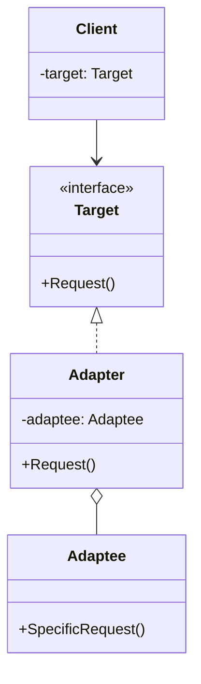
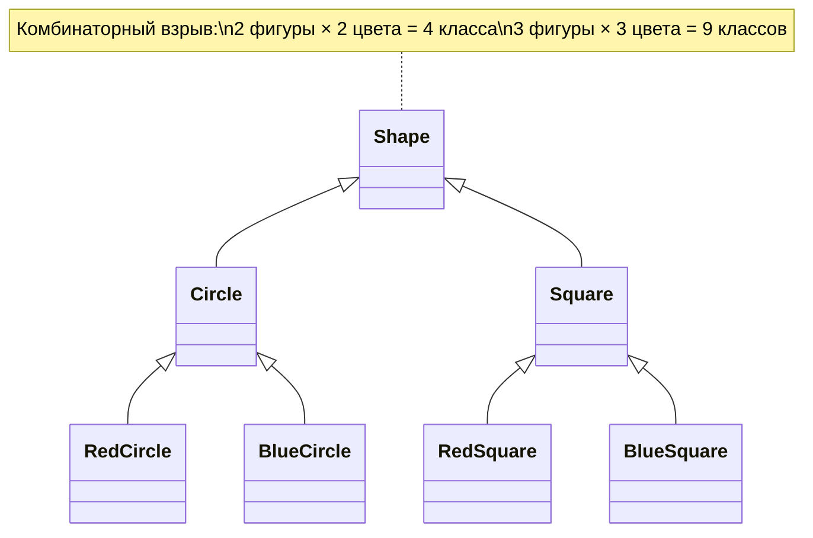
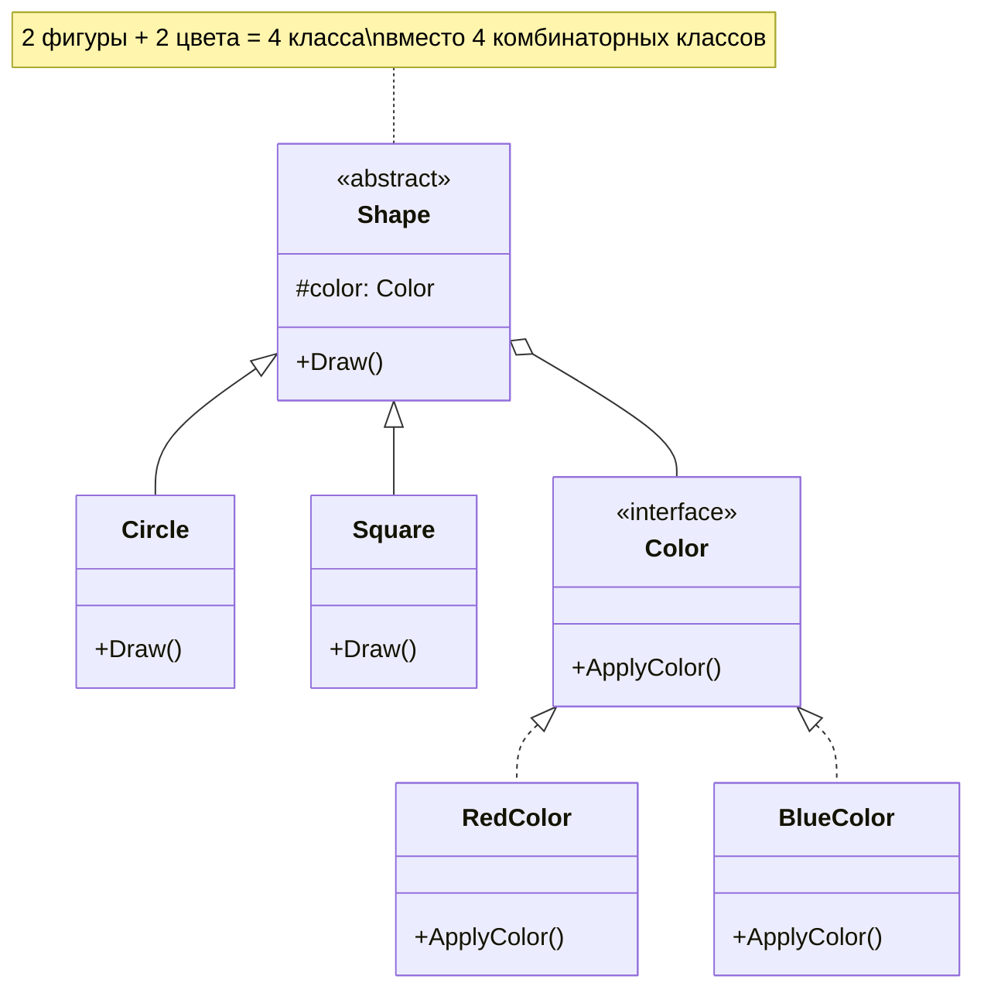

# Structural Patterns (Структурные паттерны)

## Введение

Structural Patterns (структурные паттерны) — это набор проектных решений, которые помогают организовывать классы и объекты в более крупные структуры, сохраняя при этом гибкость и эффективность архитектуры. Эти паттерны отвечают за построение удобных в поддержке иерархий классов и упрощают взаимодействие между компонентами системы.

В этой лекции мы рассмотрим семь ключевых структурных паттернов:

1. **Adapter (Адаптер)** — преобразование интерфейса одного класса в интерфейс, ожидаемый клиентом
2. **Bridge (Мост)** — разделение абстракции и реализации для их независимого изменения
3. **Composite (Компоновщик)** — древовидная структура для работы с объектами и группами объектов единообразно
4. **Decorator (Декоратор)** — динамическое добавление функциональности объектам
5. **Proxy (Прокси/Заместитель)** — контроль доступа к объекту через объект-заместитель
6. **Facade (Фасад)** — упрощённый интерфейс к сложной подсистеме
7. **Flyweight (Легковес/Приспособленец)** — эффективное разделение общих данных между множеством объектов

---

## 1. Adapter Pattern (Паттерн Адаптер)

### Определение

**Adapter (Адаптер)** — это структурный паттерн проектирования, который позволяет объектам с несовместимыми интерфейсами работать вместе. Адаптер выступает промежуточным слоем, преобразуя интерфейс одного класса в интерфейс, ожидаемый клиентом.

### Проблема

Представьте ситуацию: вы разрабатываете приложение для торговли на бирже. Приложение записывает логи операций в формате Markdown (`.md`). Через некоторое время вы находите отличную библиотеку для анализа логов, но она работает только с форматом JSON.

Вы не можете напрямую передать данные в Markdown-формате в библиотеку, ожидающую JSON. Переписывать библиотеку нельзя (она внешняя), переписывать всё приложение — долго и опасно. Здесь на помощь приходит Адаптер.

### Решение

Адаптер создаёт промежуточный объект, который:
- Принимает данные в одном формате (Markdown)
- Преобразует их в другой формат (JSON)
- Передаёт результат целевому объекту (библиотеке)

Это можно представить как переводчика на конференции: если один участник говорит только по-русски, а конференция проходит на английском, переводчик становится адаптером между ними.

### Терминология

- **Target (Целевой интерфейс)** — интерфейс, который ожидает клиент. Это тот контракт, к которому мы хотим адаптировать существующий класс.

- **Adaptee (Адаптируемый класс)** — существующий класс с несовместимым интерфейсом, который нужно адаптировать.

- **Adapter (Адаптер)** — класс-обёртка, который реализует целевой интерфейс и содержит экземпляр адаптируемого класса. Он перенаправляет вызовы от клиента к адаптируемому объекту, преобразуя данные по необходимости.

### Диаграмма классов



### Пример 1: Круглые колышки и квадратные отверстия

Рассмотрим классический учебный пример. Адаптер позволяет вставить квадратный колышек в круглое отверстие, преобразуя один интерфейс в другой.

#### Исходные классы с совместимыми интерфейсами

```csharp
// Круглое отверстие (Round Hole)
public class RoundHole
{
    private readonly double _radius;

    public RoundHole(double radius)
    {
        _radius = radius;
    }

    /// <summary>
    /// Получить радиус отверстия
    /// </summary>
    public double GetRadius()
    {
        return _radius;
    }

    /// <summary>
    /// Проверяет, подходит ли круглый колышек к отверстию
    /// </summary>
    /// <param name="peg">Круглый колышек для проверки</param>
    /// <returns>true, если колышек помещается в отверстие</returns>
    public bool Fits(RoundPeg peg)
    {
        // Колышек помещается, если его радиус не больше радиуса отверстия
        return this.GetRadius() >= peg.GetRadius();
    }
}

// Круглый колышек (Round Peg)
public class RoundPeg
{
    private readonly double _radius;

    public RoundPeg(double radius)
    {
        _radius = radius;
    }

    /// <summary>
    /// Получить радиус круглого колышка
    /// </summary>
    public double GetRadius()
    {
        return _radius;
    }
}
```

#### Несовместимый класс

```csharp
// Квадратный колышек (Square Peg) - несовместимый с круглым отверстием
public class SquarePeg
{
    private readonly double _width;

    public SquarePeg(double width)
    {
        _width = width;
    }

    /// <summary>
    /// Получить ширину стороны квадратного колышка
    /// </summary>
    public double GetWidth()
    {
        return _width;
    }
}
```

#### Адаптер

```csharp
/// <summary>
/// Адаптер позволяет использовать квадратные колышки с круглыми отверстиями.
/// Он наследуется от RoundPeg, чтобы быть совместимым с методом Fits() класса RoundHole.
/// </summary>
public class SquarePegAdapter : RoundPeg
{
    private readonly SquarePeg _peg;

    public SquarePegAdapter(SquarePeg peg) : base(0)
    {
        // Сохраняем ссылку на адаптируемый объект
        _peg = peg;
    }

    /// <summary>
    /// Вычисляет эквивалентный радиус для квадратного колышка.
    /// Используется теорема Пифагора: радиус окружности, описанной вокруг квадрата,
    /// равен половине диагонали квадрата.
    /// Формула: r = (width * √2) / 2
    /// </summary>
    public override double GetRadius()
    {
        // Диагональ квадрата по теореме Пифагора: d = width * √2
        // Радиус описанной окружности: r = d / 2
        return _peg.GetWidth() * Math.Sqrt(2) / 2;
    }
}
```

#### Клиентский код

```csharp
public class Program
{
    public static void Main()
    {
        Console.WriteLine("=== ДЕМОНСТРАЦИЯ ПАТТЕРНА ADAPTER ===\n");

        // Создаём круглое отверстие с радиусом 5
        RoundHole hole = new RoundHole(5);
        
        // Создаём круглый колышек с радиусом 5
        RoundPeg roundPeg = new RoundPeg(5);
        
        // Круглый колышек идеально подходит
        Console.WriteLine($"Круглый колышек (r=5) помещается в отверстие (r=5): {hole.Fits(roundPeg)}");
        // Вывод: True

        // Создаём квадратные колышки
        SquarePeg smallSquarePeg = new SquarePeg(5);
        SquarePeg largeSquarePeg = new SquarePeg(10);

        // hole.Fits(smallSquarePeg); // Ошибка компиляции! Несовместимые типы

        // Используем адаптеры для квадратных колышков
        RoundPeg smallSquareAdapter = new SquarePegAdapter(smallSquarePeg);
        RoundPeg largeSquareAdapter = new SquarePegAdapter(largeSquarePeg);

        // Проверяем, помещаются ли квадратные колышки через адаптеры
        Console.WriteLine($"Квадратный колышек (width=5) через адаптер: {hole.Fits(smallSquareAdapter)}");
        // Вывод: True (эквивалентный радиус ≈ 3.54, меньше 5)
        
        Console.WriteLine($"Квадратный колышек (width=10) через адаптер: {hole.Fits(largeSquareAdapter)}");
        // Вывод: False (эквивалентный радиус ≈ 7.07, больше 5)
    }
}

/*
Вывод программы:
=== ДЕМОНСТРАЦИЯ ПАТТЕРНА ADAPTER ===

Круглый колышек (r=5) помещается в отверстие (r=5): True
Квадратный колышек (width=5) через адаптер: True
Квадратный колышек (width=10) через адаптер: False
*/
```

### Ключевые особенности примера

1. **Адаптер не меняет существующий код**: Классы `RoundHole`, `RoundPeg` и `SquarePeg` остаются нетронутыми.

2. **Использование наследования**: Адаптер наследуется от `RoundPeg`, чтобы быть совместимым с методом `Fits()`.

3. **Преобразование данных**: Метод `GetRadius()` в адаптере преобразует ширину квадрата в эквивалентный радиус.

### Пример 2: Система логирования

Рассмотрим более практичный пример из реальной разработки.

#### Исходная ситуация

У вас есть приложение, которое использует PostgreSQL для хранения логов:

```csharp
/// <summary>
/// Существующий класс для работы с PostgreSQL (Adaptee)
/// Это legacy-код или внешняя библиотека, которую мы не можем изменить
/// </summary>
public class PostgresLogStorage
{
    /// <summary>
    /// Метод сохранения с конкретной сигнатурой PostgreSQL
    /// </summary>
    public void Save(string message, DateTime timestamp, int severity)
    {
        Console.WriteLine($"[PostgreSQL] Сохранение лога: {timestamp:yyyy-MM-dd HH:mm:ss} " +
                         $"[{severity}] {message}");
        // Здесь была бы реальная логика работы с БД
    }
}

/// <summary>
/// Новая библиотека для работы с Elasticsearch (Adaptee)
/// Имеет совершенно другой интерфейс
/// </summary>
public class ElasticSearchLogStorage
{
    /// <summary>
    /// Метод сохранения, который принимает специализированный объект
    /// </summary>
    public void Save(ElasticLogMessage message)
    {
        Console.WriteLine($"[Elasticsearch] Индексирование: {message.Timestamp:yyyy-MM-dd HH:mm:ss} " +
                         $"[{message.Level}] {message.Content}");
        // Здесь была бы реальная логика работы с Elasticsearch
    }
}

/// <summary>
/// Специализированный формат сообщений для Elasticsearch
/// </summary>
public class ElasticLogMessage
{
    public string Content { get; set; }
    public DateTime Timestamp { get; set; }
    public string Level { get; set; }
}
```

#### Целевой интерфейс

Вы хотите, чтобы всё приложение работало через единый интерфейс:

```csharp
/// <summary>
/// Target Interface — единый контракт для всех систем логирования
/// Это то, что ожидает клиентский код
/// </summary>
public interface ILogStorage
{
    /// <summary>
    /// Единый метод для сохранения лога
    /// </summary>
    void Save(LogMessage message);
}

/// <summary>
/// Стандартизированное сообщение лога в нашем приложении
/// </summary>
public class LogMessage
{
    public string Message { get; set; }
    public DateTime DateTime { get; set; }
    public Severity Severity { get; set; }
}

/// <summary>
/// Уровни серьёзности логов
/// </summary>
public enum Severity
{
    Info = 0,
    Warning = 1,
    Error = 2,
    Critical = 3
}
```

#### Адаптеры

```csharp
/// <summary>
/// Адаптер для PostgreSQL
/// Реализует ILogStorage и адаптирует PostgresLogStorage к нашему интерфейсу
/// </summary>
public class PostgresLogStorageAdapter : ILogStorage
{
    private readonly PostgresLogStorage _storage;
    
    public PostgresLogStorageAdapter(PostgresLogStorage storage)
    {
        // Композиция: храним ссылку на адаптируемый объект
        _storage = storage;
    }
    
    public void Save(LogMessage message)
    {
        // Преобразуем LogMessage в формат, понятный PostgreSQL
        _storage.Save(
            message.Message,
            message.DateTime,
            (int)message.Severity  // Преобразуем enum в int
        );
    }
}

/// <summary>
/// Адаптер для Elasticsearch
/// Реализует ILogStorage и адаптирует ElasticSearchLogStorage к нашему интерфейсу
/// </summary>
public class ElasticLogStorageAdapter : ILogStorage
{
    private readonly ElasticSearchLogStorage _storage;
    
    public ElasticLogStorageAdapter(ElasticSearchLogStorage storage)
    {
        _storage = storage;
    }
    
    public void Save(LogMessage message)
    {
        // Преобразуем LogMessage в ElasticLogMessage
        ElasticLogMessage elasticMessage = new ElasticLogMessage
        {
            Content = $"{message.DateTime:yyyy-MM-dd HH:mm:ss} [{message.Severity}] {message.Message}",
            Timestamp = message.DateTime,
            Level = message.Severity.ToString()
        };
        
        _storage.Save(elasticMessage);
    }
}
```

#### Клиентский код

```csharp
/// <summary>
/// Сервис логирования, который работает с ILogStorage
/// Он не знает о PostgreSQL или Elasticsearch — работает только с абстракцией
/// </summary>
public class LoggingService
{
    private readonly ILogStorage _storage;
    
    public LoggingService(ILogStorage storage)
    {
        _storage = storage;
    }
    
    public void LogError(string message)
    {
        LogMessage logMessage = new LogMessage
        {
            Message = message,
            DateTime = DateTime.Now,
            Severity = Severity.Error
        };
        
        // Вызываем единый интерфейс, не зная о конкретной реализации
        _storage.Save(logMessage);
    }
}

public class Program
{
    public static void Main()
    {
        Console.WriteLine("=== АДАПТЕР В СИСТЕМЕ ЛОГИРОВАНИЯ ===\n");

        // Создаём реальные объекты (adaptees)
        PostgresLogStorage postgresDb = new PostgresLogStorage();
        ElasticSearchLogStorage elasticDb = new ElasticSearchLogStorage();
        
        // Оборачиваем их в адаптеры
        ILogStorage postgresAdapter = new PostgresLogStorageAdapter(postgresDb);
        ILogStorage elasticAdapter = new ElasticLogStorageAdapter(elasticDb);
        
        // Создаём сервисы с разными хранилищами
        LoggingService postgresLogger = new LoggingService(postgresAdapter);
        LoggingService elasticLogger = new LoggingService(elasticAdapter);
        
        // Используем оба через единый интерфейс
        postgresLogger.LogError("Ошибка подключения к базе данных");
        elasticLogger.LogError("Таймаут API запроса");
        
        Console.WriteLine("\n✓ Оба хранилища работают через единый интерфейс!");
    }
}

/*
Вывод программы:
=== АДАПТЕР В СИСТЕМЕ ЛОГИРОВАНИЯ ===

[PostgreSQL] Сохранение лога: 2025-11-12 09:30:45 [2] Ошибка подключения к базе данных
[Elasticsearch] Индексирование: 2025-11-12 09:30:45 [Error] Таймаут API запроса

✓ Оба хранилища работают через единый интерфейс!
*/
```

### Адаптивный рефакторинг (Adaptive Refactoring)

Одно из ключевых применений Адаптера — это **адаптивный рефакторинг**, который позволяет проводить рефакторинг постепенно, в два этапа:

1. **Изменение абстракции** — создание нового интерфейса
2. **Изменение реализации** — постепенная миграция к новой реализации

#### Проблема

Представьте: вся ваша система использует синхронный API для логирования. Теперь вы хотите перейти на асинхронный API, но переписывать всё сразу — опасно и долго.

#### Решение через адаптер

**Шаг 1: Создаём новый интерфейс**

```csharp
/// <summary>
/// Новый асинхронный интерфейс
/// </summary>
public interface IAsyncLogStorage
{
    Task SaveAsync(LogMessage message);
}
```

**Шаг 2: Создаём адаптер**

```csharp
/// <summary>
/// Адаптер, который оборачивает синхронный ILogStorage
/// и предоставляет асинхронный интерфейс
/// </summary>
public class AsyncLogStorageAdapter : IAsyncLogStorage
{
    private readonly ILogStorage _storage;
    
    public AsyncLogStorageAdapter(ILogStorage storage)
    {
        _storage = storage;
    }
    
    public Task SaveAsync(LogMessage message)
    {
        // Вызываем синхронный метод и оборачиваем в Task
        _storage.Save(message);
        return Task.CompletedTask;
    }
}
```

**Шаг 3: Постепенная миграция**

```csharp
public class OrderService
{
    private readonly IAsyncLogStorage _storage;
    
    public OrderService(IAsyncLogStorage storage)
    {
        _storage = storage;
    }
    
    public async Task ProcessOrderAsync(Order order)
    {
        // Новый асинхронный код
        await _storage.SaveAsync(new LogMessage { Message = "Order processed" });
    }
}

public class Program
{
    public static async Task Main()
    {
        // Старая синхронная реализация
        ILogStorage syncStorage = new PostgresLogStorageAdapter(new PostgresLogStorage());
        
        // Оборачиваем в асинхронный адаптер
        IAsyncLogStorage asyncStorage = new AsyncLogStorageAdapter(syncStorage);
        
        // Новый код работает асинхронно, используя старую реализацию!
        OrderService orderService = new OrderService(asyncStorage);
        await orderService.ProcessOrderAsync(new Order());
        
        Console.WriteLine("✓ Постепенная миграция на async завершена!");
    }
}
```

### Комбинирование адаптеров

Адаптеры можно комбинировать, создавая цепочки преобразований:

```csharp
// Исходный объект
ILogStorage syncPostgres = new PostgresLogStorageAdapter(new PostgresLogStorage());

// Оборачиваем в асинхронный адаптер
IAsyncLogStorage asyncPostgres = new AsyncLogStorageAdapter(syncPostgres);

// Можно добавить ещё один уровень адаптации
// Например, адаптер для кэширования или логирования вызовов
```

### Применимость паттерна Adapter

Используйте Adapter когда:

1. **Нужно использовать сторонний класс с несовместимым интерфейсом**
   - Библиотека предоставляет API, не совместимый с вашим кодом
   - Вы не можете изменить библиотеку

2. **Требуется переиспользовать существующие подклассы**
   - У вас есть несколько подклассов с общей функциональностью
   - Расширить родительский класс невозможно
   - Адаптер позволяет добавить функциональность без дублирования кода

3. **Проводите адаптивный рефакторинг**
   - Постепенная миграция на новый API
   - Локализация изменений в одном месте

### Преимущества

- **Single Responsibility Principle**: Адаптер отделяет логику преобразования от бизнес-логики
- **Open/Closed Principle**: Можно добавлять новые адаптеры без изменения существующего кода
- **Локализация изменений**: Все преобразования сосредоточены в одном месте

### Недостатки

- Увеличивается количество классов в системе
- Может усложнить понимание кода из-за дополнительного уровня абстракции

---

## 2. Bridge Pattern (Паттерн Мост)

### Определение

**Bridge (Мост)** — это структурный паттерн проектирования, который разделяет один или несколько классов на две отдельные иерархии — **абстракцию** и **реализацию**, позволяя изменять их независимо друг от друга.

Мост реализует принцип композиции над наследованием (Composition over Inheritance), предотвращая комбинаторный взрыв классов при многомерном расширении функциональности.

### Проблема

Представьте, что у вас есть класс геометрических фигур `Shape` с подклассами `Circle` и `Square`. Теперь вы хотите расширить иерархию по цвету, чтобы иметь `Red` и `Blue` фигуры.

При использовании наследования вам придётся создать:
- `RedCircle`
- `BlueCircle`
- `RedSquare`
- `BlueSquare`

Это 4 класса. Добавление треугольника потребует ещё 2 класса (`RedTriangle`, `BlueTriangle`). Добавление зелёного цвета потребует 3 новых класса. Количество комбинаций растёт в геометрической прогрессии: **n × m классов**.



### Решение

Паттерн Мост предлагает **разделить две независимые оси изменчивости**:

1. **Абстракция высокого уровня** — что делает объект (фигура)
2. **Абстракция низкого уровня** — как это реализуется (цвет)

Вместо наследования используем **композицию**: фигура содержит ссылку на объект цвета.



Теперь у нас **n + m классов** вместо **n × m**!

### Пример 1: Система управления устройствами

Представим систему управления домашними устройствами (телевизоры, проекторы, медиа-плееры). Нам нужны разные типы управления (пульт, голосовое управление, мобильное приложение).

#### Низкоуровневая абстракция (Implementation)

```csharp
/// <summary>
/// Implementation — низкоуровневая абстракция (устройства)
/// Определяет базовые свойства любого управляемого устройства
/// </summary>
public interface IDevice
{
    bool IsEnabled { get; set; }
    int Channel { get; set; }
    int Volume { get; set; }
}
```

#### Конкретные реализации устройств

```csharp
/// <summary>
/// Телевизор — конкретная реализация устройства
/// </summary>
public class Tv : IDevice
{
    public bool IsEnabled { get; set; } = false;
    public int Channel { get; set; } = 1;
    public int Volume { get; set; } = 50;
    
    public override string ToString() => 
        $"TV: {(IsEnabled ? "ON" : "OFF")}, Ch={Channel}, Vol={Volume}";
}

/// <summary>
/// Проектор — конкретная реализация устройства
/// </summary>
public class Projector : IDevice
{
    public bool IsEnabled { get; set; } = false;
    public int Channel { get; set; } = 1;
    public int Volume { get; set; } = 30;
    
    public override string ToString() => 
        $"Projector: {(IsEnabled ? "ON" : "OFF")}, Ch={Channel}, Vol={Volume}";
}

/// <summary>
/// Медиа-плеер — конкретная реализация устройства
/// </summary>
public class MediaPlayer : IDevice
{
    public bool IsEnabled { get; set; } = false;
    public int Channel { get; set; } = 1;
    public int Volume { get; set; } = 40;
    
    public override string ToString() => 
        $"MediaPlayer: {(IsEnabled ? "ON" : "OFF")}, Ch={Channel}, Vol={Volume}";
}
```

#### Высокоуровневая абстракция (Abstraction)

```csharp
/// <summary>
/// Abstraction — высокоуровневая абстракция (управление)
/// Определяет операции, которые может выполнить пользователь
/// </summary>
public interface IControl
{
    void ToggleEnabled();
    void ChannelForward();
    void ChannelBackward();
    void VolumeUp();
    void VolumeDown();
}
```

#### Базовая реализация управления (Bridge)

```csharp
/// <summary>
/// Control — базовый мост между абстракцией управления и реализацией устройства
/// Это и есть "Мост" — он соединяет две иерархии через композицию
/// </summary>
public class Control : IControl
{
    // ЭТО КЛЮЧЕВОЙ МОМЕНТ: композиция вместо наследования
    // Мост соединяет высокоуровневую абстракцию (Control) 
    // с низкоуровневой абстракцией (IDevice)
    protected readonly IDevice _device;

    public Control(IDevice device)
    {
        _device = device;
    }

    /// <summary>
    /// Переключает состояние устройства (вкл/выкл)
    /// </summary>
    public virtual void ToggleEnabled()
    {
        _device.IsEnabled = !_device.IsEnabled;
    }

    /// <summary>
    /// Переключает канал вперёд
    /// </summary>
    public virtual void ChannelForward()
    {
        _device.Channel += 1;
    }

    /// <summary>
    /// Переключает канал назад
    /// </summary>
    public virtual void ChannelBackward()
    {
        _device.Channel -= 1;
    }

    /// <summary>
    /// Увеличивает громкость на 10 единиц
    /// </summary>
    public virtual void VolumeUp()
    {
        _device.Volume += 10;
    }

    /// <summary>
    /// Уменьшает громкость на 10 единиц
    /// </summary>
    public virtual void VolumeDown()
    {
        _device.Volume -= 10;
    }
    
    public override string ToString() => _device.ToString();
}
```

#### Расширенные варианты управления

```csharp
/// <summary>
/// Управление с логированием — расширение высокоуровневой абстракции
/// Демонстрирует возможность независимого расширения абстракции
/// </summary>
public class LoggingControl : Control
{
    public LoggingControl(IDevice device) : base(device) { }

    public override void ToggleEnabled()
    {
        bool oldState = _device.IsEnabled;
        base.ToggleEnabled();
        Console.WriteLine($"[LOG] Toggle: {oldState} -> {_device.IsEnabled} on {_device.GetType().Name}");
    }

    public override void VolumeUp()
    {
        int oldVolume = _device.Volume;
        base.VolumeUp();
        Console.WriteLine($"[LOG] Volume: {oldVolume} -> {_device.Volume} on {_device.GetType().Name}");
    }

    public override void ChannelBackward()
    {
        int oldChannel = _device.Channel;
        base.ChannelBackward();
        Console.WriteLine($"[LOG] Channel: {oldChannel} -> {_device.Channel} on {_device.GetType().Name}");
    }
}

/// <summary>
/// Управление с задержкой — ещё одно расширение абстракции
/// Полезно для устройств с медленным откликом
/// </summary>
public class DelayedControl : Control
{
    private readonly int _delayMs;

    public DelayedControl(IDevice device, int delayMs) : base(device)
    {
        _delayMs = delayMs;
    }

    public override void ToggleEnabled()
    {
        Thread.Sleep(_delayMs);  // Имитация задержки
        base.ToggleEnabled();
    }

    public override void VolumeUp()
    {
        Thread.Sleep(_delayMs);
        base.VolumeUp();
    }
}

/// <summary>
/// "Глючное" управление для демонстрации — иногда выполняет случайные действия
/// Показывает гибкость паттерна: можно создавать любые варианты управления
/// </summary>
public class FaultyControl : Control
{
    private readonly Random _random = new Random();

    public FaultyControl(IDevice device) : base(device) { }

    public override void ToggleEnabled()
    {
        TryFault();
        base.ToggleEnabled();
    }

    public override void ChannelForward()
    {
        TryFault();
        base.ChannelForward();
    }

    public override void VolumeUp()
    {
        TryFault();
        base.VolumeUp();
    }

    /// <summary>
    /// С вероятностью 50% случайно переключает устройство
    /// </summary>
    private void TryFault()
    {
        if (_random.NextDouble() < 0.5)
        {
            Console.WriteLine($"[FAULT] Случайное переключение!");
            _device.IsEnabled = !_device.IsEnabled;
        }
    }
}
```

#### Демонстрация работы

```csharp
public class Program
{
    public static void Main()
    {
        Console.WriteLine("=== ПАТТЕРН МОСТ: СИСТЕМА УПРАВЛЕНИЯ УСТРОЙСТВАМИ ===\n");

        // Создаём устройства (низкоуровневая абстракция)
        IDevice tv = new Tv();
        IDevice projector = new Projector();
        IDevice mediaPlayer = new MediaPlayer();

        Console.WriteLine("ИСХОДНОЕ СОСТОЯНИЕ:");
        Console.WriteLine($"  {tv}");
        Console.WriteLine($"  {projector}");
        Console.WriteLine($"  {mediaPlayer}\n");

        // СЦЕНАРИЙ 1: Обычное управление телевизором
        Console.WriteLine("--- СЦЕНАРИЙ 1: Обычное управление ТВ ---");
        IControl tvControl = new Control(tv);
        
        tvControl.ToggleEnabled();
        Console.WriteLine($"После включения: {tvControl}");
        
        tvControl.VolumeUp();
        tvControl.VolumeUp();
        Console.WriteLine($"После увеличения звука: {tvControl}");
        
        tvControl.ChannelForward();
        tvControl.ChannelForward();
        Console.WriteLine($"После переключения каналов: {tvControl}\n");

        // СЦЕНАРИЙ 2: Управление проектором с логированием
        Console.WriteLine("--- СЦЕНАРИЙ 2: Управление проектором с логированием ---");
        IControl projectorControl = new LoggingControl(projector);
        
        projectorControl.ToggleEnabled();
        projectorControl.VolumeUp();
        projectorControl.ChannelBackward();
        Console.WriteLine($"Итоговое состояние: {projectorControl}\n");

        // СЦЕНАРИЙ 3: Ключевое преимущество — независимое комбинирование
        Console.WriteLine("--- СЦЕНАРИЙ 3: Один тип управления для разных устройств ---");
        
        var devices = new IDevice[] { tv, projector, mediaPlayer };
        var controls = new IControl[] 
        { 
            new Control(tv), 
            new Control(projector), 
            new Control(mediaPlayer) 
        };

        foreach (var control in controls)
        {
            control.ToggleEnabled();
            control.VolumeUp();
        }

        foreach (var device in devices)
        {
            Console.WriteLine($"  {device}");
        }
        
        Console.WriteLine("\n✓ Все устройства управляются одинаково через единый интерфейс!");
        Console.WriteLine("✓ Можно легко добавить новое устройство БЕЗ изменения кода управления!");
        Console.WriteLine("✓ Можно легко добавить новый тип управления БЕЗ изменения устройств!");
    }
}

/*
Вывод программы:
=== ПАТТЕРН МОСТ: СИСТЕМА УПРАВЛЕНИЯ УСТРОЙСТВАМИ ===

ИСХОДНОЕ СОСТОЯНИЕ:
  TV: OFF, Ch=1, Vol=50
  Projector: OFF, Ch=1, Vol=30
  MediaPlayer: OFF, Ch=1, Vol=40

--- СЦЕНАРИЙ 1: Обычное управление ТВ ---
После включения: TV: ON, Ch=1, Vol=50
После увеличения звука: TV: ON, Ch=1, Vol=70
После переключения каналов: TV: ON, Ch=3, Vol=70

--- СЦЕНАРИЙ 2: Управление проектором с логированием ---
[LOG] Toggle: False -> True on Projector
[LOG] Volume: 30 -> 40 on Projector
[LOG] Channel: 1 -> 0 on Projector
Итоговое состояние: Projector: ON, Ch=0, Vol=40

--- СЦЕНАРИЙ 3: Один тип управления для разных устройств ---
  TV: ON, Ch=3, Vol=80
  Projector: ON, Ch=0, Vol=50
  MediaPlayer: ON, Ch=1, Vol=50

✓ Все устройства управляются одинаково через единый интерфейс!
✓ Можно легко добавить новое устройство БЕЗ изменения кода управления!
✓ Можно легко добавить новый тип управления БЕЗ изменения устройств!
*/
```

### Ключевые преимущества паттерна Мост

1. **Open/Closed Principle**: Можно добавлять новые устройства и типы управления независимо
2. **Protected Variations**: Изменения в устройствах не влияют на управление и наоборот
3. **Избежание комбинаторного взрыва**: n + m классов вместо n × m
4. **Независимое тестирование**: Устройства и управление тестируются раздельно

### Связь с другими паттернами

**Мост vs Адаптер:**
- **Мост** проектируется заблаговременно для независимого развития абстракций
- **Адаптер** добавляется постфактум для совместимости существующих классов

**Мост + Builder:**
```csharp
// Builder (директор) может работать с разными устройствами через Мост
public class SmartHomeDirector
{
    private readonly IDevice _device;

    public SmartHomeDirector(IDevice device)
    {
        _device = device;  // Мост к устройству
    }

    public void SetupCinemaMode()
    {
        _device.IsEnabled = true;
        _device.Volume = 30;
        _device.Channel = 10;
        Console.WriteLine($"Режим кинотеатра настроен для: {_device}");
    }
}
```

### Применимость

Используйте Мост когда:

1. **Существует несколько независимых измерений изменчивости**
   - Функциональность/Платформа
   - Абстракция/Реализация
   - Интерфейс/Бэкенд

2. **Нужно избежать "классового взрыва"**
   - Комбинации характеристик растут экспоненциально
   - Хотите использовать композицию вместо наследования

3. **Хотите изменять абстракцию и реализацию независимо**
   - Изменения в одной иерархии не влияют на другую
   - Можно разрабатывать части системы параллельно

