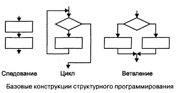
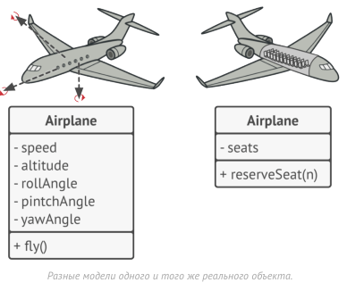
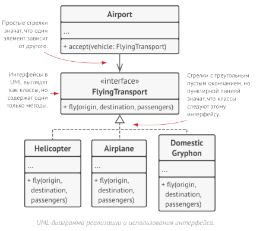
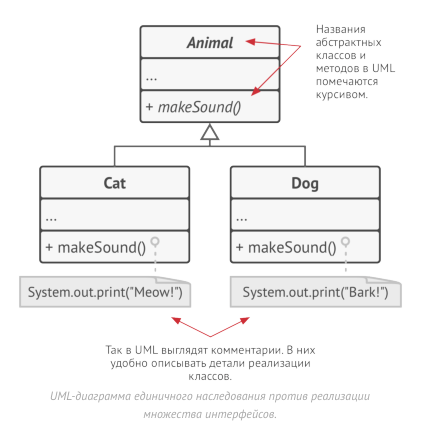

# Основы ООП

###### Примечание: в этом конспекте практически не будет пояснений или объяснений синтаксиса или фишек C#. 
###### Предполагается, что после года программирования на с++ будет достаточно просто перескочить на другой (тем более схожий язык). А все ответы на всевозможные можно найти в интеренете. 
###### Я на это иду, что сделать акцент именно на курсе по ООП, ведь курс у нас называется именно так, а не "ООП и C#" или же просто "C#".

### **Введение**

Изначально код писался как-то так:
```asm
0 VAR i
1 SET i 1
2 PRINT i
3 INC i
4 JIFLS i 10 2
```
, где:
- `VAR i` — объявление переменной
- `SET i 1` — присвоение
- `PRINT i` — вывод
- `INC i` — инкремент
- `JIFLS i 10 2` — “jump if less”, т.е. “перейти к строке 2, если i < 10”

На C# это будет выглядеть примерно так:
```csharp
for (var i = 1; i < 10; i++)
{
    Console.WriteLine(i);
}
```
Это так называемое "структурное" программирование. Мы представляем программу в виде набора каких-то блоков инструкций:


Если мы продолжим писать так какие-то более сложные программы, то получим следующий "спагетти"-код:
```csharp
var probability1 = Random.Shared.NextDouble();
var coefficient1 = probability1 > 0.5 ? 10d : 0;
var probability2 = Random.Shared.NextDouble();
var coefficient2 = probability2 > 0.5 ? 10d : 0;

var input = Console.ReadLine();
var value = input is null ? 0 : int.Parse(input);

var result = value * coefficient1 / coefficient2;
var message = $"result: {result}";
Console.WriteLine(message);
```
Здесь каждый кусочек перемешан: и ввод, и вычисления, и вывод.

Давайте немного изменим код:
```c#
var coefficient1 = CalculateCoefficient();
var coefficient2 = CalculateCoefficient();
var value = ReadValue();
var result = value * coefficient1 / coefficient2;
OutputResult(result);
```
То есть мы вынесли какие-то отдельные вычисления в функции/процедуры:
```csharp
static double CalculateCoefficient()
{ 
	var probability = Random.Shared.NextDouble(); 
	return probability > 0.5 ? 10d : 0; 
} 

static int ReadValue() 
{ 
	var input = Console.ReadLine(); 
	return input is null ? 0 : int.Parse(input); 
} 

static void OutputResult(double result) 
{ 
	var message = $"result: {result}"; 
	Console.WriteLine(message); 
}
```
, и теперь основной код стал чище и не представляет собой перемешанные в кучу блоки с разной логикой (хотя теперь уже сами блоки становятся вместе каким-то новым перемешанным в кучу блоком).

**❗*Интересный факт*❗**: Почему называется именно процедурное, а не функциональное? Название пошло из языков вроде Pascal и Fortran, где отдельно было понятие процедуры и отдельно понятие функции. Процедура выполняла действие, не возвращая значение. То есть это как функция типа void. Чем-то близко к математическому понятие функции: функци я что-то возвращает, а процедура - это просто какая-то последовательность команд. Функциональное программирование - это тоже парадигма, но другая.

А далее мы перейдём к так называемому "Объектно-ориентированному программированию (ООП)". Это и будет целью нашего курса. 

Мы научимся:
- объектно-ориентированному проектированию, 
- C#, 
- писать объектно-ориентированный код на объектно-ориентированном языке

То есть после процедурного подхода (где главная единица — функция) наше изучение перейдёт к объектно-ориентированному (где главная единица — объект, объединяющий данные и поведение).

***"Классы - это ещё не ООП"***

### **Основные концепции ООП (Краеугольные камни)** 

***Необходимая теория:***

- *Тип* – шаблон, описывающий какие данные и методы имеет объект

- *Объект* – экземпляр типа, существующий во время выполнения кода, занимающий память
  
- *Инвариант данных* – набор правил, определяющих корректное состояние данных.
  
- *Инвариант типа* – набор данных, их инварианта и поведений, позволяющих изменять эти данные согласно их инварианту.
  
- *Объект* (с точки зрения теории ООП) – совокупность атрибутов и поведений, реализация и данные которого скрыты от его конечного пользователя.
  
- *Mодуль* — автономная единица функциональности с собственным контрактом и инвариантами, имеющая публичный интерфейс и скрытую реализацию.
  
- *Модуль в ООП* - один объект или набор объектов, реализующих связную функциональность.
  
- *Контракт* — это набор правил, которые задают поведение типа или модуля. Он включает предусловия, постусловия и инварианты.
  
- Контракт формирует ожидания клиентов и границы допустимого поведения.

- *Контракт в ООП* – самое близкое понятие “интерфейса”: набора методов, которые должен реализовать тип.

- *Объектная модель* — это способ представить реальный мир в коде с помощью классов, объектов, их свойств и методов.

- Протёкшая абстракция - абстракция, для работы с которой, необходимо иметь знание о деталях её реализации.

***Концепции:***
##### 1) Абстракция

*Абстракция* — это упрощённая модель некоего объекта или явления
реального мира, откидывающая детали, несущественные в заданном контексте.

Когда вы пишете программу, используя ООП, вы представляете её части через объекты реального мира. Но объекты в программе не повторяют в точности их реальные аналоги, да и это редко когда нужно. Вместо этого, объекты программы всего лишь моделируют поведение реальных объектов, важных в том или ином контексте, а остальные
свойства реального объекта игнорируют.

Примеры: 
- Материальная точка в физике. Не всегда нужно учитывать тело полностью – иногда достаточно представить только движение. Например, это не нужно, если мы решаем задачу, где машина едет по дороге
- Стены в играх. Нам не нужно моделировать атомы – это была бы слишком тяжелая нагрузка на игровой движок – достаточно смоделировать полигоны, а внутри стен ничего не будет. Мы видим внешний фасад и нам не важно, что они полые - ведут они себя как настоящие
- Класс самолёта (plane) – для симулятора полётов и для сервиса бронирования мест понадобятся совершенно разные уровни детализации. В одном, например, нужны будут законы физики и внутреннее устройство кабины, а в другом только кресла.
  
Во всех этих случаях модель станет проще, но для нас ничего не изменится, а то, что мы ожидаем от этих вещей будет исполнено именно так как ожидается (понимание и поведение стены как стены или расчет времени, необходимого машине, чтобы куда-то доехать).

Абстракция:
- представляет собой “черный ящик” с точки зрения реализации 
- позволяет писать более простой код на более высоких уровнях абстракции
##### 2) Инкапсуляция

*Инкапсуляция* – принцип объединения атрибутов и поведений (данных и методов) в рамках одного типа. 

Другими словами инкапсуляция — это способность объектов скрывать часть своего состояния и поведения от других объектов, предоставляя внешнему миру только определённый интерфейс взаимодействия с собой, размещение в одном компоненте данных и методов, которые с ними работают.

Чем это отличается от абстракции? В абстракции мы избавляемся от несущественных деталей, а в инкапсуляции скрываем данные от пользователя, защищая их. Например, рассмотрим класс машины - уже не как материальной точки, а как просто как класс машины, на которой мы хотим ехать. 
Внутри этого класса могут такие части как: коленчатый вал, провода под капотом, двигатель, поршни и так далее - это то, что мы описали, однако водителю, чтобы просто поехать, знать об этом не нужно. Достаточно просто завести машину и использовать педали газа/тормоза. Нам не нужно вручную соединять провода под капотом, поворачивать коленчатый вал и поршни, запуская такт двигателя. Все эти детали сокрыты под капотом автомобиля. И согласитесь, без должного опыта, попытка завести двигатель вручную может окончится не очень хорошо.
То есть мы как бы описали модель автомобиля и то, чего мы от него хотим (абстракция), однако публичный интерфейс (то, что мы можем использовать) ограничили лишь самом базовым функционалом (инкапсуляция). Всё остальное скрыто под капотом и не может быть просто так использовано. 

Или же представьте, что мы написали банковское приложение. Если бы мы просто попытались изменить баланс, то мы могли бы сделать что-то вроде `wallet.Value -= 1000`, однако тогда бы возникла проблема, если бы мы попытались снять больше денег, чем у нас есть на балансе.
В инкапсуляции мы можем написать методы, которые ограничат наш доступ напрямую к кошельку и будут ограничивать наш функционал:

```C#
public class BankAccount 
{ 
	public decimal value; 
	
	public BankAccount(decimal value) 
	{ 
		_value = value; 
	} 
	
	public bool TryAccrue(decimal amount) 
	{ 
		if (amount > _value) 
			return false; 
		_value -= amount; 
		return true; 
	} 
}
```

То есть вместо того, чтобы снять деньги напрямую мы написали метод, который ***пытается*** снять наши деньги, и если у него это не получается, то он ничего не делает. Здесь мы не сможем, если что напортачить. 

Инкапсуляция:
- улучшает структурированность кода 
- локализует логику относительно данных которые она обрабатывает 
- упрощает процесс изменения кода 
- уменьшает возможность внести изменения ломающие инвариант типа

На идеях *абстракции* и *инкапсуляции* построены механизмы интерфейсов и абстрактных классов/методов большинства объектных языков программирования.

> Многих путает, что словом «интерфейс» называют и публичную часть объекта, и конструкцию interface из большинства языков программирования.

В объектном языке программирования, с помощью интерфейсов (обычно объявляемых через ключевое слово interface ) можно явно описывать «контракты» взаимодействия объектов.

Это как концепты в C++ - мы накладываем ограничения на класс (на его публичный интерфейс), которые мы точно хотим, чтобы у класса были. И если у него нет такого метода, например *лететь*, то он просто не удовлетворит нашим критериям и мы его не сможем посадить.

То есть просто можем задать заранее какие публичные методы (при необходимости и поля) будут у нашего класса, а затем работать с ними исходя из предположения, что все они у нас есть.

Например, мы можем создать интерфейс *ЛетающийТранспорт* с методом *лететь(откуда, куда, пассажиры)*, а затем описать класс *Аэропорт* с методом acceptFlyingTrasport, который принимает на посадку только объекты с этим интерфейсом. 
Теперь любой объект, реализующий интерфейс *ЛетающийТранспорт* с методом лететь — будь то *Самолёт* , *Вертолёт* или *ДрессированныйГрифон*, сможет работать с *Аэропортом*. 

Теперь мы можем как угодно менять код наших классов, которые следуют интерфейсу, пока они ему следуют, не беспокоясь о том, что у нас нарушится связь с аэропортом. Например можем добавить вертолёту метод *бегать* - он этого не перестанет иметь возможность сесть в аэропорту. Но если удалим метод *лететь*, то тогда да, связь разрушится.

В С# также есть свойства, чтобы каждый раз не писать кучу геттеров и сеттеров. Так называемые аксессоры:

Без свойств:
- нужно писать отдельный метод получения данных
- нужно содержать отдельное поле
Со свойствами: 
- Не нужно лишних методов
- Описывают хранимые данные и способы работы с ними
- Сохраняют “семантику поля”

```C#
public class BankAccount 
{ 
	private decimal _value;
	public decimal GetValue() => _value; 
	
	public bool TryAccrue(decimal amount)` 
	{
		if (amount > _value) 
			return false; 
		
		_value -= amount;
		return true; 
	}
}
```

Есть авто-свойства (аксессоры):

```C#
public class BankAccount 
{ 
	private decimal _value;
	public decimal GetValue() { get; private set; } 
	
	public bool TryAccrue(decimal amount)` 
	{
		if (amount > _value) 
			return false; 
		
		_value -= amount;
		return true; 
	}
}
```

Вычисляемые свойства:

```C#
public class ShoppingCart 
{ 
	public decimal TotalCost => Items.Sum(item => item.Cost); 
}
```

Таким образом локализация изменений данных позволяет упростить поддержание их инварианта
##### 3) Сокрытие 

*Сокрытие* - разграничение доступа различных частей программы ко внутренним компонентам друг друга. 

Это одна из концепций ООП, которую не всегда однако выделяют в отдельную категорию, иногда отождествляя её с инкапсуляцией. В одних языках (например, C++) термин тесно пересекается (вплоть до отождествления) с инкапсуляцией, в других (например, ML) эти понятия абсолютно независимы, а в некоторых языках (например, Python) сокрытие отсутствует, хотя возможности инкапсуляции развиты хорошо. 

Об этом можно думать так: сокрытие - это принцип или механизм, а инкапсуляция - это конкретная техника. 

Так, например, в C# реализовать сокрытие и ограничить доступ к данным и методам позволяют модификаторы доступа:
- public – доступ есть отовсюду
- private – доступ есть только внутри типа 
- protected – как private, но доступ также есть у дочерних типов 
- internal – доступ есть только в рамках текущей сборки (модуля)

```C#
public class BankAccount { 
	private decimal _value; 
	
	public BankAccount(decimal value) 
	{ 
		_value = value; 
	} 
	
	public bool TryAccrue(decimal amount)
	{ 
		if (amount > _value) 
			return false; 
		
		_value -= amount; 
		return true; 
	} 
} 

var acc = new BankAccount(0); 
acc._value = 1000; // Код не скомпилируется
```

То есть тут инкапсуляция и сокрытие работают. А, например, в питоне нет истинного сокрытия:

```Python
class BankAccount:
    def __init__(self, balance):
        self._balance = balance  

    def deposit(self, amount):
        if amount > 0:
            self._balance += amount

    def get_balance(self):
        return self._balance

acc = BankAccount(100)
acc.deposit(50)
print(acc.get_balance())  # 150
print(acc._balance)       # можно обратиться напрямую — нет настоящего сокрытия 
						  # Мы всё равно при желании можем обратиться к полю, так 
						  # что это не сокрытие. Хотя тут есть методы, так что 
						  # есть инкапсуляция. 
```
Условно можно считать, что если поля public, то нет сокрытия, а если не public, то оно есть. Инкапсуляция есть, когда мы методами ограничиваем доступ к полям, что не нарушить инвариант.  

Таким образом сокрытие принуждает пользователей использовать поведения, соответствующие бизнес-правилам

Инкапсуляция + сокрытие:
 - объединяя инкапсуляцию и сокрытие мы можем гарантировать соблюдение инварианта типа 
 - объединяя инкапсуляцию и сокрытие мы получаем *абстракцию*
##### 4) Наследование

Наследование — это возможность создание новых классов на основе существующих. 

Главная польза от наследования — повторное использование существующего кода. Расплата за наследование проявляется в том, что подклассы всегда следуют интерфейсу родительского класса. Вы не можете исключить из подкласса метод, объявленный в его родителе.

Наследование:
- наследование в C# поддерживают только классы
- в отличие от интерфейсов получаем и реализации базового класса 
- дочерние классы могут переопределять реализации родительских классов
- использовать для реализации полиморфизма
- не использовать для переиспользования бизнес логики
- наследование приводит к сильной связанности между типами
	- со временем становится сложнее разорвать эту связь 
	- код становится сложнее рефакторить

Виртуальные методы:
```C#
public class Car 
{ 
	public Point Location { get; protected set; } 
	
	public virtual void MoveTo(Point point) 
	{ 
		Console.WriteLine("Wroom-wroom!"); 
		Location = point; 
	} 
} 

public class FastCar : Car 
{ 
	public override void MoveTo(Point point) 
	{ 
		Console.WriteLine("Wroom-wroom (fast)"); 
		Location = point; 
	} 
}

```
Абстрактные методы:
```C#
public abstract class CarBase 
{ 
	public Point Location { get; protected set; } 
	
	public abstract void MoveTo(Point point); 
} 

public class FastCar : CarBase 
{ 
	public override void MoveTo(Point point) 
	{ 
		Console.WriteLine("Wroom-wroom (fast)"); 
		Location = point; 
	} 
}
```
Разница между виртуальными и абстрактными методами в том, что в одном случае мы можем не переопределять базовую реализацию, а в другом обязаны это сделать.

Вообще наследование - это отношения "is a". То есть, если мы наследуем кошку от животного, то получаем "cat *is an* animal". 

Однако применение наследования для переиспользования данных - это плохо:

Есть два класса:
```C#
public enum Suit { 
	Hearts, 
	Diamonds, 
	Clubs, 
	Spades, 
} 

public enum CardValue 
{ 
	Six, 
	Seven, 
	Eight, 
	Nine, 
	Ten, 
	Jack, 
	Queen, 
	King, 
	Ace, 
} 
```
Хотим создать класс Карта, Колода и Дилер:
```C#
public class Card { 
	public Card(Suit suit, CardValue value) 
	{ 
		Suit = suit; 
		Value = value; 
	} 
	
	public Suit Suit { get; } 
	public CardValue Value { get; }

} 

public class Deck { 
	public Deck(IReadOnlyCollection cards) { ... } 
	
	public IReadOnlyCollection Cards { get; } 
	
	public void Shuffle() { ... } 
} 

public class Dealer : Deck 
{ 
	public Dealer(IReadOnlyCollection cards) : base(cards) { } 
	
	public void StartGame() { 
		...
		Shuffle();
		... 
	} 
}
```
Здесь класс `Dealer` наследуется от `Deck`.
- `Deck` — это колода карт, она хранит список карт и умеет, например, перемешивать (`Shuffle()`).
- `Dealer` — это раздающий, то есть человек или сущность, которая управляет игрой, использует колоду, но сама не является колодой.

Почему это плохо?

1. Нарушение принципа “is-a” (является ли?) Наследование в ООП предполагает отношение «является»: Dealer is a Deck (Раздающий является колодой). Это неверно по смыслу. Раздающий имеет колоду, но не является колодой.
2. Наследование ради переиспользования кода — антипаттерн. Здесь наследование используется просто для того, чтобы унаследовать метод Shuffle(). Но наследование создаёт жёсткую связь: любые изменения в Deck могут поломать Dealer.
3. Плохая расширяемость. Если захотим, чтобы Dealer использовал несколько колод, или другую реализацию колоды, придётся ломать наследование и переписывать код. 


Вместо этого для переиспользования логики - используем композицию:


```C#
public class Dealer
{
    private readonly Deck _deck;

    public Dealer(Deck deck)
    {
        _deck = deck;
    }

    public void StartGame()
    {
        ...
        _deck.Shuffle();
        ...
    }
}
```
Теперь стало лучше:
1. Правильное отношение “has-a” (имеет): Dealer has a Deck. 
2. Композиция вместо наследования:
	1. Класс Dealer использует Deck как зависимость. 
	2. Легко заменить реализацию (Deck, TestDeck, CustomDeck и т.д.).
	3. Код становится гибким и устойчивым к изменениям.
3. Чёткое разделение ответственности:
	1. Deck отвечает за карты.
	2. Dealer — за процесс игры.

##### 5) Полиморфизм

Полиморфизм - принцип, который позволяет объектам разных классов проявлять разное поведение при вызове одного и того же метода.

Другими словами полиморфизм — это способность программы выбирать различные реализации, при вызове операций с одним и тем же названием. Ещё можно сказать, что, полиморфизм — это способность объектов притворяться чем-то другим.

Теперь, представьте, что мы поместили нескольких собак и котов в мешок. Затем, мы будем с закрытыми глазами вытаскивать их по одной из мешка. Вытянув зверушку, мы не знаем какого она класса. Но если её погладить, она точно издаст какой-то звук, зависящий от её класса.

Например, практически все животные умеют издавать звуки, поэтому мы можем объявить абстрактный метод издания звука в их базовом классе. Все подклассы должны будут реализовать этот метод по-своему.

```C#
bag = [new Cat(), new Dog()];

foreach (Animal a : bag)
	a.makeSound()
	
// Meow!
// Bark!
```

Здесь программе не известен конкретный класс объекта в переменной а , но благодаря специальному механизму, называемому полиморфизмом, будет запущен тот метод издания звуков, который соответствует реальному классу объекта.

Полиморфизм подтипов - отделение абстракции от реализации, позволяющее прозрачно использовать различные реализации, посредствам единого контракта

Реализация (наследование поведений): используются интерфейсы, в C# реализовывать интерфейсы могут как классы, так и структуры. Говорят, что тип реализует интерфейс (класс Car реализует интерфейс IMovable)

Наследование (наследование реализации): используются базовые классы, в C# одна структура не может быть унаследована от другой, либо от класса. Говорят, что класс является наследником другого класса, либо же его подклассом (класс FastCar является наследником класса Car)

Полиморфизм:
- подразумевает что логика, написанная один раз, может выполняться по разному
- в контексте ООП – полиморфизм подтипов 
- больше отделяем абстракцию от реализации

Рассмотрим такую вещь как интерфейсы. Интерфейсы:
- определяют только сигнатуры поведений
- не определяют реализаций
- являются контрактом к объекту типа который его реализует 
- зачастую называются абстракцией
```C#
public interface IMovable
{
	Point location { get; }

	void MoveTo(Point point);
}
```
```C#
public class Car : Imovable 
{
	public Point location { get; private set; }

	public void MoveTo(Point point)
	{
		Console.WriteLine("Wroom-wroom!");
		Location = point;
	}
}
```
```C#
public class Stone : Imovable 
{
	public Point location { get; private set; }

	public void MoveTo(Point point)
	{
		Console.WriteLine("Flop-flop!");
		Location = point;
	}
}
```
Интерфейсы:
- интерфейсы позволяют лучше структурировать вариативность логики
- полиморфизм позволяет избежать излишней условной логики
- полиморфизм позволяет моделировать вариативность логики представлением субъектов предметной области в виде типов, реализующих соответствующие им поведения
##### 6) Композиция

*Композиция* - способ создания одних типов на основе других, при помощи хранения объектов одних типов в объектах других типов. 

То есть объединение различного поведения в один объект.
```C#
public class SampleClass 
{ 
	public int _firstField; 
	public int _secondField; 
}
```

В отношениях между классами композиция — это отношение «часть-целое» между двумя объектами, когда один из них включает в себя другой. Особенность этого отношения заключается в том, что компонент может существовать только как часть контейнера. В UML композиция обозначается линией со стрелкой на одном конце и заполненным ромбом на другом. Ромб направлен в сторону контейнера, а стрелка — в сторону включаемого объекта.

Виды композиции:
- Ассоциация
- Агрегация

Обратите внимание на то, что в интернете вы можете найти информацию о том, что композиция - это вид ассоциации, а не наоборот. Так вот - это неправда. В интеренете куча непроверенной или плохой информации. У нас на курсе композиция более главная и это именно ассоциация является видом композиции

Вообще композиция - это отношения "has a". То есть если мы включаем несколько объектов, то имеем, например "Dealer *has a* deck"
##### 7) Агрегация

*Агрегация* - вид композиции, подразумевающий, что хранимые значения получаются извне.

То есть объект получает уже созданные данные.

```C#
public struct Point2D 
{
	public Point2D(double x, double y)
	{
		X = x;
		Y = y;
	 } 
	 
	 public double X { get; }
	 public double Y { get; } 
 } 
 
 var point = new Point2D(1, 2);  // { "X": 1, "Y": 2 }
```

В отношениях между классами агрегация — это менее строгий вариант композиции, когда один объект просто имеет ссылку на другой объект. Здесь контейнер не управляет жизненным циклом компонента. Компонент может существовать отдельно от контейнера. В UML агрегация изображается как композиция, но с пустым ромбом.

##### 8) Ассоциация

*Ассоциация* - вид композиции, подразумевающий, что хранимые значения создаются самим объектом.

То есть объект сам управляет циклом жизни своих объектов с данными (выделяет и освобождает память для них).

```C#
public class Car 
{ 
	private readonly Engine _engine; 
	private readonly Wheel[] _wheels; 
	
	public Car()
	{
	_engine = new Engine("V8"); 
	
	_wheels = Enumerable 
		.Range(0, 4)
		.Select(index > new Wheel(index))
		.ToArray();
	} 
} 

var car = new Car(); 
/* 
{ 
	"_engine": { 
	"Name": "V8" 
	}, 
	"wheels": 
		 {"Index": 0}, 
		 {"Index": 1}, 
		 {"Index": 2}, 
		 {"Index": 3} 
	 ] 
}
*/
```

В отношениях между классами ассоциация — это когда один объект использует другой, либо зависит от него. В UML ассоциация обозначается простой стрелкой, которая направлена в сторону зависимости. Двустороння ассоциация между объектами вполне допустима.


Агрегация vs ассоциация:
- агрегация:
	- более низкая связанность между вложенными и содержащими типами
	- мы не определяем как создаются вложенные объекты
- ассоциация
	- более высокая связанность между вложенными и содержащими типами
	- мы сами создаём вложенные объекты
### **Классы и структуры** **в С\#**

##### Классы 
```c#
public class SampleClass` 
{ 
	public int _firstField; 
	public int _secondField;
}
```

- ссылочные типы 
- данные объекта хранятся на куче 
- на стеке хранится только ссылка


##### Структуры 

```c#
public struct SampleStruct
{ 
	public int _firstField; 
	public int _secondField;
}
```

- значимые типы 
- данные хранятся там, где находится объект структуры


### **Имутабельность**

Имутабельность (в ООП) - свойство данных, не подразумевающее изменения. Используется в виде сокрытия мутабельных данных и имутабельности значений не требующих изменения.

Другими словами имутабельность — это свойство объекта, при котором его состояние не изменяется после создания.  В ООП реализуется с помощью инкапсуляции и объявления всех полей неизменяемыми (`readonly` или только `get`). Используется для обеспечения надёжности, предсказуемости и потокобезопасности данных.

> mutable - изменчивый
> immutable - неизменяемый

Если вдаваться в перевод, то мутабельность — это способность объекта изменяться после создания, тогда как имутабельность (неизменяемость) означает, что объект нельзя изменить после его создания

Пример излишней мутабельности:
```c#
public class StudentGroup
{
    public long Id { get; set; }
    public string Name { get; set; }
    public List<long> StudentIds { get; set; }

    public void AddStudent(long studentId)
    {
        if (StudentIds.Contains(studentId) is false)
            StudentIds.Add(studentId);
    }
}
```
Все свойства Id, Name, StudentIds публично изменяемы. Их может изменить любой внешний код, например, сделав `group.Id = -1` или `group.StudentIds.Clear()`

Пример минимизации мутабельности:
```c#
public class StudentGroup
{
    private readonly HashSet<long> _studentsIds;

    public StudentGroup(long id, string name)
    {
        Id = id;
        Name = name;
        _studentsIds = new HashSet<long>();
    }

    public long Id { get; }
    public string Name { get; set; }

    public IReadOnlyCollection<long> StudentIds => _studentsIds;

    public void AddStudent(long studentId)
    {
        _studentsIds.Add(studentId);
    }
}
```
Теперь `Id` — иммутабельное свойство (доступ только через `get`, а изначально задаётся в конструкторе), `_studentsIds` — приватное и readonly (никто снаружи не может заменить коллекцию) - вовне отдается только `IReadOnlyCollection<long>`, который нельзя модифицировать напрямую. Вместо этого добавление студентов идёт только через метод `AddStudent`, который контролирует логику и не допускает нарушения инварианта.

То есть:
- Не запрещаем изменения полностью,
- Но при этом контролируем изменения через методы класса.

### **Find/Get конвенции**

Теперь поговорим о семантике методов доступа к данным.

Предположим, что у нас есть класс пользователя с постами.  
```c#
public record Post(long Id, string Title, string Content);

public class User
{
    private readonly List<Post> _posts;

    public User(IEnumerable<Post> posts)
    {
        _posts = posts.ToList();
    }
}
```
Мы хотим добавить методы для поиска постов:
```c#
/*

Корректная семантика:

GetXxx — метод, который гарантированно возвращает объект.
Если объект не найден, то выбрасывает исключение.
Пример: GetPostById — пост должен существовать.

FindXxx — метод, который может вернуть null, если не найдено.
Пример: FindPostByTitle — пост может отсутствовать.
*/

public Post getPostById(long postId)
{
	return _posts.Single(x => x.Id.Equals(postId));
}

public Post? findPostByTitle(string title)
{
	return _posts.SingleOrDefault(x => x.Title.Equals(title));
}
```
А так делать не надо:
```c#
/*

Некорректная семантика:

findPostById использует метод .Single(), который выбрасывает исключение, если объект не найден. FindXxx метод не должен выбрасывать исключение.

getPostById использует метод .SingleorDefault(), который не выбрасывает исключение, если объект не найден, а вместо этого возвращает null. GetXxx метод должен выбрасывать исключение.
*/

public Post findPostById(long postId)
{
	return _posts.Single(x => x.Id.Equals(postId));
}

public Post? getPostByTitle(string title)
{
	return _posts.SingleOrDefault(x => x.Title.Equals(title));
}
```

### **Обработка исключений**

Давайте рассмотрим две основные ошибки, которые допускают при обработке ошибок:
1. Исключения не отражены в сигнатуре (протёкшая абстракция)
2. Неудачное выполнение операции - это исключительная ситуация

Пройдёмся по порядку:
> *1. Исключения не отражены в сигнатуре.  

Допустим у нас есть метод:
```c#
public void AddStudent(long id)
{
    if (_studentsIds.Count == Max)
        throw new InvalidOperationException("Limit reached");
}
```
По сигнатуре`void AddStudent(long id)`невозможно понять, что метод может выкинуть `InvalidOperationException`.
То есть пользователю класса придётся читать внутренний код или документацию, чтобы узнать об этом. Это усложняет использование и тестирование. Вспомним о понятии *протёкшей абстракции*, то есть когда, чтобы корректно использовать класс, нужно знать внутренние детали его реализации. Это не абстракция, а хрень.

В нашем примере — если метод выбрасывает исключение, то пользователь класса должен знать, какой тип исключения и в каких случаях он появится. Это значит, что внутренняя реализация “протекает наружу” — нарушается инкапсуляция.

***Поиск конкретного типа исключения и ситуации когда оно кидается приводит к протёкшей абстракции***

> *2. Неудачное выполнение операции - это исключительная ситуация*

Неудача в работе метода не всегда должна быть исключением. Например, представьте, что мы добавляем студентов в группу, после распреда. У нас могут, например, следующие сценарии:
- Студент уже есть в группе
- Студент попал не в тот поток
- В группе есть полный тёска
- Студент на найден (возможно ещё не добавили в ИСУ)
- Группа переполнена
- Пользователь - девушка, и в группе слишком много девушек (то есть мы же не хотим чтобы в одной группе было 20 девушек. Надо примерно одинаковое количество в каждую группу).
- и так далее

Всё это предсказуемые бизнес-сценарии. Это действительно может произойти и не очень хочется в таких ситуациях кидать исключение. Другое дело, что мы не смогли добавить студента, из-за того, что у нас легка база данных или же сломался сервер - вот тут уже нужны были бы исключения, как сигнал ошибки, но всё, что выше - это просто допустимый результат. 

Соответственно для таких случаев куда лучше возвращать какой-то осмысленный результат (result type), вместо того, чтобы бросать исключение (чем-то похоже на std::expected).

В качестве решение используется так называемый Result Pattern:

```c#
public abstract record AddStudentResult
{
    private AddStudentResult() { }

    public sealed record Success : AddStudentResult;
    public sealed record AlreadyMember : AddStudentResult;
    public sealed record StudentLimitReached(int Limit) : AddStudentResult;
}
```
У нас есть абстрактный record-класс AddStudentResult (абстрактный, чтобы объект этого класса нельзя было создать). То есть, от него можно только отнаследоваться.

Внутри класса приватный конструктор, а значит, что даже извне мы не сможем никак отнаследоваться. То есть, мы сможем создавать наследников только внутри класса (внутри фигурных скобок). Это нужно, чтобы мы создавали результаты как бы "на месте".

Соответственно, каждый результат отдельно наследуется от `AddStudentResult`: `Success` — всё ок, `AlreadyMember` — студент уже в группе, `StudentLimitReached` — достигнут лимит студентов и так далее. Причём, обратите внимание на то, что `StudentLimitReached` ещё и обладает аргументов` int limit`. То есть, помимо результата мы ещё можем вернуть лимит. В коде это может выглядеть примерно так:
```C#
AddStudentResult result = AddStudent(studentId);

switch (result)
{
    case AddStudentResult.Success:
        Console.WriteLine("Студент добавлен!");
        break;
    case AddStudentResult.AlreadyMember:
        Console.WriteLine("Студент уже в группе.");
        break;
    case AddStudentResult.StudentLimitReached(var limit):
        Console.WriteLine($"Достигнут лимит студентов: {limit}");
        break;
}
```

Давайте теперь посмотрим, как может выглядеть сам метод AddStudent:
```c#
public AddStudentResult AddStudent(long studentId)
{
    if (_studentsIds.Count.Equals(MaxStudentCount))
        return new AddStudentResult.StudentLimitReached(MaxStudentCount);

    if (_studentsIds.Add(studentId) is false)
        return new AddStudentResult.AlreadyMember();

    return new AddStudentResult.Success();
}
```
Теперь метод:
- не выбрасывает исключения для обычных ситуаций,
- возвращает конкретный результат, который можно проанализировать.

При этом сигнатура `AddStudentResult AddStudent` явно говорит нам о том, что функция возвращает какой-то результат, который надо проверить, а поэтому нет протёкшей абстракции и не нужно лезть в код, чтобы понять какие исключения кидает программа. Это куда более прозрачно.

Можно ещё так обрабатывать:
```c#
if (result is AddStudentResult.AlreadyMember)
{
    Console.WriteLine("Student is already member of specified group");
    return;
}

if (result is AddStudentResult.StudentLimitReached err)
{
    var message = $"Cannot add student to specified group, maximum student count of {err.Limit} already reached";
    Console.WriteLine(message);
    return;
}

if (result is not AddStudentResult.Success)
{
    Console.WriteLine("Operation finished unexpectedly");
    return;
}

Console.WriteLine("Student successfully added");
```
Теперь обработка краевых случаев куда дешевле и быстрее, чем бросать исключения.

***Используй исключения только для реальных ошибок (непредвиденных, технических), а для предсказуемых сценариев неудачи — Result Types.***

### **Value Objects**

Value Object (Объект-значение) — это фундаментальная концепция из Domain-Driven Design (DDD).

Nota: Domain driven design - проектирование, ориентированное на нужную нам предметную область.

Идея состоит в том, чтобы не использовать "сырые" примитивные типы (такие как decimal, string, int) для представления значимых для данного контекста задачи (домена) понятий (деньги, email, дистанция). Вместо этого мы создаем специализированные типы, которые инкапсулируют всю связанную с ними логику, проверки и правила (Money, Email, Distance)

Полное определение Value Object (VO) стоит на трех столпах:
1. ***Инкапсуляция инвариантов**:* VO сам отвечает за свою валидность. Нельзя создать "неправильный" VO.
   *Смысл*: VO сам следит за своей корректностью.
   *Пример*: Money не может быть отрицательным, Speed не может быть меньше 0.
   *Почему важно*: вызывающий код не может нарушить правила VO.
   *Реализация*: проверка в конструкторе или через статический метод Create()/TryCreate().
2. ***Неизменяемость (Immutability):*** После создания VO его внутреннее состояние нельзя изменить. Любая "модификация" (например, сложение) возвращает новый экземпляр VO.
   *Смысл*: после создания VO его состояние не меняется.
   *Пример*: если хотим увеличить Money, ты создаём новый объект:
   *Почему важно*: гарантирует, что VO безопасен для передачи между объектами, потоков, кэширования, и что инварианты не нарушаются случайно.
3. ***Равенство по значению (Value-Based Equality)***: Два VO равны, если их значения равны, а не если они указывают на одну и ту же область памяти. new Money(100, "USD") должен быть равен new Money(100, "USD").
   *Смысл*: два VO считаются равными, если все их поля равны, а не если они ссылаются на один объект в памяти.
   *Почему важно:* VO определяет концепцию, а не конкретный объект в памяти. Это позволяет использовать их в коллекциях, словарях и сравнивать бизнес-значения напрямую.

А теперь давайте рассмотрим это всё на конкретном примере.

Представим, что мы проектируем банковское приложение, где есть баланс каждого человека. Изначально мы бы писали как-то так:
```csharp
public class Account 
{
    public decimal Balance { get; private set; }

    public void Withdraw(decimal value)
    {
        if (value < 0)
            throw new ArgumentException("Value cannot be negative", nameof(value));

        Balance -= value;
    }
}
```
Вместо этого давайте создадим тип Money, который инкапсулирует все правила, касающиеся денег:
```c#
public struct Money
{
    public Money(decimal value)
    {
        if (value < 0)
        {
            throw new ArgumentException(
                "Value cannot be negative",
                nameof(value));
        }
  
        Value = value;
    }
  
    public decimal Value { get; }
  
    public static Money operator -(Money left, Money right)
    {
        var value = left.Value - right.Value;
        return new Money(value);
    }
}
```
Теперь при попытке создать отрицательную сумма `Money value = new Money(-100)` мы словим исключение, а значит, что никак не сможем передать в конструктор какого-либо класса, вроде `Account` отрицательное количество денег. 

Таким образом мы инкапсулировали всю логику работы с деньгами в отдельный специально предназначенный для этого класс.

Теперь в классе это будет выглядеть так:
```c#
public class Account
{
    // Тип Balance теперь явно Money, а не "какое-то число".
    public Money Balance { get; private set; }

    public Account(Money initialBalance)
    {
        Balance = initialBalance;
    }

    public void Withdraw(Money value)
    {
        // Account больше не думает о проверках. 
        // Он просто выполняет операцию, доверяя типу Money.
        // Вся логика (проверка на <0, проверка валют) 
        // уже внутри оператора '—' у Money.
        Balance -= value; 
    }
}
```

Однако здесь всё ещё что-то не то. Обратите внимание, что мы вернулись к нарушению паттерна результат: у нас протекшая абстракция и мы не знаем, что мы кидаем исключение.

Давайте объединим два паттерна вместе:

```c#
public class Account
{
    public Money Balance { get; private set; }
    
	public Account(Money value)
    {
        Balance = value;
    }

    public MoneyResult Withdraw(Money value)
    {
        if (Balance < value)
        {
            return MoneyResult.Failure("Insufficient funds");
        }

        
        Balance -= value;
        return MoneyResult.Success();
    }
}
```
Это идеальное сочетание двух паттернов!

Возможной захочется ещё добавить паттерн результата внутрь самого Value Object, однако это будет ошибкой:

Метод Withdraw находится в классе Account. Account — это Сущность (Entity), а не Value Object. У него есть жизненный цикл и изменяемое состояние (баланс). Бизнес-операция "Снятие" ожидаемо может провалиться по бизнес-причинам:
- "Недостаточно средств"
- "Счет заморожен"
- "Превышен дневной лимит"
Это не исключительные ситуации, а штатные бизнес-сценарии. Бросать Exception на "недостаточно средств" — плохой тон. Вот тут Result идеален.

Теперь рассмотрим, почему это плохая идея для самого Money:

Задача Value Object (VO) — гарантировать, что он никогда не может существовать в невалидном состоянии. Его конструктор проверяет инварианты.
- "Сумма не может быть отрицательной" — это инвариант.
Если программист пытается создать new Money(-10), это не "ожидаемый бизнес-сбой". Это баг. Ошибка. Код пытается сделать что-то, что концептуально невозможно в вашей доменной модели. В таких случаях нужно немедленно остановить выполнение через Exception.

Пример:
```C#
public class Money
{
    ...

    public static Result<Money> Create(decimal amount, string currency)
    {
        if (amount < 0)
        {
            return Result.Failure<Money>("Amount cannot be negative");
        }
        return Result.Success(new Money(amount, currency));
    }
}

// ТЕПЕРЬ ВЫЗЫВАЮЩИЙ КОД ВЫНУЖДЕН ПРОВЕРЯТЬ:
var amountResult = Money.Create(-10, "USD");
if (amountResult.IsSuccess)
{
    account.Withdraw(amountResult.Value);
}
else
{
    // Что делать? Логировать баг? Падать?
}
```

То есть, мы переложили ответственность за проверку инвариантов с Money на каждый участок кода, который его создает. И нужно каждый раз везде его проверять, а если у нас будет хотя бы несколько десятков таких методов, то это уже: а) нагружает код б) можем забыть проверку. Соответственно нужно каждый раз проверять.
Если же мы кидаем исключение, то мы сразу можем найти ошибку, а не в середине бизнес-операции

***Короче, мы просто создаём тип, который поддерживает для нас определённый инвариант***

### **Файловая структура**

Структура файлов проекта должна быть семантической, а не инфраструктурной для упрощенного поиска той или иной сущности.  На курсе мы будем придерживаться именно семантической

**Инфраструктурная**:
```
Project/
 ├─ Entities/
 │    ├─ Student.cs
 │    └─ User.cs
 ├─ Models/
 │    ├─ StudentInfo.cs
 │    └─ UserInfo.cs
 └─ Services/
      ├─ StudentService.cs
      └─ UserService.cs
```
Плюсы:
- Легко понять технологический стек, кто за что отвечает.

Минусы:
- Сложно найти все файлы, относящиеся к какой-то одной бизнес-сущности.
- Если проект большой, связь между слоями теряется (например, чтобы посмотреть весь функционал “Пользователя”, придётся открыть Entities, Models, Services)

**Семантическая**:
```
Project/
 ├─ Students/
 │    ├─ Entities/
 │    │    └─ Student.cs
 │    ├─ Models/
 │    │    └─ StudentInfo.cs
 │    └─ Services/
 │         └─ StudentService.cs
 └─ Users/
      ├─ Entities/
      │    └─ User.cs
      ├─ Models/
      │    └─ UserInfo.cs
      └─ Services/
           └─ UserService.cs
```
Плюсы:
- Всё, что относится к одной сущности, находится в одном месте.
- Легко искать и изменять функционал: если нужно изменить логику пользователя, смотришь только папку User.
- Поддерживает чистую архитектуру и DDD (Domain-Driven Design).
- Удобнее для новых разработчиков: они сразу видят «всё по Students» или «всё по Users».

Использовать инфрастуктурную не стоит. Если проект растёт, особенно с сложной бизнес-логикой, семантическая структура сильно облегчает поддержку и развитие.

(Забавный факт: стурктура этого репозитория - тоже семнатическая)