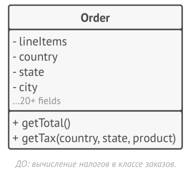
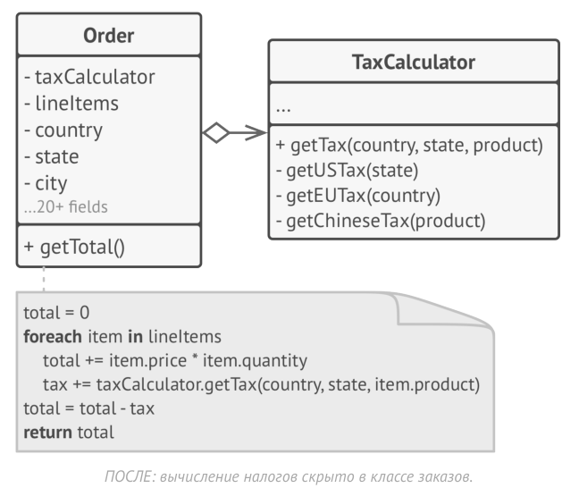
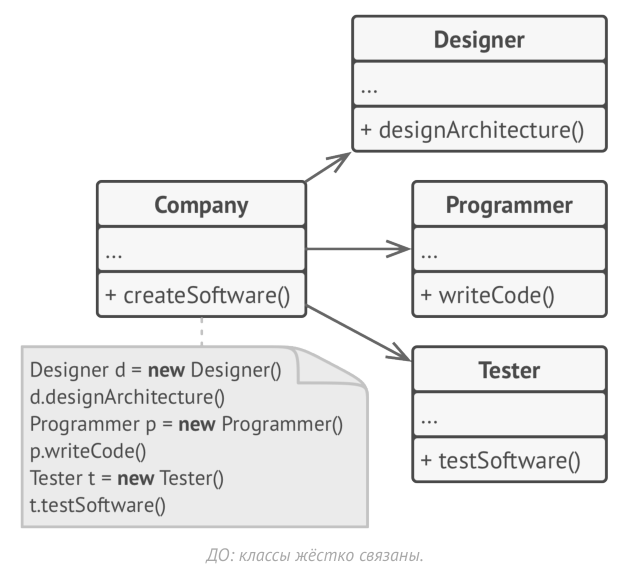
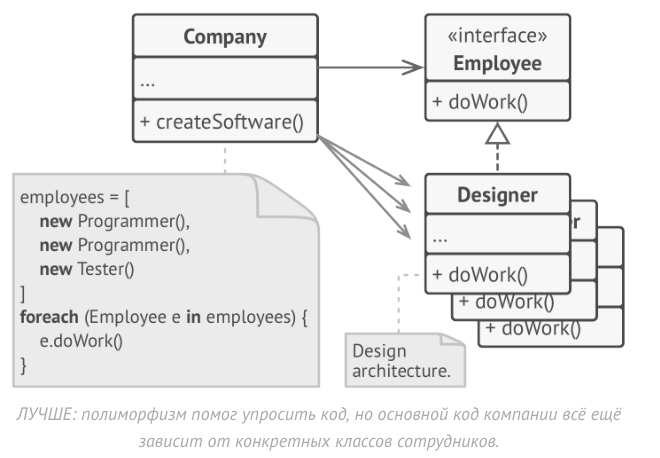
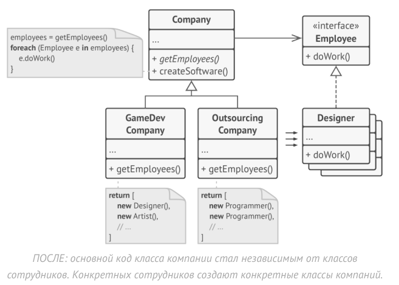
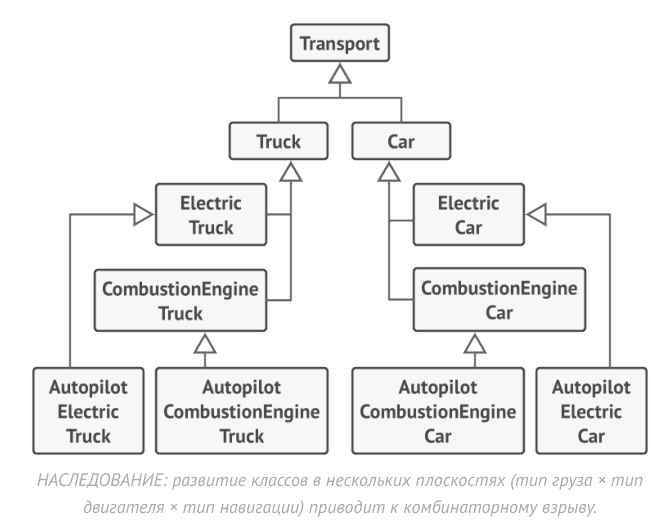
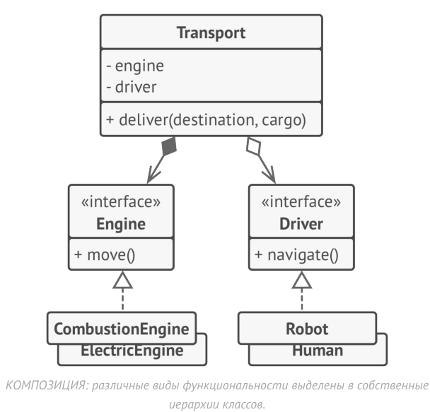

# Базовые принципы проектирования

Прежде чем перейти к изучению конкретных паттернов, давайте поговорим о самом процессе проектирования, о том к чему надо стремиться и о том, чего надо избегать.

### Качества хорошей архитектуры

#### 1. Повторное использование кода

Не секрет, что стоимость и время разработки это наиболее важные метрики при разработке любых программных продуктов. Чем меньше оба этих показателя, тем конкурентнее продукт будет на рынке и тем больше прибыли получит разработчик. Повторное использование программной архитектуры и кода — это один из самых распространённых способов снижения стоимости разработки. Логика проста: вместо того, чтобы разрабатывать что-то по втором уразу, почему бы не использовать прошлые наработки в новом проекте? 

Идея выглядит отлично на бумаге, но, к сожалению, не всякий код можно приспособить к работе в новых условиях. Слишком тесные связи между компонентами, зависимость кода от конкретных классов, а не более абстрактных интерфейсов, вшитые в код операции, которые невозможно расширить — всё это уменьшает гибкость вашей архитектуры и препятствует её повторному использованию.

На помощь приходят паттерны проектирования, которые ценой усложнения кода программы повышают гибкость её частей, упрощая дальнейшее повторное использование кода. Приведу цитату Эрика Гаммы, одного из первооткрывателей паттернов, о повторном использовании кода и роли паттернов в нём.

> Существует три уровня повторного использования кода. На самом нижнем уровне находятся классы: полезные библиотеки классов, контейнеры, а также «команды» классов вроде контейнеров/итераторов. 
> 
> Фреймворки стоят на самом верхнем уровне. В них важна только архитектура. Они определяют ключевые абстракции для решения некоторых бизнес-задач, представленных в виде классов и отношений между ними. Возьмите `JUnit`, это маленький фреймворк, даже базовый, я бы сказал. В нём есть всего несколько классов — `Test` , `TestCase` и `TestSuite` , а также связи между ними. Обычно, фреймворк имеет гораздо больший охват, чем один класс. Вы должны вклиниться в фреймворк, расширив какой-то из его классов. Всё работает по так называемому голливудскому принципу "не звоните нам, мы сами вам перезвоним". Фреймворк позволяет вам задать какое-то своё поведение, а затем сам вызывает его, когда приходит черёд что-то делать. То же происходит и в `JUnit`. Он обращается к вашему классу, когда нужно выполнить тест, но всё остальное происходит внутри фреймворка. 
> 
> Есть ещё средний уровень. Это то, где я вижу паттерны. Паттерны проектирования и меньше, и более абстрактные, чем фреймворки. Они, на самом деле, просто описание того, как парочка классов относится и взаимодействует друг с другом. Уровень повторного использования повышается, когда вы двигаетесь в направлении от конкретных классов к паттернам, а затем к фреймворкам.
>  
> Что ещё замечательно в этом среднем уровне так это то, что паттерны — это менее рискованный способ повторного использования, чем фреймворки. Разработка фреймворка — это крайне рисковая и дорогая инвестиция. В то же время, паттерны позволяют вам повторно использовать идеи и концепции в отрыве от конкретного кода

#### 2. Расширяемость

- Вы придумали идеальную архитектуру интернет-магазина, но через месяц пришлось добавить интерфейс для заказов по телефону. 
- Вы выпустили видео игру под Windows, но затем понадобилась поддержка macOS. обращается к вашему классу, когда нужно выполнить тест, но всё остальное происходит внутри фреймворка. 
- Вы сделали интерфейсный фреймворк с квадратными кнопками, но клиенты начали просить круглые.

Всё это примеры изменений программы. Изменения часто называют главным врагом программиста.

У каждого программиста есть дюжина таких историй. Есть несколько причин, почему так происходит:

1. банальны обновления. Просто добавляем новую фичу, о поддержке который мы не думали. Из-за этого не держали в голове при написании кода, что нужно оставлять место для этой фичи
2. все мы понимаем проблему лучше в процессе её решения. Нередко к концу работы над первой версией программы, мы уже готовы полностью её переписать, так как стали лучше понимать некоторые аспекты, которые не были очевидны вначале. Сделав вторую версию, вы начинаете понимать проблему ещё лучше, вносите ещё изменения и так далее — процесс не останавливается никогда, ведь не только ваше понимание, но и сама проблема может измениться со временем. 
3. изменения могут прийти извне. У вас есть идеальный клиент, который с первого раза сформулировал то, что ему надо, а вы в точности это сделали. Прекрасно! Но вот, выходит новая версия операционной системы, в которой ваша программа перестаёт работать. Чертыхаясь, вы лезете в код, чтобы внести кое-какие изменения

>  Можно посмотреть на это с оптимистичной стороны: если кто-то просит вас что-то изменить в программе, значит она всё ещё кому-то нужна, но думаю если вы будете на постоянной основе менять код очень долго, то вас просто уволят.

Вот почему всегда надо проектировать архитектуру и писать код с учётом будущих изменений.

### Базовые принципы 

Что такое хороший дизайн? По каким критериям его оценивать, и каких правил придерживаться при разработке? Как обеспечить достаточный уровень гибкости, связанности, управляемости, стабильности и понятности кода?

Всё это правильные вопросы, но для каждой программы ответ будет чуточку отличаться. Давайте рассмотрим универсальные принципы проектирования, которые помогут вам формулировать ответы на эти вопросы самостоятельно.

#### 1. Инкапсулируйте то, что меняется

> Определите аспекты программы, класса или метода, которые меняются чаще всего и отделите их того, что остаётся постоянным.

Этот принцип преследует цель уменьшить последствия, вызываемые изменениями. 

Представьте, что ваша программа — это корабль, а изменения — мины. Если бы корпус корабля представлял собой единый отсек, то как только корпус натыкался бы на мину, то появлялась бы пробоина, которая заполняла водой весь отсек. 

Поэтому корпус кораблей делят на несколько отсеков и если пробоина происходит в одном отсеке, то остальные отсеки остаются нетронутыми. Например, 3/7 отсеков затопило, но судно всё ещё на плаву.

Изолируя изменчивые части программы в отдельных модулях, классах или методах, вы уменьшаете количество кода, который затронут последующие изменения. Следовательно, вам нужно будет потратить меньше усилий на то, чтобы привести программу в рабочее состояние, отладить и протестировать изменившийся код. Где меньше работы, там меньше стоимость разработки. А где меньше стоимость, там и преимущество перед конкурентами.

##### Пример инкапсуляции на уровне метода

Представьте, что вы разрабатываете интернет-магазин. Где-то внутри вашего кода может существовать метод `getOrderTotal`, который рассчитывает финальную сумм заказа, учитывая размер налога. Мы можем предположить, что код вычиления налогов скорей всего будет часто меняться. Во-первых, логика начисления налога зависит от страны и даже города, в котором находится покупатель. К тому же размер налога не постоянен — власти могут менять его, когда вздумается. Из-за этих изменений вам постоянно придётся трогать метод `getOrderTotal`, который не особо интересуется деталями вычисления налогов.

```csharp
// ДО: правила вычисления налогов смешаны с основным кодом метода.

method getOrderTotal(order) is 
    total = 0
    foreach item in order.lineItems
        total += item.price * item.quantity

    if (order.county == "Russia")
        total -= total * 0.8
    else if (order.country == "Greece")
        total -= total * 0.21
    
    return total

// Вы можете перенести логику вычисления налогов в 
// собственный метод, скрыв детали от оригинального метода.
// ПОСЛЕ: размер налога можно получить, вызвав один метод

method getOrderTotal(order) is 
    total = 0
    foreach item in order.lineItems
        total += item.price * item.quantity

    total -= total * getTaxAmount(order.country)
    
    return total

method getTaxAmount(country) is 
    if (order.county == "Russia")
        return 0.8
    if (order.country == "Greece")
        return 0.21
    return total
```

Теперь изменения налогов будут изолированы в рамках одного метода. Более того, если логика вычисления налогов станет ещё более сложной, вам будет легче извлечь этот метод в собственный класс.

##### Пример инкапсуляции на уровне класса

Извлечь логику налогов в собственный класс? Если логика налогов стала слишком сложной, то почему бы и нет?



Объекты заказов станут делегировать вычисление налогов отдельному объекту-калькулятору налогов.



#### 2. Программируйте на уровне интерфейса

> Программируйте на уровне интерфейса, а не на уровне реализации. Код должен зависеть от абстракций, а не конкретных классов.

Гибкость архитектуры выражает в том, чтобы её можно было расширять, не ломая существующий код. Для примера рассмотрим класс котов. Класс `Кот` , который ест только мышек и сардельки, будет менее гибким, чем тот, что может есть любую еду (не *вообще* любую еду, вряд ли кот захочет съесть купастный лист). Но при этом, последнего можно будет кормить и мышками и сардельками, ведь они являются едой, а также ещё и например сухим кормом и собственными пледплечьями и щиколатками. Когда вам нужно наладить взаимодействие между двумя объектами разных классов, самое простое, что вы можете сделать, это сделать один класс зависимым от другого. 

Но есть и другой, более гибкий, способ.

1. Определите, что именно нужно одному объекту от другого, какие методы он вызывает.
2. Затем, опишите эти методы в отдельном интерфейсе.
3. Сделайте так, чтобы класс-зависимость следовал этому интерфейс. Скорей всего, нужно будет только добавить этот интерфейс в описание класса.
4. Теперь вы можете и сделать второй класс зависимым от интерфейса, а не конкретного класса.


Проделав всё это вы, скорей всего, не получите немедленной выгоды. Но зато в будущем, вы сможете использовать альтернативные реализации классов, не изменяя использующий их код.

##### Пример

Давайте рассмотрим ещё один пример, где работа на уровне интерфейса оказывается выигрышней привязки к конкретным классам. 

Представьте, что вы делаете симулятор компаний (какую-нибудь игру, аля Game Factory Simulator). У вас есть различные классы работников, которые делают ту или иную работу внутри компании.


Вначале класс компании жёстко привязан к конкретным классам работников. Несмотря на то, что каждый тип работников делает разную работу, мы можем свести их методы работы к одному виду, выделив для всех классов общий интерфейс. Сделав это, мы сможем применить полиморфизм в классе компании, трактуя всех работников единообразно через интерфейс `Employee`.



Тем не менее, наш симулятор компаний всё ещё не идеален. Наш класс компании остаётся привязанным к конкретным классам работников. Это не очень хорошо, особенно, если предположить, что нам понадобится реализовать ещё несколько видов компаний (компания по разработке, компания по трейдингу, компания-производитель полимеров и т. д.). Все эти компании будут отличаться тем, какие конкретно работники в них нужны. 

Мы можем сделать метод получения сотрудников в базовом классе компании абстрактным. Конкретные компании должны будут сами позаботиться о создании объектов сотрудников. А значит — каждый тип компаний сможет иметь собственный набор сотрудников.



После этого изменения, код класса компании стал окончательно независимым от конкретных классов. Теперь мы можем добавлять в программу новые виды работников и компаний, не внося изменений в основной код базового класса компаний. Кстати, вы только что увидели пример одного из паттернов, а именно — Фабричного метода. Мы ещё вернёмся к нему в дальнейшем.

*Nota*: Можно пойти ещё дальше и вновь вынести интерфейс самих компаний отдельно (`getEmployees()`)

#### 3. Предпочитайте композицию наследованию
Наследование — это самый простой и быстрый способ повторного использования кода между классами. У вас есть два класса с дублирующимся кодом. Создайте для них общий базовый класс и перенесите в него общее поведение. Что может быть проще? 

```cpp
// Пример: общий функционал вынесен в базовый класс
class Animal {
public:
    void eat() { std::cout << "Animal eats\n"; }
};

class Dog : public Animal {
public:
    void bark() { std::cout << "Dog barks\n"; }
};

class Cat : public Animal {
public:
    void meow() { std::cout << "Cat meows\n"; }
};

int main() {
    Dog d;
    d.eat();  // метод унаследован
    d.bark(); // собственный метод
}
```


Но у наследования есть и проблемы, которые стают очевидными только тогда, когда программа обросла классами и изменить ситуацию уже довольно тяжело. Вот некоторые их возможных проблем с наследованием.
- **Подкласс не может отказаться от интерфейса или реализации своего родителя.** Вы должны будете реализовать все абстрактные методы родителя, даже если они не нужны для конкретного подкласса.
```cpp
class Bird {
public:
    virtual void fly() = 0;
};

class Penguin : public Bird {
public:
    void fly() override { /* Пингвин не умеет летать, но обязан реализовать */ }
};
```
- **Переопределяя методы родителя, вы должны заботиться о том, чтобы не сломать базовое поведение суперкласса**. Это важно, ведь подкласс может быть использован в любом коде, работающим с суперклассом.
```csharp
public class Document
{
    protected string Text;
    protected string Metadata;
    public string SavedText { get; private set; }
    public string SavedMetadata { get; private set; }

    public Document(string text, string metadata)
    {
        Text = text;
        Metadata = metadata;
    }

    public virtual void Save()
    {
        SavedText = Text;
        SavedMetadata = Metadata;
    }
}

public class PdfDocument : Document
{
    public PdfDocument(string text, string metadata)
        : base(text, metadata)
    {
    }

    public override void Save()
    {
        SavedText = Text;
        // Забыли сохранить метадату
    }
}
```
- **Наследование нарушает инкапсуляцию суперкласса, так как подклассам доступны детали родителя**. Суперклассы могут сами стать зависимыми от подклассов, например, если программист вынесет в суперкласс какие-то общие детали подклассов, чтобы облегчить дальнейшее наследование.
```cpp
class Base {
protected:
    int internalState; // доступен всем наследникам
};

class Derived : public Base {
public:
    void modifyState() { internalState = 42; } // прямое вмешательство
};

```
- **Подклассы слишком тесно связаны с родительским классом**. Любое изменение в родителе может сломать поведение в подклассах.
```cpp
class Shape {
public:
    virtual void draw() = 0;
};

class Circle : public Shape {
public:
    void draw() override { std::cout << "Draw circle\n"; }
};

// Если добавить в Shape новый чисто виртуальный метод,
// все наследники (включая Circle) перестанут компилироваться.
```
- **Повторное использование кода через наследование может привести к разрастанию иерархии классов**. . 


У наследования есть альтернатива, называемая композицией. Если наследование можно выразить словом «является» (автомобиль является транспортом), то композицию — словом «содержит» (автомобиль содержит двигатель). 
```cpp
class Engine {
public:
    void start() { std::cout << "Engine started\n"; }
};

// Композиция: "Автомобиль содержит двигатель"
class Car {
private:
    Engine engine; // часть автомобиля
public:
    void drive() {
        engine.start();
        std::cout << "Car drives\n";
    }
};

int main() {
    Car car;
    car.drive(); // Автомобиль "содержит" двигатель
}
```
Этот принцип распространяется и на агрегацию — более свободный вид композиции, когда два объекта являются равноправными, и ни один из них не управляет жизненным циклом другого. Оцените разницу: автомобиль содержит и водителя, но тот может выйти и пересесть в другой автомобиль или вообще пойти пешком самостоятельно.
```cpp
class Driver {
public:
    void drive() { std::cout << "Driver drives\n"; }
};

// Агрегация: автомобиль имеет ссылку на водителя, но не владеет им
class Car {
private:
    Driver* driver; // указатель, но не владеем объектом
public:
    Car(Driver* d) : driver(d) {}
    void go() {
        if (driver) driver->drive();
        std::cout << "Car moves\n";
    }
};

int main() {
    Driver d;
    Car car(&d);
    car.go(); // Водитель управляет машиной
    // Водитель может "выйти" и управлять другой машиной
}
```

##### Пример

Возвращаясь к картинке выше, поговорим о том, как избежать комбинаторного взрыва, используя композицию. 

Предположим, вам нужно смоделировать модельный ряд автопроизводителя. У вас есть легковые автомобили и грузовики. Причём, они бывают с электрическим двигателем, и с двигателем на бензине. К тому же, они отличаются режимами навигации — есть модели с ручным управлением и автопилотом.


Как видите, каждый такой параметр приводит к умножению количества классов. Кроме того, возникает проблема дублирования кода, так как подклассы не могут наследовать нескольких родителей одновременно (во многих языках программирования). Решить проблему можно с помощью композиции / агрегации. Вместо того, чтобы объекты сами реализовывали то или иное поведение, они могут делегировать его другим объектам. Композиция даёт вам и другое преимущество: к примеру, теперь вы можете заменить тип двигатель автомобиля прямо во время выполнения программы, подставив в объект транспорта другой объект двигателя.



```csharp
using System;

// Интерфейс двигателя
public interface IEngine
{
    void Move();
}

// Реализации двигателей
public class CombustionEngine : IEngine
{
    public void Move() => Console.WriteLine("Moving with combustion engine");
}

public class ElectricEngine : IEngine
{
    public void Move() => Console.WriteLine("Moving with electric engine");
}

// Интерфейс водителя
public interface IDriver
{
    void Navigate();
}

// Реализации водителей
public class Human : IDriver
{
    public void Navigate() => Console.WriteLine("Human navigating");
}

public class Robot : IDriver
{
    public void Navigate() => Console.WriteLine("Robot navigating");
}

// Класс транспорта с композицией
public class Transport
{
    private IEngine _engine;
    private IDriver _driver;

    public Transport(IEngine engine, IDriver driver)
    {
        _engine = engine;
        _driver = driver;
    }

    public void Deliver(string destination, string cargo)
    {
        _driver.Navigate();
        _engine.Move();
        Console.WriteLine($"Delivering {cargo} to {destination}");
    }

    public void SetEngine(IEngine engine) => _engine = engine;
    public void SetDriver(IDriver driver) => _driver = driver;
}

// Пример использования
public class Program
{
    public static void Main()
    {
        Transport transport1 = new Transport(new CombustionEngine(), new Human());
        transport1.Deliver("City A", "Food");

        Transport transport2 = new Transport(new ElectricEngine(), new Robot());
        transport2.Deliver("City B", "Electronics");

        // Замена двигателя и водителя на лету
        transport1.SetEngine(new ElectricEngine());
        transport1.SetDriver(new Robot());
        transport1.Deliver("City C", "Medicines");
    }
}

```

Такая структура свойственна паттерну *Стратегия*, о котором мы тоже тоже поговорим в нашем курсе.